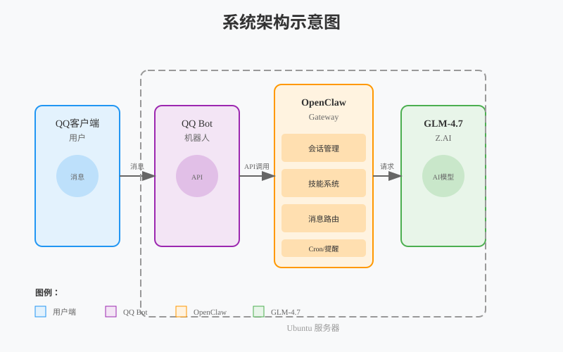

# 在Ubuntu上搭建专属AI助手：OpenClaw + GLM-4.7 + QQ Bot完整指南

> 用最本土化的大模型GLM-4.7，配合最便捷的即时通讯工具QQ，打造你的个人AI助手

## 前言

作为一个技术爱好者，你是否也想拥有一个专属的AI助手？能够随时随地在QQ上回答你的问题、执行任务、提醒重要事项？今天我将带你一步步在Ubuntu上搭建这样的系统。

我们将使用：
- **OpenClaw**: 强大的AI助手框架，支持多平台接入
- **GLM-4.7**: 智谱AI的本土化大模型，中文理解能力强
- **QQ Bot**: 最熟悉的即时通讯工具


*系统架构示意图（支持浏览器直接预览）*

## 准备工作

### 系统要求

- Ubuntu 20.04 或更高版本
- Node.js 22 或更高版本
- 至少 2GB 可用内存
- 稳定的网络连接

### 安装 Node.js

```bash
# 使用NodeSource仓库安装Node.js 22
curl -fsSL https://deb.nodesource.com/setup_22.x | sudo -E bash -
sudo apt-get install -y nodejs

# 验证安装
node -v  # 应该输出 v22.x.x
npm -v   # 应该输出 10.x.x
```


*Node.js安装完成*

## 第一步：获取GLM-4.7的API密钥

### 1. 注册Z.AI账号

访问 [Z.AI Open Platform](https://z.ai/model-api)，使用手机号或邮箱注册账号。

### 2. 订阅GLM Coding Plan

进入 [GLM Coding Plan](https://z.ai/model-api/glm-coding-plan) 页面，选择合适的套餐。个人用户推荐从免费套餐开始。

### 3. 创建API Key

1. 进入 [API Keys管理页面](https://z.ai/manage-apikey/apikey-list)
2. 点击"创建新的API Key"
3. 复制生成的密钥，**请妥善保管，只显示一次！**


*创建Z.AI API Key*

## 第二步：安装OpenClaw

OpenClaw是整个系统的核心框架，负责管理AI助手的生命周期和通信。

### 方法一：使用安装脚本（推荐）

```bash
# macOS/Linux一键安装
curl -fsSL https://openclaw.ai/install.sh | bash
```

### 方法二：通过npm手动安装

```bash
# 全局安装OpenClaw
npm install -g openclaw@latest

# 或使用pnpm（推荐，安装更快）
pnpm add -g openclaw@latest
pnpm approve-builds -g
```


*OpenClaw安装完成*

## 第三步：配置OpenClaw

安装完成后，启动配置向导：

```bash
openclaw onboard --install-daemon
```

### 配置步骤

1. **确认风险提示**
   ```
   I understand this is powerful and inherently risky. Continue?
   ```
   选择 `Yes` 继续

2. **选择配置模式**
   ```
   Onboarding mode
   ```
   选择 `Quick Start`（快速开始）

3. **选择模型提供商**
   ```
   Model/auth provider
   ```
   选择 `Z.AI`

4. **选择Coding Plan**
   ```
   选择 Coding-Plan-Global
   ```

5. **输入API Key**
   粘贴之前获取的Z.AI API Key，按回车确认


*OpenClaw配置向导*

6. **配置频道（Channels）**
   - 选择你需要的通信渠道
   - 后续我们会添加QQ Bot

7. **配置技能（Skills）**
   - 根据需求选择技能包
   - 推荐选择常用的技能：天气、提醒、搜索等

8. **启动方式**
   ```
   How do you want to hatch your bot?
   ```
   选择 `Hatch in TUI (recommended)` 在终端界面启动


*OpenClaw终端界面*

验证安装是否成功：

```bash
# 查看OpenClaw状态
openclaw status

# 应该看到类似的输出：
# Gateway: running
# Session: active
# Model: zai/glm-4.7
```

## 第四步：安装QQ Bot插件

OpenClaw通过插件系统支持QQ机器人。

### 1. 安装QQ Bot插件

```bash
# 方法一：通过OpenClaw插件命令安装
openclaw plugins install @sliverp/qqbot@latest

# 方法二：从源码安装
git clone https://github.com/sliverp/qqbot.git
cd qqbot
openclaw plugins install .
```

### 2. 配置QQ Bot

QQ Bot需要使用腾讯QQ开放平台的机器人API，采用长连接事件订阅机制。

#### 注册QQ开放平台账号

1. 访问 [腾讯QQ开放平台](https://open.qq.com/)
2. **注意**：不能直接用个人QQ号登录，需要单独注册开放平台账号
3. 完成实名认证（个人开发者）


*注册QQ开放平台*

#### 创建机器人应用

1. 进入"应用管理" → "创建应用"
2. 选择"机器人"类型
3. 填写应用信息：
   - 应用名称：给你的机器人起个名字
   - 应用简介：简单描述机器人功能
   - 应用图标：上传机器人头像

4. 提交审核，通常1-3个工作日通过

#### 获取机器人凭证

审核通过后，在应用详情页面获取：
- `AppID`
- `AppSecret`
- `机器人Token`


*获取机器人凭证*

#### 配置OpenClaw

编辑OpenClaw配置文件（通常在 `~/.openclaw/config.yaml`）：

```yaml
providers:
  qqbot:
    enabled: true
    appId: "你的AppID"
    appSecret: "你的AppSecret"
    botToken: "你的机器人Token"
    sandbox: false  # 正式环境设为false

channels:
  qqbot:
    enabled: true
    provider: qqbot
    # 可选：配置触发词、权限等
    capabilities:
      inlineButtons: "all"  # 启用内联按钮
```


*编辑配置文件*

## 第五步：启动和测试

### 启动OpenClaw Gateway

```bash
# 启动服务
openclaw gateway start

# 查看日志
openclaw gateway logs

# 查看状态
openclaw status
```

### 测试QQ Bot

1. 在QQ中搜索你的机器人（通过AppID或名称）
2. 发送好友申请
3. 通过后，发送消息测试

**测试命令示例**：

```
# 在QQ中发送：
你好

# 机器人应该回复：
你好！我是你的AI助手，有什么可以帮助你的吗？

# 尝试更复杂的任务：
帮我查一下北京的天气

# 或者设置提醒：
明天上午9点提醒我开会
```


*测试QQ Bot交互*

### 验证GLM-4.7模型

```bash
# 在OpenClaw TUI中查看当前模型
openclaw models list

# 应该看到：
# zai/glm-4.7 - Default model
```

## 高级配置

### 自定义模型配置

编辑 `~/.openclaw/config.yaml`，调整模型参数：

```yaml
agents:
  defaults:
    model: "zai/glm-4.7"
    temperature: 0.7
    maxTokens: 4096
    reasoning: "adaptive"  # 自适应推理模式
```

### 配置提醒功能（Cron）

OpenClaw支持定时任务和提醒：

```bash
# 添加一次性提醒
openclaw cron add --schedule "at:2026-02-18T09:00:00" \
  --session main \
  --payload '{"kind":"systemEvent","text":"9点开会！"}'

# 添加周期性提醒
openclaw cron add --schedule 'cron:"0 9 * * *"' \
  --session main \
  --payload '{"kind":"systemEvent","text":"早上好！新的一天开始了"}'
```

### 安装更多技能

查看可用技能：

```bash
# 列出已安装技能
openclaw skills list

# 从ClawHub安装新技能
clawhub search weather
clawhub install @openclaw/skill-weather
```

## 常见问题

### Q1: 安装失败，提示权限不足

**解决方法**：
```bash
# 使用sudo重新安装
sudo npm install -g openclaw@latest
```

### Q2: QQ机器人无法接收消息

**检查步骤**：
1. 确认OpenClaw Gateway正在运行：`openclaw status`
2. 查看日志：`openclaw gateway logs`
3. 检查配置文件中的凭证是否正确
4. 确认机器人已在QQ开放平台通过审核

### Q3: GLM-4.7 API调用失败

**解决方法**：
1. 检查API Key是否正确
2. 确认账户有足够的额度
3. 检查网络连接是否正常
4. 查看错误日志：`openclaw gateway logs | grep -i error`

### Q4: 如何重启OpenClaw服务

```bash
# 重启Gateway
openclaw gateway restart

# 或停止后启动
openclaw gateway stop
openclaw gateway start
```

### Q5: 如何更新到最新版本

```bash
# 更新OpenClaw
npm update -g openclaw@latest

# 更新插件
openclaw plugins update @sliverp/qqbot
```

## 性能优化建议

### 1. 调整模型参数

根据使用场景调整模型参数：

```yaml
# 快速响应场景（如简单问答）
temperature: 0.3
maxTokens: 1024

# 创意场景（如写作）
temperature: 0.9
maxTokens: 4096
```

### 2. 启用缓存

在配置文件中启用响应缓存：

```yaml
cache:
  enabled: true
  ttl: 3600  # 缓存1小时
```

### 3. 限制并发

控制同时处理的请求数量：

```yaml
gateway:
  maxConcurrentSessions: 5
```

## 安全建议

### 1. 保护API密钥

- 不要将API密钥提交到Git仓库
- 使用环境变量存储敏感信息
- 定期轮换API密钥

### 2. 限制机器人权限

```yaml
channels:
  qqbot:
    capabilities:
      allowedCommands: ["chat", "weather", "reminder"]
      # 不允许执行系统命令
    rateLimit:
      maxMessagesPerMinute: 30
```

### 3. 定期备份

```bash
# 备份配置文件
cp ~/.openclaw/config.yaml ~/.openclaw/config.yaml.backup

# 备份工作空间
tar -czf openclaw-backup-$(date +%Y%m%d).tar.gz ~/.openclaw/workspace
```

## 总结

通过以上步骤，你已经在Ubuntu上成功搭建了一个专属的AI助手，它能够：

✅ 通过QQ随时对话
✅ 使用强大的GLM-4.7模型理解中文
✅ 执行定时任务和提醒
✅ 扩展各种技能和功能
✅ 本地运行，数据更安全

这个系统的优势在于：
- **本土化**：GLM-4.7对中文理解深刻
- **便捷性**：QQ是最常用的即时通讯工具
- **隐私性**：本地运行，数据不经过第三方
- **扩展性**：通过插件系统轻松添加新功能

### 下一步建议

1. **探索更多技能**：访问 [ClawHub](https://clawhub.com) 发现更多技能
2. **自定义开发**：根据需求开发自定义技能
3. **多平台接入**：配置更多通信渠道（Telegram、微信等）
4. **团队协作**：配置群聊机器人，服务团队

### 参考资源

- [OpenClaw官方文档](https://docs.openclaw.ai)
- [QQ Bot GitHub](https://github.com/sliverp/qqbot)
- [Z.AI开发文档](https://docs.z.ai)
- [OpenClaw Discord社区](https://discord.gg/clawd)

---

**如有问题或建议，欢迎在评论区交流讨论！**

*最后更新：2026年2月17日*
