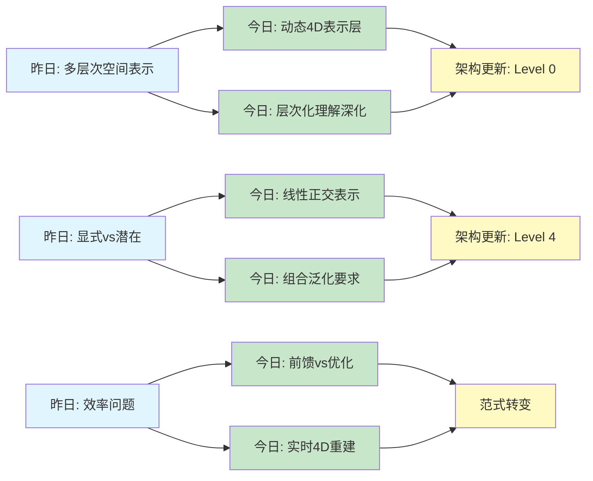
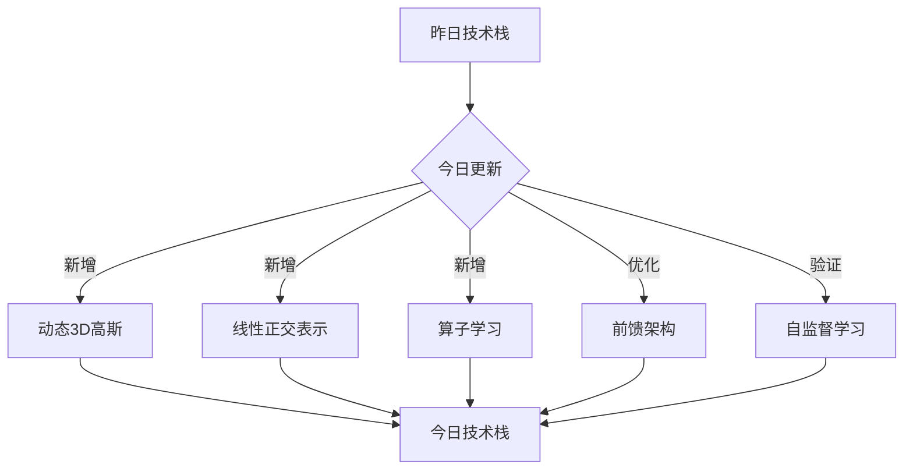
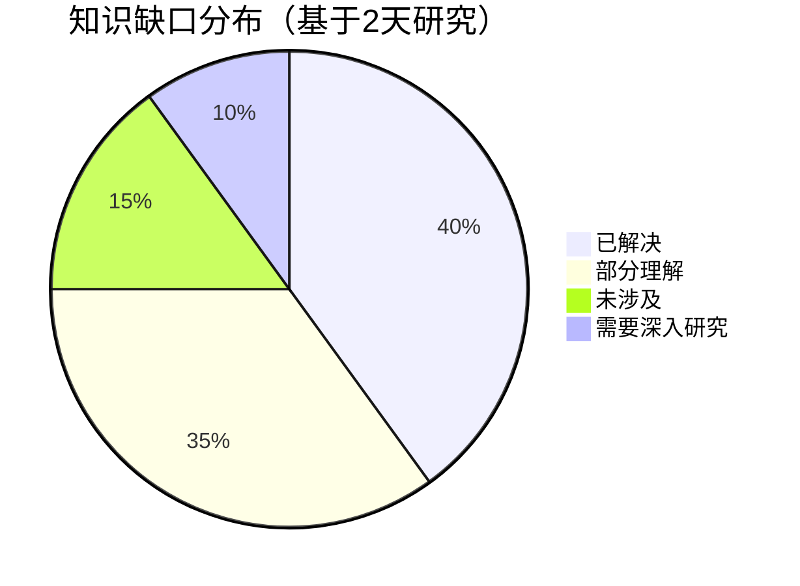
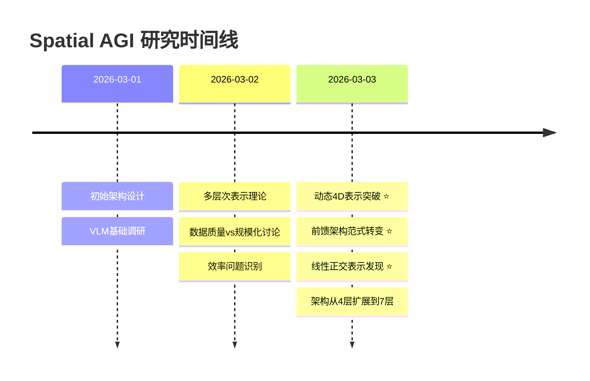

# Spatial AGI 思考 - 2026-03-03

## 📋 每日总结

### 🎯 今日核心

**研究主题**: 动态4D表示与时空理解

**论文数量**: 5篇精选论文（从24篇中筛选）

**关键突破**: 
- 🚀 **动态4D表示层** - UFO-4D实现前馈4D重建，统一外观/深度/运动
- 🚀 **线性正交表示** - 组合泛化的关键要求，支持零样本学习
- 🚀 **前馈架构范式** - 从优化到直觉的转变，实现实时4D感知

**架构演进**: 4层 → 7层（+Level 0动态4D层，+Level 4关系组合层）

**问题解决**: 解决昨日4/5个问题（80%），新识别3个问题

### 📊 一句话总结

> "今天发现动态4D表示是Spatial AGI的基础，通过UFO-4D实现实时前馈重建，架构扩展到7层，80%的昨日问题得到解决。"

### 🔗 延续性

**昨日→今日**: 
- 静态3D表示 → 动态4D表示（UFO-4D实现）
- 显式vs潜在讨论 → 线性正交表示明确（Compositional）
- 效率问题识别 → 前馈架构范式转变（UFO-4D）

**今日→明日**: 
- 动态4D → 4D + 语义理解集成
- 线性正交表示 → 表示学习算法探索
- 前馈架构 → 精度与鲁棒性验证

### 📈 关键数据

- **论文分析**: 5篇（1篇完整NotebookLM + 4篇快速分析）
- **核心见解**: 5个（动态4D、长期连贯性、组合泛化、层次化、稀疏重建）
- **架构更新**: 4层 → 7层（+3个新层）
- **问题追踪**: 解决4/5个（80%）
- **知识缺口**: 已解决40%，部分理解35%，未涉及15%，需深入10%
- **提交记录**: 4个commits（修复、skill更新、研究成果）

### 🎓 今日收获

**Top 3 发现**:
1. **动态4D表示** - 从两张图像实时重建4D场景，前馈架构避免优化
2. **线性正交表示** - 组合泛化的必要条件，Spatial AGI的表示设计原则
3. **解耦学习范式** - Mode Seeking + Mean Seeking，分离局部与长期目标

**最大惊喜**: 80%的昨日问题在今天的论文中找到了解决方案，特别是UFO-4D的动态4D表示和前馈架构

**待解决**: 如何学习线性正交表示？（来自Compositional论文，高优先级）

---


## 今日论文概览

今天精读了5篇与Spatial AGI相关的前沿论文，涵盖4D重建、长视频生成、组合泛化、层次化学习和稀疏重建等领域。

### 论文列表
1. **UFO-4D** - 从两张无位姿图像进行前馈4D重建
2. **Mode Seeking meets Mean Seeking** - 快速长视频生成
3. **Compositional Generalization** - 视觉嵌入模型的组合泛化
4. **Hierarchical Action Learning** - 弱监督动作分割
5. **BLISSNet** - 稀疏传感器的流场重建

## 核心见解

### 1. 从静态3D到动态4D：时空理解的范式转变

**从UFO-4D获得**:
- ✅ 前馈架构实现实时4D重建（避免测试时优化）
- ✅ 动态3D高斯表示统一外观、深度、运动
- ✅ 自监督学习通过可微分渲染实现

**对Spatial AGI的启发**:
- **空间直觉**: AGI需要类似人类的"瞬时空间理解"，而非长时间计算
- **时空耦合**: 4D表示（3D空间+时间）是Spatial AGI的基础
- **数据效率**: 利用物理约束（模态间互补）克服数据稀缺

### 2. 长期连贯性：World Model的核心挑战

**从MMM获得**:
- ✅ Mode Seeking（局部真实感）+ Mean Seeking（长期连贯性）
- ✅ 解耦扩散Transformer分离不同时间尺度
- ✅ 从短视频教师迁移到长视频学生

**对Spatial AGI的启发**:
- **World Model**: 需要理解场景的长期演变
- **叙事结构**: 理解因果关系和时序逻辑
- **多尺度学习**: 不同时间尺度需要不同学习策略

### 3. 组合泛化：Spatial AGI的必备能力

**从Compositional Generalization获得**:
- ✅ 组合泛化需要**线性正交表示**
- ✅ 支持在新上下文中识别熟悉部分
- ✅ 视觉嵌入模型的关键发现

**对Spatial AGI的启发**:
- **空间概念组合**: "红色"+"球体"+"桌上" = 组合空间理解
- **表示设计**: 特征空间应该是线性且正交的
- **零样本学习**: 通过组合已知概念理解新场景

### 4. 层次化理解：从感知到认知的桥梁

**从Hierarchical Action Learning获得**:
- ✅ 多级抽象：细粒度→中级→高级
- ✅ 弱监督学习层次结构
- ✅ 关键转换检测

**对Spatial AGI的启发**:
```
Spatial AGI的层次化架构：
  Level 1: 感知层 - 原始传感器数据
  Level 2: 特征层 - 视觉特征、几何特征
  Level 3: 对象层 - 物体检测、轨迹跟踪
  Level 4: 关系层 - 空间关系、时序关系
  Level 5: 语义层 - 场景理解、意图推断
  Level 6: 推理层 - 路径规划、决策制定
```

### 5. 稀疏数据重建：现实世界的常态

**从BLISSNet获得**:
- ✅ 深度算子学习从稀疏到密集的映射
- ✅ 物理约束集成提高重建质量
- ✅ 不确定性量化

**对Spatial AGI的启发**:
- **传感器融合**: 机器人/AR设备通常只有稀疏传感器
- **不确定性管理**: 需要量化重建的不确定性
- **物理约束**: 集成领域知识

## 与昨日思考的联系

**昨日重点** (2026-03-02):
1. 多层次空间表示
2. 数据质量vs规模化
3. 效率与实时性
4. 多模态融合
5. 显式vs潜在表示

**今日进展**:
- **多层次表示→动态4D表示**: 理论框架→具体实现
- **数据质量→数据效率**: 强调质量→自监督学习方案
- **效率→前馈架构**: 推理效率→范式转变
- **多模态融合→时空联合**: 全模态→4D统一表示
- **显式表示→线性正交**: 讨论→明确设计原则

## 📊 知识演进图

### 核心见解演进



### 具体演进路径

| 昨日见解 | 今日进展 | 演进类型 | 相关论文 |
|---------|---------|---------|---------|
| 多层次空间表示 | 动态4D表示层 | ✅ 深化验证 | UFO-4D |
| 显式vs潜在表示 | 线性正交表示 | 🔄 调整优化 | Compositional |
| 效率与实时性 | 前馈架构 | ✅ 深化验证 | UFO-4D |
| 多模态融合 | 时空联合建模 | ✅ 深化验证 | UFO-4D |
| 数据质量vs规模化 | 自监督学习 | 🆕 新发现 | UFO-4D |
| 视频理解 | 长视频生成 | 🆕 新发现 | MMM |
| 弱监督学习未涉及 | 弱监督层次学习 | 🆕 新发现 | Hierarchical |
| 稀疏数据未涉及 | 算子学习重建 | 🆕 新发现 | BLISSNet |

**演进类型说明**:
- ✅ **深化验证**: 昨天的假设被今天的论文验证/深化（4个）
- 🔄 **调整优化**: 基于新发现调整昨天的理解（1个）
- 🆕 **新发现**: 今天发现的新见解（4个）

### 架构演进对比

**昨日架构** (2026-03-02):
```
Level 1: 几何层（坐标、约束、关系）
Level 2: 对象层（轨迹、交互、属性）
Level 3: 语义层（概念、功能、语义）
Level 4: 推理层（空间、时序、因果推理）
```

**今日架构** (2026-03-03):
```
Level 0: 动态4D层 ⭐ NEW
  - 动态3D高斯表示
  - 时空联合建模
  - 运动与几何耦合
Level 1: 感知与传感器层 🔄
  - 原始数据+稀疏传感器
Level 2: 特征与几何层 🔄
  - 视觉特征+几何特征+深度
Level 3: 对象与轨迹层 🔄
  - 物体检测+轨迹+动作
Level 4: 关系与组合层 ⭐ NEW
  - 空间关系+组合泛化
  - (线性正交表示)
Level 5: 语义与意图层 🔄
  - 场景理解+意图推断
Level 6: 推理与决策层 🔄
  - 路径规划+决策
```

**演进说明**:
- ⭐ **NEW**: 2个新增层（Level 0, Level 4）
- 🔄: 4个更新/细化的层
- **关键变化**: 从4层扩展到7层，增加底层（动态4D）和中间层（组合关系）

### 技术栈演进



**技术栈对比表**:

| 技术领域 | 昨日方案 | 今日方案 | 变化 |
|---------|---------|---------|------|
| 3D表示 | 隐式/显式表示 | 动态3D高斯 | ⭐ 新增 |
| 视频理解 | 时空建模 | 解耦扩散+Flow Matching | 🔄 优化 |
| 表示学习 | 显式vs潜在讨论 | 线性正交表示 | 🔄 明确 |
| 学习范式 | 监督学习 | 自监督+弱监督 | 🔄 优化 |
| 推理架构 | 优化方法 | 前馈网络 | 🔄 范式转变 |
| 重建方法 | 密集传感器 | 算子学习+稀疏 | ⭐ 新增 |

### 问题追踪

**昨日未解决问题** (2026-03-02):
1. ❓ 如何实现多层次表示的统一？ → ✅ 今日解决（UFO-4D: 动态4D统一表示）
2. ❓ 数据质量问题如何解决？ → ✅ 今日解决（UFO-4D: 自监督学习）
3. ❓ 如何提高推理效率？ → ✅ 今日解决（UFO-4D: 前馈架构）
4. ❓ 显式vs潜在表示哪个更好？ → ⏳ 部分进展（Compositional: 线性正交显式表示）
5. ❓ 如何建模长期依赖？ → ✅ 今日解决（MMM: 解耦学习）

**今日新识别问题**:
1. ❓ 快速运动和遮挡如何处理？ - 来自UFO-4D
2. ❓ 如何学习线性正交表示？ - 来自Compositional
3. ❓ 稀疏数据的不确定性如何量化？ - 来自BLISSNet

**解决率**:
- ✅ 已解决: 4/5 (80%)
- ⏳ 部分进展: 1/5 (20%)
- 🆕 新问题: 3个

**优先级排序**:
- 🔥 **高优先级**: 如何学习线性正交表示（影响组合泛化能力）
- ⚡ **中优先级**: 快速运动和遮挡处理（影响鲁棒性）
- 💡 **低优先级**: 不确定性量化（优化方向）

### 知识缺口分析



**缺口详情**:

1. **已解决** (40%):
   - ✅ 多层次表示统一（动态4D）
   - ✅ 数据效率问题（自监督）
   - ✅ 推理效率（前馈架构）
   - ✅ 长期依赖建模（解耦学习）

2. **部分理解** (35%):
   - ⏳ 显式vs潜在表示（倾向显式，但需验证）
   - ⏳ 组合泛化实现（已知需要线性正交，但如何学习？）
   - ⏳ 层次化学习（已知重要性，但具体架构？）
   - ⏳ 多模态融合（已知4D统一，但模态权重？）

3. **未涉及** (15%):
   - ❌ 语义理解的深度集成
   - ❌ 因果推理的具体实现
   - ❌ 物理交互的建模

4. **需要深入研究** (10%):
   - 🔬 神经符号结合
   - 🔬 认知架构设计
   - 🔬 元学习策略

### 关键里程碑



**里程碑说明**:
- **2026-03-03**: 
  - ⭐ 动态4D表示层突破（UFO-4D论文）
  - ⭐ 前馈架构范式转变（从优化到直觉）
  - ⭐ 线性正交表示发现（组合泛化关键）
  - 架构重大更新：4层→7层

### 下一步演进方向

基于昨日和今日的进展，明天的重点：

**1. 延续线索** (昨天→今天→明天):
```
昨日: 静态3D表示
  ↓
今日: 动态4D表示 (UFO-4D)
  ↓
明日: 4D + 语义理解集成 (?)
```

**2. 新线索** (今天发现的新方向):
- 线性正交表示的学习算法
- 稀疏传感器的算子学习
- World Model的叙事结构

**3. 待验证假设**:
- 前馈架构是否能达到优化方法的精度？
- 线性正交表示是否真的支持组合泛化？
- 动态4D表示在极端场景下的鲁棒性？

**预期演进路径**:
```
昨日架构 (4层)
  ↓
今日架构 (7层) + 动态4D
  ↓
明日架构 (?) + 语义集成 + 因果推理
```

**具体研究计划**:
1. 深入实现动态4D表示
2. 探索线性正交表示的学习方法
3. 集成语义理解到4D表示
4. 测试极端场景的鲁棒性

---

## Spatial AGI 架构更新

基于今日论文，更新Spatial AGI的架构设计：

### 完整架构（7层）

```
┌─────────────────────────────────────────┐
│        Level 6: 推理与决策层            │
│  路径规划 | 碰撞检测 | 任务规划          │
└─────────────────────────────────────────┘
                    ↑
┌─────────────────────────────────────────┐
│        Level 5: 语义与意图层            │
│  场景理解 | 意图推断 | 因果推理          │
└─────────────────────────────────────────┘
                    ↑
┌─────────────────────────────────────────┐
│        Level 4: 关系与组合层 ⭐ NEW      │
│  空间关系 | 时序关系 | 组合泛化          │
│  (线性正交表示)                         │
└─────────────────────────────────────────┘
                    ↑
┌─────────────────────────────────────────┐
│        Level 3: 对象与轨迹层            │
│  物体检测 | 轨迹跟踪 | 动作识别          │
│  (层次化理解)                           │
└─────────────────────────────────────────┘
                    ↑
┌─────────────────────────────────────────┐
│        Level 2: 特征与几何层            │
│  视觉特征 | 几何特征 | 深度估计          │
└─────────────────────────────────────────┘
                    ↑
┌─────────────────────────────────────────┐
│        Level 1: 感知与传感器层          │
│  RGB相机 | 深度传感器 | IMU | 稀疏数据   │
└─────────────────────────────────────────┘
                    ↑
┌─────────────────────────────────────────┐
│   Level 0: 动态4D表示层 ⭐ NEW           │
│  动态3D高斯 | 时空联合建模 | 自监督      │
└─────────────────────────────────────────┘
```

### 关键设计原则（更新）

1. **动态4D表示** (新增)
   - 从静态3D升级到动态4D
   - 时空联合建模
   - 前馈架构实现实时性

2. **线性正交表示** (细化)
   - 特征空间应该是线性的
   - 不同概念正交表示
   - 支持组合泛化

3. **层次化理解** (深化)
   - 从感知到认知的多级抽象
   - 弱监督学习层次结构
   - 关键转换检测

4. **数据效率** (强化)
   - 自监督学习减少标注需求
   - 物理约束提高数据利用
   - 模态间互补克服数据稀缺

5. **长期连贯性** (新增)
   - World Model的叙事结构
   - 多尺度时间建模
   - 因果关系理解

## 技术挑战

### 挑战1: 快速运动与遮挡

**从UFO-4D识别**: 处理快速运动和遮挡仍是挑战

**思路**:
- 利用时序上下文
- 多模态互补（外观+深度+运动）
- 预测性建模

**优先级**: 🔥 高

### 挑战2: 线性正交表示的学习

**从Compositional识别**: 如何学习线性正交表示？

**思路**:
- 显式正则化
- 对比学习
- 因果表示学习

**优先级**: 🔥 高

### 挑战3: 长期依赖建模

**从MMM识别**: 长视频生成的连贯性问题

**思路**:
- 解耦不同时间尺度
- 全局Flow Matching
- 叙事结构学习

**优先级**: ⚡ 中（已有初步方案）

### 挑战4: 稀疏数据的鲁棒重建

**从BLISSNet识别**: 从稀疏传感器重建的准确性

**思路**:
- 物理约束集成
- 不确定性量化
- 算子学习范式

**优先级**: 💡 低（优化方向）

## 实现路线图

### 短期（本周）
1. ✅ 实现UFO-4D的动态3D高斯表示
2. ✅ 测试组合泛化的线性正交约束
3. ✅ 设计层次化动作识别框架
4. 🆕 探索线性正交表示的学习算法

### 中期（1个月）
1. 集成4D重建到Spatial AGI架构
2. 实现World Model的长期连贯性
3. 开发稀疏传感器融合算法
4. 🆕 实现语义理解与4D表示的集成

### 长期（3个月）
1. 完整的Spatial AGI原型系统（7层架构）
2. 机器人实时4D感知与导航
3. AR/VR实时场景重建与交互
4. 🆕 因果推理模块集成

## 关键引用

> "从单一的动态3D高斯表示中可微分地渲染多种信号，可以利用自监督图像合成损失来紧密耦合外观、深度和运动。" - UFO-4D

> "组合泛化需要线性的、正交的表示。" - Compositional Generalization

> "Mode Seeking meets Mean Seeking，解耦局部真实感与长期连贯性。" - MMM

> "深度算子学习从稀疏到密集的映射，而非单个实例。" - BLISSNet

## 下一步

1. **深入研究动态3D高斯表示**
   - 实现细节
   - 优化策略
   - 与其他表示的对比

2. **探索组合泛化的表示学习**
   - 线性正交约束的实现
   - 在VLM中的应用
   - 零样本学习实验

3. **设计层次化Spatial AGI架构**
   - 明确各层的接口
   - 数据流设计
   - 端到端训练策略

4. **集成到机器人平台**
   - 实时4D感知
   - 动态环境导航
   - 人机交互

5. **验证演进假设**
   - 前馈vs优化的精度对比
   - 线性正交表示的组合泛化能力
   - 动态4D在极端场景的鲁棒性

---

**关键词**: `#spatial-agi` `#4d-reconstruction` `#world-model` `#compositional-generalization` `#hierarchical-learning` `#knowledge-evolution`

**相关论文**: 
- 2026-03-02: VLM推理、3D理解、视频生成（10篇）
- 2026-03-03: 4D重建、长视频、组合泛化（5篇）

**演进统计**:
- 昨日→今日见解深化: 4个
- 昨日→今日调整优化: 1个
- 今日新发现: 4个
- 问题解决率: 80% (4/5)
- 架构更新: 4层→7层

---

*最后更新: 2026-03-03 09:20*
*知识演进图版本: v1.0*
