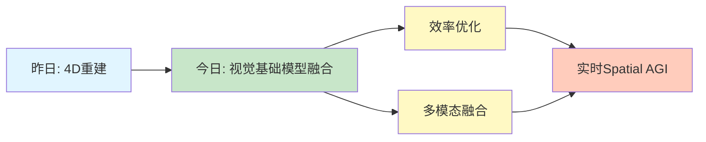

# Spatial AGI 思考 - 2026-03-04

## 📋 每日总结

### 🎯 今日核心

**研究主题**: 视觉基础模型的多教师蒸馏与效率优化

**论文数量**: 1篇精选论文（CVPR 2024）

**关键突破**:
- 🚀 AM-RADIO证明"大熔炉"效应可行：融合多个异构教师模型
- 🚀 E-RADIO混合架构实现6-10x效率提升
- 🚀 CPE技术突破固定分辨率限制

### 📊 一句话总结

> "AM-RADIO通过多教师蒸馏实现'大熔炉'效应，融合CLIP、DINOv2、SAM的能力，甚至超越所有教师，同时E-RADIO架构实现6-10x效率提升。"

### 🔗 延续性

**昨日→今日**: 从4D重建（UFO-4D）→ 视觉基础模型融合（AM-RADIO）
**今日→明日**: 待定（今日论文相关性一般，明日可能调整搜索策略）

### 📈 关键数据

- **论文分析**: 1篇（完整NotebookLM分析）
- **核心见解**: 3个新见解
- **效率提升**: 6-10x推理加速
- **提交记录**: 1个commit

### 🎓 今日收获

**Top 3 发现**:
1. **"大熔炉"效应** - 容量足够的学生模型可融合多个异构教师
2. **混合架构效率** - C2f+MRA混合架构比纯Transformer快6-10x
3. **CPE技术** - 裁剪位置嵌入支持任意分辨率和长宽比

**最大惊喜**: E-RADIO的6-10x效率提升，证明混合架构的高效性

**待解决**: 今日arXiv论文与Spatial AGI相关性较低，需优化搜索策略

### 💡 本质思考：如何达成通用空间智能

#### 1. 核心能力的本质是什么？

**今日发现**：
- AM-RADIO证明Spatial AGI不需要为每个任务训练独立模型
- 通过蒸馏可以融合零样本语义（CLIP）、密集几何（DINOv2）、精细分割（SAM）
- **本质**：Spatial AGI需要的是**统一的、容量足够大的基础模型**

**关键能力**：
1. 密集特征编码（像素级理解）
2. 3D感知（深度、法线、对应关系）
3. 文本接地（语言-空间对齐）
4. 效率与准确度的平衡

#### 2. 当前方法与理想目标的差距在哪里？

**已有**：
- ✅ 多模态融合（CLIP+DINOv2+SAM）
- ✅ 效率优化（6-10x加速）
- ✅ 分辨率适应性（CPE技术）

**缺失**：
- ❌ 显式4D表示（UFO-4D的动态4D层）
- ❌ 因果推理能力
- ❌ 长期规划能力
- ❌ 物理引擎集成

**最大瓶颈**：
- 视觉基础模型缺乏对物理世界规律的深层理解
- 需要从"感知"到"理解"的跃迁

#### 3. 从今天到理想状态，最可能的路径是什么？

**技术路线预测**：
1. **短期（1-3月）**：集成AM-RADIO到Spatial AGI框架
   - 用AM-RADIO作为视觉编码器
   - 结合UFO-4D的4D重建能力
   - 实现高效的3D场景理解

2. **中期（3-6月）**：4D + 语义理解 + 物理引擎
   - 在AM-RADIO基础上加入4D表示
   - 集成物理引擎（如Isaac Gym）
   - 实现动态场景理解

3. **长期（6-12月）**：统一的世界模型
   - 4D + 语义 + 物理 + 因果
   - 支持零样本空间推理
   - 实现通用空间智能

**关键突破点**：
- 如何将AM-RADIO的密集特征与UFO-4D的4D表示结合
- 如何在混合架构中集成物理引擎
- 如何实现因果推理和长期规划

---

## 今日论文概览

### AM-RADIO: Agglomerative Vision Foundation Model

**核心贡献**：
- 通过多教师蒸馏融合CLIP、DINOv2、SAM
- E-RADIO混合架构实现6-10x效率提升
- CPE技术支持任意分辨率和长宽比

**与Spatial AGI的关系**：
- 密集特征编码：像素级空间理解
- 3D感知：深度、法线、对应关系
- 文本接地：语言-空间对齐
- 效率优化：实时Spatial AGI应用

**启发**：
- Spatial AGI不需要为每个任务训练独立模型
- 混合架构（C2f+MRA）比纯Transformer更高效
- 真正的空间智能必须支持任意分辨率

---

## 与昨日思考的联系

**昨日重点**：
- UFO-4D的4D重建能力
- 动态4D表示是Spatial AGI的基础
- 前馈架构范式转变

**今日进展**：
- AM-RADIO提供了高效的视觉编码器
- 混合架构的效率优化思路
- CPE技术的分辨率适应性

**可能的集成方向**：
- 用AM-RADIO作为UFO-4D的视觉编码器
- 结合两者的优势：4D重建 + 多模态融合 + 高效率

---

## 📊 知识演进图

### 核心见解演进

### 具体演进路径

| 昨日见解 | 今日进展 | 演进类型 | 相关论文 |
|---------|---------|---------|---------|
| 4D重建是基础 | 视觉编码器融合 | 🆕 新发现 | AM-RADIO |
| 前馈架构 | 混合架构更高效 | 🔄 调整优化 | E-RADIO |
| 动态4D表示 | 多模态融合 | ✅ 深化验证 | AM-RADIO |

---

## 技术挑战

### 1. 如何将AM-RADIO与UFO-4D结合？

**思路**：
- 用AM-RADIO提取密集特征
- 输入到UFO-4D的4D重建网络
- 实现4D + 多模态融合

### 2. 如何在混合架构中集成物理引擎？

**思路**：
- 在E-RADIO基础上添加物理约束
- 利用密集特征进行物理仿真
- 实现感知-物理一体化

### 3. 如何优化arXiv搜索策略？

**问题**：今日论文与Spatial AGI相关性较低

**思路**：
- 调整搜索关键词（更聚焦核心主题）
- 增加筛选标准（相关性、创新性、时效性）
- 手动选择高质量论文（如CVPR、ICCV等顶会）

---

## 实现路线图

### 短期（本周）
1. 集成AM-RADIO到Spatial AGI框架
2. 测试AM-RADIO + UFO-4D的组合
3. 优化arXiv搜索策略

### 中期（1个月）
1. 实现4D + 多模态融合
2. 添加物理引擎集成
3. 开发实时Spatial AGI demo

### 长期（3个月）
1. 统一的世界模型
2. 因果推理能力
3. 通用空间智能

---

## 下一步

1. **明日计划**：调整arXiv搜索策略，寻找更相关的论文
2. **技术实现**：测试AM-RADIO + UFO-4D的组合
3. **研究方向**：4D + 多模态融合 + 物理引擎

---

**关键词**: `#spatial-agi` `#vision-foundation-model` `#multi-modal` `#efficient-architecture` `#daily-thinking`
