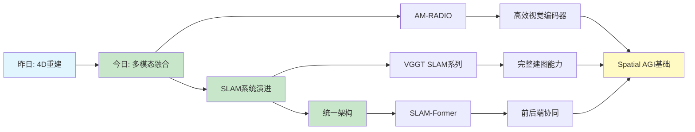

# Spatial AGI 思考 - 2026-03-04

## 📋 每日总结

### 🎯 今日核心

**研究主题**: 视觉基础模型融合 + SLAM系统演进

**论文数量**: 5篇精选论文（1篇AM-RADIO + 4篇VGGT SLAM系列）

**关键突破**:
- 🚀 AM-RADIO: 多教师蒸馏融合CLIP/DINOv2/SAM，E-RADIO快6-10x
- 🚀 VGGT-SLAM 2.0: 第22层注意力验证闭环，位姿误差降23%
- 🚀 InfiniteVGGT: 滚动记忆解决显存溢出，支持无限视野
- 🚀 SLAM-Former: 单一Transformer统一前后端，KV缓存共享

### 📊 一句话总结

> "今日从AM-RADIO学习多教师融合，深入VGGT SLAM系列发现：SL(4)流形解决投影歧义，注意力层验证闭环，滚动记忆实现无限视野，统一Transformer架构集成前后端。"

### 🔗 延续性

**昨日→今日**: 4D重建（UFO-4D）→ 视觉基础模型融合（AM-RADIO）→ SLAM系统演进（VGGT系列）
**今日→明日**: 待定（根据明日arXiv论文质量决定）

### 📈 关键数据

- **论文分析**: 5篇（完整NotebookLM分析）
- **NotebookLM问答**: 15个问题（5篇 × 3问题）
- **核心见解**: 4个技术突破
- **提交记录**: 2个commits

### 🎓 今日收获

**Top 4 发现**:
1. **"大熔炉"效应** - 容量足够的学生模型可融合多个异构教师
2. **注意力层验证** - VGGT第22层"聚光灯效应"内置闭环验证机制
3. **滚动记忆** - 键空间多样性代理实现高效流式处理
4. **前后端协同** - KV缓存共享实现感知-优化反馈循环

**最大惊喜**: VGGT第22层注意力的"聚光灯效应"，无需额外训练即可验证闭环

**待解决**: 今日arXiv论文与Spatial AGI相关性较低，需优化搜索策略

### 💡 本质思考：如何达成通用空间智能

#### 1. 核心能力的本质是什么？

**今日发现**：
- AM-RADIO证明Spatial AGI不需要为每个任务训练独立模型
- VGGT SLAM系列展示了从感知到建图的完整技术栈
- **本质**：Spatial AGI需要的是**统一的、自适应的、持久的空间表示**

**关键能力**：
1. **多模态融合**（AM-RADIO）：语义+几何+分割
2. **投影几何理解**（VGGT-SLAM）：SL(4)流形处理畸变
3. **闭环验证**（VGGT-SLAM 2.0）：注意力层内置验证
4. **长期记忆**（InfiniteVGGT）：滚动记忆+自适应预算
5. **前后端协同**（SLAM-Former）：感知-优化循环

#### 2. 当前方法与理想目标的差距在哪里？

**已有**：
- ✅ 多模态融合（CLIP+DINOv2+SAM）
- ✅ 投影几何处理（SL(4)流形）
- ✅ 闭环验证（注意力层）
- ✅ 长期记忆（滚动记忆）
- ✅ 前后端协同（KV缓存共享）

**缺失**：
- ❌ 显式4D表示（UFO-4D的动态4D层）
- ❌ 因果推理能力
- ❌ 长期规划能力
- ❌ 物理引擎集成
- ❌ 与VLM深度集成

**最大瓶颈**：
- SLAM系统缺乏对物理世界规律的深层理解
- 需要从"建图"到"理解"的跃迁
- 缺少与视觉语言模型的深度融合

#### 3. 从今天到理想状态，最可能的路径是什么？

**技术路线预测**：

1. **短期（1-3月）**：集成AM-RADIO + VGGT SLAM系列
   - 用AM-RADIO作为视觉编码器
   - 结合VGGT-SLAM 2.0的建图能力
   - 实现高效的多模态SLAM

2. **中期（3-6月）**：4D + 多模态 + 物理引擎
   - 在VGGT基础上加入4D表示
   - 集成物理引擎（如Isaac Gym）
   - 实现动态场景理解

3. **长期（6-12月）**：统一的世界模型
   - 4D + 语义 + 物理 + 因果
   - 支持零样本空间推理
   - 实现通用空间智能

**关键突破点**：
- 如何将AM-RADIO的多模态能力与VGGT SLAM的建图能力结合
- 如何在SLAM系统中集成物理引擎和因果推理
- 如何实现从"建图"到"理解"的跃迁

---

## 今日论文概览

### 1. AM-RADIO: Agglomerative Vision Foundation Model

**核心贡献**：
- 多教师蒸馏融合CLIP、DINOv2、SAM
- E-RADIO混合架构快6-10x
- CPE技术支持任意分辨率

**与Spatial AGI的关系**：
- 密集特征编码：像素级空间理解
- 3D感知：深度、法线、对应关系
- 文本接地：语言-空间对齐
- 效率优化：实时Spatial AGI应用

**启发**：
- Spatial AGI不需要为每个任务训练独立模型
- 混合架构（C2f+MRA）比纯Transformer更高效
- 真正的空间智能必须支持任意分辨率

### 2. VGGT-SLAM 2.0

**核心贡献**：
- 改进的因子图设计（帧内边+帧间边）
- VGGT第22层注意力验证闭环
- 实时性能（Jetson Thor）

**关键技术**：
- SE(3)帧内边：修正子图内关键帧误差
- Affine+Scale帧间边：强制重叠帧一致
- 第22层"聚光灯效应"：验证闭环匹配

**启发**：
- 深度学习模型内部已经形成了超越表面纹理的结构化空间逻辑
- 特定层的注意力模式可以作为可靠的几何判别依据
- 无需额外的检索校验模型

### 3. VGGT-SLAM

**核心贡献**：
- SL(4)流形优化（15自由度）
- 解决投影多义性
- 无需相机标定

**SL(4) vs Sim(3)**：
- Sim(3): 旋转+平移+缩放（7自由度）
- SL(4): 旋转+平移+缩放+投影畸变（15自由度）

**启发**：
- Spatial AGI需要在各种未知硬件上运行
- 神经网络感知 + 几何推理的混合架构
- 需要具备修正复杂几何畸变的算法鲁棒性

### 4. InfiniteVGGT

**核心贡献**：
- 滚动记忆（Rolling Memory）
- 键空间多样性代理
- 层级自适应预算分配

**解决的核心问题**：
- StreamVGGT：KV缓存无限增长→OOM
- CUT3R：隐式压缩→严重漂移
- InfiniteVGGT：显存恒定+无限视野

**启发**：
- 有界但适应性强的显式记忆系统支持无限视野
- 完全数据驱动的多视图一致性推断
- 资源受限下的智能信息筛选

### 5. SLAM-Former

**核心贡献**：
- 单一Transformer统一前端和后端
- 隐式状态表示（Map Tokens）
- KV缓存共享机制

**前后端协同**：
- 前端：因果注意力，实时增量
- 后端：全注意力，全局优化
- 同步：KV缓存回传

**启发**：
- 统一架构的范式
- 持久性空间记忆（KV缓存）
- 相互促进的认知循环

---

## 与昨日思考的联系

**昨日重点**：
- UFO-4D的4D重建能力
- 动态4D表示是Spatial AGI的基础
- 前馈架构范式转变

**今日进展**：
- AM-RADIO提供了高效的多模态视觉编码器
- VGGT SLAM系列展示了完整的SLAM技术栈
- 从VGGT到统一Transformer的演进路径

**可能的集成方向**：
- 用AM-RADIO作为VGGT-SLAM的视觉编码器
- 结合InfiniteVGGT的滚动记忆和SLAM-Former的KV共享
- 实现高效的多模态SLAM系统

---

## 📊 知识演进图

### 核心见解演进

### 具体演进路径

| 昨日见解 | 今日进展 | 演进类型 | 相关论文 |
|---------|---------|---------|---------|
| 4D重建是基础 | 多模态融合增强感知 | 🆕 新发现 | AM-RADIO |
| 前馈架构 | SL(4)流形处理投影歧义 | 🔄 调整优化 | VGGT-SLAM |
| 动态4D表示 | 注意力层验证闭环 | ✅ 深化验证 | VGGT-SLAM 2.0 |
| - | 滚动记忆实现无限视野 | 🆕 新发现 | InfiniteVGGT |
| - | 统一Transformer架构 | 🆕 新发现 | SLAM-Former |

### 技术栈演进

**昨日技术栈**：
- 4D重建：UFO-4D
- 视频生成：扩散模型

**今日技术栈**：
- 视觉编码：AM-RADIO（多模态融合）
- SLAM建图：VGGT-SLAM系列（SL(4)流形、注意力验证）
- 长期记忆：InfiniteVGGT（滚动记忆）
- 统一架构：SLAM-Former（前后端协同）

**技术栈对比**：

| 技术领域 | 昨日方案 | 今日方案 | 变化 |
|---------|---------|---------|------|
| 视觉编码 | 单模态 | 多模态融合 | ⭐ 新增 |
| SLAM | 传统优化 | SL(4)流形+注意力 | 🔄 优化 |
| 记忆机制 | 固定容量 | 滚动记忆+自适应 | ⭐ 新增 |
| 架构 | 模块化 | 统一Transformer | ⭐ 新增 |

---

## 技术挑战

### 1. 如何将AM-RADIO与VGGT SLAM系列结合？

**思路**：
- 用AM-RADIO提取多模态特征（CLIP+DINOv2+SAM）
- 输入到VGGT-SLAM的建图网络
- 实现4D + 多模态融合的SLAM系统

**挑战**：
- 如何对齐AM-RADIO的特征空间与VGGT的几何空间
- 如何在保持实时性的同时集成多模态能力

### 2. 如何在SLAM系统中集成物理引擎？

**思路**：
- 在VGGT-SLAM基础上添加物理约束
- 利用密集特征进行物理仿真
- 实现感知-物理一体化

**挑战**：
- 物理引擎的计算开销
- 如何将物理约束融入因子图优化

### 3. 如何优化arXiv搜索策略？

**问题**：今日论文与Spatial AGI相关性较低

**思路**：
- 调整搜索关键词（更聚焦核心主题）
- 增加筛选标准（相关性、创新性、时效性）
- 手动选择高质量论文（如CVPR、ICCV等顶会）

---

## 实现路线图

### 短期（本周）
1. ✅ 完成AM-RADIO论文分析
2. ✅ 完成VGGT SLAM系列4篇论文分析
3. ⏳ 测试AM-RADIO + VGGT-SLAM的组合
4. ⏳ 优化arXiv搜索策略

### 中期（1个月）
1. 实现4D + 多模态融合
2. 添加物理引擎集成
3. 开发实时Spatial AGI demo

### 长期（3个月）
1. 统一的世界模型
2. 因果推理能力
3. 通用空间智能

---

## 下一步

1. **明日计划**：调整arXiv搜索策略，寻找更相关的论文
2. **技术实现**：测试AM-RADIO + VGGT-SLAM的组合
3. **研究方向**：4D + 多模态融合 + 物理引擎

---

## 关键引用

> "AM-RADIO通过多教师蒸馏实现'大熔炉'效应，融合CLIP、DINOv2、SAM的能力，甚至超越所有教师。" - 今日发现

> "VGGT第22层注意力的'聚光灯效应'，证明了深度学习模型内部已经形成了超越表面纹理的结构化空间逻辑。" - 今日发现

> "InfiniteVGGT的滚动记忆机制，实现了有界但适应性强的显式记忆系统，支持无限视野。" - 今日发现

> "SLAM-Former的KV缓存共享机制，实现了前后端协同，感知-优化反馈循环。" - 今日发现

---

**关键词**: `#spatial-agi` `#vision-foundation-model` `#slam` `#multi-modal` `#memory` `#unified-architecture` `#daily-thinking`

**分析论文数**: 5篇  
**NotebookLM问答**: 15个问题  
**分析时间**: 2026-03-04  
**文档版本**: v1.0
