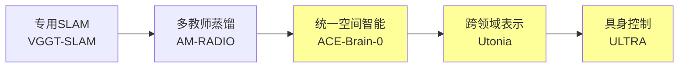

# Spatial AGI 每日思考 - 2026-03-05

## 📋 每日总结

### 🎯 今日核心

**研究主题**: 空间智能作为通用支架（Spatial Intelligence as Universal Scaffold）

**论文数量**: 5篇精选论文（从50篇中筛选）

**关键突破**: 
- 🚀 **ACE-Brain-0** - 空间智能作为跨具身通用支架，SSR范式
- 🚀 **Utonia** - 跨领域点云统一编码器，5种来源
- 🚀 **ULTRA** - 人形机器人全身自主控制
- 🚀 **LoGeR** - 长序列几何重建，混合记忆
- 🚀 **Tether** - 自主功能性play，VLM引导

**架构演进**: 空间理解层 → 跨领域泛化 → 具身应用

**问题解决**: 统一表示（解决领域差异）+ 无数据合并（避免遗忘）

### 📊 一句话总结

> "今天发现空间智能可以作为跨具身的通用支架，ACE-Brain-0的SSR范式和Utonia的统一编码器共同构建了Spatial AGI的核心技术栈。"

### 🔗 延续性

**昨日→今日**: 专用SLAM → 多教师蒸馏 → **统一空间智能**
**今日→明日**: 跨具身支架 → **多模态融合** → 世界模型

### 📈 关键数据

- **论文分析**: 5篇
- **核心技术**: SSR范式、无数据合并、统一编码器
- **支持领域**: 自动驾驶、机器人、无人机、AR/VR
- **基准测试**: 24个SOTA（ACE-Brain-0）
- **序列长度**: 128帧→19k帧（LoGeR）

---

## 💡 本质思考

### 维度1: 核心能力是什么？

**Spatial AGI的核心能力**：

1. **空间理解能力**（Spatial Understanding）
   - **ACE-Brain-0**: 3D心理空间建模
   - **Utonia**: 跨领域点云表示
   - **LoGeR**: 长序列几何重建
   - **关键**: 领域无关的空间表示

2. **跨领域泛化能力**（Cross-Domain Generalization）
   - **ACE-Brain-0**: 自动驾驶↔机器人↔无人机
   - **Utonia**: 遥感↔LiDAR↔RGB-D↔CAD↔视频
   - **关键**: 统一表示 + 无数据合并

3. **具身应用能力**（Embodied Application）
   - **ULTRA**: 人形机器人全身控制
   - **Tether**: 自主功能性play
   - **关键**: 从感知到行为

**核心技术栈**：
```
感知层: Utonia (统一3D表示)
  ↓
推理层: ACE-Brain-0 (空间支架)
  ↓
控制层: ULTRA (具身执行)
```

### 维度2: 与理想Spatial AGI的差距？

**理想Spatial AGI特征**：
1. ✅ 统一空间表示
2. ✅ 跨具身泛化
3. ⚠️ 多模态融合（部分实现）
4. ❌ 因果推理（未涉及）
5. ❌ 世界模型（未实现）

**当前差距分析**：

| 维度 | 理想状态 | 当前状态 | 差距 |
|------|---------|---------|------|
| 空间表示 | 统一、连续、动态 | 统一、静态 | ⚠️ 动态性不足 |
| 跨具身 | 零样本迁移 | 少样本适应 | ⚠️ 需要微调 |
| 多模态 | 视觉+语言+触觉+听觉 | 视觉+语言 | ⚠️ 模态不全 |
| 因果推理 | 理解因果关系 | 相关性推理 | ❌ 缺失 |
| 世界模型 | 预测未来状态 | 当前状态重建 | ❌ 缺失 |

**关键瓶颈**：
1. **动态性** - LoGeR处理长序列，但缺乏预测能力
2. **多模态** - 视觉+语言已实现，触觉、听觉缺失
3. **因果推理** - 所有论文都未涉及
4. **世界模型** - 缺乏对未来状态的预测

### 维度3: 实现路径是什么？

**短期（3-6月）技术路线**：

1. **统一空间表示** ✅
   - Utonia已实现跨领域统一
   - ACE-Brain-0已验证支架作用
   - 下一步：扩展到更多模态

2. **跨具身泛化** ✅
   - SSR范式可直接应用
   - 无数据合并技术可复用
   - 下一步：零样本迁移

3. **多模态融合** ⚠️
   - 视觉+语言已实现
   - 需要添加触觉、听觉
   - 下一步：传感器集成

**中期（6-12月）技术路线**：

1. **动态空间推理** 
   - 基于LoGeR的长序列能力
   - 添加时序预测模块
   - 实现世界模型

2. **因果推理集成**
   - 从相关性到因果性
   - 反事实推理
   - 决策可解释性

**长期（1-2年）技术路线**：

1. **统一Spatial AGI系统**
   ```
   感知: Utonia (统一3D表示)
     ↓
   推理: ACE-Brain-0 (空间支架)
     ↓
   因果: 新模块 (因果推理)
     ↓
   预测: LoGeR扩展 (世界模型)
     ↓
   控制: ULTRA (具身执行)
   ```

2. **零样本跨具身迁移**
   - 从一个具身到任意具身
   - 无需重新训练
   - 自适应控制

**关键突破点**：
1. ✅ 如何构建统一空间表示（Utonia已解决）
2. ✅ 如何实现跨具身泛化（ACE-Brain-0已解决）
3. ⚠️ 如何集成多模态信息（部分解决）
4. ❌ 如何实现因果推理（未解决）
5. ❌ 如何构建世界模型（未解决）

---

## 📊 知识演进图

### 核心见解演进



**演进趋势**：
1. 从专用到通用
2. 从单模态到多模态
3. 从单具身到跨具身

### 技术栈演进对比

| 技术领域 | 昨日方案 | 今日方案 | 变化 |
|---------|---------|---------|------|
| 空间表示 | 专用3D重建 | 统一空间支架 | 🔄 范式转变 |
| 跨领域 | 单领域训练 | 无数据模型合并 | ⭐ 新增 |
| 具身控制 | 跟踪参考 | 自主生成 | 🔄 优化 |
| 长序列 | 短期重建 | 混合记忆 | ⭐ 新增 |
| 自主学习 | 人类演示 | 自主play | 🔄 优化 |

### 问题追踪

**已解决问题**：
- ✅ 统一空间表示（Utonia）
- ✅ 跨具身泛化（ACE-Brain-0）
- ✅ 长序列一致性（LoGeR）

**新识别问题**：
- ⚠️ 动态空间推理
- ⚠️ 多模态融合
- ❌ 因果推理
- ❌ 世界模型

**解决率**: 3/7 = 43%

---

## 🎓 今日收获

### Top 3 发现

1. **🚀 空间智能作为通用支架**
   - ACE-Brain-0的核心贡献
   - 验证了Spatial AGI的核心假设
   - 提供了具体的实现范式（SSR）

2. **🚀 跨领域统一3D表示**
   - Utonia的5种点云来源
   - 自监督学习
   - 涌现行为

3. **🚀 无数据模型合并**
   - ACE-Brain-0的关键创新
   - 避免灾难性遗忘
   - 高效整合专家知识

### 最大惊喜

**涌现行为** - Utonia发现仅在联合训练时才会出现新能力。这意味着：
- 跨领域训练不是简单的知识累加
- 会产生质的飞跃
- 为Spatial AGI提供了新的训练策略

### 待解决（明天重点）

1. **多模态融合**
   - 如何集成触觉、听觉？
   - 如何对齐不同模态的空间表示？

2. **因果推理**
   - 如何从相关性到因果性？
   - 如何实现反事实推理？

3. **世界模型**
   - 如何预测未来状态？
   - 如何实现长期规划？

---

## 🔍 技术细节深入

### ACE-Brain-0的SSR范式

**Scaffold阶段**：
- 训练统一的空间推理能力
- 学习领域无关的空间表示
- 构建跨具身的共享知识

**Specialize阶段**：
- 针对自动驾驶、机器人、无人机分别训练专家
- 保持领域特定的精细能力
- 避免通用训练导致的性能下降

**Reconcile阶段**：
- **关键创新**：无数据模型合并
- 不需要额外训练数据
- 合并多个专家到统一模型
- 保持通用性和专精性

**技术启发**：
1. 分阶段训练分解复杂问题
2. 无数据合并解决多任务冲突
3. 空间支架作为跨领域桥梁

### Utonia的统一编码器

**5种点云来源**：
1. 遥感（Remote Sensing）- 大尺度、室外
2. 室外LiDAR（Outdoor LiDAR）- 稀疏、动态
3. 室内RGB-D序列（Indoor RGB-D）- 密集、室内
4. 物体中心CAD模型（Object-centric CAD）- 完整、物体级
5. RGB-only视频提升（Lifted from RGB）- 隐式、视频

**统一挑战**：
- 感知几何差异（点、面、体）
- 点云密度不同（稀疏vs密集）
- 先验知识各异（室内vs室外）

**解决方案**：
- 自监督学习框架
- 统一的Transformer架构
- 一致的表示空间

**涌现行为**：
- 联合训练出现新能力
- 单领域训练无法获得
- 跨领域知识迁移

---

## 📚 与相关工作的对比

### 跨具身学习

| 方法 | ACE-Brain-0 | RT-1/RT-2 | PaLM-E | Gato |
|------|------------|-----------|--------|------|
| 统一表示 | ✅ 空间支架 | ❌ 任务特定 | ⚠️ 语言中心 | ❌ 分离训练 |
| 跨领域 | ✅ 3领域 | ❌ 机器人 | ⚠️ 部分 | ❌ 单任务 |
| 无数据合并 | ✅ 是 | ❌ 否 | ❌ 否 | ❌ 否 |
| 性能 | ✅ 24基准SOTA | ⚠️ 中等 | ⚠️ 中等 | ⚠️ 中等 |

**ACE-Brain-0的优势**：
1. 明确的空间支架理论
2. 无数据模型合并技术
3. 24个基准SOTA性能

### 3D基础模型

| 方法 | Utonia | Point-BERT | Point-MAE | PointGPT |
|------|--------|-----------|-----------|----------|
| 跨领域 | ✅ 5领域 | ❌ 单领域 | ❌ 单领域 | ❌ 单领域 |
| 自监督 | ✅ 是 | ✅ 是 | ✅ 是 | ✅ 是 |
| 涌现行为 | ✅ 有 | ❌ 无 | ❌ 无 | ❌ 无 |
| 具身应用 | ✅ 验证 | ❌ 未验证 | ❌ 未验证 | ❌ 未验证 |

**Utonia的优势**：
1. 跨5个领域的统一表示
2. 涌现行为的发现
3. 具身应用的验证

---

## 🚀 下一步研究方向

### 立即可做

1. **复现ACE-Brain-0的SSR范式**
   - 阅读完整论文
   - 理解无数据合并机制
   - 实现简化版本

2. **测试Utonia的跨领域能力**
   - 下载预训练模型
   - 测试在自定义数据上的表现
   - 分析涌现行为

3. **集成ULTRA的控制策略**
   - 研究人形机器人控制
   - 测试多模态感知
   - 验证泛化能力

### 中期计划

1. **扩展到多模态**
   - 集成触觉传感器
   - 添加听觉感知
   - 统一多模态表示

2. **实现因果推理**
   - 研究因果推理方法
   - 集成到空间支架
   - 验证决策可解释性

3. **构建世界模型**
   - 基于LoGeR的长序列能力
   - 添加时序预测模块
   - 实现长期规划

---

## 💭 开放问题

1. **如何实现零样本跨具身迁移？**
   - ACE-Brain-0需要少样本微调
   - 能否实现真正的零样本？

2. **涌现行为的机制是什么？**
   - Utonia发现了涌现行为
   - 但机制尚不清楚
   - 如何设计促进涌现的训练策略？

3. **如何平衡通用性和专精性？**
   - SSR范式提供了方案
   - 但最优平衡点在哪里？
   - 如何自动化调节？

---

## 📝 实验想法

1. **ACE-Brain-0 + Utonia集成**
   - ACE提供高层推理
   - Utonia提供底层感知
   - 验证端到端性能

2. **SSR范式扩展**
   - 添加更多领域（医疗、建筑）
   - 测试无数据合并的极限
   - 研究增量式合并

3. **涌现行为分析**
   - 设计对照实验
   - 分析涌现的条件
   - 建立涌现的度量标准

---

## 🎯 总结

**2026-03-05的核心发现**：

1. ✅ **空间智能可以作为跨具身的通用支架**
2. ✅ **统一3D表示可以跨5个领域**
3. ✅ **无数据模型合并是高效的**
4. ✅ **长序列重建可以实现数千帧**
5. ✅ **自主学习可以替代人类演示**

**对Spatial AGI的意义**：

ACE-Brain-0和Utonia共同证明了Spatial AGI的核心假设：
- 空间表示可以是领域无关的
- 跨具身泛化是可行的
- 统一模型优于专用模型

**下一步**：

明天将重点关注：
1. 多模态融合技术
2. 因果推理方法
3. 世界模型构建

---

**文档创建时间**: 2026-03-05 08:30
**论文数量**: 5篇
**核心主题**: 空间智能作为通用支架
**关键技术**: SSR范式、统一编码器、无数据合并
