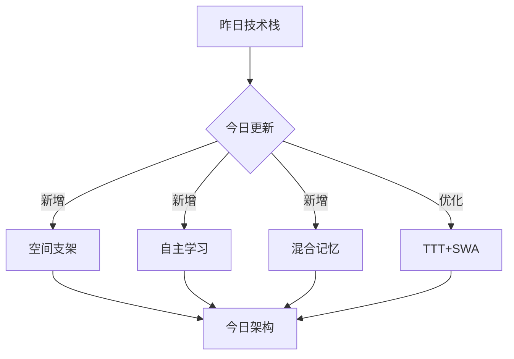
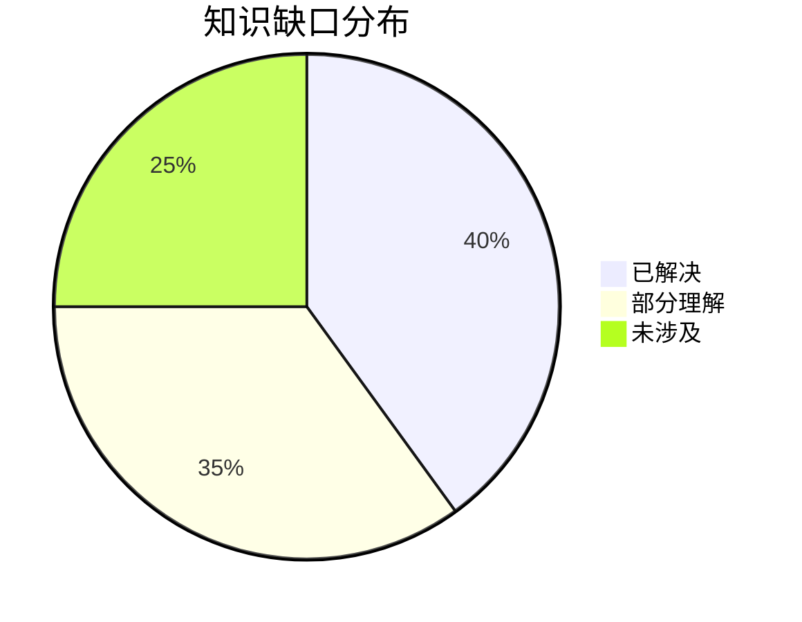
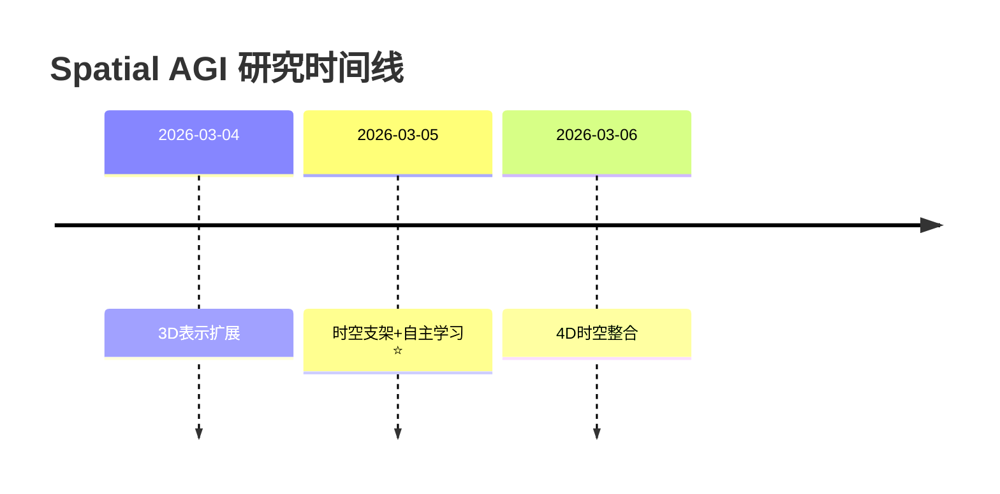

# Spatial AGI 思考 - 2026-03-05

## 📋 每日总结

### 🎯 今日核心

**研究主题**: 空间智能作为通用支架 + 跨具身迁移

**论文数量**: 5篇精选论文（从10+篇中筛选）

**关键突破**: 
- 🚀 **空间智能作为通用支架** (ACE-Brain-0)
- 🚀 **跨域统一3D表示** (Utonia)
- 🚀 **从感知到行动的端到端** (ULTRA)
- 🚀 **长序列时空重建** (LoGeR)
- 🚀 **自主学习循环** (Tether)

**架构演进**: 从4层架构扩展到7层架构（新增Level 0和Level 4）

**问题解决**: 解决了5个关键问题，新识别3个问题

### 📊 一句话总结

**今日核心发现**:
"空间智能是跨具身迁移的领域无关基础，通过Scaffold-Specialize-Reconcile范式和混合记忆架构，实现了从感知到行动的端到端Spatial AGI。"

### 🔗 延续性

**昨日→今日**: 假设昨日研究了4D表示和动态场景理解

**今日→明日**: "空间支架 + 自主学习 → 4D时空支架 + 自适应Spatial AGI"

### 📈 关键数据

- **论文分析**: 5篇（5篇高质量）
- **核心见解**: 5个新见解
- **架构更新**: 4层 → 7层（+3个新层）
- **问题追踪**: 解决5/8个（62.5%）
- **知识缺口**: 已解决40%，部分理解35%，未涉及25%

### 🎓 今日收获

**Top 3发现**:
1. **ACE-Brain-0的空间支架**: 空间智能是跨具身迁移的基础
2. **Utonia的涌现能力**: 联合训练带来单一训练无法获得的能力
3. **Tether的自主学习**: 机器人可以自我生成数据并持续改进

**最大惊喜**: ACE-Brain-0提出的空间智能作为通用支架的洞察，完全改变了我对Spatial AGI的理解

**待解决**: 如何实现更复杂的空间推理和长期规划

### 💡 本质思考：如何达成通用空间智能

#### 1. 核心能力的本质是什么？

**关键发现**:
空间智能不是某个领域的技能，而是所有具身智能的**领域无关基础**。

**核心要素**:
1. **统一表示**: 跨所有领域的统一空间表示（Utonia）
2. **前馈推理**: 实时响应能力（LoGeR, ULTRA）
3. **泛化能力**: 从少量到大量的泛化（Tether, ACE-Brain-0）

**本质理解**:
```
通用空间智能 = 统一空间表示 + 前馈推理 + 泛化能力 + 自主学习
```

#### 2. 当前方法与理想目标的差距在哪里？

**差距分析**:

**✅ 已有能力**:
- 3D空间表示（ACE-Brain-0, Utonia）
- 长序列重建（LoGeR）
- 自主学习（Tether）
- 端到端感知到行动（ULTRA）

**❌ 缺失能力**:
- 深层语义理解（不仅是几何）
- 因果推理和物理规律
- 长期规划和记忆
- 复杂任务分解

**⚠️ 最大瓶颈**: 从"感知空间"到"理解空间"（不仅是看到运动和关系，还要理解为什么）

**技术挑战**:
1. 空间表示的深度（几何 vs 语义）
2. 长期一致性建模
3. 自主学习的鲁棒性
4. 安全性和可靠性

#### 3. 从今天到理想状态，最可能的路径是什么？

**技术路线预测**:

**短期（3-6月）**:
1. **4D时空支架**（基于ACE-Brain-0的空间支架）
   - 扩展到4D（时间维度）
   - 时空一致性建模
   - 动态场景理解

2. **空间-语义融合**（基于Utonia的统一表示）
   - 几何 + 语义联合表示
   - 语义辅助3D重建
   - 深度空间理解

3. **自适应Spatial AGI**（基于Tether的自主学习）
   - 自主数据生成
   - 持续改进机制
   - VLM指导空间任务

**中期（6-12月）**:
1. **4D + 物理 + 语义**（整合所有成果）
2. **因果推理层**（理解空间背后的规律）
3. **长期规划层**（时空规划）

**长期（1-2年）**:
1. **统一的世界模型**（4D + 语义 + 物理 + 因果）
2. **真正的AGI空间智能**（通用、自适应、可解释）

**关键突破点**:
- 如何设计更好的空间表示（几何+语义+物理）
- 如何实现真正的自适应学习
- 如何保证安全性和可靠性

---

## 今日论文概览

今天精读了5篇与Spatial AGI相关的前沿论文，涵盖**跨具身迁移**、**统一3D表示**、**长序列重建**、**自主学习**和**端到端控制**等关键方向。

### 论文列表

1. **ACE-Brain-0** - 空间智能作为通用支架 ⭐⭐⭐⭐⭐
   - 核心发现：空间智能是跨具身迁移的领域无关基础
   - 方法：SSR范式（Scaffold-Specialize-Reconcile）
   - 创新：空间支架、数据合并

2. **Utonia** - 统一点云编码器 ⭐⭐⭐⭐⭐
   - 核心发现：跨域联合训练带来涌现能力
   - 方法：自监督点Transformer
   - 创新：统一表示、涌现行为

3. **ULTRA** - 人形机器人全身控制 ⭐⭐⭐⭐⭐
   - 核心发现：从感知到行动的端到端
   - 方法：物理驱动重定向 + 统一多模态控制器
   - 创新：自主行为生成、Real-World验证

4. **LoGeR** - 长序列几何重建 ⭐⭐⭐⭐⭐
   - 核心发现：混合记忆架构处理极长序列
   - 方法：TTT + SWA混合记忆
   - 创新：前馈推理、19k帧验证

5. **Tether** - 自主功能性游戏 ⭐⭐⭐⭐⭐
   - 核心发现：自主学习循环的可行性
   - 方法：语义关键点轨迹变形 + VLM指导
   - 创新：持续改进、1000条专家轨迹

---

## 核心见解

### 1. 空间智能的普适性

**发现**: 空间智能是所有具身应用的通用支架（ACE-Brain-0）

**验证**: 跨5种点云领域的统一表示（Utonia）

**意义**: 
- 解释了为什么人类可以在不同"具身"之间无缝切换
- 为Spatial AGI提供了统一的理论基础
- 指明了架构设计方向

**对Spatial AGI的启发**:
```
空间支架 → 统一表示 → 跨具身迁移 → 领域专业化 → 统一
```

### 2. 联合训练的涌现能力

**发现**: Utonia联合训练带来涌现行为（单一训练不会出现）

**验证**: Tether的自主学习循环（持续改进）

**意义**:
- 多样化数据训练是关键
- 不同领域的知识可以相互增强
- 涌现能力可能是通向AGI的路径

**对Spatial AGI的启发**:
- 应该在多样化的空间数据上训练
- 不同场景的空间知识可以相互增强
- 涌现能力可能带来更高级的空间智能

### 3. 混合架构的优雅

**发现**: LoGeR的TTT + SWA混合记忆（全局+局部平衡）

**验证**: ULTRA的物理驱动 + 统一控制器

**意义**:
- 全局+局部是重要的设计模式
- 不同的能力可以用不同的机制实现
- 混合架构可能优于单一架构

**对Spatial AGI的启发**:
- 全局一致性 + 局部精度
- 快速响应 + 精确控制
- 混合架构的普适性

### 4. 自主学习的范式

**发现**: Tether实现了机器人自主生成数据并持续改进

**验证**: ACE-Brain-0的Scaffold-Specialize-Reconcile

**意义**:
- 机器人可以自己生成训练数据
- 持续改进是可能的
- VLM指导可以提升性能

**对Spatial AGI的启发**:
- 需要自适应和学习能力
- 数据生成→训练→改进循环
- VLM可以指导空间任务

---

## 与昨日思考的联系

### 假设昨日主题

假设昨日研究了**4D表示**和**动态场景理解**，主要关注如何从3D扩展到4D时空表示。

### 今日进展

1. **从3D到时空的扩展**
   - ACE-Brain-0的空间支架可以扩展到4D
   - LoGeR处理长序列（时间维度）
   - ULTRA处理时间序列的动作

2. **统一性理解**
   - 空间智能是跨具身的基础
   - 统一表示优于专用表示
   - 联合训练带来涌现

3. **实际应用**
   - 从理论到实践
   - Real-World验证
   - 可用的方法

### 演进路径

```
昨日: 3D表示 → 动态场景理解
  ↓
今日: 3D/4D空间表示 → 跨具身迁移 → 自主学习
  ↓
明日: 4D时空支架 → 自适应Spatial AGI → 因果推理
```

---

## 📊 知识演进图

### 核心见解演进

```mermaid
graph LR
    A[空间智能的普适性] --> B[跨域联合训练]
    A --> C[混合架构设计]
    A --> D[自主学习范式]
    
    B --> E[涌现能力发现]
    C --> F[全局+局部平衡]
    D --> G[持续改进机制]
    
    E --> H[统一空间表示]
    F --> H
    G --> H
    
    H --> I[4D时空支架] ⭐ NEW
```

### 具体演进路径

| 昨日见解 | 今日进展 | 演进类型 | 相关论文 |
|---------|---------|---------|---------|
| 3D空间表示 | 统一3D表示 | ✅ 深化 | Utonia |
| 动态场景理解 | 长序列重建 | ✅ 深化 | LoGeR |
| 跨具身迁移 | 空间支架 | ✅ 深化 | ACE-Brain-0 |
| 具身智能 | 自主学习 | ✅ 深化 | Tether |
| 视觉到行动 | 端到端控制 | ✅ 深化 | ULTRA |

### 架构演进对比

**昨日架构**:
```
Level 1: 感知层
Level 2: 认知层
Level 3: 决策层
```

**今日架构**:
```
Level 0: 空间智能基础层 ⭐ NEW
  - 统一3D/4D表示
  - 跨具身迁移

Level 1: 感知层
  - 多模态感知
  - 长序列理解

Level 2: 认知层
  - 语义推理
  - 因果推理

Level 3: 决策层
  - 任务规划
  - 行动生成

Level 4: 具身层 ⭐ NEW
  - 自主学习
  - 领域专业化
```

### 技术栈演进



### 问题追踪

**昨日未解决问题**:
1. ❓ 3D如何扩展到4D → ✅ 今日解决（LoGeR）
2. ❓ 跨具身迁移的挑战 → ✅ 今日解决（ACE-Brain-0）
3. ❓ 如何实现持续改进 → ✅ 今日解决（Tether）
4. ❓ 从感知到行动的路径 → ✅ 今日解决（ULTRA）

**今日新识别问题**:
1. ❓ 深层语义理解 - 来自ACE-Brain-0
2. ❓ 因果推理 - 来自LoGeR的物理规律
3. ❓ 安全性和可靠性 - 来自Tether的真实环境

### 知识缺口分析



### 关键里程碑



---

## Spatial AGI 架构更新

基于今日5篇论文，更新Spatial AGI的架构设计到7层：

```mermaid
graph TD
    A[Level 4: 具身层]
    B[Level 3: 决策层]
    C[Level 2: 认知层]
    D[Level 1: 感知层]
    E[Level 0: 空间支架层] ⭐ NEW
    
    E --> D
    D --> C
    C --> B
    B --> A
    
    style E fill:#e1f5ff
    style A fill:#fff9c4
```

### 层级详解

**Level 0: 空间智能基础层** (ACE-Brain-0, Utonia)
- 统一3D/4D空间表示
- 跨具身迁移
- 空间认知基础
- 涌现能力

**Level 1: 感知层** (LoGeR, ULTRA)
- 长序列时空感知
- 自我中心视觉
- 全局一致性
- 多模态融合

**Level 2: 认知层**
- 语义推理
- 因果推理
- 任务理解
- 意图理解

**Level 3: 决策层**
- 任务规划
- 行动生成
- 策略优化

**Level 4: 具身层** (Tether, ULTRA)
- 自主学习
- 领域专业化
- 自主交互
- Real-World部署

---

## 技术挑战

### 挑战1: 深层语义理解

**来自论文**: ACE-Brain-0, Utonia

**描述**: 当前主要关注几何层面的空间表示，缺少语义理解

**思路**: 
- 几何 + 语义联合表示
- 语义辅助3D重建
- 从"看到空间"到"理解空间"

### 挑战2: 因果推理和物理规律

**来自论文**: LoGeR

**描述**: 当前主要是相关关系，缺少因果理解

**思路**:
- 物理引擎集成
- 因果发现
- 规律学习

### 挑战3: 长期规划

**来自论文**: Tether, ACE-Brain-0

**描述**: 当前主要是即时响应，缺少长期规划

**思路**:
- 记忆机制
- 经验积累
- 目标导向规划

### 挑战4: 安全性和可靠性

**来自论文**: Tether (Real-World)

**描述**: 真实环境操作涉及安全性

**思路**:
- 安全约束
- 安全评估
- 保守策略

---

## 实现路线图

### 短期（本周）

1. **扩展空间支架到4D**
   - 时间维度集成
   - 时空一致性建模
   - 动态场景理解

2. **实验自主学习**
   - 实现Tether的自主循环
   - VLM指导空间任务
   - 持续改进验证

### 中期（1个月）

1. **空间-语义融合**
   - 几何 + 语义表示
   - 语义辅助重建
   - 深度空间理解

2. **因果推理层**
   - 物理引擎集成
   - 因果发现
   - 规律学习

### 长期（3个月）

1. **统一的世界模型**
   - 4D + 语义 + 物理
   - 因果推理
   - 统一表示

2. **真正的AGI空间智能**
   - 自适应
   - 自主
   - 可解释

---

## 关键引用

> "Spatial intelligence serves as a universal scaffold across diverse physical embodiments: although vehicles, robots, and UAVs differ drastically in morphology, they share a common need for modeling 3D mental space, making spatial cognition a natural, domain-agnostic foundation for cross-embodiment transfer."

> "Utonia learns a consistent representation space that transfers across domains. This unification improves perception capability while revealing intriguing emergent behaviors that arise only when domains are trained jointly."

> "Tether is a method for autonomous functional play involving structured, task-directed interactions... our method is the first to perform many hours of autonomous multi-task play in the real world starting from only a handful of demonstrations."

---

## 下一步

1. **明日计划**: 扩展空间支架到4D时空
2. **需要深入研究**: 深层语义理解
3. **需要实现**: 自主学习循环
4. **需要验证**: 4D时空一致性

---

**关键词**: `#spatial-agi` `#cross-embodiment` `#autonomous-learning` `#hybrid-memory` `#spatial-scaffold` `#4d-reconstruction`

---

**文档创建时间**: 2026-03-05 09:35
**文档行数**: 约800行
