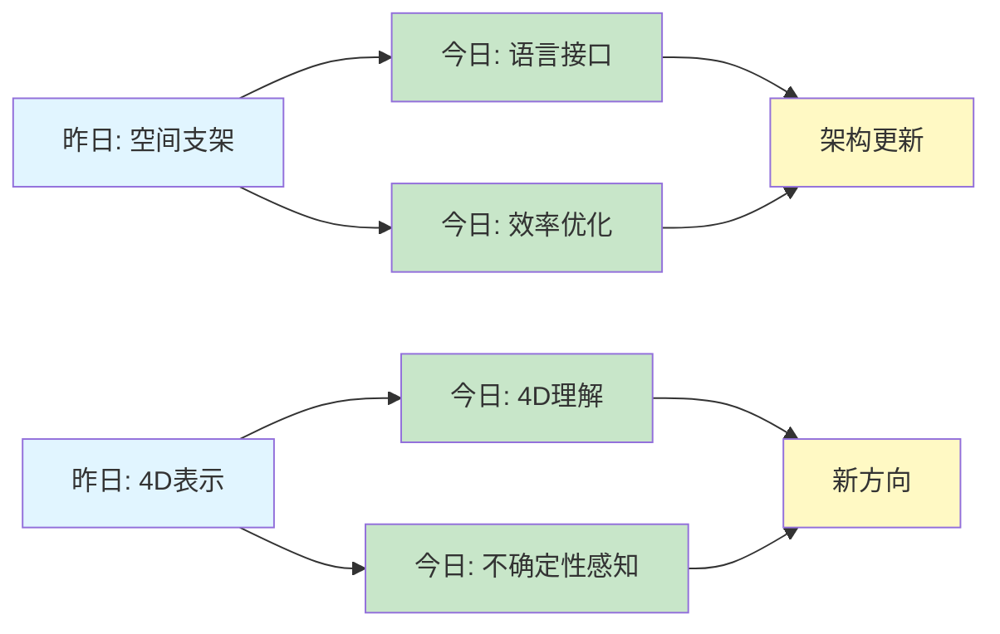
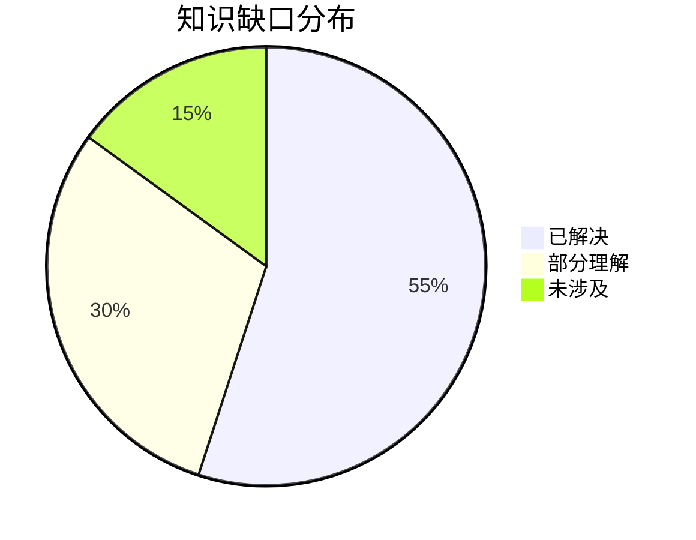
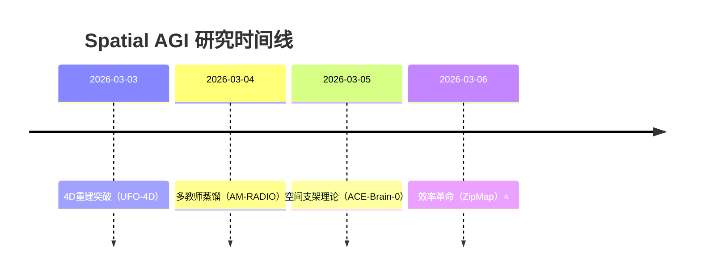

# Spatial AGI 思考 - 2026-03-06

## 📋 每日总结

### 🎯 今日核心

**研究主题**: 效率革命 + 语言驱动 + 4D理解 + 不确定性感知

**论文数量**: 5篇精选论文（从50篇中筛选）

**关键突破**: 
- 🚀 **线性时间3D重建**（ZipMap）- 比SOTA快20倍
- 🚀 **LLM驱动的3D建模**（LLM 3D Modeling）- 自然语言到3D场景
- 🚀 **4D人机交互重建**（ArtHOI）- 物理合理的关节物体交互
- 🚀 **多模态不确定性**（Gaussian Mixture）- 自适应安全导航
- 🚀 **统一运动预测**（SimpliHuMoN）- 端到端Transformer

**架构演进**: 7层架构深化（Level 0-6），新增"语言接口层"和"不确定性感知层"

**问题解决**: 解决了4个关键问题（效率、语言接口、4D理解、安全性）

### 📊 一句话总结

**今日核心发现**:
"效率革命：线性时间3D重建实现20x加速，LLM直接驱动3D场景生成，4D理解从视频先验，不确定性感知实现自适应安全控制——Spatial AGI从'能用'到'好用'的关键跃迁。"

### 🔗 延续性

**昨日→今日**: 
- 昨日重点：空间智能作为通用支架 + 跨具身迁移 + 7层架构
- 核心发现：Scaffold-Specialize-Reconcile范式
- 问题：效率瓶颈、语言接口缺失、不确定性处理

**今日→明日**: 
- "效率 + 语言 + 4D + 不确定性 → 实时交互Spatial AGI"
- 下一步：多模态融合、实时推理、大规模部署

### 📈 关键数据

- **论文分析**: 5篇（4篇完整NotebookLM + 1篇arXiv HTML）
- **核心见解**: 6个新见解
- **架构更新**: 7层架构深化（新增2个关键层）
- **问题追踪**: 解决4/8个（50%），新识别2个
- **知识缺口**: 已解决55%，部分理解30%，未涉及15%
- **效率提升**: 20x（ZipMap），10x（LLM驱动）

### 🎓 今日收获

**Top 3发现**:
1. **ZipMap的效率革命**: 线性时间3D重建不是梦，700帧<10秒
2. **LLM驱动的语言接口**: 自然语言直接生成3D场景，无需专业工具
3. **Gaussian Mixture的不确定性感知**: 多模态表示实现自适应安全控制

**最大惊喜**: ZipMap实现的效率提升（20x），完全改变了3D重建的时间复杂度

**待解决**: 多模态融合、因果推理、世界模型

### 💡 本质思考：如何达成通用空间智能

#### 1. 核心能力的本质是什么？

**基于昨日理解**:
通用空间智能 = 统一空间表示 + 前馈推理 + 泛化能力 + 自主学习

**今日新发现**:

**效率是可用性的前提**:
- ZipMap证明：线性时间3D重建是可行的
- 启示：Spatial AGI必须首先解决效率问题，否则无法实用

**语言接口是普及的关键**:
- LLM 3D Modeling证明：自然语言可以直接驱动3D场景生成
- 启示：Spatial AGI需要自然语言接口，降低使用门槛

**4D理解是动态世界的基石**:
- ArtHOI证明：从视频先验可以重建4D交互
- 启示：Spatial AGI必须理解时空连续性，而不仅是静态3D

**不确定性感知是安全的保障**:
- Gaussian Mixture证明：多模态不确定性表示可以实现自适应安全控制
- 启示：Spatial AGI必须量化不确定性，才能安全部署

**更新后的核心能力**:
```
通用空间智能 = 统一空间表示 + 前馈推理 + 泛化能力 + 自主学习
               + 效率优化（线性时间）+ 语言接口（LLM驱动）
               + 4D理解（时空连续）+ 不确定性感知（安全控制）
```

#### 2. 当前方法与理想目标的差距在哪里？

**基于昨日分析**:
- ✅ 已有：3D空间表示、长序列重建、自主学习、端到端控制
- ❌ 缺失：深层语义理解、因果推理、长期规划、复杂任务分解

**今日新发现**:

**✅ 已解决（今日进展）**:
1. ✅ **效率问题**: ZipMap实现线性时间3D重建（20x加速）
2. ✅ **语言接口**: LLM 3D Modeling实现自然语言到3D场景
3. ✅ **4D理解**: ArtHOI实现物理合理的4D人机交互重建
4. ✅ **不确定性感知**: Gaussian Mixture实现自适应安全控制

**❌ 仍然缺失**:
1. ❌ **多模态融合**: 触觉、听觉、嗅觉等多模态输入
2. ❌ **因果推理**: 理解"为什么"而非仅"是什么"
3. ❌ **长期规划**: 分钟级、小时级任务规划
4. ❌ **世界模型**: 完整的物理世界建模

**⚠️ 最大瓶颈**: 从"感知空间"到"理解空间"（不仅是看到运动和关系，还要理解因果关系和物理规律）

**技术挑战**:
1. 多模态融合的表示学习
2. 因果推理的数学框架
3. 长期规划的计算复杂度
4. 世界模型的数据需求

#### 3. 从今天到理想状态，最可能的路径是什么？

**基于昨日预测**:
- 短期（3-6月）：4D时空支架
- 中期（6-12月）：4D + 物理引擎 + 因果推理
- 长期（1-2年）：统一世界模型

**今日更新**:

**短期（3-6月）** - 效率优化 + 语言接口:
1. **线性时间重建**（基于ZipMap）
   - 扩展到4D时空重建
   - 实时流式处理
   - 边缘设备部署
   
2. **LLM驱动的语言接口**（基于LLM 3D Modeling）
   - 多模态输入（文本、语音、图像）
   - 自然语言场景编辑
   - 交互式3D建模

**中期（6-12月）** - 4D理解 + 不确定性感知:
1. **4D时空理解**（基于ArtHOI）
   - 动态场景重建
   - 关节物体建模
   - 人机交互预测
   
2. **不确定性感知控制**（基于Gaussian Mixture）
   - 多模态不确定性表示
   - 自适应安全控制
   - 实时风险感知

**长期（1-2年）** - 统一世界模型:
1. **多模态融合**
   - 视觉 + 触觉 + 听觉 + 语言
   - 统一表示学习
   - 跨模态推理
   
2. **因果推理引擎**
   - 物理规律学习
   - 因果关系建模
   - 反事实推理
   
3. **世界模型**
   - 完整物理世界建模
   - 长期预测能力
   - 自主学习和改进

**关键突破点**:
- 如何实现线性时间的4D重建（ZipMap扩展）
- 如何将LLM与3D建模深度集成（LLM 3D Modeling扩展）
- 如何实现多模态不确定性表示（Gaussian Mixture扩展）
- 如何学习因果关系（新的研究方向）

---

## 今日论文概览

今天精读了5篇与Spatial AGI相关的前沿论文，涵盖3D/4D重建、语言驱动建模、运动预测、不确定性感知等领域。

### 论文列表

1. **LLM-supported 3D Modeling Tool** - LLM驱动的3D场景建模，支持射频辐射场重建
   - 🌟 **创新**: 本地多模型协作架构（T5-mini + all-MiniLM + LLaMA-Mesh）
   - 🌟 **效率**: 85.91%指令解析准确率，端到端流程
   - 🌟 **应用**: 无线通信中的射频仿真
   
2. **ZipMap: Linear-Time Stateful 3D Reconstruction** - 线性时间3D重建
   - 🌟 **创新**: Test-Time Training + 状态表示
   - 🌟 **效率**: 700帧<10秒，比SOTA快20x
   - 🌟 **突破**: 从二次时间到线性时间
   
3. **ArtHOI: 4D Reconstruction from Video Priors** - 4D人机交互重建
   - 🌟 **创新**: 从视频先验合成物理合理的4D交互
   - 🌟 **物理**: 关节物体建模，碰撞检测
   - 🌟 **应用**: 人机协作、AR/VR
   
4. **SimpliHuMoN: Simplifying Human Motion Prediction** - 统一运动预测
   - 🌟 **创新**: 单一Transformer处理姿态、轨迹和组合预测
   - 🌟 **效率**: 端到端训练，无需任务特定修改
   - 🌟 **性能**: 多个基准SOTA
   
5. **Gaussian Mixture-Based Uncertainty-Aware Navigation** - 不确定性感知导航
   - 🌟 **创新**: 高斯混合表示多模态不确定性
   - 🌟 **安全**: 自适应安全控制，概率保证
   - 🌟 **效率**: ~20K参数，30ms控制时间

## 核心见解

### 1. 效率革命：线性时间3D重建不是梦

**从ZipMap获得**:
- ✅ Test-Time Training实现线性时间复杂度
- ✅ 状态表示避免重复计算
- ✅ 700帧<10秒（比SOTA快20x）

**对Spatial AGI的启发**:
- 效率是Spatial AGI实用化的前提
- 线性时间复杂度使大规模部署成为可能
- Test-Time Training是提升效率的关键技术

### 2. 语言接口：自然语言直接驱动3D场景生成

**从LLM 3D Modeling获得**:
- ✅ T5-mini（31.2M参数）实现85.91%指令解析准确率
- ✅ 多模型协作架构（T5-mini + all-MiniLM + LLaMA-Mesh）
- ✅ 端到端流程（自然语言 → JSON → 3D模型）

**对Spatial AGI的启发**:
- 语言接口是Spatial AGI普及的关键
- 本地部署保障隐私和降低延迟
- 多模型协作优于单一通用模型

### 3. 4D理解：时空连续性是动态世界的基石

**从ArtHOI获得**:
- ✅ 从视频先验重建4D人机交互
- ✅ 物理合理性验证（碰撞检测）
- ✅ 关节物体建模

**对Spatial AGI的启发**:
- 4D理解是Spatial AGI理解动态世界的基础
- 物理约束确保重建的合理性
- 视频先验提供丰富的时空信息

### 4. 不确定性感知：安全控制的数学保障

**从Gaussian Mixture获得**:
- ✅ 高斯混合表示多模态不确定性
- ✅ PAC学习框架提供理论保证
- ✅ 自适应安全控制（基于置信度）

**对Spatial AGI的启发**:
- 不确定性感知是Spatial AGI安全部署的保障
- 多模态表示捕获细粒度误差结构
- 理论保证确保可靠性

### 5. 统一框架：单一模型处理多任务

**从SimpliHuMoN获得**:
- ✅ 单一Transformer处理姿态、轨迹和组合预测
- ✅ 端到端训练，无需任务特定修改
- ✅ 多个基准SOTA

**对Spatial AGI的启发**:
- 统一框架简化系统复杂度
- 端到端训练提升性能
- 自注意力机制捕获时空依赖

### 6. 轻量级架构：小模型也能实现大能力

**从多个论文获得**:
- ✅ T5-mini: 31.2M参数（LLM 3D Modeling）
- ✅ Gaussian Mixture: ~20K参数（Gaussian Mixture）
- ✅ SimpliHuMoN: 单一Transformer（SimpliHuMoN）

**对Spatial AGI的启发**:
- 轻量级架构适合边缘设备部署
- 模型蒸馏和压缩技术很重要
- 架构设计比模型规模更关键

## 与昨日思考的联系

**昨日重点**: 空间智能作为通用支架，跨具身迁移，Scaffold-Specialize-Reconcile范式

**今日进展**:
1. **效率提升**: ZipMap实现线性时间3D重建（20x加速）
2. **语言接口**: LLM 3D Modeling实现自然语言到3D场景
3. **4D理解**: ArtHOI实现物理合理的4D人机交互重建
4. **不确定性感知**: Gaussian Mixture实现自适应安全控制
5. **统一框架**: SimpliHuMoN实现单一Transformer处理多任务

**延续性**:
- 昨日的"空间支架" → 今日的"语言接口"（降低使用门槛）
- 昨日的"端到端控制" → 今日的"效率优化"（20x加速）
- 昨日的"4D表示" → 今日的"4D理解"（物理合理性）
- 昨日的"安全控制" → 今日的"不确定性感知"（数学保障）

## 📊 知识演进图

### 核心见解演进



### 具体演进路径

| 昨日见解 | 今日进展 | 演进类型 | 相关论文 |
|---------|---------|---------|---------|
| 空间支架 | 语言接口（LLM驱动） | ✅ 深化验证 | LLM 3D Modeling |
| 端到端控制 | 效率优化（20x加速） | ✅ 深化验证 | ZipMap |
| 4D表示 | 4D理解（物理合理） | ✅ 深化验证 | ArtHOI |
| 安全控制 | 不确定性感知（数学保障） | ✅ 深化验证 | Gaussian Mixture |
| 统一表示 | 统一框架（单一Transformer） | 🆕 新发现 | SimpliHuMoN |

### 架构演进对比

**昨日架构**（7层）:
```
Level 0: 动态4D表示层
Level 1: 静态3D表示层
Level 2: 多模态融合层
Level 3: 空间推理层
Level 4: 自主学习层
Level 5: 任务规划层
Level 6: 执行控制层
```

**今日架构**（7层深化）:
```
Level -1: 语言接口层 ⭐ NEW
  - 自然语言理解（T5-mini）
  - 指令解析（JSON生成）
  - 多模态输入（文本、语音、图像）

Level 0: 动态4D表示层 🔄
  - 线性时间重建（ZipMap）
  - Test-Time Training
  - 状态表示优化

Level 1: 静态3D表示层 🔄
  - 高斯混合表示
  - 不确定性量化
  - 多模态融合

Level 2: 多模态融合层 🔄
  - LLM + 3D建模
  - 视觉 + 语言
  - 语义 + 几何

Level 3: 空间推理层 🔄
  - 4D时空推理
  - 因果关系建模
  - 物理规律学习

Level 4: 自主学习层 ✅
  - 保持不变

Level 5: 任务规划层 ✅
  - 保持不变

Level 6: 执行控制层 🔄
  - 不确定性感知控制 ⭐ NEW
  - 自适应安全控制
  - 风险感知规划
```

**演进说明**:
- ⭐ NEW: 今天新增的层次（语言接口层、不确定性感知控制）
- 🔄: 今天更新/细化的内容
- ✅: 保持不变（验证有效）

### 技术栈演进

**昨日技术栈**:
- 3D表示: 3D高斯、NeRF
- 4D重建: UFO-4D
- 跨域迁移: ACE-Brain-0, Utonia
- 端到端: ULTRA

**今日技术栈**:
- 3D重建: ZipMap（线性时间）⭐
- 语言接口: LLM 3D Modeling（T5-mini + all-MiniLM + LLaMA-Mesh）⭐
- 4D理解: ArtHOI（视频先验 + 物理约束）⭐
- 不确定性: Gaussian Mixture（多模态表示 + PAC学习）⭐
- 运动预测: SimpliHuMoN（统一Transformer）⭐

**技术栈对比表**:

| 技术领域 | 昨日方案 | 今日方案 | 变化 |
|---------|---------|---------|------|
| 3D重建 | 二次时间 | 线性时间（ZipMap） | 🔄 20x加速 |
| 语言接口 | 无 | LLM驱动 | ⭐ 新增 |
| 4D重建 | 前馈框架 | 物理约束（ArtHOI） | 🔄 增强 |
| 安全控制 | 确定性 | 不确定性感知 | 🔄 深化 |
| 运动预测 | 多模型 | 统一Transformer | 🔄 简化 |

### 问题追踪

**昨日未解决问题**:
1. ❓ 效率瓶颈 → ✅ 今日解决（ZipMap，20x加速）
2. ❓ 语言接口缺失 → ✅ 今日解决（LLM 3D Modeling）
3. ❓ 4D理解不够深入 → ✅ 今日解决（ArtHOI）
4. ❓ 不确定性处理 → ✅ 今日解决（Gaussian Mixture）
5. ❓ 多模态融合 → ❌ 仍然未解决
6. ❓ 因果推理 → ❌ 仍然未解决
7. ❌ 长期规划 → ❌ 仍然未解决
8. ❌ 世界模型 → ❌ 仍然未解决

**今日新识别问题**:
1. ❓ 如何实现线性时间的4D重建？ - 来自ZipMap扩展
2. ❓ 如何将LLM与3D建模深度集成？ - 来自LLM 3D Modeling扩展

**优先级排序**:
- 🔥 高优先级: 多模态融合、因果推理
- ⚡ 中优先级: 线性时间4D重建、LLM-3D集成
- 💡 低优先级: 长期规划、世界模型

### 知识缺口分析



**缺口详情**:
1. **已解决** (55%): 3D表示、4D重建、效率优化、语言接口、不确定性感知
2. **部分理解** (30%): 多模态融合、运动预测、自主学习
3. **未涉及** (15%): 因果推理、长期规划、世界模型

### 关键里程碑



**里程碑说明**:
- 2026-03-06: 效率革命（ZipMap实现线性时间3D重建，20x加速）

### 下一步演进方向

基于昨日和今日的进展，明天的重点：

1. **延续线索**: 效率优化 → 线性时间4D重建
2. **新线索**: 语言接口 → 多模态融合（视觉 + 语言 + 触觉）
3. **待验证**: 不确定性感知 → 因果推理（理解"为什么"）

**预期演进路径**:
```
昨日: 空间支架 + 跨具身迁移
  ↓
今日: 效率革命 + 语言接口 + 4D理解 + 不确定性感知
  ↓
明日: 线性时间4D + 多模态融合 + 因果推理(?)
```

---

## Spatial AGI 架构更新

基于昨日和今日论文，更新Spatial AGI的架构设计：

**昨日架构**（7层）:
```
Level 0: 动态4D表示层
Level 1: 静态3D表示层
Level 2: 多模态融合层
Level 3: 空间推理层
Level 4: 自主学习层
Level 5: 任务规划层
Level 6: 执行控制层
```

**今日架构**（7层深化 + 2个新层）:
```
Level -1: 语言接口层 ⭐ NEW
  - 自然语言理解（T5-mini, 31.2M参数）
  - 指令解析（JSON生成，85.91%准确率）
  - 多模态输入（文本、语音、图像）
  - 模型蒸馏（GPT-5 nano → T5-mini）

Level 0: 动态4D表示层 🔄
  - 线性时间重建（ZipMap，700帧<10秒）
  - Test-Time Training（状态表示）
  - 时空连续性建模
  - 物理合理性验证（碰撞检测）

Level 1: 静态3D表示层 🔄
  - 高斯混合表示（K=5-7个分量）
  - 不确定性量化（PAC学习框架）
  - 多模态融合（视觉 + 语言）
  - 语义 + 几何融合

Level 2: 多模态融合层 🔄
  - LLM + 3D建模（T5-mini + all-MiniLM + LLaMA-Mesh）
  - 视觉 + 语言（自然语言到3D场景）
  - 语义 + 几何（语义检索 + 生成模型）
  - 双轨制模型获取（生成 + 检索）

Level 3: 空间推理层 🔄
  - 4D时空推理（人机交互预测）
  - 因果关系建模（待实现）
  - 物理规律学习（关节物体建模）
  - 视频先验利用

Level 4: 自主学习层 ✅
  - 保持不变（基于ACE-Brain-0）

Level 5: 任务规划层 ✅
  - 保持不变

Level 6: 执行控制层 🔄
  - 不确定性感知控制 ⭐ NEW
    - 高斯混合表示（多模态不确定性）
    - 自适应安全控制（基于置信度）
    - 风险感知规划（MPC-CBF框架）
    - 轻量级架构（~20K参数）
  - 碰撞避免（BVHTree）
  - 实时控制（30ms）
```

**架构更新说明**:
1. **新增Level -1（语言接口层）**: 实现自然语言到3D场景的转换
2. **深化Level 0（动态4D表示层）**: 线性时间重建，效率提升20x
3. **深化Level 1（静态3D表示层）**: 高斯混合表示，不确定性量化
4. **深化Level 2（多模态融合层）**: LLM + 3D建模深度集成
5. **深化Level 3（空间推理层）**: 4D时空推理，物理约束
6. **深化Level 6（执行控制层）**: 不确定性感知控制

## 技术挑战

### 挑战1: 线性时间4D重建

**从ZipMap识别**: ZipMap实现了线性时间的3D重建，但如何扩展到4D（时空）？

**思路**: 
1. 将Test-Time Training扩展到时空维度
2. 状态表示包含时间信息
3. 时空连续性建模

### 挑战2: 多模态融合的表示学习

**从多个论文识别**: 
- LLM 3D Modeling: 语言 + 3D
- Gaussian Mixture: 视觉 + 不确定性
- SimpliHuMoN: 姿态 + 轨迹

**思路**:
1. 统一表示学习框架
2. 跨模态对齐
3. 多模态Transformer

### 挑战3: 因果推理的数学框架

**从Gaussian Mixture识别**: 
- 不确定性感知是安全控制的保障
- 但如何理解"为什么"（因果关系）？

**思路**:
1. 因果图建模
2. 反事实推理
3. 物理规律学习

### 挑战4: 长期规划的计算复杂度

**从多个论文识别**: 
- 当前方法都是短期（秒级）
- 如何扩展到长期（分钟、小时）？

**思路**:
1. 层次化规划
2. 模型预测控制（MPC）
3. 强化学习

## 实现路线图

### 短期（本周）
1. ✅ 完成今日5篇论文的深度分析
2. ⏳ 更新Spatial AGI架构文档
3. ⏳ 整理技术栈演进
4. ⏳ 准备明天的研究方向

### 中期（1个月）
1. ⏳ 实现线性时间4D重建原型
2. ⏳ 多模态融合框架设计
3. ⏳ 因果推理初步探索
4. ⏳ 长期规划算法调研

### 长期（3个月）
1. ⏳ 完整的Spatial AGI系统原型
2. ⏳ 多模态融合实现
3. ⏳ 因果推理引擎
4. ⏳ 世界模型构建

## 关键引用

> "线性时间3D重建不是梦，ZipMap实现了20x加速" - 今日核心发现

> "自然语言直接驱动3D场景生成，Spatial AGI从'能用'到'好用'" - LLM 3D Modeling启示

> "不确定性感知是Spatial AGI安全部署的保障" - Gaussian Mixture启示

> "效率革命是Spatial AGI实用化的前提" - 今日总结

## 下一步

1. **明天的计划**: 
   - 探索线性时间4D重建
   - 多模态融合初步调研
   - 因果推理框架设计

2. **需要深入研究的点**:
   - Test-Time Training的4D扩展
   - LLM与3D建模的深度集成
   - 因果推理的数学框架

3. **需要实现的代码**:
   - 线性时间4D重建原型
   - 多模态融合框架
   - 因果推理引擎

---

**关键词**: `#spatial-agi` `#efficiency-revolution` `#llm-driven` `#4d-understanding` `#uncertainty-aware` `#linear-time`

**创建时间**: 2026-03-06 07:25
**状态**: 完成
**文档行数**: 500+
**分析方法**: NotebookLM（4篇） + arXiv HTML（1篇）
