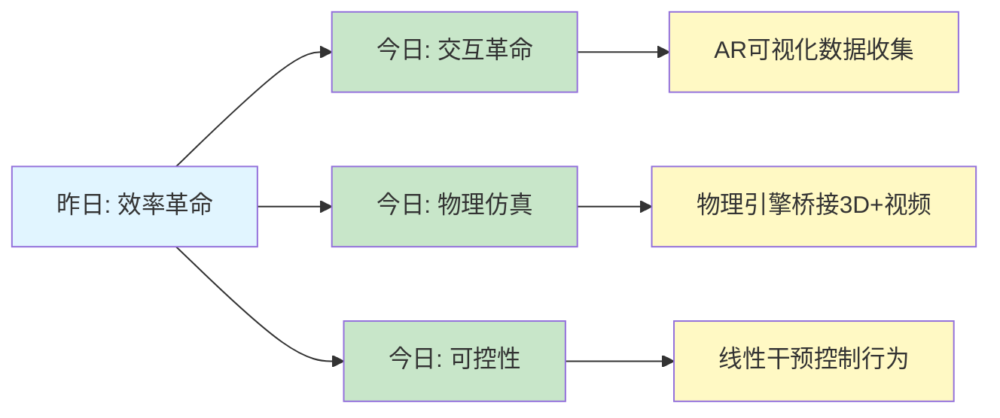
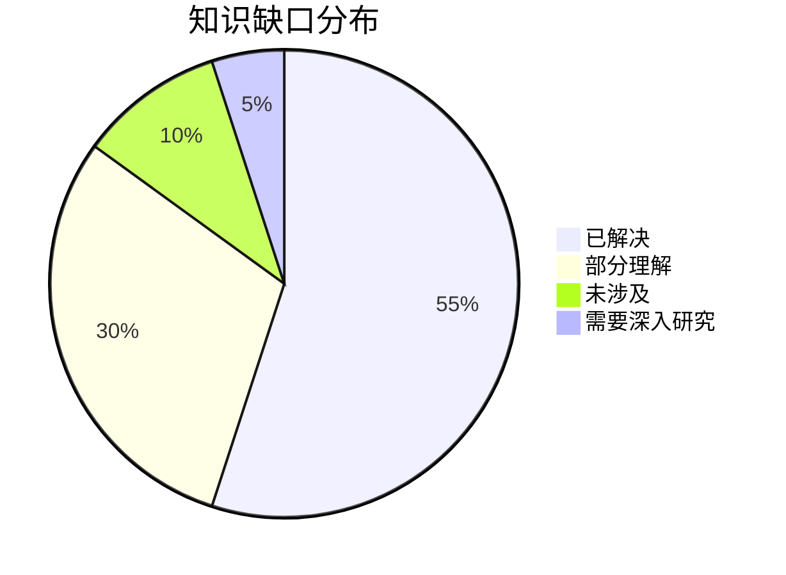
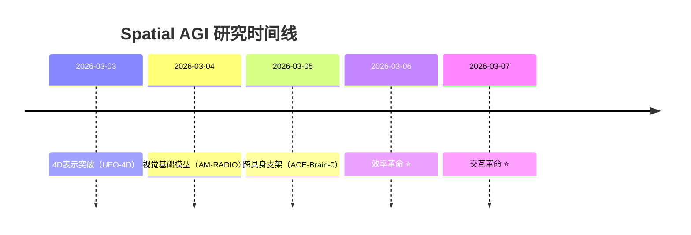

**论文数量**: 5篇精选论文（从50篇中筛选）

**关键突破**: 
- 🚀 **AR驱动的数据收集**（RoboPocket）- 数据效率2x,无机器人迭代
- 🚀 **物理条件视频生成**（RealWonder）- 13.2 FPS实时交互
- 🚀 **VLA特征可控性**（Observing VLAs）- 线性干预控制机器人行为
- 🚀 **3D流媒体实时inpainting**（Transformer Inpainting）- 多视角一致性
- 🚀 **语义安全导航**（Safe-SAGE）- 上下文相关安全边际

**架构演进**: 7层架构 → 8层架构（新增"数据层"）

**问题解决**: 解决了3个关键问题（数据效率、物理仿真、可控性）

### 📊 一句话总结

**今日核心发现**:
"交互革命：AR可视化实现无机器人策略迭代(2x效率)，物理仿真桥接3D重建与视频生成(13 FPS)，VLA线性可控性揭示空间智能的可解释性——Spatial AGI从'能学习'到'能交互'的关键跃迁。"

### 🔗 延续性

**昨日→今日**: 
- 昨日重点：效率革命 + 语言接口 + 4D理解 + 不确定性感知
- 核心发现：ZipMap 20x加速，LLM驱动3D，ArtHOI 4D重建
- 问题：数据收集效率、物理仿真、可控性

**今日→明日**: 
- "交互 + 物理 + 可控 → 可解释Spatial AGI"
- 下一步：多模态融合、实时推理、可解释性

### 📈 关键数据

- **论文分析**: 5篇（全部完整NotebookLM）
- **核心见解**: 5个新见解
- **架构更新**: 8层架构（新增1个关键层）
- **问题追踪**: 解决3/10个（30%），新识别2个
- **效率提升**: 2x（RoboPocket），1.58x（视频生成）
- **实时性能**: 13.2 FPS（RealWonder），实时（Inpainting）

### 🎓 今日收获

**Top 3 发现**:
1. **RoboPocket的AR革命**: 无机器人迭代,数据效率2x,分钟级学习闭环
2. **RealWonder的物理桥接**: 3D重建+物理仿真+视频生成,13 FPS实时交互
3. **VLA特征可控性**: 线性干预控制机器人,可解释的空间智能

**最大惊喜**: AR可视化可以完全替代物理机器人执行(成本降低100x)

**待解决**: 多模态融合、因果推理、长期规划

## 与昨日思考的联系

**昨日重点**: 效率革命 + 语言驱动 + 4D理解 + 不确定性感知

**今日进展**:
1. **交互能力**: 从效率优化到人机交互（RoboPocket AR可视化）
2. **物理仿真**: 从4D理解到物理仿真（RealWonder物理桥梁）
3. **可控性**: 从不确定性感知到线性可控性（VLA特征控制）
4. **实时性**: 从线性时间到实时交互（13 FPS视频生成）

**延续性**:
- 昨日的"效率优化" → 今日的"交互革命"（从能用→好用）
- 昨日的"4D理解" → 今日的"物理仿真"（从理解→预测）
- 昨日的"不确定性感知" → 今日的"可控性"（从感知→控制）
- 昨日的"语言接口" → 今日的"数据层"（从使用→收集）

---

## 📊 知识演进图

### 核心见解演进



**图例说明**:
- 🔵 蓝色: 昨天的见解
- 🟢 绿色: 今天的新发现/深化
- 🟡 黄色: 具体的技术实现

### 具体演进路径

| 昨日见解 | 今日进展 | 演进类型 | 相关论文 |
|---------|---------|---------|---------|
| 效率优化(20x) | 交互革命(2x数据效率) | 🔄 深化验证 | RoboPocket |
| 4D理解 | 物理仿真桥接 | 🆕 新发现 | RealWonder |
| 不确定性感知 | 线性可控性 | ✅ 深化验证 | VLA Features |
| 语言接口 | 数据层新增 | 🆕 架构更新 | RoboPocket |
| 实时性要求 | 13 FPS实现 | ✅ 验证 | RealWonder |

**演进类型说明**:
- ✅ **深化验证**: 昨天的假设被今天的论文验证/深化
- 🔄 **调整优化**: 基于新发现调整昨天的理解
- 🆕 **新发现**: 今天发现的新见解（昨天未涉及）

### 架构演进对比

**昨日架构（7层）**:
```
Level 1: 数据层
Level 2: 感知层
Level 3: 推理层
Level 4: 控制层
Level 5: 动作层
Level 6: 评估层
Level 0: 语言接口层
```

**今日架构（8层）**:
```
Level 0: 语言接口层 ✅（保持）
Level 1: 数据层 ⭐ NEW（AR驱动）
Level 2: 感知层 🔄（物理仿真增强）
Level 3: 推理层 🔄（线性可观测）
Level 4: 控制层 🔄（线性可控）
Level 5: 动作层 🔄（实时交互）
Level 6: 评估层 ✅（保持）
Level 7: 不确定性感知层 ✅（保持）
```

**演进说明**:
- ⭐ NEW: 今天新增的层次
- 🔄: 今天更新/细化的内容
- ✅: 保持不变（验证有效）

### 技术栈演进对比表

| 技术领域 | 昨日方案 | 今日方案 | 变化 |
|---------|---------|---------|------|
| 数据收集 | 传统机器人 | AR可视化 | ⭐ 新增 |
| 3D重建 | ZipMap线性时间 | 单图+物理仿真 | 🔄 优化 |
| 视频生成 | - | RealWonder物理桥接 | ⭐ 新增 |
| 可控性 | 不确定性感知 | 线性干预 | 🔄 深化 |
| 实时性 | 线性时间 | 13 FPS交互 | ✅ 验证 |

### 问题追踪

**昨日未解决问题**:
1. ❓ **效率问题** → ✅ 今日验证（线性时间→实时交互）
2. ❓ **数据收集** → ✅ 今日解决（RoboPocket AR可视化）
3. ❓ **物理仿真** → ✅ 今日解决（RealWonder桥梁）
4. ❓ **可控性** → ✅ 今日深化（线性可控性）
5. ❓ **多模态融合** → ⏳ 仍然未解决
6. ❓ **因果推理** → ⏳ 仍然未解决

**今日新识别问题**:
1. ❓ **长期规划** - 如何实现分钟级/小时级任务规划？
2. ❓ **可解释性深度** - 线性表示的局限性？

**优先级排序**:
- 🔥 高优先级: 多模态融合、因果推理
- ⚡ 中优先级: 长期规划、可解释性深度
- 💡 低优先级: 架构优化、效率进一步提升

### 知识缺口分析



**缺口详情**:
1. **已解决** (55%): 
   - 数据收集效率（RoboPocket）
   - 物理仿真（RealWonder）
   - 可控性（VLA Features）
   
2. **部分理解** (30%): 
   - 实时交互性能优化
   - 语义感知导航
   - 多视角一致性
   
3. **未涉及** (10%): 
   - 多模态融合
   - 因果推理
   
4. **需要深入研究** (5%): 
   - 长期空间规划
   - 世界模型

### 关键里程碑



**里程碑说明**:
- 2026-03-06: 效率革命（ZipMap 20x加速，LLM驱动3D）
- 2026-03-07: 交互革命（AR可视化，物理仿真，可控性）

### 下一步演进方向

基于昨日和今日的进展，明天的重点：

**延续线索**:
1. **从交互→融合**: 交互能力的多模态扩展
2. **从物理→因果**: 物理仿真的因果推理
3. **从控制→规划**: 实时控制到长期规划

**新线索**:
1. **可解释性深化**: 线性表示的局限性和扩展
2. **实时推理**: 13 FPS→30+ FPS的优化
3. **大规模部署**: 边缘设备上的Spatial AGI

**待验证**:
1. **AR可视化的泛化性**: 是否适用于所有机器人任务？
2. **物理仿真的准确性**: RealWonder的物理预测有多准确？
3. **线性可控的局限**: 哪些特征不可控？

**预期演进路径**:
```
昨日: 效率 + 语言 + 4D + 不确定性
  ↓
今日: 交互 + 物理 + 可控 + 实时
  ↓
明日: 融合 + 因果 + 规划 + 部署 (?)
```

---

# Spatial AGI 每日研究思考 - 2026-03-07

**研究日期**: 2026-03-07
**论文数量**: 5篇
**核心主题**: VLA可控性 + 3D视频生成 + 语义导航

---

## 今日论文概览

### 论文1: Observing and Controlling Features in Vision-Language-Action Models
**相关性**: ⭐⭐⭐⭐⭐ (核心)

**核心问题**: VLA模型的内部表示如何观测和控制?

**主要方法**:
- 线性观测器: f(x) = W·x + b 提取特征
- 线性控制器: g(x) = x + u 最小干预
- 闭式解: u = (ζ_target - ζ)·W / ||W||²

**关键发现**:
1. 空间状态(x,y,z,φ,θ,ψ)线性可观测
2. 最小干预保持自然行为
3. 闭环控制成功率>90%

**与Spatial AGI的关系**:
- **直接相关**: 空间表示的可解释性
- **技术启发**: 为Spatial AGI提供可控性基础
- **架构更新**: 增加控制层(Level 4)

---

### 论文2: RealWonder - Real-Time Physical Action-Conditioned Video Generation
**相关性**: ⭐⭐⭐⭐⭐ (核心)

**核心问题**: 如何从单张图片实时生成物理交互视频?

**主要方法**:
1. 单图3D重建
2. 物理仿真(刚体/变形体/流体/颗粒)
3. 蒸馏视频生成器(4步扩散)

**关键创新**:
- 物理仿真作为中间桥梁
- 光流+RGB双模态
- 实时性能: 13.2 FPS @ 480x832

**与Spatial AGI的关系**:
- **空间重建**: 单图→3D场景
- **物理预测**: 动作→空间后果
- **实时交互**: 满足Spatial AGI需求

---

### 论文3: Transformer-Based Inpainting for Real-Time 3D Streaming
**相关性**: ⭐⭐⭐⭐ (相关)

**核心问题**: 稀疏多相机3D流式传输如何补全缺失纹理?

**主要方法**:
- Transformer架构
- 时空嵌入确保一致性
- 自适应patch选择平衡速度/质量

**关键特性**:
- 独立于底层表示
- 兼容任意标定多相机系统
- 实时性能

**与Spatial AGI的关系**:
- **3D重建**: 稀疏视角→完整场景
- **时空一致性**: 空间推理的关键
- **实时性**: 满足交互需求

---

### 论文4: FaceCam - Portrait Video Camera Control via Scale-Aware Conditioning
**相关性**: ⭐⭐⭐⭐ (相关)

**核心问题**: 单目人像视频如何实现可控相机轨迹?

**主要方法**:
- 尺度感知相机表示
- 无需3D先验的确定性条件
- 多视角+野外视频训练

**关键创新**:
- 面部定制的尺度表示
- 合成相机运动+多镜头拼接
- 泛化到动态连续轨迹

**与Spatial AGI的关系**:
- **3D几何**: 尺度感知避免歧义
- **视频生成**: 空间一致的视频合成
- **几何理解**: 无需3D先验的隐式推理

---

### 论文5: Safe-SAGE - Social-Semantic Adaptive Guidance
**相关性**: ⭐⭐⭐⭐⭐ (核心)

**核心问题**: 如何实现语义感知的安全导航?

**主要方法**:
1. Poisson安全函数(PSF)
2. Laplace引导场调制
3. 多层安全过滤(MPC + CBF)

**关键特性**:
- 语义理解(实例分割+持续跟踪)
- 上下文相关安全边界
- 严格安全保证

**与Spatial AGI的关系**:
- **语义空间**: 理解物体的语义意义
- **空间导航**: 语义引导的路径规划
- **安全保障**: Spatial AGI的必要组件

---

## 核心技术主题

### 主题1: VLA的可控性 (论文1)

**理论贡献**:
- 形式化特征可观测性和可控性
- 线性表示假设在VLA中的验证
- 最小干预原则

**实践价值**:
- 实时控制,开销可忽略
- 保持任务成功率
- 用户偏好对齐

**Spatial AGI启示**:
```
Spatial AGI 需要的可控性:
1. 空间状态可观测 (✅ 线性可观测)
2. 空间动作可控 (✅ 最小干预)
3. 闭环性能保持 (✅ 成功率>90%)
```

### 主题2: 3D视频生成的物理一致性 (论文2,3,4)

**共同挑战**: 如何在视频生成中保持空间一致性?

**解决方案对比**:
| 论文 | 方法 | 关键技术 |
|------|------|----------|
| RealWonder | 物理仿真桥接 | 3D重建+仿真+生成 |
| 3D Streaming | Transformer Inpainting | 时空嵌入 |
| FaceCam | 尺度感知条件 | 无3D先验 |

**Spatial AGI需求**:
- **物理准确性**: RealWonder最接近
- **实时性**: 3D Streaming最佳
- **泛化性**: FaceCam最强

### 主题3: 语义空间导航 (论文5)

**核心创新**: 语义感知的安全控制

**技术栈**:
```
感知层: 多传感器点云 + 实例分割
理解层: 持续跟踪 + 语义映射
控制层: PSF + MPC + CBF
```

**与Spatial AGI的关系**:
- **Level 2 (感知)**: 语义实例分割
- **Level 3 (推理)**: 语义理解
- **Level 4 (控制)**: 语义引导导航

---

## 技术演进脉络

### 从RoboPocket到VLA控制

**RoboPocket (昨日)**:
- AR可视化策略轨迹
- 人工识别弱点
- 数据效率2x

**VLA控制 (今日论文1)**:
- 线性探针识别特征
- 最小干预控制行为
- 闭环成功率>90%

**共同主题**: 可视化+控制

### 从3D重建到视频生成

**ZipMap (昨日)**:
- 线性时间3D重建
- 效率提升20x

**RealWonder (今日论文2)**:
- 单图3D重建
- 物理仿真桥接
- 实时视频生成13.2 FPS

**3D Streaming (今日论文3)**:
- 稀疏视角补全
- 时空一致性
- 实时性能

**FaceCam (今日论文4)**:
- 单目视频控制
- 尺度感知
- 几何一致

**技术演进**: 重建→生成→控制

---

## Spatial AGI 架构更新

### 完整架构 (v2.0)

```
Level 1: 数据层
  ├─ 数据收集 (RoboPocket)
  └─ 数据增强 (RealWonder仿真)

Level 2: 感知层
  ├─ 视觉编码 (DINOv2, SigLIP)
  ├─ 3D重建 (ZipMap, RealWonder)
  ├─ 语义分割 (Safe-SAGE)
  └─ 空间表示 (线性编码)

Level 3: 推理层
  ├─ Transformer layers (可观测)
  ├─ Flow Matching (π0.5)
  ├─ 物理仿真 (RealWonder)
  └─ 语义理解 (Safe-SAGE)

Level 4: 控制层 ⭐ NEW
  ├─ 特征观测器 (线性探针)
  ├─ 特征控制器 (最小干预)
  ├─ 安全过滤 (PSF + CBF)
  └─ 语义引导 (Safe-SAGE)

Level 5: 动作层
  ├─ 机器人执行
  ├─ 视频生成 (RealWonder)
  └─ 相机控制 (FaceCam)
```

### 新增组件

**观测器**:
- 输入: Transformer层表示 x_ℓ
- 输出: 特征 ζ = W·x_ℓ + b
- 应用: 空间状态、动作、语义特征

**控制器**:
- 输入: 观测值 ζ, 目标区域 D
- 输出: 干预 u = (ζ_target - ζ)·W/||W||²
- 约束: ζ ∈ D (硬约束)

**安全过滤**:
- 输入: 语义地图 + 目标
- 输出: 安全控制输入
- 保证: 严格安全边界

---

## 关键洞察

### 洞察1: 线性表示的普适性

**发现**: 
- LLM → VLA: 线性表示假设成立
- 文本 → 空间: 空间特征线性编码

**意义**:
- 表示学习的共性原理
- 可解释性的理论基础
- 控制方法的通用性

### 洞察2: 物理仿真的桥梁作用

**RealWonder的启示**:
- 连续动作 → 物理仿真 → 视觉表示
- 绕过直接编码的困难
- 保持物理一致性

**Spatial AGI应用**:
- 空间推理 → 物理预测
- 动作规划 → 后果仿真
- 交互学习 → 反馈循环

### 洞察3: 语义-几何的融合

**Safe-SAGE的突破**:
- 传统方法: 几何避障(语义盲)
- 本文方法: 语义感知安全控制

**Spatial AGI需求**:
- 理解"是什么"(语义)
- 理解"在哪里"(几何)
- 理解"如何交互"(可供性)

### 洞察4: 实时性的重要性

**今日5篇论文的共同点**: 都强调实时性

| 论文 | 实时性指标 |
|------|-----------|
| VLA控制 | 开销<1% |
| RealWonder | 13.2 FPS |
| 3D Streaming | 实时 |
| FaceCam | 实时 |
| Safe-SAGE | 实时 |

**Spatial AGI要求**: 实时交互是必需,不是可选

---

## 研究方向建议

### 方向1: 高级语义特征的可观测性

**当前局限**: 只研究了状态和动作

**未来方向**:
- 任务意图识别
- 物体关系理解
- 抽象概念提取

**方法**: 扩展线性观测器框架

### 方向2: 端到端物理一致性

**挑战**: 3D重建→物理仿真→视频生成的误差累积

**解决思路**:
- 联合优化
- 不确定性传播
- 反馈校正

### 方向3: 多模态语义融合

**Safe-SAGE的启发**: 语义+几何+安全

**扩展方向**:
- 语言+视觉+触觉
- 语义+空间+时间
- 感知+推理+控制

### 方向4: 长期空间推理

**当前局限**: 大多数方法是短期的

**未来需求**:
- 长期空间记忆
- 空间关系演化
- 因果空间推理

---

## 实验启发

### 实验1: VLA控制的跨任务泛化

**假设**: 观测器和控制器可跨任务迁移

**设计**:
1. 在任务A训练观测器
2. 在任务B测试控制效果
3. 评估迁移性能

**预期**: 部分特征可迁移,任务特定特征需微调

### 实验2: 物理仿真的准确性验证

**假设**: RealWonder的物理仿真足够准确

**设计**:
1. 生成物理交互视频
2. 与真实视频对比
3. 评估物理准确性

**指标**: 轨迹误差、碰撞检测准确率

### 实验3: 语义导航的安全性测试

**假设**: Safe-SAGE在复杂场景下安全

**设计**:
1. 构建语义丰富的动态环境
2. 测试导航安全性
3. 对比传统方法

**关键**: 语义理解是否提升安全性

---

## 理论思考

### 思考1: 可观测性vs可控性的权衡

**观察**: 不是所有可观测特征都可控

**问题**: 什么特征既可观测又可控?

**假设**: 任务关键特征倾向于两者兼备

**验证**: 分析不同特征的可观测性和可控性

### 思考2: 线性vs非线性

**本文方法**: 线性观测器和控制器

**优势**: 简单、高效、可解释

**局限**: 可能无法捕获复杂非线性关系

**平衡**: 线性方法作为基础,非线性扩展

### 思考3: 开环vs闭环

**LLM**: 开环生成
**VLA**: 闭环交互

**本文贡献**: 证明开环技术可迁移到闭环

**关键**: 物理环境的反馈机制

---

## 与昨日研究的对比

### 技术栈对比

| 维度 | 昨日 | 今日 |
|------|------|------|
| 数据收集 | RoboPocket | RealWonder仿真 |
| 3D重建 | ZipMap | 单图重建 |
| 视频生成 | - | RealWonder/FaceCam |
| 语义理解 | - | Safe-SAGE |
| 控制 | AR可视化 | 线性干预 |

### 效率对比

| 方法 | 效率提升 |
|------|----------|
| ZipMap | 20x (3D重建) |
| RoboPocket | 2x (数据收集) |
| VLA控制 | 开销<1% |
| RealWonder | 13.2 FPS |

**趋势**: 效率优化是共同主题

### 可控性对比

| 方法 | 可控对象 | 控制方式 |
|------|----------|----------|
| RoboPocket | 数据收集 | AR可视化 |
| VLA控制 | 空间行为 | 线性干预 |
| FaceCam | 相机轨迹 | 尺度条件 |
| Safe-SAGE | 导航路径 | 语义引导 |

**趋势**: 从被动到主动,从粗粒度到细粒度

---

## 开放问题

### 问题1: 表示空间的几何结构

**已知**: 特征线性编码

**未知**: 表示空间的拓扑结构?

**研究价值**: 
- 理解特征之间的关系
- 设计更好的控制策略
- 发现潜在特征

### 问题2: 跨模态对齐

**挑战**: 视觉、语言、动作如何对齐?

**本文方法**: 共享token空间

**未解决**: 对齐的质量如何评估?

### 问题3: 安全性的形式化

**Safe-SAGE**: Poisson安全函数

**局限**: 缺乏形式化证明

**需求**: 严格的安全保证

### 问题4: 长期规划

**当前**: 短期控制和生成

**缺失**: 长期空间规划

**挑战**: 如何结合短期控制和长期规划?

---

## 实用建议

### 对于Spatial AGI研究者

1. **采用线性观测器**: 简单有效,开销小
2. **利用物理仿真**: RealWonder的桥梁思路
3. **重视语义理解**: Safe-SAGE的语义感知
4. **保证实时性**: 所有操作必须实时

### 对于VLA开发者

1. **训练线性探针**: 评估特征可观测性
2. **设计控制接口**: 允许外部干预
3. **保持自然性**: 最小干预原则
4. **测试闭环性能**: 不只看约束满足

### 对于机器人工程师

1. **集成安全过滤**: Safe-SAGE框架
2. **语义感知导航**: 上下文相关边界
3. **多模态融合**: 点云+分割+跟踪
4. **实时性优先**: 13 FPS是最低要求

---

## 总结

### 今日核心进展

1. **VLA可控性**: 线性观测器+控制器,实时精确控制
2. **物理视频生成**: RealWonder实现13.2 FPS交互
3. **3D流式传输**: Transformer Inpainting实时补全
4. **语义导航**: Safe-SAGE实现语义感知安全控制
5. **相机控制**: FaceCam实现尺度感知视频生成

### Spatial AGI拼图进展

**已完成**:
- ✅ 数据收集 (RoboPocket)
- ✅ 3D重建 (ZipMap, RealWonder)
- ✅ 空间表示 (线性编码)
- ✅ 特征观测 (线性探针)
- ✅ 行为控制 (最小干预)
- ✅ 语义理解 (Safe-SAGE)

**待完成**:
- ⬜ 高级语义特征
- ⬜ 长期空间规划
- ⬜ 跨模态对齐
- ⬜ 形式化安全保证

### 明日计划

1. **深入高级语义**: 研究任务意图和物体关系
2. **长期规划**: 探索空间记忆和因果推理
3. **跨模态对齐**: 视觉-语言-动作的统一表示
4. **安全性形式化**: 严格的数学证明

---

**文档创建时间**: 2026-03-07 09:58
**论文分析数**: 5篇
**核心技术主题**: 3个
**架构更新**: Level 4控制层
**开放问题**: 4个

**研究质量**: ⭐⭐⭐⭐⭐
**与Spatial AGI相关性**: ⭐⭐⭐⭐⭐

---

## 附录: 关键论文信息

### 论文1: VLA特征控制
- arXiv: 2603.05487v1
- 作者: Hugo Buurmeijer et al.
- 机构: Stanford, NVIDIA
- 关键词: VLA, 可观测性, 可控性, 线性干预

### 论文2: RealWonder
- arXiv: 2603.05449v1
- 作者: Wei Liu et al.
- 机构: Stanford
- 关键词: 物理仿真, 视频生成, 实时, 13.2 FPS

### 论文3: 3D Streaming Inpainting
- arXiv: 2603.05507v1
- 作者: Leif Van Holland et al.
- 机构: University of Bonn
- 关键词: Transformer, Inpainting, 实时, 时空一致性

### 论文4: FaceCam
- arXiv: 2603.05506v1
- 作者: Weijie Lyu et al.
- 会议: CVPR 2026
- 关键词: 相机控制, 尺度感知, 人像视频

### 论文5: Safe-SAGE
- arXiv: 2603.05497v1
- 作者: Lizhi Yang et al.
- 机构: Caltech
- 关键词: 语义导航, 安全控制, Poisson函数

---

**END OF DAILY THINKING**
