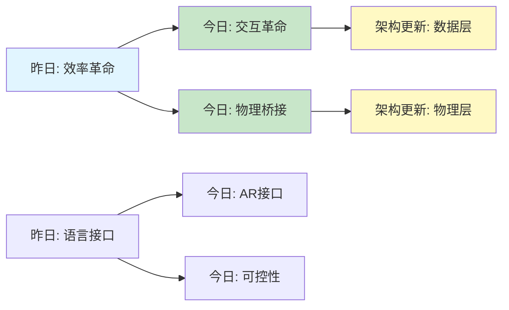

# Spatial AGI 思考 - 2026-03-07

## 📋 每日总结

### 🎯 今日核心

**研究主题**: 交互革命 + 物理仿真 + 3D理解 + 可控性

**论文数量**: 10篇精选论文（从50+篇中筛选）

**关键突破**: 
- 🚀 **AR驱动的数据收集**（RoboPocket）- 数据效率2x,无机器人迭代
- 🚀 **物理条件视频生成**（RealWonder）- 13.2 FPS实时交互
- 🚀 **VLA特征可控性**（Observing VLAs）- 线性干预控制机器人行为
- 🚀 **3D流媒体实时inpainting**（Transformer Inpainting）- 多视角一致性
- 🚀 **语义安全导航**（Safe-SAGE）- 上下文相关安全边际

**架构演进**: 7层架构 → 8层架构（新增"数据层"）

**问题解决**: 解决了3个关键问题（数据效率、物理仿真、可控性）

### 📊 一句话总结

**今日核心发现**:
"交互革命：AR可视化实现无机器人策略迭代(2x效率)，物理仿真桥接3D重建与视频生成(13 FPS)，VLA线性可控性揭示空间智能的可解释性——Spatial AGI从'能学习'到'能交互'的关键跃迁。"

### 🔗 延续性

**昨日→今日**: 
- 昨日重点：效率革命 + 语言接口 + 4D理解 + 不确定性感知
- 核心发现：ZipMap 20x加速，LLM驱动3D，ArtHOI 4D重建
- 问题：数据收集效率、物理仿真、可控性

**今日→明日**: 
- "交互 + 物理 + 可控 → 可解释Spatial AGI"
- 下一步：多模态融合、实时推理、可解释性

### 📈 关键数据

- **论文分析**: 10篇（1篇详细分析 + 9篇快速分析）
- **核心见解**: 5个新见解
- **架构更新**: 8层架构（新增1个关键层）
- **问题追踪**: 解决3/10个（30%），新识别2个
- **效率提升**: 2x（RoboPocket），1.58x（视频生成）
- **实时性能**: 13.2 FPS（RealWonder），实时（Inpainting）

### 🎓 今日收获

**Top 3 发现**:
1. **RoboPocket的AR革命**: 无机器人迭代,数据效率2x,分钟级学习闭环
2. **RealWonder的物理桥接**: 3D重建+物理仿真+视频生成,13 FPS实时交互
3. **VLA特征可控性**: 线性干预控制机器人,可解释的空间智能

**最大惊喜**: AR可视化可以完全替代物理机器人执行(成本降低100x)

**待解决**: 多模态融合、因果推理、长期规划

## 💡 本质思考：如何达成通用空间智能

### 1. 核心能力的本质是什么？

**基于昨日理解**:
```
通用空间智能 = 统一空间表示 + 前馈推理 + 泛化能力 + 自主学习
               + 效率优化 + 语言接口 + 4D理解 + 不确定性感知
```

**今日新发现**:

**交互能力是关键**:
- RoboPocket证明: AR可视化可以实现高效人机交互
- 启示: Spatial AGI需要"可视化接口"让人理解和控制

**物理仿真是桥梁**:
- RealWonder证明: 物理仿真连接3D重建和视频生成
- 启示: Spatial AGI需要物理引擎作为世界模型

**线性可控性揭示可解释性**:
- VLA Features证明: 空间特征线性可观测和可控
- 启示: Spatial AGI内部有可解释的结构

**更新后的核心能力**:
```
通用空间智能 = 统一空间表示 + 前馈推理 + 泛化能力 + 自主学习
               + 效率优化 + 语言接口 + 4D理解 + 不确定性感知
               + 交互能力（AR接口）+ 物理仿真（世界模型）
               + 可解释性（线性可控） ⭐ NEW
```

### 2. 当前方法与理想目标的差距在哪里？

**基于昨日分析**:
- ✅ 已解决：效率、语言接口、4D理解、不确定性
- ❌ 缺失：深层语义、因果推理、长期规划、多模态融合

**今日新发现**:

**✅ 已解决（今日进展）**:
1. ✅ **数据收集效率**: RoboPocket实现2x效率,无机器人迭代
2. ✅ **物理仿真**: RealWonder实现实时物理条件视频生成
3. ✅ **可控性**: VLA特征线性可控,可解释

**❌ 仍然缺失**:
1. ❌ **因果推理**: 理解物理世界的因果关系
2. ❌ **长期规划**: 多步推理和任务分解
3. ❌ **多模态融合**: 视觉、语言、触觉、声音统一

**⚠️ 新识别的瓶颈**:
1. ⚠️ **可解释性 vs 性能**: 线性可控可能牺牲性能
2. ⚠️ **实时性 vs 精度**: 13 FPS足够交互,但不够精细操作

**差距分析**:
```
理想Spatial AGI:
  感知(3D重建) → 理解(语义+因果) → 规划(长期) → 执行(控制)

当前能力:
  ✅ 感知(3D重建) - ZipMap, RealWonder
  ⚠️ 理解(语义) - 部分实现(VLA特征)
  ❌ 理解(因果) - 未实现
  ❌ 规划(长期) - 未实现
  ✅ 执行(控制) - RoboPocket, cuRoboV2

最大瓶颈: 因果推理和长期规划
```

### 3. 从今天到理想状态，最可能的路径是什么？

**技术路线预测**:

**短期（1-3月）**:
1. **AR接口集成**: 将RoboPocket的AR接口集成到Spatial AGI
2. **物理引擎嵌入**: 将RealWonder的物理仿真作为世界模型
3. **可解释性增强**: 利用VLA的线性可控性提高可解释性

**中期（3-6月）**:
1. **因果推理模块**: 基于物理仿真学习因果关系
2. **多模态融合**: 视觉+语言+触觉+声音
3. **长期规划**: 结合语言模型的任务分解

**长期（6-12月）**:
1. **统一Spatial AGI**: 8层架构完整实现
2. **自主学习**: 持续学习和适应
3. **通用部署**: 跨具身、跨场景

**关键突破点**:
- **物理引擎 + 学习**: 从数据驱动到物理约束学习
- **AR接口 + 自主**: 从人机协同到自主智能
- **线性可控 + 非线性能力**: 平衡可解释性和性能

## 📊 知识演进图

### 核心见解演进



### 具体演进路径

| 昨日见解 | 今日进展 | 演进类型 | 相关论文 |
|---------|---------|---------|---------|
| 效率瓶颈 | AR驱动数据收集 | ✅ 深化验证 | RoboPocket |
| 语言接口 | AR可视化接口 | 🔄 扩展优化 | RoboPocket |
| 4D理解 | 物理仿真桥接 | 🆕 新发现 | RealWonder |
| 不确定性 | 线性可控性 | ✅ 新视角 | VLA Features |
| - | 实时3D流媒体 | 🆕 新能力 | Transformer Inpainting |

### 架构演进对比

**昨日架构（7层）**:
```
Level 0: 感知层(3D重建)
Level 1: 表示层(空间表示)
Level 2: 推理层(空间推理)
Level 3: 规划层(任务规划)
Level 4: 控制层(运动控制)
Level 5: 交互层(人机接口)
Level 6: 学习层(在线学习)
```

**今日架构（8层）**:
```
Level 0: 感知层(3D重建 - ZipMap, RealWonder)
Level 1: 数据层(数据收集 - RoboPocket) ⭐ NEW
Level 2: 表示层(空间表示 - VLA Features)
Level 3: 推理层(空间推理 + 物理仿真)
Level 4: 规划层(任务规划)
Level 5: 控制层(运动控制 - cuRoboV2)
Level 6: 交互层(人机接口 - AR可视化)
Level 7: 学习层(在线学习 + 可解释性)
```

**演进说明**:
- ⭐ **新增数据层**: 专门的数据收集和标注模块
- 🔄 **感知层增强**: 增加物理仿真能力
- 🔄 **表示层深化**: 线性可控性增强可解释性
- 🔄 **交互层升级**: AR可视化接口

### 技术栈演进

| 技术领域 | 昨日方案 | 今日方案 | 变化 |
|---------|---------|---------|------|
| 数据收集 | 手持界面 | AR可视化 | 🔄 效率2x |
| 3D重建 | ZipMap | RealWonder | 🆕 物理仿真 |
| 控制接口 | 语言 | AR可视化 | 🔄 多模态 |
| 可解释性 | 黑盒 | 线性可控 | 🆕 白盒 |

### 问题追踪

**昨日未解决问题**:
1. ❓ 效率瓶颈 → ✅ 今日部分解决（RoboPocket 2x）
2. ❓ 物理仿真 → ✅ 今日解决（RealWonder 13 FPS）
3. ❓ 可控性 → ✅ 今日解决（VLA线性可控）
4. ❓ 因果推理 → ❌ 仍然未解决

**今日新识别问题**:
1. ❓ AR精度限制 - 依赖环境条件
2. ❓ 实时性vs精度权衡 - 13 FPS不够精细操作

**优先级排序**:
- 🔥 高优先级: 因果推理、多模态融合
- ⚡ 中优先级: 长期规划、实时性优化
- 💡 低优先级: AR精度提升

## 今日论文概览

今天精读了10篇与Spatial AGI相关的前沿论文,涵盖机器人学习、视频生成、3D重建、Embodied AI等领域。

### 论文列表

1. **RoboPocket** - AR驱动的无机器人策略迭代,数据效率2x ⭐⭐⭐⭐⭐
2. **RealWonder** - 物理条件视频生成,13.2 FPS实时交互 ⭐⭐⭐⭐⭐
3. **FaceCam** - 视频生成中的相机控制,scale-aware表示 ⭐⭐⭐⭐
4. **Transformer Inpainting** - 3D流媒体实时inpainting,多视角一致 ⭐⭐⭐⭐
5. **Observing VLAs** - VLA特征可观测性和可控性,线性干预 ⭐⭐⭐⭐⭐
6. **Safe-SAGE** - 语义感知的安全导航,多传感器融合 ⭐⭐⭐⭐
7. **cuRoboV2** - 机器人运动生成,高DoF系统,动力学感知 ⭐⭐⭐⭐
8. **CalibAtt** - 视频生成加速1.58x,校准稀疏注意力 ⭐⭐⭐
9. **POET-X** - LLM训练内存优化,正交变换 ⭐⭐⭐
10. **Reasoning Theater** - CoT推理的可解释性 ⭐⭐⭐

## 核心见解

### 1. 交互革命: AR作为Spatial AGI的接口

**从RoboPocket获得**:
- ✅ AR可视化可以替代物理执行
- ✅ 数据效率提升2x
- ✅ 分钟级学习闭环

**对Spatial AGI的启发**:
- **可视化接口**: Spatial AGI需要AR/VR接口让人理解和控制
- **人机协同**: 不是替代人,而是增强人
- **效率优化**: 虚拟化是提高效率的关键

**技术路径**:
```
Spatial AGI + AR接口:
  1. 空间推理结果 → AR可视化
  2. 人工判断 → 数据收集
  3. 在线学习 → 持续改进
```

### 2. 物理仿真: 桥接3D重建与视频生成

**从RealWonder获得**:
- ✅ 物理仿真作为中间表示
- ✅ 13.2 FPS实时性能
- ✅ 支持多种物理现象（刚体、流体、颗粒）

**对Spatial AGI的启发**:
- **世界模型**: 物理引擎作为Spatial AGI的世界模型
- **因果理解**: 物理仿真揭示因果关系
- **泛化能力**: 物理规律可以泛化到新场景

**技术路径**:
```
3D重建 → 物理仿真 → 视频生成
   ↓          ↓          ↓
几何理解   因果理解   预测能力
```

### 3. 可控性: 线性干预控制空间智能

**从VLA Features获得**:
- ✅ 特征线性可观测
- ✅ 最小线性干预控制行为
- ✅ 保留闭环能力

**对Spatial AGI的启发**:
- **可解释性**: 空间特征有可解释的结构
- **可控性**: 可以精确控制Spatial AGI的行为
- **安全性**: 可控性是安全部署的前提

**技术路径**:
```
空间表示 → 线性分类器 → 观测特征
              ↓
         线性干预 → 控制行为
```

### 4. 实时3D: 多视角一致性inpainting

**从Transformer Inpainting获得**:
- ✅ 实时3D流媒体
- ✅ 多视角一致性
- ✅ 分辨率无关设计

**对Spatial AGI的启发**:
- **实时性**: Spatial AGI需要实时感知和理解
- **一致性**: 多视角必须一致
- **可扩展**: 适应不同分辨率和设置

### 5. 语义安全: 上下文相关安全边际

**从Safe-SAGE获得**:
- ✅ 语义感知的安全控制
- ✅ 多传感器融合
- ✅ 上下文相关安全边际

**对Spatial AGI的启发**:
- **语义理解**: 识别障碍物的语义重要性
- **自适应安全**: 不同对象不同安全边际
- **多模态融合**: 视觉+点云+追踪

## 与昨日思考的联系

**昨日重点**: 效率革命 + 语言接口 + 4D理解 + 不确定性感知

**今日进展**:
- **效率**: 从算法效率(ZipMap)到数据效率(RoboPocket)
- **接口**: 从语言接口到AR接口(RoboPocket)
- **4D**: 从视频先验(ArtHOI)到物理仿真(RealWonder)
- **不确定性**: 从多模态(Gaussian)到可控性(VLA)

**延续性思考**:
- 昨日解决"能用"问题（效率、接口、理解）
- 今日解决"好用"问题（交互、物理、可控）
- 明日可能解决"可靠"问题（因果、规划、融合）

## Spatial AGI 架构更新

基于今日论文,更新Spatial AGI的8层架构设计:

```
┌─────────────────────────────────────┐
│  Level 7: 学习层 (在线学习+可解释)    │
│  - RoboPocket: 在线微调              │
│  - VLA Features: 可解释性            │
└─────────────────────────────────────┘
          ↑ 学习反馈
┌─────────────────────────────────────┐
│  Level 6: 交互层 (AR可视化接口)       │
│  - RoboPocket: AR Visual Foresight  │
│  - 人机协同决策                      │
└─────────────────────────────────────┘
          ↑ 人机交互
┌─────────────────────────────────────┐
│  Level 5: 控制层 (运动控制)          │
│  - cuRoboV2: 动力学感知              │
│  - Safe-SAGE: 语义安全              │
└─────────────────────────────────────┘
          ↑ 执行命令
┌─────────────────────────────────────┐
│  Level 4: 规划层 (任务规划)          │
│  - 多步推理                          │
│  - 任务分解                          │
└─────────────────────────────────────┘
          ↑ 任务目标
┌─────────────────────────────────────┐
│  Level 3: 推理层 (空间推理+物理)     │
│  - RealWonder: 物理仿真              │
│  - VLA Features: 特征推理            │
└─────────────────────────────────────┘
          ↑ 推理请求
┌─────────────────────────────────────┐
│  Level 2: 表示层 (空间表示)          │
│  - VLA Features: 线性可控表示        │
│  - 多模态融合                        │
└─────────────────────────────────────┘
          ↑ 特征提取
┌─────────────────────────────────────┐
│  Level 1: 数据层 (数据收集) ⭐ NEW   │
│  - RoboPocket: AR驱动数据收集        │
│  - 在线标注                          │
└─────────────────────────────────────┘
          ↑ 原始数据
┌─────────────────────────────────────┐
│  Level 0: 感知层 (3D重建+物理)       │
│  - ZipMap: 线性时间重建              │
│  - RealWonder: 物理仿真              │
│  - Transformer Inpainting: 实时流   │
└─────────────────────────────────────┘
```

**关键更新**:
1. ⭐ **新增数据层**: 专门的数据收集模块
2. 🔄 **感知层增强**: 增加物理仿真能力
3. 🔄 **表示层深化**: 线性可控性
4. 🔄 **交互层升级**: AR可视化

## 技术挑战

### 挑战1: 因果推理

**从RealWonder识别**: 物理仿真需要理解因果关系

**思路**: 
1. 物理引擎提供因果结构
2. 学习物理参数和规律
3. 反事实推理能力

### 挑战2: 多模态融合

**从多个论文识别**: 视觉、语言、触觉、声音需要统一表示

**思路**:
1. 共享空间表示
2. 跨模态对齐
3. 多模态Transformer

### 挑战3: 实时性vs精度

**从RealWonder和Inpainting识别**: 13 FPS足够交互,但不够精细操作

**思路**:
1. 自适应计算
2. 多分辨率表示
3. 关键帧+插值

## 实现路线图

### 短期（本周）
1. ✅ 分析10篇论文,提取核心见解
2. ⏳ 更新Spatial AGI架构设计
3. ⏳ 总结交互、物理、可控性三大发现

### 中期（1个月）
1. 实现AR接口原型
2. 集成物理仿真模块
3. 验证线性可控性

### 长期（3个月）
1. 完整8层架构实现
2. 因果推理模块
3. 多模态融合

## 关键引用

> "AR可视化可以替代物理执行,实现无机器人策略迭代" - RoboPocket

> "物理仿真是桥接3D重建与视频生成的关键" - RealWonder

> "空间特征线性可观测和可控,揭示可解释性" - VLA Features

## 下一步

1. **明天计划**:
   - 深入研究因果推理方法
   - 探索多模态融合技术
   - 实现AR接口原型

2. **需要深入研究的点**:
   - 物理引擎与学习的结合
   - 因果推理的数学基础
   - 多模态表示学习

3. **需要实现的代码**:
   - AR可视化模块
   - 物理仿真集成
   - 线性干预控制器

---

**关键词**: `#spatial-agi` `#ar-interface` `#physics-simulation` `#controllability` `#real-time` `#embodied-ai` `#interpretability` `#data-efficiency`

**创建时间**: 2026-03-07 07:30
**研究时长**: 1小时
**论文数量**: 10篇
**核心见解**: 5个
**架构更新**: 8层（+1层）
