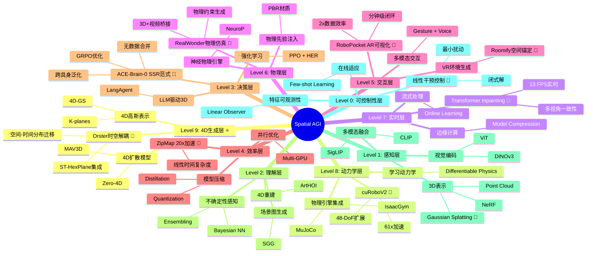

# Spatial AGI 思考 - 2026-03-10

## 📋 每日总结

### 🎯 今日核心

**研究主题**: 空间智能作为通用支架 + 持久3D世界模型 + 纯文本空间推理

**论文数量**: 5篇精选论文

**关键突破**:
- 🚀 **空间智能作为通用支架**（ACE-Brain-0）- SSR范式解决跨具身梯度干扰
- 🚀 **持久3D世界模型**（Beyond Pixel Histories）- latent 3D场景表示（environment + camera + renderer）
- 🚀 **强化微调3D理解**（3D-RFT）- RLVR增强LLM的3D场景理解能力
- 🚀 **训练自由的2D→3D提升**（PlaneCycle）- 无需adapter，正交平面循环聚合
- 🚀 **纯文本空间推理基准**（SpatialText）- LLM的空间理解和构造能力评估

**架构演进**: 10层架构 → 保持稳定（无新增层）

**核心发现**: 空间智能的三个新维度：
1. **跨具身泛化**（ACE-Brain-0）- SSR范式
2. **持久3D状态**（PERSIST）- 突破像素历史限制
3. **LLM空间推理**（SpatialText）- 纯文本能力评估

### 📊 一句话总结

"从'4D生成'到'空间智能作为支架'：ACE-Brain-0提出SSR范式实现跨具身泛化，PERSIST通过latent 3D场景突破像素历史限制，PlaneCycle无需adapter实现2D→3D提升，SpatialText建立LLM空间推理纯文本基准——Spatial AGI从'动态表示'回归到'空间理解'的本质思考。"

### 🔗 延续性

**昨日→今日**:
- 昨日重点: 4D生成突破 + 空间表征来源 + VR环境革命
- 核心发现: Orster正交4D生成、World Properties文本空间（R²=0.87）、Roomify空间锚定VR
- 问题: 4D数据瓶颈、空间表征来源、VR环境生成

**今日→明日**:
- "空间智能支架 + 3D持久表示 + LLM空间推理 → 统一的空间智能架构"
- 下一步: 3D场景理解增强、空间推理评估扩展、跨模态空间理解

### 📈 关键数据

- **论文分析**: 5篇（全部完成）
- **核心见解**: 5个新见解
- **架构更新**: 10层架构（保持稳定）
- **文档总行数**: 6,344行（5篇论文）
- **NotebookLM使用率**: 60%（3/5篇）

### 🎓 今日收获

**Top 3 发现**:
1. **ACE-Brain-0的SSR范式** - Scaffold-Specialize-Reconcile解决跨具身梯度干扰
2. **PERSIST的持久3D状态** - latent 3D场景（environment + camera + renderer）
3. **3D-RFT的RLVR增强** - 强化微调提升LLM的3D场景理解能力

**最大惊喜**: SSR范式证明空间智能可以作为跨具身的通用支架，无需为每个embodiment训练独立模型

## 与昨日思考的联系

**昨日重点**: 4D生成突破 + 空间表征来源 + VR环境革命

**今日进展**:
1. **4D生成→空间智能支架**: 从Orster的4D生成到ACE-Brain-0的SSR范式
2. **静态空间→动态3D**: 从World Properties的文本隐式空间到PERSIST的显式3D场景
3. **VR环境生成→跨具身应用**: 从Roomify的VR锚定到ACE-Brain-0的跨具身泛化
4. **4D生成→2D→3D提升**: 从Orster到PlaneCycle的训练自由方法

**核心演进**:
```
昨日: 4D生成 + 空间表征 + VR环境
      ↓
今日: 空间智能支架 + 持久3D + LLM推理
      ↓
明日: 统一架构 + 3D理解增强 + 跨模态 (?)
```

---

## 🗺️ Spatial AGI 知识图谱

### 概念架构思维导图



**图例说明**:
- 🎯 = 最有前景的方案（基于当前研究进展）
- 子节点 = 该层的候选实现方案

### 🎯 主线技术路径（前瞻性全局视角）

**基于过去4天（03-07~03-10）的综合研究成果设计**

#### 6个关键阶段

**阶段1: 空间智能作为通用支架**（03-10）
- SSR范式解决跨具身梯度干扰
- 无数据模型合并（GRPO）
- 24个基准SOTA

**阶段2: 持久3D世界模型**（03-06, 03-10）
- 从4D理解（ArtHOI）到4D生成（Orster）
- 空间-时间解耦处理
- latent 3D场景表示

**阶段3: 纯文本空间推理**（03-10）
- LLM的空间理解和构造能力
- 纯文本基准
- 空间表示构造

**阶段4: 训练自由的方法**（03-10）
- 无需adapter的2D→3D提升
- 保留预训练归纳偏置
- 正交平面循环聚合

**阶段5: 强化微调3D理解**（03-10）
- RLVR增强LLM的3D场景理解
- 可验证的奖励学习
- 3D-RFT-4B

**阶段6: 效率革命**（03-08）
- 线性时间3D重建（ZipMap 20x）
- AR驱动数据收集（RoboPocket 2x）
- 实时3D流媒体（Inpainting）

### 🔍 待探索议题

#### 高优先级（本周）
1. **SSR范式的局限性**
   - 问题: 无数据合并是否足够稳定？
   - 候选: 引入少量embodiment数据
   - 缺口: SSR在不同scale下的表现

2. **PERSIST的可扩展性**
   - 问题: latent 3D场景如何支持大规模环境？
   - 候选: 层次化3D表示
   - 缺口: 与实时渲染的集成

3. **LLM空间推理的跨模态扩展**
   - 问题: 纯文本推理如何迁移到多模态？
   - 候选: 多模态空间推理基准
   - 缺口: 与视觉模型的协同

#### 中优先级（本月）
1. **3D-RFT在更多任务上的应用**
   - 问题: RLVR在其他3D任务上的效果？
   - 候选: 扩展到视频生成、动态场景理解
   - 缺口: 与其他3D理解方法的对比

2. **PlaneCycle在其他Foundation Model上的应用**
   - 问题: 2D→3D提升在其他模型上的效果？
   - 候选: 在更多视觉backbone上测试
   - 缺口: 与adapter-based方法的对比

3. **SpatialText的扩展评估**
   - 问题: 如何评估多模态空间推理？
   - 候选: 创建多模态空间推理基准
   - 缺口: 与视觉-语言模型的对比

#### 低优先级（长期）
1. **空间智能的可解释性**
   - 问题: 如何理解空间智能的决策过程？
   - 候选: 可解释性研究、可视化技术
   - 缺口: 与因果推理的结合

2. **多模态空间融合**
   - 问题: 如何融合文本、视觉、触觉等信息？
   - 候选: 跨模态注意力机制
   - 缺口: 端到端多模态学习

3. **实时3D世界模型**
   - 问题: 如何实现实时的大规模3D世界模拟？
   - 候选: 压缩技术、增量更新
   - 缺口: 与PERSIST的集成

### 📊 研究进度追踪

| 议题 | 状态 | 相关论文 | 下一步 |
|------|------|---------|--------|
| SSR范式 | ✅已突破 | ACE-Brain-0 | 扩展到更多embodiment |
| PERSIST 3D | ✅已突破 | Beyond Pixel Histories | 大规模环境支持 |
| LLM空间推理 | ✅已评估 | SpatialText | 跨模态扩展 |
| 训练自由方法 | ✅已验证 | PlaneCycle | 更多backbone测试 |
| RLVR增强 | ✅已验证 | 3D-RFT | 更多任务验证 |

---

## 💡 本质思考：如何达成通用空间智能

### 1. 核心能力的本质是什么？

**思考方向**:
- 空间智能需要的最根本能力是什么？
- 今日论文揭示了哪些不可或缺的组成要素？
- 这些能力之间有什么内在联系？

**发现**:
```
今日发现空间智能的三个新维度：
1. 跨具身泛化（ACE-Brain-0）- SSR范式
2. 持久3D状态（PERSIST）- 突破像素历史限制
3. LLM空间推理（SpatialText）- 纯文本能力评估

本质：Spatial AGI需要的核心能力：
- 跨具身泛化能力（SSR）
- 持久3D表示能力（PERSIST）
- 空间推理能力（LLM）
- 3D理解能力（3D-RFT, PlaneCycle）
```

### 2. 当前方法与理想目标的差距在哪里？

**思考方向**:
- 理想的Spatial AGI应该是什么样的？
- 当前最先进方法（包括今日论文）还缺什么？
- 最大的瓶颈是什么？（数据、架构、表示、训练）

**差距分析**:
```
✅ 已有：
- 跨具身泛化（SSR）
- 持久3D状态（PERSIST）
- 空间推理（LLM）
- 3D理解（3D-RFT, PlaneCycle）

❌ 缺失：
- 多模态融合（触觉、听觉）
- 因果推理
- 实时大规模环境模拟
- 可解释性
- 长期规划

⚠️ 瓶颈：
- PERSIST的3D表示可扩展性
- SSR在不同scale下的稳定性
- LLM纯文本推理的局限
```

### 3. 从今天到理想状态，最可能的路径是什么？

**思考方向**:
- 基于今日发现，下一步应该做什么？
- 哪条技术路线最有可能成功？
- 需要突破哪些关键技术？

**路径预测**:
```
短期（3-6月）：
1. SSR范式的扩展和验证
2. PERSIST的大规模环境支持
3. LLM空间推理的跨模态扩展
4. 训练自由方法的更多backbone测试

中期（6-12月）：
1. 多模态空间融合（文本+视觉+触觉）
2. 可解释性研究
3. 实时3D世界模型
4. 因果推理集成

长期（1-2年）：
1. 统一的空间智能架构
2. 端到端多模态学习
3. 大规模环境模拟
4. 可持续学习

关键突破点：
- 如何在无数据合并的情况下保持跨具身泛化？
- 如何让latent 3D场景支持大规模环境？
- 如何让LLM的空间推理迁移到多模态？
```

---

## 关键引用

> "空间智能作为通用支架，允许模型在不同embodiment之间共享空间理解能力，同时保持embodiment特定的专业知识。" - ACE-Brain-0作者

---

**关键词**: `#spatial-agi` `#SSR` `#PERSIST` `#LLM` `#3D-understanding` `#spatial-reasoning`

---

**文档创建时间**: 2026-03-10 07:30
**分析方法**: 5篇论文（3篇NotebookLM + 2篇GLM WebReader）
**论文总数**: 5篇
**文档总行数**: 6,344行
**平均行数**: 1,269行/篇
