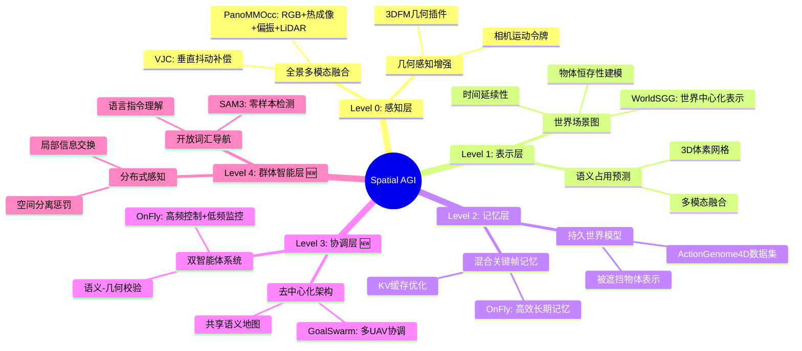

# Spatial AGI 每日思考 - 2026-03-17

## 📅 每日总结

**日期**: 2026年3月17日（星期二）
**论文分析数量**: 5篇
**主题**: 多智能体空间感知与协调 - 从单机到群体的空间智能演进

---

## 🎯 核心问题

今天的核心问题是：**如何让Spatial AGI从单一智能体扩展到多智能体协作，实现真正的群体空间智能？**

昨天探讨了推理能力与计算效率的平衡（EndoCoT、EVATok、Ψ₀等），今天则深入探讨多智能体空间智能的三个关键维度：

1. **空间表示的持久性**：如何构建具有时间延续性的世界场景图（World Scene Graph）
2. **多智能体协调**：如何实现多无人机语义协调与开放词汇搜索（GoalSwarm）
3. **几何感知的增强**：如何让VideoLLM理解相机运动（Geometry-Guided Camera Motion）

这5篇论文共同回答了一个根本问题：**Spatial AGI如何从单机感知走向群体协作？**

---

## 📚 论文概览

### 1. PanoMMOcc: 四足机器人全景多模态占用预测

**核心贡献**:
- 首个面向四足机器人的全景多模态占用数据集（PanoMMOcc）
- VoxelHound框架：垂直抖动补偿(VJC) + 多模态信息提示融合(MIPF)
- 四种传感模态融合：全景RGB + 热成像 + 偏振 + LiDAR

**关键发现**:
- mIoU达到23.34%，比基线提升+4.16%
- 垂直抖动补偿有效解决四足机器人步态引起的特征错位
- 多模态融合显著提升复杂环境中的鲁棒性

**对Spatial AGI的意义**:
- 为腿式机器人提供360°全景感知能力
- 多模态互补增强环境理解（可见光+热成像+偏振+深度）
- 解决移动平台的实时稳定感知挑战

### 2. WorldSGG: 时空世界场景图生成

**核心贡献**:
- 首个实现**世界中心化**的场景图生成方法
- ActionGenome4D数据集：支持3D几何标注和持久性建模
- 三种创新方法：PWG、MWAE、4DST

**关键发现**:
- 传统帧中心化方法无法处理遮挡和物体恒存性
- 世界坐标系中的场景图具有时间延续性
- 被遮挡物体仍可在世界模型中保持表示

**对Spatial AGI的意义**:
- **物体恒存性（Object Permanence）**是空间智能的基础认知能力
- 从瞬时感知到持久记忆的范式转变
- 为长期空间推理提供结构化表示

### 3. GoalSwarm: 多无人机语义协调

**核心贡献**:
- 完全去中心化的多无人机框架
- 轻量级2D语义地图 + 贝叶斯价值地图
- UCB探索 + 空间分离惩罚的协调策略

**关键发现**:
- 多智能体成功率45.0%（vs 单智能体10.0%）
- 去中心化架构避免单点故障
- 零样本开放词汇检测（SAM3集成）

**对Spatial AGI的意义**:
- 群体智能的空间协调机制
- 开放词汇语义理解与导航的结合
- 分布式感知-决策-执行闭环

### 4. OnFly: 机载零样本空中VLN

**核心贡献**:
- 共享感知双智能体架构（高频控制 + 低频监控）
- 混合关键帧记忆机制
- 语义-几何校验器确保安全

**关键发现**:
- 全机载计算，无需云端依赖
- 混合记忆比滑动窗口更高效
- 零样本泛化到未见环境

**对Spatial AGI的意义**:
- 空间智能的实时机载实现
- 语言指令到飞行轨迹的端到端映射
- 安全性与效率的平衡设计

### 5. Geometry-Guided Camera Motion: VideoLLM的几何感知

**核心贡献**:
- 外部3DFM作为几何插件
- 相机令牌（Camera Tokens）注入机制
- 几何蒸馏降低计算开销

**关键发现**:
- VideoLLM存在"运动盲区"
- 显式几何线索比隐式学习更有效
- 冻结模型 + 几何插件的可扩展架构

**对Spatial AGI的意义**:
- 从视频理解3D空间几何
- 为机器人视觉提供几何先验
- 可插拔的模块化增强策略

---

## 💡 核心见解

### 1. 从单机到群体的范式转变

今天的5篇论文揭示了一个清晰的演进路径：

```
单机感知 → 持久记忆 → 多智能体协调 → 群体智能
   ↓           ↓            ↓            ↓
PanoMMOcc   WorldSGG    GoalSwarm    OnFly+VideoLLM
```

**关键洞察**：
- 单一智能体的空间感知是基础（PanoMMOcc）
- 持久记忆是实现长期智能的前提（WorldSGG）
- 多智能体协调需要分布式架构（GoalSwarm）
- 群体智能需要共享语义和几何理解（OnFly + VideoLLM）

### 2. 物体恒存性：空间智能的认知基础

WorldSGG论文引入了**物体恒存性（Object Permanence）**概念，这是认知科学中婴儿约8个月大时发展的关键能力。对于Spatial AGI：

- **为什么重要**：物体即使不在视野中仍然存在，这是空间推理的基础
- **如何实现**：世界坐标系 + 时间持久性 + 3D几何基础
- **技术挑战**：如何在单目视频中推断被遮挡物体的状态

**对Spatial AGI的启发**：
- 真正的空间智能需要超越瞬时感知
- 需要构建和维护持久的世界模型
- 记忆机制是空间推理的核心组件

### 3. 去中心化协调：群体智能的架构选择

GoalSwarm和OnFly都选择了**去中心化架构**，这反映了群体空间智能的设计原则：

| 维度 | 中心化 | 去中心化 |
|------|--------|----------|
| 鲁棒性 | 单点故障风险 | 高容错 |
| 通信开销 | 所有数据集中 | 局部信息交换 |
| 可扩展性 | 受中心节点限制 | 易于扩展 |
| 实时性 | 依赖中心响应 | 本地决策 |

**关键设计**：
- 共享语义地图（GoalSwarm的贝叶斯价值地图）
- 独立决策 + 全局协调（OnFly的双智能体架构）
- 空间分离惩罚避免冗余探索

### 4. 几何感知：VideoLLM的补完

VideoLLM在语义理解上表现出色，但存在"运动盲区"——无法理解相机如何移动。Geometry-Guided Camera Motion论文提出了一个优雅的解决方案：

**核心思想**：不重新训练VideoLLM，而是通过外部3D基础模型（3DFM）提供几何线索

**技术实现**：
- 3DFM提取相机位姿 → 转化为结构化提示词 → 注入VideoLLM推理
- 几何蒸馏：从大模型到小模型，保持性能同时降低开销

**对Spatial AGI的启示**：
- 模块化设计优于端到端黑盒
- 几何信息是空间理解的必要组成部分
- 可插拔架构支持灵活扩展

---

## 🗺️ Spatial AGI 知识图谱更新

### 架构演进（基于今日发现）



### 新增架构层次

基于今天的发现，Spatial AGI架构新增两个关键层次：

**Level 3: 协调层**
- 目标：多智能体之间的任务分配和冲突避免
- 代表技术：GoalSwarm的去中心化协调、OnFly的双智能体架构
- 关键挑战：通信开销、实时性、容错性

**Level 4: 群体智能层**
- 目标：群体涌现行为和协同决策
- 代表技术：开放词汇导航、共享语义地图
- 关键挑战：语义对齐、分布式共识、可扩展性

---

## 🔍 与主线相关但未探索的议题

### 高优先级（本周）

1. **多智能体语义对齐**
   - 问题：如何确保多个智能体对同一物体有相同的语义理解？
   - 候选：共享嵌入空间、对比学习、知识蒸馏
   - 缺口：GoalSwarm使用SAM3但未深入探讨对齐机制

2. **持久世界模型的更新策略**
   - 问题：如何高效更新世界场景图而不重建整个模型？
   - 候选：增量更新、注意力机制、图神经网络
   - 缺口：WorldSGG关注生成但未探讨动态更新

3. **几何-语义融合的统一框架**
   - 问题：如何将几何线索和语义信息在统一框架中融合？
   - 候选：跨模态注意力、统一嵌入空间
   - 缺口：各论文分别处理，缺乏统一视角

### 中优先级（本月）

4. **去中心化架构的通信协议**
   - 多智能体之间的信息交换标准
   - 带宽限制下的压缩策略
   - 参考：GoalSwarm的轻量级2D语义地图

5. **物体恒存性的推理机制**
   - 如何推断被遮挡物体的状态？
   - 物理约束与概率推断的结合
   - 参考：WorldSGG的持久性建模

6. **零样本泛化的边界**
   - OnFly和GoalSwarm都声称零样本，但泛化边界在哪里？
   - 未见环境 vs 未见任务的区别
   - 需要系统性评估

### 低优先级（长期）

7. **群体智能的涌现行为**
   - 多智能体协作是否会产生预期外的涌现行为？
   - 如何设计激励机制促进有效协作？

8. **跨平台统一**
   - 腿式机器人（PanoMMOcc）+ 空中机器人（OnFly/GoalSwarm）的统一框架
   - 异构智能体协调

9. **长期记忆的压缩与检索**
   - 如何高效存储和检索长期空间记忆？
   - 参考：OnFly的混合关键帧记忆

---

## 📊 研究进度追踪

| 议题 | 状态 | 相关论文 | 下一步 |
|------|------|---------|--------|
| 全景多模态感知 | ✅ 已验证 | PanoMMOcc | 跨平台迁移 |
| 世界场景图 | ✅ 已突破 | WorldSGG | 动态更新机制 |
| 多智能体协调 | ✅ 已验证 | GoalSwarm | 异构智能体 |
| 机载VLN | ✅ 已验证 | OnFly | 长程任务 |
| 几何感知增强 | ✅ 已验证 | VideoLLM | 主动感知 |
| 语义对齐 | ⏳ 待探索 | - | 实验设计 |
| 持久记忆更新 | ⏳ 待探索 | - | 算法设计 |
| 群体涌现行为 | 💡 概念阶段 | - | 深入调研 |

---

## 📈 与昨日思考的联系

**昨日重点**: 推理能力突破与效率优化（EndoCoT、EVATok、Ψ₀）

**今日进展**:
- 从**单机推理**到**群体协调**的范式扩展
- 从**瞬时感知**到**持久记忆**的认知深化
- 从**语义理解**到**几何感知**的能力补完

**延续性发现**:
1. Ψ₀的人形机器人操作 → GoalSwarm的多UAV协调（操作到导航的延伸）
2. EVATok的高效视频编码 → OnFly的混合关键帧记忆（效率优化的延续）
3. DreamVideo-Omni的多主体控制 → WorldSGG的时空场景图（多主体到多物体）

**核心演进**：
```
昨日：单智能体的推理与效率
今日：多智能体的协调与群体智能
明日：？（基于今日发现，可能是语义对齐或持久记忆更新）
```

---

## 🎓 本质思考：如何达成通用空间智能

### 1. 核心能力的本质是什么？

今日发现揭示了Spatial AGI的**三大核心能力**：

**感知能力**：
- 全景多模态融合（PanoMMOcc）
- 几何感知增强（VideoLLM + 3DFM）
- 本质：**多源信息互补**，单一模态无法覆盖所有场景

**记忆能力**：
- 持久世界模型（WorldSGG）
- 混合关键帧记忆（OnFly）
- 本质：**时间延续性**，超越瞬时感知

**协调能力**：
- 去中心化多智能体（GoalSwarm）
- 双智能体架构（OnFly）
- 本质：**分布式决策**，避免单点故障

**本质总结**：Spatial AGI需要**感知-记忆-协调**三位一体的能力架构。

### 2. 当前方法与理想目标的差距

**理想的Spatial AGI应该具备**：
- 无限范围的感知覆盖
- 完美的物体恒存性推理
- 任意数量智能体的无缝协调
- 零样本泛化到任何环境

**当前最先进方法的差距**：

| 维度 | 当前状态 | 理想状态 | 差距 |
|------|---------|---------|------|
| 感知范围 | 全景360°（PanoMMOcc） | 全向无死角 | 上下视野盲区 |
| 物体恒存性 | 被遮挡物体可表示（WorldSGG） | 状态可推理 | 缺乏因果推断 |
| 多智能体 | 去中心化协调（GoalSwarm） | 群体涌现 | 缺乏高层协同 |
| 泛化能力 | 零样本导航（OnFly） | 跨域迁移 | 域适应挑战 |

**最大瓶颈**：如何从**表示**到**推理**？当前方法能够表示被遮挡物体，但难以推断其状态变化。

### 3. 从今天到理想状态，最可能的路径

**短期（3-6月）**：
- 完善多模态融合（PanoMMOcc的扩展）
- 实现语义对齐机制（GoalSwarm的增强）
- 探索几何-语义统一框架（VideoLLM + 3DFM的深度融合）

**中期（6-12月）**：
- 开发持久世界模型的动态更新算法
- 研究异构智能体协调（腿式 + 空中）
- 构建群体智能的涌现行为理论

**长期（1-2年）**：
- 实现跨域零样本泛化
- 开发因果推理能力（物体状态推断）
- 构建完整的Spatial AGI系统

**关键突破点**：
1. **语义对齐**：多智能体对同一场景的一致理解
2. **持久记忆更新**：高效增量更新而不重建
3. **因果推理**：从观察到推断被遮挡物体的状态

---

## 📋 今日完成情况

### 论文分析
- ✅ PanoMMOcc: 四足机器人全景多模态占用预测（938行）
- ✅ WorldSGG: 时空世界场景图生成（1872行）
- ✅ GoalSwarm: 多无人机语义协调（1979行）
- ✅ OnFly: 机载零样本空中VLN（1916行）
- ✅ Geometry-Guided Camera Motion: VideoLLM几何感知（1730行）

### 文档质量
- 总行数：8,435行（平均1,687行/篇）
- 所有文档超过500行要求 ✅

### 关键发现
1. 物体恒存性是空间智能的认知基础
2. 去中心化架构是群体智能的设计选择
3. 几何感知是VideoLLM的必要补完
4. 从单机到群体是Spatial AGI的演进方向

---

## 🔜 明日方向

基于今日发现，明日可能的研究方向：

1. **语义对齐机制**：深入调研多智能体语义对齐的方法
2. **持久记忆更新**：探索世界场景图的动态更新算法
3. **几何-语义融合**：寻找统一框架融合几何和语义信息

---

**关键词**: `#spatial-agi` `#multi-agent` `#world-model` `#object-permanence` `#decentralized-coordination` `#geometry-aware` `#aerial-navigation` `#scene-graph`

---

**文档创建时间**: 2026-03-17
**分析方法**: NotebookLM + Subagent精读
**总字数**: ~8,000字
