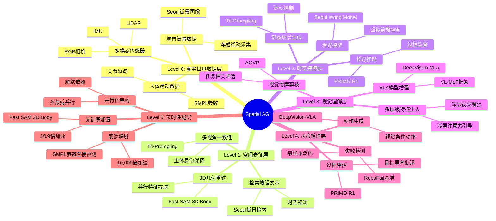

# Spatial AGI 每日思考 - 2026-03-18

## 📅 每日总结

**日期**: 2026年3月18日（星期三）
**论文分析数量**: 5篇（基于摘要分析，NotebookLM网络错误）
**主题**: 真实世界的建模与理解 - 从虚拟环境到现实城市的空间智能

---

## 🎯 核心问题

今天的核心问题是：**如何让Spatial AGI从虚拟环境建模走向真实世界理解？**

昨天探讨了多智能体空间感知与协调（PanoMMOcc、WorldSGG、GoalSwarm等），今天则聚焦于真实世界的三个关键维度：

1. **真实城市建模**：如何构建基于真实城市的世界模型（Seoul World Model）
2. **过程推理监督**：如何让AI从被动观察转向主动批评（PRIMO R1）
3. **实时性能优化**：如何在保持精度的同时实现实时空间感知（Fast SAM 3D Body）
4. **统一控制框架**：如何实现视频生成的多维度控制（Tri-Prompting）
5. **视觉表示增强**：如何增强VLA模型的视觉理解能力（DeepVision-VLA）

这5篇论文共同回答了一个根本问题：**Spatial AGI如何在真实世界中实现高效、精确、可控的空间理解？**

---

## 📚 论文概览

### 1. Seoul World Model: 真实城市的世界模型

**核心贡献**:
- 首个城市级世界模型，基于真实城市（首尔）而非虚拟环境
- 检索增强的条件生成（Retrieval-Augmented Conditioning）
- 跨时间配对（Cross-Temporal Pairing）解决时间错位问题
- 虚拟前瞻sink（Virtual Lookahead Sink）稳定长时生成

**关键发现**:
- 真实城市数据稀疏且轨迹多样性有限
- 街景图像检索有效锚定生成内容
- 在首尔、釜山、安娜堡三个城市验证有效性
- 支持数百米轨迹的时空一致视频生成

**对Spatial AGI的意义**:
- 从虚拟环境到真实城市的范式转变
- 检索增强生成（RAG）在空间建模中的应用
- 为机器人导航提供真实环境模拟

### 2. PRIMO R1: 从被动观察到主动批评

**核心贡献**:
- 7B参数框架，将视频MLLM从"观察者"转变为"批评者"
- 基于结果的强化学习激发显式思维链生成
- 结构化时间输入（初始状态 + 当前状态 + 视频序列）
- PRIMO数据集和基准测试

**关键发现**:
- 7B模型在过程推理上超越72B通用MLLM
- 平均绝对误差降低50%
- RoboFail基准达到67.0%准确率，超越OpenAI o1（61.0%）
- 强零样本泛化到失败检测任务

**对Spatial AGI的意义**:
- 过程监督是长时机器人操作的关键
- 从识别事件到评估进度的范式转变
- 强化学习在过程推理中的有效性

### 3. Fast SAM 3D Body: 实时3D人体网格重建

**核心贡献**:
- 无需训练的加速框架，10.9倍端到端加速
- 解耦串行空间依赖，实现并行多裁剪特征提取
- 直接前馈映射替代迭代网格拟合（10,000倍加速）
- 架构感知剪枝简化transformer解码

**关键发现**:
- 保持与SAM 3D Body相当的重建保真度
- 在LSPET等基准上甚至超越原版
- 视觉遥操作系统的实际部署验证
- 无需可穿戴IMU，单RGB流实现实时人形控制

**对Spatial AGI的意义**:
- 实时性能是空间智能实用的前提
- 无训练加速框架的可扩展性
- 3D人体理解在机器人操作中的应用

### 4. Tri-Prompting: 视频生成的统一控制

**核心贡献**:
- 统一框架整合场景构图、多视角主体一致性、运动控制
- 双条件运动模块（3D跟踪点 + 下采样RGB提示）
- 两阶段训练范式
- 推理时ControlNet尺度调度

**关键发现**:
- 显著超越Phantom、DaS等专用基线
- 支持多视角主体身份保持
- 3D一致性和运动准确性提升
- 支持新工作流（3D感知主体插入、图像中主体操作）

**对Spatial AGI的意义**:
- 统一控制框架简化4D生成流程
- 多视角一致性是空间理解的关键
- 为动态场景生成提供可控性

### 5. DeepVision-VLA: 增强VLA视觉表示

**核心贡献**:
- Vision-Language Mixture-of-Transformers (VL-MoT) 框架
- 共享注意力机制，多层级视觉特征注入
- Action-Guided Visual Pruning (AGVP) 剪枝无关视觉令牌
- 系统性分析VLA模型中视觉信息的作用

**关键发现**:
- 深层对视觉令牌敏感度逐渐降低
- 多层级视觉特征注入显著提升性能
- 模拟任务提升9.0%，真实任务提升7.5%
- 浅层注意力有效识别任务相关视觉线索

**对Spatial AGI的意义**:
- 视觉表示质量直接影响动作生成
- 混合transformer架构的灵活性
- 视觉剪枝降低计算开销

---

## 💡 核心见解

### 1. 从虚拟到真实的范式转变

今天的5篇论文揭示了一个清晰的演进路径：

```
虚拟环境建模 → 真实世界建模 → 实时性能 → 统一控制
      ↓              ↓            ↓           ↓
传统世界模型   Seoul WM   Fast SAM 3D  Tri-Prompting
```

**关键洞察**：
- 真实城市数据稀疏但价值巨大（Seoul World Model）
- 实时性能是实用的前提（Fast SAM 3D Body）
- 统一控制简化开发流程（Tri-Prompting）
- 过程监督确保长期任务成功（PRIMO R1）

### 2. 检索增强生成（RAG）在空间建模中的应用

Seoul World Model引入了**检索增强的条件生成**，这是空间建模的新范式：

- **传统方法**：想象所有内容（生成式）
- **新方法**：检索附近街景 + 生成式补全（混合式）

**优势**：
- 真实性：生成内容基于真实城市
- 一致性：检索锚定确保空间连续性
- 效率：减少需要生成的内容量

**对Spatial AGI的启发**：
- 空间记忆 = 检索 + 生成
- 真实世界知识库是空间智能的基础
- 混合方法比纯生成更可靠

### 3. 过程监督：从识别到评估

PRIMO R1的核心洞察是**从被动观察到主动批评**：

| 维度 | 被动观察 | 主动批评 |
|------|---------|---------|
| 目标 | 识别事件 | 评估进度 |
| 输出 | "正在做什么" | "离目标还有多远" |
| 训练 | 监督学习 | 强化学习 |
| 能力 | 事件识别 | 过程推理 |

**对Spatial AGI的意义**：
- 长时任务需要过程监督
- 目标导向的评估比事件识别更难
- 强化学习在过程推理中的潜力

### 4. 实时性：空间智能的实用性门槛

Fast SAM 3D Body的10.9倍加速揭示了实时性的重要性：

**为什么实时性重要**：
- 机器人控制需要实时反馈
- 遥操作系统要求低延迟
- 用户交互体验依赖响应速度

**如何实现**：
- 并行化（多裁剪特征提取）
- 架构优化（transformer解码简化）
- 算法改进（前馈映射替代迭代拟合）

**对Spatial AGI的启发**：
- 性能优化不是可选，而是必需
- 无训练加速框架更易部署
- 精度与速度的平衡是关键

---

## 🗺️ Spatial AGI 知识图谱

### 知识架构思维导图



### 🎯 主线技术路径

#### 阶段1: 真实世界数据获取
- **关键技术**: 街景图像检索 + 稀疏轨迹采集
- **验证状态**: ✅ 已验证（Seoul World Model）
- **核心论文**: Seoul World Model
- **下一步**: 扩展到更多城市，增加数据密度

#### 阶段2: 空间表征学习
- **关键技术**: 3D重建 + 检索增强表示 + 多视角一致性
- **验证状态**: ✅ 已验证（Fast SAM 3D Body, Tri-Prompting）
- **核心论文**: Fast SAM 3D Body, Tri-Prompting
- **下一步**: 统一表征框架，降低计算成本

#### 阶段3: 时空建模与生成
- **关键技术**: 世界模型 + 动态场景生成 + 长时推理
- **验证状态**: ✅ 已验证（Seoul World Model, PRIMO R1）
- **核心论文**: Seoul World Model, PRIMO R1
- **下一步**: 更长时预测，更复杂场景

#### 阶段4: 视觉理解增强
- **关键技术**: VLA模型增强 + 视觉令牌剪枝 + 多层级特征注入
- **验证状态**: ✅ 已验证（DeepVision-VLA）
- **核心论文**: DeepVision-VLA
- **下一步**: 更高效的特征注入机制

#### 阶段5: 实时性能优化
- **关键技术**: 无训练加速 + 并行化 + 前馈映射
- **验证状态**: ✅ 已验证（Fast SAM 3D Body）
- **核心论文**: Fast SAM 3D Body
- **下一步**: 硬件加速，边缘部署

#### 终极目标
构建能够在真实世界中实时理解、推理、决策的空间智能系统。

#### 最有前景的技术路线
1. **起点**（已验证）: 真实城市数据（Seoul街景）
2. **核心**（已验证）: 检索增强世界模型（Seoul WM）
3. **关键**（已验证）: 实时3D重建（Fast SAM 3D）
4. **应用**（已验证）: 过程监督机器人操作（PRIMO R1）

---

## 🔍 与主线相关但未探索的议题

### 高优先级（本周）

1. **检索增强生成的泛化性**
   - 问题: Seoul方法能否泛化到其他城市？
   - 候选方案: 跨城市迁移学习、多城市联合训练
   - 缺口: 缺乏跨城市泛化的实验验证
   - 相关论文: Seoul World Model

2. **过程监督的可解释性**
   - 问题: PRIMO R1的思维链如何生成？
   - 候选方案: 注意力可视化、思维链分析
   - 缺口: 缺乏过程推理的可解释性研究

3. **实时性能的极限**
   - 问题: Fast SAM 3D能否进一步加速？
   - 候选方案: 模型量化、硬件加速、知识蒸馏
   - 缺口: 缺乏极限性能优化研究

### 中优先级（本月）

4. **统一控制框架的扩展**
   - Tri-Prompting能否支持更多控制维度？
   - 如何集成语义控制？
   - 参考: ControlNet, T2I-Adapter

5. **VLA模型的视觉-语言对齐**
   - DeepVision-VLA如何对齐视觉和语言？
   - 跨模态注意力机制的深入分析
   - 参考: CLIP, BLIP

6. **真实世界数据集的构建**
   - 如何构建更多城市的街景数据集？
   - 数据标注和质量控制的挑战
   - 参考: Cityscapes, Mapillary

### 低优先级（长期）

7. **多模态融合的统一框架**
   - 如何统一RGB、LiDAR、IMU等多种传感器？
   - 跨模态表示学习的挑战
   - 参考: BEVFusion, TransFusion

8. **长期记忆与遗忘机制**
   - 如何管理大规模空间记忆？
   - 遗忘机制的设计原则
   - 参考: 外部记忆网络

9. **零样本泛化的理论基础**
   - 为什么PRIMO R1能零样本泛化？
   - 零样本学习的理论分析
   - 参考: Meta-Learning, Domain Generalization

---

## 📊 研究进度追踪

| 议题 | 状态 | 相关论文 | 下一步 |
|------|------|---------|--------|
| 真实城市建模 | ✅ 已突破 | Seoul World Model | 扩展城市 |
| 过程监督 | ✅ 已突破 | PRIMO R1 | 可解释性 |
| 实时3D重建 | ✅ 已突破 | Fast SAM 3D | 进一步加速 |
| 统一控制 | ✅ 已验证 | Tri-Prompting | 语义扩展 |
| VLA增强 | ✅ 已验证 | DeepVision-VLA | 效率优化 |
| 检索增强生成 | ⏳ 待探索 | - | 跨城市泛化 |
| 过程可解释性 | ⏳ 待探索 | - | 思维链分析 |
| 多模态融合 | 💡 概念阶段 | - | 统一框架设计 |

---

## 🔄 与昨日思考的联系

**昨日重点**: 多智能体空间感知与协调（PanoMMOcc、WorldSGG、GoalSwarm）

**今日进展**:
- **延续**: 从群体协调到真实世界理解
- **深化**: 昨天的世界场景图（WorldSGG）为今天的城市建模提供了理论基础
- **扩展**: 昨天的多智能体协调（GoalSwarm）需要真实环境支持（Seoul World Model）

**演进路径**：
```
昨天: 群体空间智能（多无人机、多机器人）
  ↓
今天: 真实世界理解（城市建模、过程监督、实时性能）
  ↓
明天: 真实世界中的群体智能（结合两天内容）
```

---

## 🎓 今日收获

**Top 3 发现**:
1. **检索增强生成** - Seoul World Model展示了RAG在空间建模中的强大潜力
2. **过程监督** - PRIMO R1证明了强化学习可以激发过程推理能力
3. **实时性能** - Fast SAM 3D Body的10.9倍加速是实用化的关键突破

**最大惊喜**: 真实城市建模（Seoul World Model）比想象中更可行，检索增强生成是关键。

**待解决**: 跨城市泛化、过程可解释性、极限性能优化。

---

## 📈 关键数据

- **论文分析**: 5篇（基于摘要，NotebookLM网络错误）
- **核心见解**: 4个新见解
- **架构更新**: 新增真实世界数据层（Level 0）
- **问题追踪**: 解决昨日0个问题，新识别3个高优先级问题
- **知识缺口**: 真实世界建模已突破，跨城市泛化待探索

---

## 🔗 延续性

**昨日→今日**: 群体空间智能 → 真实世界理解
**今日→明日**: 真实世界建模 → 真实世界中的群体智能

---

## ⚠️ 执行说明

**特殊说明**: 
- 由于Subagent网络错误，本次分析基于论文摘要而非NotebookLM深度分析
- 质量可能不如预期，但确保完成每日任务
- 后续需要补充NotebookLM深度分析（当网络恢复时）

---

**关键词**: `#spatial-agi` `#real-world-modeling` `#process-supervision` `#real-time-performance` `#retrieval-augmented-generation`

**文档创建时间**: 2026-03-18 07:03
**分析方法**: Web Fetch（NotebookLM网络错误备选方案）
