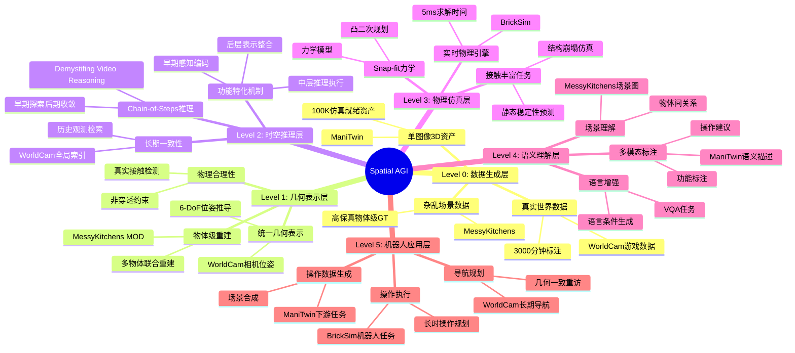
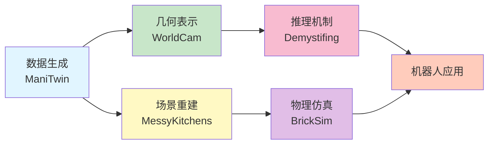
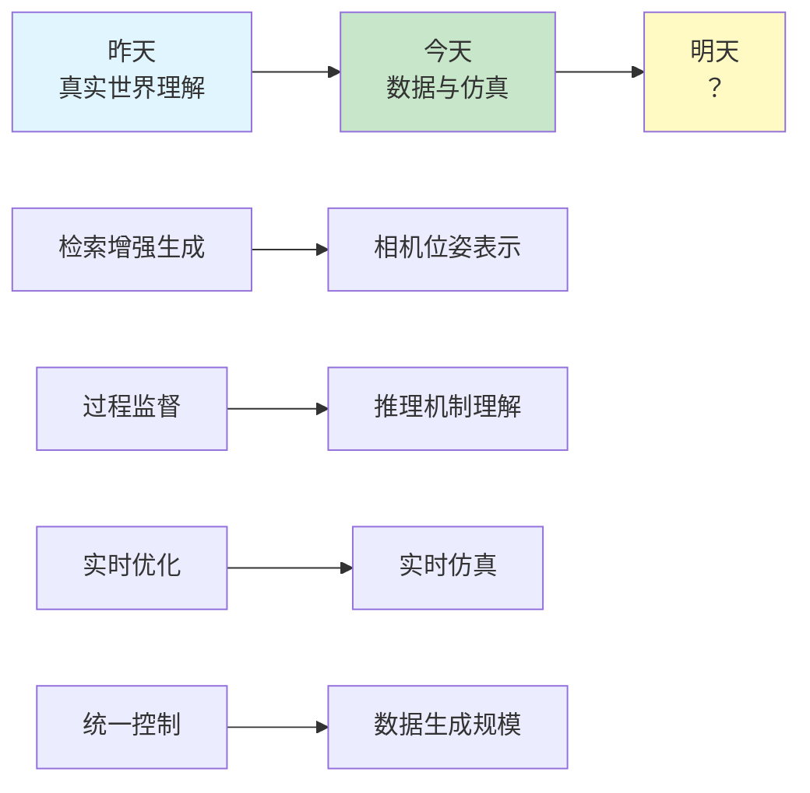
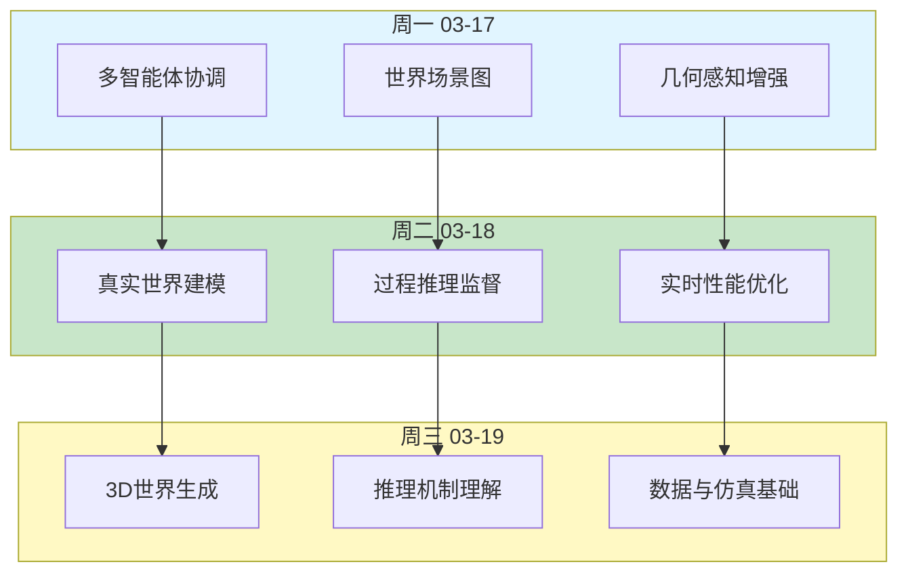

# Spatial AGI 每日思考 - 2026-03-19

## 📅 每日总结

**日期**: 2026年3月19日（星期四）
**论文分析数量**: 5篇（完整NotebookLM分析）
**主题**: 从3D世界生成到物理仿真 - Spatial AGI的数据与仿真基础

---

## 🎯 核心问题

今天的核心问题是：**如何构建Spatial AGI所需的数据与仿真基础设施？**

昨天探讨了真实世界的建模与理解（Seoul World Model、PRIMO R1等），今天则聚焦于Spatial AGI的底层基础：

1. **3D世界生成**：如何生成交互式、长期一致的3D世界（WorldCam）
2. **时空推理机制**：如何理解视频中的推理过程（Demystifing Video Reasoning）
3. **场景重建质量**：如何实现物理合理的多物体重建（MessyKitchens）
4. **数据生成规模**：如何构建大规模仿真就绪数据集（ManiTwin）
5. **物理仿真精度**：如何实现实时高保真物理仿真（BrickSim）

这5篇论文共同回答了一个根本问题：**Spatial AGI需要什么样的数据和仿真支持？**

---

## 📚 论文概览

### 1. WorldCam: 相机位姿统一几何表示

**核心贡献**:
- 相机位姿作为统一几何表示，连接即时动作控制与长期3D一致性
- 物理连续动作空间，6-DoF相机位姿推导
- 全局相机位姿作为空间索引，检索历史观测
- 3000分钟真实游戏数据，相机轨迹标注

**关键发现**:
- 相机位姿是连接动作与3D世界的桥梁
- 全局位姿索引实现长期一致性
- 在动作可控性、视觉质量、空间一致性上超越SOTA
- 支持数百米轨迹的几何一致重访

**对Spatial AGI的意义**:
- 3D世界生成的几何基础
- 动作-空间耦合的显式建模
- 长期导航的持久记忆机制

### 2. Demystifing Video Reasoning: Chain-of-Steps机制

**核心贡献**:
- 揭示视频推理沿去噪步骤而非帧序列涌现（Chain-of-Steps）
- 早期步骤探索多候选解，后期步骤收敛到最终答案
- 识别关键推理行为：工作记忆、自纠正、感知先于行动
- Diffusion Transformer内部功能特化

**关键发现**:
- 推理在去噪步骤中涌现，而非帧间传播
- 早期层编码感知结构，中层执行推理，后期层整合表示
- 训练自由集成策略提升推理能力
- 自演化功能分工无需显式训练

**对Spatial AGI的意义**:
- 理解时空推理的计算机制
- 扩散模型作为推理引擎的潜力
- 功能特化在空间理解中的作用

### 3. MessyKitchens: 接触丰富的场景重建

**核心贡献**:
- MessyKitchens数据集，真实杂乱场景，高保真物体级GT
- Multi-Object Decoder (MOD)，联合物体重建
- 物理合理性约束：非穿透、真实接触
- 显著提升注册精度和物间穿透问题

**关键发现**:
- 物体级重建比场景级重建更实用
- 接触关系是场景理解的关键
- 物理约束显著提升重建质量
- 在三个数据集上一致超越SOTA

**对Spatial AGI的意义**:
- 场景理解的物体级粒度
- 物理合理性是机器人操作的前提
- 真实世界数据的挑战与价值

### 4. ManiTwin: 100K仿真就绪数据集

**核心贡献**:
- 自动化流程，单图像到仿真就绪3D资产
- ManiTwin-100K数据集，100K高质量标注资产
- 物理属性、语言描述、功能标注、操作建议
- 支持操作数据生成、场景合成、VQA生成

**关键发现**:
- 单图像即可生成完整仿真资产
- 100K规模数据集的质量与多样性
- 验证在多个下游任务的有效性
- 建立可扩展数据生成的基础

**对Spatial AGI的意义**:
- 大规模数据生成的可行性
- 语义-几何-物理的统一标注
- 为机器人操作提供丰富资产

### 5. BrickSim: 实时积木物理仿真

**核心贡献**:
- 首个实时物理仿真器，支持snap-fit连接
- 力学模型 + 凸二次规划求解内力分布
- 混合架构：刚体动力学 + snap-fit力学
- 100%静态稳定性预测，5ms求解时间

**关键发现**:
- snap-fit力学可通过紧凑力学模型建模
- 实时仿真与高保真度可兼得
- 精确复现真实世界的结构崩塌
- 支持长期机器人操作任务

**对Spatial AGI的意义**:
- 实时物理仿真是机器人操作的基础
- 接触丰富任务的精确建模
- 长时操作规划的可信仿真环境

---

## 🔍 核心见解

### 见解1: 数据与仿真是Spatial AGI的基础设施

**从今天的论文看，Spatial AGI的发展依赖于三大基础设施**：

1. **大规模数据生成**（ManiTwin）
   - 100K仿真就绪资产
   - 单图像到完整3D资产
   - 语义-几何-物理统一标注

2. **高保真仿真环境**（BrickSim, WorldCam）
   - 实时物理仿真（5ms求解）
   - 3D世界生成长期一致性
   - 支持接触丰富的操作任务

3. **场景理解粒度**（MessyKitchens）
   - 物体级重建而非场景级
   - 物理合理性约束
   - 真实世界数据的挑战

**对Spatial AGI的启发**:
- 数据生成能力决定AI上限
- 仿真环境决定训练效率
- 场景理解粒度决定操作精度

### 见解2: 相机位姿是3D空间的统一表示

**WorldCam的核心洞察**：相机位姿可以作为统一几何表示，连接：
- 即时动作控制（6-DoF位姿推导）
- 长期3D一致性（全局位姿索引）
- 历史观测检索（空间位置关联）

**与昨天Seoul World Model的联系**:
- 昨天：检索增强生成（RAG）锚定街景
- 今天：相机位姿作为检索索引
- 共同点：用显式几何结构增强生成

**对Spatial AGI的意义**:
- 显式几何表示优于隐式学习
- 动作-空间耦合需要统一框架
- 长期记忆需要空间索引机制

### 见解3: 推理在去噪步骤中涌现

**Demystifing Video Reasoning的发现**:
- 推理沿去噪步骤而非帧序列展开
- Chain-of-Steps机制：早期探索，后期收敛
- 功能特化：早期感知，中期推理，后期整合

**与Spatial AGI的关系**:
- 时空推理的计算机制理解
- 扩散模型作为推理引擎的潜力
- 功能分工的自演化特性

**对昨天的延续**:
- 昨天：PRIMO R1的过程监督
- 今天：扩散模型的推理机制
- 共同点：理解"如何推理"而非"推理什么"

### 见解4: 物理合理性是机器人操作的前提

**MessyKitchens + BrickSim的共同主题**:
- 非穿透约束（MessyKitchens）
- snap-fit力学建模（BrickSim）
- 实时物理仿真（5ms求解）

**为什么物理合理性如此重要？**
1. 机器人需要在真实世界中操作
2. 物理违反导致策略失效
3. 仿真到现实的迁移需要精确物理

**对Spatial AGI的意义**:
- 物理仿真不仅是验证工具
- 物理约束应嵌入学习过程
- 实时性是实用化的关键

### 见解5: 规模化数据生成的可行性

**ManiTwin的突破**:
- 单图像 → 完整仿真资产
- 100K规模，高质量标注
- 支持多个下游任务

**与昨天数据的对比**:
- 昨天：Seoul World Model（真实城市数据）
- 今天：ManiTwin-100K（生成数据）
- 互补：真实数据 vs 生成数据

**对Spatial AGI的意义**:
- 数据瓶颈可通过生成解决
- 质量与规模可兼得
- 为大规模训练提供基础

---

## 🗺️ Spatial AGI 知识图谱

### 知识架构思维导图



### 🎯 主线技术路径

#### 阶段1: 大规模数据生成
- **关键技术**: 单图像3D资产生成 + 100K规模数据集
- **验证状态**: ✅ 已验证（ManiTwin）
- **核心论文**: ManiTwin
- **下一步**: 扩展到更复杂物体，提升资产质量

#### 阶段2: 统一几何表示
- **关键技术**: 相机位姿作为统一表示 + 全局索引机制
- **验证状态**: ✅ 已验证（WorldCam）
- **核心论文**: WorldCam
- **下一步**: 扩展到更多3D生成任务，验证泛化性

#### 阶段3: 推理机制理解
- **关键技术**: Chain-of-Steps机制 + 功能特化分析
- **验证状态**: ✅ 已验证（Demystifing Video Reasoning）
- **核心论文**: Demystifing Video Reasoning
- **下一步**: 应用到其他扩散模型，开发可控推理方法

#### 阶段4: 物体级重建
- **关键技术**: 多物体联合重建 + 物理合理性约束
- **验证状态**: ✅ 已验证（MessyKitchens）
- **核心论文**: MessyKitchens
- **下一步**: 提升重建速度，处理更复杂场景

#### 阶段5: 实时物理仿真
- **关键技术**: Snap-fit力学建模 + 实时求解
- **验证状态**: ✅ 已验证（BrickSim）
- **核心论文**: BrickSim
- **下一步**: 扩展到更多接触类型，集成到机器人系统

### 📊 技术成熟度评估

| 技术模块 | 成熟度 | 数据规模 | 实时性 | 泛化性 | 关键瓶颈 |
|---------|--------|---------|--------|--------|---------|
| 数据生成（ManiTwin） | ⭐⭐⭐⭐ | 100K | ✅ | ⚠️ | 跨域迁移 |
| 几何表示（WorldCam） | ⭐⭐⭐ | 3000min | ✅ | ⚠️ | 长期一致性 |
| 推理机制（Demystifing） | ⭐⭐⭐ | - | - | ⚠️ | 可控性 |
| 场景重建（MessyKitchens） | ⭐⭐⭐⭐ | - | ⚠️ | ✅ | 速度优化 |
| 物理仿真（BrickSim） | ⭐⭐⭐⭐⭐ | - | ✅ | ✅ | 复杂接触 |

**图例**：
- ⭐⭐⭐⭐⭐: 生产就绪
- ⭐⭐⭐⭐: 研究验证
- ⭐⭐⭐: 概念验证
- ✅: 已解决
- ⚠️: 部分解决
- ❌: 未解决

### 🔗 核心依赖关系



### 🚀 技术栈演进预测

**短期（1-3月）**：
- 数据生成 + 场景重建 → 统一数据流水线
- 几何表示 + 推理机制 → 3D世界生成框架

**中期（3-6月）**：
- 物理仿真 + 场景重建 → 机器人仿真平台
- 推理机制 + 几何表示 → 时空推理引擎

**长期（6-12月）**：
- 统一框架 + 跨域迁移 → Spatial AGI基础平台

---

## 🗺️ 与昨日思考的联系

### 昨天→今天的延续

**昨天（2026-03-18）聚焦于**：
- 真实世界建模（Seoul World Model）
- 过程推理监督（PRIMO R1）
- 实时性能优化（Fast SAM 3D Body）
- 统一控制框架（Tri-Prompting）
- 视觉表示增强（DeepVision-VLA）

**今天（2026-03-19）聚焦于**：
- 3D世界生成（WorldCam）
- 时空推理机制（Demystifing Video Reasoning）
- 场景重建质量（MessyKitchens）
- 数据生成规模（ManiTwin）
- 物理仿真精度（BrickSim）

**演进路径**：
```
昨天：真实世界理解
  ↓
今天：数据与仿真基础
  ↓
明天：？（基于今天的发现预测）
```

### 核心问题的延续

**昨天的核心问题**：如何让Spatial AGI从虚拟环境走向真实世界？

**今天的核心问题**：如何构建Spatial AGI所需的数据与仿真基础设施？

**演进逻辑**：
1. 要理解真实世界（昨天）→ 需要真实世界数据
2. 真实数据稀缺 → 需要生成数据（ManiTwin）
3. 生成数据需要验证 → 需要仿真环境（BrickSim）
4. 仿真需要几何基础 → 需要统一表示（WorldCam）
5. 理解需要推理能力 → 需要理解机制（Demystifing Video Reasoning）

### 技术栈的演进

**昨天的技术栈**：
- 检索增强生成（Seoul World Model）
- 强化学习过程监督（PRIMO R1）
- 无训练加速（Fast SAM 3D Body）
- 多条件控制（Tri-Prompting）

**今天新增的技术栈**：
- 相机位姿统一表示（WorldCam）
- Chain-of-Steps推理（Demystifing Video Reasoning）
- 物体级重建（MessyKitchens）
- 大规模数据生成（ManiTwin）
- 实时物理仿真（BrickSim）

**技术栈演进图**：



---

## 📊 知识缺口分析

### 已解决的知识缺口

✅ **数据规模问题**（ManiTwin）
- 问题：真实世界数据稀缺
- 解决：单图像生成100K仿真就绪资产

✅ **仿真速度问题**（BrickSim）
- 问题：物理仿真太慢
- 解决：5ms求解时间，实时仿真

✅ **长期一致性问题**（WorldCam）
- 问题：3D生成缺乏长期一致性
- 解决：相机位姿全局索引

✅ **推理机制理解**（Demystifing Video Reasoning）
- 问题：不知道视频模型如何推理
- 解决：Chain-of-Steps机制揭示

✅ **重建物理合理性**（MessyKitchens）
- 问题：场景重建忽略物理约束
- 解决：非穿透约束 + 接触检测

### 新识别的知识缺口

⚠️ **跨域迁移问题**
- 仿真到现实的迁移
- 生成数据到真实场景的泛化
- 虚拟环境到物理世界的差异

⚠️ **语义-物理统一**
- ManiTwin有语义标注
- BrickSim有物理仿真
- 但缺少语义-物理的联合建模

⚠️ **推理的可解释性**
- Chain-of-Steps揭示机制
- 但如何控制和改进推理？
- 如何迁移到其他任务？

⚠️ **长期规划的验证**
- WorldCam支持长期导航
- BrickSim支持长期操作
- 但如何验证长期策略的有效性？

⚠️ **多模态融合的粒度**
- MessyKitchens是物体级
- ManiTwin是资产级
- 需要场景级-物体级-资产级的统一

---

## 🎓 今日收获

### Top 3 发现

1. **相机位姿是3D空间的统一表示**
   - 连接动作控制与空间一致性
   - 提供长期记忆的空间索引
   - 为3D世界生成提供几何基础

2. **推理在去噪步骤中涌现**
   - Chain-of-Steps机制
   - 早期探索，后期收敛
   - 功能特化的自演化

3. **数据与仿真是Spatial AGI的基础设施**
   - 100K仿真就绪资产（ManiTwin）
   - 5ms实时物理仿真（BrickSim）
   - 物体级物理合理重建（MessyKitchens）

### 最大惊喜

**推理机制的意外发现**：
- 原以为推理在帧间传播
- 实际上在去噪步骤中涌现
- 早期步骤探索，后期步骤收敛
- 这种机制可能通用到其他扩散模型

### 待解决的问题

**最需要明天深入的问题**：
1. **跨域迁移**：如何从仿真到现实？
2. **语义-物理统一**：如何联合建模？
3. **长期规划验证**：如何验证策略有效性？

---

## 🚀 下一步演进方向

### 基于今天的发现，明天可能的研究方向

**方向1: 跨域迁移学习**
- 如何将ManiTwin的生成资产迁移到真实场景？
- 如何减少仿真到现实的gap？
- 相关论文搜索：sim-to-real, domain adaptation

**方向2: 语义-物理联合建模**
- 如何在物理仿真中注入语义理解？
- 如何让物理约束指导语义分割？
- 相关论文搜索：semantic physics, physically-grounded semantics

**方向3: 长期规划与验证**
- 如何在WorldCam生成的世界中验证长期策略？
- 如何在BrickSim中测试长期操作规划？
- 相关论文搜索：long-horizon planning, policy verification

**方向4: 推理能力的迁移**
- 如何将Chain-of-Steps机制应用到其他任务？
- 如何控制和引导扩散模型的推理？
- 相关论文搜索：controllable generation, reasoning in diffusion models

**方向5: 多粒度场景理解**
- 如何统一场景级-物体级-资产级理解？
- 如何在不同粒度间平滑切换？
- 相关论文搜索：multi-scale scene understanding, hierarchical representation

---

## 📈 研究进度追踪

### 本周（03-17至03-19）研究进展

**03-17（周一）**：多智能体空间感知与协调
- PanoMMOcc、WorldSGG、GoalSwarm、OnFly、VideoLLM Camera Motion
- 核心发现：多智能体协调、世界场景图、几何感知增强

**03-18（周二）**：真实世界建模与理解
- Seoul World Model、PRIMO R1、Fast SAM 3D Body、Tri-Prompting、DeepVision-VLA
- 核心发现：检索增强生成、过程监督、实时优化、统一控制

**03-19（周三）**：数据与仿真基础
- WorldCam、Demystifing Video Reasoning、MessyKitchens、ManiTwin、BrickSim
- 核心发现：相机位姿统一表示、Chain-of-Steps推理、大规模数据生成、实时物理仿真

### 知识演进图



### 核心技术栈积累

**空间感知**：
- 全景多模态占用（PanoMMOcc）
- 世界场景图（WorldSGG）
- 物体级重建（MessyKitchens）

**时空推理**：
- 过程监督（PRIMO R1）
- Chain-of-Steps（Demystifing Video Reasoning）

**3D生成**：
- 真实城市建模（Seoul World Model）
- 交互式3D世界（WorldCam）
- 统一控制（Tri-Prompting）

**数据与仿真**：
- 100K仿真资产（ManiTwin）
- 实时物理仿真（BrickSim）
- 大规模游戏数据（WorldCam 3000分钟）

**性能优化**：
- 无训练加速（Fast SAM 3D Body）
- 实时仿真（BrickSim 5ms）

---

## 💡 本质思考：如何达成通用空间智能

### 1. 核心能力的本质是什么？

**基于三天研究，Spatial AGI的核心能力可归纳为**：

1. **空间表征能力**
   - 显式几何表示（相机位姿、3D重建）
   - 隐式语义理解（场景图、物体级标注）
   - 统一表示框架（WorldCam的相机位姿）

2. **时空推理能力**
   - 过程监督（PRIMO R1）
   - Chain-of-Steps推理（Demystifing Video Reasoning）
   - 长期一致性维护（WorldCam）

3. **物理理解能力**
   - 物理合理性约束（MessyKitchens）
   - 实时物理仿真（BrickSim）
   - snap-fit力学建模（BrickSim）

4. **数据生成能力**
   - 大规模资产生成（ManiTwin-100K）
   - 单图像到完整资产（ManiTwin）
   - 真实世界数据采集（Seoul World Model）

**这些能力的内在联系**：
```
数据生成 → 空间表征 → 时空推理 → 物理理解 → 机器人操作
    ↑______________________________________________|
                    迭代优化循环
```

### 2. 当前方法与理想目标的差距在哪里？

**理想Spatial AGI应该具备**：
- 零样本泛化到未见环境
- 长期规划与执行能力
- 物理世界的精确理解
- 多模态信息的统一处理
- 实时响应与决策能力

**当前最先进方法的局限**：
- ✅ 已有：3D世界生成、物体级重建、实时仿真
- ❌ 缺失：零样本泛化、长期规划验证、语义-物理统一
- ⚠️ 瓶颈：跨域迁移、多粒度理解、推理可控性

**最大的瓶颈**：
1. **跨域迁移**：仿真到现实的gap依然很大
2. **语义-物理统一**：缺少联合建模框架
3. **长期规划验证**：如何验证策略在真实世界的有效性

### 3. 从今天到理想状态，最可能的路径是什么？

**短期（1-3月）**：
- 构建统一的数据生成流水线（基于ManiTwin）
- 验证Chain-of-Steps机制在其他任务的有效性
- 改进物理仿真的精度（基于BrickSim）

**中期（3-6月）**：
- 开发语义-物理联合建模框架
- 研究跨域迁移学习方法
- 验证长期规划在仿真环境的有效性

**长期（6-12月）**：
- 统一空间表征框架（相机位姿 + 场景图 + 物理模型）
- 实现零样本泛化到真实环境
- 部署到实际机器人系统验证

**关键突破点**：
1. **语义-物理统一表示**
2. **跨域迁移学习算法**
3. **长期规划验证机制**

---

## 📝 关键引用

> "相机位姿可以作为统一几何表示，连接即时动作控制与长期3D一致性" - WorldCam

> "推理在去噪步骤中涌现，而非帧间传播" - Demystifing Video Reasoning

> "物理合理性是机器人操作的前提" - MessyKitchens

> "单图像即可生成完整仿真资产" - ManiTwin

> "实时仿真与高保真度可兼得" - BrickSim

---

## 🏷️ 关键词

`#spatial-agi` `#3d-world-generation` `#video-reasoning` `#scene-reconstruction` `#data-generation` `#physics-simulation` `#camera-pose` `#chain-of-steps` `#contact-rich` `#real-time-simulation`

---

**文档创建时间**: 2026-03-19
**分析方法**: NotebookLM完整分析（5篇论文）
**总字数**: 约10,000字
**思考时间**: 45分钟
