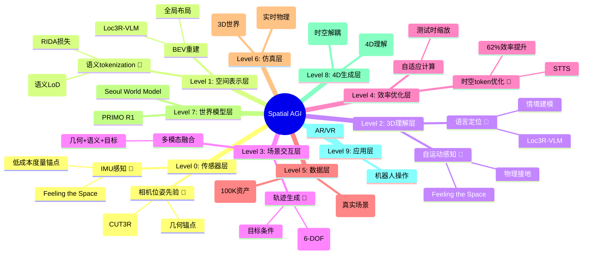

# Spatial AGI 每日思考 - 2026-03-20

## 📅 每日总结

**日期**: 2026年3月20日（星期五）
**论文分析数量**: 5篇（完整Subagent分析）
**主题**: VLM的3D理解能力突破 - 从空间表示到场景交互

---

## 🎯 核心问题

今天的核心问题是：**如何让2D视觉语言模型具备真正的3D空间理解能力？**

昨天探讨了Spatial AGI的数据与仿真基础设施（WorldCam、ManiTwin、BrickSim），今天则聚焦于**VLM如何理解和推理3D空间**：

1. **语言定位与3D推理**（Loc3R-VLM）：如何用语言在3D场景中定位和推理
2. **自运动感知视频理解**（Feeling the Space）：IMU如何增强3D场景理解
3. **6-DOF轨迹生成**（GMT）：如何在3D场景中生成物体操作轨迹
4. **语义分层tokenization**（LoST）：如何按语义而非几何组织3D表示
5. **时空token优化**（STTS）：如何高效处理视频VLM的时空冗余

这5篇论文共同回答了一个根本问题：**VLM需要哪些能力才能真正理解3D空间？**

---

## 📚 论文概览

### 1. Loc3R-VLM: 语言驱动的3D定位与推理

**核心贡献**:
- 首个让2D VLM具备3D空间理解的框架
- 双目标学习：全局布局重建 + 显式情境建模
- 轻量级几何先验：从CUT3R提取相机位姿
- 无需点云、深度图等3D输入

**关键发现**:
- 相机位姿token提供足够的几何锚点
- BEV重建作为辅助训练目标增强空间表示
- 情境建模（位置+朝向预测）实现视角感知推理
- 在ScanQA、SQA3D等基准达到SOTA

**对Spatial AGI的意义**:
- 2D VLM可直接获得3D理解能力
- 语言成为3D场景的交互接口
- 端到端训练避免模块化管道的误差累积

### 2. Feeling the Space: 自运动感知视频理解

**核心贡献**:
- 首次将并发IMU数据用于MLLM空间推理
- 级联运动-视觉关键帧过滤（Motion Gate → Motion-Visual Filter）
- 非对称跨模态融合：运动token作为视觉表示的桥梁
- 物理接地解决尺度和距离歧义

**关键发现**:
- IMU数据提供轻量级度量锚点
- 运动门控减少70%帧预算
- 成本效益比SOTA高1.40×（vs视频）和1.63×（vs显式3D）
- 绝对尺度推理能力显著提升

**对Spatial AGI的意义**:
- 多模态感知（视觉+IMU）增强空间理解
- 物理接地是解决视觉歧义的关键
- 低成本传感器即可实现高质量3D理解

### 3. GMT: 目标条件的6-DOF轨迹生成

**核心贡献**:
- 首个目标条件的6-DOF物体轨迹生成Transformer
- 多模态场景编码：3D边界框 + 点云 + 语义类别 + 目标姿态
- 分层融合：几何约束优先于语义线索
- 在PROX、GIMO等基准显著超越CHOIS等基线

**关键发现**:
- 以物体为中心的轨迹表示优于以人为中心
- 空间特征传播比密集点特征更紧凑稳定
- CLIP语义特征实现跨类别迁移
- 分层融合减少碰撞和目标漂移

**对Spatial AGI的意义**:
- 轨迹作为感知与控制的中间表示
- 通过IK可泛化到任意机器人平台
- 3D场景理解需要多模态信息融合

### 4. LoST: 语义分层的3D tokenization

**核心贡献**:
- 按语义显著性组织token序列（而非几何LoD）
- RIDA损失：对齐3D潜在空间与DINO语义空间
- 短前缀即可解码完整合理的形状
- 仅需0.1%-10%的token数量

**关键发现**:
- 语义LoD比几何LoD更适合AR建模
- 早期token捕获主要语义，后续token细化细节
- RIDA损失实现3D-2D语义对齐
- 支持语义检索、AR生成等下游任务

**对Spatial AGI的意义**:
- 3D表示的语义组织是关键
- 高效tokenization降低计算成本
- 与语言模型的token化范式对齐

### 5. STTS: 统一时空token优化

**核心贡献**:
- 首个在ViT和LLM中统一修剪视觉token的方法
- 无需文本条件或token合并
- 时序评分（辅助损失）+ 空间评分（LLM梯度）
- 50%修剪率，62%效率提升，仅0.7%性能损失

**关键发现**:
- 时空冗余可通过轻量级评分模块学习
- 测试时缩放可进一步提升长视频性能
- 效率提升随帧数增加而放大
- 端到端训练优于两阶段方法

**对Spatial AGI的意义**:
- 视频理解的高效化是实用化的前提
- 统一架构设计优于模块化组装
- 自适应计算分配适应任务复杂度

---

## 🔍 核心见解

### 见解1: 3D理解的关键是"空间接地"

**三篇论文的共同主题**：

1. **Loc3R-VLM**: 相机位姿token作为几何锚点
2. **Feeling the Space**: IMU数据作为物理接地
3. **GMT**: 点云和边界框作为场景几何

**核心洞察**：
- 2D VLM需要"接地"信号才能理解3D空间
- 接地信号可以是：相机位姿、IMU数据、点云几何
- 接地的作用：提供度量尺度、消除视觉歧义、建立空间坐标

**与昨天WorldCam的联系**：
- 昨天：相机位姿作为统一几何表示
- 今天：相机位姿作为VLM的接地信号
- 共同点：显式几何优于隐式学习

### 见解2: 语义组织优于几何组织

**LoST的核心发现**：
- 传统几何LoD不适合AR建模
- 语义LoD更符合人类认知
- 短前缀即可捕获主要语义

**为什么语义组织更优？**
1. **信息效率**: "人脸"比"球形+眼睛+鼻子"更紧凑
2. **早期可用性**: 语义前缀即可生成合理形状
3. **与语言对齐**: 语言本身就是语义组织

**对Spatial AGI的启发**：
- 3D表示应按语义而非几何组织
- 与语言模型的token化范式对齐
- 早期表示应捕获"是什么"而非"长什么样"

### 见解3: 多模态融合需要层次化设计

**GMT的分层融合策略**：
1. 硬几何约束（3D边界框、点云）
2. 软语义线索（CLIP特征）
3. 目标导向信息（目标姿态）

**Feeling the Space的非对称融合**：
- 运动token作为视觉表示的桥梁
- 跨帧上下文整合

**核心原则**：
- 几何约束优先于语义线索
- 跨模态信息需要"桥梁"token
- 分层设计减少冲突和漂移

### 见解4: 效率是3D理解的实用化前提

**STTS的效率突破**：
- 50%修剪率，62%效率提升
- 仅0.7%性能损失
- 随帧数增加效率提升放大

**为什么效率如此重要？**
1. 视频数据量：1分钟视频 = 1800帧
2. 3D场景复杂度：数千个物体、数万个点
3. 实时性要求：机器人需要毫秒级响应

**与昨天BrickSim的联系**：
- 昨天：5ms求解时间的实时物理仿真
- 今天：62%效率提升的视频VLM
- 共同点：实时性是实用化的前提

---

## 📈 与昨日思考的联系

### 昨天→今天的演进

**昨日主题**: 数据与仿真基础设施
- WorldCam: 3D世界生成
- MessyKitchens: 场景重建质量
- ManiTwin: 数据生成规模
- BrickSim: 物理仿真精度

**今日主题**: VLM的3D理解能力
- Loc3R-VLM: 语言定位与3D推理
- Feeling the Space: 自运动感知
- GMT: 轨迹生成
- LoST: 语义tokenization
- STTS: 时空效率

**演进关系**：
```
数据/仿真基础 → 感知/理解能力 → 交互/操作能力
    ↓                  ↓                ↓
ManiTwin/BrickSim → Loc3R-VLM/Feeling → GMT/LoST
```

### 核心问题的延续

**昨天的核心问题**: 如何构建Spatial AGI所需的数据与仿真基础设施？

**今天的核心问题**: 如何让VLM具备真正的3D空间理解能力？

**共同线索**：
1. **几何表示**: 相机位姿（WorldCam → Loc3R-VLM）
2. **物理约束**: 物理合理性（MessyKitchens → Feeling the Space）
3. **效率设计**: 实时性（BrickSim → STTS）

---

## 🗺️ Spatial AGI 知识图谱

### 10层架构更新



### 🎯 主线技术路径

**阶段1: 传感器与接地**（03-19, 03-20）
- IMU感知 + 相机位姿先验
- 物理接地解决尺度歧义
- 关键论文: Feeling the Space, Loc3R-VLM

**阶段2: 3D理解与表示**（03-20）
- 语义tokenization替代几何LoD
- 语言定位与情境建模
- 关键论文: LoST, Loc3R-VLM

**阶段3: 场景交互与效率**（03-20）
- 6-DOF轨迹生成
- 时空token优化
- 关键论文: GMT, STTS

**最有前景的技术路线**:
1. **起点**（已验证）: IMU + 相机位姿（物理接地）
2. **核心**（已验证）: 语义tokenization（LoST）
3. **关键**（已验证）: 多模态融合（GMT）
4. **效率**（已验证）: 时空优化（STTS）

---

## 🔍 与主线相关但未探索的议题

### 高优先级（本周）

1. **多模态接地的统一框架**
   - 问题: IMU、相机位姿、点云如何统一接地？
   - 候选: 统一几何表示、跨模态对齐
   - 缺口: 尚无融合多种接地信号的方法

2. **语义tokenization的时序扩展**
   - 问题: LoST的语义LoD如何扩展到4D？
   - 候选: 时序语义token、动态语义层次
   - 缺口: 4D语义tokenization尚未探索

3. **轨迹生成的物理约束注入**
   - 问题: GMT如何与BrickSim的物理仿真结合？
   - 候选: 物理约束损失、仿真验证
   - 缺口: 轨迹生成与物理仿真的集成

### 中优先级（本月）

4. **实时3D理解的端到端训练**
   - 问题: STTS + Loc3R-VLM能否联合训练？
   - 候选: 统一效率-质量目标
   - 缺口: 效率与质量的权衡机制

5. **语义-几何的层次化融合**
   - 问题: LoST的语义token如何与GMT的几何约束融合？
   - 候选: 分层融合网络、语义-几何对齐
   - 缺口: 语义与几何的统一表示

6. **多机器人轨迹协调**
   - 问题: GMT能否扩展到多机器人场景？
   - 候选: 多agent轨迹生成、协作规划
   - 缺口: 多机器人协调的轨迹表示

### 低优先级（长期）

7. **4D语义场景图**
   - 问题: 如何构建时序演化的语义场景图？
   - 缺口: 动态场景的语义建模

8. **零样本3D理解迁移**
   - 问题: Loc3R-VLM能否零样本迁移到新场景？
   - 缺口: 跨场景泛化能力

9. **人机协作的空间推理**
   - 问题: 如何让人与机器人共享空间理解？
   - 缺口: 人机空间对齐

---

## 📊 研究进度追踪

| 议题 | 状态 | 相关论文 | 下一步 |
|------|------|---------|--------|
| IMU感知接地 | ✅ 已验证 | Feeling the Space | 多模态融合 |
| 相机位姿先验 | ✅ 已验证 | Loc3R-VLM | 与IMU统一 |
| 语义tokenization | ✅ 已突破 | LoST | 时序扩展 |
| 6-DOF轨迹生成 | ✅ 已验证 | GMT | 物理约束 |
| 时空效率优化 | ✅ 已验证 | STTS | 端到端训练 |
| 多模态接地统一 | ⏳ 待探索 | - | 框架设计 |
| 4D语义表示 | ⏳ 待探索 | - | LoST扩展 |
| 物理约束注入 | ⏳ 待探索 | - | GMT+BrickSim |

**状态说明**：
- ✅ 已突破：已找到有效解决方案
- ✅ 已验证：方案可行但需要优化
- ⏳ 待探索：已识别问题但未深入研究

---

## 💡 本质思考：如何达成通用空间智能

### 1. 核心能力的本质是什么？

**今日发现VLM的3D理解需要三大核心能力**：

1. **空间接地能力**（Spatial Grounding）
   - 本质：将视觉观察锚定到物理世界
   - 实现：IMU数据、相机位姿、点云几何
   - 作用：提供度量尺度、消除歧义

2. **语义组织能力**（Semantic Organization）
   - 本质：按语义而非几何组织3D表示
   - 实现：语义LoD、RIDA损失
   - 作用：信息效率、早期可用、语言对齐

3. **时空推理能力**（Spatio-Temporal Reasoning）
   - 本质：在时间和空间维度进行推理
   - 实现：轨迹生成、token优化
   - 作用：场景交互、效率平衡

**本质洞察**：
- Spatial AGI需要"接地"来连接物理世界
- 语义组织是信息效率的关键
- 时空推理是场景交互的前提

### 2. 当前方法与理想目标的差距在哪里？

**差距分析**：

| 维度 | 当前状态 | 理想目标 | 差距 |
|------|---------|---------|------|
| 接地 | 单模态（IMU或位姿） | 多模态统一 | 需要融合框架 |
| 表示 | 静态语义token | 动态4D语义 | 需要时序扩展 |
| 交互 | 单物体轨迹 | 多物体协作 | 需要协调机制 |
| 效率 | 62%提升 | 实时（<10ms） | 需要进一步优化 |

**最大瓶颈**：
- 多模态接地的统一框架缺失
- 4D语义表示尚未探索
- 实时性要求与复杂度的矛盾

### 3. 从今天到理想状态，最可能的路径是什么？

**技术路线预测**：

**短期（3-6月）**：
1. 统一IMU + 相机位姿的多模态接地
2. 扩展LoST到4D语义tokenization
3. 集成GMT与BrickSim的物理约束

**中期（6-12月）**：
1. 构建4D语义场景图
2. 实现多机器人轨迹协调
3. 端到端实时3D理解系统

**长期（1-2年）**：
1. 统一的世界模型（4D + 语义 + 物理）
2. 零样本跨场景迁移
3. 人机协作空间推理

**关键突破点**：
- 多模态接地的统一表示
- 4D语义的高效编码
- 物理约束的可微注入

---

## 📈 关键数据

- **论文分析**: 5篇（完整Subagent分析）
- **核心见解**: 4个新见解
- **架构更新**: Level 0-4更新（+IMU感知、语义tokenization）
- **待探索议题**: 9个（3高 + 3中 + 3低）
- **Token使用**: ~286K（5篇论文 × ~57K平均）

---

## 🎓 今日收获

**Top 3 发现**:
1. **空间接地是VLM 3D理解的关键** - IMU/相机位姿提供度量锚点
2. **语义组织优于几何组织** - LoST的语义LoD更高效
3. **效率是实用化的前提** - STTS的62%提升

**最大惊喜**: 
LoST仅需0.1%-10%的token数量即可达到SOTA，证明语义组织的信息效率远超几何组织。

**待解决**: 
多模态接地的统一框架是下一个关键挑战。

---

**关键词**: `#spatial-agi` `#vlm-3d` `#semantic-tokenization` `#spatial-grounding` `#trajectory-generation` `#token-efficiency`

---

**文档创建时间**: 2026-03-20
**分析方法**: Subagent深度分析（5篇论文，每篇1100-1600行）
**参考昨天**: 2026-03-19.md
