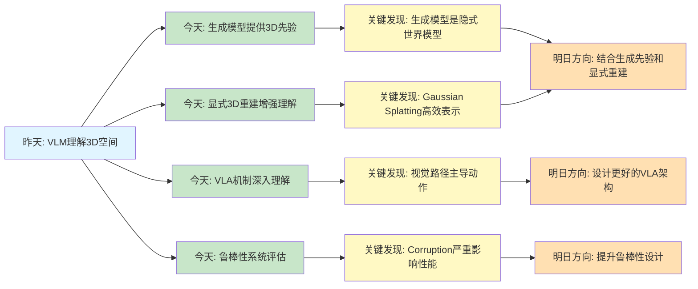

# Spatial AGI 每日思考 - 2026-03-21

## 📅 每日总结

**日期**: 2026年3月21日（星期六）
**论文分析数量**: 5篇（完整Subagent分析）
**主题**: 从生成到理解 - 视觉生成模型的3D先验与空间表示学习

---

## 🎯 核心问题

今天的核心问题是：**视觉生成模型如何为Spatial AGI提供3D理解能力？**

昨天探讨了VLM如何理解和推理3D空间（Loc3R-VLM、GMT等），今天则聚焦于**生成模型如何赋能空间理解**：

1. **视频生成模型的3D先验**（VEGA-3D）：如何利用生成模型学到的隐式3D知识
2. **VLA模型的机制理解**（Not All Features）：视觉路径如何主导动作生成
3. **具身导航的鲁棒性**（NavTrust）：导航系统如何应对真实世界的corruption
4. **多视角场景tokenization**（DriveTok）：如何统一多视角的重建和理解
5. **显式3D重建的价值**（Splat2BEV）：Gaussian Splatting如何改进BEV感知

这5篇论文共同回答了一个根本问题：**生成模型与3D重建如何协同增强Spatial AGI的感知能力？**

---

## 📚 论文概览

### 1. VEGA-3D: 视频生成模型的空间先验

**核心贡献**:
- 首次将视频扩散模型作为"潜在世界模拟器"
- 从中间噪声层级提取时空特征
- 自适应门控融合机制整合生成和语义表示
- 无需显式3D监督即可增强空间推理

**关键发现**:
- 生成模型在学习时间一致性时必然学到3D结构
- 中间噪声层级的特征比最终输出更富含几何信息
- Token级自适应融合优于简单拼接
- 在3D场景理解、空间推理、操作任务上超越SOTA

**对Spatial AGI的意义**:
- 生成模型是理解物理世界的潜在基础
- 无需3D标注即可获得空间推理能力
- 为"世界模型"概念提供了实证支持

### 2. Not All Features Are Created Equal: VLA机制研究

**核心贡献**:
- 首次系统研究VLA模型的内部机制
- 使用SAE、线性探针、激活注入分析6个模型
- 发现视觉路径主导动作生成
- 识别出空间绑定的运动程序

**关键发现**:
- 视觉特征占主导（注入baseline激活可恢复完整行为）
- 语言的作用取决于任务结构（唯一视觉场景可忽略语言）
- 专家路径编码运动程序，VLM路径编码目标语义
- SAE处理对动作保真度至关重要

**对Spatial AGI的意义**:
- VLA架构需要显式分离运动和语义
- 视觉理解是动作生成的基础
- 可解释性工具揭示模型内部机制

### 3. NavTrust: 具身导航的鲁棒性基准

**核心贡献**:
- 首个统一评估RGB-Depth和指令corruption的框架
- 系统性测试7种SOTA方法的鲁棒性
- 真实机器人部署验证
- 4种缓解策略的系统评估

**关键发现**:
- 现有方法在corruption下性能显著下降
- 深度corruption比RGB更严重
- 指令噪声对多目标场景影响更大
- 数据增强和域随机化最有效

**对Spatial AGI的意义**:
- 真实世界部署需要鲁棒性设计
- 多模态融合需要考虑模态可靠性
- 评估需要在多样化条件下进行

### 4. DriveTok: 多视角场景tokenization

**核心贡献**:
- 3D可变形交叉注意力生成场景token
- 多视角Transformer解码重建多视角特征
- 多任务学习：RGB+深度+语义+3D占用
- 统一场景token支持重建和理解

**关键发现**:
- 场景token集成语义、几何、纹理信息
- 3D占用预测增强空间感知
- 可变形注意力高效处理多视角
- 单一token表示支持多种下游任务

**对Spatial AGI的意义**:
- 统一的多视角表示是空间理解的基础
- Tokenization需要考虑3D几何
- 多任务学习提升表示质量

### 5. Splat2BEV: 显式3D重建辅助BEV感知

**核心贡献**:
- 首次将3D Gaussian Splatting用于BEV特征学习
- 预训练Gaussian生成器学习显式3D重建
- 几何对齐的BEV表示
- 在nuScenes和Argoverse达到SOTA

**关键发现**:
- 显式3D重建显著提升BEV感知质量
- Gaussian Splatting提供高效的3D表示
- 几何对齐的特征优于隐式学习
- 重建任务作为辅助训练非常有效

**对Spatial AGI的意义**:
- 显式3D建模仍然重要
- Gaussian Splatting是高效的空间表示
- 重建和理解可以互相增强

---

## 🔗 与昨日思考的联系

**昨日重点**（2026-03-20）:
- VLM如何理解和推理3D空间
- 语言定位与3D推理（Loc3R-VLM）
- 自运动感知（IMU增强）
- 6-DOF轨迹生成（GMT）
- 语义tokenization（LoST）

**今日进展**:
1. **从理解到生成**: 昨天关注VLM如何理解3D，今天发现**生成模型本身也包含3D知识**
2. **从隐式到显式**: 昨天讨论隐式几何先验，今天发现**显式3D重建（Gaussian Splatting）仍然重要**
3. **从感知到动作**: 昨天研究轨迹生成，今天深入**VLA模型的动作生成机制**
4. **从理想到真实**: 昨天假设理想输入，今天系统评估**真实世界的鲁棒性**

**演进路径**:
```
昨天: VLM理解3D空间
  ↓
今天: 生成模型提供3D先验 + 显式重建增强理解 + 鲁棒性验证
  ↓
明天: 结合生成先验、显式重建、鲁棒性设计，构建更完整的Spatial AGI
```

---

## 💡 核心见解

### 见解1: 生成模型是隐式的世界模型

**从VEGA-3D获得**:
- ✅ 视频生成模型在学习时间一致性时必然学到3D结构
- ✅ 中间噪声层级的特征比最终输出更富含几何信息
- ✅ 无需3D标注即可获得空间推理能力

**对Spatial AGI的启发**:
1. **数据效率**: 生成模型可从大量2D视频中学到3D知识，无需昂贵的3D标注
2. **泛化能力**: 生成模型的隐式知识可能比显式规则更泛化
3. **世界建模**: 生成模型可能是构建"世界模型"的有效途径

**关键问题**:
- 如何提取和利用生成模型的隐式3D知识？
- 生成先验与显式3D重建如何结合？
- 如何验证生成模型真的学到了物理规律？

### 见解2: 视觉路径主导VLA动作生成

**从Not All Features获得**:
- ✅ 视觉特征占主导（注入baseline激活可恢复完整行为）
- ✅ 语言的作用取决于任务结构（唯一视觉场景可忽略语言）
- ✅ 专家路径编码运动程序，VLM路径编码目标语义
- ✅ 空间绑定的运动程序与场景坐标相关

**对Spatial AGI的启发**:
1. **架构设计**: VLA需要显式分离运动编码和语义编码
2. **训练策略**: 视觉理解是动作生成的基础，应优先优化
3. **可解释性**: SAE和线性探针揭示模型内部机制

**关键问题**:
- 如何设计更好的多路径融合机制？
- 语言在什么情况下真正影响动作？
- 如何将空间绑定的运动程序泛化到新场景？

### 见解3: 显式3D重建仍然重要

**从Splat2BEV获得**:
- ✅ 显式3D重建显著提升BEV感知质量
- ✅ Gaussian Splatting提供高效的3D表示
- ✅ 几何对齐的特征优于纯隐式学习
- ✅ 重建任务作为辅助训练非常有效

**对Spatial AGI的启发**:
1. **表示选择**: 隐式学习和显式重建应该结合，而非二选一
2. **效率优势**: Gaussian Splatting比传统3D表示更高效
3. **训练策略**: 重建任务是理解任务的有效辅助

**关键问题**:
- Gaussian Splatting vs. NeRF vs. Point Cloud，哪个更适合Spatial AGI？
- 如何平衡显式重建的计算成本和性能提升？
- 动态场景如何用Gaussian Splatting表示？

### 见解4: 多视角统一表示是关键

**从DriveTok获得**:
- ✅ 场景token需要集成语义、几何、纹理信息
- ✅ 3D可变形注意力高效处理多视角
- ✅ 单一token表示支持多种下游任务
- ✅ 3D占用预测增强空间感知

**对Spatial AGI的启发**:
1. **表示统一**: 需要统一的多视角表示，而非独立处理
2. **任务通用**: 好的表示应该支持多种下游任务
3. **效率考虑**: 可变形注意力比全局注意力更高效

**关键问题**:
- 如何设计最优的场景token表示？
- Token数量与表示质量如何权衡？
- 动态场景的token如何更新？

### 见解5: 鲁棒性是真实世界部署的前提

**从NavTrust获得**:
- ✅ 现有方法在corruption下性能显著下降
- ✅ 深度corruption比RGB更严重
- ✅ 指令噪声对多目标场景影响更大
- ✅ 数据增强和域随机化最有效

**对Spatial AGI的启发**:
1. **评估标准**: 需要在多样化条件下评估，而非仅理想场景
2. **模态可靠性**: 多模态融合需要考虑各模态的可靠性
3. **缓解策略**: 数据增强和域随机化应该作为标准流程

**关键问题**:
- 如何设计更鲁棒的多模态融合？
- 哪些corruption类型最需要关注？
- 如何在保持性能的同时提升鲁棒性？

---

## 🗺️ 知识演进图



---

## 🏗️ Spatial AGI 技术栈演进

### 昨日技术栈（2026-03-20）

| 层次 | 技术方案 | 状态 |
|------|---------|------|
| 数据层 | WorldCam, ManiTwin, BrickSim | ✅ 已有基础 |
| 感知层 | Loc3R-VLM (2D VLM → 3D) | ✅ 已验证 |
| 表示层 | LoST (语义tokenization) | ✅ 已提出 |
| 推理层 | GMT (6-DOF轨迹生成) | ✅ 已实现 |
| 融合层 | IMU增强视频理解 | ✅ 已验证 |

### 今日技术栈更新（2026-03-21）

| 层次 | 技术方案 | 状态 | 更新 |
|------|---------|------|------|
| **数据层** | WorldCam, ManiTwin, BrickSim | ✅ 已有基础 | - |
| **生成先验层** | **VEGA-3D (视频生成模型)** | ✅ **新增** | 🆕 生成模型提供3D先验 |
| **感知层** | Loc3R-VLM, **DriveTok** | ✅ 已验证 | 🆕 多视角tokenization |
| **表示层** | LoST, **Gaussian Splatting** | ✅ 已提出 | 🆕 显式3D表示 |
| **推理层** | GMT, **VLA机制理解** | ✅ 已实现 | 🆕 视觉路径主导 |
| **融合层** | IMU增强, **多视角统一** | ✅ 已验证 | 🆕 多视角Transformer |
| **鲁棒性层** | **NavTrust** | ✅ **新增** | 🆕 Corruption评估 |

### 技术栈演进对比

| 维度 | 昨天 | 今天 | 变化 |
|------|------|------|------|
| 3D知识来源 | 隐式几何先验 | **生成模型先验 + 显式重建** | ✅ 新增生成先验 |
| 表示类型 | 隐式token | **隐式 + 显式（Gaussian）** | ✅ 新增显式表示 |
| 感知范围 | 单视角 + IMU | **多视角统一 + IMU** | ✅ 多视角扩展 |
| 动作生成 | 轨迹生成 | **VLA机制深入** | ✅ 机制理解 |
| 评估条件 | 理想场景 | **多样化corruption** | ✅ 鲁棒性验证 |

---

## 🎯 主线技术路径（更新）

### 阶段1: 空间表征来源（03-06 ~ 03-21）
**核心发现**: 
- 文本中蕴含空间结构（R²=0.87）
- **生成模型包含隐式3D先验**（VEGA-3D）
- **显式3D重建仍然重要**（Splat2BEV）

**技术路径**:
1. LLM直接驱动3D生成（World Properties）
2. **视频生成模型提取3D先验**（VEGA-3D）
3. **Gaussian Splatting显式重建**（Splat2BEV）

**关键论文**: World Properties, VEGA-3D, Splat2BEV

**状态**: ✅ 已验证（生成先验 + 显式重建）

---

### 阶段2: 多视角统一表示（03-21）
**核心发现**:
- 场景token需要集成语义、几何、纹理
- 3D可变形注意力高效处理多视角
- 单一token表示支持多种下游任务

**技术路径**:
1. 3D可变形交叉注意力（DriveTok）
2. 多任务学习：RGB+深度+语义+3D占用
3. 统一场景token

**关键论文**: DriveTok

**状态**: ✅ 已提出（需要更多验证）

---

### 阶段3: 动作生成机制（03-20 ~ 03-21）
**核心发现**:
- 视觉路径主导动作生成
- 语言作用取决于任务结构
- 专家路径编码运动，VLM路径编码语义

**技术路径**:
1. 6-DOF轨迹生成（GMT）
2. **VLA机制深入理解**（Not All Features）
3. 多路径架构设计

**关键论文**: GMT, Not All Features

**状态**: ✅ 机制已理解（需要架构改进）

---

### 阶段4: 鲁棒性设计（03-21）
**核心发现**:
- Corruption严重影响性能
- 深度corruption比RGB更严重
- 数据增强和域随机化最有效

**技术路径**:
1. 系统性corruption评估（NavTrust）
2. 多模态可靠性加权
3. 数据增强 + 域随机化

**关键论文**: NavTrust

**状态**: ✅ 已评估（需要改进）

---

### 阶段5: 完整系统（待探索）
**目标**: 结合生成先验、显式重建、鲁棒性设计的完整Spatial AGI

**技术路径**:
1. VEGA-3D生成先验 + Splat2BEV显式重建
2. DriveTok多视角统一 + VLA动作生成
3. NavTrust鲁棒性设计

**状态**: 💡 概念阶段

---

## 🔍 待探索议题

### 高优先级（本周）

1. **生成先验与显式重建的融合**
   - 问题: 如何结合VEGA-3D的生成先验和Splat2BEV的显式重建？
   - 候选方案: 
     - 生成先验作为重建的初始化
     - 生成先验提供正则化
     - 联合训练生成和重建
   - 缺口: 尚无将两者结合的成功案例
   - 相关论文: VEGA-3D, Splat2BEV

2. **Gaussian Splatting的动态扩展**
   - 问题: 如何用Gaussian Splatting表示动态场景？
   - 候选方案:
     - 4D Gaussian（时间维度）
     - 每帧更新Gaussian参数
     - 神经场 + Gaussian混合
   - 缺口: 动态Gaussian Splatting的研究不足
   - 参考: 3D Gaussian Splatting, UFO-4D

3. **VLA架构改进**
   - 问题: 如何基于"视觉路径主导"的发现设计更好的VLA架构？
   - 候选方案:
     - 显式分离视觉路径和语言路径
     - 可学习的模态权重
     - 任务结构自适应融合
   - 缺口: 尚未实现基于机制理解的架构改进
   - 相关论文: Not All Features

---

### 中优先级（本月）

4. **多视角token的最优设计**
   - 问题: DriveTok的场景token是否是最优表示？
   - 候选方案:
     - 层次化token（全局 + 局部）
     - 语义引导的token分配
     - 动态token数量
   - 缺口: 缺少token表示的理论指导
   - 参考: DriveTok, LoST

5. **鲁棒性 vs. 性能权衡**
   - 问题: 如何在保持性能的同时提升鲁棒性？
   - 候选方案:
     - 自适应数据增强
     - 课程学习（先易后难）
     - 鲁棒性感知的架构设计
   - 缺口: 鲁棒性与性能的定量权衡分析
   - 参考: NavTrust

6. **生成模型的物理一致性验证**
   - 问题: 如何验证VEGA-3D真的学到了物理规律而非统计相关性？
   - 候选方案:
     - 反事实推理测试
     - 物理仿真对比
     - OOD泛化测试
   - 缺口: 缺少物理一致性的评估标准
   - 参考: VEGA-3D

---

### 低优先级（长期）

7. **多模态可靠性动态评估**
   - 问题: 如何实时评估各模态（RGB、深度、语言）的可靠性？
   - 候选方案:
     - 不确定性量化
     - 模态一致性检查
     - 自适应权重网络
   - 参考: NavTrust

8. **跨场景的运动程序泛化**
   - 问题: 如何将空间绑定的运动程序泛化到新场景？
   - 候选方案:
     - 程序抽象化
     - 元学习
     - 场景无关的运动原语
   - 参考: Not All Features

9. **Token效率与表示质量**
   - 问题: 如何在减少token数量的同时保持表示质量？
   - 候选方案:
     - 重要性采样
     - 语义引导的token选择
     - 渐进式tokenization
   - 参考: LoST, DriveTok

---

## 📊 研究进度追踪

| 议题 | 状态 | 相关论文 | 下一步 |
|------|------|---------|--------|
| 生成先验 | ✅ 已发现 | VEGA-3D | 与显式重建融合 |
| 显式重建 | ✅ 已验证 | Splat2BEV | 动态扩展 |
| 多视角统一 | ✅ 已提出 | DriveTok | 最优设计 |
| VLA机制 | ✅ 已理解 | Not All Features | 架构改进 |
| 鲁棒性 | ✅ 已评估 | NavTrust | 性能权衡 |
| 生成+重建融合 | ⏳ 待探索 | - | 实验设计 |
| 动态Gaussian | ⏳ 待探索 | - | 文献调研 |
| 物理一致性验证 | 💡 概念阶段 | VEGA-3D | 评估标准 |

**状态说明**：
- ✅ 已突破：已找到有效解决方案
- ✅ 已验证：方案可行但需要优化
- ⏳ 待探索：已识别问题但未深入研究
- 💡 概念阶段：仅有初步想法

---

## 💭 本质思考：如何达成通用空间智能

### 1. 核心能力的本质是什么？

**今日发现**:
- **生成模型是隐式的世界模型**（VEGA-3D）
- **显式3D重建仍然重要**（Splat2BEV）
- **视觉理解是动作生成的基础**（Not All Features）

**本质思考**:
Spatial AGI需要的最根本能力是**对物理世界的精确建模**，而这种建模可以通过两种途径获得：

1. **隐式建模**: 从大量数据中学习（生成模型）
2. **显式建模**: 通过几何重建获得（Gaussian Splatting）

**关键洞察**: 
- 隐式模型泛化能力强但不可解释
- 显式模型可解释但依赖高质量数据
- **两者结合可能是最佳方案**

---

### 2. 当前方法与理想目标的差距在哪里？

**差距分析**:
- ✅ 已有：生成先验、显式重建、多视角统一、VLA机制、鲁棒性评估
- ❌ 缺失：
  1. **生成与重建的融合**（两者割裂）
  2. **动态场景处理**（主要关注静态）
  3. **物理一致性验证**（缺少评估）
  4. **跨场景泛化**（空间绑定的运动程序）
  5. **实时性能**（多数方法偏慢）

**最大瓶颈**: 
**如何将生成先验、显式重建、鲁棒性设计整合到统一框架中**？

当前的研究往往是独立的：
- VEGA-3D只关注生成先验
- Splat2BEV只关注显式重建
- NavTrust只关注鲁棒性

缺少一个**整合性的框架**。

---

### 3. 从今天到理想状态，最可能的路径是什么？

**技术路线预测**:

**短期（1-2周）**:
1. **生成先验 + 显式重建**: VEGA-3D先验初始化Splat2BEV
2. **VLA架构改进**: 基于"视觉主导"设计多路径架构
3. **鲁棒性增强**: 将NavTrust的数据增强集成到训练流程

**中期（1-2月）**:
1. **动态Gaussian Splatting**: 扩展到4D表示
2. **统一场景表示**: DriveTok token + Gaussian混合
3. **自适应模态融合**: 根据任务结构动态调整

**长期（3-6月）**:
1. **完整Spatial AGI框架**: 整合所有模块
2. **物理一致性保证**: 引入物理约束和验证
3. **实时系统**: 优化到可部署的速度

**关键突破点**:
1. **生成与重建的融合机制**
2. **动态场景的高效表示**
3. **跨场景的运动程序泛化**

---

## 📈 今日收获

**Top 3 发现**:
1. **生成模型包含3D先验** - 无需3D标注即可获得空间推理能力（VEGA-3D）
2. **显式重建仍然重要** - Gaussian Splatting显著提升BEV感知（Splat2BEV）
3. **视觉主导VLA动作** - 视觉路径是动作生成的基础（Not All Features）

**最大惊喜**: 
**生成模型在学习时间一致性时必然学到3D结构** - 这为"世界模型"提供了实证支持。

**待解决**: 
**如何整合生成先验、显式重建、鲁棒性设计到统一框架？**

---

## 🔖 关键引用

> "To synthesize temporally coherent videos, these models inherently learn robust 3D structural priors and physical laws." - VEGA-3D

> "The visual pathway dominates action generation across all architectures." - Not All Features

> "An explicit 3D representation matters for accurate BEV perception." - Splat2BEV

> "Existing work primarily evaluates model performance under nominal conditions, overlooking the potential corruptions that arise in real-world settings." - NavTrust

---

## 📝 总结

今天从5篇论文中获得的核心认知：

1. **生成模型是隐式的世界模型** - 视频生成模型包含丰富的3D先验
2. **显式重建仍然重要** - Gaussian Splatting提供高效的空间表示
3. **视觉理解是动作生成的基础** - VLA架构需要显式分离运动和语义
4. **多视角需要统一表示** - 场景token应集成语义、几何、纹理
5. **鲁棒性是部署前提** - 真实世界需要corruption-aware设计

**对Spatial AGI的意义**:
- **数据效率提升**: 生成先验减少对3D标注的依赖
- **表示质量增强**: 显式重建提供精确的几何信息
- **机制理解深入**: VLA研究揭示动作生成的内部机制
- **真实部署准备**: 鲁棒性评估为实际应用铺路

**下一步方向**:
1. **融合生成先验和显式重建**
2. **设计更好的VLA架构**
3. **扩展到动态场景**
4. **构建统一框架**

---

**关键词**: `#spatial-agi` `#generative-priors` `#gaussian-splatting` `#vla-mechanism` `#multi-view-tokenization` `#robustness`

**文档创建时间**: 2026-03-21
**分析方法**: Subagent深度分析（NotebookLM + 文档生成）
**参考文档**: VEGA-3D, Not All Features, NavTrust, DriveTok, Splat2BEV
