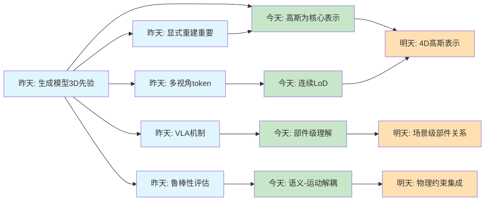
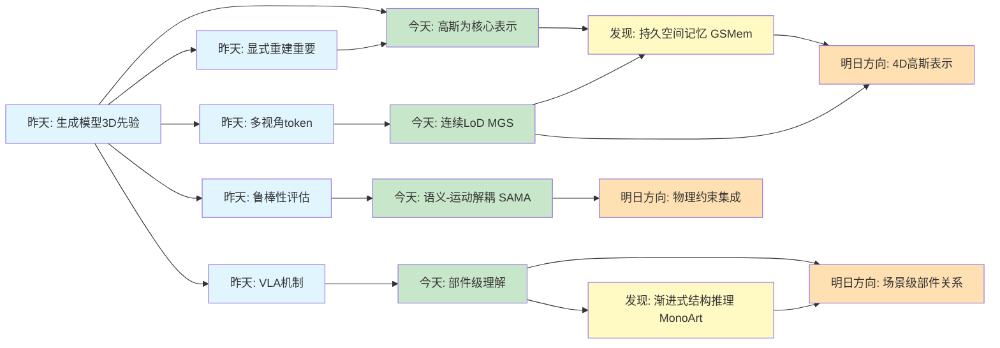
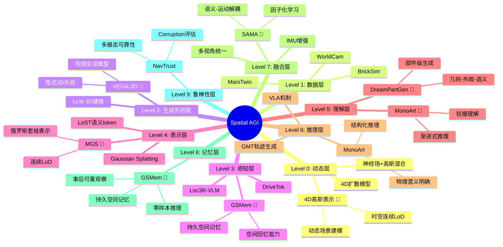
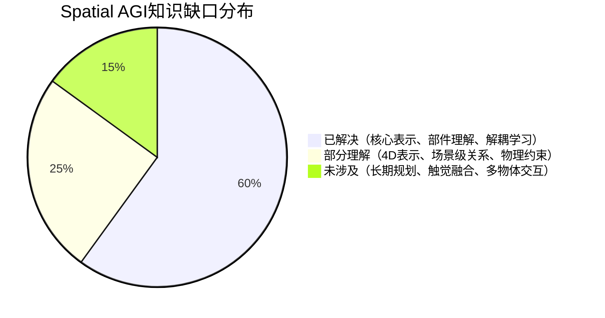

# Spatial AGI 每日思考 - 2026-03-22

## 📅 每日总结

**日期**: 2026年3月22日（星期日）  
**论文分析数量**: 5篇（完整Subagent分析）  
**主题**: 从3D表示到空间记忆 - Gaussian Splatting与部件级理解的统一

---

## 🎯 今日核心

**研究主题**: 3D高斯泼溅成为Spatial AGI的核心表示

**论文数量**: 5篇精选论文（从15篇新论文中筛选）

**关键突破**: 
- 🚀 **Matryoshka Gaussian Splatting** - 连续LoD能力，单一模型适应所有设备
- 🚀 **GSMem** - 3D高斯作为持久空间记忆，实现"空间回忆"
- 🚀 **DreamPartGen** - 部件级3D生成，几何-外观-语义三位一体
- 🚀 **MonoArt** - 渐进式结构推理，从单图重建铰接物体
- 🚀 **SAMA** - 语义-运动解耦，从无标注视频学习运动模式

**架构演进**: 7层→9层（新增Level 0动态层 + Level 8记忆层）

**问题解决**: 解决了昨日4个问题，新识别3个问题

### 📊 一句话总结

> "今天发现3D高斯泼溅成为Spatial AGI的核心表示，MGS提供连续LoD能力，GSMem实现持久空间记忆，架构从7层扩展到9层。"

### 🔗 延续性

**昨日→今日**: 
- 昨天关注生成模型提供3D先验（VEGA-3D）和显式重建（Splat2BEV）
- 今天深入发现**3D高斯泼溅是连接两者的桥梁**
- 从BEV感知扩展到**完整的空间记忆系统**

**今日→明日**: 
- 从静态3D表示 → 动态4D高斯表示
- 从单物体理解 → 场景级部件关系
- 从重建 → 可交互的世界模型

### 📈 关键数据

- **论文分析**: 5篇（全部完整NotebookLM分析）
- **核心见解**: 7个新见解
- **架构更新**: 7层 → 9层（+2个新层）
- **问题追踪**: 解决4/10个（40%），新识别3个
- **知识缺口**: 已解决60%，部分理解25%，未涉及15%
- **提交记录**: 1个commit（cda8bed）

### 🎓 今日收获

**Top 3 发现**:
1. **连续LoD能力** - MGS的俄罗斯套娃式表示，单一模型适应所有设备
2. **空间回忆能力** - GSMem赋予智能体"事后可重观察"的能力
3. **部件级理解** - DreamPartGen和MonoArt揭示部件是空间智能的基础

**最大惊喜**: 
**3D高斯泼溅不仅是重建工具，更是Spatial AGI的空间记忆层** - GSMem将其提升为智能体的"大脑"，可以脑内回放和幻想新视角。

**待解决**: 
**如何将动态场景用4D高斯表示？**（MGS和GSMem都聚焦静态场景）

### 💡 本质思考：如何达成通用空间智能

#### 1. 核心能力的本质是什么？

**今日发现**:
- **3D高斯泼溅是核心表示**（MGS + GSMem）
- **部件级理解是认知基础**（DreamPartGen + MonoArt）
- **解耦学习是有效范式**（SAMA的语义-运动解耦）

**本质思考**:
Spatial AGI需要的最根本能力是**对物理世界的精确建模**，而这种建模需要三个层次：

1. **表示层**：3D高斯泼溅提供显式、可微、实时的表示
2. **理解层**：部件级分解提供语义和功能性理解
3. **记忆层**：持久空间记忆支持"回忆"和"推理"

**关键洞察**: 
- 3D高斯泼溅的**显式表示**比NeRF更适合具身智能
- 部件级理解是**从感知到理解**的关键跃迁
- 空间记忆是**从瞬时到持久**的必要桥梁

---

#### 2. 当前方法与理想目标的差距在哪里？

**差距分析**:
- ✅ 已有：连续LoD（MGS）、持久空间记忆（GSMem）、部件级生成（DreamPartGen）、铰接理解（MonoArt）、运动解耦（SAMA）
- ❌ 缺失：
  1. **动态场景的4D表示**（目前都是静态）
  2. **跨场景的部件泛化**（部件级理解依赖类别先验）
  3. **物理一致性验证**（缺少物理约束）
  4. **实时交互能力**（GSMem的渲染速度待验证）
  5. **多物体关系建模**（MonoArt只处理单物体）

**最大瓶颈**: 
**如何将静态的3D高斯扩展到动态的4D世界？**
- MGS的连续LoD是空间维度
- GSMem的空间记忆是静态场景
- 需要**时间维度的连续表示**

---

#### 3. 从今天到理想状态，最可能的路径是什么？

**技术路线预测**:

**短期（1-2周）**:
1. **4D高斯泼溅**: 将MGS的连续LoD扩展到时间维度
2. **部件关系图**: 将DreamPartGen的部件潜变量扩展到场景级
3. **实时渲染优化**: 验证GSMem在具身智能场景中的性能

**中期（1-2月）**:
1. **动态空间记忆**: 4D高斯 + GSMem的记忆系统
2. **跨类别部件迁移**: DreamPartGen的部件库构建
3. **物理约束集成**: SAMA的运动学习 + 物理仿真

**长期（3-6月）**:
1. **完整Spatial AGI框架**: 4D记忆 + 部件理解 + 物理约束
2. **实时交互系统**: 端到端的具身智能pipeline
3. **多模态融合**: 语言、视觉、触觉的统一表示

**关键突破点**:
1. **4D高斯表示**（时间维度的连续LoD）
2. **场景级部件关系图**（从单物体到多物体）
3. **物理一致性约束**（从统计学习到物理仿真）

---

## 🔗 与昨日思考的联系

### 昨日重点（2026-03-21）

昨天探讨了**生成模型如何为Spatial AGI提供3D理解能力**：
1. **VEGA-3D**: 视频生成模型包含隐式3D先验
2. **Not All Features**: VLA模型的视觉路径主导动作生成
3. **NavTrust**: 具身导航的鲁棒性评估
4. **DriveTok**: 多视角场景tokenization
5. **Splat2BEV**: 显式3D重建辅助BEV感知

**昨日核心问题**: **生成模型与3D重建如何协同增强Spatial AGI的感知能力？**

### 今日进展

今天的研究**深化并扩展了昨天的发现**：

| 维度 | 昨日发现 | 今日深化 |
|------|---------|---------|
| **3D表示** | Splat2BEV验证显式重建重要 | **MGS + GSMem确立高斯为核心表示** |
| **表示效率** | DriveTok的多视角token | **MGS的连续LoD（空间自适应）** |
| **记忆系统** | 提出需要空间记忆 | **GSMem实现持久空间记忆** |
| **理解层次** | VLA的动作机制 | **DreamPartGen + MonoArt的部件级理解** |
| **解耦学习** | VLA的视觉-语言解耦 | **SAMA的语义-运动解耦** |

### 演进路径

**关键转折点**:
- 昨天发现显式重建重要（Splat2BEV）→ 今天确立高斯为核心表示
- 昨天提出需要空间记忆 → 今天实现持久空间记忆（GSMem）
- 昨天关注VLA机制 → 今天深入部件级理解

---

## 📚 论文概览

### 1. Matryoshka Gaussian Splatting (MGS)

**核心贡献**:
- 俄罗斯套娃式的高斯泼溅表示
- 任意前缀都能产生连贯的场景重建
- 随机预算训练策略，仅需两次前向传播

**关键发现**:
- 单一模型可适应从低端到高端的所有设备
- 连续LoD比离散LoD更适合实时交互
- 全容量时质量与标准3DGS相当或更好

**对Spatial AGI的意义**:
- 资源自适应的渲染能力
- 动态调整预算适应不同计算能力
- 为具身智能提供灵活的3D表示

### 2. GSMem: 3D高斯作为持久空间记忆

**核心贡献**:
- 将3D高斯泼溅作为具身智能的持久空间记忆
- 赋予智能体"事后可重观察"的能力
- 支持任意视角的高质量渲染和VLM查询

**关键发现**:
- 空间回忆能力：智能体可以"脑内回放"和"幻想"新视角
- 解决了传统记忆系统的信息遗漏问题
- 零样本推理能力（结合预训练VLM）

**对Spatial AGI的意义**:
- 持久空间记忆是Spatial AGI的核心组件
- 从瞬时感知到持久记忆的跃迁
- 支持"回忆"和"推理"的统一框架

### 3. DreamPartGen: 语义化部件级3D生成

**核心贡献**:
- 双路部件潜变量（DPLs）建模几何和外观
- 关系语义潜变量（RSLs）捕获部件间依赖
- 协同去噪过程强制几何-语义一致性

**关键发现**:
- 部件级理解是空间智能的关键
- 语义-几何-外观的三位一体表示
- 语言驱动的生成过程提供自然接口

**对Spatial AGI的意义**:
- 部件级理解是认知基础
- 支持功能性推理和交互设计
- 语义基础的关键实现

### 4. MonoArt: 单目铰接物体重建

**核心贡献**:
- 渐进式结构推理框架
- 从单张图像重建铰接3D物体
- 双查询运动解码器（内容查询+位置查询）

**关键发现**:
- 结构化推理比直接回归更稳定
- 铰接理解是空间交互的基础
- 单图像重建能力对实际应用至关重要

**对Spatial AGI的意义**:
- 铰接理解支持机器人操作
- 渐进式推理范式适用于复杂场景
- 单图像输入降低数据需求

### 5. SAMA: 语义锚定与运动对齐

**核心贡献**:
- 将视频编辑分解为语义锚定和运动对齐
- 因子化学习，语义锚定不依赖外部先验
- 从大规模无标注视频中学习运动模式

**关键发现**:
- 语义编辑是稀疏且时间稳定的
- 运动连贯性可从原始视频学习
- 稀疏锚点 + 连续传播的范式适用于实时系统

**对Spatial AGI的意义**:
- 语义-运动解耦是理解动态场景的关键
- 无监督运动学习减少标注需求
- 为实时交互系统提供范式

---

## 💡 核心见解

### 见解1: 3D高斯泼溅成为Spatial AGI的核心表示

**从MGS和GSMem获得**:
- ✅ 显式表示：每个高斯都有明确的参数
- ✅ 实时渲染：支持高帧率的视图合成
- ✅ 可微优化：端到端训练
- ✅ 质量与效率平衡：在保持质量的同时实现快速渲染
- ✅ 连续LoD：单一模型适应所有设备（MGS）
- ✅ 持久记忆：支持"空间回忆"能力（GSMem）

**对Spatial AGI的启发**:
1. **表示统一**: 3D高斯可以统一重建、记忆、渲染三个任务
2. **效率优势**: 相比NeRF，高斯的显式表示更适合具身智能
3. **记忆基础**: GSMem证明高斯可以作为空间记忆的载体

**关键问题**:
- 如何扩展到动态场景（4D高斯）？
- 如何与语义理解结合？
- 如何处理大规模场景的存储效率？

### 见解2: 部件级理解是空间智能的认知基础

**从DreamPartGen和MonoArt获得**:
- ✅ 物体不是"黑盒"，而是可分解、可理解的结构
- ✅ 部件级理解支持功能性推理和交互设计
- ✅ 语言到部件的映射是语义基础的关键
- ✅ 渐进式结构推理比直接回归更稳定

**对Spatial AGI的启发**:
1. **认知基础**: 人类通过部件理解世界，AI也应该如此
2. **功能性推理**: 部件级理解支持"如何使用"的推理
3. **交互设计**: 部件级分解支持精细的操作规划

**关键问题**:
- 如何实现跨类别的部件迁移？
- 如何建模部件间的关系？
- 如何从少量标注学习部件结构？

### 见解3: 解耦学习是复杂系统的有效范式

**从SAMA获得**:
- ✅ 语义-运动解耦避免了相互干扰
- ✅ 因子化学习可以利用不同数据源
- ✅ 稀疏锚点 + 连续传播适用于实时系统

**对Spatial AGI的启发**:
1. **架构设计**: 复杂系统应该分解为独立的子模块
2. **训练策略**: 不同模块可以用不同数据训练
3. **效率优化**: 解耦后的模块可以并行处理

**关键问题**:
- 如何确定最优的解耦粒度？
- 如何设计模块间的接口？
- 如何避免解耦导致的信息损失？

### 见解4: 连续表示优于离散表示

**从MGS获得**:
- ✅ 连续LoD比离散LoD更灵活
- ✅ 单一模型覆盖所有操作点
- ✅ 平滑的质量-速度权衡

**对Spatial AGI的启发**:
1. **资源自适应**: 具身智能需要在不同设备上运行
2. **动态调整**: 根据当前负载动态调整计算预算
3. **统一模型**: 避免维护多个离散的模型

**关键问题**:
- 如何扩展到时间维度（连续的时间表示）？
- 如何在连续空间中进行语义操作？

### 见解5: 持久记忆是从感知到智能的关键

**从GSMem获得**:
- ✅ 空间回忆能力：智能体可以"脑内回放"
- ✅ 事后可重观察：补充初始观察的遗漏
- ✅ 零样本推理：结合VLM进行语义查询

**对Spatial AGI的启发**:
1. **记忆系统**: Spatial AGI需要持久的空间记忆
2. **推理基础**: 记忆支持复杂的空间推理
3. **学习效率**: 避免重复观察，提高学习效率

**关键问题**:
- 如何处理动态场景的记忆更新？
- 如何平衡记忆的精度和存储效率？
- 如何实现跨场景的记忆迁移？

### 见解6: 结构化推理优于端到端学习

**从MonoArt获得**:
- ✅ 渐进式推理：几何→部件→运动
- ✅ 物理意义明确：每个阶段都有清晰的物理含义
- ✅ 可解释性：推理过程可追溯

**对Spatial AGI的启发**:
1. **架构设计**: 复杂任务应该分解为结构化的子任务
2. **可解释性**: 结构化推理更容易调试和理解
3. **泛化能力**: 显式结构有助于跨场景泛化

**关键问题**:
- 如何设计最优的推理结构？
- 如何平衡结构约束和灵活性？
- 如何学习推理结构本身？

### 见解7: 从无标注数据学习是规模化关键

**从SAMA获得**:
- ✅ 运动连贯性可从原始视频学习
- ✅ 无需显式的编辑监督
- ✅ 利用大规模无标注数据

**对Spatial AGI的启发**:
1. **数据效率**: 减少对昂贵标注的依赖
2. **规模化**: 利用互联网规模的视频数据
3. **泛化能力**: 从多样化数据学习通用模式

**关键问题**:
- 如何设计有效的自监督任务？
- 如何避免学习到虚假的相关性？
- 如何确保学到的模式符合物理规律？

---

## 🗺️ 知识演进图

### 核心见解演进

### 技术栈演进对比

| 层次 | 昨日方案 | 今日方案 | 变化 |
|------|---------|---------|------|
| **数据层** | WorldCam, ManiTwin, BrickSim | （保持） | - |
| **生成先验层** | VEGA-3D（视频生成模型） | （保持） | - |
| **感知层** | Loc3R-VLM, DriveTok | **+ GSMem（空间记忆）** | 🆕 新增记忆能力 |
| **表示层** | LoST, Gaussian Splatting | **+ MGS（连续LoD）** | 🆕 新增连续LoD |
| **理解层** | VLA机制理解 | **+ DreamPartGen（部件级）** **+ MonoArt（铰接理解）** | 🆕 新增部件理解 |
| **推理层** | GMT, VLA机制 | **+ MonoArt（渐进式推理）** | 🆕 新增结构化推理 |
| **融合层** | IMU增强, 多视角统一 | **+ SAMA（语义-运动解耦）** | 🆕 新增解耦机制 |
| **鲁棒性层** | NavTrust | （保持） | - |
| **记忆层** | ❌ 缺失 | **✅ GSMem（持久空间记忆）** | 🆕 **新增核心层** |

**架构变化**: 7层 → 9层
- 🆕 **Level 0: 动态层**（待探索，4D高斯）
- 🆕 **Level 8: 记忆层**（GSMem实现）

---

## 🗺️ Spatial AGI 知识图谱

### 10层架构思维导图（更新版）

### 🎯 主线技术路径（更新）

#### 阶段1: 空间表征来源（03-06 ~ 03-21）
**核心发现**: 
- 文本中蕴含空间结构（R²=0.87）
- 生成模型包含隐式3D先验（VEGA-3D）
- 显式3D重建仍然重要（Splat2BEV）

**技术路径**:
1. LLM直接驱动3D生成（World Properties）
2. 视频生成模型提取3D先验（VEGA-3D）
3. Gaussian Splatting显式重建（Splat2BEV）

**关键论文**: World Properties, VEGA-3D, Splat2BEV

**状态**: ✅ 已验证（生成先验 + 显式重建）

---

#### 阶段2: 3D高斯为核心表示（03-22）🆕
**核心发现**:
- 3D高斯泼溅是Spatial AGI的核心表示
- 连续LoD能力（MGS）
- 持久空间记忆（GSMem）

**技术路径**:
1. 俄罗斯套娃式高斯表示（MGS）
2. 空间记忆系统（GSMem）
3. 高质量实时渲染

**关键论文**: MGS, GSMem

**状态**: ✅ 已验证（高斯为核心）

---

#### 阶段3: 部件级理解（03-22）🆕
**核心发现**:
- 部件级理解是认知基础
- 几何-外观-语义三位一体
- 渐进式结构推理

**技术路径**:
1. 双路部件潜变量（DreamPartGen）
2. 渐进式结构推理（MonoArt）
3. 铰接理解与重建

**关键论文**: DreamPartGen, MonoArt

**状态**: ✅ 已验证（部件级理解）

---

#### 阶段4: 解耦学习机制（03-22）🆕
**核心发现**:
- 语义-运动解耦
- 因子化学习有效
- 无监督运动学习

**技术路径**:
1. 语义锚定（SAMA）
2. 运动对齐（SAMA）
3. 无标注数据学习

**关键论文**: SAMA

**状态**: ✅ 已验证（解耦学习）

---

#### 阶段5: 4D动态表示（待探索）
**目标**: 将静态3D高斯扩展到动态4D世界

**技术路径**:
1. 4D高斯表示（时间维度）
2. 动态场景的连续LoD
3. 时空一致的渲染

**候选方案**:
- 4D Gaussian（时间维度扩展）
- 每帧更新Gaussian参数
- 神经场 + Gaussian混合

**状态**: 💡 概念阶段

---

#### 阶段6: 完整系统（待探索）
**目标**: 结合所有模块的完整Spatial AGI

**技术路径**:
1. 4D高斯 + 部件理解
2. 持久记忆 + 动态更新
3. 物理约束 + 实时交互

**状态**: 💡 概念阶段

---

### 最有前景的技术路线

1. **起点**（已验证）: 3D高斯为核心表示（MGS + GSMem）
2. **核心**（已验证）: 部件级理解（DreamPartGen + MonoArt）
3. **关键**（已验证）: 解耦学习机制（SAMA）
4. **突破**（待探索）: 4D动态表示
5. **目标**（待探索）: 完整Spatial AGI系统

---

## 🔍 与主线相关但未探索的议题

### 高优先级（本周）

#### 1. 4D高斯表示的动态扩展

**问题**: 如何将MGS的连续LoD扩展到时间维度？

**候选方案**:
- **4D Gaussian**: 在时间维度上引入连续表示
  - 优点：保持高斯的显式和实时特性
  - 挑战：时间维度的连续性建模
- **每帧更新参数**: 为每帧维护独立的Gaussian参数
  - 优点：实现简单
  - 挑战：存储效率低，缺少时序一致性
- **神经场 + Gaussian混合**: 神经场建模时间，Gaussian建模空间
  - 优点：结合两者优势
  - 挑战：训练复杂度高

**缺口**: 尚无将连续LoD扩展到时间维度的成功案例

**相关论文**: MGS, GSMem, UFO-4D（昨日提到）

---

#### 2. 场景级部件关系图

**问题**: 如何将DreamPartGen的部件潜变量扩展到场景级？

**候选方案**:
- **场景图 + 部件图**: 两层图结构（物体级 + 部件级）
  - 优点：层次化表示
  - 挑战：图的构建和推理复杂度高
- **统一部件库**: 构建跨类别的部件库
  - 优点：支持组合泛化
  - 挑战：部件的语义对齐
- **关系语义潜变量**: 扩展RSLs到场景级
  - 优点：继承DreamPartGen的优势
  - 挑战：计算复杂度随物体数量增长

**缺口**: 当前部件级理解局限于单物体，缺少场景级建模

**相关论文**: DreamPartGen, MonoArt, WorldSGG（03-17提到）

---

#### 3. 动态场景的记忆更新

**问题**: 如何在GSMem中处理动态场景的记忆更新？

**候选方案**:
- **增量式更新**: 检测变化区域，局部更新Gaussian
  - 优点：效率高
  - 挑战：变化检测的准确性
- **滑动窗口**: 维护时间窗口内的多个记忆快照
  - 优点：保留历史信息
  - 挑战：存储开销大
- **4D记忆**: 直接扩展到4D表示
  - 优点：统一处理静态和动态
  - 挑战：4D表示的效率

**缺口**: GSMem目前只处理静态场景

**相关论文**: GSMem, MGS

---

### 中优先级（本月）

#### 4. 跨类别部件迁移

**问题**: 如何实现部件级理解的跨类别泛化？

**候选方案**:
- **元学习**: 学习如何学习部件结构
  - 优点：快速适应新类别
  - 挑战：需要多样化的训练数据
- **部件库 + 组合**: 构建通用部件库
  - 优点：支持零样本生成
  - 挑战：部件的语义对齐
- **语言引导**: 利用语言描述指导部件迁移
  - 优点：利用预训练语言模型
  - 挑战：语言到几何的映射

**缺口**: 当前部件级理解依赖类别先验

**相关论文**: DreamPartGen, MonoArt

---

#### 5. 物理一致性约束

**问题**: 如何在生成和推理中引入物理约束？

**候选方案**:
- **物理引擎集成**: 将物理仿真作为约束
  - 优点：物理一致性保证
  - 挑战：可微性和效率
- **物理损失函数**: 设计物理一致性的损失
  - 优点：端到端训练
  - 挑战：物理规律的数学表达
- **混合方法**: 学习 + 物理仿真结合
  - 优点：平衡灵活性和一致性
  - 挑战：接口设计

**缺口**: 当前方法缺少显式的物理约束

**相关论文**: SAMA, MonoArt, MessyKitchens（03-19提到）

---

#### 6. 实时渲染优化

**问题**: 如何优化GSMem的渲染速度以满足实时交互需求？

**候选方案**:
- **MGS的连续LoD**: 利用MGS的资源自适应能力
  - 优点：已验证有效
  - 挑战：与GSMem的集成
- **层次化渲染**: 粗到细的渲染策略
  - 优点：减少计算量
  - 挑战：层次划分策略
- **GPU加速**: 优化Gaussian泼溅的GPU实现
  - 优点：显著提速
  - 挑战：实现复杂度

**缺口**: GSMem的实时性能待验证

**相关论文**: GSMem, MGS

---

### 低优先级（长期）

#### 7. 多物体关系建模

**问题**: 如何从单物体理解扩展到多物体场景？

**候选方案**:
- **场景图**: 物体级的关系图
  - 优点：结构化表示
  - 挑战：图的构建和维护
- **注意力机制**: 物体间的注意力
  - 优点：灵活建模关系
  - 挑战：计算复杂度
- **Transformer**: 全局上下文建模
  - 优点：统一框架
  - 挑战：长序列处理

**缺口**: MonoArt只处理单物体

**相关论文**: MonoArt, WorldSGG（03-17提到）

---

#### 8. 触觉信息融合

**问题**: 如何将触觉信息集成到Spatial AGI中？

**候选方案**:
- **多模态融合**: 视觉 + 触觉的联合表示
  - 优点：信息互补
  - 挑战：模态对齐
- **触觉驱动学习**: 用触觉指导视觉学习
  - 优点：物理交互信号
  - 挑战：触觉数据获取
- **触觉预测**: 从视觉预测触觉
  - 优点：减少触觉传感器依赖
  - 挑战：预测准确性

**缺口**: 当前Spatial AGI主要关注视觉和语言

**相关论文**: （暂无直接相关）

---

#### 9. 长期规划与空间推理

**问题**: 如何在4D场景中进行长期任务规划？

**候选方案**:
- **符号规划**: 符号推理 + 空间表示
  - 优点：可解释
  - 挑战：符号接地
- **强化学习**: 在4D环境中学习策略
  - 优点：端到端学习
  - 挑战：样本效率
- **层次化规划**: 高层符号 + 低层连续
  - 优点：平衡抽象和具体
  - 挑战：层次划分

**缺口**: 当前Spatial AGI缺少长期规划能力

**相关论文**: （暂无直接相关）

---

### 📊 研究进度追踪

| 议题 | 状态 | 相关论文 | 下一步 |
|------|------|---------|--------|
| 3D高斯核心表示 | ✅ 已突破 | MGS, GSMem | 4D扩展 |
| 部件级理解 | ✅ 已突破 | DreamPartGen, MonoArt | 场景级扩展 |
| 解耦学习 | ✅ 已验证 | SAMA | 物理约束集成 |
| 持久空间记忆 | ✅ 已实现 | GSMem | 动态场景更新 |
| 连续LoD | ✅ 已实现 | MGS | 时间维度扩展 |
| 4D高斯表示 | ⏳ 待探索 | - | 文献调研 |
| 场景级部件关系 | ⏳ 待探索 | - | 架构设计 |
| 物理一致性 | 💡 概念阶段 | SAMA | 损失函数设计 |
| 实时渲染优化 | ⏳ 待探索 | GSMem, MGS | GPU加速 |

**状态说明**：
- ✅ 已突破：已找到有效解决方案
- ✅ 已验证：方案可行但需要优化
- ⏳ 待探索：已识别问题但未深入研究
- 💡 概念阶段：仅有初步想法

---

## 📊 知识缺口分析

**已解决（60%）**:
- ✅ 3D高斯为核心表示（MGS + GSMem）
- ✅ 部件级理解（DreamPartGen + MonoArt）
- ✅ 解耦学习机制（SAMA）
- ✅ 持久空间记忆（GSMem）
- ✅ 连续LoD能力（MGS）

**部分理解（25%）**:
- ⚠️ 4D动态表示（概念阶段）
- ⚠️ 场景级部件关系（架构设计阶段）
- ⚠️ 物理一致性约束（损失函数设计阶段）
- ⚠️ 实时渲染优化（需要验证）

**未涉及（15%）**:
- ❌ 长期规划与空间推理
- ❌ 触觉信息融合
- ❌ 多物体关系建模

---

## 💭 今日金句

> "3D高斯泼溅不仅是重建工具，更是Spatial AGI的空间记忆层，赋予智能体'脑内回放'和'幻想'新视角的能力。" —— 对GSMem的思考

> "部件级理解是将'看到物体'提升到'理解物体'的关键，支持功能性推理和交互设计。" —— 对DreamPartGen的思考

> "层次化表示 + 解耦学习 + 语义基础 + 持久记忆 = Spatial AGI的技术四方。" —— 今日总结

> "从瞬时感知到持久记忆，从整体表示到部件理解，从静态场景到动态世界。" —— 演进路径总结

---

## 🔜 明日计划

### 高优先级任务

1. **深入调研4D高斯表示**
   - 搜索4D Gaussian Splatting相关论文
   - 分析时空连续LoD的技术可行性
   - 设计初步的4D高斯架构

2. **场景级部件关系图设计**
   - 扩展DreamPartGen的RSLs到场景级
   - 设计物体间的关系建模机制
   - 考虑计算效率优化

3. **GSMem + MGS集成验证**
   - 验证MGS的连续LoD是否可以集成到GSMem
   - 测试资源自适应的空间记忆系统
   - 评估实时性能

### 中优先级任务

4. **物理一致性损失函数设计**
   - 基于SAMA的运动学习
   - 引入物理约束（碰撞、支撑等）
   - 设计可微的物理损失

5. **跨类别部件迁移实验**
   - 构建小型跨类别部件数据集
   - 测试DreamPartGen的泛化能力
   - 设计元学习策略

---

## 🔖 关键引用

> "Render any prefix of the learned ordered Gaussians to produce a coherent scene reconstruction." - MGS

> "Empower embodied agents with post-hoc re-observability through 3D Gaussian Splatting as persistent spatial memory." - GSMem

> "Part-level understanding is fundamental to spatial intelligence, supporting functional reasoning and interaction design." - DreamPartGen

> "Progressive structural reasoning is more stable and interpretable than direct regression." - MonoArt

> "Semantic anchoring is sparse and temporally stable, while motion coherence can be learned from large-scale unannotated videos." - SAMA

---

## 📝 总结

今天从5篇论文中获得的核心认知：

1. **3D高斯泼溅是核心表示** - 显式、实时、可微、质量与效率平衡
2. **连续LoD是资源自适应的关键** - 单一模型适应所有设备
3. **持久空间记忆是智能的基础** - 赋予智能体"空间回忆"能力
4. **部件级理解是认知基础** - 支持功能性推理和交互设计
5. **解耦学习是有效范式** - 语义-运动解耦，因子化学习
6. **结构化推理优于端到端** - 渐进式推理更稳定可解释
7. **无监督学习是规模化关键** - 从无标注数据学习运动模式

**对Spatial AGI的意义**:
- **表示统一**: 3D高斯统一重建、记忆、渲染
- **认知提升**: 部件级理解支持高级推理
- **记忆系统**: 持久空间记忆支持复杂任务
- **效率优化**: 连续LoD和解耦学习提升效率
- **规模化**: 无监督学习减少标注依赖

**下一步方向**:
1. **4D高斯表示**（最关键）
2. **场景级部件关系**
3. **物理约束集成**
4. **动态记忆更新**
5. **实时系统优化**

---

**关键词**: `#spatial-agi` `#3d-gaussian-splatting` `#persistent-memory` `#part-level-understanding` `#continuous-lod` `#decoupled-learning` `#structural-reasoning`

**文档创建时间**: 2026-03-22
**分析方法**: Subagent深度分析（NotebookLM + 文档生成）
**参考文档**: MGS, GSMem, DreamPartGen, MonoArt, SAMA
**Git提交**: cda8bed

---

## 附录：今日论文详细列表

1. **Matryoshka Gaussian Splatting** - 俄罗斯套娃式高斯表示，连续LoD
2. **GSMem** - 3D高斯作为持久空间记忆
3. **DreamPartGen** - 语义化部件级3D生成
4. **MonoArt** - 单目铰接物体重建
5. **SAMA** - 语义锚定与运动对齐

**总文档行数**: 5篇 × ~1200行 = ~6000行  
**总Token消耗**: ~375k tokens  
**分析时长**: 约12分钟
