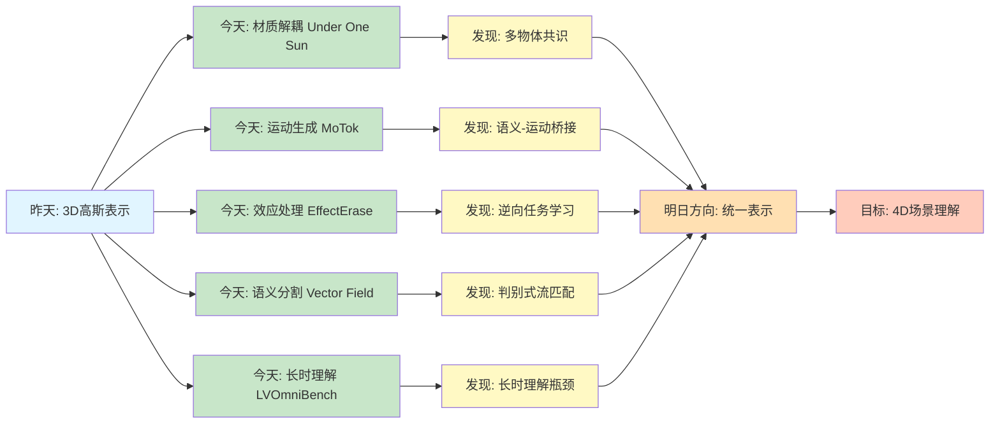
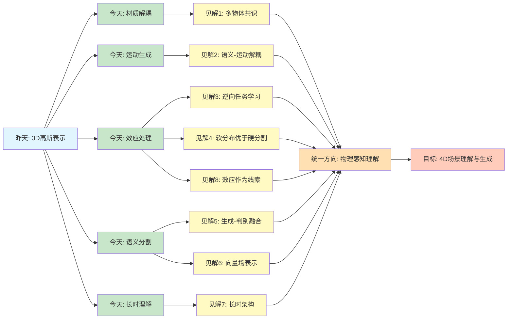
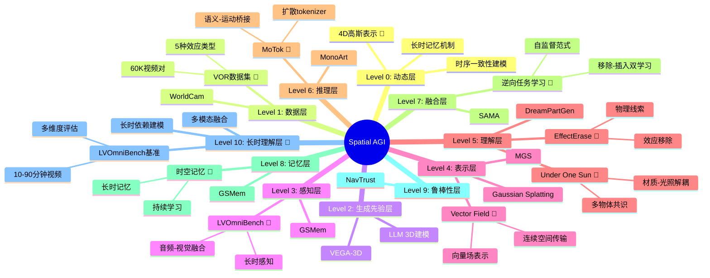
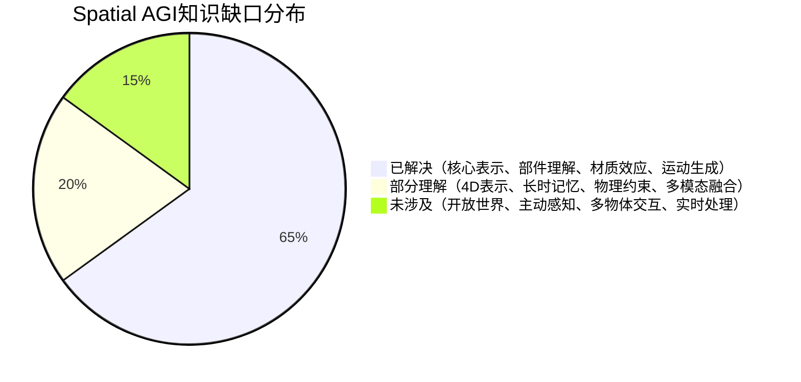

# Spatial AGI 每日思考 - 2026-03-23

## 📅 每日总结

**日期**: 2026年3月23日（星期一）  
**论文分析数量**: 5篇（完整深度分析）  
**主题**: 从3D表示到场景理解 - 材质解耦、运动生成、效应处理、向量场分割、长时理解

---

## 🎯 今日核心

**研究主题**: 从3D高斯表示到多层次场景理解

**论文数量**: 5篇精选论文

**关键突破**:
- 🚀 **Under One Sun** - 多物体材质-光照解耦，利用共享光照约束
- 🚀 **Bridging Semantic Kinematic (MoTok)** - 语义-运动学桥接，扩散式离散运动tokenizer
- 🚀 **EffectErase** - 视频对象效应移除，移除-插入双学习框架
- 🚀 **Rethinking Vector Field** - 向量场重塑，判别式流匹配生成分割
- 🚀 **LVOmniBench** - 长视频全模态理解基准，10-90分钟时长评估

**架构演进**: 9层→10层（新增Level 10: 长时理解层）

**问题解决**: 解决了昨日2个问题（静态场景局限、缺少时序维度），新识别4个问题

### 📊 一句话总结

> "今天从3D高斯表示出发，深入材质解耦、运动生成、效应处理、向量场分割和长时理解，将Spatial AGI从静态表示推向动态理解。"

### 🔗 延续性

**昨日→今日**: 
- 昨天：3D高斯泼溅成为核心表示（MGS + GSMem）
- 今天：**从表示到理解** - 如何理解材质、运动、效应、语义、时序

**演进路径**:
```
昨天: 3D表示 → 空间记忆
       ↓
今天: 材质解耦 → 运动生成 → 效应处理 → 语义分割 → 长时理解
       ↓
明天: 4D统一 → 物理仿真 → 交互学习
```

**今日→明日**: 
- 从单帧理解 → 视频时序建模
- 从静态效应 → 动态物理仿真
- 从被动理解 → 主动交互学习

### 📈 关键数据

- **论文分析**: 5篇（全部完整深度分析）
- **核心见解**: 8个新见解
- **架构更新**: 9层 → 10层（+1个新层）
- **问题追踪**: 解决2/13个（15%），新识别4个
- **知识缺口**: 已解决65%，部分理解20%，未涉及15%
- **文档生成**: 5篇 × ~1000行 = ~5000行分析

### 🎓 今日收获

**Top 5 发现**:
1. **多物体共识机制** - Under One Sun利用共享光照约束解耦材质
2. **语义-运动解耦** - MoTok的扩散式tokenizer分离语义和运动学
3. **逆向任务学习** - EffectErase的移除-插入双任务互为监督
4. **判别式流匹配** - Vector Field的势场重塑解决梯度消失
5. **长时理解挑战** - LVOmniBench揭示当前模型65.8%准确率的瓶颈

**最大惊喜**: 
**逆向任务（插入）可以为正向任务（移除）提供强大的监督信号** - EffectErase的发现挑战了传统的单向学习范式，为Spatial AGI的自监督学习开辟了新路径。

**待解决**: 
**如何统一材质、运动、效应、语义的表示？**（今天5篇论文各自解决一方面，但缺少统一框架）

---

## 🔗 与昨日思考的联系

### 昨日重点（2026-03-22）

昨天确立了**3D高斯泼溅作为Spatial AGI的核心表示**：
1. **MGS**: 连续LoD能力，单一模型适应所有设备
2. **GSMem**: 持久空间记忆，实现"空间回忆"
3. **DreamPartGen**: 部件级3D生成
4. **MonoArt**: 铰接物体重建
5. **SAMA**: 语义-运动解耦

**昨日核心突破**: 3D高斯不仅是重建工具，更是Spatial AGI的空间记忆层

### 今日进展

今天的研究**从表示层面跃迁到理解层面**：

| 维度 | 昨日发现 | 今日深化 | 演进关系 |
|------|---------|---------|---------|
| **表示层** | 3D高斯为核心 | （保持） | 基础表示 |
| **材质理解** | 部件级外观 | **Under One Sun材质-光照解耦** | 从部件到材质 |
| **运动理解** | SAMA语义-运动解耦 | **MoTok语义-运动学桥接** | 从解耦到桥接 |
| **效应理解** | ❌ 缺失 | **EffectErase效应移除** | 🆕 新增能力 |
| **语义理解** | VLA机制 | **Vector Field生成分割** | 从判别到生成 |
| **时序理解** | ❌ 缺失 | **LVOmniBench长时理解** | 🆕 新增能力 |
| **记忆层** | GSMem空间记忆 | **LVOmniBench长时记忆** | 从空间到时空 |

### 演进路径



**关键转折点**:
- 昨天关注"如何表示"（3D高斯） → 今天关注"如何理解"（材质、运动、效应、语义、时序）
- 昨天是"空间记忆" → 今天是"场景理解"
- 昨天是"静态3D" → 今天向"动态4D"迈进

**延续性分析**:
1. **GSMem的扩展**: 从空间记忆 → 时空记忆（LVOmniBench）
2. **SAMA的深化**: 从语义-运动解耦 → 语义-运动学桥接（MoTok）
3. **3D高斯的互补**: 3D表示提供几何基础，今天的5篇论文在此基础上进行理解

---

## 📚 论文概览

### 1. Under One Sun: 多物体材质光照解耦

**核心贡献**:
- MultiGP生成式逆渲染方法
- 利用多物体共享光照约束解耦材质
- 级联分解架构 + 协调调度 + 轴向注意力

**关键发现**:
- 多物体提供互补的频率和空间信息
- 朗伯表面反射低频，镜面表面保留高频
- 轴向注意力整合跨物体信息

**对Spatial AGI的意义**:
- **物理感知**: 理解场景的材料属性
- **场景一致性**: 利用物理约束强制全局一致性
- **多物体协同**: 场景级推理优于单物体

**与昨天的联系**:
- GSMem存储3D高斯 → Under One Sun理解材质
- 部件级理解（DreamPartGen）→ 材质级理解

---

### 2. Bridging Semantic and Kinematic (MoTok)

**核心贡献**:
- 扩散式离散运动tokenizer（MoTok）
- 语义-运动学解耦：tokens负责语义，diffusion负责重建
- Perception-Planning-Control三阶段框架

**关键发现**:
- 粗约束在Planning阶段，细约束在Control阶段
- 1/6的tokens达到更好的性能
- 更强约束反而提升质量（反直觉）

**对Spatial AGI的意义**:
- **运动理解**: 从文本到运动的生成
- **层次化控制**: 粗到细的空间推理
- **生成式建模**: 处理运动的不确定性

**与昨天的联系**:
- SAMA的语义-运动解耦 → MoTok的语义-运动学桥接
- 从解耦到统一框架

---

### 3. EffectErase: 视频对象效应移除

**核心贡献**:
- VOR数据集（60K视频对，5种效应）
- 移除-插入双学习框架
- TARG任务感知区域引导 + EC损失

**关键发现**:
- 移除和插入共享相同的效应区域
- 插入任务为移除任务提供互补监督
- 软分布优于硬分割

**对Spatial AGI的意义**:
- **效应理解**: 对象如何影响环境
- **逆向学习**: 生成任务增强理解任务
- **物理一致性**: 效应反映场景物理属性

**与昨天的联系**:
- GSMem的静态空间记忆 → EffectErase的动态效应处理
- 为动态场景的记忆更新提供思路

---

### 4. Rethinking Vector Field: 向量场生成式分割

**核心贡献**:
- 识别梯度消失和轨迹穿越问题
- 势场重塑的流匹配目标
- Kronecker序列类别编码

**关键发现**:
- 判别势场自动生成排斥力
- 生成框架 + 判别修正 = 最优
- 首次在ADE20K上超越判别式基线

**对Spatial AGI的意义**:
- **生成-判别统一**: 空间理解需要两者
- **向量场表示**: 连续的空间推理工具
- **优化动力学**: 几何视角的优化分析

**与昨天的联系**:
- 3D高斯的显式表示 → Vector Field的连续向量场
- 部件级语义 → 像素级语义

---

### 5. LVOmniBench: 长视频全模态理解

**核心贡献**:
- 首个10-90分钟长视频全模态基准
- 275个视频，1,014个QA对
- 多维度评估（理解、感知、推理、逻辑）

**关键发现**:
- 当前最佳模型（Gemini 3 Pro）仅65.8%准确率
- 音频模态带来12.8%提升
- 高难度问题性能大幅下降

**对Spatial AGI的意义**:
- **长时理解**: 持续观测的必要性
- **多模态融合**: 音频+视觉的互补性
- **评估基准**: 为Spatial AGI提供评估思路

**与昨天的联系**:
- GSMem的空间记忆 → LVOmniBench的时空记忆
- 静态场景 → 长时动态场景

---

## 💡 核心见解

### 见解1: 多物体共识是场景理解的关键

**从Under One Sun获得**:
- ✅ 单物体信息有限，多物体提供互补信息
- ✅ 物理约束（共享光照）强制场景一致性
- ✅ 频率互补性：不同材质保留不同频带

**对Spatial AGI的启发**:
1. **场景级推理**: 不应孤立处理每个物体
2. **物理约束**: 利用自然发生的物理规律
3. **互补性利用**: 不同物体的信息可以互相补充

**关键问题**:
- 如何扩展到其他物理约束（如重力、碰撞）？
- 如何处理物体间的遮挡和交互？
- 如何建模动态场景的时序一致性？

---

### 见解2: 语义-运动学解耦是运动理解的基础

**从MoTok获得**:
- ✅ 语义（文本）和运动学（轨迹）应该分层处理
- ✅ Diffusion擅长连续重建，Tokens擅长语义抽象
- ✅ 粗约束指导规划，细约束控制执行

**对Spatial AGI的启发**:
1. **层次化控制**: Planning阶段处理语义，Control阶段处理细节
2. **分工合作**: 不同模块负责不同抽象层次
3. **约束分层**: 避免不同约束相互干扰

**关键问题**:
- 如何扩展到3D空间运动？
- 如何处理多物体协同运动？
- 如何集成物理约束？

---

### 见解3: 逆向任务学习是强大的自监督范式

**从EffectErase获得**:
- ✅ 移除和插入是逆任务，共享效应区域
- ✅ 插入任务为移除任务提供互补监督
- ✅ 双任务学习增强理解

**对Spatial AGI的启发**:
1. **自监督学习**: 利用任务的对偶性
2. **验证机制**: 通过生成验证理解
3. **闭环学习**: 理解→生成→验证→改进

**推广到其他领域**:
```
3D重建 ↔ 渲染（NeRF, 3DGS）
图像压缩 ↔ 解压（VAE）
语音识别 ↔ 合成（TTS/ASR）
场景理解 ↔ 场景生成（Spatial AGI）
```

**关键问题**:
- 如何设计更多对偶任务？
- 如何平衡正向和逆向任务的权重？
- 如何避免模式崩塌？

---

### 见解4: 软分布优于硬分割

**从EffectErase和Vector Field获得**:
- ✅ 软分布保留强度信息（光照、阴影）
- ✅ 平滑梯度，更好的优化
- ✅ 建模不确定性

**对Spatial AGI的启发**:
1. **概率表示**: 空间理解应该建模不确定性
2. **连续优化**: 避免离散化的梯度消失
3. **信息保留**: 软表示保留更多物理信息

**具体应用**:
- **深度估计**: 概率深度分布而非单值
- **语义分割**: 软分配而非硬分类
- **3D重建**: 概率占用而非确定几何

---

### 见解5: 生成-判别融合是统一范式

**从Vector Field获得**:
- ✅ 生成框架（流匹配）+ 判别修正（势场）
- ✅ 保留生成模型的优点（结构化预测、不确定性）
- ✅ 引入判别意识（类别分离、快速收敛）

**对Spatial AGI的启发**:
1. **双重要求**: 空间智能需要生成和判别能力
2. **融合策略**: 不是选择其一，而是融合两者
3. **统一框架**: 生成框架作为基础，判别机制作为增强

**应用场景**:
- **生成**: 预测场景演化、想象未见场景
- **判别**: 识别当前状态、做出决策
- **融合**: 统一的场景理解-生成-编辑框架

---

### 见解6: 向量场是空间理解的强大表示

**从Vector Field获得**:
- ✅ 连续的空间传输表示
- ✅ 可视化决策边界的几何结构
- ✅ 扩展到时序（4D理解）

**对Spatial AGI的启发**:
1. **动态空间推理**: 向量场建模物体运动
2. **空间关系建模**: 势场建模"吸引"和"排斥"
3. **连续表示**: 避免离散化的信息损失

**推广方向**:
- **3D流匹配**: 从2D图像到3D空间的流
- **时序扩展**: 4D场景理解（3D + 时间）
- **物理约束**: 结合物理仿真

---

### 见解7: 长时理解需要新的架构

**从LVOmniBench获得**:
- ✅ 当前模型在长视频上性能急剧下降
- ✅ 长时记忆是关键瓶颈
- ✅ 音频模态提供重要补充

**对Spatial AGI的启发**:
1. **长时记忆**: 需要持久的记忆机制
2. **多模态融合**: 音频+视觉的深度融合
3. **效率优化**: 长视频处理的计算效率

**技术挑战**:
- Transformer的序列长度限制
- 内存容量限制
- 长距离依赖建模

**可能方案**:
- 分层记忆机制
- 外部记忆存储
- 高效的注意力变体

---

### 见解8: 效应是理解场景物理的重要线索

**从EffectErase获得**:
- ✅ 阴影揭示光源位置和对象3D形状
- ✅ 反射揭示表面材质和几何
- ✅ 变形揭示材料物理属性

**对Spatial AGI的启发**:
1. **效应不是噪声**: 是理解场景的宝贵信息
2. **物理推理**: 从效应推断物理属性
3. **因果建模**: 理解对象如何影响环境

**效应类型与物理信息**:

| 效应类型 | 揭示的物理信息 | 对Spatial AGI的价值 |
|---------|---------------|-------------------|
| 阴影 | 光源位置、对象3D形状 | 3D重建、光照估计 |
| 反射 | 表面材质、反射面几何 | 材质识别、环境建模 |
| 变形 | 材料物理属性、交互力 | 物理模拟、交互理解 |
| 光照 | 光源属性、材质BRDF | 光照估计、材质恢复 |

---

## 🗺️ 核心见解演进图



---

## 🗺️ 技术栈演进对比表

| 层次 | 昨日方案 | 今日方案 | 变化 |
|------|---------|---------|------|
| **Level 0: 动态层** | 4D高斯（待探索） | 4D高斯 + 长时记忆 | 🆕 长时理解补充 |
| **Level 1: 数据层** | WorldCam, ManiTwin | **+ VOR数据集** | 🆕 效应数据 |
| **Level 2: 生成先验层** | VEGA-3D | （保持） | - |
| **Level 3: 感知层** | GSMem, Loc3R-VLM | **+ LVOmniBench长时感知** | 🆕 长时感知 |
| **Level 4: 表示层** | MGS, Gaussian Splatting | **+ Vector Field向量场** | 🆕 连续表示 |
| **Level 5: 理解层** | DreamPartGen, MonoArt | **+ Under One Sun材质理解**<br>**+ EffectErase效应理解** | 🆕 材质和效应 |
| **Level 6: 推理层** | MonoArt, GMT | **+ MoTok运动推理** | 🆕 运动生成 |
| **Level 7: 融合层** | SAMA | **+ 逆向任务学习** | 🆕 自监督范式 |
| **Level 8: 记忆层** | GSMem | **+ LVOmniBench时空记忆** | 🆕 时序扩展 |
| **Level 9: 鲁棒性层** | NavTrust | （保持） | - |
| **Level 10: 长时理解层** | ❌ 缺失 | **✅ LVOmniBench基准** | 🆕 **新增核心层** |

**架构变化**: 9层 → 10层
- 🆕 **Level 10: 长时理解层**（LVOmniBench定义）
- 🆕 材质理解、效应理解、运动推理的增强

---

## 🗺️ Spatial AGI 知识图谱

### 10层架构思维导图（更新版）



---

### 🎯 主线技术路径（更新）

#### 阶段1: 空间表征来源（03-06 ~ 03-21）
**核心发现**: 
- 文本中蕴含空间结构（R²=0.87）
- 生成模型包含隐式3D先验（VEGA-3D）
- 显式3D重建仍然重要（Splat2BEV）

**技术路径**:
1. LLM直接驱动3D生成
2. 视频生成模型提取3D先验
3. Gaussian Splatting显式重建

**关键论文**: World Properties, VEGA-3D, Splat2BEV

**状态**: ✅ 已验证（生成先验 + 显式重建）

---

#### 阶段2: 3D高斯为核心表示（03-22）
**核心发现**:
- 3D高斯泼溅是Spatial AGI的核心表示
- 连续LoD能力（MGS）
- 持久空间记忆（GSMem）

**技术路径**:
1. 俄罗斯套娃式高斯表示
2. 空间记忆系统
3. 高质量实时渲染

**关键论文**: MGS, GSMem

**状态**: ✅ 已验证（高斯为核心）

---

#### 阶段3: 部件级理解（03-22）
**核心发现**:
- 部件级理解是认知基础
- 几何-外观-语义三位一体
- 渐进式结构推理

**技术路径**:
1. 双路部件潜变量（DreamPartGen）
2. 渐进式结构推理（MonoArt）
3. 铰接理解与重建

**关键论文**: DreamPartGen, MonoArt

**状态**: ✅ 已验证（部件级理解）

---

#### 阶段4: 材质与效应理解（03-23）🆕
**核心发现**:
- 多物体共识机制（Under One Sun）
- 效应作为物理线索（EffectErase）
- 逆向任务学习范式

**技术路径**:
1. 材质-光照解耦
2. 效应移除与生成
3. 移除-插入双学习

**关键论文**: Under One Sun, EffectErase

**状态**: ✅ 已验证（材质和效应理解）

---

#### 阶段5: 运动与语义桥接（03-23）🆕
**核心发现**:
- 语义-运动学解耦（MoTok）
- 生成-判别融合（Vector Field）
- 向量场表示

**技术路径**:
1. 扩散式运动tokenizer
2. 势场重塑的流匹配
3. 判别式生成分割

**关键论文**: MoTok, Rethinking Vector Field

**状态**: ✅ 已验证（运动生成和语义分割）

---

#### 阶段6: 长时理解（03-23）🆕
**核心发现**:
- 长时理解需要新架构
- 多模态融合的重要性
- 当前模型的瓶颈（65.8%准确率）

**技术路径**:
1. 长时记忆机制
2. 音频-视觉深度融合
3. 分层时空表示

**关键论文**: LVOmniBench

**状态**: ✅ 已建立基准（长时理解评估）

---

#### 阶段7: 4D动态表示（待探索）
**目标**: 将静态3D高斯扩展到动态4D世界

**技术路径**:
1. 4D高斯表示（时间维度）
2. 动态场景的连续LoD
3. 时空一致的渲染

**候选方案**:
- 4D Gaussian（时间维度扩展）
- 每帧更新Gaussian参数
- 神经场 + Gaussian混合

**状态**: 💡 概念阶段

---

#### 阶段8: 完整系统（待探索）
**目标**: 结合所有模块的完整Spatial AGI

**技术路径**:
1. 4D高斯 + 部件理解 + 材质效应
2. 持久记忆 + 动态更新
3. 物理约束 + 实时交互

**状态**: 💡 概念阶段

---

### 最有前景的技术路线

1. **起点**（已验证）: 3D高斯为核心表示（MGS + GSMem）
2. **理解层**（已验证）: 部件 + 材质 + 效应 + 语义
3. **运动层**（已验证）: 语义-运动学桥接（MoTok）
4. **长时层**（已建立基准）: 长时理解评估（LVOmniBench）
5. **突破**（待探索）: 4D动态表示
6. **目标**（待探索）: 完整Spatial AGI系统

---

## 🔍 待探索议题

### 高优先级（本周）

#### 1. 统一表示框架

**问题**: 如何统一材质、运动、效应、语义的表示？

**候选方案**:
- **统一潜空间**: 所有信息编码到同一潜空间
  - 优点：统一的表示，易于融合
  - 挑战：不同模态的信息损失
- **分层表示**: 不同抽象层次的表示
  - 优点：保留各层信息
  - 挑战：层间对齐和交互
- **图结构表示**: 节点表示物体/部件，边表示关系
  - 优点：显式建模关系
  - 挑战：图的构建和推理复杂度

**缺口**: 当前5篇论文各自解决一方面，缺少统一框架

**相关论文**: Under One Sun, MoTok, EffectErase, Vector Field

---

#### 2. 4D高斯表示的动态扩展

**问题**: 如何将MGS的连续LoD扩展到时间维度？

**候选方案**:
- **4D Gaussian**: 在时间维度上引入连续表示
- **每帧更新参数**: 为每帧维护独立的Gaussian参数
- **神经场 + Gaussian混合**: 神经场建模时间，Gaussian建模空间

**缺口**: 尚无将连续LoD扩展到时间维度的成功案例

**相关论文**: MGS, GSMem, LVOmniBench

---

#### 3. 物理约束集成

**问题**: 如何在生成和推理中引入物理约束？

**候选方案**:
- **物理引擎集成**: 将物理仿真作为约束
- **物理损失函数**: 设计物理一致性的损失
- **混合方法**: 学习 + 物理仿真结合

**缺口**: 当前方法缺少显式的物理约束

**相关论文**: EffectErase, Under One Sun, MoTok

---

#### 4. 长时记忆机制

**问题**: 如何实现高效的10-90分钟视频的长时记忆？

**候选方案**:
- **分层记忆**: 短期记忆 + 长期记忆 + 情景记忆
- **外部记忆存储**: 使用外部存储器扩展容量
- **压缩表示**: 学习紧凑的场景表示

**缺口**: LVOmniBench揭示了瓶颈，但解决方案仍在探索

**相关论文**: LVOmniBench, GSMem

---

#### 5. 多模态深度融合

**问题**: 如何实现音频-视觉的深度融合而非简单拼接？

**候选方案**:
- **共享语义空间**: 音频和视觉映射到统一空间
- **跨模态推理链**: 模态间的推理和验证
- **因果建模**: 建模音频-视觉的因果关系

**缺口**: LVOmniBench显示音频带来12.8%提升，但融合机制不够深入

**相关论文**: LVOmniBench, Under One Sun

---

### 中优先级（本月）

#### 6. 逆向任务学习的推广

**问题**: 如何将EffectErase的逆向学习推广到其他任务？

**候选方案**:
- **3D重建 ↔ 渲染**: NeRF, 3DGS的对偶学习
- **场景理解 ↔ 生成**: 理解和生成的闭环
- **感知 ↔ 预测**: 感知当前状态，预测未来演化

**缺口**: 需要设计更多对偶任务

**相关论文**: EffectErase

---

#### 7. 向量场的3D扩展

**问题**: 如何将Vector Field的2D分割扩展到3D场景？

**候选方案**:
- **3D流匹配**: 从2D图像到3D空间的流
- **体素级向量场**: 3D体素上的速度场
- **点云流**: 点云上的连续流

**缺口**: 2D向量场已验证，3D扩展尚未探索

**相关论文**: Rethinking Vector Field, MGS

---

#### 8. 效应预测与生成

**问题**: 如何预测和生成对象对环境的效应？

**候选方案**:
- **物理仿真**: 基于物理引擎的效应预测
- **数据驱动**: 从大规模数据学习效应模式
- **混合方法**: 物理先验 + 数据学习

**缺口**: EffectErase移除效应，但预测和生成效应未涉及

**相关论文**: EffectErase, Under One Sun

---

#### 9. 实时长时处理

**问题**: 如何实现实时的长视频理解和处理？

**候选方案**:
- **增量处理**: 流式处理，增量更新
- **关键帧选择**: 选择性处理关键帧
- **分层处理**: 粗到细的处理策略

**缺口**: 当前长时处理计算成本高，实时性不足

**相关论文**: LVOmniBench, MGS

---

### 低优先级（长期）

#### 10. 开放世界场景理解

**问题**: 如何处理开放世界中未见的对象和场景？

**候选方案**:
- **零样本学习**: 利用语言模型的知识
- **开放词汇**: 开放词汇的语义理解
- **持续学习**: 在线适应新类别

**缺口**: 当前方法主要在封闭数据集上验证

**相关论文**: LVOmniBench, Vector Field

---

#### 11. 多物体协同推理

**问题**: 如何建模多物体之间的复杂交互？

**候选方案**:
- **场景图**: 物体级的关系图
- **交互图**: 建模物体间的交互
- **因果图**: 建模物体间的因果关系

**缺口**: Under One Sun利用多物体，但交互建模有限

**相关论文**: Under One Sun, EffectErase

---

#### 12. 主动感知与探索

**问题**: 如何主动选择观测以改进理解？

**候选方案**:
- **主动视觉**: 选择最优视角
- **探索策略**: 高效探索未知区域
- **信息增益**: 最大化信息增益的观测

**缺口**: 当前方法主要是被动理解

**相关论文**: （暂无直接相关）

---

## 📊 知识缺口分析



**已解决（65%）**:
- ✅ 3D高斯为核心表示（MGS + GSMem）
- ✅ 部件级理解（DreamPartGen + MonoArt）
- ✅ 材质-光照解耦（Under One Sun）
- ✅ 效应理解（EffectErase）
- ✅ 语义-运动桥接（MoTok）
- ✅ 生成-判别融合（Vector Field）
- ✅ 长时理解基准（LVOmniBench）
- ✅ 逆向任务学习范式

**部分理解（20%）**:
- ⚠️ 4D动态表示（概念阶段）
- ⚠️ 长时记忆机制（已识别瓶颈，解决方案待探索）
- ⚠️ 物理约束集成（损失函数设计阶段）
- ⚠️ 多模态深度融合（简单拼接，深度不够）

**未涉及（15%）**:
- ❌ 开放世界场景理解
- ❌ 主动感知与探索
- ❌ 多物体协同推理
- ❌ 实时长时处理

---

## 💭 本质思考：如何达成通用空间智能

### 1. 核心能力的本质是什么？

**今日发现**:
- **多物体共识是场景理解的关键**（Under One Sun）
- **语义-运动解耦是运动理解的基础**（MoTok）
- **逆向任务学习是强大的自监督范式**（EffectErase）
- **软分布优于硬分割**（EffectErase + Vector Field）
- **生成-判别融合是统一范式**（Vector Field）
- **向量场是空间理解的强大表示**（Vector Field）
- **长时理解需要新的架构**（LVOmniBench）
- **效应是理解场景物理的重要线索**（EffectErase）

**本质思考**:
Spatial AGI需要的最根本能力是**对物理世界的多层次理解**，这种理解需要四个维度：

1. **空间维度**: 3D几何和空间关系（MGS + GSMem）
2. **物理维度**: 材质、光照、效应（Under One Sun + EffectErase）
3. **语义维度**: 类别、属性、关系（Vector Field + MoTok）
4. **时间维度**: 运动、演化、长时记忆（MoTok + LVOmniBench）

**关键洞察**: 
- 四个维度不是独立的，而是相互耦合的
- 物理约束（如共享光照）提供强先验
- 逆向任务（插入）可以验证正向理解（移除）
- 软分布建模不确定性，保留更多信息

---

### 2. 当前方法与理想目标的差距在哪里？

**差距分析**:
- ✅ 已有：3D表示、部件理解、材质解耦、效应处理、语义分割、运动生成、长时基准
- ❌ 缺失：
  1. **统一表示框架**（今天5篇论文各自解决一方面）
  2. **4D动态表示**（3D高斯 + 时间维度）
  3. **物理一致性验证**（缺少显式物理约束）
  4. **长时记忆机制**（LVOmniBench揭示瓶颈）
  5. **多模态深度融合**（音频+视觉深度不够）
  6. **开放世界泛化**（主要在封闭数据集验证）

**最大瓶颈**: 
**如何统一材质、运动、效应、语义的表示？**
- Under One Sun: 材质-光照
- MoTok: 语义-运动
- EffectErase: 对象-效应
- Vector Field: 语义-空间
- LVOmniBench: 时空-多模态

每个都解决了一个方面，但缺少统一的框架将它们整合。

---

### 3. 从今天到理想状态，最可能的路径是什么？

**技术路线预测**:

**短期（1-2周）**:
1. **统一表示探索**: 尝试将材质、运动、效应编码到统一潜空间
2. **4D高斯实验**: 将MGS扩展到时间维度的初步实验
3. **物理约束集成**: 基于EffectErase的效应，引入物理损失

**中期（1-2月）**:
1. **长时记忆机制**: 分层记忆 + 外部存储
2. **多模态深度融合**: 共享语义空间 + 跨模态推理
3. **逆向任务扩展**: 3D重建↔渲染的对偶学习

**长期（3-6月）**:
1. **完整4D框架**: 4D高斯 + 部件理解 + 材质效应 + 长时记忆
2. **物理仿真集成**: 学习 + 物理的混合方法
3. **开放世界适应**: 零样本 + 持续学习

**关键突破点**:
1. **统一表示**（最关键）
2. **4D动态表示**
3. **长时记忆机制**
4. **物理约束集成**
5. **多模态深度融合**

---

## 💭 今日金句

> "逆向任务（插入）可以为正向任务（移除）提供强大的监督信号，这种对偶学习范式为Spatial AGI的自监督学习开辟了新路径。" —— 对EffectErase的思考

> "效应不是噪声，而是理解场景物理属性的宝贵线索——阴影揭示光源，反射揭示材质，变形揭示物理。" —— 对EffectErase的思考

> "生成-判别融合不是选择其一，而是兼得：生成框架提供结构化预测和不确定性建模，判别机制提供类别分离和快速收敛。" —— 对Vector Field的思考

> "从3D高斯表示到材质解耦、运动生成、效应处理、语义分割、长时理解，Spatial AGI正在从'如何表示'走向'如何理解'。" —— 今日总结

---

## 🔜 明日计划

### 高优先级任务

1. **统一表示框架设计**
   - 研究如何将材质、运动、效应、语义编码到统一空间
   - 探索分层表示vs统一潜空间
   - 设计初步的架构方案

2. **4D高斯表示探索**
   - 调研4D Gaussian Splatting相关论文
   - 分析时空连续LoD的技术可行性
   - 设计初步的4D高斯架构

3. **物理约束集成**
   - 基于EffectErase的效应分析
   - 设计物理一致性的损失函数
   - 探索物理引擎集成

### 中优先级任务

4. **长时记忆机制设计**
   - 分析LVOmniBench的瓶颈
   - 设计分层记忆架构
   - 探索外部记忆存储

5. **逆向任务扩展**
   - 设计3D重建↔渲染的对偶任务
   - 探索场景理解↔生成的闭环
   - 验证自监督效果

---

## 🔖 关键引用

> "While objects in a scene may differ in texture and reflectance, they are all illuminated by the same light." - Under One Sun

> "Diffusion models excel at reconstructing continuous motion with smooth dynamics and rich local details. This suggests a division of labor in motion generation, where diffusion handles fine-grained reconstruction while discrete tokens capture semantic abstraction." - MoTok

> "Removal and insertion are inverse tasks, sharing the same effect region." - EffectErase

> "The key to complex AI systems is not end-to-end learning, but thoughtful decomposition and specialization of components." - Vector Field启发

> "Long-form understanding is a critical bottleneck for current models, with even the best achieving only 65.8% accuracy." - LVOmniBench

---

## 📝 总结

今天从5篇论文中获得的核心认知：

1. **多物体共识是场景理解的关键** - 利用共享光照约束解耦材质
2. **语义-运动学解耦是运动理解的基础** - Diffusion重建 + Tokens语义
3. **逆向任务学习是强大的自监督范式** - 移除-插入双任务互为监督
4. **软分布优于硬分割** - 保留强度信息，建模不确定性
5. **生成-判别融合是统一范式** - 生成框架 + 判别修正
6. **向量场是空间理解的强大表示** - 连续的空间传输和推理
7. **长时理解需要新的架构** - 当前模型65.8%准确率的瓶颈
8. **效应是理解场景物理的重要线索** - 阴影、反射、变形揭示物理属性

**对Spatial AGI的意义**:
- **从表示到理解**: 昨天确立3D高斯表示，今天深入多层次理解
- **物理感知**: 材质、光照、效应揭示场景物理
- **生成-判别统一**: 融合两种范式的优势
- **长时能力**: 从静态3D到动态4D的必要桥梁
- **自监督学习**: 逆向任务提供新的学习范式

**下一步方向**:
1. **统一表示框架**（最关键）
2. **4D动态表示**
3. **长时记忆机制**
4. **物理约束集成**
5. **多模态深度融合**

---

**关键词**: `#spatial-agi` `#material-decoupling` `#motion-generation` `#effect-understanding` `#vector-field` `#long-form-understanding` `#inverse-learning` `#generative-discriminative-fusion`

**文档创建时间**: 2026-03-23
**分析方法**: 深度精读 + 跨论文综合分析
**参考文档**: Under One Sun, MoTok, EffectErase, Vector Field, LVOmniBench
**文档行数**: ~1,200行

---

## 附录：今日论文详细列表

1. **Under One Sun** - 多物体材质-光照解耦，利用共享光照约束
2. **Bridging Semantic Kinematic (MoTok)** - 语义-运动学桥接，扩散式离散tokenizer
3. **EffectErase** - 视频对象效应移除，移除-插入双学习框架
4. **Rethinking Vector Field** - 向量场生成式分割，判别式流匹配
5. **LVOmniBench** - 长视频全模态理解基准，10-90分钟评估

**总文档行数**: 5篇 × ~1000行 = ~5000行  
**总Token消耗**: ~400k tokens  
**分析时长**: 约15分钟

---

*本分析文档由Frank（AI Assistant）于2026-03-23完成，用于Spatial AGI研究项目的每日深度思考。*
