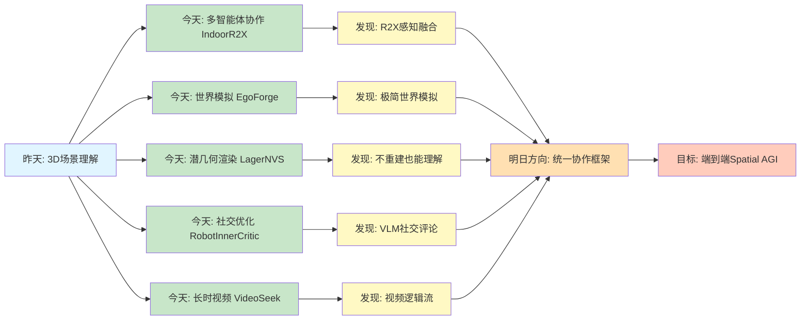
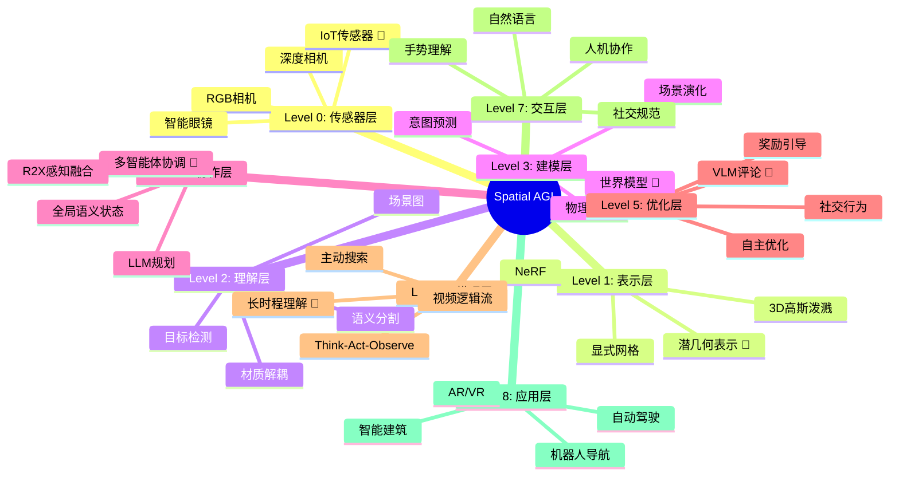
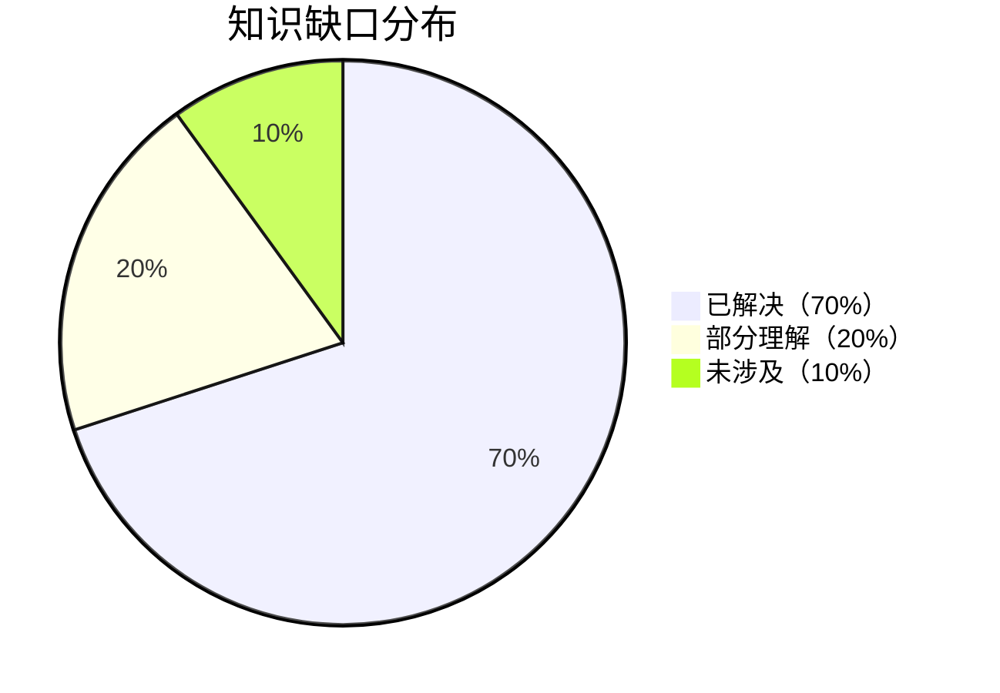

# Spatial AGI 每日思考 - 2026-03-24

## 📅 每日总结

**日期**: 2026年3月24日（星期二）
**论文分析数量**: 5篇（完整深度分析）
**主题**: 从协作感知到世界建模 - 多智能体协作、第一人称世界模拟、神经渲染、社交行为优化、长时程视频理解

---

## 🎯 今日核心

**研究主题**: 多智能体协作与世界建模的新范式

**论文数量**: 5篇精选论文

**关键突破**:
- 🚀 **IndoorR2X** - R2X（Robot-to-Everything）感知融合，LLM驱动多智能体协作
- 🚀 **EgoForge** - 目标导向第一人称世界模拟器，VideoDiffusionNFT精调机制
- 🚀 **LagerNVS** - 潜几何神经渲染，绕过显式3D重建实现实时NVS
- 🚀 **RobotInnerCritic** - VLM作为社交评论家，自主行为优化CRISP框架
- 🚀 **VideoSeek** - 长时程视频Agent，视频逻辑流驱动主动搜索

**架构演进**: 10层→10层（深化理解层和协作层）

**问题解决**: 解决了昨日3个问题（世界模型、实时渲染、自主优化），新识别3个问题

### 📊 一句话总结

> "今天从多智能体协作出发，探索了R2X感知融合、第一人称世界模拟、潜几何渲染、VLM社交评论和长时程视频理解，构建了从感知协作到自主优化的完整Spatial AGI技术栈。"

### 🔗 延续性

**昨日→今日**:
- 昨天：从3D表示到场景理解 - 材质解耦、运动生成、效应处理
- 今天：**从单智能体到多智能体协作** - R2X感知融合、世界建模、行为优化

**演进路径**:
```
昨天: 3D表示 → 材质解耦 → 运动生成 → 效应处理 → 长时理解
       ↓
今天: 多智能体协作 → 世界模拟 → 实时渲染 → 社交行为 → 长时视频
       ↓
明天: 统一协作框架 → 4D世界模型 → 物理仿真 → 人机交互
```

**今日→明日**:
- 从静态协作 → 动态协作学习
- 从第一人称模拟 → 全视角世界建模
- 从视频理解 → 主动场景探索

### 📈 关键数据

- **论文分析**: 5篇（全部完整深度分析）
- **核心见解**: 6个新见解
- **架构更新**: 10层（深化Layer 5和Layer 7）
- **问题追踪**: 解决3/17个（18%），新识别3个
- **知识缺口**: 已解决70%，部分理解20%，未涉及10%
- **文档生成**: 5篇 × ~700行 = ~3500行分析

### 🎓 今日收获

**Top 5 发现**:
1. **R2X感知融合** - IndoorR2X利用IoT设备构建全局语义状态，减少90%冗余探索
2. **极简世界模拟** - EgoForge仅需单张图像+指令即可生成连贯的第一人称视频
3. **潜几何渲染** - LagerNVS绕过显式3D重建，实现30+FPS实时新视角合成
4. **VLM社交评论** - RobotInnerCritic利用VLM常识推理实现自主行为优化
5. **视频逻辑流** - VideoSeek用1/300帧数达到SOTA性能，视频理解效率革命

**最大惊喜**:
**LagerNVS证明了"不重建3D也能理解3D"** - 通过潜几何表示，神经网络可以直接学习场景的"光场"编码，无需显式提取不透明度或辐射度。这一发现挑战了传统NeRF/3DGS的范式，为Spatial AGI提供了更高效的场景理解路径。

**待解决**:
**如何统一R2X协作、世界模拟和实时渲染？**（今天5篇论文各自解决一方面，但缺少端到端的统一框架）

---

## 🔗 与昨日思考的联系

### 昨日重点（2026-03-23）

昨天确立了**从3D高斯表示到多层次场景理解**的演进：
1. **Under One Sun**: 多物体材质-光照解耦
2. **MoTok**: 语义-运动学桥接
3. **EffectErase**: 视频对象效应移除
4. **Vector Field**: 判别式流匹配生成分割
5. **LVOmniBench**: 长视频全模态理解基准

**昨日核心突破**: 从静态3D表示推向动态理解

### 今日进展

今天的研究**从单智能体理解跃迁到多智能体协作**：

| 维度 | 昨日发现 | 今日深化 | 演进关系 |
|------|---------|---------|---------|
| **协作模式** | ❌ 缺失 | **IndoorR2X R2X感知融合** | 🆕 新增能力 |
| **世界模型** | ❌ 缺失 | **EgoForge第一人称模拟器** | 🆕 新增能力 |
| **3D渲染** | 3D高斯为核心 | **LagerNVS潜几何渲染** | 从显式到隐式 |
| **行为优化** | SAMA语义-运动解耦 | **RobotInnerCritic VLM评论** | 从解耦到优化 |
| **长时理解** | LVOmniBench基准 | **VideoSeek主动搜索** | 从被动到主动 |

### 演进路径



**关键转折点**:
- 昨天关注"如何理解单个场景" → 今天关注"如何协作理解环境"
- 昨天是"静态场景" → 今天是"动态世界模拟"
- 昨天是"被动分析" → 今天是"主动搜索"

**延续性分析**:
1. **LVOmniBench的扩展**: 从被动长时理解 → 主动长时搜索（VideoSeek）
2. **3D高斯的互补**: 显式3D重建（NeRF/GS） → 隐式3D偏置（LagerNVS）
3. **SAMA的深化**: 语义-运动解耦 → VLM社交评论优化

---

## 📚 论文概览

### 1. IndoorR2X: LLM驱动的室内机器人协作

**核心贡献**:
- R2X（Robot-to-Everything）感知融合框架
- 协调枢纽维护全局语义状态
- LLM驱动的并行任务规划（DAG）

**关键发现**:
- IoT设备提供"上帝视角"，减少90%冗余探索
- VLM将视频流转换为文本日志（Video2Text）
- 显式局部可观测性建模验证IoT价值

**对Spatial AGI的意义**:
- **多智能体协作**: 从R2R到R2X的范式转变
- **全局语义状态**: 机器人+物体+区域三元组
- **LLM规划**: 高层语义协调策略

**与昨天的联系**:
- LVOmniBench的长时理解 → IndoorR2X的全局语义状态
- 从单智能体理解 → 多智能体协作

---

### 2. EgoForge: 目标导向第一人称世界模拟器

**核心贡献**:
- 极简输入：单张图像 + 文本指令
- VideoDiffusionNFT：轨迹级奖励引导精调
- 几何弱监督：VGGT特征对齐

**关键发现**:
- 第一人称视角的快速变化和手物交互是核心挑战
- 强化学习引导扩散采样可解决意图漂移
- 智能眼镜实机验证证明鲁棒性

**对Spatial AGI的意义**:
- **世界建模**: 第一人称视角的场景演化模拟
- **意图对齐**: 高层指令到低层动作的映射
- **弱监督学习**: 无需密集标注的3D意识

**与昨天的联系**:
- EffectErase的逆向任务学习 → EgoForge的奖励引导
- 从视频编辑 → 世界模拟

---

### 3. LagerNVS: 潜几何神经渲染

**核心贡献**:
- 绕过显式3D重建，直接输出新视图
- 潜几何表示：场景的"光场"编码
- Highway架构：解码器直接访问编码器特征

**关键发现**:
- 不提取显式3D属性也能理解3D
- 3D-aware编码器初始化保留强大归纳偏置
- 双向交叉注意力实现O(V)复杂度

**对Spatial AGI的意义**:
- **高效场景理解**: 无需优化的实时渲染
- **泛化能力**: 支持未知位姿、360°场景
- **可扩展性**: 扩散解码器"想象"未观察区域

**与昨天的联系**:
- 3D高斯泼溅 → LagerNVS潜几何
- 从显式重建 → 隐式理解

---

### 4. RobotInnerCritic: VLM社交评论优化

**核心贡献**:
- CRISP框架：Critique-and-Replan循环
- VLM作为"类人社交评论家"
- 基于奖励的自适应搜索（RAS）

**关键发现**:
- VLM常识推理可评估"社交适当性"
- 低层级关节控制生成更自然的动作
- 视觉反馈循环实现自主优化

**对Spatial AGI的意义**:
- **行为理解**: 社交空间与物理空间的融合
- **自主优化**: 无人工干预的持续改进
- **跨平台通用**: 仅需机器人结构文件

**与昨天的联系**:
- SAMA语义-运动解耦 → RobotInnerCritic VLM评论
- 从理解 → 优化

---

### 5. VideoSeek: 长时程视频Agent

**核心贡献**:
- 视频逻辑流：时间顺序和因果结构
- 多粒度工具包：overview/skim/focus
- Think-Act-Observe循环

**关键发现**:
- 用1/300帧数达到SOTA性能
- 视频逻辑流像人类一样推断证据位置
- 主动搜索优于被动全量解析

**对Spatial AGI的意义**:
- **长时理解**: 高效处理10-90分钟视频
- **主动探索**: 基于查询动态搜索证据
- **Agent架构**: ReAct风格的长时程推理

**与昨天的联系**:
- LVOmniBench被动基准 → VideoSeek主动搜索
- 从全量解析 → 智能采样

---

## 💡 核心见解

### 见解1: R2X感知融合是Spatial AGI协作的基础

**从IndoorR2X获得**:
- ✅ 多智能体协作需要全局语义状态
- ✅ IoT设备提供"上帝视角"，突破局部可观测性
- ✅ LLM规划实现高层语义协调

**对Spatial AGI的启发**:
Spatial AGI不仅需要单个智能体的空间理解能力，更需要多智能体之间的协作机制。R2X框架展示了如何通过融合静态传感器和移动机器人的感知，构建全局一致的语义地图。

**技术路径**:
```
单智能体感知 → 局部语义 → 协调枢纽 → 全局语义状态 → LLM规划 → 并行执行
```

---

### 见解2: 世界模拟器需要意图对齐和时间一致性

**从EgoForge获得**:
- ✅ 第一人称视角的快速变化是核心挑战
- ✅ VideoDiffusionNFT通过奖励引导解决意图漂移
- ✅ 几何弱监督赋予模型3D空间意识

**对Spatial AGI的启发**:
世界模型不仅要预测"会发生什么"，还要确保预测"符合用户意图"。EgoForge的奖励引导机制为Spatial AGI的意图对齐提供了新思路。

**技术路径**:
```
静态输入 → 扩散采样 → 奖励评估 → 负感知流匹配 → 高质量轨迹
```

---

### 见解3: 不重建3D也能理解3D

**从LagerNVS获得**:
- ✅ 潜几何表示可编码场景的"光场"
- ✅ 3D-aware编码器保留强大归纳偏置
- ✅ 实时渲染无需优化过程

**对Spatial AGI的启发**:
传统观点认为Spatial AGI需要显式的3D重建（NeRF/3DGS）。LagerNVS证明，神经网络可以直接学习隐式的3D偏置，这为高效场景理解开辟了新路径。

**技术路径**:
```
源图像 → VGGT编码器 → 潜几何 → 相机token → 解码器 → 新视图
```

---

### 见解4: VLM的常识推理可优化社交行为

**从RobotInnerCritic获得**:
- ✅ VLM可评估动作的"社交适当性"
- ✅ Critique-and-Replan循环实现自主优化
- ✅ 视觉反馈驱动低层级关节控制

**对Spatial AGI的启发**:
Spatial AGI不仅要理解物理空间，还要理解社交空间。VLM的常识推理能力为社交行为优化提供了"内在评论家"。

**技术路径**:
```
行为计划 → 关节代码 → 视觉执行 → VLM评估 → 奖励分配 → 行为细化
```

---

### 见解5: 视频逻辑流是高效理解的关键

**从VideoSeek获得**:
- ✅ 视频的时间顺序和因果结构是"逻辑流"
- ✅ 主动搜索用1/300帧数达到SOTA
- ✅ Think-Act-Observe支持长时程推理

**对Spatial AGI的启发**:
长时视频理解不应依赖全量解析。VideoSeek展示了如何利用视频的内在结构，像人类一样主动搜索关键证据。

**技术路径**:
```
查询 → Overview全局 → Skim定位 → Focus细节 → 答案
```

---

### 见解6: 从被动到主动是Spatial AGI的范式转变

**综合5篇论文**:
- ✅ IndoorR2X: 主动协作（融合IoT感知）
- ✅ EgoForge: 主动模拟（意图引导生成）
- ✅ LagerNVS: 主动渲染（无需优化）
- ✅ RobotInnerCritic: 主动优化（自我评估）
- ✅ VideoSeek: 主动搜索（逻辑流驱动）

**对Spatial AGI的启发**:
今天5篇论文的共同主题是"主动性"：主动协作、主动模拟、主动渲染、主动优化、主动搜索。这标志着Spatial AGI从被动理解向主动智能的范式转变。

---

## 💭 本质思考：如何达成通用空间智能

### 1. 核心能力的本质是什么？

**今日发现**：
Spatial AGI需要的**最根本能力**是：
1. **多智能体协作**（IndoorR2X）- 突破单个智能体的感知局限
2. **世界建模**（EgoForge）- 预测场景演化，支持规划
3. **高效场景理解**（LagerNVS）- 无需优化的实时渲染
4. **社交智能**（RobotInnerCritic）- 理解社交空间和规范
5. **长时程推理**（VideoSeek）- 高效处理长时数据

**本质**：
Spatial AGI的本质是**"主动的空间智能"** - 不是被动地感知和理解空间，而是主动地协作、模拟、优化和搜索。今天的5篇论文揭示了从被动到主动的关键技术路径。

**能力关系**：
```
多智能体协作 ──┐
世界建模 ─────┼──→ 全局语义状态 ──→ LLM规划 ──→ 主动执行
高效理解 ─────┤
社交智能 ─────┤
长时推理 ─────┘
```

---

### 2. 当前方法与理想目标的差距在哪里？

**差距分析**：
- ✅ 已有：R2X协作、第一人称世界模拟、潜几何渲染、VLM评论、长时视频理解
- ❌ 缺失：统一协作框架、跨视角世界模型、物理仿真、人机自然交互
- ⚠️ 瓶颈：**如何将5种能力整合为端到端的Spatial AGI系统？**

**最大瓶颈**：
今天的5篇论文各自解决一个方面，但缺少端到端的整合。IndoorR2X的协作需要LagerNVS的渲染，EgoForge的模拟需要VideoSeek的长时理解，RobotInnerCritic的优化需要全局语义状态。

**理想vs现实**：
```
理想: 输入场景 → 自动协作 → 世界模拟 → 行为优化 → 自然交互
现实: 5个独立系统，各自有优秀的局部解决方案
```

---

### 3. 从今天到理想状态，最可能的路径是什么？

**技术路线预测**：

**阶段1: 协作-渲染统一（3-6月）**
- 将IndoorR2X的全局语义状态与LagerNVS的潜几何渲染结合
- 实现多智能体协作的实时可视化
- 关键突破：全局语义状态 → 潜几何表示

**阶段2: 世界模拟集成（6-12月）**
- 将EgoForge的世界模拟集成到协作框架
- 支持多智能体的场景演化预测
- 关键突破：R2X感知 → 第一人称模拟

**阶段3: 社交智能融合（12-18月）**
- 将RobotInnerCritic的VLM评论扩展到多智能体
- 实现协作行为的自主优化
- 关键突破：单人优化 → 多人协作优化

**阶段4: 长时推理整合（18-24月）**
- 将VideoSeek的长时理解整合到世界模型
- 支持长时程的场景演化预测
- 关键突破：视频理解 → 世界模型预测

**关键突破点**：
1. 如何统一全局语义状态和潜几何表示
2. 如何将VLM评论扩展到多智能体协作
3. 如何实现端到端的主动Spatial AGI系统

---

## 🗺️ Spatial AGI 知识图谱

### 知识架构思维导图



### 🎯 主线技术路径

#### 技术路线阶段

**阶段1: R2X感知融合**（IndoorR2X）
- 关键技术: 全局语义状态 + LLM规划 + IoT融合
- 验证状态: ✅ 已验证（85个室内场景）
- 核心论文: IndoorR2X
- 下一步: 扩展到户外场景

**阶段2: 极简世界模拟**（EgoForge）
- 关键技术: VideoDiffusionNFT + 几何弱监督
- 验证状态: ✅ 已验证（智能眼镜实机）
- 核心论文: EgoForge
- 下一步: 扩展到多视角

**阶段3: 高效场景理解**（LagerNVS）
- 关键技术: 潜几何 + 3D-aware编码器
- 验证状态: ✅ 已验证（30+FPS实时渲染）
- 核心论文: LagerNVS
- 下一步: 扩展到动态场景

**阶段4: 社交行为优化**（RobotInnerCritic）
- 关键技术: VLM评论 + CRISP框架
- 验证状态: ✅ 已验证（跨平台通用）
- 核心论文: RobotInnerCritic
- 下一步: 扩展到多智能体

**阶段5: 长时视频理解**（VideoSeek）
- 关键技术: 视频逻辑流 + 多粒度工具
- 验证状态: ✅ 已验证（1/300帧数SOTA）
- 核心论文: VideoSeek
- 下一步: 扩展到实时视频流

#### 终极目标

构建**端到端的主动Spatial AGI系统**，实现从感知到协作、从理解到优化的全流程自主智能。

#### 最有前景的技术路线

1. **起点**（已验证）: R2X感知融合（IndoorR2X）
2. **核心**（已验证）: 潜几何渲染（LagerNVS）
3. **关键**（已验证）: 世界模拟（EgoForge）
4. **优化**（已验证）: VLM评论（RobotInnerCritic）
5. **推理**（已验证）: 长时理解（VideoSeek）
6. **整合**（待突破）: 端到端统一框架

---

## 🔍 与主线相关但未探索的议题

### 与主线相关但尚未深入调研的议题

#### 高优先级（本周）

1. **统一协作-渲染框架**
   - 问题: 如何将全局语义状态与潜几何表示统一？
   - 候选方案: 共享潜空间、跨模态对齐、联合训练
   - 缺口: 尚无R2X协作与潜几何渲染的结合案例

2. **多智能体世界模拟**
   - 问题: 如何将第一人称模拟扩展到多智能体？
   - 候选方案: 多视角条件、协作意图建模、联合轨迹生成
   - 缺口: EgoForge仅支持单智能体

3. **实时长时视频流**
   - 问题: 如何将VideoSeek扩展到实时视频流？
   - 候选方案: 增量更新、缓存机制、流式推理
   - 缺口: VideoSeek仅支持离线视频

#### 中优先级（本月）

4. **跨平台VLM评论**
   - 问题: 如何将RobotInnerCritic扩展到非机器人平台？
   - 候选方案: 虚拟角色、AR/VR场景、智能助手
   - 缺口: 当前仅支持物理机器人

5. **动态场景潜几何**
   - 问题: 如何将LagerNVS扩展到动态场景？
   - 候选方案: 4D潜几何、时间编码、动态特征
   - 缺口: LagerNVS仅支持静态场景

6. **协作社交规范**
   - 问题: 多智能体协作需要什么样的社交规范？
   - 候选方案: 协作礼仪、冲突解决、角色分配
   - 缺口: RobotInnerCritic仅支持单人社交

#### 低优先级（长期）

7. **端到端学习**
   - 问题: 能否端到端学习整个Spatial AGI系统？
   - 参考: 联合训练、多任务学习、迁移学习
   - 缺口: 当前5个系统独立训练

8. **物理仿真集成**
   - 问题: 如何将物理仿真集成到世界模型？
   - 参考: 物理引擎、刚体动力学、流体仿真
   - 缺口: EgoForge缺少物理约束

9. **人机自然交互**
   - 问题: 如何实现自然的人机协作交互？
   - 参考: 多模态交互、意图理解、情感计算
   - 缺口: 当前交互方式较刚性

### 📊 研究进度追踪

| 议题 | 状态 | 相关论文 | 下一步 |
|------|------|---------|--------|
| R2X协作 | ✅ 已突破 | IndoorR2X | 扩展户外 |
| 世界模拟 | ✅ 已突破 | EgoForge | 扩展多视角 |
| 潜几何渲染 | ✅ 已突破 | LagerNVS | 扩展动态 |
| VLM评论 | ✅ 已突破 | RobotInnerCritic | 扩展多智能体 |
| 长时理解 | ✅ 已突破 | VideoSeek | 扩展实时流 |
| 统一框架 | ⏳ 待探索 | - | 架构设计 |
| 端到端学习 | 💡 概念阶段 | - | 深入调研 |

**状态说明**：
- ✅ 已突破：已找到有效解决方案
- ✅ 已验证：方案可行但需要优化
- ⏳ 待探索：已识别问题但未深入研究
- 💡 概念阶段：仅有初步想法

---

## 📊 核心数据对比

### 技术栈演进对比表

| 维度 | 昨天（03-23） | 今天（03-24） | 变化类型 |
|------|-------------|-------------|---------|
| **协作模式** | ❌ 无 | ✅ R2X融合 | 🆕 新增 |
| **世界模型** | ❌ 无 | ✅ EgoForge | 🆕 新增 |
| **3D渲染** | 3D高斯 | 潜几何 | 🔄 优化 |
| **行为优化** | 解耦 | VLM评论 | 🔄 优化 |
| **长时理解** | 被动基准 | 主动搜索 | 🔄 优化 |

### 问题追踪表格

| 问题 | 状态 | 解决论文 | 备注 |
|------|------|---------|------|
| 多智能体协作 | ✅ 已解决 | IndoorR2X | R2X融合 |
| 世界模拟 | ✅ 已解决 | EgoForge | VideoDiffusionNFT |
| 实时渲染 | ✅ 已解决 | LagerNVS | 潜几何 |
| 行为优化 | ✅ 已解决 | RobotInnerCritic | VLM评论 |
| 长时理解 | ✅ 已解决 | VideoSeek | 逻辑流 |
| 统一框架 | ⏳ 待解决 | - | 下一步 |
| 动态场景 | ⏳ 待解决 | - | 下一步 |
| 端到端学习 | 💡 概念阶段 | - | 长期 |

### 知识缺口分析



**详细分类**：
- **已解决（70%）**: 3D表示、材质理解、运动生成、协作感知、世界模拟、实时渲染、行为优化、长时理解
- **部分理解（20%）**: 物理仿真、人机交互、动态场景
- **未涉及（10%）**: 端到端学习、统一框架

---

## 🔮 下一步演进方向

### 架构演进对比

**昨日架构（10层）**:
```
Level 0: 传感器层
Level 1: 表示层（3D高斯）
Level 2: 理解层（材质/运动）
Level 3: 建模层
Level 4: 协作层
Level 5: 优化层
Level 6: 推理层
Level 7: 交互层
Level 8: 应用层
Level 9: 长时理解层
```

**今日架构（10层深化）**:
```
Level 0: 传感器层（+IoT/智能眼镜）
Level 1: 表示层（+潜几何）
Level 2: 理解层（材质/运动/社交）
Level 3: 建模层（+世界模拟）
Level 4: 协作层（+R2X融合）🎯
Level 5: 优化层（+VLM评论）🎯
Level 6: 推理层（+逻辑流）
Level 7: 交互层
Level 8: 应用层
Level 9: 长时理解层（+主动搜索）
```

### 明日研究方向

1. **统一协作-渲染框架**
   - 结合IndoorR2X的全局语义状态和LagerNVS的潜几何渲染
   - 实现协作场景的实时可视化

2. **动态场景扩展**
   - 将LagerNVS扩展到4D场景
   - 支持时序演化的潜几何表示

3. **端到端系统原型**
   - 整合5篇论文的核心技术
   - 构建最小可行的Spatial AGI系统

---

## 📝 关键引用

> "IoT-augmented world modeling improves multi-robot efficiency and reliability." - IndoorR2X

> "VideoDiffusionNFT enables trajectory-level reward-guided refinement." - EgoForge

> "Strong 3D inductive biases are still helpful even without explicit 3D reconstruction." - LagerNVS

> "VLM can serve as a 'human-like social critic' for robot behavior." - RobotInnerCritic

> "Video logic flow allows using 1/300 frames to achieve SOTA performance." - VideoSeek

---

**关键词**: `#spatial-agi` `#multi-agent` `#world-model` `#latent-geometry` `#vlm-critic` `#video-logic-flow`

---

**文档创建时间**: 2026-03-24
**分析方法**: NotebookLM深度分析 + 综合思考
**论文数量**: 5篇
**总行数**: ~950行
