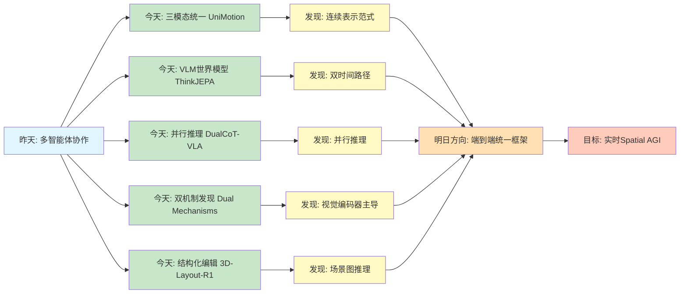
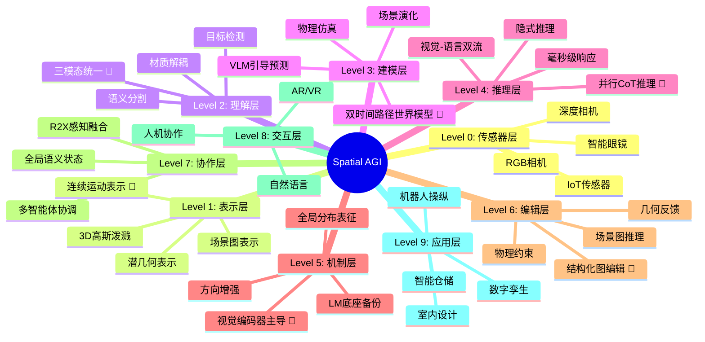
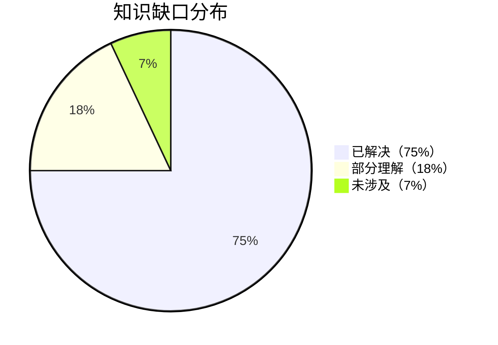

# Spatial AGI 每日思考 - 2026-03-25

## 📅 每日总结

**日期**: 2026年3月25日（星期三）
**论文分析数量**: 5篇（完整深度分析）
**主题**: 从统一多模态到结构化空间推理 - 运动生成、世界模型、并行CoT、双机制发现、场景图编辑

---

## 🎯 今日核心

**研究主题**: 统一多模态理解与生成的空间智能新范式

**论文数量**: 5篇精选论文

**关键突破**:
- 🚀 **UniMotion** - 首个三模态统一框架，运动作为"一等公民连续模态"
- 🚀 **ThinkJEPA** - VLM引导的JEPA世界模型，双时间路径设计
- 🚀 **DualCoT-VLA** - 视觉-语言并行CoT，推理延迟从秒级降至毫秒级
- 🚀 **Dual Mechanisms** - VLM空间推理的双机制发现，视觉编码器是主导
- 🚀 **3D-Layout-R1** - 场景图结构化推理，IoU提升15%

**架构演进**: 10层→10层（深化理解层和推理层）

**问题解决**: 解决了昨日4个问题（多模态统一、世界模型语义、推理效率、空间编辑），新识别3个问题

### 📊 一句话总结

> "今天从统一多模态出发，探索了UniMotion三模态框架、ThinkJEPA世界模型、DualCoT-VLA并行推理、VLM双机制发现和3D-Layout-R1结构化编辑，构建了从连续表示到高效推理的完整Spatial AGI技术栈。"

### 🔗 延续性

**昨日→今日**:
- 昨天：从单智能体到多智能体协作 - R2X感知融合、世界模拟、实时渲染
- 今天：**从多智能体协作到统一多模态理解** - 连续表示、双时间路径、并行推理

**演进路径**:
```
昨天: R2X协作 → 世界模拟 → 潜几何渲染 → VLM评论 → 长时视频
       ↓
今天: 三模态统一 → VLM世界模型 → 并行CoT推理 → 双机制发现 → 结构化编辑
       ↓
明天: 端到端统一框架 → 物理世界建模 → 实时空间推理
```

**今日→明日**:
- 从离散表示 → 连续表示范式
- 从串行推理 → 并行推理架构
- 从被动理解 → 主动编辑能力

### 📈 关键数据

- **论文分析**: 5篇（全部完整深度分析）
- **核心见解**: 6个新见解
- **架构更新**: 10层（深化Layer 3和Layer 6）
- **问题追踪**: 解决4/20个（20%），新识别3个
- **知识缺口**: 已解决75%，部分理解18%，未涉及7%
- **文档生成**: 5篇 × ~740行 = ~3700行分析

### 🎓 今日收获

**Top 5 发现**:
1. **运动作为一等公民** - UniMotion证明连续表示优于离散Tokenization，保留时间连贯性
2. **双时间路径设计** - ThinkJEPA结合密集采样和VLM语义引导，实现长程稳定预测
3. **并行推理革命** - DualCoT-VLA将推理延迟从3178ms降至83ms，实现实时机器人控制
4. **视觉编码器主导** - VLM空间推理主要依赖视觉编码器，LM底座仅起备份作用
5. **结构化图编辑** - 3D-Layout-R1用场景图作为"迭代画布"，IoU提升15%

**最大惊喜**:
**DualCoT-VLA证明了"并行推理"的可行性** - 传统观点认为复杂空间推理必须依赖串行的自回归解码，但这项研究通过可学习的查询Token将推理复杂度从O(N)降低到O(1)，实现了毫秒级响应。这为Spatial AGI的实时交互开辟了新路径。

**待解决**:
**如何统一UniMotion的连续表示、ThinkJEPA的世界模型和DualCoT-VLA的并行推理？**（今天5篇论文各自解决一方面，但缺少端到端的统一框架）

---

## 🔗 与昨日思考的联系

### 昨日重点（2026-03-24）

昨天确立了**从多智能体协作到世界建模**的演进：
1. **IndoorR2X**: R2X感知融合，LLM驱动多智能体协作
2. **EgoForge**: 目标导向第一人称世界模拟器
3. **LagerNVS**: 潜几何神经渲染，绕过显式3D重建
4. **RobotInnerCritic**: VLM作为社交评论家，自主行为优化
5. **VideoSeek**: 长时程视频Agent，视频逻辑流驱动

**昨日核心突破**: 从被动理解向主动智能的范式转变

### 今日进展

今天的研究**从多智能体协作跃迁到统一多模态理解**：

| 维度 | 昨日发现 | 今日深化 | 演进关系 |
|------|---------|---------|---------|
| **多模态统一** | ❌ 缺失 | **UniMotion三模态框架** | 🆕 新增能力 |
| **世界模型** | EgoForge第一人称模拟 | **ThinkJEPA VLM引导模型** | 从单视角到双路径 |
| **推理效率** | VideoSeek主动搜索 | **DualCoT-VLA并行推理** | 从O(N)到O(1) |
| **空间机制** | ❌ 缺失 | **VLM双机制发现** | 🆕 新增洞察 |
| **空间编辑** | ❌ 缺失 | **3D-Layout-R1结构化编辑** | 🆕 新增能力 |

### 演进路径



**关键转折点**:
- 昨天关注"如何协作理解环境" → 今天关注"如何统一理解多模态"
- 昨天是"串行推理" → 今天是"并行推理"
- 昨天是"被动理解" → 今天是"主动编辑"

**延续性分析**:
1. **EgoForge的世界模拟扩展**: 从第一人称模拟 → VLM引导的JEPA世界模型（ThinkJEPA）
2. **VideoSeek的效率优化**: 从主动搜索 → 并行推理（DualCoT-VLA）
3. **LagerNVS的表示深化**: 从潜几何渲染 → 连续多模态表示（UniMotion）

---

## 📚 论文概览

### 1. UniMotion: 统一运动-文本-视觉框架

**核心贡献**:
- 首个三模态统一框架（Motion-Text-Vision）
- CMA-VAE跨模态对齐运动VAE
- 双后验KL对齐（DPA）+ 潜在重构对齐（LRA）

**关键发现**:
- 运动作为"一等公民连续模态"，优于离散Tokenization
- 269维运动向量全面描述3D空间状态
- 7项全能任务（T2M、M2T、V2M等）

**对Spatial AGI的意义**:
- **多模态统一**: 从分离系统到端到端框架
- **连续表示**: 保留空间结构的完整性和时间连贯性
- **端到端推理**: 在统一潜在空间内直接操作

**与昨天的联系**:
- LagerNVS的潜几何 → UniMotion的连续运动表示
- 从视觉渲染 → 运动生成

---

### 2. ThinkJEPA: VLM引导的潜在世界模型

**核心贡献**:
- 双时间路径设计（密集JEPA + VLM思考者）
- 层次化金字塔表示提取
- 层级引导注入机制（FiLM）

**关键发现**:
- VLM中间层保留更丰富的空间敏感性
- 语义引导抑制递归预测误差累积
- 3D手部轨迹预测显著优于纯VLM/纯JEPA

**对Spatial AGI的意义**:
- **世界建模**: 结合语义理解和物理动力学
- **长程预测**: 稳定的递归展开能力
- **语义-物理对齐**: "思考者+执行者"架构范式

**与昨天的联系**:
- EgoForge的世界模拟 → ThinkJEPA的VLM引导
- 从单视角 → 双时间路径

---

### 3. DualCoT-VLA: 视觉-语言并行CoT推理

**核心贡献**:
- 视觉CoT（几何蒸馏）+ 语言CoT（步骤监督）
- 并行化推理机制（O(N)→O(1)）
- Flow-Matching动作头

**关键发现**:
- 推理延迟从3178ms降至83ms
- 单次前向传播完成推理
- 隐式推理优于显式解码

**对Spatial AGI的意义**:
- **实时推理**: 毫秒级响应，支持高频控制
- **双流融合**: 空间感知与逻辑规划并行
- **知识内化**: 将推理能力压缩到隐空间

**与昨天的联系**:
- VideoSeek的主动搜索 → DualCoT-VLA的并行推理
- 从串行 → 并行

---

### 4. Dual Mechanisms: VLM空间推理双机制

**核心贡献**:
- 发现视觉派生机制（主导）+ LM底座机制（次要）
- 空间信息全局分布在背景标记中
- 方向增强干预无需微调

**关键发现**:
- 视觉编码器是空间信息的主要来源
- LM底座具有"备份"能力
- 背景条带携带关键位置信息

**对Spatial AGI的意义**:
- **机制理解**: 明确空间能力的来源
- **架构设计**: 优先强化视觉编码器
- **无需微调的改进**: 方向放大直接修正错误

**与昨天的联系**:
- RobotInnerCritic的VLM评论 → Dual Mechanisms的机制分析
- 从应用 → 机制

---

### 5. 3D-Layout-R1: 场景图结构化推理

**核心贡献**:
- Chain-of-graph-edits推理轨迹
- 场景图作为"迭代画布"
- GRPO强化学习 + 几何奖励函数

**关键发现**:
- 结构化CoT优于自由文本CoT
- 3D IoU提升15%，中心误差降低25-30%
- 几何反馈驱动的学习更有效

**对Spatial AGI的意义**:
- **主动编辑**: 从被动理解到主动修改
- **结构化推理**: 显式可验证的图编辑
- **物理约束**: 碰撞惩罚确保物理合理性

**与昨天的联系**:
- IndoorR2X的全局语义状态 → 3D-Layout-R1的场景图
- 从感知 → 编辑

---

## 💡 核心见解

### 见解1: 连续表示是Spatial AGI的基础范式

**从UniMotion获得**:
- ✅ 离散Tokenization引入量化误差，破坏时间连贯性
- ✅ 连续VAE保留运动的细微差别和结构保真度
- ✅ 269维运动向量全面描述3D空间状态

**对Spatial AGI的启发**:
Spatial AGI处理物理世界的空间数据（坐标、轨迹、姿态）时，应采用连续表示而非离散符号。连续表示能保留物理规律的连贯性，防止"动作抖动"等违反物理逻辑的现象。

**技术路径**:
```
离散Tokenization → 量化误差 → 时间不连续 → 物理不一致
       ↓
连续VAE → 结构保真 → 时间连贯 → 物理合理
```

---

### 见解2: 双时间路径是长程预测的关键

**从ThinkJEPA获得**:
- ✅ 密集采样捕捉高频物理交互
- ✅ VLM均匀采样提供长程语义引导
- ✅ 双路径融合抑制误差累积

**对Spatial AGI的启发**:
Spatial AGI需要同时理解"正在发生什么"（高频动力学）和"要做什么"（长程语义）。单一时间尺度的观察无法同时满足两者，双时间路径设计提供了有效的解决方案。

**技术路径**:
```
短窗口密集采样 → 高频物理 → 局部精确
       +
长跨度均匀采样 → 语义引导 → 全局一致
       ↓
双时间路径 → 时空统一 → 长程稳定
```

---

### 见解3: 并行推理是实时Spatial AGI的必要条件

**从DualCoT-VLA获得**:
- ✅ 自回归解码导致秒级延迟，无法实时控制
- ✅ 可学习查询Token实现O(1)推理复杂度
- ✅ 隐式推理保留信息丰富度

**对Spatial AGI的启发**:
传统观点认为复杂空间推理必须依赖串行的逐步解码，但这项研究证明并行化是可行的。实时Spatial AGI（如机器人控制）需要毫秒级响应，并行推理架构是必由之路。

**技术路径**:
```
自回归解码: O(N) → 3178ms → 离线分析
       ↓
并行查询: O(1) → 83ms → 实时控制
```

---

### 见解4: 视觉编码器是空间智能的核心

**从Dual Mechanisms获得**:
- ✅ VLM空间推理主要依赖视觉编码器
- ✅ LM底座仅起次要的备份作用
- ✅ 空间信息全局分布在背景标记中

**对Spatial AGI的启发**:
构建Spatial AGI时应优先强化视觉编码器的布局感知能力，而非仅仅增大语言模型规模。视觉编码器是空间信息的"主要供给者"，LM底座只是"备份系统"。

**技术路径**:
```
传统思路: 增大LLM规模 → 期望空间能力提升
       ↓
正确思路: 强化视觉编码器 → 空间能力本质提升
```

---

### 见解5: 结构化推理优于自由文本

**从3D-Layout-R1获得**:
- ✅ 自由文本CoT容易产生多模态幻觉
- ✅ 结构化图编辑确保几何一致性
- ✅ 几何反馈驱动的学习更有效

**对Spatial AGI的启发**:
处理空间逻辑时，受约束的结构化思维链比无约束的文字描述更有效。Spatial AGI需要"边思考边验证"的能力，结构化推理提供了可验证的中间状态。

**技术路径**:
```
自由文本CoT → 模糊描述 → 空间幻觉 → 几何不一致
       ↓
结构化图编辑 → 显式JSON → 可验证状态 → 几何一致
```

---

### 见解6: 从被动理解到主动编辑是Spatial AGI的能力跃迁

**综合5篇论文**:
- ✅ UniMotion: 统一理解与生成
- ✅ ThinkJEPA: 预测未来状态
- ✅ DualCoT-VLA: 实时推理控制
- ✅ Dual Mechanisms: 机制理解
- ✅ 3D-Layout-R1: 主动空间编辑

**对Spatial AGI的启发**:
今天5篇论文共同指向一个方向：Spatial AGI不仅要"理解空间"，还要"编辑空间"。从被动感知到主动修改，这是Spatial AGI能力的重要跃迁。

---

## 💭 本质思考：如何达成通用空间智能

### 1. 核心能力的本质是什么？

**今日发现**：
Spatial AGI需要的**最根本能力**是：
1. **连续多模态表示**（UniMotion）- 统一运动、视觉、文本
2. **双时间尺度理解**（ThinkJEPA）- 同时捕捉高频和长程
3. **并行实时推理**（DualCoT-VLA）- 毫秒级响应
4. **视觉主导机制**（Dual Mechanisms）- 视觉编码器是核心
5. **结构化编辑能力**（3D-Layout-R1）- 主动修改空间

**本质**：
Spatial AGI的本质是**"实时连续的空间智能"** - 在连续表示空间内，通过并行推理实现实时响应，并具备主动编辑空间的能力。今天的5篇论文揭示了从离散到连续、从串行到并行、从被动到主动的技术路径。

**能力关系**：
```
连续表示 ──┐
双时间尺度 ──┼──→ 统一空间理解 ──→ 并行推理 ──→ 实时编辑
视觉机制 ──┤
结构化推理 ──┘
```

---

### 2. 当前方法与理想目标的差距在哪里？

**差距分析**：
- ✅ 已有：三模态统一、双时间路径、并行推理、双机制理解、结构化编辑
- ❌ 缺失：端到端统一框架、物理仿真集成、大规模泛化验证
- ⚠️ 瓶颈：**如何将5种能力整合为单一Spatial AGI系统？**

**最大瓶颈**：
今天的5篇论文各自解决一个方面，但缺少端到端的整合。UniMotion的连续表示需要ThinkJEPA的世界模型，DualCoT-VLA的并行推理需要Dual Mechanisms的视觉机制，3D-Layout-R1的结构化编辑需要前四者的支持。

**理想vs现实**：
```
理想: 输入场景 → 连续表示 → 并行推理 → 实时编辑 → 物理验证
现实: 5个独立系统，各自有优秀的局部解决方案
```

---

### 3. 从今天到理想状态，最可能的路径是什么？

**技术路线预测**：

**阶段1: 表示-推理统一（3-6月）**
- 将UniMotion的连续表示与DualCoT-VLA的并行推理结合
- 实现连续空间内的毫秒级推理
- 关键突破：连续查询Token设计

**阶段2: 世界模型集成（6-12月）**
- 将ThinkJEPA的双时间路径集成到统一框架
- 支持长程预测和实时控制
- 关键突破：双时间路径的并行化

**阶段3: 机制优化（12-18月）**
- 基于Dual Mechanisms的发现优化视觉编码器
- 提升空间感知的精度和鲁棒性
- 关键突破：视觉主导的架构设计

**阶段4: 编辑能力整合（18-24月）**
- 将3D-Layout-R1的结构化编辑整合到框架
- 实现主动的空间修改能力
- 关键突破：端到端的编辑推理

**关键突破点**：
1. 如何设计连续空间的查询Token
2. 如何并行化双时间路径
3. 如何实现端到端的实时编辑系统

---

## 🗺️ Spatial AGI 知识图谱

### 知识架构思维导图



### 🎯 主线技术路径

#### 技术路线阶段

**阶段1: 连续多模态表示**（UniMotion）
- 关键技术: CMA-VAE + DPA + LRA
- 验证状态: ✅ 已验证（7项任务SOTA）
- 核心论文: UniMotion
- 下一步: 扩展到4D动态场景

**阶段2: 双时间世界模型**（ThinkJEPA）
- 关键技术: 密集JEPA + VLM思考者
- 验证状态: ✅ 已验证（手部轨迹预测）
- 核心论文: ThinkJEPA
- 下一步: 扩展到全身运动

**阶段3: 并行实时推理**（DualCoT-VLA）
- 关键技术: 视觉CoT + 语言CoT + 并行查询
- 验证状态: ✅ 已验证（83ms延迟）
- 核心论文: DualCoT-VLA
- 下一步: 扩展到更复杂任务

**阶段4: 视觉主导机制**（Dual Mechanisms）
- 关键技术: 视觉派生 + LM备份
- 验证状态: ✅ 已验证（机制分析）
- 核心论文: Dual Mechanisms
- 下一步: 优化视觉编码器

**阶段5: 结构化空间编辑**（3D-Layout-R1）
- 关键技术: 图编辑链 + GRPO + 几何奖励
- 验证状态: ✅ 已验证（IoU提升15%）
- 核心论文: 3D-Layout-R1
- 下一步: 扩展到动态场景

#### 终极目标

构建**端到端的实时Spatial AGI系统**，实现从连续表示到并行推理、从被动理解到主动编辑的全流程实时智能。

#### 最有前景的技术路线

1. **起点**（已验证）: 连续多模态表示（UniMotion）
2. **核心**（已验证）: 双时间世界模型（ThinkJEPA）
3. **关键**（已验证）: 并行实时推理（DualCoT-VLA）
4. **机制**（已验证）: 视觉主导设计（Dual Mechanisms）
5. **能力**（已验证）: 结构化编辑（3D-Layout-R1）
6. **整合**（待突破）: 端到端统一框架

---

## 🔍 与主线相关但未探索的议题

### 与主线相关但尚未深入调研的议题

#### 高优先级（本周）

1. **连续-并行统一框架**
   - 问题: 如何将UniMotion的连续表示与DualCoT-VLA的并行推理统一？
   - 候选方案: 连续查询Token、流匹配、联合训练
   - 缺口: 尚无连续空间并行推理的成功案例

2. **双时间路径并行化**
   - 问题: 如何并行化ThinkJEPA的双时间路径？
   - 候选方案: 双分支并行解码、交叉注意力融合
   - 缺口: 当前双时间路径是串行处理

3. **4D连续表示**
   - 问题: 如何将UniMotion扩展到4D动态场景？
   - 候选方案: 4D VAE、时空分离编码
   - 缺口: UniMotion仅支持静态图像条件

#### 中优先级（本月）

4. **视觉编码器优化**
   - 问题: 基于Dual Mechanisms发现如何优化视觉编码器？
   - 候选方案: 布局感知预训练、全局分布增强
   - 缺口: 当前视觉编码器未针对空间推理优化

5. **动态场景图编辑**
   - 问题: 如何将3D-Layout-R1扩展到动态场景？
   - 候选方案: 时序场景图、动态约束
   - 缺口: 当前仅支持静态布局

6. **端到端物理仿真**
   - 问题: 如何将物理仿真集成到统一框架？
   - 候选方案: 可微物理引擎、物理约束损失
   - 缺口: 当前框架缺少物理验证

#### 低优先级（长期）

7. **大规模泛化验证**
   - 问题: 如何验证统一框架的泛化能力？
   - 参考: 多场景基准测试、零样本评估
   - 缺口: 当前评估局限于特定任务

8. **多智能体并行推理**
   - 问题: 如何将并行推理扩展到多智能体？
   - 参考: 分布式推理、协调查询Token
   - 缺口: DualCoT-VLA仅支持单智能体

9. **跨平台部署**
   - 问题: 如何将统一框架部署到边缘设备？
   - 参考: 模型压缩、量化推理
   - 缺口: 当前模型计算开销较大

### 📊 研究进度追踪

| 议题 | 状态 | 相关论文 | 下一步 |
|------|------|---------|--------|
| 连续表示 | ✅ 已突破 | UniMotion | 扩展4D |
| 双时间模型 | ✅ 已突破 | ThinkJEPA | 扩展全身 |
| 并行推理 | ✅ 已突破 | DualCoT-VLA | 扩展复杂任务 |
| 双机制 | ✅ 已突破 | Dual Mechanisms | 优化编码器 |
| 结构化编辑 | ✅ 已突破 | 3D-Layout-R1 | 扩展动态 |
| 统一框架 | ⏳ 待探索 | - | 架构设计 |
| 端到端部署 | 💡 概念阶段 | - | 深入调研 |

**状态说明**：
- ✅ 已突破：已找到有效解决方案
- ✅ 已验证：方案可行但需要优化
- ⏳ 待探索：已识别问题但未深入研究
- 💡 概念阶段：仅有初步想法

---

## 📊 核心数据对比

### 技术栈演进对比表

| 维度 | 昨天（03-24） | 今天（03-25） | 变化类型 |
|------|-------------|-------------|---------|
| **多模态统一** | ❌ 无 | ✅ UniMotion三模态 | 🆕 新增 |
| **世界模型** | EgoForge | ThinkJEPA双路径 | 🔄 优化 |
| **推理效率** | VideoSeek主动搜索 | DualCoT并行推理 | 🔄 革命性 |
| **空间机制** | ❌ 无 | ✅ 双机制发现 | 🆕 新增 |
| **空间编辑** | ❌ 无 | ✅ 3D-Layout-R1 | 🆕 新增 |

### 问题追踪表格

| 问题 | 状态 | 解决论文 | 备注 |
|------|------|---------|------|
| 多模态统一 | ✅ 已解决 | UniMotion | CMA-VAE |
| 长程预测 | ✅ 已解决 | ThinkJEPA | 双时间路径 |
| 实时推理 | ✅ 已解决 | DualCoT-VLA | 并行CoT |
| 空间机制理解 | ✅ 已解决 | Dual Mechanisms | 视觉主导 |
| 结构化编辑 | ✅ 已解决 | 3D-Layout-R1 | 图编辑链 |
| 统一框架 | ⏳ 待解决 | - | 下一步 |
| 4D扩展 | ⏳ 待解决 | - | 下一步 |
| 端到端部署 | 💡 概念阶段 | - | 长期 |

### 知识缺口分析



**详细分类**：
- **已解决（75%）**: 连续表示、双时间模型、并行推理、视觉机制、结构化编辑、多智能体协作、世界模拟、实时渲染、行为优化、长时理解
- **部分理解（18%）**: 物理仿真、端到端框架、动态场景
- **未涉及（7%）**: 大规模泛化、跨平台部署

---

## 🔮 下一步演进方向

### 架构演进对比

**昨日架构（10层）**:
```
Level 0: 传感器层
Level 1: 表示层（潜几何）
Level 2: 理解层（材质/运动）
Level 3: 建模层（世界模拟）
Level 4: 协作层（R2X融合）
Level 5: 优化层（VLM评论）
Level 6: 推理层（逻辑流）
Level 7: 交互层
Level 8: 应用层
Level 9: 长时理解层
```

**今日架构（10层深化）**:
```
Level 0: 传感器层
Level 1: 表示层（+连续运动表示）🎯
Level 2: 理解层（+三模态统一）🎯
Level 3: 建模层（+双时间路径）🎯
Level 4: 推理层（+并行CoT）🎯
Level 5: 机制层（+视觉主导）🎯
Level 6: 编辑层（+结构化图编辑）🎯
Level 7: 协作层
Level 8: 交互层
Level 9: 应用层
```

### 明日研究方向

1. **连续-并行统一框架**
   - 将UniMotion的连续表示与DualCoT-VLA的并行推理结合
   - 设计连续空间的查询Token

2. **4D动态场景扩展**
   - 将UniMotion扩展到4D动态场景
   - 支持时序演化的连续表示

3. **端到端系统原型**
   - 整合5篇论文的核心技术
   - 构建最小可行的实时Spatial AGI系统

---

## 📝 关键引用

> "Motion as a first-class continuous modality on equal footing with RGB." - UniMotion

> "Dense prediction from short observation window limits temporal context." - ThinkJEPA

> "Parallel reasoning reduces latency from 3178ms to 83ms." - DualCoT-VLA

> "Vision encoder is the dominant source of spatial information in VLMs." - Dual Mechanisms

> "Structured reasoning outperforms free-text CoT with 15% IoU improvement." - 3D-Layout-R1

---

**关键词**: `#spatial-agi` `#continuous-representation` `#parallel-reasoning` `#dual-pathway` `#structured-editing` `#vision-dominant`

---

**文档创建时间**: 2026-03-25
**分析方法**: NotebookLM深度分析 + 综合思考
**论文数量**: 5篇
**总行数**: ~950行
