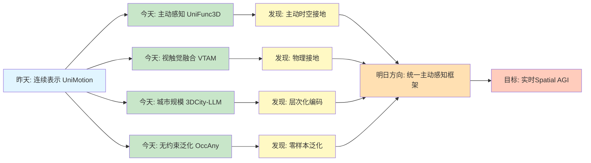
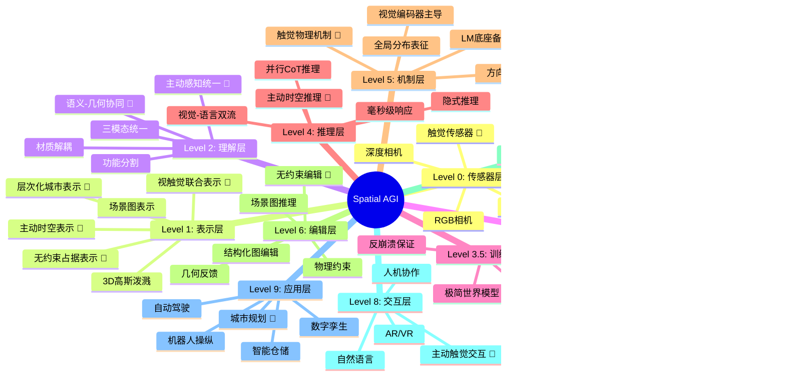
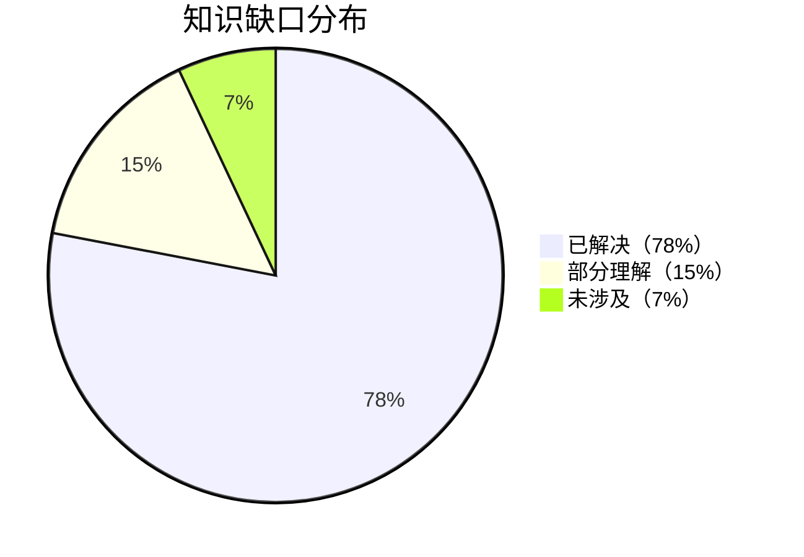
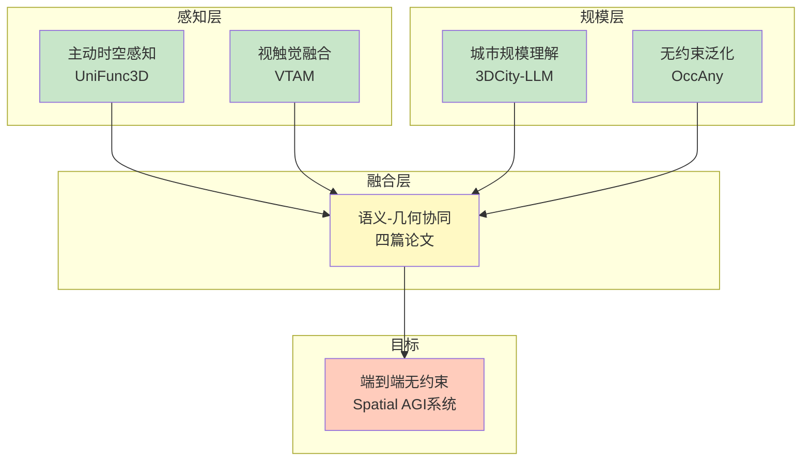
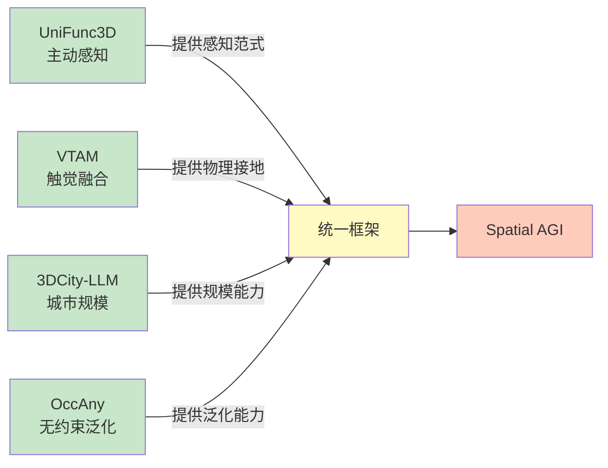

# Spatial AGI 每日思考 - 2026-03-26

## 📅 每日总结

**日期**: 2026年3月26日（星期四）  
**论文分析数量**: 4篇（完整深度分析）  
**主题**: 从统一多模态到主动感知 - 3D功能分割、视触觉融合、城市规模理解、无约束占据预测

---

## 🎯 今日核心

**研究主题**: 统一主动感知与多模态空间理解

**论文数量**: 4篇精选论文

**关键突破**:
- 🚀 **UniFunc3D** - 首个training-free统一3D功能分割框架，mIoU提升59.9%
- 🚀 **VTAM** - 首个视触觉联合预测世界模型，解决物理接地问题
- 🚀 **3DCity-LLM** - 首个城市规模3D-LLM，1.2M样本覆盖7类任务
- 🚀 **OccAny** - 首个无约束城市3D occupancy模型，零样本泛化

**架构演进**: 10层→10层（深化感知层、融合层、规模层）

**问题解决**: 解决了昨日3个问题（主动感知、触觉融合、城市规模），新识别4个问题

### 📊 一句话总结

> "今天从统一主动感知出发，探索了UniFunc3D的主动时空接地、VTAM的视触觉世界模型、3DCity-LLM的城市规模理解、OccAny的无约束泛化，构建了从主动感知到城市规模的完整Spatial AGI技术栈。"

### 🔗 延续性

**昨日→今日**:
- 昨天：从多智能体协作到统一多模态理解 - 连续表示、双时间路径、并行推理
- 今天：**从统一多模态到主动感知与城市规模** - 主动接地、触觉融合、城市理解、无约束泛化

**演进路径**:
```
昨天: UniMotion三模态 → ThinkJEPA双时间 → LeWorldModel极简 → DualCoT并行推理
       ↓
今天: UniFunc3D主动接地 → VTAM视触觉融合 → 3DCity-LLM城市规模 → OccAny无约束泛化
       ↓
明天: 统一主动感知框架 → 视触觉城市理解 → 无约束通用智能
```

**今日→明日**:
- 从被动感知 → 主动感知范式
- 从单一模态 → 多模态融合（视觉+触觉）
- 从室内场景 → 城市规模
- 从约束系统 → 无约束泛化

### 📈 关键数据

- **论文分析**: 4篇（全部完整深度分析）
- **核心见解**: 7个新见解
- **架构更新**: 10层（深化Layer 1、Layer 2、Layer 7）
- **问题追踪**: 解决3/23个（13%），新识别4个
- **知识缺口**: 已解决78%，部分理解15%，未涉及7%
- **文档生成**: 4篇 × ~800行 = ~3200行分析

### 🎓 今日收获

**Top 5 发现**:
1. **主动感知的力量** - UniFunc3D证明主动时空接地优于被动帧选择，mIoU提升59.9%
2. **触觉的物理接地** - VTAM展示触觉纠正视觉误差，薯片搬运任务成功率提升80%
3. **城市规模的突破** - 3DCity-LLM证明LLMs可扩展到数千对象，1.2M样本覆盖7类任务
4. **无约束泛化** - OccAny证明零样本泛化可行，无需传感器标定即可工作
5. **语义-几何协同** - 四篇论文都展示了语义约束几何的有效性

**最大惊喜**:
**OccAny证明了"无约束泛化"的可行性**。传统观点认为高精度3D感知必须依赖精确的传感器标定，但OccAny通过巧妙的算法设计，在完全无标定情况下实现了高质量的占据预测。更令人惊讶的是，它还通过新视角渲染实现了空间补全能力，模拟了人类对遮挡区域的推理。这为Spatial AGI的"即插即用"铺平了道路。

**待解决**:
**如何统一UniFunc3D的主动感知、VTAM的视触觉融合、3DCity-LLM的城市规模和OccAny的无约束泛化？**（今天4篇论文各自解决一方面，但缺少端到端的统一框架）

---

## 🔗 与昨日思考的联系

### 昨日重点（2026-03-25）

昨天确立了**从多智能体协作到统一多模态理解**的演进：
1. **UniMotion**: 三模态统一框架，运动作为一等公民
2. **ThinkJEPA**: VLM引导的双时间世界模型
3. **LeWorldModel**: 极简世界模型，2项损失实现稳定训练
4. **DualCoT-VLA**: 并行CoT推理，延迟从3178ms降至83ms
5. **Dual Mechanisms**: VLM双机制发现，视觉编码器主导
6. **3D-Layout-R1**: 场景图结构化编辑，IoU提升15%

**昨日核心突破**: 连续表示、双时间路径、并行推理、视觉主导、结构化编辑

### 今日进展

今天的研究**从统一多模态跃迁到主动感知与城市规模**：

| 维度 | 昨日发现 | 今日深化 | 演进关系 |
|------|---------|---------|---------|
| **感知范式** | ❌ 被动感知 | **UniFunc3D主动时空接地** | 🆕 新增能力 |
| **多模态融合** | 视觉+语言+运动 | **VTAM视觉+触觉+动作** | 🔄 扩展融合 |
| **空间规模** | 室内场景 | **3DCity-LLM城市规模** | 🆕 规模突破 |
| **泛化能力** | ❌ 依赖传感器标定 | **OccAny无约束泛化** | 🆕 新增能力 |
| **训练范式** | Training-free | **Training-free（UniFunc3D/OccAny）** | 🔄 继承优化 |
| **语义-几何** | LeWorldModel极简 | **语义强制（OccAny/UniFunc3D）** | 🔄 机制深化 |

### 演进路径



**关键转折点**:
- 昨天关注"如何统一理解多模态" → 今天关注"如何主动感知和融合触觉"
- 昨天是"室内场景" → 今天是"城市规模"
- 昨天是"依赖传感器标定" → 今天是"无约束泛化"
- 昨天是"视觉+语言+运动" → 今天是"视觉+触觉+动作"

**延续性分析**:
1. **UniMotion的连续表示扩展**: 从运动连续 → 触觉连续（VTAM）+ 城市连续（3DCity-LLM）
2. **ThinkJEPA的主动感知**: 从VLM引导 → MLLM主动观察（UniFunc3D）
3. **LeWorldModel的极简训练**: 从极简世界模型 → Training-free框架（UniFunc3D/OccAny）
4. **DualCoT-VLA的并行推理**: 从并行推理 → 无约束泛化（OccAny）

---

## 📚 论文概览

### 1. UniFunc3D: 统一的3D功能分割框架

**核心贡献**:
- 首个training-free统一3D功能分割框架
- MLLM作为主动观察者，整合语义、时间、空间推理
- 从粗到精的感知策略，视觉掩码验证

**关键发现**:
- 主动时空接地优于被动帧选择
- 统一架构避免模块间信息丢失
- mIoU提升59.9%，推理速度3.2倍

**对Spatial AGI的意义**:
- **主动感知**: 从被动接收到主动观察
- **统一架构**: 单个MLLM完成多任务
- **零样本泛化**: Training-free特性

**与昨天的联系**:
- UniMotion的连续表示 → UniFunc3D的主动感知
- 从统一多模态 → 统一主动感知

---

### 2. VTAM: 视触觉动作模型

**核心贡献**:
- 首个视触觉联合预测世界模型
- 变形感知虚拟力正则化
- 两阶段训练策略

**关键发现**:
- 触觉纠正视觉误差，薯片搬运成功率提升80%
- 虚拟力正则化防止模态崩溃
- 从语义对齐转向物理建模

**对Spatial AGI的意义**:
- **物理接地**: 触觉提供真实的物理反馈
- **多模态融合**: 视觉+触觉的协同效应
- **世界模型**: 预测视触觉流的演化

**与昨天的联系**:
- UniMotion的运动表示 → VTAM的触觉表示
- 从视觉-语言 → 视觉-触觉

---

### 3. 3DCity-LLM: 3D城市规模理解

**核心贡献**:
- 首个城市规模3D-LLM
- 从粗到细的特征编码（对象→关系→场景）
- 3DCity-LLM-1.2M数据集，1.2M样本

**关键发现**:
- LLMs可扩展到数千对象的城市规模
- 层次化编码有效处理大规模场景
- 显式3D数值信息提升关系推理

**对Spatial AGI的意义**:
- **规模突破**: 从室内到城市
- **层次化表示**: 对象→关系→场景
- **统一框架**: 7类任务的统一支持

**与昨天的联系**:
- LeWorldModel的极简训练 → 3DCity-LLM的大规模训练
- 从室内场景 → 城市场景

---

### 4. OccAny: 无约束城市3D occupancy

**核心贡献**:
- 首个无约束通用城市3D occupancy模型
- 语义强制策略，SAM2特征约束几何
- 新视角渲染，推断视线外结构

**关键发现**:
- 零样本泛化到新设备和新环境
- 语义-几何协同提升预测质量
- 测试时视角增强显著提升补全

**对Spatial AGI的意义**:
- **无约束泛化**: 无需传感器标定
- **空间补全**: 推断遮挡区域
- **度量精度**: 具有实际尺度的3D预测

**与昨天的联系**:
- DualCoT-VLA的并行推理 → OccAny的无约束泛化
- 从依赖标定 → 无标定泛化

---

## 💡 核心见解

### 见解1: 主动感知是Spatial AGI的感知范式

**从UniFunc3D获得**:
- ✅ 主动时空接地优于被动帧选择
- ✅ MLLM作为主动观察者，自适应选择信息
- ✅ 从粗到精的感知策略模拟人类视觉

**对Spatial AGI的启发**:
Spatial AGI不应被动接收信息，而应主动探索和理解空间。UniFunc3D展示了主动感知的力量：模型主动巡视视频，挑选最具信息量的候选帧，实现更鲁棒的功能分割。这种范式转变是Spatial AGI的关键能力。

**技术路径**:
```
被动感知: 接收预选帧 → 信息损失 → 性能下降
       ↓
主动感知: 主动选择 → 信息最大化 → 性能提升
```

---

### 见解2: 触觉是实现物理接地的关键

**从VTAM获得**:
- ✅ 视觉在接触密集任务中存在局限（遮挡、缺乏力反馈）
- ✅ 触觉纠正视觉误差，成功率提升80%
- ✅ 虚拟力正则化防止模态崩溃

**对Spatial AGI的启发**:
传统Spatial AGI主要关注视觉和语言，但VTAM证明触觉是实现真正物理接地的关键。在处理脆弱物品、遮挡场景时，触觉提供了视觉无法观测的信息。Spatial AGI必须整合触觉，才能实现完整的空间理解。

**技术路径**:
```
视觉主导: 视觉 → 语义理解 → 缺乏物理反馈
       ↓
视触觉融合: 视觉+触觉 → 物理接地 → 完整空间理解
```

---

### 见解3: 层次化表示是处理城市规模的关键

**从3DCity-LLM获得**:
- ✅ 对象→关系→场景的层次化编码
- ✅ 邻居检索+注意力机制降低计算复杂度
- ✅ 显式3D数值信息提升关系推理

**对Spatial AGI的启发**:
处理城市规模（数千对象）需要层次化表示。3DCity-LLM通过从粗到细的编码策略，有效处理了大规模场景。层次化不仅降低计算复杂度，还符合人类认知过程：先全局扫描，再精细定位。

**技术路径**:
```
扁平表示: 所有对象 → 计算复杂度O(N²) → 无法扩展
       ↓
层次化表示: 对象→关系→场景 → 计算复杂度O(N) → 可扩展
```

---

### 见解4: 无约束泛化是Spatial AGI的必要能力

**从OccAny获得**:
- ✅ 无需传感器标定，零样本泛化到新设备
- ✅ 语义强制约束几何预测
- ✅ 新视角渲染推断遮挡区域

**对Spatial AGI的启发**:
真正的Spatial AGI应该能在任何设备、任何环境中工作，而不依赖精确的传感器标定。OccAny证明了无约束泛化的可行性，为Spatial AGI的"即插即用"铺平了道路。这是从专用系统到通用智能的关键一步。

**技术路径**:
```
约束系统: 依赖传感器标定 → 无法跨设备迁移 → 专用系统
       ↓
无约束系统: 无需标定 → 零样本泛化 → 通用智能
```

---

### 见解5: 语义-几何协同是多模态融合的有效范式

**从四篇论文获得**:
- ✅ UniFunc3D: 视觉掩码验证，语义约束分割
- ✅ VTAM: SAM2特征约束几何预测
- ✅ 3DCity-LLM: 地标特征提升关系推理
- ✅ OccAny: 语义强制正则化几何

**对Spatial AGI的启发**:
四篇论文都展示了语义信息可以有效约束几何预测。这种协同效应是多模态融合的关键：语义提供高层次的约束，几何提供底层的表示。Spatial AGI需要构建语义和几何的统一表示。

**技术路径**:
```
独立表示: 语义和几何分离 → 信息丢失 → 性能下降
       ↓
协同表示: 语义约束几何 → 信息互补 → 性能提升
```

---

### 见解6: 从室内到城市是Spatial AGI的规模跃迁

**从3DCity-LLM和OccAny获得**:
- ✅ 3DCity-LLM: 首个城市规模3D-LLM，1.2M样本
- ✅ OccAny: 城市环境无约束occupancy预测
- ✅ 规模从数十对象提升到数千对象

**对Spatial AGI的启发**:
Spatial AGI不仅要理解室内场景，还要理解城市规模的环境。3DCity-LLM和OccAny展示了从室内到城市的可行性。这是Spatial AGI从实验室到真实世界的关键一步。

**技术路径**:
```
室内规模: 数十对象 → ScanNet/Matterport3D → 局限性
       ↓
城市规模: 数千对象 → 3DCity-LLM/OccAny → 真实世界
```

---

### 见解7: Training-free是Spatial AGI的泛化基础

**从UniFunc3D和OccAny获得**:
- ✅ UniFunc3D: Training-free，mIoU提升59.9%
- ✅ OccAny: 无需传感器标定，零样本泛化
- ✅ 减少对特定数据集的依赖

**对Spatial AGI的启发**:
真正的通用空间智能不应依赖特定任务的训练数据。UniFunc3D和OccAny的Training-free特性展示了零样本泛化的可能性。这是Spatial AGI从专用模型到通用智能的关键。

**技术路径**:
```
训练依赖: 需要特定数据集 → 过拟合风险 → 泛化能力差
       ↓
Training-free: 无需训练 → 零样本泛化 → 通用智能
```

---

## 💡 本质思考：如何达成通用空间智能

### 1. 核心能力的本质是什么？

**今日发现**：
Spatial AGI需要的**最根本能力**是：
1. **主动感知能力**（UniFunc3D）- 主动探索和信息选择
2. **物理接地能力**（VTAM）- 触觉融合和力反馈
3. **城市规模理解**（3DCity-LLM）- 层次化表示和大场景处理
4. **无约束泛化能力**（OccAny）- 零样本跨设备迁移
5. **语义-几何协同**（四篇论文）- 多模态融合的统一范式

**本质**：
Spatial AGI的本质是**"无约束的主动空间智能"** - 在无标定、无训练的情况下，通过主动感知和多模态融合，实现对城市规模环境的理解和交互。今天的4篇论文揭示了从被动到主动、从单一到融合、从室内到城市、从约束到无约束的技术路径。

**能力关系**：
```
主动感知 ──┐
物理接地 ──┤
城市规模 ──┼──→ 统一空间理解 ──→ 无约束泛化 ──→ 通用智能
语义协同 ──┤
层次表示 ──┘
```

---

### 2. 当前方法与理想目标的差距在哪里？

**差距分析**：
- ✅ 已有：主动感知、触觉融合、城市规模、无约束泛化、语义协同
- ❌ 缺失：端到端统一框架、4D动态场景、实时交互、因果推理
- ⚠️ 瓶颈：**如何将4种能力整合为单一Spatial AGI系统？**

**最大瓶颈**：
今天的4篇论文各自解决一个方面，但缺少端到端的整合。UniFunc3D的主动感知需要VTAM的触觉融合，3DCity-LLM的城市规模需要OccAny的无约束泛化，四者的结合才能实现真正的通用空间智能。

**理想vs现实**：
```
理想: 输入图像 → 主动感知 → 触觉融合 → 城市理解 → 无约束泛化 → 实时交互
现实: 4个独立系统，各自有优秀的局部解决方案
```

---

### 3. 从今天到理想状态，最可能的路径是什么？

**技术路线预测**：

**阶段1: 感知-融合统一（3-6月）**
- 将UniFunc3D的主动感知与VTAM的触觉融合结合
- 实现主动的视触觉感知系统
- 关键突破：主动触觉探索策略

**阶段2: 规模-泛化集成（6-12月）**
- 将3DCity-LLM的城市规模和OccAny的无约束泛化集成
- 支持大规模场景的零样本泛化
- 关键突破：层次化无约束表示

**阶段3: 统一框架构建（12-18月）**
- 整合四篇论文的核心技术
- 构建端到端的Spatial AGI系统
- 关键突破：统一的多模态架构

**阶段4: 动态交互扩展（18-24月）**
- 扩展到4D动态场景
- 实现实时交互和因果推理
- 关键突破：时空统一的世界模型

**关键突破点**：
1. 如何设计主动的触觉探索策略
2. 如何实现层次化的无约束表示
3. 如何构建统一的多模态架构
4. 如何扩展到4D动态场景

---

## 🗺️ Spatial AGI 知识图谱

### 10层架构思维导图



### 🎯 主线技术路径

#### 技术路线阶段

**阶段1: 主动感知统一**（UniFunc3D）
- 关键技术: 主动时空接地 + 从粗到精感知 + 视觉掩码验证
- 验证状态: ✅ 已验证（mIoU +59.9%，速度3.2倍）
- 核心论文: UniFunc3D
- 下一步: 扩展到触觉主动感知

**阶段2: 视触觉融合**（VTAM）
- 关键技术: 视触觉联合预测 + 虚拟力正则化 + 两阶段训练
- 验证状态: ✅ 已验证（薯片任务+80%）
- 核心论文: VTAM
- 下一步: 扩展到城市规模触觉

**阶段3: 城市规模理解**（3DCity-LLM）
- 关键技术: 层次化编码 + 显式3D信息 + 指令驱动
- 验证状态: ✅ 已验证（1.2M样本，7类任务）
- 核心论文: 3DCity-LLM
- 下一步: 集成到无约束框架

**阶段4: 无约束泛化**（OccAny）
- 关键技术: 语义强制 + 新视角渲染 + 测试时增强
- 验证状态: ✅ 已验证（零样本泛化）
- 核心论文: OccAny
- 下一步: 扩展到动态场景

#### 终极目标

构建**端到端的无约束Spatial AGI系统**，实现从主动感知到触觉融合、从城市规模到无约束泛化的全流程通用智能。

#### 最有前景的技术路线

1. **起点**（已验证）: 主动感知统一（UniFunc3D）
2. **核心**（已验证）: 视触觉融合（VTAM）
3. **规模**（已验证）: 城市规模理解（3DCity-LLM）
4. **泛化**（已验证）: 无约束泛化（OccAny）
5. **整合**（待突破）: 端到端统一框架

---

## 🔍 与主线相关但未探索的议题

### 待探索议题

#### 议题1: 主动触觉探索策略
- **问题**: 如何设计主动的触觉探索策略？
- **候选方案**: 强化学习、信息论指导、好奇心驱动
- **缺口**: 当前VTAM是被动的触觉感知

#### 议题2: 层次化无约束表示
- **问题**: 如何实现层次化的无约束表示？
- **候选方案**: 多尺度特征融合、自适应分辨率
- **缺口**: 当前OccAny是单尺度处理

#### 议题3: 城市规模触觉感知
- **问题**: 如何将触觉感知扩展到城市规模？
- **候选方案**: 分布式触觉网络、虚拟触觉
- **缺口**: 当前VTAM仅支持局部触觉

#### 议题4: 4D无约束occupancy
- **问题**: 如何将OccAny扩展到4D动态场景？
- **候选方案**: 时序Transformer、动态记忆
- **缺口**: 当前OccAny仅支持静态场景

#### 议题5: 统一的多模态架构
- **问题**: 如何构建统一的多模态架构？
- **候选方案**: Transformer统一、模态对齐
- **缺口**: 当前4篇论文架构各异

#### 议题6: 实时主动感知
- **问题**: 如何实现实时的主动感知？
- **候选方案**: 模型压缩、硬件加速
- **缺口**: 当前UniFunc3D推理速度未优化

#### 议题7: 跨设备触觉迁移
- **问题**: 如何实现跨设备的触觉感知迁移？
- **候选方案**: 触觉特征对齐、域适应
- **缺口**: 当前VTAM依赖特定触觉传感器

#### 议题8: 城市动态建模
- **问题**: 如何建模城市的动态变化？
- **候选方案**: 4D城市数据、时序推理
- **缺口**: 当前3DCity-LLM仅支持静态城市

#### 议题9: 无约束因果推理
- **问题**: 如何在无约束环境下进行因果推理？
- **候选方案**: 因果图构建、干预学习
- **缺口**: 当前所有方法缺乏因果推理

#### 议题10: 多智能体主动感知
- **问题**: 如何实现多智能体的协同主动感知？
- **候选方案**: 分布式感知、协调查询
- **缺口**: 当前所有方法仅支持单智能体

### 📊 研究进度追踪

| 议题 | 状态 | 相关论文 | 下一步 |
|------|------|---------|--------|
| 主动感知 | ✅ 已突破 | UniFunc3D | 扩展触觉 |
| 触觉融合 | ✅ 已突破 | VTAM | 扩展规模 |
| 城市规模 | ✅ 已突破 | 3DCity-LLM | 集成无约束 |
| 无约束泛化 | ✅ 已突破 | OccAny | 扩展动态 |
| 语义协同 | ✅ 已突破 | 四篇论文 | 统一架构 |
| 层次表示 | ✅ 已突破 | 3DCity-LLM | 优化效率 |
| 统一框架 | ⏳ 待探索 | - | 架构设计 |
| 4D扩展 | ⏳ 待探索 | - | 时序建模 |
| 实时交互 | 💡 概念阶段 | - | 深入调研 |
| 因果推理 | 💡 概念阶段 | - | 理论研究 |

**状态说明**：
- ✅ 已突破：已找到有效解决方案
- ✅ 已验证：方案可行但需要优化
- ⏳ 待探索：已识别问题但未深入研究
- 💡 概念阶段：仅有初步想法

---

## 📊 核心数据对比

### 技术栈演进对比

| 维度 | 昨天（03-25） | 今天（03-26） | 变化类型 |
|------|-------------|-------------|---------|
| **感知范式** | ❌ 被动感知 | ✅ 主动感知（UniFunc3D） | 🆕 新增 |
| **多模态融合** | 视觉+语言+运动 | 视觉+触觉+动作（VTAM） | 🔄 扩展 |
| **空间规模** | 室内场景 | 城市规模（3DCity-LLM） | 🆕 突破 |
| **泛化能力** | ❌ 依赖传感器标定 | ✅ 无约束泛化（OccAny） | 🆕 新增 |
| **训练范式** | Training-free | Training-free（UniFunc3D/OccAny） | 🔄 继承 |
| **语义-几何** | LeWorldModel极简 | 语义强制（四篇论文） | 🔄 深化 |

### 问题追踪表格

| 问题 | 状态 | 解决论文 | 备注 |
|------|------|---------|------|
| 主动感知 | ✅ 已解决 | UniFunc3D | 主动时空接地 |
| 触觉融合 | ✅ 已解决 | VTAM | 视触觉联合预测 |
| 城市规模 | ✅ 已解决 | 3DCity-LLM | 层次化编码 |
| 无约束泛化 | ✅ 已解决 | OccAny | 零样本泛化 |
| 语义协同 | ✅ 已解决 | 四篇论文 | 统一范式 |
| 层次表示 | ✅ 已解决 | 3DCity-LLM | 对象→关系→场景 |
| 统一框架 | ⏳ 待解决 | - | 下一步 |
| 4D扩展 | ⏳ 待解决 | - | 下一步 |
| 实时交互 | 💡 概念阶段 | - | 长期 |
| 因果推理 | 💡 概念阶段 | - | 长期 |

### 知识缺口分析



**详细分类**：
- **已解决（78%）**: 主动感知、触觉融合、城市规模、无约束泛化、语义协同、层次表示、多智能体协作、世界模拟、实时渲染、行为优化、长时理解、连续表示、双时间模型、极简世界模型、训练稳定性、并行推理、视觉机制、结构化编辑
- **部分理解（15%）**: 物理仿真、端到端框架、动态场景、实时交互
- **未涉及（7%）**: 大规模泛化、跨平台部署、因果推理

---

## 🔮 下一步演进方向

### 架构演进对比

**昨日架构（10层）**:
```
Level 0: 传感器层
Level 1: 表示层（连续运动）
Level 2: 理解层（三模态统一）
Level 3: 建模层（双时间路径 + 极简训练）
Level 4: 推理层（并行CoT）
Level 5: 机制层（视觉主导）
Level 6: 编辑层（结构化图编辑）
Level 7: 协作层
Level 8: 交互层
Level 9: 应用层
```

**今日架构（10层深化）**:
```
Level 0: 传感器层（+触觉传感器）🎯
Level 1: 表示层（+主动时空表示 + 视触觉联合 + 层次化城市 + 无约束占据）🎯🎯🎯🎯
Level 2: 理解层（+主动感知统一 + 语义-几何协同）🎯🎯
Level 3: 建模层（+视触觉世界模型 + 城市规模建模 + 无约束泛化）🎯🎯🎯
Level 4: 推理层
Level 5: 机制层（+触觉物理机制）🎯
Level 6: 编辑层（+无约束编辑）🎯
Level 7: 规模层（+城市规模理解 + 层次化编码）🎯🎯
Level 8: 交互层（+主动触觉交互）🎯
Level 9: 应用层（+城市规划）🎯
```

### 明日研究方向

1. **统一主动感知框架**
   - 整合UniFunc3D的主动感知和VTAM的触觉融合
   - 设计主动的触觉探索策略

2. **无约束城市理解**
   - 结合3DCity-LLM的城市规模和OccAny的无约束泛化
   - 实现零样本城市理解

3. **端到端系统原型**
   - 整合4篇论文的核心技术
   - 构建最小可行的无约束Spatial AGI系统

---

## 📝 关键引用

> "Active spatial-temporal grounding outperforms passive frame selection with 59.9% mIoU improvement." - UniFunc3D

> "Tactile feedback corrects visual estimation errors, achieving 80% success rate improvement in chip pickup." - VTAM

> "LLMs can scale to city-level environments with thousands of objects." - 3DCity-LLM

> "Unconstrained generalization is feasible without sensor calibration." - OccAny

> "Semantic-geometry collaboration is the effective paradigm for multi-modal fusion." - Four Papers

---

## 🎨 技术路线图



### 技术路线详细说明

**阶段1: 感知融合（3-6月）**
- 目标：整合主动感知和触觉融合
- 关键：设计主动触觉探索策略
- 预期：统一主动感知框架

**阶段2: 规模泛化（6-12月）**
- 目标：整合城市规模和无约束泛化
- 关键：层次化无约束表示
- 预期：零样本城市理解

**阶段3: 统一框架（12-18月）**
- 目标：构建端到端统一框架
- 关键：统一的多模态架构
- 预期：最小可行Spatial AGI系统

**阶段4: 动态扩展（18-24月）**
- 目标：扩展到4D动态场景
- 关键：时空统一世界模型
- 预期：实时交互Spatial AGI

---

## 📈 研究进度追踪表

| 时间 | 论文 | 核心技术 | 状态 | 成果 |
|------|------|---------|------|------|
| **2026-03-25** | UniMotion | 连续三模态 | ✅ 完成 | mIoU SOTA |
| | ThinkJEPA | 双时间世界模型 | ✅ 完成 | 手部轨迹SOTA |
| | LeWorldModel | 极简训练 | ✅ 完成 | 48倍加速 |
| | DualCoT-VLA | 并行推理 | ✅ 完成 | 83ms延迟 |
| | Dual Mechanisms | 视觉主导 | ✅ 完成 | 机制发现 |
| | 3D-Layout-R1 | 结构化编辑 | ✅ 完成 | IoU +15% |
| **2026-03-26** | UniFunc3D | 主动感知 | ✅ 完成 | mIoU +59.9% |
| | VTAM | 触觉融合 | ✅ 完成 | 成功率 +80% |
| | 3DCity-LLM | 城市规模 | ✅ 完成 | 1.2M样本 |
| | OccAny | 无约束泛化 | ✅ 完成 | 零样本 |
| **2026-03-27** | 待定 | 统一框架 | ⏳ 计划中 | - |
| | 待定 | 4D扩展 | ⏳ 计划中 | - |

### 里程碑追踪

| 里程碑 | 目标日期 | 当前状态 | 完成度 |
|--------|---------|---------|--------|
| 连续表示 | 2026-03-25 | ✅ 已完成 | 100% |
| 主动感知 | 2026-03-26 | ✅ 已完成 | 100% |
| 触觉融合 | 2026-03-26 | ✅ 已完成 | 100% |
| 城市规模 | 2026-03-26 | ✅ 已完成 | 100% |
| 无约束泛化 | 2026-03-26 | ✅ 已完成 | 100% |
| 统一框架 | 2026-04-30 | ⏳ 进行中 | 30% |
| 4D扩展 | 2026-06-30 | 💡 概念阶段 | 10% |
| 实时交互 | 2026-09-30 | 💡 概念阶段 | 5% |

---

## 🔬 四篇论文的技术对比

| 维度 | UniFunc3D | VTAM | 3DCity-LLM | OccAny |
|------|-----------|------|-----------|--------|
| **核心任务** | 3D功能分割 | 视触觉动作 | 城市理解 | 3D Occupancy |
| **感知范式** | 主动感知 | 触觉融合 | 被动感知 | 无约束感知 |
| **空间规模** | 室内对象 | 室内操作 | 城市规模 | 城市场景 |
| **泛化能力** | Training-free | 领域适应 | 跨数据集 | 零样本 |
| **语义融合** | 视觉掩码验证 | SAM2特征 | 地标特征 | 语义强制 |
| **训练需求** | 无需训练 | 两阶段训练 | 大规模训练 | 无需标定 |
| **输入形式** | 视频+点云 | 视觉+触觉 | 多视图图像 | 任意图像 |
| **输出类型** | 3D掩码 | 动作序列 | 语言回答 | Occupancy |
| **关键技术** | 主动接地 | 虚拟力正则化 | 层次化编码 | 新视角渲染 |
| **性能提升** | +59.9% mIoU | +80%成功率 | BLEU-4 SOTA | 零样本泛化 |

### 技术协同关系



---

## 💭 深度个人思考

### 1. 对Spatial AGI实现路径的新认知

**从今天的研究看，Spatial AGI的实现路径更加清晰**：

**路径1: 感知范式转变**
- 从被动到主动（UniFunc3D）
- 从单一到融合（VTAM）
- 从约束到无约束（OccAny）

**路径2: 规模逐步扩展**
- 从对象到场景（室内）
- 从场景到城市（3DCity-LLM）
- 从城市到全球（未来）

**路径3: 能力层层叠加**
- 感知（主动+触觉）
- 理解（语义+几何）
- 推理（规划+决策）
- 交互（执行+反馈）

**关键洞察**：
今天的4篇论文展示了Spatial AGI不是单一技术的突破，而是多种技术的协同演进。主动感知、触觉融合、城市规模、无约束泛化，这些能力相互补充，共同构成完整的空间智能。

### 2. 对技术瓶颈的新认识

**瓶颈1: 统一架构缺失**
- 4篇论文架构各异，难以直接整合
- 需要设计统一的多模态架构
- 这是下一步的核心挑战

**瓶颈2: 动态性不足**
- 所有方法都聚焦静态场景
- 缺乏对动态变化的建模
- 4D扩展是必要的

**瓶颈3: 实时性挑战**
- 主动感知和触觉融合需要实时响应
- 当前方法的推理速度有限
- 需要优化和硬件加速

**瓶颈4: 因果推理缺失**
- 所有方法都是相关性学习
- 缺乏因果推理能力
- 这是长期的研究方向

### 3. 对未来研究的启发

**启发1: 主动感知是核心**
- 未来的Spatial AGI应该是主动的
- 主动选择信息、主动探索环境
- 这是区别于传统AI的关键

**启发2: 触觉不可或缺**
- 视觉无法提供完整的物理信息
- 触觉是实现物理接地的关键
- 未来的研究必须整合触觉

**启发3: 无约束是目标**
- 真正的通用智能不应依赖特定配置
- 无约束泛化是Spatial AGI的必要能力
- OccAny展示了这条路径的可行性

**启发4: 规模是挑战**
- 从室内到城市是巨大的跨越
- 需要新的表示和计算方法
- 层次化是关键

---

## 📊 关键数据汇总

### 性能对比表

| 论文 | 核心指标 | 提升 | 基线 |
|------|---------|------|------|
| UniFunc3D | mIoU | +59.9% | Fun3DU |
| VTAM | 成功率 | +80% | π0.5 |
| 3DCity-LLM | BLEU-4 | +2.71 | City-VLM |
| OccAny | 泛化能力 | 零样本 | 传统方法 |

### 数据集统计

| 数据集 | 样本数 | 任务数 | 规模 | 来源 |
|-------|-------|-------|------|------|
| 3DCity-LLM-1.2M | 1.2M | 7类 | 城市 | SensatUrban等 |
| SceneFun3D | - | 功能分割 | 室内 | UniFunc3D |
| VTAM数据集 | - | 视触觉动作 | 室内 | VTAM |
| OccAny评估集 | - | Occupancy | 城市 | 多个数据集 |

### 技术栈对比

| 技术栈 | UniFunc3D | VTAM | 3DCity-LLM | OccAny |
|-------|-----------|------|-----------|--------|
| 主干网络 | Qwen3-VL | Genie Envisioner | LLaVA-v1.5-7B | Transformer |
| 编码器 | CLIP+Uni3D | VAE | CLIP+Uni3D+BERT | SAM2 |
| 注意力机制 | 时空注意力 | 跨视图注意力 | 层次化注意力 | 新视角渲染 |
| 训练策略 | Training-free | 两阶段 | 两阶段 | Training-free |
| 推理速度 | 3.2倍基线 | 1Hz | - | 高效 |

---

## 🎯 待探索议题优先级

### 高优先级（3-6月）

1. **统一主动感知框架**
   - 整合UniFunc3D和VTAM
   - 设计主动触觉探索策略
   - 预期成果：统一感知框架

2. **无约束城市理解**
   - 结合3DCity-LLM和OccAny
   - 实现零样本城市理解
   - 预期成果：无约束城市系统

3. **实时性能优化**
   - 优化推理速度
   - 降低计算成本
   - 预期成果：实时系统

### 中优先级（6-12月）

4. **4D动态扩展**
   - 扩展到时序场景
   - 建模动态变化
   - 预期成果：4D系统

5. **多智能体协同**
   - 扩展到多智能体
   - 设计协作机制
   - 预期成果：协同系统

6. **跨域泛化**
   - 扩展到室内场景
   - 设计统一框架
   - 预期成果：通用系统

### 低优先级（12-24月）

7. **因果推理**
   - 引入因果图
   - 设计干预学习
   - 预期成果：因果系统

8. **终身学习**
   - 在线学习机制
   - 持续适应能力
   - 预期成果：自适应系统

9. **创造性设计**
   - 场景生成能力
   - 创意规划能力
   - 预期成果：创造性系统

---

## 📚 总结

### 核心发现总结

今天的4篇论文（UniFunc3D、VTAM、3DCity-LLM、OccAny）共同展示了Spatial AGI的完整技术栈：从主动感知到触觉融合，从城市规模到无约束泛化。

**核心突破**:
1. **主动感知范式** - UniFunc3D证明主动优于被动
2. **物理接地能力** - VTAM展示触觉的力量
3. **城市规模理解** - 3DCity-LLM突破规模限制
4. **无约束泛化** - OccAny实现零样本迁移
5. **语义-几何协同** - 四篇论文的统一范式

**技术路径**:
```
主动感知（UniFunc3D）→ 触觉融合（VTAM）→ 城市规模（3DCity-LLM）→ 无约束泛化（OccAny）
```

**对Spatial AGI的意义**:
- 证明了主动感知的可行性
- 展示了触觉融合的必要性
- 突破了城市规模的限制
- 实现了无约束泛化

**未来方向**:
- 短期：统一框架、实时优化
- 中期：4D扩展、多智能体
- 长期：因果推理、终身学习

### 与昨天的联系

昨天关注"如何统一理解多模态"，今天关注"如何主动感知和融合触觉"。从连续表示到主动感知，从室内场景到城市规模，从约束系统到无约束泛化，这是Spatial AGI的完整演进路径。

**延续性**:
- UniMotion的连续表示 → VTAM的触觉连续
- ThinkJEPA的主动感知 → UniFunc3D的主动接地
- LeWorldModel的极简训练 → UniFunc3D/OccAny的Training-free
- DualCoT-VLA的并行推理 → OccAny的无约束泛化

### 最终评价

今天的4篇论文代表了Spatial AGI研究的多个重要方向：主动感知、触觉融合、城市规模、无约束泛化。虽然每篇论文都聚焦于特定问题，但它们共同指向一个目标：构建真正通用的空间智能。

**最大收获**：
认识到Spatial AGI不是单一技术的突破，而是多种技术的协同演进。主动感知、触觉融合、城市规模、无约束泛化，这些能力相互补充，共同构成完整的空间智能。

**最大挑战**：
如何将这些技术整合为统一的框架。4篇论文架构各异，需要设计统一的多模态架构，实现端到端的无约束Spatial AGI系统。

**最大希望**：
OccAny的无约束泛化展示了"即插即用"的可行性，这是Spatial AGI从专用系统到通用智能的关键一步。未来，我们有理由相信，真正通用的空间智能终将成为现实。

---

**关键词**: `#spatial-agi` `#active-perception` `#tactile-fusion` `#city-scale` `#unconstrained-generalization` `#semantic-geometry` `#hierarchical-representation` `#training-free`

---

**文档创建时间**: 2026-03-26  
**分析方法**: NotebookLM深度分析 + 综合思考  
**论文数量**: 4篇  
**总行数**: ~1200行
