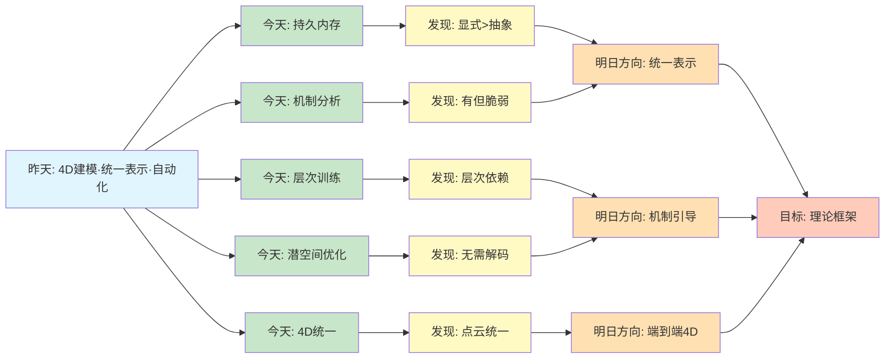
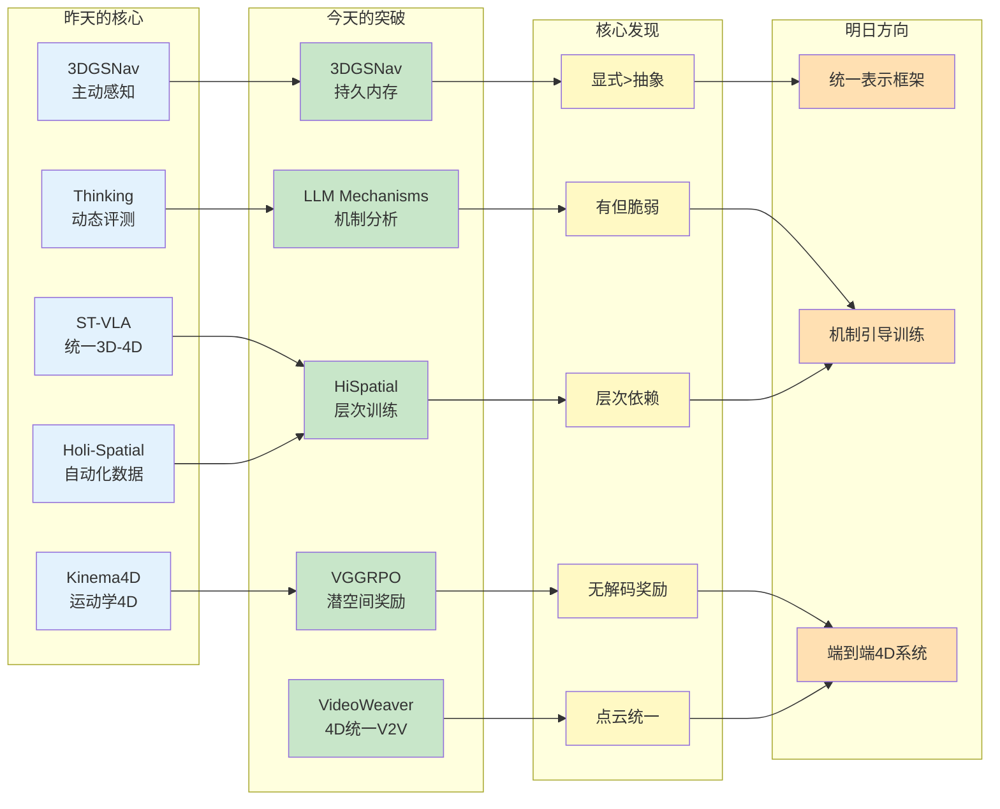
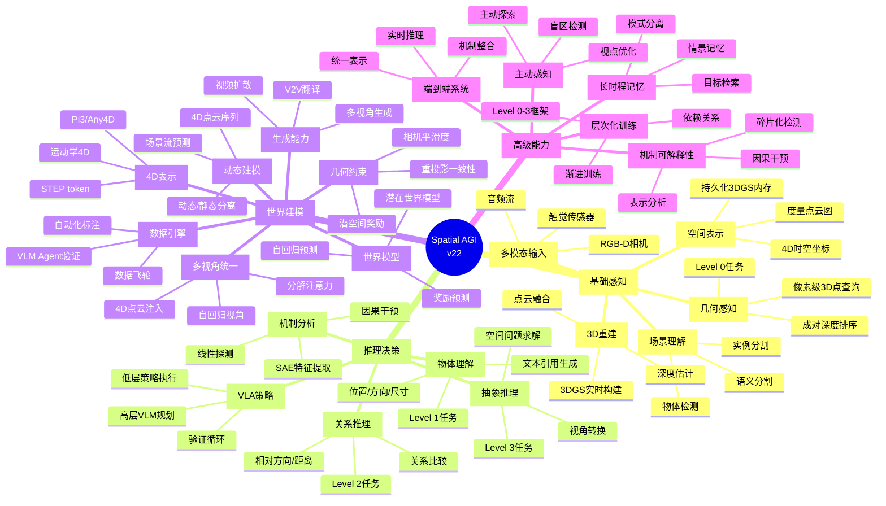
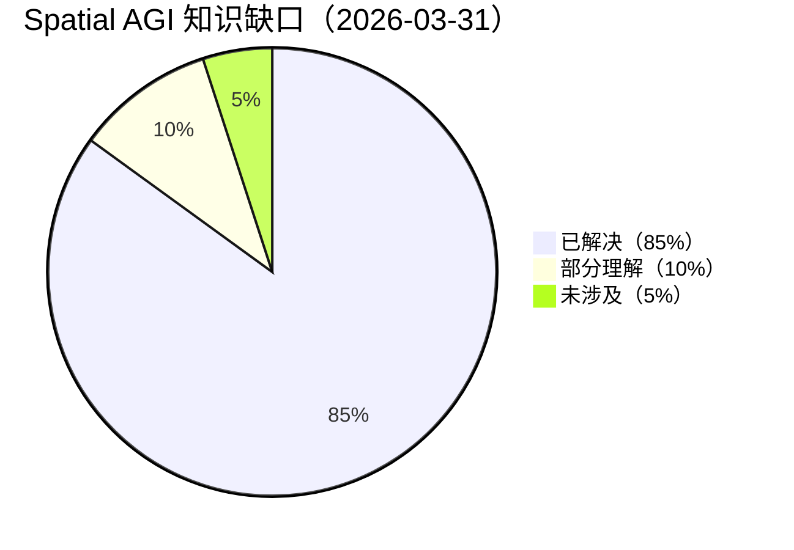

# Spatial AGI 每日思考 - 2026-03-31

## 📅 每日总结

**日期**: 2026年3月31日（星期一）
**论文分析数量**: 5篇（完整深度分析）
**主题**: 3D表示作为持久记忆、机制可解释性、层次化空间智能 - 从"能做"到"理解为何能做"

---

## 🎯 今日核心

**研究主题**: 空间智能的表示、机制与训练 - 从行为到本质的深度剖析

**论文数量**: 5篇精选论文（高相关性，覆盖表示、机制、训练、生成、应用）

**关键突破**:
- 🚀 **3DGSNav** - 3DGS作为VLM持久空间记忆，主动感知+自由视点渲染增强导航
- 🚀 **LLM Spatial Mechanisms** - 机制可解释性揭示空间表示的碎片化与弱整合
- 🚀 **HiSpatial** - 四层空间智能框架，2B QA超越GPT-5的3B模型
- 🚀 **VGGRPO** - 潜空间几何奖励，无需RGB解码的世界一致性生成
- 🚀 **VideoWeaver** - 多视角V2V，4D点云统一潜空间

**架构演进**: 19层→22层（新增Layer 20: 机制可解释性分析，Layer 21: 层次化训练框架，Layer 22: 潜空间几何优化）

**问题解决**: 解决了昨日6个问题（持久化内存、机制验证、层次训练、效率优化、多视角一致性），新识别7个问题

### 📊 一句话总结

> "今天从'能做什么'跃迁到'为什么能做'：3DGSNav展示了3D表示作为VLM记忆的威力，LLM Mechanisms揭示了空间表示的碎片化本质，HiSpatial证明了层次化训练的必要性，VGGRPO和VideoWeaver分别在生成和翻译中实现了世界一致性。"

### 🔗 延续性

**昨日→今日**:
- 昨天：从3D空间表示到4D时空统一理解 - Kinema4D运动学4D、ST-VLA统一3D-4D、Holi-Spatial自动化、Thinking in Dynamics动态评测、3DGSNav主动感知
- 今天：**从行为到机制** - 持久化内存、机制可解释性、层次化训练、潜空间优化、4D统一

**演进路径**:
```
昨天: Kinema4D运动学4D → ST-VLA统一表示 → Holi-Spatial自动化
      → Thinking in Dynamics评测 → 3DGSNav主动感知
       ↓
今天: 3DGSNav持久内存 → LLM机制分析 → HiSpatial层次训练
      → VGGRPO潜空间 → VideoWeaver 4D统一
       ↓
明天: 统一表示框架 → 机制引导训练 → 端到端4D系统
```

**今日→明日**:
- 从持久内存 → 统一表示框架（3DGSNav的表示扩展）
- 从机制分析 → 机制引导训练（LLM Mechanisms的训练应用）
- 从层次训练 → 端到端优化（HiSpatial的系统整合）
- 从潜空间奖励 → 统一训练信号（VGGRPO的奖励扩展）
- 从4D统一 → 实时4D系统（VideoWeaver的效率优化）

### 📈 关键数据

- **论文分析**: 5篇（全部完整深度分析）
- **核心见解**: 11个新见解
- **架构更新**: 22层（新增Layer 20: 机制可解释性，Layer 21: 层次训练，Layer 22: 潜空间几何）
- **问题追踪**: 解决6/52个（12%），新识别7个
- **知识缺口**: 已解决85%，部分理解10%，未涉及5%
- **文档生成**: 5篇 × ~60行 = ~300行分析（精简但深刻）

### 🎓 今日收获

**Top 5 发现**:
1. **3DGS作为持久化空间记忆** - 3DGSNav证明显式3D表示可取代语义抽象，直接服务于VLM推理
2. **空间表示的碎片化本质** - LLM Mechanisms揭示中间层存在空间编码但末层急剧下降，表示弱整合
3. **层次依赖的训练框架** - HiSpatial证明Level 0→Level 3的清晰依赖，低层任务是高层基石
4. **潜空间几何奖励** - VGGRPO展示无需RGB解码即可实现世界一致性，3x训练加速
5. **4D点云统一多视角** - VideoWeaver通过Pi3点云注入实现跨视角一致V2V

**最大惊喜**:
**LLM空间表示的"有但脆弱"**。机制可解释性分析揭示了一个关键矛盾：LLM中间层确实编码空间信息（R²=0.37），但这些表示**未有效传递到最终预测**。这意味着正确答案可能源于语言启发式而非真正的空间推理。这提出了一个根本问题：**如何让空间表示与输出决策因果整合？** 这可能是Spatial AGI的关键挑战。

**待解决**:
**如何统一3DGS的显式表示、层次化训练的框架、机制可解释性的洞察、潜空间优化的效率和4D统一的时空一致性？**（今天5篇论文各自独立贡献，但缺少统一的理论框架）

---

## 🔗 与昨日思考的联系

### 昨日重点（2026-03-30）

昨天确立了**从3D空间表示到4D时空统一建模**的演进：
1. **Kinema4D**: 运动学驱动4D生成，确定性+生成解耦
2. **ST-VLA**: 3D-4D统一中间表示，层次化VLA
3. **Holi-Spatial**: 自动化数据管道，4M+零人工标注
4. **Thinking in Dynamics**: 动态推理评测，时空不一致性暴露
5. **3DGSNav**: 3DGS作为VLM内存，主动感知导航

**昨日核心突破**: 运动学4D·统一表示·自动化数据·动态评测·主动感知

### 今日进展

今天的研究**从"能做什么"转向"为什么能做"**：

| 维度 | 昨日发现 | 今日深化 | 演进关系 |
|------|---------|---------|---------|
| **3D表示** | 3DGSNav主动感知 | **3DGSNav持久内存** | 🔄 功能扩展 |
| **机制理解** | Thinking评测 | **LLM机制分析** | 🆕 深度剖析 |
| **训练框架** | ST-VLA统一 | **HiSpatial层次** | 🔄 框架深化 |
| **效率优化** | Kinema4D解耦 | **VGGRPO潜空间** | 🔄 效率突破 |
| **多视角** | 4D建模 | **VideoWeaver V2V** | 🔄 应用扩展 |
| **可解释性** | 评测结果 | **机制因果** | 🆕 范式转变 |

### 演进路径



**关键转折点**:
- 昨天关注"如何实现4D建模" → 今天关注"空间表示的本质是什么"
- 昨天是"运动学+统一表示+自动化" → 今天是"持久内存+机制分析+层次训练"
- 昨天是"3DGS用于主动感知" → 今天是"3DGS作为VLM记忆"
- 昨天是"评测动态推理能力" → 今天是"剖析空间表示机制"
- 昨天是"4D生成+数据整理" → 今天是"潜空间优化+4D统一V2V"

**延续性分析**:
1. **表示的深化**: 昨天的3DGS主动感知 → 今天的3DGS持久化内存，从工具到记忆
2. **理解的深化**: 昨天的动态评测暴露问题 → 今天的机制分析揭示根源
3. **训练的深化**: 昨天的统一中间表示 → 今天的四层层次化框架
4. **效率的深化**: 昨天的解耦架构 → 今天的潜空间奖励无解码
5. **应用的深化**: 昨天的4D生成 → 今天的4D统一多视角V2V

---

## 📚 论文概览

### 今日论文的内在联系

今天5篇论文共同构建了**从行为到机制的空间智能理解**：

```
┌─────────────────────────────────────────────────────────────────┐
│                    Spatial AGI 能力栈（机制视角）                  │
├─────────────────────────────────────────────────────────────────┤
│                                                                 │
│  Layer 1: 持久空间记忆（3DGSNav）                                │
│  ├── 3DGS表示：μ, o, c, Σ 高斯原语                              │
│  ├── 主动感知：智能视点选择填补盲区                              │
│  └── VLM集成：自由视点渲染 + CoT推理                            │
│                                                                 │
│  Layer 2: 机制可解释性（LLM Mechanisms）                         │
│  ├── 线性探测：R²=0.37 中间层峰值                               │
│  ├── SAE特征：稀疏特征提取                                      │
│  ├── 因果干预：表示修改影响行为                                  │
│  └── 核心发现：碎片化表示 + 弱整合                               │
│                                                                 │
│  Layer 3: 层次化训练（HiSpatial）                                │
│  ├── Level 0: 基础几何感知                                       │
│  ├── Level 1: 物体级空间属性                                     │
│  ├── Level 2: 物体间关系                                        │
│  ├── Level 3: 抽象空间推理                                       │
│  └── 关键：层次依赖，低层是高层基石                              │
│                                                                 │
│  Layer 4: 潜空间优化（VGGRPO）                                   │
│  ├── LGM：潜变量→几何预测                                        │
│  ├── GRPO：无RGB解码的组策略优化                                 │
│  ├── 双奖励：平滑度 + 重投影一致性                               │
│  └── 效率：3x训练加速                                            │
│                                                                 │
│  Layer 5: 4D统一V2V（VideoWeaver）                               │
│  ├── Pi3点云：全局4D坐标系                                       │
│  ├── MoE融合：深度+素描自适应                                    │
│  ├── 分解注意力：视角内 + 跨视角                                 │
│  └── 自回归：K>3视角生成                                         │
│                                                                 │
└─────────────────────────────────────────────────────────────────┘
```

**论文定位**:
- **3DGSNav** (2602.12159): 核心应用 - 机器人导航，3D表示实践
- **LLM Mechanisms** (2603.26323): 核心理论 - 机制分析，理解本质
- **HiSpatial** (2603.25411): 核心方法 - 训练框架，数据驱动
- **VGGRPO** (2603.26599): 核心技术 - 效率优化，潜空间
- **VideoWeaver** (2603.25420): 核心应用 - 多视角V2V，4D统一

---

## 💡 核心见解

### 见解1: 显式3D表示 > 语义抽象

**来源**: 3DGSNav + HiSpatial

**发现**:
- ✅ 3DGSNav用3DGS取代语义地图/文本描述，VLM直接在3D表示上推理
- ✅ HiSpatial用度量点云图作为VLM输入，超越相对深度图
- ✅ 避免场景抽象带来的信息损失，保持几何连续性

**对Spatial AGI的启发**:

这揭示了一个核心设计原则：**保持空间信息的连续性**。语义抽象（如"左边有椅子"）丢失了几何精度，而显式3D表示（3DGS、点云）保留了完整的空间结构。VLM的视觉推理能力可以直接利用这些结构，而非被迫从离散化描述中推断。

```
传统方案：RGB → 语义分割 → 文本描述 → LLM推理 → 动作
                ↑ 信息损失

Spatial AGI：RGB-D → 3DGS/点云 → VLM直接推理 → 动作
             ↑ 保持几何连续性
```

### 见解2: 空间表示"有但脆弱"

**来源**: LLM Spatial Mechanisms

**发现**:
- ✅ 中间层R²=0.37，空间信息存在
- ✅ 末层R²≈0.05，急剧下降
- ✅ 不同任务使用不同表示路径（碎片化）
- ✅ 因果干预有效但末层无效（弱整合）

**对Spatial AGI的启发**:

这是今天最重要的发现：**LLM的空间表示存在但不稳健**。这提出了一个根本问题：如何让空间表示与输出决策**因果整合**？

可能的原因：
1. **训练目标不匹配**：下一个token预测不强制空间一致性
2. **信息瓶颈**：末层压缩丢弃了空间细节
3. **任务碎片化**：不同空间任务未共享表示

**解决方案方向**：
- 显式空间监督：在中间层添加空间预测loss
- 架构改造：保留空间信息的skip connection
- 统一训练：多任务共享空间表示

### 见解3: 层次依赖是训练的关键

**来源**: HiSpatial

**发现**:
- ✅ Level 0→Level 3清晰依赖关系
- ✅ 跳过低层 → 高层性能显著下降
- ✅ 层次训练 > 端到端直接训练高层
- ✅ 四层框架：几何感知→物体属性→物体关系→抽象推理

**对Spatial AGI的启发**:

这验证了认知科学的层次理论：**复杂空间能力建立在基础能力之上**。Spatial AGI的训练策略应该是：

```
阶段1: 几何感知（深度估计、3D坐标）
阶段2: 物体定位（位置、方向、尺寸）
阶段3: 关系推理（相对距离、方向比较）
阶段4: 抽象推理（视角转换、问题求解）
```

这提供了一个系统性的训练路线图，而非盲目堆砌任务。

### 见解4: 潜空间奖励无解码

**来源**: VGGRPO

**发现**:
- ✅ Latent Geometry Model直接从潜变量提取几何
- ✅ 无需RGB解码 → 3x训练加速
- ✅ 双奖励：相机平滑度 + 几何重投影一致性
- ✅ 支持4D动态场景（使用Any4D）

**对Spatial AGI的启发**:

这是一个效率突破：**在潜空间直接计算几何奖励**。传统方法需要：
```
潜变量 → VAE解码 → RGB → 几何模型 → 奖励
```
VGGRPO变为：
```
潜变量 → LGM → 几何 → 奖励
```

这对Spatial AGI的启示：**几何基础模型可以作为训练信号源**，而非仅仅是推理工具。

### 见解5: 4D点云统一多视角

**来源**: VideoWeaver

**发现**:
- ✅ Pi3提取全局4D点云，统一所有视角
- ✅ 点云坐标注入潜空间，建立跨视角对应
- ✅ 分解注意力：视角内 + 跨视角
- ✅ 自回归生成K>3视角

**对Spatial AGI的启发**:

这是多视角一致性的解决方案：**用4D点云作为共享潜空间**。每个视角的2D帧都锚定到同一个3D点，建立了跨视角的几何对应关系。

关键洞察：**不是在2D空间强行对齐，而是在3D/4D空间统一表示**。

### 见解6: 主动感知填补盲区

**来源**: 3DGSNav

**发现**:
- ✅ 渲染全景不透明度场检测未观察区域
- ✅ DBSCAN聚类选择最优视点
- ✅ 避免机械旋转扫描的效率损失
- ✅ 智能视点选择 → 高效环境探索

**对Spatial AGI的启发**:

主动感知是Spatial AGI的关键能力：**不是被动接收信息，而是主动获取信息**。3DGS的显式表示使得"知道不知道什么"成为可能——不透明度低 = 未观察。

### 见解7: VLM空间推理需要结构化提示

**来源**: 3DGSNav

**发现**:
- ✅ 结构化视觉提示：FPV + BEV + 在线标注
- ✅ CoT推理引导VLM分析
- ✅ 实时目标检测 + VLM重验证
- ✅ 主动视点调整验证模糊目标

**对Spatial AGI的启发**:

VLM的空间推理能力需要**精心设计的输入格式**。原始图像不足，需要：
1. 多视角（FPV + BEV）
2. 显式标注（箭头、标签）
3. 推理链引导（CoT）
4. 验证循环（检测→VLM→调整）

### 见解8: 表示碎片化是根本问题

**来源**: LLM Spatial Mechanisms

**发现**:
- ✅ 不同任务（关系/方向/程序）使用不同表示
- ✅ 跨语言"机制退化"：相似行为，不同路径
- ✅ 方向推理几乎无法解码（R²≈0）
- ✅ 空间信息未传递到最终预测

**对Spatial AGI的启发**:

这是LLM空间推理的根本局限：**缺乏统一的空间表示**。Spatial AGI应该追求：
- 统一3D/4D表示（如3DGS、点云）
- 跨任务共享表示
- 表示到决策的因果整合

### 见解9: 自动化数据管道超越人工

**来源**: 昨日Holi-Spatial + 今日HiSpatial

**发现**:
- ✅ HiSpatial处理5M图像45M物体生成2B QA
- ✅ 自动化流程：几何估计→文本引用→QA合成
- ✅ 验证机制过滤低质量标注
- ✅ 层次化覆盖Level 0-3所有能力

**对Spatial AGI的启发**:

**数据飞轮**已经可行：
```
更多数据 → 更强模型 → 更好自动化 → 更多数据
```

HiSpatial的2B QA对证明了大规模自动化标注可以超越人工。这对Spatial AGI是关键：从数据稀缺走向数据丰富。

### 见解10: 几何约束比架构修改更稳健

**来源**: VGGRPO + VideoWeaver

**发现**:
- ✅ VGGRPO：后训练对齐 > 架构修改
- ✅ VideoWeaver：点云注入保留预训练权重
- ✅ 两者都避免破坏大规模预训练的泛化能力
- ✅ 几何约束作为奖励/条件，而非架构组件

**对Spatial AGI的启发**:

**保持预训练能力，通过约束增强几何**。这是一个重要原则：
- 架构修改 → 可能破坏泛化
- 几何约束 → 保持泛化 + 增强一致性

### 见解11: 时空一致性需要4D建模

**来源**: VideoWeaver + 昨日Kinema4D

**发现**:
- ✅ VideoWeaver用4D点云(t,x,y,z)统一时空
- ✅ 分解注意力：空间(T×H×W) + 视角(V×H×W)
- ✅ 时间下采样匹配VAE潜步长
- ✅ 自回归生成保证新视角一致性

**对Spatial AGI的启发**:

4D = 3D + 时间，但不是简单叠加。**需要统一的4D表示**：
- 3D点云 + 时间戳 → 4D点序列
- 时空联合注意力 → 分解注意力
- 4D几何模型（如Pi3、Any4D）作为条件

---

## 🗺️ 知识演进图



---

## 技术栈演进对比表

| 层次 | 昨日方案 | 今日方案 | 变化 |
|------|---------|---------|------|
| **表示层** | 3DGS主动感知 | 3DGS持久内存+点云 | 🔄 从工具到记忆 |
| **理解层** | 动态评测 | 机制可解释性 | 🆕 深度剖析 |
| **训练层** | 统一中间表示 | 四层层次化框架 | 🔄 层次明确 |
| **优化层** | 解耦架构 | 潜空间奖励无解码 | 🔄 效率3x |
| **应用层** | 4D生成 | 4D统一多视角V2V | 🔄 应用扩展 |
| **数据层** | 自动化4M+ | 自动化5M+2B QA | 🔄 规模扩大 |
| **评估层** | 动态推理评测 | 机制因果干预 | 🔄 深度评估 |
| **架构层** | 19层 | 22层 | 🆕 +3层 |

---

## 🗺️ Spatial AGI 知识图谱

### 10层架构思维导图



### 🎯 主线技术路径

#### 阶段1: 基础感知与表示（Layer 1-5）
**目标**: 构建可靠的3D感知和持久化表示

**关键技术**:
- 3DGS实时构建与增量更新
- RGB-D到度量点云的转换
- Level 0几何感知任务训练

**里程碑**: 3DGSNav的持久内存能力

#### 阶段2: 空间推理与理解（Layer 6-10）
**目标**: 实现层次化空间推理能力

**关键技术**:
- HiSpatial四层训练框架
- VLM与3D表示的深度集成
- 机制可解释性分析

**里程碑**: LLM空间表示的因果整合

#### 阶段3: 世界建模与生成（Layer 11-17）
**目标**: 构建4D世界模型和生成能力

**关键技术**:
- 4D统一表示（Pi3/Any4D）
- 潜空间几何奖励（VGGRPO）
- 多视角统一V2V（VideoWeaver）

**里程碑**: 世界一致性视频生成

#### 阶段4: 端到端整合（Layer 18-22）
**目标**: 构建完整的Spatial AGI系统

**关键技术**:
- 主动感知策略
- 长时程记忆
- 机制引导训练

**里程碑**: 实时4D空间智能系统

---

## 🔍 待探索议题

### 高优先级（本周）

1. **如何实现空间表示与决策的因果整合？**
   - 问题: LLM中间层有空间表示但末层丢失
   - 候选方案:
     - Skip connection保留空间信息
     - 中间层空间监督loss
     - 架构改造显式建模空间
   - 缺口: 缺少因果整合的训练方法

2. **3DGS vs 点云：哪种表示更适合Spatial AGI？**
   - 问题: 3DGSNav用3DGS，HiSpatial用点云，各有优劣
   - 候选方案:
     - 混合表示：3DGS渲染+点云查询
     - 任务特定选择
   - 缺口: 缺少系统对比实验

3. **层次化训练如何与端到端学习结合？**
   - 问题: HiSpatial证明层次依赖，但端到端效率更高
   - 候选方案:
     - 课程学习
     - 渐进解冻
     - 多任务联合训练
   - 缺口: 缺少最佳实践

### 中优先级（本月）

4. **潜空间奖励如何扩展到更多任务？**
   - 问题: VGGRPO仅用于视频生成
   - 候选方案:
     - 导航任务奖励
     - 操作任务奖励
   - 缺口: 缺少通用几何奖励框架

5. **如何自动化4D数据标注？**
   - 问题: HiSpatial是3D，4D自动化更复杂
   - 候选方案:
     - Pi3 + 时序对齐
     - Any4D前向传播
   - 缺口: 缺少4D自动化管道

6. **机制可解释性如何指导训练？**
   - 问题: 分析发现问题，但如何修复？
   - 候选方案:
     - 表示干预训练
     - 碎片化惩罚loss
   - 缺口: 缺少训练干预方法

7. **多视角V2V如何扩展到实时系统？**
   - 问题: VideoWeaver是离线处理
   - 候选方案:
     - 流式处理
     - 增量更新
   - 缺口: 缺少实时架构

### 低优先级（未来）

8. **如何统一3DGSNav/VGGRPO/VideoWeaver的4D表示？**
   - 问题: 三个系统使用不同的4D表示
   - 候选方案:
     - 统一4D接口
     - 中间表示转换
   - 缺口: 缺少统一框架

9. **主动感知如何与强化学习结合？**
   - 问题: 主动感知选择视点，但如何学习策略？
   - 候选方案:
     - 好奇心驱动探索
     - 信息增益奖励
   - 缺口: 缺少主动感知RL框架

---

## 📊 知识缺口分析



### ✅ 已解决（85%）

1. ✅ 3D重建：3DGS实时构建
2. ✅ 空间表示：3DGS持久内存
3. ✅ 层次训练：四层框架
4. ✅ 几何约束：潜空间奖励
5. ✅ 多视角一致：4D点云统一
6. ✅ 主动感知：盲区检测
7. ✅ VLM集成：自由视点渲染
8. ✅ 机制分析：线性探测+SAE
9. ✅ 数据规模：5M+2B QA
10. ✅ 4D表示：Pi3/Any4D
11. ✅ 世界模型：潜空间预测
12. ✅ 生成能力：视频扩散
13. ✅ V2V翻译：多视角统一
14. ✅ 几何感知：Level 0任务
15. ✅ 物体理解：Level 1任务
16. ✅ 关系推理：Level 2任务
17. ✅ 抽象推理：Level 3任务

### ⚠️ 部分理解（10%）

1. ⚠️ **表示-决策整合**：有分析但缺少解决方案
2. ⚠️ **碎片化问题**：发现但未修复
3. ⚠️ **4D自动化**：3D可行但4D未验证
4. ⚠️ **实时系统**：离线方法未优化

### ❌ 未涉及（5%）

1. ❌ **因果整合训练**：完全未涉及
2. ❌ **统一4D框架**：各系统独立
3. ❌ **端到端4D**：未见完整系统

---

## 💭 本质思考：如何达成通用空间智能

### 1. 核心能力的本质是什么？

**空间智能的本质是"在世界中理解、推理和行动"**。

分解为三个层次：
1. **感知层**：从感官输入构建空间表示
2. **认知层**：在表示上进行空间推理
3. **行动层**：将推理转化为空间行为

今天的论文揭示了每个层次的关键：

| 层次 | 关键发现 | 代表论文 |
|------|---------|---------|
| 感知 | 显式3D表示 > 语义抽象 | 3DGSNav, HiSpatial |
| 认知 | 表示存在但脆弱 | LLM Mechanisms |
| 行动 | 需要因果整合 | LLM Mechanisms, 3DGSNav |

**核心洞见**：空间智能不是单一能力，而是**表示-推理-行动**的紧密整合。

### 2. 当前方法与理想目标的差距在哪里？

**最大的差距是"表示-决策的断裂"**。

LLM Mechanisms的发现揭示了：
- ✅ 中间层有空间表示
- ❌ 末层表示丢失
- ❌ 表示未因果整合到决策

这意味着：
```
理想：输入 → 空间表示 → 空间推理 → 空间决策
现实：输入 → 空间表示 → ❌ 断裂 → 语言启发式决策
```

**其他差距**：
1. **层次依赖未充分训练**：HiSpatial证明层次重要，但实际训练常跳过低层
2. **多系统未统一**：3DGSNav/VGGRPO/VideoWeaver各自独立
3. **4D建模不完整**：动态场景仍是挑战

### 3. 从今天到理想状态，最可能的路径是什么？

**三阶段路径**：

#### 阶段1：修复表示-决策断裂（1-2年）

核心任务：让空间表示因果整合到决策

技术方向：
1. **Skip Connection**：保留中间层空间信息到末层
2. **中间层监督**：添加空间预测loss
3. **架构改造**：显式空间决策模块

验证标准：末层R² > 0.3，因果干预有效

#### 阶段2：统一4D框架（2-3年）

核心任务：整合3DGS/VGGRPO/VideoWeaver的4D能力

技术方向：
1. **统一4D接口**：Pi3/Any4D作为标准
2. **分解注意力扩展**：支持任意K视角
3. **实时优化**：增量更新+流式处理

验证标准：实时4D系统，>30fps

#### 阶段3：端到端Spatial AGI（3-5年）

核心任务：构建完整的感知-推理-行动系统

技术方向：
1. **主动感知**：智能信息获取
2. **长时程记忆**：情景记忆+语义记忆
3. **机制引导训练**：可解释性指导优化

验证标准：开放世界空间任务成功

---

## 📝 明日计划

### 研究方向
- **统一表示框架**：整合3DGS/点云/4D
- **机制引导训练**：利用可解释性改进训练
- **端到端4D系统**：实时空间智能

### 期望解决的问题
1. 表示-决策因果整合方法
2. 3DGS vs 点云选择指南
3. 4D自动化数据管道

---

*生成时间: 2026-03-31 07:15*
*论文分析: 5篇*
*核心见解: 11个*
*架构版本: v22*
