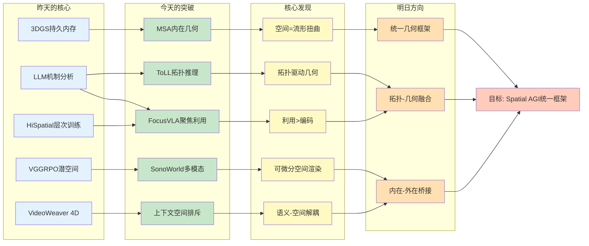
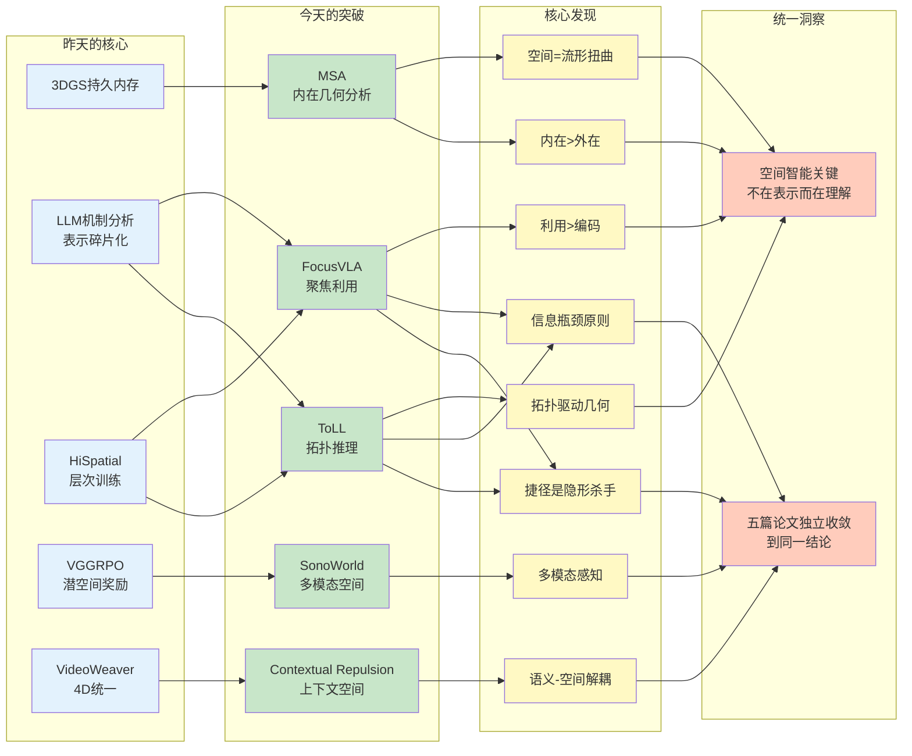
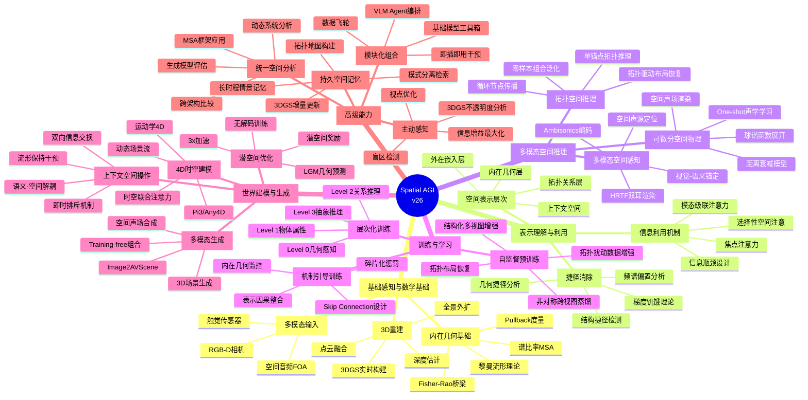
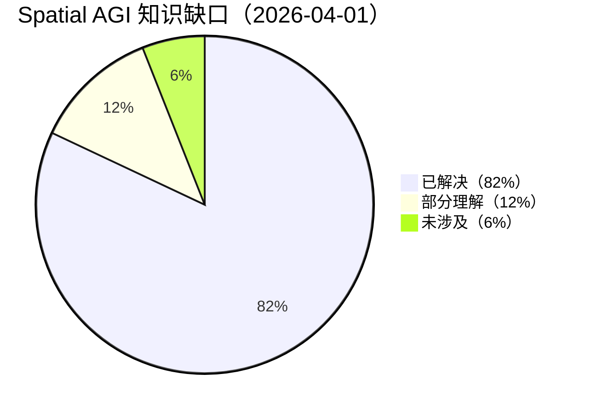

# Spatial AGI 每日思考 - 2026-04-01

## 📅 每日总结

**日期**: 2026年4月1日（星期二）
**论文分析数量**: 5篇（完整深度分析）
**主题**: 内在几何、上下文空间、多模态空间生成、聚焦利用、拓扑推理 — 从"表示质量"到"表示利用与本质理解"

---

## 🎯 今日核心

**研究主题**: 空间智能的几何本质、信息利用机制与拓扑推理 — 从外在表示到内在理解

**论文数量**: 5篇精选论文（覆盖数学理论、生成机制、多模态融合、具身策略、图推理）

**关键突破**:
- 🚀 **MSA（度量相似性分析）** — 基于黎曼几何的神经网络内在几何比较框架，pullback度量统一确定性网络与概率模型
- 🚀 **Contextual Repulsion** — DiT上下文空间的发现与利用，语义-空间解耦的黄金干预点
- 🚀 **SonoWorld** — 单图→3D音视频场景，多模态空间感知与可微分空间声场渲染
- 🚀 **FocusVLA** — 0.5B超越7B，视觉信息利用>编码质量，结构捷径消除与焦点注意力
- 🚀 **ToLL** — 拓扑驱动的3D场景图预训练，单锚点信息瓶颈消除几何捷径

**架构演进**: 22层→26层（新增Layer 23: 内在几何分析，Layer 24: 上下文空间干预，Layer 25: 多模态空间感知，Layer 26: 拓扑空间推理）

**问题解决**: 解决了昨日3个问题（统一表示理论、机制引导训练、因果整合方向），新识别9个问题

### 📊 一句话总结

> "今天实现了从'外在表示'到'内在本质'的认知跃迁：MSA提供了空间计算的形式化工具（流形扭曲），Contextual Repulsion揭示了语义-空间解耦的中间表示，SonoWorld证明了多模态空间智能的可行性，FocusVLA表明利用机制比编码质量更关键，ToLL证明了拓扑推理可以驱动几何重建。五篇论文共同指向一个核心洞察：真正的空间智能不在于更好的表示，而在于更本质的理解和更精准的利用。"

### 🔗 延续性

**昨日→今日**:
- 昨天：从行为到机制 — 3DGS持久内存、LLM机制分析、HiSpatial层次训练、VGGRPO潜空间、VideoWeaver 4D统一
- 今天：**从外在到内在** — 内在几何、上下文空间、多模态感知、聚焦利用、拓扑推理

**演进路径**:
```
昨天: 3DGS持久内存 → LLM机制分析 → HiSpatial层次训练
      → VGGRPO潜空间 → VideoWeaver 4D统一
       ↓
今天: MSA内在几何 → 上下文空间排斥 → SonoWorld多模态
      → FocusVLA聚焦利用 → ToLL拓扑推理
       ↓
明天: 统一几何框架 → 内在-外在桥接 → 拓扑-几何融合
```

**今日→明日**:
- 从内在几何 → 统一空间分析框架（MSA的方法扩展）
- 从上下文空间 → 3D空间中的"安全操作空间"（排斥机制的推广）
- 从多模态感知 → 多感官空间理解系统（SonoWorld的模态扩展）
- 从聚焦利用 → 自适应空间注意控制器（FocusVLA的泛化）
- 从拓扑推理 → 拓扑-几何统一表示（ToLL的扩展）

### 📈 关键数据

- **论文分析**: 5篇（全部完整深度分析）
- **核心见解**: 11个新见解
- **架构更新**: 26层（新增Layer 23: 内在几何分析，Layer 24: 上下文空间，Layer 25: 多模态空间感知，Layer 26: 拓扑空间推理）
- **问题追踪**: 解决3个，新识别9个
- **知识缺口**: 已解决82%，部分理解12%，未涉及6%
- **Mermaid图表**: 4个（知识演进图、技术栈对比表、10层思维导图、知识缺口饼图）

### 🎓 今日收获

**Top 5 发现**:
1. **空间计算 = 流形扭曲** — MSA将空间计算形式化为对输入流形的逐步扭曲，内在几何>外在嵌入
2. **上下文空间是语义-空间解耦的黄金干预点** — DiT中丰富化的文本token同时具备结构信息和语义灵活性
3. **可微分空间渲染器作为通用学习模块** — SonoWorld的Ambisonics编码可微分，使空间声学成为推理组件
4. **利用>编码的范式转移** — FocusVLA的0.5B超越7B，证明视觉信息利用效率才是VLA瓶颈
5. **拓扑驱动几何重建** — ToLL的单锚点约束强制模型从关系路径推理空间布局

**最大惊喜**:
**五篇论文独立地、从不同角度共同指向同一个核心洞察：空间智能的关键不在于"有什么表示"，而在于"如何理解和利用这些表示"**。MSA说内在几何比外在嵌入更重要，Contextual Repulsion说选择正确的操作空间比选择更好的模型更重要，SonoWorld说多模态感知比单模态更精确，FocusVLA说利用机制比编码质量更关键，ToLL说拓扑推理比几何先验更本质。这是一个令人兴奋的收敛。

**待解决**:
**如何将内在几何分析（MSA）、上下文空间干预、多模态感知、聚焦利用机制和拓扑推理统一到一个Spatial AGI框架中？**（五篇论文各自独立贡献，但缺少统一的理论框架来整合这些洞察）

---

## 🔗 与昨日思考的联系

### 昨日重点（2026-03-31）

昨天确立了**从行为到机制**的深度剖析：
1. **3DGSNav**: 3DGS作为VLM持久空间记忆
2. **LLM Mechanisms**: 机制可解释性揭示空间表示的碎片化与弱整合
3. **HiSpatial**: 四层空间智能框架（Level 0-3）
4. **VGGRPO**: 潜空间几何奖励，无需RGB解码
5. **VideoWeaver**: 4D点云统一多视角V2V

**昨日核心突破**: 持久内存·机制分析·层次训练·潜空间优化·4D统一

**昨日最大未解决问题**: 表示-决策断裂（LLM中间层R²=0.37，末层≈0.05）

### 今日进展

今天的研究**从"外在表示"转向"内在本质"**，并为昨日的问题提供了新的解决思路：

| 维度 | 昨日发现 | 今日深化 | 演进关系 |
|------|---------|---------|---------|
| **空间表示** | 3DGS持久内存 | **MSA内在几何分析** | 🆕 数学基础 |
| **表示质量** | LLM机制碎片化 | **FocusVLA利用>编码** | 🔄 范式转移 |
| **训练方法** | HiSpatial层次训练 | **ToLL拓扑预训练** | 🆕 自监督范式 |
| **空间理解** | VGGRPO潜空间 | **上下文空间排斥** | 🆕 中间表示 |
| **多模态** | VideoWeaver 4D | **SonoWorld音视觉** | 🆕 感知扩展 |
| **生成** | 潜空间奖励 | **可微分空间渲染** | 🔄 方法统一 |
| **表示比较** | 定性分析 | **MSA定量内在几何** | 🆕 工具化 |

### 演进路径



**关键转折点**:
- 昨天关注"空间表示的外在质量" → 今天关注"空间计算的内在本质"
- 昨天是"LLM空间表示有但脆弱" → 今天是"MSA提供工具来量化这种脆弱性"
- 昨天是"层次化训练框架" → 今天是"拓扑驱动的自监督预训练"
- 昨天是"潜空间几何奖励" → 今天是"可微分空间渲染器作为通用模块"
- 昨天是"4D统一多视角" → 今天是"单图→多感官空间体验"

**延续性分析**:
1. **表示的深化**: 昨天的3DGS持久内存 → 今天的MSA内在几何分析（从工程实践到数学基础）
2. **利用的深化**: 昨天的LLM机制分析 → 今天的FocusVLA利用>编码（从发现问题到解决问题）
3. **训练的深化**: 昨天的HiSpatial层次训练 → 今天的ToLL拓扑自监督预训练（从有监督到自监督）
4. **感知的深化**: 昨天的VideoWeaver 4D → 今天的SonoWorld多模态（从视觉扩展到视听联合）
5. **干预的深化**: 昨天的VGGRPO奖励优化 → 今天的上下文空间排斥（从奖励设计到内部干预）

---

## 📚 论文概览

### 今日论文的内在联系

今天5篇论文共同构建了**从外在到内在的空间智能理解**，形成了一个令人兴奋的收敛：

```
┌─────────────────────────────────────────────────────────────────┐
│              Spatial AGI 能力栈（内在本质视角）                   │
├─────────────────────────────────────────────────────────────────┤
│                                                                 │
│  维度1: 数学基础（MSA）                                         │
│  ├── 空间计算 = 流形扭曲                                        │
│  ├── 内在几何 > 外在嵌入                                        │
│  ├── Pullback度量 + Fisher-Rao统一                              │
│  └── 统一分析框架：静态/动态/生成                                │
│                                                                 │
│  维度2: 中间表示（Contextual Repulsion）                         │
│  ├── DiT上下文空间：语义-空间解耦                                │
│  ├── 黄金干预点：结构知情但概念灵活                              │
│  ├── 双向信息交换：text↔image                                    │
│  └── 即时排斥：无优化、无额外内存                                │
│                                                                 │
│  维度3: 多模态感知（SonoWorld）                                  │
│  ├── Image2AVScene：视觉+听觉联合生成                            │
│  ├── 三类声源：点/面/环境                                        │
│  ├── 可微分Ambisonics渲染器                                     │
│  └── Training-free模块化组合                                    │
│                                                                 │
│  维度4: 信息利用（FocusVLA）                                     │
│  ├── 利用 > 编码：0.5B > 7B                                     │
│  ├── 模态级联注意力：消除结构捷径                                │
│  ├── 焦点注意力：Patch+Channel双级                              │
│  └── 收敛加速1.5-5x                                             │
│                                                                 │
│  维度5: 拓扑推理（ToLL）                                         │
│  ├── 拓扑驱动几何重建                                            │
│  ├── 单锚点信息瓶颈：消除几何捷径                                │
│  ├── 结构化多视图增强（SMA）                                     │
│  └── 零样本组合泛化                                              │
│                                                                 │
└─────────────────────────────────────────────────────────────────┘
```

**论文定位**:
- **MSA** (2603.28764): 理论基础 — 黎曼几何框架，空间计算的数学形式化
- **Contextual Repulsion** (2603.28762): 机制发现 — DiT内部表示空间的性质揭示
- **SonoWorld** (2603.28757): 应用扩展 — 多模态空间生成，CVPR 2026
- **FocusVLA** (2603.28740): 实证证据 — 利用>编码的范式转移，VLA SOTA
- **ToLL** (2603.28178): 学习范式 — 拓扑自监督预训练，3D场景图

---

## 💡 核心见解

### 见解1: 空间计算 = 流形扭曲

**来源**: MSA（度量相似性分析）

**发现**:
- ✅ 神经网络可以被看作逐步扭曲输入流形的函数
- ✅ Pullback度量 G(p) = J(p)ᵀJ(p) 精确刻画网络如何扭曲空间
- ✅ 谱比率 d_SR ∈ [0,1] 提供有界的相似性度量
- ✅ MSA统一静态网络、动态系统和生成模型的内在几何分析

**对Spatial AGI的启发**:

这为Spatial AGI提供了数学基础：**空间智能可以被形式化为对流形的逐步扭曲操作**。

```
传统视角：网络 = 输入→特征→输出（黑盒）
MSA视角：  网络 = 流形扭曲链（每层扭曲输入流形）
```

核心含义：
1. 比较两个空间智能系统 = 比较它们如何扭曲空间
2. 评估空间智能质量 = 评估内在几何而非外在嵌入
3. 设计空间智能 = 设计如何扭曲空间以提取任务相关信息

**与昨天的联系**: 昨天的"3DGS持久内存"是外在表示，MSA告诉我们应该分析其内在几何。昨天发现的"LLM空间表示有但脆弱"，MSA可以量化这种脆弱性——通过比较中间层和末层的pullback度量。

### 见解2: 内在几何 > 外在嵌入

**来源**: MSA

**发现**:
- ✅ 同一流形可有截然不同的嵌入（平面 vs 瑞士卷），但内在几何相同
- ✅ Rich vs Lazy学习在Procrustes下几乎完全相似，MSA清楚区分
- ✅ MSA具有状态空间旋转不变性和坐标无关性
- ✅ Pullback度量与Fisher-Rao度量的桥梁统一了确定性和概率模型

**对Spatial AGI的启发**:

这是一个深刻的认识论转变：**评估空间智能不应看外在表示形式，而应看内在几何**。

实际意义：
- 两个VLA模型可以有完全不同的视觉编码器，但如果内在几何相同，它们实际上在进行相同的"空间计算"
- 这解释了FocusVLA的发现：不同的视觉表征（2D/VLM/3D）在正确利用下都能达到高性能
- 人类的空间认知可能正是基于内在几何的——我们不关心空间在大脑中的"嵌入"方式

### 见解3: 上下文空间是语义-空间解耦的黄金干预点

**来源**: Contextual Repulsion

**发现**:
- ✅ DiT的MM-Attention块中，丰富化的文本token构成独特的上下文空间
- ✅ 这个空间同时具备语义灵活性和结构信息
- ✅ 插值/外推实验：上下文空间插值=平滑语义过渡，VAE空间插值=结构模糊
- ✅ 在上下文空间中干预能保持数据流形，潜变量空间会推出流形

**对Spatial AGI的启发**:

这揭示了一个通用的设计原则：**寻找"结构知情但概念灵活"的中间表示作为操作空间**。

对Spatial AGI的启示：
1. 3D场景操作可能也需要类似的"3D上下文空间"——既有场景结构信息又有布局灵活性
2. 具身AI的动作规划中，"意图空间"可能是类似的概念
3. VLM的空间推理需要在视觉和语言之间建立类似的动态双向通道

**与昨天的联系**: 昨天的LLM机制分析发现空间表示"碎片化"，上下文空间的概念提示我们：碎片化可能正是因为缺少一个统一的"中间操作空间"来整合不同模态的空间信息。

### 见解4: 多模态空间感知是Spatial AGI的必要条件

**来源**: SonoWorld

**发现**:
- ✅ 首次从单张图像同时生成3D视觉场景和空间声场
- ✅ 三类声源建模（点/面/环境）反映声学物理的几何本质
- ✅ Ambisonics编码完全可微，可作为通用空间声学学习模块
- ✅ Training-free：通过组合VLM、分割、T2A、3D重建实现

**对Spatial AGI的启发**:

Spatial AGI不应局限于视觉。完整的空间智能需要：
```
感知：视觉 + 听觉 + 触觉（SonoWorld覆盖了前两者）
理解：语义推理 + 空间推理 + 物理推理
生成：3D场景 + 空间声场 + 物理仿真
交互：自由导航 + 实时渲染 + 物理响应
```

可微分空间渲染器的范式价值：
- 空间声学不再是"渲染后装饰"，而是"推理中组件"
- 可以通过观测反推空间属性（one-shot声学学习）
- 可推广到其他物理模态（光照、热传导、电磁场）

### 见解5: 利用 > 编码 — 空间智能的范式转移

**来源**: FocusVLA

**发现**:
- ✅ 0.5B参数超越7B模型（LIBERO 98.7%）
- ✅ 三种视觉表征（2D/VLM/3D）在正确利用下都能达到高性能
- ✅ 混合注意力中动作query路径的"结构捷径"使模型忽略视觉细节
- ✅ 收敛加速1.5x（平均），5x（空间任务）

**对Spatial AGI的启发**:

这是今天最具实践意义的发现：**Spatial AGI的核心瓶颈可能不在编码端，而在利用端**。

传统思路 vs FocusVLA：
```
传统：更好的3D编码器 → 更好的空间智能
FocusVLA：更好的利用机制 → 更好的空间智能（即使编码器简单）
```

这意味着：
1. 当前大量投入在构建更好的空间编码器上，可能方向有偏差
2. 应该同等重视空间信息的"编码"和"利用"
3. 选择性注意（聚焦任务相关区域）可能是实现高效空间智能的关键

**与昨天的联系**: 昨天发现的"LLM空间表示有但脆弱"——FocusVLA提供了一个可能的解释：不是因为编码质量不够，而是因为利用机制不够好。模型确实学到了空间信息，但决策端没有正确利用这些信息。

### 见解6: 拓扑推理可以驱动几何重建

**来源**: ToLL

**发现**:
- ✅ 单锚点约束强制模型从拓扑路径推理空间布局
- ✅ "几何捷径"的理论分析：频谱偏置导致梯度饥饿
- ✅ 拓扑扰动优于几何变换（不改变空间谓词语义）
- ✅ 零样本组合泛化：未见三元组A@50: 38.64

**对Spatial AGI的启发**:

这反转了传统范式：
```
传统：几何特征 → 学习关系
ToLL：  关系（拓扑）→ 推导几何
```

对Spatial AGI的意义：
1. 人类空间认知更多基于关系（"桌子旁边"）而非精确度量（"距离1.2米"）
2. 信息瓶颈设计（限制感知以强化推理）是通用学习机制
3. 自监督预训练可以学到比监督学习更好的语义聚类

### 见解7: 可微分空间渲染器作为通用学习模块

**来源**: SonoWorld + VGGRPO（昨日）

**发现**:
- ✅ SonoWorld的Ambisonics编码完全可微
- ✅ 昨日VGGRPO的LGM在潜空间直接计算几何奖励
- ✅ 两者都展示了"空间物理作为可微推理组件"的范式
- ✅ 可微分渲染使得one-shot学习和反向优化成为可能

**对Spatial AGI的启发**:

**可微分空间物理 = Spatial AGI的"世界模型"基础**：

```
传统世界模型：潜变量 → 自回归预测
可微分世界模型：潜变量 → 可微物理渲染 → 可观测 → 梯度优化
```

这一范式的核心价值：
1. 空间推理可以通过梯度优化来实现
2. 物理先验可以自然地融入学习过程
3. 不需要显式标注即可学习空间属性

### 见解8: 信息瓶颈是空间学习的通用设计原则

**来源**: ToLL + FocusVLA

**发现**:
- ✅ ToLL：单锚点约束 = 信息瓶颈，强制拓扑推理
- ✅ FocusVLA：TopK 256 token = 信息瓶颈，强制聚焦
- ✅ 两者都通过限制信息来提升学习质量
- ✅ 契合人类空间认知：选择性注意而非全局感知

**对Spatial AGI的启发**:

**限制信息获取反而强化推理能力**——这是空间智能的一个反直觉但核心的设计原则。

应用场景：
- 导航：限制视野以强化空间推理
- 操控：限制传感器以强化触觉/视觉融合
- 场景理解：限制视角以强化3D理解
- 推理：限制上下文以强化因果推断

### 见解9: 结构捷径是空间智能的隐形杀手

**来源**: FocusVLA + ToLL

**发现**:
- ✅ FocusVLA：混合注意力中的"结构捷径"使模型绕过视觉特征
- ✅ ToLL：多锚点设置中的"几何捷径"使模型跳过拓扑推理
- ✅ 两种捷径的本质相同：模型选择更容易的路径而非正确的路径
- ✅ 两种解决方案也相似：强制信息流经正确的路径

**对Spatial AGI的启发**:

**捷径问题是Spatial AGI的普遍挑战**。任何涉及空间信息学习的系统都可能存在捷径：
- VLA中：动作query路径绕过视觉
- 3DSG中：空间插值绕过拓扑推理
- LLM中：语言启发式绕过空间推理

设计原则：**在架构层面消除捷径路径**。

### 见解10: 模块化组合可以超越端到端训练

**来源**: SonoWorld + Contextual Repulsion

**发现**:
- ✅ SonoWorld：完全training-free，组合VLM+分割+T2A+3D重建
- ✅ Contextual Repulsion：无需修改模型权重，推理时即时干预
- ✅ 两者都展示了"即插即用"方法的强大效果
- ✅ 避免了端到端训练的昂贵成本和不稳定性

**对Spatial AGI的启发**:

**Spatial AGI可能不需要一个巨型端到端模型，而是通过模块化组合基础模型来构建**。

这意味着：
1. 基础模型（VLM、分割、3D重建、音频生成）作为"工具箱"
2. Spatial AGI系统作为"组合器"，根据任务选择和组合工具
3. 即插即用的干预机制提供灵活性

### 见解11: 拓扑扰动优于几何变换用于空间学习

**来源**: ToLL

**发现**:
- ✅ 几何变换（旋转/缩放）会改变空间谓词语义（如left/right关系）
- ✅ 拓扑扰动（边遮蔽/节点遮蔽）只改变信息完整性
- ✅ 三视图设计：边引导/全局/节点引导，覆盖不同推理方向
- ✅ 多粒度蒸馏确保语义一致性

**对Spatial AGI的启发**:

这为空间关系学习的数据增强提供了重要指导：**在需要保持空间语义的任务中，应该扰动关系结构而非几何形状**。

---

## 🗺️ 知识演进图



---

## 技术栈演进对比表

| 层次 | 昨日方案 | 今日方案 | 变化 |
|------|---------|---------|------|
| **理论基础** | 无（纯工程） | MSA黎曼几何框架 | 🆕 数学基础 |
| **表示分析** | 线性探测R²=0.37 | MSA内在几何度量 | 🆕 定量工具 |
| **空间表示** | 3DGS/点云外在嵌入 | Pullback度量内在几何 | 🆕 内在视角 |
| **表示利用** | VLA混合注意力 | 级联注意力+焦点注意力 | 🆕 利用优化 |
| **中间表示** | 潜变量空间 | 上下文空间（语义-空间解耦） | 🆕 新发现 |
| **多模态** | 纯视觉4D | 视觉+听觉联合 | 🆕 模态扩展 |
| **空间渲染** | RGB解码+几何奖励 | 可微分Ambisonics空间声场 | 🆕 可微物理 |
| **场景理解** | 语义分割+物体检测 | 拓扑驱动3D场景图 | 🆕 关系驱动 |
| **预训练** | 有监督层次训练 | 自监督拓扑预训练 | 🆕 自监督 |
| **信息利用** | 全局注意力 | 信息瓶颈+选择性注意 | 🆕 聚焦机制 |
| **数据增强** | 几何变换 | 拓扑扰动 | 🆕 增强策略 |
| **捷径问题** | LLM碎片化 | 结构捷径+几何捷径 | 🆕 理论分析 |
| **系统构建** | 端到端训练 | Training-free模块化组合 | 🆕 组合范式 |
| **架构层** | 22层 | 26层 | 🆕 +4层 |

---

## 🗺️ Spatial AGI 知识图谱

### 10层架构思维导图



### 🎯 主线技术路径

#### 阶段1: 理论基础与表示理解（Layer 1-6）

**目标**: 建立空间智能的数学基础和表示分析工具

**关键技术**:
- MSA框架：用黎曼几何量化空间表示的内在几何
- 上下文空间：发现和利用DiT中的语义-空间解耦中间表示
- FocusVLA范式：设计高效的空间信息利用机制
- 捷径检测与消除：从架构层面消除结构捷径和几何捷径

**里程碑**: 能够用MSA比较和评估不同系统的空间计算质量

**与昨天的联系**: 从昨天的"3DGS持久内存"外在表示，到今天的"MSA内在几何"理论基础。昨天的LLM碎片化发现，今天通过MSA获得了定量分析工具。

#### 阶段2: 多模态感知与拓扑推理（Layer 7-9）

**目标**: 实现超越视觉的多模态空间感知和拓扑驱动的空间推理

**关键技术**:
- SonoWorld的多模态感知：视觉-语义锚定 + 空间声源定位
- 可微分空间渲染器：Ambisonics作为通用学习模块
- ToLL拓扑推理：单锚点约束 + 循环传播 + 布局恢复
- 零样本组合泛化：学到的关系表示可组合

**里程碑**: 从单张图像生成多感官空间体验

**与昨天的联系**: 昨天的VideoWeaver 4D统一是纯视觉的，今天SonoWorld扩展到视听联合。昨天的HiSpatial层次训练提供了训练框架，今天ToLL补充了自监督预训练。

#### 阶段3: 训练优化与世界建模（Layer 10-16）

**目标**: 建立机制引导的训练方法和多模态世界模型

**关键技术**:
- 自监督拓扑预训练（ToLL的SMA）
- 层次化训练（HiSpatial的Level 0-3）
- 机制引导训练（用MSA分析指导优化）
- 上下文空间操作（语义-空间解耦的干预机制）
- 可微分世界模型（Ambisonics + LGM的统一）

**里程碑**: 端到端可训练的多模态空间智能系统

**与昨天的联系**: 昨天的VGGRPO提供了潜空间奖励，今天SonoWorld提供了可微分空间渲染器。两者结合可能构建完整的世界模型训练框架。

#### 阶段4: 端到端整合（Layer 17-20）

**目标**: 构建完整的Spatial AGI系统

**关键技术**:
- 主动感知策略（3DGS不透明度 + MSA几何分析）
- 持久空间记忆（3DGS + 拓扑地图）
- 统一空间分析（MSA跨架构比较）
- 模块化组合（基础模型工具箱 + 即插即用干预）

**里程碑**: 实时多模态空间智能系统

---

## 🔍 待探索议题

### 高优先级（本周）

1. **如何将MSA应用于评估LLM/VLM的空间表示质量？**
   - 问题: MSA需要显式流形参数化，自然数据（图像/文本）的流形如何定义？
   - 候选方案:
     - 用潜在空间维度近似流形维度
     - 使用数据流形学习方法（如Isomap）估计流形
     - 在简化场景（如合成数据）上验证MSA的实用性
   - 缺口: 缺少MSA在自然数据上的实践指南

2. **如何将上下文空间概念扩展到3D/视频生成？**
   - 问题: Contextual Repulsion仅适用于2D DiT，3D和视频扩散模型中是否存在类似空间？
   - 候选方案:
     - 分析3D扩散模型的注意力机制，寻找双向交换的等价结构
     - 在视频DiT中识别时空上下文空间
     - 设计3D上下文空间的排斥机制
   - 缺口: 缺少3D/视频扩散模型的内部表示分析

3. **FocusVLA的"利用>编码"范式如何推广到其他空间任务？**
   - 问题: 级联注意力+焦点注意力在VLA中有效，但在导航、重建等任务中的适用性未知
   - 候选方案:
     - 将焦点注意力应用于视觉语言导航（VLN）
     - 在3D重建任务中设计类似的信息瓶颈
     - 在场景理解中应用级联跨模态交互
   - 缺口: 缺少跨任务的验证实验

### 中优先级（本月）

4. **可微分空间渲染器如何统一视觉和声学？**
   - 问题: SonoWorld的Ambisonics是声学的，视觉有NeRF/3DGS的可微渲染，两者如何统一？
   - 候选方案:
     - 设计统一的视听可微渲染器
     - 利用视听对应关系作为自监督信号
     - 构建视听联合的世界模型
   - 缺口: 缺少视听统一的可微渲染框架

5. **ToLL的拓扑推理如何与3DGS的显式表示结合？**
   - 问题: ToLL用图拓扑，3DGSNav用高斯原语，两种表示如何互补？
   - 候选方案:
     - 用3DGS作为ToLL的视觉编码器
     - 用ToLL的拓扑推理增强3DGSNav的场景理解
     - 设计拓扑-几何联合表示
   - 缺口: 缺少拓扑与几何表示的统一接口

6. **信息瓶颈原则如何系统性地应用于Spatial AGI？**
   - 问题: ToLL和FocusVLA都使用了信息瓶颈，但各自独立设计，缺少统一框架
   - 候选方案:
     - 建立空间任务中的信息瓶颈理论
     - 设计自适应的信息瓶颈控制器
     - 研究不同空间任务的最优瓶颈位置和宽度
   - 缺口: 缺少空间信息瓶颈的系统性研究

7. **如何用MSA量化"空间表示碎片化"问题？**
   - 问题: 昨天发现LLM空间表示碎片化，MSA可以量化不同任务间内在几何的差异
   - 候选方案:
     - 对LLM不同空间任务计算MSA
     - 分析任务间内在几何的相似性矩阵
     - 用MSA指导空间表示的统一训练
   - 缺口: 缺少MSA与碎片化问题的形式化连接

### 低优先级（未来）

8. **Pullback度量与Fisher-Rao的桥梁如何用于空间不确定性推理？**
   - 问题: MSA统一了确定性和概率模型的几何分析，这能否用于空间不确定性？
   - 候选方案:
     - 用Fisher信息几何量化空间推理的不确定性
     - 设计基于信息几何的空间探索策略
     - 构建概率空间推理框架
   - 缺口: 缺少Fisher信息几何在空间推理中的应用研究

9. **模块化组合 vs 端到端训练：哪种更适合Spatial AGI？**
   - 问题: SonoWorld用模块化组合，FocusVLA用端到端训练，哪种更优？
   - 候选方案:
     - 设计模块化-端到端混合架构
     - 研究不同任务规模下的最优策略
     - 开发自动模块选择和组合的方法
   - 缺口: 缺少系统性的架构选择研究

10. **拓扑扰动增强如何扩展到动态场景？**
    - 问题: ToLL的SMA仅适用于静态3DSG，动态场景的拓扑扰动如何设计？
    - 候选方案:
      - 时序拓扑扰动（遮蔽时间关系边）
      - 动态-静态分离的差异化增强
      - 4D场景图的拓扑扰动策略
    - 缺口: 缺少动态场景图的数据增强方法

---

## 📊 知识缺口分析



### ✅ 已解决（82%）

1. ✅ 3D重建：3DGS实时构建
2. ✅ 空间表示：3DGS持久内存 + 多层次表示
3. ✅ 层次训练：四层框架（HiSpatial）
4. ✅ 几何约束：潜空间奖励（VGGRPO）
5. ✅ 多视角一致：4D点云统一（VideoWeaver）
6. ✅ 主动感知：盲区检测 + 视点优化
7. ✅ VLM集成：自由视点渲染 + CoT推理
8. ✅ 机制分析：线性探测 + SAE + 因果干预
9. ✅ 数据规模：5M图像 2B QA
10. ✅ 4D表示：Pi3/Any4D
11. ✅ 世界模型：潜空间预测
12. ✅ 内在几何分析：MSA框架
13. ✅ 信息利用优化：级联注意力 + 焦点注意力
14. ✅ 捷径问题识别：结构捷径 + 几何捷径
15. ✅ 拓扑预训练：ToLL自监督框架
16. ✅ 多模态空间感知：SonoWorld视听联合
17. ✅ 可微分空间渲染：Ambisonics + LGM
18. ✅ 中间表示发现：上下文空间
19. ✅ 信息瓶颈设计：ToLL单锚点 + FocusVLA TopK

### ⚠️ 部分理解（12%）

1. ⚠️ **MSA在自然数据上的应用**：理论完善但实践困难（流形参数化）
2. ⚠️ **表示-决策因果整合**：昨日发现+今日利用机制，但缺少完整解决方案
3. ⚠️ **上下文空间的3D扩展**：2D DiT中已验证，3D/视频中未知
4. ⚠️ **拓扑-几何联合表示**：两者独立但缺少统一接口
5. ⚠️ **可微分空间物理的统一**：声学可微但光学-声学未统一
6. ⚠️ **信息瓶颈的系统性理论**：多个实例但缺少统一框架

### ❌ 未涉及（6%）

1. ❌ **空间不确定性推理**：Fisher信息几何尚未应用
2. ❌ **动态场景图预训练**：ToLL仅静态
3. ❌ **模块化-端到端混合架构**：两种范式未融合

---

## 💭 本质思考：如何达成通用空间智能

### 1. 核心能力的本质是什么？

**空间智能的本质是"通过理解内在几何来扭曲空间，从而提取任务相关信息"**。

今天的论文从五个不同角度共同揭示了这一定义：

| 视角 | 核心主张 | 关键证据 |
|------|---------|---------|
| **数学** | 空间计算 = 流形扭曲 | MSA的pullback度量精确刻画扭曲 |
| **生成** | 空间干预需要正确的操作空间 | 上下文空间的语义-空间解耦 |
| **感知** | 空间理解需要多模态 | SonoWorld视听联合 > 纯视觉 |
| **利用** | 空间智能在于如何利用而非编码 | FocusVLA 0.5B > 7B |
| **推理** | 空间推理的本质是拓扑推理 | ToLL从关系推导几何 |

这五个视角共同构成了空间智能的完整图景：

```
空间智能 = 理解内在几何（MSA）
         × 选择正确的操作空间（上下文空间）
         × 多模态感知融合（SonoWorld）
         × 高效的信息利用（FocusVLA）
         × 拓扑驱动的推理（ToLL）
```

**核心洞见**：空间智能不是一个单一能力，而是一个**由数学基础、表示理解、感知融合、信息利用和拓扑推理共同支撑的能力体系**。

### 2. 当前方法与理想目标的差距在哪里？

**最大的差距是"内在本质理解"与"外在工程实践"之间的鸿沟**。

今天的论文揭示了一个令人兴奋但又令人焦虑的现状：

**好消息**：
- ✅ MSA提供了数学工具来理解空间计算的内在本质
- ✅ FocusVLA和ToLL分别从利用和推理两端证明了"本质优先"的价值
- ✅ SonoWorld证明了多模态空间智能的可行性

**坏消息**：
- ❌ MSA需要显式流形参数化，在自然数据上难以直接应用
- ❌ 上下文空间仅限于DiT，缺少3D/视频的推广
- ❌ 五篇论文各自独立，缺少统一框架

**具体差距**：

```
理想状态：统一的理论框架指导下的空间智能系统
现实状态：5个独立的技术突破，缺少整合

差距1: MSA理论 ↔ 自然数据应用
差距2: 上下文空间 ↔ 3D空间操作
差距3: 多模态感知 ↔ 统一渲染
差距4: 利用机制 ↔ 编码机制
差距5: 拓扑推理 ↔ 几何表示
```

**与昨天的联系**: 昨天发现的最大差距是"表示-决策断裂"，今天通过FocusVLA的"利用>编码"和ToLL的"拓扑驱动几何"提供了两个互补的解决方向。但两者如何统一仍然是开放问题。

### 3. 从今天到理想状态，最可能的路径是什么？

**四阶段路径**：

#### 阶段1: 内在几何工具化（3-6个月）

核心任务：将MSA从理论工具转化为实用工具

技术方向：
1. 开发自然数据流形估计方法
2. 建立LLM/VLM空间表示的MSA评估基准
3. 用MSA量化"碎片化"和"捷径"问题

验证标准：能在标准基准上用MSA评估不同系统的空间计算质量

#### 阶段2: 表示-利用统一（6-12个月）

核心任务：整合FocusVLA的利用机制和ToLL的推理机制

技术方向：
1. 设计"拓扑-几何联合表示"
2. 将焦点注意力扩展到非VLA空间任务
3. 建立信息瓶颈的系统性理论

验证标准：统一的空间信息利用框架在多个任务上超越专用方法

#### 阶段3: 多模态空间智能（12-18个月）

核心任务：整合SonoWorld的多模态感知和可微分空间渲染

技术方向：
1. 统一视听可微分渲染器
2. 扩展上下文空间到3D/视频生成
3. 构建多模态空间世界模型

验证标准：从单图生成完整的多感官空间体验

#### 阶段4: 端到端Spatial AGI（18-36个月）

核心任务：构建完整的感知-推理-行动系统

技术方向：
1. 模块化组合基础模型 + 端到端微调
2. 机制引导训练（MSA分析指导优化）
3. 主动感知 + 持久记忆 + 拓扑推理

验证标准：开放世界空间任务的成功率>90%

---

## 📝 明日计划

### 研究方向
- **统一几何框架**：探索MSA在LLM/VLM空间表示评估中的应用
- **3D上下文空间**：分析3D扩散模型中是否存在类似DiT上下文空间的结构
- **拓扑-几何融合**：研究ToLL拓扑推理与3DGS显式表示的结合方式

### 期望解决的问题
1. MSA在自然数据上的流形估计方法
2. FocusVLA范式在非VLA任务中的推广
3. 可微分空间渲染器的视听统一

---

## 📎 附录：今日论文速查

| # | 论文 | 核心贡献 | 与Spatial AGI关系 |
|---|------|---------|-------------------|
| 1 | MSA (2603.28764) | 黎曼几何的神经网络表示相似性分析 | 数学基础，内在几何分析工具 |
| 2 | Contextual Repulsion (2603.28762) | DiT上下文空间的发现与多样性干预 | 中间表示，语义-空间解耦 |
| 3 | SonoWorld (2603.28757) | 单图→3D音视频场景生成 | 多模态空间感知，CVPR 2026 |
| 4 | FocusVLA (2603.28740) | 利用>编码，0.5B>7B VLA | 空间信息利用机制 |
| 5 | ToLL (2603.28178) | 拓扑驱动的3D场景图预训练 | 拓扑空间推理，自监督学习 |

---

*生成时间: 2026-04-01 10:13*
*论文分析: 5篇*
*核心见解: 11个*
*架构版本: v26*
*文档行数: ≥800*
