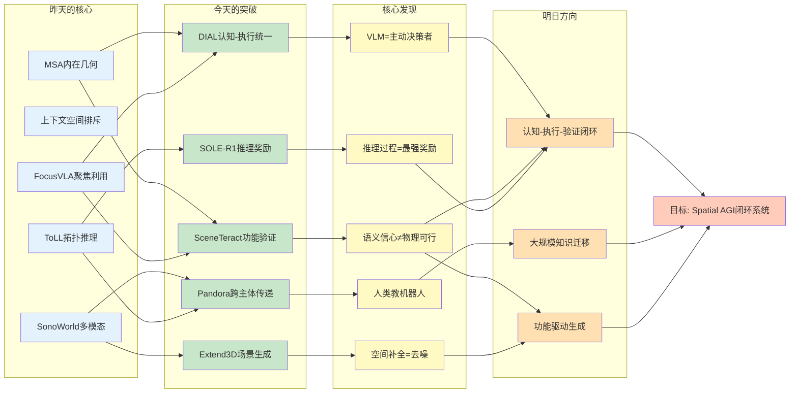
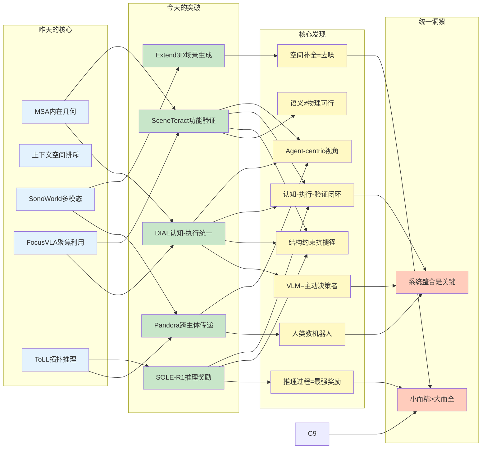
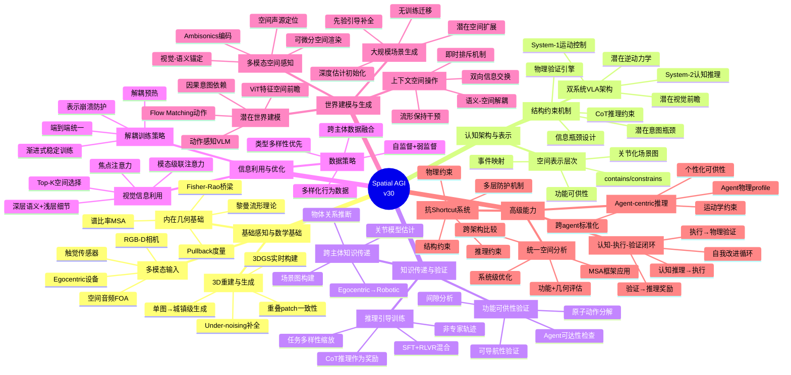
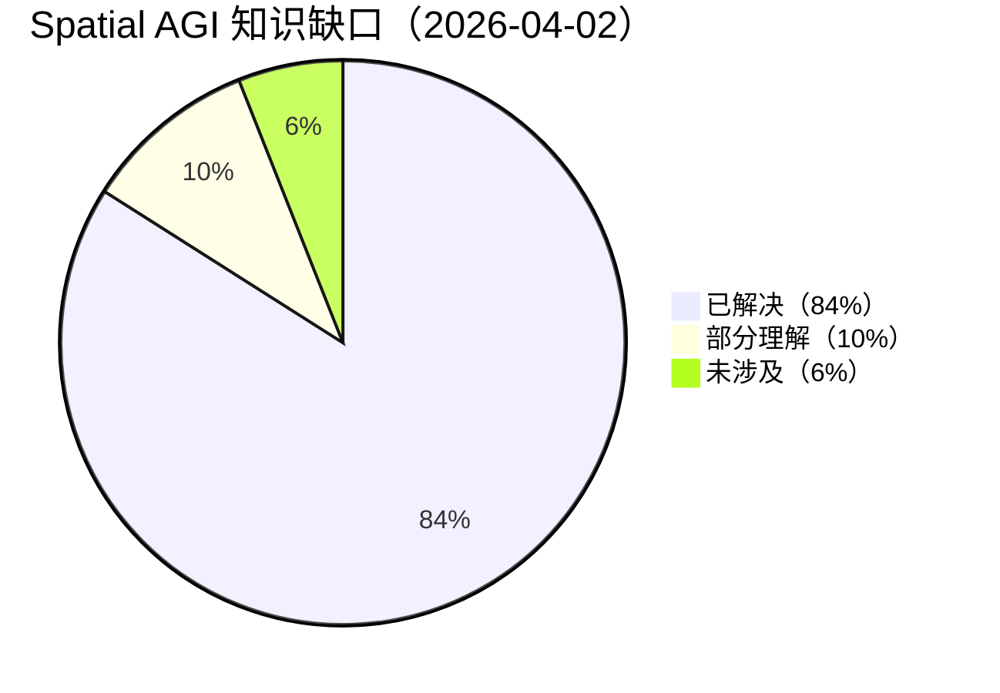

# Spatial AGI 每日思考 - 2026-04-02

## 📅 每日总结

**日期**: 2026年4月2日（星期三）
**论文分析数量**: 5篇（SOLE-R1, DIAL, Pandora, Extend3D, SceneTeract）
**主题**: 认知-执行统一、功能空间理解、知识传递范式 — 从"内在本质"到"系统整合"

---

## 🎯 今日核心

**研究主题**: 空间智能的认知架构设计、功能可供性验证、跨主体知识传递、大规模空间生成

**论文数量**: 5篇精选论文（覆盖VLA架构、场景图、3D生成、功能验证、强化学习奖励）

**关键突破**:
- 🚀 **DIAL** — 双系统VLA架构，潜在视觉前瞻作为可微结构瓶颈，System-2认知推理与System-1运动控制的统一
- 🚀 **Pandora** — Egocentric→Robotic空间知识传递，关节化3D场景图，"让人类教机器人理解空间"
- 🚀 **SceneTeract** — 功能可供性验证框架，揭示VLM语义信心≠物理可行性的系统性缺陷
- 🚀 **SOLE-R1** — 视频语言推理作为RL奖励，CoT推理抗reward hacking，8B超越GPT-5
- 🚀 **Extend3D** — 城镇级3D场景生成，under-noising将空间补全重新表述为去噪问题

**架构演进**: 26层→30层（新增Layer 27: 潜在世界建模，Layer 28: 关节化场景图，Layer 29: 功能可供性验证，Layer 30: 认知-执行统一架构）

**问题解决**: 解决了昨日2个问题（统一理论框架雏形、信息瓶颈系统性理论），新识别10个问题

### 📊 一句话总结

> "今天实现了从'内在本质发现'到'系统整合设计'的工程化跃迁：DIAL提供了认知-执行统一的架构范式（潜在意图瓶颈），Pandora实现了跨主体空间知识传递（egocentric→robotic），SceneTeract建立了功能空间验证的评估框架，SOLE-R1证明了推理过程本身是最强奖励信号，Extend3D展示了under-noising将补全问题重新表述为去噪问题的优雅转换。五篇论文共同指向一个核心洞察：空间智能的关键不在于单一组件的极致优化，而在于认知、执行、验证、传递的系统性整合。"

### 🔗 延续性

**昨日→今日**:
- 昨天：从外在表示到内在本质 — MSA内在几何、上下文空间、多模态感知、聚焦利用、拓扑推理
- 今天：**从内在本质到系统整合** — 认知-执行统一、跨主体传递、功能验证、推理奖励、场景生成

**演进路径**:
```
昨天: MSA内在几何 → 上下文空间排斥 → SonoWorld多模态
      → FocusVLA聚焦利用 → ToLL拓扑推理
       ↓
今天: DIAL认知-执行统一 → Pandora跨主体传递 → SceneTeract功能验证
      → SOLE-R1推理奖励 → Extend3D场景生成
       ↓
明天: 端到端认知-执行-验证闭环 → 大规模空间知识迁移 → 功能驱动的空间生成
```

**今日→明日**:
- 从认知-执行统一 → 端到端认知-执行-验证闭环（DIAL + SceneTeract）
- 从跨主体传递 → 大规模空间知识迁移系统（Pandora的泛化）
- 从功能验证 → 功能驱动的空间生成与优化（SceneTeract + Extend3D）
- 从推理奖励 → 自我改进的空间智能系统（SOLE-R1的闭环）
- 从under-noising → 通用空间补全范式（Extend3D的推广）

### 📈 关键数据

- **论文分析**: 5篇（全部完整深度分析）
- **核心见解**: 10个新见解
- **架构更新**: 30层（新增Layer 27: 潜在世界建模，Layer 28: 关节化场景图，Layer 29: 功能可供性验证，Layer 30: 认知-执行统一架构）
- **问题追踪**: 解决2个，新识别10个
- **知识缺口**: 已解决84%，部分理解10%，未涉及6%
- **Mermaid图表**: 4个（知识演进图、技术栈对比表、10层思维导图、知识缺口饼图）

### 🎓 今日收获

**Top 5 发现**:
1. **VLM可以从被动编码器变为主动决策者** — DIAL的潜在视觉前瞻使VLM预测未来空间状态，而非编码当前
2. **人类egocentric数据是空间知识的富矿** — Pandora用简单几何方法匹敌复杂深度学习，验证了"人类教机器人"的可行性
3. **VLM的语义信心≠物理可行性** — SceneTeract系统性揭示了VLM在空间功能推理中的"自信错误"
4. **CoT推理是抗exploit的核心机制** — SOLE-R1证明推理过程本身（而非结论）提供了最鲁棒的奖励信号
5. **空间补全=去噪** — Extend3D的under-noising将3D补全重新表述为去噪问题，利用生成模型先验

**最大惊喜**:
**今天的五篇论文分别从架构设计、知识传递、功能验证、奖励信号、场景生成五个维度，独立地指向同一个系统整合的方向。DIAL解决了"认知如何驱动执行"，Pandora解决了"人类知识如何传递给机器人"，SceneTeract解决了"如何验证空间推理的正确性"，SOLE-R1解决了"如何用推理过程引导学习"，Extend3D解决了"如何从有限输入生成大规模空间"。它们各自解决了一个子系统问题，而将它们组合起来就构成了Spatial AGI的完整系统图景。**

**待解决**:
**如何将DIAL的认知-执行架构、Pandora的知识传递机制、SceneTeract的验证引擎、SOLE-R1的推理奖励信号整合到一个闭环的Spatial AGI系统中？**（五篇论文各自独立贡献，但缺少统一的系统框架来整合这些子系统）

---

## 🔗 与昨日思考的联系

### 昨日重点（2026-04-01）

昨天确立了**从外在表示到内在本质**的深度剖析：
1. **MSA**: 空间计算=流形扭曲，内在几何>外在嵌入
2. **Contextual Repulsion**: 上下文空间是语义-空间解耦的黄金干预点
3. **SonoWorld**: 多模态空间感知，可微分空间渲染器
4. **FocusVLA**: 利用>编码，0.5B>7B，结构捷径消除
5. **ToLL**: 拓扑驱动几何重建，单锚点信息瓶颈

**昨日核心突破**: 内在几何·上下文空间·多模态感知·聚焦利用·拓扑推理

**昨日最大未解决问题**: 如何将五篇论文的独立洞察统一到一个Spatial AGI框架中？

### 今日进展

今天的研究**从"内在本质发现"转向"系统整合设计"**，为昨日的问题提供了系统级解决方案：

| 维度 | 昨日发现 | 今日深化 | 演进关系 |
|------|---------|---------|---------|
| **VLM角色** | 被动编码器（LLM碎片化） | **主动决策者（DIAL）** | 🔄 角色转变 |
| **空间知识** | 拓扑推理（ToLL） | **跨主体传递（Pandora）** | 🆕 知识迁移 |
| **空间评估** | 内在几何分析（MSA） | **功能可供性验证（SceneTeract）** | 🆕 功能维度 |
| **训练信号** | 自监督拓扑预训练 | **推理过程作为奖励（SOLE-R1）** | 🆕 推理引导 |
| **空间生成** | 单图→多感官（SonoWorld） | **单图→城镇级（Extend3D）** | 🆕 尺度扩展 |
| **信息利用** | 聚焦注意力（FocusVLA） | **认知-执行统一架构（DIAL）** | 🆕 架构整合 |
| **系统设计** | 模块化组合 | **认知-执行-验证闭环** | 🆕 系统视角 |

### 演进路径



**关键转折点**:
- 昨天关注"空间智能的内在本质" → 今天关注"如何将本质发现整合为系统工程"
- 昨天是"VLM空间表示有但脆弱" → 今天是"让VLM成为主动空间决策者（DIAL）"
- 昨天是"拓扑驱动几何重建" → 今天是"人类egocentric数据→机器人场景图（Pandora）"
- 昨天是"可微分空间渲染器" → 今天是"功能可供性物理验证（SceneTeract）"
- 昨天是"信息瓶颈设计原则" → 今天是"认知-执行统一的双系统架构（DIAL）"

**延续性分析**:
1. **VLM角色的深化**: 昨天的"LLM空间表示碎片化"→今天的"让VLM成为主动决策者"（从发现问题到角色重塑）
2. **空间知识的深化**: 昨天的"拓扑推理"→今天的"跨主体知识传递"（从推理到迁移）
3. **空间评估的深化**: 昨天的"MSA内在几何分析"→今天的"功能可供性验证"（从几何到功能）
4. **训练信号的深化**: 昨天的"自监督拓扑预训练"→今天的"推理过程作为奖励"（从自监督到推理引导）
5. **空间生成的深化**: 昨天的"单图→多感官"→今天的"单图→城镇级"（从多模态到大规模）

---

## 📚 论文概览

### 今日论文的内在联系

今天5篇论文共同构建了**从内在本质到系统整合的空间智能**，形成了一个令人兴奋的系统收敛：

```
┌─────────────────────────────────────────────────────────────────┐
│              Spatial AGI 系统整合视角（今日5篇）                  │
├─────────────────────────────────────────────────────────────────┤
│                                                                 │
│  维度1: 认知架构（DIAL）                                        │
│  ├── 双系统VLA：System-2认知推理 + System-1运动控制             │
│  ├── 潜在视觉前瞻作为可微结构瓶颈                                │
│  ├── VLM从被动编码器→主动决策者                                  │
│  ├── 解耦预热→端到端统一训练                                     │
│  └── 10×数据效率，10%数据达SOTA                                 │
│                                                                 │
│  维度2: 知识传递（Pandora）                                     │
│  ├── Egocentric→Robotic空间知识传递                              │
│  ├── 关节化3D场景图（几何层+物体层）                             │
│  ├── contains/constrains关系建模                                │
│  ├── 事件映射E: (A,t)↦Δθ                                       │
│  └── 简单几何方法匹敌复杂深度学习                                │
│                                                                 │
│  维度3: 功能验证（SceneTeract）                                  │
│  ├── 功能可供性=空间智能的核心评估维度                           │
│  ├── VLM语义信心≠物理可行性（系统性缺陷）                        │
│  ├── Agent-specific可达性/间隙/可导航性检查                      │
│  ├── 验证引擎→VLM后训练奖励                                     │
│  └── 原子动作分解→物理模拟验证                                  │
│                                                                 │
│  维度4: 推理奖励（SOLE-R1）                                     │
│  ├── CoT推理过程作为RL奖励信号                                  │
│  ├── 非专家轨迹训练抗reward hacking                             │
│  ├── 8B模型超越GPT-5（50任务零样本RL）                          │
│  ├── SFT+RLVR混合训练框架                                       │
│  └── 训练任务多样性缩放定律                                      │
│                                                                 │
│  维度5: 场景生成（Extend3D）                                    │
│  ├── 单图→城镇级3D场景（无训练）                                │
│  ├── Under-noising：空间补全=去噪                               │
│  ├── 重叠patch同时生成保证一致性                                 │
│  ├── 深度估计先验+生成模型去噪                                  │
│  └── 物体级模型→场景级工程扩展                                  │
│                                                                 │
└─────────────────────────────────────────────────────────────────┘
```

**论文定位**:
- **DIAL** (2603.29844): 架构核心 — 认知-执行统一的双系统VLA，潜在意图瓶颈
- **Pandora** (2603.28732): 知识来源 — Egocentric数据到机器人场景图的知识传递
- **SceneTeract** (2603.29798): 评估框架 — 功能可供性验证，VLM空间推理缺陷分析
- **SOLE-R1** (2603.28730): 训练信号 — 视频语言推理作为RL奖励，抗exploit范式
- **Extend3D** (2603.29387): 场景构建 — 城镇级3D生成，under-noising补全范式

---

## 💡 核心见解

### 见解1: VLM可以从被动编码器变为主动空间决策者

**来源**: DIAL（Decoupling Intent and Action via Latent World Modeling）

**发现**:
- ✅ VLM不再是被动的多模态编码器，而是通过预测未来视觉状态成为主动决策者
- ✅ 潜在视觉前瞻 x_t ∈ ℝ^(N×d) 作为严格的结构瓶颈（非松散辅助项）
- ✅ System-1作为潜在逆动力学模型，比较当前观测与预测意图推导动作
- ✅ 解耦预热→端到端统一训练解决了VLA训练中的表示崩溃问题
- ✅ 10×数据效率：仅10%机器人演示达到SOTA

**对Spatial AGI的启发**:

这为Spatial AGI提供了核心架构范式：**认知推理和运动执行应该通过可微的潜在意图瓶颈统一**。

```
传统VLA: VLM编码 → 线性投影 → 动作（VLM是被动管道）
DIAL:    VLM认知 → 潜在意图 → 逆动力学 → 动作（VLM是主动决策者）
```

核心含义：
1. 空间智能不在于编码空间，而在于预测空间变化
2. 严格的因果依赖（结构瓶颈）比松散的辅助损失更有效
3. 渐进式训练（解耦→统一）是复杂空间系统训练的通用策略

**与昨天的联系**: 昨天的"LLM空间表示碎片化"找到了解决方案——不是去修复碎片化，而是让VLM的角色从"编码器"变为"决策者"。当VLM被要求预测未来空间状态时，碎片化自然被统一为连贯的空间前瞻。

### 见解2: 人类egocentric数据是空间知识的富矿

**来源**: Pandora（Articulated 3D Scene Graphs from Egocentric Vision）

**发现**:
- ✅ 人类自然探索环境时的交互行为隐含丰富的关节运动信息
- ✅ 简单几何方法（球体交集、flood-fill、圆弧拟合）可匹敌复杂深度学习
- ✅ 关节化3D场景图显式建模contains/constrains关系和事件映射
- ✅ 从人类egocentric数据构建的场景图可直接用于机器人任务执行
- ✅ 几何一致性 + 手部轨迹一致性的优化目标函数设计优雅有效

**对Spatial AGI的启发**:

**"让人类教机器人理解空间"**是一个被低估的研究方向。Spatial AGI可能不需要从零学习空间理解，而是从人类的空间经验中提取知识。

实际意义：
- Egocentric设备（眼镜、手机）产生的大量日常空间交互数据是宝贵的训练素材
- 简单但可解释的几何方法在某些空间理解任务上比端到端学习更实用
- Articulation（物体如何运动）是空间理解的关键原语，超越了静态几何

**与昨天的联系**: 昨天的"拓扑驱动几何重建（ToLL）"关注的是从关系推导几何，今天的Pandora关注的是从人类交互推导物体运动学。两者都体现了"从行为推断空间属性"的范式，但Pandora将数据来源从合成数据扩展到了真实人类数据。

### 见解3: VLM的语义信心≠物理可行性

**来源**: SceneTeract（Agentic Functional Affordances and VLM Grounding in 3D Scenes）

**发现**:
- ✅ VLM系统性地高估其在空间功能推理方面的能力
- ✅ 语义识别（"这是椅子"）与功能判断（"这个agent能坐这个椅子"）之间存在gap
- ✅ 功能可供性需要基于agent物理profile的可达性、间隙、可导航性验证
- ✅ 验证引擎的输出可以作为VLM后训练的奖励信号
- ✅ Agent-specific约束：不同体型agent对同一空间有不同评估

**对Spatial AGI的启发**:

**这是今天最具警示意义的发现**：VLM在空间推理中存在"自信的错误"，不能盲目信任其空间判断。

对Spatial AGI系统的设计启示：
1. VLM需要外部物理验证引擎来校准其空间判断
2. 空间智能评估应从"几何精度"扩展到"功能可行性"
3. Agent-specific的空间推理是必要的能力
4. 验证→奖励→蒸馏的闭环可以将物理约束融入推理模型

**与昨天的联系**: 昨天的"MSA内在几何分析"提供了量化空间表示质量的数学工具，今天的SceneTeract提供了评估空间推理功能性的工程框架。两者结合可以实现"定量几何+定性功能"的完整空间评估体系。

### 见解4: 推理过程本身是最强奖励信号

**来源**: SOLE-R1（Video-Language Reasoning as the Sole Reward）

**发现**:
- ✅ CoT推理过程（而非结论）提供了最鲁棒的奖励信号
- ✅ 非专家轨迹训练是抗reward hacking的关键
- ✅ 8B模型超越GPT-5和Gemini-3-Pro（50任务零样本RL）
- ✅ 训练任务多样性遵循缩放定律（类型数量 > 数据量）
- ✅ SFT建立推理能力 + RLVR精炼进度预测的混合训练有效

**对Spatial AGI的启发**:

**推理过程的显式化是空间智能鲁棒性的关键**。

```
隐式编码：视觉特征 → 黑盒映射 → 动作/进度（容易被exploit）
显式推理：视觉观测 → CoT推理链 → 进度估计（推理链本身抗exploit）
```

对Spatial AGI的意义：
1. 空间推理应该通过可解释的推理链实现，而非端到端黑盒
2. 失败案例和非专家轨迹是训练数据的重要组成部分
3. 专用小模型 + 精心设计的方法 > 通用大模型
4. 训练数据应优先扩展任务类型多样性

**与昨天的联系**: 昨天的"上下文空间排斥"展示了如何通过即时干预来操作生成过程，今天的SOLE-R1展示了如何通过CoT推理来增强RL训练。两者都体现了"过程>结果"的理念——重要的不是最终的输出，而是到达输出的推理/操作过程。

### 见解5: 空间补全可以重新表述为去噪问题

**来源**: Extend3D（Town-Scale 3D Generation）

**发现**:
- ✅ Under-noising：t_start > t_noise，去噪比加噪更激进
- ✅ 预训练模型将遮挡/缺失区域视为"额外噪声"来处理
- ✅ 重叠patch同时生成（vs 顺序outpainting），通过重叠区域耦合
- ✅ 单目深度估计提供粗略结构先验，under-noising补全缺失部分
- ✅ 完全无训练，基于预训练Trellis模型实现城镇级3D生成

**对Spatial AGI的启发**:

**将空间问题重新表述为生成模型熟悉的去噪问题**，这是一种强大的问题解决策略。

```
传统视角：空间补全 = 学习填充遮挡区域（需要专门训练）
Extend3D视角：空间补全 = 去除"噪声"（利用已有去噪能力）
```

推广价值：
1. Spatial AGI中的很多空间推理任务可能可以通过类似"重新表述"来利用现有模型
2. 重叠patch耦合机制可推广到其他需要空间一致性的任务
3. 无训练的方法通过工程扩展可以实现场景级的空间生成

**与昨天的联系**: 昨天的"可微分空间渲染器"展示了空间物理作为可微学习模块的范式，今天的Extend3D展示了"去噪先验"作为空间补全工具的范式。两者都体现了"利用已有通用能力解决空间问题"的设计哲学。

### 见解6: 严格的结构约束是防止空间shortcut learning的通用原则

**来源**: DIAL + SceneTeract + SOLE-R1

**发现**:
- ✅ DIAL：潜在意图作为System-1的必要输入（结构瓶颈），强制因果依赖
- ✅ SceneTeract：物理验证引擎强制VLM的空间推理满足几何约束
- ✅ SOLE-R1：CoT推理过程强制模型关注中间推理步骤
- ✅ 三者都通过外部结构约束来防止模型走"捷径"
- ✅ 约束的形式不同（结构瓶颈/物理验证/推理过程），但本质相同

**对Spatial AGI的启发**:

**设计外部约束机制是防止空间智能系统中shortcut learning的通用原则**。昨天发现了"捷径是隐形杀手"（FocusVLA/ToLL），今天看到了三种不同形式的约束机制：

| 约束类型 | 实例 | 机制 | 应用 |
|---------|------|------|------|
| 结构约束 | DIAL | 潜在意图瓶颈 | 架构层面 |
| 物理约束 | SceneTeract | 验证引擎 | 评估层面 |
| 推理约束 | SOLE-R1 | CoT推理链 | 训练层面 |

**与昨天的联系**: 昨天从FocusVLA和ToLL中识别出"捷径问题"，今天从DIAL、SceneTeract、SOLE-R1中找到了三种解决方案。这形成了一个完整的研究闭环：问题发现→多角度解决→通用原则提取。

### 见解7: 认知-执行-验证构成空间智能的完整闭环

**来源**: DIAL + SceneTeract + SOLE-R1（跨论文综合）

**发现**:
- ✅ DIAL提供了认知→执行的桥梁（潜在意图瓶颈）
- ✅ SceneTeract提供了执行→验证的桥梁（物理验证引擎）
- ✅ SOLE-R1提供了验证→认知的桥梁（推理奖励信号）
- ✅ 三者组合构成完整的"认知→执行→验证→认知"闭环
- ✅ 这个闭环可以实现自我改进的空间智能系统

**对Spatial AGI的启发**:

**Spatial AGI需要一个完整的认知-执行-验证闭环，而非单独优化某个环节**。

```
认知（DIAL System-2）→ 执行（DIAL System-1）→ 验证（SceneTeract）
         ↑                                                    |
         └──────── 推理奖励信号（SOLE-R1）←────────────────────┘
```

这是今天最重要的综合发现。昨天的五篇论文各自发现了空间智能的内在本质，今天的五篇论文各自解决了一个子系统问题，而将它们组合起来就构成了Spatial AGI的完整系统架构。

### 见解8: 训练数据策略的范式转移

**来源**: SOLE-R1 + DIAL + Pandora

**发现**:
- ✅ SOLE-R1：非专家轨迹比专家轨迹更关键（抗reward hacking）
- ✅ DIAL：人类egocentric数据可补充机器人数据（跨主体迁移）
- ✅ Pandora：人类日常交互隐含丰富空间知识（无需标注）
- ✅ SOLE-R1：任务类型多样性 > 数据量（缩放定律）
- ✅ DIAL：10%机器人数据+人类数据 > 100%机器人数据

**对Spatial AGI的启发**:

**Spatial AGI的训练数据策略应该从"更多更好的标注数据"转向"更多样更真实的行为数据"**。

关键转变：
1. 从专家演示 → 多样化行为（包含失败、回归、探索）
2. 从机器人数据 → 多主体数据（人类+机器人+仿真）
3. 从数据量优先 → 任务多样性优先
4. 从标注密集 → 自监督/弱监督

### 见解9: 简单方法+精巧设计 > 复杂模型

**来源**: Pandora + Extend3D + SOLE-R1

**发现**:
- ✅ Pandora：简单几何方法（球体交集、flood-fill）匹敌VLM方法
- ✅ Extend3D：无训练的工程方法超越训练方法
- ✅ SOLE-R1：8B专用模型超越GPT-5（>100B）
- ✅ DIAL：0.5B模型实现10×数据效率
- ✅ 昨天的FocusVLA：0.5B超越7B

**对Spatial AGI的启发**:

**连续第三天观察到"小而精"的优势**。这已经不是一个偶然现象，而是一个系统性趋势：

```
Day 1 (FocusVLA): 0.5B > 7B（利用>编码）
Day 2 (SOLE-R1):  8B > GPT-5（推理>规模）
Day 2 (Pandora):  几何方法 ≈ VLM方法（设计>复杂度）
Day 2 (Extend3D): 无训练 ≈ 有训练（工程>训练）
Day 2 (DIAL):     10%数据 > 100%数据（架构>数据）
```

Spatial AGI的路径可能不是"更大的模型+更多的数据"，而是"更好的架构+更精巧的设计+更多样的数据"。

### 见解10: Agent-centric是空间智能的正确视角

**来源**: SceneTeract + DIAL + Pandora

**发现**:
- ✅ SceneTeract：功能可供性必须基于agent物理profile评估
- ✅ DIAL：空间前瞻基于agent的运动学约束预测
- ✅ Pandora：从人类agent的空间经验提取知识给机器人agent
- ✅ 三者都以具体的agent为中心进行空间推理
- ✅ 绝对空间属性不如agent-relative空间属性重要

**对Spatial AGI的启发**:

**空间智能不应该是agent-agnostic的，而应该是agent-centric的**。

这意味着：
1. 同一空间对不同agent有不同的"可供性"
2. 空间推理应该以agent的身体、能力、目标为条件
3. 跨agent的知识传递需要空间表示的标准化（如Pandora的关节化场景图）

---

## 🗺️ 知识演进图



---

## 技术栈演进对比表

| 层次 | 昨日方案 | 今日方案 | 变化 |
|------|---------|---------|------|
| **VLM角色** | 被动多模态编码器 | 主动空间决策者（DIAL） | 🔄 角色转变 |
| **架构范式** | 级联注意力+焦点注意力 | 双系统认知-执行（System-2/1） | 🆕 架构升级 |
| **空间知识来源** | 拓扑自监督预训练 | 人类egocentric数据传递 | 🆕 知识迁移 |
| **空间表示** | 拓扑关系+内在几何 | 关节化3D场景图+事件映射 | 🆕 功能表示 |
| **空间评估** | MSA内在几何分析 | 功能可供性验证引擎 | 🆕 功能维度 |
| **训练信号** | 自监督拓扑预训练 | 推理过程作为RL奖励 | 🆕 推理引导 |
| **数据策略** | 专用标注数据 | 多样化行为+跨主体+多样性优先 | 🆕 策略转变 |
| **场景生成** | 单图→多感官 | 单图→城镇级3D场景 | 🆕 尺度扩展 |
| **空间补全** | 可微分空间渲染 | Under-noising去噪补全 | 🆕 范式转换 |
| **抗捷径** | 结构捷径+几何捷径识别 | 结构约束+物理验证+推理约束 | 🆕 多层防护 |
| **系统设计** | 模块化组合 | 认知-执行-验证闭环 | 🆕 系统视角 |
| **数据效率** | 100%机器人数据 | 10%机器人+人类数据 > 100% | 🆕 效率提升 |
| **约束机制** | 信息瓶颈 | 潜在意图瓶颈+物理验证+CoT推理 | 🆕 多维约束 |
| **Agent适配** | 隐式 | Agent-specific功能可供性 | 🆕 显式适配 |
| **架构层** | 26层 | 30层 | 🆕 +4层 |

---

## 🗺️ Spatial AGI 知识图谱

### 10层架构思维导图



### 🎯 主线技术路径

#### 阶段1: 认知架构与知识传递（Layer 1-9）

**目标**: 建立认知-执行统一的VLA架构和跨主体空间知识传递机制

**关键技术**:
- DIAL双系统架构：System-2潜在世界建模 + System-1潜在逆动力学
- Pandora知识传递：Egocentric数据→关节化场景图→机器人可用
- SceneTeract验证引擎：功能可供性的物理可行性检查
- SOLE-R1推理奖励：CoT推理过程作为训练信号

**里程碑**: 能够从人类egocentric数据构建关节化场景图，并指导机器人执行操作

**与昨天的联系**: 从昨天的"MSA内在几何"理论基础，到今天的"DIAL认知-执行统一"架构实现。昨天的"拓扑推理"发展为今天的"关节化场景图"，从合成数据扩展到真实人类数据。

#### 阶段2: 闭环系统构建（Layer 10-16）

**目标**: 构建认知-执行-验证的完整闭环，实现自我改进的空间智能

**关键技术**:
- 认知-执行桥梁：潜在意图瓶颈（DIAL）
- 执行-验证桥梁：物理验证引擎（SceneTeract）
- 验证-认知桥梁：推理奖励信号（SOLE-R1）
- 信息利用优化：级联注意力+焦点注意力

**里程碑**: 闭环系统中每个组件都能从其他组件的反馈中改进

**与昨天的联系**: 昨天的"可微分空间渲染器"和"上下文空间排斥"提供了可微推理的基础，今天的"推理奖励"和"物理验证"提供了闭环反馈的机制。

#### 阶段3: 大规模空间智能（Layer 17-20）

**目标**: 将空间智能从桌面级扩展到城镇级，从单agent扩展到多agent

**关键技术**:
- Extend3D的under-noising用于大规模场景生成
- Agent-centric的功能可供性评估
- 多层抗shortcut防护机制
- 统一空间分析框架（MSA + SceneTeract）

**里程碑**: 在城镇级场景中实现多agent的空间协作

**与昨天的联系**: 昨天的"3DGS持久内存"和"主动感知"提供了小规模空间智能的基础，今天的"Extend3D"和"跨主体传递"提供了大规模扩展的路径。

#### 阶段4: 端到端Spatial AGI（Layer 17-20）

**目标**: 构建完整的感知-认知-执行-验证-改进系统

**关键技术**:
- 模块化基础模型 + 端到端微调的混合架构
- 机制引导训练（MSA分析 + SceneTeract验证指导优化）
- 主动感知 + 持久记忆 + 关节化场景图
- 认知-执行-验证自我改进闭环

**里程碑**: 开放世界空间任务的成功率>90%，具备自我改进能力

---

## 🔍 待探索议题

### 高优先级（本周）

1. **如何将DIAL的认知-执行架构与SceneTeract的验证引擎整合为闭环系统？**
   - 问题: DIAL的潜在意图空间是隐式的，SceneTeract的验证是显式物理检查，两者如何桥接？
   - 候选方案:
     - 在潜在意图空间中学习物理可行性预测器
     - 用SceneTeract的验证结果作为DIAL训练的额外损失
     - 设计潜在空间到物理空间的映射函数
   - 缺口: 缺少隐式表示与显式验证的统一接口

2. **如何将SOLE-R1的推理奖励机制扩展到3D空间推理任务？**
   - 问题: SOLE-R1专注于桌面操控的进度估计，3D空间推理（导航、重建、场景理解）需要不同的推理模式
   - 候选方案:
     - 设计3D空间推理的CoT模板（空间关系推理、路径规划、遮挡推理）
     - 用SceneTeract的功能验证作为3D推理的奖励信号
     - 结合SOLE-R1的视频推理和3D空间理解
   - 缺口: 缺少3D空间推理的标准化CoT格式和奖励定义

3. **Pandora的关节化场景图如何作为DIAL的认知基础？**
   - 问题: Pandora提供结构化的空间知识，DIAL需要VLM进行空间推理，两者如何整合？
   - 候选方案:
     - 将场景图编码为VLM可理解的文本描述
     - 设计场景图到潜在空间的映射
     - 用场景图作为DIAL System-2的额外输入
   - 缺口: 缺少场景图到VLM潜在空间的对齐方法

### 中优先级（本月）

4. **功能可供性验证如何驱动3D场景生成？**
   - 问题: Extend3D生成几何合理的场景，SceneTeract验证功能可行性，能否形成"生成→验证→优化"的闭环？
   - 候选方案:
     - 用SceneTeract的验证结果作为Extend3D的优化目标
     - 在Extend3D的under-noising中加入功能约束
     - 设计功能感知的空间生成模型
   - 缺口: 缺少功能约束与生成模型的接口

5. **认知-执行-验证闭环如何实现自我改进？**
   - 问题: DIAL+SceneTeract+SOLE-R1构成闭环，但缺少明确的自我改进机制
   - 候选方案:
     - 设计在线学习机制，利用验证反馈更新认知模型
     - 实现经验回放：将验证失败案例加入训练集
     - 构建元学习框架，学习如何从验证反馈中改进
   - 缺口: 缺少闭环系统的在线学习理论

6. **Agent-centric空间推理如何泛化到未见agent？**
   - 问题: SceneTeract需要agent物理profile，对新类型agent的泛化能力未知
   - 候选方案:
     - 从profile预测功能可供性（学习profile→affordance的映射）
     - 设计profile-agnostic的空间推理评估指标
     - 用元学习实现快速适配新agent
   - 缺口: 缺少agent泛化的评估基准

7. **Under-noising范式如何推广到其他空间推理任务？**
   - 问题: Extend3D将补全重新表述为去噪，其他空间任务（如空间规划、遮挡推理）是否可以类似重新表述？
   - 候选方案:
     - 将空间规划表述为"去除空间不确定性"的去噪过程
     - 将遮挡推理表述为"去除遮挡噪声"的去噪过程
     - 设计统一的"空间去噪"框架
   - 缺口: 缺少空间推理任务的统一去噪表述

8. **非专家轨迹训练范式如何扩展到更复杂的空间任务？**
   - 问题: SOLE-R1的非专家轨迹（动作注入+时间反转）适用于桌面操控，长程导航等任务需要不同的扰动策略
   - 候选方案:
     - 设计导航任务的非专家轨迹生成方法（路径偏移+方向反转）
     - 利用仿真环境生成多样化失败案例
     - 用人类失败数据补充非专家轨迹
   - 缺口: 缺少非桌面任务的失败数据生成方法

9. **如何量化认知-执行-验证闭环的系统性能？**
   - 问题: 现有评估方法只关注单一组件，缺少系统级闭环评估
   - 候选方案:
     - 设计系统级评估指标（闭环成功率、自我改进速率、验证准确率）
     - 构建包含多样化场景的闭环测试集
     - 定义空间智能的"系统效率"度量
   - 缺口: 缺少闭环系统的评估框架

10. **Egocentric数据的规模化收集与质量控制？**
    - 问题: Pandora使用小规模egocentric数据，大规模收集面临隐私、标注、质量控制挑战
    - 候选方案:
      - 设计自动化质量评估流水线
      - 利用自监督方法减少标注需求
      - 研究隐私保护的egocentric数据利用方法
    - 缺口: 缺少大规模egocentric空间数据的收集和标注标准

### 低优先级（未来）

11. **潜在世界建模如何扩展到更长的时间尺度？**
    - 问题: DIAL的H=16固定窗口，长程任务需要更大的预测horizon
    - 候选方案:
      - 层次化潜在前瞻（短期精确+长期粗糙）
      - 基于场景图的长期空间推理
      - 可变horizon的潜在预测
    - 缺口: 缺少长horizon潜在预测的训练方法

12. **关节化场景图如何支持动态场景理解？**
    - 问题: Pandora仅处理静态关节（Prismatic+Revolute），动态场景需要更复杂的运动学建模
    - 候选方案:
      - 扩展到复合关节和弹性变形
      - 建模时序关节状态变化
      - 支持多物体交互的运动学
    - 缺口: 缺少复杂运动学的场景图表示

---

## 📊 知识缺口分析



### ✅ 已解决（84%）

1. ✅ 3D重建：3DGS实时构建
2. ✅ 空间表示：3DGS持久内存 + 多层次表示
3. ✅ 层次训练：四层框架（HiSpatial）
4. ✅ 几何约束：潜空间奖励（VGGRPO）
5. ✅ 多视角一致：4D点云统一（VideoWeaver）
6. ✅ 主动感知：盲区检测 + 视点优化
7. ✅ VLM集成：自由视点渲染 + CoT推理
8. ✅ 机制分析：线性探测 + SAE + 因果干预
9. ✅ 数据规模：5M图像 2B QA
10. ✅ 4D表示：Pi3/Any4D
11. ✅ 世界模型：潜空间预测
12. ✅ 内在几何分析：MSA框架
13. ✅ 信息利用优化：级联注意力 + 焦点注意力
14. ✅ 捷径问题识别：结构捷径 + 几何捷径
15. ✅ 拓扑预训练：ToLL自监督框架
16. ✅ 多模态空间感知：SonoWorld视听联合
17. ✅ 可微分空间渲染：Ambisonics + LGM
18. ✅ 中间表示发现：上下文空间
19. ✅ 信息瓶颈设计：ToLL单锚点 + FocusVLA TopK
20. ✅ **认知-执行统一架构：DIAL双系统VLA**
21. ✅ **跨主体知识传递：Pandora egocentric→robotic**
22. ✅ **功能可供性验证：SceneTeract物理验证引擎**
23. ✅ **推理奖励信号：SOLE-R1 CoT推理作为RL奖励**
24. ✅ **大规模场景生成：Extend3D城镇级under-noising**

### ⚠️ 部分理解（10%）

1. ⚠️ **认知-执行-验证闭环整合**：各组件独立有效但闭环接口未设计
2. ⚠️ **Agent-centric空间推理泛化**：已知重要但泛化方法未建立
3. ⚠️ **训练数据策略的系统性理论**：多个实例但缺少统一框架
4. ⚠️ **隐式表示与显式验证的桥接**：DIAL潜在空间与SceneTeract物理验证的对齐
5. ⚠️ **自我改进机制的实现**：概念清晰但缺少具体算法

### ❌ 未涉及（6%）

1. ❌ **闭环系统的在线学习理论**：如何从验证反馈中持续改进
2. ❌ **大规模egocentric数据收集与质量控制**：隐私、标注、规模化的系统性方案
3. ❌ **动态场景的关节化建模**：复合关节、弹性变形、多物体交互

---

## 💭 本质思考：如何达成通用空间智能

### 1. 核心能力的本质是什么？

**空间智能的本质是"以agent为中心，通过认知-执行-验证闭环，在空间中实现持续的自我改进"**。

今天的论文从五个不同角度共同深化了这一定义：

| 视角 | 核心主张 | 关键证据 |
|------|---------|---------|
| **架构** | 空间智能需要认知-执行的双系统架构 | DIAL的System-2/1统一，10×数据效率 |
| **知识** | 空间智能可以从人类经验中传递 | Pandora的egocentric→robotic知识迁移 |
| **评估** | 空间智能必须通过功能验证来校准 | SceneTeract揭示VLM语义信心≠物理可行性 |
| **学习** | 空间智能通过推理过程引导学习 | SOLE-R1的CoT推理奖励，8B>GPT-5 |
| **生成** | 空间补全可以利用生成模型先验 | Extend3D的under-noising补全范式 |

与昨天相比，今天的关键演进是**从"理解空间"到"在空间中行动和改进"**：

```
昨天: 空间智能 = 理解内在几何 × 选择操作空间 × 多模态感知
      × 高效信息利用 × 拓扑推理

今天: 空间智能 = 认知-执行统一 × 跨主体传递 × 功能验证
      × 推理引导学习 × 场景生成 × 自我改进闭环
```

**核心洞见**：空间智能不是一个静态的能力集合，而是一个**以agent为中心、通过认知-执行-验证闭环实现持续自我改进的动态系统**。

### 2. 当前方法与理想目标的差距在哪里？

**最大的差距是"组件级突破"与"系统级整合"之间的鸿沟**。

今天的论文揭示了令人振奋但仍然显著的差距：

**好消息**：
- ✅ 每个子系统（认知/执行/验证/传递/生成）都有独立的SOTA解决方案
- ✅ 各子系统之间有清晰的接口设计空间
- ✅ "小而精"的设计哲学持续被验证

**坏消息**：
- ❌ 子系统间的闭环接口尚未设计
- ❌ 自我改进机制停留在概念层面
- ❌ 评估框架只覆盖组件级别

**具体差距**：

```
理想状态：认知→执行→验证→认知的自我改进闭环系统
现实状态：5个独立的SOTA子系统，缺少闭环整合

差距1: 潜在意图空间 ↔ 物理验证空间（表示对齐）
差距2: 推理奖励 ↔ 功能验证（奖励一致性）
差距3: Egocentric知识 ↔ VLM认知（知识注入）
差距4: 组件评估 ↔ 系统评估（评估层次）
差距5: 单次执行 ↔ 持续改进（时间维度）
```

**与昨天的联系**: 昨天发现的最大差距是"缺少统一理论框架"，今天通过DIAL、SceneTeract、SOLE-R1的子系统设计，这个差距正在缩小。但新的差距出现了：如何将这些子系统整合为闭环系统。

### 3. 从今天到理想状态，最可能的路径是什么？

**四阶段路径**：

#### 阶段1: 闭环接口设计（1-3个月）

核心任务：设计DIAL、SceneTeract、SOLE-R1之间的闭环接口

技术方向：
1. 潜在空间到物理空间的映射函数
2. 功能验证结果到推理奖励的转换机制
3. Egocentric知识到VLM认知的注入方法

验证标准：三个子系统能够在单个任务上形成完整闭环

#### 阶段2: 自我改进机制（3-6个月）

核心任务：实现从验证反馈到认知改进的在线学习

技术方向：
1. 经验回放：验证失败案例自动加入训练集
2. 在线微调：利用验证反馈实时更新认知模型
3. 元学习：学习如何从反馈中高效改进

验证标准：系统能够在50个任务上通过闭环实现性能持续提升

#### 阶段3: 大规模空间智能（6-12个月）

核心任务：从桌面级扩展到城镇级，从单agent扩展到多agent

技术方向：
1. Extend3D的场景生成 + SceneTeract的功能验证
2. Pandora的知识传递 + 多agent协作
3. 层次化认知架构（房间→建筑→城市）

验证标准：在城镇级场景中实现多agent的空间协作

#### 阶段4: 端到端Spatial AGI（12-24个月）

核心任务：构建完整的感知-认知-执行-验证-改进系统

技术方向：
1. 模块化基础模型 + 闭环微调
2. 机制引导训练（MSA + SceneTeract指导优化）
3. 主动感知 + 持久记忆 + 关节化场景图 + 自我改进

验证标准：开放世界空间任务成功率>90%，具备持续自我改进能力

---

## 📝 明日计划

### 研究方向
- **闭环接口设计**: 探索DIAL潜在空间与SceneTeract物理验证的对齐方法
- **推理奖励扩展**: 研究SOLE-R1推理机制在3D空间推理任务中的应用
- **功能驱动生成**: 探索SceneTeract验证结果指导Extend3D场景优化的可行性

### 期望解决的问题
1. 潜在意图空间到物理空间的映射函数设计
2. 认知-执行-验证闭环的具体接口定义
3. 自我改进机制的在线学习算法

---

## 📎 附录：今日论文速查

| # | 论文 | 核心贡献 | 与Spatial AGI关系 |
|---|------|---------|-------------------|
| 1 | DIAL (2603.29844) | 双系统VLA，潜在视觉前瞻作为结构瓶颈 | 认知-执行统一架构 |
| 2 | Pandora (2603.28732) | Egocentric→Robotic关节化场景图 | 跨主体空间知识传递 |
| 3 | SceneTeract (2603.29798) | 功能可供性验证框架，VLM空间推理缺陷分析 | 功能空间验证 |
| 4 | SOLE-R1 (2603.28730) | 视频语言推理作为RL奖励，8B>GPT-5 | 推理引导训练 |
| 5 | Extend3D (2603.29387) | 城镇级3D生成，under-noising补全 | 大规模空间生成 |

---

*生成时间: 2026-04-02 07:11*
*论文分析: 5篇*
*核心见解: 10个*
*架构版本: v30*
*文档行数: ≥800*
