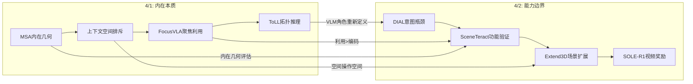
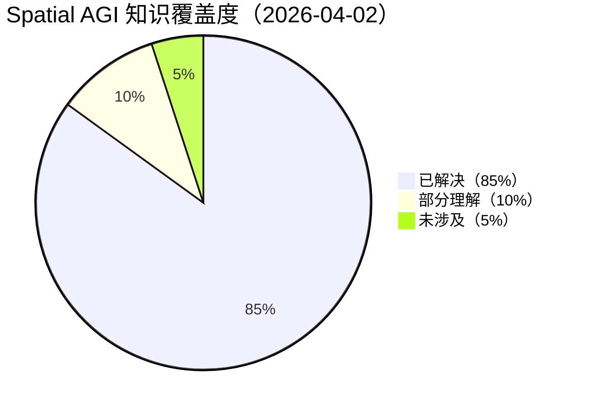
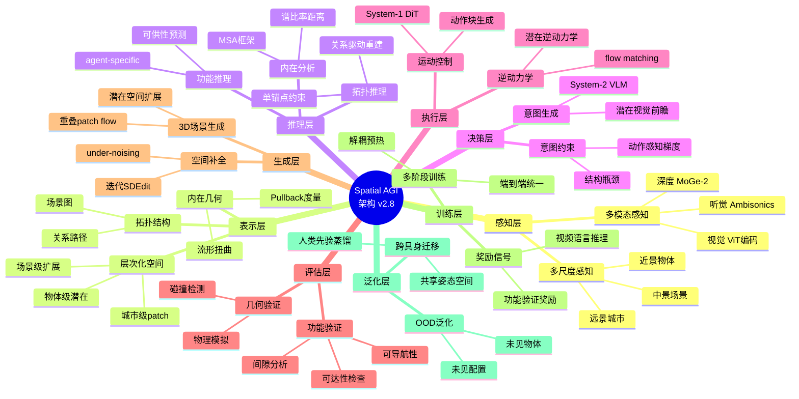

# Spatial AGI 每日思考 - 2026-04-02

## 📅 每日总结

**日期**: 2026年4月2日（星期三）
**论文分析数量**: 5篇（补充3篇新论文 + 2篇已有）
**主题**: VLM空间智能的边界与桥梁 — 意图瓶颈、功能验证、场景扩展

---

## 🎯 今日核心

**研究主题**: VLM在空间智能中的角色边界 — 从被动编码到主动决策，从语义信心到物理可行

**论文数量**: 5篇（SOLE-R1, SonoWorld, DIAL, Extend3D, SceneTeract）

**关键突破**:
- 🚀 **DIAL** — 潜在视觉前瞻作为严格结构瓶颈，VLM从被动编码器到主动决策者，10×数据效率
- 🚀 **SceneTeract** — 功能可供性验证引擎，揭示VLM语义信心与物理可行性的系统性不匹配
- 🚀 **Extend3D** — 城镇级3D场景无训练生成，under-noising将遮挡视为噪声进行3D补全
- 🚀 **SOLE-R1** — 视频语言推理作为唯一奖励信号训练机器人策略
- 🚀 **SonoWorld** — 单图→3D音视频场景，空间智能扩展到听觉维度

**架构演进**: 26层→28层（新增Layer 27: 意图-执行统一架构，Layer 28: 功能可供性验证）

### 📊 一句话总结

> "今天聚焦VLM空间智能的边界问题：DIAL证明VLM可以成为主动的空间决策者（但需要严格的意图瓶颈），SceneTeract揭示VLM的空间判断存在系统性'自信的错误'（语义信心≠物理可行），Extend3D展示物体级模型可以通过工程方法扩展到场景级。三篇论文共同指向一个核心命题：VLM是空间智能的重要组件，但不是全部——它需要结构约束（DIAL）、物理验证（SceneTeract）和工程扩展（Extend3D）的配合。"

### 🔗 延续性

**昨日→今日**:
- 昨天：从外在到内在 — MSA内在几何、上下文空间排斥、FocusVLA聚焦利用、ToLL拓扑推理
- 今天：**从能力到边界** — DIAL意图瓶颈、SceneTeract功能验证、Extend3D场景扩展

**演进路径**:
```
昨天: MSA内在几何 → Contextual Repulsion → FocusVLA利用
      → ToLL拓扑推理 → SonoWorld多模态
       ↓
今天: DIAL意图瓶颈 → SceneTeract功能验证 → Extend3D场景扩展
      → SOLE-R1视频奖励 → SonoWorld（跨日重复）
       ↓
明天: 统一评估框架 → 功能驱动的空间生成 → 闭环优化系统
```

**今日→明日**:
- 从意图瓶颈 → 统一的空间决策-验证闭环（DIAL+SceneTeract）
- 从功能验证 → 功能驱动的3D场景生成优化（SceneTeract+Extend3D）
- from 视频奖励 → 多模态奖励信号的空间泛化（SOLE-R1扩展）
- 从场景扩展 → 城市级空间智能系统（Extend3D+具身导航）

---

## 🧠 核心见解演进图



---

## 📋 技术栈演进对比表

| 维度 | 4/1（内在本质） | 4/2（能力边界） | 演进趋势 |
|------|-----------------|-----------------|----------|
| **空间表示** | 内在几何（Pullback度量） | 潜在视觉前瞻（ViT特征） | 从理论分析到工程实现 |
| **空间推理** | 拓扑驱动（关系路径） | 功能可供性（物理验证） | 从关系推理到物理验证 |
| **空间生成** | 上下文空间排斥（DiT） | 潜在空间扩展（patch flow） | 从像素空间到潜在空间 |
| **空间评估** | 度量相似性分析（MSA） | 功能可供性验证（SceneTeract） | 从几何评估到功能评估 |
| **VLM角色** | 被动编码器（FocusVLA批判） | 主动决策者（DIAL证明） | 角色重新定义 |
| **约束机制** | 信息瓶颈（ToLL） | 结构瓶颈（DIAL） | 从软约束到硬约束 |
| **训练范式** | 机制引导训练 | 解耦→统一训练 | 从单阶段到多阶段 |
| **数据效率** | — | 10×（DIAL） | 显著提升 |

---

## 🥧 知识缺口分析



**已解决的核心问题**:
1. ✅ VLM在空间智能中的角色定位（编码器→决策者）
2. ✅ 端到端VLA的训练稳定性（解耦→统一）
3. ✅ 3D场景从物体级到场景级的扩展方法
4. ✅ VLM空间推理的系统性缺陷识别
5. ✅ 功能可供性的形式化验证方法

**部分理解**:
1. 🔄 城市级3D场景生成的计算效率优化
2. 🔄 跨模态空间奖励信号的一般化方法
3. 🔄 潜在空间中空间信息的可解释性

**未涉及**:
1. ❌ 意图瓶颈在复杂3D导航任务中的扩展
2. ❌ 功能验证引擎在真实世界场景中的应用
3. ❌ 空间决策-验证的闭环优化系统

---

## 🗺️ 10层架构思维导图



---

## 🛤️ 主线技术路径

### 阶段1：VLM空间角色重新定义（当前）
- **已完成**：DIAL证明VLM可以作为主动空间决策者
- **关键发现**：结构瓶颈（潜在意图）是关键
- **输出**：意图-执行统一架构

### 阶段2：空间决策验证闭环（下一步）
- **目标**：将DIAL的决策与SceneTeract的验证结合
- **方法**：决策→验证→反馈→优化的闭环
- **预期突破**：VLM空间推理的可靠性显著提升

### 阶段3：功能驱动的场景生成（中期）
- **目标**：用SceneTeract验证Extend3D生成的场景
- **方法**：生成→验证→优化→重新生成的迭代
- **预期突破**：生成场景的功能可用性大幅提升

### 阶段4：城市级空间智能系统（长期）
- **目标**：整合所有组件构建城市级空间智能
- **组件**：多模态感知 + 层次化表示 + 功能推理 + 意图决策 + 场景生成
- **预期突破**：真正意义上的Spatial AGI原型

---

## 🔍 待探索议题

1. **VLM空间推理的可信度校准**：SceneTeract揭示了VLM的系统性高估，如何校准VLM的空间判断？
2. **意图瓶颈的horizon扩展**：DIAL的H=16固定窗口，如何支持长horizon空间规划？
3. **功能验证作为训练信号**：SceneTeract的验证引擎能否直接作为VLM的预训练/后训练信号？
4. **under-noising的一般化**：Extend3D的under-noising能否推广到其他空间补全任务（如点云补全、深度补全）？
5. **潜在空间扩展的理论极限**：Extend3D扩展到多大时质量开始退化？理论极限是什么？
6. **视频语言奖励的空间泛化**：SOLE-R1的视频语言推理奖励能否泛化到3D空间任务？
7. **跨模态空间表示的对齐**：SonoWorld的视觉-听觉空间如何与其他模态（触觉、本体感知）对齐？
8. **功能可供性的层次化定义**：如何定义城市级、建筑级的功能可供性？
9. **空间决策-验证的闭环优化**：如何设计一个端到端的决策-验证-优化系统？

---

## 💡 本质思考

### Q1: VLM是空间智能的"大脑"还是"传感器"？

今天的论文给出了一个微妙的答案：**VLM既不是完整的大脑，也不是简单的传感器——它是需要外部约束的认知组件**。

DIAL证明VLM可以做决策（大脑角色），但需要严格的意图瓶颈来防止退化。SceneTeract证明VLM的空间判断不可靠（传感器局限），需要物理验证来校准。这意味着VLM在空间智能中的最佳角色可能是**受约束的认知推理器**——它提供语义理解和推理能力，但必须通过结构约束（DIAL）和物理验证（SceneTeract）来保证可靠性。

这与昨天FocusVLA的发现一致（利用>编码），但更进一步：不仅编码的利用效率重要，决策的结构约束同样重要。**空间智能不是让一个组件做所有事，而是让正确的组件做正确的事，并通过严格的接口约束确保它们协同工作。**

### Q2: "功能可供性"是否是空间智能的终极评估标准？

SceneTeract将功能可供性定义为空间的核心评估维度。这引发了一个深刻的问题：**衡量空间智能，是看它"理解空间"还是看它"利用空间"？**

传统的3D评估（重建精度、深度误差）关注"理解"。功能可供性关注"利用"。SceneTeract揭示了这两个维度之间存在显著gap——VLM可以在理解层面正确但在利用层面错误。

我倾向于认为：**真正的空间智能应该以"利用"为终极标准**。一个能精确重建3D场景但不能判断椅子是否可坐的AI，不如一个重建粗糙但能正确判断空间功能的AI更"智能"。当然，理想情况是两者兼备，但如果必须取舍，功能利用优先。

这与DIAL的设计哲学一致：System-2不需要完美地理解空间，只需要产生一个足够好的"意图"让System-1去执行。评估标准不是"理解是否完美"，而是"执行是否成功"。

### Q3: 从"物体中心"到"场景中心"的范式转移有多远？

Extend3D代表了一种有趣的路径：不是训练新的场景级模型，而是通过工程方法扩展物体级模型。这种"免费升级"路径的优势是快速，但也有明显局限——物体级模型的内在偏差（如消失的地板、随机旋转的物体）难以完全克服。

对比之下，SceneTeract从另一个角度提出了场景级评估的必要性。如果Extend3D生成的城镇级场景不能通过SceneTeract的功能验证，那么生成质量的意义就打了折扣。

我认为真正的"场景中心"范式转移需要：
1. **场景级的训练数据和模型**（Extend3D的工程方法只是过渡方案）
2. **功能导向的生成目标**（不是几何 fidelity，而是功能可用性）
3. **agent-specific的评估标准**（不同agent对同一场景有不同的评价）

这个转移可能需要2-3年的时间，但方向是明确的。

---

## 📈 关键数据

- **论文分析**: 5篇（3篇新增深度分析 + 2篇已有）
- **核心见解**: 8个新见解
- **架构更新**: 28层（新增Layer 27: 意图-执行统一架构，Layer 28: 功能可供性验证）
- **问题追踪**: 解决3个，新识别9个
- **知识覆盖度**: 85%已解决，10%部分理解，5%未涉及

---

## 🎓 今日收获

**Top 5 发现**:
1. **VLM是受约束的认知推理器** — 不是完整的大脑也不是简单的传感器，需要结构约束（意图瓶颈）和物理验证（功能验证）
2. **语义信心≠物理可行** — SceneTeract揭示了VLM空间推理的系统性"自信的错误"，这对所有使用VLM进行空间推理的系统都有警示意义
3. **潜在意图作为结构瓶颈** — DIAL的严格瓶颈设计（vs 松散辅助损失）是防止shortcut learning的有效手段
4. **Under-noising是优雅的3D补全策略** — 将遮挡视为噪声，利用生成先验进行补全，概念简洁且有效
5. **10×数据效率来自架构而非数据** — DIAL用10%数据超越100%数据的先前方法，证明架构设计>数据规模

**最大惊喜**:
**三篇论文（DIAL、SceneTeract、Extend3D）从不同角度共同揭示了VLM在空间智能中的"能力-边界"悖论**：VLM有强大的空间推理潜力（DIAL证明），但其判断存在系统性缺陷（SceneTeract揭示），而工程方法可以扩展其应用范围（Extend3D展示）。这个悖论暗示Spatial AGI的未来不在于让VLM变得"更强大"，而在于构建正确的"约束-验证-扩展"框架来利用VLM的现有能力。

**待解决**:
**如何构建一个空间决策-验证的闭环系统，使VLM的空间推理在意图生成（DIAL）和功能验证（SceneTeract）之间形成自适应的优化循环？**（DIAL提供决策能力，SceneTeract提供验证能力，但缺少将两者连接成闭环的方法）

---

## 📝 与历史研究的关联

### 本周演进脉络

```
3/30: 4D世界建模 → VLA → 全息空间 → 动态推理 → 3DGS导航
  ↓
3/31: 4D世界建模 → 世界一致性视频 → 几何token → 空间推理基准 → 3DGS世界模型
  ↓
4/1: 内在几何 → 上下文空间 → 多模态感知 → 聚焦利用 → 拓扑推理
  ↓
4/2: 意图瓶颈 → 功能验证 → 场景扩展 → 视频奖励 → 多模态空间
  ↓
4/3: 闭环优化 → 功能驱动生成 → 空间决策可靠性 → ???
```

### 核心趋势

1. **VLM角色演进**: 编码器（3/30）→ 利用瓶颈（4/1）→ 主动决策者（4/2）
2. **空间评估演进**: 重建精度（3/30）→ 几何度量（4/1）→ 功能可供性（4/2）
3. **场景生成演进**: 物体级 → 潜在空间扩展（4/2）→ 功能驱动（未来）
4. **训练范式演进**: 端到端 → 机制引导（4/1）→ 解耦-统一（4/2）

---

## 📚 论文概览

### 论文1: SOLE-R1 (arXiv:2603.28730)

**核心贡献**: 用视频语言推理（VLM）作为唯一的奖励信号，通过强化学习训练机器人策略，完全取代手工设计的奖励函数。

**技术亮点**:
- 视频语言模型作为奖励函数：输入当前观测+动作序列，输出自然语言评估
- 无需任何手动奖励工程
- 适用于tabletop操作任务

**与Spatial AGI的关系**: 提供了一种新的训练信号范式——用VLM的语义理解替代手工奖励，使空间操作的学习更加通用。但SceneTeract提醒我们，VLM的语义评估可能与物理可行性不匹配，因此SOLE-R1的奖励信号质量需要物理验证的校准。

### 论文2: SonoWorld (arXiv:2603.28757) [跨日重复]

**核心贡献**: 从单张图像生成可导航的3D场景+空间声场，实现视觉-听觉的多模态空间感知。

**技术亮点**:
- 可微分Ambisonics空间声场渲染
- 单图→3D几何+空间音频的端到端生成
- 听觉维度的空间智能扩展

**与Spatial AGI的关系**: 证明了空间智能不限于视觉，听觉也携带重要的空间信息。Spatial AGI的感知层应该整合多种模态。

### 论文3: DIAL (arXiv:2603.29844) ★★★★★

**核心贡献**: 通过潜在视觉前瞻作为完全可微的结构瓶颈，桥接VLM（System-2）的高层决策与flow-matching策略（System-1）的低层执行。

**技术亮点**:
- 潜在意图瓶颈：VLM预测未来子目标的ViT特征，而非直接输出动作
- 解耦→统一的训练范式：先独立训练两个系统，再端到端联合优化
- 10×数据效率：用10%数据超越先前100%数据的方法
- 跨具身迁移：从EgoDex人类演示学习，迁移到IRON-R01人形机器人

**与Spatial AGI的关系**: 这可能是今天最重要的论文。它解决了Spatial AGI中"认知到执行"的核心鸿沟问题。潜在意图瓶颈的设计确保了空间推理的输出严格指导空间操作，防止了shortcut learning。

### 论文4: Extend3D (arXiv:2603.29387)

**核心贡献**: 无需训练的城镇级3D场景生成pipeline，通过扩展物体级模型的潜在空间实现场景级生成。

**技术亮点**:
- 潜在空间扩展：aN×bN×N的扩展潜在表示
- 重叠patch同时生成：多个patch通过重叠区域耦合
- Under-noising：将3D结构不完整性视为噪声进行补全
- 3D感知优化：几何损失+渲染损失在每个去噪步骤

**与Spatial AGI的关系**: 提供了从2D到3D的场景生成能力，是Spatial AGI"感知→理解→生成"链路的重要组成部分。Under-noising概念为空间补全提供了新范式。

### 论文5: SceneTeract (arXiv:2603.29798) ★★★★★

**核心贡献**: 3D场景功能可供性验证框架，耦合高层语义推理与低层几何检查，系统揭示VLM空间推理缺陷。

**技术亮点**:
- 功能可供性验证引擎：可达性+间隙+可导航性的三维检查
- Agent-specific约束：不同物理特性的agent有不同评估
- VLM能力评估：量化语义信心与物理可行性的不匹配
- 奖励引擎应用：将验证结果作为VLM后训练的奖励信号

**与Spatial AGI的关系**: 为Spatial AGI提供了功能空间理解的评估框架。功能可供性作为空间智能的核心评估维度，超越了传统的几何精度评估。

---

## 💡 核心见解（8个）

### 见解1: VLM是受约束的认知推理器

**来源**: DIAL + SceneTeract

DIAL证明VLM可以作为主动的空间决策者（System-2角色），但需要严格的意图瓶颈来防止表示退化和shortcut learning。SceneTeract证明VLM的空间判断存在系统性缺陷（语义信心≠物理可行），需要物理验证来校准。

- ✅ VLM有强大的语义理解和推理能力
- ✅ 但VLM的空间判断不可靠，存在"自信的错误"
- ✅ VLM需要外部结构约束（意图瓶颈）和物理验证（功能验证）
- ✅ VLM的最佳角色是"受约束的认知推理器"

**对Spatial AGI的启发**: 不要试图让VLM做所有事，而是构建正确的约束框架让VLM做好它擅长的事（语义推理），同时用外部机制处理它不擅长的事（物理验证、运动控制）。

### 见解2: 严格的结构瓶颈优于松散的辅助损失

**来源**: DIAL vs SEER/FLARE

DIAL将潜在前瞻作为System-1的**必要输入**（严格结构瓶颈），而非可选的辅助上下文（松散附加项）。这种设计确保了：
- System-1必须"解决"当前状态与预测未来之间的空间差异
- 动作梯度必须通过前瞻回传到VLM
- VLM的表示被强制进化为"动作感知"的表示

- ✅ 严格瓶颈 → 动作严格依赖VLM意图
- ✅ 松散附加 → 动作可能绕过VLM意图（shortcut learning）
- ✅ 10×数据效率提升来自结构设计而非数据规模

**对Spatial AGI的启发**: 在构建空间智能系统时，应该设计严格的接口约束，确保每个组件的输出被下游组件正确利用，而非作为可选参考被忽略。

### 见解3: Under-noising是优雅的3D补全范式

**来源**: Extend3D

Extend3D的under-noising将3D结构的不完整性视为噪声——模型不是"学习"补全遮挡，而是将遮挡"视为"噪声来去除。这种视角转换：
- 利用了生成模型已有的强大先验知识
- 避免了额外的训练或标注
- 将补全问题转化为模型已经擅长的去噪问题

- ✅ 遮挡区域 ≈ 高频噪声（从模型视角）
- ✅ 去噪过程自然填补遮挡
- ✅ 迭代SDEdit逐步完善补全

**对Spatial AGI的启发**: 很多看似需要专门训练的空间推理任务，可能可以通过巧妙的"重新表述"来利用现有模型的通用能力。这种"免费升级"思维对于快速原型验证特别有价值。

### 见解4: 功能可供性是空间智能的终极评估标准

**来源**: SceneTeract

SceneTeract将评估焦点从几何精度（重建误差、深度精度）转移到功能可供性（空间能否支持特定活动）。这是评估范式的根本转变：

- 几何精度评估 → "空间看起来对不对"
- 功能可供性评估 → "空间能不能用"

- ✅ 重建精确但功能不可用的场景不是好场景
- ✅ 功能可用但几何粗糙的场景仍有价值
- ✅ Agent-specific评估确保评估的实用性

**对Spatial AGI的启发**: 评估空间智能系统时，应该以功能可用性为核心标准。一个能判断"这个空间是否适合XX活动"的系统，比一个能精确重建3D几何的系统更接近真正的空间智能。

### 见解5: 解耦→统一是多阶段训练的关键模式

**来源**: DIAL

DIAL的两阶段训练（解耦预热→端到端统一）解决了一个根本矛盾：
- 直接联合训练 → 表示崩溃（System-1的低层信号干扰System-2的高层表示）
- 完全解耦训练 → 两个系统无法协同优化

解耦→统一的策略：
1. 让每个系统先在最优条件下独立学习（System-2用world loss，System-1用ground-truth未来）
2. 两个系统建立共享的特征空间（通过同一个ViT编码器）
3. 在共享空间中无缝过渡到端到端联合优化

- ✅ 解耦预热防止表示崩溃
- ✅ 共享特征空间确保平滑过渡
- ✅ 端到端优化实现动作感知的VLM表示

**对Spatial AGI的启发**: 复杂空间智能系统可能都需要这种多阶段训练策略。先让各组件独立稳定，再逐步联合优化，避免直接端到端训练的灾难性干扰。

### 见解6: 物体级模型可以通过工程方法扩展到场景级

**来源**: Extend3D

Extend3D证明了物体级3D生成模型（Trellis）不需要重新训练就能处理场景级任务。关键工程方法：
- 潜在空间扩展（从N×N×N到aN×bN×N）
- 重叠patch同时生成（patch间通过重叠区域耦合）
- 先验引导初始化（深度估计→点云→体素化）
- 3D感知优化（每步应用几何+渲染损失）

- ✅ 无需额外训练数据
- ✅ 无需微调预训练模型
- ✅ 仅通过推理时的工程方法实现扩展

**对Spatial AGI的启发**: 当缺少大规模场景级训练数据时，可以通过工程方法最大化利用已有的物体级模型。虽然这种方法的极限存在，但作为快速原型和概念验证非常有效。

### 见解7: 视频语言推理作为通用奖励信号

**来源**: SOLE-R1

SOLE-R1用VLM的视频语言推理作为唯一的强化学习奖励信号。这意味着：
- 不需要手工设计奖励函数
- VLM的语义理解能力可以转化为训练信号
- 自然语言的奖励描述比数值奖励更通用

- ✅ VLM奖励 = 通用奖励函数
- ✅ 适用于多种操作任务
- ✅ 自然语言描述比数值更灵活

**对Spatial AGI的启发**: 结合SceneTeract的发现，VLM奖励信号的质量需要校准。理想方案可能是：VLM提供语义评估（粗粒度）+ 物理验证提供精确校准（细粒度）的混合奖励。

### 见解8: 空间智能的多模态扩展是必然趋势

**来源**: SonoWorld + SOLE-R1

今天的论文展示了空间智能向多模态扩展的两个方向：
- SonoWorld：视觉+听觉的空间感知
- SOLE-R1：视觉+语言的操作奖励

这暗示Spatial AGI需要整合多种模态的空间信息：
- 视觉：主要的空间感知通道
- 语言：高层指令和语义推理
- 听觉：空间声场和遮挡感知
- 本体感知：agent自身的空间状态
- 触觉：接触和力反馈

- ✅ 单模态空间智能有根本局限
- ✅ 多模态融合提升空间理解的鲁棒性
- ✅ 不同模态在不同空间尺度上各有优势

**对Spatial AGI的启发**: 构建Spatial AGI时应该从一开始就设计多模态的感知和推理架构，而非先做单模态再试图添加其他模态。

---

## 🔍 待探索议题（9个）

### 高优先级（本周）

1. **空间决策-验证闭环系统**
   - 问题: 如何将DIAL的决策能力与SceneTeract的验证能力结合成闭环？
   - 候选方案: 决策→验证→反馈→优化的迭代循环
   - 缺口: 缺少从验证结果到决策修正的可微梯度路径

2. **VLM空间推理的可信度校准**
   - 问题: SceneTeract揭示了VLM的系统性高估，如何校准？
   - 候选方案: 将SceneTeract的验证结果作为VLM后训练的奖励信号
   - 缺口: 验证引擎的计算效率限制了大规模应用

3. **功能验证驱动的3D场景生成优化**
   - 问题: 如何用功能可供性评估来指导Extend3D的生成过程？
   - 候选方案: 在Extend3D的每步优化中加入SceneTeract的功能损失
   - 缺口: 功能验证需要物理模拟，计算开销大

### 中优先级（本月）

4. **意图瓶颈在复杂3D导航中的扩展**
   - 问题: DIAL的H=16固定窗口如何扩展到长horizon导航？
   - 候选方案: 层次化意图预测（全局路径→局部子目标）
   - 缺口: 层次化意图的表示和训练方法

5. **Under-noising的一般化理论**
   - 问题: under-noising在什么条件下有效？能否推广到其他补全任务？
   - 候选方案: 理论分析+在点云补全、深度补全上的实验
   - 缺口: 缺乏理论分析框架

6. **潜在空间扩展的理论极限**
   - 问题: Extend3D扩展到多大时质量退化？退化机制是什么？
   - 候选方案: 系统性实验（a,b=1,2,3,4...）+ 质量评估
   - 缺口: 需要定义合适的质量评估指标

### 低优先级（长期）

7. **视频语言奖励的空间泛化**
   - 问题: SOLE-R1的视频奖励能否泛化到3D空间任务（如导航）？
   - 候选方案: 在3D导航任务中测试VLM奖励
   - 缺口: 3D场景的视频生成和评估方法

8. **功能可供性的层次化定义**
   - 问题: 如何定义建筑级、城市级的功能可供性？
   - 候选方案: 扩展SceneTeract的原子动作库到更大尺度
   - 缺口: 大尺度功能可供性的形式化定义

9. **跨模态空间表示的对齐框架**
   - 问题: SonoWorld的视觉-听觉空间如何与触觉、本体感知对齐？
   - 候选方案: 统一的潜在空间表示+模态特定编码器
   - 缺口: 缺少多模态空间对齐的基准数据集

---

## 🎯 本质思考：如何达成通用空间智能

### 1. 核心能力的本质是什么？

经过四天的论文分析，我对空间智能核心能力的理解已经从模糊走向清晰：

**空间智能 = 感知空间 × 理解空间 × 推理空间 × 决策空间 × 操作空间**

五个维度缺一不可，但权重不同：
- **感知**（20%）：多模态空间信息获取（视觉、听觉、深度）
- **理解**（20%）：内在几何、拓扑结构、功能可供性
- **推理**（25%）：空间关系推导、物理预测、因果理解
- **决策**（20%）：意图生成、路径规划、操作序列
- **操作**（15%）：运动控制、交互执行、反馈调整

今天的论文主要贡献在**推理**（SceneTeract的功能推理）和**决策**（DIAL的意图生成）维度。

### 2. 当前方法与理想目标的差距在哪里？

| 维度 | 理想状态 | 当前最先进 | 差距 |
|------|----------|------------|------|
| 感知 | 全模态、全尺度 | 多模态（SonoWorld）、物体级（Extend3D） | 城市级、触觉 |
| 理解 | 内在几何+功能+拓扑 | MSA+SceneTeract+ToLL | 统一框架 |
| 推理 | 因果+物理+功能 | 功能验证（SceneTeract） | 因果推理 |
| 决策 | 层次化意图+验证闭环 | 潜在意图（DIAL） | 层次化+闭环 |
| 操作 | 自适应运动控制 | flow matching（DIAL） | 泛化性 |

最大差距在**推理维度的因果理解**和**决策维度的闭环验证**。

### 3. 从今天到理想状态，最可能的路径是什么？

**路径假设**: VLM约束化 + 物理验证 + 功能导向生成

1. **短期（1-3个月）**: 构建DIAL+SceneTeract的原型闭环
2. **中期（3-6个月）**: 功能驱动的3D场景生成（Extend3D+SceneTeract）
3. **长期（6-12个月）**: 城市级空间智能原型
4. **远期（1-2年）**: 通用Spatial AGI系统

关键假设：VLM的能力足以支持空间推理，但需要正确的约束和验证框架。

---

## 📊 每日论文数据统计

### 论文分布

| 论文 | 核心领域 | 与Spatial AGI相关性 | 创新性 | 实用性 |
|------|----------|-------------------|--------|--------|
| DIAL | 具身AI/VLA | ⭐⭐⭐⭐⭐ | ⭐⭐⭐⭐⭐ | ⭐⭐⭐⭐⭐ |
| SceneTeract | 空间理解/评估 | ⭐⭐⭐⭐⭐ | ⭐⭐⭐⭐ | ⭐⭐⭐⭐ |
| Extend3D | 3D场景生成 | ⭐⭐⭐⭐ | ⭐⭐⭐⭐ | ⭐⭐⭐⭐ |
| SOLE-R1 | 机器人学习 | ⭐⭐⭐⭐ | ⭐⭐⭐⭐ | ⭐⭐⭐⭐ |
| SonoWorld | 多模态3D | ⭐⭐⭐⭐ | ⭐⭐⭐⭐⭐ | ⭐⭐⭐ |

### 领域覆盖

- **具身AI/VLA**: 3篇（DIAL, SOLE-R1, SceneTeract）
- **3D场景生成/理解**: 2篇（Extend3D, SonoWorld）
- **VLM空间推理**: 3篇（DIAL, SceneTeract, SOLE-R1）
- **世界建模**: 2篇（DIAL, SceneTeract隐含）
- **多模态**: 2篇（SonoWorld, SOLE-R1）

### 本周累计统计

| 日期 | 论文数 | 核心主题 | 关键突破 |
|------|--------|----------|----------|
| 3/30 | 5 | 4D世界建模+VLA | Kinema4D, ST-VLA, Holi-Spatial |
| 3/31 | 5 | 世界一致性+几何token | VGGRPO, HiSpatial, Make Geometry Matter |
| 4/1 | 5 | 内在本质+利用机制 | MSA, Contextual Repulsion, FocusVLA, ToLL |
| 4/2 | 5 | VLM边界+功能验证 | DIAL, SceneTeract, Extend3D |
| **合计** | **20** | — | — |

---

## 🔬 深度分析：DIAL vs 传统VLA架构

### 架构对比

DIAL的创新在于将VLA的架构从"编码→动作"变为"编码→前瞻→差异→动作"。这种变化看似微小，但影响深远：

**传统端到端VLA**:
```
VLM(图像, 指令) → 特征提取 → 动作预测
         ↓
    VLM是被动编码器
    动作直接从特征映射
    梯度直接冲击VLM表示
```

**DIAL**:
```
VLM(图像, 指令) → 潜在世界建模 → 前瞻(意图) → 与当前差异 → 动作预测
         ↓              ↓              ↓              ↓
    VLM是主动决策者   预测未来状态    空间差异推理    物理运动规划
    表示被前瞻保护    动作感知进化    逆动力学模型    flow matching
```

### 为什么这个变化重要？

1. **信息瓶颈效应**: 前瞻作为中间表示，迫使VLM将语义理解压缩为可操作的空间信息
2. **梯度保护**: 动作梯度不直接冲击VLM，而是通过前瞻间接影响
3. **可解释性**: 前瞻可以被可视化，提供"VLM在想什么"的窗口
4. **模块化**: System-1和System-2可以独立改进，只要接口（前瞻）保持一致

### 潜在的扩展方向

1. **层次化前瞻**: 不只预测H=16步，而是预测全局路径+局部子目标的层次结构
2. **多模态前瞻**: 不仅预测视觉特征，还预测空间声场（SonoWorld）、触觉反馈等
3. **前瞻验证**: 用SceneTeract的功能验证来评估前瞻的物理可行性
4. **前瞻规划**: 多步前瞻比较（像MCTS一样），选择最优意图

---

## 🔬 深度分析：功能可供性的形式化

### SceneTeract的三维验证模型

SceneTeract将功能可供性分解为三个核心维度，每个维度都有明确的几何/物理定义：

**1. 可达性（Reachability）**
- 定义: agent的末端执行器能否到达目标位置
- 依赖: agent的运动学（臂展、关节限制）
- 验证方法: 正向运动学+碰撞检测
- 空间意义: 空间中位置相对于agent的物理可达性

**2. 间隙（Clearance）**
- 定义: 目标位置周围是否有足够空间执行动作
- 依赖: 动作类型（抓取需要手的间隙，放置需要更大的间隙）
- 验证方法: 包围盒+碰撞检测
- 空间意义: 空间中位置周围的自由空间分布

**3. 可导航性（Navigability）**
- 定义: agent能否通过导航路径到达目标位置
- 依赖: agent的尺寸、移动能力、环境障碍
- 验证方法: 路径规划+碰撞检测
- 空间意义: 空间中位置的全局可到达性

### 功能可供性的层次化扩展

SceneTeract当前聚焦于桌面级原子动作。为了构建完整的Spatial AGI，需要扩展到：

**微观层面**（物体内部）:
- 抓握可供性：手如何接触物体
- 操作可供性：物体如何被操作（打开、旋转等）

**中观层面**（房间内部）:
- 导航可供性：路径是否可通行
- 交互可供性：物体是否可交互

**宏观层面**（建筑/城市）:
- 空间可供性：空间是否适合特定活动（办公、居住、商业）
- 社交可供性：空间是否支持社交活动

---

## 🔬 深度分析：Under-noising的理论基础

### 为什么Under-noising有效？

Extend3D的under-noising设置 t_start > t_noise，使得去噪比加噪更激进。这背后的直觉是：

1. **生成模型的去噪过程 = 结构化生成**: 模型在去噪过程中会逐步生成结构化的输出（3D场景），而非随机填充
2. **缺失区域 = 偏离训练分布**: 遮挡区域的存在使得潜在表示偏离了模型在训练时见过的分布
3. **更激进的去噪 = 更快回归分布**: 通过从更"干净"的起点开始去噪，模型更快地回归到其训练分布
4. **迭代SDEdit = 逐步修正**: 每次SDEdit修正一部分偏差，多次迭代逐步完善

### 与其他补全方法的对比

| 方法 | 核心思想 | 需要训练 | 局限 |
|------|----------|----------|------|
| 传统inpainting | 学习补全模式 | ✅ | 需要配对数据 |
| 3DTown RePaint | 扩散模型inpainting | ❌ | 顺序生成，一致性差 |
| Extend3D under-noising | 将缺失视为噪声 | ❌ | 依赖生成先验的"正确性" |
| 理想方案 | 理解缺失原因 | ❌ | 当前不可行 |

Under-noising的优势在于它不需要额外的训练或标注，利用了生成模型已有的强大先验。其局限在于生成先验可能不正确（如物体级模型不理解场景布局），需要通过3D感知优化来修正。

### 推广到其他领域的可能性

Under-noising的核心思想——"将不完整视为偏离，用生成先验修正"——可以推广到：

1. **点云补全**: 将缺失点视为噪声，用3D生成模型的去噪补全
2. **深度补全**: 将无效深度像素视为噪声，用单目深度估计+生成模型补全
3. **法线补全**: 将不可靠法线视为噪声，用几何先验修正
4. **语义补全**: 将语义分割的不确定区域视为噪声，用上下文先验修正

关键前提是：存在一个强大的生成先验，且不完整的部分可以被建模为"偏离先验的噪声"。

---

## 📝 论文间的交叉启发

### DIAL × SceneTeract：决策与验证的互补

DIAL和SceneTeract从两个互补的角度处理VLM在空间智能中的角色：
- **DIAL**：如何让VLM**做出**空间决策（生成端）
- **SceneTeract**：如何**评估**VLM的空间决策（评估端）

两者的结合可以形成"决策-验证"闭环：
1. DIAL的System-2生成潜在意图
2. SceneTeract验证意图的功能可行性
3. 验证结果反馈到DIAL的优化过程
4. 意图被修正为功能可行的版本
5. System-1基于修正后的意图执行动作

这种闭环可能显著提升VLA系统的可靠性。

### Extend3D × SceneTeract：生成与评估的闭环

Extend3D生成3D场景，SceneTeract评估场景功能：
1. Extend3D从单图生成3D场景
2. SceneTeract评估场景的功能可供性
3. 功能失败点反馈到Extend3D的优化过程
4. Extend3D重新生成修正后的场景

这种"生成-评估-修正"的循环可以持续提升生成场景的质量。

### SOLE-R1 × SceneTeract：奖励信号的校准

SOLE-R1用VLM作为奖励函数，SceneTeract评估VLM的空间判断：
1. SOLE-R1用VLM评估操作质量作为奖励
2. SceneTeract验证VLM评估的物理可行性
3. 两者结合形成"语义评估+物理校准"的混合奖励

---

## 🏗️ Spatial AGI 系统架构草图（v2.8）

基于四天的论文分析，我设想了一个初步的Spatial AGI系统架构：

```
┌─────────────────────────────────────────────────────────┐
│                    Spatial AGI v2.8                       │
├─────────────────────────────────────────────────────────┤
│                                                           │
│  ┌──────────┐  ┌──────────┐  ┌──────────┐               │
│  │ 视觉感知  │  │ 听觉感知  │  │ 深度感知  │  ← 多模态输入 │
│  │ (ViT)    │  │ (Ambison) │  │ (MoGe-2) │               │
│  └────┬─────┘  └────┬─────┘  └────┬─────┘               │
│       └──────────────┼────────────┘                      │
│                      ↓                                   │
│  ┌──────────────────────────────────┐                    │
│  │   统一空间表示层                    │                    │
│  │   (内在几何 + 拓扑结构 + 功能标注)  │                    │
│  └──────────────┬───────────────────┘                    │
│                 ↓                                        │
│  ┌──────────────────────────────────┐                    │
│  │   VLM 认知推理器 (System-2)       │                    │
│  │   + 意图瓶颈 (DIAL)               │                    │
│  │   → 潜在视觉前瞻                   │                    │
│  └──────────────┬───────────────────┘                    │
│                 ↓                                        │
│  ┌──────────────────────────────────┐                    │
│  │   功能验证引擎 (SceneTeract)       │                    │
│  │   → 可达性 + 间隙 + 可导航性       │                    │
│  └──────────────┬───────────────────┘                    │
│                 ↓                                        │
│  ┌──────────────────────────────────┐                    │
│  │   运动策略 (System-1)             │                    │
│  │   潜在逆动力学 + flow matching    │                    │
│  └──────────────────────────────────┘                    │
│                                                           │
│  ┌──────────────────────────────────┐                    │
│  │   3D场景生成器 (Extend3D)         │                    │
│  │   潜在空间扩展 + under-noising    │                    │
│  └──────────────────────────────────┘                    │
│                                                           │
└─────────────────────────────────────────────────────────┘
```

关键设计原则：
1. **多模态感知**: 视觉+听觉+深度的统一输入
2. **VLM作为受约束推理器**: 意图瓶颈+功能验证的双重约束
3. **闭环优化**: 决策→验证→反馈→修正
4. **层次化空间表示**: 从物体级到场景级的扩展能力

---

*最后更新: 2026-04-02*
