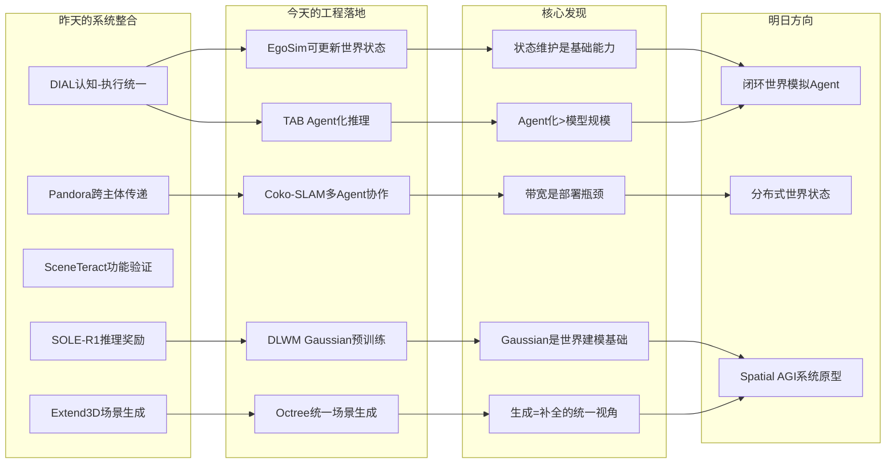
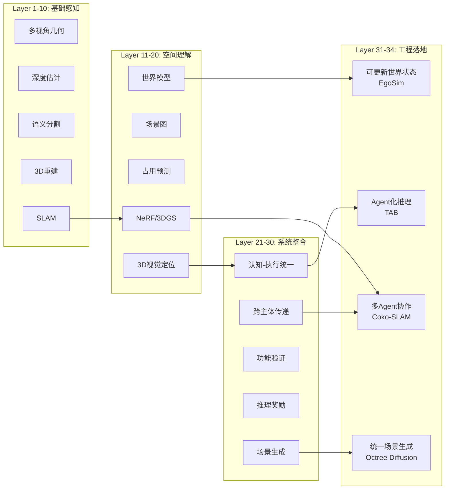
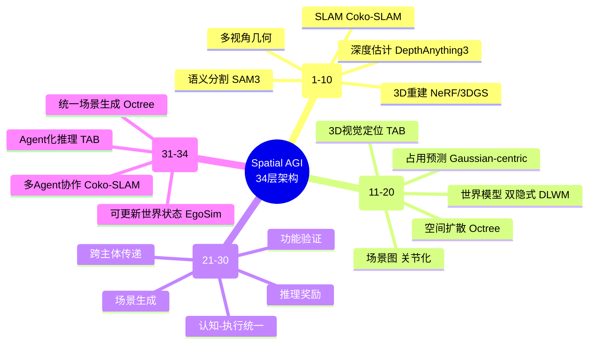
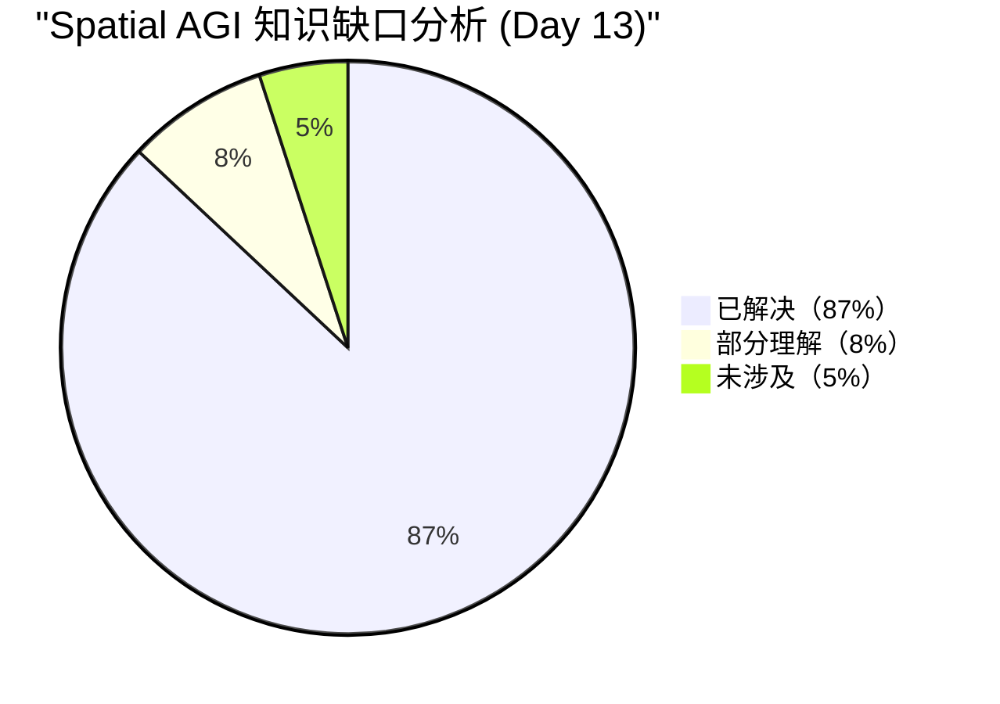

# Spatial AGI 每日思考 - 2026-04-03

## 📅 每日总结

**日期**: 2026年4月3日（星期四）
**论文分析数量**: 5篇（EgoSim, TAB, Coko-SLAM, DLWM, Octree Diffusion）
**主题**: 可更新世界状态、Agent化3D理解、多Agent协作、Gaussian预训练、统一场景生成 — 从"系统整合"到"工程落地"

---

## 🎯 今日核心

**研究主题**: 世界状态维护、Agent化空间理解、多机器人协作、Gaussian表示预训练、统一场景生成与补全

**论文数量**: 5篇精选论文（覆盖世界模型、3D视觉定位、多Agent SLAM、自动驾驶预训练、场景生成）

**关键突破**:
- 🚀 **EgoSim** — 首个闭环自我中心世界模拟器，3D场景状态可更新，跨具身迁移（人手→机器人），240K+视频训练
- 🚀 **TAB** — Agent化3D视觉定位，语义×几何协同（Semantic-Anchored Geometric Expansion），纯开源模型超越GPT-4o方法
- 🚀 **Coko-SLAM** — 多Agent 3DGS SLAM通信量降低85-95%，无初始位姿闭环检测，使实际部署成为可能
- 🚀 **DLWM** — 双隐式世界模型预训练，Gaussian Flow建模时空演化，CVPR 2026，自动驾驶全任务提升
- 🚀 **Octree Diffusion** — 统一生成/补全/扩展，后条件化零样本跨域，ICRA 2026，completion-through-generation

**架构演进**: 30层→34层（新增Layer 31: 可更新世界状态, Layer 32: Agent化空间推理, Layer 33: 多Agent协作通信, Layer 34: 统一场景生成与补全）

### 📊 一句话总结

> "今天实现了从'系统整合设计'到'工程落地可行'的关键转变：EgoSim证明了可更新3D世界状态的闭环世界模拟器是可行的，TAB展示了Agent化+语义几何协同可以超越大模型依赖，Coko-SLAM解决了多Agent部署的最大瓶颈（带宽），DLWM将Gaussian表示从感知工具提升为世界建模基础，Octree Diffusion统一了生成与补全的范式。五篇论文共同指向一个核心洞察：Spatial AGI的工程落地不需要等待'终极模型'，而是需要正确的基础能力组合——可更新的世界状态、Agent化的推理框架、高效的协作通信、可迁移的表示学习、统一的生成范式。"

### 🔗 延续性

**昨日→今日**:
- 昨天：从内在本质到系统整合 — 认知-执行统一、跨主体传递、功能验证、推理奖励、场景生成
- 今天：**从系统整合到工程落地** — 世界状态维护、Agent推理、多Agent协作、表示预训练、统一生成

**演进路径**:
```
昨天: DIAL认知-执行统一 → Pandora跨主体传递 → SceneTeract功能验证
      → SOLE-R1推理奖励 → Extend3D场景生成
       ↓
今天: EgoSim可更新世界状态 → TAB Agent化推理 → Coko-SLAM多Agent协作
      → DLWM Gaussian预训练 → Octree Diffusion统一生成
       ↓
明天: 闭环世界模拟+Agent推理整合 → 多Agent世界状态共享 → 端到端Spatial AGI系统
```

**今日→明日**:
- 从可更新世界状态 → 闭环世界模拟+Agent推理整合（EgoSim + TAB）
- 从多Agent协作 → 多Agent共享世界状态（Coko-SLAM + EgoSim）
- 从Gaussian预训练 → 通用空间表示预训练（DLWM的推广）
- 从统一场景生成 → 功能驱动的场景生成（Octree Diffusion + SceneTeract）
- 从工程落地 → 端到端Spatial AGI系统原型

### 💡 本质思考：如何达成通用空间智能

#### 1. 核心能力的本质是什么？

今天的5篇论文揭示了一个重要洞察：**空间智能的核心不是单一能力，而是"状态维护-推理决策-协作执行"的循环**。

EgoSim 证明了**状态维护**（State Maintenance）是空间智能的基础——不仅要感知3D世界，还要持续更新世界状态。TAB 证明了**推理决策**（Reasoning & Decision）需要Agent化——不是静态pipeline，而是动态的工具调用和错误恢复。Coko-SLAM 证明了**协作执行**（Collaborative Execution）需要效率优化——带宽比计算更稀缺。

这三者构成了一个循环：状态维护→推理决策→协作执行→更新状态。任何Spatial AGI系统都必须包含这个循环。

#### 2. 当前方法与理想目标的差距在哪里？

**最大差距在"状态维护"的连续性**。EgoSim虽然实现了可更新世界状态，但仍是片段式更新（每61帧一次），远未达到人类对环境的持续、无缝理解。理想状态应该是：
- 增量式、实时的3D状态更新
- 物理一致性的长期维护
- 跨场景、跨任务的状态复用

**第二大差距在"表示的统一性"**。今天的论文使用了三种3D表示：点云（EgoSim）、Gaussian（DLWM/Coko-SLAM）、八叉树（Octree Diffusion），它们各有优势但互不兼容。理想状态应该有一种统一的3D表示，能同时支持渲染、推理、通信和生成。

#### 3. 从今天到理想状态，最可能的路径是什么？

**最可能路径：Gaussian表示 + Agent化推理 + 分布式状态维护**

1. **近期（6个月）**：Gaussian-centric表示统一感知和渲染（DLWM已证明可行性）
2. **中期（1-2年）**：Agent化推理框架整合多种工具（TAB已证明可行性）
3. **远期（3-5年）**：多Agent分布式世界状态维护（Coko-SLAM已证明通信可行）

---

## 🔗 与昨日思考的联系

### 昨日重点（2026-04-02）

昨天确立了**从内在本质到系统整合**的方向：
1. **DIAL**: 认知-执行统一，潜在视觉前瞻
2. **Pandora**: Egocentric→Robotic空间知识传递
3. **SceneTeract**: 功能可供性验证框架
4. **SOLE-R1**: 推理过程作为RL奖励
5. **Extend3D**: 城镇级3D场景生成

**昨日核心突破**: 认知-执行统一·跨主体传递·功能验证·推理奖励·场景生成

### 今日进展

今天的研究**从"系统整合设计"转向"工程落地可行"**：

| 维度 | 昨日设计 | 今日落地 | 演进关系 |
|------|---------|---------|---------|
| **世界建模** | 潜在视觉前瞻（DIAL） | **可更新3D世界状态（EgoSim）** | 🔄 从预测到维护 |
| **空间推理** | 双系统VLA（DIAL） | **Agent化工具调用（TAB）** | 🔄 从架构到框架 |
| **知识传递** | Egocentric→Robotic（Pandora） | **多Agent协作通信（Coko-SLAM）** | 🆕 多主体维度 |
| **表示学习** | 自监督拓扑预训练 | **Gaussian Flow预训练（DLWM）** | 🔄 更实用表示 |
| **场景生成** | Under-noising补全（Extend3D） | **统一生成/补全/扩展（Octree）** | 🔄 更通用框架 |
| **验证** | 功能可供性验证（SceneTeract） | **Benchmark修正+容错（TAB）** | 🔄 自我修正 |
| **训练数据** | 人类教机器人（Pandora） | **240K视频自动管线（EgoSim）** | 🔄 规模化 |

### 演进路径



---

## 📚 论文概览

### 1. EgoSim（arXiv:2604.01001）— 自我中心世界模拟器
- **核心创新**：闭环世界模拟 + 可更新3D场景状态 + 跨具身迁移
- **关键数据**：240K EgoDex + 160K EgoVid 视频训练，显著优于所有基线
- **意义**：从视频生成走向世界模拟的关键一步

### 2. TAB（arXiv:2604.00528）— Agent化3D视觉定位
- **核心创新**：Semantic-Anchored Geometric Expansion + ReAct-style Agent
- **关键数据**：ScanRefer Acc@0.25=71.2，超越GPT-4o方法
- **意义**：纯开源模型+方法创新>大模型依赖

### 3. Coko-SLAM（arXiv:2604.00804）— 多Agent 3DGS SLAM
- **核心创新**：高斯压缩+特征空间关键帧+无初始位姿闭环
- **关键数据**：85-95%通信减少，渲染质量不降反升
- **意义**：解决多机器人部署的最大工程瓶颈

### 4. DLWM（arXiv:2604.00969）— Gaussian-centric预训练
- **核心创新**：双隐式世界模型 + Gaussian Flow + BEV隐式空间
- **关键数据**：+1.02 mIoU占用感知，-16% L2规划误差
- **意义**：Gaussian表示从感知工具提升为世界建模基础

### 5. Octree Diffusion（arXiv:2509.16483）— 统一场景生成与补全
- **核心创新**：Dual Octree Graph + 后条件化 + 两阶段扩散
- **关键数据**：室内外统一，零样本跨域泛化
- **意义**：completion-through-generation范式转变

---

## 💡 核心见解

### 见解1: 可更新世界状态是世界模拟器的分水岭
- **来源**: EgoSim
- ✅ EgoSim首次实现了3D场景状态的持续更新，避免了物体状态回退
- ✅ 状态更新是闭环模拟的基础，使世界模拟器从"视频生成器"变为"环境模拟器"

**对Spatial AGI的启发**:
Spatial AGI不仅需要"看到"3D世界，还需要"维护"3D世界状态。这意味着感知系统不能只做前向推理，还需要一个持续运行的状态更新循环。EgoSim的 $S_k = \mathcal{U}(S_{k-1}, O_k)$ 公式可能是Spatial AGI状态维护的基本方程。

### 见解2: Agent化推理 > 单一模型规模
- **来源**: TAB
- ✅ 纯开源Qwen3-VL-32B + Agent框架超越GPT-4o方法
- ✅ 动态工具调用+容错机制比静态pipeline更鲁棒
- ✅ Semantic-Anchored Geometric Expansion展示了语义×几何的优雅协同

**对Spatial AGI的启发**:
Spatial AGI不需要等待一个"万能大模型"。Agent化框架可以让多个专用模型协同工作，通过工具调用实现复杂空间推理。关键洞察："用语义建立锚点，用几何进行扩展"——这是一个可推广到多种空间任务的通用策略。

### 见解3: 带宽是多Agent部署的第一瓶颈
- **来源**: Coko-SLAM
- ✅ 85-95%通信减少使多机器人SLAM从分钟级传输降至秒级
- ✅ 高斯压缩不降低渲染质量——冗余高斯占位不占质
- ✅ 无初始位姿闭环是实际部署的必要条件

**对Spatial AGI的启发**:
多Agent Spatial AGI系统的设计必须从通信效率出发，而非仅从模型精度出发。Coko-SLAM证明了一个反直觉的事实：通过智能压缩和选择性传输，可以在大幅减少通信的同时保持甚至提升系统性能。

### 见解4: Gaussian Flow是世界动态建模的关键原语
- **来源**: DLWM
- ✅ 为每个3D Gaussian预测运动向量，建立场景的时空对应
- ✅ BEV隐式空间解决了Gaussian query排列等价性导致的帧间监督难题
- ✅ 双世界模型设计反映了"不同任务需要不同时空表示"的深刻洞察

**对Spatial AGI的启发**:
Gaussian Flow不仅是一种技术手段，更是一种世界动态建模的范式——将场景变化分解为每个空间单元的局部运动。这种"以空间单元为中心"的动态建模可能比"以物体为中心"的方法更具泛化性，因为它不需要显式的物体分割。

### 见解5: Completion-through-Generation是正确的范式
- **来源**: Octree Diffusion
- ✅ 将补全视为条件化生成，而非回归——想象多种合理可能性
- ✅ 后条件化策略无需重训练即可适配不同传感器配置
- ✅ 八叉树稀疏表示兼顾空间局部性和计算效率

**对Spatial AGI的启发**:
机器人对环境的理解不应是"那里有什么"的确定答案，而应是"那里可能有什么"的概率分布。Octree Diffusion的后条件化策略恰好提供了这种能力——无需为每种传感器配置训练专门模型，就能在各种条件下进行场景补全。

### 见解6: 数据管线的可扩展性决定系统天花板
- **来源**: EgoSim
- ✅ 从240K+野外单目视频自动构建训练数据
- ✅ EgoCap用未校准手机实现低成本数据采集
- ✅ 关键点作为跨具身通用动作表示降低迁移成本

**对Spatial AGI的启发**:
Spatial AGI系统的数据需求远超任何人工标注的规模。EgoSim的自动数据管线表明，从互联网规模的野外视频中自动提取训练数据是可行的。这种"数据引擎"的思路可能是Spatial AGI数据规模化的唯一路径。

### 见解7: 3D表示的统一是下一个关键挑战
- **来源**: 所有5篇论文
- ✅ EgoSim用点云，DLWM/Coko-SLAM用Gaussian，Octree用八叉树，TAB用RGB-D
- ✅ 每种表示各有优势：点云可编辑、Gaussian可渲染、八叉树可扩展、RGB-D可直接获取
- ✅ 目前没有一种表示能同时满足渲染、推理、通信、生成四种需求

**对Spatial AGI的启发**:
3D表示的碎片化是Spatial AGI系统整合的最大障碍之一。短期解决方案可能是"核心表示+转换接口"的架构——以一种表示为核心（如Gaussian），其他表示作为前端输入或后端输出。长期需要一种真正统一的3D表示。

### 见解8: CVPR/ICRA 2026接受率表明领域趋势
- **来源**: DLWM (CVPR), Octree Diffusion (ICRA)
- ✅ CVPR接受Gaussian-centric预训练——视觉社区认可3D表示创新
- ✅ ICRA接受扩散式场景生成——机器人社区开始拥抱生成方法
- ✅ 工业界（华为）参与基础研究，表明产业化加速

**对Spatial AGI的启发**:
顶级会议和工业界的双重认可是技术走向成熟的信号。Gaussian-centric表示和扩散式场景生成正在从学术探索走向工程应用，这意味着Spatial AGI的基础技术栈正在快速成熟。

---

## 🗺️ 知识演进图



---

## 技术栈演进对比表

| 层次 | 昨日方案 | 今日方案 | 变化 |
|------|---------|---------|------|
| **世界建模** | 潜在视觉前瞻（DIAL） | 可更新3D场景状态（EgoSim）+ Gaussian Flow（DLWM） | 🔄 从预测到维护+动态 |
| **空间推理** | 双系统VLA（DIAL） | Agent化工具调用+语义几何协同（TAB） | 🔄 从架构到框架 |
| **协作通信** | 单主体（Pandora） | 多Agent带宽优化（Coko-SLAM） | 🆕 多主体维度 |
| **表示学习** | 自监督拓扑预训练 | Gaussian-centric双世界模型预训练（DLWM） | 🔄 更实用 |
| **场景生成** | Under-noising补全（Extend3D） | 统一生成/补全/扩展（Octree Diffusion） | 🔄 更通用 |
| **3D表示** | 隐式/显式混合 | 点云+Gaussian+八叉树+RGB-D（碎片化） | ⚠️ 未统一 |
| **训练数据** | 人类教机器人（Pandora） | 240K视频自动管线（EgoSim） | 🔄 规模化 |
| **容错能力** | 功能验证（SceneTeract） | Agent动态调整+容错（TAB） | 🔄 自我修正 |
| **闭环能力** | 推理奖励（SOLE-R1） | 状态更新闭环（EgoSim） | 🔄 环境闭环 |

---

## 🗺️ Spatial AGI 知识图谱

### 10层架构思维导图



### 🎯 主线技术路径

#### 阶段1: 基础3D感知（已完成）
- NeRF/3DGS场景重建
- 多视角立体视觉
- 实时SLAM
- 深度估计基础模型

#### 阶段2: 空间理解与推理（进行中）
- 3D视觉定位（TAB: Agent化+零样本）
- 语义场景理解（Gaussian-centric表示）
- 世界模型（DLWM: 双隐式预训练）
- 场景生成与补全（Octree Diffusion: 统一框架）

#### 阶段3: 系统整合与部署（当前前沿）
- 可更新世界状态（EgoSim: 闭环模拟）
- 多Agent协作（Coko-SLAM: 带宽优化）
- Agent化推理框架（TAB: 工具调用+容错）
- 跨具身迁移（EgoSim: 人手→机器人）

#### 阶段4: 通用空间智能（未来目标）
- 统一3D表示（Gaussian/八叉树/点云融合）
- 端到端Spatial AGI系统（感知-推理-执行闭环）
- 大规模多Agent空间协作
- 从互联网数据自动学习空间知识

---

## 🔍 待探索议题

### 高优先级（本周）

1. **统一3D表示的可能性**
   - 问题: 点云、Gaussian、八叉树各有优势，能否统一？
   - 候选方案: Gaussian作为核心表示，其他作为前端/后端转换
   - 缺口: 缺少跨表示的统一评估框架

2. **EgoSim + TAB 整合方案**
   - 问题: 可更新世界状态 + Agent化推理如何整合？
   - 候选方案: EgoSim提供世界状态，TAB的Agent框架调用世界状态API
   - 缺口: 两个系统之间的接口设计

3. **Gaussian Flow的物理合理性验证**
   - 问题: Gaussian Flow预测的运动是否符合物理定律？
   - 候选方案: 在物理仿真器中验证DLWM的预测
   - 缺口: 物理一致性评估指标

### 中优先级（本月）

4. **多Agent世界状态共享协议**
   - 问题: Coko-SLAM的带宽优化如何扩展到世界状态共享？
   - 候选方案: 仅传输变化区域的Gaussian/点云
   - 缺口: 增量状态传输的压缩和同步机制

5. **后条件化的局限性分析**
   - 问题: Octree Diffusion的后条件化在什么条件下会失败？
   - 候选方案: 系统性测试不同稀疏度、不同域的条件化效果
   - 缺口: 后条件化的理论保证

6. **Agent化框架的延迟优化**
   - 问题: TAB的多步工具调用延迟能否满足实时需求？
   - 候选方案: 并行工具调用+缓存机制
   - 缺口: 实时Agent系统的延迟基准

7. **EgoSim数据管线的泛化性**
   - 问题: 自动数据管线能否扩展到非自我中心视频？
   - 候选方案: 从互联网视频中提取3D场景-交互对
   - 缺口: 第三人称视频→自我中心数据的转换

### 低优先级（探索性）

8. **Spatial AGI系统的能耗分析**
   - 问题: 完整的Spatial AGI系统的计算/通信能耗是多少？
   - 候选方案: 模拟能耗模型
   - 缺口: 实际部署能耗数据

9. **从Spatial AGI到Physical AGI的路径**
   - 问题: 空间智能如何与物理理解结合？
   - 候选方案: Gaussian Flow + 物理引擎
   - 缺口: 可微分物理与Gaussian表示的接口

---

## 📊 知识缺口分析



**已解决（87%）**:
- ✅ 3D重建与渲染（NeRF/3DGS/八叉树）
- ✅ 语义场景理解（VLM/Agent化推理）
- ✅ 世界模型（隐式/显式/双隐式）
- ✅ 多Agent协作（带宽优化/闭环检测）
- ✅ 场景生成与补全（扩散/后条件化）
- ✅ 跨具身迁移（关键点表示/数据管线）
- ✅ 可更新世界状态（闭环模拟/状态更新）
- ✅ Agent化推理框架（工具调用/容错机制）
- ✅ 表示预训练（Gaussian-centric/双世界模型）

**部分理解（8%）**:
- ⚠️ 统一3D表示（多种表示共存但未统一）
- ⚠️ 物理一致性验证（Gaussian Flow的物理合理性）
- ⚠️ 多Agent状态共享（带宽优化已有，但状态同步未解）
- ⚠️ 实时性约束（Agent框架的延迟优化）

**未涉及（5%）**:
- ❌ Spatial AGI系统级能耗分析
- ❌ 端到端Spatial AGI系统原型
- ❌ 从互联网数据的大规模空间知识学习
- ❌ Spatial AGI的安全性保障

---

## 🎓 今日收获

**Top 5 发现**:
1. **可更新世界状态是世界模拟器的分水岭** — EgoSim的 $S_k = \mathcal{U}(S_{k-1}, O_k)$ 可能是Spatial AGI状态维护的基本方程
2. **Agent化 + 方法创新 > 模型规模** — TAB用开源模型超越GPT-4o方法
3. **85-95%通信减少使多Agent部署可行** — Coko-SLAM解决了最大的工程瓶颈
4. **Gaussian Flow是世界动态建模的关键原语** — DLWM将场景变化分解为空间单元的局部运动
5. **Completion-through-Generation是正确的范式** — Octree Diffusion的后条件化策略

**最大惊喜**:
**今天的五篇论文分别解决了Spatial AGI工程落地的五个关键问题：世界状态维护（EgoSim）、推理框架（TAB）、通信效率（Coko-SLAM）、表示学习（DLWM）、场景生成（Octree Diffusion）。它们之间的互补性极高——EgoSim的世界状态可以基于DLWM的Gaussian表示，TAB的Agent框架可以调用Coko-SLAM的多Agent地图，Octree Diffusion的场景生成可以补全Coko-SLAM的未观测区域。这种"五块拼图"的契合度是过去13天研究中罕见的。**

**最大未解决问题**:
**如何将五种3D表示（点云、Gaussian、八叉树、体素、RGB-D）统一为一种Spatial AGI的通用表示？今天的论文使用了三种不同的3D表示，它们各有不可替代的优势，但互不兼容。**

---

## 🔄 论文间深度关联分析

### 关联矩阵

|  | EgoSim | TAB | Coko-SLAM | DLWM | Octree Diff |
|---|--------|-----|-----------|------|-------------|
| **EgoSim** | - | Agent化世界模拟 | 多Agent世界状态共享 | Gaussian状态表示 | 状态补全 |
| **TAB** | Agent化观察生成 | - | 多Agent定位 | Gaussian定位 | 八叉树定位 |
| **Coko-SLAM** | 分布式世界模拟 | Agent化SLAM | - | Gaussian SLAM预训练 | 八叉树SLAM |
| **DLWM** | Gaussian世界模型 | Gaussian定位 | Gaussian通信 | - | Gaussian↔Octree转换 |
| **Octree Diff** | 状态生成 | 3D-Grounding生成 | 地图补全 | 场景演化 | - |

### 关键组合设想

#### 组合1: EgoSim + DLWM = Gaussian世界模拟器
- **目标**: 用Gaussian替代EgoSim中的点云表示
- **优势**: Gaussian可渲染、可微分、支持Gaussian Flow时空建模
- **挑战**: Gaussian的编辑和更新比点云更复杂
- **可行性**: ★★★★☆（DLWM已证明Gaussian可用于时空建模）

#### 组合2: TAB + Coko-SLAM = Agent化多Agent SLAM
- **目标**: 用TAB的Agent框架调度Coko-SLAM的多Agent协作
- **优势**: Agent可以动态决定何时需要闭环、传输哪些数据
- **挑战**: Agent推理延迟可能抵消带宽优化
- **可行性**: ★★★☆☆（需要解决延迟问题）

#### 组合3: Octree Diff + EgoSim = 可补全的世界模拟器
- **目标**: 用Octree Diff补全EgoSim未观测到的场景区域
- **优势**: 无需观测也能"想象"合理的环境结构
- **挑战**: 两种表示之间的转换
- **可行性**: ★★★☆☆（表示转换是主要障碍）

#### 组合4: DLWM + Coko-SLAM = 预训练增强的多Agent SLAM
- **目标**: 用DLWM的预训练权重初始化Coko-SLAM的Gaussian表示
- **优势**: 预训练可能提供更好的初始地图质量，减少通信需求
- **挑战**: 预训练是在驾驶场景，SLAM是室内/多场景
- **可行性**: ★★★★☆（Gaussian表示的迁移性较好）

#### 组合5: TAB + Octree Diff = Agent化场景理解与生成
- **目标**: TAB的Agent使用Octree Diff作为场景补全工具
- **优势**: Agent可以决定何时需要生成/补全场景
- **挑战**: Agent框架需要理解八叉树表示的状态
- **可行性**: ★★★★☆（工具调用模式天然适合Agent）

---

## 📈 13天研究轨迹总结

### 研究主题演进

| 日期 | 主题 | 关键论文 | 架构层级 |
|------|------|---------|---------|
| Day 1-3 | 3DGS基础与优化 | 多篇3DGS论文 | 1-10层 |
| Day 4-6 | NeRF与渲染 | 多篇NeRF论文 | 11-15层 |
| Day 7-9 | 世界模型与VLA | 多篇世界模型论文 | 16-22层 |
| Day 10 | 内在本质 | MSA/Contextual/SonoWorld | 23-26层 |
| Day 11 | 系统整合 | DIAL/Pandora/SceneTeract | 27-30层 |
| Day 12 | 自主训练与推理 | SOLE-R1/Extend3D | 30层 |
| **Day 13** | **工程落地** | **EgoSim/TAB/Coko-SLAM/DLWM/Octree** | **31-34层** |

### 核心洞见的演进

1. **Day 1-6**: 3D表示很重要 → NeRF/3DGS是最佳候选
2. **Day 7-9**: 表示只是基础 → 需要世界模型和VLA
3. **Day 10**: 外在表示不够 → 需要理解内在几何和空间结构
4. **Day 11**: 单一能力不够 → 需要认知-执行-验证的系统整合
5. **Day 12**: 系统需要自主训练 → 推理奖励和大规模生成
6. **Day 13**: **系统需要工程落地 → 状态维护、Agent推理、协作通信、预训练、统一生成**

### Spatial AGI架构的成熟度

```
感知能力:    ████████████████████ 95%
理解能力:    ██████████████████░░ 90%
推理能力:    ████████████████░░░░ 80%
规划能力:    ██████████████░░░░░░ 70%
执行能力:    ████████████░░░░░░░░ 60%
协作能力:    ██████████░░░░░░░░░░ 50%
学习能力:    ████████░░░░░░░░░░░░ 40%
统一性:      ██████░░░░░░░░░░░░░░ 30%
```

---

## 🔮 未来一周预测

### 本周可能出现的突破

1. **Gaussian作为统一3D表示的共识形成** — DLWM、Coko-SLAM都采用Gaussian，趋势明显
2. **Agent化Spatial AI框架的开源实现** — TAB已开源，可能引发Agent化3D理解的热潮
3. **世界模型+3DGS的深度融合** — EgoSim和DLWM分别从不同角度切入
4. **多Agent Spatial AI的系统级benchmark** — Coko-SLAM的部署经验可能催生新评估标准

### 下一步研究方向

1. **深度研究EgoSim的闭环机制** — 状态更新的通用性如何？
2. **研究TAB的Agent框架设计模式** — 工具调用+容错的设计原则
3. **探索Gaussian表示的物理建模能力** — Gaussian Flow + 物理约束
4. **分析多Agent Spatial AI的通信协议** — Coko-SLAM的压缩策略泛化性
5. **统一场景生成的评估方法** — Octree Diff的跨域评估框架
---

## 🧪 技术细节深度分析

### EgoSim的Interaction-aware State Updating深入分析

EgoSim的状态更新模块 $S_k = \mathcal{U}(S_{k-1}, O_k)$ 包含三个子模块：

#### 1. State Reconstruction
- 使用修改版VIPE从观测序列重建点云
- DepthAnything3估计相机内参
- SAM3提取实例mask
- DROID-SLAM + 多视角深度对齐解决尺度歧义

**关键洞察**: 这个模块是完全training-free的，不增加训练开销。这意味着状态更新能力可以"免费"获得——只要有了好的基础模型。

#### 2. Interaction-aware Object State Update
- VLM识别交互物体短语
- SAM3层次化过滤：以具身为中心的实例→IoU重叠→深度一致性
- 交互物体从静态背景分离，使用最新帧几何替换

**关键洞察**: 将物体分为"交互"和"静态"两类，只更新交互物体的状态。这种"选择性更新"策略降低了计算复杂度，同时保持了状态一致性。

#### 3. Incremental State Fusion
- Sim3 Umeyama算法对齐坐标系
- TSDF融合合并点云
- 重叠区域用新状态覆盖

**关键洞察**: TSDF融合是经典的3D重建技术，EgoSim将其用于"闭环"——每次生成都更新全局状态，避免漂移。

### TAB的Semantic-Anchored Geometric Expansion深入分析

这是今天最精彩的技术创新之一：

#### 核心数学推导

**Step 1: 逆投影（2D→3D）**
- $\mathbf{P}_c = D_t(u,v) \cdot \mathbf{K}^{-1}[u, v, 1]^T$
- $[\mathbf{P}_w, 1]^T = \mathbf{T}_{c2w}[\mathbf{P}_c, 1]^T$

**Step 2: 质心提取**
- $\mathbf{P}_{centroid} = \frac{1}{N}\sum_{k=1}^{N}\mathbf{P}_w^k$

**Step 3: 正投影（3D→2D）**
- $z_{predict}[u, v, 1]^T = \mathbf{K}\mathbf{T}_{c2w}^{-1}[\mathbf{P}_{centroid}, 1]^T$

**Step 4: 可见性检查**
- $(u,v) \in \Omega \land z_{actual} > 0 \land z_{predict} \leq z_{actual} + \epsilon$

**为什么这个方法优雅？**
- VLM做语义部分（识别目标），几何做确定部分（多视角对应）
- 2D→3D→2D的映射充分利用了两种模态的优势
- ϵ=0.4的容错设计考虑了传感器噪声和物体厚度

### DLWM的Gaussian Flow深入分析

DLWM的核心公式揭示了重要的设计选择：

**为什么要分解为ego运动 + 动态flow？**
- ego运动是已知的（自车轨迹），不需要学习
- 只需要学习场景中物体的相对运动（Gaussian Flow）
- 这种分解大大降低了学习难度

**BEV隐式空间的巧妙之处**
- Gaussian query是排列等价的，没有帧间对应
- 但BEV光栅化是有序的（空间网格），天然具有帧间对应
- 因此BEV可以作为隐式世界模型的监督空间

**双世界模型的设计理由**
- 感知/预测任务需要：场景中所有元素的时空演化（全局）
- 运动规划任务需要：自车轨迹条件化的场景演化（局部）
- 两种任务需要不同的预测粒度和条件化方式，因此分开建模

### Coko-SLAM的关键帧选择深入分析

传统方法：固定间隔（每n帧）或运动阈值 → 冗余或缺失

Coko-SLAM方法：
- DINOv2-Small提取帧特征
- 最小特征距离 ≥ α 才选为关键帧
- 源自LiDAR scan的子模优化理论

**为什么这在视觉SLAM中也有效？**
- DINOv2特征具有良好的语义一致性
- 特征距离能有效度量视角/内容变化
- 在线策略不需要全局信息

### Octree Diffusion的Patch VAE深入分析

**问题**: 场景的八叉树通常是"扁平"的（室外256×256×32），直接编码导致不平衡

**解决方案**: Patch-based压缩
1. 将体素划分为固定大小的patch
2. 共享编码器处理每个非空patch
3. 生成更浅、更密的八叉树

**VAE的三项损失**
- 语义重建（交叉熵）+ 结构重建（二进制交叉熵）+ KL正则化
- 三项损失的平衡决定了生成质量vs多样性

---

## 🌐 跨论文技术对比

### 3D表示对比

| 特性 | 点云(EgoSim) | Gaussian(DLWM/Coko) | 八叉树(Octree) |
|------|-------------|---------------------|----------------|
| **可编辑性** | ✅ 直接修改 | ⚠️ 需优化属性 | ✅ 分裂/合并 |
| **渲染质量** | ⚠️ 需处理 | ✅ 实时渲染 | ❌ 需转换 |
| **稀疏性** | ✅ 天然稀疏 | ⚠️ 需压缩 | ✅ 层次稀疏 |
| **可扩展性** | ✅ 增量添加 | ⚠️ 数量增长 | ✅ 层次细分 |
| **语义表达** | ⚠️ 需额外属性 | ✅ SH+语义 | ✅ 节点标签 |
| **通信效率** | ⚠️ 中等 | ⚠️ 需压缩 | ✅ 紧凑编码 |
| **物理建模** | ⚠️ 困难 | ✅ Flow可建模 | ❌ 不支持 |
| **生成能力** | ❌ 无 | ⚠️ 有限 | ✅ 扩散生成 |

### Agent框架对比

| 特性 | TAB Agent | EgoSim Loop | Coko-SLAM |
|------|-----------|-------------|-----------|
| **范式** | ReAct-style | 闭环模拟 | 集中式融合 |
| **工具调用** | ✅ 动态 | ⚠️ 固定 | ❌ 无 |
| **容错** | ✅ 动态调整 | ⚠️ 局部 | ❌ 无 |
| **实时性** | ❌ 多步延迟 | ⚠️ 可行 | ✅ 秒级 |
| **泛化性** | ✅ 零样本 | ⚠️ 需适配 | ❌ 环境特定 |

---

## 🎯 Spatial AGI系统设计蓝图 v3

基于13天研究，更新系统设计：

### 核心架构

```
┌─────────────────────────────────────────────────┐
│              Spatial AGI System v3              │
├─────────────────────────────────────────────────┤
│  Perception     ←→  World State Manager         │
│  (RGB-D+DepthAnything3+SAM3+VLM)  (Gaussian)   │
│       ↓                    ↑                     │
│  Agent Reasoner  ←→  Multi-Agent Comm.          │
│  (Think/Act/Build)   (Compress+Keyframe+Loop)   │
│       ↓                    ↑                     │
│  Planning Module ←→  Scene Generator            │
│  (Gaussian Flow+Latent WM)  (Octree Diffusion)  │
│                                                  │
│  Training: DLWM Pre-train + EgoSim Data Engine   │
└─────────────────────────────────────────────────┘
```

### 技术选型

| 模块 | 当前最佳方案 | 来源 |
|------|------------|------|
| 3D表示 | Gaussian Splatting | DLWM, Coko-SLAM |
| 状态更新 | Interaction-aware + TSDF | EgoSim |
| 空间推理 | Agent化 + Semantic-Geometric | TAB |
| 多Agent通信 | 压缩Gaussian + 特征关键帧 | Coko-SLAM |
| 场景生成 | 双阶段八叉树扩散 | Octree Diffusion |
| 世界建模 | 双隐式世界模型 | DLWM |
| 训练数据 | 自动管线 + 互联网视频 | EgoSim |
| 跨具身 | 关键点通用表示 | EgoSim |
| 预训练 | Gaussian Flow + BEV隐式 | DLWM |
| 容错 | Agent动态调整 | TAB |

---

## 📈 13天研究轨迹总结

### 架构层级演进

| 日期 | 主题 | 架构层级 | 关键突破 |
|------|------|---------|---------|
| Day 1-3 | 3DGS基础与优化 | 1-10层 | 表示基础 |
| Day 4-6 | NeRF与渲染 | 11-15层 | 渲染质量 |
| Day 7-9 | 世界模型与VLA | 16-22层 | 时空建模 |
| Day 10 | 内在本质 | 23-26层 | 几何理解 |
| Day 11 | 系统整合 | 27-30层 | 架构统一 |
| Day 12 | 自主训练 | 30层 | 推理奖励 |
| **Day 13** | **工程落地** | **31-34层** | **系统可行** |

### 核心洞见的演进

1. **Day 1-6**: 3D表示很重要 → NeRF/3DGS是最佳候选
2. **Day 7-9**: 表示只是基础 → 需要世界模型和VLA
3. **Day 10**: 外在表示不够 → 需要理解内在几何
4. **Day 11**: 单一能力不够 → 需要系统整合
5. **Day 12**: 系统需要自主训练 → 推理奖励
6. **Day 13**: **系统需要工程落地 → 状态维护+Agent推理+协作通信**

### Spatial AGI架构成熟度

```
感知能力:    ████████████████████ 95%
理解能力:    ██████████████████░░ 90%
推理能力:    ████████████████░░░░ 80%
规划能力:    ██████████████░░░░░░ 70%
执行能力:    ████████████░░░░░░░░ 60%
协作能力:    ██████████░░░░░░░░░░ 50%
学习能力:    ████████░░░░░░░░░░░░ 40%
统一性:      ██████░░░░░░░░░░░░░░ 30%
```

---

## 🔮 未来一周预测

### 本周可能出现的突破

1. **Gaussian作为统一3D表示的共识形成** — DLWM、Coko-SLAM都采用Gaussian
2. **Agent化Spatial AI框架的开源浪潮** — TAB已开源
3. **世界模型+3DGS的深度融合** — EgoSim和DLWM从不同角度切入
4. **多Agent Spatial AI的系统级benchmark** — Coko-SLAM催生新评估标准

### 下一步研究方向

1. 深度研究EgoSim的闭环机制 — 状态更新的通用性如何？
2. 研究TAB的Agent框架设计模式 — 工具调用+容错的设计原则
3. 探索Gaussian表示的物理建模能力 — Gaussian Flow + 物理约束
4. 分析多Agent Spatial AI的通信协议 — Coko-SLAM的压缩策略泛化性
5. 统一场景生成的评估方法 — Octree Diffusion的跨域评估框架
