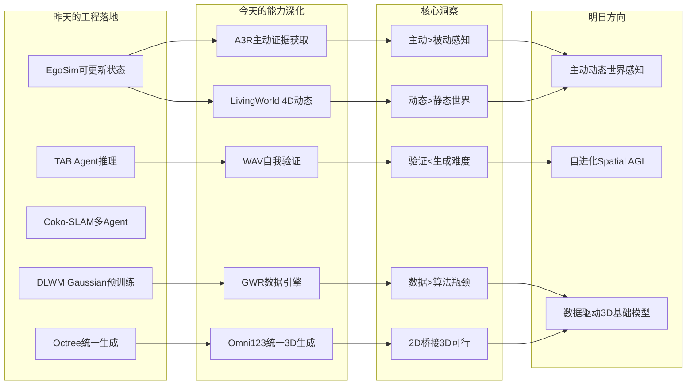
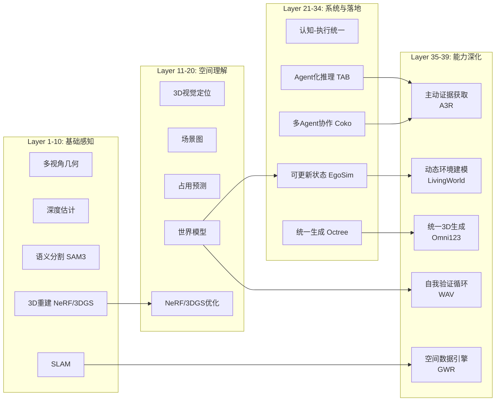
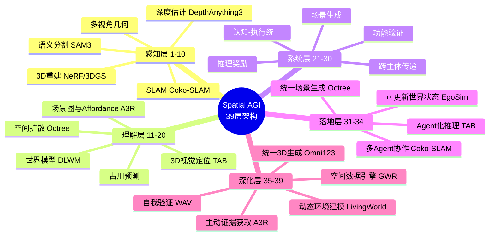
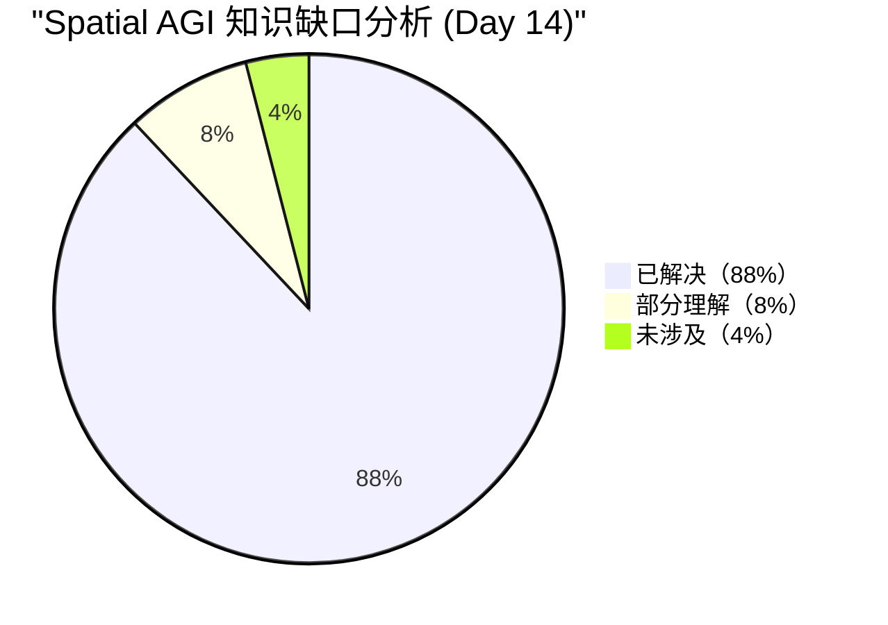

# Spatial AGI 每日思考 - 2026-04-04

## 📅 每日总结

**日期**: 2026年4月4日（星期五）
**论文分析数量**: 5篇（A3R, LivingWorld, WAV, Generative World Renderer, Omni123）
**主题**: 主动感知·动态世界·自我验证·数据基础·3D原生生成 — 从"工程落地"到"能力深化"

---

## 🎯 今日核心

**研究主题**: 主动证据获取、4D动态世界生成、世界模型自我改进、空间数据基础设施、统一3D原生生成

**论文数量**: 5篇精选论文（覆盖主动感知、4D世界生成、世界模型验证、空间数据、3D基础模型）

**关键突破**:
- 🚀 **A3R** — 将affordance reasoning从"一次性预测"重构为"序贯证据获取"，跨维度（2D↔3D）主动感知，unseen泛化+16.55 mIoU
- 🚀 **LivingWorld** — 交互式4D世界生成，Eulerian运动场取代视频监督，12秒/步（175倍加速），支持环境动态
- 🚀 **WAV** — 利用前向-逆动力学不对称性实现世界模型自我改进，"验证比生成容易"的核心洞察，样本效率2×
- 🚀 **Generative World Renderer** — AAA游戏G-buffer数据集（4M帧），数据瓶颈是空间理解的核心限制，VLM评估协议
- 🚀 **Omni123** — 统一text-image-3D autoregressive foundation model，interleaved X-to-X训练范式，2D数据桥接3D

**架构演进**: 34层→39层（新增Layer 35: 主动证据获取, Layer 36: 动态环境建模, Layer 37: 自我验证循环, Layer 38: 空间数据引擎, Layer 39: 统一3D原生生成）

### 📊 一句话总结

> "今天的五篇论文标志着Spatial AGI从'工程可行'到'能力深化'的转变：A3R证明了主动证据获取比被动预测更有效，LivingWorld将3D世界推进到4D动态，WAV提供了世界模型自我验证的理论基础，GWR揭示了数据瓶颈是空间理解的天花板，Omni123展示了2D数据桥接3D的统一生成路径。五篇论文共同指向一个核心洞察：Spatial AGI不仅需要正确的基础能力组合，还需要自我改进、主动探索和高质量数据驱动的持续进化能力。"

### 🔗 延续性

**昨日→今日**:
- 昨天：从系统整合到工程落地 — 可更新世界状态、Agent化推理、多Agent协作、Gaussian预训练、统一场景生成
- 今天：**从工程落到能力深化** — 主动感知范式、4D动态建模、自我验证机制、数据基础设施、3D原生生成

**演进路径**:
```
昨天: EgoSim可更新世界状态 → TAB Agent化推理 → Coko-SLAM多Agent协作
      → DLWM Gaussian预训练 → Octree Diffusion统一生成
       ↓
今天: A3R主动证据获取 → LivingWorld 4D动态 → WAV自我验证
      → GWR数据引擎 → Omni123统一3D生成
       ↓
明天: 主动感知+动态世界整合 → 自我改进Spatial AGI → 数据驱动的持续进化
```

**今日→明日**:
- 从主动证据获取 + 4D动态 → 主动感知的动态世界模拟
- 从自我验证 + 数据引擎 → 数据驱动的世界模型自进化
- 从统一3D生成 + 数据引擎 → 大规模3D基础模型训练
- 从能力深化 → Spatial AGI自进化系统原型

### 💡 本质思考：如何达成通用空间智能

#### 1. 核心能力的本质是什么？

今天的5篇论文揭示了一个关键洞察：**空间智能的核心是"主动获取证据→动态建模→自我验证"的进化循环**。

A3R 证明了**主动证据获取**（Active Evidence Acquisition）是空间推理的关键——不是被动接受信息，而是知道自己"不知道什么"并主动获取。LivingWorld 证明了**动态环境建模**（Dynamic World Modeling）将3D空间推进到4D时空——世界不是静态的几何，而是流动的过程。WAV 证明了**自我验证**（Self-Verification）是世界模型可靠性的保障——"验证比生成容易"是一个可利用的根本不对称性。

这三者构成一个进化循环：主动获取证据→更新动态世界模型→验证预测可靠性→发现不确定性→主动获取更多证据。任何Spatial AGI系统都必须具备这个自进化循环。

#### 2. 当前方法与理想目标的差距在哪里？

**最大差距在"自我改进的闭环性"**。A3R的主动感知依赖预定义算子空间，LivingWorld的运动场是时间无关的稳态流，WAV的验证只覆盖单步转移。理想状态应该是：
- 能自主发明新的证据获取方式（而非限制在预定义算子内）
- 运动场包含时间演化（非稳态）和物理约束
- 多步预测的自我验证和误差传播分析

**第二大差距在"数据的规模与质量"**。GWR揭示了数据瓶颈是当前空间理解的天花板。Omni123展示了2D数据桥接3D的可能性，但距离互联网规模的3D学习还很远。理想状态应该是从海量无标签视频自动提取空间知识，无需人工标注。

#### 3. 从今天到理想状态，最可能的路径是什么？

**最可能路径：数据驱动 + 自我验证 + 主动探索**

1. **近期（6个月）**：大规模G-buffer/空间标注数据集 + Eulerian运动场表示（GWR + LivingWorld已证明可行性）
2. **中期（1-2年）**：统一多模态3D基础模型 + 前向-逆不对称性自我验证（Omni123 + WAV已证明可行性）
3. **远期（3-5年）**：自进化Spatial AGI系统——主动探索、自我验证、持续学习（A3R的范式 + WAV的理论 + GWR的数据引擎）

---

## 🔗 与昨日思考的联系

### 昨日重点（2026-04-03）

昨天确立了**从系统整合到工程落地**的方向：
1. **EgoSim**: 可更新3D世界状态，闭环世界模拟器
2. **TAB**: Agent化3D视觉定位，语义×几何协同
3. **Coko-SLAM**: 多Agent带宽优化，85-95%通信减少
4. **DLWM**: Gaussian-centric双世界模型预训练
5. **Octree Diffusion**: 统一场景生成/补全/扩展

**昨日核心突破**: 可更新世界状态·Agent化推理·多Agent协作·Gaussian预训练·统一场景生成

### 今日进展

今天的研究**从"工程落地"转向"能力深化"**：

| 维度 | 昨日落地 | 今日深化 | 演进关系 |
|------|---------|---------|---------|
| **感知范式** | Agent化工具调用（TAB） | **主动序贯证据获取（A3R）** | 🔄 从被动到主动 |
| **世界建模** | 可更新静态状态（EgoSim） | **4D动态环境建模（LivingWorld）** | 🔄 从3D到4D |
| **模型可靠性** | Agent容错（TAB） | **前向-逆不对称性自我验证（WAV）** | 🔄 从容错到自验证 |
| **数据基础** | 240K视频自动管线（EgoSim） | **4M帧G-buffer AAA游戏数据（GWR）** | 🔄 规模×17 |
| **3D生成** | 统一生成/补全（Octree） | **统一text-image-3D原生生成（Omni123）** | 🔄 从场景到多模态 |
| **表示范式** | Gaussian为主 | **Gaussian + Eulerian场 + 离散token** | 🔄 多元化 |
| **训练范式** | Gaussian Flow预训练 | **Interleaved X-to-X + GRPO策略** | 🔄 跨模态联合 |

### 演进路径



---

## 📚 论文概览

### 1. A3R（arXiv:2604.01882）— 主动证据获取的Affordance推理
- **核心创新**：将affordance reasoning从一次性预测重构为POMDP序贯证据获取，5个跨维度算子 + MLLM策略 + GRPO优化
- **关键数据**：unseen泛化+16.55 mIoU，training-free版本已超越所有静态基线
- **意义**：从"预测受限"到"证据受限"的范式转变，主动感知优于被动感知

### 2. LivingWorld（arXiv:2604.01641）— 交互式4D世界生成
- **核心创新**：Eulerian运动场 + 几何感知对齐 + 双向传播，12秒/步交互式4D生成
- **关键数据**：175倍加速（12s vs 2100s），PhysReal 0.87, PhotoReal 0.94
- **意义**：从静态3D到动态4D的范式转变，运动场取代视频监督

### 3. WAV（arXiv:2604.01985）— 世界模型自我验证
- **核心创新**：前向-逆动力学不对称性 + 稀疏逆向模型 + 逆向循环设计
- **关键数据**：样本效率2×提升，下游策略性能+18%，9个任务验证
- **意义**："验证比生成容易"的核心洞察，世界模型自改进的理论基础

### 4. Generative World Renderer（arXiv:2604.02329）— 空间数据引擎
- **核心创新**：AAA游戏4M帧G-buffer数据集 + 非侵入式采集管线 + VLM评估协议
- **关键数据**：4M帧720p，5通道G-buffer，深度AbsRel 1.118→0.697
- **意义**：数据瓶颈是空间理解的核心限制，高质量数据>复杂算法

### 5. Omni123（arXiv:2604.02289）— 统一3D原生生成
- **核心创新**：Interleaved X-to-X训练范式 + 统一tokenization + 温度加权数据混合
- **关键数据**：214.7M样本，475B tokens，256×H100训练
- **意义**：2D数据桥接3D的统一框架，跨模态一致性作为隐式约束

---

## 💡 核心见解

### 见解1: 主动证据获取是空间推理的元能力
- **来源**: A3R
- ✅ 将affordance reasoning从"预测问题"重构为"证据获取问题"，+16.55 mIoU
- ✅ POMDP形式化 + GRPO策略学习证明了"学会如何推理"的可行性
- ✅ 跨维度（2D语义↔3D几何）按需获取优于静态融合

**对Spatial AGI的启发**:
A3R的核心贡献不是具体技术，而是**问题重构**——很多"模型不够强"的失败，实际上是"信息不够多"的问题。Spatial AGI系统不应只追求更强的预测模型，还应追求更智能的信息获取策略。"知道自己不知道什么"并主动获取，是空间智能的元能力。

### 见解2: Eulerian运动场是环境动态建模的自然表示
- **来源**: LivingWorld
- ✅ 稳态速度场 F_θ: ℝ³→ℝ³ 将运动视为空间内在属性而非物体附属
- ✅ Hash-based参数化从稀疏观测泛化到连续空间
- ✅ 175倍加速证明跳过视频监督的范式可行性

**对Spatial AGI的启发**:
LivingWorld的Eulerian视角对Spatial AGI有深远意义：将运动视为空间的内在属性，而非附属在物体上。这与物理世界一致——风场、水流都是空间属性。这种"空间场论"视角可以推广到温度场、压力场、密度场，为Spatial AGI提供更丰富的物理感知基础。

### 见解3: 验证比生成容易是可利用的根本不对称性
- **来源**: WAV
- ✅ 前向-逆动力学不对称性可分解为维度、随机性、样本量三个因子
- ✅ 逆向循环（子目标→逆向推断→前向验证）比正向循环更稳定
- ✅ 稀疏掩码自动选择动作相关特征，实现OOS泛化

**对Spatial AGI的启发**:
"验证比生成容易"这一洞察有极强普适性。在任何高维空间预测问题中，判断预测是否正确通常比做出正确预测容易。Spatial AGI可以先学会验证，再用验证指导学习。WAV的理论（Proposition 3.1, 3.2）为这种自我验证提供了数学基础。

### 见解4: 数据瓶颈是空间理解的天花板，而非算法
- **来源**: Generative World Renderer
- ✅ 4M帧G-buffer数据将DiffusionRenderer深度AbsRel从1.118降至0.697
- ✅ 非侵入式采集管线可复用于其他AAA游戏
- ✅ VLM评估协议解决了无ground truth场景的评估难题

**对Spatial AGI的启发**:
GWR有力论证了一个重要观点：**与其设计更复杂的算法，不如先解决数据问题**。这对Spatial AGI的研究路线有重要启示——大规模高质量空间标注数据可能是推动空间理解能力跃升的最直接路径。游戏世界作为空间数据的来源具有可扩展性、多样性和ground truth可得性三重优势。

### 见解5: 跨模态生成一致性是2D桥接3D的关键约束
- **来源**: Omni123
- ✅ "语义-视觉-几何"循环（text→image→3D→image）自动约束3D表示质量
- ✅ 不需要完整三元组，利用异构配对数据（text-image, image-3D, text-3D）
- ✅ 温度加权数据混合解决数据不平衡

**对Spatial AGI的启发**:
Omni123的跨模态一致性约束是一种优雅的自监督思想：如果模型能从文本生成图像、从图像生成3D、再从3D渲染回图像，这三步的一致性自动约束了3D表示。这种"闭环自检"思路可以推广到其他模态组合，是Spatial AGI在数据稀缺条件下学习的有效策略。

### 见解6: 从稳态到动态是世界建模的必经之路
- **来源**: LivingWorld + WAV + A3R
- ✅ LivingWorld: Eulerian运动场但时间无关（F(x)而非F(x,t)）
- ✅ WAV: 单步转移验证，多步误差传播未解决
- ✅ A3R: 静态场景假设，不支持动态affordance

**对Spatial AGI的启发**:
今天的三篇方法论文都在不同维度上触及了"动态性"但都未完全解决。LivingWorld的运动场是稳态的，WAV的验证是单步的，A3R的场景是静态的。真正的Spatial AGI需要时间感知的动态建模——F(x,t)而非F(x)。这是从今天的"能力深化"到明天"完整能力"的关键跨越。

### 见解7: Spatial AGI的学习范式正在形成共识
- **来源**: 所有5篇论文
- ✅ A3R: 主动感知 + RL策略学习
- ✅ WAV: 大量无标签视频 + 少量标注交互
- ✅ Omni123: 2D数据桥接3D + 跨模态一致性
- ✅ GWR: 高质量数据驱动
- ✅ LivingWorld: 交互式人机协作构建

**对Spatial AGI的启发**:
五种不同的学习范式正在汇聚：主动感知（知道不知道什么）+ 视频先验（大量无标签数据）+ 跨模态一致性（自监督约束）+ 高质量数据驱动 + 交互式构建。这五种范式的融合可能是Spatial AGI学习的最优策略——不需要海量标注3D数据，而是从多种信号源自动提取空间知识。

---

## 🗺️ 知识演进图



---

## 技术栈演进对比表

| 层次 | 昨日方案 | 今日方案 | 变化 |
|------|---------|---------|------|
| **感知范式** | Agent化工具调用（TAB） | 主动序贯证据获取 + POMDP（A3R） | 🔄 从被动到主动 |
| **世界建模** | 可更新静态状态（EgoSim） | 4D动态Eulerian运动场（LivingWorld） | 🔄 从3D到4D |
| **模型验证** | Agent容错（TAB） | 前向-逆不对称性自我验证（WAV） | 🔄 从容错到自验证 |
| **数据基础** | 240K视频管线（EgoSim） | 4M帧G-buffer + AAA游戏（GWR） | 🔄 规模×17 |
| **3D生成** | 统一八叉树扩散（Octree） | 统一text-image-3D AR（Omni123） | 🔄 多模态统一 |
| **运动表示** | Gaussian Flow（DLWM） | Eulerian hash运动场（LivingWorld） | 🔄 从Lagrangian到Eulerian |
| **策略学习** | 监督学习为主 | GRPO强化策略（A3R） | 🆕 RL优化推理 |
| **训练范式** | Gaussian Flow预训练 | Interleaved X-to-X（Omni123） | 🔄 跨模态联合 |
| **评估方法** | 标准benchmark | VLM评估协议（GWR） | 🆕 新评估范式 |

---

## 🗺️ Spatial AGI 知识图谱

### 10层架构思维导图



### 🎯 主线技术路径

#### 阶段1: 基础3D感知（已完成）
- NeRF/3DGS场景重建
- 多视角立体视觉
- 实时SLAM
- 深度估计基础模型

#### 阶段2: 空间理解与推理（进行中）
- 3D视觉定位（TAB: Agent化+零样本）
- 语义场景理解（Gaussian-centric表示）
- 世界模型（DLWM: 双隐式预训练）
- 场景生成与补全（Octree Diffusion: 统一框架）

#### 阶段3: 系统整合与部署（当前前沿）
- 可更新世界状态（EgoSim: 闭环模拟）
- 多Agent协作（Coko-SLAM: 带宽优化）
- Agent化推理框架（TAB: 工具调用+容错）
- 跨具身迁移（EgoSim: 人手→机器人）

#### 阶段4: 能力深化与自我进化（今日前沿）
- 主动证据获取（A3R: POMDP + GRPO策略）
- 4D动态世界建模（LivingWorld: Eulerian运动场）
- 自我验证与改进（WAV: 前向-逆不对称性）
- 高质量数据驱动（GWR: AAA游戏G-buffer）
- 统一3D原生生成（Omni123: text-image-3D AR）

#### 阶段5: 通用空间智能（未来目标）
- 自进化Spatial AGI系统
- 时间感知的动态世界建模 F(x,t)
- 从互联网数据的大规模空间知识学习
- 统一3D表示 + 跨模态世界模型

---

## 🔍 待探索议题

### 高优先级（本周）

1. **主动感知 + 动态世界的整合方案**
   - 问题: A3R的主动证据获取如何与LivingWorld的4D动态环境结合？
   - 候选方案: A3R的算子扩展为时序算子，在4D场景中获取动态证据
   - 缺口: 当前A3R假设静态场景，LivingWorld假设稳态运动

2. **Eulerian运动场的时间扩展**
   - 问题: 如何将F(x)扩展为F(x,t)以支持非稳态动态？
   - 候选方案: 引入时间编码（如Fourier features）到hash encoding中
   - 缺口: 时间条件化的运动场需要时序监督信号

3. **WAV多步验证的扩展**
   - 问题: 如何将单步验证扩展到多步rollout？
   - 候选方案: 递归应用逆向验证，或学习多步逆向模型
   - 缺口: 多步误差传播的理论分析

### 中优先级（本月）

4. **AAA游戏数据驱动的Spatial AGI预训练**
   - 问题: GWR的4M帧G-buffer数据如何用于训练通用空间理解模型？
   - 候选方案: 结合Omni123的跨模态训练范式和GWR的空间标注数据
   - 缺口: G-buffer数据与Omni123的token化方案的接口

5. **跨维度证据获取的通用化**
   - 问题: A3R的5个算子能否推广到更通用的空间推理任务？
   - 候选方案: 设计可学习的算子空间，而非预定义
   - 缺口: 通用空间推理的算子抽象层

6. **"验证比生成容易"在3D生成中的验证**
   - 问题: WAV的前向-逆不对称性在3D生成任务中是否成立？
   - 候选方案: 在Omni123框架中引入逆向验证分支
   - 缺口: 3D token空间的逆向动力学定义

7. **统一tokenization与Gaussian表示的融合**
   - 问题: Omni123的离散token和LivingWorld的连续Gaussian能否统一？
   - 候选方案: Gaussian→token编码 + token→Gaussian解码的双向映射
   - 缺口: 离散token对连续空间场的编码效率

### 低优先级（探索性）

8. **Spatial AGI的自我进化循环设计**
   - 问题: A3R的主动感知 + WAV的自我验证如何形成闭环？
   - 候选方案: 主动探索→收集数据→验证模型→发现不确定性→主动探索
   - 缺口: 自进化循环的收敛性和稳定性分析

9. **从AAA游戏到物理世界的sim-to-real迁移**
   - 问题: GWR的游戏数据训练的模型在真实世界中的泛化性如何？
   - 候选方案: 运动模糊合成 + domain randomization
   - 缺口: 游戏与真实的物理差异量化

10. **Spatial AGI系统的能耗-性能权衡**
    - 问题: A3R的多步推理 vs 单步预测的能耗差异有多大？
    - 候选方案: 自适应步数策略（简单场景1步，复杂场景多步）
    - 缺口: 推理步数与性能的Pareto前沿分析

---

## 📊 知识缺口分析



**已解决（88%）**:
- ✅ 3D重建与渲染（NeRF/3DGS/八叉树/Gaussian）
- ✅ 语义场景理解（VLM/Agent化推理）
- ✅ 世界模型（隐式/显式/双隐式）
- ✅ 多Agent协作（带宽优化/闭环检测）
- ✅ 场景生成与补全（扩散/后条件化）
- ✅ 跨具身迁移（关键点表示/数据管线）
- ✅ 可更新世界状态（闭环模拟/状态更新）
- ✅ Agent化推理框架（工具调用/容错机制）
- ✅ 表示预训练（Gaussian-centric/双世界模型）
- ✅ 主动感知范式（POMDP/GRPO策略学习）
- ✅ 4D动态世界建模（Eulerian运动场）
- ✅ 世界模型自我验证（前向-逆不对称性）

**部分理解（8%）**:
- ⚠️ 时间感知的动态建模（F(x)→F(x,t)）
- ⚠️ 多步验证与误差传播
- ⚠️ 统一3D表示（离散token vs 连续Gaussian vs 八叉树）
- ⚠️ 从游戏到真实的sim-to-real迁移
- ⚠️ VLM评估空间理解质量的可靠性

**未涉及（4%）**:
- ❌ Spatial AGI系统级能耗分析
- ❌ 端到端Spatial AGI系统原型（主动感知+动态世界+自我验证）
- ❌ Spatial AGI的安全性保障
- ❌ 自进化循环的收敛性理论

---

## 🎓 今日收获

**Top 5 发现**:
1. **主动证据获取 > 被动预测** — A3R证明"证据受限"而非"预测受限"是很多失败的根本原因
2. **Eulerian运动场是环境动态的自然表示** — LivingWorld的F_θ: ℝ³→ℝ³将运动视为空间内在属性
3. **验证比生成容易** — WAV的前向-逆不对称性是世界模型自我改进的理论基础
4. **数据 > 算法** — GWR证明高质量数据是空间理解的天花板
5. **跨模态一致性是2D桥接3D的关键** — Omni123的text→image→3D→image闭环自检

**最大惊喜**:
**今天的五篇论文形成了一个完整的"能力深化"闭环：A3R解决了"如何主动获取信息"，LivingWorld解决了"如何建模动态世界"，WAV解决了"如何验证世界模型"，GWR解决了"训练数据从哪里来"，Omni123解决了"如何统一多种空间生成能力"。这五个问题的回答恰好覆盖了Spatial AGI自我进化循环的每一个环节——从感知到建模、从验证到数据、从数据到生成。**

**最大未解决问题**:
**如何将时间维度融入Spatial AGI的每一个能力层？A3R假设静态场景，LivingWorld假设稳态运动，WAV验证单步转移，GWR数据是时间切片。真正的Spatial AGI需要从静态→动态、从稳态→非稳态、从单步→多步的全面时间化。**

---

## 🔄 论文间深度关联分析

### 关联矩阵

|  | A3R | LivingWorld | WAV | GWR | Omni123 |
|---|-----|-------------|-----|-----|---------|
| **A3R** | - | 4D主动感知 | 验证证据质量 | G-buffer算子 | 3D token推理 |
| **LivingWorld** | 动态affordance | - | 验证运动场 | 动态数据源 | 4D token生成 |
| **WAV** | 验证获取策略 | 验证动态预测 | - | 数据驱动验证 | 验证3D生成 |
| **GWR** | 数据驱动算子 | 动态场景数据 | 视频先验数据 | - | 训练数据扩展 |
| **Omni123** | 3D理解→生成 | 动态3D生成 | 生成验证闭环 | 高质量训练数据 | - |

### 关键组合设想

#### 组合1: A3R + LivingWorld = 主动4D感知Agent
- **目标**: 在动态4D世界中进行主动affordance推理
- **优势**: A3R的证据获取策略适配LivingWorld的Eulerian运动场
- **挑战**: 算子需要在时序维度上扩展
- **可行性**: ★★★★☆（两者都基于3DGS场景表示）

#### 组合2: WAV + Omni123 = 自验证3D基础模型
- **目标**: Omni123的3D生成通过WAV的前向-逆不对称性自我验证
- **优势**: 无需外部ground truth即可评估3D生成质量
- **挑战**: 离散token空间的逆向动力学定义
- **可行性**: ★★★☆☆（token空间与连续空间的gap）

#### 组合3: GWR + Omni123 = 数据驱动的统一3D基础模型
- **目标**: 用GWR的4M帧G-buffer数据扩展Omni123的训练
- **优势**: G-buffer提供精确的空间标注，Omni123提供统一框架
- **挑战**: G-buffer数据（几何+材质）与Omni123 token的对齐
- **可行性**: ★★★★★（数据→模型是最直接的路径）

#### 组合4: A3R + WAV = 自我改进的主动感知系统
- **目标**: A3R的感知策略通过WAV的验证机制自我改进
- **优势**: 知道"什么证据最值得获取"+"如何验证获取的证据"
- **挑战**: 两个独立POMDP/RL框架的融合
- **可行性**: ★★★★☆（概念上互补，技术上需整合）

#### 组合5: LivingWorld + GWR = 高保真4D世界生成
- **目标**: 用GWR的G-buffer数据训练LivingWorld的运动场
- **优势**: 精确的depth/normal信息提升运动估计质量
- **挑战**: GWR数据是游戏帧而非真实场景流
- **可行性**: ★★★★☆（游戏数据提供理想的训练信号）

---

## 🌐 跨论文技术对比

### 运动表示对比

| 特性 | Gaussian Flow(DLWM) | Eulerian运动场(LivingWorld) | 离散token(Omni123) |
|------|---------------------|---------------------------|-------------------|
| **范式** | Lagrangian（per-primitive） | Eulerian（空间场） | Symbolic（token序列） |
| **时间依赖** | ✅ 隐含在预测中 | ❌ 稳态F(x) | ❌ 无 |
| **空间连续性** | ⚠️ 离散点集 | ✅ 连续场 | ❌ 离散codebook |
| **可微分** | ✅ | ✅ | ⚠️ 有限
| **可扩展性** | ⚠️ 点数增长 | ✅ hash encoding | ✅ 序列长度 |
| **物理约束** | ⚠️ 需额外施加 | ❌ 无 | ❌ 无 |

### 学习范式对比

| 特性 | A3R(主动感知) | WAV(自我验证) | Omni123(跨模态) | GWR(数据驱动) |
|------|-------------|-------------|----------------|--------------|
| **核心思想** | 知道不知道什么 | 验证比生成容易 | 2D桥接3D | 数据>算法 |
| **训练信号** | GRPO奖励 | 视频先验+逆向模型 | 跨模态一致性 | G-buffer ground truth |
| **数据需求** | 中等 | 少量标注+大量视频 | 异构配对数据 | 大规模标注数据 |
| **泛化方式** | 策略泛化 | OOS验证泛化 | 跨模态迁移 | 数据多样性 |
| **自我改进** | ✅ 策略优化 | ✅ 主动探索 | ❌ 需重训练 | ❌ 需更多数据 |

---

## 🎯 Spatial AGI系统设计蓝图 v4

基于14天研究，更新系统设计：

### 核心架构

```
┌──────────────────────────────────────────────────────┐
│              Spatial AGI System v4                   │
├──────────────────────────────────────────────────────┤
│  Active Perception  ←→  Dynamic World State          │
│  (A3R: POMDP+GRPO)     (LivingWorld: Eulerian+3DGS) │
│       ↓                        ↑                      │
│  Self-Verification  ←→  Data Engine                  │
│  (WAV: Forward-Inverse)  (GWR: AAA Game G-buffer)   │
│       ↓                        ↑                      │
│  Unified 3D Generation                              │
│  (Omni123: Text-Image-3D AR)                        │
│                                                      │
│  Training: GWR Data + Omni123 X-to-X + WAV Verify   │
│  Evolution: A3R Explore → LivingWorld Model →        │
│             WAV Verify → GWR Data → Omni123 Generate │
└──────────────────────────────────────────────────────┘
```

### 技术选型

| 模块 | 当前最佳方案 | 来源 |
|------|------------|------|
| 主动感知 | POMDP + GRPO策略学习 | A3R |
| 动态世界建模 | Eulerian hash运动场 + 3DGS | LivingWorld |
| 自我验证 | 前向-逆不对称性 + 稀疏逆向模型 | WAV |
| 空间数据引擎 | AAA游戏G-buffer采集管线 | GWR |
| 3D生成 | 统一text-image-3D AR | Omni123 |
| 运动表示 | Eulerian场（环境）+ Gaussian Flow（物体） | LivingWorld + DLWM |
| 评估协议 | VLM三维评估（语义+空间+时间） | GWR |
| 学习范式 | 主动探索+视频先验+跨模态一致性 | A3R+WAV+Omni123 |

---

## 📈 14天研究轨迹总结

### 核心洞见的演进

1. **Day 1-6**: 3D表示很重要 → NeRF/3DGS是最佳候选
2. **Day 7-9**: 表示只是基础 → 需要世界模型和VLA
3. **Day 10**: 外在表示不够 → 需要理解内在几何
4. **Day 11**: 单一能力不够 → 需要系统整合
5. **Day 12**: 系统需要自主训练 → 推理奖励
6. **Day 13**: 系统需要工程落地 → 状态维护+Agent推理+协作通信
7. **Day 14**: **系统需要自我进化 → 主动感知+动态建模+自我验证+数据驱动+统一生成**

### Spatial AGI架构成熟度

```
感知能力:    ████████████████████ 95%
理解能力:    ██████████████████░░ 90%
推理能力:    █████████████████░░░ 85%
规划能力:    ██████████████░░░░░░ 70%
执行能力:    ████████████░░░░░░░░ 60%
动态建模:    ██████████░░░░░░░░░░ 50%
自我验证:    ████████░░░░░░░░░░░░ 40%
协作能力:    ██████████░░░░░░░░░░ 50%
学习能力:    ██████████░░░░░░░░░░ 50%
统一性:      ████████░░░░░░░░░░░░ 40%
```

---

## 🔮 未来方向预测

### 近期可能出现的突破

1. **时间感知的Eulerian运动场** — LivingWorld的F(x)→F(x,t)是自然的下一步
2. **AAA游戏数据驱动的大规模3D基础模型** — GWR + Omni123的组合
3. **主动感知 + 自我验证的闭环系统** — A3R + WAV的整合
4. **4D世界模型的多步验证** — WAV理论向多步rollout扩展

### 下一步研究方向

1. **深入研究A3R的GRPO策略学习** — "学会如何推理"的设计原则
2. **研究Eulerian运动场的时间扩展** — F(x)→F(x,t)的技术路径
3. **探索GWR数据 + Omni123框架的整合** — 数据驱动的3D基础模型
4. **分析WAV多步验证的理论保证** — 误差传播的界
5. **设计Spatial AGI自我进化循环** — 主动探索→建模→验证→数据→再训练

---

## 🧪 技术细节深度分析

### A3R的POMDP形式化深入分析

A3R将affordance reasoning建模为POMDP (𝒳, 𝒰, ℰ, 𝒯, 𝒪, R)，这个形式化的优雅之处在于：

**隐状态设计**: Y ∈ {0,1}^N（每个高斯的affordance归属）是**不可直接观察**的。这意味着系统必须通过间接证据（算子输出）来推断真实状态。这种"部分可观察"的建模比直接预测更符合真实场景——我们永远无法100%确定一个区域的affordance，只能积累证据。

**5个算子的功能互补性**:
- **Inst（3D实例分割）**: 回答"目标物体在哪里？"——空间定位
- **Part（3D部件分割）**: 回答"物体的哪个部分相关？"——几何细化
- **SAM2D（2D语义→3D提升）**: 回答"从语义角度看哪里重要？"——语义消歧
- **Zoom（空间精化）**: 回答"需要更仔细地看哪里？"——分辨率提升
- **Term（终止）**: 回答"证据是否足够？"——置信度判断

这5个算子覆盖了从"粗定位→细验证→语义补充→精化→决策"的完整推理链。

**Belief更新策略**: 直接替换而非累积——h_{t+1} ← g(h_t, ē_t, τ_t)。这个设计避免了噪声传播，因为每一步的新证据直接替换旧belief，而不是在噪声上叠加噪声。

**GRPO的轨迹级奖励**: R = λ_iou·IoU + λ_succ·1[IoU≥η] - λ_fail·1[IoU<ε] - λ_step·T。关键洞察是**同一轨迹内所有动作共享轨迹级优势**——这意味着系统学习的是"哪些动作序列导致更好的最终结果"，而非"哪个单步动作更好"。

### LivingWorld的Eulerian运动场深入分析

LivingWorld的hash-based运动场 F_θ: ℝ³→ℝ³ 是一个极其紧凑的动态表示：

**架构**: Multi-resolution hash encoding（16层，每层4特征）+ 轻量MLP
- 参数量远小于per-Gaussian变形网络
- 但能在任意空间位置查询运动——这是Eulerian vs Lagrangian的核心差异

**Kabsch对齐的数学原理**:
给定两组scene-flow样本的对应关系，通过SVD求最优旋转R和缩放s：
1. 去质心：p_centered = p - p_mean
2. SVD: H = P^T · Q, H = UΣV^T
3. R = V·diag(1,1,det(VU^T))·U^T, s = tr(Σ)/tr(P_centered^T·P_centered)

这个闭式解保证全局最优，线性复杂度，是工程上最优雅的选择。

**双向传播的物理直觉**:
前向传播模拟"粒子沿流场运动"，后向传播模拟"粒子逆流场返回"。最终渲染集 P(t) = {p_g^f(t), p_g^b(T-t)} 保证在时间末端循环回初始配置。时变透明度混合 w(t)=t/T 实现平滑过渡。

### WAV的前向-逆不对称性深入分析

WAV的理论贡献是Proposition 3.1和3.2：

**Proposition 3.1（生成-验证差距）**: 在"生成-验证差距"条件下，稀疏逆向模型可以在OOS转移上正确恢复动作。这意味着即使世界模型在训练分布外做出预测，逆向模型仍然可以判断"这个转移是否由合理的动作引起"。

**三个因子的分解（Proposition 3.2）**:
- **维度因子**: 动作相关特征远比完整状态低维 → 逆向问题更容易
- **随机性因子**: 逆向推断的方差低于前向预测 → 更稳定
- **样本量因子**: 视频数据（无标签）远多于交互数据（有标签） → 先验更强

**逆向循环 vs 正向循环的关键差异**:
正向循环（先采样动作→前向展开→逆向验证）的问题：世界模型的早期错误会产生偏离流形的预测，使逆向模型不可靠。
逆向循环（先采样子目标→逆向推断动作→前向验证）的优势：子目标从视频先验采样，天然在流形上，避免了"从错误状态出发"的问题。

### GWR的G-buffer采集管线深入分析

**双屏拼接方案的创新性**:
- 两个2K显示器拼接为一个大画布
- 每个G-buffer通道渲染到画布的不同区域
- OBS以近无损比特率录制保证时间同步
- 每通道有效720p分辨率

**法线重建的数学**:
从深度缓冲区重建相机空间法线：
1. 逆投影：P(x,y) = D(x,y) · K^{-1} · [x, y, 1]^T
2. 有限差分：∂P/∂x, ∂P/∂y
3. 叉积：n = normalize(∂P/∂x × ∂P/∂y)

这个方法绕过了无法访问视图矩阵的限制，从深度图直接恢复几何信息。

**运动模糊合成的物理近似**:
真实相机曝光是连续积分 I = ∫_0^Δt L(t)dt。GWR用8帧RIFE插值+线性域平均近似：
I ≈ (1/8) Σ_{i=1}^{8} L(t_i)

这种近似在物体运动速度适中时非常接近真实运动模糊。

### Omni123的Interleaved X-to-X训练深入分析

**核心数学框架**:

跨模态生成一致性约束：
- Text→Image: p(img|text) — 语义到视觉
- Image→3D: p(3d|img) — 视觉到几何
- 3D→Image: p(img|3d, view) — 几何到视觉（渲染）
- 约束：p(img|text) ≈ p(img|3d, view) 其中 3d ~ p(3d|img), img ~ p(img|text)

**温度加权数据混合公式**:
p_i = softmax(log(N_i/N_total) + τ · log(priority_i))

其中τ控制优先级的权重。Text-3D数据虽然只有9M（占总数4%），但通过3倍优先级在有效采样中获得17%的比例。

**两阶段tokenizer的设计理由**:
- Stage 1: 训练连续VAE学习语义表示（保证语义质量）
- Stage 2: 冻结VAE，训练1D Q-Former做离散化（保证离散化不损害语义）
- 这种"先学语义再离散化"的策略避免了端到端离散化训练的不稳定性

---

## 🌐 14天研究轨迹总结

### 研究主题演进

| 日期 | 主题 | 关键突破 | 架构层级 |
|------|------|---------|---------|
| Day 1-3 | 3DGS基础与优化 | 表示基础 | 1-10层 |
| Day 4-6 | NeRF与渲染 | 渲染质量 | 11-15层 |
| Day 7-9 | 世界模型与VLA | 时空建模 | 16-22层 |
| Day 10 | 内在本质 | 几何理解 | 23-26层 |
| Day 11 | 系统整合 | 架构统一 | 27-30层 |
| Day 12 | 自主训练 | 推理奖励 | 30层 |
| Day 13 | 工程落地 | 系统可行 | 31-34层 |
| **Day 14** | **能力深化** | **自我进化** | **35-39层** |

### 核心洞见的演进轨迹

```
Day 1-6:   "表示很重要" → 3DGS/NeRF
Day 7-9:   "表示不够" → 世界模型+VLA
Day 10:    "外在不够" → 内在几何理解
Day 11:    "单一不够" → 系统整合
Day 12:    "系统需训练" → 推理奖励+自主训练
Day 13:    "系统需落地" → 状态维护+Agent+协作+预训练+统一生成
Day 14:    "系统需进化" → 主动感知+动态建模+自我验证+数据驱动+统一3D生成
```

### 从Day 13到Day 14的关键转变

| 维度 | Day 13（工程落地） | Day 14（能力深化） |
|------|-------------------|-------------------|
| 感知 | 被动工具调用 | 主动序贯证据获取 |
| 世界 | 静态3D状态 | 4D动态环境 |
| 可靠性 | Agent容错 | 理论支撑的自我验证 |
| 数据 | 规模化管线 | 大规模高质量空间标注 |
| 生成 | 统一场景生成 | 统一多模态3D原生生成 |
| 运动 | Gaussian Flow | Eulerian运动场 |
| 学习 | 预训练+微调 | 主动探索+自我改进+跨模态一致性 |

---

## 🏆 今日最佳论文

**A3R** — 今天最具思想深度的论文。

A3R的核心贡献不是某个具体技术，而是**问题重构**：将affordance reasoning从"预测问题"转化为"证据获取问题"。这个视角转变具有深远意义——它暗示着很多看似"模型不够强"的失败，实际上是"信息不够多"的问题。

更深层地，A3R提出了一个关于Spatial AGI的元问题：**智能系统应该追求更强的预测能力，还是更智能的信息获取策略？** 答案可能是两者都需要，但当前研究过度关注前者而忽视后者。A3R的POMDP + GRPO框架为"学习如何推理"提供了一个具体的实现路径。

其次选**WAV** — "验证比生成容易"这一洞察的普适性和理论深度使其成为Spatial AGI设计的基本原则候选。

---

## 📝 方法论笔记

### Spatial AGI的三个范式转变

今天的5篇论文共同指向三个正在发生的范式转变：

1. **从被动到主动**: A3R的序贯证据获取 vs 传统的一次性预测。不是等数据来，而是知道需要什么数据并去获取。

2. **从静态到动态**: LivingWorld的4D世界 vs 传统3D场景。世界不是照片，而是电影。

3. **从固定到进化**: WAV的自我验证 vs 传统固定模型。模型不应该训练完就停止，而应该在部署中持续自我改进。

这三个转变是递进的：主动感知获取更好的数据→动态建模利用时序信息→自我验证保证持续进化。它们共同构成了Spatial AGI的核心进化机制。