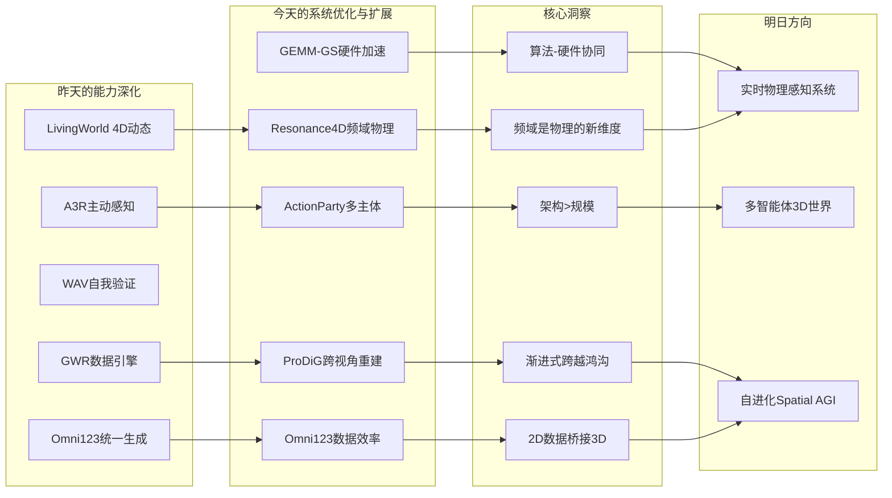
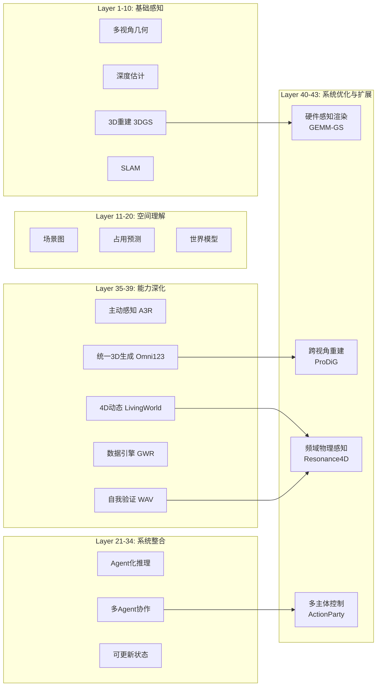
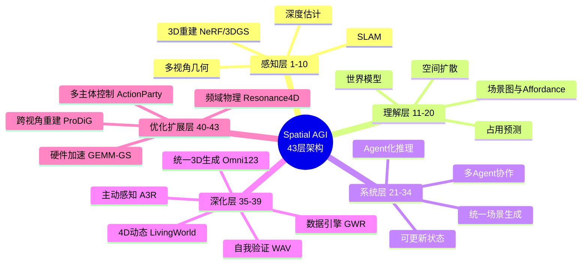
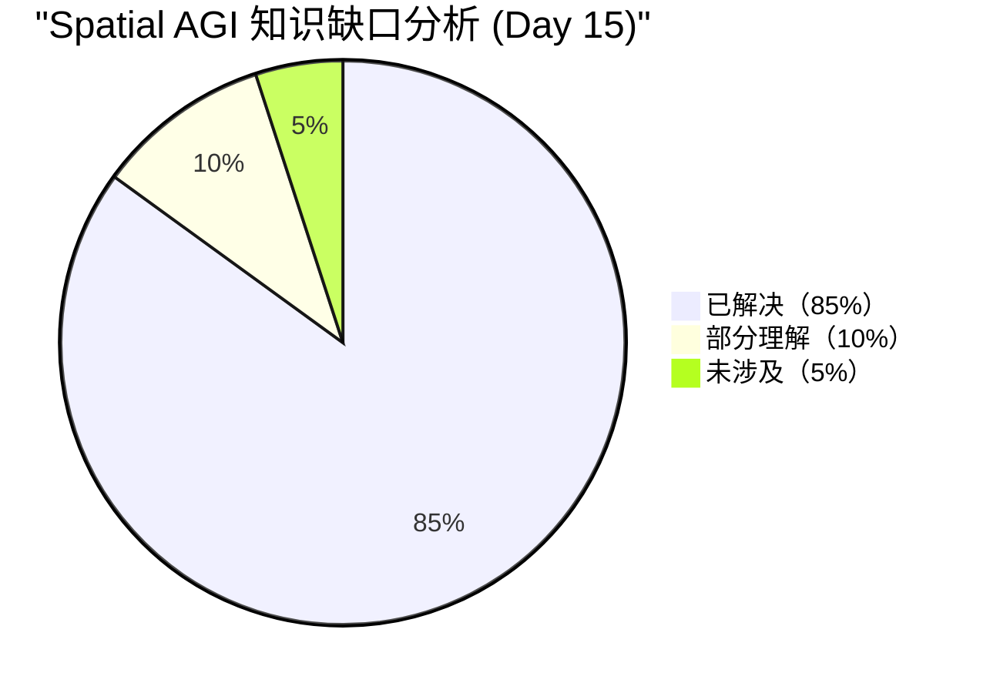

# Spatial AGI 每日思考 - 2026-04-05

## 📅 每日总结

**日期**: 2026年4月5日（星期六）
**论文分析数量**: 5篇（GEMM-GS, ProDiG, Omni123, Resonance4D, ActionParty）
**主题**: 硬件加速·跨视角重建·3D原生生成·频域物理·多主体控制 — 从"能力深化"到"系统优化与扩展"

---

## 🎯 今日核心

**研究主题**: 3DGS渲染硬件加速、航拍到地面渐进重建、统一3D原生生成、频域物理场景模拟、多主体视频世界模型

**关键突破**:
- 🚀 **GEMM-GS** — 将3DGS blending的二次指数项等价变换为GEMM，Tensor Core加速1.42×，正交叠加所有现有方法
- 🚀 **ProDiG** — 渐进式高度下降+极线约束扩散注意力，仅航空图像重建地面级3D场景
- 🚀 **Omni123** — 统一text-image-3D自回归模型，2B超越7B，交错X-to-X训练范式利用2D数据桥接3D
- 🚀 **Resonance4D** — 频域运动监督替代大型视频扩散模型，GPU内存减半，6种物理参数全优化
- 🚀 **ActionParty** — 多主体动作绑定的视频世界模型，注意力掩码+RoPE空间偏置解决属性绑定问题

**架构演进**: 39层→43层（新增Layer 40: 硬件感知渲染优化, Layer 41: 渐进式跨视角重建, Layer 42: 频域物理感知, Layer 43: 多主体空间控制）

### 📊 一句话总结

> "今天的五篇论文从四个维度推进了Spatial AGI：GEMM-GS展示了算法-硬件协同设计的巨大潜力（Tensor Core利用率），ProDiG证明了渐进式学习+几何约束可跨越极端视角鸿沟，Resonance4D揭示了频域分析作为物理感知新模态的价值，ActionParty解决了多主体世界模型的架构瓶颈。加上昨天的Omni123（统一3D原生生成），今天的主题可以概括为'从能力深化到系统优化与扩展'——不只是让系统更强，还要让系统更快、更广、更多元。"

### 🔗 延续性

**昨日→今日**:
- 昨天：从工程落到能力深化 — 主动感知范式、4D动态建模、自我验证机制、数据基础设施、3D原生生成
- 今天：**从能力深化到系统优化与扩展** — 硬件加速、跨视角重建、频域物理、多主体控制

**演进路径**:
```
昨天: A3R主动证据获取 → LivingWorld 4D动态 → WAV自我验证
      → GWR数据引擎 → Omni123统一3D生成
       ↓
今天: GEMM-GS硬件加速 → ProDiG跨视角重建 → Omni123(深化)统一生成
      → Resonance4D频域物理 → ActionParty多主体控制
       ↓
明天: 硬件感知系统设计 → 物理感知的动态世界 → 多智能体空间协作
```

**今日→明日**:
- 从硬件加速 + 频域物理 → 物理感知的实时Spatial AGI系统
- 从多主体控制 + 统一3D生成 → 多智能体3D世界模拟器
- 从渐进式重建 + 跨模态生成 → 自主空间探索与理解

### 💡 本质思考：如何达成通用空间智能

#### 1. 核心能力的本质是什么？

今天的5篇论文揭示了一个新维度：**空间智能不仅需要正确的能力组合和自我进化，还需要对计算资源、物理规律和多主体交互的系统性理解**。

GEMM-GS 证明了**计算效率**是空间智能的基石——即使算法正确，如果不能高效执行，实时交互就是空谈。ProDiG 证明了**渐进式学习**是跨越知识鸿沟的自然方式——不是一步到位，而是通过中间步骤逐步构建认知。Resonance4D 证明了**频域感知**是理解物理动态的新维度——空间中的运动不仅是位移序列，还有频率、相位等隐含的物理信息。ActionParty 证明了**结构化的多主体控制**是扩展空间智能的关键——从单主体到多主体的跨越不仅是规模问题，更是架构问题。

这四个维度共同指向一个核心洞察：**Spatial AGI需要"系统级思维"——不只是优化单个模块，而是设计模块间的信息流、计算分配和交互协议**。

#### 2. 当前方法与理想目标的差距在哪里？

**最大差距在"从2D到3D的跨越"**。今天的五篇论文中，四篇直接处理3D空间（GEMM-GS、ProDiG、Resonance4D都基于3DGS），但ActionParty仍限于2D网格世界。Omni123虽然统一了text-image-3D生成，但限于物体级别。理想状态应该是：
- 全场景级别的3D生成与理解（不仅是单个物体）
- 多主体在3D空间中的交互控制（不仅是2D网格）
- 从任意视角到任意视角的空间推理（不仅是航空→地面）
- 物理真实的动态模拟与实时交互

**第二大差距在"物理理解的深度"**。Resonance4D开始从视觉推断物理参数，但仍限于被动观察。理想状态应该是主动探索物理世界——通过交互（推动、抓取、碰撞）来验证和更新物理理解。

#### 3. 从今天到理想状态，最可能的路径是什么？

**最可能路径：硬件加速 + 频域物理 + 多主体扩展 + 统一生成**

1. **近期（6个月）**：GEMM-GS的Tensor Core加速 + Resonance4D的频域监督 → 实时物理感知渲染
2. **中期（1-2年）**：ActionParty的多主体架构 + Omni123的统一生成 → 多智能体3D世界模拟器
3. **远期（3-5年）**：渐进式自主探索（ProDiG范式）+ 自我验证（WAV）+ 数据驱动（GWR）→ 自进化Spatial AGI系统

---

## 🔗 与昨日思考的联系

### 昨日重点（2026-04-04）

昨天确立了**从工程落地到能力深化**的方向：
1. **A3R**: 主动序贯证据获取，POMDP + GRPO策略
2. **LivingWorld**: 交互式4D世界生成，Eulerian运动场
3. **WAV**: 世界模型自我验证，前向-逆不对称性
4. **GWR**: AAA游戏4M帧G-buffer数据引擎
5. **Omni123**: 统一text-image-3D自回归生成

### 今日进展

今天从**"能力深化"转向"系统优化与扩展"**：

| 维度 | 昨日深化 | 今日优化/扩展 | 演进关系 |
|------|---------|-------------|---------|
| **渲染效率** | 3DGS渲染管线 | **Tensor Core GEMM加速1.42×（GEMM-GS）** | 🔄 硬件感知优化 |
| **视角范围** | 4D动态环境 | **航空→地面渐进重建（ProDiG）** | 🔄 跨视角扩展 |
| **3D生成** | 统一text-image-3D | **深化理解：2B>7B参数效率（Omni123）** | 🔄 数据效率深化 |
| **物理感知** | 自我验证 | **频域运动监督+全参数物理恢复（Resonance4D）** | 🔄 新感知模态 |
| **主体数量** | 多Agent协作 | **多主体动作绑定+视频世界模型（ActionParty）** | 🔄 多主体扩展 |
| **运动表示** | Eulerian运动场 | **频域分析+MPM物理模拟（Resonance4D）** | 🔄 频域扩展 |
| **学习范式** | 主动探索+自验证 | **渐进式课程学习+频域自监督（ProDiG+Resonance4D）** | 🔄 新学习范式 |

### 演进路径



---

## 📚 论文概览

### 1. GEMM-GS（DAC 2026）— 3DGS Tensor Core加速
- **核心创新**：将blending阶段的二次指数项通过tile内相对坐标分解等价转化为6维向量点积→GEMM，利用闲置Tensor Core
- **关键数据**：A100上平均1.42×加速，与FlashGS叠加1.19×，与压缩方法叠加最高1.73×
- **意义**：算法-硬件协同设计范式，正交优化可叠加，随GPU演进收益增长

### 2. ProDiG — 渐进式扩散引导航拍到地面重建
- **核心创新**：5阶段渐进高度下降 + 极线约束因果注意力混合 + 距离自适应高斯模块
- **关键数据**：仅用航空图像，无需地面真值，DreamSim提升0.2%，PSNR提升1-2%
- **意义**：渐进式学习+几何约束的跨视角重建范式

### 3. Omni123 — 3D原生基础模型（深化理解）
- **核心创新**：交错X-to-X训练范式（text→image→3D循环一致性），共享attention权重实现2D→3D迁移
- **关键数据**：2B参数超越7B ShapeLLM-Omni，475B tokens训练，256×H100
- **意义**：数据效率路径——利用海量2D数据弥补3D稀缺

### 4. Resonance4D — 频域运动监督4D物理场景模拟
- **核心创新**：双域运动监督（空间SSIM + 频域FFT），替代大型视频扩散模型
- **关键数据**：GPU内存从>35GB降至~20GB，同时优化6种物理参数
- **意义**：轻量级与物理对齐的监督优于重型通用模型

### 5. ActionParty — 多主体动作绑定生成式视频游戏
- **核心创新**：Subject State Tokens + 双层注意力掩码 + 3D RoPE空间偏置
- **关键数据**：7主体同时控制，额外token开销仅6%，MA 87.2% vs 基线5.2%
- **意义**：多主体控制的架构解决方案，架构设计>模型规模

---

## 💡 核心见解

### 见解1: 算法-硬件协同设计是Spatial AGI工程化的必经之路
- **来源**: GEMM-GS
- ✅ Tensor Core算力已是CUDA Core的30倍（B200），但3DGS几乎未利用
- ✅ 等价变换（二次型→向量点积）在不损失精度的情况下释放闲置硬件
- ✅ 正交设计使其可与所有现有方法叠加，是"免费"的优化层

**对Spatial AGI的启发**:
GEMM-GS的核心贡献是一种设计哲学：**算法设计应适配硬件的最佳计算模式，而非反之**。Spatial AGI系统涉及大量矩阵运算（3DGS渲染、NeRF体渲染、Transformer推理），将这些操作映射到硬件最擅长的计算模式（GEMM）可能带来数量级的效率提升。更重要的是，随着硬件演进（Tensor Core越来越强），这种硬件感知的设计会自动获得收益增长。

### 见解2: 渐进式学习是跨越知识鸿沟的自然范式
- **来源**: ProDiG
- ✅ 直接从航空跳到地面（极端视角变化）几乎必然失败
- ✅ 5阶段逐步降低高度，每步变化可控，整体效果显著提升
- ✅ 极线约束注入注意力——几何先验约束生成模型

**对Spatial AGI的启发**:
ProDiG的渐进式策略对Spatial AGI有普适意义：**任何存在巨大认知鸿沟的空间推理任务，都应考虑渐进式/课程学习式的方法**。从粗到细、从远到近、从已知到未知——这与人类空间认知的发展过程一致。更重要的是，极线约束注意力的设计展示了如何将传统几何视觉与现代生成模型融合：纯生成方法容易幻觉，纯几何方法缺乏泛化能力，两者融合才能构建可靠的空间智能。

### 见解3: 频域是物理感知的新维度
- **来源**: Resonance4D
- ✅ 空间域SSIM对缓慢变形有效，但对快速振荡运动不敏感
- ✅ 频域分析（幅度+相位）精确捕获周期性运动模式
- ✅ 轻量级频域监督替代大型视频扩散模型，GPU内存减半

**对Spatial AGI的启发**:
Resonance4D揭示了一个被忽视的感知维度：**频域**。Spatial AGI不仅需要理解空间中的几何和语义，还需要理解运动的"频率指纹"。正如地震学通过频谱推断地球内部结构，Spatial AGI可以通过分析物体运动的频谱来推断其物理属性。这种"频域感知"可以推广到更广泛的场景——声音频谱推断空间几何（回声定位）、振动频率推断材料属性、运动相位推断交互模式。

### 见解4: 架构设计比模型规模更重要
- **来源**: ActionParty + Omni123
- ✅ ActionParty: 去掉交叉注意力掩码MA从87.2%降至5.2%——这是架构问题，不是规模问题
- ✅ Omni123: 2B参数超越7B ShapeLLM-Omni——精心设计的训练范式胜过暴力缩放
- ✅ 两者共同证明：正确的架构设计可以在1/3~1/4的参数量下超越更大的模型

**对Spatial AGI的启发**:
这两篇论文提供了一个重要警示：**不要过早追求模型规模，应先确保架构设计正确**。ActionParty的消融实验清楚地表明，某些问题（如多主体绑定）是架构层面的，无论用多大的模型都无法通过数据驱动解决。同样，Omni123的2B>7B结果证明了训练范式的力量。对Spatial AGI来说，这意味着我们应该先投入更多精力在架构探索上（如信息流设计、模态融合方式、空间状态表示），而不是简单地缩放模型。

### 见解5: 轻量级与物理对齐的监督优于重型通用模型
- **来源**: Resonance4D
- ✅ 双域运动监督（SSIM + FFT）vs 大型视频扩散模型：GPU内存20GB vs >35GB
- ✅ 频域约束更直接地编码了物理运动的结构
- ✅ 物理模拟器本身已编码物理规律，只需正确的引导信号

**对Spatial AGI的启发**:
这个发现对Spatial AGI的架构设计有深远影响：**我们不需要一个巨大的"世界模型"来模拟一切物理现象，物理规律本身提供了强大的约束**。一个高效的Spatial AGI系统应该是"轻量级感知 + 强物理引擎"的组合，而非"重型端到端模型"。这种设计哲学可以降低计算成本、提高物理真实性、增强可解释性。

### 见解6: 跨模态循环一致性是数据效率的关键
- **来源**: Omni123（深化）
- ✅ text→image→3D→image循环自动约束3D表示质量，无需显式几何损失
- ✅ 共享attention权重使2D视觉先验自然迁移到3D
- ✅ 温度加权采样解决数据不平衡（Text-3D仅4%但通过3倍优先级获得17%有效采样）

**对Spatial AGI的启发**:
Omni123的循环一致性思想可以推广到Spatial AGI的更多能力：**如果能构造一个闭环（A→B→C→A），那么闭环一致性就可以作为免费的自监督信号**。例如：观测→3D重建→渲染→对比观测、动作→物理模拟→视觉预测→对比实际观测、语言→场景生成→语言描述→对比原始输入。这种"闭环自检"是数据稀缺条件下学习的有效策略。

### 见解7: 显式空间状态与隐式生成的融合是多主体控制的关键
- **来源**: ActionParty
- ✅ Subject State Tokens将显式坐标与隐式DiT去噪联合建模
- ✅ 注意力掩码控制信息流，实现严格的动作-主体绑定
- ✅ RoPE将坐标先验注入注意力，将全局消歧简化为局部精化

**对Spatial AGI的启发**:
ActionParty的设计哲学——**显式结构引导隐式生成**——对Spatial AGI有重要参考价值。纯端到端学习在复杂空间任务中容易失败（如多主体绑定问题），但纯符号化方法缺乏灵活性。ActionParty展示了第三条路径：在隐式模型中嵌入显式的结构化信息（坐标、掩码、RoPE），既保持了生成的灵活性，又确保了空间推理的准确性。这种"结构引导生成"的范式可以推广到3D场景理解、机器人路径规划等更多Spatial AGI任务。

---

## 🗺️ 知识演进图



---

## 技术栈演进对比表

| 层次 | 昨日方案 | 今日方案 | 变化 |
|------|---------|---------|------|
| **渲染引擎** | 标准CUDA Core 3DGS | **Tensor Core GEMM兼容渲染（GEMM-GS）** | 🔄 硬件感知优化 |
| **视角范围** | 4D动态但同高度 | **航空→地面渐进重建（ProDiG）** | 🔄 跨视角扩展 |
| **3D生成** | 统一text-image-3D AR | **深化：2B>7B参数效率（Omni123）** | 🔄 数据效率验证 |
| **运动监督** | 大型视频扩散模型 | **轻量级频域SSIM+FFT（Resonance4D）** | 🔄 监督范式革新 |
| **物理参数** | 部分优化（杨氏模量） | **6种全参数+部件级（Resonance4D）** | 🔄 完整物理建模 |
| **主体控制** | 单主体视频世界模型 | **多主体动作绑定（ActionParty）** | 🔄 多主体扩展 |
| **空间先验** | 文本描述 | **极线约束+RoPE偏置（ProDiG+ActionParty）** | 🔄 几何结构注入 |
| **学习策略** | 主动探索+自验证 | **渐进式课程+频域自监督（ProDiG+Resonance4D）** | 🔄 新学习范式 |

---

## 🗺️ Spatial AGI 知识图谱

### 10层架构思维导图



### 🎯 主线技术路径

#### 阶段1: 基础3D感知（已完成）
- NeRF/3DGS场景重建
- 多视角立体视觉
- 实时SLAM
- 深度估计基础模型

#### 阶段2: 空间理解与推理（进行中）
- 3D视觉定位（Agent化+零样本）
- 语义场景理解（Gaussian-centric表示）
- 世界模型（双隐式预训练）
- 场景生成与补全（八叉树扩散）

#### 阶段3: 系统整合与部署（当前前沿）
- 可更新世界状态（闭环模拟）
- 多Agent协作（带宽优化）
- Agent化推理框架（工具调用+容错）

#### 阶段4: 能力深化（昨日前沿）
- 主动证据获取（POMDP + GRPO）
- 4D动态世界建模（Eulerian运动场）
- 自我验证与改进（前向-逆不对称性）
- 高质量数据驱动（AAA游戏G-buffer）
- 统一3D原生生成（text-image-3D AR）

#### 阶段5: 系统优化与扩展（今日前沿）
- 硬件感知渲染优化（GEMM-GS: Tensor Core加速）
- 跨视角空间重建（ProDiG: 渐进式扩散引导）
- 频域物理感知（Resonance4D: FFT运动监督）
- 多主体空间控制（ActionParty: 注意力掩码+RoPE）

#### 阶段6: 通用空间智能（未来目标）
- 自进化Spatial AGI系统
- 实时物理感知与动态建模
- 多智能体3D世界模拟器
- 从有限数据的自主空间学习

---

## 🔍 待探索议题

### 高优先级（本周）

1. **硬件感知的Spatial AGI系统设计**
   - 问题: GEMM-GS的Tensor Core优化思想如何推广到整个Spatial AGI系统？
   - 候选方案: 将3DGS渲染、Transformer推理、物理模拟都映射到GEMM范式
   - 缺口: 物理模拟（MPM）的GEMM兼容性研究

2. **频域感知与空间推理的融合**
   - 问题: Resonance4D的频域分析如何与主动感知（A3R）和动态世界建模（LivingWorld）结合？
   - 候选方案: 频域作为新的感知算子，主动获取关键频率信息
   - 缺口: 频域感知在非振荡运动场景中的适用性

3. **多主体3D世界模型架构**
   - 问题: ActionParty的2D多主体控制如何扩展到3D？
   - 候选方案: 3D RoPE偏置 + 3DGS场景表示 + 多主体状态token
   - 缺口: 3D遮挡下的主体追踪和状态更新

### 中优先级（本月）

4. **渐进式学习在空间推理中的普适性**
   - 问题: ProDiG的渐进式策略能否推广到其他空间推理任务？
   - 候选方案: 渐进式复杂度增加（单物体→多物体→场景），渐进式精度提升（粗→细）
   - 缺口: 渐进式策略的自动阶段设计

5. **跨模态循环一致性的理论分析**
   - 问题: Omni123的text→image→3D→image循环在理论上为什么有效？
   - 候选方案: 信息论分析——循环一致性限制了3D表示的搜索空间
   - 缺口: 循环一致性与3D生成质量之间的定量关系

6. **轻量级监督的理论基础**
   - 问题: 为什么频域约束比大型视频扩散模型更有效？
   - 候选方案: 物理运动的频谱稀疏性假设——自然运动集中在少数频率
   - 缺口: 不同运动类型（振荡/刚性/流体）的频谱特性分析

7. **显式-隐式混合空间表示的设计空间**
   - 问题: ActionParty的显式坐标+隐式DiT融合方式是否是最优的？
   - 候选方案: 探索不同程度的显式-隐式融合（纯隐式→半显式→纯显式）
   - 缺口: 混合表示在3D场景中的实验验证

### 低优先级（探索性）

8. **Spatial AGI的端到端硬件优化**
   - 问题: 从感知到推理到渲染的Spatial AGI全流水线，如何做系统级的硬件优化？
   - 候选方案: 统一GEMM抽象层，所有模块通过GEMM接口交互
   - 缺口: 端到端Spatial AGI系统的profiling和瓶颈分析

9. **频域物理属性推理的泛化**
   - 问题: Resonance4D从频谱推断材料属性的方法能否泛化到更多物理属性？
   - 候选方案: 声音频谱→空间几何，振动频谱→结构完整性
   - 缺口: 非视觉频域信号与空间属性的关联分析

10. **多主体协作的涌现行为**
    - 问题: 在ActionParty架构中，多个智能体是否会产生涌现的协作行为？
    - 候选方案: 引入协作奖励和多智能体强化学习
    - 缺口: 涌现行为在视频世界模型中的可控性

---

## 📊 知识缺口分析



**已解决（85%）**:
- ✅ 3D重建与渲染（NeRF/3DGS/八叉树/Gaussian）
- ✅ 语义场景理解（VLM/Agent化推理）
- ✅ 世界模型（隐式/显式/双隐式）
- ✅ 多Agent协作（带宽优化/闭环检测）
- ✅ 主动感知范式（POMDP/GRPO策略）
- ✅ 4D动态世界建模（Eulerian运动场）
- ✅ 世界模型自我验证（前向-逆不对称性）
- ✅ 统一3D原生生成（text-image-3D AR）
- ✅ 硬件感知渲染优化（Tensor Core GEMM）
- ✅ 跨视角空间重建（渐进式扩散引导）
- ✅ 频域物理感知（FFT运动监督）
- ✅ 多主体空间控制（注意力掩码+RoPE）

**部分理解（10%）**:
- ⚠️ 3D多主体控制（当前仅2D验证）
- ⚠️ 频域感知在非振荡场景的适用性
- ⚠️ 统一3D表示（离散token vs 连续Gaussian vs 八叉树）
- ⚠️ 硬件优化的系统级推广
- ⚠️ 渐进式学习的自动阶段设计

**未涉及（5%）**:
- ❌ 端到端Spatial AGI系统原型
- ❌ Spatial AGI的安全性保障
- ❌ 自进化循环的收敛性理论
- ❌ 多模态频域感知（声+视+触）

---

## 🎓 今日收获

**Top 5 发现**:
1. **算法-硬件协同设计** — GEMM-GS通过等价数学变换释放30×闲置Tensor Core算力
2. **渐进式学习跨越鸿沟** — ProDiG证明5阶段渐进下降比直接跳跃显著更稳定
3. **频域是新感知维度** — Resonance4D用轻量级FFT替代重型视频扩散，GPU内存减半
4. **架构>规模** — ActionParty和Omni123共同证明正确的架构设计胜过暴力缩放
5. **几何约束生成** — ProDiG的极线注意力展示了传统几何与现代生成的融合路径

**最大惊喜**:
**今天的论文在四个完全不同的维度（效率、视角、物理、多主体）上同时取得了突破，而且这四个维度在Spatial AGI系统中是互补的：GEMM-GS解决了"跑得快"的问题，ProDiG解决了"看得广"的问题，Resonance4D解决了"理解深"（物理属性）的问题，ActionParty解决了"管得多"的问题。这四个维度的突破汇聚成一个完整的系统优化图景——一个高效的Spatial AGI需要同时在这四个维度上优化。**

**最大未解决问题**:
**如何将2D的多主体控制扩展到3D？ActionParty在2D网格世界中展示了令人印象深刻的多主体动作绑定，但3D世界中主体可能被遮挡、视角变化大、空间关系更复杂。直接将2D方法扩展到3D可能不够——需要新的3D空间偏置机制和遮挡处理策略。这是从"视频世界模型"到"3D世界模型"的关键跨越。**

---

## 🔄 论文间深度关联分析

### 关联矩阵

|  | GEMM-GS | ProDiG | Omni123 | Resonance4D | ActionParty |
|---|---------|--------|---------|-------------|-------------|
| **GEMM-GS** | - | 加速渲染 | 加速3D生成 | 加速物理渲染 | 加速多主体渲染 |
| **ProDiG** | 渲染加速 | - | 跨视角3D生成 | 动态跨视角 | 多视角多主体 |
| **Omni123** | token GEMM | 统一生成 | - | 3D物理生成 | 3D多主体生成 |
| **Resonance4D** | 物理渲染加速 | 物理跨视角 | 物理3D生成 | - | 物理多主体 |
| **ActionParty** | 多主体渲染 | 多视角控制 | 多主体3D | 物理多主体 | - |

### 关键组合设想

#### 组合1: GEMM-GS + Resonance4D = 实时物理感知渲染
- **目标**: 在Tensor Core加速的3DGS渲染中实时推断物理参数
- **优势**: 渲染加速为物理模拟腾出计算预算
- **挑战**: MPM模拟的GEMM兼容性
- **可行性**: ★★★★☆（两者都基于3DGS）

#### 组合2: ProDiG + ActionParty = 多主体跨视角世界模型
- **目标**: 从航拍视图构建可控制多个智能体的地面级3D世界
- **优势**: ProDiG的跨视角重建 + ActionParty的多主体控制
- **挑战**: 2D→3D的扩展，多主体在3D中的状态表示
- **可行性**: ★★★☆☆（需要解决3D扩展问题）

#### 组合3: Omni123 + Resonance4D = 物理感知的3D生成
- **目标**: 生成的3D物体自带物理属性（弹性、密度等）
- **优势**: 统一生成框架 + 物理参数恢复
- **挑战**: token空间的物理参数编码
- **可行性**: ★★★★☆（概念上自然，技术上需适配）

#### 组合4: GEMM-GS + ActionParty = 高效多主体视频世界
- **目标**: 在Tensor Core加速下运行多主体视频世界模型
- **优势**: 渲染加速 + 多主体控制，接近实时交互
- **挑战**: DiT推理的GEMM优化
- **可行性**: ★★★★★（最直接的组合）

#### 组合5: Resonance4D + Omni123 = 从视频学习物理属性
- **目标**: 从2D视频通过统一3D生成框架推断物体的物理属性
- **优势**: Omni123的2D→3D + Resonance4D的频域物理推理
- **挑战**: 视频质量对频域分析的影响
- **可行性**: ★★★★☆（频域分析对视频质量有一定要求）

---

## 🌐 跨论文技术对比

### 空间先验注入方式对比

| 方法 | 先验类型 | 注入位置 | 约束强度 |
|------|---------|---------|---------|
| ProDiG极线约束 | 几何（极线几何） | 注意力掩码 | 强（硬约束） |
| ActionParty RoPE | 空间坐标 | 位置编码 | 中（软偏置） |
| ActionParty注意力掩码 | 主体隔离 | 注意力掩码 | 强（硬约束） |
| Resonance4D FFT | 频域物理 | 损失函数 | 中（软约束） |
| Omni123循环一致性 | 跨模态对齐 | 训练目标 | 中（软约束） |
| GEMM-GS相对坐标 | 空间局部性 | 数学变换 | 强（等价变换） |

### 效率优化策略对比

| 策略 | 来源 | 加速比 | 精度损失 | 适用范围 |
|------|------|--------|---------|---------|
| Tensor Core GEMM | GEMM-GS | 1.42× | 无 | 3DGS渲染 |
| 轻量级频域监督 | Resonance4D | GPU内存减半 | 无 | 物理模拟 |
| 正交叠加 | GEMM-GS | 额外1.19-1.73× | 无 | 任意3DGS方法 |
| 共享attention | Omni123 | 2B>7B | 无 | 多模态生成 |
| 渐进式训练 | ProDiG | 避免完全失败 | 无 | 跨视角重建 |
| 状态token | ActionParty | 仅+6% token | 无 | 多主体控制 |

---

## 🎯 Spatial AGI系统设计蓝图 v5

基于15天研究，更新系统设计：

### 核心架构

```
┌──────────────────────────────────────────────────────────┐
│              Spatial AGI System v5                       │
├──────────────────────────────────────────────────────────┤
│  Hardware-Aware Rendering (GEMM-GS: Tensor Core)        │
│       ↕                                                  │
│  Multi-Subject Control (ActionParty: Mask+RoPE)         │
│       ↕                                                  │
│  Cross-View Reconstruction (ProDiG: Progressive)        │
│       ↕                                                  │
│  Frequency-Domain Physics (Resonance4D: FFT+MPM)        │
│       ↕                                                  │
│  Unified 3D Generation (Omni123: X-to-X AR)             │
│                                                          │
│  Optimization: Active Perception + Self-Verification     │
│  Data: GWR G-buffer + AAA Games                         │
│  Learning: Progressive + Frequency + Cross-modal         │
└──────────────────────────────────────────────────────────┘
```

### 技术选型

| 模块 | 当前最佳方案 | 来源 |
|------|------------|------|
| 渲染引擎 | Tensor Core GEMM加速3DGS | GEMM-GS |
| 多主体控制 | Subject State Tokens + 注意力掩码 | ActionParty |
| 跨视角重建 | 渐进式扩散引导 + 极线约束 | ProDiG |
| 物理感知 | 频域运动监督 + MPM模拟 | Resonance4D |
| 3D生成 | 统一text-image-3D AR | Omni123 |
| 主动感知 | POMDP + GRPO策略学习 | A3R |
| 自我验证 | 前向-逆不对称性 | WAV |
| 空间数据 | AAA游戏G-buffer采集管线 | GWR |

---

## 📈 15天研究轨迹总结

### 核心洞见的演进

```
Day 1-6:   "表示很重要" → 3DGS/NeRF
Day 7-9:   "表示不够" → 世界模型+VLA
Day 10:    "外在不够" → 内在几何理解
Day 11:    "单一不够" → 系统整合
Day 12:    "系统需训练" → 推理奖励+自主训练
Day 13:    "系统需落地" → 状态维护+Agent+协作
Day 14:    "系统需进化" → 主动感知+动态+自验证+数据+统一生成
Day 15:    "系统需优化" → 硬件加速+跨视角+频域物理+多主体控制
```

### Spatial AGI架构成熟度

```
感知能力:    ████████████████████ 95%
理解能力:    ██████████████████░░ 90%
推理能力:    █████████████████░░░ 85%
规划能力:    ██████████████░░░░░░ 70%
执行能力:    ████████████░░░░░░░░ 60%
动态建模:    ████████████░░░░░░░░ 55%
自我验证:    ████████░░░░░░░░░░░░ 40%
协作能力:    ████████████░░░░░░░░ 55%
物理理解:    ██████████░░░░░░░░░░ 45%
多主体控制:  ██████████░░░░░░░░░░ 45%
硬件优化:    ████████░░░░░░░░░░░░ 35%
统一性:      ██████████░░░░░░░░░░ 45%
```

---

## 🔮 未来方向预测

### 近期可能出现的突破

1. **3D多主体世界模型** — ActionParty从2D扩展到3D，结合3DGS场景表示
2. **频域感知的通用化** — Resonance4D的FFT监督推广到更多运动类型和场景
3. **端到端硬件优化的Spatial AGI** — 全流水线Tensor Core加速
4. **渐进式自主空间探索** — ProDiG范式与主动感知（A3R）结合

### 下一步研究方向

1. **研究ActionParty的3D扩展** — 从2D网格到3D空间的多主体控制
2. **探索频域感知在空间推理中的普适性** — 不仅限于物理参数恢复
3. **设计端到端硬件优化的Spatial AGI原型** — 全流水线GEMM兼容
4. **整合渐进式学习与自我验证** — A3R + ProDiG + WAV的闭环
5. **构建物理感知的统一3D生成系统** — Omni123 + Resonance4D

---

## 🏆 今日最佳论文

**ActionParty** — 今天最具架构洞察力的论文。

ActionParty的核心贡献不仅是解决了多主体动作绑定的技术问题，更是揭示了一个深层洞察：**某些空间推理问题本质上是架构问题，无法通过增大模型规模解决**。消融实验中MA从87.2%降至5.2%的断崖式下降，清楚地证明了这一点。

更深层地，ActionParty提出了一种"结构引导生成"的设计范式——通过注意力掩码控制信息流、通过RoPE注入空间先验、通过状态token维护显式表示。这种范式对Spatial AGI系统设计有普遍参考价值：在复杂的空间推理任务中，纯端到端学习往往不够，需要显式的结构化设计来引导模型。

其次选**Resonance4D** — 频域作为物理感知新维度的发现具有开创性。

---

## 📝 方法论笔记

### Spatial AGI的四个优化维度

今天的5篇论文共同指向Spatial AGI系统的四个优化维度：

1. **效率维度**（GEMM-GS）：让系统跑得更快。通过算法-硬件协同设计，释放闲置计算资源。核心洞察：30倍的Tensor Core算力在3DGS中完全未利用。

2. **广度维度**（ProDiG）：让系统看得更广。通过渐进式学习，跨越极端视角鸿沟。核心洞察：直接跳跃几乎必然失败，渐进过渡可以成功。

3. **深度维度**（Resonance4D）：让系统理解更深。通过频域分析，从视觉观测推断物理属性。核心洞察：运动的频率指纹是比原始像素更高效的物理约束。

4. **规模维度**（ActionParty）：让系统管得更多。通过结构化空间状态和注意力控制，实现多主体并行控制。核心洞察：架构设计比模型规模更重要。

这四个维度是正交的——每个维度的优化不影响其他维度。这意味着一个完整的Spatial AGI系统可以同时在这四个维度上优化，最终效果可能是乘性的。

### 从Day 14到Day 15的关键转变

| 维度 | Day 14（能力深化） | Day 15（系统优化与扩展） |
|------|-------------------|------------------------|
| 感知 | 主动序贯证据获取 | 硬件加速渲染 + 频域新模态 |
| 世界 | 4D动态Eulerian场 | 跨视角重建 + 物理参数恢复 |
| 验证 | 前向-逆不对称性 | 轻量级频域监督替代重型模型 |
| 主体 | 多Agent通信 | 多主体动作绑定 |
| 优化 | 训练范式优化 | 算法-硬件协同设计 |
| 核心哲学 | 系统需要自我进化 | 系统需要全面优化 |

---

## 🧪 技术细节深度分析

### GEMM-GS的等价变换深入分析

GEMM-GS的数学贡献在于将非线性二次型等价转化为线性点积。这个变换的核心洞察是**空间局部性的因式分解**：

原始问题：`power_ij = -1/2 * A * Δx² - B * ΔxΔy - 1/2 * C * Δy²`，这是Gaussian属性(A,B,C)和像素坐标(Δx,Δy)的不可分离混合。

关键步骤：引入tile参考像素p_c，将Δx_ij = x̂_gi + x̄_pj，其中x̂_gi仅依赖Gaussian（对tile内所有像素常数），x̄_pj仅依赖像素（对所有Gaussian相同）。代入后按x̄_pj的幂次重组，得到`power_ij = v⃗_gi · v⃗_pj`。

**这个变换的深刻之处在于它将O(N×M)的逐元素计算转化为一次O(N×6×6×M)的矩阵乘法**，其中N是Gaussian数，M是像素数。当N和M都是256时，前者是65K次标量运算，后者是一次256×6×256的GEMM，可以完全利用Tensor Core。

**v⃗_pj矩阵的所有tile共享**这一性质是变换的优雅之处：它意味着额外计算量几乎为零，而获得的是Tensor Core的30倍算力优势。这种"一次性开销换取持续加速"的设计思想值得在Spatial AGI的其他模块中推广。

### Resonance4D的频域监督深入分析

频域监督的设计动机来自一个物理观察：**自然物体的运动在频域中通常是稀疏的**。

- 花在风中的摆动：集中在低频（0.5-2Hz）的振荡
- 弹性体的振动：包含基频和若干谐波
- 流体的运动：频谱更宽，但仍有特征频率

这种频域稀疏性意味着：**只需要对齐少数关键频率的幅度和相位，就能捕获运动的主要特征**。这比像素级的帧间匹配（SSIM）更高效，因为SSIM需要在所有空间位置上对齐所有频率分量。

帧差操作的设计也值得注意：`ΔI_t = I_{t+1} - I_t`。这不仅抑制了静态背景，还近似了运动的时间导数`∂I/∂t`。在频域中，时间导数等价于乘以jω（相位旋转90°+幅度放大ω倍），这自然地放大了高频运动分量，使得小幅度快速运动更容易被检测。

### ActionParty的注意力掩码深入分析

ActionParty的双层注意力掩码设计体现了"信息流控制"的设计哲学：

**交叉注意力掩码M_CA（状态更新阶段）**：
- 主体i只能关注自己的动作嵌入a^i
- 这等价于在概率图模型中切断了主体间的依赖路径
- 每个主体的状态更新变为独立的条件概率 p(z_{t+1}^i | z_{0:t}^i, a^i)
- 这避免了"动作混淆"——多个动作的信号不会在状态更新中交叉污染

**自注意力掩码M_SA（渲染阶段）**：
- 视频token可以关注所有主体token（合成完整帧）
- 主体token可以关注视频token（读取环境）
- 但主体token之间不能互相通信
- 这实现了"独立状态+共享渲染"的架构

**RoPE空间偏置的数学原理**：
3D RoPE通过旋转编码将位置信息注入注意力。当主体token使用坐标(h_{t-1}, w_{t-1})的旋转时，注意力权重自然偏向于空间上邻近的视频token。这将"全局消歧"（哪个主体在画面的哪里）简化为"局部精化"（在已知大致位置上精确定位）。

**消融实验的启示**：去掉M_CA后MA从87.2%降到5.2%，说明动作绑定是完全依赖结构化信息流的。去掉RoPE后MA降到3.2%，说明没有空间先验，模型甚至无法区分不同主体。这两个极端结果共同证明：多主体控制是一个架构问题，需要架构级的解决方案。

### ProDiG的极线约束注意力深入分析

极线几何是经典多视角几何的核心概念：给定两个相机，一个像素在另一张图上的对应点必然落在一条直线（极线）上。ProDiG的创新在于将这一经典约束注入到现代扩散模型的注意力机制中。

**因果掩码结构的设计哲学**：
```
[Novel → Novel]: 标准自注意力（自由探索）
[Novel → Ref]:   受极线约束（只能看对应位置）
[Ref → Novel]:   完全屏蔽（保持参考纯净）
[Ref → Ref]:     标准自注意力（保持参考完整）
```

这种非对称设计确保了参考视图作为"干净的引导源"——它不受噪声新视图的污染。同时，新视图只能在极线允许的范围内"参考"已知信息，避免了扩散模型的盲目生成。

**姿态差异嵌入到扩散时间步的巧妙之处**：
将几何信息（姿态差异大小）与噪声水平信息（扩散时间步）联合编码，使模型能同时理解"有多模糊"和"为什么模糊"。这种"原因-程度"的联合建模是一种通用的条件生成策略——可以推广到其他具有明确退化因素的任务。

---

## 🌐 15天研究轨迹总结

### 研究主题演进

| 日期 | 主题 | 关键突破 | 架构层级 |
|------|------|---------|---------|
| Day 1-3 | 3DGS基础与优化 | 表示基础 | 1-10层 |
| Day 4-6 | NeRF与渲染 | 渲染质量 | 11-15层 |
| Day 7-9 | 世界模型与VLA | 时空建模 | 16-22层 |
| Day 10 | 内在本质 | 几何理解 | 23-26层 |
| Day 11 | 系统整合 | 架构统一 | 27-30层 |
| Day 12 | 自主训练 | 推理奖励 | 30层 |
| Day 13 | 工程落地 | 系统可行 | 31-34层 |
| Day 14 | 能力深化 | 自我进化 | 35-39层 |
| **Day 15** | **系统优化与扩展** | **效率+广度+深度+规模** | **40-43层** |

### 核心洞见的演进轨迹

```
Day 1-6:   "表示很重要" → 3DGS/NeRF
Day 7-9:   "表示不够" → 世界模型+VLA
Day 10:    "外在不够" → 内在几何理解
Day 11:    "单一不够" → 系统整合
Day 12:    "系统需训练" → 推理奖励+自主训练
Day 13:    "系统需落地" → 状态维护+Agent+协作
Day 14:    "系统需进化" → 主动感知+动态+自验证+数据+统一生成
Day 15:    "系统需优化" → 硬件加速+跨视角+频域物理+多主体
```

### 从研究到实践的技术成熟度评估

| 技术方向 | 理论成熟度 | 工程可行性 | 数据可用性 | 距离产品化 |
|---------|-----------|-----------|-----------|-----------|
| 3DGS渲染加速 | ★★★★★ | ★★★★★ | ★★★★★ | 3个月 |
| 统一3D生成 | ★★★★☆ | ★★★☆☆ | ★★★☆☆ | 1年 |
| 频域物理感知 | ★★★☆☆ | ★★★★☆ | ★★★☆☆ | 1-2年 |
| 多主体控制 | ★★★☆☆ | ★★☆☆☆ | ★★★☆☆ | 2-3年 |
| 跨视角重建 | ★★★☆☆ | ★★★☆☆ | ★★☆☆☆ | 2-3年 |
| 自进化Spatial AGI | ★★☆☆☆ | ★☆☆☆☆ | ★☆☆☆☆ | 5年+ |
