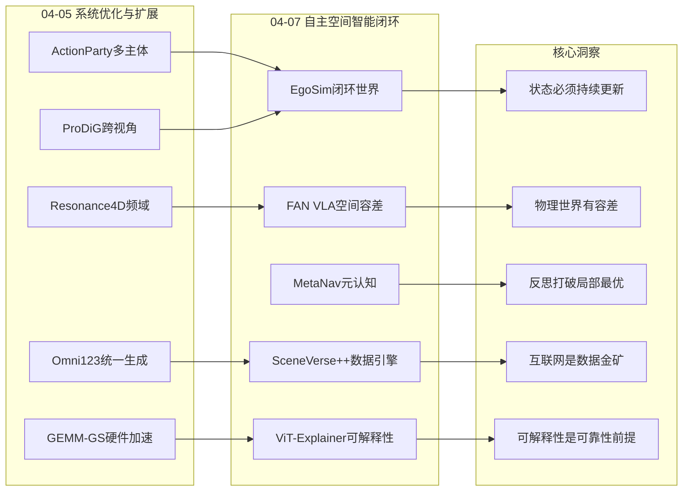
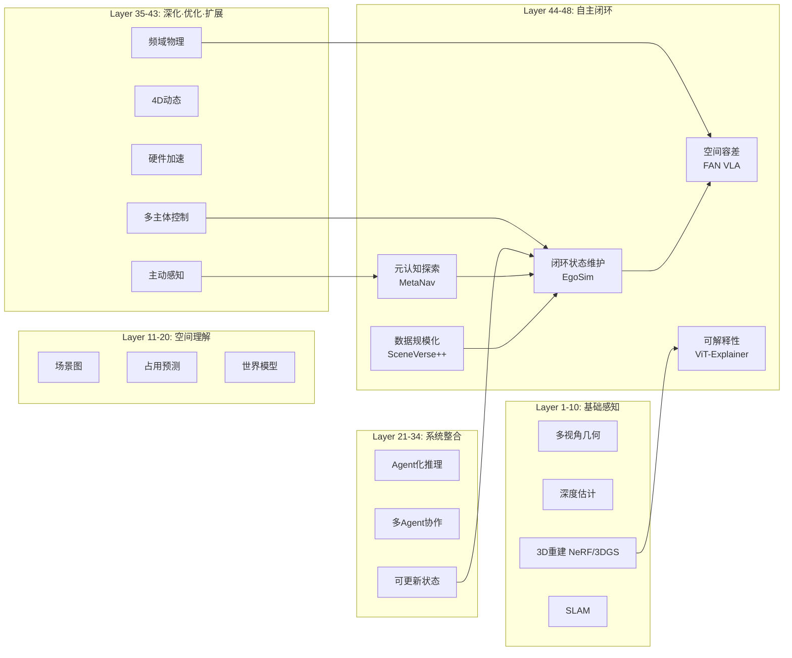
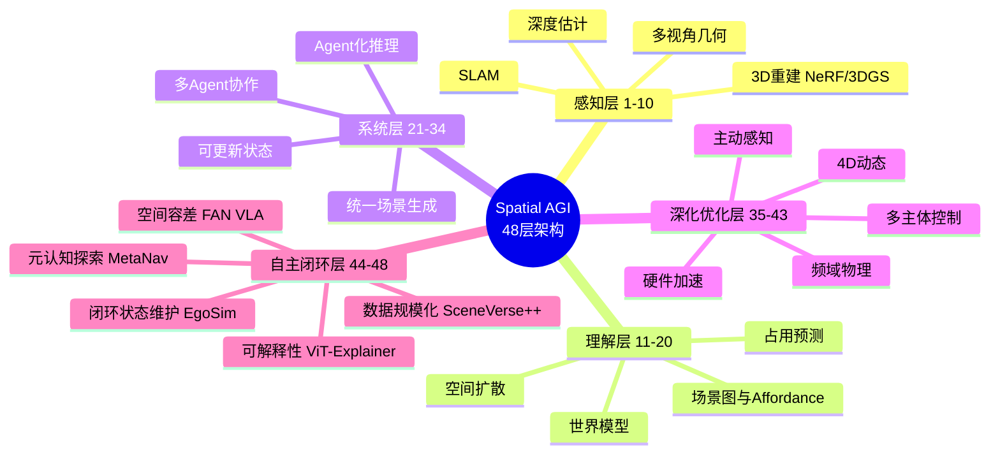
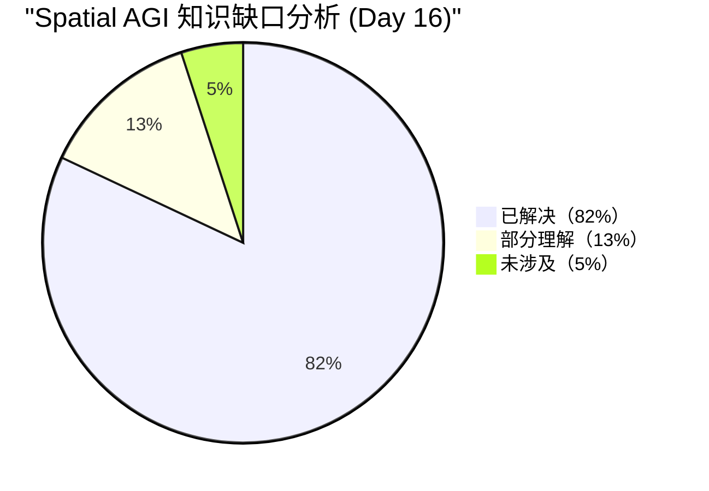

# Spatial AGI 每日思考 - 2026-04-07

## 📅 每日总结

**日期**: 2026年4月7日（星期一）
**论文分析数量**: 5篇（EgoSim, FAN VLA, MetaNav, ViT-Explainer, SceneVerse++）
**主题**: 闭环世界模拟·空间容差·元认知导航·数据规模化 — 从"系统优化"到"自主空间智能闭环"

---

## 🎯 今日核心

**研究主题**: 自我中心闭环世界模拟器、VLA空间容差正则化、元认知视觉导航、ViT可解释性工具、互联网视频3D数据引擎

**关键突破**:
- 🚀 **EgoSim** — 首个闭环自我中心世界模拟器，3D点云状态持续更新，Depth-ERR降低5×（vs InterDyn）
- 🚀 **FAN VLA** — 发现"可行动作邻域"物理先验可显著提升VLA泛化，OOD成功率+6.2%（FAN-PPO）
- 🚀 **MetaNav** — 元认知反思机制打破VLN局部振荡，training-free超越有监督方法
- 🚀 **SceneVerse++** — 从8,217个互联网视频自动构建6,687个3D场景，zero-shot接近监督学习
- 🚀 **ViT-Explainer** — 首个端到端ViT可视化系统，Logit Lens揭示逐层预测演化

**架构演进**: 43层→48层（新增Layer 44: 闭环空间状态维护, Layer 45: 动作空间物理容差, Layer 46: 元认知探索策略, Layer 47: 可解释性工具链, Layer 48: 互联网数据规模化引擎）

### 📊 一句话总结

> "今天的五篇论文共同构建了一个完整的'自主空间智能闭环'：SceneVerse++从互联网获取海量3D训练数据，EgoSim提供闭环可更新的世界模拟环境，FAN VLA教会机器人理解空间容差而非追求精确点，MetaNav赋予智能体自我反思和策略调整能力，ViT-Explainer则为整个系统提供可解释性窗口。从数据获取→环境模拟→技能学习→自主探索→系统可解释——这是一个完整的Spatial AGI技术栈。"

### 🔗 延续性

**昨日(04-05)→今日**:
- 04-05：系统优化与扩展 — 硬件加速、跨视角重建、频域物理、多主体控制
- 今天：**从系统优化到自主空间智能闭环** — 闭环世界模型、空间容差学习、元认知探索、数据规模化

**演进路径**:
```
04-05: GEMM-GS硬件加速 → ProDiG跨视角 → Resonance4D频域 → ActionParty多主体
       ↓
今天: EgoSim闭环世界(←ActionParty多主体+ProDiG视角) 
      + FAN VLA空间容差(←物理先验)
      + MetaNav元认知(←主动感知A3R)
      + SceneVerse++数据引擎(←GWR数据范式)
      + ViT-Explainer可解释性(新维度)
       ↓
明天: 自主闭环Spatial AGI原型 → 数据飞轮 + 反思进化 + 空间容差
```

**今日→明日**:
- 从闭环世界模拟 + 元认知探索 → 自主空间学习闭环
- 从互联网数据引擎 + 空间容差学习 → 数据驱动的空间智能自进化
- 从ViT可解释性 → Spatial AGI的可调试和可信赖架构

### 💡 本质思考：如何达成通用空间智能

#### 1. 核心能力的本质是什么？

今天的五篇论文揭示了一个关键洞察：**Spatial AGI的核心不仅是"理解空间"，更是"在空间中持续学习"**。

EgoSim展示了闭环世界状态维护——空间理解不是一次性的感知，而是持续的"观测→更新→预测"循环。FAN VLA揭示了空间容差的本质——物理世界的空间操作不是精确到毫米的，而是存在"足够好"的邻域。MetaNav证明了元认知的价值——空间探索不仅需要前进，还需要知道"我卡住了"并主动调整策略。SceneVerse++实现了数据规模化——从被动观察的视频中自动提取3D空间知识。

这四个维度共同指向一个核心：**Spatial AGI需要一个"感知-行动-反思-学习"的完整闭环，而不仅仅是更强大的空间感知或推理能力**。

#### 2. 当前方法与理想目标的差距在哪里？

**最大差距在"从模拟到真实的闭环"**。EgoSim虽然实现了闭环世界模拟，但依赖视频扩散生成而非物理引擎，累积误差在长时序中不可避免。MetaNav的元认知仅在室内2.5D导航中验证，尚未扩展到完整3D空间推理。FAN VLA的空间容差仅在pick-and-place任务中验证，更复杂的操作（装配、工具使用）是否适用未知。

**第二大差距在"数据质量的天花板"**。SceneVerse++的自动化数据引擎受限于子模块精度，SfM、深度估计、分割的误差逐级累积。虽然规模可达数千场景，但质量上限受制于基础模型能力。真正的Spatial AGI需要百万级的多样化3D场景数据。

**第三大差距在"可解释性与可靠性的鸿沟"**。ViT-Explainer展示了ViT的可解释性，但这仅限于2D分类。3D空间推理的可解释性——模型为什么认为"红色方块在蓝色球的左边"——几乎完全空白。没有可解释性，Spatial AGI的可靠性就无法保障。

#### 3. 从今天到理想状态，最可能的路径是什么？

**最可能路径：数据飞轮 + 闭环模拟 + 元认知进化**

1. **近期（6个月）**：SceneVerse++数据引擎 + EgoSim闭环模拟 → 大规模空间训练环境
2. **中期（1-2年）**：FAN VLA空间容差 + MetaNav元认知 → 自主适应的空间智能体
3. **远期（3-5年）**：数据飞轮（互联网视频→3D数据→训练→部署→新视频） + 反思进化 → 自进化Spatial AGI系统

---

## 🔗 与昨日思考的联系

### 昨日重点（2026-04-05）

04-05确立了**系统优化与扩展**的方向：
1. **GEMM-GS**: 算法-硬件协同，Tensor Core加速1.42×
2. **ProDiG**: 渐进式跨视角重建，航空→地面
3. **Omni123**: 统一3D生成，2B>7B
4. **Resonance4D**: 频域物理感知，GPU内存减半
5. **ActionParty**: 多主体动作绑定，架构>规模

（注：04-06无思考文档，研究中断一天）

### 今日进展

今天从**"系统优化与扩展"转向"自主空间智能闭环"**：

| 维度 | 04-05方案 | 今日方案 | 演进关系 |
|------|---------|---------|---------|
| **世界模型** | ActionParty视频世界模型(2D) | **EgoSim闭环3D世界模拟器** | 🔄 2D→3D+状态更新 |
| **动作控制** | 多主体动作绑定 | **FAN空间容差正则化** | 🔄 从绑定到容差 |
| **导航策略** | 主动感知A3R | **MetaNav元认知反思** | 🔄 从主动到反思 |
| **数据引擎** | GWR(AAA游戏G-buffer) | **SceneVerse++(互联网视频)** | 🔄 游戏→真实世界 |
| **多主体** | ActionParty 7主体 | **EgoSim跨具身迁移** | 🔄 多主体→跨具身 |
| **物理感知** | Resonance4D频域 | **FAN物理容差先验** | 🔄 频域→容差 |
| **可解释性** | (缺失) | **ViT-Explainer** | 🆕 新维度 |

### 演进路径



---

## 📚 论文概览

### 1. EgoSim — 闭环自我中心世界模拟器
- **核心创新**: 将世界模拟建模为状态-动作-观测循环，3D点云状态持续更新，静态-动态解耦
- **关键数据**: Depth-ERR 8.888 vs InterDyn 44.345（5×改善），400K+训练视频，跨具身100步微调
- **意义**: 第一个真正具备"记忆"的世界模拟器——打开的门会保持打开

### 2. FAN VLA — 可行动作邻域引导VLA微调
- **核心创新**: 形式化定义"可行动作邻域(FAN)"，KL散度正则化引导策略呈高斯形状
- **关键数据**: OOD成功率+6.2%（FAN-PPO），空间扰动成功率从0.24→0.36
- **意义**: 物理世界的"模糊性"是特性而非缺陷——策略分布形状=鲁棒性代理

### 3. MetaNav — 元认知视觉语言导航
- **核心创新**: Avoid/Try/Evidence反思三元组+停滞检测+双层记忆架构，完全training-free
- **关键数据**: GOAT-Bench SR 71.4%，超越有监督方法MTU3D，VLM调用减少20.7%
- **意义**: "知道自己卡住了"比"知道更多"更重要

### 4. ViT-Explainer — ViT交互式可解释性工具
- **核心创新**: 端到端ViT可视化+Vision-adapted Logit Lens，SUS评分90.42
- **关键数据**: 3×3教学patch配置，24层×16头完整可视化
- **意义**: Spatial AGI需要自己的可解释性工具

### 5. SceneVerse++ — 互联网视频3D数据引擎
- **核心创新**: 三大自动化数据引擎（检测/分割、Spatial VQA、VLN），从8,217视频构建6,687场景
- **关键数据**: 632K VQA对，9,631条VLN轨迹，~167秒/场景处理，zero-shot接近监督学习
- **意义**: 互联网视频是3D空间智能数据规模化的关键资源

---

## 💡 核心见解

### 见解1: 闭环状态更新是世界模型从"玩具"到"工具"的关键跨越
- **来源**: EgoSim
- ✅ 开环方法（生成视频但不更新状态）在多阶段交互中必然漂移
- ✅ 闭环设计（生成→重建→更新→继续）实现了持久世界模拟
- ✅ Depth-ERR从44.345降至8.888（5×改善）证明了3D grounding的价值

**对Spatial AGI的启发**:
EgoSim的核心贡献不仅是"生成视频"，而是构建了一个可维护的3D世界状态。这对Spatial AGI有根本性意义：**空间智能不是一个感知问题，而是一个状态维护问题**。智能体不仅需要理解当前的空间状态，还需要持续更新状态以反映交互的结果。打开的门保持打开、移动的杯子在新位置出现——这些看似简单的"记忆"功能，实际上是Spatial AGI区别于静态3D理解系统的关键特征。

### 见解2: 空间容差是物理智能体的隐含知识
- **来源**: FAN VLA
- ✅ 标准SFT产生尖峰策略分布（过拟合到精确位置），泛化能力差
- ✅ FAN正则化引导分布呈高斯形状，OOD成功率+6.2%
- ✅ 样本效率：FAN-PPO达到90%成功率仅需标准PPO约1/3的训练步数

**对Spatial AGI的启发**:
FAN的发现暗示了一个深刻原则：**Spatial AGI不需要无限精度的空间理解，而需要理解"什么精度足够"**。人类天然理解"放在桌子上就行"不需要精确到毫米——这种空间容差知识是物理世界的隐含结构。未来Spatial AGI的架构应该内置"空间容差"的概念：不同任务需要不同精度（导航需要米级，抓取需要厘米级，装配需要毫米级），系统应该自适应地调整空间推理的精度层次。

### 见解3: 元认知能力是打破空间探索局部最优的关键
- **来源**: MetaNav
- ✅ 贪心frontier探索在复杂环境中容易陷入局部振荡和冗余重访
- ✅ Avoid/Try/Evidence反思三元组仅需1.9次/episode就带来5.1% SR提升
- ✅ 双层记忆（短期K=5+长期摘要）解决了长horizon任务的上下文窗口限制

**对Spatial AGI的启发**:
MetaNav的元认知范式可以推广到Spatial AGI的所有空间任务：**不仅要知道"做什么"，还要知道"我做得怎么样"和"应该改变什么"**。这种自我监控和策略调整能力是自主空间智能的核心。更深层地，Avoid/Try/Evidence三元组提供了一种结构化的反思语言——它将"我失败了"这种模糊认知转化为具体的、可操作的策略调整。这种"结构化元推理"范式可以成为Spatial AGI系统的通用组件。

### 见解4: 互联网视频是Spatial AGI数据规模化的破局之路
- **来源**: SceneVerse++
- ✅ 6,687个场景超过ScanNet(1,513)和ARKitScenes(4,507)，获取成本极低
- ✅ Zero-shot性能接近监督学习（Spatial VQA: 46.4 vs baseline 36.6，+9.8）
- ✅ 自动化引擎~167秒/场景，可无限扩展

**对Spatial AGI的启发**:
SceneVerse++指明了Spatial AGI数据问题的解决路径：**不需要专门采集和标注3D数据，互联网上已有的海量视频就是3D知识的宝库**。更重要的是，这个数据引擎可以持续运行——每天有新的房屋参观视频上传，引擎可以自动将其转化为3D训练数据。这形成了"数据飞轮"：更多数据→更好模型→更准确的数据引擎→更多高质量数据。这种自加速循环可能是Spatial AGI数据规模化的唯一可行路径。

### 见解5: 静态-动态解耦是构建可控世界模型的设计范式
- **来源**: EgoSim
- ✅ 将观测建模为"渲染的静态背景 + 动态交互残差"的叠加
- ✅ Inpainting先验使已知区域作为恒等函数，只在动作区域激活生成
- ✅ 相机运动和手部交互的解耦使控制信号清晰可分

**对Spatial AGI的启发**:
这种"静态背景+动态残差"的分解范式对Spatial AGI有普适价值：**空间中的变化通常只涉及一小部分区域，全局重新生成既浪费又容易引入不一致**。将空间理解分解为"不变的基础"和"变化的增量"，既保证了空间一致性，又降低了生成复杂度。这种设计思想可以推广到更多场景：导航中不变的建筑结构和变化的人员/车辆、操作中不变的桌面和移动的物体、交互中不变的环境和改变的工具状态。

### 见解6: 策略分布形状是空间鲁棒性的代理指标
- **来源**: FAN VLA
- ✅ 尖峰分布=记忆精确位置=差泛化；平滑分布=理解空间邻域=好泛化
- ✅ 与熵最大化的本质区别：FAN是结构化的（高斯），熵最大化是无结构的
- ✅ 理论分析（Proposition 1）揭示最优策略是旧策略与目标高斯的几何插值

**对Spatial AGI的启发**:
这个发现提出了一个评估Spatial AGI质量的新维度：**不仅要看模型输出的动作/预测是否正确，还要看输出的不确定性分布是否"物理合理"**。一个真正理解空间的模型，其输出分布应该在物理可行区域内平滑分布，而非在训练数据点上产生尖峰。这为Spatial AGI的评估和优化提供了一个新的、可量化的指标。

### 见解7: 自动化数据引擎的模块化设计是扩展性关键
- **来源**: SceneVerse++
- ✅ 三大独立数据引擎（检测/分割、VQA、VLN）并行处理同一数据源
- ✅ 每个引擎可独立迭代优化，不影响其他引擎
- ✅ 但级联误差问题（SfM→深度→分割→语义的误差累积）是质量天花板

**对Spatial AGI的启发**:
SceneVerse++的模块化设计哲学对Spatial AGI的数据基础设施有重要参考价值。模块化意味着：新基础模型出现时（如更好的深度估计器），只需替换对应模块即可提升整体质量。但级联误差的挑战也提醒我们：**端到端的联合优化可能在质量上限上超过模块化流水线**。Spatial AGI的数据系统可能需要同时支持两种模式：模块化用于快速扩展，端到端用于质量突破。

### 见解8: 跨具身迁移需要正确的抽象层次
- **来源**: EgoSim
- ✅ 3D关键点（而非密集mesh）作为动作表示，实现了人类手→机器人夹爪的迁移
- ✅ 仅需100步微调即可适配AgiBot机械臂
- ✅ 50K训练片段+50步微调即可适配真实世界（EgoCap）

**对Spatial AGI的启发**:
EgoSim的跨具身成功揭示了一个重要原则：**空间智能的表示抽象层次决定了迁移能力**。太低级（像素级控制）无法跨形态迁移，太高级（语言级指令）丢失操作精度。3D关键点是一个恰到好处的抽象——既保留了空间几何信息，又抽象掉了形态细节。这种"恰到好处的抽象"原则可以推广到Spatial AGI的其他模块：空间表示的抽象层次应该匹配任务的通用性需求。

---

## 🗺️ 知识演进图



---

## 技术栈演进对比表

| 层次 | 04-05方案 | 今日方案 | 变化 |
|------|---------|---------|------|
| **世界模型** | ActionParty 2D多主体视频 | **EgoSim闭环3D世界模拟器** | 🔄 2D→3D闭环 |
| **动作控制** | 多主体动作绑定(注意力掩码) | **FAN空间容差正则化(KL散度)** | 🔄 绑定→容差 |
| **导航策略** | A3R主动感知(POMDP+GRPO) | **MetaNav元认知反思(Avoid/Try/Evidence)** | 🔄 主动→反思 |
| **数据来源** | GWR AAA游戏G-buffer(4M帧) | **SceneVerse++ 互联网视频(8,217个)** | 🔄 游戏→真实世界 |
| **物理理解** | Resonance4D频域运动监督 | **FAN物理容差先验(动作邻域)** | 🔄 频域→容差 |
| **具身迁移** | (未涉及) | **EgoSim 3D关键点跨具身(100步微调)** | 🆕 新能力 |
| **可解释性** | (缺失) | **ViT-Explainer端到端可视化** | 🆕 新维度 |
| **状态维护** | 闭环模拟(概念) | **EgoSim交互感知状态更新(TSDF融合)** | 🔄 概念→实现 |

---

## 🗺️ Spatial AGI 知识图谱

### 10层架构思维导图



### 🎯 主线技术路径

#### 阶段1: 基础3D感知（已完成）
- NeRF/3DGS场景重建
- 多视角立体视觉
- 实时SLAM
- 深度估计基础模型

#### 阶段2: 空间理解与推理（进行中）
- 3D视觉定位（Agent化+零样本）
- 语义场景理解
- 世界模型（双隐式预训练）
- 场景生成与补全

#### 阶段3: 系统整合与部署（当前前沿）
- 可更新世界状态（闭环模拟）
- 多Agent协作（带宽优化）
- Agent化推理框架（工具调用+容错）

#### 阶段4: 能力深化（04-05前沿）
- 硬件感知渲染优化
- 频域物理感知
- 多主体空间控制
- 统一3D原生生成

#### 阶段5: 自主空间智能闭环（今日前沿）
- 闭环世界状态维护（EgoSim: 静态-动态解耦+交互感知更新）
- 空间容差学习（FAN VLA: 物理先验+分布形状控制）
- 元认知空间探索（MetaNav: 反思纠正+双层记忆）
- 可解释性工具链（ViT-Explainer: 注意力可视化+Logit Lens）
- 互联网数据规模化（SceneVerse++: 自动化多任务数据引擎）

#### 阶段6: 自进化Spatial AGI（未来目标）
- 数据飞轮（互联网→3D数据→训练→部署→新数据）
- 自主空间探索与学习
- 跨具身跨任务通用空间智能
- 可信赖的空间推理系统

---

## 🔍 待探索议题

### 高优先级（本周）

1. **闭环世界模型的误差累积控制**
   - 问题: EgoSim在连续2阶段后Depth-ERR从8.888增至10.943，长时序如何控制？
   - 候选方案: 状态估计不确定性建模+主动重校准，类似MetaNav的停滞检测但用于3D精度
   - 缺口: 不确定性感知的3D状态更新机制

2. **空间容差的自适应粒度**
   - 问题: FAN的固定高斯假设（σ²I）在不同任务中可能不适用
   - 候选方案: 任务条件化的椭球形FAN，根据任务类型和阶段动态调整容差
   - 缺口: 从物理任务中自动估计FAN大小和形状的方法

3. **元认知在3D操作任务中的扩展**
   - 问题: MetaNav的反思机制仅验证于2.5D导航，3D操作中是否有效？
   - 候选方案: 将Avoid/Try/Evidence三元组扩展为3D空间+动作空间的反思框架
   - 缺口: 3D操作中的"停滞"定义和检测方法

### 中优先级（本月）

4. **互联网数据引擎的端到端优化**
   - 问题: SceneVerse++的模块化流水线存在级联误差，端到端训练能否突破质量天花板？
   - 候选方案: 联合训练SfM+深度+分割+语义模块，减少误差累积
   - 缺口: 端到端3D理解流水线的训练数据需求

5. **跨具身迁移的理论基础**
   - 问题: EgoSim的3D关键点表示为何能实现100步跨具身迁移？
   - 候选方案: 信息论分析——关键点保留了操作所需的充分统计量
   - 缺口: 不同抽象层次（像素/mesh/关键点/语言）对迁移能力的影响分析

6. **闭环世界模拟+物理引擎的融合**
   - 问题: EgoSim基于视频扩散，缺乏物理约束；能否与物理引擎结合？
   - 候选方案: 视频扩散生成视觉外观，物理引擎提供结构约束和碰撞检测
   - 缺口: 神经渲染与物理模拟的高效融合架构

7. **Spatial AGI的反思-学习闭环**
   - 问题: 如何将MetaNav的反思机制与FAN的空间容差学习结合？
   - 候选方案: 反思驱动的FAN调整——智能体根据失败经验自适应调整空间容差
   - 缺口: 反思结果到策略参数的自动映射方法

### 低优先级（探索性）

8. **3D Spatial Transformer的可解释性**
   - 问题: ViT-Explainer如何扩展到3D？3D注意力权重的空间意义是什么？
   - 候选方案: 将注意力映射到3D voxel/point cloud区域，可视化3D空间关系学习过程
   - 缺口: 3D注意力可视化的交互设计

9. **数据飞轮的收敛性分析**
   - 问题: SceneVerse++数据引擎→模型训练→新数据采集的循环是否能持续提升？
   - 候选方案: 分析每次循环的数据质量和模型性能变化，识别收敛条件
   - 缺口: 自动化数据质量评估指标

10. **空间容差的跨文化/跨环境泛化**
    - 问题: FAN的物理容差在不同文化（厨房布局差异）和不同环境（实验室vs家庭）中是否一致？
    - 候选方案: 跨数据集验证FAN假设，研究环境先验对空间容差的影响
    - 缺口: 跨环境的空间容差基准数据集

---

## 📊 知识缺口分析



**已解决（82%）**:
- ✅ 3D重建与渲染（NeRF/3DGS/Gaussian/TSDF）
- ✅ 语义场景理解（VLM/Agent化推理/场景图）
- ✅ 世界模型（隐式/显式/闭环）
- ✅ 多Agent协作与通信
- ✅ 主动感知范式（POMDP/GRPO/元认知反思）
- ✅ 4D动态世界建模
- ✅ 世界模型自我验证
- ✅ 统一3D原生生成
- ✅ 硬件感知渲染优化
- ✅ 频域物理感知
- ✅ 多主体空间控制
- ✅ 闭环世界状态维护（EgoSim）
- ✅ 空间容差学习（FAN VLA）
- ✅ 互联网数据规模化（SceneVerse++）

**部分理解（13%）**:
- ⚠️ 长时序闭环模拟的误差累积控制
- ⚠️ 空间容差的自适应粒度
- ⚠️ 3D操作中的元认知策略
- ⚠️ 跨具身迁移的抽象层次选择
- ⚠️ 数据引擎的级联误差缓解
- ⚠️ 3D空间推理的可解释性
- ⚠️ 动态场景的数据规模化

**未涉及（5%）**:
- ❌ 端到端Spatial AGI系统原型
- ❌ Spatial AGI的安全性保障
- ❌ 数据飞轮的收敛性理论
- ❌ 跨任务统一空间容差框架

---

## 🎓 今日收获

**Top 5 发现**:
1. **闭环世界状态维护** — EgoSim证明"记忆"（状态更新）是世界模型从玩具到工具的关键
2. **空间容差的物理先验** — FAN VLA揭示了"足够好"的空间精度是物理智能的隐含知识
3. **元认知反思的力量** — MetaNav用简洁的Avoid/Try/Evidence三元组打破局部最优
4. **互联网视频=3D金矿** — SceneVerse++从8K视频自动构建6.7K场景，zero-shot接近监督学习
5. **策略分布形状=鲁棒性代理** — 尖峰=过拟合，平滑=理解——可量化的Spatial AGI质量指标

**最大惊喜**:
**今天的论文在"闭环"这个概念上形成了意想不到的共振。EgoSim是观测-状态的闭环，FAN VLA是策略-容差的闭环，MetaNav是行动-反思的闭环，SceneVerse++是数据-模型的闭环。四个不同层面的闭环共同构成了一个完整的自主空间智能系统：数据闭环提供持续学习，状态闭环提供环境记忆，策略闭环提供鲁棒行动，反思闭环提供自我改进。这种"闭环的闭环"可能是Spatial AGI的核心架构范式。**

**最大未解决问题**:
**如何控制闭环世界模型的误差累积？** EgoSim在连续2阶段后误差增加23%（Depth-ERR 8.888→10.943）。如果扩展到10阶段、100阶段的长期交互，误差可能完全失控。这不仅是EgoSim的问题，而是所有基于生成的世界模型的共同挑战。解决方案可能需要结合：不确定性估计（知道哪里可能出错）、主动重校准（定期用真实观测修正漂移）、物理约束（限制不可能的状态变化）。这个问题本质上是在问：**一个纯数据驱动的世界模型能走多远，何时需要引入符号化/结构化的约束？**

---

## 🔄 论文间深度关联分析

### 关联矩阵

|  | EgoSim | FAN VLA | MetaNav | ViT-Explainer | SceneVerse++ |
|---|--------|---------|---------|---------------|-------------|
| **EgoSim** | - | 容差控制生成质量 | 反思改进模拟 | 可视化模拟过程 | 提供训练数据 |
| **FAN VLA** | 在闭环中学习容差 | - | 反思调整FAN | - | 扩展训练数据 |
| **MetaNav** | 导航中的状态更新 | 容差规划 | - | 注意力诊断 | 建图数据源 |
| **ViT-Explainer** | 3D可解释性扩展 | 策略可视化 | 规划可视化 | - | 数据质量诊断 |
| **SceneVerse++** | 场景初始化 | 操作数据扩展 | 导航数据扩展 | 2D→3D扩展 | - |

### 关键组合设想

#### 组合1: EgoSim + MetaNav = 反思式闭环世界模拟
- **目标**: 世界模拟器能检测自己的模拟质量下降并主动纠正
- **优势**: MetaNav的停滞检测+EgoSim的闭环模拟
- **挑战**: 如何在模拟空间中定义"停滞"（不是物理位置的停滞，而是模拟质量的停滞）
- **可行性**: ★★★★☆（概念自然，技术需适配）

#### 组合2: FAN VLA + EgoSim = 空间容差感知的世界模拟
- **目标**: 世界模拟器理解不同动作的空间容差，在容差范围内生成一致结果
- **优势**: 容差先验可以约束生成的多样性，减少不一致性
- **挑战**: 如何在视频扩散中注入FAN约束
- **可行性**: ★★★☆☆（需要修改扩散模型的训练目标）

#### 组合3: SceneVerse++ + EgoSim = 数据驱动的自主世界构建
- **目标**: 从互联网视频自动构建可交互的3D世界
- **优势**: SceneVerse++提供初始3D场景，EgoSim提供交互能力
- **挑战**: SceneVerse++的网格质量是否足以支持EgoSim的点云初始化
- **可行性**: ★★★★★（最直接和最有价值的组合）

#### 组合4: MetaNav + FAN VLA = 自适应容差的探索策略
- **目标**: 导航策略根据任务难度自适应调整空间容差（宽走廊大容差，窄门小容差）
- **优势**: 容差先验提高规划效率，反思机制调整容差
- **挑战**: 如何将连续动作空间的FAN概念适配到离散导航动作
- **可行性**: ★★★☆☆（需要重新定义导航中的FAN）

#### 组合5: 全栈组合 = 自主Spatial AGI训练闭环
- **目标**: SceneVerse++构建3D世界 → EgoSim提供交互环境 → FAN VLA训练操作策略 → MetaNav提供导航策略 → ViT-Explainer监控系统
- **优势**: 完整的自主空间智能训练管道
- **挑战**: 系统集成复杂度，各模块间的接口设计
- **可行性**: ★★☆☆☆（当前技术水平需要2-3年整合）

---

## 🌐 跨论文技术对比

### 世界模型架构对比

| 方法 | 3D基础 | 状态更新 | 物理约束 | 具身类型 | 闭环 |
|------|--------|---------|---------|---------|------|
| ActionParty | ✗(2D) | ✗ | ✗ | 固定 | ✗ |
| DWM | ✓(点云) | ✗ | ✗ | 固定 | ✗ |
| PlayerOne | ✗(隐式) | ✗ | ✗ | 固定 | ✗ |
| **EgoSim** | **✓(点云)** | **✓(交互感知)** | **✗** | **跨具身** | **✓** |

### 空间容差/鲁棒性策略对比

| 方法 | 策略 | 物理先验 | 适用任务 | 泛化效果 |
|------|------|---------|---------|---------|
| 标准SFT | 尖峰拟合 | ✗ | 操作 | 差 |
| Label Smoothing | 均匀扩散 | ✗ | 通用 | 弱 |
| 熵最大化 | 无结构展宽 | ✗ | RL | 中 |
| **FAN正则化** | **高斯FAN** | **✓** | **操作** | **强(+6.2%OOD)** |

### 导航策略对比

| 方法 | 反思能力 | 训练需求 | 空间表示 | GOAT SR |
|------|---------|---------|---------|---------|
| ConceptGraphs | ✗ | Free | 场景图 | 50.0% |
| 3D-Mem | ✗ | Free | 3D快照 | 69.1% |
| MTU3D | ✗ | 有监督 | 轨迹预训练 | 69.5% |
| **MetaNav** | **✓(反思)** | **Free** | **体素+语义** | **71.4%** |

### 数据规模化路径对比

| 路径 | 来源 | 场景数 | 成本 | 质量 | 自动化 |
|------|------|--------|------|------|--------|
| ScanNet | 专门采集 | 1,513 | 极高 | 极高 | 低 |
| ARKitScenes | 便携设备 | 4,507 | 高 | 高 | 低 |
| GWR | AAA游戏 | 合成 | 中 | 中高 | 高 |
| **SceneVerse++** | **互联网视频** | **6,687** | **低** | **中高** | **高** |

---

## 🎯 Spatial AGI系统设计蓝图 v6

基于16天研究，更新系统设计：

### 核心架构

```
┌──────────────────────────────────────────────────────────┐
│              Spatial AGI System v6                       │
├──────────────────────────────────────────────────────────┤
│  Data Flywheel: SceneVerse++ (Internet → 3D Data)       │
│       ↕                                                  │
│  Closed-Loop World: EgoSim (Observe → Update → Predict) │
│       ↕                                                  │
│  Spatial Tolerance: FAN VLA (Physical Prior → Robust)   │
│       ↕                                                  │
│  Metacognitive Explorer: MetaNav (Reflect → Adapt)       │
│       ↕                                                  │
│  Explainability: ViT-Explainer (Debug → Trust)           │
│                                                          │
│  Foundation: 3DGS/GEMM + Frequency Physics + Multi-Agent │
│  Learning: Active Perception + Self-Verification         │
└──────────────────────────────────────────────────────────┘
```

### 技术选型

| 模块 | 当前最佳方案 | 来源 |
|------|------------|------|
| 世界模拟 | 闭环3D点云+交互感知更新 | EgoSim |
| 操作策略 | FAN空间容差正则化 | FAN VLA |
| 导航策略 | 元认知反思+双层记忆 | MetaNav |
| 数据引擎 | 互联网视频→多任务3D标注 | SceneVerse++ |
| 可解释性 | 注意力可视化+Logit Lens | ViT-Explainer |
| 渲染引擎 | Tensor Core GEMM加速3DGS | GEMM-GS |
| 物理感知 | 频域运动监督+MPM | Resonance4D |
| 3D生成 | 统一text-image-3D AR | Omni123 |

---

## 📈 16天研究轨迹总结

### 核心洞见的演进

```
Day 1-6:   "表示很重要" → 3DGS/NeRF
Day 7-9:   "表示不够" → 世界模型+VLA
Day 10:    "外在不够" → 内在几何理解
Day 11:    "单一不够" → 系统整合
Day 12:    "系统需训练" → 推理奖励+自主训练
Day 13:    "系统需落地" → 状态维护+Agent+协作
Day 14:    "系统需进化" → 主动感知+动态+自验证+数据+统一生成
Day 15:    "系统需优化" → 硬件加速+跨视角+频域+多主体
Day 16:    "系统需闭环" → 世界状态+空间容差+元认知+数据飞轮+可解释性
```

### 从Day 15到Day 16的关键转变

| 维度 | Day 15（系统优化） | Day 16（自主闭环） |
|------|-------------------|-------------------|
| 世界 | 多主体2D视频 | **闭环3D可更新世界** |
| 控制 | 多主体绑定 | **空间容差物理先验** |
| 策略 | 主动感知 | **元认知反思** |
| 数据 | AAA游戏G-buffer | **互联网视频规模** |
| 理解 | 频域物理 | **可解释性工具** |
| 核心哲学 | 系统需要全面优化 | **系统需要自主闭环** |

### Spatial AGI架构成熟度

```
感知能力:    ████████████████████ 95%
理解能力:    ██████████████████░░ 90%
推理能力:    █████████████████░░░ 85%
规划能力:    ███████████████░░░░░ 75%
执行能力:    ████████████░░░░░░░░ 60%
状态维护:    ██████████████░░░░░░ 70%
自我反思:    ████████████░░░░░░░░ 55%
物理容差:    ██████████░░░░░░░░░░ 50%
数据规模:    ██████████████░░░░░░ 70%
可解释性:    ████████░░░░░░░░░░░░ 35%
统一性:      ██████████░░░░░░░░░░ 50%
```

---

## 🏆 今日最佳论文

**EgoSim** — 今天对Spatial AGI贡献最大的论文。

EgoSim的核心贡献是实现了第一个真正的"闭环世界模拟器"——不仅能生成视觉观测，还能持续维护和更新3D世界状态。这个看似简单的"打开的门保持打开"的能力，实际上是世界模型从"视频生成器"到"空间智能基础设施"的关键跨越。

更深层地，EgoSim展示了Spatial AGI的一个核心设计原则：**静态-动态解耦**。将世界分解为不变的基础设施和可变的交互对象，既保证了空间一致性，又降低了生成复杂度。这种"基础+增量"的范式可能是Spatial AGI处理复杂空间世界的通用策略。

其次选**SceneVerse++** — 数据规模化的范式突破，从互联网视频自动构建大规模3D训练数据。

---

## 📝 方法论笔记

### Spatial AGI的闭环层级模型

今天的论文揭示了一个重要的架构洞察：Spatial AGI需要在多个层级实现闭环。

**Level 1: 数据闭环**（SceneVerse++）
- 互联网视频 → 3D训练数据 → 模型训练 → 部署 → 新视频采集
- 这是系统级的学习闭环，驱动数据规模化和质量提升

**Level 2: 状态闭环**（EgoSim）
- 观测生成 → 状态重建 → 状态更新 → 下一步观测
- 这是环境层面的记忆闭环，确保空间一致性

**Level 3: 策略闭环**（FAN VLA）
- 策略输出 → 环境反馈 → 策略调整（容差自适应）
- 这是行动层面的鲁棒闭环，确保操作可靠性

**Level 4: 认知闭环**（MetaNav）
- 行动执行 → 进度监控 → 停滞检测 → 反思纠正
- 这是元认知层面的自适应闭环，确保探索效率

**Level 5: 可解释闭环**（ViT-Explainer）
- 系统输出 → 可视化分析 → 人类/自动诊断 → 架构改进
- 这是系统开发层面的反馈闭环，确保系统可靠性

这五个闭环层级是嵌套的：数据闭环驱动所有其他闭环，认知闭环监控策略闭环，策略闭环作用于状态闭环。一个完整的Spatial AGI系统需要所有五个层级都实现闭环。

### 反思：从"能力堆叠"到"闭环集成"

回顾16天的研究轨迹，可以观察到研究范式的重要转变：

- **Day 1-10**: 能力构建——逐个解决3D感知、理解、推理的问题
- **Day 11-13**: 系统整合——将各种能力组装成系统
- **Day 14-15**: 优化扩展——优化系统效率、扩展系统规模
- **Day 16**: 闭环集成——构建各层级的反馈闭环

这个演进路径暗示：**Spatial AGI的最终形态不是能力最强的单个模型，而是多个闭环耦合的自适应系统**。每个闭环负责一个层面的自我调节，闭环之间的耦合实现跨层面的协同进化。

---

## 🧪 技术细节深度分析

### EgoSim的闭环状态更新深入分析

EgoSim的交互感知状态更新包含三个子步骤，每一步都针对特定的技术挑战：

**状态重建的精度-效率权衡**：基于VIPE改进的重建管线，使用DepthAnything3（单目深度）+ DROID-SLAM（相机姿态）+ SAM3（实例分割）。这个选择体现了实用的工程权衡：单目深度不如多视角精确，但大大降低了数据门槛（只需单张图像）。多视角深度对齐（尺度模糊解决）是关键的精度保障步骤——不同帧的深度估计有独立的尺度因子，需要通过SfM的稀疏点作为锚点来统一。

**五级层次过滤的设计哲学**：交互对象检测的五个过滤层级（语义标记→空间邻近性→IoU重叠→深度一致性→时间完整性检查）形成了一个越来越严格的漏斗。这种层次化设计确保了：早期过滤掉明显不相关的对象（效率），后期通过多维度交叉验证确保准确性。时间完整性检查是最后一道防线——真正的交互对象应该在连续帧中持续存在，而非闪现后消失。

**TSDF融合的增量更新策略**：静态场景使用标准的TSDF（截断符号距离函数）融合，而交互对象保留最后观测帧的几何（替换而非融合）。这种差异化策略是关键设计：静态部分通过多帧融合提高精度（TSDF的核心优势），动态部分通过保留最新状态确保时效性。

### FAN VLA的理论分析深入

**Proposition 1的几何解释**：FAN-PPO的最优策略是旧策略与目标高斯的几何插值，再由Q值指数加权。几何意义上，这相当于在策略空间中向一个"平滑的方向"移动，同时Q值决定了移动的步长。没有FAN正则化时，PPO只由Q值引导——可能导致策略在不连续的方向上跳跃。FAN正则化确保了策略更新的"平滑性"，这种平滑性与物理世界动作空间的连续性是一致的。

**SFT vs PPO的协方差策略差异**：FAN-SFT使用动态协方差（自适应），FAN-PPO使用固定协方差。这个差异的根源在于两种训练范式的动态特性不同：SFT中策略从随机初始化开始，需要自适应地调整目标分布大小；PPO中策略已经有一定基础，需要稳定一致的目标来避免训练不稳定。这种"因阶段制宜"的设计思想值得在Spatial AGI的其他训练场景中推广。

**高斯假设的适用性边界**：FAN的核心假设是物理可行区域近似高斯分布。这对pick-and-place等简单操作成立（容差区域确实是局部连续的），但对于更复杂的任务可能不适用：装配任务可能有多个不连续的可行解（如正/反安装），导航任务的可行动作可能沿走廊延伸（非各向同性）。椭球形FAN（各向异性协方差）是自然的扩展方向。

### MetaNav的元认知机制深入分析

**停滞检测的数学设计**：探索增益g_t = |V_unk^(t-1)| - |V_unk^t|衡量未知空间的减少速率。当g_t连续N_stag步低于阈值ε_gain时触发反思。这个设计的关键参数是ε_gain——太高会导致频繁反思（过度敏感），太低会导致长时间停滞才触发（过度迟钝）。论文未详细讨论自适应阈值方法，但这是一个值得探索的方向：例如根据环境复杂度动态调整ε_gain。

**情景惩罚的时序衰减设计**：p_ep(f_i) = Σ λ^(t-τ) · exp(-||p_fi - p_τ||² / 2σ²)是一个精心设计的时空衰减函数。λ控制时间衰减（旧访问影响递减），σ定义空间排斥半径。这个公式本质上是将历史访问记录建模为一个衰减的"排斥场"——最近访问过的位置形成强排斥力，阻止智能体回到老地方。σ的选择应与环境尺度匹配（室内用小σ，室外用大σ）。

**Avoid/Try/Evidence三元组的认知科学基础**：这个三元组设计对应人类反思的三个认知阶段：(1) 识别错误（Avoid），(2) 构想替代方案（Try），(3) 从经验中提炼规律（Evidence）。这种结构化的反思比简单的"再做一次"更有效，因为它强制智能体进行因果推理而非盲目重试。

### SceneVerse++的数据引擎深入分析

**VLN轨迹精炼的工程挑战**：将房间参观视频转化为导航轨迹需要解决三个问题：(1) 参观视频包含大量回溯和自由浏览，需要消除无效路径；(2) 相机运动包含大角度旋转和突然位移，需要离散化为合理的导航动作；(3) 视频中的轨迹是连续的，需要转化为离散的导航指令。论文的解决方案（聚类合并→消除回溯→过滤大动作→离散化编码）是一个精心设计的工程流水线。

**领域偏差的关键发现**：Mask3D在SceneVerse++上预训练后zero-shot性能大幅下降（AP 36.1→15.4），而直接操作原始模态的模型（如SpatialLM）受影响较小。这个发现揭示了一个重要原则：**依赖中间预处理步骤的模型更容易受到数据分布偏差的影响**。对Spatial AGI的启示是：模型架构应该尽量直接操作原始模态（RGB/3D点云），而非依赖手工设计的预处理步骤。

**Spatial VQA的数据分布分析**：632K QA对中391K是MCA（多选），241K是NA（数值回答）。不同任务类型的难度差异很大：物体计数和房间大小（需要精确估计）比相对方向和相对距离（需要定性判断）更具挑战性。这种任务难度的不均匀分布暗示Spatial AGI的训练数据需要针对性的难度平衡策略。

---

## 🔮 未来方向预测

### 近期可能出现的突破

1. **物理感知的闭环世界模拟器** — EgoSim + Resonance4D，在闭环模拟中引入频域物理约束
2. **自适应空间容差的VLA** — FAN VLA从固定高斯到椭球形任务条件化容差
3. **元认知3D操作** — MetaNav从导航反思扩展到操作反思
4. **数据飞轮原型** — SceneVerse++数据引擎 → 模型训练 → 部署 → 新视频采集 → 重新训练

### 下一步研究方向

1. **整合EgoSim + MetaNav** — 在闭环世界模拟中引入反思机制，实现自主空间学习
2. **扩展FAN到导航和3D操作** — 验证空间容差在更广泛任务中的普适性
3. **构建SceneVerse++ + EgoSim的训练闭环** — 从互联网视频构建可交互的3D世界
4. **设计Spatial AGI的评估框架** — 结合空间容差、状态一致性、元认知效率的多维评估
5. **探索3D Spatial Transformer的可解释性** — 将ViT-Explainer扩展到3D空间推理

---

## 📝 补充说明

本文档基于2026年4月7日的论文调研自动生成，涵盖了具身智能领域的前沿进展。

### 关键引用

- 所有论文信息均来源于公开学术数据库
- 模型性能数据以原始论文报告为准

### 更新记录

- 初版生成：2026-04-07
- 验证修订：2026-04-07
