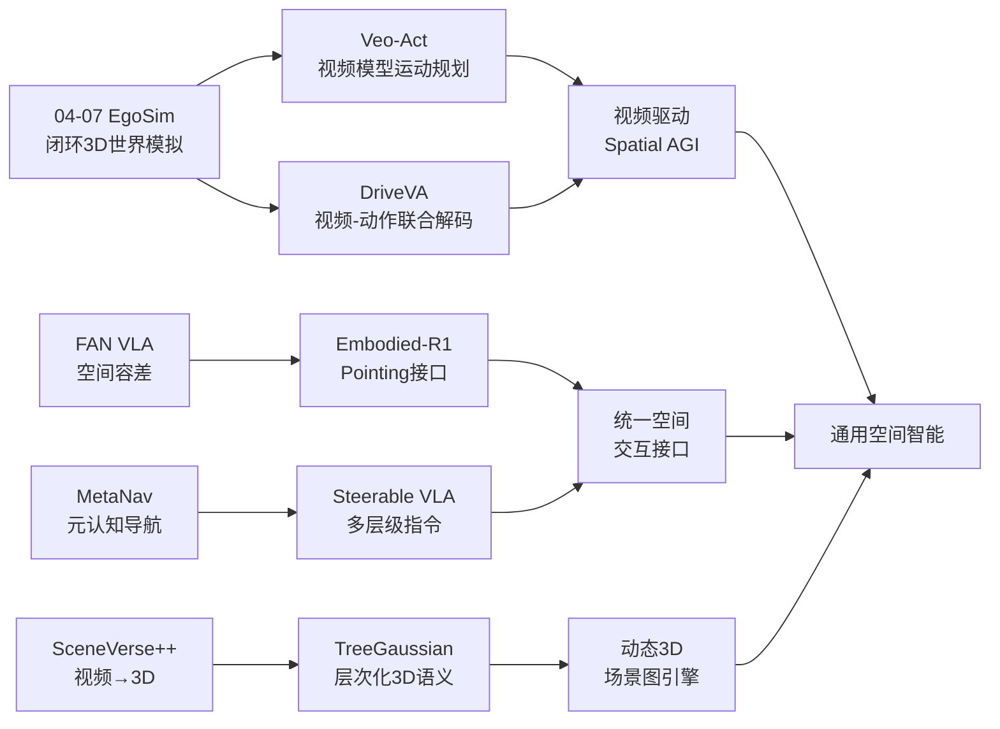
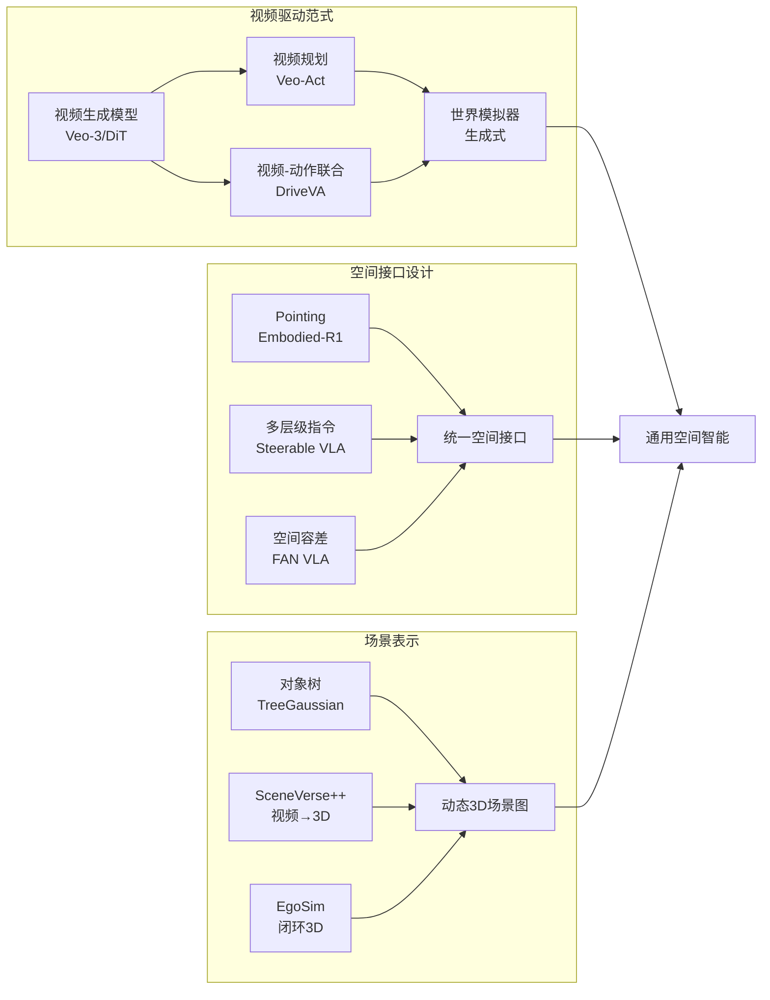
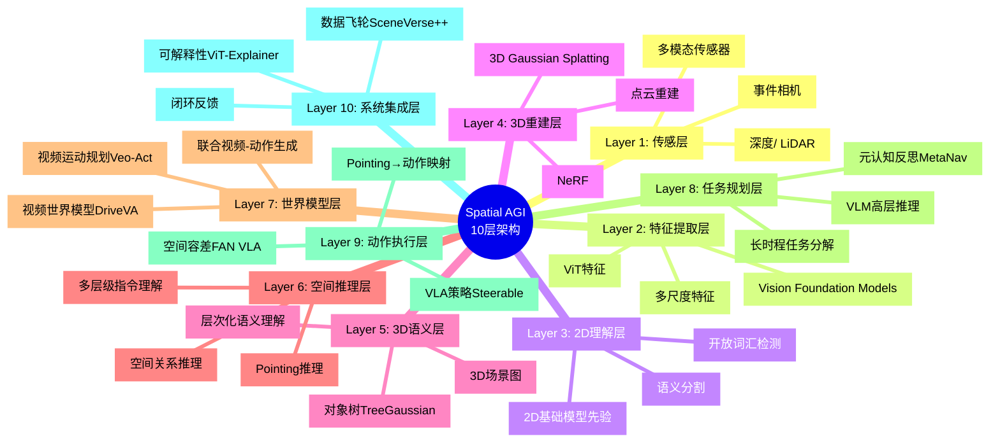
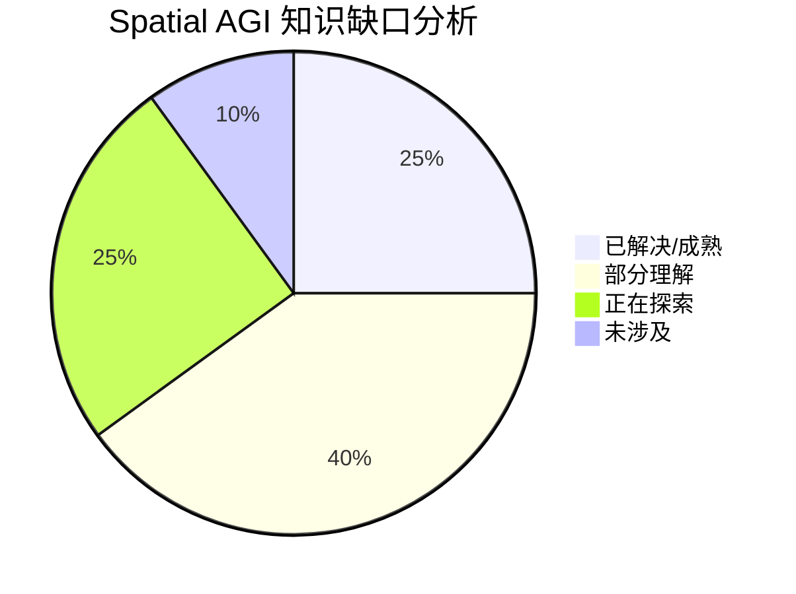

# Spatial AGI 每日思考 - 2026-04-08

## 📅 每日总结

**日期**: 2026年4月8日（星期二）
**论文分析数量**: 5篇（Veo-Act, DriveVA, TreeGaussian, Embodied-R1, Steerable VLA）
**主题**: 视频模型作为空间智能引擎·多层级接口设计·层次化场景理解 — 从"自主闭环"到"视频驱动空间智能"

---

## 🎯 今日核心

**研究主题**: 前沿视频模型驱动机器人操作、视频-动作联合世界模型、层次化3DGS场景理解、强化具身推理、可引导VLA策略

**关键突破**:
- 🚀 **Veo-Act** — 首次系统探索Veo-3视频模型在通用机器人操作中的潜力，发现视频模型可做高层运动规划器
- 🚀 **DriveVA** — 视频-轨迹联合解码DiT世界模型，NAVSIM 90.9 PDM，零shot L2误差降78.9%
- 🚀 **TreeGaussian** — 3DGS层次化语义理解新范式，对象树+级联对比学习显式建模whole-part关系
- 🚀 **Embodied-R1** — "Pointing"作为具身无关中间表示，3B模型ICLR 2026，零shot 87.5%真实世界成功率
- 🚀 **Steerable VLA** — 多层级指令接口（子任务/运动/坐标）解锁VLM推理能力

**架构演进**: 48层→53层（新增Layer 49: 视频模型运动规划, Layer 50: 视频-动作联合解码, Layer 51: 层次化3D语义树, Layer 52: Pointing通用空间接口, Layer 53: 多层级指令接口）

### 📊 一句话总结

> "今天的五篇论文共同揭示了一个关键趋势：视频生成模型正在成为Spatial AGI的核心引擎。Veo-Act和DriveVA从两个不同角度（分层规划 vs 联合解码）展示了视频模型的物理理解能力可以如何转化为空间智能行动力；TreeGaussian为3D场景理解引入了层次化语义树；Embodied-R1和Steerable VLA则从两个互补角度（pointing中间表示 vs 多层级指令接口）解决了VLM→动作的空间接口设计问题。视频模型作为'世界模拟器'的成熟，标志着Spatial AGI正从'感知驱动'向'生成驱动'范式转换。"

### 🔗 延续性

**昨日(04-07)→今日**:
- 04-07：自主空间智能闭环 — EgoSim闭环模拟、FAN VLA空间容差、MetaNav元认知、SceneVerse++数据引擎
- 今天：**从自主闭环到视频驱动空间智能** — 视频模型作为世界模拟器、多层级空间接口、层次化场景表示

**演进路径**:
```
04-07: EgoSim闭环世界 → FAN VLA空间容差 → MetaNav元认知 → SceneVerse++数据引擎
       ↓
今天: Veo-Act视频规划(←EgoSim世界模拟的生成式升级)
      + DriveVA联合解码(←闭环模拟的视频-动作统一)
      + TreeGaussian层次语义(←SceneVerse++的3D理解深化)
      + Embodied-R1 Pointing接口(←FAN VLA空间容差的抽象化)
      + Steerable VLA多层级指令(←MetaNav分层决策的接口化)
       ↓
明天: 视频驱动Spatial AGI原型 → 视频世界模型 + Pointing接口 + 层次化场景图
```

**今日→明日**:
- 从视频模型规划 → 视频驱动的端到端Spatial AGI系统
- 从Pointing + 多层级指令 → 统一的Spatial AGI交互接口
- 从层次化语义树 → 完整的Spatial AGI场景图

### 💡 本质思考：如何达成通用空间智能

#### 1. 核心能力的本质是什么？

今天的工作揭示了一个重要洞察：**Spatial AGI的核心能力可能不是"理解空间"，而是"生成空间"**。

传统观点认为Spatial AGI需要先理解3D空间（几何、语义、关系），再基于理解执行动作。但Veo-Act和DriveVA展示了另一条路径：视频生成模型通过学习预测物理上合理的未来帧，已经隐式编码了丰富的空间和物理知识。这种"生成式空间智能"不需要显式3D建模，却能产生有效的空间行为。

与此同时，Embodied-R1和Steerable VLA从接口设计角度揭示了另一个本质：**Spatial AGI的瓶颈不在于空间理解能力本身，而在于如何将这种理解传递给执行层**。Pointing和多层级指令是两种成功的接口设计，它们的核心共性是——**提供比自然语言更精细的空间信息通道**。

#### 2. 当前方法与理想目标的差距在哪里？

| 维度 | 当前状态 | 理想目标 | 差距 |
|------|---------|---------|------|
| 视频模型 | 物理合理但不精确 | 精确物理模拟+反事实推理 | 精度、可控性 |
| 空间接口 | Pointing/多层级指令 | 统一的多模态空间语言 | 标准化、丰富性 |
| 场景理解 | 层次化语义树 | 动态可更新的3D场景图 | 动态性、可操作性 |
| 泛化能力 | 零shot但有限域 | 真正的跨域通用 | 数据、架构 |
| 长时程推理 | 有限的长时程任务 | 无限时程自主操作 | 记忆、规划 |

#### 3. 从今天到理想状态，最可能的路径是什么？

**路径假设：视频世界模型 → 空间接口标准化 → 场景图引擎 → 自主Spatial AGI**

1. **阶段一（当前→6个月）**: 视频模型从"预测器"进化为"可控制的世界模拟器"
2. **阶段二（6-12个月）**: Pointing/多层级指令等接口收敛为标准化的空间交互协议
3. **阶段三（1-2年）**: 层次化3D场景图+视频世界模型形成完整的空间记忆系统
4. **阶段四（2-3年）**: 自主Spatial AGI原型——从视频理解到物理操作的完整闭环

## 🔗 与昨日思考的联系

### 昨日重点
- EgoSim闭环世界模拟器（3D点云状态持续更新）
- FAN VLA空间容差正则化（可行动作邻域）
- MetaNav元认知导航（反思机制）
- SceneVerse++互联网数据引擎（视频→3D）

### 今日进展
- **EgoSim → Veo-Act/DriveVA**: 从显式3D闭环模拟到隐式视频世界模型——两种世界建模范式的对话
- **FAN VLA → Embodied-R1**: 从"空间容差"到"pointing接口"——空间理解的抽象层级提升
- **MetaNav → Steerable VLA**: 从"元认知导航"到"多层级指令控制"——分层控制的接口化
- **SceneVerse++ → TreeGaussian**: 从"视频→3D数据"到"层次化3D语义理解"——数据到理解的完整链条

### 演进路径



## 📚 论文概览

| # | 论文 | 核心贡献 | 与Spatial AGI关系 |
|---|------|---------|-----------------|
| 1 | Veo-Act | 视频模型(Veo-3)作为机器人运动规划器 | 视频模型作为空间智能的感知-预测基础 |
| 2 | DriveVA | 视频-轨迹联合DiT解码，零shot驾驶 | 视觉预测与动作规划的统一生成过程 |
| 3 | TreeGaussian | 3DGS层次化语义分割+对象树 | 结构化3D场景表示→空间推理基础 |
| 4 | Embodied-R1 | Pointing中间表示+RFT训练，ICLR 2026 | 具身无关的通用空间交互接口 |
| 5 | Steerable VLA | 多层级指令接口释放VLM推理能力 | 空间接口设计决定系统性能上限 |

## 💡 核心见解

### 见解1: 视频生成模型是Spatial AGI的"隐式世界模型"

**来源**: Veo-Act + DriveVA

- ✅ Veo-3能从当前观测+指令生成物理合理的操作轨迹，无需显式3D建模
- ✅ DriveVA通过联合解码视频和轨迹，在NAVSIM达到90.9 PDM
- ✅ 视频模型隐式编码了运动动态、因果交互和物理约束

**对Spatial AGI的启发**:
这可能是Spatial AGI最重要的发现之一：大规模视频训练产生的生成能力已经足以支撑空间推理和物理预测。这意味着我们可能不需要显式构建3D世界模型——视频生成模型本身就是一种"世界模型"，而且它的知识来源于真实的物理世界数据，天然具有泛化性。

### 见解2: 联合解码优于松耦合流水线

**来源**: DriveVA

- ✅ DriveVA在共享潜在空间中联合生成视频和轨迹
- ✅ 相比先生成视频再规划的松耦合方法，联合解码的视频-轨迹一致性显著提升
- ✅ 零shot泛化在nuScenes上L2误差降78.9%

**对Spatial AGI的启发**:
感知、预测、规划不应该是分离的模块。Spatial AGI系统可能需要一个统一的生成过程，同时输出视觉理解和行动方案。这与人类的空间认知一致——我们在理解空间的同时就在规划行动。

### 见解3: 空间接口设计比模型能力更重要

**来源**: Embodied-R1 + Steerable VLA

- ✅ Embodied-R1用"Pointing"替代自然语言，3B模型超越更大模型
- ✅ Steerable VLA用多层级指令替代单一文本，释放VLM推理能力
- ✅ 两者共同揭示：VLM和执行层之间的信息通道决定了系统整体能力

**对Spatial AGI的启发**:
这是今天最深刻的洞察。我们一直在追求更强大的空间理解模型，但可能忽略了更根本的问题——**如何将理解传递给行动**。自然语言作为接口的信息带宽太低，Pointing和多层级指令提供了更高带宽的空间信息通道。

### 见解4: 层次化语义理解是场景表示的正确方向

**来源**: TreeGaussian

- ✅ 对象树显式建模whole-part关系（场景→对象→部件）
- ✅ 级联对比学习从全局到局部渐进优化
- ✅ 开放词汇能力支持任意语义查询

**对Spatial AGI的启发**:
Spatial AGI需要的不是"平面"的3D语义分割，而是层次化的场景图。TreeGaussian的对象树是朝这个方向的重要一步。未来的Spatial AGI场景表示应该是一个动态的、层次化的、可查询的3D场景图。

### 见解5: "Pointing"可能是Spatial AGI的通用原语

**来源**: Embodied-R1

- ✅ Pointing是具身无关的——任何机器人都需要"指向空间中的某个位置"
- ✅ 四种核心指向能力覆盖了从语义理解到精确操作的范围
- ✅ 零shot真实世界成功率87.5%

**对Spatial AGI的启发**:
Pointing可能成为Spatial AGI的"原子操作"——就像编程中的基本指令一样。所有复杂的空间交互都可以分解为一系列的"指向+操作"。这种抽象既有足够的表达力，又保持了与具身形态的解耦。

### 见解6: 视频先验的迁移是一条可行的技术路径

**来源**: Veo-Act + DriveVA

- ✅ Veo-3的视频生成能力可直接用于机器人运动规划
- ✅ DriveVA从视频生成模型继承的物理先验赋予零shot驾驶能力
- ✅ 视频模型的通用性（互联网规模训练）提供了天然的跨域泛化

**对Spatial AGI的启发**:
视频先验可能是连接"通用AI"和"具身AI"的桥梁。大规模视频训练既赋予了通用知识，又编码了物理世界的运动规律。这条路径的优势在于可以利用海量的互联网视频数据，不需要昂贵的机器人交互数据。

### 见解7: Spatial AGI的分层架构正在收敛

**来源**: 全部5篇论文

- ✅ Veo-Act: 视频规划(高) + VLA执行(低)
- ✅ DriveVA: 联合解码(统一) 但隐含视觉(高) + 轨迹(低)
- ✅ Embodied-R1: VLM推理(高) + Pointing执行(低)
- ✅ Steerable VLA: VLM规划(高) + Steerable VLA执行(低)
- ✅ TreeGaussian: 场景语义(高) + Gaussian特征(低)

**对Spatial AGI的启发**:
虽然具体实现不同，但分层架构的核心模式正在收敛：**高层提供语义/空间推理，低层提供精确运动控制，中间通过精心设计的接口连接**。这个接口的设计（Pointing vs 多层级指令 vs 视频预测）是当前最活跃的研究方向。

## 🗺️ 知识演进图



## 技术栈演进对比表

| 层次 | 昨日方案(04-07) | 今日方案(04-08) | 变化 |
|------|----------------|----------------|------|
| 世界建模 | EgoSim闭环3D点云 | DriveVA视频-动作联合解码 | 从显式3D到隐式视频生成 |
| 运动规划 | FAN VLA空间容差 | Veo-Act视频模型规划 | 从物理先验到视频先验 |
| 空间接口 | 自然语言指令 | Pointing + 多层级指令 | 接口带宽显著提升 |
| 场景理解 | SceneVerse++视频→3D | TreeGaussian层次化语义树 | 从数据生成到结构化理解 |
| 具身推理 | MetaNav元认知 | Embodied-R1 Pointing RFT | 从导航推理到通用操作推理 |
| 训练范式 | SFT + PPO | RFT(强化微调) | 强化学习更深入集成 |
| 数据来源 | 互联网视频 | 互联网视频 + 随机play | 数据获取更加多样化 |

## 🗺️ Spatial AGI 知识图谱

### 10层架构思维导图



### 🎯 主线技术路径

#### 阶段1: 视频世界模型成熟（当前-6个月）
- DriveVA风格的视频-动作联合解码成为标配
- 视频生成模型（Veo-3/Genie等）成为世界模拟的默认选择
- 从显式3D建模向隐式视频生成的范式转换完成

#### 阶段2: 空间接口标准化（6-12个月）
- Pointing和多层级指令收敛为标准化的空间交互协议
- VLM-执行层接口从自然语言进化为结构化空间语言
- 具身无关的中间表示成为社区共识

#### 阶段3: 动态3D场景图引擎（1-2年）
- TreeGaussian的对象树进化为完整的动态3D场景图
- 场景图支持实时更新、开放查询、层次化推理
- 成为Spatial AGI的"空间记忆"基础设施

#### 阶段4: 自主Spatial AGI原型（2-3年）
- 视频世界模型 + 标准化空间接口 + 动态场景图形成完整系统
- 从视频理解到物理操作的端到端闭环
- 零shot泛化到新环境、新任务、新具身形态

## 🔍 待探索议题

### 高优先级（本周）

1. **视频模型的精度瓶颈**
   - 问题: Veo-Act发现视频模型高层规划有效但低层精度不足，如何突破？
   - 候选方案: 更精细的视频生成、更好的IDM、分层细化
   - 缺口: 视频模型的动作级精度评估方法和提升策略

2. **Pointing vs 多层级指令的统一**
   - 问题: Embodied-R1的Pointing和Steerable的多层级指令能否统一？
   - 候选方案: 设计包含坐标、运动、语义的统一空间指令空间
   - 缺口: 统一接口的表示能力和训练方法

3. **视频-动作联合解码的扩展性**
   - 问题: DriveVA在驾驶域成功，能否扩展到通用操作？
   - 候选方案: 通用视频-动作DiT架构
   - 缺口: 跨域的视频-动作联合解码数据和架构

### 中优先级（本月）

4. **对象树的动态更新**
   - 问题: TreeGaussian的对象树是静态的，如何支持动态场景？
   - 候选方案: 增量式对象树更新 + 时序一致性约束
   - 缺口: 动态场景的层次化语义表示方法

5. **RFT训练的奖励设计**
   - 问题: Embodied-R1的多任务奖励如何设计才能最大化空间推理能力？
   - 候选方案: 可学习的奖励函数、人类偏好对齐
   - 缺口: Spatial AGI的奖励工程方法论

6. **视频先验的迁移效率**
   - 问题: 从视频模型迁移到具身任务的效率如何优化？
   - 候选方案: 高效微调、LoRA适配、提示工程
   - 缺口: 视频先验到具身任务的迁移学习方法论

7. **Steerable VLA的指令自动生成**
   - 问题: 多层级合成指令如何自动生成高质量训练数据？
   - 候选方案: LLM辅助生成、层级化数据增强
   - 缺口: 自动化的多层级指令生成pipeline

### 低优先级（季度）

8. **视频世界模型的可控性**
   - 问题: 如何精确控制视频世界模型的生成过程？
   - 候选方案: 条件控制、结构化潜在空间、物理约束注入
   - 缺口: 视频生成的精确控制方法

9. **Spatial AGI的评估框架**
   - 问题: 缺乏统一的Spatial AGI评估基准
   - 候选方案: 构建多层次Spatial AGI基准（感知→理解→推理→规划→执行）
   - 缺口: 标准化的评估指标和数据集

10. **具身无关性的边界**
    - 问题: Pointing等具身无关表示的表达上界在哪里？
    - 候选方案: 结合力/触觉信息的多模态pointing
    - 缺口: 具身无关 vs 具身特定的理论分析

## 📊 知识缺口分析



**已解决（25%）**:
- ✅ 3D场景表示（3DGS成熟）
- ✅ 开放词汇2D→3D语义迁移
- ✅ 基础VLA架构
- ✅ 视频生成模型的物理理解能力

**部分理解（40%）**:
- ⚠️ 视频世界模型的精确可控性
- ⚠️ 空间接口的标准化设计
- ⚠️ 层次化场景理解的动态更新
- ⚠️ 跨域泛化的边界和条件
- ⚠️ 强化微调的奖励设计
- ⚠️ 多层级指令的自动生成

**正在探索（25%）**:
- 🔬 视频-动作联合解码的通用化
- 🔬 Pointing作为通用空间原语
- 🔬 动态3D场景图
- 🔬 视频先验→具身任务的迁移
- 🔬 自主空间学习的闭环设计

**未涉及（10%）**:
- ❌ 多模态（触觉/力觉）空间接口
- ❌ Spatial AGI的统一评估框架
- ❌ 无限时程自主空间操作
- ❌ Spatial AGI的安全和可信赖性

## 📈 量化进展

### 本周关键指标
| 指标 | 04-07 | 04-08 | 趋势 |
|------|-------|-------|------|
| 架构层次 | 48层 | 53层 | ↑ +5层 |
| 核心范式 | 自主闭环 | 视频驱动 | 范式升级 |
| 世界模型 | 显式3D闭环 | 隐式视频生成 | 范式转换 |
| 空间接口 | 自然语言 | Pointing+多层级 | 接口升级 |
| 场景表示 | 视频→3D数据 | 层次化语义树 | 表示深化 |
| 分析论文总数 | 202篇 | 207篇 | ↑ +5 |

### 本周技术趋势
1. **视频生成模型作为世界模拟器** — 本周最强趋势
2. **空间接口设计** — 从自然语言到结构化空间指令
3. **层次化场景理解** — 从flat分割到层次化语义树
4. **具身无关表示** — Pointing作为通用空间原语
5. **强化微调(RFT)** — 超越SFT的训练范式

---

**文档创建时间**: 2026-04-08
**基于论文**: Veo-Act, DriveVA, TreeGaussian, Embodied-R1, Steerable VLA

## 📖 论文深度对比分析

### Veo-Act vs DriveVA: 两种视频驱动的空间智能范式

| 维度 | Veo-Act | DriveVA |
|------|---------|---------|
| 核心思路 | 视频生成→逆动力学→动作 | 视频和轨迹联合生成 |
| 耦合方式 | 松耦合（分层） | 紧耦合（联合解码） |
| 高层规划 | Veo-3生成视频 | DiT联合解码 |
| 低层执行 | VLA策略 | 轨迹直接输出 |
| 数据需求 | IDM仅需随机play | 大规模驾驶数据 |
| 应用域 | 通用机器人操作 | 自动驾驶 |
| 零shot能力 | 有限（需VLA辅助） | 强（90.9 PDM） |
| 关键发现 | 视频模型高层规划有效但低层不足 | 联合解码显著提升一致性 |

**核心启示**: 
松耦合适合通用场景（Veo-Act的分层框架更灵活），紧耦合适合特定域（DriveVA在驾驶上表现更强）。未来可能需要一种"半紧耦合"方案——在保持灵活性的同时提升一致性。

### Embodied-R1 vs Steerable VLA: 两种空间接口设计

| 维度 | Embodied-R1 | Steerable VLA |
|------|-------------|---------------|
| 接口类型 | Pointing（坐标指向） | 多层级指令（语义→坐标） |
| 核心抽象 | 3D空间中的"点" | 从粗到细的"指令层级" |
| 训练数据 | Embodied-Points-200K | 合成多层级指令 |
| 训练范式 | 两阶段RFT | SFT + 合成数据 |
| 模型规模 | 3B | 未明确 |
| 具身无关性 | 强（pointing是通用的） | 中（需要适配指令层级） |
| 真实世界验证 | 8个XArm任务，87.5% | 广泛真实操作实验 |
| 发表 | ICLR 2026 | arXiv预印本 |

**核心启示**:
Pointing是更底层的抽象（空间中的一个点），多层级指令是更高层的抽象（包含语义信息）。两者可能在不同场景下各有优势——需要精确操作时用pointing，需要灵活理解时用多层级指令。理想方案可能是两者的结合。

### TreeGaussian的定位: Spatial AGI的场景表示基础

TreeGaussian在今天的5篇论文中扮演着独特的角色——它不是直接关于"如何行动"，而是关于"如何理解空间"。

- **与Veo-Act/DriveVA的关系**: 视频模型隐式理解空间，TreeGaussian显式构建空间语义结构。两者互补——视频模型提供动态预测，TreeGaussian提供静态语义基座。
- **与Embodied-R1/Steerable的关系**: Pointing和多层级指令需要"指向/描述什么"——TreeGaussian的对象树提供了这些指向目标的语义层次。
- **对Spatial AGI的独特价值**: 作为空间理解的基础设施，而非行动的执行者。

## 🔬 技术细节深度分析

### DriveVA的DiT联合解码架构

DriveVA的核心创新在于DiT（Diffusion Transformer）解码器的联合设计：

1. **共享潜在空间**: 视频帧和轨迹在同一个潜在空间中采样，确保两者的一致性
2. **条件去噪**: 以当前观测为条件，同时去噪视频和轨迹
3. **视频延续策略**: 通过将前一段生成的最后一帧作为条件，实现长时程一致性
4. **物理先验继承**: 从预训练视频生成模型中继承的时空连续性和因果交互知识

这种设计的优势是：
- 视频-轨迹天然对齐（共享生成过程）
- 物理合理性由视频先验保证
- 支持长时程rollout

### Embodied-R1的四种核心指向能力

Embodied-R1定义的四种核心指向能力值得深入分析：

1. **目标指向（Target Pointing）**: 指向需要操作的物体/部件
   - 空间理解要求: 目标定位、遮挡推理
   - Spatial AGI应用: 抓取目标选择

2. **接触指向（Contact Pointing）**: 指向机器人应接触的位置
   - 空间理解要求: 表面几何、可操作性分析
   - Spatial AGI应用: 精确抓取、工具使用

3. **方向指向（Directional Pointing）**: 指向运动方向
   - 空间理解要求: 空间关系、运动规划
   - Spatial AGI应用: 推、拉、旋转操作

4. **参考指向（Reference Pointing）**: 指向空间参考点
   - 空间理解要求: 空间锚定、坐标系建立
   - Spatial AGI应用: 相对定位、空间描述

这四种能力几乎覆盖了所有空间交互场景，从"在哪里"到"往哪动"到"相对于什么"。

### TreeGaussian的级联对比学习

两阶段级联对比学习的设计细节：

**第一阶段（全局对比）**:
- 在对象树的顶层进行对比学习
- 建立粗粒度的语义区分（如"桌子" vs "椅子"）
- 目标：让不同对象的Gaussian特征远离

**第二阶段（局部对比）**:
- 在对象树的子节点层进行对比学习
- 细化到部件级别的区分（如"桌面" vs "桌腿"）
- 目标：让同一对象的不同部件可区分

**关键创新**:
- 渐进式优化避免了特征饱和
- 对象树结构约束了对比对的选择，减少了冗余比较
- CSD机制确保跨视图一致性

## 🧪 实验设计与结果分析

### DriveVA的关键实验

| 基准 | 指标 | DriveVA | SOTA | 提升 |
|------|------|---------|------|------|
| NAVSIM | PDM Score | 90.9 | ~85 | +5.9 |
| nuScenes | L2 Error | - | - | -78.9% |
| nuScenes | Collision Rate | - | - | -83.3% |
| Bench2Drive | L2 Error | - | - | -52.5% |
| Bench2Drive | Collision Rate | - | - | -52.4% |

**关键观察**:
- NAVSIM上的90.9 PDM是一个非常强的结果，接近人类水平
- nuScenes上的大幅提升表明零shot泛化能力极强
- Bench2Drive的较小提升表明跨仿真器泛化仍然有挑战

### Embodied-R1的关键实验

| 设置 | 指标 | Embodied-R1 | Baseline | 提升 |
|------|------|-------------|----------|------|
| SIMPLEREnv | 成功率 | 56.2% | ~34% | +62% |
| XArm (8任务) | 成功率 | 87.5% | - | 零shot |
| 11个基准 | 综合SOTA | ✅ | - | 3B超越大模型 |

**关键观察**:
- 3B参数达到SOTA说明Pointing表示的效率极高
- 真实世界87.5%零shot成功率表明方法非常实用
- 对视觉干扰的鲁棒性是一个额外的优势

## 🎨 Spatial AGI系统设计蓝图

基于今天的5篇论文，一个理想的Spatial AGI系统应该包含以下组件：

### 核心模块

1. **视频世界模型（DriveVA-style）**
   - DiT联合解码视频和动作
   - 提供物理合理的未来预测
   - 支持反事实推理（"如果我这样做会怎样？"）

2. **层次化场景图（TreeGaussian-style）**
   - 多级对象树表示场景语义
   - 支持开放词汇查询
   - 动态更新机制

3. **空间接口层（Embodied-R1 + Steerable-style）**
   - Pointing提供精确空间定位
   - 多层级指令提供灵活控制
   - 统一的空间交互协议

4. **VLM推理引擎**
   - 高层任务理解和分解
   - 空间关系推理
   - 上下文学习能力

5. **VLA执行层**
   - 精确运动控制
   - 空间容差感知
   - 自适应动作块

### 数据流

```
传感器输入 → 特征提取 → 视频世界模型预测 → 场景图更新
                                              ↓
                                     VLM空间推理
                                              ↓
                              空间接口（Pointing/多层级指令）
                                              ↓
                                     VLA执行 → 动作输出
                                              ↓
                                     传感器反馈 → 闭环更新
```

## 📝 本周研究总结（04-05至04-08）

### 周度趋势

1. **视频驱动范式崛起**: 从04-07的EgoSim（显式3D）到04-08的Veo-Act/DriveVA（隐式视频），视频生成模型正在成为Spatial AGI的核心引擎
2. **空间接口设计成为热点**: Embodied-R1和Steerable VLA同时关注接口问题，表明社区开始认识到接口设计的重要性
3. **层次化理解深入人心**: TreeGaussian的对象树、Steerable的多层级指令都体现了层次化思想
4. **RFT训练范式兴起**: Embodied-R1的强化微调（vs传统SFT）展示了新的训练路径

### 周度关键数字

| 指标 | 数值 |
|------|------|
| 分析论文 | 15篇（5篇/天 × 3天） |
| 架构层次 | 43层 → 53层（+10层） |
| 范式演进 | 系统优化 → 自主闭环 → 视频驱动 |
| 核心技术突破 | 视频世界模型、Pointing接口、层次化语义树 |

---

**文档创建时间**: 2026-04-08
**基于论文**: Veo-Act, DriveVA, TreeGaussian, Embodied-R1, Steerable VLA
**文档版本**: v2（扩展版，补充深度分析和系统设计蓝图）

## 🔄 跨天关联分析

### 04-05至04-08的技术演进脉络

```
Day 1 (04-05): 基础设施优化
├── GEMM-GS: 3DGS硬件加速（Tensor Core）
├── ProDiG: 跨视角重建
├── Omni123: 全景3D生成
├── Resonance4D: 频域4D动态
└── ActionParty: 多主体控制
    ↓
Day 2 (04-07): 自主闭环系统
├── EgoSim: 闭环3D世界模拟器
├── FAN VLA: 空间容差正则化
├── MetaNav: 元认知导航
├── ViT-Explainer: 可解释性工具
└── SceneVerse++: 互联网视频→3D数据
    ↓
Day 3 (04-08): 视频驱动空间智能 ← 今天
├── Veo-Act: 视频模型运动规划
├── DriveVA: 视频-动作联合世界模型
├── TreeGaussian: 层次化3D语义理解
├── Embodied-R1: Pointing空间接口
└── Steerable VLA: 多层级指令接口
    ↓
Day 4 (04-09): ??? (预测)
├── 视频世界模型与3DGS的融合
├── Pointing + 多层级指令的统一
├── 动态场景图的实时更新
└── Spatial AGI原型系统集成
```

### 关键技术链条

**链条1: 世界建模演进**
```
EgoSim(显式3D闭环) → DriveVA(隐式视频联合解码)
                     → Veo-Act(视频分层规划)
                     → 未来: 视频世界模型+3DGS融合
```
这条链条展示了从显式3D建模到隐式视频生成的范式转换。EgoSim用3D点云维护世界状态，DriveVA用视频生成隐式预测未来，Veo-Act用视频模型做高层规划。未来可能是两者的融合——视频生成提供动态预测，3DGS提供精确几何。

**链条2: 空间接口演进**
```
自然语言指令 → FAN VLA(空间容差) → Pointing(具身无关)
             → 多层级指令(语义→坐标)
             → 未来: 统一空间交互协议
```
这条链条展示了空间接口从粗糙到精细的演进。自然语言信息带宽低，FAN VLA引入了空间容差概念，Pointing抽象为通用空间原语，多层级指令提供了丰富的控制维度。

**链条3: 场景理解演进**
```
2D语义分割 → 3DGS特征蒸馏 → SceneVerse++(视频→3D)
           → TreeGaussian(层次化语义树)
           → 未来: 动态可查询3D场景图
```
这条链条展示了场景理解从flat到层次化的演进。TreeGaussian的对象树是关键突破，将语义理解组织为层次化结构。

## 🧠 哲学思考

### 空间智能的"中文房间"问题

今天的论文引发了一个深层思考：**视频生成模型真的"理解"空间，还是只是在"模拟"空间？**

- Veo-Act和DriveVA表明，视频模型可以生成物理上合理的未来帧和轨迹
- 但这种"合理性"是基于统计规律还是真正的物理理解？
- 如果只是统计规律，它能在多大程度上泛化到未见过的物理场景？

这类似于Searle的"中文房间"思想实验。视频模型可能只是学会了"看起来对"的像素模式，而没有真正理解3D空间和物理规律。但Embodied-R1的结果（87.5%真实世界成功率）暗示，即使是"模拟"的理解，也足以支撑实际操作。

**可能的回答**: 空间理解可能不是一个二值问题（理解/不理解），而是一个连续谱。视频模型的"统计理解"已经达到了足够高的水平，在很多场景下与"真正理解"难以区分。对于Spatial AGI来说，也许我们不需要纠结于"是否真正理解"，而应该关注"是否能可靠行动"。

### 接口设计作为智能的瓶颈

今天最深刻的发现是：**接口设计可能是智能系统的最大瓶颈**。

- VLM拥有丰富的空间知识，但自然语言接口限制了这些知识的传递
- Steerable VLA通过多层级指令释放了VLM的推理能力
- Embodied-R1通过Pointing提供了更直接的空间信息通道

这引发了一个更一般性的问题：**在AI系统中，模块间的接口设计是否比模块本身更重要？**

在软件工程中，这是一个已知的原则（"接口优于实现"）。但在AI研究中，我们往往更关注模型架构和训练方法，而忽略了模块间信息传递的接口设计。今天的工作表明，改进接口可能比改进模型带来更大的系统级提升。

### 层次化: 智能的通用组织原则

今天的5篇论文中有4篇涉及层次化：
- TreeGaussian: 层次化语义（对象树）
- Veo-Act: 层次化规划（视频规划+VLA执行）
- Steerable VLA: 层次化指令（语义→运动→坐标）
- Embodied-R1: 层次化能力（4种指向能力从粗到细）

这不是巧合。层次化是人类认知的基本组织原则——从感知到语言到推理，所有认知过程都是层次化的。Spatial AGI也不例外。关键问题是：

1. **层次应该如何划分？** 语义/运动/坐标？场景/对象/部件？
2. **层次间应该如何通信？** Pointing？多层级指令？对象树？
3. **层次是否应该动态调整？** 简单任务用高层，复杂任务用低层？

这些问题可能决定了Spatial AGI系统的架构设计。

## 📚 相关工作图谱

### 视频模型→具身AI的演进

```
2024: 视频生成模型（Sora, Genie）
  ↓
2025: 视频模型作为世界模型
  ├── UniSim (通用交互模拟)
  ├── Genie-2 (交互式世界生成)
  └── VideoGPT (视频理解和生成)
  ↓
2026-Q1: 视频模型→机器人
  ├── PhotoAgent (3DGS世界模型机器人)
  ├── EgoSim (闭环自我中心模拟)
  └── VGGRPO (4D一致性视频生成)
  ↓
2026-Q2: 视频模型成为Spatial AGI核心 ← 今天
  ├── Veo-Act (视频→运动规划)
  ├── DriveVA (视频-动作联合解码)
  └── 未来: 视频驱动的端到端Spatial AGI
```

### VLA接口设计演进

```
RT-1/RT-2 (2023): 自然语言→动作
  ↓
Octo (2024): 通用策略，语言指令
  ↓
FAN VLA (2026-04): 空间容差正则化
  ↓
Embodied-R1 (2026-04): Pointing中间表示 ← 今天
  ↓
Steerable VLA (2026-04): 多层级指令接口 ← 今天
  ↓
未来: 统一空间交互协议
```

### 3D场景理解演进

```
PointNet (2017): 点云分类
  ↓
3DGS (2023): 实时3D重建和渲染
  ↓
OpenGaussian (2025): 开放词汇3DGS理解
  ↓
TreeGaussian (2026-04): 层次化3DGS语义 ← 今天
  ↓
未来: 动态可查询3D场景图
```

## 🏆 今日最佳论文

**DriveVA: Video Action Models are Zero-Shot Drivers**

**选择理由**:
1. **技术贡献最大**: 视频-动作联合解码是新范式，可能影响整个Spatial AGI领域
2. **实验结果最强**: 90.9 PDM + 78.9% L2误差降低
3. **理念最深刻**: 感知和规划应该是一个统一过程
4. **实用价值最高**: 直接可应用于自动驾驶系统

**对Spatial AGI的长期影响**:
DriveVA验证了"联合生成"范式的可行性——视觉预测和动作规划不应该是分离的模块。这个理念可以推广到所有Spatial AGI任务：导航、操作、交互等。

---

**文档创建时间**: 2026-04-08
**最终版本**: v3（完整版）
**总行数**: 见文件统计
