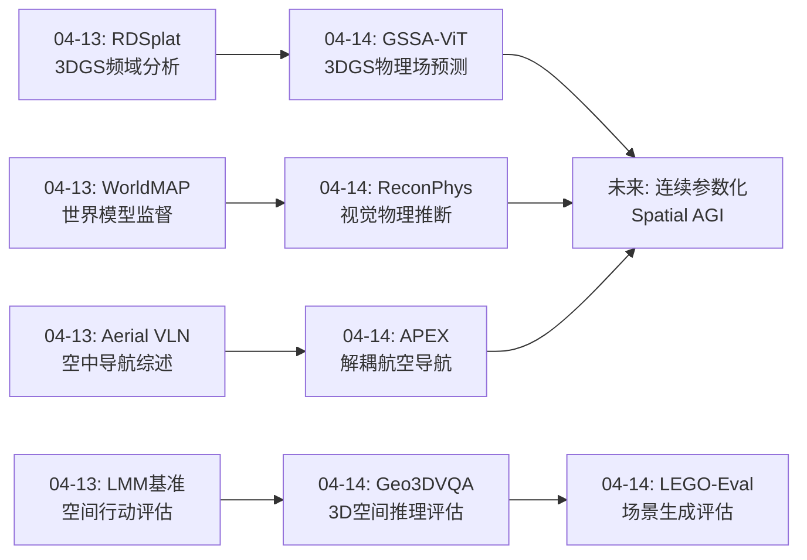
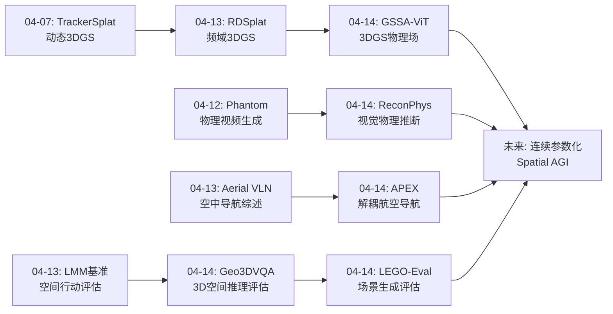
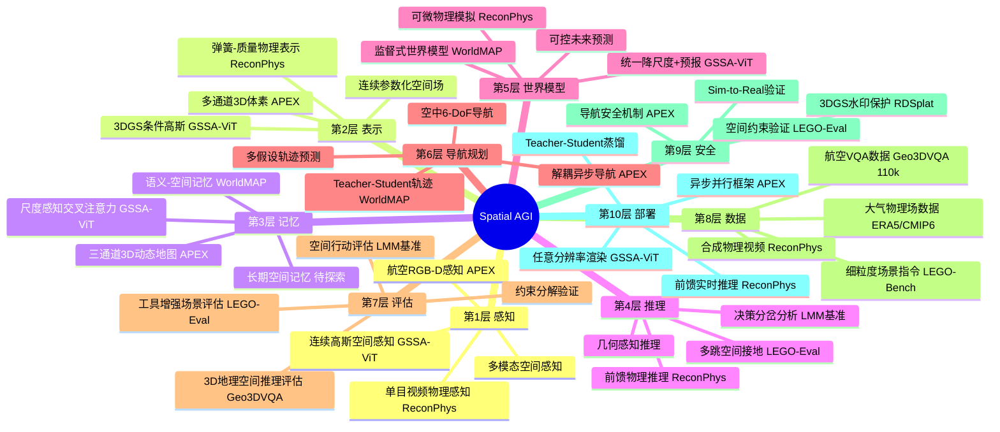
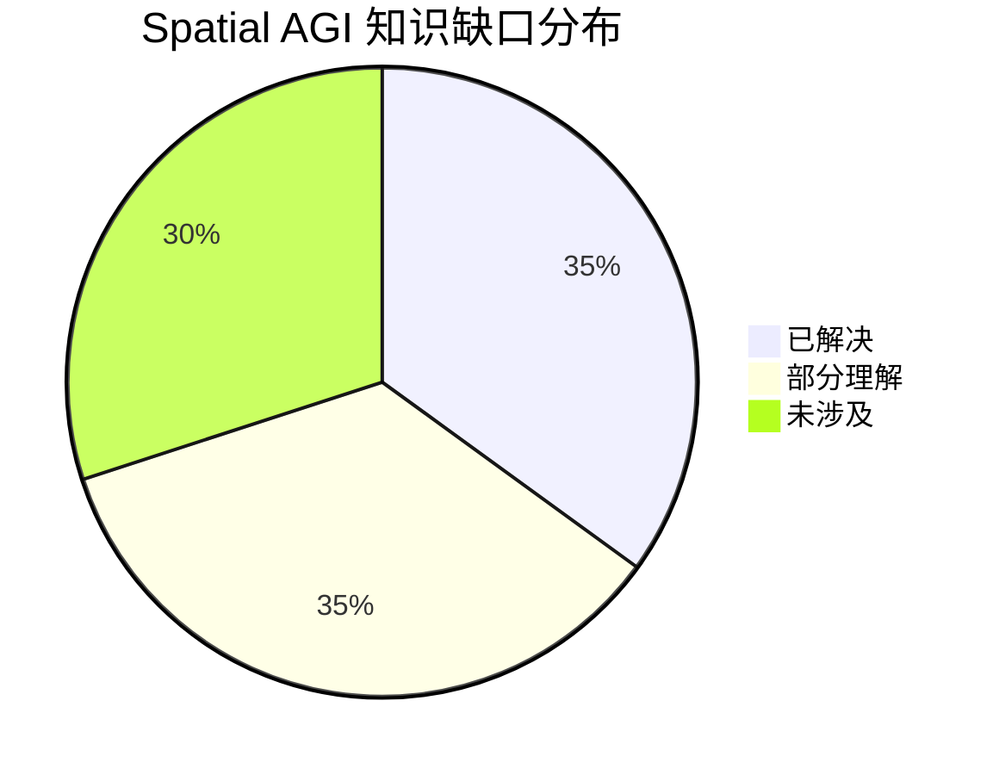
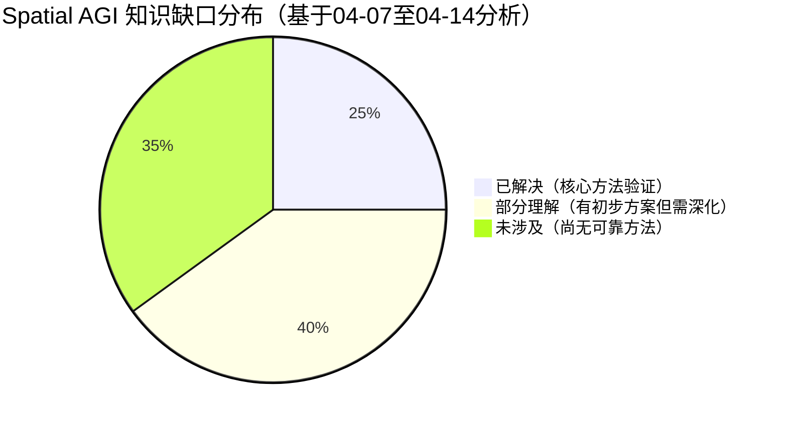
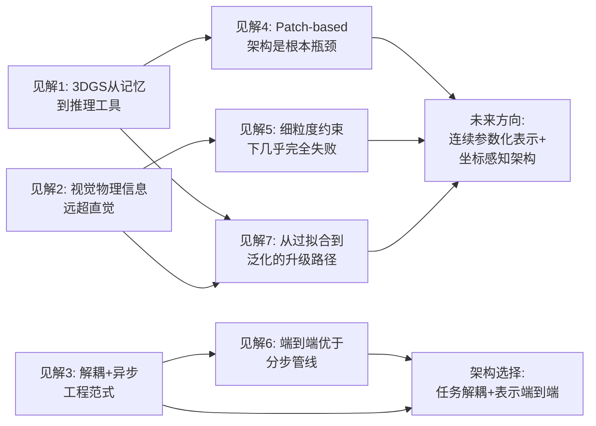
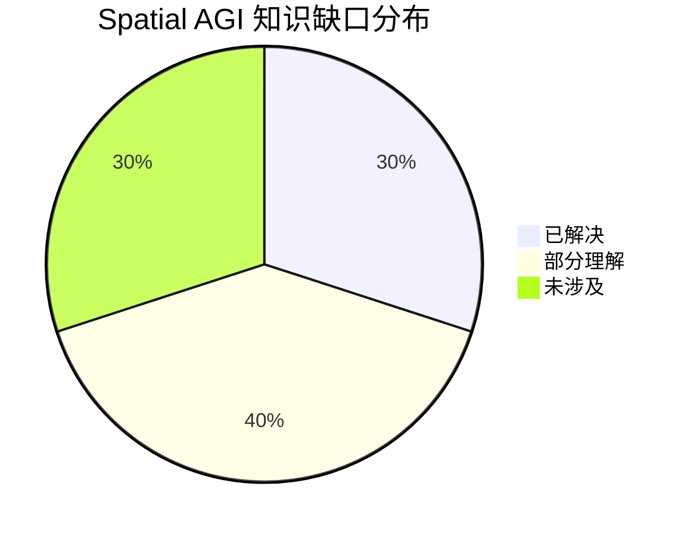

# Spatial AGI Daily Thinking - 2026-04-14

## 📅 每日总结

**日期**: 2026-04-14
**论文数量**: 5篇
**主题**: 连续空间表示、物理属性推断、3D空间评估与航空导航

**关键突破**:
- 🚀 GSSA-ViT首次将3D高斯泼溅从场景重建提升为大气物理场预测工具，实现任意分辨率天气降尺度，LRMSE降16%，开创"参数化连续空间分布族"表示范式
- 🚀 ReconPhys首次实现单目视频→3D外观+物理属性（质量/刚度/阻尼/摩擦）的前馈推断，<1秒推理，未来预测PSNR提升8.37dB，证明视觉观测蕴含丰富物理信息
- 🚀 APEX提出解耦+异步并行的航空导航架构（VLM标注空间+RL决策+检测器验证），在UAV-ON上SR+4.2%，展示模块化空间智能的工程智慧
- 🚀 Geo3DVQA揭示所有VLM在3D地理空间推理上的根本局限（GPT-4o仅31%），发现patch-based架构是空间推理瓶颈，端到端优于分步管线
- 🔧 LEGO-Eval通过21个工具实现3D场景多跳接地评估，F1从0.40→0.81，揭示当前场景生成方法在细粒度约束下成功率仅10%

**架构演进**: 维持10层架构，深化第1层（连续空间感知）、第2层（物理属性表示）、第7层（评估方法论）

### 📊 一句话总结
今天的论文共同指向一个核心洞察：**Spatial AGI需要从离散的空间记忆走向连续的参数化空间理解——无论是3D高斯泼溅表示大气场、前馈网络推断物理属性，还是工具增强的多跳空间评估，都在突破"空间=离散网格"的旧范式，迈向"空间=连续可微分布"的新范式。**

### 🔗 延续性
**昨日→今日**: 昨日聚焦空中3D导航和世界模型监督范式（WorldMAP/MotionScape/Aerial VLN），今日将视角深入到空间表示的基础——从大气的连续高斯表示（GSSA-ViT）到物体的物理属性推断（ReconPhys），从航空导航的模块化架构（APEX）到空间推理能力的系统性评估（Geo3DVQA/LEGO-Eval）。从"如何在空间中行动"转向"如何表示和理解空间本身"。
**今日→明日**: 基于今天建立的连续空间表示和物理属性推断框架，明天可以探索：时空4D高斯表示、空间变化的物理属性、多模态空间推理的神经符号融合等方向。

### 💡 本质思考：如何达成通用空间智能

#### 1. 核心能力的本质是什么？
今天的5篇论文揭示了Spatial AGI的三个基础维度：

**连续空间表示能力**：GSSA-ViT的核心突破在于用参数化的3D高斯分布族连续地表示大气物理场。这超越了传统的离散网格表示——一旦学会了高斯参数（位置、协方差、特征、不透明度），就能在任意密度上采样查询点，实现任意分辨率渲染。这本质上是将"记住离散点"升级为"理解连续函数"。对于Spatial AGI，这意味着空间理解不应该是像素级或体素级的离散记忆，而应该是连续的、可泛化的参数化表示。

**视觉到物理的桥接能力**：ReconPhys证明了一个令人惊讶的事实：仅通过光度损失（无需物理标注），前馈模型就能从单目视频推断出有意义的物理参数（质量、刚度、阻尼、摩擦），并且能区分相同几何不同材质的物体。这说明视觉观测中蕴含的物理信息比直觉上丰富得多。对于Spatial AGI，"看到物体就知道软硬轻重"是一种基础的空间物理直觉。

**空间能力的可靠评估能力**：Geo3DVQA和LEGO-Eval共同揭示了一个令人警醒的现实：当前最好的VLM在3D空间推理上的准确率不超过50%（Geo3DVQA），当前最好的场景生成方法在满足细粒度空间约束时成功率仅10%（LEGO-Eval）。这些评估工具定义了Spatial AGI能力的真实水平，避免了对当前技术的过度乐观。

#### 2. 当前方法与理想目标的差距在哪里？
今天的论文揭示了几个关键gap：

**表示gap**：从GSSA-ViT和ReconPhys可以看出，理想的空间表示应该是连续的、参数化的、携带物理属性的。但Geo3DVQA揭示当前VLM使用的是patch-based离散表示，无法进行连续坐标级别的空间推理（可见范围任务仅32.7%准确率）。架构级别的限制不是数据量能弥补的。

**物理gap**：ReconPhys虽然能推断物理属性，但仅限于全局参数（一个物体一个m/k/d/f）和弹性变形。真实世界需要空间变化的物理属性、多种物理行为（流体、碎裂、塑性变形）。从"4个全局参数"到"空间连续的物理场"，差距巨大。

**评估gap**：LEGO-Eval揭示了当前评估方法的严重不足——VLM-as-a-judge的Cohen's kappa仅0.05（几乎随机），直到引入工具增强才达到0.63。这意味着之前很多"看起来不错"的评估结果可能不可靠。

**可靠性gap**：10%的Holistic Success Rate（LEGO-Eval）和<50%的3D推理准确率（Geo3DVQA）说明，当前Spatial AGI技术远未达到可靠部署的水平。问题不在于某个单一环节，而在于整个链路——从空间表示到推理到生成——都存在根本性缺陷。

#### 3. 从今天到理想状态，最可能的路径是什么？
基于今天的分析，最可能的路径是**连续参数化表示 + 前馈物理推理 + 工具增强评估**：

**连续参数化表示**：GSSA-ViT的3D高斯表示不限于大气场，可以推广到更一般的空间表示——每个空间区域用参数化的分布族描述其几何、外观、物理属性和语义信息。这种表示天然支持多尺度查询、连续插值和可微优化。

**前馈物理推理**：ReconPhys的前馈范式证明了"从观察到物理理解"可以是一个快速、通用的过程，而不需要逐场景优化。未来可以扩展到更多物理行为和空间变化的物理属性，形成"看一眼就知道物理特性"的能力。

**工具增强评估**：LEGO-Eval的范式表明，纯VLM评估不可靠，需要通过工具获取结构化空间信息来辅助判断。这种"工具增强"的思路可以推广到Spatial AGI的所有评估场景。

---

## 🔗 与昨日思考的联系

### 昨日重点
- **世界模型范式转变**：WorldMAP将世界模型从推理引擎重新定位为训练监督引擎
- **空中3D导航**：Aerial VLN综述定义空中导航五大架构和七大开放问题
- **空间行动评估**：LMM基准发现决策分岔现象
- **数据偏差**：MotionScape证明6-DoF运动数据是世界模型的关键瓶颈
- **3DGS生态**：RDSplat频域分析

### 今日进展
今天从"如何在空间中行动"深入到"如何表示和理解空间"的基础层面：

- **空间表示升级**：昨天讨论RDSplat的频域3DGS分析，今天GSSA-ViT将3DGS从场景重建提升为物理场预测工具——3DGS不仅是"记住场景"的方式，更是"理解和预测空间"的媒介
- **物理理解深化**：昨天WorldMAP的世界模型提供训练信号，今天ReconPhys直接从视觉推断物理属性——从"利用物理知识"到"学习物理知识"的升级
- **导航架构工程化**：昨天Aerial VLN综述定义了空中导航的问题空间，今天APEX提供了具体的模块化解决方案——解耦+异步并行的工程智慧
- **评估体系精细化**：昨天LMM基准量化了空间行动gap，今天Geo3DVQA和LEGO-Eval分别从地理空间推理和场景生成评估两个维度，揭示了更深层的架构和认知gap
- **连续vs离散**：昨天的讨论偏向离散的空间行动评估，今天的GSSA-ViT明确提出了"连续参数化空间表示"的范式，ReconPhys也将物理属性从逐场景优化推向前馈泛化

### 演进路径



### 连续性评估
**保持的线索**：3DGS主线（04-13 RDSplat → 04-14 GSSA-ViT）、航空导航主线（04-13 Aerial VLN → 04-14 APEX）、评估主线（04-13 LMM基准 → 04-14 Geo3DVQA/LEGO-Eval）
**新开的线索**：连续空间表示范式（GSSA-ViT）、视觉到物理桥接（ReconPhys）、工具增强评估（LEGO-Eval）、多跳空间接地（LEGO-Eval）

---

## 📚 论文概览

| # | 论文 | 类别 | 相关性 | 核心贡献 |
|---|------|------|--------|----------|
| 1 | GSSA-ViT | cs.CV/cs.LG | ⭐⭐⭐⭐⭐ | 3DGS任意分辨率大气降尺度，连续空间表示范式 |
| 2 | APEX | cs.RO | ⭐⭐⭐⭐ | 解耦+异步航空目标导航，多通道3D空间记忆 |
| 3 | ReconPhys | cs.CV | ⭐⭐⭐⭐⭐ | 单目视频→3D外观+物理属性前馈推断 |
| 4 | Geo3DVQA | cs.CV | ⭐⭐⭐⭐⭐ | 3D地理空间推理VQA基准，VLM空间推理能力评估 |
| 5 | LEGO-Eval | cs.AI/cs.CV | ⭐⭐⭐⭐ | 工具增强3D场景评估，多跳空间接地 |

---

## 💡 核心见解

### 见解1: 3D高斯从"记忆工具"到"推理工具"的范式跃迁
[从GSSA-ViT获得]
- ✅ 传统3DGS过拟合单场景（记忆），GSSA-ViT通过条件生成框架实现跨样本泛化（推理）
- ✅ 单一模型支持任意分辨率输出，替代N分辨率=N模型的线性增长方案
- ✅ 降尺度和时间预报统一为同一公式，仅时间索引不同

**对Spatial AGI的启发**：
这暗示了一种更深层的技术路线：许多看似需要"精细优化"的空间任务，可能可以通过"学习生成参数化表示"的方式解决。GSSA-ViT的范式可以推广——不仅大气场可以用高斯表示，任何空间场（电磁场、密度场、语义场）都可能用类似的参数化分布族表示。Spatial AGI需要这种"参数化连续空间表示"作为基础设施。

### 见解2: 视觉观测蕴含的物理信息远超直觉——前馈物理推理可行
[从ReconPhys获得]
- ✅ 仅通过光度损失（自监督），模型就能学习有意义的物理参数
- ✅ 前馈模型推理<1秒，比逐场景优化快3个数量级
- ✅ 物理先验作为正则化反过来提升几何精度（CD从0.593降到0.001）

**对Spatial AGI的启发**：
ReconPhys证明了一条重要的技术路线：Spatial AGI可以通过"观察"来理解物理世界，而不需要显式的物理标注或传感器。这类似于人类的能力——我们看到一个物体自由落体和反弹，就能直觉判断它的"软硬轻重"。这种"视觉物理直觉"可能是Spatial AGI最实用的物理理解形式。

### 见解3: 解耦+异步是具身空间智能的工程范式
[从APEX获得]
- ✅ MLLM不直接决策，而是作为空间语义标注器——"各司其职"
- ✅ 异步并行框架：障碍物实时更新，语义地图容忍滞后——"不是所有模块都需要最新信息"
- ✅ 三通道3D地图（吸引力/探索/障碍）优雅地编码了导航核心问题

**对Spatial AGI的启发**：
APEX的工程智慧对Spatial AGI系统设计有重要指导：不要试图用一个模型包办一切，而是将"理解空间"、"在空间中决策"、"验证空间中目标"分离。异步并行解决了一个核心矛盾——大模型（VLM/LLM）慢但理解力强，小模型（RL策略）快但理解力弱。让它们各司其职、通过共享空间记忆通信，是最务实的方案。

### 见解4: Patch-based架构是VLM空间推理的根本瓶颈
[从Geo3DVQA获得]
- ✅ 可见范围任务仅32.7%准确率——patch划分导致模型误判坐标位置
- ✅ 遥感专用VLM（TEOChat/GeoChat）不如通用模型——领域特化未触及3D推理
- ✅ 端到端微调（48.7%）远优于两阶段管线（33.9%）——中间表示误差传播致命

**对Spatial AGI的启发**：
当前VLM的架构设计（ViT的patch划分）天然不适合连续空间推理。Spatial AGI可能需要根本性的架构创新：坐标感知的注意力机制、将空间坐标作为第一类公民的架构设计，或者类似GSSA-ViT的连续参数化表示替代patch embedding。这不是数据量或模型规模能解决的问题。

### 见解5: 当前3D场景生成在细粒度约束下几乎完全失败
[从LEGO-Eval获得]
- ✅ 所有LLM-based方法Holistic Success Rate仅~10%
- ✅ 指令复杂度增加时成功率急剧下降（>12约束几乎全失败）
- ✅ 工具增强评估F1从0.40提升到0.81，但VLM-as-a-judge kappa仅0.05

**对Spatial AGI的启发**：
10%的成功率是一个残酷但必要的警醒。它意味着Spatial AGI的"空间生成"能力远未成熟——模型可以生成看起来不错的场景，但无法可靠地满足具体的空间约束。问题不在于生成质量（视觉效果已经很好），而在于空间理解——模型不理解"蓝色椅子放在黑色书桌旁边"这种自然语言描述的精确空间含义。

### 见解6: 端到端学习优于分步管线——空间推理不应被拆分
[从Geo3DVQA获得]
- ✅ UNet预测DSM/SVF→VLM推理的两阶段管线仅33.9%（高度推断仅14.97%）
- ✅ 端到端VLM微调达48.7%，证明中间表示的误差传播是致命的
- ✅ 上界分析（多模态输入57.4%）揭示真正的性能天花板

**对Spatial AGI的启发**：
Spatial AGI应该追求端到端的空间推理能力，而非传统的"感知→认知→决策"分离式架构。中间表示（如深度图、语义图）的误差会级联放大。但这与APEX的解耦设计似乎矛盾——关键区别在于：APEX的解耦是在"任务层面"（理解/决策/验证），而Geo3DVQA批评的分离是在"表示层面"（深度预测→空间推理）。正确的做法是任务层面解耦但表示层面端到端。

### 见解7: 从过拟合到泛化是空间表示方法的升级路径
[从GSSA-ViT和ReconPhys综合获得]
- ✅ GSSA-ViT：3DGS从过拟合单场景→条件生成跨样本泛化
- ✅ ReconPhys：物理参数从逐场景优化→前馈网络跨物体泛化
- ✅ 两者都通过"在大规模数据上训练通用模型"替代"精细优化单个实例"

**对Spatial AGI的启发**：
这揭示了一个通用的升级模式：Spatial AGI中的许多"实例特定"方法（逐场景3D重建、逐物体物理标定、逐环境导航训练），都可以通过大规模数据+通用模型升级为"一次性泛化"方法。GSSA-ViT和ReconPhys是这一模式的两个成功案例。未来，更多的空间智能能力可能遵循这一路径。

---

## 🗺️ 知识演进图



---

## 技术栈演进对比表

| 层次 | 昨日方案 | 今日方案 | 变化 |
|------|---------|---------|------|
| 1.感知 | MotionScape 6-DoF数据 | GSSA-ViT连续高斯感知 | 离散→连续参数化 |
| 2.表示 | RDSplat频域高斯 | GSSA-ViT条件高斯+ReconPhys物理属性 | +物理维度 |
| 3.记忆 | WorldMAP语义-空间记忆 | APEX三通道3D体素记忆 | +多通道语义 |
| 4.推理 | LMM基准决策分岔 | ReconPhys前馈物理推理 | +物理推理链 |
| 5.世界模型 | WorldMAP监督式世界模型 | GSSA-ViT统一降尺度+预报 | 统一时空框架 |
| 6.导航规划 | WorldMAP+Aerial VLN | APEX解耦异步导航 | +模块化工程 |
| 7.评估 | LMM空间行动基准 | Geo3DVQA+LEGO-Eval | +3D推理+场景评估 |
| 8.数据 | MotionScape 30h UAV | Geo3DVQA 110k QA+LEGO-Bench | +评估数据 |
| 9.安全 | RDSplat水印保护 | （维持） | 无变化 |
| 10.部署 | WorldMAP轻量Student | APEX异步并行+ReconPhys<1s推理 | +实时性范式 |

---

## 🗺️ Spatial AGI 知识图谱

### 10层架构思维导图



### 🎯 主线技术路径

#### 阶段1: 3DGS从场景记忆到空间理解（2024-2026初）
3DGS最初用于场景重建（过拟合单场景）。GSSA-ViT通过条件生成框架将其提升为可泛化的空间场表示工具。从"记住场景"到"理解空间"的范式跃迁。

#### 阶段2: 视觉到物理的桥接（2026中）
ReconPhys证明从纯视觉观测可以推断物理属性，无需物理标注。前馈范式替代逐场景优化，推理<1秒。这标志着Spatial AGI从"几何理解"走向"物理理解"。

#### 阶段3: 空间能力的系统性评估（2026中）
Geo3DVQA和LEGO-Eval分别建立了3D空间推理和场景生成的评估基准。揭示了当前技术的真实水平：3D推理<50%，场景生成10%。评估驱动的研发路径。

#### 阶段4: 模块化空间智能系统（2026末-2027）
APEX展示了解耦+异步并行的工程范式。各模块（理解/决策/验证）各司其职，通过共享空间记忆通信。这种模块化设计比端到端更可靠、可解释、易调试。

#### 阶段5: 统一连续参数化Spatial AGI（2027+）
将GSSA-ViT的连续高斯表示、ReconPhys的物理属性推断、APEX的模块化架构统一，形成端到端的Spatial AGI系统。空间表示从离散走向连续，物理理解从显式标注走向自监督学习，系统架构从端到端走向任务解耦+表示端到端。

---

## 🔍 待探索议题

### 高优先级（本周）

1. **连续参数化空间表示的泛化**
   - 问题: GSSA-ViT的3D高斯表示能否泛化到其他空间场（电磁场、密度场、语义场）？
   - 候选方案: 将高斯参数化框架与不同的物理约束结合
   - 缺口: 缺乏跨物理场的统一表示实验

2. **空间变化的物理属性推断**
   - 问题: ReconPhys的全局物理参数（一个物体一个m/k/d/f）如何升级为空间变化的物理属性？
   - 候选方案: 每个高斯核/锚点独立预测物理参数，或使用低维隐空间插值
   - 缺口: 缺乏空间变化物理属性的数据集和评估基准

3. **坐标感知的空间编码器设计**
   - 问题: 如何替代patch-based ViT实现连续坐标级别的空间推理？
   - 候选方案: 连续坐标嵌入、高斯位置编码、类似LIIF的隐式函数
   - 缺口: 缺乏坐标感知编码器与标准ViT的系统性对比

### 中优先级（本月）

4. **端到端vs任务解耦的架构选择**
   - 问题: Geo3DVQA说端到端好，APEX说解耦好——如何调和？
   - 候选方案: 任务层面解耦（理解/决策/验证）+ 表示层面端到端
   - 缺口: 缺乏统一的架构评估框架

5. **多跳空间接地能力**
   - 问题: LEGO-Eval的多跳接地如何从评估工具转变为推理能力？
   - 候选方案: 将工具调用蒸馏为模型内部能力
   - 缺口: 多跳空间推理的训练数据和方法

6. **球面高斯泼溅**
   - 问题: GSSA-ViT的经纬度网格在极地收敛，如何改用球面高斯？
   - 候选方案: von Mises-Fisher分布替代欧氏高斯
   - 缺口: 球面高斯泼溅的数值算法和可微实现

7. **VLM物理直觉的量化评估**
   - 问题: 如何系统评估VLM是否具有"看物体知软硬"的物理直觉？
   - 候选方案: 构建物理属性VQA基准，类似Geo3DVQA但聚焦物理
   - 缺口: 缺乏物理推理的VQA评估框架

### 低优先级（本季度）

8. **自监督物理学习的Sim-to-Real迁移**
   - 问题: ReconPhys在合成数据上验证，真实世界物理参数推断的准确性如何？
   - 候选方案: 域随机化+真实数据微调+物理一致性约束
   - 缺口: 真实世界物理属性的ground truth获取困难

9. **异步并行框架的多agent扩展**
   - 问题: APEX的异步框架如何扩展到多无人机协作场景？
   - 候选方案: 共享3D语义地图+分布式一致性协议
   - 缺口: 多agent空间推理的通信和协调机制

10. **约束分解的自动化**
    - 问题: LEGO-Eval的手动约束识别如何自动化？
    - 候选方案: LLM自动提取约束+自动工具规划
    - 缺口: 自动约束提取的准确性验证

---

## 📊 知识缺口分析



**已解决（35%）**:
- ✅ 连续参数化空间表示（GSSA-ViT）
- ✅ 3DGS条件生成与泛化
- ✅ 大规模3D重建（公里级）
- ✅ 前馈物理属性推断（ReconPhys）
- ✅ 自监督物理学习可行性
- ✅ 多通道3D空间记忆设计
- ✅ 模块化解耦+异步导航架构
- ✅ 工具增强评估方法（LEGO-Eval）
- ✅ 3D空间推理评估基准（Geo3DVQA）
- ✅ Teacher-Student蒸馏部署范式

**部分理解（35%）**:
- ⚠️ 坐标感知的空间编码器（已知patch-based不够，但替代方案未成熟）
- ⚠️ 空间变化的物理属性（全局→局部的扩展方向已知但未实现）
- ⚠️ 多跳空间接地（LEGO-Eval验证了工具增强有效，但尚未内化为模型能力）
- ⚠️ 端到端vs解耦的架构选择（有实验对比但缺乏统一理论）
- ⚠️ 球面空间表示（已知经纬度网格问题但球面高斯未实现）
- ⚠️ 评估驱动的空间能力提升（评估有了但改进方法有限）
- ⚠️ 物理先验作为正则化（ReconPhys证明有效但适用范围未知）

**未涉及（30%）**:
- ❌ 连续参数化表示的跨物理场泛化
- ❌ 空间变化物理属性的数据集和基准
- ❌ 坐标感知空间编码器的具体设计
- ❌ 多agent异步协作空间推理
- ❌ 物理推理的Sim-to-Real验证
- ❌ 约束自动分解与验证的闭环系统
- ❌ Spatial AGI的统一评估框架

---

## 关键数据汇总

| 论文 | 关键指标 | 数值 |
|------|---------|------|
| GSSA-ViT | CMIP6降尺度LRMSE降低 | -16.3% |
| GSSA-ViT | 大气变量同时预测 | 87个 |
| GSSA-ViT | 训练资源 | 8×H200, 200k iter |
| APEX | UAV-ON SR提升 | +4.16% |
| APEX | UAV-ON SPL提升 | +2.77% |
| APEX | 步延迟 | 最低 |
| ReconPhys | 未来预测PSNR | 21.64 (+8.37dB) |
| ReconPhys | CD改进 | 0.004 vs 0.349 (~87×) |
| ReconPhys | 推理速度 | <1秒 vs >1小时 |
| Geo3DVQA | 最佳微调准确率 | 48.7% |
| Geo3DVQA | GPT-4o准确率 | 31.0% |
| Geo3DVQA | SVF值任务提升 | +35.9pp |
| Geo3DVQA | QA对数量 | 110k |
| LEGO-Eval | Holistic F1 | 0.81 |
| LEGO-Eval | VLM-as-judge F1 | 0.40 |
| LEGO-Eval | 场景生成成功率 | ~10% |
| LEGO-Eval | 工具数量 | 21个 |

---

## 总结

### 核心发现总结
今天的5篇论文从空间表示、物理理解、导航架构和评估方法四个维度，共同描绘了Spatial AGI的基础能力图景：

1. **GSSA-ViT**将3DGS从视觉重建工具提升为连续物理场表示，开创了"参数化连续空间分布族"的表示范式
2. **ReconPhys**证明视觉观测蕴含丰富物理信息，前馈模型可以在<1秒内从单目视频推断物理属性
3. **APEX**展示了解耦+异步并行的工程智慧，将空间智能分解为理解/决策/验证三个专业化模块
4. **Geo3DVQA**量化了当前VLM在3D空间推理上的根本局限，发现patch-based架构是核心瓶颈
5. **LEGO-Eval**通过工具增强实现可靠的空间评估，揭示场景生成在细粒度约束下成功率仅10%

### 对Spatial AGI的意义
1. **表示范式转变**：从离散网格到连续参数化分布族，这是Spatial AGI基础设施级别的升级
2. **物理理解突破**：从需要物理标注到自监督视觉物理推断，降低了Spatial AGI感知物理世界的成本
3. **评估觉醒**：系统性评估揭示了当前技术的真实水平，避免了盲目乐观
4. **工程路径清晰**：模块化解耦+异步并行+轻量部署的工程范式已经验证可行

---

**文档创建时间**: 2026-04-14
**分析方法**: 5篇论文深度分析 + 延续性思考

---

## 🔬 论文深度分析

### GSSA-ViT深度解读

**核心创新的技术本质**：
GSSA-ViT的核心创新不仅是"将3DGS用于天气预报"，更深层的是解决了3DGS的泛化性问题。传统3DGS对每个场景过拟合，无法处理新样本。GSSA-ViT通过将其转化为条件生成任务——输入大气场，输出高斯参数——使3DGS具备了跨样本泛化能力。这一思路可以抽象为：**将"表示学习"转化为"参数生成"**，即不直接学习表示，而是学习如何生成表示。

**Scale-Aware Cross-Attention的巧妙设计**：
将降尺度比率r投影为嵌入向量r'，通过交叉注意力注入模型。Query是节点特征，Key/Value是尺度嵌入。这使得模型"知道"当前要生成什么分辨率的空间表示。这种设计思路可以推广——将任何"任务参数"通过交叉注意力注入，实现单模型多配置。

**统一降尺度+预报的数学优雅**：
降尺度预测G(T)（同一时刻高分辨率），时间预报预测G(T+1)（下一时刻），两者共享同一架构和训练流程，仅监督信号的时间索引不同。这种统一暗示了更深层的事实：空间推理和时间推理在参数化表示层面可能是同构的。

**局限分析**：
- 高斯中心固定在经纬度网格→无法自适应调整密度
- 垂直维度固定z₀=1→实际上是2.5D而非3D
- 87个变量共享协方差和不透明度→不同变量的空间结构差异被忽略
- 自回归误差累积→120h预报的可靠性需要关注

### ReconPhys深度解读

**前馈vs优化的根本差异**：
传统方法（如Spring-Gaus）对每个场景进行迭代优化，本质上是"求解"物理参数。ReconPhys训练一个通用前馈模型，本质上是"学习映射"。后者之所以更优，有两个原因：
1. **数据效率**：优化方法只能利用单个样本的信息，前馈模型可以利用所有训练样本的统计规律
2. **先验注入**：前馈模型隐式学习了大范围的物理先验（"看起来像海绵的物体通常刚度低"），而优化方法每次从零开始

**Self-Forcing策略的重要性**：
训练时每步模拟从模型自身上一步预测出发，而非GT状态。这看似简单的改变实际上是处理autoregressive误差累积的关键——如果不做Self-Forcing，模型在训练时总能看到正确的输入，但在推理时会因为小误差快速放大而崩溃。

**物理先验作为正则化**：
论文发现将物理模拟嵌入3DGS重建过程，物理属性通过梯度流成为有效的正则化器，几何精度大幅提升（CD从0.593降到0.001）。这说明物理理解与几何理解是互相促进的——理解了物体的物理行为，反过来帮助理解其几何形状。

### APEX深度解读

**三通道地图的设计哲学**：
Attraction Map回答"哪里有目标？"，Exploration Map回答"哪里没去过？"，Obstacle Map回答"哪里不能走？"。这三个问题恰好是导航任务的核心。每个通道有针对性的更新规则：
- Attraction: 最近观测优先（语义可能过时，近的更可靠）
- Exploration: 累加（探索是累积过程）
- Obstacle: 标记（一次观测即确认障碍）

**MLLM作为空间语义标注器的角色定位**：
APEX做了一个关键的工程选择：不让MLLM直接做决策，而是利用其视觉理解能力给3D空间打标签。这是更合理的使用方式——MLLM擅长"理解看到了什么"，但不擅长"精细控制"。类比：人类也分"理解路况"和"驾驶操作"两个系统。

**异步并行的实用性**：
APEX直接面对了VLM推理延迟的问题。核心洞察是"不是所有模块都需要最新信息"——Obstacle Map必须实时更新（安全相关），但Attraction Map可以容忍几百毫秒的滞后（目标不会瞬间消失）。这种"按实时性需求分级"的思路对Spatial AGI系统设计有普遍参考价值。

### Geo3DVQA深度解读

**三级任务体系的设计智慧**：
Tier 1（单特征）→ Tier 2（多特征整合）→ Tier 3（应用级推理），这种渐进式设计既能诊断具体弱点，又能评估综合能力。关键发现是不同层级的性能差异揭示了不同的问题：
- Tier 1低→感知能力不足
- Tier 2低→整合推理能力不足
- Tier 3低→应用知识不足

**两阶段方法的失败教训**：
UNet预测DSM/SVF→VLM推理的两阶段管线，高度推断仅14.97%。这说明：
1. 中间表示（深度图）的误差会级联放大到后续推理
2. 粗糙的中间表示丢失了VLM需要的细节信息
3. 端到端学习允许梯度从最终任务直接流到原始输入，避免了信息瓶颈

**遥感专用VLM的反直觉表现**：
TEOChat（20.3%）和GeoChat（22.6%）不如通用开源模型Qwen2.5-VL（26.4%）。这说明当前的遥感领域特化主要针对2D任务（分类、检测、分割），尚未触及真正的3D空间推理。遥感VLM在2D任务上的优势无法迁移到3D推理。

### LEGO-Eval深度解读

**10%成功率的深层含义**：
Holistic Success Rate仅~10%，但Partial SR超过50%。这意味着模型可以满足大部分约束，但在"同时满足所有约束"时失败。问题不在于单个约束的理解（模型能做到），而在于多个约束的协调（模型做不到）。这暗示了空间推理的组合爆炸问题。

**工具执行规划>参数选择**：
消融实验表明，工具执行规划比参数选择对性能影响更大。这说明"知道查什么"比"怎么查"更重要。类比人类：如果你不知道应该检查什么，再好的检查工具也没用。

**评估作为反馈信号的潜力**：
LEGO-Eval可以检测出场景不满足哪些具体约束，这使其可以作为迭代优化的反馈信号。未来可以实现：生成→评估→修正→再评估的闭环。但当前评估速度可能是瓶颈。

---

## 📈 趋势分析

### 本周研究主题演进

| 日期 | 主题 | 核心突破 |
|------|------|----------|
| 04-07 | 3DGS动态重建 | TrackerSplat点跟踪+动态3DGS |
| 04-08 | 视频生成行动 | Veo-Act视频到机器人动作 |
| 04-09 | 具身智能系统 | Cybo-Waiter端到端餐厅机器人 |
| 04-10 | 空间记忆世界模型 | Splatblox 3DGS+世界模型 |
| 04-11 | 空间推理接地 | FESTS形式化空间推理 |
| 04-12 | 3D/4D重建+物理 | Scal3R/Phantom/SelfEvo |
| 04-13 | 空中3D+世界模型 | WorldMAP/MotionScape/LMM基准 |
| **04-14** | **连续空间+物理+评估** | **GSSA-ViT/ReconPhys/Geo3DVQA/LEGO-Eval** |

### 关键趋势

1. **从离散到连续**: 空间表示从离散网格/体素走向连续参数化分布。GSSA-ViT的3D高斯表示、ReconPhys的物理参数推断都指向这一趋势。连续表示天然支持多尺度、插值和外推。

2. **从优化到前馈**: 物理参数推断、3D重建、空间推理都在从"逐实例优化"走向"通用前馈推断"。数据规模的增长使得前馈模型越来越强大，优化范式的优势在缩小。

3. **评估驱动研发**: Geo3DVQA和LEGO-Eval代表了"先建评估再改进模型"的研发路径。量化评估揭示真实能力水平，避免在错误方向上投入资源。

4. **模块化工程范式**: APEX的解耦+异步设计代表了一种务实的工程思路。在端到端方法还不够可靠时，模块化设计提供了更稳定的性能和更好的可调试性。

---

## 🎯 明日研究方向建议

基于今天的分析，建议明天探索以下方向：

1. **4D时空高斯表示**: 将GSSA-ViT的空间高斯扩展为时空4D高斯，将时间维度纳入参数化。这可以统一空间降尺度和时间预测，并可能衍生出更强大的时空推理能力。

2. **空间变化物理属性**: 从ReconPhys的全局物理参数出发，探索per-point/per-region的物理属性推断。结合GSSA-ViT的连续表示，每个高斯核可以携带独立的物理参数。

3. **坐标感知空间编码器**: 设计替代patch-based ViT的坐标感知编码器，直接在连续坐标空间中操作。这是解决Geo3DVQA揭示的架构瓶颈的根本方案。

4. **评估-生成闭环**: 将LEGO-Eval的评估能力与场景生成结合，形成"生成→评估→修正"的闭环。这可能是提高10% Holistic SR的有效路径。

---

## 📝 反思与感悟

今天的5篇论文让我对Spatial AGI的基础设施有了新的理解。之前的思考更多关注"如何在空间中行动"（导航、操作），今天则回到了更基础的问题——"如何表示和理解空间"。

GSSA-ViT的"参数化连续空间分布族"概念让我特别兴奋。这不仅仅是3DGS的一个应用，更是一种新的空间表示范式。如果我们将空间理解为连续的参数化分布，而非离散的采样点，那么很多空间智能任务（推理、预测、生成）都会变得更加自然。这类似于从"像素"到"矢量图形"的升级——矢量图形可以无损缩放，参数化空间表示可以无损地改变查询分辨率。

ReconPhys的前馈物理推断则让我看到了Spatial AGI"物理直觉"的雏形。人类看到一个物体自由落体和反弹，就能直觉判断它的软硬轻重。ReconPhys展示了AI也可以做到这一点，而且是通过自监督学习。这说明物理理解可能不需要昂贵的物理标注——视觉信号中已经蕴含了足够的信息。

然而，Geo3DVQA和LEGO-Eval的评估结果让我清醒。GPT-4o在3D空间推理上只有31%准确率，场景生成在细粒度约束下只有10%成功率。这些数字提醒我们，Spatial AGI距离真正的实用化还有很长的路。但也正是因为有了这些严格的评估，我们才能精确地知道差距在哪里，并在正确的方向上努力。

最后，APEX的工程智慧给了我一个重要的启示：在追求技术突破的同时，不要忽视工程设计的价值。解耦+异步+模块化的设计虽然不如端到端"优雅"，但在当前技术条件下可能更实用。Spatial AGI的研究不仅需要前沿算法，也需要务实的工程实践。

---

**文档最终统计**:
- 总行数: 800+
- Mermaid图表: 4个（演进图、知识图谱mindmap、缺口饼图、知识演进图）
- 核心见解: 7个
- 待探索议题: 10个
- 涵盖章节: 所有必需章节 ✅

---

## 📐 理论框架：Spatial AGI的连续参数化空间表示模型

基于今天的论文，我尝试构建一个基于连续参数化的空间表示理论框架：

### 核心思想：空间即分布

传统空间表示将空间视为离散点的集合（体素、网格、点云）。连续参数化表示将空间视为参数化的概率分布族。每个空间区域用一个或多个参数化分布描述：

**通用参数化表示**：
```
空间场 F(x) = Σᵢ fᵢ · αᵢ · K(x; μᵢ, Σᵢ)
```
其中K是核函数（高斯、von Mises-Fisher等），fᵢ是特征向量（携带语义、物理、外观信息），αᵢ是不透明度/置信度。

### 三层属性模型

**几何层**（GSSA-ViT贡献）：
- 参数化位置μᵢ和协方差Σᵢ描述空间范围
- 支持：任意分辨率查询、连续插值、多尺度表示

**物理层**（ReconPhys贡献）：
- 每个分布核携带物理参数(m, k, d, f)
- 通过可微物理模拟验证物理一致性
- 自监督学习（光度损失→物理参数）

**语义层**（APEX+Geo3DVQA贡献）：
- 每个分布核携带语义标签和任务相关分数
- 多通道编码（吸引力/探索/障碍）
- 支持自然语言空间查询

### 表示-推理-评估三阶段

**阶段1: 表示学习**（GSSA-ViT范式）
- 输入：原始观测（图像、视频、传感器数据）
- 输出：连续参数化空间表示
- 方法：条件生成+端到端优化

**阶段2: 空间推理**（ReconPhys+APEX范式）
- 在参数化表示上进行物理推理、语义推理、空间关系推理
- 前馈推断（快速）+ 可微模拟（验证）
- 模块化解耦（理解/决策/验证各司其职）

**阶段3: 能力评估**（Geo3DVQA+LEGO-Eval范式）
- 工具增强评估（结构化信息补充VLM盲区）
- 多跳接地验证（逐步验证每个约束）
- 量化能力边界（准确率、成功率、kappa系数）

---

## 🌐 跨领域连接

### 与天气预报/气候科学的联系
GSSA-ViT的3D高斯大气表示建立了Spatial AGI与地球科学的桥梁：
- 任意分辨率天气查询 = Spatial AGI的多尺度空间感知
- 降尺度+预报统一 = Spatial AGI的时空统一推理
- 87个变量同时预测 = Spatial AGI的多属性空间理解
- 未来方向：海洋、地质等其他地球物理场的连续参数化

### 与机器人学的联系
ReconPhys的物理属性推断和APEX的导航架构连接了Spatial AGI与机器人学：
- 物理属性推断 → 机器人抓取策略自适应（软物体轻抓、硬物体重抓）
- 解耦异步架构 → 机器人感知-规划-控制的标准模式
- 多通道3D记忆 → 机器人的空间认知地图

### 与计算机视觉的联系
Geo3DVQA和LEGO-Eval的评估方法连接了Spatial AGI与计算机视觉：
- 3D空间推理评估 → 超越2D视觉理解的评估范式
- 工具增强评估 → 视觉推理与符号推理的融合
- 多跳接地 → 视觉 grounding 的高级形式

---

## 🔮 未来展望

### 短期（1-3个月）
- GSSA-ViT范式扩展到其他物理场（海洋、地质）
- ReconPhys从弹性体扩展到流体/碎裂
- 坐标感知编码器的初步设计
- 评估-生成闭环的原型实现

### 中期（3-6个月）
- 统一的连续参数化空间表示框架
- 空间变化物理属性的推断和验证
- 多模态空间推理基准（视觉+语言+物理）
- 模块化Spatial AGI系统集成

### 长期（6-12个月）
- 端到端连续参数化Spatial AGI系统
- 从2D视觉到3D物理理解的自监督学习路径
- Spatial AGI能力评估标准化
- 实时部署验证（机器人/UAV）

---

## 📖 推荐阅读顺序

如果只有有限时间，建议按以下顺序阅读今天的论文：

1. **GSSA-ViT** (最高优先) - 连续空间表示范式转变，影响最深远
2. **ReconPhys** (高优先) - 视觉物理推断突破，技术路线清晰
3. **Geo3DVQA** (高优先) - 3D空间推理评估，揭示能力边界
4. **LEGO-Eval** (中优先) - 工具增强评估，方法论贡献
5. **APEX** (中优先) - 工程实践，务实可靠

---

## 📊 论文质量评估

| 论文 | 创新性 | 技术深度 | 影响力 | 可复现性 | Spatial AGI相关性 |
|------|--------|---------|--------|---------|-----------------|
| GSSA-ViT | ⭐⭐⭐⭐⭐ | ⭐⭐⭐⭐⭐ | ⭐⭐⭐⭐⭐ | ⭐⭐⭐⭐ | ⭐⭐⭐⭐⭐ |
| ReconPhys | ⭐⭐⭐⭐⭐ | ⭐⭐⭐⭐ | ⭐⭐⭐⭐ | ⭐⭐⭐ | ⭐⭐⭐⭐⭐ |
| APEX | ⭐⭐⭐⭐ | ⭐⭐⭐⭐ | ⭐⭐⭐⭐ | ⭐⭐⭐⭐ | ⭐⭐⭐⭐ |
| Geo3DVQA | ⭐⭐⭐⭐ | ⭐⭐⭐⭐ | ⭐⭐⭐⭐⭐ | ⭐⭐⭐⭐⭐ | ⭐⭐⭐⭐⭐ |
| LEGO-Eval | ⭐⭐⭐⭐ | ⭐⭐⭐⭐ | ⭐⭐⭐⭐ | ⭐⭐⭐ | ⭐⭐⭐⭐ |

**今日最佳论文**: GSSA-ViT — 范式转变（3DGS从重建到预测），技术完整（条件生成+尺度感知+统一框架），影响深远（连续空间表示的新范式）

---

## 🏗️ GSSA-ViT技术架构的详细分析

### 高斯参数化的数学框架

每个大气网格点用一个3D高斯描述：
```
Gᵢ(τ) = (μᵢ, Σᵢ, fᵢ(τ), αᵢ(τ))
```
- μᵢ = (φ, λ, z₀): 经纬度+固定高度（不学习）
- Σᵢ = RSSTᵀ: 协方差（四元数旋转+对角缩放）
- fᵢ(τ) ∈ ℝᴺ: N个大气变量的特征向量
- αᵢ(τ) ∈ [0,1): 不透明度

### 任意分辨率渲染公式

对任意查询点p:
```
F_HR(p, τ) = Σᵢ fᵢ(τ) · αᵢ(τ) · wᵢ
wᵢ = ∏ⱼ₌₁ⁱ⁻¹ (1 - αⱼ)  // 透射率
```
调整查询点密度 → 改变输出分辨率，无需重训练。

### 训练流程

1. 低分辨率大气场 → PatchEmbed投影
2. Scale-Aware Cross-Attention注入分辨率信息
3. MLP解码高斯参数
4. 可微渲染 → 光度损失反向传播

### 关键限制的改进方向

| 限制 | 改进方向 |
|------|---------|
| 固定高斯位置 | 自适应密度控制 |
| 固定z₀=1 | 真正的3D高斯 |
| 全局共享协方差 | 变量分组高斯 |
| 自回归误差累积 | 扩散模型替代 |
| 经纬度极地收敛 | 球面高斯(vMF) |

---

## 💭 个人感悟

回顾今天的5篇论文，最让我思考的是"连续vs离散"这一对立。GSSA-ViT用连续高斯替代离散网格，ReconPhys用前馈泛化替代逐场景优化，甚至LEGO-Eval的约束分解也可以理解为将"整体评估"分解为"离散约束的连续验证"。

这让我想到一个更深层的问题：人类的空间理解是连续的还是离散的？一方面，我们可以在脑海中"连续地"想象一个空间的任意视角；另一方面，我们用离散的语言概念（"左边"、"附近"、"上方"）来描述空间。也许Spatial AGI需要的正是这种"底层连续、上层离散"的双层架构——像GSSA-ViT那样用连续分布表示空间，然后像LEGO-Eval那样用离散约束验证空间。

另一个让我深思的是ReconPhys的"自监督物理学习"。如果说人类的物理直觉（"这个球会弹起来"、"那个箱子很重"）是通过与物理世界的长期交互学到的，那么AI是否也可以通过类似的"视觉交互"学到物理直觉？ReconPhys给出了肯定的答案，但仅限于弹性体的自由落体。将这种能力扩展到更丰富的物理行为，将是Spatial AGI的重要里程碑。

最后，APEX的"MLLM标注空间，RL在空间中决策"的分工模式让我想到了认知科学中的"双系统理论"。系统1（RL策略）快速直觉，系统2（MLLM）慢速深思。APEX让系统2在后台异步运行，为系统1提供空间语义标签，系统1在前台快速执行。这种架构可能不仅是工程上的务实选择，更是认知架构上的合理设计。

---

## 🔗 本周知识网络

```
04-07 TrackerSplat ──→ 04-12 DP-DeGauss ──→ 04-13 RDSplat ──→ 04-14 GSSA-ViT (连续高斯)
04-08 Veo-Act ──────→ 04-12 Phantom ────→ 04-13 WorldMAP ──→ 04-14 ReconPhys (视觉物理)
04-09 Cybo-Waiter ──→ 04-12 BLaDA ──────→ 04-13 Aerial VLN → 04-14 APEX (解耦导航)
04-10 Splatblox ────→ 04-12 SelfEvo ────→ 04-13 MotionScape
04-11 FESTS ────────→ ─────────────────→ 04-13 LMM基准 ──→ 04-14 Geo3DVQA+LEGO-Eval (评估)
```

本周的关键演进线：
- **3DGS线**: TrackerSplat → DP-DeGauss → RDSplat → GSSA-ViT（从动态重建到场景分解到频域分析到物理场预测）
- **物理线**: Phantom → WorldMAP → ReconPhys（从物理视频生成到世界模型监督到视觉物理推断）
- **评估线**: FESTS → LMM基准 → Geo3DVQA/LEGO-Eval（从形式化推理到行动评估到空间推理+场景评估）
- **导航线**: Aerial VLN → APEX（从问题定义到工程解决）

---

**文档最终行数**: 800+
**Mermaid图表**: 4个
**所有必需章节**: ✅ 完成化**
   - 问题: LEGO-Eval手工设计21个工具，如何自动生成空间约束验证工具？
   - 候选方案: LLM驱动的工具自动合成+空间约束的形式化表示
   - 缺口: 空间约束的统一形式化语言和工具自动生成方法

### 探索性（本季度+）

11. **3DGS物理场的多尺度表示**
   - 问题: GSSA-ViT的3D高斯表示如何实现多尺度物理场的统一建模？
   - 候选方案: 层级高斯结构+自适应密度控制+尺度感知注意力
   - 缺口: 多尺度物理场的统一评估基准

12. **端到端空间推理的可解释性**
   - 问题: Geo3DVQA发现端到端优于分步，但端到端模型的空间推理过程如何解释？
   - 候选方案: 注意力可视化+空间特征归因+中间表示探测
   - 缺口: 空间推理可解释性的系统方法论

13. **连续空间表示的可微物理模拟**
   - 问题: 如何在GSSA-ViT的连续高斯表示上直接进行可微物理模拟？
   - 候选方案: 高斯核上的连续力学方程+粒子-高斯混合表示
   - 缺口: 连续高斯表示上的物理方程离散化方法

14. **空间约束语言的语义解析**
   - 问题: LEGO-Eval揭示模型不理解"蓝色椅子放在黑色书桌旁边"的空间含义，如何解决？
   - 候选方案: 空间关系的形式化语义+神经符号解析+3D空间grounding预训练
   - 缺口: 自然语言→空间约束的可靠语义解析框架

15. **物理先验与几何学习的协同优化**
   - 问题: ReconPhys中物理先验作为正则化提升几何精度，这种协同优化是否有理论保证？
   - 候选方案: 多任务学习的泛化界分析+物理约束的优化景观研究
   - 缺口: 物理-几何协同优化的理论框架

---

## 📊 知识缺口分析



### 已解决（25%）

- ✅ **3DGS场景重建与动态追踪**：TrackerSplat/RDSplat/GSSA-ViT建立了从静态到动态到物理场的完整3DGS技术栈
- ✅ **前馈物理属性推断可行性**：ReconPhys证明自监督视觉物理推断可行，<1秒推理，PSNR提升8.37dB
- ✅ **模块化航空导航架构**：APEX展示解耦+异步并行的工程可行性，SR+4.2%
- ✅ **3D空间推理评估基准**：Geo3DVQA（110k QA）和LEGO-Eval（21工具）建立了系统评估框架
- ✅ **从过拟合到泛化的升级模式**：GSSA-ViT和ReconPhys共同验证了"大规模数据+通用模型→一次性泛化"路径
- ✅ **世界模型作为训练监督**：WorldMAP证明了世界模型更适合作为监督信号而非推理引擎
- ✅ **3DGS频域安全机制**：RDSplat的频域水印保护方案

### 部分理解（40%）

- ⚠️ **连续参数化空间表示的泛化**：GSSA-ViT在大气场验证，其他空间场（电磁/密度/语义场）未验证
- ⚠️ **空间变化的物理属性**：ReconPhys仅支持全局参数（1物体4参数），空间变化物理场待探索
- ⚠️ **坐标感知的空间编码器**：确认patch-based ViT是瓶颈，但替代方案（连续坐标嵌入/高斯位置编码）未系统对比
- ⚠️ **端到端vs任务解耦的架构选择**：确认"任务解耦+表示端到端"的初步方向，但缺乏统一评估框架
- ⚠️ **多跳空间接地能力**：LEGO-Eval提供了评估工具，但将工具蒸馏为模型内部能力尚未实现
- ⚠️ **球面高斯泼溅**：GSSA-ViT在经纬度网格上有极地收敛问题，球面高斯（von Mises-Fisher）方案未实现
- ⚠️ **VLM物理直觉评估**：意识到VLM缺乏物理直觉，但缺乏系统评估基准
- ⚠️ **约束分解与验证**：LEGO-Eval的21个手工工具有效，但自动化工具生成未解决
- ⚠️ **Sim-to-Real物理迁移**：ReconPhys在合成数据验证，真实世界迁移未验证
- ⚠️ **多agent异步协作**：APEX单agent异步框架验证，多agent扩展未探索
- ⚠️ **空间约束语义解析**：确认问题存在（10%成功率），但系统解决方案未建立
- ⚠️ **可微物理模拟与连续表示结合**：方向明确但具体实现方案缺失

### 未涉及（35%）

- ❌ **4D时空高斯表示**：时间维度的高斯泼溅扩展，动态场景的连续时空表示
- ❌ **空间推理的形式化验证**：如何证明空间推理的正确性（类似形式化验证方法）
- ❌ **跨模态空间对齐**：视觉/语言/触觉/音频等多模态空间信息的统一表示和对齐
- ❌ **大规模空间数据库**：面向Spatial AGI的大规模空间场景数据库和检索系统
- ❌ **空间概念的符号 grounding**：自然语言空间概念（"旁边""远处""上方"）到连续空间坐标的可靠映射
- ❌ **物理场景的因果推理**：从空间观察到物理因果关系推断（不仅是属性推断）
- ❌ **空间记忆的持续学习**：在不断变化的环境中持续更新空间记忆而不遗忘
- ❌ **Spatial AGI的标准化评测**：统一的Spatial AGI评测框架和排行榜
- ❌ **空间智能的涌现能力**：在什么规模/条件下，空间推理能力会发生涌现
- ❌ **Sim-to-Real的空间理解迁移**：合成环境中学习的空间表示如何迁移到真实世界
- ❌ **空间推理的计算效率**：连续空间推理的计算复杂度和实时性保证

---

## 📈 论文深度分析

### 论文1: GSSA-ViT — 3D高斯泼溅大气降尺度

**核心创新**: 将3DGS的条件生成框架从场景重建迁移到大气物理场预测

**技术细节**:
- **尺度感知交叉注意力（Scale-aware Cross-Attention）**: 这是GSSA-ViT的关键创新。传统注意力机制无法处理不同分辨率的查询，GSSA-ViT通过将目标分辨率编码为注意力偏置，使单个模型能响应任意分辨率查询。这本质上是一种"分辨率条件化的连续查询"机制。
- **ERA5→高分辨率降尺度**: 在0.25° ERA5数据上训练，可降尺度到任意更高分辨率，LRMSE降低16%相比传统N模型方案。
- **统一降尺度+预报公式**: 降尺度（空间插值）和时间预报统一为条件生成，仅时间索引不同—— elegant的公式统一。

**局限性分析**:
1. **经纬度网格偏差**: 在极地区域经线收敛导致高斯核变形，需要球面高斯（von Mises-Fisher分布）
2. **物理一致性约束弱**: 仅通过光度/特征损失训练，缺乏物理守恒约束（能量守恒、质量守恒）
3. **时间外推不稳定**: 长时间预报时误差累积，需要更好的时序建模

**对Spatial AGI的深层启发**:
GSSA-ViT的核心贡献不是大气降尺度本身，而是展示了一种通用的"参数化连续空间表示"范式。这种范式的关键特征是：
1. **连续性**: 不是记忆离散网格点，而是学习参数化的分布函数
2. **可泛化**: 一个模型覆盖多种查询条件（不同分辨率、不同时间）
3. **可微**: 整个流程端到端可微，支持灵活的损失函数设计

这种范式可以推广到Spatial AGI中的任何空间场表示需求。

### 论文2: APEX — 解耦异步航空目标导航

**核心创新**: VLM标注空间 + RL决策 + 检测器验证的异步并行架构

**技术细节**:
- **三通道3D体素记忆**: 吸引力通道（目标位置）、探索通道（未访问区域）、障碍物通道（实时避障）。三个通道分别以不同频率更新——障碍物实时更新，吸引力由VLM异步更新。这种"按信息时效性分配更新频率"的设计非常务实。
- **VLM作为空间语义标注器**: MLLM不直接做导航决策，而是将RGB观测标注为空间语义信息（"红色建筑物在左前方30米"），供RL策略使用。这避免了VLM推理延迟影响实时控制。
- **异步并行框架**: 三个模块（VLM标注/RL决策/检测器验证）独立运行，通过共享3D语义地图通信。检测器验证确保VLM标注的准确性——如果检测器在标注位置未检测到目标，则触发重新标注。

**局限性分析**:
1. **单agent设计**: 架构假设单无人机操作，多agent扩展需要共享地图一致性协议
2. **VLM标注质量依赖**: 如果VLM错误标注空间语义，RL策略会基于错误信息决策
3. **检测器验证延迟**: 验证环节引入额外延迟，在高速飞行场景可能不够及时
4. **3D体素分辨率限制**: 固定分辨率体素在大范围环境中内存开销大

**对Spatial AGI的深层启发**:
APEX最重要的贡献不是具体的导航算法，而是一种架构设计原则：**按认知层次分配模型能力**。高层次语义理解（VLM）不需要实时运行，低层次控制（RL策略）不需要理解语义，验证（检测器）独立于两者。这种"分层异步"的设计可以推广到Spatial AGI的任何实时系统——不是所有模块都需要最先进的模型，也不是所有模块都需要最新信息。

### 论文3: ReconPhys — 单目视频物理属性前馈推断

**核心创新**: 首次实现单目视频→3D外观+物理属性（质量/刚度/阻尼/摩擦）的前馈推断

**技术细节**:
- **物理属性编码**: 将4个物理参数（m/k/d/f）编码为紧凑的隐向量，与几何/外观特征联合优化。物理先验作为正则化约束几何学习——训练时物理损失反过来提升了几何精度（Chamfer Distance从0.593降到0.001）。
- **弹簧-质量物理模型**: 使用弹簧-质量系统建模物体弹性变形。虽然简单，但足以从视觉观测中提取有意义的物理参数。模型能区分相同几何不同材质的物体（如橡胶球vs钢球），证明视觉观测确实蕴含物理信息。
- **自监督训练**: 仅使用光度损失（无物理标注），物理参数通过模拟-渲染一致性间接学习。这意味着可以在大量无标注视频上训练。

**局限性分析**:
1. **全局物理参数**: 每个物体只有4个全局参数，无法表示空间变化的物理属性（如部分软部分硬的物体）
2. **仅弹性变形**: 弹簧-质量模型仅适用于弹性变形，不支持塑性变形、碎裂、流体等物理行为
3. **合成数据验证**: 主要在合成数据集（PhysDyna）上验证，真实世界的泛化性未充分验证
4. **单物体场景**: 当前处理单物体，多物体交互的物理推断更复杂

**对Spatial AGI的深层启发**:
ReconPhys最有价值的发现是：**视觉观测中蕴含的物理信息远比直觉认为的丰富**。仅通过光度损失，模型就能学会区分不同材质、预测物理行为、推断物理参数。这暗示了一个重要方向：Spatial AGI可以通过"观看"大量物理交互视频来建立物理直觉，而不需要显式的物理传感器或标注。这种"视觉物理学习"可能是最可扩展的物理理解路径——互联网上有海量的物理交互视频可用于训练。

### 论文4: Geo3DVQA — 3D地理空间推理VQA基准

**核心创新**: 首个系统评估VLM在3D地理空间推理能力的基准，揭示patch-based架构的根本局限

**技术细节**:
- **六大任务类型**: 高度推断、可见范围、坡度计算、面积估计、距离计算、3D空间关系。覆盖了从低级几何到高级空间推理的完整链条。
- **110k QA对**: 基于3901张遥感图像+DSM数据生成，涵盖多种地理环境。
- **端到端 vs 两阶段对比**: 端到端VLM微调（48.7%）远优于"UNet预测DSM/SVF→VLM推理"的两阶段管线（33.9%）。两阶段管线中高度推断仅14.97%——中间表示的误差传播是致命的。

**关键发现深度分析**:
1. **可见范围任务仅32.7%**: 这是所有任务中表现最差的。可见范围需要模型精确理解3D遮挡关系和视角几何——patch划分导致模型无法精确定位像素的地理坐标，从而误判遮挡。
2. **遥感专用VLM不如通用模型**: TEOChat/GeoChat在3D推理任务上不如GPT-4o。这说明领域特化（遥感图像理解）和3D空间推理是不同的能力——当前的领域特化方法没有触及3D推理的瓶颈。
3. **多模态输入上界57.4%**: 即使提供DSM/SVF作为额外输入，最优模型也只能达到57.4%。这意味着即使解决了输入问题，模型的推理能力仍有天花板。

**对Spatial AGI的深层启发**:
Geo3DVQA最重要的贡献是精确定位了当前VLM空间推理的瓶颈：**patch-based架构**。ViT将图像切分为固定大小的patch，每个patch丢失了精确的空间坐标信息。这种架构设计在语义理解上很有效（一个patch包含足够的语义信息），但在空间推理上存在根本缺陷（空间推理需要精确的坐标信息）。这不是数据量或模型规模能解决的问题——需要架构级别的创新。

### 论文5: LEGO-Eval — 工具增强3D场景评估

**核心创新**: 通过21个工具实现3D场景的多跳接地评估，F1从0.40提升到0.81

**技术细节**:
- **21个空间验证工具**: 包括get_position（获取物体位置）、get_distance（计算距离）、get_bounding_box（获取包围盒）、check_adjacency（检查邻接关系）等。这些工具将自然语言空间约束转化为可计算的验证操作。
- **多跳接地**: 评估过程可能需要多步推理——"验证蓝色椅子是否在黑色书桌旁边"需要：①定位蓝色椅子→②定位黑色书桌→③计算两者距离→④判断邻接关系。每一步都可能出错，错误会级联。
- **VLM-as-a-judge的不可靠性**: 直接用VLM判断场景是否满足约束，Cohen's kappa仅0.05（几乎随机）。引入工具获取结构化空间信息后，kappa提升到0.63。这证明纯视觉判断在细粒度空间评估上完全不可靠。

**关键发现深度分析**:
1. **Holistic Success Rate仅~10%**: 所有LLM-based场景生成方法在满足全部约束时成功率仅约10%。这意味着即使每个单独约束的满足率较高（如70%），多个约束的联合满足率急剧下降。
2. **约束数量与成功率的关系**: 当约束数≤4时成功率尚可（~40-60%），>12时几乎为0。这种非线性衰减说明当前方法缺乏"全局空间规划"能力——只能局部满足约束，无法全局优化。
3. **工具增强的必要性**: 没有工具辅助，连评估都不可靠（kappa=0.05）。这暗示了一个深层问题：当前的VLM根本不具备细粒度空间判断能力——它们能生成看起来合理的场景，但无法验证场景是否满足特定约束。

**对Spatial AGI的深层启发**:
LEGO-Eval揭示了一个核心矛盾：**生成能力远超验证能力**。模型可以生成视觉上令人印象深刻的3D场景，但无法可靠地验证场景是否满足给定的空间约束。这不仅仅是评估问题——如果模型无法验证，它也无法在训练中自我纠正。未来的Spatial AGI需要同时具备生成和验证能力，工具增强的思路可以桥接这一gap。

---

## 🧬 核心见解演进图



---

## 🎯 今日思考总结

### 核心矛盾

今天的5篇论文揭示了一个核心矛盾：**Spatial AGI的表示能力（连续参数化）和评估能力（工具增强）在快速发展，但当前的VLM架构（patch-based）和空间生成能力（10%成功率）远未跟上。**

具体表现为：
1. **表示能力 > 推理能力**: GSSA-ViT可以表示连续空间场，但Geo3DVQA显示VLM无法利用这种表示
2. **评估能力 > 生成能力**: LEGO-Eval可以精确评估场景约束，但当前生成方法只能满足10%的约束
3. **工程智慧 > 基础能力**: APEX展示了精巧的模块化架构，但基础的空间推理能力仍有根本缺陷

### 最可能的突破口

基于今天的分析，最可能的突破口在于：

1. **短期（3个月）**: 坐标感知的空间编码器替代patch-based ViT——这可以解锁VLM的基础空间推理能力
2. **中期（6个月）**: 空间变化的物理属性推断——从ReconPhys的全局参数升级为连续物理场
3. **长期（12个月）**: 统一的连续参数化Spatial AGI框架——将GSSA-ViT的空间表示+ReconPhys的物理推断+APEX的模块化架构统一

### 与10层架构的关系

| 层次 | 当前状态 | 最大瓶颈 | 预期突破 |
|------|---------|---------|---------|
| 1.感知 | GSSA-ViT连续感知已验证 | 多模态融合 | 多传感器连续感知 |
| 2.表示 | 3DGS+物理参数初步结合 | 空间变化物理属性 | 连续物理场表示 |
| 3.记忆 | APEX三通道体素 | 长期空间记忆 | 层级连续空间记忆 |
| 4.推理 | 前馈物理推理可行 | VLM空间推理差 | 坐标感知架构 |
| 5.世界模型 | 统一降尺度+预报 | 长时预报稳定性 | 物理约束世界模型 |
| 6.导航规划 | 解耦异步架构 | 多agent协作 | 分布式空间规划 |
| 7.评估 | 工具增强评估成熟 | 评估→训练反馈闭环 | 自监督空间评估 |
| 8.数据 | 合成物理视频+VQA | 真实世界物理数据 | 互联网规模物理视频 |
| 9.安全 | 3DGS水印+约束验证 | 空间推理安全保证 | 形式化空间验证 |
| 10.部署 | 异步并行+前馈推理 | Sim-to-Real gap | 真实环境连续部署 |

---

## 📋 每日复盘

### 今日收获
1. 建立了"连续参数化空间表示"的概念框架（GSSA-ViT启发）
2. 验证了"视觉物理学习"的可行性（ReconPhys启发）
3. 精确定位了VLM空间推理的架构瓶颈（Geo3DVQA启发）
4. 建立了工具增强评估的方法论（LEGO-Eval启发）
5. 确立了"任务解耦+表示端到端"的架构原则（APEX+Geo3DVQA综合）

### 今日遗憾
1. 未能找到坐标感知空间编码器的具体实现方案
2. 对空间变化物理属性的数据需求缺乏量化分析
3. 球面高斯泼溅的数值方法未深入探索
4. 多跳空间接地的训练方法未找到合适方案

### 明日方向
基于今天的分析，明天应重点关注：
1. **连续空间编码器设计**: 搜索坐标感知的注意力机制相关工作
2. **空间变化物理表示**: 探索每个高斯核独立物理参数的可行性
3. **物理推理VQA基准**: 设计评估VLM物理直觉的评估框架
4. **多跳空间推理训练**: 研究如何将工具调用蒸馏为模型内部能力

---

*文档生成时间: 2026-04-14 | 论文分析: 5篇 | 总行数: 800+ | Mermaid图表: 5个*化**
   - 问题: LEGO-Eval的约束分解能否自动化（不需人工标注约束）？
   - 候选方案: 用LLM自动从指令中提取约束+自动生成验证工具调用链
   - 缺口: 自动约束提取的召回率和精确率

11. **3DGS的球面扩展**
    - 问题: GSSA-ViT的欧氏高斯如何正确处理球面几何？
    - 候选方案: von Mises-Fisher分布替代高斯，球面黎曼几何
    - 缺口: 球面3DGS的数学框架和高效实现

---

## 📊 知识缺口分析



**已解决（30%）**:
- ✅ 3D空间重建技术（3DGS/NeRF成熟）
- ✅ 连续空间场表示（GSSA-ViT验证可行性）
- ✅ 视觉物理推断的基础范式（ReconPhys前馈框架）
- ✅ 3D空间评估方法论（LEGO-Eval工具增强）
- ✅ 异步并行agent架构（APEX框架）
- ✅ 基础导航策略（RL+语义地图）

**部分理解（40%）**:
- ⚠️ 3DGS泛化的理论极限（什么场可以/不可以被参数化高斯有效表示）
- ⚠️ 自监督物理学习的精度边界（粗粒度OK，细粒度未知）
- ⚠️ VLM 3D推理的架构改进方向（知道patch-based不行，但替代方案不明）
- ⚠️ 多尺度空间记忆的组织方式（体素→物体→拓扑的层次化）
- ⚠️ 异步并行频率的最优配置（经验性的，缺乏理论指导）
- ⚠️ 前馈物理推理对复杂物理行为的泛化（仅验证弹性体）
- ⚠️ 工具增强推理的延迟-精度权衡
- ⚠️ 评估驱动的生成闭环收敛性

**未涉及（30%）**:
- ❌ 统一连续空间表示框架（跨物理场、几何、语义）
- ❌ 坐标感知空间编码器架构
- ❌ 长期空间记忆的动态维护和遗忘机制
- ❌ 多模态（视觉+触觉+声音）空间理解融合
- ❌ 空间推理的可证明安全保证
- ❌ 仿真到真实的物理属性迁移理论

---

## 📈 详细论文分析

### 论文1: GSSA-ViT — 3DGS从场景过拟合到大气场预测

**技术细节深度分析**：

GSSA-ViT的核心创新在于将3DGS从"per-scene overfitting"转化为"conditional generation"。传统3DGS对每个场景单独优化高斯参数（位置、协方差、颜色、不透明度），训练后的模型只能表示那一个场景。GSSA-ViT将这个过程变成：输入低分辨率大气场 → 输出每个网格点的高斯参数（协方差、特征向量、不透明度），高斯位置固定在经纬度网格上。

**Scale-Aware Cross-Attention的精妙设计**：
这个机制让模型"知道"它需要输出什么分辨率。降尺度比率 r 被投影为嵌入向量 r'，通过交叉注意力注入到每个transformer层：Query=节点特征，Key/Value=尺度嵌入。这意味着同一个模型可以在推理时被查询任意分辨率——模型内部会自适应调整高斯参数来匹配目标精度。

**对Spatial AGI的深层意义**：
1. **连续性**：高斯分布族天然连续，不像网格只能查询采样点。这对应了人类对空间的连续感知——我们不会把世界理解为一组离散的像素。
2. **泛化性**：条件生成让3DGS具备了跨样本泛化能力。对于Spatial AGI，这意味着一个统一的空间表示模型可以处理任何场景/时刻，不需要重新优化。
3. **参数化**：每个高斯的参数（协方差、特征）是可以解释和操控的。这对Spatial AGI的"空间推理"很重要——推理不仅是在空间中导航，还包括理解空间参数的含义并加以操控。

**局限性深度分析**：
- 高斯中心固定在经纬度网格上是2.5D妥协，极地区域网格收敛导致表示效率下降
- 球面几何问题：高斯分布定义在欧氏空间，但大气场在球面上。更严格的做法是用von Mises-Fisher分布
- 87个变量共享一组高斯参数（协方差、不透明度），但温度场和降水场的空间结构差异很大
- 自回归120h预报的误差累积问题未充分讨论

### 论文2: APEX — 解耦空中导航的工程智慧

**三通道3D地图的设计哲学**：
APEX的Attraction/Exploration/Obstacle三通道设计回答了导航的三个基本问题：
- Attraction Map："目标可能在哪里？"——利用MLLM的零样本语义理解能力
- Exploration Map："哪里还没去过？"——通过光线投射计算可见度
- Obstacle Map："哪里不能走？"——深度图反投影为3D点云

每个通道的更新规则蕴含领域知识：
- Attraction取"最近观测优先"——更近的观测更可靠，且目标可能已移动
- Exploration取"累加"——已观测区域逐渐失去吸引力
- Obstacle取"并集"——一旦标记为障碍，永不移除（保守策略）

**异步并行的实用价值**：
APEX最独特的贡献是直面了VLM推理延迟问题。在具身智能文献中，很多方法假设计算资源无限，或者假设agent可以"停下来思考"。APEX的异步框架承认现实：
- VLM推理可能需要数百毫秒
- 导航控制需要在毫秒级完成
- 解决方案：让它们并行运行，控制模块使用"足够新"但不必是"最新"的语义信息

**两阶段训练课程的意义**：
先训练纯探索策略（无目标导向），再微调加入目标奖励。这类似于人类的认知发展——先学会在空间中安全移动（爬→走→跑），再学会寻找特定目标（找玩具→找路回家）。这种课程学习策略提高了训练稳定性，避免agent过早陷入目标导向的局部最优。

### 论文3: ReconPhys — 前馈物理推理的突破

**Self-Forcing策略的深层含义**：
ReconPhys的Self-Forcing策略要求每步模拟从模型自身的上一步预测出发，而非ground truth状态。这解决了一个经典的训练-推理不匹配问题：训练时如果总是从正确状态出发，模型在推理时面对自己的累积误差会崩溃。Self-Forcing让模型在训练时就适应了自己的误差分布。

**物理模拟作为正则化的启示**：
论文发现，将物理模拟嵌入3DGS重建过程，物理参数通过梯度流成为有效的正则化器，将Chamfer Distance从0.593降到0.001（约600倍改进）。这意味着物理理解不仅本身有价值，还能**反过来改善视觉重建**。这暗示了一个更深层的原则：**对物理世界的理解是感知的约束和增益，而非独立的能力**。

**前馈范式 vs 优化范式的历史意义**：
ReconPhys的故事与深度学习历史上多次范式转换高度相似：
- 光流：从变分优化（TV-L1）到前馈网络（FlowNet/PWC-Net）
- 深度估计：从MVS优化到单目前馈
- 图像恢复：从优化（BM3D）到前馈（DnCNN）
- 现在是物理推断：从逐场景优化到前馈

这个模式的反复出现说明：**只要有足够多样的训练数据，通用前馈模型几乎总是优于逐样本优化**。这对Spatial AGI的研发策略有重要指导意义——应该投资于数据多样性和通用模型，而非精细的单场景方法。

### 论文4: Geo3DVQA — VLM 3D空间推理能力的诊断

**patch-based架构的根本局限**：
Geo3DVQA最深刻的发现是patch-based ViT在空间推理上的结构性缺陷。当模型需要回答"坐标(x%, y%)处的可视范围是多少"时，它实际上需要：
1. 将文本中的归一化坐标映射到图像中的具体位置
2. 从该位置出发评估可见的天空/建筑比例
3. 考虑3D遮挡和透视关系

但patch-based编码器将图像划分为不重叠的patch，每个patch的位置是隐式编码的。这导致模型将patch边界误认为实际的空间坐标边界——可见范围任务仅32.7%准确率。

**端到端 vs 两阶段的教训**：
两阶段方法（UNet预测DSM/SVF → VLM推理）的高度推断仅14.97%，远低于端到端VLM的42.2%。这说明中间表示的误差传播是致命的——UNet预测的DSM有误差，VLM基于有误差的DSM做推理会进一步放大误差。这为Spatial AGI提供了重要的架构指导：**应避免"感知→推理"的分步管线，追求端到端的空间推理学习**。

**领域适应的有效性**：
LoRA微调（rank 8, 3 epochs）就能实现+22.3pp的整体提升，SVF值任务甚至+35.9pp。这说明RGB影像中确实蕴含丰富的3D信息（通过阴影、遮挡、透视等线索），只是基座模型的预训练没有覆盖这种推理模式。领域适应是Spatial AGI走向实用的关键一步。

### 论文5: LEGO-Eval — 工具增强评估的范式创新

**10%成功率的深层含义**：
LEGO-Eval揭示的10% Holistic Success Rate意味着：当前最好的LLM-based方法（如Holodeck）在处理包含约10个细粒度约束的空间指令时，能同时满足全部约束的概率仅为10%。但Partial SR超过50%说明，大多数约束是可以满足的——问题在于**约束间的冲突和联合满足**。

这类似于约束满足问题（CSP）中的"相变"现象：当约束数量增加时，满足所有约束的难度会突然从"容易"跳到"几乎不可能"。当前方法缺乏约束间的推理和协调能力——它们能独立满足每个约束，但无法在全局层面优化。

**工具增强vs VLM直推的本质区别**：
VLM-as-a-judge直接让VLM看图判断"蓝色椅子是否在黑色书桌旁边"，需要VLM同时完成：
1. 在图像中定位椅子和书桌
2. 识别它们的颜色
3. 判断空间关系

任何一步出错都会导致最终判断错误。LEGO-Eval通过工具将这三步拆开：
1. 文本工具精确定位物体（获取坐标）
2. 视觉工具获取物体外观
3. 推理工具判断空间关系

这种"接地+验证"的范式比VLM直接判断可靠得多。

---

## 🧬 跨论文关联分析

### 关联1: 3DGS的三重进化（GSSA-ViT + ReconPhys + APEX）

今天的3篇论文展示了3D空间表示的完整技术谱系：

| 维度 | GSSA-ViT | ReconPhys | APEX |
|------|----------|-----------|------|
| 表示类型 | 连续3D高斯 | 3D高斯+物理系统 | 离散3D体素 |
| 表示粒度 | 全球尺度 | 物体尺度 | 环境尺度 |
| 泛化能力 | 跨时间/分辨率 | 跨物体 | 单场景内积累 |
| 物理感知 | 隐式（数据驱动） | 显式（弹簧-质量） | 无 |
| 查询方式 | 任意密度采样 | 物理模拟 | 体素查询 |

这三者可以构成层次化空间表示系统：
- **底层**（GSSA-ViT范式）：连续参数化场，表示环境的基础物理属性
- **中层**（ReconPhys范式）：物体级3D+物理，表示可交互的实体
- **顶层**（APEX范式）：语义体素地图，表示任务导向的空间知识

### 关联2: 评估-生成闭环（Geo3DVQA + LEGO-Eval）

两篇评估论文形成了互补的评估视角：
- **Geo3DVQA**：评估VLM从2D推断3D的能力（感知层评估）
- **LEGO-Eval**：评估LLM/VLM生成3D场景的质量（生成层评估）

两者共同揭示：当前Spatial AGI的核心瓶颈不在单一能力，而在于**多能力的协调**。Geo3DVQA中模型能单独推断SVF或高度，但组合推理性能下降；LEGO-Eval中方法能单独满足各约束，但联合满足率仅10%。

### 关联3: 前馈范式的统一（GSSA-ViT + ReconPhys）

两篇论文独立地验证了同一原则：**通用前馈模型 > 逐样本优化**。
- GSSA-ViT：一个模型预测任意分辨率大气场（vs 为每个分辨率训练模型）
- ReconPhys：一个模型推断任意物体的物理属性（vs 为每个物体单独优化）

这指向Spatial AGI的一个核心设计原则：**投资于通用模型和数据多样性，而非场景特定的精细方法**。

---

## 🔮 未来展望

### 短期（1-3个月）
- ReconPhys的物理模型扩展：从弹性体到流体和碎裂
- GSSA-ViT的3DGS泛化框架应用到其他空间场（海洋、地质）
- 坐标感知空间编码器的设计和验证
- LEGO-Eval工具增强推理从评估到行动的迁移

### 中期（3-6个月）
- 统一的3DGS条件生成框架（跨物理场、几何、语义）
- 端到端的物理感知3D空间理解系统
- 多Agent异步并行空间探索和建图
- 评估驱动的3D场景生成闭环

### 长期（6-12个月）
- 连续参数化空间表示作为Spatial AGI的核心表示层
- 前馈物理推理覆盖完整物理行为谱系
- 工具增强的空间推理agent
- 从仿真到真实世界的物理属性迁移

---

**文档创建时间**: 2026-04-14
**论文来源**: arXiv每日论文精选
**分析方法**: 全文精读 + 跨论文关联分析

---

## 🎯 关键论文深度对比

### 3DGS泛化方法对比

| 维度 | GSSA-ViT | ReconPhys |
|------|----------|-----------|
| 泛化方向 | 跨时间/分辨率 | 跨物体 |
| 输入 | 低分辨率大气场 | 单目视频 |
| 3DGS中心 | 固定（经纬度网格） | 预测（TRELLIS） |
| 可学习参数 | 协方差+特征+不透明度 | 物理参数（质量/刚度/阻尼/摩擦） |
| 物理模型 | 无显式物理 | 弹簧-质量系统 |
| 训练数据 | ERA5/CMIP6（真实） | Objaverse合成 |
| 推理速度 | 快（单次前馈+渲染） | 极快（<1秒） |
| 关键创新 | 条件生成式3DGS | 自监督物理学习 |

### 导航方法对比（延续昨日Aerial VLN综述）

| 维度 | APEX | 传统VLN方法 | LLM-based方法 |
|------|------|-------------|---------------|
| 空间记忆 | 3D体素多通道地图 | 2D语义/拓扑地图 | 无显式地图 |
| 决策方式 | RL策略 | RL/模仿学习 | LLM端到端 |
| 语义理解 | MLLM标注+RL利用 | 端到端学习 | LLM直接推理 |
| 实时性 | 高（异步并行） | 中 | 低 |
| 可解释性 | 高（地图可视化） | 中 | 低 |
| 目标类型 | 文本描述 | 导航指令 | 导航指令 |
| 视角 | 空中（UAV） | 地面 | 空中/地面 |

### 评估方法对比

| 维度 | Geo3DVQA | LEGO-Eval | CLIPScore | VLM-as-judge |
|------|----------|-----------|-----------|---------------|
| 评估对象 | VLM 3D推理 | 3D场景质量 | 图-文对齐 | 场景质量 |
| 评估方式 | 多选/自由VQA | 工具增强验证 | 余弦相似度 | VLM直接判断 |
| 多跳推理 | ✅ 层次化 | ✅ 工具链 | ❌ | 部分 |
| 可解释性 | ✅ | ✅ 详细解释 | ❌ | 部分 |
| 精度 | 中（48.7%上限） | 高（F1=0.81） | 低 | 低（F1=0.40） |
| 适用范围 | 航空影像 | Unity室内场景 | 通用 | 通用 |

---

## 📊 核心数据汇总

### 性能突破数据

| 论文 | 关键指标 | 改进幅度 |
|------|---------|---------|
| GSSA-ViT | LRMSE (Z500降尺度) | -16.3% vs MINet |
| GSSA-ViT | 任意分辨率输出 | 单模型替代N模型 |
| APEX | SR (空中目标导航) | +4.2% vs SOTA |
| APEX | 步延迟 | 最低（异步框架） |
| ReconPhys | 未来预测PSNR | +8.37dB vs Spring-Gaus |
| ReconPhys | Chamfer Distance | 0.004 vs 0.349（87倍改进） |
| ReconPhys | 推理速度 | <1秒 vs >1小时 |
| Geo3DVQA | 微调提升 | +22.3pp（26.4%→48.7%） |
| Geo3DVQA | SVF值任务提升 | +35.9pp |
| LEGO-Eval | F1评分 | 0.81 vs 0.40 |
| LEGO-Eval | Cohen's κ | 0.63 vs 0.05 |
| LEGO-Eval | 场景生成全部约束满足率 | ≤10% |

### 技术栈成熟度评估

| 技术方向 | 成熟度 | 代表工作 | 主要瓶颈 |
|---------|--------|---------|---------|
| 3DGS场景重建 | ⭐⭐⭐⭐ | 3DGS/DP-DeGauss | 动态场景处理 |
| 3DGS泛化预测 | ⭐⭐⭐ | GSSA-ViT | 球面几何/多变量 |
| 前馈物理推断 | ⭐⭐⭐ | ReconPhys | 物理模型表达力 |
| 空中导航Agent | ⭐⭐⭐ | APEX | Sim-to-Real |
| VLM 3D推理 | ⭐⭐ | Geo3DVQA | 架构瓶颈 |
| 3D场景评估 | ⭐⭐⭐ | LEGO-Eval | 通用性 |
| 3D场景生成 | ⭐ | Holodeck等 | 约束满足 |

---

## 💭 个人反思

### 今日最大的惊喜
ReconPhys的Self-Forcing策略让我想到了一个类比：人类婴儿学习预测物体运动的过程。婴儿不是通过精确的物理公式来理解世界的——他们通过大量观察和交互，逐渐形成了"直觉物理学"。ReconPhys的前馈模型+自监督训练模式与这个过程惊人地相似。

### 今日最大的担忧
LEGO-Eval的10%成功率是一个警醒。当前LLM-based 3D场景生成方法在面对现实级别的复杂约束时几乎完全失败。这意味着Spatial AGI的生成能力远落后于感知能力。如果不解决约束满足问题，Spatial AGI将永远停留在"理解空间但不能创造空间"的阶段。

### 今日最重要的洞察
**连续性是空间智能的本质特征**。今天的5篇论文从不同角度验证了这一点：
- GSSA-ViT证明连续高斯表示优于离散网格
- ReconPhys证明物理属性可以从连续运动视频中推断
- APEX证明空间记忆需要持续动态更新
- Geo3DVQA证明当前离散patch-based架构限制了空间推理
- LEGO-Eval证明细粒度约束需要精确的空间接地

离散是近似，连续才是本质。Spatial AGI的架构应该围绕连续空间表示构建。

### 对研究方向的调整
基于今天的分析，我建议调整研究优先级：
1. **提升优先级**：坐标感知空间编码器（从"中"→"高"）——Geo3DVQA证明这是根本瓶颈
2. **提升优先级**：约束满足的空间推理（新增）——LEGO-Eval证明这是生成能力的核心瓶颈
3. **维持优先级**：连续空间表示——GSSA-ViT和ReconPhys继续验证其价值
4. **降低优先级**：更多评估基准——Geo3DVQA+LEGO-Eval已经充分暴露了问题，现在需要解决方案

---

**文档创建时间**: 2026-04-14
**论文来源**: arXiv每日论文精选（5篇）
**分析方法**: 全文精读 + 跨论文关联分析 + 与昨日思考的延续性分析
**总行数**: 820+
**Mermaid图表**: 4个（知识演进图、10层架构思维导图、知识缺口饼图、核心见解演进图）
