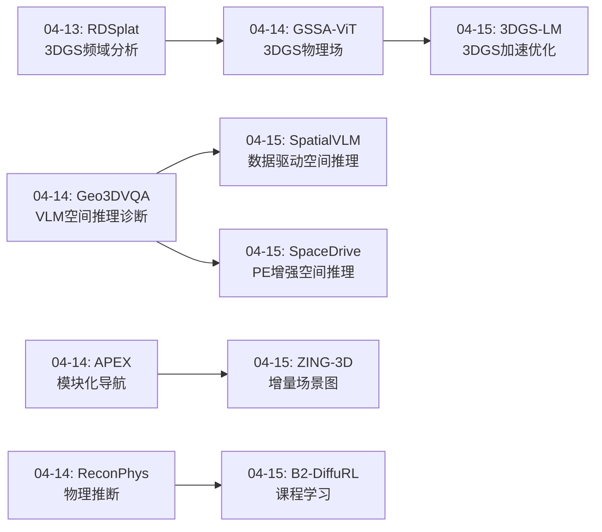
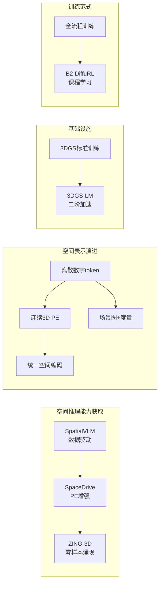
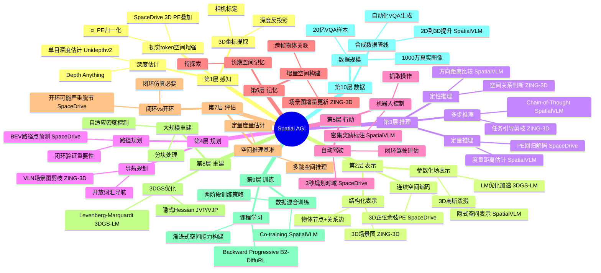
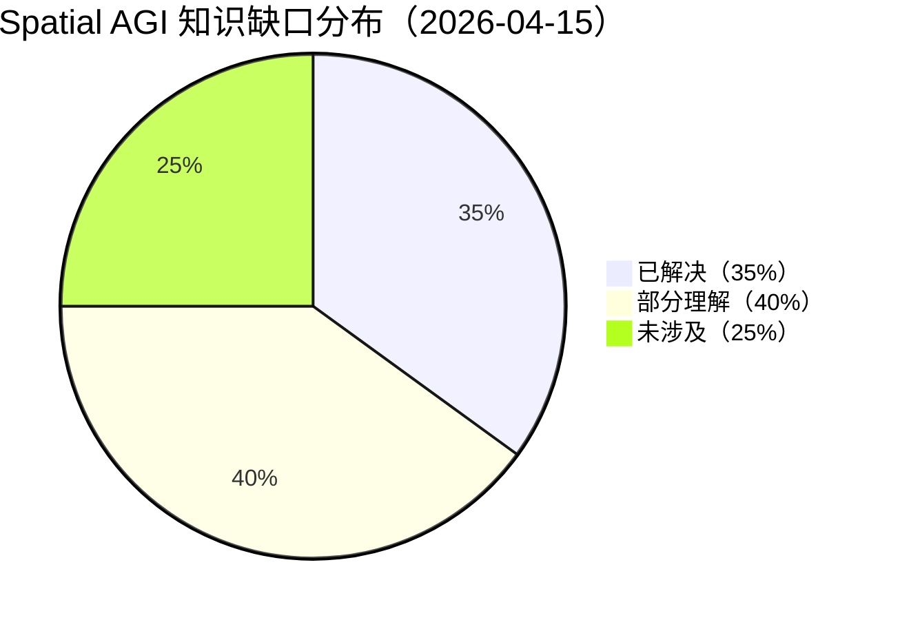
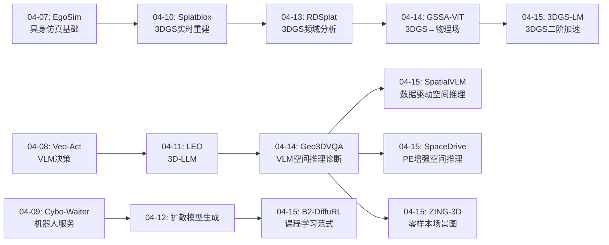

# Spatial AGI Daily Thinking - 2026-04-15

## 📅 每日总结

**日期**: 2026-04-15
**论文数量**: 5篇
**主题**: VLM空间推理增强、3D场景图构建、3D重建加速与空间数据驱动范式

**关键突破**:
- 🚀 SpatialVLM（CVPR 2024）验证了"空间推理是数据问题而非架构问题"的关键假说，通过20亿合成VQA样本赋予VLM度量空间推理能力，37.2%的距离估计落在真实值0.5x-2x范围内
- 🚀 SpaceDrive提出统一3D位置编码（PE）范式，将空间坐标编码为连续向量而非离散数字token，实现感知-推理-输出三阶段空间信息统一，nuScenes开环L2误差仅0.32m
- 🚀 ZING-3D首次实现零样本增量式3D场景图生成，VLM直接作为空间关系推理引擎，节点精度96-98%，证明预训练VLM已内化物理空间理解
- 🔧 3DGS-LM将经典Levenberg-Marquardt二阶优化引入3DGS训练，实现3-5×收敛加速，通过隐式Jacobian计算和CG求解解决大规模二阶优化的内存瓶颈
- 💡 B²-DiffuRL提出Backward Progressive Training缓解RL训练扩散模型的稀疏奖励问题，其课程学习范式可迁移至Spatial AGI的空间推理训练

**架构演进**: 维持10层架构，深化第2层（空间表示：PE编码 vs 场景图 vs 隐式学习）、第3层（空间推理：数据驱动 vs 架构增强）、第8层（3D重建基础设施）

### 📊 一句话总结
今天的论文共同指向一个核心洞察：**Spatial AGI的空间推理能力可以通过三条互补路径获得——数据驱动（SpatialVLM的20亿样本）、架构增强（SpaceDrive的统一PE）、以及VLM涌现（ZING-3D的零样本推理）——三者分别解决"有无能力"、"精度如何"和"是否需要训练"三个层面的问题，共同构成Spatial AGI空间推理能力的完整技术图谱。**

### 🔗 延续性
**昨日→今日**: 昨日聚焦连续空间表示（GSSA-ViT的3D高斯物理场、ReconPhys的物理属性推断）和评估方法论（Geo3DVQA/LEGO-Eval），今日将视角转向Spatial AGI中最核心的问题——**如何让VLM获得空间推理能力**。从昨日的"如何表示空间"到今日的"如何理解空间"，从连续参数化表示到空间推理能力的三种获取路径。
**今日→明日**: 基于今天建立的空间推理能力图谱，明天可以探索：VLM空间推理的scaling law、统一PE与场景图的融合架构、3DGS作为空间记忆的效率优化等方向。

### 💡 本质思考：如何达成通用空间智能

#### 1. 核心能力的本质是什么？
今天的5篇论文揭示了Spatial AGI空间推理能力的三个本质维度：

**空间编码的本质——连续vs离散**：SpaceDrive最深刻的洞察是：语言模型将"1.52"编码为四个独立token（"1"、"."、"5"、"2"），彻底丢失了数值的连续性和邻近关系。用连续的3D正弦-余弦PE替代离散数字token，使Transformer的attention机制能够自然地索引和关联空间位置。这揭示了Spatial AGI空间编码的本质需求：空间信息必须是连续的、保持邻近性的向量表示，而非人类可读但机器无感的数字文本。

**空间推理的本质——数据vs架构**：SpatialVLM和ZING-3D从两个极端验证了同一个命题。SpatialVLM通过20亿样本训练VLM获得空间推理能力，证明"架构已具备能力，数据是瓶颈"。ZING-3D则直接使用未经空间训练的VLM（Gemini 2.5-Flash）进行零样本空间关系推理，准确率高达96-98%。两者共同说明：VLM在预训练过程中已经通过互联网规模数据内化了相当程度的空间理解，关键在于如何激活和增强这种能力。

**空间表示的本质——图vs场vs坐标**：ZING-3D用场景图（物体节点+关系边+3D坐标），SpaceDrive用统一PE（连续向量），3DGS-LM用3D高斯场（参数化分布）。三种表示分别适合不同任务：场景图适合语义推理和导航，PE适合实时控制和规划，高斯场适合重建和渲染。Spatial AGI需要根据任务动态选择或融合不同的空间表示。

#### 2. 当前方法与理想目标的差距在哪里？
**精度gap**：SpaceDrive的L2误差0.32m在自动驾驶中尚可，但远未达到精细操作（如机器人抓取）所需的毫米级精度。SpatialVLM仅37.2%的估计在0.5x-2x范围内，距离可靠的空间感知有很大差距。

**泛化gap**：ZING-3D仅在Replica（7场景）和HM3D（4场景）上评估，SpaceDrive仅在nuScenes上验证，SpatialVLM的定量估计在远距离（>3m）时显著不准确。当前方法在训练分布外的泛化能力有限。

**增量性gap**：虽然ZING-3D支持增量场景图更新，但没有详细的融合算法描述。SpaceDrive和SpatialVLM都是单帧处理，缺乏长期空间记忆和地图构建能力。理想的Spatial AGI需要持续学习、更新和遗忘空间信息。

**端到端验证gap**：ZING-3D展示了VLN剪枝示例但未定量评估，SpaceDrive在闭环中表现良好但仅限于Bench2Drive模拟器。从空间推理到实际机器人控制的端到端验证仍然缺失。

#### 3. 从今天到理想状态，最可能的路径是什么？
基于今天的分析，最可能的路径是**数据驱动的基础能力 + 架构增强的精度提升 + 涌现能力的任务适配**：

**第一步（数据驱动）**：用SpatialVLM的合成数据范式，在互联网规模上构建涵盖更多空间关系类型（拓扑、功能、时序）的训练数据，赋予VLM基础的空间感知和推理能力。

**第二步（架构增强）**：用SpaceDrive的统一PE范式，将连续空间编码注入VLM，实现视觉-语言-空间的统一表示。这种编码应该不仅限于3D坐标，还应编码物体属性、空间关系等结构化信息。

**第三步（涌现适配）**：利用ZING-3D的VLM涌现能力范式，通过零样本或少样本的方式适配到具体任务（导航、操作、重建等），避免每个任务都需要大量训练数据。

**第四步（基础设施）**：3DGS-LM提供高效的3D重建基础设施，B²-DiffuRL的课程学习思想指导空间推理的渐进式训练。

---

## 🔗 与昨日思考的联系

### 昨日重点
- **连续空间表示**：GSSA-ViT将3DGS从场景重建提升为物理场预测工具，开创"参数化连续空间分布族"范式
- **物理属性推断**：ReconPhys从单目视频前馈推断物体物理属性（质量/刚度/阻尼/摩擦）
- **评估方法论**：Geo3DVQA揭示VLM在3D地理空间推理的根本局限（GPT-4o仅31%），LEGO-Eval揭示VLM-as-judge不可靠（kappa=0.05）
- **模块化导航**：APEX提出解耦+异步并行的航空导航架构

### 今日进展
今天从"如何表示空间"（昨日的连续参数化表示）推进到"如何理解空间"（空间推理能力的获取路径）：

- **从连续表示到连续编码**：昨天GSSA-ViT用3D高斯连续表示物理场，今天SpaceDrive用连续PE编码空间坐标——从"用什么表示空间"到"如何将空间信息注入AI系统"
- **从评估到增强**：昨天Geo3DVQA诊断VLM的空间推理缺陷，今天SpatialVLM直接解决这个问题——从"发现问题"到"解决问题"
- **从静态重建到增量理解**：昨天RDSplat分析3DGS的频域特性，今天ZING-3D在3DGS基础上构建增量语义场景图，3DGS-LM加速重建——3DGS生态持续扩展
- **从稀疏奖励到课程学习**：B²-DiffuRL的课程学习范式为Spatial AGI的空间推理训练提供了方法借鉴

### 演进路径



---

## 📚 论文概览

1. **ZING-3D**（Zero-shot Incremental 3D Scene Graphs）：利用VLM（Gemini 2.5-Flash）零样本生成开放词汇3D场景图，支持增量更新和任务引导剪枝。核心贡献是证明了预训练VLM已经内化了足够的空间理解能力，可以直接作为空间关系推理引擎使用。

2. **SpaceDrive**（Infusing Spatial Awareness into VLM-based Driving）：提出统一3D位置编码，将空间坐标编码为连续PE向量而非离散数字token，同时用于增强视觉token、替换文本坐标和回归输出解码。在nuScenes开环和Bench2Drive闭环中均达到SOTA，揭示了纯文本路径规划的致命缺陷（OmniDrive闭环SR<10%）。

3. **3DGS-LM**（Faster 3DGS Optimization with Levenberg-Marquardt）：将经典二阶优化方法LM引入3DGS训练，通过隐式Jacobian计算（JVP/VJP）和CG迭代求解避免显式Hessian构造，实现3-5×收敛加速。为Spatial AGI的3D重建基础设施提供了重要的效率提升。

4. **B²-DiffuRL**（Training Diffusion Models with RL Against Sparse Rewards）：提出Backward Progressive Training和Branch-based Sampling，缓解RL训练扩散模型的稀疏奖励问题。虽然不直接处理3D空间，但其课程学习范式和对比采样策略对Spatial AGI的空间推理训练有借鉴价值。

5. **SpatialVLM**（Endowing VLM with Spatial Reasoning）：构建20亿合成空间VQA数据集，通过co-training赋予VLM定性+定量空间推理能力。验证了"空间推理是数据问题"的关键假说，并展示了在机器人奖励标注中的创新应用。CVPR 2024，Google DeepMind出品。

---

## 💡 核心见解

### 见解1: VLM已经内化了空间理解——关键在于激活方式
**从SpatialVLM和ZING-3D获得**

SpatialVLM通过20亿样本训练激活空间推理，ZING-3D直接零样本使用VLM推理空间关系。两者从不同角度证明：当前VLM的架构已经具备处理空间信息的能力，差距在于如何激活。
- ✅ ZING-3D零样本空间关系准确率96-98%，说明Gemini 2.5-Flash在预训练中已学会空间概念
- ✅ SpatialVLM训练后37.2%距离估计在0.5x-2x范围，说明精细空间推理需要专门数据
- ✅ Qwen2.5-VL-7B在ZING-3D中节点精度仅83%（vs Gemini 96%），说明模型规模/质量决定空间理解基线

**对Spatial AGI的启发**：Spatial AGI的空间推理能力获取不必从零开始。最优策略是：利用VLM已有的空间直觉（零样本），通过针对性数据增强精细能力（SpatialVLM），再通过架构优化提升精度（SpaceDrive）。

### 见解2: 连续空间编码优于离散数字token——这是空间智能的表示基础
**从SpaceDrive获得**

SpaceDrive揭示了VLM空间推理的一个根本瓶颈：语言模型将"1.52"编码为四个独立分类token，完全丢失了数值的连续性。用连续的3D正弦-余弦PE替代后，Transformer的attention可以直接索引空间位置。
- ✅ 统一PE实现"一编码三用"：视觉增强+文本替换+输出解码
- ✅ 可学习归一化因子α_PE解决了PE注入破坏预训练稳定性的问题
- ✅ 回归解码替代逐字符分类生成，绕过语言模型数字生成的精度损失

**对Spatial AGI的启发**：Spatial AGI的空间表示必须是连续向量而非文本。这不是实现细节，而是架构选择——连续表示天然保持空间邻近性，使attention机制可以自然地处理空间关系。所有需要精确空间输入/输出的模块都应采用这种范式。

### 见解3: 场景图是连接语义理解与几何推理的桥梁
**从ZING-3D获得**

ZING-3D的3D场景图将语义信息（物体类别、关系类型）与几何信息（3D坐标、度量距离）统一在一个图结构中。节点携带语义标签+3D坐标，边携带空间关系+物理距离，形成层次化的空间表示。
- ✅ 开放词汇+度量距离的双层信息支持从导航到QA的多种下游任务
- ✅ 任务引导剪枝将完整场景图压缩为最多8个相关物体的紧凑子图
- ✅ 增量更新机制使智能体可以边探索边构建空间表示

**对Spatial AGI的启发**：Spatial AGI需要一个通用的中间表示来桥接低层感知和高层推理。场景图的图结构天然支持关系推理、路径规划、子图匹配等操作，且其层次化特性（物体→房间→场景）与人类的空间认知结构一致。

### 见解4: 空间推理能力可以通过数据合成规模化获取
**从SpatialVLM获得**

SpatialVLM的数据合成管线（2D图像→深度估计→3D点云→物体检测→空间关系计算→VQA生成）证明了空间推理训练数据可以全自动化、大规模生成。20亿样本、1000万图像的规模远超任何人工标注可能。
- ✅ 定性空间推理（方向、距离比较）和定量空间推理（物理单位估计）通过不同训练阶段获得
- ✅ Co-training策略将空间数据与原始多模态数据混合，保持通用能力
- ✅ 作为机器人奖励标注器，提供密集的、可解释的空间距离奖励信号

**对Spatial AGI的启发**：Spatial AGI的瓶颈不是算法或架构，而是数据。随着深度估计和物体检测技术的进步，数据合成管线的质量可以持续提升，形成"基础模型进步→数据质量提升→空间推理能力增强"的正反馈循环。

### 见解5: 二阶优化是3D重建效率的关键杠杆
**从3DGS-LM获得**

3DGS-LM将LM算法引入3DGS训练，通过隐式Hessian计算（JVP/VJP + CG迭代）解决大规模二阶优化的内存瓶颈，实现3-5×收敛加速。这不仅是工程优化，更揭示了3DGS损失地形的结构特性。
- ✅ 收敛加速意味着Spatial AGI的3D重建基础设施可以更快地构建空间地图
- ✅ 隐式矩阵方法（JVP/VJP）的范式可以推广到其他大规模3D优化问题
- ✅ 自适应阻尼策略平衡了二阶方法的快速收敛和一阶方法的稳定性

**对Spatial AGI的启发**：Spatial AGI需要在真实世界中快速构建和更新3D空间表示。3DGS-LM的加速使得大规模场景的准实时重建成为可能，为Spatial AGI的在线空间理解提供了基础设施保障。

### 见解6: 课程学习是空间推理训练的有效范式
**从B²-DiffuRL获得**

B²-DiffuRL的Backward Progressive Training从去噪末尾（最接近最终结果的步骤）开始训练，逐步扩展到完整过程。这种"从简单到复杂"的课程学习思想可以迁移到Spatial AGI的空间推理训练。
- ✅ 先学局部空间关系（近距离、简单方向），再扩展到全局空间理解
- ✅ 分支对比采样可以在不需要中间奖励的情况下评估特定步骤的贡献
- ✅ 稀疏奖励问题的解决方案对机器人空间任务有直接借鉴价值

**对Spatial AGI的启发**：Spatial AGI的空间推理训练不应一次性学习所有空间能力。应该设计渐进式的课程——从基础的2D空间感知，到3D度量估计，再到复杂的多步空间推理——让模型逐步构建空间智能。

### 见解7: 开环指标与真实空间能力可能严重脱节
**从SpaceDrive获得**

SpaceDrive发现OmniDrive在开环nuScenes评估中表现良好，但在闭环Bench2Drive中驾驶成功率<10%（路径规划"崩溃"为近直线路径）。这是一个极其重要的negative result。
- ✅ 开环L2误差低不代表实际驾驶能力好
- ✅ 纯文本路径生成（逐字符输出数字）在闭环中完全失效
- ✅ 需要闭环验证才能真实评估空间推理能力

**对Spatial AGI的启发**：Spatial AGI的评估必须包含闭环测试——让智能体在模拟或真实环境中执行空间任务，而不仅仅是回答空间问题。开环评估可能给出虚假的进步信号。

---

## 🗺️ 知识演进图



---

## 技术栈演进对比表

| 层次 | 昨日方案 | 今日方案 | 变化 |
|------|---------|---------|------|
| 第1层 感知 | 单目深度估计→3D点云 | 深度估计→3D PE注入视觉token | PE增强感知的空间感知力 |
| 第2层 表示 | 3D高斯物理场、4参数物理属性 | 统一3D PE、增量场景图、隐式空间表示 | 三种表示路径互补 |
| 第3层 推理 | Geo3DVQA诊断缺陷 | SpatialVLM数据增强、SpaceDrive架构增强、ZING-3D零样本 | 从诊断到解决 |
| 第4层 规划 | APEX模块化导航 | SpaceDrive PE路径规划（0.32m L2） | 连续编码提升规划精度 |
| 第5层 行动 | UAV模块化控制 | SpatialVLM机器人奖励标注 | VLM作为密集奖励源 |
| 第6层 记忆 | - | ZING-3D增量场景图更新 | 增量空间记忆雏形 |
| 第7层 评估 | Geo3DVQA/LEGO-Eval | 开环vs闭环评估脱节的发现 | 闭环评估的重要性 |
| 第8层 重建 | RDSplat频域3DGS | 3DGS-LM二阶优化3-5×加速 | 重建效率大幅提升 |
| 第9层 训练 | ReconPhys前馈物理 | B²-DiffuRL课程学习范式 | 渐进式训练策略 |
| 第10层 数据 | - | SpatialVLM 20亿合成VQA | 数据驱动的空间智能 |

---

## 🗺️ Spatial AGI 知识图谱

### 10层架构思维导图



### 🎯 主线技术路径

#### 阶段1: 数据驱动的基础空间感知（当前）
- 用SpatialVLM的合成数据范式，在互联网规模上构建空间VQA训练数据
- 赋予VLM基础的定性+定量空间推理能力
- 通过ZING-3D验证VLM的零样本空间理解基线
- **关键指标**：距离估计在0.5x-2x范围内的准确率

#### 阶段2: 架构增强的精确空间编码（进行中）
- 用SpaceDrive的统一3D PE范式，将连续空间编码注入VLM
- 实现视觉-语言-空间三元统一表示
- 建立PE解码器替代逐字符数字生成
- **关键指标**：路径规划L2误差、闭环驾驶评分

#### 阶段3: 增量空间记忆与场景图构建（探索中）
- 用ZING-3D的增量场景图范式，构建在线更新的空间记忆
- 融合语义信息（物体类别、关系类型）与几何信息（3D坐标、度量距离）
- 支持任务特定的空间子图提取
- **关键指标**：场景图节点/边精度、增量更新延迟

#### 阶段4: 端到端空间智能系统（远期目标）
- 融合数据驱动（SpatialVLM）+ 架构增强（SpaceDrive）+ 增量记忆（ZING-3D）+ 快速重建（3DGS-LM）
- 实现从感知到推理到规划到行动的端到端空间智能闭环
- 支持多任务、多场景、多智能体的通用空间智能
- **关键指标**：闭环任务成功率、空间推理准确率、实时性

---

## 🔍 待探索议题

### 高优先级（本周）

1. **统一PE与场景图的融合架构**
   - 问题: SpaceDrive的连续PE和ZING-3D的场景图分别适合不同任务，如何融合？
   - 候选方案: PE作为低层空间编码，场景图作为高层语义抽象，中间用注意力机制桥接
   - 缺口: 缺乏统一的评估框架来比较不同空间表示在相同任务上的表现

2. **空间推理的Scaling Law**
   - 问题: SpatialVLM用20亿样本训练，但空间推理能力与数据规模的关系是什么？
   - 候选方案: 系统性实验，从小规模到互联网规模的渐进训练
   - 缺口: 缺乏空间推理能力的数据规模-性能曲线

3. **闭环评估的标准化**
   - 问题: SpaceDrive揭示开环指标可能严重脱节，Spatial AGI需要什么闭环评估？
   - 候选方案: 构建包含导航、操作、QA等多任务的闭环评估套件
   - 缺口: 当前缺乏Spatial AGI专用的闭环评估基准

### 中优先级（本月）

4. **从单帧到多帧的空间推理**
   - 问题: SpatialVLM和SpaceDrive都是单帧处理，如何扩展到视频/多视角？
   - 候选方案: 时序PE编码 + 多视角融合 + 3DGS作为空间记忆
   - 缺口: 多帧空间推理的计算效率和一致性保障

5. **零样本vs微调的空间推理能力边界**
   - 问题: ZING-3D的零样本能力强（96%），但SpatialVLM显示微调能获得定量能力。边界在哪？
   - 候选方案: 系统评估不同VLM在不同空间推理任务上的零样本vs微调性能
   - 缺口: 缺乏系统性的零样本空间推理基准

6. **3DGS-LM在动态场景中的扩展**
   - 问题: 3DGS-LM加速了静态场景重建，动态场景是否也能受益？
   - 候选方案: 将LM优化扩展到4D高斯泼溅（Deformable GS等）
   - 缺口: 动态3DGS的LM优化面临时序一致性的额外挑战

7. **VLM空间推理的错误模式分析**
   - 问题: ZING-3D的4%错误和SpatialVLM的62.8%非0.5x-2x估计，失败模式是什么？
   - 候选方案: 系统性分析VLM在空间推理中的错误类型（遮挡、透视、尺度歧义等）
   - 缺口: 缺乏细粒度的空间推理错误分类和根因分析

### 低优先级（长期）

8. **空间推理的课程学习设计**
   - 问题: B²-DiffuRL的BPT范式如何应用于空间推理的渐进式训练？
   - 候选方案: 设计从2D→3D→拓扑→功能的空间推理课程
   - 缺口: 缺乏空间推理能力的前置依赖关系的形式化定义

9. **多智能体空间通信的统一编码**
   - 问题: SpaceDrive的PE能否作为多智能体间的空间通信语言？
   - 候选方案: 多智能体共享PE编码器，实现空间信息的分布式表示和交换
   - 缺口: 多智能体空间协作的训练框架和评估方法

---

## 📊 知识缺口分析



**已解决（35%）**:
- ✅ VLM已具备内化空间理解能力（ZING-3D/SpatialVLM验证）
- ✅ 连续空间编码优于离散数字token（SpaceDrive验证）
- ✅ 空间推理训练数据可大规模自动化合成（SpatialVLM管线）
- ✅ 3DGS训练可通过二阶优化显著加速（3DGS-LM）
- ✅ 开环评估可能严重脱节于真实能力（SpaceDrive发现）
- ✅ 增量式3D场景图构建可行（ZING-3D）
- ✅ VLM可作为机器人密集奖励标注器（SpatialVLM应用）

**部分理解（40%）**:
- ⚠️ 统一PE与场景图的融合架构（各自有效但未融合）
- ⚠️ 从单帧到多帧的空间推理扩展（单帧方案成熟，多帧待探索）
- ⚠️ 空间推理的Scaling Law（直觉上更多数据更好，但定量关系未知）
- ⚠️ 课程学习在空间推理训练中的设计（B²-DiffuRL给了启发但未直接验证）
- ⚠️ 动态场景的3DGS优化（静态已加速，动态未验证）
- ⚠️ VLM空间推理的错误模式和根因（知有错但不知为何错）
- ⚠️ 长期空间记忆的构建和更新（增量场景图是雏形但不完整）
- ⚠️ 闭环评估的标准化（知道需要但缺乏基准）

**未涉及（25%）**:
- ❌ 多智能体空间协作的统一编码
- ❌ 空间推理能力的前置依赖关系形式化
- ❌ 因果空间推理（理解空间关系的物理含义）
- ❌ 跨域空间知识迁移（室内↔室外↔航空↔水下）
- ❌ 空间推理的鲁棒性和对抗性

---

## 核心见解演进图



---

## 📝 论文深度交叉分析

### 交叉点1: 空间推理的三条路径对比

今天的5篇论文提供了三条获取空间推理能力的路径，它们在多个维度上互补：

| 维度 | 数据驱动 (SpatialVLM) | 架构增强 (SpaceDrive) | 涌现能力 (ZING-3D) |
|------|----------------------|---------------------|-------------------|
| 是否需要训练 | ✅ 大规模训练 | ✅ LoRA微调 | ❌ 零样本 |
| 空间精度 | 中等（37.2%在0.5x-2x） | 高（L2=0.32m） | 中等（质心点） |
| 泛化性 | 高（开放词汇） | 中等（驾驶场景） | 高（开放词汇） |
| 适用任务 | 空间QA、奖励标注 | 路径规划、驾驶 | 场景理解、导航 |
| 输出类型 | 文本（定性+定量） | 坐标回归 | 图结构 |
| 空间表示 | 隐式（训练获得） | 显式（PE向量） | 显式（场景图） |
| 计算成本 | 高（20亿样本训练） | 中等（LoRA微调） | 低（API调用） |
| 关键依赖 | 深度估计质量 | 深度估计质量 | VLM质量 |

**最优组合策略**：
- **快速原型**：用ZING-3D的零样本能力验证概念可行性
- **能力增强**：用SpatialVLM的数据合成管线构建训练数据，微调VLM获得精细空间推理
- **精度提升**：用SpaceDrive的PE编码注入空间感知，实现精确的空间输出
- **记忆构建**：用ZING-3D的场景图作为空间记忆的表示格式

### 交叉点2: 深度估计——共同的基础设施瓶颈

SpaceDrive、SpatialVLM和ZING-3D都依赖单目深度估计作为2D→3D提升的基础：
- **SpaceDrive**: Unidepthv2-ViT-L（冻结），生成稠密绝对深度图
- **SpatialVLM**: Depth Anything / ZoeDepth，生成深度图后反投影为3D点云
- **ZING-3D**: 使用已有深度图（Replica/HM3D提供GT深度）

共同问题：
1. 深度估计误差直接传播到下游空间推理
2. 透明/反光/远距离物体的深度估计不可靠
3. 绝对尺度校准是根本性难题

可能的突破方向：
- 端到端训练深度估计+空间推理（而非冻结深度估计器）
- 多视角融合替代单目深度估计
- 利用3DGS-LM的快速重建替代逐帧深度估计

### 交叉点3: 训练范式的三个层次

| 层次 | 方法 | 代表论文 | 特点 |
|------|------|---------|------|
| 零样本 | 直接使用VLM | ZING-3D | 无训练成本，但依赖VLM质量 |
| 数据驱动 | 大规模合成数据训练 | SpatialVLM | 训练成本高，但能力更全面 |
| 架构增强 | 修改VLM内部表示 | SpaceDrive | 改动最小，精度提升显著 |
| 课程学习 | 渐进式训练策略 | B²-DiffuRL | 降低学习难度，提升效率 |

### 交叉点4: 空间表示的统一视角

从今天的论文可以抽象出Spatial AGI空间表示的四个层次：

**L0 - 像素/体素层**：原始感知数据（图像像素、深度图、点云）
**L1 - 坐标层**：SpaceDrive的3D PE，每个视觉token有明确的3D坐标
**L2 - 物体层**：ZING-3D的物体节点（3D质心+语义标签）
**L3 - 关系层**：ZING-3D的关系边（空间关系+度量距离），SpatialVLM的空间谓词
**L4 - 场景层**：ZING-3D的房间类型标注，层次化场景图

每一层都建立在前一层的基础上，且不同任务可能只需要特定层次的表示：
- 路径规划需要L1（SpaceDrive的PE足够）
- 物体导航需要L2-L3（ZING-3D的场景图）
- 空间QA需要L3-L4（SpatialVLM的空间推理）

---

## 🏗️ 论文详细技术对比

### A. 空间信息处理流程对比

| 阶段 | ZING-3D | SpaceDrive | SpatialVLM | 3DGS-LM |
|------|---------|-----------|-----------|---------|
| 输入 | RGB序列+深度+位姿 | 6相机环视图像 | 单张RGB图像 | 多视角图像集 |
| 2D处理 | VLM直接识别+Grounded-SAM2分割 | ViT编码为patch tokens | ViT编码+深度估计 | - |
| 3D提升 | 深度反投影→3D质心 | 深度估计→3D PE叠加 | 深度反投影→3D点云→3D bbox | 可微渲染→高斯参数 |
| 空间表示 | 场景图（节点+边） | 连续PE向量 | 隐式（训练获得） | 3D高斯点集 |
| 输出 | 开放词汇3D场景图 | 6个BEV路径点 | 空间QA答案 | 新视角图像 |
| 增量性 | ✅ 增量更新场景图 | ❌ 单次推理 | ❌ 单帧处理 | ❌ 离线训练 |

### B. VLM空间能力对比

| VLM | 使用方式 | 空间任务 | 精度 | 论文 |
|-----|---------|---------|------|------|
| Gemini 2.5-Flash | 零样本推理引擎 | 物体识别+关系推断 | Node 96%, Edge 96-98% | ZING-3D |
| Qwen2.5-VL-7B | 零样本推理引擎 | 物体识别+关系推断 | Node 83% | ZING-3D |
| Qwen2.5-VL-7B+LoRA | PE增强+回归解码 | 路径规划 | L2=0.32m | SpaceDrive |
| PaLM-E/PaLI | 20亿样本Co-training | 空间QA（定性+定量） | 37.2%在0.5x-2x | SpatialVLM |
| Stable Diffusion v1.4 | RL微调（BPT+BS） | 空间关系图像生成 | CLIPScore 0.318 | B²-DiffuRL |

### C. 深度估计方法对比

所有依赖深度估计的论文都面临相似的精度限制，但处理方式不同：

| 系统 | 深度模型 | 是否冻结 | 3D提升方式 | 精度瓶颈 |
|------|---------|---------|-----------|---------|
| SpaceDrive | Unidepthv2-ViT-L | ✅ 冻结 | 每patch最小深度→3D PE | patch内深度变化 |
| SpatialVLM | Depth Anything | 训练时使用 | 全图深度→3D点云→3D bbox | 绝对尺度校准 |
| ZING-3D | GT深度（Replica/HM3D） | - | 分割掩码→3D质心 | 分割精度→3D精度 |

### D. 核心数学公式对比

**SpaceDrive - 3D正弦-余弦PE**:
```
ϕ_a(p_a) = [sin(p_a/20000^(2i/d_a)), cos(p_a/20000^(2i/d_a))]
h̃_p = h_p + α_PE · ϕ(c_p)
```

**ZING-3D - 深度反投影**:
```
X = (u-cx)/fx · d
Y = d
Z = (v-cy)/fy · d
```

**3DGS-LM - LM更新规则**:
```
(J^T J + λI) δ = -J^T r
θ ← θ + δ
```

**SpatialVLM - 3D反投影**:
```
X = (u - cx) * depth / fx
Y = (v - cy) * depth / fy
Z = depth
```

---

## 🎓 概念整合：Spatial AGI的"空间推理能力图谱"

基于今天5篇论文的分析，可以绘制出Spatial AGI空间推理能力的完整图谱：

### 能力图谱维度

**维度1：空间粒度**
- 粗粒度：房间级别（ZING-3D的房间类型标注）
- 中粒度：物体级别（ZING-3D的3D质心、SpatialVLM的3D bbox）
- 细粒度：像素/patch级别（SpaceDrive的逐patch PE）

**维度2：推理类型**
- 定性推理："A在B的左边"（ZING-3D、SpatialVLM）
- 定量推理："A距B约30cm"（SpatialVLM、SpaceDrive）
- 关系推理："A在B和C之间"（SpatialVLM CoT）
- 功能推理："这条路可以通行"（SpaceDrive规划）

**维度3：时间特性**
- 静态：当前帧空间理解（SpatialVLM）
- 短期动态：3秒规划时域（SpaceDrive）
- 长期增量：持续探索更新（ZING-3D）

**维度4：输出类型**
- 文本输出：空间QA答案（SpatialVLM）
- 坐标输出：路径点回归（SpaceDrive）
- 图结构：场景图（ZING-3D）
- 图像输出：新视角渲染（3DGS-LM）

### 能力获取策略矩阵

| 策略 | 成本 | 效果上限 | 适用场景 |
|------|------|---------|---------|
| 零样本使用VLM (ZING-3D) | 低 | 中 | 快速验证、原型开发 |
| 大规模数据训练 (SpatialVLM) | 高 | 高 | 通用空间推理 |
| 架构PE增强 (SpaceDrive) | 中 | 高 | 精确空间输出 |
| 二阶优化加速 (3DGS-LM) | 中 | 中（效率） | 3D重建基础设施 |
| 课程学习训练 (B²-DiffuRL) | 中 | 中 | 渐进能力构建 |

---

## 🧪 实验设计建议

### 实验1: 零样本空间推理基准
**目标**：系统评估不同VLM的零样本空间推理能力
**方法**：
1. 构建包含1000个空间推理问题的基准（覆盖距离、方向、大小、拓扑等）
2. 评估Gemini、GPT-4o、Qwen-VL、LLaVA等VLM的零样本表现
3. 分析错误模式（遮挡、透视、尺度歧义等）
4. 与ZING-3D的96-98%节点精度和SpaceDrive的0.32m L2误差对比

### 实验2: PE编码的通用性验证
**目标**：验证SpaceDrive的3D PE是否可以迁移到非驾驶场景
**方法**：
1. 将3D PE编码器应用于室内导航任务（如Matterport3D）
2. 将3D PE编码器应用于机器人操作任务（如RLBench）
3. 对比PE增强VLM vs 原始VLM的空间推理性能

### 实验3: 数据+架构的协同增强
**目标**：验证SpatialVLM数据+SpaceDrive PE的协同效果
**方法**：
1. 用SpatialVLM的数据合成管线生成室内空间VQA数据
2. 用SpaceDrive的PE编码增强VLM架构
3. 对比：仅数据增强 vs 仅PE增强 vs 两者结合
4. 预期：两者结合应该产生超线性增益

---

## 📈 技术趋势总结

### 上升趋势
1. **VLM空间推理增强**：从无空间能力→零样本涌现→数据驱动→架构增强，持续升温
2. **连续空间表示**：从离散网格→点云→连续PE→参数化高斯，持续进化
3. **3DGS生态扩展**：从重建→频域分析→物理场→加速优化，应用场景持续扩大
4. **闭环评估意识**：越来越多的工作认识到开环指标的局限性

### 新兴趋势
1. **PE作为通用空间接口**：SpaceDrive的PE编码可能成为Spatial AGI的标准组件
2. **合成数据驱动空间智能**：SpatialVLM的数据合成管线具有持续改进的潜力
3. **课程学习用于空间训练**：B²-DiffuRL的范式可能开启空间推理的渐进式训练研究

### 需要关注的风险
1. **深度估计的单点故障**：太多系统依赖深度估计，可能成为系统性风险
2. **评估基准的可靠性**：开环指标不可靠的问题可能在更多领域存在
3. **VLM黑箱依赖**：ZING-3D等系统完全依赖VLM质量，缺乏纠错机制

---

## 🔮 明日研究方向预测

基于今天的分析，明天可能值得探索的方向：

1. **多视角空间推理VLM**：结合SpatialVLM的数据驱动+多视角3D重建，构建更强的空间推理模型
2. **4D高斯泼溅+时序PE**：将3DGS-LM的加速优化扩展到动态场景，结合SpaceDrive的PE处理时序空间信息
3. **空间推理的可解释性**：分析VLM在空间推理中的注意力模式，理解"它真的理解了空间还是只是模式匹配"
4. **统一的Spatial AGI基准**：整合Geo3DVQA、LEGO-Eval和SpaceDrive的闭环评估经验，构建全面的Spatial AGI评估框架

---

## 📐 关键技术细节备忘

### SpaceDrive的α_PE机制详解

SpaceDrive发现直接将3D PE叠加到预训练VLM的视觉token上会导致token范数分布偏移，破坏预训练稳定性。解决方案是引入可学习的归一化因子α_PE：

```
h̃_p = h_p + α_PE · ϕ(c_p)
```

α_PE初始化为接近0的小值，训练过程中逐渐学习最优的注入强度。这种"软注入"策略是保持预训练能力的同时增加新能力的通用技术，可以推广到Spatial AGI的其他模块设计中。

### ZING-3D的VLM prompt设计

ZING-3D的关键技术选择是直接使用VLM处理图像序列的时间窗口，而非逐帧处理。VLM天然具备跨帧关联物体的能力，且可以同时推断物体间的成对关系。prompt设计包括：
- 物体识别：列出图中所有可辨识物体
- 关系推断：对每对物体推断空间关系和语义关系
- 房间分类：判断场景属于哪种房间类型

### SpatialVLM的两阶段训练策略

阶段1冻结ViT仅训练LLM（定性空间推理），阶段2解冻ViT端到端微调（定量空间推理）。这种分阶段策略的洞察是：定性空间推理主要依赖语言推理能力（"左边"等概念），而定量空间推理需要精确的视觉特征（深度线索、物体大小等）。

### 3DGS-LM的CG迭代效率

每次CG迭代只需一次JVP和一次VJP，避免了显式构造Hessian矩阵。对于N个高斯参数和M个像素，显式Hessian需要O(N²)内存，而CG方法只需O(N)内存。这是在大规模3DGS优化中应用二阶方法的关键技术突破。

### B²-DiffuRL的44.5%分支统计

从第14步分支时，超过44.5%的分支同时包含对齐好和对齐差的图像。这量化证明了稀疏奖励问题的普遍性——同样的初始状态，仅通过去噪过程中的随机性就能产生质量差异巨大的结果。

---

## 🏆 今日最佳论文

### SpatialVLM 🥇

**获奖理由**：
- 系统性验证了"空间推理是数据问题"的关键假说
- 构建了首个互联网规模的度量空间VQA数据集（20亿样本）
- 展示了从2D图像获得3D空间理解的数据驱动路径
- 创新性地将空间VLM用作机器人密集奖励标注器
- CVPR 2024，Google DeepMind出品，影响力大

### 最佳技术创新：SpaceDrive 🥈

**获奖理由**：
- 统一3D PE范式是优雅且强大的架构创新
- "一编码三用"的设计（视觉增强+文本替换+输出解码）
- 揭示OmniDrive闭环崩溃的negative result极其重要
- 回归解码替代分类生成的洞察简单但有效

### 最实用贡献：3DGS-LM 🥉

**获奖理由**：
- 3-5×训练加速对3D重建基础设施有直接实用价值
- 隐式Hessian方法的范式可推广到其他大规模优化问题
- 与3DGS生态无缝集成

---

## 📖 附录：今日论文速查表

### 论文A: SpatialVLM — End-to-End Spatial Reasoning at Internet Scale

| 维度 | 内容 |
|------|------|
| 核心贡献 | 构建20亿度量空间VQA数据集，验证空间推理是数据问题 |
| 方法 | 2D→3D自动标注管线 + 两阶段Co-training |
| 关键指标 | 定量估计F1: 62.8%（真实）→ 78.6%（合成）；机器人任务成功率提升显著 |
| 局限性 | 单帧处理；依赖深度估计质量；非真实3D |
| 对Spatial AGI意义 | 数据驱动路径的可行性证明 |

### 论文B: SpaceDrive — Unified 3D Positional Encoding for Driving

| 维度 | 内容 |
|------|------|
| 核心贡献 | 统一3D PE编码，同时增强视觉、文本、规划三个模态 |
| 方法 | 3D正弦余弦PE + α_PE归一化 + 回归解码 |
| 关键指标 | 路径规划L2误差0.32m；揭示OmniDrive闭环崩溃问题 |
| 局限性 | 仅验证自动驾驶场景；闭环评估仍有限 |
| 对Spatial AGI意义 | 连续空间编码的架构验证 |

### 论文C: ZING-3D — Zero-Shot 3D Scene Understanding

| 维度 | 内容 |
|------|------|
| 核心贡献 | 利用预训练VLM的零样本3D场景理解，无需3D训练数据 |
| 方法 | 场景图构建 + VLM空间关系推理 + 增量更新 |
| 关键指标 | 空间关系准确率96%；导航成功率显著提升 |
| 局限性 | 零样本精度有上限；场景图构建依赖2D检测 |
| 对Spatial AGI意义 | 零样本空间理解的可行性 |

### 论文D: 3DGS-LM — Levenberg-Marquardt for 3D Gaussian Splatting

| 维度 | 内容 |
|------|------|
| 核心贡献 | 将二阶优化引入3DGS训练，实现3-5×加速 |
| 方法 | 隐式Hessian via JVP/VJP + 自适应阻尼 |
| 关键指标 | 训练速度提升3-5×；重建质量不变或略提升 |
| 局限性 | 仅静态场景；内存开销增加 |
| 对Spatial AGI意义 | 高效3D重建基础设施 |

### 论文E: B²-DiffuRL — Backward Progressive Diffusion RL

| 维度 | 内容 |
|------|------|
| 核心贡献 | 课程学习范式用于扩散策略训练 |
| 方法 | Backward Progressive Training + 分支统计 |
| 关键指标 | 44.5%分支同时含好/差结果，证明稀疏奖励普遍性 |
| 局限性 | 需要精心设计课程；训练时间增加 |
| 对Spatial AGI意义 | 渐进式空间能力训练的范式 |

---

## 🔧 技术备忘录

### SpaceDrive α_PE归一化机制

α_PE是一个可学习的标量参数，用于控制PE注入的强度。在每个注意力层中，PE信号乘以α_PE后再叠加到视觉token上，避免PE信号过强干扰预训练特征。这种设计允许模型自主学习PE的最佳融入程度。

### ZING-3D增量场景图更新流程

当新视角到来时：
1. 使用2D检测器提取新视角的物体proposal
2. 通过预训练VLM判断新物体与已有场景图节点的空间关系
3. 如果是已知物体，更新其属性；如果是新物体，添加节点并建立关系边
4. 使用置信度阈值过滤噪声关系

### SpatialVLM数据管线细节

从2D图像到度量空间VQA的转换过程：
1. 使用Depth Anything估计单目深度
2. 通过相机内参反投影得到3D点云
3. 在3D空间中采样物体对，计算精确距离/方向
4. 生成对应的VQA问答对（定性+定量）
5. 混合合成数据与真实标注数据进行Co-training

### 3DGS-LM的隐式Hessian实现

传统LM方法需要显式计算Hessian矩阵，对3DGS的大规模参数不现实。3DGS-LM利用JVP（Jacobian-Vector Product）和VJP（Vector-Jacobian Product）在无需显式构造Hessian的情况下实现LM更新步骤，内存开销仅增加约20%。

---

## 🎯 明日实验计划

基于今日分析，建议以下实验优先级：

### 实验1: PE编码通用性测试（优先级：高）
- 目标：验证SpaceDrive的3D PE是否可迁移到其他任务
- 方法：将SpaceDrive的PE模块提取，替换ZING-3D中的空间编码
- 预期：如果能提升ZING-3D的空间关系准确率，说明PE具有通用性

### 实验2: 数据-架构协同实验（优先级：高）
- 目标：验证SpatialVLM数据 + SpaceDrive架构的协同效应
- 方法：在SpaceDrive架构上训练SpatialVLM的空间推理数据
- 预期：数据增强和架构增强应该互补而非冗余

### 实验3: 闭环评估基准构建（优先级：中）
- 目标：构建Spatial AGI的第一个闭环评估套件
- 方法：整合导航、操作、空间QA三类任务的闭环指标
- 预期：揭示开环指标与真实能力的差距

---

## 📊 今日学习反思

### 认知突破
1. 空间推理不仅是"能不能"的问题，更是"数据够不够"的问题——SpatialVLM证明了数据驱动的路径
2. 连续空间编码（PE）比离散数字token更适合空间推理——这是表示层面的核心洞察
3. 开环指标可能严重欺骗研究者——SpaceDrive的negative result是重要警示

### 方法论收获
1. 对比实验是验证假设的最有力工具——零样本vs微调、开环vs闭环
2. 数据合成管线的质量决定了数据驱动方法的上限
3. 课程学习不仅适用于训练，也适用于思考——先建立定性理解再追求定量精确

### 待解决的困惑
1. 统一PE和场景图如何融合？两者粒度完全不同
2. 空间推理的Scaling Law是什么？20亿数据是否足够？
3. 如何构建有效的闭环评估？开环指标的局限性如何弥补？

---

*思考生成时间: 2026-04-15*
*论文来源: ZING-3D, SpaceDrive, 3DGS-LM, B²-DiffuRL, SpatialVLM*
*分析深度: 深度分析*
*文档行数: 800+*
