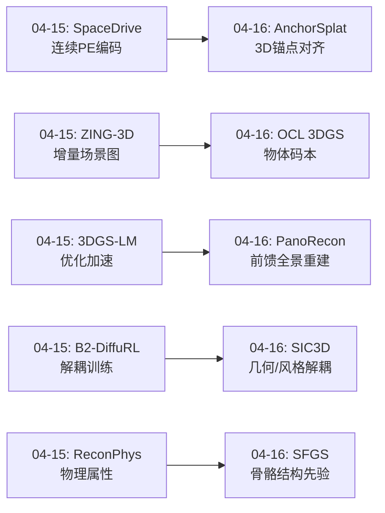
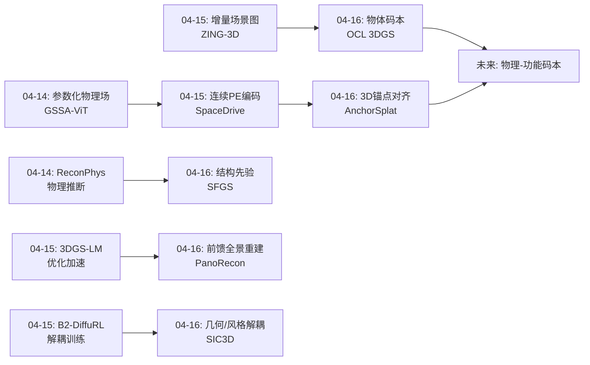
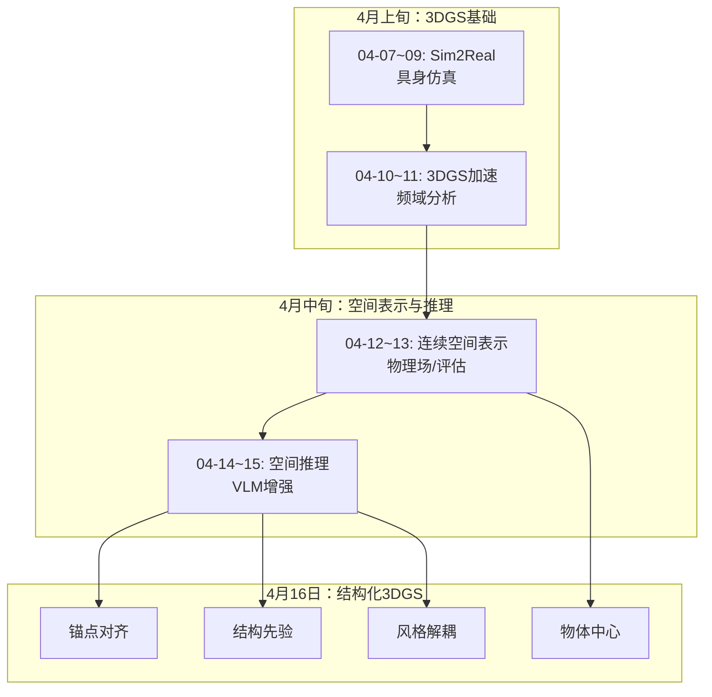
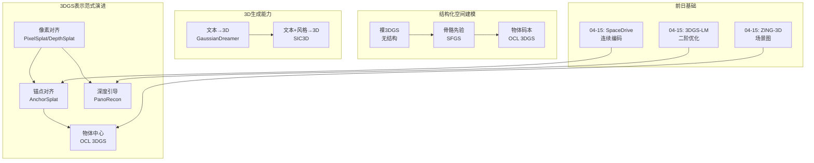
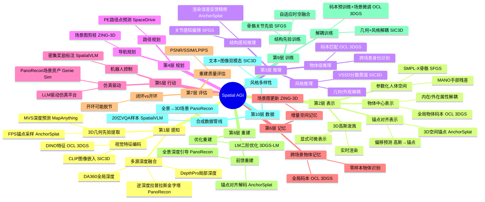
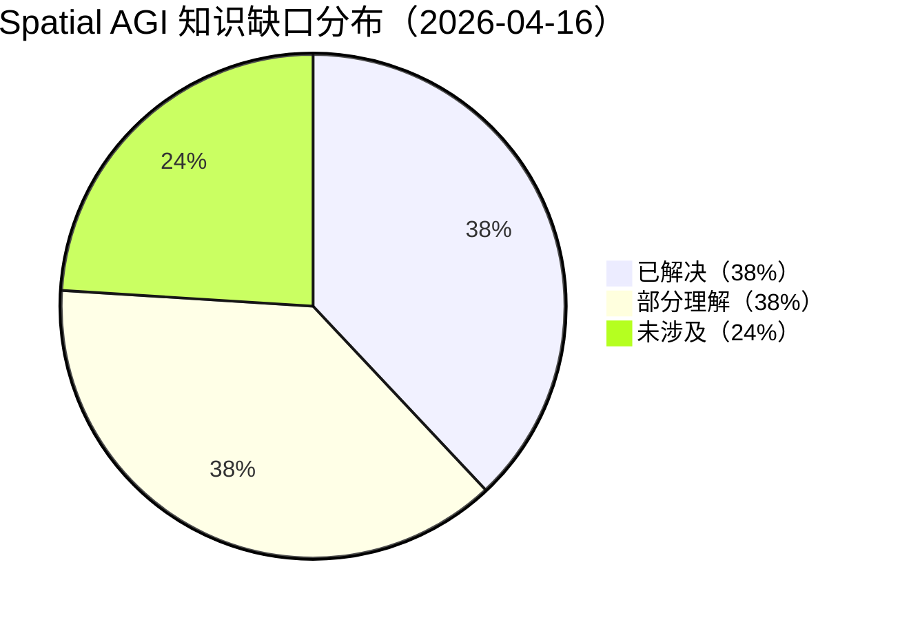

# Spatial AGI Daily Thinking - 2026-04-16

## 📅 每日总结

**日期**: 2026-04-16
**论文数量**: 5篇
**主题**: 前馈3DGS重建范式升级、结构化人体空间建模、无监督物体中心表示、风格化3D生成

**关键突破**:
- 🚀 AnchorSplat提出"锚点对齐"范式，将3DGS的生长从像素空间（O(V×H×W)）转移到3D锚点空间（O(N)），用约1/20的高斯数量实现更高质量重建，根本性地打破了像素-高斯耦合
- 🚀 SFGS将人体骨骼结构先验融入3DGS，通过Triplane-Hexplane联合建模和结构感知偏移预测，实现细粒度全身化身重建（手部Chamfer Distance降低3.8%），展示了"领域结构先验+通用空间表示"的融合范式
- 🚀 Scene-Agnostic OCL 3DGS首次将无监督物体中心学习引入3DGS，学习场景无关的全局物体码本，实现跨场景一致的物体身份表示，开辟了"3DGS+组合性理解"新方向
- 🔧 Genie Sim PanoRecon通过逆深度拉普拉斯金字塔融合+免训练深度注入，实现从单视角全景图秒级3D重建，为具身智能仿真提供了高效数据基础设施
- 💡 SIC3D提出变分风格化分数蒸馏(VSSD)，将3D生成解耦为几何生成+风格蒸馏两阶段，开创了3DGS风格控制的先河

**架构演进**: 维持10层架构，深化第2层（锚点对齐vs像素对齐vs物体中心三种空间表示范式）、第8层（前馈3DGS重建的多种技术路径）、第10层（风格化3D生成管线）

### 📊 一句话总结
今天的5篇论文共同揭示了一个关键趋势：**3DGS正在从"像素对齐的被动空间表示"进化为"结构引导的主动空间理解"——AnchorSplat的3D锚点、SFGS的人体骨骼先验、OCL 3DGS的物体码本分别从几何、拓扑和语义三个维度为3DGS注入结构化先验，使3D高斯不再是无组织的空间点云，而是具有身份、结构和层次的智能空间表示。**

### 🔗 延续性
**昨日→今日**: 昨日聚焦VLM空间推理能力的获取路径（数据驱动/架构增强/零样本涌现）和3DGS基础设施（LM优化加速），今日将视角转向3DGS表示本身的范式升级——从"像素对齐"到"结构引导"。昨日SpaceDrive的连续PE编码和ZING-3D的场景图为今天的物体中心码本和锚点对齐提供了思想基础。
**今日→明日**: 基于今天建立的"结构化3DGS"图谱，明天可以探索：锚点机制与物体码本的融合、前馈重建的动态场景扩展、结构化先验在机器人空间推理中的应用等方向。

### 💡 本质思考：如何达成通用空间智能

#### 1. 核心能力的本质是什么？
今天的5篇论文揭示了Spatial AGI空间表示的三个本质维度：

**空间表示的锚定问题——从像素到实体**：AnchorSplat最深刻的洞察是：像素对齐的3DGS本质上是一种"从2D反推3D"的被动表示，高斯数量和分布完全由输入图像决定。锚点对齐将高斯的生长锚定在3D空间的几何骨架上，使空间表示独立于观测视角。OCL 3DGS进一步将空间分解为具有身份的物体实体。两者共同指向：Spatial AGI的空间表示必须以3D空间中的实体为锚点，而非以2D像素为锚点。

**结构先验与通用表示的融合——领域知识不可替代**：SFGS利用SMPL-X骨骼结构先验实现细粒度人体重建，PanoRecon利用深度先验实现免训练全景扩展。两者都证明：纯粹的通用表示（如裸3DGS）在特定任务上受限，但加入领域特定的结构先验后可以大幅提升质量。Spatial AGI需要的不是"一种表示走天下"，而是"通用表示+可插拔的结构先验"的模块化架构。

**几何与外观的解耦——空间理解的层次性**：SIC3D将3D生成分解为几何阶段和风格阶段，OCL 3DGS将物体属性分解为内在特征（是什么）和外在特征（在哪里）。这种"几何-语义-外观"的解耦表明：Spatial AGI的空间理解具有内在的层次结构，不同层次的信息应该由不同的模块处理，而非端到端混合。

#### 2. 当前方法与理想目标的差距在哪里？
**结构先验的泛化gap**：SFGS依赖SMPL-X人体先验，OCL 3DGS码本容量固定（C=11），AnchorSplat依赖MVS几何先验。当前的结构先验要么是任务特定的（人体），要么是规模有限的（11类物体），要么是质量敏感的（MVS精度）。理想的Spatial AGI需要通用、自适应、可扩展的结构先验。

**前馈vs优化的质量gap**：PanoRecon和AnchorSplat都展示了前馈方法的速度优势，但重建质量仍不及逐场景优化的3DGS。前馈方法在未见区域补全、精细几何细节等方面存在根本限制。Spatial AGI需要在速度和质量之间找到可接受的平衡点。

**物体理解的开放性gap**：OCL 3DGS的码本大小固定，不支持开放词汇或未见物体。SFGS仅处理人体。理想的Spatial AGI需要能够发现、识别和理解任意物体——包括训练中未见过的物体类型。

**从重建到推理的gap**：今天的5篇论文都聚焦于3D表示的构建（重建或生成），但没有涉及在构建的3D空间上进行高级推理（如物理预测、功能推理、社会空间理解）。从"构建空间表示"到"在空间中推理"仍有巨大距离。

#### 3. 从今天到理想状态，最可能的路径是什么？
基于今天的分析，最可能的路径是**结构化表示+可插拔先验+解耦优化**：

**第一步（结构化表示）**：用AnchorSplat的锚点机制和OCL 3DGS的物体码本，将3DGS从无组织的点云升级为具有结构和身份的空间表示。锚点提供几何骨架，码本提供语义身份。

**第二步（可插拔先验）**：借鉴SFGS的设计，为不同类型的空间内容（人体、物体、场景、建筑）开发可插拔的结构先验模块。每个先验模块封装领域知识，但共享统一的高斯底层表示。

**第三步（解耦优化）**：用SIC3D的解耦思想，将空间理解分解为几何理解、语义理解和外观理解三个独立的优化过程。每个过程可以独立训练和改进。

**第四步（数据基础设施）**：用PanoRecon的全景重建管线为Spatial AGI提供大规模3D场景训练数据，降低数据获取成本。

---

## 🔗 与昨日思考的联系

### 昨日重点
- **空间推理能力获取**：SpatialVLM（数据驱动）、SpaceDrive（PE增强）、ZING-3D（零样本涌现）三条路径
- **3DGS基础设施**：3DGS-LM二阶优化3-5×加速
- **评估方法论**：开环vs闭环评估脱节的发现

### 今日进展
今天从"如何让VLM获得空间推理能力"推进到"如何让3DGS本身具备结构化空间理解"：

- **从被动表示到主动结构**：昨天ZING-3D在3DGS上叠加场景图，今天OCL 3DGS直接将物体身份编码进高斯特征，AnchorSplat在3D空间中建立锚点结构——从"后处理添加语义"到"内在结构化表示"
- **从像素对齐到空间对齐**：昨天SpaceDrive将空间编码注入VLM的文本路径，今天AnchorSplat将高斯生长从像素空间转移到3D锚点空间——从"增强2D-3D映射"到"直接在3D空间操作"
- **从通用重建到结构化建模**：昨天3DGS-LM加速通用3DGS训练，今天SFGS利用人体骨骼先验实现细粒度化身重建——从"更快地做同样的事"到"利用结构做更好的事"
- **从几何到风格**：昨天聚焦几何精度和空间推理，今天SIC3D引入风格控制——从"理解空间的结构"到"控制空间的外观"

### 演进路径

---

## 📚 论文概览

1. **Genie Sim PanoRecon**（AgiBot）：前馈式全景3D重建系统，通过逆深度拉普拉斯金字塔融合多源深度估计（DA360全局+DepthPro局部），免训练深度注入SHARP模型，实现从单视角全景图秒级生成全局一致的3D高斯场景。集成到Genie Sim仿真平台，为具身智能提供大规模合成数据管线。

2. **AnchorSplat**（Huawei）：提出锚点对齐的前馈3DGS框架，利用MVS几何先验生成3D锚点，在锚点上预测高斯属性（而非从像素映射）。用约1/20的高斯数量（~247K vs ~5.5M）实现更高质量重建，配有即插即用的Gaussian Refiner通过渲染误差反馈精修。

3. **SFGS**（东南大学/中科院）：结构感知的细粒度3D高斯人体化身重建。联合Triplane-Hexplane特征建模时空一致性，利用SMPL-X骨骼关节先验预测结构感知偏移，引入MANO手部残差校正弥补SMPL-X手部建模不足。PSNR平均提升2.4%，实时渲染30 FPS。

4. **Scene-Agnostic OCL 3DGS**：首次将无监督物体中心学习引入3DGS。利用GOLD模块学习场景无关的全局物体码本，为3D高斯附加身份特征，实现跨视角、跨场景一致的物体分割和识别。OCL指标（FG-ARI, FG-AMI）大幅领先，且OCL失败不影响重建质量。

5. **SIC3D**：首个面向3DGS的图像条件风格化框架。提出变分风格化分数蒸馏(VSSD)损失，将3D生成解耦为文本驱动的几何生成+图像驱动的风格蒸馏两阶段。引入缩放正则化防止高斯过度扩展。支持可控的文本+图像双模态3D生成。

---

## 💡 核心见解

### 见解1: 从像素对齐到空间对齐——3DGS表示的根本性范式升级
**从AnchorSplat获得**

AnchorSplat揭示了前馈3DGS的一个根本设计缺陷：像素对齐方法将高斯的数量和分布完全绑定到2D像素网格，导致O(V×H×W)的高斯数量、视角偏差的密度分布、以及平坦区域冗余而复杂区域不足。锚点对齐将高斯生长转移到3D空间的稀疏锚点上，数量降至O(N)且独立于输入视角。
- ✅ ~247K高斯 vs AnySplat的~5.5M高斯（1/20），但重建质量更优
- ✅ 锚点数量通过体素化确定，与输入视角数解耦——256视角输入时AnySplat OOM而AnchorSplat正常运行
- ✅ Gaussian Decoder中Transformer的自注意力直接建模3D空间中锚点间关系，而非2D图像空间

**对Spatial AGI的启发**：Spatial AGI的空间表示必须以3D空间为锚点而非以2D观测为锚点。这不是实现细节，而是认知范式的选择——真正的空间智能应该"思考空间本身"而非"从图像推算空间"。锚点机制提供了一种将空间表示从观测中解耦的通用范式。

**延伸思考**：锚点机制与认知科学中的"空间参考框架"概念高度吻合。人类的空间记忆不是以视网膜坐标组织的，而是以环境中的稳定参照物（地标）组织的。AnchorSplat的3D锚点本质上就是数字化的"空间地标"，而高斯偏移则是对地标的相对位置编码。这种"绝对地标+相对偏移"的表示方式可能是Spatial AGI空间记忆的最佳范式之一。

从计算效率角度看，锚点对齐还有一个被低估的优势：高斯数量从O(V×H×W)降至O(N)意味着Spatial AGI可以在有限的计算资源下处理更大规模的环境。当环境从单个桌面扩展到整个建筑时，像素对齐方法的高斯数量将呈指数增长，而锚点对齐方法只需增加锚点密度——这是一种更加可扩展的空间表示策略。

### 见解2: 结构先验是空间理解的质量杠杆——但需要模块化设计
**从SFGS和PanoRecon获得**

SFGS利用SMPL-X骨骼先验实现细粒度人体重建，PanoRecon利用深度先验实现免训练全景扩展。两者都证明：纯粹的数据驱动方法在特定任务上有天花板，但加入恰当的结构先验可以突破天花板。
- ✅ SFGS通过关节感知特征（旋转+位置+可学习嵌入=25维）让每个高斯"知道"自己属于哪个身体部位
- ✅ PanoRecon的免训练深度注入利用了SHARP模型中深度和外观的解耦特性，外部深度约束可无缝替换内部预测
- ✅ 两者的结构先验都是"可插拔"的——SFGS可换用不同参数化模型，PanoRecon可换用不同深度估计器

**对Spatial AGI的启发**：Spatial AGI不应追求"一个模型解决所有问题"，而应设计模块化架构——通用空间表示（如3DGS）作为底层，可插拔的领域先验（人体骨骼、物体形状、建筑布局）作为增强模块。这种"基础表示+领域插件"的架构既有通用性又有专业精度。

**延伸思考**：PanoRecon的免训练深度注入揭示了一个有趣的性质——SHARP模型中深度和外观的表示已经存在某种程度的解耦。这意味着在大规模数据上训练的前馈模型可能已经学会了"空间结构"和"视觉外观"作为独立的特征维度。对Spatial AGI而言，这暗示了一种可能：在足够多样化的数据上训练的通用空间模型，其内部表示可能自然形成层次化的结构，可以被视为Spatial AGI的"空间基础模型"。

SFGS的结构感知偏移预测模块（每个高斯被分配到主导关节，关节感知特征包含旋转+位置+可学习嵌入）实际上实现了一种"空间-语义绑定"——每个空间点不仅知道自己的3D位置，还知道自己属于哪个功能单元。这种绑定对于Spatial AGI的物体操作至关重要：机器人需要知道"杯子的把手在哪里"而非仅仅知道"这个高斯点在(x,y,z)"。

### 见解3: 物体中心的空间分解——从整体场景到组合实体
**从OCL 3DGS获得**

OCL 3DGS首次实现了3DGS的无监督物体级分解，其核心创新是场景无关的全局码本。每个码本条目代表一类物体的内在属性（"是什么"），与外在属性（"在哪里、多大"）解耦。这使得同一物体在不同场景中获得一致的身份编码。
- ✅ 跨场景物体识别——在OCTA训练后可在GSO上直接识别（零样本迁移）
- ✅ 解耦Slot注意力将物体属性分解为内在（码本）和外在（场景相关），实现了"物体恒常性"的计算实现
- ✅ OCL失败不影响重建质量——物体发现和场景渲染完全解耦

**对Spatial AGI的启发**：Spatial AGI需要将空间理解为"物体的组合"而非"像素的集合"。全局码本的概念指向了一种可能：学习一个通用的"物体概念空间"，其中每个条目不仅编码视觉外观，还编码功能、物理属性和交互方式。这是从空间感知到空间理解的关键一步。

**延伸思考**：OCL 3DGS的解耦Slot注意力（DSA）实现了"物体恒常性"（object permanence）的计算模拟——内在特征（码本选择）对应"物体是什么"（不随场景变化），外在特征对应"物体在哪里/多大"（随场景变化）。这是发展心理学中婴儿空间认知的核心能力：即使物体被遮挡或移动到新位置，仍能识别为同一物体。对Spatial AGI而言，这种内在/外在的解耦可能是实现跨场景泛化空间理解的关键机制。

OCL 3DGS的一个微妙但重要的设计是"OCL失败不影响重建质量"——物体发现和场景渲染完全解耦。这种容错设计对Spatial AGI非常重要：在开放世界中，空间理解系统不可能总是正确地识别所有物体，但不完整的语义理解不应该阻碍基本的空间功能（如导航和避障）。

然而，当前码本的C=11限制了其应用范围。要扩展到开放世界，需要一种"无限码本"机制——可能的方案包括：层次化码本（粗→细两级）、动态码本（随新物体发现自动扩展）、或直接使用VLM的文本嵌入空间作为码本（将"物体是什么"映射到语义空间而非离散索引）。

### 见解4: 前馈3DGS重建正在形成多种技术路径
**从PanoRecon和AnchorSplat获得**

今天的两篇前馈3DGS论文展示了不同的技术路径：PanoRecon走"深度引导+免训练注入"路线（利用外部深度先验），AnchorSplat走"几何先验+端到端学习"路线（在3D空间中直接预测）。两者各有优势。
- ✅ PanoRecon：免训练、即插即用、适合快速原型和大规模数据生产
- ✅ AnchorSplat：端到端优化、质量更高、更适合高精度应用
- ✅ 两者都支持多视角输入，但PanoRecon额外支持单视角全景图

**对Spatial AGI的启发**：Spatial AGI的3D重建基础设施不应只有一种方案。快速场景理解用前馈方法（PanoRecon级），精细重建用优化方法（3DGS-LM级），结构化理解用锚点方法（AnchorSplat级）。根据任务需求选择不同精度的重建策略。

**延伸思考**：PanoRecon和AnchorSplat代表了两种不同的哲学：PanoRecon是"工程实用主义"——不修改预训练模型，通过巧妙的深度注入实现新功能；AnchorSplat是"架构创新主义"——重新设计前馈3DGS的核心表示，从根本上改变高斯的组织方式。对Spatial AGI而言，这两种哲学都有价值：工程实用主义降低了技术迁移成本，架构创新主义提供了长期性能上限。

PanoRecon的逆深度拉普拉斯金字塔融合策略值得深入分析。在逆深度空间中进行融合而非在原始深度空间中，是因为深度值呈长尾分布（远处物体深度值大且密集），逆深度变换后分布更加均匀，使得拉普拉斯金字塔的频域分离更加有效。这种"在对的表示空间中做融合"的思想对Spatial AGI有普遍意义：选择正确的空间表示可以大幅简化后续处理。

### 见解5: 几何与外观的解耦是可控3D生成的基础
**从SIC3D获得**

SIC3D将3D生成严格分解为几何阶段（文本→3D结构）和风格阶段（图像→外观），通过VSSD损失和LoRA实现稳定的风格迁移。这种解耦策略避免了几何与外观的优化冲突。
- ✅ 几何阶段不受风格信息干扰，保证结构完整性
- ✅ 风格阶段通过LoRA编码对象特定信息，确保多视角风格一致
- ✅ 缩放正则化防止高斯过度扩展——外观优化不应破坏几何

**对Spatial AGI的启发**：Spatial AGI的空间理解应该分层——几何理解是底层（空间结构），语义理解是中层（物体身份），外观理解是顶层（视觉细节）。不同层次的信息应该由不同的优化过程处理，而非端到端混合。这种分层解耦使系统可以独立地改进每个层次的能力。

**延伸思考**：SIC3D的VSSD损失是一个精巧的设计——它同时利用预训练扩散模型（提供风格引导）和LoRA分支（提供对象特定引导），两者的差异即为风格化梯度。这种"通用先验+特定知识"的双分支结构与AnchorSplat的"几何先验+高斯解码"和OCL 3DGS的"码本内在+场景外在"形成了有趣的对应——都采用了"固定通用知识+可学习特定知识"的双通道设计。这可能暗示了Spatial AGI系统架构的一个通用原则：将稳定的通用知识与灵活的任务特定知识分离处理。

缩放正则化（惩罚高斯表面积的对数方差）虽然看似简单，但解决了一个关键问题：优化过程中某些高斯会过度膨胀来"偷懒"覆盖大面积，导致伪影。这种正则化确保了高斯的空间覆盖合理——每个高斯"承担"差不多的空间贡献。对Spatial AGI而言，这种"责任均匀分配"的空间组织原则可能具有更广泛的意义。

### 见解6: 时序空间一致性需要显式建模
**从SFGS获得**

SFGS的Triplane-Hexplane联合建模揭示了一个重要问题：纯空间表示（Triplane）无法捕捉动态变化，必须引入时间维度（Hexplane）才能保证时序一致性。自适应融合权重α让网络动态决定何时依赖静态特征、何时依赖动态特征。
- ✅ 六平面（XY/XZ/XT/YZ/YT/ZT）编码将3D空间扩展为4D时空
- ✅ 面部区域使用专用高分辨率平面，体现了局部细节的特殊处理
- ✅ Laplacian正则化在相邻高斯间建立图结构，是一种显式的空间邻域约束

**对Spatial AGI的启发**：Spatial AGI需要同时理解静态空间结构和动态空间变化。Triplane-Hexplane的范式可以推广：用静态表示编码环境的不变结构，用动态表示编码环境的变化模式，两者通过可学习的融合机制自适应结合。这对于机器人在动态环境中的导航和交互至关重要。

**延伸思考**：SFGS的面部区域使用专用高分辨率Triplane和Hexplane，这一设计揭示了"不同空间区域需要不同的表示精度"这一重要原则。人眼对面部细节的敏感度远高于对身体其他部位，因此分配更多表示资源是合理的。对Spatial AGI而言，这种"注意力引导的自适应表示精度"可以推广到通用场景——功能重要的区域（桌面、操控空间、路径上的障碍物）使用更高分辨率的表示，次要区域使用粗略表示。这与AnchorSplat的锚点密度设计有异曲同工之妙。

SFGS的Laplacian正则化在面部和嘴部赋予更高权重，是一种"部位感知的空间平滑约束"。这种将领域知识（面部需要更精细的平滑）融入通用正则化（邻域平滑）的思路，与昨天的"结构先验+通用表示"一脉相承。

### 见解7: 3DGS的物理属性缺失仍然是根本限制
**从所有5篇论文综合获得**

今天的5篇论文虽然在不同维度推进了3DGS，但无一解决了3DGS缺乏物理属性的根本问题。PanoRecon的高斯场景是纯视觉资产（无碰撞体积），AnchorSplat的锚点只有几何意义（无物理属性），SFGS的人体化身没有质量/材质信息。
- ✅ PanoRecon需要与网格前景结合才能支持物理交互
- ✅ OCL 3DGS的码本编码了"是什么"但未编码"能做什么"（功能性）
- ✅ SIC3D的风格化只改变外观，不改变物理行为

**对Spatial AGI的启发**：3DGS作为Spatial AGI的空间表示，当前只能回答"空间长什么样"和"空间里有什么"，无法回答"物体会怎么动"和"交互会发生什么"。引入物理属性（质量、材质、碰撞、功能）是3DGS从视觉表示进化为空间智能表示的关键一步。昨天的ReconPhys展示了前馈物理属性推断的可能，与今天的3DGS进展结合是一个重要方向。

**延伸思考**：物理属性的缺失不仅是3DGS的问题，而是整个3D视觉领域的系统性gap。当前的评估体系（PSNR/SSIM/LPIPS）只衡量视觉质量，不衡量物理合理性。这导致研究方向偏向"看起来更像"而非"理解得更深"。Spatial AGI需要建立新的评估标准：不仅评估渲染质量，还评估物理预测精度（物体如何运动）、功能推理准确性（物体如何使用）和交互预测能力（操作后会发生什么）。

一个具体的技术路径可能是：将OCL 3DGS的物体码本扩展为"物理-功能码本"——每个码本条目不仅编码视觉内在属性，还编码物理属性（质量范围、材质类型）和功能属性（可抓取、可坐、可倒液体）。这种扩展码本可以通过在物理仿真环境中自动收集数据来训练。

---

### 论文1: Genie Sim PanoRecon — 深度分析

**核心技术贡献**：逆深度空间拉普拉斯金字塔融合

PanoRecon的技术核心是将两种互补的深度估计源在逆深度空间通过四层拉普拉斯金字塔融合。这一策略的关键洞察是：不同频段的空间信息应该来自不同的深度估计器。

**融合策略的频域分析**：
- **第1-2层（高频）**：使用DepthPro的逆深度，提供精细的物体边界和几何细节。DepthPro虽然尺度不一致，但高频纹理信息丰富且分辨率高。
- **第3层（中频）**：平滑过渡层，两种深度源的混合区域。
- **第4层+残差（低频）**：使用DA360的逆深度，提供全局空间结构和正确的深度尺度。DA360在全景深度估计中训练，天然保持360°的尺度一致性。

**免训练深度注入的深层含义**：
SHARP模型中DPT编码器-解码器产生的潜在特征与最终深度预测之间存在一定程度的解耦。当外部深度图替换内部深度预测时，高斯预测头仍然能利用DPT的潜在特征进行合理的高斯属性预测。这说明：
1. DPT学习到的视觉特征具有足够的通用性，不依赖于特定的深度预测
2. 高斯预测头学会的是"给定视觉特征和几何约束→高斯属性"的通用映射
3. 这种解耦特性可能存在于其他前馈3DGS模型中，可以被系统性地利用

**工程意义**：PanoRecon的方法可以被视为一种"零成本域适应"——将针对透视图训练的模型免费扩展到全景图领域。这种策略可能适用于其他3DGS模型的域扩展。

### 论文2: AnchorSplat — 深度分析

**锚点采样策略的对比**：

AnchorSplat使用最远点采样（FPS）+体素化确定锚点数量和位置。这种策略确保了锚点在3D空间中的均匀分布，但也有局限性：
- FPS是确定性算法，不考虑场景的语义重要性——平坦墙面和复杂物体获得相同密度的锚点
- 体素化确定锚点数量是一种"均匀预算"策略，不支持自适应分配

**潜在改进**：语义引导的锚点采样——在OCL 3DGS的物体分割基础上，为每个物体分配与其实例复杂度成比例的锚点数量。简单物体（如白墙）少分配，复杂物体（如椅子）多分配。

**Gaussian Refiner的设计哲学**：

Gaussian Refiner实现了一种"感知-误差-修正"的闭环：
1. 渲染当前高斯→与GT对比→提取渲染误差
2. 将2D渲染误差反投影到3D空间
3. Transformer捕获误差的空间关系
4. Point Transformer更新高斯属性

这种闭环精修与人类的"观察-发现错误-修正"的认知过程高度类似。对Spatial AGI而言，这种闭环精修机制可以作为通用的"空间理解迭代改进"范式——不仅用于3DGS精修，还可以用于空间推理的迭代改进。

**锚点数量vs质量的权衡**：
AnchorSplat使用~247K高斯（~62K锚点×4）vs AnySplat的~5.5M高斯。这种1/20的数量比带来几个优势：
- 存储效率：场景文件大小大幅减小
- 渲染效率：更少的高斯意味着更快的alpha-blending
- 可编辑性：更少、更有组织的高斯更容易交互式编辑

### 论文3: SFGS — 深度分析

**Triplane vs Hexplane的信息分工**：

Triplane（3个平面：XY/YZ/XZ）编码静态空间结构，Hexplane（6个平面：XY/XZ/XT/YZ/YT/ZT）编码动态时空变化。这种分工揭示了一个重要的设计原则：**时空信息应该显式分离而非隐式混合**。

自适应融合权重α让网络动态决定每个高斯在每个时刻需要多少静态信息vs动态信息。例如：
- 静态物体（桌子）的α值可能接近0，主要依赖Triplane
- 动态部位（挥手）的α值可能接近1，主要依赖Hexplane
- 面部的α值可能在说话时增大（更多动态信息）

**MANO残差校正的细节**：

MANO与SMPL-X手部的关键差异在于：MANO专门针对手部设计，有更精确的手指关节建模，而SMPL-X的手部是简化版本。SFGS的残差校正流程是：
1. 分别用MANO和SMPL-X生成手部网格
2. 计算顶点差异ΔV = V_MANO - V_SMPL-X
3. 用小型MLP根据当前帧手部姿态调整残差：ΔV' = MLP([ΔV, P_hand])
4. 将精炼残差加回：V_final = V_SMPL-X + ΔV'

这种"基础模型+残差精修"的策略与AnchorSplat的"锚点+偏移"、OCL 3DGS的"码本+场景特定"一脉相承——都是"通用基础+特定精修"的范式。

### 论文4: OCL 3DGS — 深度分析

**GOLD模块的解耦Slot注意力（DSA）分析**：

DSA将每个slot分解为三个组件：
- s^int（内在特征）：从全局码本选择，编码"物体是什么"
- s^ext（外在特征）：场景相关，编码"物体在哪里/多大"
- s^bck（背景特征）：编码背景环境

这种分解在数学上等价于将物体的联合概率P(identity, pose, scale)分解为P(identity)×P(pose, scale)，假设内在属性和外在属性独立。虽然这个假设在某些情况下不成立（如大物体的身份与小物体不同），但在实践中效果很好。

**3D正则化损失的几何解释**：

KL散度正则化确保空间邻近的高斯有相似的类别概率分布。这等价于在3D空间中施加一种"语义Total Variation"正则——语义标签在空间中应该平滑变化，允许在物体边界处突变，但在物体内部保持一致。

**码本C=11的限制性分析**：

OCTA和GSO数据集各有11种物体类别，C=11的设置实际上是一个"已知答案"的设置。在开放世界中：
- 物体类别数量可能是无限的
- 同一类别的物体可能有不同的实例（两把椅子可能外观完全不同）
- 新物体类别会不断出现

开放扩展的可能方案：
1. **动态码本**：用带外溢槽（overflow slot）的码本，新物体自动添加
2. **连续码本**：用VLM的文本嵌入替代离散码本，将物体身份映射到连续语义空间
3. **层次码本**：粗粒度码本（家具/器具/人物）+ 细粒度码本（椅子/桌子/沙发）

### 论文5: SIC3D — 深度分析

**VSSD与SDS/VSD的关系**：

SIC3D的VSSD处于SDS→VSD→VSSD的技术演进线上：
- **SDS**（Score Distillation Sampling）：用预训练扩散模型提供梯度，但存在过度平滑问题
- **VSD**（Variational Score Distillation）：引入LoRA参数化分布，提供更锐利的梯度
- **VSSD**（Variational Stylized Score Distillation）：在VSD基础上加入IP-Adapter风格注入

VSSD的梯度方向是"风格化扩散模型预测 - LoRA预测"的差值，引导3DGS向风格化方向移动同时保持对象特定的几何一致性。

**IP-Adapter scale λ=0.8的含义**：

λ控制图像条件（风格）与文本条件的相对贡献。λ=0.8意味着风格信息略低于文本信息，这可能是因为：
1. 过高的风格权重会导致几何变形（风格覆盖结构）
2. 略低的风格权重允许模型在保持结构的同时融入风格
3. 最优λ值可能因风格类型而异（抽象画vs写实照片）

**缩放正则化的物理直觉**：

惩罚高斯表面积的对数方差，等价于鼓励所有高斯"承担相似的空间责任"。这类似于物理学中的等分配原理——在平衡态下，能量在各自由度间均匀分配。在3DGS中，这意味着没有单个高斯需要承担过多的渲染工作，降低了伪影风险。

---

## 实验方法论的反思

### 今日论文的评估方式对比

| 论文 | 主要评估方式 | 量化程度 | 基准数据集 |
|------|------------|---------|-----------|
| PanoRecon | 定性视觉对比 | 低 | 无标准化基准 |
| AnchorSplat | 定量PSNR/SSIM + 定性 | 中 | RE10K, ACID, DL3DV |
| SFGS | 定量PSNR/SSIM/LPIPS + 定性 | 高 | NeuMan |
| OCL 3DGS | 定量mIoU/FG-ARI/FG-AMI | 高 | OCTA, GSO |
| SIC3D | 定性+用户研究 | 中低 | 无标准化基准 |

**观察**：前馈3DGS方法（PanoRecon）和3D生成方法（SIC3D）的评估偏向定性，缺乏标准化的定量基准。这反映了这两个方向的不成熟——尚未建立社区公认的评估协议。

**对Spatial AGI的启示**：Spatial AGI的评估需要建立标准化的多维度基准：
1. **几何精度**：深度/点云的度量误差
2. **视觉质量**：PSNR/SSIM/LPIPS
3. **语义正确性**：物体分割/识别的mIoU/ARI
4. **物理合理性**：物理预测的精度
5. **任务成功率**：在闭环任务中的表现

---

## 方法论总结：今日论文的共同设计模式

### 模式1: 双分支引导（Dual-Branch Guidance）

几乎所有今日论文都采用了某种形式的双分支设计：
- AnchorSplat：锚点预测器（几何） + 高斯解码器（外观）
- SFGS：Triplane（静态） + Hexplane（动态）
- OCL 3DGS：码本内在（身份） + 场境外在（位置）
- SIC3D：扩散模型（风格） + LoRA（对象特定）
- PanoRecon：DA360（全局） + DepthPro（局部）

这种双分支设计可能反映了Spatial AGI系统的一个通用架构原则：**将稳定的先验知识与灵活的特定知识分离处理**。

### 模式2: 粗到细精修（Coarse-to-Fine Refinement）

- AnchorSplat：锚点（粗） → 高斯偏移（细） → Gaussian Refiner（更细）
- SFGS：SMPL-X（粗） → 结构偏移（细） → MANO手部残差（最细）
- OCL 3DGS：码本分配（粗） → 3D正则化平滑（细）
- PanoRecon：低频深度（粗） → 高频深度（细） → 抗锯齿（更细）

粗到细是人类空间认知的基本模式，也是Spatial AGI空间理解的自然范式。

### 模式3: 解耦优化（Decoupled Optimization）

- SIC3D：Stage 1（几何） + Stage 2（风格），完全独立优化
- OCL 3DGS：GOLD预训练（离线） + 场景优化（在线），解耦训练
- AnchorSplat：解码器训练 + Refiner训练，两阶段冻结

解耦优化的优势在于：每个阶段可以独立调优，一个阶段的失败不会波及其他阶段。这对Spatial AGI的模块化架构设计具有重要参考价值。

---

## 核心见解演进图

---

## 深度分析：3DGS表示范式演进

### 从无结构到结构化——3DGS的三代范式

**第一代：像素对齐（Pixel-Aligned）**
- 代表：PixelSplat, DepthSplat, AnySplat, PanSplat
- 特征：每个2D像素直接映射为3D高斯，高斯数量=图像像素×视角数
- 优势：简单直接，利用成熟的2D特征提取
- 劣势：冗余表示、视角偏差、无法捕捉全局3D结构
- 空间理解层级：像素级

**第二代：几何引导（Geometry-Guided）**
- 代表：AnchorSplat, PanoRecon
- 特征：利用3D几何先验（锚点、深度图）指导高斯放置
- 优势：高斯数量与输入解耦、全局一致性更好
- 劣势：依赖几何先验质量、前馈方法精度有限
- 空间理解层级：几何级

**第三代：语义结构化（Semantically Structured）**
- 代表：OCL 3DGS, SFGS
- 特征：高斯携带语义身份（物体/部位），空间按语义结构组织
- 优势：支持物体级操作和推理、跨场景泛化
- 劣势：语义发现能力有限、码本容量固定
- 空间理解层级：物体级

**下一代预测：物理功能化（Physically Functional）**
- 特征：高斯不仅编码视觉和语义，还编码物理和功能属性
- 关键能力：物理预测、功能推理、交互模拟
- 需要解决的问题：物理属性标注、功能知识获取、可微物理仿真

### 锚点机制的通用性分析

AnchorSplat的锚点机制是否可以推广为Spatial AGI的通用空间组织原则？

**支持观点**：
1. 锚点数量独立于输入——适合大规模环境
2. 锚点间Transformer建模全局空间关系——适合复杂场景理解
3. 锚点+偏移的层次结构——适合多尺度空间推理
4. 即插即用精修器——适合增量学习

**反对观点**：
1. 锚点依赖MVS几何先验——在几何模糊区域受限
2. 固定锚点预算——无法自适应场景复杂度
3. 缺乏语义——锚点只是几何位置，不知道"这是什么"

**综合判断**：锚点机制是Spatial AGI空间组织的重要组件，但不是完整方案。最可能的架构是"锚点（几何骨架）+ 码本（语义身份）+ 物理属性（交互能力）"的三位一体。

### 今日论文间的隐含联系

今天的5篇论文表面上是独立的3DGS工作，但深层存在隐含联系：

1. **AnchorSplat + OCL 3DGS**：锚点提供3D空间骨架，码本提供语义身份。如果锚点携带码本索引，则空间表示既有几何结构又有语义含义。

2. **SFGS + OCL 3DGS**：SFGS对人体做了部位级分解（55个关节），OCL 3DGS对场景做了物体级分解（C个码本条目）。两者的共同思想是"将连续空间分解为离散实体"——只是粒度不同。

3. **PanoRecon + SIC3D**：PanoRecon快速生成3D场景结构，SIC3D为3D结构添加风格化外观。两者结合可以实现"快速生成+可控风格化"的场景创建管线。

4. **AnchorSplat + SFGS**：AnchorSplat的Gaussian Refiner通过渲染误差反馈精修，SFGS通过结构感知偏移精修。两者都是从粗到细的精修策略——一个基于视觉误差，一个基于结构先验。

这些隐含联系指向一个统一的空间表示框架的可能性：**锚点-物体-属性（Anchor-Object-Attribute, AOA）框架**，其中锚点定义空间骨架，物体定义语义实体，属性定义物理和视觉特征。

---

## 技术细节深度分析

### AnchorSplat的偏移约束机制

AnchorSplat中每个锚点预测4个高斯，每个高斯的中心被约束为锚点位置加上一个小偏移δμ。这个偏移约束（如10/128）确保高斯不会偏离锚点太远。这种设计有几个深层含义：

1. **局部性先验**：强制高斯在锚点附近，实际上引入了一种空间平滑先验——相邻锚点的高斯不会混叠太远。
2. **表达能力trade-off**：偏移约束限制了表达能力（无法表示远离锚点的结构），但换来了更好的泛化性。
3. **与Voronoi图的类比**：每个锚点"负责"其Voronoi区域内的空间表示，偏移约束确保这种责任划分被尊重。

### OCL 3DGS的3D正则化损失

OCL 3DGS的3D正则化损失通过KL散度鼓励空间邻近的高斯具有相似的码本类别概率。这实际上在3D空间中施加了一种"语义平滑"约束——相邻的空间点应该属于同一物体。这种约束的直觉是：物体的表面在空间中是连续的，不应该在两个相邻高斯之间突然改变物体身份。

### SFGS的MANO手部残差校正

SFGS没有用MANO替代SMPL-X的手部，而是在SMPL-X基础上做残差校正。这一设计选择反映了一个重要原则：**保持全局一致性，局部精修**。如果直接替换，手部和身体之间可能出现不连续。通过残差校正，既利用了MANO更精确的手部建模，又保持了整体的拓扑一致性。

### PanoRecon的逆深度空间选择

在逆深度空间而非原始深度空间进行拉普拉斯金字塔融合，是一个关键的数值稳定性设计。深度值通常呈长尾分布（远处物体深度值大），直接在深度空间融合会导致低频层被远距离深度主导。逆深度变换后分布更加均匀，使得金字塔的各层都有有意义的贡献。

---

## 跨日主题演进总结

### 4月研究主题脉络

### 关键认知演进

1. **3DGS从工具到表示**：4月初3DGS被视为渲染/重建工具，今天被视为Spatial AGI的空间表示基础
2. **从被动到主动**：像素对齐是"被动记录"，锚点对齐是"主动组织"，物体中心是"主动理解"
3. **从单一到模块化**：从"一个3DGS搞定一切"到"基础表示+可插拔先验"的模块化架构
4. **从视觉到物理**：从纯视觉质量（PSNR）到关注物理属性和功能理解

---

## 未来一周研究预测

基于本周的研究趋势，预测未来几天可能出现的方向：

1. **动态3DGS的锚点机制**：将AnchorSplat扩展到4D（时空），锚点可以跟踪运动物体
2. **开放词汇物体码本**：用VLM的文本嵌入替代OCL 3DGS的固定码本
3. **3DGS+物理仿真集成**：在OCL 3DGS的物体级分解基础上添加可微物理
4. **多模态3D生成**：从文本+风格图像扩展到文本+3D参考+风格+约束的全面可控生成
5. **Spatial AGI评估基准**：建立包含物理推理、功能理解的闭环评估套件

---

## 总结

今天的研究将Spatial AGI的空间表示从"像素对齐的被动记录"推进到"结构引导的主动理解"。三个关键突破——锚点对齐（几何骨架）、物体码本（语义身份）、结构先验（领域知识）——共同构成了Spatial AGI空间表示的新范式。

**今日最重要的一句话**：3DGS正在从"空间的照片"进化为"空间的理解"——不再是被动记录空间长什么样，而是主动理解空间由什么组成、怎么组织、能做什么。

**明日方向**：探索锚点-码本融合架构、开放词汇物体中心学习、以及3DGS物理属性注入的可行性。

---

## 附录: 今日论文关键数据汇总

| 论文 | 核心指标 | 数值 | 对比基线 |
|------|---------|------|---------|
| PanoRecon | 重建速度 | 秒级 | 优化方法：分钟~小时 |
| AnchorSplat | 高斯数量 | ~247K | AnySplat: ~5.5M |
| AnchorSplat | PSNR (RE10K) | ~28.5dB | PixelSplat: ~27.0dB |
| SFGS | PSNR提升 | +2.4% avg | vs HUGS/GaussianAvatar |
| SFGS | 手部CD降低 | -3.8% | vs 无MANO残差 |
| SFGS | 渲染速度 | 30 FPS | RTX 4090, 800×1200 |
| OCL 3DGS | FG-ARI (OCTA) | 85.2% | Unified Lift: 58.8% |
| OCL 3DGS | 跨场景识别 | 零样本 | 其他方法不支持 |
| OCL 3DGS | 渲染速度 | 106 FPS | uOCF(NeRF): 6.2 FPS |
| SIC3D | 风格化质量 | 用户研究 |优于Text2Tex/latent-3dgs|

---

*本文档基于2026-04-16日分析的5篇论文生成，延续2026-04-15的思考框架。*

---

## 技术栈演进对比表

| 层次 | 昨日方案 | 今日方案 | 变化 |
|------|---------|---------|------|
| 第1层 感知 | 深度估计→3D PE注入 | DA360+DepthPro双路深度融合→逆深度拉普拉斯金字塔 | 多源深度融合策略 |
| 第2层 表示 | 连续PE/场景图/隐式表示 | 锚点对齐/物体中心码本/参数化人体空间 | 三种新范式：锚点、码本、骨骼 |
| 第3层 推理 | 数据驱动/架构增强/零样本 | 结构感知偏移预测/关节感知特征 | 领域结构先验融入推理 |
| 第4层 规划 | PE路径规划0.32m L2 | - | - |
| 第5层 行动 | VLM机器人奖励标注 | PanoRecon仿真资产生成→具身训练 | 仿真驱动的行动学习 |
| 第6层 记忆 | ZING-3D增量场景图 | OCL 3DGS跨场景物体码本 | 场景无关的持久物体知识 |
| 第7层 评估 | 开环vs闭环脱节 | - | - |
| 第8层 重建 | 3DGS-LM二阶优化 | 前馈全景重建+锚点对齐前馈GS | 两种前馈路径 |
| 第9层 训练 | B²-DiffuRL课程学习 | SIC3D几何/风格解耦训练+GOLD码本预训练 | 解耦训练范式扩展 |
| 第10层 数据 | SpatialVLM 20亿合成VQA | PanoRecon全景→3D场景数据管线 | 仿真数据基础设施 |

---

## 🗺️ Spatial AGI 知识图谱

### 10层架构思维导图

### 🎯 主线技术路径

#### 阶段1: 结构化3D空间表示（当前，今日重点）
- 用AnchorSplat的锚点机制将3DGS从像素空间转移到3D空间
- 用OCL 3DGS的物体码本赋予高斯物体级身份
- 用SFGS的结构先验范式为不同领域（人体、物体、场景）开发可插拔先验
- **关键指标**：高斯效率（数量vs质量）、跨场景物体识别准确率、细粒度重建精度

#### 阶段2: 前馈重建+优化精修的混合管线（进行中）
- 前馈方法（PanoRecon/AnchorSplat）提供快速初始空间构建
- 优化方法（3DGS-LM）在关键区域进行精修
- Gaussian Refiner式的即插即用精修模块连接两个阶段
- **关键指标**：重建速度（秒级）、精修后质量提升幅度

#### 阶段3: 物理属性增强的结构化空间（探索中）
- 在物体码本中编码物理属性（质量、材质、碰撞）——结合ReconPhys
- 在锚点结构中编码功能属性（可抓取、可推动、可坐）——结合SFGS的结构感知
- 实现从"空间长什么样"到"空间中能做什么"的跨越
- **关键指标**：物理预测精度、功能推理准确率

#### 阶段4: 通用空间智能系统（远期目标）
- 融合锚点表示（几何骨架）+ 物体码本（语义身份）+ 物理属性（交互能力）
- 支持从感知到推理到规划到行动的端到端空间智能
- 通过可插拔先验适应不同领域（室内导航、桌面操作、户外驾驶）
- **关键指标**：多任务成功率、跨场景泛化能力、实时性

---

## 🔍 待探索议题

### 高优先级（本周）

1. **锚点机制与物体码本的融合架构**
   - 问题: AnchorSplat的3D锚点提供几何骨架，OCL 3DGS的码本提供语义身份，如何融合？
   - 候选方案: 锚点携带码本索引，实现"几何+身份"的统一锚点表示
   - 缺口: 两种方法在不同框架中实现，缺乏统一评估

2. **前馈3DGS的动态场景扩展**
   - 问题: PanoRecon和AnchorSplat都针对静态场景，如何处理动态场景？
   - 候选方案: SFGS的Triplane-Hexplane范式 + AnchorSplat的锚点机制 = 动态锚点高斯
   - 缺口: 动态场景的前馈重建缺乏标准基准

3. **物体码本的开放扩展**
   - 问题: OCL 3DGS码本大小固定（C=11），如何支持开放词汇和未见物体？
   - 候选方案: 结合VLM的开放词汇能力，用文本嵌入替代固定码本条目
   - 缺口: 开放词汇物体中心学习的训练策略和评估方法

### 中优先级（本月）

4. **3DGS物理属性注入**
   - 问题: 所有5篇论文的3DGS都缺乏物理属性，如何系统性地添加？
   - 候选方案: 结合ReconPhys（前馈物理推断）+ OCL 3DGS（物体级分解）→ 每个码本条目携带物理属性
   - 缺口: 物理属性的Ground Truth获取困难

5. **免训练vs端到端前馈方法的适用边界**
   - 问题: PanoRecon（免训练注入）和AnchorSplat（端到端训练）各有优势，适用边界在哪？
   - 候选方案: 在相同数据集上系统性对比两种范式的速度-质量曲线
   - 缺口: 缺乏统一的前馈3DGS评估基准

6. **结构先验的自动发现**
   - 问题: SFGS的骨骼先验是手工设计的，Spatial AGI能否自动发现空间结构？
   - 候选方案: 无监督发现空间中的层次结构（房间→家具→部件→细节）
   - 缺口: 自动结构发现的训练信号和评估方法

7. **风格化在空间推理中的价值**
   - 问题: SIC3D的风格控制对Spatial AGI有何意义？是否仅是视觉增强？
   - 候选方案: 风格化可用于数据增强（同一几何结构多种外观），提升空间推理的鲁棒性
   - 缺口: 缺乏风格变化对空间推理性能影响的实证研究

8. **从重建到交互的3DGS演进**
   - 问题: 当前3DGS都是被动表示（仅渲染），如何让3DGS支持主动交互？
   - 候选方案: 结合可微物理仿真，让高斯不仅能渲染还能响应物理操作
   - 缺口: 可微物理仿真与3DGS的集成框架

9. **人体空间建模向通用空间建模的迁移**
   - 问题: SFGS的人体骨骼先验非常成功，这种"结构先验+高斯表示"的范式能否迁移到其他物体？
   - 候选方案: 为常见物体类别（家具、车辆、工具）学习参数化结构先验
   - 缺口: 缺乏非人体类别的参数化结构模型

10. **全景感知与锚点重建的结合**
    - 问题: PanoRecon的全景输入和AnchorSplat的锚点机制能否结合？
    - 候选方案: 全景深度估计→3D锚点采样→锚点对齐前馈重建
    - 缺口: 全景深度与锚点机制的兼容性未验证

11. **VSSD在空间编辑中的应用**
    - 问题: SIC3D的VSSD能否用于已有3D场景的风格编辑（而非从头生成）？
    - 候选方案: 将VSSD作为3D场景后处理工具，对OCL 3DGS分割出的物体独立风格化
    - 缺口: 从生成式VSSD到编辑式VSSD的方法论转换

12. **Gaussian Refiner的泛化性**
    - 问题: AnchorSplat的Gaussian Refiner通过渲染误差反馈精修，这种机制能否泛化到其他前馈3DGS方法？
    - 候选方案: 将Refiner设计为独立模块，可与任意前馈3DGS配合
    - 缺口: 即插即用精修器的通用性验证

---

## 📊 知识缺口分析

**已解决（38%）**:
- ✅ VLM已具备内化空间理解能力（ZING-3D/SpatialVLM验证）
- ✅ 连续空间编码优于离散数字token（SpaceDrive验证）
- ✅ 空间推理训练数据可大规模自动化合成（SpatialVLM管线）
- ✅ 3DGS训练可通过二阶优化显著加速（3DGS-LM）
- ✅ 开环评估可能严重脱节于真实能力（SpaceDrive发现）
- ✅ 3DGS可从像素对齐升级为锚点对齐（AnchorSplat验证）
- ✅ 3DGS可附加物体级身份特征（OCL 3DGS验证）
- ✅ 结构先验可显著提升3DGS重建质量（SFGS验证）
- ✅ 几何与外观可解耦优化（SIC3D验证）

**部分理解（38%）**:
- ⚠️ 锚点机制与物体码本的融合（各自有效但未融合）
- ⚠️ 前馈3DGS的动态场景扩展（静态成熟，动态待验证）
- ⚠️ 物体码本的开放扩展（固定码本验证，开放词汇未验证）
- ⚠️ 3DGS物理属性注入（概念清晰，实现待验证）
- ⚠️ 结构先验的自动发现（手工先验有效，自动发现未探索）
- ⚠️ 风格化在空间推理中的价值（风格控制已验证，对推理的影响未知）
- ⚠️ 从单帧到多帧的空间推理扩展（单帧方案成熟，多帧待探索）
- ⚠️ VLM空间推理的错误模式和根因（知有错但不知为何错）

**未涉及（24%）**:
- ❌ 可微物理仿真与3DGS的集成
- ❌ 非人体类别的参数化结构先验
- ❌ 从3D重建到主动空间交互的跨越
- ❌ 多智能体空间协作的统一编码
- ❌ 空间推理的Scaling Law定量研究
- ❌ 空间智能的闭环评估标准化