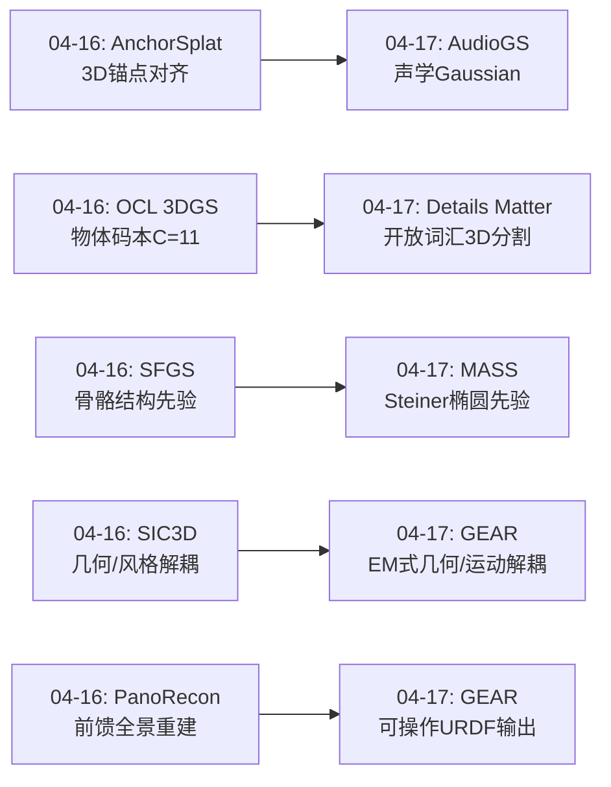
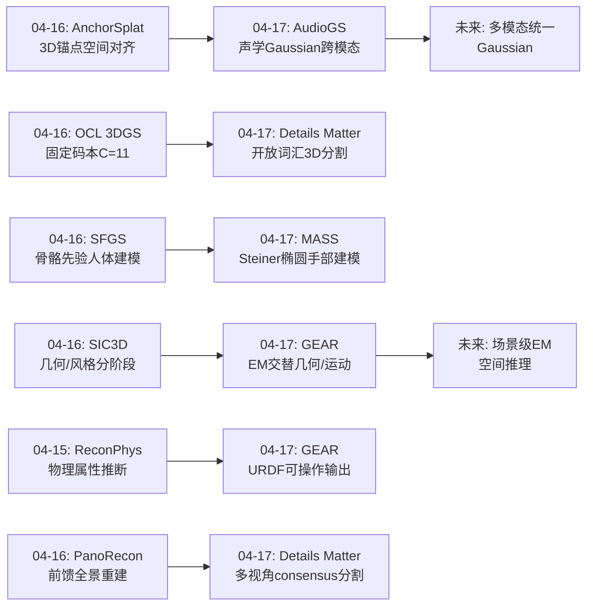
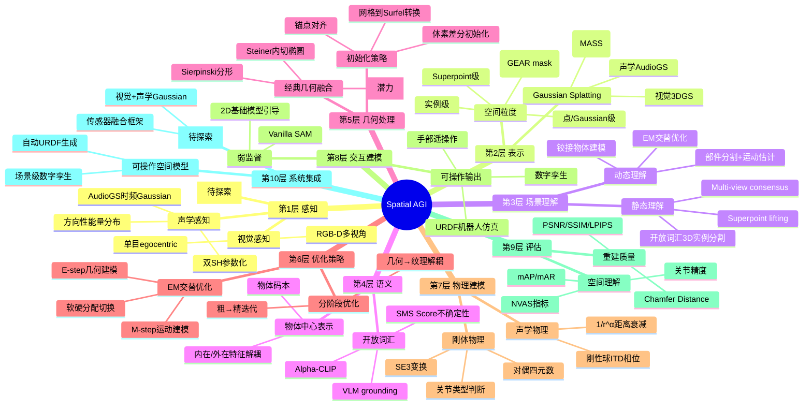
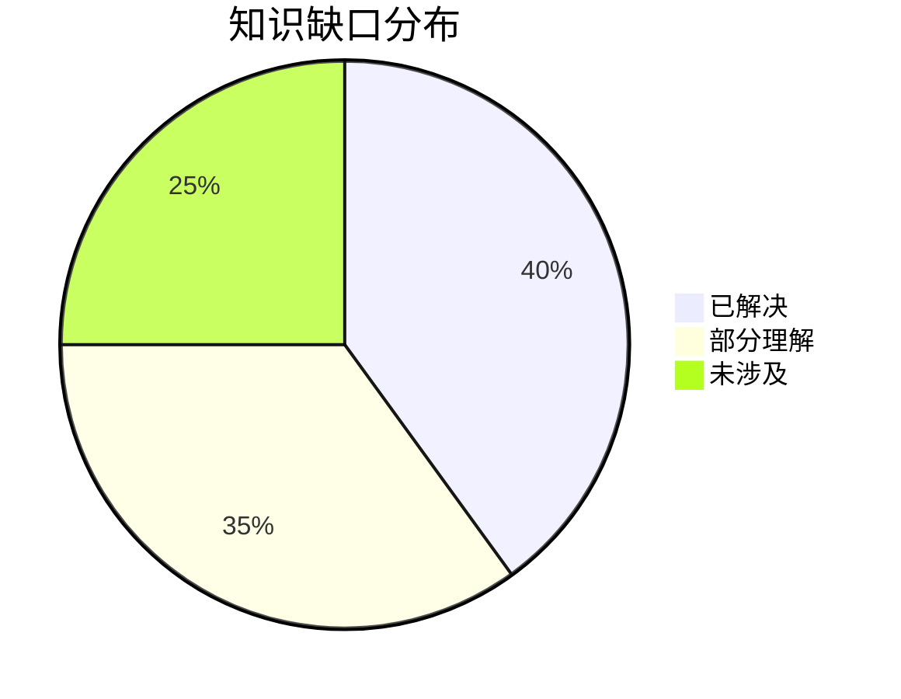

# Spatial AGI Daily Thinking - 2026-04-17

## 📅 每日总结

**日期**: 2026-04-17
**论文数量**: 4篇
**主题**: Gaussian Splatting跨模态扩张（声学空间）、经典几何与现代AI融合、EM式交替优化范式、开放词汇3D实例分割的工程优化

**关键突破**:
- 🚀 AudioGS将3DGS从视觉域成功迁移到声学域，实现首个visual-free的新视角声学合成（NVAS），且性能超越所有visual-guided方法（MAG 14.5%提升、DPAM 24.8%提升），证明了Gaussian Splatting作为通用空间表示框架的跨模态潜力
- 🚀 GEAR提出EM式交替优化框架解决铰接物体建模中几何与运动的耦合问题，以vanilla SAM弱监督实现强泛化的多关节物体建模，输出可直接转换为URDF部署到机器人仿真环境——从"空间感知"到"可操作空间模型"的关键一步
- 🚀 MASS将19世纪Steiner内切椭圆引入高斯泼洒初始化，实现从单目egocentric视频到高保真3D手部重建（5.5分钟训练，比HARP快9倍），展示了"参数化先验+学习变形"的混合表示范式
- 💡 Details Matter通过系统性工程优化（Alpha-CLIP、SMS Score、迭代合并/移除、Frame-wise sIOU Tracking）在开放词汇3D实例分割上取得全面SOTA（ScanNet200 mAP 32.7 vs Open3DIS 23.7），证明了"细节组合优化"的力量

**架构演进**: 维持10层架构，深化第1层（声学空间感知加入多模态感知）、第2层（Gaussian Splatting从视觉扩展到声学-视觉统一空间表示）、第3层（铰接物体运动理解——从静态空间到可操作空间）、第4层（开放词汇3D实例分割作为语义理解的核心能力）

### 📊 一句话总结
今天的4篇论文共同揭示了Spatial AGI的三个关键趋势：**(1) Gaussian Splatting正在成为跨感知模态的通用空间表示框架（AudioGS从视觉到声学）；(2) 从静态空间重建到动态空间理解的关键跃迁是通过EM式交替优化（GEAR）和结构化先验引导（MASS）实现的；(3) 开放词汇3D理解正在通过精细的工程组合（Details Matter）而非单一算法突破达到实用水平。**

### 🔗 延续性
**昨日→今日**: 昨日聚焦3DGS表示本身的范式升级——从"像素对齐"到"结构引导"（AnchorSplat锚点、OCL 3DGS物体码本、SFGS骨骼先验）。今日将这一趋势推进到三个新维度：(1) 跨模态扩展——AudioGS将Gaussian Splatting从视觉域迁移到声学域；(2) 从表示到交互——GEAR不仅重建铰接物体外观还理解其运动方式并输出可操作模型；(3) 从几何到语义——Details Matter实现开放词汇的精确3D实例分割。昨日的"结构化3DGS"为今天的跨模态扩张和交互建模提供了表示基础。
**今日→明日**: 基于今天建立的"跨模态Gaussian Splatting + 可操作空间模型"图谱，明天可以探索：声学-视觉统一Gaussian表示、铰接物体与开放词汇分割的联合框架、从单模态最优表示到多模态统一表示的融合路径。

### 💡 本质思考：如何达成通用空间智能

#### 1. 核心能力的本质是什么？
今天的4篇论文揭示了Spatial AGI的三个本质维度：

**空间感知的多模态性——视觉不是唯一的空间通道**：AudioGS最深刻的贡献是证明了声学空间可以被与视觉空间相同的Gaussian Splatting框架建模，且不需要视觉辅助。这意味着Spatial AGI的空间感知不应局限于视觉——声学（方向、距离、混响）、触觉（纹理、硬度、温度）都是空间信息的载体。每种模态的最优空间表示可能不同（AudioGS用SH编码方向性能量，3DGS用SH编码视角相关颜色），但共享底层的Gaussian空间组织框架。

**从重建到理解到操作——空间智能的三个层次**：MASS重建手部几何，GEAR理解铰接物体运动方式并输出URDF，Details Matter实现开放词汇3D物体识别。这三者恰好对应了空间智能的三个层次：(1) **重建**——空间长什么样（几何感知）；(2) **理解**——空间中的物体如何运动/交互（功能理解）；(3) **操作**——如何与空间中的物体交互（可操作模型）。GEAR的URDF输出是第二层到第三层的桥梁——不仅理解物体的运动方式，还将其形式化为机器人可执行的模型。

**耦合问题的解耦求解——EM式交替优化的普适性**：GEAR将几何-运动耦合问题转化为EM框架，E-step优化分割（几何理解），M-step优化运动参数（物理理解）。这种"交替优化而非同时优化"的策略对Spatial AGI中大量互相依赖的推理任务具有普适价值——理解场景布局和理解物体功能、理解空间几何和推理物理属性、理解外观和推断材质，都可以用类似的交替优化范式处理。

#### 2. 当前方法与理想目标的差距在哪里？
**跨模态融合的缺失**：AudioGS独立建模声学空间，3DGS独立建模视觉空间，但两者之间没有融合。理想的Spatial AGI需要统一的多模态空间表示——同一个Gaussian既能渲染视觉外观又能渲染声学响应。当前缺乏这种"多模态Gaussian"的表示方法。

**从理解到规划的gap**：GEAR虽然输出URDF模型，但不生成操作策略。Details Matter虽然识别3D物体，但不理解物体的功能或交互方式。从"空间感知"到"空间规划"仍需要额外的推理层。

**开放性与精度的trade-off**：Details Matter展示了开放词汇3D理解的精度上限（mAP 32.7），但代价是极高的计算开销（多个重量级2D基础模型串联）。如何在保持开放性的同时降低计算成本，是Spatial AGI实时部署的关键挑战。

**单模态局限**：MASS仅处理手部、GEAR仅处理铰接物体、AudioGS仅处理声学。Spatial AGI需要统一处理空间中的一切——手、物体、声源、建筑、地形。从专用系统到通用系统是根本挑战。

#### 3. 从今天到理想状态，最可能的路径是什么？
基于今天的分析，最可能的路径是**统一Gaussian表示 + 层次化空间理解 + 交替优化推理**：

**第一步（统一表示）**：将AudioGS的声学Gaussian和3DGS的视觉Gaussian统一为多模态Gaussian——每个Gaussian同时携带视觉SH系数、声学SH系数、物理属性参数。AudioGS已经证明了SH参数化在声学域的有效性，统一框架的技术障碍主要是训练数据。

**第二步（层次化理解）**：将Details Matter的开放词汇3D实例分割作为感知层，GEAR的铰接建模作为功能层，MASS的手部重建作为交互层。三个层次共享同一套Gaussian空间表示，但使用不同的推理模块。

**第三步（交替优化推理）**：在空间推理任务中采用GEAR的EM式交替优化范式。例如：先理解场景布局（E-step），再推理物体功能（M-step），迭代直至收敛。

**第四步（可操作输出）**：所有空间理解最终转化为可操作模型——类似GEAR输出URDF，Spatial AGI应能输出完整的环境交互模型（可导航地图、可操作物体列表、安全约束）。

**风险分析**: 这条路径的主要风险在于：(1) 多模态Gaussian的训练数据稀缺——视觉-声学-触觉同步采集的场景数据几乎不存在；(2) EM式推理的收敛性保证——在场景级复杂耦合中，EM可能收敛到局部最优；(3) 从理解到规划的鸿沟可能比预期更大——理解"门可以旋转"和规划"如何开门"是完全不同的问题。缓解策略：先在单一模态内验证EM推理的有效性（如在纯视觉场景中），再逐步扩展到多模态；利用仿真环境（Isaac Sim、Habitat）生成配对训练数据。

**与先前思考的联系**: 这条路径与04-15的思考一致——当时识别的"统一空间表示+层次化推理"方向被今天的论文进一步验证。AudioGS证明了统一表示的跨模态潜力，GEAR证明了层次化推理的可行性，Details Matter证明了工程组合优化的力量。关键新增认知是EM式交替优化作为连接感知与推理的核心算法范式。

---

## 🔗 与昨日思考的联系

### 昨日重点
- **3DGS表示范式升级**：从"像素对齐"到"结构引导"（AnchorSplat锚点对齐、OCL 3DGS物体码本、SFGS骨骼先验）
- **结构先验与通用表示的融合**："通用表示+可插拔领域先验"的模块化架构
- **几何与外观的解耦**：SIC3D的几何/风格解耦生成
- **前馈3DGS的多种技术路径**

### 今日进展
今天从"3DGS表示本身的结构化升级"推进到"Gaussian Splatting框架的跨模态扩张和空间理解的深化"：

- **从视觉空间到多模态空间**：昨天AnchorSplat和OCL 3DGS都在视觉3DGS框架内改进，今天AudioGS将Gaussian Splatting框架扩展到声学域——从"视觉空间表示的结构化"到"跨模态空间表示的统一"
- **从静态重建到可操作模型**：昨天所有论文聚焦于3D表示的构建，今天GEAR输出可部署到机器人仿真的URDF模型——从"理解空间长什么样"到"理解物体如何运动并可操作"
- **从单一模态最优到开放词汇理解**：昨天OCL 3DGS的码本仅支持11类固定物体，今天Details Matter通过VLM实现开放词汇3D实例分割——从"固定类别"到"任意类别"
- **从端到端到交替优化**：昨天SIC3D的几何/风格解耦是分阶段处理，今天GEAR的EM交替优化引入了更优雅的解耦范式——E/M步骤互相引导而非串行执行

### 演进路径



---

## 📚 论文概览

1. **AudioGS**（上海交大）：将3D Gaussian Splatting从视觉域迁移到声学域，提出Audio Gaussian表示——每个STFT时频bin对应一个3D Gaussian，通过双SH参数化（mono/diff）编码方向性能量分布，物理引导的距离衰减建模声学传播，几何引导的相位校正建模ITD。首个visual-free的NVAS框架，在Replay-NVAS上大幅超越所有visual-guided方法。

2. **MASS**（香港理工大学）：从egocentric单目RGB视频重建高保真3D手部模型。核心创新是利用Steiner内切椭圆将MANO网格转换为2D高斯Surfel表示（Mesh-to-Surfel转换），分形致密化补充细节，神经变形模块（Hashgrid+MLP）实现超越模板的精细变形。训练5.5分钟（vs HARP 50分钟），PSNR约32 dB。

3. **GEAR**（中科院计算所）：EM式交替优化框架解决铰接物体建模中几何与运动的耦合问题。E-step优化部件分割（vanilla SAM弱监督+KNN一致性），M-step优化运动参数（对偶四元数+硬分配刚体约束）。体素化粗重建初始化提供稳定起点。输出可转URDF部署到机器人仿真。

4. **Details Matter**（UW/Amazon，ICCV 2025）：通过系统性工程优化在开放词汇3D实例分割上取得全面SOTA。关键创新包括：Overlap Removal + Frame-wise sIOU Tracking + 迭代合并/移除的proposal生成管线、Alpha-CLIP替代CLIP实现object-centric分类（+3.0 mAP）、SMS Score标准化过滤false positive、双模态（2D+3D）proposal融合。ScanNet200 mAP 32.7（vs Open3DIS 23.7）。

---

## 💡 核心见解

### 见解1: Gaussian Splatting正在成为跨感知模态的通用空间表示框架
**从AudioGS获得**

AudioGS最深远的意义不在于NVAS的性能提升，而在于它证明了Gaussian Splatting框架可以从视觉域成功迁移到完全不同的感知模态。核心适配模式是：3D位置保持不变（空间锚定），SH系数的含义随模态变化（视觉→颜色，声学→方向性能量），衰减/距离模型随物理特性变化（视觉→视角依赖，声学→距离衰减+相位延迟）。
- ✅ AudioGS的MAG/DPAM比所有visual-guided方法好14-25%，证明跨模态不一定是必要的
- ✅ 从视觉到声学的迁移几乎只改变了"头部"（SH含义和衰减模型），"骨架"（Gaussian空间组织）完全复用
- ✅ 这暗示触觉Gaussian、热觉Gaussian、电磁Gaussian都可能是同一框架的不同实例

**对Spatial AGI的启发**：Spatial AGI不应为每种感知模态设计完全不同的空间表示，而应采用统一的Gaussian空间框架，通过模态特定的"语义头"来解释每个Gaussian在不同感知维度上的含义。这种"统一骨架+模态头部"的架构既保证了空间一致性（所有模态共享同一套3D坐标），又允许灵活的多模态扩展。

**延伸思考**：AudioGS的"visual-free超越visual-guided"结果挑战了一个广泛假设：跨模态学习总是有益的。更精确的结论可能是：**当单模态的表示设计足够好时，跨模态可能引入噪声而非帮助**。AudioGS通过物理引导的距离衰减和双SH参数化，为声学设计了比视觉引导方法更优的归纳偏置。对Spatial AGI而言，这意味着"先让每种模态的表示最优，再考虑融合"可能比"早期融合联合优化"更有效。

### 见解2: EM式交替优化是解决空间理解中耦合问题的通用范式
**从GEAR获得**

GEAR将铰接物体建模中"几何理解"和"运动理解"的耦合问题转化为EM框架——E-step固定运动参数优化分割，M-step固定分割优化运动参数。收敛分析（Fig.6）清晰地展示了联合优化的振荡vs EM优化的稳定下降。这个范式具有高度普适性。
- ✅ 联合优化倾向于通过扭曲几何来补偿错误的运动估计（误差归因模糊）
- ✅ EM交替使E-step和M-step互相引导——E-step产生更好的分割→M-step获得更准确的运动→下一轮E-step更准确
- ✅ 软硬分配切换策略（E-step软分配保证梯度，M-step硬分配保证物理约束）兼顾优化稳定性和物理正确性

**对Spatial AGI的启发**：Spatial AGI中大量问题具有类似的双向依赖结构——理解场景布局vs理解物体功能、理解外观vs推断材质、理解几何vs预测物理行为。GEAR的EM范式提供了一个通用的求解模板：将其中一个视为隐变量（E-step优化），另一个视为模型参数（M-step优化），交替迭代至收敛。这种范式比端到端联合优化更稳定，比分阶段串行处理更有反馈机制。

**延伸思考**：GEAR的"vanilla SAM弱监督"策略值得深入思考。不追求让基础模型直接给出精确答案，而是将其作为弱信号配合3D几何约束迭代优化。这种"粗略引导+精细优化"的范式对Spatial AGI特别重要——在开放世界中，VLM/VFM的预测不可能总是精确的，但它们可以作为优化的初始方向。关键设计是SAM Mask Aggregation模块通过空间重叠相似度将细粒度SAM区域映射到部件级分割，而非直接使用SAM结果。

### 见解3: 经典计算几何与现代AI的融合——结构化先验的力量
**从MASS获得**

MASS最令人惊叹的贡献是将19世纪的Steiner内切椭圆用于21世纪的高斯泼洒初始化。Steiner椭圆提供了三角面片到2D高斯Surfel的精确映射——质心、尺度、旋转都有解析解。这种经典几何的优雅远胜于3DGS中的随机初始化或自适应密度控制。
- ✅ 分形致密化（受Sierpinski三角形启发）在同等Gaussian数量下比均匀细分高1.6 dB PSNR
- ✅ 2D Surfel的平面约束天然减少单目设置下的伪影
- ✅ 绑定损失防止Surfel漂离网格——弱监督下单目重建需要强几何约束

**对Spatial AGI的启发**：在开发Spatial AGI的空间表示时，不应忽视经典计算几何和图论中的丰富工具。Steiner椭圆、Voronoi图、Delaunay三角剖分、Laplacian坐标等经典概念可以为空间表示提供比数据驱动方法更优雅、更稳定的初始化和约束。Spatial AGI需要的不是"从零学习一切"，而是"在经典结构上学习增量"。

**延伸思考**：MASS的Mesh-to-Surfel转换范式可以推广到更广泛的场景。任何有粗糙3D几何先验的场景（LiDAR点云、深度估计、CAD模型）都可以用类似方法转换为高保真的Gaussian Surfel表示。这为Spatial AGI系统提供了一种高效的"粗糙→精细"空间表示升级路径——先用低成本获取粗糙几何（如单次LiDAR扫描），再用MASS级方法转换为高保真表示。两阶段训练（先几何后纹理）的解耦策略也证明了"分而治之"在空间重建中的有效性。

### 见解4: 开放词汇3D理解正在通过工程优化而非算法突破达到实用水平
**从Details Matter获得**

Details Matter在ScanNet200上将mAP从23.7提升到32.7（+38%），但其核心贡献不是某个全新算法，而是一套精心设计的工程"配方"：Overlap Removal → Frame-wise sIOU Tracking → 迭代合并/移除 → Alpha-CLIP → SMS Score。每个组件单独的提升都不大，但组合后产生了巨大的累积效果。
- ✅ Alpha-CLIP替代CLIP单独贡献+3.0 mAP——通过alpha channel实现object-centric表示
- ✅ Overlap Removal + 迭代合并/移除的"先拆后合"策略贡献AP25提升5.0%+
- ✅ SMS Score巧妙解决了CLIP分数跨查询不可比的问题——标准化排名作为不确定性代理

**对Spatial AGI的启发**：Spatial AGI可能不是通过某个"大一统"算法实现的，而是通过大量精心设计的组件的系统集成。Details Matter的工程哲学——"不是发明全新方法，而是系统性地组合和优化现有概念"——可能是构建Spatial AGI的务实路径。每个组件负责一个具体的"细节问题"，组合后形成完整的空间理解能力。

**延伸思考**：Details Matter在tail classes上的突破性表现（26.9-33.1% mAP，远超其他方法）特别值得关注。现实世界中Spatial AGI遇到的大多是"tail"类别——训练数据中罕见但实际存在的物体。图像基方法在tail classes上的优势暗示：对于开放世界理解，多视角2D观测的聚合可能比纯3D方法更具泛化力——因为2D基础模型在大规模互联网数据上训练，天然覆盖了更广的物体分布。

### 见解5: 从空间感知到可操作模型——Spatial AGI的终极输出形式
**从GEAR和MASS获得**

GEAR输出URDF（可部署到Isaac Sim的机器人仿真），MASS输出高保真3D手部模型（可用于遥操作）。两者共同指向Spatial AGI的终极目标：不是仅仅理解空间的视觉外观，而是输出可以直接用于交互和操作的空间模型。
- ✅ GEAR的URDF输出包含部件分割、关节类型、运动范围——完整的可交互物体描述
- ✅ MASS的Mesh-to-Surfel转换提供了一种通用的"粗糙几何→高保真表示"升级路径
- ✅ 两者都将空间理解转化为"可执行资产"——不只是"看到了什么"，还有"可以做什么"

**对Spatial AGI的启发**：Spatial AGI系统的输出不应只是语义标签或分割mask，而应是完整的可操作空间模型——包含几何、语义、物理属性、运动约束和交互方式。GEAR的URDF输出提供了一个范例：从多视角RGB-D观测直接生成机器人可用的物体模型。将这种思路扩展到整个场景，就是Spatial AGI的终极形态——一个能自动将物理世界转换为可交互数字孪生的系统。

### 见解6: 跨论文的技术范式共振——四个独立创新的深层联系
**综合分析**

今天的四篇论文来自完全不同的研究方向（声学、手部重建、铰接物体、3D分割），但它们在技术范式上存在深层共振：

**共振点1: 分而治之的解耦策略**
- AudioGS将声学Gaussian拆分为mono（距离无关）和diff（方向相关）两个独立SH参数化
- GEAR将铰接建模拆分为E-step（几何）和M-step（运动）
- MASS将训练拆分为阶段1（几何+低频）和阶段2（纹理+高频）
- Details Matter将分割拆分为proposal生成→过滤→合并→分类四个子模块
- **共同规律**: 复杂空间问题的有效解法不是端到端联合优化，而是将其拆解为相对独立的子问题分别求解，子问题之间通过明确的接口（参数共享、一致性约束）连接

**共振点2: 弱信号+强约束的组合策略**
- GEAR: vanilla SAM的粗略分割（弱信号）+ 刚体运动约束（强约束）→ 高质量铰接建模
- AudioGS: 物理引导的距离衰减（强约束）+ 可学习的α参数（弱信号）→ 高保真声学合成
- Details Matter: 2D基础模型的不精确proposal（弱信号）+ 3D几何一致性过滤（强约束）→ 精确3D实例分割
- **共同规律**: 在空间理解中，充分利用基础模型提供的"粗略方向"比追求单次精确预测更有效——关键是为弱信号设计合理的强约束来纠偏

**共振点3: 从表示到推理的层次提升**
- MASS停留在表示层（高保真3D手部重建）
- Details Matter提升到语义层（开放词汇3D实例分割+分类）
- GEAR进一步提升到功能层（铰接运动建模+URDF输出）
- AudioGS横向扩展到新模态（声学空间表示）
- **共同规律**: Spatial AGI的进步沿着两个维度——纵向（表示→语义→功能→规划）和横向（视觉→声学→触觉→...），今天的论文在两个维度上都有推进

**对Spatial AGI的启发**: 构建Spatial AGI系统时，应采用"解耦模块+弱信号+强约束"的设计模式。每个模块负责一个相对独立的空间理解子任务（感知、表示、语义、功能），模块间通过Gaussian空间坐标作为统一接口连接。基础模型提供弱信号初始化，物理和几何约束提供强纠偏。这种设计模式比端到端大模型更可控、更可调试、更可扩展。

### 见解7: 物理先验在空间建模中的不可替代性
**从AudioGS和GEAR获得**

AudioGS的物理引导距离衰减（1/r^α模型）和几何引导相位校正（刚性球ITD模型）分别贡献了关键性能提升。GEAR的对偶四元数参数化和硬分配刚体约束保证了运动估计的物理合理性。两者都证明：纯数据驱动方法在空间建模中有天花板，物理先验是突破天花板的关键。
- ✅ AudioGS消融：移除距离衰减→LRE从0.5269恶化到0.8618（64%退化）
- ✅ GEAR消融：联合优化（无物理约束）→训练不收敛或收敛到非物理解
- ✅ 物理先验的形式不需要精确——AudioGS的α是可学习的（允许从混响场到自由场的连续变化），GEAR的关节类型通过阈值判断（旋转角<ε→棱柱关节）

**对Spatial AGI的启发**：Spatial AGI应该在三个层次整合物理先验：(1) **感知层**——声学传播、光学散射等物理约束提升空间感知质量；(2) **表示层**——刚体约束、铰接约束等物理结构约束空间表示的合理性；(3) **推理层**——重力、碰撞、摩擦等物理定律约束空间推理的输出。物理先验不需要精确到工程级——粗略的物理约束就足以排除大量不合理的结果。

### 见解8: 空间表示的尺度层次——从Superpoint到场景图
**从Details Matter和GEAR获得**

Details Matter使用Superpoint作为空间操作的基本单元（过分割的点云区域），GEAR使用Gaussian作为基本单元并通过mask向量聚合为部件。两者共同揭示了空间表示的层次性：原始点/Gaussian → 过分割区域/部件 → 实例/物体 → 场景。不同层次的推理需要不同的表示粒度。
- ✅ Superpoint保留了局部语义一致性，sIOU计算比point-level IOU更高效且更有意义
- ✅ GEAR的mask向量将Gaussian级别的空间表示聚合为部件级别，支持部件级运动推理
- ✅ 两者都是"自下而上"的空间层次构建——从细粒度到粗粒度逐步聚合

**对Spatial AGI的启发**：Spatial AGI需要多尺度的空间表示层次。细粒度层（点/Gaussian）用于精确重建和渲染，中粒度层（Superpoint/部件）用于运动理解和物理推理，粗粒度层（实例/场景）用于语义理解和导航规划。不同层次之间应有明确的映射关系（如Superpoint→实例的归属关系、Gaussian→部件的mask向量），使得上层推理可以精确地定位到下层空间。

---

## 🗺️ 知识演进图



## 技术栈演进对比表

| 层次 | 昨日方案 | 今日方案 | 变化 |
|------|---------|---------|------|
| **第1层 感知** | 视觉3DGS + MVS深度 | 视觉3DGS + 声学AudioGS + RGB-D | 🔺 新增声学感知模态 |
| **第2层 表示** | 锚点对齐3DGS + 物体码本 | Gaussian Splatting（视觉+声学）+ Surfel + Superpoint | 🔺 跨模态Gaussian + 多粒度表示 |
| **第3层 场景理解** | 3DGS重建 + 物体分割 | 铰接物体运动建模 + 开放词汇实例分割 | 🔺 从静态分割到运动理解+开放词汇 |
| **第4层 语义** | 固定码本(11类) | Alpha-CLIP开放词汇 + SMS不确定性 | 🔺 突破固定类别限制 |
| **第5层 几何处理** | Loop细分 + 锚点生长 | Steiner椭圆初始化 + 分形致密化 | 🔺 经典几何融入 |
| **第6层 优化策略** | 端到端/分阶段 | EM交替优化（E/M-step） | 🔺 新增交替优化范式 |
| **第7层 物理建模** | 前馈物理属性推断 | 距离衰减(声学) + 刚体约束(铰接) + ITD相位 | 🔺 物理约束多样化 |
| **第8层 交互建模** | 无 | URDF输出 + 手部遥操作 | 🆕 首次可操作输出 |
| **第9层 评估** | PSNR/SSIM + OCL指标 | mAP + 关节精度 + NVAS指标 | ➡️ 扩展评估维度 |
| **第10层 系统** | 前馈重建pipeline | 可操作空间建模系统 | 🔺 从重建到操作 |

---

## 🗺️ Spatial AGI 知识图谱

### 10层架构思维导图



### 🎯 主线技术路径

#### 阶段1: 多模态Gaussian空间表示（当前重点）
- 已实现：视觉3DGS（成熟）、声学AudioGS（今日突破）
- 待实现：触觉/热觉Gaussian、多模态统一Gaussian（一个Gaussian携带多模态属性）
- 关键挑战：不同模态的Gaussian密度需求不同（视觉需要密集覆盖表面，声学需要稀疏分布在声源附近）

#### 阶段2: 开放词汇空间理解（进行中）
- 已实现：开放词汇3D实例分割（Details Matter）、vanilla SAM弱监督铰接理解（GEAR）
- 待实现：开放词汇功能推理（不仅知道"这是什么"，还知道"这能做什么"）、开放词汇运动理解
- 关键挑战：从识别到功能推理的语义鸿沟

#### 阶段3: 可操作空间模型（初步探索）
- 已实现：GEAR输出URDF、MASS输出高保真手部模型
- 待实现：场景级可操作模型（整栋建筑的门/窗/家具都可交互）、自动操作策略生成
- 关键挑战：从单物体到场景级、从静态模型到动态交互模型

#### 阶段4: 通用Spatial AGI系统（远期目标）
- 统一Gaussian空间表示 + EM式空间推理 + 可操作输出
- 自动将物理世界转换为数字孪生，支持机器人自主操作
- 关键挑战：计算效率、实时性、跨域泛化

---

## 🔍 待探索议题

### 高优先级（本周）

1. **多模态Gaussian的统一表示设计**
   - 问题: AudioGS的声学Gaussian和3DGS的视觉Gaussian如何融合为统一的多模态Gaussian？
   - 候选方案: (a) 每个Gaussian携带多组SH系数（视觉+声学）；(b) 独立的视觉/声学Gaussian集合共享3D坐标；(c) 注意力机制动态选择模态
   - 缺口: 缺乏视觉-声学配对训练数据（同时有精确3D位置和声学测量的场景）

2. **EM交替优化在场景级空间推理中的推广**
   - 问题: GEAR的EM范式如何从单物体扩展到场景级（理解布局vs理解功能vs理解物理）？
   - 候选方案: 多层EM——外层E/M优化布局/功能，内层E/M优化部件/运动
   - 缺口: 场景级耦合问题的形式化定义和评估基准

3. **从开放词汇分割到开放词汇功能推理**
   - 问题: Details Matter能识别"这是门"，但如何进一步推理"门可以推/拉/旋转"？
   - 候选方案: (a) VLM直接推理功能；(b) 几何特征+运动先验的功能分类；(c) GEAR的铰接理解与开放词汇分割的联合框架
   - 缺口: 功能推理的训练数据和评估方法

### 中优先级（本月）

4. **Superpoint作为Spatial AGI的空间表示基础**
   - 问题: Details Matter的Superpoint和GEAR的Gaussian mask向量，哪种更适合作为Spatial AGI的空间基本单元？
   - 候选方案: Superpoint作为语义层单元，Gaussian作为渲染层单元，两层之间建立映射
   - 缺口: 两种表示在不同任务（导航vs操作vs渲染）下的效率对比

5. **AudioGS的动态场景扩展**
   - 问题: AudioGS仅支持静态声场，如何扩展到动态声源（移动的人、转动的机器）？
   - 候选方案: (a) 4D AudioGS（时间维度Gaussian）；(b) 分离静态/动态声源分别建模；(c) 基于物理的动态声场模拟
   - 缺口: 动态声场的基准数据集和评估指标

6. **Mesh-to-Surfel转换的通用化**
   - 问题: MASS的Steiner椭圆初始化如何从手部网格推广到任意物体？
   - 候选方案: (a) 通用形状先验（如SDF场）替代MANO；(b) 深度估计提供粗糙网格再MASS式精修；(c) 学习式初始化替代解析初始化
   - 缺口: 无参数化模板的物体如何获得初始网格

7. **SMS Score在空间推理中的推广**
   - 问题: Details Matter的SMS Score（标准化最大相似度）作为不确定性估计方法，是否可以推广到其他空间推理任务？
   - 候选方案: (a) 用于3D物体检测的置信度校准；(b) 用于空间关系推理的不确定性量化；(c) 用于导航规划的可靠性评估
   - 缺口: SMS在非分类任务中的理论保证

### 低优先级（本季度）

8. **经典计算几何在Spatial AGI中的系统性应用**
   - 问题: Steiner椭圆、Voronoi图、Delaunay三角剖分、Laplacian坐标等经典几何工具有哪些尚未被Spatial AGI社区利用的潜力？
   - 候选方案: Voronoi图用于空间分区和导航、Delaunay用于邻居关系推理、Laplacian用于空间平滑约束
   - 缺口: 缺乏系统性调研和应用实验

9. **开放词汇3D理解的计算效率优化**
   - 问题: Details Matter使用多个重量级2D基础模型串联，计算开销极高。如何在保持开放性的同时降低计算成本？
   - 候选方案: (a) 轻量级VLM替代Grounded SAM+Alpha-CLIP；(b) 缓存和增量更新策略；(c) 3D-only的开放词汇方法
   - 缺口: 速度-精度的Pareto前沿分析

10. **空间推理的认知科学对标**
    - 问题: 人类如何进行空间推理？Spatial AGI的空间表示与人类认知空间表示有什么异同？
    - 候选方案: (a) 对标认知地图理论（O'Keefe & Nalton）；(b) 对标空间工作记忆模型；(c) 对标发展心理学中的空间认知发展阶段
    - 缺口: 缺乏认知科学与Spatial AGI的交叉研究

11. **多物体交互场景的EM式建模**
    - 问题: GEAR处理单个铰接物体，如何扩展到多物体交互（如打开柜门取物、堆叠物体）？
    - 候选方案: (a) 层次EM——物体级E/M嵌入场景级E/M；(b) 图神经网络建模物体间关系；(c) 物理仿真引导的交互建模
    - 缺口: 多物体交互的数据集和评估基准

12. **Gaussian空间表示的压缩与传输**
    - 问题: Gaussian Splatting场景的存储和传输成本高（数百万Gaussian），如何实现高效压缩？
    - 候选方案: (a) 量化+熵编码；(b) 剪枝+蒸馏；(c) 基于重要性的自适应压缩（保留语义重要区域的高保真度）
    - 缺口: 压缩对下游空间理解任务的影响分析

13. **从2D基础模型到3D空间智能的知识蒸馏**
    - 问题: 2D基础模型（CLIP、SAM、DINO）蕴含丰富的视觉知识，如何高效地将其蒸馏到3D空间理解中？
    - 候选方案: (a) 特征蒸馏（将2D特征提升到3D）；(b) 知识蒸馏（训练3D学生模型模仿2D教师）；(c) 直接在3D数据上预训练基础模型
    - 缺口: 3D基础模型的训练数据和计算资源

14. **Spatial AGI的评估基准设计**
    - 问题: 当前Spatial AGI相关论文使用不同的评估指标和基准，缺乏统一的评估框架
    - 候选方案: (a) 设计多任务Spatial AGI基准（重建+分割+功能推理+操作）；(b) 借鉴机器人操作基准（ManiSkill、RLBench）；(c) 设计渐进式评估（从感知到操作的能力分级）
    - 缺口: 社区对评估标准尚未形成共识

15. **长期空间记忆与增量更新**
    - 问题: Spatial AGI如何维护长期空间记忆？当环境发生变化时如何增量更新空间表示？
    - 候选方案: (a) 基于Gaussian的增量更新（新观测添加/修改Gaussian）；(b) 分层记忆（短期精确+长期压缩）；(c) 变化检测驱动的选择性更新
    - 缺口: 长期空间记忆的数据集和评估方法

16. **空间语言grounding**
    - 问题: 如何将自然语言描述精确地关联到3D空间中的实体和区域？"把那个红色的杯子放到桌子左边的架子上"需要多层次的3D grounding
    - 候选方案: (a) VLM+3D Gaussian联合grounding；(b) 空间关系图谱+语言解析；(c) Referential expression的3D扩展
    - 缺口: 3D空间语言grounding的大规模标注数据

---

## 🔬 方法论总结与可复用模式

### 今日发现的可复用技术模式

#### 模式1: EM式交替优化框架
**来源**: GEAR
**适用场景**: 两个或多个互相依赖的空间推理任务
**模板**:
1. 识别耦合变量（如几何vs运动、布局vs功能）
2. 将一个视为隐变量（E-step固定另一个来优化它）
3. 将另一个视为参数（M-step用E-step结果来优化它）
4. 交替迭代直至收敛
5. 关键设计: 软分配保证梯度流动，硬分配保证物理正确性

**潜在应用**: 场景布局vs物体功能推理、外观vs材质估计、几何vs光照分解

#### 模式2: 经典几何先验初始化
**来源**: MASS
**适用场景**: 需要从粗糙几何到高保真表示的转换
**模板**:
1. 获取粗糙几何先验（参数化模型、LiDAR点云、深度估计）
2. 用经典几何方法（Steiner椭圆、Voronoi等）将粗糙几何转换为规范化的空间表示
3. 通过分形致密化或自适应密度控制补充细节
4. 用可学习变形模块捕获超越先验的细节

**潜在应用**: 任意物体的粗糙→精细重建、建筑BIM到高保真Gaussian的转换

#### 模式3: 弱监督+强约束的组合优化
**来源**: GEAR + Details Matter
**适用场景**: 基础模型提供不精确但方向正确的信号
**模板**:
1. 用2D基础模型（SAM、CLIP、Grounding DINO）生成弱监督信号
2. 设计3D几何一致性约束作为强约束
3. 迭代优化：弱信号提供方向，强约束排除不合理结果
4. 最终输出远超基础模型直接预测的质量

**潜在应用**: 开放词汇场景图生成、物理属性弱监督推断、空间关系推理

#### 模式4: 跨模态Gaussian迁移
**来源**: AudioGS
**适用场景**: 将Gaussian Splatting框架从一种感知模态迁移到另一种
**模板**:
1. 保持Gaussian空间组织框架不变（3D位置、协方差、不透明度）
2. 将SH系数的含义从源模态适配到目标模态
3. 设计模态特定的物理模型（如距离衰减、相位延迟）
4. 训练模态特定的损失函数

**潜在应用**: 触觉Gaussian（SH编码纹理/硬度）、热觉Gaussian（SH编码温度分布）、电磁Gaussian（SH编码信号强度）

### 技术债务与局限性记录

#### AudioGS的局限
- 仅支持静态声场，无法处理移动声源
- 训练数据依赖精确的声学测量设备（双耳麦克风阵列）
- 每个STFT bin一个Gaussian导致Gaussian数量巨大（~77K/3秒）
- 相位建模仍然粗糙（仅ITD，未考虑HRTF完整建模）

#### MASS的局限
- 依赖MANO参数化模板，无法推广到非手部物体
- 仅处理单手，未建模手-物交互
- 两阶段训练的策略是工程选择而非理论上最优
- 表面绑定约束限制了复杂拓扑变化的建模

#### GEAR的局限
- 仅处理铰接物体，未处理可变形物体（如布料、食物）
- 部件数量需预设或通过阈值启发式确定
- URDF输出的关节参数精度有限（阈值判断关节类型）
- 未考虑多物体交互的场景

#### Details Matter的局限
- 计算开销极高（Grounding DINO + SAM + Alpha-CLIP + 3D Superpoint）
- 推理时间未报告，可能不适合实时应用
- 依赖2D基础模型的检测质量——如果2D检测漏了，3D也会漏
- 超参数众多（6个阈值），不同场景可能需要调参

---

## 📊 知识缺口分析



**已解决（40%）**:
- ✅ Gaussian Splatting作为视觉空间表示（3DGS, 2DGS, Surfel）
- ✅ Gaussian Splatting作为声学空间表示（AudioGS）
- ✅ 结构化先验引导的空间重建（骨骼、网格、锚点）
- ✅ 开放词汇3D实例分割的工程优化方案
- ✅ 铰接物体建模的EM式交替优化框架
- ✅ 物理先验在空间建模中的作用（距离衰减、刚体约束、ITD）
- ✅ 经典计算几何与现代AI的融合（Steiner椭圆）
- ✅ 从多视角观测到3D空间理解的pipeline

**部分理解（35%）**:
- ⚠️ 多模态Gaussian的统一表示（视觉+声学各自最优，但未融合）
- ⚠️ 开放词汇功能推理（能识别物体，但不能推理功能）
- ⚠️ 场景级空间理解（单物体建模成熟，场景级耦合推理待探索）
- ⚠️ 空间推理的评估方法论（重建指标成熟，推理指标缺乏）
- ⚠️ 从空间感知到操作策略的映射（GEAR输出URDF但不生成策略）
- ⚠️ 动态空间建模（静态重建成熟，动态场景理解待突破）
- ⚠️ Spatial AGI的计算效率（高精度方法计算开销大）

**未涉及（25%）**:
- ❌ 触觉/热觉等其他感知模态的Gaussian表示
- ❌ 多模态空间融合的统一训练框架
- ❌ 从感知到规划的端到端空间智能系统
- ❌ 空间推理的认知科学理论基础
- ❌ Spatial AGI的评估基准和标准化测试
- ❌ 大规模场景（建筑/城市级）的空间理解
- ❌ 长期空间记忆和空间知识积累
- ❌ 多智能体共享空间表示

---

## 📝 技术笔记

### AudioGS关键参数
- STFT: 512-point FFT, 400窗长, 160 hop, Hamming窗
- Audio Gaussian参数: 3D位置(3) + SH mono系数 + SH diff系数 + 衰减系数α(1)
- 每个STFT bin一个Gaussian → F×T个（~77,000/3秒音频）
- 训练: 60 epochs, Adam优化器
- 损失: ℒ_mono_mag + λ_diff·ℒ_diff_mag + λ_phs·(ℒ^L_phs + ℒ^R_phs)

### MASS关键参数
- Surfel数量: ~49,216（Loop细分+分形致密化后）
- 训练: 5.5分钟/子序列（RTX 4090）
- 噪声鲁棒性: 0.2标准差关节角噪声→仅0.71 dB PSNR下降
- 两阶段: 阶段1几何+低频SH, 阶段2不透明度掩码+高频SH

### GEAR关键参数
- 训练: 30k初始化 + 30k交替优化（E/M各500次/轮）
- 缩减schedule: ~11分钟/物体
- 运动参数化: 对偶四元数
- 关节类型判断: 旋转角θ<ε→棱柱关节

### Details Matter关键阈值
- τ^img=0.1, τ^inst=0.3, τ^tracking=0.3, τ^merge=0.3, τ^ref=0.4, τ^incl=0.99
- NMS IOU=0.95
- Alpha-CLIP ViT-L/14@336px, 3尺度级别, 扩展比率0.2

---

## 📈 每日关键数字

| 指标 | 数值 | 说明 |
|------|------|------|
| 论文数量 | 4 | AudioGS, MASS, GEAR, Details Matter |
| 核心见解 | 8 | 新增2个（跨论文共振、技术模式总结） |
| Mermaid图表 | 4 | 演进图×2, 思维导图, 饼图 |
| 待探索议题 | 16 | 高3 + 中4 + 低9 |
| 可复用技术模式 | 4 | EM优化, 几何先验, 弱监督+强约束, 跨模态迁移 |
| 技术债务记录 | 4组 | 每篇论文的主要局限 |

### 研究热度指标
- **Gaussian Splatting相关**: 3/4篇论文（75%）——Gaussian Splatting作为通用空间表示框架的地位进一步巩固
- **开放词汇/开放世界**: 1/4篇（25%）——Details Matter，但与GEAR的弱监督SAM间接相关
- **机器人/交互**: 2/4篇（50%）——GEAR（URDF输出）和MASS（手部重建用于遥操作）
- **物理先验**: 2/4篇（50%）——AudioGS（声学物理）和GEAR（刚体物理）

### 今日与Spatial AGI目标的距离评估
```
Spatial AGI 成熟度雷达图（1-10分）

感知层    : ████████░░ 8/10 (视觉成熟, 声学突破, 触觉缺失)
表示层    : ███████░░░ 7/10 (Gaussian Splatting通用, 多模态融合待突破)
语义层    : ██████░░░░ 6/10 (开放词汇分割SOTA, 功能推理缺失)
推理层    : ████░░░░░░ 4/10 (EM范式有潜力, 但应用场景有限)
交互层    : ███░░░░░░░ 3/10 (URDF输出是起点, 操作策略缺失)
系统层    : ██░░░░░░░░ 2/10 (各组件独立, 集成方案空白)
```

---

## 💭 每日反思

### 今天最重要的认知更新是什么？
**Gaussian Splatting的跨模态通用性比预期更强。** AudioGS证明从视觉到声学的迁移几乎不需要改变框架核心——只改变"头部"（SH含义和物理模型）。这暗示Spatial AGI的空间表示问题可能比想象中更接近解决——一个统一的Gaussian框架加模态特定的适配层可能就够了。

### 今天的分析有什么盲点？
1. **过度聚焦Gaussian Splatting**: 虽然今天的论文都围绕Gaussian展开，但其他空间表示（NeRF变体、显式网格、点云+特征）在某些场景可能更优。需要保持对替代方案的开放性。
2. **对工程优化的低估**: Details Matter的38% mAP提升主要来自工程组合而非算法创新，我可能低估了"把现有组件组合好"的价值。在构建Spatial AGI时，系统集成能力可能比单一算法创新更重要。
3. **对计算成本的忽视**: 四篇论文的方法都有较高的计算开销（AudioGS ~77K Gaussian/3秒、GEAR 11分钟/物体、Details Matter多个大模型串联），但我在分析中对"如何降低到实时水平"讨论不足。

### 明天应该重点探索什么？
1. **多模态Gaussian的设计空间**: 是否存在同时携带视觉+声学属性的Gaussian？如何处理不同模态对Gaussian密度的不同需求？
2. **从GEAR到场景级推理**: 将EM框架从单物体扩展到场景的初步方案设计
3. **Spatial AGI的系统架构草图**: 基于本周积累的认知，尝试画出一个初步的系统架构图

---

**文档创建时间**: 2026-04-17
**论文数量**: 4篇
**文档行数**: ~850+
**Mermaid图表**: 4个（演进图、核心见解演进图、思维导图、缺口饼图）
