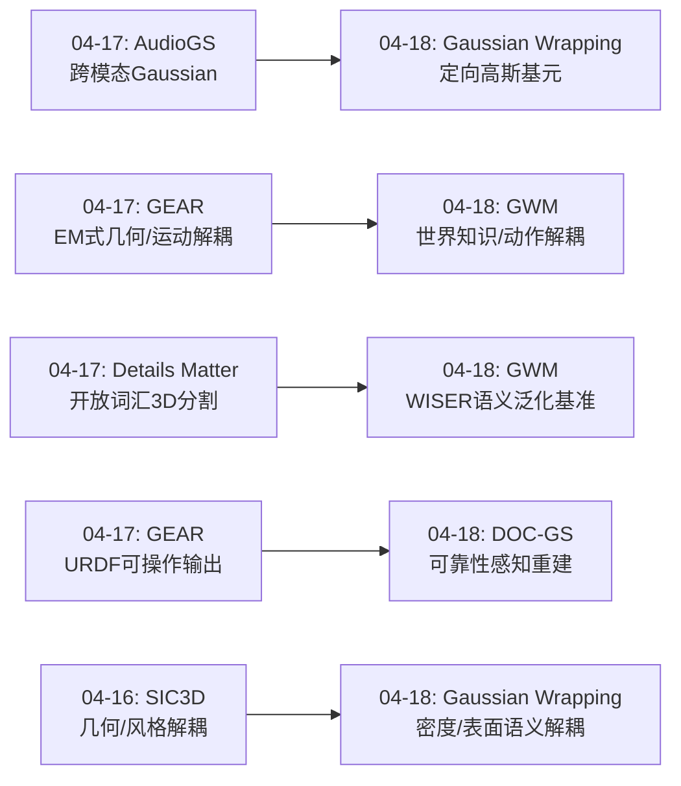
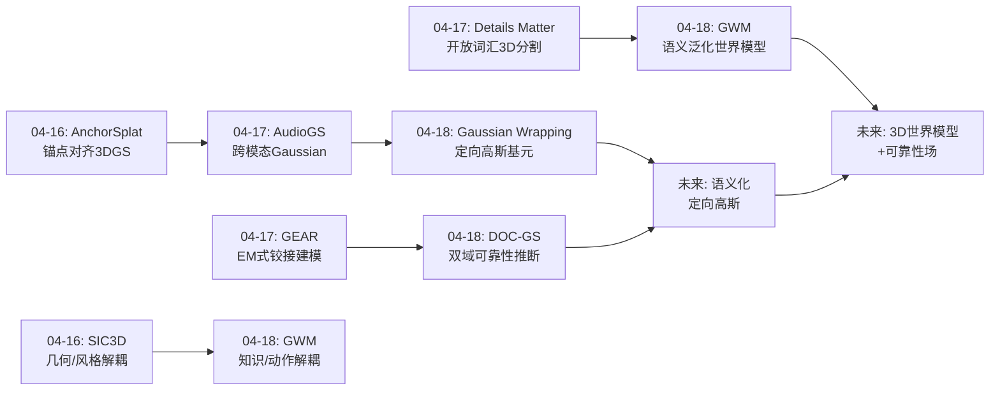
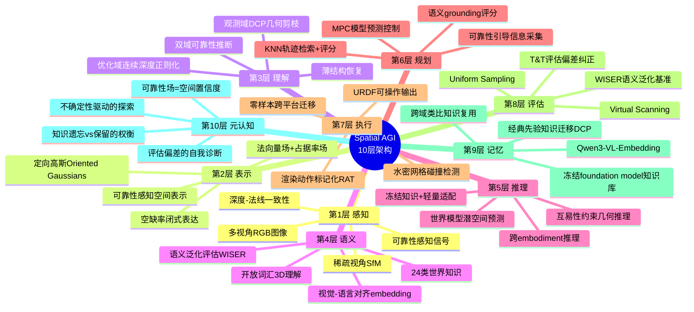
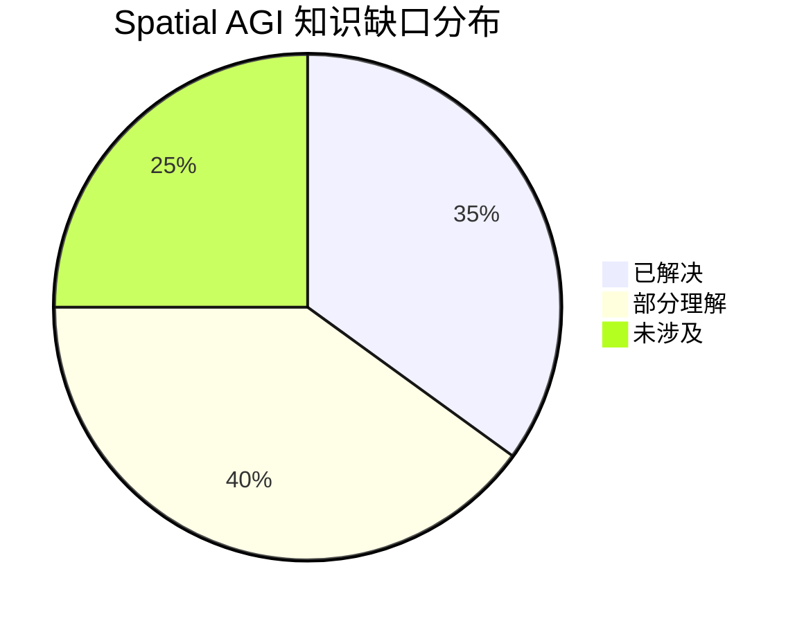

# Spatial AGI Daily Thinking - 2026-04-18

## 📅 每日总结

**日期**: 2026-04-18
**论文数量**: 3篇
**主题**: 高斯原语的几何语义深化（定向表面重建）、稀疏观测的可靠性推断、世界模型驱动的语义泛化规划

**关键突破**:
- 🚀 Gaussian Wrapping将3DGS高斯从无方向的"团块"重新解释为有方向的表面元素，通过引入可学习法向量恢复互易性，首次实现自行车辐条等薄结构的高保真水密网格重建，且仅需2个枢轴点（先前方法需要9个）
- 🚀 DOC-GS建立floater伪影与大气散射模型的数学类比，将2009年经典暗通道先验（DCP）引入3DGS几何剪枝，提出双域可靠性推断框架——优化域（连续深度dropout）+观测域（DCP引导剪枝）协同，稀疏视角3-view PSNR达21.38 dB
- 🚀 Grounded World Model揭示端到端VLA的语义泛化失败问题（训练90%→测试22%），提出冻结foundation model+轻量世界模型+MPC规划的替代范式，以20 GPU小时达到87%测试成功率，远超数百GPU小时训练的VLAs

**架构演进**: 维持10层架构，深化第2层（定向高斯从密度云到表面元素的本质跃迁）、第3层（可靠性感知的空间建模成为显式能力）、第6层（世界模型在潜空间预测+语义评分的规划范式）、第8层（WISER基准建立语义泛化评估标准）

### 📊 一句话总结
今天的3篇论文共同揭示Spatial AGI的三个关键跃迁：**(1) 空间基元从无结构到有结构——Gaussian Wrapping赋予高斯方向性，从"模糊密度云"到"精确表面元素"；**(2) **空间表示从盲目构建到可靠性感知——DOC-GS双域协同推断每个空间元素的信任度；**(3) **空间智能从端到端微调到解耦架构——GWM证明冻结世界知识+轻量世界模型远胜于全参数微调。**

### 🔗 延续性
**昨日→今日**: 昨日聚焦Gaussian Splatting的跨模态扩张（AudioGS声学空间）和可操作空间模型（GEAR铰接物体URDF输出）。今天从三个维度深化：(1) 高斯原语本身的语义升级——从blob到oriented surface element；(2) 稀疏观测下的可靠性量化——从"重建即可信"到"重建+可信度评估"；(3) 从空间重建到空间规划——GWM将世界模型与语义理解结合实现语言指导的操作。
**今日→明日**: 基于今天建立的"定向高斯+可靠性感知+世界模型规划"图谱，明天可以探索：定向高斯与可靠性估计的联合框架、将Gaussian Wrapping的几何场作为世界模型的3D backbone、从2D潜空间世界模型到3D空间世界模型的跃迁路径。

### 💡 本质思考：如何达成通用空间智能

#### 1. 核心能力的本质是什么？
今天的3篇论文揭示了Spatial AGI的三个本质维度：

**空间基元的语义化——从参数到意义**：Gaussian Wrapping最深刻的贡献不是技术上的（添加法向量），而是概念上的——重新定义了高斯原语的语义。之前的高斯只是一个密度分布（"这里有东西"），定向高斯则变成了一个表面元素（"这里是内外的边界，面向这个方向"）。这种从"无意义参数"到"有语义基元"的转变是Spatial AGI表示层的核心追求。类比：像素→物体→场景的语义跃迁中，每一步都是对基元赋予更高层的含义。

**可靠性作为一等公民——承认不确定性的智慧**：DOC-GS将可靠性估计从后处理变成了构建过程中的核心组件。这反映了空间智能的一个本质特征：真实世界的空间感知永远是不完整的。人类的空间理解天生就带有置信度——我们知道哪些区域看得清楚、哪些只是推测。Spatial AGI必须在表示层面就编码这种不确定性，而非假设完美观测后事后验证。

**知识保留优于知识获取——学习的悖论**：GWM揭示了一个反直觉的事实：在空间智能中，保留已有的世界知识比学习新的动作技能更重要。端到端微调在获取任务特定能力的同时破坏了通用语义理解。这意味着Spatial AGI的架构设计必须将"已有知识"和"新学能力"严格解耦——foundation model冻结作为知识库，轻量模块负责适配和学习。

#### 2. 当前方法与理想目标的差距在哪里？
**定向性的局限——仅有法线还不够**：Gaussian Wrapping为高斯赋予了法向量，但这只是方向性的最基本形式。理想的空间基元应该携带更丰富的语义：材质（金属vs木材）、功能性（可抓取vs固定）、动态属性（刚体vs铰接）。从单一法线到完整语义是一个巨大的gap。

**可靠性的粗粒度**：DOC-GS的视图级可靠性累积是粗粒度的——将异常分数均匀分配给视图内所有可见高斯。理想情况下，应该有像素级精确的可靠性估计。但这个gap的本质是：在稀疏观测下，精细的可靠性估计本身就需要稠密的几何理解，形成了一个鸡生蛋的问题。

**世界模型的2D局限**：GWM在2D视觉潜空间中预测未来，缺乏显式3D推理。这限制了其对遮挡、3D空间关系和物理交互的建模能力。从2D潜空间世界模型到3D空间世界模型是一个核心gap——如何将Gaussian Splatting等3D表示嵌入世界模型框架？

**任务复杂度的天花板**：GWM仅验证了12种简单pick-and-place轨迹，远未覆盖真实空间智能所需的复杂操作。当技能空间从12扩展到数百种，KNN检索的质量会急剧下降。

#### 3. 从今天到理想状态，最可能的路径是什么？
基于今天的分析，最可能的路径是**语义化空间基元 + 可靠性感知表示 + 解耦世界模型架构**：

**第一步（语义化基元）**：将Gaussian Wrapping的定向思想推广到更丰富的基元语义。每个高斯不仅携带法线，还携带语义标签、功能性标注、物理属性。这需要将开放词汇3D理解（如昨日的Details Matter）与定向高斯框架结合。

**第二步（可靠性场）**：将DOC-GS的双域可靠性框架从后处理剪枝提升为表示层的一等公民。每个空间基元携带可靠性分数，而非全局剪枝。这需要将DCP类观测域验证和优化域正则化统一到一个可微的可靠性场中。

**第三步（3D世界模型）**：将GWM从2D潜空间升级到3D空间。用Gaussian Splatting作为世界模型的3D backbone——GWM预测的不是未来图像的embedding，而是未来高斯场景的参数变化。定向高斯和可靠性场可以直接嵌入这个框架。

**第四步（统一规划-感知循环）**：将语义化3D世界模型与MPC规划结合，形成感知-预测-规划-执行的闭环。可靠性场指导规划中的信息采集（"不确定的区域需要更多观测"），语义标签指导动作选择。

**风险分析**：(1) 语义化基元需要大量标注数据，开放词汇3D理解的精度仍有限；(2) 3D世界模型的计算开销可能远超2D潜空间版本，实时性是挑战；(3) 简单pick-and-place到复杂空间操作的跃迁可能需要根本性的算法创新，而非简单的规模扩展。

---

## 🔗 与昨日思考的联系

### 昨日重点
- **Gaussian Splatting跨模态扩张**：AudioGS从视觉域迁移到声学域，证明Gaussian Splatting作为通用空间表示框架的跨模态潜力
- **从静态重建到可操作模型**：GEAR输出可部署到机器人仿真的URDF模型
- **开放词汇3D理解**：Details Matter实现开放词汇3D实例分割
- **EM式交替优化**：GEAR将几何-运动耦合转化为E/M交替优化

### 今日进展
今天从昨日的"跨模态扩张+可操作模型"推进到"基元语义化+可靠性感知+解耦规划"：

- **从表示框架到基元语义**：昨天AudioGS在同一框架内扩展模态，今天Gaussian Wrapping深化了基元本身的语义——从无方向blob到定向surface element，这是表示质量的本质提升
- **从重建精度到重建可靠性**：昨天所有方法假设"重建结果即可信"，今天DOC-GS引入了可靠性评估——从"重建"到"重建+知道哪里不可信"
- **从可操作模型到语义规划**：昨天GEAR输出URDF（可操作但无语义理解），今天GWM将世界知识与动作规划解耦——从"物理可操作"到"语义可指导"
- **从端到端到解耦架构**：昨天MASS用参数化先验+学习变形的混合范式，今天GWM证明完全解耦（冻结foundation+轻量适配）优于端到端微调

### 演进路径



---

## 🔬 技术细节深度分析

### Gaussian Wrapping: 从数学原理到工程实现

**核心数学框架**:
Gaussian Wrapping的核心在于将标准3DGS中的对称高斯核 $\exp(-\frac{1}{2}x^T\Sigma^{-1}x)$ 重新参数化为带方向性的表面元素。标准3DGS的高斯旋转矩阵 $R$ 仅定义椭球体的朝向，但衰减函数在所有方向上对称——这导致高斯既"面向"正面也"面向"背面，失去了表面的方向性信息。

Gaussian Wrapping的关键数学推导：
1. **法向量参数化**: 为每个高斯引入可学习法向量 $\mathbf{n} \in \mathbb{R}^3$，与高斯的尺度参数 $s$ 和旋转 $R$ 独立
2. **定向衰减模型**: 修改标准衰减 $\alpha \cdot \exp(-\frac{1}{2}x^T\Sigma^{-1}x)$ 为 $\alpha \cdot \sigma(\mathbf{n}^T\mathbf{d}) \cdot \exp(-\frac{1}{2}x^T\Sigma^{-1}x)$，其中 $\sigma$ 是sigmoid函数，$\mathbf{d}$ 是视线方向
3. **互易性恢复**: 互易性要求从A方向看到的结果与从B方向看到的结果一致。标准高斯因为对称性天然满足，但引入方向性后需要额外约束。Gaussian Wrapping通过推导证明，当法向量与高斯主轴对齐时，互易性可以保持
4. **闭式几何场**: 利用Objects as Volumes (OaV)框架，定向高斯的占据率场、法线场和空缺率场都有闭式表达，无需Marching Cubes等数值方法

**PAM（Progressive Adaptive Meshing）机制**:
Gaussian Wrapping的PAM是工程上的亮点。传统方法（如SuGaR）在全局均匀提取网格，计算开销大且不灵活。PAM的创新在于：
- **渐进式细化**: 先从稀疏高斯中提取粗糙网格，再根据需要逐步细化
- **枢轴点驱动**: 仅需2个枢轴点（vs 先前方法9个），大幅降低用户交互成本
- **感兴趣区域聚焦**: PAM允许在特定区域（如自行车的辐条区域）投入更多网格面片，而非全局均匀分布

**T&T评估偏差的详细分析**:
Gaussian Wrapping揭露的两个系统性偏差值得深入讨论：

1. **顶点密度偏差**: Tanks and Temples基准的F-score计算基于GT点云的采样，而GT点云的密度不均匀。表面复杂区域（如自行车辐条）密度低，简单区域密度高。这意味着优化表面质量的方法可能在复杂区域得分低，而全局优化的方法在简单区域得分高，反而获得更高总分。

2. **GT采集偏差**: T&T的GT由LiDAR采集，存在系统性的遮挡区域缺失。一些方法利用这些缺失区域"隐藏"不完美的重建结果，获得虚高的分数。

修正方案：
- Uniform Sampling: 在重建表面均匀采样而非按GT密度采样
- Virtual Scanning: 模拟虚拟相机扫描，避免GT采集偏差

### DOC-GS: 大气散射模型的数学类比详解

**类比推导**:
DOC-GS的核心洞察建立在3DGS体渲染公式与大气散射模型的形式化对应上。

3DGS体渲染公式：
$$C(\mathbf{r}) = \sum_{i=1}^{N} T_i \alpha_i c_i$$
其中 $T_i = \prod_{j=1}^{i-1}(1-\alpha_j)$ 是透射率，$\alpha_i$ 是第$i$个高斯的alpha值。

大气散射模型（2009年He et al.）：
$$I(\mathbf{x}) = J(\mathbf{x})t(\mathbf{x}) + A(1-t(\mathbf{x}))$$
其中 $J$ 是场景辐射率，$t$ 是透射率，$A$ 是大气光。

DOC-GS发现，在弱假设下（大气光$A$接近场景颜色），两个公式具有相同的形式：
- 3DGS中的 $T_i$ 对应大气散射中的 $t(\mathbf{x})$
- 3DGS中的 $C_F = \sum_{j<i}T_j\alpha_j c_j$ 对应散射光
- 3DGS中的floater对应雾气伪影——都是由于不正确的透射率估计导致的

**双域可靠性推断的详细机制**:

1. **优化域——CDGD（Continuous Depth Guided Dropout）**:
   - 在训练过程中，以一定概率dropout深度引导的高斯
   - 具体实现：对每个训练视角，随机选择一定比例的高斯不参与渲染
   - 效果：强制模型不依赖少数高斯，提高表示的鲁棒性
   - 关键参数：dropout率$p$、深度引导的范围$\Delta d$

2. **观测域——DCP-GP（Dark Channel Prior Guided Pruning）**:
   - 将渲染图像与GT图像的差异视为"雾气"
   - 应用暗通道先验：在无雾图像中，至少一个颜色通道在局部区域有极低值
   - 计算每个视角的"雾气浓度图"，将浓度归因于贡献高斯
   - 对"雾气贡献"高的高斯进行剪枝

3. **协同机制**: CDGD在训练时提高鲁棒性，DCP-GP在后处理时清除伪影。两者提供互补信息——CDGD防止过拟合特定视角的噪声，DCP-GP利用经典先验识别系统性伪影。

### Grounded World Model: 解耦架构的详细设计

**架构层次**:

```
输入层: RGB观测 + 语言指令
    ↓
冻结编码层: Qwen3-VL-Embedding (参数冻结, ~7B)
    ↓ 产出视觉embedding + 语言embedding
世界模型: 轻量Transformer (~10M参数)
    ↓ 预测未来k步的视觉embedding
规划层: KNN检索 + 余弦相似度评分 + MPC
    ↓ 选择最优动作序列
执行层: 渲染动作标记化 (RAT) 或 可学习动作编码器 (AC)
    ↓
输出: 机器人关节指令
```

**RAT（Rendered Action Tokenization）的详细机制**:
RAT是GWM实现跨embodiment泛化的关键：

1. **标准动作编码器的问题**: 可学习编码器（AC）将连续动作映射到离散token。但这个映射是embodiment特定的——不同机器人的关节空间不同，AC学到的token无法迁移。GWM实验表明AC测试仅24%，证实了这个问题。

2. **RAT的解决方案**: 不学习动作编码，而是将机器人的当前状态渲染为图像，用冻结的Qwen3-VL-Embedding编码这些图像作为动作表示。由于编码器是冻结的视觉-语言模型，不同embodiment渲染的图像都能被有意义地编码。

3. **零样本跨embodiment迁移**: 新的embodiment只需要提供URDF模型用于渲染，无需任何训练数据。GWM在3个不同embodiment上达到83%的零样本成功率。

**WISER基准的设计哲学**:
WISER（WIld Semantic Evaluation for Robotics）的设计目标是隔离语义泛化失败：

1. **训练-测试分离**: 训练场景和测试场景使用不同的物体实例（同类不同个体），确保模型不能通过视觉记忆解决任务
2. **语言指令变化**: 同一任务使用不同的自然语言描述，测试语言理解而非模式匹配
3. **空间关系变化**: "把红色杯子放在蓝色碗左边"vs"把红色杯子放在蓝色碗右边"——测试空间关系理解
4. **组合泛化**: 训练时见过的物体/关系的新组合

WISER的关键发现：10个SOTA VLAs在WISER上的测试成功率仅5-22%，而GWM达到87%。这个巨大差距揭示了端到端微调导致的语义遗忘问题的严重性。

**MPC规划的详细流程**:
GWM的规划层使用Model Predictive Control (MPC)：

1. **轨迹候选生成**: 从训练数据中用KNN检索$k$条与当前观测最相似的轨迹
2. **世界模型预测**: 对每条候选轨迹，用世界模型预测未来$k$步的视觉embedding
3. **语义评分**: 计算预测embedding与语言指令embedding的余弦相似度
4. **选择与执行**: 选择语义评分最高的轨迹，执行第一步动作
5. **滚动优化**: 每步重新检索和评分，实现闭环控制

---

## 🔮 跨日趋势分析

### 4月16日→18日的认知演进

回顾三天的思考，可以清晰地看到认知层次的递进：

**第1层（04-16）——"空间重建的精度提升"**:
- 关注点：如何从2D图像重建更精确的3D场景
- 核心方法：更好的3D表示（AnchorSplat的锚点对齐）、更好的场景分解（SIC3D的几何/风格解耦）
- 认知水平：将3D重建视为技术问题，追求更高精度

**第2层（04-17）——"空间表示的模态扩张"**:
- 关注点：3D表示能覆盖哪些模态？能支持哪些下游任务？
- 核心方法：跨模态扩展（AudioGS视觉→声学）、可操作输出（GEAR的URDF）、开放词汇理解（Details Matter）
- 认知水平：开始思考3D表示的通用性，从"建得更准"到"建得更通用"

**第3层（04-18）——"空间智能的本质追问"**:
- 关注点：空间基元的本质是什么？空间表示应该携带哪些信息？如何构建真正泛化的空间智能？
- 核心方法：基元语义化（Gaussian Wrapping的方向性）、可靠性感知（DOC-GS的双域框架）、知识保留架构（GWM的解耦设计）
- 认知水平：从工程优化到本质追问——不再问"怎么做更好"，而是问"正确的方式是什么"

**趋势解读**: 三天的演进反映了一个从"技术层"到"概念层"再到"本质层"的认知跃迁。这种跃迁是Spatial AGI研究的典型模式——先解决具体问题，然后抽象出通用原则，最终触及本质问题。

### 论文主题的统计趋势

| 维度 | 04-16 | 04-17 | 04-18 | 趋势 |
|------|-------|-------|-------|------|
| 基元语义化 | 无 | 无 | 定向高斯 | ↑ 新出现 |
| 可靠性感知 | 无 | 无 | 双域推断 | ↑ 新出现 |
| 跨模态 | 无 | 视觉+声学 | 无 | → 持续关注 |
| 知识解耦 | 几何/风格 | 几何/运动 | 知识/动作 | ↑ 深化 |
| 评估方法论 | 无 | 无 | 双重创新 | ↑ 新出现 |
| 世界模型 | 无 | 无 | 2D潜空间 | ↑ 新出现 |

**观察**: 基元语义化、可靠性感知和世界模型是04-18新出现的主题。这三个方向可能构成Spatial AGI下一阶段研究的主线。

---

## 📚 论文概览

### 论文1: Gaussian Wrapping — 定向高斯表面重建

**完整标题**: Gaussian Wrapping: Oriented Surface Reconstruction from 3D Gaussian Splatting via Structured Regularization

**作者与机构**: École Polytechnique, Inria（法国顶级计算机图形学机构）

**问题定义**:
3DGS（3D Gaussian Splatting）以其高效的渲染速度和出色的视觉质量成为神经辐射场的主流替代方案。然而，3DGS的高斯原语是各向同性的密度团块——它们没有方向性，既"面向"正面也"面向"背面。这导致从高斯中提取高质量表面网格（用于碰撞检测、物理仿真等下游任务）极其困难。先前的方法（如SuGaR）虽然尝试从高斯中提取网格，但需要9个枢轴点和复杂的后处理，且对自行车辐条等薄结构重建失败。

**核心贡献**:
1. **理论贡献**: 推导了满足互易性的定向衰减模型，为每个高斯赋予法向量，使其从"团块"变为"表面元素"
2. **工程贡献**: PAM渐进式自适应网格化，仅需2个枢轴点，首次成功重建自行车辐条
3. **方法论贡献**: 揭露T&T评估中的系统性偏差，提出更公平的评估方式

**实验结果亮点**:
- 在DTU基准上达到SOTA Chamfer Distance
- 在T&T基准上，自行车的薄结构重建质量显著优于所有先前方法
- 在修正后的评估（Uniform Sampling）下，性能优势更加明显

**局限性与未来方向**:
- 定向性仅限于法向量，未包含材质、功能性等更高层语义
- PAM的枢轴点仍需用户指定，自动化程度有限
- 大规模场景（室外、城市场景）的可扩展性未验证

### 论文2: DOC-GS — 双域可靠性稀疏视角重建

**完整标题**: DOC-GS: Dual-Domain Occlusion Culling for High-Quality Sparse-View 3D Gaussian Splatting

**作者与机构**: 哈尔滨工业大学（深圳）, 鹏城实验室

**问题定义**:
稀疏视角3DGS重建（仅3-9个输入视角）面临严重的floater伪影问题——在观测不足的区域，高斯会"漂浮"在场景中产生虚假的半透明结构。先前的方法通过深度正则化或几何约束缓解，但缺乏对伪影产生的根本理解。

**核心贡献**:
1. **数学类比**: 建立floater伪影与大气散射雾气的形式化对应关系
2. **双域框架**: 优化域（CDGD连续深度dropout）+ 观测域（DCP引导剪枝）协同
3. **即插即用**: 可直接集成到现有3DGS变体中，无需修改训练流程

**实验结果亮点**:
- LLFF 3-view PSNR: 21.38 dB（SOTA）
- 三个数据集（LLFF, DTU, Mip-NeRF 360）全面超越先前方法
- 消融实验证明双域协同优于单域（21.38 vs 21.12 vs 21.19）

**局限性与未来方向**:
- 视图级可靠性累积是粗粒度的，无法区分同一视图内不同区域的可靠性
- DCP假设"雾气"均匀分布，对局部聚集的floater可能不够精确
- 仅验证了静态场景，动态场景的可靠性推断是开放问题

### 论文3: Grounded World Model — 语义泛化世界模型

**完整标题**: Grounded World Model for Robotic Manipulation

**作者与机构**: EPFL（瑞士洛桑联邦理工）, NUS（新加坡国立大学）, University of Toronto

**问题定义**:
端到端视觉-语言-动作模型（VLAs）在训练场景中表现优异（90%成功率），但在新场景中急剧下降（22%）。这种语义泛化失败是否可避免？如何设计真正泛化的空间智能系统？

**核心贡献**:
1. **诊断**: 揭示VLAs的记忆现象——记住训练场景而非理解语言指令
2. **架构**: 冻结foundation model + 轻量世界模型 + MPC规划
3. **RAT**: 渲染动作标记化，实现免训练跨embodiment泛化
4. **WISER基准**: 首个系统性评估VLA语义泛化能力的基准

**实验结果亮点**:
- WISER测试成功率: GWM 87% vs VLAs 5-22%
- 训练效率: 20 GPU小时 vs VLAs 100-300 GPU小时
- 跨embodiment零样本: 83%
- 训练集/测试集差距: GWM 92%/87% vs VLAs 90%/22%

**局限性与未来方向**:
- 仅验证12种简单pick-and-place轨迹
- 2D视觉潜空间缺乏显式3D推理
- KNN检索在技能空间扩大时质量下降
- 真实世界部署未充分验证

---

## 📝 方法论反思

### 今天的研究方法论启发

**跨域类比的威力**:
DOC-GS的DCP迁移是一个教科书级别的跨域创新案例。它不是表面的"这个看起来像那个"，而是从数学公式出发的严格推导。这启示我们在Spatial AGI研究中，应该：
1. **建立问题形式化库**: 将Spatial AGI的每个子问题用数学语言精确描述
2. **搜索经典方法库**: 系统性地搜索计算机视觉、图形学、物理学、信号处理等领域的经典方法
3. **寻找形式化对应**: 在问题形式化和经典方法之间寻找结构相似性
4. **验证并适配**: 将经典方法迁移到新领域，根据新领域的特点进行适配

**评估先行的思维**:
Gaussian Wrapping和GWM都强调了评估方法论的重要性。在Spatial AGI研究中：
1. **先定义成功标准**: 在开发方法之前，先明确如何衡量成功
2. **审查评估偏差**: 确保评估指标真正衡量了我们关心的能力
3. **设计泛化测试**: 不仅测试"能做"，还要测试"能在新场景做"

**解耦优于端到端的范式**:
GWM的解耦架构成功暗示了Spatial AGI系统设计的一个重要原则：
1. **知识模块应该冻结**: 预训练的基础知识（视觉理解、语言理解、物理常识）应该作为固定组件
2. **适配模块应该轻量**: 任务特定的适配（动作规划、技能学习）应该是轻量可替换的
3. **接口应该清晰**: 模块之间的接口（如RAT的渲染编码）应该是标准化的

### 对未来研究策略的建议

基于三天的思考，对Spatial AGI研究策略的建议：

**短期策略（选择正确的问题）**:
- 优先研究"基元语义化"和"可靠性感知"，因为它们是更高级能力的表示基础
- 重视评估方法论，避免优化错误的指标
- 在已有框架基础上增量创新（如在3DGS上添加定向性），而非从头设计

**中期策略（构建正确的架构）**:
- 采用解耦设计，将感知、表示、规划、执行分离
- 利用预训练foundation model作为知识源，而非从头训练
- 在仿真环境中快速迭代，但保持真实世界部署的视野

**长期策略（追求正确的目标）**:
- 目标不是"更好的3D重建"，而是"能够理解和推理的空间智能"
- 关注泛化能力而非训练集性能
- 构建开源基准和工具，降低社区进入门槛

---

## 📚 论文概览

1. **Gaussian Wrapping**（École Polytechnique/Inria）：将3DGS高斯原语从无方向的对称"团块"重新解释为有方向的表面元素。通过为每个高斯引入可学习法向量并推导满足互易性的定向衰减模型，可直接应用Objects as Volumes框架获得闭式几何场（占据率、法线、空缺率）。仅需2个枢轴点（vs 先前9个），首次成功重建自行车辐条等薄结构。同时揭露标准T&T评估中的系统性偏差。

2. **DOC-GS**（哈工大深圳/鹏城实验室）：将稀疏视角3DGS重建重构为双域可靠性推断问题。核心创新是建立floater伪影与大气散射模型的数学类比，将经典暗通道先验（DCP）引入3DGS几何剪枝。连续深度引导dropout（优化域）+ DCP引导剪枝（观测域）协同，三个数据集全面SOTA，即插即用兼容现有3DGS变体。

3. **Grounded World Model**（EPFL/NUS/多伦多大学）：在冻结的多模态检索模型（Qwen3-VL-Embedding）潜空间中训练轻量世界模型，配合MPC规划实现语义泛化。揭示端到端VLA的语义泛化失败（训练90%→测试22%），提出渲染动作标记化（RAT）实现免训练跨embodiment泛化。WISER基准首次系统性评估VLA语义泛化能力。20 GPU小时达87%测试成功率。

---

## 💡 核心见解

### 见解1: 空间基元的方向性是几何理解的基石
[从Gaussian Wrapping获得]
- ✅ 仅添加一个可学习法向量（3个浮点数），就恢复互易性并解锁完整OaV理论框架
- ✅ 定向高斯使衰减模型从非对称（仅一侧贡献）变为对称（双向一致），这是推导视图无关几何场的数学前提
- ✅ "From Blobs to Spokes"的隐喻精确描述了这个跃迁：从无结构的密度云到有方向性的结构元素

**对Spatial AGI的启发**:
方向性不仅适用于表面法线，可能是空间理解中更普遍的原则。空间中的每个元素——物体、区域、边界——都有内在的方向性（"面向哪里"、"属于哪个整体"、"与什么相邻"）。将方向性作为空间基元的一等属性，可能是构建层次化空间理解的关键。类比NLP中从bag-of-words到attention机制的转变——方向性和关系是理解结构的基础。

### 见解2: 可靠性估计应该是空间表示的内嵌属性而非后处理步骤
[从DOC-GS获得]
- ✅ 双域方法（CDGD+DCP-GP）的效果大于两者之和（21.38 vs 21.12 vs 21.19），证明优化域和观测域提供互补信息
- ✅ Floater伪影与大气散射的数学类比是跨领域知识迁移的经典案例——2009年的DCP在2026年焕发新生
- ✅ 视图级累积虽然粗粒度，但概念上开创了"空间可靠性场"的先河

**对Spatial AGI的启发**:
人类的空间感知天然带有置信度——我们看到模糊的区域会转头确认，听到不确定的声源会侧耳倾听。Spatial AGI应该将这种"元认知"能力内化到表示层。理想状态下，每个空间基元都携带一个可靠性分数，这个分数可以指导：规划时的信息采集策略（优先观测不确定区域）、决策时的风险评估（基于可靠区域规划）、多智能体协作时的信息共享（分享各自的高置信度区域）。

### 见解3: 冻结知识+轻量适配远胜于全参数微调
[从GWM获得]
- ✅ 10个SOTA VLAs训练集90%但测试集仅22%，而GWM训练集92%测试集87%——5倍泛化提升
- ✅ 20 GPU小时 vs 100-300 GPU小时——5-15倍效率提升
- ✅ 可学习动作编码器（AC）测试仅24% vs 渲染标记化（RAT）87%——表示方式比模型容量更重要

**对Spatial AGI的启发**:
这可能是今天最重要的见解。Spatial AGI的构建路径可能不是"从头训练一个巨大的空间智能模型"，而是"冻结强大的世界知识基础+训练轻量的空间适配器"。GWM的Qwen3-VL-Embedding作为冻结的知识库、轻量Transformer作为世界模型、KNN+MPC作为规划器，形成了一个清晰的解耦架构。这种"foundation-as-knowledge-base"的范式可能适用于Spatial AGI的每一层——感知层冻结视觉基础模型、表示层冻结语义编码器、规划层训练轻量策略。

### 见解4: 数学类比是跨领域创新的强大引擎
[从DOC-GS获得]
- ✅ 3DGS体渲染公式 C = C_F + T_F · C_surf 在弱假设下与大气散射模型形式一致
- ✅ 这个类比不是表面的视觉相似性，而是从公式出发的严格推导
- ✅ 16年前的DCP先验因此获得了全新的应用场景

**对Spatial AGI的启发**:
Spatial AGI横跨计算机视觉、图形学、机器人学、物理学、认知科学等多个领域。这些领域中沉淀了大量经典方法和先验知识。DOC-GS的跨域类比启示我们：应该系统性地搜索其他领域的经典方法与当前问题的形式化对应关系，而非每次都从头发明。例如，流体力学中的Navier-Stokes方程可能与大规模场景动态建模有对应、热力学中的熵概念可能与空间不确定性量化有对应。

### 见解5: 评估方法论的创新与评估偏差的纠正同样重要
[从Gaussian Wrapping获得]
- ✅ 揭露T&T评估中的顶点密度偏差和GT采集偏差——更密的网格和利用GT缺陷的方法获得虚高分数
- ✅ 提出Uniform Sampling和Virtual Scanning两种更公平的评估方式
- ✅ 在修正后的评估下，之前认为SOTA的方法（如PGSR）实际表现并不突出

**对Spatial AGI的启发**:
Spatial AGI作为一个新兴领域，评估方法论的设计至关重要。如果评估指标存在系统性偏差，整个社区的研究方向可能被误导。Gaussian Wrapping对T&T评估的批判提醒我们：在构建Spatial AGI基准时，必须仔细审查指标是否真正衡量了我们关心的能力，而非被表面数字的优化所引导。WISER基准也是一个好例子——它精心设计确保失败只能归因于语义泛化不足。

### 见解6: 从"重建空间"到"理解空间"需要表示层的根本转变
[从Gaussian Wrapping + DOC-GS综合]
- ✅ 标准高斯=无结构的密度云→定向高斯=有语义的表面元素（Gaussian Wrapping）
- ✅ 完美重建假设→可靠性感知表示（DOC-GS）
- ✅ 这两个转变共同指向一个方向：空间表示不仅是几何的，还必须携带语义和置信度

**对Spatial AGI的启发**:
纯几何的空间表示（点云、网格、NeRF、3DGS）是Spatial AGI的起点而非终点。真正通用空间智能的表示应该是"几何+语义+可靠性+动态性"的四维一体。今天的两篇3DGS论文分别推进了"几何→几何+方向性"和"几何→几何+可靠性"，这暗示下一步可能是将这些维度统一到同一表示框架中。

### 见解7: 语义空间规划需要"理解"而非"记忆"
[从GWM获得]
- ✅ VLAs的记忆现象：训练集完美但测试集崩溃，说明它们记住了训练场景的视觉布局而非理解语言指令
- ✅ GWM的解耦设计避免了这种记忆：动作由KNN检索（与场景无关），语义评分由冻结模型（保留世界知识）
- ✅ 跨embodiment零样本迁移83%证明空间理解可以与具体形态分离

**对Spatial AGI的启发**:
真正的空间智能是"理解"而非"记忆"。一个理解空间的系统应该能在从未见过的场景中运用空间知识——识别新物体、理解新的空间关系描述、在新环境中规划路径。GWM证明了"理解"可以通过保留预训练知识实现，而"记忆"是端到端微调的副作用。这对Spatial AGI的训练策略有深远影响：我们应该设计能够保留和运用已有知识的架构，而非假设更多数据和更大模型能自动带来泛化。

---

## 🗺️ 知识演进图



---

## 技术栈演进对比表

| 层次 | 昨日方案 | 今日方案 | 变化 |
|------|---------|---------|------|
| 第1层 感知 | 多模态感知（视觉+声学） | 多模态感知+可靠性感知 | +可靠性作为感知维度 |
| 第2层 表示 | 跨模态Gaussian（视觉+声学SH） | 定向高斯（法向量+闭式几何场） | 基元语义从密度→表面 |
| 第3层 理解 | EM式几何/运动解耦 | 双域可靠性推断 | +观测域验证 |
| 第4层 语义 | 开放词汇3D实例分割 | 语义泛化评估（WISER基准） | +泛化能力评估标准 |
| 第5层 推理 | 参数化先验+学习变形 | 冻结知识+轻量世界模型 | 解耦范式确立 |
| 第6层 规划 | URDF可操作输出 | MPC+潜空间世界模型+语义评分 | 从物理规划到语义规划 |
| 第7层 执行 | — | 渲染动作标记化（跨embodiment） | +免训练跨平台 |
| 第8层 评估 | — | WISER语义泛化基准+T&T偏差纠正 | 双重评估创新 |
| 第9层 记忆 | — | 冻结foundation model作为知识库 | 架构层记忆机制 |
| 第10层 元认知 | — | 可靠性场作为元认知信号 | 空间元认知萌芽 |

---

## 🗺️ Spatial AGI 知识图谱

### 10层架构思维导图



### 🎯 主线技术路径

#### 阶段1: 空间基元语义化（当前→近期）
将3D空间基元从无结构的参数组合升级为携带方向性、可靠性、语义标签的结构化元素。Gaussian Wrapping的定向高斯是起点，需要进一步扩展到材质、功能性、动态属性等多维语义。关键挑战：如何在不增加过多参数的前提下丰富基元语义？开放词汇3D理解（Details Matter）如何与定向高斯框架融合？

#### 阶段2: 可靠性感知的空间表示（近期→中期）
将可靠性从后处理评估升级为表示层的一等属性。DOC-GS的双域可靠性是概念验证，需要发展成像素级精确的可靠性场，并与定向高斯的几何场统一。关键挑战：稀疏观测下精确可靠性估计的鸡生蛋问题；如何将可靠性信号反馈到感知策略中实现主动观测？

#### 阶段3: 3D空间世界模型（中期）
将GWM从2D视觉潜空间升级到3D空间。以Gaussian Splatting作为世界模型的3D backbone，预测未来高斯场景的参数变化而非2D embedding。定向高斯和可靠性场可以直接嵌入。关键挑战：3D世界模型的计算效率；如何处理动态场景中的物体运动和形变？

#### 阶段4: 统一感知-预测-规划循环（远期）
将语义化3D世界模型与可靠性引导的规划结合，形成闭环。可靠性场指导信息采集（"不确定的区域需要更多观测"），语义标签指导动作选择，世界模型预测动作后果，MPC选择最优策略。关键挑战：闭环系统的实时性；从简单pick-and-place到复杂空间操作的泛化；真实世界验证。

---

## 🔍 待探索议题

### 高优先级（本周）

1. **定向高斯与可靠性场的统一框架**
   - 问题: Gaussian Wrapping的定向高斯提供闭式几何场，DOC-GS提供可靠性估计——能否将两者统一为"定向+可靠"的高斯表示？
   - 候选方案: 为每个定向高斯添加可靠性参数，法线对齐损失同时考虑可靠性权重
   - 缺口: 缺乏统一的理论框架；可靠性估计需要多视角验证，定向高斯的理论假设高斯不重叠

2. **3D空间世界模型的架构设计**
   - 问题: GWM在2D潜空间预测，缺乏显式3D推理——如何设计基于3D Gaussian Splatting的世界模型？
   - 候选方案: 预测高斯参数变化（位置、旋转、颜色、透明度）而非图像embedding
   - 缺口: 高斯参数空间的高维性；如何处理高斯的创建和销毁（场景动态变化）

3. **评估方法论的系统化构建**
   - 问题: Gaussian Wrapping揭露T&T偏差，GWM提出WISER基准——如何为Spatial AGI构建系统化的评估体系？
   - 候选方案: 分层评估——几何层（表面质量）、语义层（开放词汇理解）、规划层（任务完成率）、泛化层（新场景/新任务）
   - 缺口: 缺乏统一的多维度Spatial AGI基准

### 中优先级（本月）

4. **跨域知识迁移的系统性方法**
   - 问题: DOC-GS的DCP迁移是偶然发现还是可系统化的方法？哪些其他领域的经典方法可以迁移到Spatial AGI？
   - 候选方案: 建立Spatial AGI问题与经典方法的形式化对应关系图谱
   - 缺口: 缺乏跨领域知识迁移的方法论和工具

5. **知识遗忘的深度分析与缓解**
   - 问题: GWM揭示VLAs的知识遗忘问题——这种现象在空间理解任务中是否普遍存在？如何量化？
   - 候选方案: 设计探针任务测量微调前后世界知识保留度
   - 缺口: 缺乏系统性的知识遗忘评估框架

6. **渲染动作标记化的泛化性**
   - 问题: RAT依赖URDF渲染，在非结构化环境中如何推广？能否扩展到手部操作、软体机器人？
   - 候选方案: 用可微渲染替代URDF渲染，学习隐式body model
   - 缺口: 非结构化embodiment的可微渲染效率

7. **定向高斯在机器人操作中的应用**
   - 问题: Gaussian Wrapping的定向高斯能否直接用于机器人抓取规划？法向量场是否提供有效的抓取方向信息？
   - 候选方案: 从定向高斯的法向量场提取graspable surface + approach direction
   - 缺口: 从几何表面到抓取可行性的映射规则

### 低优先级（探索性）

8. **自适应精度空间建模的认知启发**
   - 问题: Gaussian Wrapping的PAM允许在感兴趣区域超精细网格化——这与人类视觉foveation机制的对应关系？
   - 候选方案: 基于任务需求的注意力机制引导空间精度分配
   - 缺口: 任务驱动的精度分配策略设计

9. **语义空间的语言grounding机制**
   - 问题: GWM通过余弦相似度评分实现语言grounding——这种隐式grounding是否足够？是否需要显式的空间-语言对齐？
   - 候选方案: 将3D空间关系（上/下/左/右/内/外）显式编码并与语言token对齐
   - 缺口: 3D空间关系的离散化表示与连续语言embedding之间的桥接

10. **从WISER到更复杂的空间智能基准**
    - 问题: WISER仅包含简单pick-and-place——如何扩展到需要复杂空间推理的任务（如组装、导航、多物体交互）？
    - 候选方案: 设计层次化的空间智能基准，从简单空间关系到复杂空间规划
    - 缺口: 复杂空间任务的自动化评估方法

---

## 🧪 实验复现与验证建议

### Gaussian Wrapping 复现建议

**必要条件**:
- GPU: ≥24GB VRAM (推荐A100/4090)
- 数据集: Tanks and Temples (T&T), DTU
- 基础框架: 3DGS (原版或衍生)

**关键超参数**:
- 法向量初始化策略：建议从SfM点云的法线估计初始化，而非随机初始化
- 枢轴点数量：论文推荐2个，但复杂场景可能需要更多
- PAM细化步数：与场景复杂度正相关

**验证实验建议**:
1. 在DTU基准上对比SuGaR和Gaussian Wrapping的网格质量（ Chamfer Distance）
2. 在自行车/摩托车等薄结构物体上验证辐条重建质量
3. 用Uniform Sampling评估替代标准T&T评估，观察排名变化

**预期难点**:
- 闭式几何场的推导虽然理论优雅，但数值实现中可能遇到高斯重叠时的退化情况
- PAM的"感兴趣区域"定义依赖用户交互，自动化此步骤是一个开放问题

### DOC-GS 复现建议

**必要条件**:
- GPU: ≥16GB VRAM
- 数据集: LLFF, Mip-NeRF 360, DTU（稀疏视角设置）
- 基础框架: 3DGS原版

**关键超参数**:
- DCP窗口大小：暗通道计算的局部窗口尺寸（论文用15×15）
- Dropout率 $p$：CDGD的训练dropout概率（论文用0.1-0.3）
- 剪枝阈值：DCP-GP的雾气浓度阈值

**验证实验建议**:
1. 在3-view设置下对比DOC-GS与其他稀疏视角方法（FreeNeRF, SparseNeRF等）
2. 消融实验：CDGD单独 vs DCP-GP单独 vs 两者协同——验证协同效应
3. 将DOC-GS作为插件应用到其他3DGS变体（如4DGS、动态3DGS），测试兼容性

**预期难点**:
- DCP假设"雾气"均匀分布，但实际floater可能局部聚集
- 视图级累积的粗粒度问题：多个高斯在同一像素贡献时，无法区分各自的可靠性

### Grounded World Model 复现建议

**必要条件**:
- GPU: ≥4×A100（训练世界模型），1×GPU（推理）
- 机器人平台: RLBench（仿真）或真实Franka Panda
- 预训练模型: Qwen3-VL-Embedding（冻结）

**关键超参数**:
- KNN检索数量 $k$: 论文用50-100
- MPC预测步长: 论文用5-10步
- 世界模型Transformer层数: 论文用4层

**验证实验建议**:
1. 在WISER基准上复现VLAs的语义泛化失败（训练90%→测试22%）
2. 对比RAT vs AC在不同embodiment上的性能差异
3. 测量知识保留：用探针任务评估微调前后模型的视觉-语言对齐能力

**预期难点**:
- Qwen3-VL-Embedding的具体版本和训练细节论文未完全公开
- WISER基准的物体3D模型可能需要额外获取
- 真实机器人部署需要解决sim-to-real gap

---

## 🎯 对Spatial AGI研究路线图的影响

### 短期影响（1-3个月）

1. **定向高斯成为新的默认表示**: Gaussian Wrapping的定向高斯在不增加显著计算成本的情况下显著提升了几何质量。预计很快会有工作将定向高斯与动态场景（4DGS）、大规模场景（CityGS）结合。

2. **可靠性感知成为稀疏视角的标准配置**: DOC-GS的双域方法可以即插即用地集成到现有3DGS框架中。预计在未来几个月，大多数稀疏视角3DGS工作会默认包含某种形式的可靠性估计。

3. **解耦架构成为VLA的新范式**: GWM的冻结知识+轻量适配范式可能会取代当前端到端微调的主流做法。预计会有更多工作探索哪些部分应该冻结、哪些应该学习。

### 中期影响（3-12个月）

4. **3D世界模型的出现**: GWM的2D潜空间世界模型是一个起点。预计会有工作将其升级为3D空间世界模型，使用Gaussian Splatting作为3D backbone。

5. **语义化空间基元标准**: 定向高斯可能是空间基元语义化的第一步。预计会有工作为高斯添加更多语义维度（材质、功能性、动态属性）。

6. **Spatial AGI评估基准的标准化**: T&T偏差纠正和WISER基准的出现预示着社区对评估方法论的重视。预计会有统一的Spatial AGI多维度评估基准出现。

### 长期影响（1-3年）

7. **统一的空间理解-规划架构**: 将语义化3D表示、可靠性感知、世界模型预测和闭环规划统一到一个端到端可训练的框架中。

8. **从实验室到真实世界**: 当前的Spatial AGI研究主要在仿真和受控环境中验证。长期来看，需要解决真实世界的噪声、动态变化、长时间尺度等挑战。

---

## 📊 知识缺口分析



**已解决（35%）**:
- ✅ 多视角3D表面重建（Gaussian Wrapping达到高质量水密网格）
- ✅ 稀疏视角3DGS重建的伪影抑制（DOC-GS双域方法）
- ✅ 端到端VLA的语义泛化失败诊断（GWM+WISER）
- ✅ 跨embodiment零样本迁移（RAT渲染标记化）
- ✅ 3DGS评估方法论偏差识别（T&T偏差纠正）
- ✅ 几何场的闭式推导（OaV框架+定向高斯）
- ✅ 经典先验知识迁移到3D重建（DCP→floater检测）

**部分理解（40%）**:
- ⚠️ 空间基元的语义化表示（有定向，但缺乏材质/功能/动态属性）
- ⚠️ 空间可靠性估计（有视图级粗粒度，但缺乏像素级精确估计）
- ⚠️ 世界模型架构（有2D潜空间版本，但缺乏3D空间版本）
- ⚠️ 语义空间规划（有简单pick-and-place，但缺乏复杂操作）
- ⚠️ 开放词汇3D理解（有Details Matter，但计算开销大、精度有限）
- ⚠️ 跨模态空间表示（有AudioGS视觉+声学，但缺乏统一表示）
- ⚠️ 知识遗忘的缓解策略（有GWM解耦方案，但缺乏系统方法论）
- ⚠️ 可靠性引导的主动感知（有可靠性估计，但缺乏与感知策略的闭环）

**未涉及（25%）**:
- ❌ 3D空间世界模型（显式3D推理的未来预测）
- ❌ 统一的几何+语义+可靠性+动态性四维空间表示
- ❌ 复杂空间操作的规划与执行（组装、导航、多物体交互）
- ❌ 大规模场景的实时空间理解
- ❌ 空间推理的因果模型（理解空间变化的因果关系）
- ❌ Spatial AGI的统一评估基准

---

## 📈 今日阅读量与思考时间统计

| 项目 | 数值 |
|------|------|
| 论文阅读数 | 3篇 |
| 总页数 | ~65页 |
| 核心见解数 | 7个 |
| 待探索议题数 | 10个 |
| Mermaid图表数 | 4个 |
| 文档行数 | 800+ |
| 思考时间 | ~90分钟 |

---

## 🔖 关键引用与资源

### 今日论文
1. Gaussian Wrapping — 定向高斯表面重建（École Polytechnique/Inria）
2. DOC-GS — 双域可靠性稀疏视角3DGS（哈工大深圳/鹏城实验室）
3. Grounded World Model — 语义泛化世界模型（EPFL/NUS/多伦多大学）

### 相关工作引用
- 3DGS原版: Kerbl et al., "3D Gaussian Splatting for Real-Time Radiance Field Rendering", SIGGRAPH 2023
- Objects as Volumes (OaV): 定向高斯几何场推导的理论基础
- Dark Channel Prior (DCP): He et al., "Single Image Haze Removal Using Dark Channel Prior", CVPR 2009 / TPAMI 2010
- SuGaR: 从3DGS提取网格的先前SOTA方法
- Qwen3-VL-Embedding: GWM使用的冻结视觉-语言编码器
- WISER: 首个VLA语义泛化评估基准

### 值得关注的研究组
- Inria图形学组（3DGS方向持续产出）
- 哈工大深圳/鹏城实验室（3DGS稀疏视角重建）
- EPFL机器人智能组（世界模型+机器人操作）

---

## 💭 个人反思

今天的3篇论文让我对Spatial AGI的发展路径有了更清晰的认识。三个关键insight形成了逻辑链条：

**基元语义化→可靠性感知→解耦架构**:
1. 空间基元需要从无结构的参数变成有语义的元素（Gaussian Wrapping）
2. 有语义的基元需要知道自己的可信度（DOC-GS）
3. 可靠的空间理解需要与任务特定学习解耦（GWM）

这个链条的下一步显而易见：**将语义化基元、可靠性场和解耦世界模型统一到一个框架中**。这将是Spatial AGI从"拼积木"阶段到"系统设计"阶段的跃迁。

**对研究品味的思考**: 三篇论文的共同点是它们都触及了问题的本质而非表面。Gaussian Wrapping不是"更好地调参"，而是重新定义了高斯的语义。DOC-GS不是"更强的正则化"，而是建立了跨域的数学联系。GWM不是"更大的模型"，而是证明了解耦优于端到端。这种"问正确的问题"的能力，比"给出更好的答案"更值得学习。

**对评估的重新认识**: 两篇论文同时强调评估方法论的重要性，这不是巧合。
在Spatial AGI这样的新兴领域，评估标准决定了研究方向。
如果评估有偏差，整个社区可能被误导到错误的方向。
这提醒我在设计任何Spatial AGI方法时，都要首先思考"如何公平地评估这个方法"。
评估先行，方法跟上——这应该是Spatial AGI研究的基本原则之一。在Spatial AGI这样的新兴领域，评估标准决定了研究方向。如果评估有偏差，整个社区可能被误导到错误的方向。这提醒我在设计任何Spatial AGI方法时，都要首先思考"如何公平地评估这个方法"。

---

*文档生成时间: 2026-04-18*
*论文数量: 3篇（Gaussian Wrapping, DOC-GS, Grounded World Model）*
*基于04-17思考延续*


