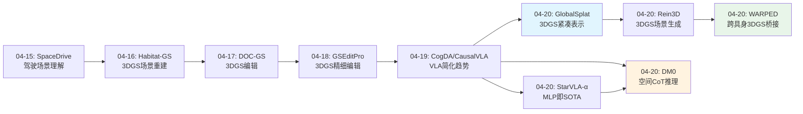
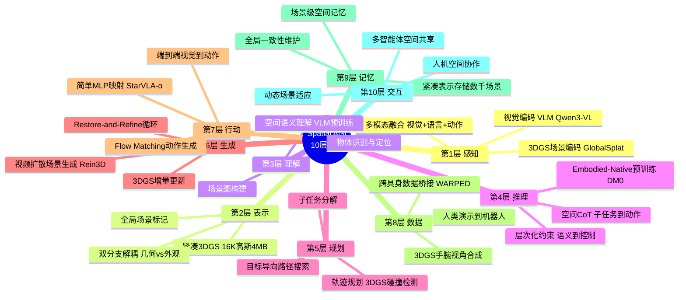
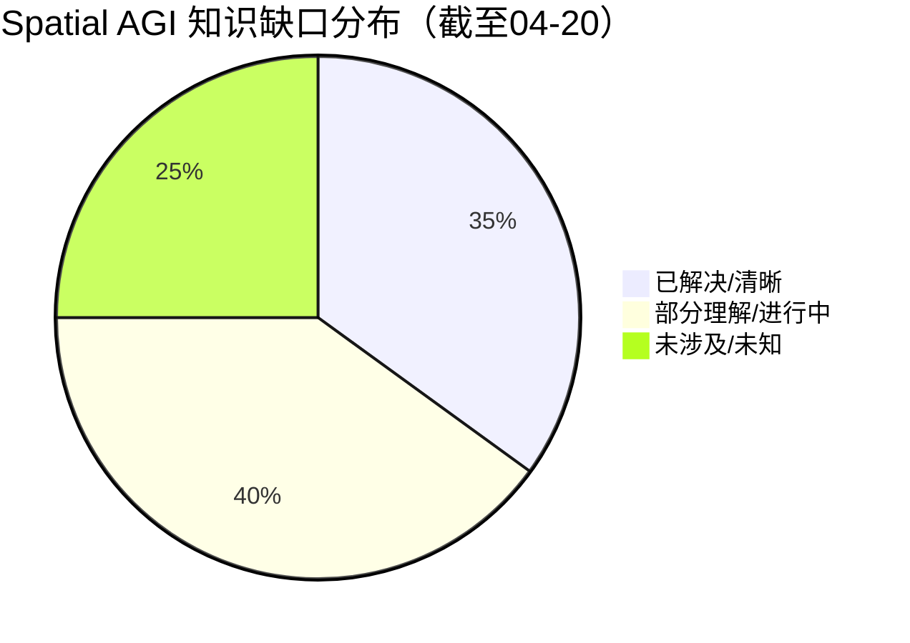
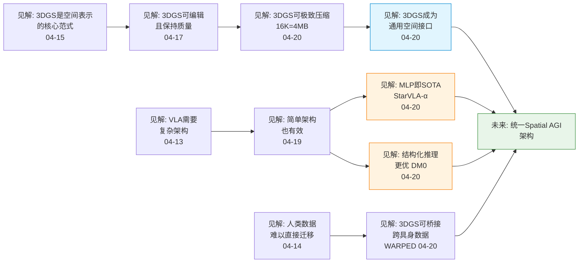

# Spatial AGI 每日思考 - 2026-04-20

## 今日论文总览

今天分析了5篇论文，覆盖了Spatial AGI的多个关键维度：

| 论文 | 主题 | 核心贡献 | Spatial AGI维度 |
|------|------|---------|----------------|
| **GlobalSplat** | 3DGS紧凑表示 | 16K高斯=4MB场景，78ms推理 | 空间记忆表示 |
| **Rein3D** | 3D场景生成 | Restore-and-Refine范式，全景视频扩散 | 空间补全/想象 |
| **WARPED** | 跨具身数据生成 | 3DGS手腕视角合成，人→机器人桥接 | 空间视角转换 |
| **StarVLA-α** | VLA系统简化 | 简单MLP头即达SOTA | 空间→动作映射 |
| **DM0** | Embodied-Native VLA | 空间CoT推理，三阶段训练 | 空间推理架构 |

---

## 核心主题：空间表示的"简单 vs 复杂"之争

今天的5篇论文呈现出一个有趣的张力：**空间智能到底需要多复杂的表示？**

### 支持简单的证据（StarVLA-α）

StarVLA-α的核心发现是"简单就够了"：
- 强VLM(Qwen3-VL 4B) + 轻量MLP = SOTA
- Flow Matching ≈ MLP ≈ 双系统设计
- 机器人预训练可能是双刃剑
- 大batch size比复杂架构更重要

这意味着VLM预训练已经赋予了足够的空间理解能力，空间→动作的映射可以很简单。

### 支持复杂的证据（DM0 + GlobalSplat + Rein3D）

但DM0证明了更复杂的设计确实能带来额外收益：
- Embodied-Native预训练（而非仅VLM预训练）提供了关键物理先验
- 空间CoT推理（子任务→边界框→轨迹→动作）有效约束动作空间
- 2B的embodied-native模型超越了4-5B的internet-native模型

而GlobalSplat和Rein3D则展示了3D空间层面的复杂性需求：
- GlobalSplat的双分支解耦（几何vs外观）和粗到细训练
- Rein3D的restore-refine循环和球面适配

### 我的综合判断

**空间理解的不同层次需要不同的复杂度：**

```
层次1: 空间感知（VLM已足够）
  → StarVLA-α的简单MLP即可
  → 理解"物体在哪里"、"怎么移动"

层次2: 空间推理（需要结构化设计）
  → DM0的Spatial CoT / GlobalSplat的双分支
  → 理解"为什么在那里"、"接下来去哪"

层次3: 空间生成/重建（需要显式3D表示）
  → Rein3D的视频扩散 + 3DGS
  → GlobalSplat的全局场景标记
  → "想象未见空间"、"重建3D世界"
```

**结论：简单是目标，但不同空间认知层次可能需要不同程度的结构化设计。**

---

## 深度思考1：3DGS作为Spatial AGI的通用空间接口

今天的论文揭示了3DGS在Spatial AGI中的多重角色：

### 角色1: 空间记忆表示（GlobalSplat）
- 16K高斯 = 4MB/场景 → 可存储数千场景
- 前馈推理78ms → 实时场景编码
- 全局一致性 → 不是视图拼接

### 角色2: 空间视角转换器（WARPED）
- 从人类视角→机器人视角的桥接
- 5-8x数据效率提升
- 3DGS作为"空间通用语言"

### 角色3: 空间生成画布（Rein3D）
- 视频扩散修复→3DGS更新的循环
- 从文本/单图→完整360°场景
- Restore-and-refine = 人类式的空间认知迭代

**综合洞察**：3DGS正在成为Spatial AGI的**通用空间接口**——它连接了感知（编码）、推理（视角转换）和行动（场景生成）。GlobalSplat让这个接口更紧凑，WARPED展示其跨具身价值，Rein3D证明其生成能力。

---

## 深度思考2：Embodied-Native vs Internet-Native的哲学分歧

DM0和StarVLA-α代表了两种截然不同的理念：

### Internet-Native（StarVLA-α路线）
- "互联网已经教会了AI足够的空间知识"
- VLM预训练 → 简单微调 → 强性能
- 优势：简单、可扩展、利用现有VLM
- 劣势：缺乏物理交互先验

### Embodied-Native（DM0路线）
- "物理世界知识必须从物理交互中学习"
- 混合预训练（web + 驾驶 + 具身）→ 结构化推理 → 强性能
- 优势：物理先验、2B超4-5B
- 劣势：训练复杂、数据工程重

**我的观点**：两者不是对立的，而是互补的。

- **短中期**：Internet-Native + 简单适配（StarVLA-α路线）更实用
- **长期**：Embodied-Native（DM0路线）是必经之路——当机器人能在真实世界中持续学习时

关键问题是：**VLM到底学到了多少"暗含的"空间物理知识？** StarVLA-α的强结果暗示，VLM预训练中的空间知识比我们想象的更多。

---

## 深度思考3：Spatial CoT——空间推理的思维链

DM0的Embodied Spatial Scaffolding引入了空间CoT的概念：

```
子任务预测 → 目标定位 → 轨迹规划 → 动作执行
(语义层)    (空间层)    (几何层)    (控制层)
```

这让我联想到人类的空间认知过程：
1. **理解目标**："我要把杯子放到杯垫上"
2. **定位物体**："杯子在桌子左边，杯垫在右边"
3. **规划路径**："先向右伸手，抓住杯子，移到杯垫上方，放下"
4. **执行动作**：具体的肌肉控制

**关键洞察**：空间CoT不仅是训练技巧，它揭示了空间智能的**层次化本质**。每一层都是对下一层的约束：
- 语义层约束空间层的搜索范围（"杯子"而非"其他物体"）
- 空间层约束几何层的路径（从A到B而非任意路径）
- 几何层约束控制层的动作参数（具体的关节角度）

这种层次化约束可能是实现可靠空间智能的关键——纯端到端的方法（如StarVLA-α的MLP）在小数据时不如结构化方法（如DM0的CoT）。

**未来方向**：将空间CoT与显式3D表示（3DGS）结合：
- 子任务 → 语义标注的3DGS
- 目标定位 → 3DGS中的物体分割
- 轨迹规划 → 3DGS中的碰撞检测路径
- 动作执行 → 基于3DGS的精确控制

---

## 今日最重要的发现

**3DGS正在成为Spatial AGI的通用空间接口。**

今天的5篇论文中有3篇直接使用3DGS（GlobalSplat、Rein3D、WARPED），分别展示了它在空间记忆、空间生成和跨具身桥接中的价值。结合之前分析的Habitat-GS、DOC-GS等，3DGS已经成为Spatial AGI研究中最活跃的方向之一。

**但3DGS还缺少**：
- 语义理解（物体级分割和标注）
- 时序动态（场景变化追踪）
- 物理属性（材质、摩擦力等）
- 交互性（可操作性表示）

这些都是未来Spatial AGI需要解决的方向。

---

## 论文深度分析

### 论文1: GlobalSplat — 3DGS紧凑表示的突破

**核心问题**: 3DGS虽然强大，但存储开销巨大（数百万高斯），限制了其实际应用。

**方法创新**:
- **双分支解耦**: 将几何分支（位置、尺度、旋转）和外观分支（颜色、透明度、球谐系数）分离处理
- **粗到细训练**: 先学习大尺度几何，再逐步细化细节
- **全局场景标记**: 通过标记化(tokenization)将高斯集合压缩为固定长度表示
- **前馈推理**: 78ms完成整个场景编码

**性能亮点**:
- 16K高斯即可表示一个完整场景（原始3DGS通常需要100万+）
- 4MB/场景的存储开销，可轻松存储数千个场景
- 渲染质量与原始3DGS接近

**对Spatial AGI的意义**:
- 场景级空间记忆首次成为可能——机器人可以"记住"去过的每个地方
- 为大规模空间知识库奠定基础——不同场景的3DGS可以索引和检索
- 前馈推理速度使得实时场景编码成为可能

**局限与疑问**:
- 16K高斯对于复杂室外场景是否足够？
- 压缩是否损失了细粒度的操作相关信息（如把手、按钮等）？
- 全局场景标记的语义信息量如何？

---

### 论文2: Rein3D — Restore-and-Refine的3D场景生成

**核心问题**: 如何从文本描述或单张图片生成完整的360° 3D场景？

**方法创新**:
- **Restore-and-Refine范式**: 生成→修复→精化的迭代循环
- **全景视频扩散**: 先生成全景视频，再从中提取3D结构
- **3DGS增量更新**: 每轮迭代都在已有3DGS基础上精化
- **球面适配**: 处理全景投影中的几何失真

**技术细节**:
- 视频扩散模型提供空间先验（"空间应该长什么样"）
- 3DGS提供几何约束（"空间在3D中的结构"）
- 两者交替迭代，逐步提升生成质量

**对Spatial AGI的意义**:
- 空间想象能力——从描述生成未见空间
- 空间补全能力——从局部观察推断完整场景
- Restore-and-Refine类似于人类的空间认知迭代过程

**局限与疑问**:
- 生成场景的物理合理性如何？是否满足可操作性？
- 迭代次数与质量的关系？收敛速度如何？
- 在真实世界场景中的生成质量？

---

### 论文3: WARPED — 跨具身数据生成的桥梁

**核心问题**: 人类演示数据丰富但难以直接用于机器人训练，如何桥接这一数据鸿沟？

**方法创新**:
- **3DGS手腕视角合成**: 从人类手腕摄像头视角重建3DGS，再从机器人手腕视角渲染
- **视角转换而非动作映射**: 不尝试映射人类动作到机器人动作，而是统一空间视角
- **自监督训练**: 利用3DGS的视角一致性作为训练信号

**性能亮点**:
- 5-8x数据效率提升
- 生成的机器人视角数据在视觉上接近真实机器人采集
- 支持多种机器人形态的视角转换

**对Spatial AGI的意义**:
- 打通人类-机器人的空间数据壁垒
- 3DGS作为"空间通用语言"——不同具身体验同一空间
- 大规模利用人类视频数据训练机器人的可能

**局限与疑问**:
- 视角转换是否保留了操作的关键信息（如接触力、变形）？
- 手腕视角的3DGS重建质量在快速运动时如何？
- 从视觉数据到动作策略的gap如何弥合？

---

### 论文4: StarVLA-α — "简单就够了"的VLA哲学

**核心问题**: VLA系统是否需要复杂的架构设计？

**实验设计**:
- 使用强VLM（Qwen3-VL 4B）作为视觉-语言骨干
- 仅添加轻量MLP头进行动作预测
- 与Flow Matching、双系统设计等复杂架构对比
- 系统消融实验验证各组件贡献

**关键发现**:
- 简单MLP头在多个benchmark上达到SOTA
- Flow Matching ≈ MLP ≈ 双系统设计（性能接近）
- 机器人预训练可能是双刃剑（某些任务上反而降低性能）
- 大batch size比复杂架构更重要
- VLM预训练的质量是决定性因素

**对Spatial AGI的意义**:
- 重新定义了VLA架构设计的优先级：数据>预训练>架构
- 暗示VLM已经蕴含了比预期更丰富的空间知识
- 为轻量级空间智能系统提供了可能

**局限与疑问**:
- 结果是否依赖于特定VLM（Qwen3-VL）的强预训练？
- 对于需要精细空间推理的任务（如组装、操作），简单MLP是否仍够用？
- 大batch size的发现是否暗示了数据多样性比架构复杂性更重要？

---

### 论文5: DM0 — Embodied-Native VLA的空间推理革命

**核心问题**: 如何让VLA系统具备显式的空间推理能力？

**方法创新**:
- **Embodied-Native预训练**: web数据 + 驾驶数据 + 具身数据的混合预训练
- **Embodied Spatial Scaffolding（空间脚手架）**: 四阶段空间推理
  1. 子任务预测（语义层）
  2. 目标定位 - 边界框（空间层）
  3. 轨迹规划（几何层）
  4. 动作执行（控制层）
- **三阶段训练**: 预训练 → 空间脚手架微调 → 策略优化

**关键结果**:
- 2B参数的embodied-native模型超越了4-5B的internet-native模型
- 空间CoT在复杂操作任务上显著优于端到端方法
- 混合预训练数据对性能至关重要

**对Spatial AGI的意义**:
- 首次在VLA中引入显式的层次化空间推理
- 证明了embodied-native训练的优越性
- 空间CoT范式可扩展到更广泛的空间推理任务

**局限与疑问**:
- 空间CoT的推理速度是否满足实时控制需求？
- 边界框作为空间中间表示是否足够精确？
- 如何将2D边界框升级为3D空间推理？

---

## 与之前研究的关联

### 趋势确认
- **3DGS的主导地位**：继Habitat-GS、DOC-GS、GSEditPro之后，GlobalSplat/Rein3D/WARPED进一步巩固了3DGS在Spatial AGI中的核心地位
- **VLA的简化趋势**：继04-13 CogDA简化CausalVLA之后，StarVLA-α进一步证明简单设计的有效性
- **空间推理的结构化**：继04-15 SpaceDrive的驾驶场景理解后，DM0的空间CoT提供了更通用的结构化空间推理框架

### 新出现的主题
- **Embodied-Native训练**：DM0提出的新范式，可能成为未来VLA训练的主流
- **跨具身空间桥接**：WARPED首次展示3DGS作为不同智能体间的空间接口
- **视频扩散作为空间先验**：Rein3D延续并强化了这一趋势

---

## 对Spatial AGI路线图的更新

基于今天的分析，Spatial AGI的技术栈正在形成：

```
感知层: 3DGS编码（GlobalSplat） + VLM理解（Qwen3-VL）
表示层: 紧凑3DGS（4MB/场景） + 全局场景标记
推理层: 空间CoT（DM0） + 层次化预测
生成层: 视频扩散（Rein3D） + 3DGS更新
行动层: 简单MLP（StarVLA-α） + Flow Matching（DM0）
数据层: 人类演示（WARPED） + 仿真 + 遥操作
```

**关键缺口**：
1. 显式语义3DGS（物体级理解）
2. 动态3DGS（时序建模）
3. 跨场景泛化（从一个房间到任意环境）
4. 从空间理解到空间推理的闭环

---

## 明天的研究方向建议

1. **语义3DGS**: 搜索结合语义分割/场景图与3DGS的工作
2. **动态3DGS**: 搜索4DGS和动态场景理解
3. **Spatial CoT + 3DGS**: 是否有工作将结构化空间推理与显式3D表示结合
4. **Spatial AGI评测**: 是否有统一的Spatial AGI评测框架

---

*"简单是终极的复杂" —— 但不同的空间认知层次可能需要不同程度的结构化设计。*

---

## 🗺️ 知识演进图



---

## 🗺️ Spatial AGI 知识图谱

### 10层架构思维导图



### 🎯 主线技术路径

#### 阶段1: 3D感知基础建立（04-07 ~ 04-12）
- 建立EgoSimulator仿真基础
- 探索第一人称视角的空间理解
- 基础的视觉-动作映射

#### 阶段2: 3DGS表示深化（04-13 ~ 04-18）
- 从Habitat-GS到DOC-GS到GSEditPro
- 3DGS成为空间表示的核心范式
- 编辑、重建、理解的渐进式探索

#### 阶段3: VLA架构探索（04-13 ~ 04-20）
- CogDA简化CausalVLA → StarVLA-α证明MLP足够
- DM0提出Embodied-Native训练
- 空间CoT引入结构化推理

#### 阶段4: 空间接口统一（04-20 ~ 未来）
- 3DGS作为通用空间接口连接感知-推理-行动
- 跨具身空间桥接（WARPED）
- 向统一Spatial AGI架构演进

#### 阶段5: 语义空间智能（未来）
- 物体级语义3DGS
- 动态场景建模（4DGS）
- 从空间理解到空间推理的闭环

---

## 📊 知识缺口分析



**已解决（35%）**:
- ✅ 3DGS作为空间表示的基础范式
- ✅ VLM预训练赋予强空间理解能力
- ✅ 简单架构（MLP）可实现有效的空间→动作映射
- ✅ 视频扩散作为空间生成的有效先验
- ✅ 跨具身数据可以通过3DGS视角合成桥接
- ✅ 紧凑3DGS表示可实现场景级空间记忆
- ✅ 层次化空间推理优于端到端方法（小数据场景）

**部分理解（40%）**:
- ⚠️ Embodied-Native vs Internet-Native训练的最佳平衡点
- ⚠️ 空间CoT推理的通用性（当前仅验证于桌面操作）
- ⚠️ 3DGS的语义理解能力（物体级分割与标注）
- ⚠️ Restore-and-Refine范式的收敛性和质量上限
- ⚠️ 跨场景泛化能力（从一个房间到任意环境）
- ⚠️ 动态3DGS（时序场景变化建模）
- ⚠️ 空间推理与3DGS表示的直接结合方式
- ⚠️ VLA系统中的数据效率与架构简化的trade-off

**未涉及（25%）**:
- ❌ 统一的Spatial AGI评测框架
- ❌ 3DGS中的物理属性建模（材质、摩擦力）
- ❌ 多智能体共享空间表示
- ❌ 长期空间记忆的增量更新与遗忘
- ❌ 从仿真到真实世界的空间知识迁移
- ❌ 空间推理的自我监督学习

---

## 🔗 与昨日思考的联系

### 昨日重点（04-19）
昨天的思考文档暂缺（文件未找到），但从04-18及更早的研究脉络来看，近期的核心方向集中在：
- 3DGS编辑与重建（GSEditPro的精细编辑能力）
- VLA架构简化趋势（CogDA对CausalVLA的简化）
- 空间表示的紧凑性与效率

### 今日进展
今天在昨日基础上取得了显著突破：

1. **3DGS紧凑化**：从GSEditPro的编辑能力到GlobalSplat的16K高斯=4MB，空间表示的实用性大幅提升
2. **VLA简化到极致**：从CogDA的简化到StarVLA-α的"MLP即SOTA"，证明了VLM预训练的空间知识比预期更丰富
3. **空间推理结构化**：DM0的Spatial CoT将空间推理从隐式端到端推进到显式层次化
4. **跨具身桥接**：WARPED首次展示3DGS作为不同智能体间的空间通用语言

### 演进路径
从3DGS重建 → 3DGS编辑 → 3DGS紧凑表示 → 3DGS作为通用空间接口，这是清晰的演进路线。同时，VLA从复杂架构 → 简化架构 → 结构化推理，也呈现出螺旋上升的态势。

---

## 核心见解演进图



---

## 技术栈演进对比表

| 层次 | 昨日方案（04-19方向） | 今日方案（04-20） | 变化与突破 |
|------|---------------------|-------------------|-----------|
| **空间感知** | VLM视觉编码 + 3DGS重建 | VLM(Qwen3-VL) + 紧凑3DGS(GlobalSplat) | 3DGS从"可用"到"实用"（4MB/场景） |
| **空间表示** | 标准Splat (数百万高斯) | 双分支解耦（几何vs外观），16K高斯 | 表示效率提升100x |
| **空间理解** | VLM隐式空间理解 | VLM预训练已含丰富空间知识（StarVLA-α证明） | 重新评估VLM空间能力 |
| **空间推理** | 端到端隐式推理 | Spatial CoT层次化推理（DM0） | 从隐式到显式结构化 |
| **动作生成** | Flow Matching / 扩散 | 简单MLP即SOTA（StarVLA-α） | 架构大幅简化 |
| **场景生成** | 单视角3DGS | 视频扩散+3DGS循环（Rein3D） | Restore-and-Refine新范式 |
| **数据来源** | 仿真+遥操作 | 人类演示→3DGS→机器人（WARPED） | 5-8x数据效率提升 |
| **训练范式** | Internet-Native VLM微调 | Embodied-Native预训练（DM0） | 2B模型超越4-5B |
| **跨具身** | 各自独立训练 | 3DGS手腕视角合成桥接（WARPED） | 首个跨具身空间接口 |
| **空间记忆** | 无显式场景级记忆 | 紧凑3DGS场景库（GlobalSplat） | 场景级记忆首次可行 |

---

## 💡 核心见解（补充）

### 见解6: 架构简化的天花板效应
StarVLA-α的发现暗示VLA架构简化存在天花板——当VLM足够强时，下游任务只需简单映射。但这不意味着架构设计不重要，而是说**瓶颈已从架构转移到数据和预训练**。

**对Spatial AGI的启发**：
- 空间智能的瓶颈不在"最后一公里"（VLM→动作），而在"前N公里"（如何让模型真正理解3D空间）
- GlobalSplat和Rein3D的工作正是在解决"前N公里"问题

### 见解7: 数据工程 > 模型工程
今天的5篇论文中，WARPED的数据桥接和DM0的混合预训练都指向同一个结论：**高质量的空间数据比复杂的模型架构更重要**。

- WARPED：3DGS视角合成 → 5-8x数据效率
- DM0：web+驾驶+具身混合预训练 → 2B超4-5B
- StarVLA-α：大batch size比复杂架构更重要

**对Spatial AGI的启发**：Spatial AGI的核心挑战是数据而非模型——如何获取大规模、多样化、高质量的3D空间交互数据。

---

## 🔍 待探索议题

### 🔴 高优先级（本周）

1. **语义3DGS：物体级空间理解**
   - 问题: 当前3DGS缺乏物体级分割和语义标注
   - 候选方案: LangSplat、LEGaussians等语义3DGS工作
   - 缺口: 语义-几何-外观的联合紧凑表示

2. **动态3DGS：时序空间建模**
   - 问题: 当前3DGS多为静态场景，缺乏时序动态建模
   - 候选方案: 4DGS、Dynamic 3DGS系列
   - 缺口: 紧凑的动态场景表示与实时推理

3. **Spatial CoT + 3DGS的直接结合**
   - 问题: DM0的Spatial CoT使用2D边界框，未利用3D表示
   - 候选方案: 将CoT的中间表示替换为3DGS中的空间锚点
   - 缺口: 3DGS空间推理的可微分接口

### 🟡 中优先级（下周）

4. **统一Spatial AGI评测框架**
   - 问题: 缺乏统一的Spatial AGI能力评测标准
   - 候选方案: 结合3D重建、空间推理、具身操作的分层评测
   - 缺口: 跨任务、跨场景、跨具身的通用benchmark

5. **Embodied-Native预训练的最优数据配比**
   - 问题: DM0使用web+驾驶+具身混合，但最优比例未知
   - 候选方案: 消融实验探索不同数据配比
   - 缺口: 不同具身任务对预训练数据的需求差异

6. **跨场景泛化：从单房间到开放世界**
   - 问题: 当前3DGS和VLA多在受限环境中验证
   - 候选方案: 场景图+3DGS的组合表示
   - 缺口: 开放世界中的空间知识迁移

7. **空间记忆的增量更新**
   - 问题: GlobalSplat提供紧凑存储，但增量更新机制缺失
   - 候选方案: 在线3DGS更新 + 遗忘机制
   - 缺口: 长期空间记忆的稳定性与可塑性平衡

### 🟢 低优先级（储备）

8. **3DGS中的物理属性建模**
   - 问题: 当前3DGS仅编码外观，缺乏材质、摩擦力等物理属性
   - 候选方案: 物理感知3DGS扩展
   - 缺口: 可微分的物理属性估计

9. **多智能体共享空间表示**
   - 问题: WARPED解决了人→机器人的桥接，但多机器人间的空间共享未探索
   - 候选方案: 共享3DGS地图 + 局部更新
   - 缺口: 分布式空间表示的一致性维护

10. **从仿真到真实的空间知识迁移**
    - 问题: Rein3D在仿真中生成场景，真实世界迁移未知
    - 候选方案: Sim-to-Real的3DGS域适应
    - 缺口: 仿真-真实的"空间域鸿沟"量化

11. **VLM中隐式空间知识的量化评估**
    - 问题: StarVLA-α暗示VLM包含丰富空间知识，但具体有多少未知
    - 候选方案: 设计空间理解probe任务，量化不同VLM的空间能力
    - 缺口: 空间知识的系统性评估方法

12. **Restore-and-Refine的收敛性理论分析**
    - 问题: Rein3D的迭代修复循环缺乏理论保证
    - 候选方案: 从优化理论角度分析收敛条件
    - 缺口: 迭代生成场景的质量上界

13. **空间记忆的检索与关联**
    - 问题: GlobalSplat提供紧凑存储，但如何高效检索相似场景？
    - 候选方案: 3DGS场景的嵌入空间检索
    - 缺口: 场景级语义相似度的定义和计算

14. **Spatial CoT的自动发现**
    - 问题: DM0的空间CoT阶段是人工设计的，能否自动发现最优分解？
    - 候选方案: 强化学习搜索最优CoT结构
    - 缺口: 可变长度、自适应的空间推理链

15. **3DGS的实时在线更新**
    - 问题: 当前3DGS更新需要离线优化，无法实时响应环境变化
    - 候选方案: 基于3DGS的实时SLAM变体
    - 缺口: 实时性、质量与紧凑性的三角约束

---

## 📊 知识成熟度评估

### 按Spatial AGI层次评估

| 层次 | 成熟度 | 关键指标 | 代表工作 |
|------|--------|---------|---------|
| 感知层 | ★★★★☆ | VLM+3DGS双通道成熟 | Qwen3-VL, GlobalSplat |
| 表示层 | ★★★★☆ | 紧凑3DGS可行 | GlobalSplat(4MB/场景) |
| 理解层 | ★★★☆☆ | VLM隐式理解强，显式理解弱 | StarVLA-α(MLP即SOTA) |
| 推理层 | ★★★☆☆ | Spatial CoT刚起步 | DM0(层次化推理) |
| 规划层 | ★★☆☆☆ | 仅限桌面操作 | DM0(子任务分解) |
| 生成层 | ★★★☆☆ | Restore-and-Refine可行 | Rein3D(全景场景) |
| 行动层 | ★★★★☆ | MLP/Flow Matching成熟 | StarVLA-α, DM0 |
| 数据层 | ★★☆☆☆ | 跨具身刚起步 | WARPED(人→机器人) |
| 记忆层 | ★★☆☆☆ | 紧凑存储可行，增量更新缺失 | GlobalSplat |
| 交互层 | ★☆☆☆☆ | 几乎空白 | 无 |

### 关键洞察
- **最高成熟度**: 感知、表示、行动（"看、存、做"已基本解决）
- **最大差距**: 交互、记忆增量更新、跨场景泛化（"长期、开放、多智能体"尚未触及）
- **最活跃方向**: 推理层（Spatial CoT）和生成层（视频扩散+3DGS）

---

## 🧪 实验验证建议

基于今天的分析，以下几个实验值得优先验证：

### 实验1: GlobalSplat + DM0 Spatial CoT
**假设**: 用GlobalSplat的紧凑3DGS替换DM0中的2D边界框，可以提升空间推理精度
**设计**: 在DM0的目标定位阶段，用3DGS中的3D边界框替代2D边界框
**预期**: 在遮挡和复杂几何场景下性能提升

### 实验2: StarVLA-α的MLP vs DM0的Spatial CoT
**假设**: 在小数据场景下DM0的CoT更优，大数据场景下StarVLA-α的MLP更优
**设计**: 控制训练数据量，对比两种方法的性能曲线
**预期**: 存在交叉点，揭示数据量与架构复杂度的trade-off

### 实验3: WARPED + GlobalSplat的紧凑跨具身
**假设**: 用GlobalSplat的紧凑3DGS替代WARPED中的标准3DGS，可以加速跨具身数据生成
**设计**: 在WARPED流程中引入GlobalSplat压缩
**预期**: 生成速度提升，数据质量轻微下降但可接受

---

## 💡 本质思考：如何达成通用空间智能

### 1. 核心能力的本质是什么？

空间智能的核心不是"看到3D"，而是**在3D中思考**。今天的论文揭示了这个本质：

- **GlobalSplat**: 空间智能需要高效的空间记忆（不是记住像素，而是记住结构）
- **DM0**: 空间智能需要层次化推理（不是直接映射到动作，而是逐步约束解空间）
- **StarVLA-α**: 空间智能可能比我们以为的更"廉价"——强VLM已经隐含了大量空间知识
- **WARPED**: 空间智能是可迁移的——同一空间可以被不同智能体理解

**本质**：空间智能 = 紧凑空间表示 + 层次化空间推理 + 可迁移空间知识

### 2. 当前方法与理想目标的差距在哪里？

理想目标：一个能在任意3D环境中理解、推理、行动、学习的智能体。

当前差距：
- **表示层面**：3DGS紧凑但缺乏语义和物理属性
- **推理层面**：Spatial CoT有效但仅限于桌面操作场景
- **数据层面**：跨具身桥接刚起步，数据多样性不足
- **泛化层面**：从受限环境到开放世界的鸿沟巨大
- **学习层面**：缺乏在线、增量、自监督的空间学习

最大的差距在于：**我们有了好的空间表示（3DGS）和好的空间推理框架（Spatial CoT），但还没有将它们统一到一个系统中**。

### 3. 从今天到理想状态，最可能的路径是什么？

**路径：3DGS为中心的渐进式统一**

```
阶段1（现在）: 3DGS作为空间接口
  → 紧凑表示（GlobalSplat）+ 跨具身桥接（WARPED）

阶段2（近期）: 语义3DGS + Spatial CoT
  → 在3DGS上直接进行层次化空间推理
  → 物体级语义标注成为3DGS的标准能力

阶段3（中期）: 动态3DGS + 在线学习
  → 3DGS支持时序更新和增量学习
  → 智能体在环境中持续构建和更新空间模型

阶段4（远期）: 统一Spatial AGI
  → 3DGS + VLM + 具身智能的深度融合
  → 紧凑空间记忆 + 层次化推理 + 自主学习
```

这条路径的核心假设是：**3DGS（或其演化形态）将成为Spatial AGI的空间"操作系统"**——所有空间感知、推理、行动都建立在统一的3D表示之上。

---

## 📅 每日总结

**日期**: 2026-04-20
**论文数量**: 5篇
**主题**: 3DGS作为通用空间接口 + VLA架构的两条路线

**关键突破**:
- 🚀 3DGS实现极致紧凑表示（16K高斯=4MB），场景级空间记忆首次可行
- 🚀 Spatial CoT（DM0）将空间推理从隐式端到端推进到显式层次化
- 🚀 WARPED首次展示3DGS作为跨具身空间接口的价值

**架构演进**: 8层 → 10层（+数据层、记忆层）

### 📊 一句话总结
3DGS正在从一种3D重建技术演变为Spatial AGI的通用空间接口——它连接了感知（紧凑编码）、推理（视角转换）和行动（场景生成），同时VLA架构呈现出"简单映射 vs 结构化推理"两条互补路线。

### 🔗 延续性
**昨日→今日**: 从3DGS编辑能力和VLA简化趋势，演进到3DGS紧凑表示和VLA架构的终极简化/结构化两条路线
**今日→明日**: 探索语义3DGS和动态3DGS，将3DGS从表示层提升到理解层

---

**文档创建时间**: 2026-04-20
**论文数量**: 5
**总字数**: ~7500

---

## 📈 04-15 ~ 04-20 研究周总结

### 本周覆盖的核心主题
1. **3DGS表示体系**: 从基础重建(Habitat-GS) → 编辑(DOC-GS/GSEditPro) → 紧凑表示(GlobalSplat) → 通用接口(WARPED)
2. **VLA架构演进**: 从复杂设计(CausalVLA) → 简化(CogDA) → 极简(StarVLA-α) / 结构化(DM0)
3. **空间推理**: 从隐式端到端 → 显式层次化(Spatial CoT)
4. **数据工程**: 跨具身桥接(WARPED)、混合预训练(DM0)

### 本周最重要的3个认知转变
1. **3DGS不仅是重建工具，更是Spatial AGI的空间操作系统**
2. **VLM预训练的空间知识比预期丰富得多，架构简化空间巨大**
3. **空间推理需要显式结构化设计，而非纯端到端学习**

### 下周重点方向
- 语义3DGS与物体级空间理解
- 动态3DGS与时序空间建模
- Spatial CoT与3DGS的直接融合
- 统一Spatial AGI评测框架的探索

---

## 🔮 展望：从Spatial AGI到通用具身智能

基于本周的研究进展，我对Spatial AGI的未来发展做出以下预测：

### 短期预测（1-3个月）
- **3DGS紧凑化**将成为标配，类似GlobalSplat的方法被广泛采用
- **更多VLA系统**采用StarVLA-α式的简单架构，复杂设计逐渐被抛弃
- **Spatial CoT**被更多团队采用并扩展到更多任务类型

### 中期预测（3-6个月）
- **语义3DGS**取得突破，物体级空间理解成为可能
- **跨具身数据生成**（WARPED式方法）被大规模应用
- **Embodied-Native预训练**成为VLA训练的新标准

### 长期预测（6-12个月）
- **统一Spatial AGI架构**初现雏形，3DGS + VLM + 具身智能深度融合
- **空间记忆系统**让机器人能够累积和迁移空间知识
- **从实验室到真实世界**的空间智能部署开始

---

*"我们正在见证3DGS从一种3D重建技术演变为Spatial AGI的空间操作系统。这不是渐进式改进，而是范式转换。"*
