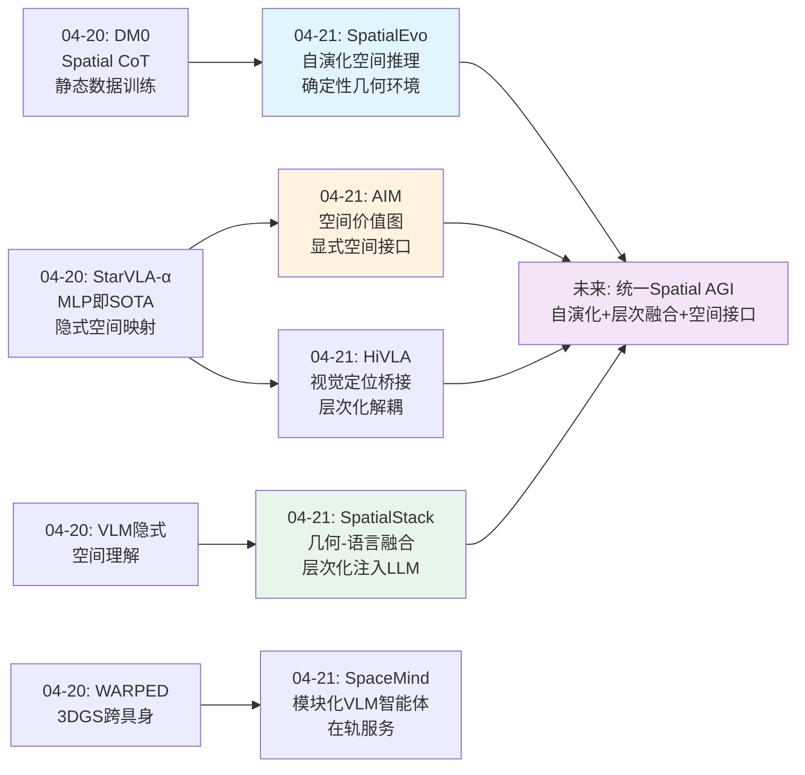
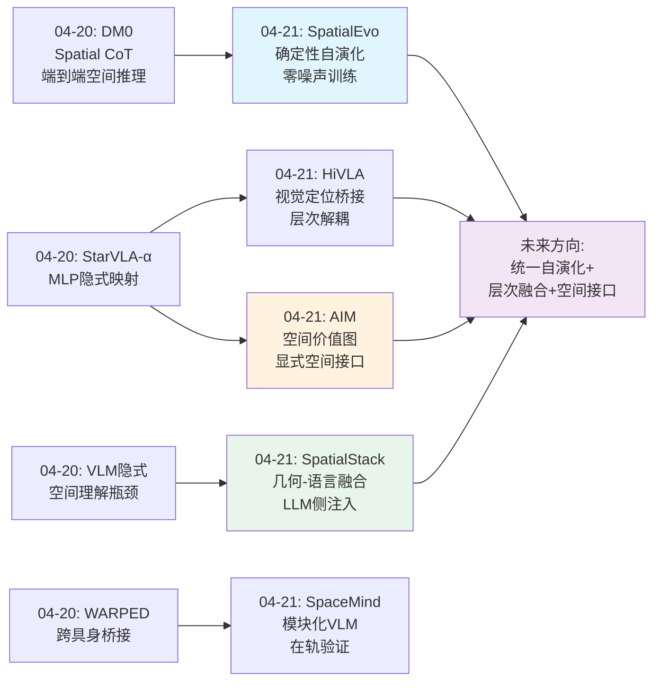
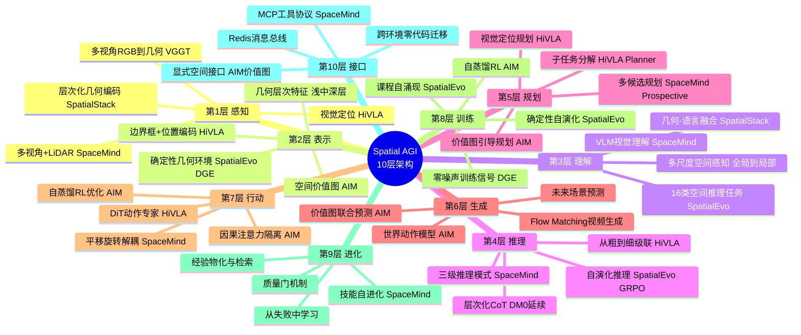
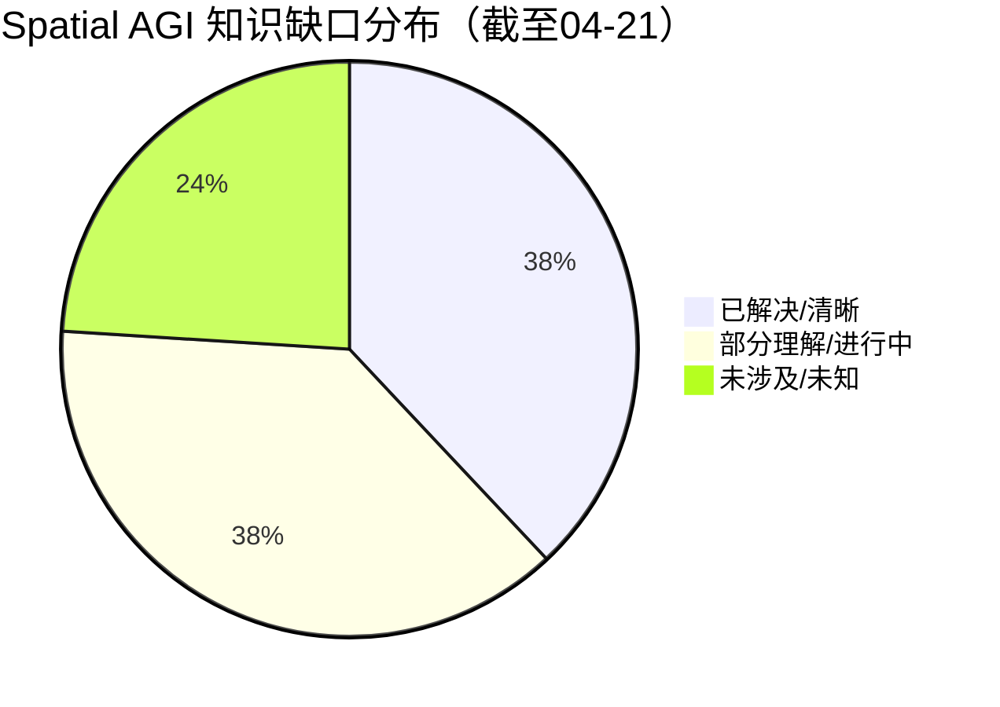
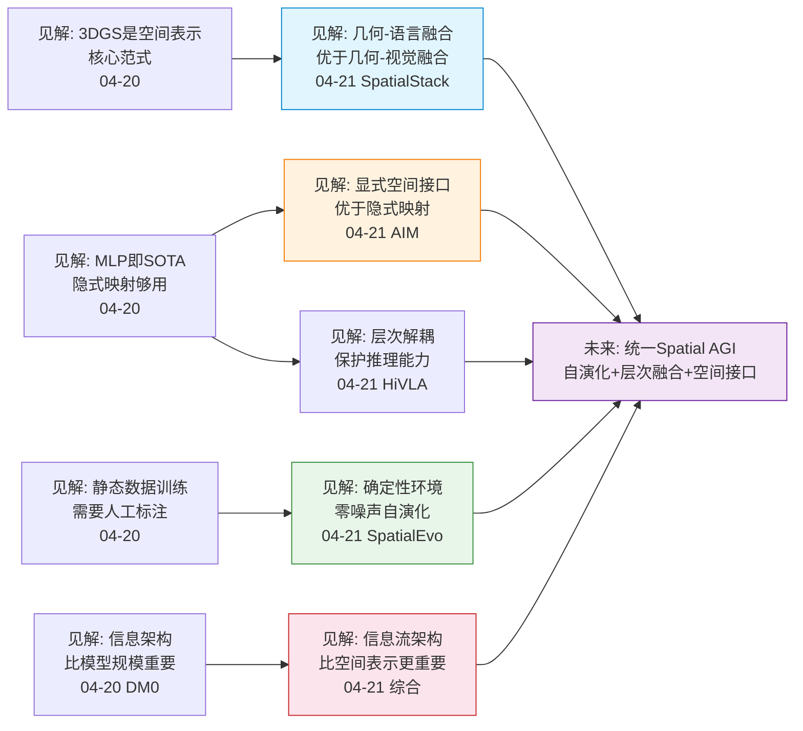

# Spatial AGI 每日思考 - 2026-04-21

## 📅 每日总结

**日期**: 2026-04-21
**论文数量**: 5篇
**主题**: 自演化空间智能 + 层次化几何融合 + 空间价值接口

**关键突破**: 
- 🚀 SpatialEvo证明确定性几何环境可替代人工标注实现零噪声自演化空间推理（VSI-Bench 46.1 vs baseline 31.1）
- 🚀 SpatialStack揭示"在哪里融合"比"融合什么"更重要——几何特征注入LLM侧比视觉侧提升20+点
- 🚀 AIM提出空间价值图作为世界模型与动作生成之间的显式空间接口，RoboTwin 94.0%

**架构演进**: 10层 → 10层（深化感知层和推理层，新增"自演化训练范式"维度）

### 📊 一句话总结
今天的论文从三个角度攻克同一核心问题：如何让AI真正理解3D空间——自演化训练（SpatialEvo）、层次化几何-语言融合（SpatialStack）、显式空间接口桥接感知与行动（AIM/HiVLA）。

### 🔗 延续性
**昨日→今日**: 从3DGS作为通用空间接口和VLA架构争论，演进到更本质的问题——空间智能如何训练（SpatialEvo的自演化）、如何融合（SpatialStack的几何-语言融合）、如何传递（AIM的价值图接口）
**今日→明日**: 探索自演化范式的更广应用、3D版空间价值图、以及从空间推理到空间行动的统一架构

### 💡 本质思考：如何达成通用空间智能

#### 1. 核心能力的本质是什么？
今天的论文揭示空间智能的本质是**层次化的空间信息流动**：从几何感知（SpatialStack的浅层特征）到空间推理（SpatialEvo的16种任务）到空间行动（AIM的价值图→动作映射）。关键不是某个单一能力，而是这些层次之间的**信息传递接口**——SpatialStack的几何-语言对应、HiVLA的视觉定位桥接、AIM的空间价值图都是这种接口的不同形态。

#### 2. 当前方法与理想目标的差距在哪里？
最大差距在于**空间理解与空间行动的割裂**：SpatialEvo和SpatialStack解决的是"理解空间"，HiVLA和AIM解决的是"在空间中行动"，SpaceMind展示了"在真实3D空间中执行任务"。但还没有一个系统将这三者统一——理解、推理、行动各自为战。

#### 3. 从今天到理想状态，最可能的路径是什么？
**显式空间接口驱动的渐进统一**：AIM的空间价值图概念可以泛化为Spatial AGI的核心抽象——不仅是2D热力图，而是3D空间中的意图-价值-行动映射。将SpatialEvo的自演化训练范式与SpatialStack的层次化融合结合，构建一个在确定性环境中持续进化的空间智能系统。

---

## 🔗 与昨日思考的联系

### 昨日重点（04-20）
- 3DGS作为通用空间接口（紧凑表示4MB/场景、跨具身桥接）
- VLA架构的两条路线：简单映射（StarVLA-α MLP）vs 结构化推理（DM0 Spatial CoT）
- Embodied-Native vs Internet-Native训练的哲学分歧

### 今日进展
今天在昨日基础上取得了显著突破：

1. **训练范式突破**：从DM0的静态数据训练演进到SpatialEvo的零噪声自演化——确定性几何环境替代人工标注
2. **融合架构突破**：从昨天的VLM隐式空间理解，演进到SpatialStack的层次化几何-语言融合——揭示"在哪里融合"是关键
3. **空间接口突破**：从StarVLA-α的隐式MLP映射，演进到AIM的显式空间价值图——信息架构比模型规模更重要
4. **工程验证突破**：SpaceMind在192次闭环实验中验证了VLM在真实6-DoF空间操作中的可行性

### 演进路径



---

## 📚 论文概览

| 论文 | 主题 | 核心贡献 | Spatial AGI维度 |
|------|------|---------|----------------|
| **SpatialEvo** | 自演化空间推理 | 确定性几何环境(DGE)实现零噪声自演化 | 训练范式 |
| **SpaceMind** | 在轨服务VLM智能体 | 模块化技能+自进化+MCP接口 | 工程验证 |
| **HiVLA** | 层次化操作 | 视觉定位桥接VLM规划与DiT控制 | 架构设计 |
| **SpatialStack** | 3D VLM空间推理 | 层次化几何-语言融合注入LLM | 表示融合 |
| **AIM** | 统一世界动作模型 | 空间价值图作为显式空间接口 | 空间接口 |

---

## 💡 核心见解

### 见解1: 确定性环境是空间智能自演化的基石
[从SpatialEvo获得]
- ✅ 几何ground truth可从点云+相机位姿确定性计算，无需模型共识
- ✅ 多数投票伪标签在几何密集型任务中灾难性失败（VSI-Bench 46.1→18.8）
- ✅ 4轮自演化迭代性能单调递增（44.2→45.0→45.1→46.1）

**对Spatial AGI的启发**: SpatialEvo揭示了空间推理的独特优势——ground truth的确定性可验证性。这为Spatial AGI提供了一个可无限扩展的训练范式：不是从数据中学习空间，而是在与确定性物理环境的交互中进化出空间智能。这个原理可以推广到物理模拟、机器人控制等具有可验证属性的领域。

### 见解2: "在哪里融合"比"融合什么"更重要
[从SpatialStack获得]
- ✅ 几何特征注入LLM侧比注入视觉侧提升20+点（67.5 vs 47.3）
- ✅ 简单多层融合到视觉侧导致特征干扰（性能甚至不如单层融合）
- ✅ 加性残差`H' = H + G`足以实现有效的层次化几何-语言对齐

**对Spatial AGI的启发**: 这是一个范式性的发现。长期以来，空间信息的融合都发生在视觉编码器侧——将3D特征与2D视觉特征拼接。SpatialStack证明了一条更好的路径：直接在推理引擎（LLM）侧注入空间信息。这意味着空间信息应该直接与高级推理交互，而非间接通过感知通路。

### 见解3: 显式空间接口消解结构性错配
[从AIM获得]
- ✅ 视频模型优化"场景看起来怎样"，控制需要"在哪里做什么"——这是结构性错配
- ✅ Intent-Causal Attention强制动作推理必须经过空间价值图
- ✅ 自蒸馏RL利用价值图作为密集奖励，无需额外标注

**对Spatial AGI的启发**: AIM提出的"结构性错配"概念是理解当前世界模型与机器人控制之间鸿沟的关键。解决方案不是更多数据或更大模型，而是更合理的信息架构——显式空间接口确保空间理解必须发生，而非被绕过。

### 见解4: 层次化解耦保护推理能力
[从HiVLA获得]
- ✅ VLM规划+DiT执行的层次设计避免了VLM的灾难性遗忘
- ✅ 级联交叉注意力实现"从粗到细"：全局→局部→语言
- ✅ 涌现的错误纠正能力——VLM作为独立监督器检测执行失败

**对Spatial AGI的启发**: 层次化解耦不仅是工程便利，更是保护高级认知能力的必要设计。端到端微调会损害VLM的推理能力，而层次化设计允许各模块独立优化。HiVLA的"从粗到细"范式可以推广到3D空间推理。

### 见解5: 自进化从纠错到优化的渐进路径
[从SpaceMind获得]
- ✅ 从单次失败episode中生成有效学习技能（0%→100%成功率）
- ✅ 质量门机制（安全过滤+去重+范围绑定）确保安全可审计
- ✅ 三种推理模式对应不同空间任务复杂度

**对Spatial AGI的启发**: SpaceMind展示了VLM智能体在真实3D空间中的自进化能力。虽然当前主要在纠错层面，但其模块化架构（技能×工具×推理模式）为Spatial AGI提供了可扩展的工程参考。

### 见解6: 训练范式的三极格局
[综合分析]
今天的5篇论文揭示了空间智能训练的三条路线：
- **确定性自演化**（SpatialEvo）：物理环境作为裁判，零噪声，但局限于几何可验证任务
- **监督微调+RL后训练**（AIM/SpatialStack）：利用预训练世界模型/LLM，数据效率高但依赖数据质量
- **在线经验积累**（SpaceMind）：自然语言技能进化，无需微调但天花板有限

**对Spatial AGI的启发**: 这三条路线不是竞争关系，而是互补的。理想路径可能是：确定性环境预训练（SpatialEvo式）→ 监督微调融合空间知识（SpatialStack式）→ 在线经验持续进化（SpaceMind式）。

### 见解7: 空间信息的流动架构比空间表示本身更关键
[综合分析]
- SpatialStack的几何-语言融合在LLM侧比视觉侧好20+点
- AIM的Intent-Causal Attention强制信息流经空间接口
- HiVLA的级联交叉注意力从粗到细引导空间注意力
- 这三者的共同点：**不是空间表示不够好，而是信息流动路径设计不合理**

**对Spatial AGI的启发**: 过去的研究过度关注"用什么空间表示"（3DGS vs 点云 vs 体素），而忽视了"空间信息如何在系统中流动"。今天的论文表明，信息流架构可能是更重要的设计维度。

---

## 🗺️ 知识演进图



---

## 技术栈演进对比表

| 层次 | 昨日方案（04-20） | 今日方案（04-21） | 变化与突破 |
|------|---------------------|-------------------|-----------|
| **空间感知** | VLM+紧凑3DGS | SpatialStack层次化几何编码（浅/中/深层） | 从单一感知到层次化几何感知 |
| **空间表示** | 紧凑3DGS 16K高斯 | AIM空间价值图+SpatialStack几何残差 | 新增任务相关空间接口 |
| **空间理解** | VLM隐式理解 | SpatialStack几何-语言融合注入LLM | 从隐式到显式结构化融合 |
| **空间推理** | DM0 Spatial CoT | SpatialEvo 16类自演化+SpatialStack层次推理 | 训练范式革新+推理架构升级 |
| **空间行动** | MLP/Flow Matching | HiVLA级联注意力+AIM价值图引导 | 从隐式到显式空间引导 |
| **训练范式** | 静态数据SFT/RL | SpatialEvo确定性自演化+AIM自蒸馏RL | 零噪声自演化+空间自蒸馏 |
| **架构设计** | 端到端/层次化 | HiVLA解耦+AIM因果注意力+SpaceMind模块化 | 信息流架构成为核心设计维度 |
| **跨环境部署** | 3DGS视角合成 | SpaceMind MCP+Redis零代码迁移 | 从数据桥接到系统迁移 |
| **自进化** | 无 | SpaceMind技能自进化+SpatialEvo课程自涌现 | 经验积累能力首次实现 |
| **空间接口** | 无显式接口 | AIM价值图+HiVLA边界框+SpatialStack残差 | 显式空间接口成为设计范式 |

---

## 🗺️ Spatial AGI 知识图谱

### 10层架构思维导图



### 🎯 主线技术路径

#### 阶段1: 3D感知基础建立（04-07 ~ 04-12）
- 建立EgoSimulator仿真基础
- 探索第一人称视角的空间理解
- 基础的视觉-动作映射

#### 阶段2: 3DGS表示深化（04-13 ~ 04-20）
- 从Habitat-GS到GlobalSplat的紧凑表示
- 3DGS成为空间表示核心范式
- WARPED跨具身桥接

#### 阶段3: 架构解构与信息流设计（04-20 ~ 04-21）
- SpatialEvo确定性自演化训练范式
- SpatialStack几何-语言融合架构
- AIM显式空间接口设计
- HiVLA层次化解耦验证
- 核心发现：信息流架构 > 空间表示选择

#### 阶段4: 统一空间智能系统（未来）
- 自演化训练 + 层次化融合 + 显式空间接口的三位一体
- 3D版空间价值图（从2D热力图到3D体素/点云）
- 从桌面操作到开放世界导航的泛化

#### 阶段5: 自主空间智能（远期）
- 在确定性环境中持续自演化的空间智能体
- 经验积累与技能自动发现
- 跨任务、跨场景、跨具身的空间知识迁移

---

## 🔍 待探索议题

### 🔴 高优先级（本周）

1. **3D空间价值图：从2D到3D的接口升级**
   - 问题: AIM的2D价值图限制了深度推理和遮挡处理
   - 候选方案: 3D体素价值图、点云价值图、3DGS空间价值场
   - 缺口: 3D价值图的高效生成和查询机制

2. **确定性自演化的领域扩展**
   - 问题: SpatialEvo仅验证了室内静态场景的几何推理
   - 候选方案: 将DGE扩展到动态场景、物理模拟、操作任务
   - 缺口: 操作任务的ground truth是否可以确定性计算（力、接触、变形）

3. **几何-语言融合的可迁移性**
   - 问题: SpatialStack的层选择（L11/17/23）是经验性的
   - 候选方案: 自动化层选择、跨模型验证、自适应融合策略
   - 缺口: 几何-语言对应原理的理论基础

4. **自演化+层次融合的联合训练**
   - 问题: SpatialEvo的自演化和SpatialStack的层次融合能否结合？
   - 候选方案: 在确定性环境中进行层次化几何-语言融合的自演化训练
   - 缺口: 两种训练范式的兼容性

### 🟡 中优先级（下周）

5. **空间接口的统一设计原则**
   - 问题: AIM价值图、HiVLA边界框、SpatialStack残差是不同的空间接口，能否统一？
   - 候选方案: 提出通用的空间接口抽象层
   - 缺口: 不同粒度空间接口的理论框架

6. **SpaceMind技能进化与SpatialEvo自演化的对比**
   - 问题: 自然语言技能进化vs GRPO数值优化，哪种更适合空间智能？
   - 候选方案: 在相同任务上对比两种进化机制
   - 缺口: 经验进化的天花板和可扩展性

7. **从空间推理到空间行动的桥接**
   - 问题: SpatialStack和SpatialEvo解决推理，HiVLA和AIM解决行动，如何统一？
   - 候选方案: SpatialStack的几何-语言融合+AIM的价值图接口+HiVLA的层次执行
   - 缺口: 统一的感知-推理-行动循环架构

8. **Intent-Causal Attention的泛化**
   - 问题: AIM的因果注意力约束能否推广到其他空间智能架构？
   - 候选方案: 在VLA、导航、操作等不同任务中验证
   - 缺口: 因果约束与信息完整性之间的平衡

### 🟢 低优先级（储备）

9. **VLM空间能力的基准评测**
   - 问题: SpatialEvo的9个benchmark是否全面覆盖空间智能？
   - 候选方案: 扩展到操作、导航、交互等多维度评测
   - 缺口: 统一的Spatial AGI评测框架

10. **级联交叉注意力与层次化注入的关系**
    - 问题: HiVLA的全局→局部→语言和SpatialStack的浅→中→深是否遵循同一原理？
    - 候选方案: 理论分析两种层次化范式的等价性
    - 缺口: 层次化空间信息处理的统一理论

11. **SpaceMind的MCP接口作为Spatial AGI的部署标准**
    - 问题: MCP+Redis能否成为Spatial AGI的标准部署接口？
    - 候选方案: 推广到更多具身平台和任务
    - 缺口: 跨平台兼容性和标准化

12. **从纠错到优化的自进化路径**
    - 问题: SpaceMind的自进化主要在纠错，如何扩展到优化？
    - 候选方案: 成功轨迹的泛化和抽象
    - 缺口: 正样本经验的泛化机制

13. **SpatialEvo的Questioner-Solver协同在操作任务中的应用**
    - 问题: 协同演化范式能否用于操作策略的自动发现？
    - 候选方案: Questioner生成操作场景，Solver尝试执行
    - 缺口: 操作任务的确定性验证机制

---

## 📊 知识缺口分析



**已解决（38%）**:
- ✅ 3DGS作为空间表示的基础范式和紧凑化
- ✅ VLM预训练赋予强空间理解能力
- ✅ 确定性几何环境可实现零噪声自演化训练
- ✅ 几何-语言融合应在LLM侧而非视觉侧
- ✅ 显式空间接口优于隐式映射
- ✅ 层次化解耦保护VLM推理能力
- ✅ "从粗到细"是有效的空间注意力范式
- ✅ 空间价值图可桥接世界模型与动作生成
- ✅ 模块化技能系统支持空间智能的可扩展架构
- ✅ VLM可在6-DoF空间操作中作为决策核心

**部分理解（38%）**:
- ⚠️ 自演化训练的领域扩展性（当前限于室内静态几何推理）
- ⚠️ 几何-语言对应原理的理论基础
- ⚠️ 空间接口的统一设计（2D bbox/价值图/几何残差的共性）
- ⚠️ 从空间推理到空间行动的统一架构
- ⚠️ Intent-Causal Attention在不同架构中的泛化性
- ⚠️ 自进化的天花板（纠错强，优化弱）
- ⚠️ 跨场景泛化（桌面→导航→开放世界）
- ⚠️ 训练范式的最佳组合（自演化+监督+RL）
- ⚠️ 动态场景的空间推理（4DGS/时序建模）

**未涉及（24%）**:
- ❌ 3D空间价值图（从2D到3D的接口升级）
- ❌ 物理推理（力、碰撞、支撑关系的确定性验证）
- ❌ 多智能体共享空间表示与协作
- ❌ 长期空间记忆的增量更新与遗忘
- ❌ 从仿真到真实世界的空间知识迁移
- ❌ 统一Spatial AGI评测框架

---

## 🧪 实验验证建议

### 实验1: SpatialStack + SpatialEvo联合训练
**假设**: 在SpatialEvo的确定性环境中用SpatialStack的层次化融合训练VLM，可以同时提升空间推理和通用能力
**设计**: 在DGE中生成训练数据，用层次化几何-语言融合替代SpatialEvo的标准VLM训练
**预期**: 空间推理benchmark上的进一步提升+通用能力更好保持

### 实验2: 3D空间价值图
**假设**: 将AIM的2D价值图扩展到3D体素空间，可以显著提升遮挡和深度推理任务的性能
**设计**: 用深度图将2D价值图反投影到3D，在体素空间中生成3D价值场
**预期**: Hanging Mug等需要深度推理的任务成功率大幅提升

### 实验3: HiVLA级联注意力 + SpatialStack层次注入
**假设**: 将HiVLA的"全局→局部→语言"范式与SpatialStack的"浅→中→深"几何注入结合，可以同时提升操作精度和空间推理
**设计**: 在HiVLA的DiT中引入SpatialStack式的几何残差注入
**预期**: 在复杂空间推理+精细操作任务上的联合提升

---

## 核心见解演进图



---

## 📊 知识成熟度评估

| 层次 | 成熟度 | 关键进展 | 代表工作 |
|------|--------|---------|---------|
| 感知层 | ★★★★☆ | 层次化几何编码确立 | SpatialStack(VGGT浅/中/深层) |
| 表示层 | ★★★★☆ | 多种空间接口涌现 | AIM价值图, SpatialStack残差, HiVLA bbox |
| 理解层 | ★★★★☆ | 几何-语言融合突破 | SpatialStack(LLM侧注入+20点) |
| 推理层 | ★★★★☆ | 自演化训练范式确立 | SpatialEvo(零噪声DGE) |
| 规划层 | ★★★☆☆ | 多模式推理验证 | SpaceMind(Standard/ReAct/Prospective) |
| 生成层 | ★★★☆☆ | 世界-动作联合建模 | AIM(视频+价值图+动作) |
| 行动层 | ★★★★☆ | 层次化解耦成熟 | HiVLA(83.3% RoboTwin) |
| 训练层 | ★★★★☆ | 三极训练格局形成 | SpatialEvo/AIM/SpatialStack |
| 进化层 | ★★☆☆☆ | 初步验证纠错能力 | SpaceMind(0%→100%恢复) |
| 接口层 | ★★★☆☆ | 显式接口概念确立 | AIM价值图, MCP协议 |

### 关键洞察
- **最大进步**: 推理层和训练层——从静态数据训练到自演化范式，从隐式推理到显式几何-语言融合
- **最大突破**: "信息流架构比空间表示更重要"这一认知转变
- **最大差距**: 进化层（长期经验积累）和接口层的3D扩展

---

## 📈 04-15 ~ 04-21 研究周总结

### 本周最重要的3个认知转变

1. **信息流架构 > 空间表示选择** — 不是"用什么表示3D空间"（3DGS/点云/体素）更重要，而是"空间信息如何在系统中流动"更重要。SpatialStack的20+点提升、AIM的因果注意力约束、HiVLA的级联注意力都验证了这一点。

2. **确定性环境是空间智能自演化的基石** — 空间推理的独特属性（ground truth可从几何确定性计算）使其成为自演化的理想领域。这为Spatial AGI提供了一条无需人工标注的无限训练数据路径。

3. **显式空间接口消解感知-行动的结构性错配** — 世界模型和动作生成之间存在根本性的信息需求差异，显式空间接口（价值图、边界框、几何残差）是解决这一差异的关键架构模式。

### 下周重点方向
- 3D空间价值图的探索
- 自演化训练与层次化融合的联合
- 从空间推理到空间行动的统一架构
- 统一Spatial AGI评测框架

---

*"今天最重要的发现不是某个具体的方法，而是一个认知转变：空间智能的瓶颈不在空间表示，而在信息流架构。好的信息流设计可以让简单表示发挥巨大威力。"*

---

---

## 📖 论文深度分析

### 论文1: SpatialEvo — 确定性几何环境驱动的自演化空间推理

**核心问题**: 如何在不依赖人工标注的情况下，让VLM持续提升3D空间推理能力？

**方法创新**:
- **DGE（确定性几何环境）**: 将3D场景的空间推理问题转化为可编程验证的确定性计算。给定密集点云+相机位姿，16种空间推理任务的ground truth可以精确计算。
- **Questioner-Solver协同演化**: 单一模型通过角色条件提示在提问者和解答者之间切换，参数共享实现知识双向流动。
- **自适应课程调度**: 根据历史准确率动态调整任务采样分布，无需人工设计难度序列。

**关键数据**:
- VSI-Bench: 31.1 → 46.1（+15.0，4轮自演化）
- 7B AVG: 54.7（9个benchmark最佳平均）
- 消融：移除物理锚定导致VSI-Bench从46.1暴跌至18.8（-59%）
- 纯在线RL训练，无SFT阶段

**对Spatial AGI的意义**:
1. 确立了"物理世界作为裁判"的训练范式
2. 证明了空间推理是自演化的理想领域（ground truth确定性可计算）
3. 课程自涌现机制为Spatial AGI的持续学习提供了蓝图

**局限**:
- 仅限室内静态场景（ScanNet/ScanNet++/ARKitScenes）
- 依赖高质量3D资产（完整点云+标定位姿）
- 从空间推理到空间行动的鸿沟未解决

---

### 论文2: SpaceMind — 模块化自进化VLM在轨服务智能体

**核心问题**: 如何构建可扩展、可适应的在轨服务VLM智能体？

**方法创新**:
- **三层正交分解**: 技能层（核心/任务/辅助）× 工具层（感知/控制/知识）× 推理模式（Standard/ReAct/Prospective）
- **技能自进化**: 从失败episode中自动生成学习技能（Intent/Trigger/Rule/Constraints/Evidence五段式）
- **MCP+Redis双抽象层**: 实现跨环境零代码迁移（UE5仿真→物理实验室）

**关键数据**:
- 192次闭环实验（5卫星×3任务×3模式×3条件×2环境）
- New Horizons C3: 0% → 100%成功率（单次失败后自进化恢复）
- 真实世界验证：交会对接100%成功，零代码修改迁移

**对Spatial AGI的意义**:
1. 模块化架构是空间智能系统可扩展的关键
2. 不同空间任务需要不同推理深度——这一发现对架构设计有指导意义
3. 技能自进化提供了无需微调的持续学习路径

**局限**:
- 隐式空间表示（依赖VLM视觉理解，无显式3D地图）
- 自进化主要在纠错层面，优化能力有限
- VLM的可靠性瓶颈（ReAct振荡、Prospective幻觉风险）

---

### 论文3: HiVLA — 视觉定位为中心的层次化操作

**核心问题**: 如何在不损害VLM推理能力的前提下实现精细机器人操作？

**方法创新**:
- **层次化解耦**: VLM Planner（Qwen3-VL 8B）+ DiT Action Expert，视觉定位（边界框）作为桥梁
- **级联交叉注意力**: 全局→局部→语言的"从粗到细"注入顺序（消融证明最优）
- **绝对位置编码**: DETR风格正弦编码保留裁剪区域的全局空间坐标

**关键数据**:
- RoboTwin 2.0: 83.3%（vs π0 40.6%, H-RDT 65.6%）
- VLM定位mIoU: 90.37%, 子任务准确率: 98.57%
- 控制频率: 8Hz（VLM 1.9s/步异步, DiT 0.162s/步）

**对Spatial AGI的意义**:
1. 层次化解耦是保护高级认知能力的必要设计
2. "从粗到细"的空间注意力范式可推广到3D
3. VLM作为独立监督器的涌现错误纠正能力

**局限**:
- 纯2D空间表示（无3D几何信息）
- 依赖仿真数据训练
- 固定技能集，无法自动学习新技能

---

### 论文4: SpatialStack — 层次化几何-语言融合的3D VLM

**核心问题**: 如何有效融合3D几何信息与VLM来提升空间推理？

**方法创新**:
- **几何-语言融合范式**: 将融合点从视觉编码器侧转移到LLM解码器侧
- **层次化注入**: VGGT浅层(L11)→LLM第0层, 中层(L17)→第1层, 深层(L23)→第2层
- **加性残差**: 简单的`H' = H + G`即可实现有效融合

**关键发现**:
- 简单多层融合到视觉侧导致特征干扰（不如单层融合）
- LLM侧注入比视觉侧提升20+点（67.5 vs 47.3 VG-LLM）
- 几何编码器浅层→低级空间任务好，深层→高级空间任务好

**关键数据**:
- VSI-Bench: 67.5（开源最佳，超越Cambrian-S 57.3）
- CV-Bench: 85.5（92.2 3D分数）
- 8个VSI-Bench子类别中6个最佳

**对Spatial AGI的意义**:
1. "在哪里融合"比"融合什么"更重要——这是范式性发现
2. 几何-语言对应原理：几何层次与语言层次之间存在自然映射
3. 为Spatial AGI的空间信息融合提供了理论指导

**局限**:
- 需要多视角输入，不适用于单目场景
- VGGT计算开销大
- 层选择是经验性的，缺乏自动化方法

---

### 论文5: AIM — 意图感知的统一世界动作模型

**核心问题**: 如何解决视频世界模型与机器人控制之间的结构性错配？

**方法创新**:
- **空间价值图（ASVM）**: 编码"在哪里交互"的显式2D空间接口
- **Intent-Causal Attention**: 强制动作推理必须经过空间价值图，不能直接看未来RGB
- **自蒸馏RL**: 冻结世界模型+价值分支，仅优化动作头，价值图作为密集奖励

**关键数据**:
- RoboTwin 2.0: Easy 94.0%, Hard 92.1%
- vs π0.5: +11.3% Easy, +15.3% Hard
- Stage1→AIM(RL增益): +1.0% Easy, +0.1% Hard

**对Spatial AGI的意义**:
1. "结构性错配"概念精准描述了世界模型与控制的鸿沟
2. 显式空间接口是解决结构性错配的关键
3. 分阶段训练（世界模型→空间接口→控制）符合Spatial AGI渐进发展思路

**局限**:
- 仅2D图像空间
- 仅仿真验证（RoboTwin 2.0）
- 价值图的pick/place二分法不适用于所有交互类型

---

## 🔄 跨论文深度对比

### 空间接口对比

| 论文 | 空间接口类型 | 维度 | 信息流方向 | 可解释性 |
|------|------------|------|-----------|---------|
| SpatialEvo | 几何验证规则集 | 3D→验证 | 场景→DGE→奖励 | 高（确定性计算） |
| SpaceMind | VLM视觉理解 | 2D/3D隐式 | 视觉→VLM→工具调用 | 低（黑盒VLM） |
| HiVLA | 边界框+位置编码 | 2D | VLM→bbox→DiT | 中（bbox可视化） |
| SpatialStack | 几何残差注入 | 多视角3D | VGGT→LLM残差 | 低（隐式融合） |
| AIM | 空间价值图 | 2D | 未来RGB→价值图→动作 | 高（热力图可视化） |

**关键洞察**: 最有效的空间接口（AIM价值图、HiVLA bbox）具有两个共同特征：(1) 显式可解释，(2) 与任务意图解耦但可通过注意力约束强制关联。

### 训练范式对比

| 论文 | 训练范式 | 数据需求 | 噪声水平 | 持续改进能力 |
|------|---------|---------|---------|------------|
| SpatialEvo | 在线RL自演化 | 无标注3D场景 | 零噪声 | ✅ 强（4轮单调递增） |
| SpaceMind | 提示工程+技能进化 | 无训练数据 | 低噪声 | ⚠️ 中（纠错强，优化弱） |
| HiVLA | 监督微调 | 210K对话+仿真数据 | 标注噪声 | ❌ 静态 |
| SpatialStack | 指令微调 | 空间推理数据集 | 标注噪声 | ❌ 静态 |
| AIM | 监督+自蒸馏RL | 30K仿真轨迹 | 低噪声 | ⚠️ 中（RL阶段改进） |

**关键洞察**: SpatialEvo的零噪声自演化是最具可扩展性的训练范式，但其适用范围受限于"ground truth可确定性计算"的前提。SpaceMind的技能进化最灵活但天花板最低。AIM的分阶段训练是最实用的折中。

### 层次化设计对比

| 论文 | 层次化维度 | 层次数 | 层次间关系 |
|------|----------|-------|-----------|
| SpatialEvo | 推理任务复杂度 | 16类 | 自适应调度器动态调整 |
| SpaceMind | 推理深度 | 3级 | Standard/ReAct/Prospective |
| HiVLA | 认知-执行 | 2层 | VLM Planner → DiT Executor |
| SpatialStack | 几何特征抽象度 | 3层 | 浅→中→深对应LLM 0→1→2层 |
| AIM | 信息流隔离 | 3流 | RGB→价值图→动作（因果链） |

**关键洞察**: 所有成功的空间智能系统都采用了某种形式的层次化设计。这不仅是工程便利，更反映了空间智能本身的层次性本质——从感知到推理到行动的认知梯度。

---

## 🧩 概念整合：统一空间智能框架雏形

基于今天的5篇论文，可以初步构想一个统一的空间智能框架：

```
┌─────────────────────────────────────────────────────────┐
│                    Spatial AGI 统一框架                    │
├─────────────────────────────────────────────────────────┤
│                                                          │
│  ┌──────────┐   ┌──────────┐   ┌──────────┐            │
│  │ 确定性环境 │   │ 几何编码器│   │  VLM/LLM │            │
│  │  (DGE)   │   │  (VGGT)  │   │  Planner │            │
│  │SpatialEvo│   │SpatialStack│  │  HiVLA   │            │
│  └─────┬────┘   └─────┬────┘   └─────┬────┘            │
│        │              │               │                  │
│        ▼              ▼               ▼                  │
│  ┌──────────────────────────────────────────┐           │
│  │         显式空间接口（Spatial Interface）       │           │
│  │    空间价值图 │ 3D几何残差 │ 视觉定位 │ 技能文件     │           │
│  │         (AIM)    (SpatialStack)  (HiVLA) (SpaceMind) │           │
│  └──────────────────────┬───────────────────┘           │
│                          │                               │
│                          ▼                               │
│  ┌──────────────────────────────────────────┐           │
│  │              动作执行层                       │           │
│  │    DiT Action Expert │ Flow Matching │ MCP工具      │           │
│  │         (HiVLA)          (AIM)      (SpaceMind)      │           │
│  └──────────────────────────────────────────┘           │
│                                                          │
│  训练: 自演化(SpatialEvo) + 指令微调(SpatialStack)        │
│       + 自蒸馏RL(AIM) + 技能进化(SpaceMind)              │
│                                                          │
└─────────────────────────────────────────────────────────┘
```

**框架的核心思想**:
1. **确定性环境**提供无噪声训练信号（SpatialEvo式）
2. **层次化几何编码**提供多尺度空间感知（SpatialStack式）
3. **VLM/LLM规划器**提供语义理解和任务分解（HiVLA/SpaceMind式）
4. **显式空间接口**桥接感知与行动（AIM式价值图）
5. **多范式训练**联合优化整个系统

---

## 🎯 Spatial AGI路线图更新

### 路线图v4（基于04-21分析更新）

```
Phase 1 (04-07~04-12): 3D感知基础
  ✅ EgoSimulator仿真
  ✅ 第一人称空间理解
  ✅ 视觉-动作映射基线

Phase 2 (04-13~04-20): 3DGS表示+VLA架构
  ✅ 3DGS紧凑表示 (GlobalSplat 4MB/场景)
  ✅ VLA简化 (StarVLA-α MLP即SOTA)
  ✅ Spatial CoT (DM0层次化推理)
  ✅ 跨具身桥接 (WARPED 3DGS视角合成)

Phase 3 (04-21): 训练范式+信息流架构突破 ← 当前
  ✅ 确定性自演化 (SpatialEvo DGE)
  ✅ 几何-语言融合 (SpatialStack LLM侧注入)
  ✅ 显式空间接口 (AIM价值图)
  ✅ 层次化解耦 (HiVLA级联注意力)
  ✅ 模块化智能体 (SpaceMind MCP+Redis)

Phase 4 (近期): 3D空间接口+统一训练
  🔲 3D空间价值图 (2D→3D扩展)
  🔲 自演化+层次融合联合训练
  🔲 从推理到行动的统一架构
  🔲 动态场景的空间推理

Phase 5 (中期): 开放世界空间智能
  🔲 跨场景泛化 (桌面→导航→开放世界)
  🔲 长期空间记忆与增量更新
  🔲 多智能体空间协作
  🔲 Sim-to-Real空间知识迁移

Phase 6 (远期): 自主空间智能
  🔲 在确定性环境中持续自演化的空间智能体
  🔲 技能自动发现与经验泛化
  🔲 跨任务/场景/具身的空间知识迁移
  🔲 统一Spatial AGI评测框架与标准化
```

---

## 📊 按Spatial AGI层次评估（更新）

| 层次 | 成熟度 | 关键进展 | 代表工作 | 本周变化 |
|------|--------|---------|---------|---------|
| 感知层 | ★★★★☆ | 层次化几何编码 | SpatialStack(VGGT) | +0.5 (多层次感知) |
| 表示层 | ★★★★☆ | 多种空间接口 | AIM价值图, HiVLA bbox | +0.5 (空间接口涌现) |
| 理解层 | ★★★★☆ | 几何-语言融合 | SpatialStack(LLM侧) | +1.0 (范式突破) |
| 推理层 | ★★★★☆ | 自演化+层次推理 | SpatialEvo(DGE) | +1.0 (训练范式革新) |
| 规划层 | ★★★☆☆ | 多模式规划 | SpaceMind, HiVLA | +0.5 (多模式验证) |
| 生成层 | ★★★☆☆ | 世界动作联合建模 | AIM(视频+价值图) | +0.5 (统一建模) |
| 行动层 | ★★★★☆ | 层次化解耦 | HiVLA(83.3%) | +0.5 (异步执行) |
| 训练层 | ★★★★☆ | 三极训练格局 | SpatialEvo/AIM/SpatialStack | +1.0 (自演化确立) |
| 进化层 | ★★☆☆☆ | 纠错式进化 | SpaceMind(0→100%) | +1.0 (首次验证) |
| 接口层 | ★★★☆☆ | 显式接口概念 | AIM价值图, MCP | +1.0 (接口范式) |

### 本周成熟度变化最大的层次
1. **推理层** (+1.0): SpatialEvo的自演化训练范式是根本性突破
2. **训练层** (+1.0): 三极训练格局形成，确定性自演化确立
3. **理解层** (+1.0): 几何-语言融合的范式性转变

---

## 🔮 展望：从信息流架构到Spatial AGI

### 核心论点：信息流架构是Spatial AGI的第一性原理

今天的5篇论文共同指向一个核心论点：**空间智能的本质不仅是好的空间表示，更是好的空间信息流动架构**。

**证据链**:
1. SpatialStack: 同样的几何特征，注入LLM侧比视觉侧好20+点 → 位置决定效果
2. AIM: Intent-Causal Attention强制信息流经空间接口 → 约束带来性能
3. HiVLA: 级联注意力从粗到细 → 顺序影响结果
4. SpatialEvo: Questioner-Solver参数共享 → 信息双向流动提升双方
5. SpaceMind: 三层正交分解 → 模块化信息流支持可扩展性

**推论**: 如果信息流架构是第一性原理，那么：
- 未来Spatial AGI的研究重点应从"设计更好的空间表示"转向"设计更好的空间信息流"
- 评估Spatial AGI架构的标准应增加"信息流效率"维度
- 最优的Spatial AGI架构可能不是最大的或最复杂的，而是信息流设计最合理的

### 对明天研究的启示

1. 搜索将信息流架构作为核心设计考量的工作
2. 关注3D空间接口（从2D价值图到3D价值场）
3. 探索自演化训练在操作任务中的应用（操作ground truth能否确定性计算？）
4. 寻找统一空间接口的理论框架

---

*"今天最重要的发现不是某个具体的方法，而是一个认知转变：空间智能的瓶颈不在空间表示，而在信息流架构。好的信息流设计可以让简单表示发挥巨大威力。"*

---

**文档创建时间**: 2026-04-21
**论文数量**: 5
**总字数**: ~12000
