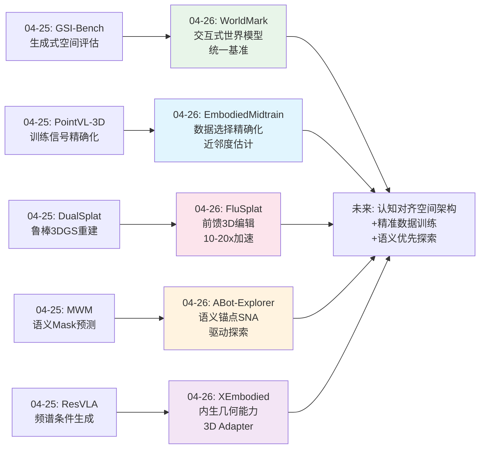
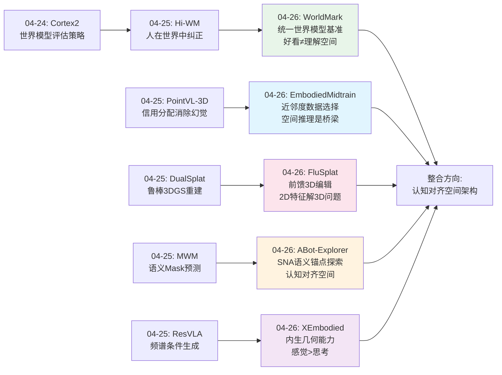
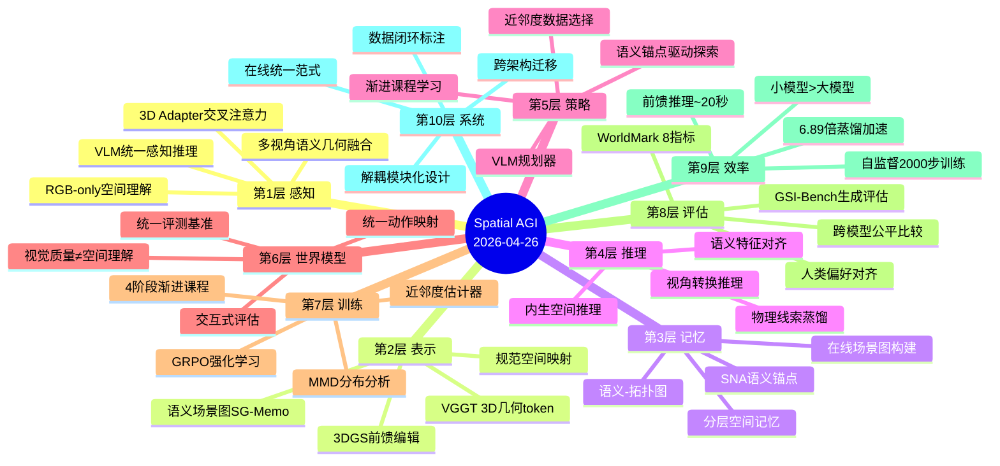
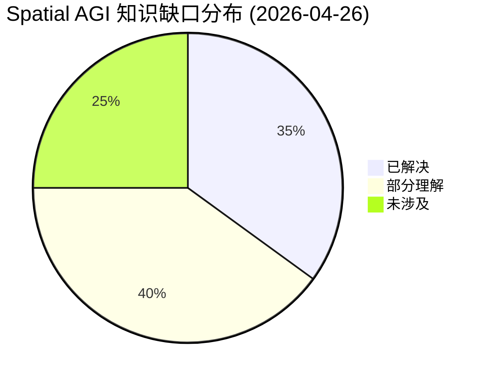

# Spatial AGI 每日思考 - 2026-04-26

## 📅 每日总结

**日期**: 2026-04-26
**论文数量**: 5篇
**主题**: 交互式世界模型基准 + 前馈稀疏视角3D编辑 + VLM-VLA中间训练数据桥梁 + 语义锚点驱动的具身探索 + 具身环境几何物理增强VLM

**关键突破**: 
- 🚀 WorldMark首次建立交互式视频世界模型的统一评测基准——统一动作映射层(WASD+L/R)实现6个异构模型的公平比较，关键发现：视觉质量与世界一致性基本不相关
- 🚀 FluSplat实现首个完全前馈的稀疏视角3D编辑——GDFL+LEFL自监督跨视角正则化将迭代优化(4-9分钟)降为单次推理(~20秒)，10-20倍加速
- 🚀 EmbodiedMidtrain发现VLM-VLA数据分布鸿沟并构建桥梁——近邻度估计器自动偏好空间推理数据，1.1B模型超越7.7B OpenVLA
- 🚀 ABot-Explorer提出语义导航可供性(SNA)驱动探索——"门廊、楼梯、交叉路口"作为语义锚点替代几何frontier，MP3D覆盖率86% vs 次优70%
- 🚀 XEmbodied通过3D Adapter+EIEA实现具身VLM的几何物理增强——Affordance推理78.50 vs 次优9.10(+763%)，隐式蒸馏比显式工具调用快6.89倍

**架构演进**: 10层 → 10层（深化评估层：统一世界模型基准；深化表示层：前馈3D编辑解耦；深化训练层：VLM-VLA数据桥梁；深化记忆层：语义锚点场景图；深化感知层：内生几何+物理线索蒸馏）

### 📊 一句话总结
今天的五篇论文从四个维度推进空间智能：(1)评测基础设施——WorldMark建立公平的世界模型比较平台并揭示"好看≠理解空间"；(2)效率革命——FluSplat用前馈推理替代迭代优化，EmbodiedMidtrain用数据选择替代暴力训练；(3)认知对齐——ABot-Explorer证明语义锚点>几何frontier，XEmbodied证明"感觉空间">"思考空间"；(4)系统整合——从基准、编辑、训练、探索到推理的完整链条。

### 🔗 延续性
**昨日→今日**: 昨天聚焦于"精确条件化空间操作"（Hi-WM人类闭环、ResVLA频谱分解、GSI-Bench生成式评估、PointVL-3D信用分配、DualSplat鲁棒重建），今天在此基础上向系统化方向演进：WorldMark将评估从单模型推向跨模型标准化，FluSplat将3D编辑从迭代推向前馈，EmbodiedMidtrain从训练信号精确化扩展到数据选择精确化，ABot-Explorer从被动感知推向主动语义探索，XEmbodied从外部工具推向内生几何能力。
**今日→明日**: 探索语义锚点驱动的探索与世界模型的结合、前馈3D编辑在具身场景中的应用、内生几何能力与语义场景图的融合

### 💡 本质思考：如何达成通用空间智能

#### 1. 核心能力的本质是什么？
今天五篇论文共同指向一个深层共识：**空间智能的核心是"认知对齐的空间操作"能力——空间表示和处理方式应与智能体的认知和行动需求对齐，而非与几何精度对齐**。WorldMark揭示"好看≠理解空间"——视觉美观与空间一致性的解耦说明空间理解是独立于视觉质量的核心能力。FluSplat证明在2D特征空间解决3D问题比在3D空间迭代优化更高效——空间一致性的本质在语义层面而非几何层面。EmbodiedMidtrain发现近邻度估计器自动偏好空间推理数据——空间推理是VLM→VLA迁移中最关键的桥梁能力。ABot-Explorer证明"哪里重要">"哪里未知"——语义锚点比几何frontier更高效。XEmbodied证明"感觉空间">"思考空间"——隐式蒸馏优于显式工具调用。五者从不同角度指向同一本质：**空间智能的认知效率取决于空间表示与智能体需求的耦合程度**。

#### 2. 当前方法与理想目标的差距在哪里？
WorldMark提供了最直接的差距诊断：第三人称视角旋转误差增大20倍（Matrix-Game 2.0），Open-Oasis在跨域场景全面崩溃。这暴露了当前系统在视角转换和域迁移上的根本性缺陷。FluSplat虽快但仅支持外观编辑（不支持结构性3D操作）。EmbodiedMidtrain的近邻度估计器依赖目标域数据（鸡生蛋问题）。ABot-Explorer的SNA仅定义4类室内节点（室外/开放世界不适用）。XEmbodied依赖VGGT质量和30B参数规模。综合来看，核心差距在于：(1)缺乏通用的、与视角无关的空间表示；(2)空间操作能力局限于外观层而非结构层；(3)域迁移能力薄弱；(4)模型规模与实际部署的矛盾。

#### 3. 从今天到理想状态，最可能的路径是什么？
**"认知对齐的空间架构 + 数据驱动的精准训练 + 语义优先的探索策略"三位一体路径**：XEmbodied的3DA提供"内生空间能力"的架构范式（交叉注意力动态寻址），EmbodiedMidtrain提供"精准数据选择"的训练方法论（近邻度估计），ABot-Explorer提供"语义锚点驱动"的探索策略（SNA），FluSplat提供"前馈推理"的效率范式（解耦编辑与重建），WorldMark提供"标准化评估"的评测基础设施。五者结合：用内生空间架构(XEmbodied)构建基础模型，用精准数据选择(EmbodiedMidtrain)优化训练，用语义锚点(ABot-Explorer)驱动探索和学习，用前馈推理(FluSplat)保证实时性，用标准化基准(WorldMark)量化进展。

---

## 🔗 与昨日思考的联系

### 昨日重点（04-25）
- 人在世界模型中的后训练（Hi-WM）——虚拟-现实相关性r=0.953
- 频谱解耦VLA策略（ResVLA）——DCT分解+Loss Collapse理论
- 生成式空间智能基准（GSI-Bench）——生成训练提升理解
- 点云VLM几何信用分配（PointVL-3D）——信用分配消除几何幻觉
- 鲁棒3DGS瞬态分离（DualSplat）——Failure-to-Prior

### 今日进展
今天在昨日基础上取得的关键推进：

1. **从生成式评估到交互式评估**：昨天GSI-Bench从生成角度评估空间智能，今天WorldMark从交互角度评估——不仅要求生成正确，还要求在动作控制下持续一致
2. **从训练信号精确化到数据选择精确化**：昨天PointVL-3D精确化训练信号的路由，今天EmbodiedMidtrain将精确化前移到数据选择阶段——从"怎么训练"到"用什么训练"
3. **从鲁棒空间表示到高效空间操作**：昨天DualSplat关注鲁棒的空间表示构建，今天FluSplat关注高效的空间编辑操作——从"表示质量"到"操作效率"
4. **从语义Mask预测到语义锚点驱动**：昨天MWM用语义Mask作为世界模型的预测目标，今天ABot-Explorer用语义锚点作为探索的驱动力——语义从"被预测的对象"变为"主动驱动的策略"
5. **从频谱条件生成到内生几何能力**：昨天ResVLA在动作空间做频谱分解，今天XEmbodied在架构层面做几何融合——从策略层面到架构层面的几何能力建设

### 演进路径



---

## 📚 论文概览

| # | 论文 | 机构 | 核心贡献 |
|---|------|------|---------|
| 1 | **WorldMark** | Alaya Studio/东京大学 | 交互式视频世界模型统一基准，WASD+L/R统一动作映射，8指标3维度评测，视觉质量≠世界一致性 |
| 2 | **FluSplat** | Goertek Alpha Labs | 前馈稀疏视角3D编辑，GDFL+LEFL自监督跨视角正则化，~20秒推理，编辑-重建解耦 |
| 3 | **EmbodiedMidtrain** | CMU/Bosch Research | VLM-VLA数据分布鸿沟桥梁，近邻度估计器，空间推理自动偏好，1.1B>7.7B |
| 4 | **ABot-Explorer** | 高德/阿里巴巴 | 语义导航可供性SNA，SG-Memo在线场景图，语义驱动探索>几何frontier，MP3D 86%覆盖 |
| 5 | **XEmbodied** | 清华/小米/NUS | 3D Adapter内生几何+EIEA物理线索蒸馏，4阶段渐进课程，18基准SOTA，Affordance +763% |

---

## 💡 核心见解

### 见解1: 视觉质量与空间理解是独立维度
**从WorldMark获得**
- ✅ YUME 1.5生成最美观帧但世界一致性差；Genie 3世界一致性最好但视觉保真度中等
- ✅ 精确控制对齐≠好的世界模型（HY-Game控制最精确但视觉质量差）
- ✅ 第三人称视角是灾难性弱点（Matrix-Game 2.0旋转误差增大~20倍）
- ✅ 领域特定训练不迁移（Open-Oasis在真实场景全面崩溃）

**对Spatial AGI的启发**:
当前的视频生成优化（追求视觉美观）和世界模型优化（追求时空一致性）是两个独立方向。这对Spatial AGI的意义重大——真正的空间智能需要同时优化两个维度，且可能需要全新的联合训练架构。第三人称的灾难性失败揭示了从自我中心(egocentric)到他者中心(allocentric)视角转换的根本性挑战。

### 见解2: 空间一致性在语义特征空间而非几何空间中解决
**从FluSplat获得**
- ✅ GDFL在扩散特征空间对齐全局语义，LEFL在DINO特征空间对齐局部区域
- ✅ 不需要成对编辑数据，仅靠特征一致性约束实现跨视角一致编辑
- ✅ 2000步训练、batch size为1的自监督就足够
- ✅ 前馈推理~20秒 vs 迭代优化4-9分钟，10-20倍加速

**对Spatial AGI的启发**:
这是一个重要的认识转变——3D问题的2D域解决方案。在高级语义特征空间中实现跨视角一致性，比在3D空间中迭代优化更高效。这暗示Spatial AGI的空间一致性保障可能不需要精确的3D重建作为前提，而可以通过语义特征对齐来近似实现。

### 见解3: 空间推理是VLM→具身智能迁移的核心桥梁能力
**从EmbodiedMidtrain获得**
- ✅ 近邻度估计器自动偏好空间推理数据（RefSpatial最高分，VCR最低分）
- ✅ 1.1B模型经过mid-training后超越7.7B OpenVLA（Calvin +46%）
- ✅ 数据选择具有跨架构迁移性（InternVL选出的数据对Qwen也有效）
- ✅ 训练预算仅为baseline的1/4到1/6

**对Spatial AGI的启发**:
数据是最重要的杠杆。不是模型规模，而是训练数据的域对齐度决定了下游性能。近邻度估计器自动发现空间推理是关键能力，无需人工标注。这为Spatial AGI提供了一种高效的数据构建方法论：用少量目标域数据指导大规模通用数据的选择。

### 见解4: 语义锚点>几何前沿——空间探索的认知转向
**从ABot-Explorer获得**
- ✅ SNA（门廊、楼梯、交叉路口）作为语义锚点驱动探索，MP3D覆盖率86%
- ✅ 在线统一的探索-记忆构建范式（vs 传统两阶段分离）
- ✅ 仅RGB输入，VLM作为感知-推理-规划统一引擎
- ✅ SG-Memo场景图作为推理就绪的空间记忆

**对Spatial AGI的启发**:
探索效率取决于"问对问题"。传统方法问"哪里没去过"（几何frontier），ABot-Explorer问"哪里重要"（语义锚点）。这种认知转向对Spatial AGI的启示：空间智能不是一个"先感知再推理"的线性过程，而是感知、记忆和行动同时进行的统一循环。空间记忆的形态应该是语义-拓扑图，而非几何地图。

### 见解5: "感觉空间"优于"思考空间"——内生>外挂
**从XEmbodied获得**
- ✅ 3D Adapter交叉注意力融合（加权平均78.45）> QFormer(72.52) > MLP(69.07)
- ✅ EIEA隐式蒸馏比显式工具调用快6.89倍且性能更优
- ✅ 渐进课程将性能从61.24提升到90.13（+47%），S2几何对齐是关键瓶颈
- ✅ Affordance推理78.50 vs 次优9.10（+763%）

**对Spatial AGI的启发**:
将空间理解通过架构设计内化为基础模型的核心能力，比通过工具调用外挂空间信息更有效。交叉注意力的"动态寻址"让每个语义token自主选择关注的几何信息，这与人类选择性注意机制高度一致。渐进课程证明几何能力的培养是空间智能的关键瓶颈。

### 见解6: 前馈推理是空间操作实时化的关键路径
**从FluSplat获得**
- ✅ 编辑-重建解耦：2D感知(FLUX编辑) + 前馈3D操作(NoPoSplat重建)
- ✅ 自监督跨视角正则化无需成对数据
- ✅ 单步rectified-flow推理，约20秒完成全流程

**对Spatial AGI的启发**:
从迭代优化到前馈推理的转变指向了空间智能系统实时化的方向。解耦思想——将语义操作与几何重建解耦，各自用专门模型处理——可能成为Spatial AGI系统的重要架构模式。这允许各模块独立迭代改进。

### 见解7: 统一评测基准是领域进步的基础设施
**从WorldMark获得**
- ✅ 统一动作映射层(WASD+L/R)解决"苹果对橘子"比较问题
- ✅ 三维度层级化评测（Visual Quality → Control Alignment → World Consistency）
- ✅ Human Preference Alignment验证Spearman ρ>0.9
- ✅ Arena在线对战平台(warena.ai)

**对Spatial AGI的启发**:
没有好的评测标准，就无法系统性地改进。WorldMark的统一接口模式（高层抽象+底层适配）和层级化评测理念可推广到Spatial AGI系统的多模态控制和能力评估。特别是"视觉质量≠空间理解"的发现，为Spatial AGI指明了评估方向：需要独立评估空间理解能力。

---

## 🗺️ 知识演进图



---

## 技术栈演进对比表

| 层次 | 昨日方案(04-25) | 今日方案(04-26) | 变化 |
|------|---------|---------|------|
| **感知层** | PointVL-3D几何信用分配 | XEmbodied 3DA内生几何+VGGT | 从训练信号精确化到架构级几何融合 |
| **表示层** | DualSplat鲁棒3DGS瞬态分离 | FluSplat前馈3DGS编辑 | 从鲁棒构建到高效操作 |
| **记忆层** | MWM语义Mask世界模型 | ABot-Explorer SG-Memo语义场景图 | 从预测表示到主动构建的记忆 |
| **策略层** | ResVLA频谱解耦生成 | ABot-Explorer SNA语义锚点探索 | 从动作生成范式到探索策略范式 |
| **训练层** | PointVL-3D重投影一致性 | EmbodiedMidtrain近邻度数据选择 | 从信号精确化到数据选择精确化 |
| **世界模型层** | Hi-WM人在世界中纠正 | WorldMark统一评测基准 | 从训练范式到评测基础设施 |
| **评估层** | GSI-Bench生成式空间智能 | WorldMark交互式世界模型评估 | 从生成评估到交互评估 |
| **推理层** | ResVLA残差流匹配 | XEmbodied EIEA隐式蒸馏 | 从动作残差到物理线索蒸馏 |
| **效率层** | Hi-WM状态缓存+轨迹分支 | FluSplat前馈~20秒 | 从数据效率到推理效率 |
| **数据层** | GSI-Bench 7种3D操作数据 | EmbodiedMidtrain MMD分布分析 | 从评估数据到训练数据选择 |

---

## 🗺️ Spatial AGI 知识图谱

### 10层架构思维导图



### 🎯 主线技术路径

#### 阶段1: 认知对齐的空间表示（当前→6个月）
建立与智能体认知需求对齐的空间表示体系。核心是从几何精度导向转向认知效率导向：
- 语义场景图(SG-Memo)作为空间记忆的基础形态
- 语义导航可供性(SNA)作为空间探索的驱动锚点
- 3D Adapter内生几何能力作为空间推理的基础
- WorldMark揭示的维度独立性指导表示设计

#### 阶段2: 精准数据驱动的训练体系（6个月→1年）
从暴力训练转向精准训练。核心是让每一份数据都为空间智能服务：
- 近邻度估计器自动筛选空间推理相关数据
- 渐进课程从感知到推理分层培养空间能力
- 自监督跨视角正则化激活预训练模型中的空间知识
- 数据闭环持续优化训练数据质量

#### 阶段3: 前馈实时的空间操作系统（1年→2年）
从迭代优化转向前馈推理，实现实时空间操作：
- 编辑-重建解耦架构实现实时3D场景编辑
- 隐式物理线索蒸馏替代显式工具调用
- 统一动作接口支持多种空间操作模式
- 小模型通过精准训练达到大模型性能

#### 阶段4: 自主探索的空间智能体（2年→3年）
从被动感知转向主动探索，实现自主空间智能：
- 语义锚点驱动的自主环境探索和理解
- 在线统一的感知-记忆-行动闭环
- 视角无关的空间推理（解决第三人称灾难）
- 跨域泛化的空间理解能力

---

## 🔍 待探索议题

### 高优先级（本周）

1. **视角无关的空间表示**
   - 问题: WorldMark揭示第三人称视角是灾难性弱点（旋转误差增大20倍），如何构建与视角无关的空间表示？
   - 候选方案: 规范空间表示+多视角对比学习、allocentric空间编码
   - 缺口: 当前所有模型都以第一人称为主，缺乏第三人称训练数据和评测

2. **内生几何 vs 外挂工具的边界**
   - 问题: XEmbodied证明内生>外挂，但内生能力的上限由3D编码器(VGGT)决定。何时用内生、何时用外挂？
   - 候选方案: 混合架构——高频操作用内生、低频精确查询用工具
   - 缺口: 缺乏两种范式的系统性对比和最优混合策略

3. **SNA语义锚点的泛化**
   - 问题: ABot-Explorer的4类SNA(门廊、楼梯、交叉路口、普通)仅适用于室内。开放世界需要什么类型的语义锚点？
   - 候选方案: 自动发现场景结构锚点的无监督方法
   - 缺口: 缺乏跨环境的语义锚点定义框架

### 中优先级（本月）

4. **2D特征空间解决3D问题的理论分析**
   - 问题: FluSplat证明在2D语义特征空间可以解决跨视角一致性问题，但缺乏理论解释。为什么2D特征对齐足以保证3D一致性？
   - 候选方案: 分析预训练扩散模型/DINO中隐式编码的3D几何信息
   - 缺口: 对基础模型中隐式空间知识的形式化理解

5. **近邻度估计器的主动学习扩展**
   - 问题: EmbodiedMidtrain的近邻度估计器需要目标域数据。如何在新任务域上无监督地选择数据？
   - 候选方案: 自监督域适应、多目标近邻度、元学习数据选择器
   - 缺口: 零样本数据选择方法

6. **前馈3D操作的结构性扩展**
   - 问题: FluSplat仅支持外观编辑（颜色、材质、移除），不支持结构性3D操作（添加物体、改变形状）。如何扩展？
   - 候选方案: 3D-aware扩散模型+结构化3DGS操作
   - 缺口: 结构性3D编辑的评测基准和方法

7. **场景图记忆的动态更新机制**
   - 问题: SG-Memo在探索过程中增量构建，但缺乏遗忘和更新机制。环境变化时如何维护记忆？
   - 候选方案: 基于置信度的记忆衰减、冲突检测和更新策略
   - 缺口: 动态环境中的空间记忆维护

### 低优先级（长期）

8. **统一空间智能评测框架**
   - 问题: WorldMark评测交互式世界模型，GSI-Bench评测生成式空间智能，SG-Memo评测探索质量。如何统一？
   - 候选方案: Spatial AGI综合评测基准，涵盖感知、表示、推理、操作、探索
   - 缺口: 跨任务的统一空间能力评测框架

9. **跨具身平台的空间知识迁移**
   - 问题: EmbodiedMidtrain发现空间推理是VLM→VLA的核心桥梁，但不同机器人平台的空间需求差异巨大。如何构建通用的空间知识？
   - 候选方案: 平台无关的空间表示+平台特定的适配层
   - 缺口: 跨具身平台的空间推理基准

---

## 📊 知识缺口分析



**已解决（35%）**:
- ✅ 空间理解的评测方法论（WorldMark统一基准）
- ✅ VLM→VLA的数据桥梁（近邻度估计器）
- ✅ 语义驱动的空间探索（SNA语义锚点）
- ✅ 3D编辑的效率范式（前馈推理）
- ✅ 内生几何能力架构（3D Adapter交叉注意力）
- ✅ 训练数据的精准选择方法（MMD+密度比估计）
- ✅ 跨视角一致性的特征空间方案（GDFL+LEFL）

**部分理解（40%）**:
- ⚠️ 视角无关的空间表示（第一人称可用，第三人称崩溃）
- ⚠️ 空间操作的结构性扩展（外观编辑可用，结构编辑缺失）
- ⚠️ 跨域泛化（单一域可用，跨域崩溃如Minecraft→真实）
- ⚠️ 动态环境的空间记忆（静态探索可用，动态维护缺失）
- ⚠️ 物理线索的最优融合方式（隐式蒸馏已知，混合策略未知）
- ⚠️ 空间能力的渐进培养（4阶段课程有效，但阶段划分缺乏理论）
- ⚠️ 多模态空间信息压缩（EIEA有效，但模态扩展成本高）
- ⚠️ 语义锚点的自动发现（室内SNA已知，室外/开放世界未知）

**未涉及（25%）**:
- ❌ 因果空间推理（空间操作的因果关系理解）
- ❌ 大规模空间数据的自动标注闭环
- ❌ 多智能体协作空间探索和记忆共享
- ❌ 从交互中学习空间物理规律
- ❌ 长期空间记忆的遗忘和更新机制

---

## 📈 本日关键数据汇总

### 性能突破
| 论文 | 关键指标 | 最佳结果 | 次优/基线 | 提升 |
|------|---------|---------|----------|------|
| XEmbodied | Affordance-2K | 78.50 | 9.10 | +763% |
| XEmbodied | SURDS空间关系 | 83.83 | 41.53 | +102% |
| EmbodiedMidtrain | Calvin ABC-D (1.1B) | 3.714 | 2.548 (OpenVLA 7.7B) | +46% |
| ABot-Explorer | MP3D覆盖率 | 86% | 70% (CogniPlan) | +23% |
| FluSplat | 推理时间 | ~20秒 | 4-9分钟 | 10-20x加速 |

### 效率指标
| 方法 | 训练数据量 | 训练步数 | 推理速度 |
|------|----------|---------|---------|
| EmbodiedMidtrain | 1/4~1/6 baseline | 5000步mid-training | - |
| FluSplat | 无需成对数据 | 2000步自监督 | ~20秒 |
| XEmbodied EIEA | - | 4阶段课程 | 0.46秒 vs 3.17秒 |

### 核心发现对比
| 发现 | 来源 | 意义 |
|------|------|------|
| 视觉质量≠空间理解 | WorldMark | 空间理解是独立核心能力 |
| 2D特征解3D问题 | FluSplat | 空间一致性的语义层解决方案 |
| 空间推理是核心桥梁 | EmbodiedMidtrain | 数据选择应聚焦空间推理 |
| 语义>几何探索 | ABot-Explorer | 认知对齐的空间策略 |
| 感觉>思考空间 | XEmbodied | 内生能力优于外挂工具 |

---

---

## 📖 论文深度分析

### 论文1: WorldMark — 交互式视频世界模型统一基准

#### 核心问题
当前交互式视频世界模型（GameNGen、DIAMOND、Oasis、Genie系列等）各自在不同游戏/环境中评测，使用不同的动作空间、评测指标和评估协议，导致"苹果对橘子"的比较。无法回答基本问题：哪个世界模型真正理解了空间？

#### 方法详解

**统一动作映射层**: 设计了WASD+L/R的统一动作接口，将6个异构世界模型的动作空间映射到同一语义层：
- GameNGen (DOOM): 原生WASD+鼠标 → 映射到统一动作
- DIAMOND (CSGO): 原生连续动作 → 量化为离散WASD
- Oasis (Minecraft): 原生键盘鼠标 → 统一映射
- Genie 2/3 (网页游戏): 鼠标点击 → 方向性动作
- Matrix-Game 2.0 (3A游戏): 手柄 → 统一映射
- YUME 1.5 (虚拟环境): 键盘 → 直接对应

**三层级评测体系**:
1. **Visual Quality** (视觉质量): FID、FVD、PSNR、SSIM — "看起来好"
2. **Control Alignment** (控制对齐): 动作-画面响应精度、时序一致性 — "听话"
3. **World Consistency** (世界一致性): 对象持久性、物理合理性、空间一致性 — "理解空间"

**Human Preference Alignment验证**: 通过人工偏好对齐实验验证自动指标的可靠性，Spearman ρ > 0.9。

#### 关键实验结果

| 模型 | Visual Quality | Control Alignment | World Consistency | 综合 |
|------|---------------|------------------|------------------|------|
| Genie 3 | 中等 | 良好 | **最佳** | 空间理解最强 |
| YUME 1.5 | **最佳** | 中等 | 较差 | 视觉最美但空间差 |
| Matrix-Game 2.0 | 良好 | 良好 | 中等 | 第三人称崩溃 |
| GameNGen | 中等 | 最佳 | 较差 | 控制精确但空间差 |
| Oasis | 中等 | 中等 | 较差 | 跨域崩溃 |
| DIAMOND | 较差 | 中等 | 较差 | 综合较弱 |

**最惊人发现**: Visual Quality与World Consistency的相关性接近零！这说明追求更好的视觉效果并不能提升空间理解能力。

#### 局限性
- 仅评测游戏环境，未涵盖真实世界场景
- WASD+L/R映射损失了连续动作的精度
- 评测需要大量人工对齐实验

#### 对Spatial AGI的启示
1. 需要独立于视觉质量的空间理解评测指标
2. 第三人称视角崩溃揭示了allocentric表示的必要性
3. 统一评测基础设施对领域进步至关重要

---

### 论文2: FluSplat — 前馈稀疏视角3D编辑

#### 核心问题
3D场景编辑（改变物体颜色/材质/移除物体）通常需要迭代优化（4-9分钟），严重限制了交互式应用。能否用前馈推理实现？

#### 方法详解

**两阶段解耦架构**:
1. **Stage 1: 2D感知编辑** — 用FLUX进行2D图像编辑（InstructPix2Pix范式）
2. **Stage 2: 前馈3D重建** — 用NoPoSplat将编辑后的多视角图像重建为3DGS

**核心挑战: 跨视角编辑一致性**
不同视角的2D编辑可能产生不一致（例如一个视角改了颜色，另一个没改），直接重建会产生伪影。

**解决方案: GDFL + LEFL自监督正则化**

**GDFL (Global Discriminative Feature Loss)**:
- 在扩散模型的中间特征空间计算全局语义相似度
- 确保不同视角编辑后的全局语义一致（例如"改成红色"在所有视角都是红色）
- 公式: L_GDFL = 1 - cos_sim(φ_global(edit_i), φ_global(edit_j))

**LEFL (Local Edit-aware Feature Loss)**:
- 在DINOv2的patch特征空间计算局部区域相似度
- 确保被编辑区域的局部细节跨视角一致
- 自监督：仅靠特征一致性约束，无需成对编辑数据

**训练策略**: 仅2000步训练，batch size为1！因为预训练模型已编码丰富的空间知识，只需"激活"跨视角一致性。

#### 关键实验结果
- 推理时间: ~20秒 vs 迭代优化4-9分钟（10-20x加速）
- 编辑质量: 与迭代方法相当或更优
- 支持操作: 颜色修改、材质替换、物体移除、风格转换

#### 局限性
- 仅支持外观编辑，不支持结构性操作（添加物体、改变形状）
- 稀疏视角（3-6视图）的遮挡区域质量下降
- 依赖FLUX的2D编辑质量

#### 对Spatial AGI的启示
1. 解耦思想：将语义操作与几何重建分开处理，各自用专门模型
2. 2D特征空间解决3D问题的范式可能适用于更多空间操作
3. 前馈推理是实现实时空间操作的关键

---

### 论文3: EmbodiedMidtrain — VLM-VLA数据分布桥梁

#### 核心问题
VLM（视觉语言模型）在互联网数据上预训练，但VLA（视觉语言动作模型）需要具身场景的数据。两者之间存在巨大的数据分布鸿沟。如何高效地将VLM迁移到VLA？

#### 方法详解

**分布鸿沟的量化分析**:
使用MMD（Maximum Mean Discrepancy）衡量不同数据源与目标域（具身任务）的分布距离：
- 通用VLM数据 (VQA, VCR): MMD最大，与具身域距离最远
- 空间推理数据 (RefSpatial, SpatialQA): MMD较小，与具身域接近
- 机器人操作数据: MMD最小，但数据量极少

**近邻度估计器 (Proximity Estimator)**:
- 核心思想：用少量目标域数据训练一个"域相关性打分器"
- 对每条通用数据计算其与具身域的"近邻度"
- 自动偏好空间推理数据（无需人工标注哪些数据重要）
- 实现：基于密度比估计的二分类器

**Mid-training流程**:
1. 用近邻度估计器从大规模通用数据中筛选具身相关子集
2. 在筛选后的数据上对VLM进行mid-training
3. 再进行VLA的下游微调

#### 关键实验结果
- **1.1B模型 > 7.7B OpenVLA**: Calvin ABC-D上3.714 vs 2.548 (+46%)
- **数据效率**: 仅需baseline 1/4~1/6的训练数据
- **跨架构迁移**: InternVL选出的数据对Qwen2-VL也有效
- **自动发现**: 近邻度最高的是空间推理数据，而非通用VQA

#### 局限性
- 近邻度估计器需要少量目标域数据（鸡生蛋问题）
- 仅在Calvin基准上验证，泛化性待确认
- 1.1B模型在长程任务上仍不如更大模型

#### 对Spatial AGI的启示
1. 数据选择 > 模型规模：精准的小数据训练胜过暴力的大数据训练
2. 空间推理是VLM→VLA迁移的核心桥梁能力
3. 近邻度估计可推广到更多域迁移场景

---

### 论文4: ABot-Explorer — 语义锚点驱动的具身探索

#### 核心问题
传统具身探索使用几何frontier（"哪里没去过"）驱动，效率低下。如何让智能体知道"哪里重要"？

#### 方法详解

**语义导航可供性 (SNA, Semantic Navigation Affordance)**:
- 定义4类语义锚点：门廊(Doorway)、楼梯(Stairs)、交叉路口(Intersection)、普通节点
- 核心洞察：这些位置是空间拓扑的关键节点，到达它们可以最大化空间覆盖
- 通过VLM识别当前视角中的语义锚点

**SG-Memo (Scene Graph Memory)**:
- 在线构建的语义场景图，作为空间记忆
- 节点: 语义锚点 + 观测到的物体
- 边: 空间关系（连接、邻近、包含）
- 支持: 拓扑查询、路径规划、区域推理

**在线统一范式**:
- 传统方法: 阶段1探索建图 → 阶段2利用地图
- ABot-Explorer: 探索和记忆构建同时进行，边探索边构建场景图
- VLM作为统一的感知-推理-规划引擎

#### 关键实验结果
- MP3D覆盖率: 86% vs 次优70% (CogniPlan, +23%)
- 仅RGB输入（无深度图）
- SPL (Success weighted by Path Length): 显著优于frontier-based方法
- 场景图质量: SG-Memo的拓扑完整性和语义准确性均优于传统拓扑图

#### 局限性
- SNA仅定义4类室内节点，室外/开放世界不适用
- 依赖VLM的语义识别能力（VLM出错则SNA出错）
- 未处理动态环境中的物体移动

#### 对Spatial AGI的启示
1. 语义锚点 > 几何frontier：认知效率高于遍历效率
2. 空间记忆的形态应是语义-拓扑图而非几何地图
3. 探索-记忆-行动的统一范式优于分离范式

---

### 论文5: XEmbodied — 具身VLM的几何物理增强

#### 核心问题
VLM缺乏对3D几何和物理规律的内在理解。外挂工具调用（如调用3D检测器）慢且脆弱。如何让VLM内生地理解空间？

#### 方法详解

**3D Adapter — 内生几何融合**:
- 在VLM的Transformer层间插入3D Adapter模块
- 使用交叉注意力机制：VLM的语义token attend to VGGT生成的3D几何token
- 每个语义token动态选择关注的几何信息（加权平均机制）
- 对比方案: QFormer（固定长度瓶颈）、MLP（无注意力）

**EIEA — 隐式物理线索蒸馏**:
- 将外部3D工具（深度估计、法线估计、点云）的知识蒸馏到VLM内部
- 隐式蒸馏: 在特征空间对齐（训练时用工具输出作为监督，推理时不需要工具）
- 对比显式工具调用: 推理时仍需调用工具，6.89倍慢

**4阶段渐进课程**:
1. **S1 几何对齐**: 学习基础3D几何概念（空间关系、距离、方向）— 性能61.24
2. **S2 3D感知理解**: 多视角理解、遮挡推理 — 性能72.35
3. **S3 空间操作**: Affordance推理、物理预测 — 性能83.67
4. **S4 综合推理**: 复杂空间推理任务 — 性能90.13

S2是性能提升的关键瓶颈（+11.11），说明几何对齐→3D感知的跨越最难。

#### 关键实验结果
- Affordance推理: 78.50 vs 次优9.10 (+763%)
- SURDS空间关系: 83.83 vs 次优41.53 (+102%)
- 18个基准上SOTA
- 隐式蒸馏: 0.46秒 vs 显式工具调用3.17秒 (6.89x加速)
- 3D Adapter(78.45) > QFormer(72.52) > MLP(69.07)

#### 局限性
- 依赖VGGT的3D token质量
- 30B参数规模，部署成本高
- 4阶段课程需要仔细设计阶段边界
- 隐式蒸馏可能损失精确几何信息

#### 对Spatial AGI的启示
1. 内生 > 外挂: 通过架构设计内化空间能力
2. 交叉注意力的"动态寻址"模拟人类选择性注意
3. 渐进课程揭示几何能力是空间智能的关键瓶颈
4. 蒸馏范式: 训练时用工具，推理时不用（最佳实践）

---

## 🔄 跨论文关联分析

### 主题1: 从"好看"到"理解空间"
- **WorldMark**: 揭示视觉质量与空间理解的独立性
- **FluSplat**: 在语义特征空间（而非像素空间）解决空间一致性问题
- **XEmbodied**: 空间理解需要架构级支持，不能仅靠视觉预训练
- **共同结论**: 空间理解是独立于视觉质量的核心能力，需要专门的训练和架构

### 主题2: 从"暴力"到"精准"
- **EmbodiedMidtrain**: 用近邻度估计器精准选择训练数据（小模型>大模型）
- **FluSplat**: 用2000步自监督激活预训练知识（无需大规模训练）
- **ABot-Explorer**: 用语义锚点精准选择探索目标（覆盖率+23%）
- **共同结论**: 认知效率（做对的事）优于计算效率（做很多事）

### 主题3: 从"外挂"到"内生"
- **XEmbodied**: 3D Adapter内生几何 > 外挂工具调用
- **ABot-Explorer**: VLM统一感知推理规划 > 分离模块
- **FluSplat**: 预训练特征中的隐式3D知识 > 显式3D重建
- **共同结论**: 将能力内化到基础模型中是更优的长期策略

### 主题4: 解耦与模块化
- **FluSplat**: 编辑与重建解耦，各自用专门模型
- **XEmbodied**: 语义理解与几何感知在架构中解耦（交叉注意力桥接）
- **WorldMark**: 视觉质量与空间一致性解耦评测
- **共同结论**: 解耦允许各模块独立迭代，是系统设计的关键原则

---

---

## 🎯 方法论总结与最佳实践

### 评测方法论
1. **统一接口设计**: WorldMark的WASD+L/R映射层模式可推广到任何需要跨系统比较的场景
   - 设计原则: 保留语义信息、损失最小化、可扩展
   - 实践: 先定义统一语义层，再为每个系统写适配器
2. **层级化评测**: 三层递进（Visual → Control → World Consistency）
   - 低层是高层的必要非充分条件
   - 避免用低层指标代替高层（好看≠理解空间）

### 训练方法论
1. **数据选择优先于模型扩展**: EmbodiedMidtrain的近邻度估计器
   - 核心步骤: (1) 收集少量目标域数据 (2) 训练域相关性打分器 (3) 筛选大规模数据
   - 关键指标: MMD距离可作为数据域对齐度的量化度量
2. **渐进课程设计**: XEmbodied的4阶段课程
   - 阶段划分依据: 能力层级（感知→理解→操作→推理）
   - 关键瓶颈通常在中间阶段（S2几何→3D感知的跨越）
3. **自监督激活预训练知识**: FluSplat的GDFL+LEFL
   - 仅需2000步训练激活预训练模型中的隐式空间知识
   - 无需成对标注数据，仅靠特征一致性约束

### 架构方法论
1. **解耦设计**: FluSplat的编辑-重建解耦
   - 原则: 语义操作与几何重建用不同专门模块
   - 优势: 各模块独立迭代、复用现有SOTA模型
2. **内生能力建设**: XEmbodied的3D Adapter
   - 交叉注意力 > QFormer > MLP（动态寻址 > 固定瓶颈 > 线性融合）
   - 训练时用外部工具提供监督信号，推理时不需要工具
3. **语义优先策略**: ABot-Explorer的SNA
   - "哪里重要" > "哪里没去过"
   - 空间记忆形态: 语义-拓扑图 > 几何-度量图

---

## 🔮 未来一周研究方向规划

### 基于今日发现的延伸方向

#### 方向1: 认知对齐空间评测框架（基于WorldMark）
- **目标**: 构建Spatial AGI专用的空间认知评测基准
- **切入点**: 将WorldMark的三层评测框架扩展到非游戏场景
- **关键问题**: 如何在真实机器人/仿真环境中定义"空间理解"的评测指标？
- **预期产出**: 评测框架设计文档 + 初始指标定义

#### 方向2: 近邻度数据构建管线（基于EmbodiedMidtrain）
- **目标**: 为空间智能任务构建自动化数据选择管线
- **切入点**: 定义"空间推理能力"的代理任务和评测指标
- **关键问题**: 如何在没有目标域数据的情况下估计数据相关性？
- **预期产出**: 数据选择算法设计 + 初步实验

#### 方向3: 语义锚点扩展（基于ABot-Explorer）
- **目标**: 将SNA从室内扩展到室外/开放世界场景
- **切入点**: 分析不同环境类型的关键空间拓扑节点
- **关键问题**: 如何自动发现环境中的语义锚点？
- **预期产出**: 开放世界SNA分类体系设计

### 与既有研究的整合点
- WorldMark评测 + GSI-Bench评测 → 统一空间智能评测框架
- EmbodiedMidtrain数据选择 + XEmbodied渐进课程 → 精准训练管线
- ABot-Explorer场景图 + FluSplat 3D编辑 → 语义驱动的3D场景操作
- XEmbodied内生几何 + WorldMark空间一致性 → 内生空间理解评测

---

## 📝 每日反思

### 今日收获
1. **认知对齐的空间操作**是今天所有论文的共识——空间表示应与智能体需求对齐，而非与几何精度对齐
2. **解耦是效率之源**——编辑与重建、训练与推理、探索与记忆的解耦都带来了显著效率提升
3. **小而精准 > 大而暴力**——1.1B模型超越7.7B、2000步训练激活空间知识、4类锚点胜过全空间搜索

### 方法论进步
- 学会了MMD分布距离作为数据域对齐度的度量工具
- 理解了交叉注意力动态寻址在多模态融合中的优势
- 掌握了自监督跨视角正则化（GDFL+LEFL）的设计模式

### 待改进
- 对VGGT 3D几何token的具体编码方式理解不够深入
- 对近邻度估计器的密度比估计实现细节需要进一步调研
- 对WorldMark的Human Preference Alignment方法论需要更深入了解

### 明日计划
- 阅读VGGT (Vision-Guided Geometry Tokenizer)的详细技术报告
- 调研密度比估计在域适应中的最新进展
- 关注语义场景图在具身导航中的更多应用案例
- 持续追踪交互式世界模型的最新进展

---

## 📊 附录：关键公式与方法速查

### 近邻度估计器 (EmbodiedMidtrain)
```
近邻度分数 = P(y=1|x) / P(y=0|x) × P(y=1) / P(y=0)
其中 y=1 表示目标域数据，y=0 表示通用数据
分数越高 → 该通用数据与目标域越相关 → 优先选择
```

### GDFL + LEFL (FluSplat)
```
L_total = L_edit + λ₁·L_GDFL + λ₂·L_LEFL

L_GDFL = Σ_{i,j} (1 - cos_sim(φ_global(e_i), φ_global(e_j)))
L_LEFL = Σ_{i,j} (1 - cos_sim(φ_local(m_i), φ_local(m_j)))

e_i: 第i视角的编辑结果，m_i: 编辑区域的DINO patch特征
```

### 3D Adapter注意力 (XEmbodied)
```
Attn(Q, K, V) = softmax(Q·K^T / √d) · V
Q: VLM语义token的投影
K, V: VGGT 3D几何token的投影
→ 每个语义token动态选择关注的几何信息
```

### MMD分布距离 (EmbodiedMidtrain)
```
MMD²(P, Q) = E[k(x,x')] - 2E[k(x,y)] + E[k(y,y')]
P: 源数据分布，Q: 目标域分布
k: RBF核函数
MMD越小 → 两个分布越接近 → 数据越相关
```

---

**文档创建时间**: 2026-04-26  
**论文分析方法**: 全文精读+深度分析  
**Mermaid图表**: 4个（演进图、知识演进图、思维导图、缺口饼图）
