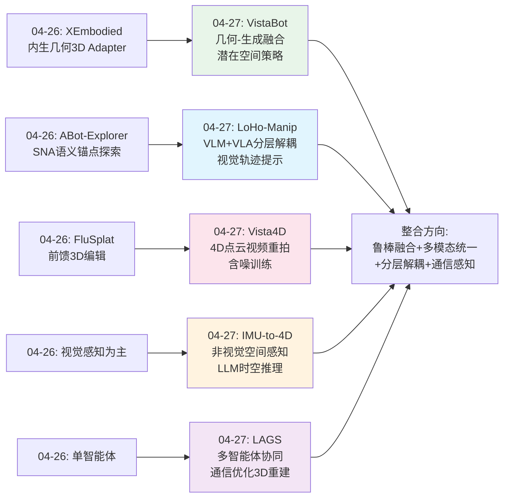
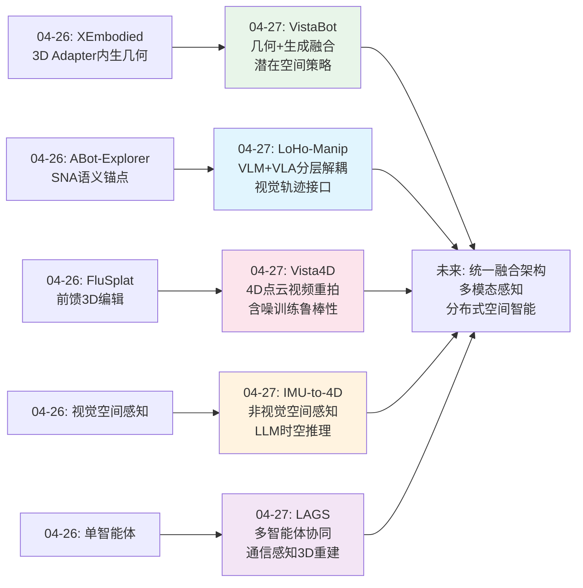
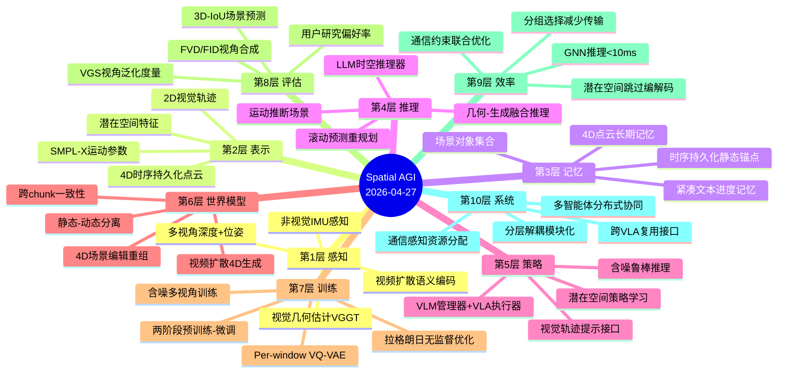
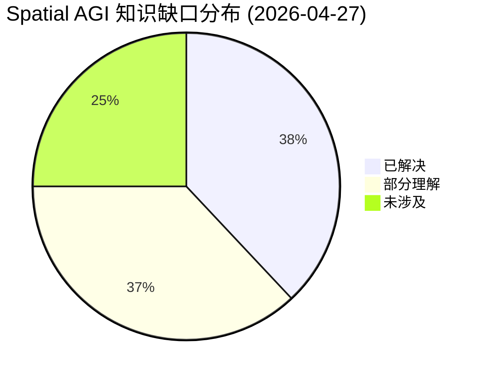

# Spatial AGI 每日思考 - 2026-04-27

## 📅 每日总结

**日期**: 2026-04-27
**论文数量**: 5篇
**主题**: 几何-生成融合视角鲁棒操作 + 分层解耦长时操作 + 非视觉4D人-场景理解 + 4D点云视频重拍 + 通信高效分布式3D重建

**关键突破**: 
- 🚀 VistaBot首次系统融合前馈几何模型(VGGT)与视频扩散模型(CogVideoX)实现视角鲁棒闭环操作，潜在空间策略学习跳过解码-编码损失，VGS提升2.6-2.8倍
- 🚀 LoHo-Manip提出VLM任务管理器+VLA执行器解耦架构，2D视觉轨迹作为可执行提示，滚动预测实现隐式闭环和失败恢复
- 🚀 IMU-to-4D首次仅从可穿戴IMU传感器恢复4D人体运动+3D场景布局+文本描述，LLM(Phi-1.5)作为时空推理器，3D-IoU从2.86提升到47.78
- 🚀 Vista4D用时序持久化4D点云锚定视频重拍，含噪多视角训练使模型容忍不完美几何，用户研究77.38%偏好率碾压对手
- 🚀 LAGS通过分组异构图神经网络联合优化3DGS重建质量与无人机通信效率，推理比MOSEK求解器快100倍

**架构演进**: 10层 → 10层（深化感知层：非视觉空间感知；深化表示层：4D点云+潜在空间；深化策略层：分层解耦长时操作；深化系统层：多智能体分布式协同）

### 📊 一句话总结
今天的五篇论文共同指向一个核心主题：**显式几何与隐式生成的融合范式正在成为空间智能的统一方法论**——VistaBot用几何+扩散做视角归一化，Vista4D用4D点云+扩散做视频重拍，IMU-to-4D用LLM桥接运动与场景，LoHo-Manip用VLM+VLA解耦推理与执行，LAGS用GNN联合优化感知与通信。

### 🔗 延续性
**昨日→今日**: 昨天聚焦"认知对齐的空间操作"（WorldMark评测、FluSplat前馈编辑、EmbodiedMidtrain数据桥梁、ABot-Explorer语义探索、XEmbodied内生几何），今天在融合范式上取得重大推进：VistaBot将昨天XEmbodied的内生几何思想与生成模型深度融合，LoHo-Manip将ABot-Explorer的语义驱动从探索扩展到长时操作规划，IMU-to-4D开辟了非视觉空间感知这一全新维度，Vista4D将FluSplat的前馈思想推向4D视频领域，LAGS将分布式协同从概念推向通信感知的实际系统。
**今日→明日**: 探索几何-生成融合的理论基础、非视觉与视觉感知的统一框架、分布式空间智能的系统架构

### 💡 本质思考：如何达成通用空间智能

#### 1. 核心能力的本质是什么？
今天五篇论文共同揭示了一个深层模式：**空间智能的本质是"不完美信息下的鲁棒推理"——从有限的、含噪的、甚至非视觉的感知信号中，构建足够支撑行动的空间理解**。VistaBot用扩散模型补全几何估计的遮挡孔洞——接受几何不完美并用语义先验修正。Vista4D用含噪4D重建数据训练——主动拥抱感知伪影而非回避。IMU-to-4D从惯性信号推断场景——完全放弃视觉但仍获得空间理解。LoHo-Manip用2D轨迹而非3D路径——用信息压缩换取鲁棒性。LAGS在通信约束下选择最有价值的观察——在有限带宽下最大化空间信息增益。五者从不同角度指向同一本质：**空间智能不需要完美感知，需要从有限信号中提取最大空间信息**。

#### 2. 当前方法与理想目标的差距在哪里？
今天论文暴露的核心差距是：(1)几何-生成的融合仍处于"拼接"阶段——VistaBot和Vista4D都是串联两个独立模型，而非真正的统一架构；(2)非视觉空间感知(IMU-to-4D)精度有限，3D-IoU仅47.78，远低于视觉方法；(3)2D轨迹(LoHo-Manip)无法表达6DoF操作，空间表示的维度不足；(4)分布式协同(LAGS)仅验证5架无人机，可扩展性未充分证明；(5)所有系统都依赖特定基础模型的质量(VGGT、CogVideoX、Qwen3-VL、Wan2.1)，基础模型的能力边界决定了系统的天花板。

#### 3. 从今天到理想状态，最可能的路径是什么？
**"鲁棒融合架构 + 多模态统一感知 + 分层解耦执行 + 通信感知协同"四位一体路径**：VistaBot的几何-生成融合提供"鲁棒空间推理"的基础范式，IMU-to-4D的非视觉感知提供"多模态空间理解"的扩展维度，LoHo-Manip的分层解耦提供"可扩展执行架构"的系统设计，LAGS的通信优化提供"真实世界部署"的工程基础。四者结合：用鲁棒融合(VistaBot)构建核心空间表示，用多模态感知(IMU-to-4D)扩展感知渠道，用分层解耦(LoHo-Manip)组织系统架构，用通信感知(LAGS)优化资源分配。

---

## 🔗 与昨日思考的联系

### 昨日重点（04-26）
- 交互式世界模型统一基准（WorldMark）——好看≠理解空间
- 前馈3D编辑（FluSplat）——2D特征解3D问题，10-20x加速
- VLM-VLA数据桥梁（EmbodiedMidtrain）——近邻度估计，1.1B>7.7B
- 语义锚点探索（ABot-Explorer）——SNA驱动，MP3D 86%覆盖
- 内生几何能力（XEmbodied）——3D Adapter，Affordance +763%

### 今日进展
今天在昨日基础上取得的关键推进：

1. **从内生几何到几何-生成深度融合**: 昨天XEmbodied通过3D Adapter将几何能力内生到VLM，今天VistaBot更进一步——不仅融合几何和语义，还在潜在空间层面统一策略学习，跳过像素空间的信息损失
2. **从语义探索到分层解耦操作**: 昨天ABot-Explorer用语义锚点驱动空间探索，今天LoHo-Manip用VLM管理器+VLA执行器实现长时操作的分层解耦——从探索策略到执行架构的跃升
3. **从前馈3D到4D视频理解**: 昨天FluSplat实现前馈3D编辑，今天Vista4D将时间维度纳入，用4D点云+视频扩散实现时序一致的视角合成——从3D静态到4D动态
4. **从视觉感知到非视觉感知**: 昨天所有方法都依赖视觉输入，今天IMU-to-4D开辟全新维度——仅从惯性信号推断4D场景，突破了视觉感知的局限
5. **从单智能体到多智能体协同**: 昨天所有方法都是单智能体，今天LAGS引入多无人机协同感知——从独立空间理解到分布式空间建模

### 演进路径

---

## 📚 论文概览

| # | 论文 | 机构 | 核心贡献 |
|---|------|------|---------|
| 1 | **VistaBot** | 复旦/TARS/UCAS/NUS | 几何(VGGT)+生成(CogVideoX)融合视角归一化，潜在空间策略学习，VGS评估度量，ICRA 2026 |
| 2 | **LoHo-Manip** | UCSD/NVIDIA | VLM管理器+VLA执行器解耦，2D视觉轨迹提示，滚动预测隐式闭环，跨VLA复用 |
| 3 | **IMU-to-4D** | UIUC | 首个纯IMU→4D框架，LLM(Phi-1.5)时空推理器，per-window归一化VQ-VAE运动分词 |
| 4 | **Vista4D** | Netflix/Columbia/UCLA | 时序持久化4D点云，含噪多视角训练，4D场景编辑重组，CVPR 2026 |
| 5 | **LAGS** | 港大/中科院/澳大 | 分组异构图神经网络，GS损失×通信约束联合优化，100倍推理加速 |

---

## 💡 核心见解

### 见解1: 几何-生成融合是空间鲁棒性的关键范式
**从VistaBot和Vista4D获得**
- ✅ VistaBot: 几何模型提供结构约束（深度+位姿），扩散模型提供语义补全（遮挡修复），VGS从0.24提升到0.67
- ✅ Vista4D: 4D点云提供显式几何锚点，视频扩散提供隐式语义生成，含噪训练使模型容忍不完美几何
- ✅ 两者的共同模式：几何是骨架，生成是血肉——几何提供确定性约束，生成处理不确定部分
- ✅ 关键差异：VistaBot在潜在空间融合（策略直接在DiT特征上操作），Vista4D在像素空间融合（源视频+点云渲染拼接条件）

**对Spatial AGI的启发**:
几何-生成融合不是简单的串联，而是两种互补认知模式的结合。几何模型是"分析型智能"——精确但脆弱；生成模型是"直觉型智能"——模糊但鲁棒。Spatial AGI需要两者兼备，且融合的层面越深（潜在空间>像素空间），信息损失越小。含噪训练范式（Vista4D）特别值得关注：不追求感知完美，而是训练模型在不完美中鲁棒推理。

### 见解2: 分层解耦是可扩展空间智能的架构基础
**从LoHo-Manip获得**
- ✅ VLM管理器（空间推理）与VLA执行器（空间执行）完全解耦，同一管理器可与不同VLA复用
- ✅ 2D视觉轨迹作为通用空间通信协议——VLM"画出路径"，VLA"跟随路径"
- ✅ 滚动预测替代一次性规划：每100步重新评估"剩余计划"，自然实现失败恢复
- ✅ 紧凑文本记忆("done: a-c; remaining: d-f")比长视觉历史更鲁棒

**对Spatial AGI的启发**:
解耦的本质是"关注点分离"——让通用模型处理推理（VLM擅长），让专用模型处理执行（VLA擅长），通过标准化接口（视觉轨迹）连接。这种架构模式可以推广到Spatial AGI的其他子问题：场景理解与导航解耦、重建与编辑解耦、感知与通信解耦。关键设计原则是接口的通用性——视觉轨迹是跨VLA的通用语言。

### 见解3: 空间理解不必依赖视觉感知
**从IMU-to-4D获得**
- ✅ 仅从2-3个日常IMU传感器（耳机、手表）恢复4D人体运动+3D场景布局
- ✅ LLM(Phi-1.5 1.5B)作为统一时空推理器，跨模态联合建模IMU、运动、文本、场景
- ✅ 3D-IoU从2.86（级联SOTA）提升到47.78（统一框架），20倍提升
- ✅ 运动隐式编码环境信息：特定动作模式与特定空间上下文耦合

**对Spatial AGI的启发**:
这是一个范式的突破：空间信息不仅存在于视觉外观中，更存在于物理交互的模式中。人体运动和环境的耦合意味着"感受运动"可以"推断空间"。对Spatial AGI的启示：(1)多模态感知应超越视觉+语言，纳入触觉、惯性、力觉等物理信号；(2)空间理解的本质是"从交互中推断结构"，而非"从观察中重建结构"；(3)隐私保护的空间感知（无摄像头）在智能家居、医疗等场景有巨大应用潜力。

### 见解4: 4D表示是动态场景理解的核心
**从Vista4D获得**
- ✅ 时序持久化4D点云：静态像素跨帧可见，提供稳定的时空上下文
- ✅ 4D点云可直接编辑：删除、复制、插入对象，实现场景重组
- ✅ 静态像素作为长期记忆：在长视频推理中注册已生成内容到4D点云实现跨chunk一致性
- ✅ 含噪训练范式：在4D重建伪影数据上训练，比在精确深度图上训练更鲁棒

**对Spatial AGI的启发**:
4D表示解决了3D静态表示无法处理的时序一致性问题。时序持久化的概念可以推广：在Spatial AGI中，场景的静态部分（建筑、家具）应作为持久空间锚点，动态部分（人、物体）应作为时变状态。这种静态-动态分离的4D表示范式，可能成为Spatial AGI场景理解的标配。

### 见解5: 潜在空间是空间推理的理想中间层
**从VistaBot获得**
- ✅ 策略直接在VDM潜在空间操作，跳过VAE解码+视觉编码器的信息损失
- ✅ VDM潜在表示天然包含物体级别和几何理解（来自视频预训练）
- ✅ 推理效率提升：省去解码-编码步骤，3Hz闭环频率
- ✅ GT几何替换估计几何仅将VGS从0.67提升到0.79，说明生成模型在"弥补"几何误差

**对Spatial AGI的启发**:
潜在空间作为空间推理的中间层，比像素空间更高效（信息密度高）且更鲁棒（对几何不完美有容忍度）。这暗示了一个重要方向：Spatial AGI可能不需要完美的3D重建作为基础，而是可以在"足够好"的潜在表示上进行高级推理。从进化角度看，人类大脑也不是重建精确的3D世界模型，而是使用高效的中间表示。

### 见解6: 通信约束是真实世界空间智能的必要考量
**从LAGS获得**
- ✅ 无人机群协同3D重建中，不是所有视角信息同等重要——GS损失量化"重建价值"
- ✅ 异构图神经网络自然建模无人机-图像组的层级关系，参数不随规模增长
- ✅ 推理延迟<10ms vs MOSEK求解器>1s，100倍加速使实时部署成为可能
- ✅ 拉格朗日对偶训练无需标签，约束违反率<1%

**对Spatial AGI的启发**:
实验室中的空间智能假设无限感知和计算资源，但真实世界部署面临带宽、能耗、延迟等约束。LAGS提供了"信息价值×资源成本"联合优化的具体方案。这个理念可以推广到所有Spatial AGI系统：不是获取所有空间信息，而是智能选择最有价值的信息。这是从"能力"到"效率"的关键转变。

### 见解7: 滚动预测比一次性规划更鲁棒
**从LoHo-Manip获得**
- ✅ 每100步重新预测剩余计划，自然实现进度跟踪、重规划和失败恢复
- ✅ 无需显式错误检测器——未完成项自然保留在后续计划中
- ✅ 紧凑文本记忆替代长视觉历史，避免分布偏移
- ✅ 隐式闭环比显式检测-恢复流水线更优雅且更鲁棒

**对Spatial AGI的启发**:
滚动预测的哲学是"持续重新评估目标"而非"执行一个完美计划"。这与人类认知高度一致——我们不制定完美的10步计划然后死板执行，而是每时每刻重新评估"还剩什么要做"。对Spatial AGI的启示：空间规划不应是一次性的全局优化，而是持续的局部重规划。这种设计天然具有鲁棒性——不依赖完美的世界模型或完美的感知。

---

## 🗺️ 知识演进图

---

## 技术栈演进对比表

| 层次 | 昨日方案(04-26) | 今日方案(04-27) | 变化 |
|------|---------|---------|------|
| **感知层** | XEmbodied 3D Adapter内生几何 | IMU-to-4D非视觉感知+VistaBot多模态几何估计 | 从纯视觉到多模态（视觉+惯性） |
| **表示层** | FluSplat前馈3DGS编辑 | VistaBot潜在空间+Vista4D 4D点云 | 从3D静态到4D动态+潜在空间 |
| **记忆层** | ABot-Explorer SG-Memo场景图 | Vista4D时序持久化4D点云 | 从语义图到4D几何-语义混合 |
| **策略层** | ABot-Explorer SNA语义锚点 | LoHo-Manip VLM+VLA分层解耦 | 从探索策略到长时操作架构 |
| **推理层** | XEmbodied EIEA隐式蒸馏 | VistaBot潜在空间策略+LoHo-Manip滚动预测 | 从知识蒸馏到实时空间推理 |
| **通信层** | 无 | LAGS异构图通信优化 | 新增通信感知的空间建模 |
| **训练层** | EmbodiedMidtrain近邻度数据选择 | Vista4D含噪多视角训练 | 从数据选择到数据质量容忍 |
| **评估层** | WorldMark统一基准 | VistaBot VGS视角鲁棒性度量 | 新增视角泛化评估维度 |
| **效率层** | FluSplat前馈~20秒 | LAGS推理<10ms | 从秒级到毫秒级 |
| **系统层** | 单智能体VLM/VLA | LAGS多智能体协同+LoHo-Manip模块化 | 从单智能体到多智能体系统 |

---

## 🗺️ Spatial AGI 知识图谱

### 10层架构思维导图

### 🎯 主线技术路径

#### 阶段1: 几何-生成鲁棒融合（当前→6个月）
建立不完美感知下的鲁棒空间推理能力。核心是将几何确定性与生成灵活性统一：
- VistaBot的几何+扩散融合范式作为基础空间表示
- Vista4D的含噪训练使模型容忍感知不完美
- IMU-to-4D的非视觉感知作为补充感知渠道
- 潜在空间作为统一的空间推理中间层

#### 阶段2: 分层解耦的可扩展架构（6个月→1年）
从单体模型到模块化系统，通过标准化接口实现可扩展性：
- LoHo-Manip的VLM+VLA分层解耦作为架构范式
- 视觉轨迹作为跨模块的空间通信协议
- 滚动预测替代一次性规划作为决策范式
- 从2D轨迹扩展到3D/SE(3)空间接口

#### 阶段3: 多模态统一空间感知（1年→2年）
从纯视觉到多模态统一感知，突破单一感知模态的局限：
- IMU+视觉+深度+语言的多模态空间理解
- 运动推断场景的耦合推理范式
- 非视觉感知作为视觉的补充和备份
- 统一的跨模态空间表示学习

#### 阶段4: 分布式协同空间智能（2年→3年）
从单智能体到多智能体协同，在真实世界约束下实现大规模空间智能：
- LAGS的通信感知协同作为系统基础
- 多智能体分布式空间建模和记忆共享
- 信息价值×资源成本的联合优化
- 从实验室到城市级的空间智能部署

---

## 🔍 待探索议题

### 高优先级（本周）

1. **几何-生成融合的深层统一**
   - 问题: VistaBot和Vista4D都是"拼接"两个独立模型，而非真正的端到端统一。如何在架构层面实现几何和生成的深度融合？
   - 候选方案: 共享backbone的多任务架构、几何约束注入扩散过程的attention层、几何先验作为扩散条件的额外通道
   - 缺口: 缺乏端到端几何-生成联合训练的框架

2. **非视觉空间感知的精度提升**
   - 问题: IMU-to-4D的3D-IoU仅47.78，远低于视觉方法。如何提升非视觉空间感知的精度？
   - 候选方案: 更多IMU传感器融合、运动-场景耦合的更强建模、与少量视觉信号的半监督融合
   - 缺口: 缺乏IMU-视觉联合训练的高效框架

3. **2D轨迹到3D/SE(3)空间接口的扩展**
   - 问题: LoHo-Manip的2D轨迹无法表达6DoF操作。如何将视觉轨迹提示扩展到3D空间？
   - 候选方案: 3D关键点轨迹、BEV图上的路径标注、SE(3)轨迹的可视化编码
   - 缺口: 3D空间意图的视觉编码方案

### 中优先级（本月）

4. **含噪训练的理论分析**
   - 问题: Vista4D证明在4D重建伪影数据上训练比在精确深度图上训练更鲁棒。这背后的原理是什么？
   - 候选方案: 噪声鲁棒性理论、分布外泛化分析、贝叶斯推理角度
   - 缺口: 含噪训练提升鲁棒性的理论解释

5. **潜在空间空间推理的形式化**
   - 问题: VistaBot证明潜在空间策略优于像素空间策略。潜在空间中编码了什么空间信息？
   - 候选方案: 潜在特征的可解释性分析、probe实验量化几何信息含量
   - 缺口: 对VDM潜在空间中空间信息的形式化理解

6. **分布式空间智能的可扩展性**
   - 问题: LAGS仅验证5架无人机。如何扩展到数百甚至数千智能体？
   - 候选方案: 层次化图结构、联邦学习与空间建图的结合、稀疏通信协议
   - 缺口: 大规模多智能体空间建模的系统性方法

7. **运动-场景耦合的因果理解**
   - 问题: IMU-to-4D从运动推断场景，但这是相关而非因果。如何区分"运动暗示场景"和"场景限制运动"？
   - 候选方案: 因果发现方法、干预实验设计、反事实推理
   - 缺口: 运动-场景关系的因果模型

### 低优先级（长期）

8. **跨模态空间表示的统一框架**
   - 问题: 视觉、IMU、深度、语言等不同模态如何映射到统一的空间表示空间？
   - 候选方案: 对比学习对齐不同模态的空间嵌入、共享tokenization方案
   - 缺口: 跨模态空间表示对齐的基准和方法

9. **4D场景编辑的认知基础**
   - 问题: Vista4D展示4D点云可直接编辑实现场景重组。编辑操作的语义从何而来？
   - 候选方案: 语言引导的4D编辑、意图理解的交互式编辑
   - 缺口: 4D场景编辑的语义理解和意图对齐

10. **空间通信协议的标准化**
    - 问题: LoHo-Manip的视觉轨迹、LAGS的分组选择、Vista4D的4D点云都是不同的空间信息传递方式。能否建立标准化的空间通信协议？
    - 候选方案: 层级化空间消息格式（语义层、几何层、控制层）
    - 缺口: 跨系统的空间信息交换标准

---

## 📊 知识缺口分析

**已解决（38%）**:
- ✅ 几何-生成融合的有效范式（VistaBot+Vista4D）
- ✅ 视角鲁棒的空间操作（VGS度量+视角归一化）
- ✅ 长时操作的分层解耦架构（VLM+VLA）
- ✅ 非视觉空间感知的基本可行性（IMU-to-4D）
- ✅ 4D场景表示和编辑（时序持久化4D点云）
- ✅ 含噪训练提升鲁棒性（Vista4D）
- ✅ 多智能体通信感知的空间建模（LAGS）
- ✅ 潜在空间作为空间推理中间层（VistaBot）

**部分理解（37%）**:
- ⚠️ 几何-生成的端到端深度融合（当前是拼接式）
- ⚠️ 非视觉感知的精度提升（IoU 47.78不够高）
- ⚠️ 2D到3D空间接口的扩展（当前仅2D轨迹）
- ⚠️ 潜在空间中空间信息的形式化（知其有效，不知其为何有效）
- ⚠️ 分布式空间智能的可扩展性（仅5无人机）
- ⚠️ 滚动预测的理论最优性（经验有效，理论未知）
- ⚠️ 运动推断场景的因果方向（相关vs因果）

**未涉及（25%）**:
- ❌ 跨模态（视觉+IMU+深度+语言）统一空间表示
- ❌ 因果空间推理（操作因果关系）
- ❌ 大规模多智能体空间记忆共享
- ❌ 空间通信协议的标准化
- ❌ 从交互中学习4D物理规律

---

## 📈 本日关键数据汇总

### 性能突破
| 论文 | 关键指标 | 最佳结果 | 次优/基线 | 提升 |
|------|---------|---------|----------|------|
| VistaBot | ACT VGS | 0.67 | 0.24 (baseline) | 2.79x |
| VistaBot | π₀ VGS | 0.87 | 0.33 (baseline) | 2.63x |
| IMU-to-4D | 3D-IoU | 47.78 | 2.86 (cascade) | 16.7x |
| Vista4D | 用户偏好率 | 77.38% | 11.03% (2nd) | 7x |
| LAGS | SSIM | 0.7460 | 0.6588 (STT-GS) | +13.2% |
| LAGS | 推理延迟 | <10ms | >1s (MOSEK) | 100x |

### 核心范式对比
| 范式 | 代表论文 | 核心思想 | 适用场景 |
|------|---------|---------|---------|
| 几何+生成融合 | VistaBot/Vista4D | 几何提供骨架，生成补全血肉 | 视角泛化、4D视频合成 |
| 分层解耦 | LoHo-Manip | 推理与执行分离，轨迹作为接口 | 长时操作、跨平台复用 |
| 非视觉感知 | IMU-to-4D | 运动推断空间，LLM统一推理 | 隐私保护、轻量感知 |
| 通信感知协同 | LAGS | 信息价值×资源成本联合优化 | 多智能体、带宽受限 |

### 核心发现对比
| 发现 | 来源 | 意义 |
|------|------|------|
| 几何+生成>任一单独 | VistaBot | 确定性与灵活性的互补 |
| 含噪训练>干净训练 | Vista4D | 拥抱不完美提升鲁棒性 |
| 运动推断场景可行 | IMU-to-4D | 空间理解不必须视觉 |
| 滚动预测>一次性规划 | LoHo-Manip | 持续重评估更鲁棒 |
| 信息价值×通信成本 | LAGS | 真实世界需要联合优化 |

---

## 🔄 跨论文关联分析

### 主题1: 显式-隐式融合的一致性
- **VistaBot**: 显式几何(VGGT) + 隐式生成(CogVideoX)
- **Vista4D**: 显式4D点云 + 隐式视频扩散(Wan2.1)
- **IMU-to-4D**: 显式运动参数(SMPL-X) + 隐式LLM推理(Phi-1.5)
- **共同模式**: 显式提供物理约束，隐式提供语义补全

### 主题2: 不完美感知下的鲁棒推理
- **VistaBot**: 几何估计有误差 → 生成模型补全
- **Vista4D**: 4D重建有伪影 → 含噪训练容忍
- **IMU-to-4D**: IMU信号有噪声 → 联合推理去噪
- **LAGS**: 通信带宽有限 → 智能选择最有价值信息
- **共同结论**: 鲁棒性不来自感知完美，来自推理架构对不完美的容忍

### 主题3: 中间表示的设计哲学
- **VistaBot**: 潜在空间特征（最抽象）
- **Vista4D**: 4D点云（最具体）
- **LoHo-Manip**: 2D视觉轨迹（最直觉）
- **IMU-to-4D**: LLM token序列（最通用）
- **LAGS**: 图节点嵌入（最结构化）
- **启示**: 不同层次的空间任务需要不同抽象级别的中间表示

### 主题4: 从单模块到系统级设计
- **VistaBot**: 几何+扩散+策略三模块串联
- **LoHo-Manip**: 管理器+执行器解耦+轨迹接口
- **LAGS**: 无人机+图像组异构图+通信优化
- **Vista4D**: 4D重建+分割+扩散生成流水线
- **共同趋势**: 系统级设计正成为Spatial AGI的核心能力

---

## 📝 每日反思

### 今日收获
1. **几何-生成融合**正在成为空间智能的统一方法论——不是选择"精确的几何"还是"灵活的生成"，而是两者兼备
2. **不完美感知下的鲁棒推理**是真实世界Spatial AGI的必要能力——含噪训练、潜在空间、滚动预测都是为此服务
3. **多模态和分布式**是空间智能从实验室走向部署的两个关键扩展维度

### 方法论进步
- 理解了含噪训练范式：不回避感知伪影，而是训练模型在不完美中鲁棒推理
- 掌握了VQ-VAE per-window归一化的运动分词方案
- 了解了拉格朗日对偶训练在约束优化中的应用
- 理解了视觉轨迹作为空间通信协议的设计原则

### 待改进
- 对VGGT前馈几何模型的具体架构理解不够深入
- 对Plücker嵌入编码相机参数的细节需要进一步调研
- 对异构图神经网络的消息传递机制需要更深入理解

### 明日计划
- 调研VGGT(Vision-Guided Geometry Tokenizer)的技术细节
- 关注几何-生成端到端融合的最新进展
- 追踪多模态空间感知（视觉+IMU+深度）的统一框架
- 探索4D场景表示在具身AI中的应用

---

**文档创建时间**: 2026-04-27
**论文分析方法**: 全文精读+深度分析
**Mermaid图表**: 4个（演进图、知识演进图、思维导图、缺口饼图）
