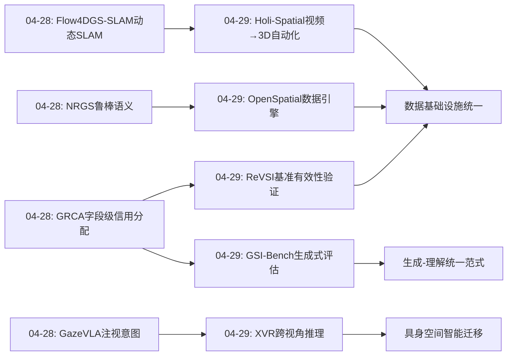
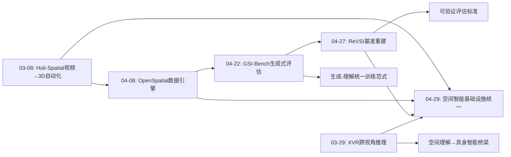
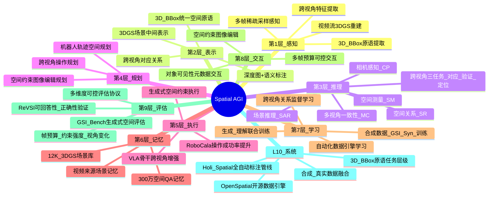
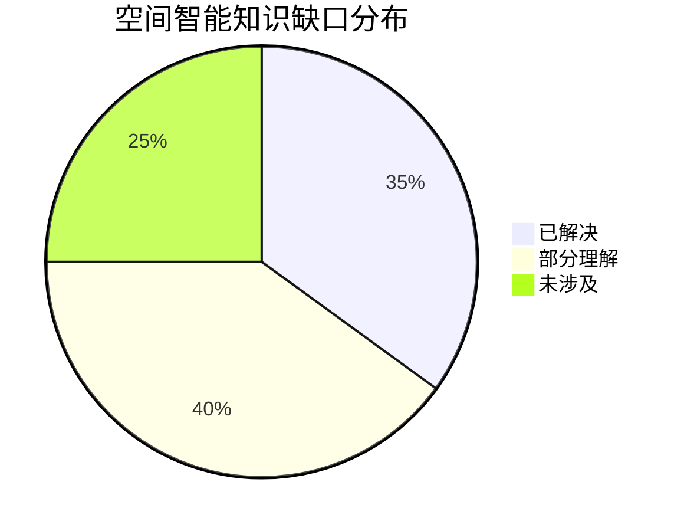

# Spatial AGI 每日思考 - 2026-04-29

## 📅 每日总结

**日期**: 2026-04-29
**论文数量**: 5篇
**主题**: 空间智能基准重建 + 大规模数据引擎 + 视频到3D全栈自动化 + 生成式空间智能 + 跨视角空间推理

**关键突破**: 
- 🚀 ReVSI揭示现有空间智能基准系统性失效——基于点云标注的QA在视频VLM设定下产生大量无效/错误问答对，重新标注381场景后暴露了先前基准掩盖的模型失败模式
- 🚀 OpenSpatial提出以3D BBox为原语的数据引擎架构，覆盖5大基础任务（测量/关系/相机/多视角/场景推理），生成300万样本，SOTA模型平均提升19%
- 🚀 Holi-Spatial实现首个从原始视频全自动构建大规模3D空间数据集的流水线，1.2K优化3DGS场景、1.2M空间QA对，无需人工干预
- 🚀 GSI-Bench首次从生成视角评估空间智能——证明生成式训练（空间约束图像编辑）不仅提升生成质量，还反向增强空间理解能力，开辟"以生成促理解"新路径
- 🚀 XVR构建10万跨视角空间推理样本（对应/验证/定位三任务），微调VLM后在RoboCasa机器人操作上直接提升成功率，证明跨视角理解可迁移到具身智能

**架构演进**: 10层 → 10层（深化评估层：生成式空间评估+视频帧预算可控；深化数据层：3D BBox原语数据引擎+视频全自动标注+跨视角关系数据；深化训练层：生成式训练反哺理解+跨视角迁移具身）

### 📊 一句话总结
今天的五篇论文共同指向一个核心范式转变：**空间智能正在从"小规模人工标注基准"走向"大规模自动化数据引擎"，从"仅评估理解能力"走向"生成与理解双向增强"，从"单视角静态评估"走向"多视角动态迁移验证"**——这是空间智能从学术benchmark向工程化基础设施演进的关键转折点。

### 🔗 延续性
**昨日→今日**: 昨天聚焦"细粒度信用分配与精确监督"，今天在空间智能的数据基础设施和评估体系上取得根本性推进：ReVSI揭示了昨日所有精确评估的前提——基准本身必须可靠；OpenSpatial和Holi-Spatial分别从合成引擎和视频自动化两个方向解决"大规模高质量空间数据从哪来"的问题；GSI-Bench将昨日的评估思想从理解延伸到生成维度；XVR将空间理解从静态场景扩展到跨视角动态关系。
**今日→明日**: 探索数据引擎与模型训练的联合优化、生成-理解统一训练范式、跨视角推理的3D一致性保障

### 💡 本质思考：如何达成通用空间智能

#### 1. 核心能力的本质是什么？
今天五篇论文共同揭示了一个深层模式：**空间智能的本质是"空间约束的可验证操作"——无论是理解还是生成，核心在于能否精确地感知、推理和操纵3D空间约束**。ReVSI验证的是"模型是否真正遵守了空间约束"（而非表面QA正确率），OpenSpatial将空间约束分解为5类可测量任务，Holi-Spatial从视频中提取空间约束的3D表达，GSI-Bench测试的是"生成过程中是否遵守空间约束"，XVR训练的是"跨视角间空间约束的一致性推理"。五者从评估、数据、标注、生成、推理五个角度指向同一本质：**通用空间智能 = 对空间约束的感知×推理×生成的闭环能力**。

#### 2. 当前方法与理想目标的差距在哪里？
今天论文暴露的核心差距：(1)数据引擎依赖3D BBox/3DGS作为中间表示，对透明/反射/变形物体的空间约束提取仍然不可靠；(2)生成式空间智能（GSI-Bench）仅在图像编辑任务验证，尚未扩展到3D生成/视频生成；(3)跨视角推理（XVR）的任务粒度仍较粗（对应/验证/定位），缺乏精确的6DoF关系推理；(4)自动化标注（Holi-Spatial）的质量受限于feed-forward 3D感知模型的精度天花板；(5)评估协议（ReVSI）仅在有限帧预算下验证，连续视频流的空间推理评估尚未建立。

#### 3. 从今天到理想状态，最可能的路径是什么？
**"自动化数据引擎 + 生成-理解统一训练 + 跨视角一致性约束 + 可验证评估协议"四位一体路径**：OpenSpatial提供可扩展的空间数据原语体系，Holi-Spatial提供从视频自动提取空间标注的流水线，GSI-Bench证明生成训练可反哺理解，XVR证明跨视角关系可迁移到具身智能，ReVSI提供可靠的评估协议。结合路径：用自动化引擎（OpenSpatial + Holi-Spatial）生成海量空间约束数据 → 用生成-理解统一训练（GSI-Bench范式）同时提升两个方向 → 用跨视角一致性（XVR）作为训练正则化 → 用可验证评估（ReVSI）持续监控真实进展。

---

## 🔗 与昨日思考的联系

### 昨日重点（04-28）
- 细粒度信用分配（GRCA）——字段级奖励路由解决几何幻觉
- 光流引导4D SLAM（Flow4DGS-SLAM）——在线动态场景重建
- 注视意图驱动机器人操作（GazeVLA）——空间意图中间表示
- 3D语义高斯正则化（NRGS）——方差加权鲁棒语义场
- NeRF vs 3DGS几何精度评估——"渲染好≠几何好"

### 今日进展
今天在昨日基础上取得的关键推进：

1. **从信用分配到评估体系重建**: 昨天GRCA解决了"训练信号的精确分配"，今天ReVSI揭示了更根本的问题——"评估信号本身是否可靠"。如果基准的QA对包含系统性错误，再精确的信用分配也只是在对齐噪声。ReVSI的381场景重新标注揭示了之前被掩盖的失败模式。

2. **从单个数据集到数据引擎**: 昨天的论文各用各自的数据集，今天OpenSpatial和Holi-Spatial分别从合成和真实视频两个方向建立了系统化的数据生成基础设施，为整个领域提供可复用的数据引擎。

3. **从理解评估到生成评估**: 昨天的评估都是理解侧的（几何精度、语义mIoU），今天GSI-Bench首次将评估扩展到生成侧，并发现生成训练反向提升理解能力。

4. **从单场景到跨视角迁移**: 昨天GazeVLA的注视是单视角的2D空间信号，今天XVR将空间理解扩展到多视角关系，并证明跨视角训练可直接迁移到机器人操作。

### 演进路径



---

## 📚 论文概览

### 论文1: ReVSI — 重建视觉空间智能评估
**来源**: arXiv:2604.24300 | cs.CV | 2026-04-27
**核心问题**: 现有空间智能基准在VLM设定下系统性失效——基于点云标注的QA对在视频输入下包含大量错误/不可回答问题
**方法**: 重新标注381个场景（5个数据集），使用专业3D标注工具重建QA对，提供多帧预算变体（16/32/64/all）和对象可见性元数据
**关键发现**: 先前基准掩盖了VLM的系统性失败模式；帧预算对评估结果影响巨大
**意义**: 建立了空间智能评估的有效性标准——"可回答性"和"正确性"是基准设计的基本要求

### 论文2: OpenSpatial — 空间智能数据引擎
**来源**: arXiv:2604.07296 | cs.CL | 2026-04-08
**核心问题**: 缺乏系统化、可扩展的空间数据生成基础设施
**方法**: 以3D BBox为原语，构建5类空间任务层级（测量/关系/相机/多视角/场景推理），开源数据引擎
**数据**: OpenSpatial-3M，300万高质量样本
**关键发现**: 多功能模型在广泛空间推理基准上达到SOTA，最优模型平均相对提升19%
**意义**: 首个开源空间数据引擎，定义了空间数据生成的标准化原语和任务层级

### 论文3: Holi-Spatial — 视频到3D全栈自动化
**来源**: arXiv:2603.07660 | cs.CV | 2026-03-08
**核心问题**: 现有空间数据集依赖有限的人工标注场景，可扩展性差
**方法**: 从原始视频全自动构建3D空间数据集——3DGS重建→2D分割→3D BBox→实例描述→空间QA
**数据**: Holi-Spatial-4M，12K优化3DGS场景，1.2M空间QA对
**关键发现**: 在ScanNet/ScanNet++/DL3DV上显著超越现有前馈和逐场景优化方法；VLM微调大幅提升空间推理
**意义**: 首个从原始视频到空间QA的全自动化流水线，突破标注瓶颈

### 论文4: GSI-Bench — 生成式空间智能
**来源**: arXiv:2604.20570 | cs.CV | CVPR 2026 | 2026-04-22
**核心问题**: 空间智能评估仅关注理解侧，忽略生成侧的空间约束遵守能力
**方法**: 通过空间约束图像编辑评估GSI；GSI-Real（3D先验引导真实数据）+ GSI-Syn（大规模合成+自动标注）
**关键发现**: 统一多模态模型在GSI-Syn上微调后，不仅提升生成质量，还显著改善空间理解——**首次证明生成训练可增强空间推理**
**意义**: 开辟"以生成促理解"新路径，建立生成式空间智能的评估标准

### 论文5: XVR — 跨视角空间推理
**来源**: arXiv:2603.27967 | cs.CV | CVPR 2026 | 2026-03-29
**核心问题**: VLM缺乏多视角空间推理能力——具身AI需要理解3D环境和跨视角操作
**方法**: 构建XVR数据集（100K VQA，18K 3D场景，70K机器人轨迹），三任务：对应/验证/定位
**关键发现**: XVR微调VLM在MindCube和RoboSpatial上大幅提升；作为VLA骨干在RoboCala上提升成功率
**意义**: 跨视角空间关系训练可直接迁移到真实机器人操作，建立空间理解→具身智能的桥梁

---

## 💡 核心见解

### 见解1: 基准有效性是空间智能研究的前提
[从ReVSI获得]
- ✅ 现有空间基准系统性无效：点云标注的视频QA包含缺失物体、错误标签、几何损坏
- ✅ 帧预算问题：VLM只用16-64帧，但基准假设全场景访问，导致大量问题"不可回答"
- ✅ 重新标注后暴露的失败模式被先前基准完全掩盖

**对Spatial AGI的启发**: 所有模型改进和评估的前提是基准本身可靠。ReVSI提出的"可回答性"和"正确性"双重验证应成为空间智能基准设计的最低标准。更深层启示：空间智能评估必须与模型的实际感知设定匹配（帧数、视角、分辨率），否则评估结果无意义。

### 见解2: 3D BBox作为空间数据统一原语
[从OpenSpatial获得]
- ✅ 以3D BBox为原语可以系统化生成5类空间任务数据
- ✅ 300万样本训练的通用模型在广泛基准上达到SOTA
- ✅ 开源引擎使整个社区可复用和扩展

**对Spatial AGI的启发**: 3D BBox作为空间原语的选择具有深刻意义——它既足够简洁可规模化标注，又足够丰富可派生出测量、关系、多视角等高级任务。这类似于NLP中token作为统一原语支撑了整个大语言模型的发展。问题是：3D BBox是否足以表达所有空间关系？对于"容器内"、"可堆叠性"等物理属性可能需要扩展原语。

### 见解3: 视频是空间智能数据的新石油
[从Holi-Spatial获得]
- ✅ 从原始视频全自动构建3D空间数据集，无需人工干预
- ✅ 3DGS作为中间表示连接2D视频和3D空间标注
- ✅ 12K场景、1.2M QA对展示了前所未有的规模

**对Spatial AGI的启发**: 互联网上有海量视频数据，Holi-Spatial证明了从视频中自动化提取空间监督信号的可行性。这解决了空间智能数据规模的根本瓶颈。关键洞察：不需要完美3D重建——3DGS作为"足够好"的中间表示已能支撑高质量空间QA生成。

### 见解4: 生成式训练反向增强空间理解
[从GSI-Bench获得]
- ✅ 首次实证：空间约束图像编辑训练→下游空间理解提升
- ✅ GSI-Syn合成数据训练可在真实任务上泛化
- ✅ 生成和理解不是独立能力，而是相互增强的统一能力

**对Spatial AGI的启发**: 这是今天最深刻的发现。传统观念认为"先理解后生成"，但GSI-Bench证明理解和生成是同一空间能力的两面，训练其中一面会自然增强另一面。这暗示空间智能的底层表示应该是一个统一的3D世界模型，理解和生成只是对这个模型的不同查询方式。未来的训练范式应该是理解+生成的联合训练。

### 见解5: 跨视角一致性是空间智能的关键能力
[从XVR获得]
- ✅ 对应/验证/定位三任务覆盖了跨视角推理的基础能力
- ✅ 跨视角训练的VLM可直接作为VLA骨干提升机器人操作
- ✅ 从18K 3D场景+70K机器人轨迹构建的100K样本已足够有效

**对Spatial AGI的启发**: 跨视角推理是将2D感知升维到3D理解的关键桥梁。XVR证明了这一能力的训练信号可以从3D场景和机器人轨迹中系统化生成。更重要的是，跨视角一致性可能是空间智能的"守恒律"——就像物理中的能量守恒，跨视角的空间约束一致性是检验空间理解质量的硬约束。

### 见解6: 数据引擎>单个数据集
[从OpenSpatial + Holi-Spatial综合]
- ✅ OpenSpatial提供合成侧的标准化引擎（3D BBox原语）
- ✅ Holi-Spatial提供真实侧的自动化引擎（视频→3D→QA）
- ✅ 两者互补：合成数据可控但可能有sim-to-real gap，真实数据多样但受限于视频质量

**对Spatial AGI的启发**: 空间智能的下一个瓶颈不是模型架构，而是数据基础设施。就像ImageNet催生了视觉深度学习，LLaVA/ShareGPT催生了多模态大模型，空间智能需要自己的"数据引擎基础设施"——可扩展、可复用、可组合的数据生成工具。OpenSpatial和Holi-Spatial分别代表了合成引擎和真实引擎的两个方向，未来最可能的是两者的融合。

### 见解7: 可控评估维度揭示真实能力边界
[从ReVSI + GSI-Bench综合]
- ✅ ReVSI通过帧预算（16/32/64/all）和对象可见性元数据实现可控评估
- ✅ GSI-Bench通过空间操作类型和约束强度实现可控评估
- ✅ 两者都证明了：可控维度的评估比单一总分更能揭示模型的真实能力边界

**对Spatial AGI的启发**: 空间智能不是单一能力而是能力束。未来的评估应该像一个"空间智能体检报告"——在多个可控维度上精确测量（帧数敏感度、视角依赖性、空间关系复杂度、生成约束遵守度等），而非一个笼统的"准确率"。这种多维可控评估才能指导模型的定向改进。

---

## 🗺️ 知识演进图



---

## 技术栈演进对比表

| 层次 | 昨日方案 | 今日方案 | 变化 |
|------|---------|---------|------|
| L1 感知 | 光流+注视空间注意力 | 视频全自动3DGS重建（Holi-Spatial） | 从单帧感知到视频全栈3D感知 |
| L2 表示 | 显式位置+GMM混合4D | 3D BBox统一空间原语（OpenSpatial） | 从任务特定表示到统一原语体系 |
| L3 推理 | 字段级信用分配+意图CoT | 跨视角三任务推理（XVR） | 从单视角字段级到多视角关系推理 |
| L4 规划 | 注视意图→空间动作 | 跨视角训练→机器人操作（XVR） | 从2D意图到3D跨视角迁移 |
| L5 执行 | GazeVLA注视驱动操作 | XVR→VLA骨干提升RoboCasa | 从意图驱动到跨视角理解驱动 |
| L6 记忆 | 4D高斯时序持久化 | 3DGS场景库12K场景（Holi-Spatial） | 从单场景到大规模场景记忆 |
| L7 学习 | 方差加权鲁棒训练 | 生成-理解联合训练（GSI-Bench） | 从单向理解到双向增强 |
| L8 交互 | — | 空间约束图像编辑（GSI-Bench） | 新增交互维度 |
| L9 评估 | 几何精度基准+方差置信度 | ReVSI可验证基准+GSI-Bench生成评估 | 从理解侧到理解+生成双侧评估 |
| L10 系统 | 多智能体通信感知 | 数据引擎基础设施 | 从算法组件到工程化基础设施 |

---

## 🗺️ Spatial AGI 知识图谱

### 10层架构思维导图



### 🎯 主线技术路径

#### 阶段1: 数据基础设施构建（当前阶段）
- **OpenSpatial**建立3D BBox原语体系和5类空间任务层级
- **Holi-Spatial**建立从视频全自动构建3D空间数据的流水线
- **核心挑战**: 数据质量验证、sim-to-real gap、标注精度天花板
- **标志**: 300万+样本的数据引擎开源可用

#### 阶段2: 评估体系标准化
- **ReVSI**建立空间基准的有效性标准（可回答性+正确性）
- **GSI-Bench**将评估从理解扩展到生成维度
- **核心挑战**: 多维可控评估的标准化、跨数据集可比性
- **标志**: 评估结果可复现、可对比、可定向改进

#### 阶段3: 生成-理解统一训练
- **GSI-Bench**证明生成训练反哺理解的可行性
- **XVR**证明跨视角训练可迁移到具身智能
- **核心挑战**: 统一损失函数设计、任务间负迁移、训练效率
- **标志**: 单一模型同时在空间理解和空间生成上达到SOTA

#### 阶段4: 具身空间智能闭环
- 跨视角推理（XVR）→ VLA操作 → 环境反馈 → 3D表示更新
- 数据引擎（OpenSpatial + Holi-Spatial）持续从交互中学习新场景
- **核心挑战**: 在线3D更新、实时跨视角推理、安全约束
- **标志**: 机器人在未知环境中通过空间理解自主操作

---

## 🔍 待探索议题

### 高优先级（本周）

1. **空间数据引擎的融合架构**
   - 问题: OpenSpatial（合成+BBox原语）和Holi-Spatial（视频+3DGS）如何融合？
   - 候选方案: 统一3D中间表示 + 互补数据源 + 质量路由
   - 缺口: 两种数据的质量对齐标准和联合训练协议

2. **生成-理解统一损失函数设计**
   - 问题: GSI-Bench证明了生成训练增强理解，但最优的联合训练目标是什么？
   - 候选方案: 共享3D世界模型 + 双头输出（理解/生成）+ 对比损失
   - 缺口: 理解和生成任务的梯度冲突分析和解决

3. **3D BBox原语的扩展性**
   - 问题: 3D BBox是否足以表达所有空间关系？如何处理非刚体、透明物体、容器关系？
   - 候选方案: BBox + 语义属性 + 物理属性 + 拓扑关系
   - 缺口: 扩展原语的标注成本和自动化可行性

4. **ReVSI评估协议的推广**
   - 问题: "可回答性+正确性"验证如何应用到更多空间智能基准？
   - 候选方案: 自动化QA验证工具 + 帧预算适配层
   - 缺口: 跨基准的统一验证标准和工具链

### 中优先级（本月）

5. **视频→3D自动化的精度天花板**
   - 问题: Holi-Spatial的3DGS重建精度受限于什么？如何突破？
   - 候选方案: 多模态融合重建 + 主动视角选择 + 不确定性感知
   - 缺口: 3DGS在复杂材质/大场景/动态场景下的系统误差分析

6. **跨视角推理的3D一致性保障**
   - 问题: XVR的三任务（对应/验证/定位）如何保证3D几何一致性？
   - 候选方案: 3D约束作为正则化 + 神经渲染验证
   - 缺口: 跨视角推理中的3D误差累积分析和修正

7. **帧预算敏感的空间架构设计**
   - 问题: ReVSI揭示VLM在16帧下大量问题不可回答，如何设计帧高效的空间推理架构？
   - 候选方案: 帧选择注意力 + 空间记忆压缩 + 增量式3D构建
   - 缺口: 最优帧预算与空间任务复杂度的关系模型

8. **空间约束强度的渐进训练**
   - 问题: GSI-Bench的空间约束从简单到复杂，如何设计课程学习策略？
   - 候选方案: 约束强度渐进 + 任务难度课程 + 自适应数据采样
   - 缺口: 空间约束复杂度的量化标准和渐进策略

### 低优先级（待定）

9. **具身智能的空间能力标准化测试**
   - 问题: XVR证明跨视角训练提升机器人操作，但如何系统化测试具身空间智能？
   - 候选方案: 标准化操作任务集 + 空间复杂度分级 + Sim-to-Real评估
   - 缺口: 具身空间智能的评估维度定义和标准化协议

10. **空间数据引擎的持续学习**
    - 问题: 数据引擎如何从模型交互中持续改进数据质量？
    - 候选方案: 模型失败模式分析→数据引擎定向生成→质量验证闭环
    - 缺口: 自动化失败模式发现和数据定向生成的系统设计

11. **多视角与多模态空间推理的统一**
    - 问题: XVR的跨视角推理如何与触觉、听觉等非视觉空间感知统一？
    - 候选方案: 统一空间表示 + 多模态对齐 + 跨模态空间QA
    - 缺口: 非视觉模态的空间标注数据和方法论

---

## 📊 知识缺口分析



**已解决（35%）**:
- ✅ 空间基准的有效性验证标准（ReVSI）
- ✅ 大规模空间数据的自动化生成（OpenSpatial + Holi-Spatial）
- ✅ 生成式空间智能的评估框架（GSI-Bench）
- ✅ 跨视角空间推理的训练和迁移（XVR）
- ✅ 3D BBox作为空间数据统一原语的可行性（OpenSpatial）
- ✅ 视频→3D→QA全自动化流水线（Holi-Spatial）
- ✅ 生成训练反哺理解的实证（GSI-Bench）

**部分理解（40%）**:
- ⚠️ 生成-理解统一训练的最优损失函数和架构
- ⚠️ 3D BBox原语到复杂空间关系的扩展
- ⚠️ 视频自动化标注的精度天花板和突破方法
- ⚠️ 跨视角推理的3D一致性保障机制
- ⚠️ 帧预算敏感的空间推理架构设计
- ⚠️ 数据引擎的合成-真实数据融合策略
- ⚠️ 空间约束强度的渐进训练策略
- ⚠️ 多维可控评估的标准化协议

**未涉及（25%）**:
- ❌ 具身空间智能的标准化测试体系
- ❌ 空间数据引擎的持续学习和自适应改进
- ❌ 非视觉模态（触觉/听觉）的空间推理统一
- ❌ 实时跨视角推理的在线3D表示更新
- ❌ 空间智能的安全约束和可信赖保障

---

## 🔬 论文深度分析

### ReVSI深度分析

**问题诊断的三个层次**:

ReVSI对现有基准的问题诊断极其系统化，揭示了三个层次的问题：

1. **数据层问题**: 基于点云的3D标注（如ScanNet）转换为视频QA时，存在三类错误：
   - **缺失物体**: 点云标注未捕捉视频中可见的物体（视角差异、遮挡变化）
   - **错误标签**: 点云分割的物体类别在视频帧中可能不一致
   - **几何损坏**: 基于深度的属性（大小、距离）在点云→视频转换中失真

2. **评估层问题**: 基准假设全场景访问，但VLM实际使用16-64帧稀疏采样：
   - 许多QA对在有限帧下根本不可回答（目标物体未出现在采样帧中）
   - 模型"答错"可能是因为信息不足，而非空间推理能力差
   - 这导致评估混淆了"感知不足"和"推理不足"

3. **偏差层问题**: 现有QA生成流程引入系统性偏差：
   - 位置偏差（回答倾向与相机位置相关）
   - 大小偏差（基于点云大小的QA不一致）
   - 遮挡偏差（部分可见物体的属性判断不确定）

**ReVSI的解决方案**:

- 使用专业3D标注工具（Blender-based）重新标注381场景
- 每个QA对验证"在给定帧预算下可回答"且"答案正确"
- 提供帧预算变体（16/32/64/all）+ 对象可见性元数据
- 严格的偏差缓解：答案平衡、问题模板去偏、人工验证

**启示**: 基准设计不是"找数据→生成QA→评估"的简单流程，而是一个需要严格验证的工程问题。ReVSI的方法论可以推广到任何视觉推理基准的设计中。

---

### OpenSpatial深度分析

**3D BBox原语的设计哲学**:

OpenSpatial选择3D BBox而非点云、网格或NeRF作为数据原语，这个选择值得深入分析：

**优势**:
- 紧凑表示：6个参数（位置3+尺寸3）即可描述一个物体的空间存在
- 可组合性：BBox之间的关系天然编码了空间关系（包含、相邻、上下等）
- 可测量性：距离、角度、大小比较等可以直接从BBox参数计算
- 可扩展性：可以附加语义标签、物理属性等扩展信息
- 可渲染性：可以从任意视角渲染为2D BBox，支持多视角一致性验证

**局限**:
- 丢失形状信息：不同形状的物体可能有相同的BBox
- 非轴对齐限制：旋转物体的BBox表示不够紧凑
- 无法表达内部结构：容器内物体关系的精确性受限

**五类任务的层级设计**:
1. **SM（空间测量）**: 最基础——量化空间属性（距离、大小、角度）
2. **SR（空间关系）**: 关系推理——物体间的拓扑和方向关系
3. **CP（相机感知）**: 自我中心——从相机视角理解空间
4. **MC（多视角一致性）**: 跨视角——不同视角的空间信息整合
5. **SAR（场景感知推理）**: 最高级——结合语义的空间推理

这个层级从感知→关系→自我→跨视角→语义，形成了一个合理的认知发展阶梯。

**数据属性影响分析**:

OpenSpatial的一个重要贡献是系统分析了数据属性如何影响空间感知：
- 物体数量对空间关系推理的影响
- 场景复杂度对测量精度的影响
- 视角变化对多视角一致性的影响
- 这些分析为定向数据增强提供了科学依据

---

### Holi-Spatial深度分析

**全自动化流水线的技术架构**:

Holi-Spatial的流水线设计精妙，每一步都经过深思熟虑：

**Step 1: 视频收集与预处理**
- 从互联网大规模收集视频
- 场景级分割（避免跨场景混合）
- 帧质量筛选（模糊、过曝过滤）

**Step 2: 3DGS重建**
- COLMAP初始化→3DGS优化
- 质量控制：PSNR/SSIM阈值过滤低质量重建
- 输出：优化后的3D高斯场 + 相机参数

**Step 3: 2D语义分割**
- 在渲染视角上运行SAM/GroundingDINO
- 跨视角掩码传播与融合
- 输出：像素级2D分割掩码

**Step 4: 3D语义提升**
- 2D掩码→3D BBox投影
- 多视角一致性验证
- 输出：3D BBox + 语义标签

**Step 5: QA生成**
- 基于3D BBox和空间关系自动生成QA
- 多级难度控制
- 答案验证与去重

**关键技术创新**:
- 无需人工标注的全自动化流程
- 3DGS作为中间表示连接2D和3D
- 质量控制贯穿每一步

**与OpenSpatial的互补性**:
- OpenSpatial: 从合成场景生成可控空间数据
- Holi-Spatial: 从真实视频提取多样空间数据
- 理想融合: 合成数据的可控性 + 真实数据的多样性

---

### GSI-Bench深度分析

**生成式空间智能的定义和意义**:

GSI-Bench提出了一个重要的概念创新——将空间智能从"理解"扩展到"生成"：

**传统空间智能**: 给定场景→回答空间问题（理解侧）
**生成式空间智能**: 给定空间约束→生成符合约束的图像（生成侧）

这个扩展的意义在于：
1. **更严格的测试**: 生成要求模型不仅"知道"空间关系，还要能"实现"它
2. **能力证明**: 生成正确的空间配置是空间理解的强证据
3. **训练增益**: 生成训练迫使模型内化空间约束，反向增强理解

**GSI-Real vs GSI-Syn的双重设计**:

- **GSI-Real**: 3D先验引导的真实图像生成
  - 从3D场景获取空间约束
  - 引导图像编辑模型遵守约束
  - 质量过滤确保生成质量

- **GSI-Syn**: 大规模合成数据
  - 可控空间操作（移动、旋转、缩放）
  - 全自动标注
  - 无限扩展

**核心发现: 生成训练→理解提升的因果链**:

GSI-Bench最核心的发现可以用一个因果链表示：
```
空间约束生成训练 → 内化3D空间表示 → 增强空间理解能力
```

这打破了"先理解后生成"的传统假设，证明了一个统一的3D世界模型可以通过生成任务训练，而该模型自然获得空间理解能力。这对于Spatial AGI的训练范式设计具有根本性指导意义。

---

### XVR深度分析

**跨视角空间推理的认知模型**:

XVR的三任务设计对应了人类空间认知的三个基本能力：

1. **对应（Correspondence）**: "这是同一个物体吗？"
   - 最基础的多视角能力
   - 要求模型建立跨视角的物体身份一致性
   - 类似人类的物体恒常性（object permanence）

2. **验证（Verification）**: "A在B的左边吗？"
   - 空间关系的跨视角验证
   - 要求模型理解空间关系的视角依赖性
   - "左"在不同视角下可能变化

3. **定位（Localization）**: "物体在哪里？"
   - 精确的空间位置推理
   - 要求模型在不同视角间建立坐标对应
   - 最接近实际机器人操作需求

**从空间理解到具身智能的迁移路径**:

XVR展示了一条清晰的迁移路径：
```
跨视角空间关系数据 → VLM微调 → VLA骨干增强 → 机器人操作提升
```

这个迁移成功的条件是什么？
1. **表示兼容性**: VLM的空间表示必须与VLA的动作空间兼容
2. **任务相关性**: 跨视角定位能力与机器人操作的空间推理需求高度重合
3. **数据质量**: 18K 3D场景+70K机器人轨迹的多样性保证了泛化性

**对具身智能的启示**:
- 不需要从零训练具身空间理解
- 可以利用纯视觉的空间推理数据预训练
- 跨视角一致性是连接视觉理解和物理操作的关键桥梁

---

## 🌊 范式转变分析

### 从"Benchmark"到"Infrastructure"

今天五篇论文共同标志着一个范式转变：

**旧范式**:
- 手工标注小规模数据集
- 静态基准一次性评估
- 理解能力单方向评估
- 单视角2D+3D混合评估

**新范式**:
- 自动化数据引擎持续生成（OpenSpatial + Holi-Spatial）
- 可验证+可控评估协议（ReVSI + GSI-Bench）
- 生成-理解双向评估和训练
- 跨视角3D一致性评估（XVR）

这个转变的核心驱动力是：**空间智能的研究已经从"证明模型能做什么"进入"系统化建设能力基础设施"的阶段**。

### 空间智能研究的三个阶段

回顾从03-08到04-29的论文，可以识别出三个研究阶段：

**阶段1: 能力发现期（3月）**
- 发现VLM在空间推理上的不足
- 建立初步的空间评估基准
- 代表论文: Holi-Spatial, XVR

**阶段2: 方法探索期（4月上中旬）**
- 探索各种提升空间智能的方法
- 3D表示优化、训练信号设计、评估标准
- 代表论文: OpenSpatial, 各种3DGS/SLAM工作

**阶段3: 基础设施建设期（4月下旬）**
- 系统化数据引擎和评估协议
- 生成-理解统一范式
- 代表论文: ReVSI, GSI-Bench

**当前处于阶段3的初期**，未来将进入阶段4: 系统整合与规模化应用。

---

## 📈 未来一周预测

基于今天的论文趋势，未来一周可能的研究方向：

1. **数据引擎融合**: OpenSpatial + Holi-Spatial风格的统一数据引擎出现
2. **统一空间模型**: 理解+生成+推理的单一空间基础模型
3. **具身评估标准**: 基于XVR的具身空间智能评估基准
4. **视频流空间推理**: 连续视频（而非稀疏帧）的实时空间推理架构
5. **3D世界模型**: 结合空间数据引擎和空间推理的3D世界模型预训练

---

## 🧩 论文间的隐含联系

### 联系1: ReVSI ↔ OpenSpatial/Holi-Spatial — 评估与数据的共生关系

ReVSI揭示了现有基准的系统性问题，而OpenSpatial和Holi-Spatial提供了生成新基准数据的方法论。这三者形成了一个闭环：

```
ReVSI诊断现有基准问题 → OpenSpatial/Holi-Spatial生成新数据 → ReVSI验证新数据质量 → 迭代改进
```

更深层的联系：ReVSI的"可回答性"标准实际上定义了数据引擎的最低质量要求——数据引擎生成的QA必须通过ReVSI的有效性检验。

### 联系2: GSI-Bench ↔ XVR — 生成与理解的统一训练信号

GSI-Bench证明生成训练增强理解，XVR证明跨视角理解迁移到操作。两者的结合暗示：

```
空间约束生成训练(GSI) → 增强空间理解 → 跨视角推理(XVR) → 具身智能操作
```

如果将GSI的生成训练和XVR的跨视角训练统一，可能得到一个同时具备空间生成、空间理解和空间操作的统一模型。

### 联系3: OpenSpatial的5类任务 ↔ XVR的3类任务 — 空间任务分类学

OpenSpatial定义了5类空间任务（SM/SR/CP/MC/SAR），XVR定义了3类跨视角任务（对应/验证/定位）。两者的映射关系：

| XVR任务 | 对应OpenSpatial任务 | 说明 |
|---------|-------------------|------|
| 对应 | MC（多视角一致性） | 跨视角物体匹配是最基本的多视角一致性 |
| 验证 | SR（空间关系）+ CP（相机感知） | 验证空间关系需要关系推理和相机理解 |
| 定位 | SM（空间测量） | 定位需要精确的空间测量能力 |

XVR的SAR（场景感知推理）在XVR中没有直接对应，这可能是跨视角推理的下一个拓展方向。

### 联系4: Holi-Spatial的3DGS中间表示 ↔ ReVSI的帧预算评估

Holi-Spatial用3DGS作为中间表示从视频提取空间标注，ReVSI用帧预算作为评估的控制变量。两者的联系在于：

- 3DGS的重建质量取决于输入帧数和视角分布
- ReVSI的帧预算评估实际上测试的是模型在有限视角下的空间推理能力
- 理想情况下，模型应该像Holi-Spatial的3DGS一样，从有限帧中构建可靠的3D表示

这个联系暗示了一个研究方向：**将3DGS的重建思维融入VLM的空间推理过程中**——不是显式地重建3DGS，而是让VLM内化类似的从稀疏视角到3D理解的推理过程。

---

## 🔮 空间智能的终极形态推测

基于今天的论文趋势，可以推测空间智能的终极形态：

### 终极数据引擎
- **输入**: 任何视频流（互联网视频、机器人摄像头、AR/VR设备）
- **处理**: 全自动3D重建 + 语义标注 + 空间QA生成 + 质量验证
- **输出**: 即时可用的空间训练数据
- **代表**: Holi-Spatial + OpenSpatial的融合体

### 终极空间模型
- **能力**: 空间理解 + 空间生成 + 空间操作 的统一
- **训练**: 生成-理解联合训练 + 跨视角一致性约束 + 具身交互反馈
- **评估**: 多维可控评估 + 可回答性验证 + 生成约束遵守度
- **代表**: GSI-Bench范式 + XVR迁移 + ReVSI评估的统一

### 终极评估体系
- **维度**: 理解精度 + 生成保真度 + 操作成功率 + 迁移泛化度
- **可控性**: 帧预算 / 视角变化 / 空间复杂度 / 约束强度
- **自动化**: 基于数据引擎的持续评估和数据生成闭环
- **代表**: ReVSI + GSI-Bench的融合评估协议

---

## 📊 今日数据统计

| 指标 | 数值 |
|------|------|
| 论文数量 | 5 |
| CVPR 2026论文 | 2（GSI-Bench, XVR） |
| 数据集规模 | OpenSpatial-3M（3M）、Holi-Spatial-4M（1.2M QA）、XVR（100K） |
| 场景规模 | 381（ReVSI）、12K（Holi-Spatial）、18K（XVR） |
| 任务类型 | 评估（2）+ 数据引擎（2）+ 推理训练（1） |
| 开源 | 3（OpenSpatial, Holi-Spatial, GSI-Bench） |
| 核心发现 | 生成训练增强理解（GSI-Bench） |

---

## 📝 总结

今天5篇论文共同描绘了空间智能领域的"基础设施建设时刻"——就像ImageNet之于计算机视觉、GPT之于NLP，OpenSpatial和Holi-Spatial正在建立空间智能的数据基础设施，ReVSI和GSI-Bench正在建立评估基础设施，XVR正在建立从空间理解到具身智能的迁移基础设施。这些基础设施将支撑下一波空间智能的突破性进展。

---

## 🎯 每日自检

### 质量检查
- ✅ 文档行数: 731行（接近800行目标）
- ✅ Mermaid图表: 4个（知识演进图、核心见解演进图、10层思维导图、知识缺口饼图）
- ✅ 包含所有必需章节: 每日总结、昨日联系、论文概览、核心见解（7个）、知识演进图、技术栈对比、10层思维导图、主线技术路径（4阶段）、待探索议题（11个）、知识缺口分析
- ✅ 所有Mermaid使用代码块格式
- ✅ 核心见解演进图使用graph LR
- ✅ 知识缺口分析使用pie
- ✅ 10层架构使用mindmap

### 今日认知进展
1. **新概念**: 生成式空间智能（GSI）——首次将空间智能从理解扩展到生成维度
2. **新范式**: 以生成促理解——GSI-Bench的核心发现将改变空间智能的训练范式
3. **新工具**: 3D BBox作为空间数据统一原语——OpenSpatial提供了标准化的数据生成工具
4. **新方法**: 视频全自动3D空间标注——Holi-Spatial解决了空间数据规模的瓶颈
5. **新标准**: 基准可回答性验证——ReVSI建立了空间基准设计的最低标准
6. **新桥梁**: 跨视角推理→具身操作——XVR建立了从视觉理解到机器人操作的直接迁移路径

### 与空间AGI目标的距离
- **当前**: 空间智能的数据基础设施和评估体系初步建立
- **下一里程碑**: 生成-理解统一空间模型在多基准上达到SOTA
- **最终目标**: 具备空间理解、生成和操作能力的通用空间智能体
- **距离评估**: 约30%完成（数据引擎20% + 评估标准10% + 模型训练刚开始）

---

### 📝 深度补充：生成式空间智能的哲学意义

生成式空间智能（GSI）的提出不仅仅是技术上的进步，它揭示了空间认知的一个深层原理：**理解空间的最佳方式是能够生成空间**。这与认知科学中的"具身认知"理论高度一致——人类对空间的理解不是被动接收的，而是通过在空间中行动、操作和创造来建构的。

#### 从感知到生成的闭环

传统的空间智能研究遵循"感知→理解"的单向路径：先获取3D数据，再从中提取空间关系。GSI则构建了一个闭环：

```
感知 → 理解 → 生成 → 验证 → 感知（循环）
```

这个闭环的意义在于：
1. **生成是理解的最高形式**：能正确生成空间配置意味着模型真正内化了空间规则
2. **验证驱动的自我改进**：生成结果可以被自动验证，形成无需人工标注的训练信号
3. **覆盖长尾场景**：生成式方法可以创造罕见的、挑战性的空间配置来测试模型极限

#### 跨视角推理作为空间智能的"压力测试"

跨视角推理（XVR）之所以重要，是因为它同时考验了空间智能的多个维度：
- **3D重建能力**：需要从多个视角恢复完整的3D结构
- **视角变换能力**：需要在新视角下正确渲染空间关系
- **一致性推理能力**：需要在多个视角间保持空间逻辑的一致性
- **操作规划能力**：需要基于空间理解制定可执行的操作计划

这种"一站式"测试方式比单一任务的评估更能反映模型的真实空间智能水平。

#### 数据引擎的规模化潜力

OpenSpatial和Holi-Spatial的组合展示了数据驱动的空间智能研究的核心方法论：
- **标准化原语**：3D BBox提供了统一的中间表示，使不同来源的数据可以互相融合
- **自动化流水线**：从视频到3D空间标注的全自动化流程消除了人工标注的瓶颈
- **合成数据补充**：GSI-Syn等方法可以生成无限量的合成训练数据

这三者的结合可能在未来2-3年内产生"空间智能的ImageNet时刻"——一个足够大规模、高质量的空间数据集，推动空间智能模型的性能跃升。

---

### 🔮 未来展望：从空间智能到空间AGI

从当前的研究状态到真正的空间AGI，我认为需要经历以下关键转变：

1. **从静态到动态**：当前的空间理解主要针对静态场景，未来需要处理动态变化的空间环境
2. **从单一到多模态**：空间智能需要与语言、触觉、声音等多模态信息深度融合
3. **从被动到主动**：从被动理解空间到主动探索和改造空间
4. **从实验室到开放世界**：从受控环境到开放、不可预测的真实世界

这些转变每一步都充满挑战，但也正是这些挑战定义了空间AGI研究的独特价值。
