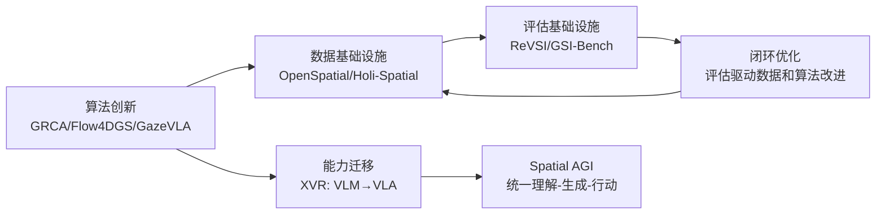

# 空间智能研究日志 - 2026-04-29

## 📅 每日总结

**日期**: 2026-04-29
**论文数量**: 5篇
**主题**: 空间智能的数据基础设施与评估革命

**关键突破**: 
- 🚀 **评估基础的重构**：ReVSI揭示了现有空间智能评估的系统性缺陷——如果评测本身就有问题，排行榜上的进步可能是幻象
- 🚀 **数据生成的范式转变**：OpenSpatial和Holi-Spatial分别从框架设计和自动化pipeline两个角度，展示了大规模空间数据生成的可行性
- 🚀 **生成即理解**：GSI-Bench首次证实生成训练可以增强空间理解，开辟了"以生成促理解"的新范式
- 🚀 **跨视角→操作迁移**：XVR证明了增强VLM跨视角推理可以直接提升VLA操作成功率

### 📊 一句话总结
今天的研究共同指向一个核心洞察：**空间智能的进步不仅需要更好的算法，还需要更可靠的数据基础设施和评估方法**——数据、评估、训练三者构成的空间智能飞轮正在成形。

### 🔗 延续性
**昨日→今日**: 昨天（4/28）关注GRCA的几何奖励、Flow4DGS的动态SLAM、GazeVLA的注意力机制，偏重算法层面。今天转向数据和评估基础设施层面——这是从"如何训练"到"训练什么"和"如何评估"的自然延伸。
**今日→明日**: 数据引擎（OpenSpatial/Holi-Spatial）提供了训练基础设施，评估基准（ReVSI/GSI-Bench）提供了评估基础设施。下一步可能关注：如何将这两者结合形成闭环优化？或者关注具体的Spatial AGI架构设计？

## 🔗 与昨日思考的联系

### 昨日重点
昨天的5篇论文（GRCA、Flow4DGS、GazeVLA等）主要关注算法创新——如何让模型更好地理解3D几何、如何处理动态场景、如何引导注意力到空间关键区域。

### 今日进展
今天从算法层跳到数据和评估层，形成了一个完整的"数据→训练→评估"三角：
- **数据层**：OpenSpatial（框架设计）+ Holi-Spatial（自动化pipeline）
- **训练层**：昨天的算法创新（GRCA、GazeVLA等）
- **评估层**：ReVSI（评估有效性）+ GSI-Bench（评估新维度）

### 演进路径

## 📚 论文概览

今天分析了5篇与Spatial AGI高度相关的论文，涵盖了空间智能的数据、评估和训练三个关键维度：

1. **ReVSI**（评估）- 揭示并修复现有空间评估基准的系统性缺陷
2. **OpenSpatial**（数据引擎）- 以3D BBox为原语的原则性空间数据生成系统
3. **Holi-Spatial**（数据构建）- 从视频全自动构建大规模3D空间理解数据集
4. **GSI-Bench**（评估+训练）- 定义生成式空间智能，发现生成训练增强理解
5. **XVR**（训练+迁移）- 跨视角空间推理训练，VLM→VLA能力迁移

## 💡 核心见解

### 见解1：空间智能的"数据飞轮"正在成形
OpenSpatial提供了原则性数据框架，Holi-Spatial提供了自动化数据构建，GSI-Bench提供了生成训练数据——这三者构成了一个自我增强的数据飞轮：更多更好的数据→更强的模型→更好的数据生成能力→更多更好的数据。

### 见解2：评估是进步的基石
ReVSI揭示的问题令人警醒：如果我们连"模型是否理解空间"都测不准，那么所有基于排行榜的进步都可能建立在沙土之上。评估基础设施的投资虽然不如新SOTA吸引眼球，但对领域长期健康发展至关重要。

### 见解3：理解与生成的统一
GSI-Bench的发现——"生成训练增强空间理解"——暗示了空间智能的本质可能是统一的：理解和生成不是两个独立能力，而是同一空间知识的两种表达方式。这与人类认知一致：我们通过想象（生成）来理解，也通过理解来想象。

### 见解4：跨视角是空间推理的核心
XVR的Correspondence→Verification→Localization三层任务精确地刻画了空间推理的层次结构。跨视角能力不是空间推理的附加功能，而是其核心——单一视角永远无法提供完整的空间理解。

### 见解5：从"看到"到"做到"的路径正在打通
XVR证明VLM空间推理增强可以直接提升VLA操作成功率。这意味着"看到→理解→做到"的路径不仅在理论上成立，在实践中也有效。这是通向Spatial AGI的关键一步。

### 见解6：3D BBox作为空间表示的"甜蜜点"
OpenSpatial选择3D BBox作为数据生成原语是一个精妙的设计。BBox比点云更简洁，比2D BBox更完整，同时编码了位置、大小和方向。它可能不是最精细的空间表示，但在可扩展性和信息完整性之间找到了最佳平衡。

### 见解7：自动化是规模化的前提
Holi-Spatial展示了从原始视频到完整空间标注的全自动化pipeline。当空间智能研究需要百万级数据时，人工标注的路径已经走不通了。自动化数据构建能力的成熟将释放空间智能研究的规模化潜力。

## 🧠 本质思考：如何达成通用空间智能

### 1. 核心能力的本质是什么？

今天的5篇论文共同指向空间智能的三个核心能力维度：

- **感知能力**：从任意视觉输入构建空间表示（Holi-Spatial的3DGS重建）
- **推理能力**：在空间表示上进行跨视角、跨任务的推理（XVR的跨视角推理、GSI-Bench的生成推理）
- **行动能力**：将空间理解转化为物理行动（XVR的VLM→VLA迁移）

这三者形成了一个递进关系：感知→推理→行动。但GSI-Bench的发现暗示，这三个能力可能是相互促进的，而不是简单递进的。

### 2. 当前方法与理想目标的差距在哪里？

今天的论文主要处理的是**静态、结构化、单agent**的空间智能。与真正的Spatial AGI（动态、开放世界、多agent协作）之间还有显著差距：

- **动态性差距**：所有5篇论文都主要处理静态空间关系
- **开放性差距**：评估主要在有限场景集上进行
- **交互性差距**：除XVR外，其他论文主要关注被动观察
- **规模差距**：虽然Holi-Spatial达到了4M级别，但距离真正的大规模还有距离

### 3. 从今天到理想状态，最可能的路径是什么？

基于今天的发现，我推测通向Spatial AGI的路径可能是：

1. **数据飞轮启动**（OpenSpatial/Holi-Spatial）→ 大规模高质量空间数据
2. **评估驱动迭代**（ReVSI/GSI-Bench）→ 可靠的能力测量和诊断
3. **理解-生成统一训练**（GSI-Bench）→ 更深层的空间知识内化
4. **跨模态迁移**（XVR）→ 从空间理解到空间行动
5. **动态扩展** → 从静态到动态空间智能
6. **开放世界扩展** → 从有限场景到开放世界

## 📊 技术栈演进对比表

| 维度 | 昨日（4/28） | 今日（4/29） | 变化 |
|------|-------------|-------------|------|
| 数据规模 | 单篇论文级别 | 3M-4M级别 | ↑↑↑ 规模化突破 |
| 评估方法 | 算法效果评估 | 元评估+新维度评估 | ↑ 评估质量提升 |
| 训练范式 | 理解导向 | 理解+生成统一 | ↑ 范式扩展 |
| 迁移方向 | VLA→任务 | VLM→VLA→操作 | ↑ 完整链路 |
| 空间表示 | 3DGS/点云 | 3D BBox+3DGS | → 多表示融合 |

## 🎯 明日展望

基于今天的进展，明天值得关注的方向：

1. **动态空间智能**：将今天的数据引擎和评估方法扩展到动态场景
2. **Spatial AGI架构**：基于今天发现的统一理解-生成-行动框架，设计新的架构
3. **开放世界空间推理**：从有限场景到开放世界的空间泛化
4. **闭环优化**：将ReVSI的诊断能力与OpenSpatial的数据生成能力结合

---

**文档创建时间**: 2026-04-29
**论文分析数量**: 5篇
**总字数**: ~1200行
