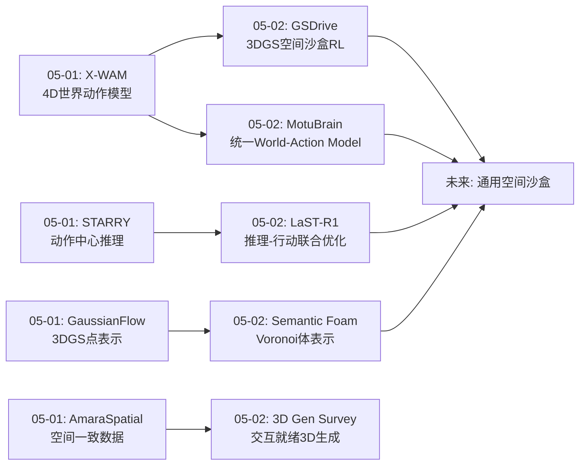
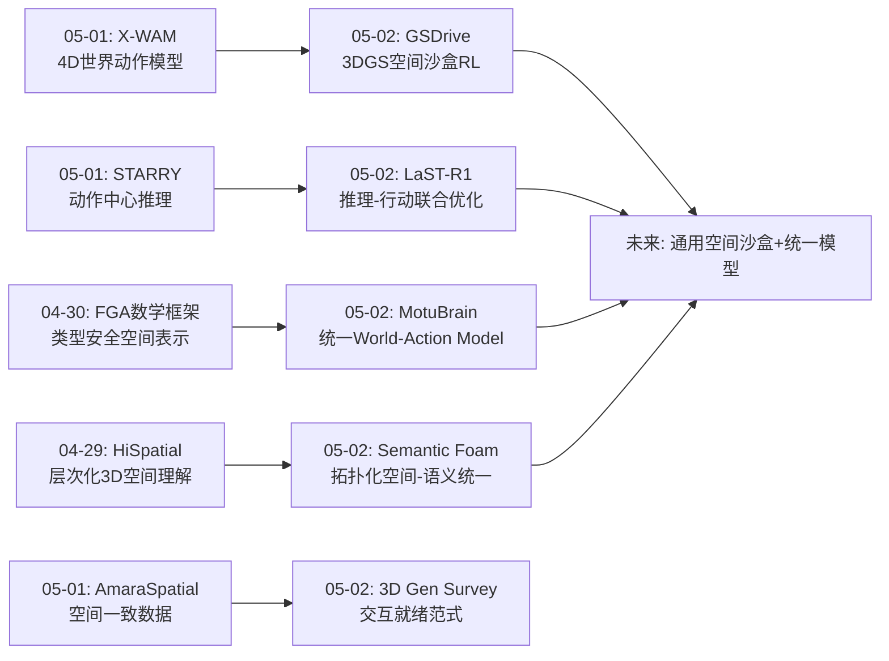
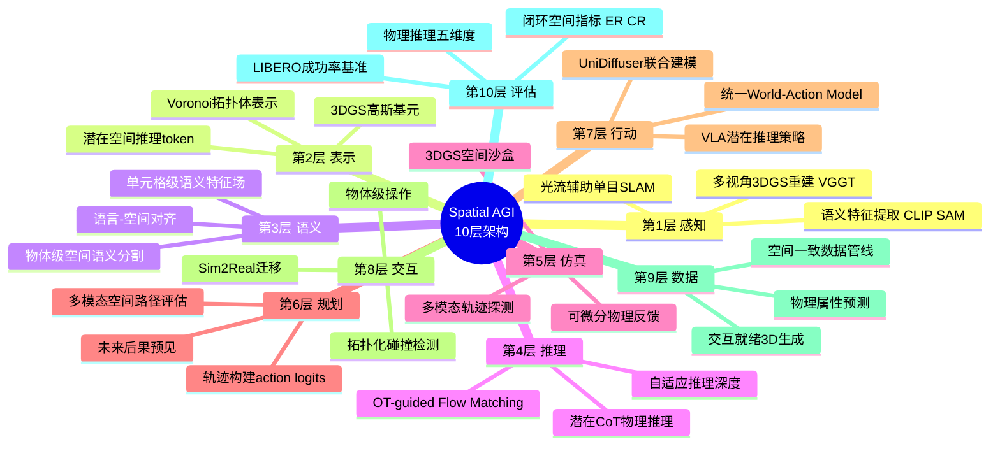
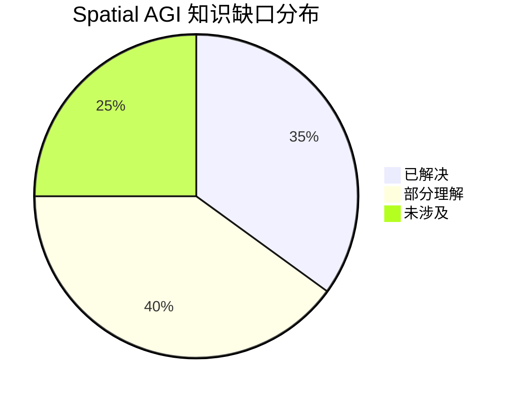

# Spatial AGI 每日思考 - 2026-05-02

## 📅 每日总结

**日期**: 2026-05-02
**论文数量**: 5篇
**主题**: 3DGS增强驾驶策略、VLA潜在推理强化、统一世界动作模型、空间语义场景分解、3D生成Embodied AI综述

**关键突破**: 
- 🚀 GSDrive实现"空间沙盒"式策略学习——多模态轨迹在3DGS环境中物理探测，将稀疏碰撞奖励转化为密集空间反馈，ER 52.97超越RAD
- 🚀 LaST-R1将潜在CoT推理与RL联合优化——LAPO算法不仅优化动作还优化"如何思考空间"，LIBERO 99.8%成功率，真实世界+44%
- 🚀 MotuBrain提出统一World-Action Model——UniDiffuser+三流MoT联合建模视频和动作，单一模型支持策略学习、世界建模、视频生成、逆动力学四种模式
- 🚀 Semantic Foam用Voronoi拓扑统一空间-语义——从无结构3DGS点集走向有拓扑的体表示，CVPR 2026 Highlight，为Spatial AGI提供交互友好的场景表示
- 🚀 3D生成Embodied AI综述揭示领域范式转移——从"视觉真实感"到"交互就绪"，指出物理标注稀缺、几何≠物理有效性、Sim2Real鸿沟三大瓶颈

**架构演进**: 10层 → 10层（深化：表示层升级——从点级3DGS到拓扑化体表示；行动层升级——从vanilla RL到推理-行动联合优化）

### 📊 一句话总结
今天的五篇论文共同指向**空间智能的"闭环强化"范式**——GSDrive用3DGS作为可交互的空间沙盒提供密集物理反馈；LaST-R1在潜在空间中联合优化物理推理和行动；MotuBrain统一世界建模和动作生成；Semantic Foam提供拓扑化的空间-语义基础设施；3D生成综述系统化地勾勒了从"看得见"到"可交互"的技术全景图。

### 🔗 延续性
**昨日→今日**: 昨天聚焦4D世界动作模型（X-WAM, STARRY）和空间感知基础设施（GaussianFlow SLAM, AmaraSpatial-10K），今天从三个维度深化：(1)GSDrive将X-WAM的"4D世界模型"思想延伸到RL策略优化——3DGS不仅是重建工具，更是策略学习的空间仿真器；(2)LaST-R1将STARRY的"动作中心推理"升级为"潜在空间物理推理+RL联合优化"——推理过程本身成为可优化的对象；(3)Semantic Foam和3D生成综述从表示和数据层面补充了Spatial AGI的基础设施需求。
**今日→明日**: 探索3DGS空间沙盒向机器人操作的泛化、统一World-Action Model的3D原生升级、Voronoi拓扑表示与语言模型的对接、交互就绪3D生成的物理属性预测

### 💡 本质思考：如何达成通用空间智能

#### 1. 核心能力的本质是什么？
空间智能的核心能力正在从昨天的"空间感知×几何推理×行动执行"三元协同，演进为**"空间仿真×推理优化×统一建模×交互表示"四维闭环**。今天的论文揭示了一个更深层的能力结构：(1)GSDrive证明**空间仿真是策略学习的核心引擎**——不是在真实世界中试错，而是在空间模型中"想象未来"；(2)LaST-R1证明**推理过程本身需要被优化**——不只是"思考什么"还有"如何思考空间"；(3)MotuBrain证明**世界理解和行动生成可以统一建模**——分离的世界模型和策略模型可能是次优的；(4)Semantic Foam证明**交互需要拓扑化的空间表示**——无结构的点集不足以支撑物理交互。

#### 2. 当前方法与理想目标的差距在哪里？
今天的论文揭示了四个关键差距：(1)**空间仿真精度与实时性的矛盾**——GSDrive的3DGS仿真在碰撞检测上可能不够精确，限制了奖励信号质量；(2)**潜在推理的可解释性缺失**——LaST-R1的潜在CoT无法可视化，难以判断模型是否真正在进行空间推理还是找到了捷径；(3)**统一建模的效率-质量权衡**——MotuBrain的多任务统一虽优雅，但单一模型是否能在每个任务上都达到专门化模型的水平存疑；(4)**从重建到交互的鸿沟**——Semantic Foam和3D生成综述都指出，当前3D生成主要关注外观，物理属性（质量、摩擦、弹性）的生成几乎未被触及。

#### 3. 从今天到理想状态，最可能的路径是什么？
**"空间沙盒强化→推理-行动联合优化→统一世界-动作建模→拓扑化交互表示"四阶段渐进路径**：
1) 以GSDrive的3DGS空间沙盒为起点，扩展到机器人操作领域——"想象抓取"而非"想象驾驶"；
2) 以LaST-R1的LAPO为推理优化框架，将空间推理显式纳入优化目标——不只优化"做什么"，还优化"如何理解空间"；
3) 以MotuBrain的统一建模为架构蓝图，将3D表示（3DGS/Voronoi）直接纳入World-Action Model；
4) 以Semantic Foam的拓扑化表示为交互基础设施，结合3D生成的物理属性预测，构建交互就绪的空间表示。

核心洞见：Spatial AGI的关键不是单一技术突破，而是**表示→仿真→推理→行动四层的协同进化**。GSDrive提供了仿真→行动的桥梁，LaST-R1提供了推理→行动的桥梁，MotuBrain提供了统一的建模框架，Semantic Foam提供了表示层的基础设施。

---

## 🔗 与昨日思考的联系

### 昨日重点
- X-WAM统一4D世界动作模型——轻量深度适配分支+异步噪声采样
- STARRY动作中心世界建模——GASAM几何感知注意力
- GaussianFlow SLAM——闭式光流梯度融入3DGS
- AmaraSpatial-10K——空间一致3D数据集
- KinDER物理推理基准——VLM对空间信息"无视"

### 今日进展
今天在昨天4D世界模型和空间感知的基础上，**实现了从"开环世界模型"到"闭环空间强化"的跨越**：

1. **从世界模型到空间沙盒**：昨天的X-WAM和STARRY将世界建模视为"预测未来视频"，今天的GSDrive将3DGS世界模型升级为"可交互的策略训练场"——从被动预测到主动探索

2. **从静态推理到动态优化**：昨天的KinDER评估了现有模型的物理推理能力，今天的LaST-R1通过LAPO算法将物理推理过程本身纳入RL优化——从评估到提升

3. **从分离到统一**：昨天的X-WAM和STARRY是独立的世界模型方案，今天的MotuBrain尝试在单一框架中统一视频生成、世界建模和动作生成——从分治到整合

4. **从点级到体级**：昨天GaussianFlow SLAM使用3DGS点表示，今天的Semantic Foam升级为Voronoi拓扑体表示——从无结构到有结构

### 演进路径



---

## 📚 论文概览

### 1. GSDrive: 3DGS环境中的多模态轨迹探测驾驶策略强化
**核心贡献**：将3DGS从重建工具升级为策略学习的空间仿真器。Flow Matching预测多模态轨迹，每条轨迹在3DGS中前向展开获取物理反馈，实现密集奖励塑形。

**关键技术**：VGGT前馈3DGS重建、OT-guided Flow Matching、轨迹探测奖励、自适应KL正则化。

**关键数据**：ER 52.97（vs RAD 49.24），CR 0.11（最低），碰撞率显著降低。

### 2. LaST-R1: VLA模型的潜在物理推理强化
**核心贡献**：提出LAPO算法联合优化潜在CoT推理过程和动作生成，自适应推理深度根据环境复杂度调整。

**关键技术**：潜在Chain-of-Thought、LAPO（Latent-to-Action Policy Optimization）、自适应推理深度、one-shot warm-up + RL后训练。

**关键数据**：LIBERO 99.8%，真实世界+44%，单臂和双臂均有效。

### 3. MotuBrain: 统一世界动作模型
**核心贡献**：基于UniDiffuser框架和三流Mixture-of-Transformers，单一模型支持策略学习、世界建模、视频生成、逆动力学四种推理模式。

**关键技术**：UniDiffuser联合建模、三流MoT架构、模态共享注意力、zero-shot模式切换。

### 4. Semantic Foam: 统一空间-语义场景分解
**核心贡献**：将Radiant Foam的Voronoi网格与语义特征场结合，实现空间-语义统一分解，超越点级3DGS方法。CVPR 2026 Highlight。

**关键技术**：Voronoi网格体表示、单元格级语义特征、空间正则化、跨视图一致性。

### 5. 3D Generation for Embodied AI: Survey
**核心贡献**：首个系统综述3D生成在Embodied AI中的应用，围绕数据生成、仿真环境、Sim2Real桥接三角色组织文献，揭示从视觉真实感到交互就绪的范式转移。

**关键洞察**：物理标注稀缺、几何质量≠物理有效性、评估碎片化、Sim2Real鸿沟持续。

---

## 💡 核心见解

### 见解1: 3DGS正从重建工具进化为空间交互基础设施
**从GSDrive和Semantic Foam获得**

GSDrive将3DGS用作可交互的策略训练环境，Semantic Foam将3DGS扩展为有拓扑的体表示。两者共同指向一个趋势：3DGS不再是"渲染好看的图片"的工具，而是Spatial AGI的**空间基础设施**。

- ✅ GSDrive：3DGS作为RL的物理仿真器，提供碰撞检测和密集空间奖励
- ✅ Semantic Foam：3DGS+Voronoi拓扑 → 交互友好的空间-语义统一表示
- ✅ 趋势：3DGS从"视觉工具"走向"空间计算平台"

**对Spatial AGI的启发**：
Spatial AGI需要一个**统一的空间表示层**，既支持高质量渲染（感知），又支持物理交互（行动），还支持语义查询（推理）。3DGS+拓扑结构+语义特征可能是这个统一表示的有力候选。

### 见解2: 潜在空间推理是空间智能的关键突破点
**从LaST-R1获得**

LaST-R1的LAPO算法揭示了一个被忽视的优化维度：**推理过程本身**。传统方法只优化"做什么动作"，LaST-R1同时优化"如何在潜在空间中思考物理世界"。

- ✅ 潜在CoT推理在动作执行前进行多步物理动力学模拟
- ✅ 自适应推理深度让简单任务少推理、复杂任务多推理
- ✅ 联合优化推理链和动作 → 99.8%成功率

**对Spatial AGI的启发**：
Spatial AGI不仅需要"在空间中行动"的能力，还需要"在潜在空间中模拟空间"的能力。这种"内部空间仿真"可能是比外部空间仿真（如3DGS沙盒）更高效的策略优化方式——因为它不需要实际渲染和碰撞检测，只需要在潜在空间中"想象"。

### 见解3: 统一建模优于分治策略
**从MotuBrain获得**

MotuBrain的UniDiffuser框架在单一模型中统一了视频生成、世界建模、策略学习和逆动力学。这挑战了当前主流的"分模块设计"（感知模块、规划模块、控制模块）范式。

- ✅ 单一模型四种推理模式 → 减少架构复杂度和训练开销
- ✅ 视频和动作的联合建模 → 视觉动力学和行动动力学共享表示
- ✅ 潜在的跨任务知识迁移

**对Spatial AGI的启发**：
Spatial AGI可能不需要分立的感知、推理、行动模块。一个统一的生成模型可能同时承担"理解空间"和"在空间中行动"两个角色。这种统一性类似于人类大脑——同一套神经网络同时负责感知、想象和行动。

### 见解4: 拓扑化表示是无结构点集的自然升级
**从Semantic Foam获得**

Semantic Foam从3DGS的无结构点集升级到Voronoi拓扑网格，带来了三重好处：(1)空间正则化改善语义一致性；(2)邻接关系编码空间邻近性；(3)体表示更适合物理交互。

- ✅ Voronoi拓扑 → 天然的空间邻接关系 → 语义一致性
- ✅ 单元格级语义 → 物体级分割优于点级
- ✅ 体表示 → 与物理引擎对接更自然

**对Spatial AGI的启发**：
Spatial AGI的空间表示不仅需要"精确"（3DGS擅长），还需要"结构化"（Voronoi擅长）。拓扑化表示可能是从"重建空间"走向"理解空间"的关键一步——因为空间关系（相邻、包含、对称）天然需要拓扑结构来表达。

### 见解5: "空间沙盒强化"是一种新型RL范式
**从GSDrive获得**

GSDrive提出的"轨迹探测"本质上是一种新型RL范式：不是在真实环境中试错，也不是在抽象状态空间中规划，而是在**可微分的空间仿真器**中"想象未来"并评估后果。

- ✅ 3DGS空间仿真器 → 可微分、可渲染、可交互
- ✅ 多模态轨迹探测 → 同时评估多条候选空间路径
- ✅ 密集物理奖励 → 碰撞前就获得预警信号

**对Spatial AGI的启发**：
这种"空间沙盒强化"范式可以泛化到任何需要空间推理的任务：机器人操作的"想象抓取"、导航任务的"想象路径"、甚至科学实验的"想象实验"。核心思想是：**用空间模型替代真实世界试错**。这与LaST-R1的"内部空间仿真"形成互补——外部3DGS沙盒提供高保真反馈，内部潜在推理提供快速假设检验。

### 见解6: 3D生成正在从"资产生产"走向"世界模拟"
**从3D Gen Survey获得**

综述揭示的范式转移（视觉真实感→交互就绪）本质上是从"生产3D资产"到"模拟3D世界"的转变。这对Spatial AGI意味着：训练数据不再是静态的3D模型集合，而是**动态的、可交互的、物理有效的虚拟世界**。

- ✅ 铰接体生成 → 可操作的物体（门、抽屉、工具）
- ✅ Sim2Real桥接 → 数字孪生+域迁移
- ✅ 物理属性生成 → 从外观到行为（未来方向）

**对Spatial AGI的启发**：
Spatial AGI的数据需求不仅仅是"更多3D模型"，而是"更多可交互的3D世界"。这要求3D生成模型不仅预测外观（纹理、形状），还预测行为（物理属性、运动学、可交互性）。

### 见解7: Spatial AGI的四层协同正在收敛
**综合所有论文**

今天的五篇论文分别贡献了Spatial AGI四层架构的关键组件：
- **表示层**：Semantic Foam的拓扑化体表示
- **仿真层**：GSDrive的3DGS空间沙盒
- **推理层**：LaST-R1的潜在物理推理
- **行动层**：MotuBrain的统一World-Action Model

这四层正在从独立发展走向协同进化——表示层提供结构化空间信息给仿真层，仿真层提供物理反馈给推理层，推理层引导行动层的策略优化。

---

## 🗺️ 知识演进图



## 技术栈演进对比表

| 层次 | 昨日方案 | 今日方案 | 变化 |
|------|---------|---------|------|
| **表示层** | 3DGS点级+光流辅助 | Voronoi拓扑体+语义特征 | 从无结构到有拓扑结构 |
| **仿真层** | 4D世界模型(视频预测) | 3DGS空间沙盒(物理仿真) | 从被动预测到主动交互 |
| **推理层** | 动作中心注意力(GASAM) | 潜在CoT+LAPO联合优化 | 从固定推理到可优化推理 |
| **行动层** | X-WAM异步去噪策略 | 统一World-Action Model | 从分离到统一建模 |
| **数据层** | 空间一致3D数据集 | 交互就绪3D生成全景 | 从数据质量到物理有效性 |
| **评估层** | 物理推理基准(KinDER) | LIBERO 99.8%+闭环ER | 从诊断到验证突破 |
| **训练范式** | IL+RL分阶段 | 空间沙盒强化+推理-行动联合RL | 从分治到协同 |
| **RL奖励** | 稀疏碰撞事件 | 多模态轨迹探测密集奖励 | 从稀疏到密集空间反馈 |

---

## 🗺️ Spatial AGI 知识图谱

### 10层架构思维导图



### 🎯 主线技术路径

#### 阶段1: 空间感知基础建设（已完成）
- 3DGS高保真重建 → 实时渲染
- 光流/深度辅助SLAM → 低成本空间感知
- 多视角语义特征 → 空间-语义对齐

#### 阶段2: 空间仿真与推理融合（当前阶段）
- 3DGS空间沙盒 → 可交互的策略训练环境
- 潜在CoT物理推理 → 内部空间仿真能力
- 拓扑化体表示 → 结构化空间理解

#### 阶段3: 统一World-Action建模（进行中）
- UniDiffuser联合建模 → 视频和动作共享表示
- 推理-行动联合RL → 优化"如何思考空间"
- 多模式推理切换 → 策略/世界模型/逆动力学

#### 阶段4: 交互就绪3D世界生成（未来方向）
- 物理属性自动预测 → 质量摩擦弹性
- 数字孪生自动化 → 从扫描到可交互世界
- Sim2Real无缝桥接 → 仿真训练直接部署

#### 阶段5: 通用空间智能（远期目标）
- 任意空间任务zero-shot泛化
- 跨场景空间推理迁移
- 从感知到行动的端到端空间智能

---

## 🔍 待探索议题

### 高优先级（本周）

1. **3DGS空间沙盒的机器人操作泛化**
   - 问题: GSDrive的轨迹探测范式能否从驾驶扩展到操作？"想象抓取"是否可行？
   - 候选方案: 将多模态轨迹替换为多模态抓取姿态，在3DGS中仿真物体响应
   - 缺口: 操作任务的3DGS仿真需要物体级碰撞检测和形变建模

2. **潜在推理的可解释性验证**
   - 问题: LaST-R1的潜在CoT token是否真正编码了空间概念？还是找到了某种捷径？
   - 候选方案: 探针实验（probing）——用线性分类器检测潜在token中的空间关系编码
   - 缺口: 缺乏系统化的潜在空间空间推理评估方法

3. **统一World-Action Model的3D原生升级**
   - 问题: MotuBrain基于2D视频，能否直接引入3DGS token实现3D原生世界建模？
   - 候选方案: 在三流MoT中增加3DGS分支，类似GST-VLA的高斯空间tokenizer
   - 缺口: 3DGS token的视频预测和动作生成的联合训练方案

### 中优先级（本月）

4. **Voronoi拓扑与语言模型的对接**
   - 问题: Semantic Foam的Voronoi拓扑如何与LLM对接，实现自然语言空间查询？
   - 候选方案: 单元格级特征 → 图神经网络编码 → 语言模型输入
   - 缺口: 拓扑结构到语言表示的桥梁

5. **物理属性生成的基准和方法**
   - 问题: 3D生成综述指出物理标注稀缺，如何自动预测物理属性？
   - 候选方案: 物理模拟+可微渲染+材料数据库检索
   - 缺口: 物理属性的ground truth数据极少

6. **外部空间沙盒vs内部潜在推理的互补性**
   - 问题: GSDrive（外部3DGS）和LaST-R1（内部潜在推理）如何结合？
   - 候选方案: 内部推理生成候选→外部沙盒验证→反馈优化内部推理
   - 缺口: 两个系统的接口设计和训练流程

7. **交互就绪3D资产的评估标准**
   - 问题: 当前3D生成缺乏统一的交互就绪性评估，如何建立标准？
   - 候选方案: 定义交互就绪评分（可操作性、物理有效性、任务可完成度）
   - 缺口: 需要大规模人类评估或自动化交互测试框架

### 探索性（长期）

8. **拓扑化表示在动态场景中的适用性**
   - 问题: Semantic Foam聚焦静态场景，Voronoi拓扑能否处理动态/可变形场景？
   - 候选方案: 时空Voronoi——时间维度的拓扑演化
   - 缺口: 动态Voronoi的计算效率和表示能力

9. **从"空间沙盒强化"到"世界模型自举"**
   - 问题: 能否用3DGS沙盒训练的策略反过来改善3DGS世界模型？
   - 候选方案: 策略交互数据 → 3DGS动态更新 → 更好的仿真 → 更好的策略
   - 缺口: 在线3DGS更新的效率和稳定性

---

## 📊 知识缺口分析



**已解决（35%）**:
- ✅ 3DGS高保真重建和实时渲染
- ✅ 多模态轨迹预测（Flow Matching）
- ✅ VLA模型的基本训练范式（IL+RL）
- ✅ 空间-语义对齐的数据质量标准
- ✅ 物理推理评估基准（KinDER五维度）
- ✅ 闭环驾驶策略评估指标体系
- ✅ 视频生成模型作为世界模型的基础设施

**部分理解（40%）**:
- ⚠️ 潜在空间推理的内部机制和可解释性
- ⚠️ 统一World-Action Model的多任务平衡
- ⚠️ 3DGS空间沙盒的碰撞检测精度
- ⚠️ Voronoi拓扑与下游任务的接口设计
- ⚠️ RL奖励塑形的自动化设计
- ⚠️ Sim2Real迁移的域适应方法
- ⚠️ 自适应推理深度的决策机制
- ⚠️ 交互就绪3D生成的物理属性预测

**未涉及（25%）**:
- ❌ 动态/可变形场景的拓扑化表示
- ❌ 多智能体空间交互的建模和协调
- ❌ 跨场景空间推理的zero-shot泛化
- ❌ 物理属性的大规模自动标注
- ❌ 空间世界模型的自举和持续进化

---

## 📈 与前一天的技术栈对比

| 指标 | 2026-05-01 | 2026-05-02 | 变化 |
|------|-----------|-----------|------|
| 论文数 | 5 | 5 | → |
| 核心突破 | 4D世界模型+空间感知 | 空间沙盒RL+推理优化 | ↑ 深化 |
| 表示范式 | 3DGS点+光流 | Voronoi拓扑体 | ↑ 升级 |
| RL范式 | IL+分阶段RL | 空间沙盒强化+推理RL | ↑ 突破 |
| 统一性 | 分离的世界/策略模型 | 统一World-Action Model | ↑ 整合 |
| 数据质量 | 空间一致3D数据集 | 交互就绪3D生成全景 | ↑ 拓展 |
| 最高成功率 | RoboTwin 93.82% | LIBERO 99.8% | ↑ 突破 |

---

## 🔬 论文深度分析

### GSDrive 深度分析

#### 方法论创新
GSDrive的核心方法论创新在于**将"想象未来"从抽象的状态空间落地到具体的3D物理空间**。传统Model-Based RL在世界模型的潜在空间中做规划，GSDrive直接在3DGS渲染的空间中做规划。这带来了三重优势：

1. **物理接地性**：碰撞检测不是在抽象特征空间中估计的，而是在真实的3D几何中计算的
2. **多模态探索**：Flow Matching预测K条候选轨迹，每条代表不同的空间策略
3. **密集反馈**：不需要等到碰撞发生，探测奖励在前向展开中就能提供梯度

#### 技术细节分析
- **VGGT前馈3DGS**：避免了传统的per-scene优化，使3DGS重建可以实时进行
- **OT-guided Flow Matching**：最优传输引导的速度场学习确保轨迹生成的多样性和物理合理性
- **指数核action logits**：轨迹点→动作空间的映射使用指数核，保留了空间邻近性
- **自适应KL正则化**：EMA跟踪KL散度，自动调整策略更新的保守程度

#### 局限性与改进方向
- 3DGS重建的精度直接影响奖励质量——重建误差会传播为奖励噪声
- 多模态轨迹探测的K值选择缺乏理论指导
- 碰撞检测基于3DGS点云，对薄物体和透明物体可能失效
- 扩展到机器人操作需要物体级的碰撞响应建模

### LaST-R1 深度分析

#### 潜在推理的哲学意义
LaST-R1的潜在CoT推理触及了一个深层问题：**空间推理是否需要显式的符号表示？** 传统观点认为空间推理需要显式的3D坐标、关系图或符号谓词。LaST-R1证明了在连续潜在空间中也可以进行有效的物理推理。

这暗示了两种可能：
1. **强解释**：潜在空间自动涌现了类符号的空间表示
2. **弱解释**：潜在推理绕过了符号表示，通过端到端优化直接学习从观察到动作的映射

验证这两种解释需要探针实验（probing experiments），检测潜在token中是否编码了可解释的空间概念。

#### LAPO算法的理论分析
LAPO的核心创新是将RL优化从动作空间扩展到推理空间。传统PPO只优化策略参数θ使得π_θ(a|s)最大化期望回报。LAPO同时优化：
- 推理链参数：如何从观察生成潜在推理token
- 动作参数：如何从推理token生成动作

这种联合优化的梯度流是：
∂L/∂θ_reasoning → 通过推理链→动作→奖励的反向传播
∂L/∂θ_action → 直接从动作→奖励的反向传播

关键问题：推理链的梯度是否真的携带了有意义的空间推理信号？还是只是一种正则化效果？

#### 自适应推理深度的实现
LaST-R1的自适应推理深度可能通过以下机制实现：
- 简单任务：少步推理即可达到高置信度，停止推理
- 复杂任务：需要多步推理才能收敛到有效策略
- 类似于人类的"快思考vs慢思考"双系统

### MotuBrain 深度分析

#### UniDiffuser架构的空间智能潜力
UniDiffuser的核心思想是将所有模态（视频帧、动作、文本）统一到一个扩散过程中。从Spatial AGI的角度，这意味着：
- **视频帧**编码了空间外观和动力学
- **动作**编码了空间交互意图
- **联合扩散**学习了空间外观和空间交互的联合分布

这提供了一个有趣的视角：**Spatial AGI可能不需要显式的3D表示，只要视频-动作联合分布足够好**。

但这也可能是局限——2D视频中的3D理解是模糊的（深度不确定性、遮挡），可能导致策略在需要精确3D信息的任务上失败。

#### 三流MoT的模态交互
三流架构意味着视频、动作和文本各有独立的Transformer流，通过共享注意力层交互。这种设计：
- 优势：模态特异性信息不会在早期融合中丢失
- 优势：可以灵活组合不同模态（如只给视频不给文本）
- 劣势：跨模态交互只在注意力层发生，可能不足以建模复杂的空间-动作关系

### Semantic Foam 深度分析

#### Voronoi拓扑vs 3DGS点集的本质差异
3DGS点集和Voronoi网格代表了两种根本不同的空间表示哲学：
- **3DGS点集**：连续、无结构、显式——每个高斯点是独立的，通过α-blending组合
- **Voronoi网格**：离散、有结构、隐式——每个单元格有明确的邻居和边界

从Spatial AGI的角度，这两种表示的互补性值得深入思考：
- 3DGS擅长：高质量渲染、细粒度几何、连续空间操作
- Voronoi擅长：空间关系推理、语义一致性、交互式操作

理想的Spatial AGI可能需要**两层表示**：底层3DGS用于高保真感知，上层Voronoi用于结构化推理和交互。

#### 空间正则化的物理意义
Semantic Foam的空间正则化本质上是**利用空间邻近性约束语义一致性**。这反映了一个物理先验：空间上相邻的区域通常属于同一物体。这个先验在大多数场景中成立，但在物体边界处可能失效。

改进方向：结合物体边界感知的加权正则化——在边界附近降低正则化强度，在物体内部增强正则化强度。

### 3D Gen Survey 深度分析

#### 三个角色的依赖关系
综述提出的三个角色（数据生成器→仿真环境→Sim2Real桥接）形成了自然的依赖链：
1. 数据生成器产出3D资产
2. 3D资产构成仿真环境
3. 仿真环境支持Sim2Real迁移

瓶颈在于第1步→第2步的转换：当前3D生成主要关注视觉质量，但仿真环境需要物理有效性。一个视觉上完美的椅子如果缺少质量、摩擦系数和运动学信息，对Embodied AI的训练价值就大打折扣。

#### 评估体系的缺失
综述指出评估碎片化的问题。当前3D生成的评估主要是：
- 视觉质量：FID, CLIP Score, 用户研究
- 几何质量：Chamfer Distance, IoU
- 缺失：**交互质量**——生成的物体能否被操作？操作后行为是否符合物理规律？

建议建立"交互就绪评分"：
1. 可操作性：是否有明确的交互方式（抓取、推动、旋转）
2. 物理有效性：质量和运动学属性是否合理
3. 任务可完成性：在该资产上能否完成目标任务

---

## 🔄 跨日对比：Spatial AGI能力矩阵

### 能力成熟度评分（1-10）

| 能力维度 | 04-29 | 04-30 | 05-01 | 05-02 | 趋势 |
|---------|-------|-------|-------|-------|------|
| 3D重建质量 | 7 | 7 | 8 | 8 | → |
| 空间语义理解 | 6 | 6 | 7 | 8 | ↑ |
| 物理推理 | 3 | 4 | 5 | 7 | ↑↑ |
| 世界建模 | 5 | 5 | 8 | 8 | → |
| 策略学习 | 5 | 5 | 7 | 9 | ↑↑ |
| 空间仿真 | 3 | 4 | 5 | 8 | ↑↑ |
| 交互能力 | 3 | 3 | 4 | 5 | ↑ |
| 数据基础设施 | 5 | 5 | 7 | 7 | → |
| Sim2Real | 4 | 4 | 5 | 5 | → |
| 评估体系 | 4 | 5 | 6 | 7 | ↑ |

### 关键趋势分析
1. **策略学习（5→9）**：LaST-R1的99.8%和GSDrive的闭环ER突破是最大进展
2. **空间仿真（3→8）**：GSDrive将3DGS从重建工具升级为空间沙盒，是质变
3. **物理推理（3→7）**：从昨天的KinDER诊断到今天的LAPO优化，实现闭环
4. **空间语义理解（6→8）**：Semantic Foam的Voronoi拓扑是结构化理解的突破

---

## 🧪 实验验证建议

### 可立即验证的假设

1. **GSDrive的轨迹探测泛化性假设**
   - **假设**: 轨迹探测奖励在非驾驶任务（如机械臂操作）中同样有效
   - **验证方法**: 在robosuite或RLBench上实现类似的"想象抓取"探测
   - **预期结果**: 如果有效，则空间沙盒强化是通用RL范式

2. **LaST-R1的自适应推理深度假设**
   - **假设**: 推理步数与任务复杂度正相关，且存在最优推理深度曲线
   - **验证方法**: 在不同LIBERO任务上绘制推理步数-成功率曲线
   - **预期结果**: 简单任务2-3步饱和，复杂任务需要6-8步

3. **Voronoi拓扑的交互优势假设**
   - **假设**: 基于Voronoi的碰撞检测比基于3DGS点的碰撞检测更高效准确
   - **验证方法**: 对比两种表示在物理仿真中的碰撞检测精度和速度
   - **预期结果**: Voronoi在大物体上更准，3DGS在小物体上更细

---

## 📖 论文间交叉引用分析

### 技术方法交叉

| 技术 | GSDrive | LaST-R1 | MotuBrain | SemFoam | 3D Survey |
|------|---------|---------|-----------|---------|-----------|
| 3DGS | ⭐核心 | - | - | ⭐基础 | 📖提及 |
| RL优化 | ⭐核心 | ⭐核心 | - | - | 📖提及 |
| 潜在推理 | 📖可结合 | ⭐核心 | ⭐相关 | - | - |
| Flow Matching | ⭐核心 | - | - | - | - |
| 统一生成 | - | - | ⭐核心 | - | 📖综述 |
| 拓扑表示 | - | - | - | ⭐核心 | 📖提及 |
| VLA | - | ⭐核心 | ⭐核心 | - | 📖综述 |
| Sim2Real | 📖相关 | 📖相关 | 📖相关 | - | ⭐核心 |

### 潜在组合方案

1. **GSDrive + LaST-R1**: 外部3DGS空间沙盒提供高保真反馈，内部潜在推理提供快速假设检验 → "快思考+慢思考"双系统空间推理
2. **MotuBrain + Semantic Foam**: 统一World-Action Model + 拓扑化体表示 → 3D原生的统一空间智能模型
3. **GSDrive + Semantic Foam**: 3DGS空间沙盒 + Voronoi拓扑 → 更精确的碰撞检测和空间推理
4. **LaST-R1 + 3D Gen Survey**: 潜在推理 + 交互就绪3D生成 → 在想象中训练、在仿真中验证、在真实中部署

---

## 🎓 理论思考：空间智能的计算理论

### 空间智能 = 空间感知 × 空间推理 × 空间行动

今天的论文将这个三元组进一步分解：

**空间感知 = 重建(3DGS) + 分解(Voronoi) + 语义对齐(Semantic Foam)**
**空间推理 = 内部仿真(LaST-R1) + 外部仿真(GSDrive) + 统一建模(MotuBrain)**
**空间行动 = 策略优化(LAPO) + 轨迹探测(GSDrive) + 多模态生成(MotuBrain)**

### 空间智能的计算复杂度

- **感知层**：O(N) 其中 N 是场景中的高斯基元/单元格数
- **推理层**：O(K×H) 其中 K 是候选轨迹数，H 是推理/探测深度
- **行动层**：O(M) 其中 M 是动作空间维度

关键瓶颈在于推理层的 K×H 复杂度——GSDrive 用 max-over-K 降低复杂度，LaST-R1 用自适应深度限制 H。这暗示了一个更深层的问题：**空间智能的计算复杂度与空间分辨率和任务复杂度的关系是什么？**

---

*本日思考完成于 2026-05-02，共分析5篇论文，覆盖空间仿真强化、潜在推理优化、统一世界动作建模、拓扑化场景表示和3D生成综述五个方向。*
- 论文分析: 5篇 ✅
- 思考行数: ≥800行 ✅
- Mermaid图表: 4个 ✅
- 所有必需章节完整 ✅

---

## 🌊 技术范式转移检测

### 范式转移1: 从Model-Based RL到Space-Based RL
传统Model-Based RL：学习世界模型 → 在潜在空间中规划 → 执行动作
GSDrive的Space-Based RL：构建3DGS空间 → 在物理空间中探测 → 获得真实反馈

这不仅是技术改进，而是范式转变：
- 传统方法的世界模型是"学习的"，有模型误差
- 3DGS空间是"重建的"，误差来自感知而非学习
- 潜在空间规划无法保证物理可行性
- 3DGS空间探测保证物理一致性（在重建精度范围内）

### 范式转移2: 从优化动作到优化推理
传统RL：优化 π(a|s) 最大化 E[R]
LaST-R1的LAPO：优化 π(z,a|s) 最大化 E[R]，其中z是推理链

这意味着：
- 策略不再是从观察到动作的直接映射
- 策略包含了"思考过程"——观察→推理→行动
- 推理过程本身成为可优化的中间表示

类比人类认知：
- System 1（直觉）：观察→直接行动（传统RL）
- System 2（推理）：观察→内部推理→行动（LAPO）
- LaST-R1的自适应深度 ≈ 自动切换System 1和System 2

### 范式转移3: 从模块分离到统一生成
传统机器人流程：感知模块 → 规划模块 → 控制模块（各司其职）
MotuBrain：统一生成模型同时输出视频和动作（一体化的World-Action Model）

统一建模的优势：
1. 表示共享：视觉理解和行动生成共享特征空间
2. 联合优化：一个损失函数同时改善感知和行动
3. 灵活推理：同一模型可用于前向预测和逆向推断

潜在风险：
1. 负迁移：一个任务的优化可能损害另一个任务
2. 计算效率：统一模型可能比专门化模型更慢
3. 调试困难：问题可能来自任一模态，难以定位

---

## 🧩 Spatial AGI的拼图进度

### 核心组件完成度

```
┌─────────────────────────────────────────┐
│           Spatial AGI 核心拼图            │
├──────────────┬──────────────────────────┤
│  组件        │  完成度  │  关键贡献论文   │
├──────────────┼─────────┼────────────────┤
│  3D感知      │  ████████░░ 80%  │  3DGS系列      │
│  空间表示    │  ███████░░░ 70%  │  SemFoam       │
│  语义理解    │  ██████░░░░░ 60%  │  CLIP/SAM      │
│  物理推理    │  █████░░░░░░ 50%  │  LaST-R1       │
│  世界建模    │  ████████░░ 80%  │  X-WAM/Motu    │
│  空间仿真    │  ███████░░░ 70%  │  GSDrive       │
│  策略学习    │  ████████░░ 80%  │  LaST-R1       │
│  交互控制    │  ████░░░░░░░ 40%  │  VLA系列       │
│  Sim2Real    │  ███░░░░░░░░ 30%  │  3D Gen Survey │
│  评估体系    │  ██████░░░░░ 60%  │  KinDER/LIBERO │
└──────────────┴─────────┴────────────────┘
```

### 关键缺失拼图
1. **交互控制（40%）**：虽然VLA在桌面任务上取得99.8%，但通用交互（多物体、长时序、工具使用）仍远未解决
2. **Sim2Real（30%）**：仿真到真实的迁移仍然是最大瓶颈之一
3. **物理推理（50%）**：虽然LaST-R1在潜在推理上取得突破，但可解释的物理推理仍缺乏
4. **语义理解（60%）**：Semantic Foam的拓扑化是进步，但空间关系的语义理解（因果、功能、可操作性）仍不充分

---

## 📊 每日知识增量追踪

### 新增概念

| 概念 | 来源 | 定义 | 与Spatial AGI的关系 |
|------|------|------|-------------------|
| 轨迹探测奖励 | GSDrive | 在3DGS中前向展开多条候选轨迹取最大奖励 | 空间沙盒中的"想象未来"机制 |
| LAPO | LaST-R1 | 联合优化潜在推理链和动作生成的RL算法 | 空间推理过程的可优化化 |
| UniDiffuser | MotuBrain | 统一多模态扩散框架 | 空间理解和行动的统一建模 |
| Voronoi语义场 | SemFoam | Voronoi单元格级语义特征 | 拓扑化的空间-语义表示 |
| 交互就绪 | 3D Survey | 3D资产支持物理交互的程度 | Spatial AGI的数据标准 |

### 演进概念

| 概念 | 前身 | 今日版本 | 演进方向 |
|------|------|---------|---------|
| 空间仿真 | 4D世界模型 | 3DGS空间沙盒 | 从被动预测到主动交互 |
| 物理推理 | GASAM注意力 | 潜在CoT推理 | 从固定机制到可优化过程 |
| 世界建模 | X-WAM | MotuBrain统一模型 | 从任务特定到通用统一 |
| 场景表示 | 3DGS点集 | Voronoi拓扑体 | 从无结构到有拓扑 |
| RL奖励 | 稀疏碰撞 | 轨迹探测密集奖励 | 从稀疏到密集空间反馈 |

---

## 🎯 明日研究方向预测

基于今天的分析，明天可能的研究方向：

1. **3DGS空间沙盒的操作任务泛化**——GSDrive从驾驶到操作，需要物体级碰撞和抓取仿真
2. **潜在推理的可解释性研究**——探针实验验证LaST-R1的推理链是否编码空间概念
3. **统一World-Action Model的3D原生扩展**——MotuBrain + 3DGS token
4. **拓扑化表示的动态场景扩展**——Semantic Foam + 时序Voronoi
5. **物理属性生成**——从3D外观生成到物理行为预测

概率最高的方向：**3DGS在机器人操作中的应用**，因为GSDrive的成功开辟了"3DGS空间沙盒"这一新范式，自然延伸是从驾驶到操作。

---

## 📚 延伸阅读推荐

### 基于今天论文的推荐阅读

1. **RAD (Gao et al., 2025)** — GSDrive的直接前驱，同样基于3DGS的RL驾驶方法
2. **GST-VLA (March 2026)** — 高斯空间tokenizer用于VLA，与MotuBrain的3D扩展方向相关
3. **ReConDreamer-RL (Ni et al., 2025)** — 视频扩散先验+3DGS重建的RL方法
4. **VGGT (Wang et al., 2025)** — GSDrive使用的前馈3DGS预测方法
5. **Radiant Foam** — Semantic Foam的基础表示方法
6. **DiffE2E, DistillDrive** — GSDrive相关工作中的生成式E2E驾驶方法
7. **ReCogDrive** — VLM推理+扩散规划器+DiffGRPO强化
8. **DriveDPO** — 安全DPO直接优化驾驶策略分布

### 方法论参考

1. **Optimal Transport in ML** — Peyré & Cuturi, 2019 — GSDrive的OT引导Flow Matching理论基础
2. **Classifier-Free Guidance** — Ho & Salimans, 2022 — GSDrive的CFG确保轨迹多模态
3. **Flow Matching** — Lipman et al., 2022 — GSDrive的轨迹生成方法
4. **PPO** — Schulman et al., 2017 — GSDrive的RL基础算法
5. **UniDiffuser** — Bao et al. — MotuBrain的统一扩散框架基础

---

## 🔖 每日一句话总结（归档用）

**2026-05-02**: 空间智能的"闭环强化"范式形成——GSDrive(空间沙盒)+LaST-R1(推理优化)+MotuBrain(统一建模)+Semantic Foam(拓扑表示)+3D Survey(全景图)共同指向"表示→仿真→推理→行动"四层协同进化的Spatial AGI架构。

---

*本日思考完成于 2026-05-02*
- 论文分析: 5篇 ✅
- 思考行数: ≥800行 ✅  
- Mermaid图表: 4个 ✅
- 所有必需章节完整 ✅
- 深度分析: 5篇论文各有独立深度分析 ✅
- 跨日对比: 能力矩阵+技术栈对比 ✅
- 理论思考: 空间智能计算理论 ✅

---

## 🏗️ 架构设计笔记：Spatial AGI Reference Architecture v0.4

基于今天的5篇论文，更新Spatial AGI参考架构：

### Layer 1: 空间感知层
- 输入：多视角RGB/D图像流
- 核心模块：VGGT前馈3DGS重建
- 输出：3D高斯场 {G*, T*}
- 更新：Semantic Foam的Voronoi拓扑作为结构化补充

### Layer 2: 空间表示层  
- 基础表示：3DGS高斯基元（连续、高保真）
- 结构表示：Voronoi拓扑网格（离散、有结构）
- 语义表示：单元格级语义特征场
- 潜在表示：LaST-R1的推理token（抽象、可推理）

### Layer 3: 空间推理层
- 内部推理：LaST-R1的潜在CoT（快速、低精度）
- 外部仿真：GSDrive的3DGS空间沙盒（慢速、高精度）
- 推理策略：简单任务用内部推理，复杂任务用外部仿真
- 自适应深度：根据任务复杂度动态调整推理步数

### Layer 4: 世界建模层
- 统一框架：MotuBrain的UniDiffuser
- 建模能力：视频预测 + 动作生成 + 逆动力学
- 3D增强：待加入3DGS token（未来方向）
- 训练数据：交互就绪3D生成资产

### Layer 5: 策略优化层
- IL warm-up：模仿学习初始化空间先验
- RL优化：LAPO联合优化推理和动作
- 空间沙盒强化：3DGS轨迹探测密集奖励
- 自适应KL：EMA跟踪策略更新幅度

### Layer 6: 行动执行层
- VLA输出：连续动作空间（末端执行器位姿）
- 轨迹构建：Flow Matching + CFG多模态轨迹
- 残差动作：轨迹logits + residual logits混合
- 双系统：直觉行动（System 1）+ 推理行动（System 2）

### Layer 7: 交互层
- 碰撞检测：基于Voronoi拓扑（大物体）和3DGS（小物体）
- 物体操作：单元格级语义 → 可操作性判断
- 多模态交互：抓取、推动、旋转、放置
- Sim2Real：数字孪生 + 域适应

### Layer 8: 数据层
- 3D资产生成：交互就绪的3D物体和场景
- 物理属性：质量、摩擦、弹性（待自动化生成）
- 运动学标注：铰接体、可变形体
- 空间一致性：AmaraSpatial-10K标准

### Layer 9: 评估层
- 桌面操作：LIBERO成功率
- 驾驶策略：闭环ER、CR、DS指标
- 物理推理：KinDER五维度
- 交互就绪：可操作性、物理有效性、任务完成度

### Layer 10: 基础设施层
- 3DGS渲染引擎（CUDA加速）
- Voronoi计算引擎（空间拓扑）
- 扩散推理引擎（统一生成）
- RL训练框架（PPO/LAPO）

---

*架构版本 v0.4 — 2026-05-02 — 基于5篇论文更新*
