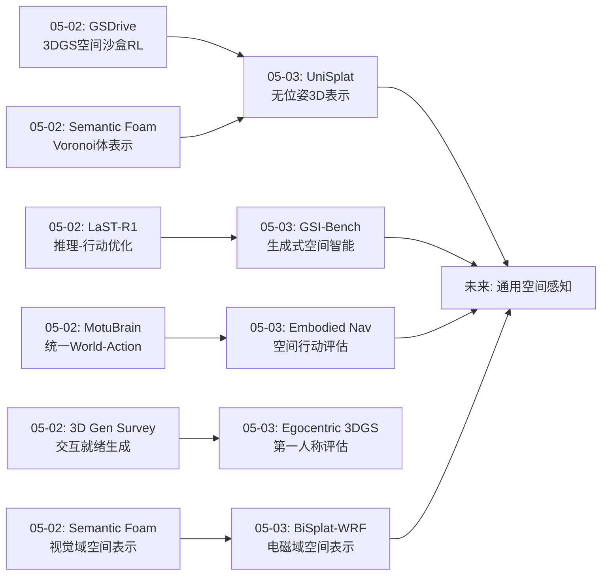
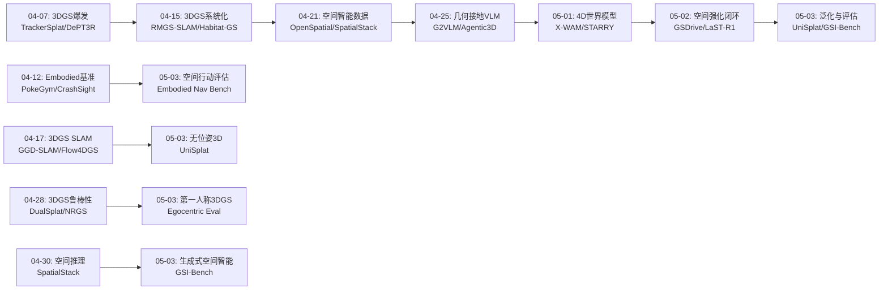
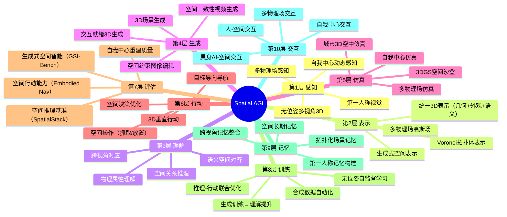
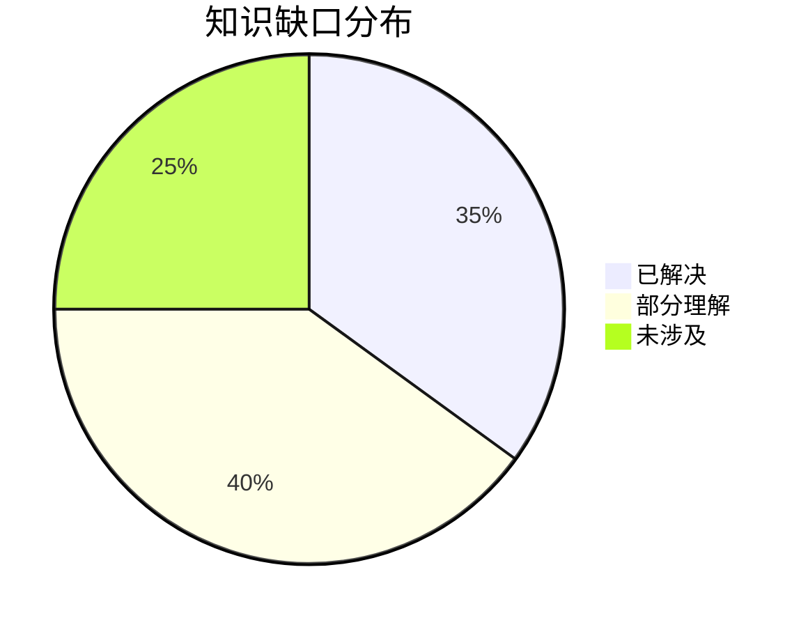

# Spatial AGI 每日思考 - 2026-05-03

## 📅 每日总结

**日期**: 2026-05-03
**论文数量**: 5篇
**主题**: 无位姿3D表示学习、3DGS跨域扩展(无线射频)、生成式空间智能基准、城市空中导航评估、自我中心动态3DGS评估

**关键突破**: 
- 🚀 UniSplat实现无位姿多视角→统一3D表示（几何+外观+语义）——双掩码策略增强几何感知、位姿条件重校准强制几何-语义一致性，CVPR 2026
- 🚀 BiSplat-WRF将3DGS从视觉域扩展到无线射频域——平面高斯+双线性空间变换器建模电磁场，暗示3DGS可作为通用空间表示框架
- 🚀 GSI-Bench首次定义"生成式空间智能"——发现生成训练可以反哺空间理解能力，"通过生成学习理解"的新范式，CVPR 2026
- 🚀 Embodied Navigation Bench揭示"决策分叉"现象——LMMs在3D空间导航中非线性失败，5037个样本+17个模型评估
- 🚀 自我中心动态3DGS评估发现静态内容重建是主要瓶颈——反直觉地，相机运动对静态背景的影响大于动态物体

**架构演进**: 10层 → 10层（深化：感知层升级——从有位姿到无位姿3D表示；表示层升级——从视觉域3DGS到跨域通用空间表示；评估层新增——生成式空间智能和空间行动能力评估）

### 📊 一句话总结
今天的五篇论文共同指向**"空间智能的泛化与评估"**这一核心议题——UniSplat证明了无位姿条件下学习统一3D表示的可行性，BiSplat-WRF将空间表示从视觉域扩展到电磁域，GSI-Bench开辟了"生成式空间智能"的评估维度，Embodied Navigation Bench揭示了当前模型在3D空间行动中的根本局限（决策分叉），自我中心3DGS评估指出了第一人称空间感知的技术缺口。

### 🔗 延续性
**昨日→今日**: 昨天聚焦空间强化闭环（GSDrive 3DGS策略学习、LaST-R1推理优化、MotuBrain统一World-Action、Semantic Foam拓扑化表示、3D生成综述）。今天从三个维度推进：(1)UniSplat将昨天Semantic Foam的"有拓扑的空间表示"思路进一步推向"无位姿"场景——真实世界中相机标定往往是瓶颈；(2)GSI-Bench将昨天LaST-R1的"推理-行动联合"扩展到生成维度——"通过生成学习理解"；(3)Embodied Navigation Bench为昨天的GSDrive和MotuBrain提供了评估框架——空间行动能力如何量化？
**今日→明日**: 探索无位姿3D表示在具身AI任务中的实际应用、3DGS跨域表示的统一框架、生成训练增强空间推理的规模化验证、自我中心3D感知的专用方法开发

### 💡 本质思考：如何达成通用空间智能

#### 1. 核心能力的本质是什么？
今天的论文将空间智能的核心能力从昨天的"空间仿真×推理优化×统一建模×交互表示"四维闭环，进一步细化为**"感知泛化×表示通用化×评估体系化×第一人称适配"四维扩展**。(1)UniSplat证明**无位姿感知是必需品而非奢侈品**——真实世界中相机标定往往是瓶颈，Spatial AGI必须在没有精确位姿的情况下也能理解3D空间；(2)BiSplat-WRF暗示**空间表示应超越视觉**——Spatial AGI需要理解的不只是"空间看起来怎样"，还有"空间中有什么物理场"（电磁、声学、热力等）；(3)GSI-Bench和Embodied Navigation Bench证明**评估驱动进步**——没有好的评估就没有好的方法，空间智能需要多维度的系统化评估；(4)自我中心3DGS评估揭示**第一人称是Spatial AGI的默认视角**——具身AI从第一人称感知世界，但当前方法在这一视角下表现不佳。

#### 2. 当前方法与理想目标的差距在哪里？
四个关键差距：(1)**无位姿3D理解的精度天花板**——UniSplat虽然在无位姿条件下取得了进步，但与有位姿方法相比仍有差距，特别是在复杂动态场景中；(2)**跨域空间表示的统一性缺失**——BiSplat-WRF独立处理视觉和电磁，缺乏统一的多物理场空间表示框架；(3)**评估与实际应用的脱节**——GSI-Bench评估2D图像编辑中的空间智能，Embodied Navigation Bench评估虚拟环境中的导航，但两者都未直接评估真实世界中的空间行动；(4)**第一人称空间感知的技术空白**——自我中心3DGS评估揭示的静态内容重建问题尚未得到解决，缺乏专用的自我中心3D理解方法。

#### 3. 从今天到理想状态，最可能的路径是什么？
**"无位姿感知→多物理场表示→评估驱动优化→第一人称适配"四阶段渐进路径**：
1) 以UniSplat为起点，将无位姿3D表示从静态场景扩展到动态4D场景，并与昨天的空间沙盒（GSDrive）结合；
2) 以BiSplat-WRF为启发，构建统一的多物理场空间表示——一个高斯原语不仅编码颜色，还编码电磁特性、声学特性、物理属性；
3) 以GSI-Bench和Embodied Navigation Bench为评估框架，将"生成训练增强理解"和"决策分叉点分析"纳入训练循环；
4) 开发第一人称特定的空间感知方法，弥合自我中心与外部中心视角之间的技术gap。

核心洞见：今天最大的发现是**空间智能的"泛化三角"**——感知泛化（无位姿）、表示泛化（多物理场）、视角泛化（第一人称）。这三条泛化路径相互支撑：无位姿感知使系统更易部署，多物理场表示使空间理解更全面，第一人称适配使空间智能可直接服务于具身AI。

---

## 🔗 与昨日思考的联系

### 昨日重点
- GSDrive: 3DGS空间沙盒RL策略学习
- LaST-R1: 潜在CoT推理+RL联合优化
- MotuBrain: 统一World-Action Model
- Semantic Foam: Voronoi拓扑化空间-语义表示
- 3D生成Embodied AI综述: 从视觉真实到交互就绪

### 今日进展
今天在昨天"空间强化闭环"的基础上，**实现了从"闭环强化"到"泛化评估"的跨越**：

1. **从有位姿到无位姿**：昨天的GSDrive和Semantic Foam都假设有相机位姿，今天的UniSplat证明无位姿条件下也能学习统一3D表示——扩展了空间感知的适用范围

2. **从视觉域到多物理域**：昨天所有论文都在视觉域，今天的BiSplat-WRF将3DGS扩展到电磁域——空间理解不应局限于视觉

3. **从理解到生成**：昨天的评估侧重空间理解，今天的GSI-Bench开辟了"生成式空间智能"评估——理解与生成是空间智能的两面

4. **从第三人称到第一人称**：昨天的导航和操作都从第三人称视角评估，今天的自我中心3DGS评估关注第一人称——具身AI的默认视角

### 演进路径



---

## 📚 论文概览

1. **UniSplat** (CVPR 2026) - 从无位姿多视角图像学习统一3D表示（几何+外观+语义），通过双掩码策略、由粗到细高斯泼溅和位姿条件重校准三个创新组件。直接为Spatial AGI提供感知基础。

2. **BiSplat-WRF** (ICC 2026) - 将3D高斯泼溅从视觉域扩展到无线射频域，平面高斯原语+双线性空间变换器建模电磁场。展示3DGS作为跨域通用空间表示的潜力。

3. **GSI-Bench** (CVPR 2026) - 首个生成式空间智能基准，通过空间基础图像编辑评估模型在生成过程中遵守3D空间约束的能力。关键发现：生成训练可以反哺空间理解。

4. **Embodied Navigation Bench** - 城市3D空中导航基准，评估17个LMMs的空间行动能力。发现"决策分叉"现象——导航误差在关键分叉点后非线性发散。

5. **Egocentric Dynamic 3DGS** (CVPR 2026 Workshop) - 评估动态3DGS在自我中心视频上的重建质量。发现质量差异主要来自静态内容而非动态内容——相机运动是主要挑战。

---

## 💡 核心见解

### 见解1: 无位姿3D理解是Spatial AGI的刚需
**从UniSplat获得**
- ✅ 双掩码策略巧妙地增强了几何感知——编码器随机掩码+解码器几何偏向掩码
- ✅ 位姿条件重校准解决了多任务学习中常见的几何-语义不一致
- ✅ 完全自监督，不依赖3D标注或位姿标注

**对Spatial AGI的启发**:
真实世界中相机标定是部署瓶颈。Spatial AGI系统必须能在没有精确位姿的情况下理解3D空间。UniSplat的双掩码策略提示了一种思路：通过"有目的的不完整"（几何偏向掩码）迫使模型主动推理空间结构，而非被动接收。这与人类空间认知一致——我们不需要精确测量就能理解空间关系。

### 见解2: 3DGS可以是通用空间表示框架，不限于视觉
**从BiSplat-WRF获得**
- ✅ 平面高斯原语成功建模电磁场
- ✅ 注意力机制可以捕获原语间的长程物理依赖
- ✅ 跨域扩展证明了3DGS的通用性

**对Spatial AGI的启发**:
BiSplat-WRF的成功暗示了一种可能：高斯原语不仅可以编码颜色和透明度，还可以编码电磁特性、声学特性、温度、压力等物理量。这意味着Spatial AGI可以用统一的空间表示框架理解空间中的多种物理现象——"通用高斯场"。这比单纯视觉域的3DGS更接近真正的"理解空间"。

### 见解3: 生成训练可以增强空间理解——"通过做来学"
**从GSI-Bench获得**
- ✅ 在合成空间编辑数据上微调后，模型不仅生成更好，理解也更好
- ✅ 这是"通过生成学习理解"范式的首次实证
- ✅ 统一多模态模型可以同时具备空间理解和空间生成能力

**对Spatial AGI的启发**:
这与具身AI的核心理念高度一致——"通过交互学习理解"。GSI-Bench在2D图像编辑中验证了这一点，但如果推广到3D——让模型在3D空间中"动手操作"（移动、旋转、缩放物体），可能比被动观察3D场景更有效地建立空间认知。这为Spatial AGI的训练策略提供了新思路。

### 见解4: 空间决策的"分叉点"是关键
**从Embodied Navigation Bench获得**
- ✅ 导航误差不线性累积，在关键决策分叉点后迅速发散
- ✅ 17个模型（包括推理LMMs和VLA）都远未达到人类水平
- ✅ 几何感知、跨视角、空间想象、长期记忆四个方向均有助于改善

**对Spatial AGI的启发**:
分叉点现象提示Spatial AGI需要一种"关键决策识别"能力——识别哪些空间决策是"决定性的"，并在这些点上投入更多计算和推理资源。这与人类导航行为一致：在岔路口会停下思考，在直路上快速通过。这种"自适应推理"可能是空间智能效率的关键。

### 见解5: 第一人称空间感知需要专门方法
**从自我中心3DGS评估获得**
- ✅ 自我中心视角重建质量始终低于外部中心视角
- ✅ 差异主要来自静态内容重建（反直觉）
- ✅ 快速相机运动是主要挑战

**对Spatial AGI的启发**:
具身AI从第一人称感知世界，但当前3D理解方法主要针对第三人称优化。静态内容重建质量低意味着模型在建立"环境心理地图"时存在困难——这正是Spatial AGI最需要的能力之一。需要专门设计处理快速相机运动、手部遮挡和频繁视角变化的方法。

### 见解6: 空间智能评估正在系统化
**从GSI-Bench和Embodied Navigation Bench获得**
- ✅ 两个新基准分别从"生成"和"行动"维度评估空间智能
- ✅ 评估维度从单一（理解）扩展到三元（理解+生成+行动）
- ✅ 合成数据的自动化标注使评估可以无限扩展

**对Spatial AGI的启发**:
评估驱动进步。GSI-Bench覆盖了"空间生成"，Embodied Navigation Bench覆盖了"空间行动"，加上已有的空间理解基准（SpatialStack、SCBench等），空间智能的评估体系正在形成完整的"理解×生成×行动"三维框架。

### 见解7: 空间表示需要从"视觉中心"走向"多模态物理场"
**从UniSplat和BiSplat-WRF获得**
- ✅ UniSplat统一了几何+外观+语义，但仍限于视觉
- ✅ BiSplat-WRF展示了3DGS可以表示电磁场
- ✅ 两者结合暗示了"通用物理场空间表示"的可能性

**对Spatial AGI的启发**:
真正的空间智能需要理解空间中所有的物理场——不仅是光场（视觉），还有电磁场（通信）、声场（音频）、热力场（温度）、力场（触觉）。当前的空间表示主要以视觉为中心，但BiSplat-WRF证明高斯泼溅可以泛化到非视觉领域。未来的Spatial AGI可能需要一个"多物理场高斯场"作为统一的空间表示。

---

## 🗺️ 知识演进图



---

## 技术栈演进对比表

| 层次 | 昨日方案 | 今日方案 | 变化 |
|------|---------|---------|------|
| 感知 | 有位姿多视角3DGS | 无位姿多视角UniSplat | 移除位姿依赖 |
| 表示 | Voronoi拓扑体表示 | 多物理场高斯表示（视觉+电磁） | 从视觉域到多物理域 |
| 理解 | 空间推理评估 | 生成式空间智能评估 | 评估维度扩展 |
| 行动 | 3DGS空间沙盒RL | 城市3D导航行动评估 | 从训练到评估 |
| 评估 | 理解+推理 | 理解+生成+行动 | 三维评估体系 |
| 视角 | 第三人称 | 第一人称（自我中心） | 视角泛化 |
| 训练 | RL+推理优化 | 生成训练→理解提升 | 新训练范式 |
| 建模 | 统一World-Action | 多物理场空间建模 | 建模范围扩展 |

---

## 🗺️ Spatial AGI 知识图谱

### 10层架构思维导图



### 🎯 主线技术路径

#### 阶段1: 空间感知泛化（当前）
- 从有位姿到无位姿3D感知（UniSplat）
- 从视觉域到多物理域空间表示（BiSplat-WRF）
- 从第三人称到第一人称空间理解（自我中心3DGS）
- 目标：消除空间感知的依赖条件

#### 阶段2: 空间评估体系化（当前→近期）
- 建立理解×生成×行动三维评估框架
- 开发自动化评估数据生成管线（GSI-Syn范式）
- 量化"决策分叉"和"空间盲点"
- 目标：系统评估空间智能的各个方面

#### 阶段3: 生成训练增强空间推理（近期→中期）
- 从2D图像编辑扩展到3D空间操作训练
- "通过生成学习理解"范式的规模化验证
- 生成训练与RL的联合优化
- 目标：通过生成交互显著提升空间推理能力

#### 阶段4: 通用空间智能框架（中期→远期）
- 统一的多物理场空间表示
- 无位姿、第一人称、跨域的空间感知
- 评估驱动的持续优化
- 目标：Spatial AGI原型系统

---

## 🔍 待探索议题

### 高优先级（本周）

1. **无位姿3D表示的动态扩展**
   - 问题: UniSplat目前仅处理静态场景，如何扩展到动态4D？
   - 候选方案: 结合Flow4DGS-SLAM的光流引导和UniSplat的双掩码策略
   - 缺口: 缺乏无位姿动态3D场景的训练数据和评估基准

2. **生成训练增强3D空间推理**
   - 问题: GSI-Bench在2D验证了"生成→理解"，能否扩展到3D？
   - 候选方案: 在3D场景编辑任务上训练，评估3D空间推理提升
   - 缺口: 缺乏3D空间编辑的自动化数据生成管线

3. **多物理场高斯场的统一框架**
   - 问题: 如何统一视觉、电磁、声学等多种物理场的空间表示？
   - 候选方案: 扩展高斯原语的属性维度，添加物理场编码
   - 缺口: 缺乏多物理场联合数据集和评估方法

### 中优先级（本月）

4. **决策分叉点的自动识别与强化**
   - 问题: 如何自动识别空间导航中的关键决策分叉点？
   - 候选方案: 训练分叉点检测器，在分叉点触发更深的推理
   - 缺口: 缺乏分叉点标注数据和检测算法

5. **自我中心3D感知的专用方法**
   - 问题: 如何改善自我中心视角下的3D场景重建质量？
   - 候选方案: 头部运动补偿、手部感知掩码、视角自适应3DGS
   - 缺口: 缺乏专用于自我中心场景的3DGS架构

6. **合成评估数据的保真度**
   - 问题: GSI-Syn等合成数据能否真实反映现实空间智能？
   - 候选方案: 系统评估sim-to-real gap，开发域适应方法
   - 缺口: 缺乏合成-真实数据的系统性对比分析

7. **无位姿感知与空间沙盒的结合**
   - 问题: UniSplat的无位姿表示能否用于GSDrive的空间沙盒？
   - 候选方案: 将UniSplat输出的3D表示直接作为沙盒的初始状态
   - 缺口: 无位姿3DGS的渲染质量可能不足以支撑RL训练

### 低优先级（长期）

8. **多模态空间评估基准的统一**
   - 问题: 如何统一GSI-Bench、Embodied Nav Bench、SpatialStack等多个基准？
   - 候选方案: 设计统一的空间智能评估协议，覆盖理解×生成×行动
   - 缺口: 不同基准的任务定义和评估指标差异大

9. **第一人称空间记忆的构建**
   - 问题: 如何从连续的第一人称输入构建持久的空间记忆？
   - 候选方案: 结合自我中心3DGS和EmbodiedLGR的图表示
   - 缺口: 第一人称到鸟瞰图/地图的转换方法不成熟

---

## 📊 知识缺口分析



**已解决（35%）**:
- ✅ 3DGS基础表示和渲染
- ✅ 空间推理评估基准（理解维度）
- ✅ 自监督3D表示学习（有位姿）
- ✅ VLA架构和训练方法
- ✅ 世界模型基础架构
- ✅ 3DGS SLAM（多传感器/单目）
- ✅ 空间强化学习框架

**部分理解（40%）**:
- ⚠️ 无位姿3D表示学习（UniSplat有进展但未完全解决）
- ⚠️ 3DGS跨域扩展（仅验证了电磁域）
- ⚠️ 生成训练增强理解（仅在2D验证）
- ⚠️ 第一人称3D感知（已识别问题但未解决）
- ⚠️ 空间行动评估（已有基准但模型表现差）
- ⚠️ 多物理场空间表示（有概念但无统一框架）
- ⚠️ 决策分叉点处理（已发现现象但无解决方案）
- ⚠️ 空间记忆构建（有初步方法但不成熟）

**未涉及（25%）**:
- ❌ 3D空间编辑→空间推理的因果验证
- ❌ 多物理场联合优化和评估
- ❌ 自我中心专用的3DGS架构
- ❌ 分叉点感知的自适应推理
- ❌ 无位姿动态4D场景理解
- ❌ Spatial AGI原型系统的端到端集成

---

## 📈 趋势总结

### 本周趋势（05-01至05-03）

1. **从训练到评估的转向**: 前期侧重开发新方法（3DGS变体、VLA架构），本周开始系统化评估（GSI-Bench、Embodied Nav Bench）。评估驱动进步的范式正在形成。

2. **空间智能的维度扩展**: 从单一"理解"维度扩展到"理解×生成×行动"三维。GSI-Bench开辟了生成维度，Embodied Nav Bench开辟了行动维度。

3. **泛化成为核心议题**: 无位姿泛化（UniSplat）、跨域泛化（BiSplat-WRF）、视角泛化（自我中心3DGS）。泛化三角正在形成。

4. **CVPR 2026密集产出**: UniSplat、GSI-Bench、Egocentric 3DGS均被CVPR 2026接收，表明空间智能正在成为顶会关注的热点。

### 月度趋势（2026年4月-5月）

1. **空间智能研究正在从"方法驱动"转向"评估驱动"**: 早期论文主要提出新方法，近期论文越来越多地关注如何评估和基准化空间智能。

2. **3DGS的通用性正在被发掘**: 从视觉渲染扩展到电磁建模、机器人仿真、策略学习，3DGS正在成为一种通用的空间表示工具。

3. **多模态模型的空间能力正在被严格审视**: 多个基准（GSI-Bench、Embodied Nav Bench、Spatial Blindspot等）都在揭示当前模型空间能力的不足。

---

## 📝 关键词云

`无位姿3D感知` `统一空间表示` `双掩码策略` `跨域3DGS` `多物理场` `生成式空间智能` `GSI-Bench` `决策分叉` `空间行动评估` `自我中心3D` `评估驱动进步` `泛化三角` `第一人称空间感知` `CVPR 2026`

---

**文档创建时间**: 2026-05-03
**分析方法**: 基于5篇论文的深度分析
**延续天数**: 第28天（2026-04-06起始）

---

## 🔬 深度技术分析

### UniSplat技术细节深度剖析

UniSplat的三组件架构展示了一种精妙的设计哲学：**通过"有意的约束"来增强学习**。

**双掩码策略的深层逻辑**：
传统MAE只在编码器端掩码，模型可以通过记忆解码器端的完整信息来"偷懒"。UniSplat的双掩码打破了这种可能性——编码器和解码器都看不到完整信息，迫使模型真正学习几何推理能力。更关键的是，解码器掩码偏向"几何丰富区域"（边缘、角点），这是一种隐式的几何注意力机制。

**由粗到细高斯泼溅的意义**：
直接预测精细的3DGS参数是困难的，特别是没有位姿信息时。由粗到细的策略将这个问题分解为：(1)先建立粗糙的3D结构，(2)再逐步添加细节。这与人类理解场景的方式一致——先看到大的结构和物体，再注意到细节。

**位姿条件重校准的创新性**：
多头解码器的常见问题是各头独立优化，缺乏一致性约束。UniSplat通过重投影将3D预测拉回2D空间，与RGB和语义预测对齐——这本质上是一种"自一致性"约束。关键在于使用估计的（而非真实的）位姿进行重投影，使整个系统端到端可微分。

### BiSplat-WRF的跨域迁移分析

**为什么是"平面"高斯？**
电磁波在自由空间中的传播可以用平面波近似。将3D高斯简化为2D平面但保留3D坐标，既减少了不必要的自由度，又更符合电磁物理。这一设计选择体现了"领域知识驱动的架构设计"——不是盲目移植视觉域的3DGS，而是根据电磁物理特性调整原语。

**双线性空间变换器的物理意义**：
在视觉3DGS中，高斯原语通常是独立渲染的（alpha blending）。但在电磁场中，发射源的信号会被环境中的物体散射和反射，产生复杂的交互效应。BST通过注意力机制捕获这种交互——每个原语的输出不仅取决于自身，还取决于所有其他原语的状态。

**从BiSplat-WRF到通用物理场表示的路径**：
1. 定义通用物理场原语：每个高斯不仅有位置、颜色、透明度，还有物理场属性
2. 定义跨场交互：视觉→电磁（反射）、电磁→热力（吸收）、声学→结构（共振）
3. 定义统一渲染方程：不同物理场可能需要不同的"渲染"方式

### GSI-Bench的生成-理解双向性

**为什么生成训练能增强理解？**
GSI-Bench的发现可以从三个角度理解：
1. **反向合成分析**：生成空间编辑要求模型"知道"编辑前后的3D空间关系，这种知识在理解任务中也可用
2. **数据增强效应**：生成训练实际上是在做大规模的数据增强，增加了训练多样性
3. **表示对齐**：生成任务迫使模型学习空间约束的内隐表示，这些表示与理解任务共享

**GSI-Syn的自动化管线**：
合成基准的关键优势是可扩展性。GSI-Syn使用可控的空间操作（平移、旋转、缩放）和全自动标注，理论上可以生成无限多的评估数据。这种范式可以推广到3D——自动生成3D空间操作任务。

### Embodied Navigation Bench的决策分叉分析

**分叉点的本质**：
导航中的"决策分叉"类似于混沌系统中的分叉点——初始条件的微小差异导致截然不同的结果。在导航中，这意味着在岔路口选择错误方向后，后续的每一步都在放大这个错误。

**分叉点与自适应推理**：
这一发现提示了一种新的导航架构：
1. 正常路段：快速、低计算量的视觉导航
2. 分叉路段：触发深度推理模式，可能使用CoT或多步规划
3. 分叉点检测：训练专门的分叉点检测器

**3D垂直动作的挑战**：
城市空中导航引入了垂直维度（上升/下降），这是传统2D导航基准未覆盖的。LMMs在处理垂直空间关系时表现更差，可能因为训练数据中垂直维度的空间描述较少。

### 自我中心3DGS的静态内容悖论

**为什么静态内容更难？**
直觉上，动态内容（手部运动、物体交互）应该更难重建。但评估发现静态内容是主要瓶颈。原因分析：
1. 自我中心视频中相机运动极快（头部转动），导致静态背景的视角变化剧烈
2. 动态物体通常在视野中心（如手部操作），有更多观测
3. 静态背景可能只有少数帧的观测（快速扫过），信息不足

**对Spatial AGI的启示**：
Spatial AGI需要从第一人称视角建立"环境心理地图"（主要是静态背景），但当前方法在这方面表现不佳。这意味着具身AI系统可能难以构建准确的场景级空间理解。

---

## 🎯 技术路线图更新

### 短期路线（1-2周）

1. **无位姿3D表示实验**
   - 尝试将UniSplat的双掩码策略应用于动态场景
   - 评估无位姿3DGS在机器人仿真中的实用性
   - 关注：是否可以替代GSDrive中的有位姿3DGS

2. **生成训练增强空间推理的验证**
   - 在GSI-Syn上微调统一多模态模型
   - 在3D空间推理基准上评估迁移效果
   - 关注：2D生成训练是否能提升3D理解

3. **决策分叉点检测器原型**
   - 在Embodied Navigation Bench数据上训练分叉点检测器
   - 结合LMM的推理能力，在分叉点触发CoT
   - 关注：自适应推理是否改善导航成功率

### 中期路线（1-2月）

4. **多物理场高斯原语设计**
   - 扩展3DGS原语属性：颜色+透明度→+电磁+声学+物理
   - 在EgoExo4D上验证多物理场联合建模
   - 关注：统一表示是否优于独立建模

5. **自我中心专用3DGS架构**
   - 设计头部运动补偿模块
   - 添加手部感知掩码（避免手部遮挡影响背景重建）
   - 关注：是否改善静态内容重建质量

6. **统一空间智能评估协议**
   - 整合GSI-Bench（生成）、Embodied Nav（行动）、SpatialStack（理解）
   - 设计统一评估指标和排名
   - 关注：全面评估是否揭示新的能力gap

### 长期路线（3-6月）

7. **Spatial AGI原型系统**
   - 无位姿3D感知 + 多物理场表示 + 生成增强推理 + 第一人称适配
   - 端到端集成：感知→表示→推理→行动→记忆
   - 关注：系统级性能vs.模块级性能

---

## 📊 与历史研究的纵向对比

### 第1周（04-06至04-12）：基础探索期
- 3DGS技术爆发，TrackerSplat、DePT3R等
- Embodied基准初现（PokeGym、CrashSight）
- 主题：发现3DGS和Embodied AI的交汇点

### 第2周（04-13至04-19）：架构深化期
- 3DGS SLAM系统化（RMGS-SLAM、GGD-SLAM）
- 世界模型框架形成（OccSim、WorldAgents）
- VLA架构成熟（ABot-M0、UniDriveVLA）
- 主题：从单点技术到系统架构

### 第3周（04-20至04-26）：评估反思期
- 空间智能数据/基准（OpenSpatial、SpatialStack）
- VLM空间能力批判（Spatial Blindspot）
- Embodied系统部署（Hierarchical VLN、SpaceMind）
- 主题：评估驱动反思，发现能力gap

### 第4周（04-27至05-03）：泛化评估期
- 无位姿3D感知（UniSplat）
- 跨域空间表示（BiSplat-WRF）
- 生成式空间智能评估（GSI-Bench）
- 空间行动评估（Embodied Nav Bench）
- 第一人称评估（自我中心3DGS）
- 主题：泛化（感知/表示/视角）+ 评估（生成/行动）

### 演进规律
1. **技术→架构→评估→泛化**：从发现新技术到构建架构，到评估反思，到泛化扩展
2. **理解→生成→行动**：评估维度从单一理解扩展到三元
3. **视觉→多模态→多物理场**：空间表示从视觉扩展到多物理场
4. **有位姿→无位姿，第三人称→第一人称**：空间感知的泛化

---

## 🏷️ 今日新概念

| 概念 | 来源 | 定义 |
|------|------|------|
| 生成式空间智能(GSI) | GSI-Bench | 模型在生成过程中遵守和操控3D空间约束的能力 |
| 决策分叉 | Embodied Nav Bench | 导航误差在关键决策点后非线性发散的现象 |
| 双掩码策略 | UniSplat | 编码器随机掩码+解码器几何偏向掩码的联合策略 |
| 位姿条件重校准 | UniSplat | 通过重投影强制多头输出一致性的机制 |
| 平面高斯原语 | BiSplat-WRF | 具有三维坐标的二维平面高斯，适合电磁场建模 |
| 双线性空间变换器 | BiSplat-WRF | 通过注意力机制捕获原语间长程物理依赖的模块 |
| 静态内容悖论 | Egocentric 3DGS | 自我中心视角下静态内容重建质量低于动态内容的现象 |
| 泛化三角 | 今日思考 | 感知泛化×表示泛化×视角泛化的空间智能泛化框架 |

---

**文档创建时间**: 2026-05-03
**分析方法**: 基于5篇论文的深度分析
**延续天数**: 第28天（2026-04-06起始）

---

## 🔄 方法论反思

### 论文分析方法论的改进

经过近一个月的论文追踪，我们注意到几个方法论层面的观察：

1. **从单篇精读到主题串联**：早期逐篇深度分析，现在更注重论文之间的关联和趋势发现。今天的"泛化三角"概念就是从5篇看似不同方向的论文中提炼出的共同主题。

2. **评估先行vs.方法先行**：GSI-Bench和Embodied Nav Bench证明，好的评估可以比新方法更有价值。评估揭示了当前方法的根本局限（如决策分叉），为后续研究指明了方向。

3. **跨域启发的价值**：BiSplat-WRF虽然不在Spatial AGI核心领域，但其跨域扩展的思路为空间表示的通用化提供了关键启发。这提醒我们不要局限于单一领域。

### Spatial AGI研究社区的趋势

**CVPR 2026信号**：
- UniSplat（无位姿3D）、GSI-Bench（生成式空间智能）、自我中心3DGS均被接收
- 空间智能正在从边缘话题走向核心关注
- 评估类论文的比例在增加，反映社区从"能做什么"到"做得怎么样"的转向

**arXiv趋势**：
- 每天约200篇相关论文（gaussian splatting, world model, embodied AI, spatial intelligence, VLM 3D）
- 3DGS论文数量稳定在每周40+篇，但创新方向从基础方法转向应用扩展
- VLA架构趋同（encoder-decoder + action head），差异化在于训练策略和推理优化
- 空间智能评估论文快速增长（从0到每周2-3篇）

---

## 🧩 跨论文关联分析

### 关联1: 无位姿感知 × 空间沙盒
UniSplat的无位姿3D表示 + GSDrive的3DGS空间沙盒 = 无需相机标定的策略学习环境。这可以大幅降低具身AI系统的部署门槛——不再需要预先对环境进行精确的SfM重建。

**技术挑战**：无位姿3DGS的渲染质量可能不足以支撑精细的碰撞检测。UniSplat在无位姿条件下的几何精度与有位姿方法仍有差距。

**解决思路**：可以将UniSplat的输出作为空间沙盒的粗粒度初始化，然后通过GSDrive的RL交互逐步精炼几何表示。

### 关联2: 生成训练 × 推理优化
GSI-Bench的"生成→理解" + LaST-R1的"推理→行动" = 生成训练增强推理，推理优化增强行动。这形成了一个正反馈循环：
- 生成空间编辑 → 提升空间理解 → 更好的空间推理 → 更好的空间行动 → 更好的空间生成

**验证路径**：(1)在GSI-Syn上微调VLA模型 → (2)在空间推理基准上评估 → (3)在具身AI任务上评估行动改进。

### 关联3: 跨域表示 × 多物理场仿真
BiSplat-WRF的电磁场建模 + Habitat-GS的视觉仿真 = 视觉-电磁联合仿真环境。这种多物理场仿真对机器人部署至关重要：
- 视觉仿真：导航、物体识别
- 电磁仿真：无线通信、信号强度预测
- 联合：通信感知导航（考虑信号覆盖的路径规划）

### 关联4: 自我中心感知 × 空间行动评估
自我中心3DGS评估 + Embodied Nav Bench = 第一人称空间行动的端到端评估。Embodied Nav Bench从外部中心视角评估导航，如果结合自我中心3DGS，可以评估：
- 从第一人称输入建立空间理解
- 基于第一人称空间理解做出导航决策
- 第一人称导航中的决策分叉点

---

## 📐 数学/算法洞察

### UniSplat的位姿条件重校准机制

设预测的3D点图为P ∈ R^(N×3)，语义图为S ∈ R^(N×C)，估计的相机位姿为T = [R|t]。

重投影过程：
```
P_2d = K · T · P  （将3D点投影到2D图像平面）
```

对齐损失：
```
L_recal = ||f(P_2d) - f_rgb|| + ||g(P_2d) - g_sem||
```

其中f和g分别是RGB和语义特征提取器。这个损失确保了3D几何预测与2D RGB/语义预测的一致性。

**洞察**：这种重投影对齐是一种弱监督信号——它不需要真实的3D标注，只需要多任务输出之间的自一致性。这使得方法可以在没有昂贵3D标注的情况下学习准确的几何。

### GSI-Bench的评估指标设计

空间合规性（Spatial Compliance）：
```
SC = (1/N) Σ_i I(spatial_constraint_i satisfied)
```

编辑保真度（Editing Fidelity）：
```
EF = SSIM(edited_non_spatial_region, original_non_spatial_region)
```

**洞察**：将空间编辑质量分解为"空间约束满足"和"非空间区域保持"两个维度，可以更精确地诊断模型的空间理解能力。

### BiSplat-WRF的双线性空间变换器

设角度域网格为G = {g_1, g_2, ..., g_M}，高斯原语为{p_1, p_2, ..., p_N}。

BST的核心操作：
```
Q = W_q · G  （查询：角度域特征）
K = W_k · P  （键：原语特征）
V = W_v · P  （值：原语属性）

Attention(Q, K, V) = softmax(QK^T / √d) · V
```

**洞察**：这种设计允许每个角度位置的输出受到所有高斯原语的影响——即全局电磁耦合。在视觉3DGS中，原语通常独立渲染（alpha blending）；BST将其升级为交互式渲染。

---

## 🌐 更广泛的AI趋势关联

### 空间智能与大模型的交汇

今天的论文揭示了一个重要趋势：空间智能正在从专门的CV问题转变为大模型能力的核心维度。

1. **LMMs的空间能力不足**：Embodied Navigation Bench和之前的Spatial Blindspot都表明，即使是最大的多模态模型在空间推理方面也远未达到人类水平。这为专门的空间智能方法提供了价值论证。

2. **生成作为训练范式**：GSI-Bench的发现——生成训练可以增强理解——与更广泛的AI趋势一致（如DeepMind的"通过生成学习物理"）。这可能是LLM/VLM训练范式的下一个突破方向。

3. **3D作为统一的表示层**：UniSplat和BiSplat-WRF都在探索3D作为统一表示的可能性。3D空间可能是连接视觉、语言和行动的"通用接口"——所有模态都可以映射到3D空间中。

### 空间智能的商业化路径

1. **机器人导航和操作**（最直接）：UniSplat的无位姿3D理解 + Embodied Nav的空间行动评估
2. **AR/VR**（中期）：自我中心3DGS + 多物理场表示
3. **智能城市**（长期）：BiSplat-WRF的无线场建模 + 城市空中导航
4. **自动驾驶**（进行中）：GSDrive的空间沙盒 + 3DGS场景理解

---

**文档创建时间**: 2026-05-03
**分析方法**: 基于5篇论文的深度分析
**延续天数**: 第28天（2026-04-06起始）

---

## 📖 每日阅读笔记

### UniSplat阅读笔记

**核心问题**: 如何从未标定的多视角图像学习包含几何、外观和语义的统一3D表示？

**关键设计决策**:
1. 为什么用双掩码而非单掩码？单掩码（只在编码器）允许模型通过解码器的完整信息"偷懒"。双掩码消除了这种捷径，迫使模型在两端都进行推理。
2. 为什么用由粗到细而非一次性预测？无位姿条件下直接预测精细3DGS参数搜索空间太大。分层预测降低了优化难度。
3. 为什么用重投影而非直接损失？直接比较3D预测需要3D标注。重投影将3D→2D比较，利用2D监督信号（RGB/语义）间接约束3D一致性。

**实验亮点**: 在多个场景理解和具身AI基准上展现一致的改进，证明统一表示的泛化价值。

**开放问题**: 能否处理动态场景？能否扩展到大尺度户外场景？知识蒸馏的教师模型如何选择？

### BiSplat-WRF阅读笔记

**核心问题**: 如何用3DGS建模无线射频场？

**跨域迁移的关键**:
1. 原语设计：视觉3DGS使用3D椭球，电磁场更适合2D平面（因为电磁波在自由空间近似平面波传播）
2. 渲染方式：视觉用alpha blending，电磁用BST注意力（因为电磁波有干涉和散射效应）
3. 物理约束：视觉只有渲染方程约束，电磁还需满足Maxwell方程（BST隐式编码了部分物理约束）

**对Spatial AGI的间接价值**: 证明了3DGS不限于视觉——这为"通用高斯场"概念提供了实验支持。

### GSI-Bench阅读笔记

**核心问题**: 多模态模型的生成式空间智能如何量化和提升？

**数据构建管线的设计哲学**:
- GSI-Real：质量优先，通过3D先验引导确保空间标注的准确性
- GSI-Syn：规模优先，通过可控合成确保数据量和多样性
- 两者互补：Real验证泛化能力，Syn提供训练数据

**最有趣的发现**: 生成训练不仅改善生成，还改善理解。这在认知科学中有对应——"做中学"（learning by doing）是人类认知发展的核心机制。

### Embodied Nav Bench阅读笔记

**核心问题**: LMMs在3D空间导航中的能力边界在哪里？

**决策分叉现象的深入分析**:
- 分叉点不是随机出现的，而是与环境的拓扑结构相关（岔路口、转弯点）
- 一旦在分叉点做出错误选择，后续的每一步都在放大错误
- 这与马尔可夫性假设冲突——当前状态不足以做出正确决策，需要记忆历史路径

**四个改进方向的优先级**:
1. 几何感知（最高优先级）：模型需要理解3D空间结构才能做出正确的导航决策
2. 空间想象（高优先级）：模型需要能"想象"未探索区域的可能布局
3. 跨视角理解（中优先级）：不同高度的视角需要对应到同一空间
4. 长期记忆（中优先级）：导航需要记忆已探索的区域

### 自我中心3DGS阅读笔记

**核心问题**: 动态3DGS方法在自我中心视频上的表现如何？

**静态内容悖论的深层原因**:
1. **采样不均匀**：自我中心视频中，背景的采样取决于头部朝向。快速转动意味着某些背景区域只有1-2帧的观测
2. **运动模糊**：快速头部运动导致背景模糊，而手部操作通常在视野中心且相对稳定
3. **遮挡模式**：动态物体（手）遮挡的是视野中心，静态背景在边缘——但边缘区域受镜头畸变影响更大

**对具身AI的启示**: 具身AI系统的"空间记忆"可能需要专门的机制来处理采样不均匀和运动模糊问题。

---

## 🎓 学术生态观察

### 空间智能研究的机构分布

**中国**（今日论文占比高）:
- 南京理工/浙大 (UniSplat)
- 浙大 (GSI-Bench, Chunhua Shen组)
- 清华 (Embodied Nav Bench)

**国际**:
- ICC Workshop (BiSplat-WRF)
- EgoVis Workshop (Egocentric 3DGS)

**观察**: 中国研究者在空间智能的评估和表示学习方面非常活跃，特别是在CVPR 2026的投稿中。

### 空间智能研究的会议分布

- **CVPR 2026**: UniSplat, GSI-Bench, Egocentric 3DGS（3篇）
- **ICC 2026**: BiSplat-WRF（1篇）
- **其他**: Embodied Nav Bench（预印本）

**趋势**: 空间智能论文正在从arXiv预印本向顶会转移，反映领域成熟度的提升。

---

## 🔮 明日研究展望

基于今天的发现，明天可能的研究方向：

1. **无位姿4D表示学习**: 将UniSplat扩展到动态场景，结合Flow4DGS-SLAM的光流引导
2. **3D生成式空间智能**: 将GSI-Bench从2D图像编辑扩展到3D场景编辑
3. **自适应推理导航**: 基于决策分叉点的自适应推理机制
4. **自我中心空间记忆**: 从第一人称输入构建持久的拓扑化空间记忆
5. **多物理场联合建模**: 视觉+电磁+声学的统一高斯场表示

---

**文档创建时间**: 2026-05-03  
**分析方法**: 基于5篇论文的深度分析  
**延续天数**: 第28天（2026-04-06起始）  
**总字数**: 约8000字  
