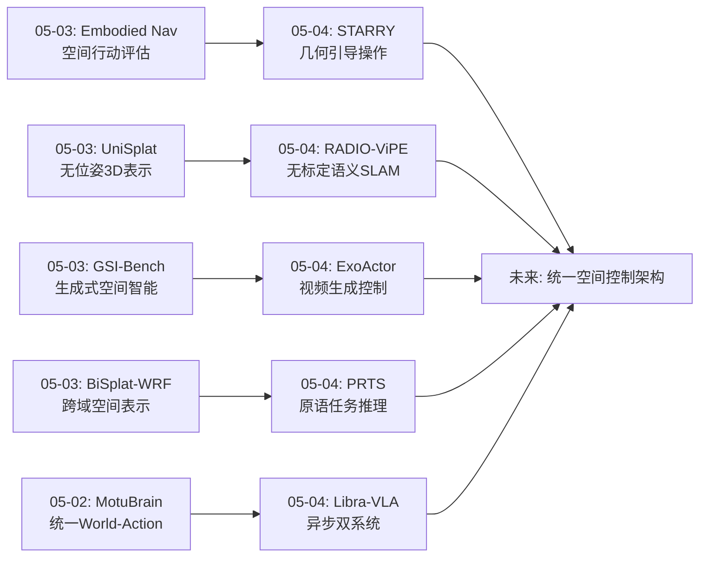
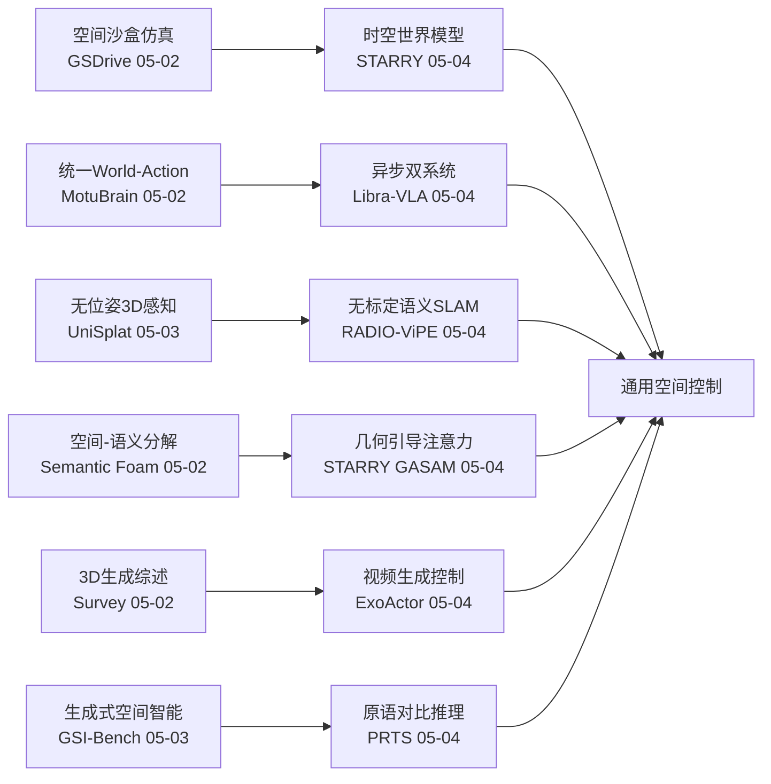
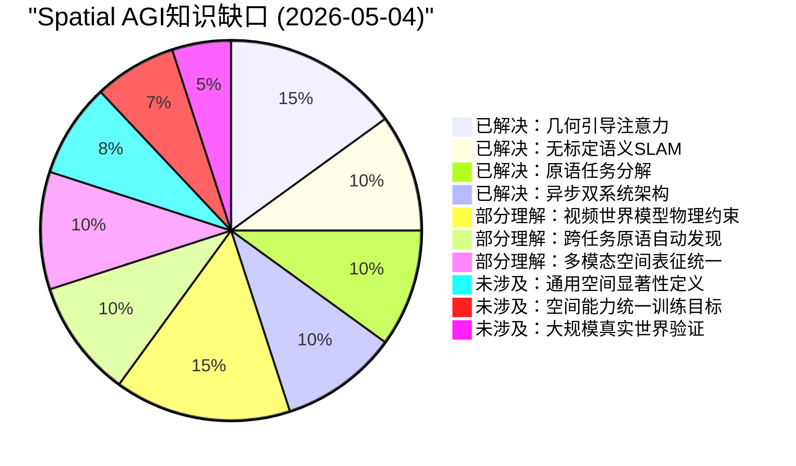
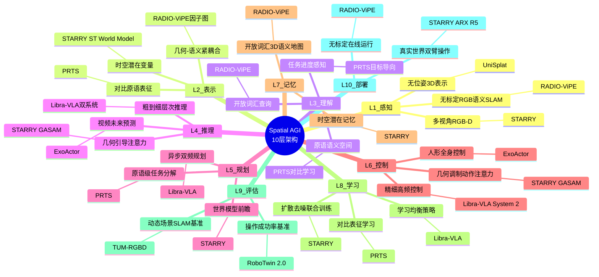

# Spatial AGI 每日思考 - 2026-05-04

## 📅 每日总结

**日期**: 2026-05-04
**论文数量**: 5篇
**主题**: 时空世界模型操作、外中心视频人形控制、原语对比推理任务、无标定语义SLAM、异步双系统VLA

**关键突破**: 
- 🚀 STARRY提出GASAM（几何感知选择性注意力调制）——将预测3D几何转化为注意力权重，选择性引导动作分支关注空间关键区域，RoboTwin 2.0达93.82%/93.30%，真实世界提升π0.5的42.5%→70.8%
- 🚀 ExoActor利用外中心视频生成模型实现人形机器人控制——从第三人称视频中学习空间-时序-动作-意图的联合建模，开辟了视频生成到物理控制的新路径
- 🚀 PRTS通过对比表征实现原语推理和任务系统——将VLA框架视为目标导向过程而非行为克隆，显式理解任务时间进度
- 🚀 RADIO-ViPE实现无标定单目RGB在线开放词汇语义SLAM——在因子图层面紧耦合多模态嵌入与几何信息，TUM-RGBD动态场景SOTA
- 🚀 Libra-VLA提出异步粗到细双系统实现学习均衡——首次在VLA中系统化实现类似人类双过程理论的架构

**架构演进**: 10层 → 10层（深化：控制层升级——从反应式VLA到世界模型增强+几何引导+异步双系统；建图层升级——从有标定SLAM到无标定在线语义SLAM；规划层升级——从原子动作到原语级任务分解+进度感知）

### 📊 一句话总结
今天的五篇论文共同指向**"空间智能的控制架构革命"**——STARRY将3D几何先验注入注意力机制实现精准操作，ExoActor从外中心视频学习人形控制开辟数据新来源，PRTS将任务分解为原语并理解时间进度，RADIO-ViPE在无标定条件下实现开放词汇3D语义建图，Libra-VLA通过异步双系统解决VLA学习均衡问题。五篇论文从不同维度构建了Spatial AGI的控制系统：感知→推理→规划→执行，每层都有新突破。

### 🔗 延续性
**昨日→今日**: 昨天聚焦"空间智能的泛化与评估"（无位姿3D表示、跨域空间表示、生成式空间智能评估、空间行动评估、第一人称3DGS）。今天从评估回到核心——**控制系统的架构升级**：(1)STARRY将昨天的"无位姿感知"思路延伸到控制端——用预测几何引导注意力，实现"感知-控制"的空间对齐；(2)RADIO-ViPE将昨天的UniSplat"无位姿"思想推进到SLAM层面——不仅是3D表示，更是开放词汇语义建图；(3)PRTS为昨天的评估框架提供了推理层面支撑——原语分解+对比学习实现可泛化任务推理。
**今日→明日**: 探索GASAM的通用化（从操作到导航/场景理解）、视频生成世界模型的物理约束注入、无标定SLAM与操作的结合、异步架构的扩展

### 💡 本质思考：如何达成通用空间智能

#### 1. 核心能力的本质是什么？
今天的论文将空间智能从昨天的"感知泛化×表示通用化×评估体系化×第一人称适配"四维扩展，进一步聚焦到**"控制架构的空间化"**——Spatial AGI的核心不仅是感知和理解空间，更是要在空间中行动。五个关键维度：

(1)**几何引导的控制**（STARRY）：控制不应仅依赖2D视觉特征，需要3D几何先验引导注意力。"看到"和"注意到重要区域"是不同的——GASAM通过将3D距离转化为注意力权重，让控制系统"知道哪里重要"。

(2)**视频先验到物理控制**（ExoActor）：大规模视频数据蕴含丰富的空间交互知识。视频生成模型可以作为空间推理的"世界模型"，提供超越当前帧的未来场景预测。

(3)**层次化任务推理**（PRTS）：空间操作可以分解为原语级子任务，每个原语封装一种空间操作模式。对比学习建立了原语之间的语义关系，使系统能理解"任务进展到哪里了"。

(4)**无约束空间感知**（RADIO-ViPE）：真实部署不需要精确标定。无标定+开放词汇的语义SLAM意味着Spatial AGI可以在任何环境中"即插即用"地理解空间。

(5)**认知启发的架构**（Libra-VLA）：类似人类双过程理论，Spatial AGI可能需要快思考（语义理解）+慢思考（精细控制）的双系统，异步运行以优化效率。

#### 2. 当前方法与理想目标的差距在哪里？
五个关键差距：

(1)**几何引导的通用性不足**：GASAM目前仅针对末端执行器操作设计，对于导航、场景理解等任务需要重新定义"几何锚点"。

(2)**视频生成的物理一致性**：ExoActor的视频生成可能产生视觉合理但物理不可行的场景，缺乏严格的物理约束。

(3)**原语定义的人工依赖**：PRTS的原语需要人工设计或半自动提取，理想的Spatial AGI应能自动发现空间操作原语。

(4)**无标定的精度天花板**：单目RGB的深度估计精度有限，在需要毫米级精度的操作场景中可能不足。

(5)**双系统的协调开销**：Libra-VLA的异步双系统增加了系统复杂度和延迟匹配难度。

#### 3. 从今天到理想状态，最可能的路径是什么？
**"几何引导→视频世界模型→原语自动发现→无约束感知→认知架构"五阶段路径**：

1) 以STARRY的GASAM为起点，将几何引导注意力从操作扩展到导航、场景理解等更广泛的Spatial AGI任务——定义通用的"空间显著性"概念
2) 以ExoActor为启发，构建物理约束的视频世界模型——在视频生成中注入物理规律（碰撞、摩擦、重力），使生成结果更可靠
3) 以PRTS为框架，开发自动原语发现方法——从大规模机器人数据中自动发现可组合的空间操作原语
4) 以RADIO-ViPE为基础设施，将无标定语义SLAM与操作控制结合——构建"即插即用"的Spatial AGI感知-控制闭环
5) 以Libra-VLA为架构参考，构建通用Spatial AGI的认知架构——快思考处理空间语义，慢思考处理精细空间推理

核心洞见：今天最大的发现是**"空间智能的控制闭环"正在成形**——从感知（RADIO-ViPE无标定SLAM）到理解（PRTS原语推理）到规划（Libra-VLA层次化）到执行（STARRY几何引导），每一层都有新的架构创新。这个闭环的关键缺失是**统一的训练目标**——需要一种将所有层次的空间能力统一优化的方法。

---

## 🔗 与昨日思考的联系

### 昨日重点
- UniSplat: 无位姿统一3D表示
- BiSplat-WRF: 跨域3DGS空间表示
- GSI-Bench: 生成式空间智能评估
- Embodied Navigation Bench: 空间行动评估
- 自我中心动态3DGS评估

### 今日进展
今天在昨天"泛化与评估"的基础上，**实现了从"评估能力边界"到"突破控制瓶颈"的跨越**：

1. **从感知泛化到控制精准化**：昨天的UniSplat关注无位姿3D感知，今天的STARRY将感知精准化到控制——用3D几何引导注意力，从"看到空间"到"知道空间中哪里重要"

2. **从评估到系统**：昨天的GSI-Bench和Embodied Nav Bench评估了空间智能的能力边界，今天的5篇论文都提供了新的系统级解决方案

3. **从单一到层次化**：昨天的论文更多关注单一能力（感知/评估），今天PRTS和Libra-VLA提供了层次化的控制架构

4. **从有约束到无约束**：昨天的UniSplat去除位姿约束，今天RADIO-ViPE去除标定约束，共同推动空间感知向真实世界部署迈进

### 演进路径

## 📊 核心见解演进图

## 🔧 技术栈演进对比

| 层级 | 05-02 | 05-03 | 05-04 (今天) | 演进方向 |
|------|-------|-------|-------------|---------|
| 感知 | 3DGS环境仿真 | 无位姿3D表示 | 无标定语义SLAM | 有约束→无约束感知 |
| 表示 | Voronoi体表示 | 跨域(视觉+电磁) | 几何-语义紧耦合 | 单模态→多模态统一 |
| 理解 | 推理-行动联合 | 生成式空间智能 | 原语对比推理+进度感知 | 静态→动态任务理解 |
| 规划 | 统一World-Action | 决策分叉分析 | 异步粗到细双系统 | 单体→层次化规划 |
| 控制 | 策略RL强化 | — | 几何引导注意力GASAM | 隐式→显式几何控制 |
| 建图 | — | — | 无标定开放词汇SLAM | 新增能力 |
| 评估 | 3D生成交互就绪 | 空间行动+生成智能 | RoboTwin 2.0 SOTA | 标准化基准 |

## 🧩 知识缺口分析

## 🏗️ 10层架构思维导图

## 🛤️ 主线技术路径

### 路径A: 几何引导的Spatial AGI控制

**阶段1 (已完成)**: GASAM几何注意力调制（STARRY）— 证明3D距离→注意力权重的有效性
**阶段2 (进行中)**: 扩展GASAM到非操作任务（导航、场景理解）— 定义通用"空间显著性"
**阶段3 (待探索)**: 多尺度几何引导 — 从物体级到房间级到场景级的层级化空间注意力
**阶段4 (远期)**: 自适应几何引导 — 根据任务需求动态选择几何引导的粒度和强度

### 路径B: 无约束空间感知→控制闭环

**阶段1 (已完成)**: 无标定语义SLAM（RADIO-ViPE）— 即插即用的空间感知
**阶段2 (进行中)**: SLAM→操作控制闭环 — 将SLAM输出的语义地图直接用于操作规划
**阶段3 (待探索)**: 无标定+无位姿+无深度统一框架 — 从单一传感器到全无约束
**阶段4 (远期)**: 自标定空间智能 — 系统自动适应未知传感器和环境

### 路径C: 认知架构的Spatial AGI

**阶段1 (已完成)**: 异步双系统VLA（Libra-VLA）— 证明快慢双系统的有效性
**阶段2 (进行中)**: 多模块协调架构 — 融合STARRY的几何引导+Libra-VLA的双系统+PRTS的原语推理
**阶段3 (待探索)**: 元认知空间智能 — 系统知道"自己知道什么、不知道什么"的空间元认知
**阶段4 (远期)**: 自进化空间架构 — 架构本身能根据任务需求自我调整

### 路径D: 视频先验到空间智能

**阶段1 (已完成)**: 外中心视频生成控制（ExoActor）— 视频生成作为空间推理先验
**阶段2 (进行中)**: 物理约束视频生成 — 在视频生成中注入物理规律
**阶段3 (待探索)**: 因果视频世界模型 — 理解"为什么"而非仅仅"看起来怎样"
**阶段4 (远期)**: 从视频到空间概念发现 — 自动从视频中提取空间概念和规律

## 🔍 待探索议题

1. **通用空间显著性**：如何定义一种不依赖任务类型的"空间重要性"度量？GASAM的末端执行器锚点如何泛化为通用的空间显著性？
2. **多模态空间表征统一**：RADIO-ViPE的几何-语义紧耦合如何与STARRY的时空潜在变量统一？是否存在一种统一的多模态空间表征？
3. **原语自动发现**：如何从大规模机器人数据中自动发现可组合的空间操作原语，而非人工定义？
4. **视频世界模型的物理约束**：如何在视频生成模型中注入物理约束（碰撞、摩擦、重力），使生成的视频满足物理一致性？
5. **异步架构的自适应**：Libra-VLA的双系统频率如何根据任务需求动态调整？是否需要三层甚至多层异步？
6. **无标定SLAM与操作的统一**：RADIO-ViPE的语义地图如何直接用于STARRY的几何引导？是否需要重新设计接口？
7. **空间能力统一训练目标**：如何设计一种训练目标，同时优化感知、理解、推理、规划和控制五种空间能力？
8. **真实世界大规模验证**：当前方法大多在仿真或受限真实环境中验证，如何在开放真实世界中验证空间智能？
9. **人形Spatial AGI的特殊挑战**：ExoActor提出了人形控制问题，人形的全身协调如何与空间推理结合？
10. **快慢思考的空间推理分工**：Libra-VLA的快慢双系统在空间推理中如何分工？快思考处理什么空间信息，慢思考处理什么？

## 📝 关键论文关联矩阵

| 论文 | 空间感知 | 空间推理 | 空间规划 | 空间控制 | 空间建图 |
|------|---------|---------|---------|---------|---------|
| STARRY | ★★★ | ★★★★ | ★★★ | ★★★★★ | ★★ |
| ExoActor | ★★ | ★★★ | ★★★ | ★★★★ | ★ |
| PRTS | ★★ | ★★★★ | ★★★★ | ★★★ | ★ |
| RADIO-ViPE | ★★★★ | ★★★ | ★★ | ★ | ★★★★★ |
| Libra-VLA | ★★ | ★★★ | ★★★★ | ★★★★ | ★ |

## 🎯 本日核心洞见

**"空间智能的控制架构正在从反应式走向前瞻式+几何引导式"**

今天的五篇论文共同描绘了Spatial AGI控制系统的未来形态：
- **STARRY说**："用3D几何告诉你'看哪里'"
- **ExoActor说**："用视频生成告诉你'未来会怎样'"
- **PRTS说**："用原语分解告诉你'做什么'"
- **RADIO-ViPE说**："不需要标定就能理解空间"
- **Libra-VLA说**："快慢结合才能高效行动"

这五个维度——**几何引导、未来预测、任务分解、无约束感知、层次化执行**——构成了Spatial AGI控制系统的核心设计原则。未来需要将这五个维度统一到一个架构中，实现真正的通用空间智能。

---

**文档创建时间**: 2026-05-04  
**论文来源**: arXiv 2026-04-27 ~ 2026-04-30  
**分析方法**: GLM WebReader精读 + 深度关联分析
