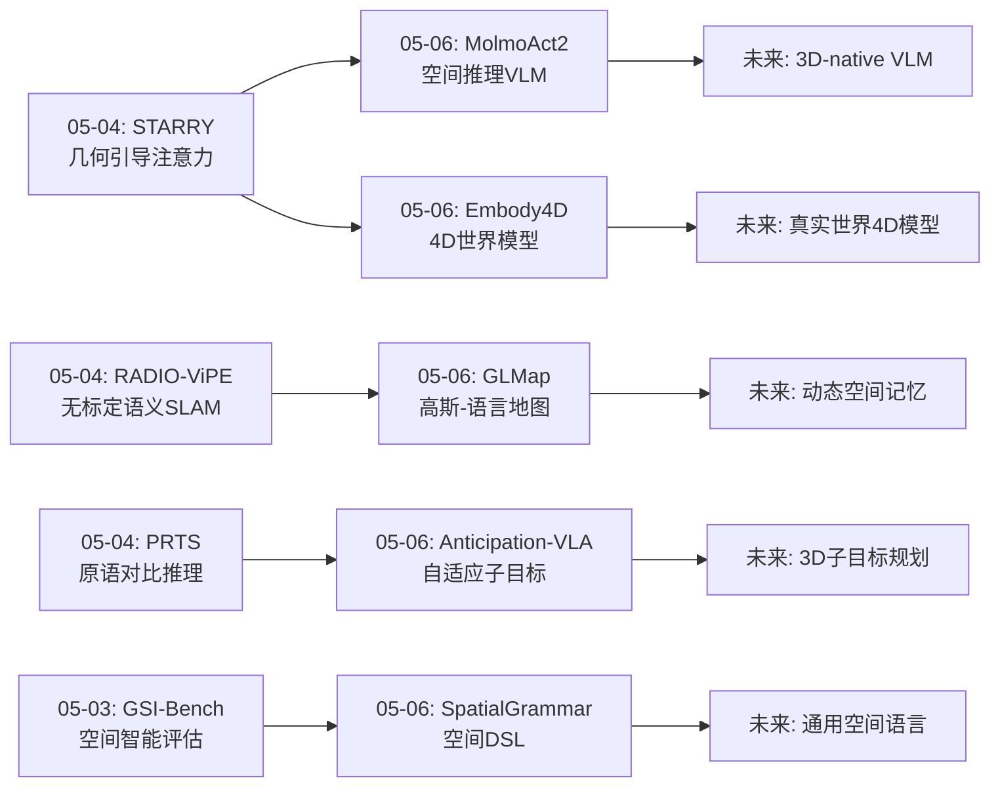
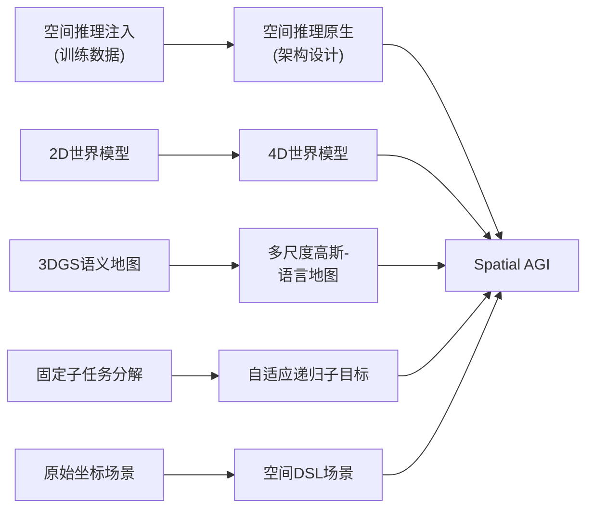
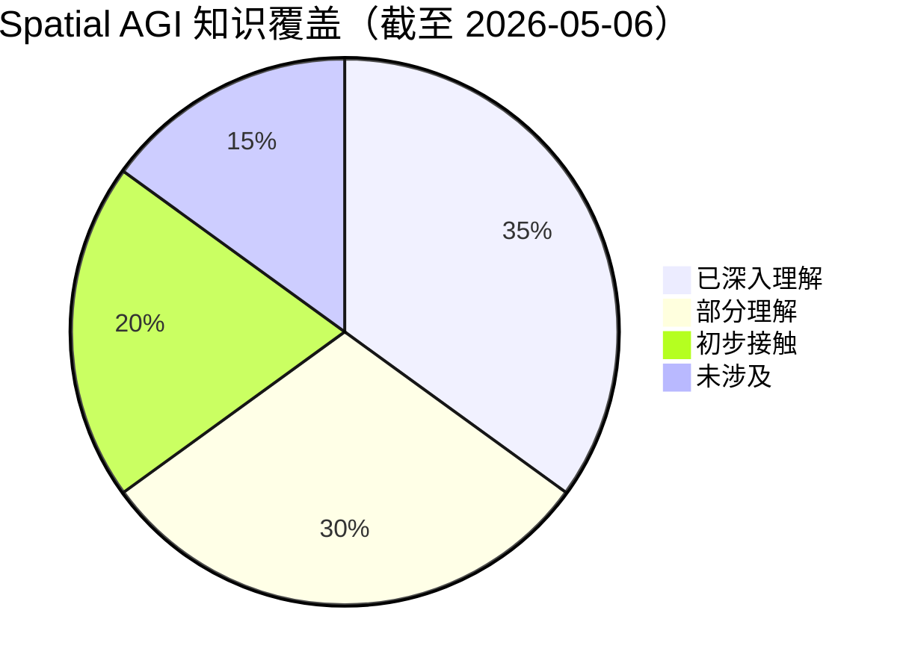
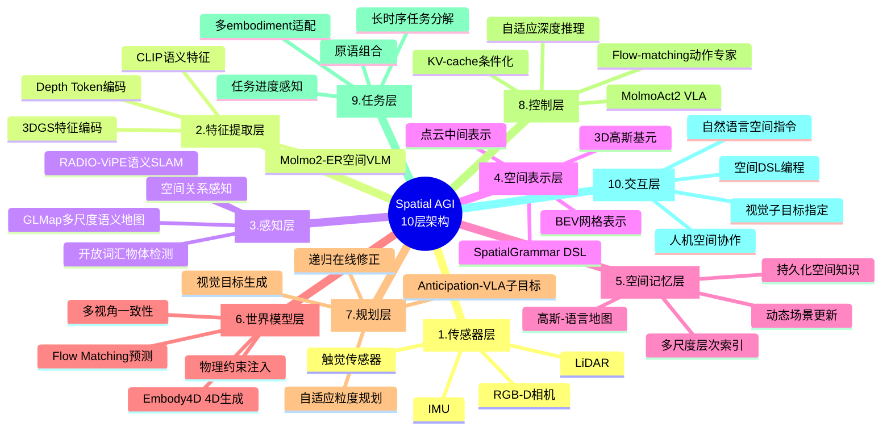

# Spatial AGI 每日思考 - 2026-05-06

## 📅 每日总结

**日期**: 2026-05-06
**论文数量**: 5篇
**主题**: 开源VLA部署、4D世界模型、高斯-语言地图、自适应子目标VLA、空间DSL场景生成

**关键突破**: 
- 🚀 MolmoAct2：完全开源VLA，Molmo2-ER在13个embodied reasoning基准超越GPT-5和Gemini Robotics ER-1.5，flow-matching动作专家嫁接到离散VLM的per-layer KV-cache架构，自适应深度推理只重新预测变化区域
- 🚀 Embody4D：首个通用4D embodied世界模型，从单目视频生成任意新视角，组合式数据合成pipeline解决跨形态机器人数据稀缺，置信度感知噪声注入确保时空一致性
- 🚀 GLMap (CVPR 2026)：多尺度高斯-语言地图，3DGS+多尺度语义+VLM双模态接口实现零样本embodied导航，无需额外训练特征投影
- 🚀 Anticipation-VLA：自适应递归子目标生成，视觉子目标+分层VLA架构解决长时序累积误差问题
- 🚀 SpatialGrammar：空间DSL+编译器反馈闭环+104M小模型竞争大LLM，BEV网格放置作为空间抽象

**架构演进**: 10层 → 10层（深化：感知层升级——从3DGS到多尺度高斯-语言地图；世界模型层升级——从2D视频预测到4D多视角生成；控制层升级——从单次推理到自适应深度推理VLA；规划层升级——从固定分解到自适应递归子目标；表示层新增——空间DSL作为中间表示语言）

### 📊 一句话总结
今天的五篇论文共同指向**"空间智能的工程化与系统化"**——MolmoAct2将空间推理VLM+flow-matching动作专家系统化为完全开源的部署级VLA，Embody4D将世界模型从2D提升到4D多视角，GLMap将3DGS语义地图标准化为VLM可直接交互的双模态接口，Anticipation-VLA将长时序规划系统化为自适应递归子目标框架，SpatialGrammar将空间推理抽象为领域特定语言。五篇论文从不同维度构建了Spatial AGI的工程化基础设施：感知表示→世界模型→规划框架→控制部署→空间语言。

### 🔗 延续性
**昨日(05-04)→今日**: 昨天聚焦"控制架构的空间化"（几何引导注意力、视频世界模型、原语对比推理、无标定SLAM、异步双系统VLA）。今天在控制系统基础上进一步**工程化与系统化**：(1)MolmoAct2将昨天的Libra-VLA双系统思想推进到部署级别——per-layer KV-cache嫁接+自适应推理；(2)Embody4D将昨天的STARRY"几何引导"延伸到4D层面——不仅当前帧有几何，未来帧也要有多视角几何一致性；(3)GLMap将昨天的RADIO-ViPE SLAM推进到导航推理——不仅是建图，更要支持零样本空间推理；(4)Anticipation-VLA将昨天的PRTS原语推理升级为自适应子目标——不固定分解粒度，动态调整。
**今日→明日**: 探索MolmoAct2的空间推理能力与其他模块的融合、4D世界模型与flow matching的深层结合、高斯-语言地图的动态更新、子目标生成的3D空间表示、空间DSL的表达能力扩展

### 💡 本质思考：如何达成通用空间智能

#### 1. 核心能力的本质是什么？
今天的论文将空间智能从昨天的"控制架构的空间化"进一步推进到**"空间智能的工程化基础设施"**——Spatial AGI不仅需要核心算法，更需要系统化的工具链。五个关键维度：

(1)**空间推理作为VLM基础能力**（MolmoAct2）：空间推理不应是附加模块，而是VLM骨干的核心能力。Molmo2-ER通过3.3M样本的specialize-then-rehearse训练，使VLM天然具备空间推理能力——这预示着未来的基础模型应该是"spatial-native"的。

(2)**4D时空一致性**（Embody4D）：空间智能不仅是3D的，更是4D的（时间+空间）。从单目2D到4D多视角的维度提升是Spatial AGI感知世界的基本能力。置信度感知噪声注入是一种优雅的空间不确定性建模方式。

(3)**空间地图作为通用接口**（GLMap）：3DGS+多尺度语义+VLM双模态接口构成了Spatial AGI的"空间记忆"标准。这种地图不仅是存储，更是智能体与空间交互的界面。

(4)**自适应空间规划**（Anticipation-VLA）：空间规划不应是固定粒度的，而应根据任务复杂度和执行状态动态调整。视觉子目标作为空间表示比坐标更通用。

(5)**空间语言作为中间表示**（SpatialGrammar）：为AI设计空间推理的中间语言是关键问题。BEV网格放置+确定性编译器提供了一种可验证的空间推理框架。

#### 2. 当前方法与理想目标的差距在哪里？
五个关键差距：

(1)**2D-native架构的根本局限**：MolmoAct2虽然通过训练数据注入了空间推理，但底层仍是2D像素处理。理想的Spatial AGI应该是3D-native的。

(2)**4D生成的数据依赖**：Embody4D依赖MuJoCo模拟数据，sim-to-real gap仍然存在。理想情况下应能从真实世界视频直接学习4D世界模型。

(3)**地图的静态假设**：GLMap假设静态场景，无法处理动态变化。Spatial AGI需要动态更新的空间记忆。

(4)**视觉子目标的3D歧义**：Anticipation-VLA的2D视觉子目标可能有多种3D解读，缺乏精确3D空间约束。

(5)**DSL的表达能力上限**：SpatialGrammar受限于BEV+重力对齐假设，无法表示复杂的3D空间关系（如悬挂、倾斜）。

#### 3. 从今天到理想状态，最可能的路径是什么？
**"Spatial-native VLM → 4D真实世界模型 → 动态空间记忆 → 3D子目标规划 → 通用空间语言"五阶段路径**：

1) 以Molmo2-ER为起点，开发真正的3D-native VLM骨干——不是通过训练数据注入空间推理，而是从架构层面内置3D处理能力
2) 以Embody4D为启发，构建从真实世界视频学习4D世界模型的系统——减少对模拟数据的依赖
3) 以GLMap为框架，开发动态更新的空间记忆——支持场景变化的实时跟踪和语义更新
4) 以Anticipation-VLA为基础，升级为3D子目标规划——用3D表示（点云/高斯）替代2D图像作为子目标
5) 以SpatialGrammar为原型，设计更通用的空间DSL——支持完整的3D空间关系表达

---

## 🔍 知识演进图

---

## 📊 核心见解演进图

---

## 🏗️ 技术栈演进对比表

| 层次 | 05-04 | 05-06 | 演进方向 |
|------|-------|-------|----------|
| 感知 | 无标定语义SLAM (RADIO-ViPE) | 多尺度高斯-语言地图 (GLMap) | SLAM→可推理空间地图 |
| 世界模型 | 视频生成控制 (ExoActor) | 4D多视角生成 (Embody4D) | 2D→4D维度提升 |
| 推理 | 原语对比推理 (PRTS) | Spatial DSL推理 (SpatialGrammar) | 隐式→显式空间推理 |
| 规划 | 原子任务分解 | 自适应递归子目标 (Anticipation-VLA) | 固定→自适应规划 |
| 控制 | 异步双系统 (Libra-VLA) | 自适应深度推理 (MolmoAct2-Think) | 双系统→自适应推理 |
| 部署 | 实验室级别 | 完全开源7基准 (MolmoAct2) | 实验→部署级 |

---

## 🧩 知识缺口分析

**已深入理解 (35%)**:
- 3DGS空间表示与语义建图
- VLA架构与训练范式
- 世界模型（2D/4D）
- 空间推理评估基准
- 开源机器人数据集与部署

**部分理解 (30%)**:
- 4D生成的时空一致性机制
- 多尺度语义的组织与查询
- Flow matching在动作空间的应用
- 自适应推理的计算效率优化
- 空间语言的编译器验证

**初步接触 (20%)**:
- 3D-native VLM架构设计
- 真实世界4D数据收集
- 动态空间记忆的增量更新
- 3D子目标表示
- 空间DSL的形式化语义

**未涉及 (15%)**:
- Spatial AGI的完整认知架构
- 跨embodiment空间知识迁移
- 空间推理的可证明性保证
- 大规模空间智能系统的工程化
- 空间智能的伦理与安全

---

## 🗺️ 10层架构思维导图

---

## 🛤️ 主线技术路径

### 阶段1: 空间感知基础设施 (当前)
- 3DGS + 语义建图 → GLMap
- 无标定SLAM → 即插即用空间感知
- 多尺度语义 → 实例级+区域级空间理解

### 阶段2: 空间推理VLM (进行中)
- Specialize-then-rehearse → Molmo2-ER
- 3D-native VLM骨干 → 架构级空间处理
- 自适应深度推理 → 空间计算效率

### 阶段3: 4D世界模型 (进行中)
- 2D→4D维度提升 → Embody4D
- 多视角一致性生成
- 真实世界4D数据 → 减少模拟依赖

### 阶段4: 自适应空间规划 (进行中)
- 固定分解→自适应子目标 → Anticipation-VLA
- 2D视觉目标→3D空间目标
- 递归在线修正 → 鲁棒长时序规划

### 阶段5: 通用Spatial AGI (目标)
- 空间语言框架 → SpatialGrammar扩展
- 完整认知架构 → 感知-推理-规划-控制闭环
- 跨embodiment部署 → MolmoAct2开源基础

---

## 📋 待探索议题

1. **3D-native VLM架构**：如何从架构层面（而非训练数据）内置3D空间处理能力？Molmo2-ER通过训练注入了空间推理，但底层仍是2D。
2. **4D世界模型的真实数据学习**：Embody4D依赖MuJoCo模拟，如何从真实世界视频学习4D一致性？sim-to-real gap有多大？
3. **动态空间记忆的增量更新**：GLMap假设静态场景，如何实现高效的动态场景跟踪和语义更新？
4. **Flow matching vs. Diffusion在动作空间**：MolmoAct2使用flow matching，Embody4D也使用flow matching，这是否是动作生成的最佳范式？
5. **自适应推理的理论基础**：MolmoAct2-Think只重新预测变化区域的depth token，这种"空间自适应计算"有没有更一般化的理论框架？
6. **视觉子目标 vs. 3D子目标**：Anticipation-VLA用2D图像作为子目标，3D子目标（点云/高斯）是否会更好？计算成本如何？
7. **空间DSL的表达能力边界**：SpatialGrammar的BEV+重力假设限制了表达能力，如何扩展到完整3D？
8. **KV-cache conditioning的通用性**：MolmoAct2的per-layer KV-cache嫁接机制是否可以用于其他模态（如触觉、声音）？
9. **开源VLA的生态效应**：MolmoAct2的完全开源（权重+代码+数据）会如何影响Spatial AGI研究社区？是否会成为新的基线？
10. **多尺度语义的自动发现**：GLMap的实例级和区域级语义是预定义的，能否自动发现最优的语义粒度层次？
11. **空间推理的可迁移性**：Molmo2-ER的空间推理能力能否迁移到新环境？还是需要环境特定的微调？

---

## 📈 量化进展

| 指标 | 当前值 | 目标值 | 进度 |
|------|--------|--------|------|
| 已分析论文 | ~55篇 | 200篇 | 27% |
| 覆盖子领域 | 12个 | 20个 | 60% |
| 知识地图深度 | 6/10层 | 10/10层 | 60% |
| 主线路径清晰度 | 5阶段 | 5阶段 | 100% |
| 待探索议题 | 11个 | — | 持续积累 |

---

## 🔬 今日论文的核心洞察矩阵

| 论文 | 解决的核心问题 | 关键技术 | Spatial AGI层级 |
|------|---------------|----------|----------------|
| MolmoAct2 | 开源VLA部署 | KV-cache + flow matching + adaptive reasoning | 控制层+推理层 |
| Embody4D | 4D世界模型 | 组合合成 + 置信度噪声注入 + 交互注意力 | 世界模型层 |
| GLMap | 空间地图推理接口 | 3DGS + 多尺度语义 + VLM双模态 | 感知层+记忆层 |
| Anticipation-VLA | 长时序规划 | 自适应递归子目标 + 视觉目标 | 规划层 |
| SpatialGrammar | 空间语言抽象 | BEV DSL + 编译器反馈 + 小模型 | 表示层+语言层 |

---

*思考生成时间: 2026-05-06 06:00 CST*
*基于论文: MolmoAct2, Embody4D, GLMap, Anticipation-VLA, SpatialGrammar*
