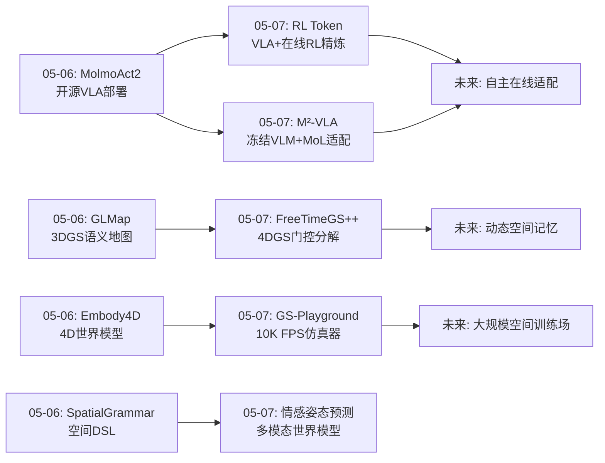
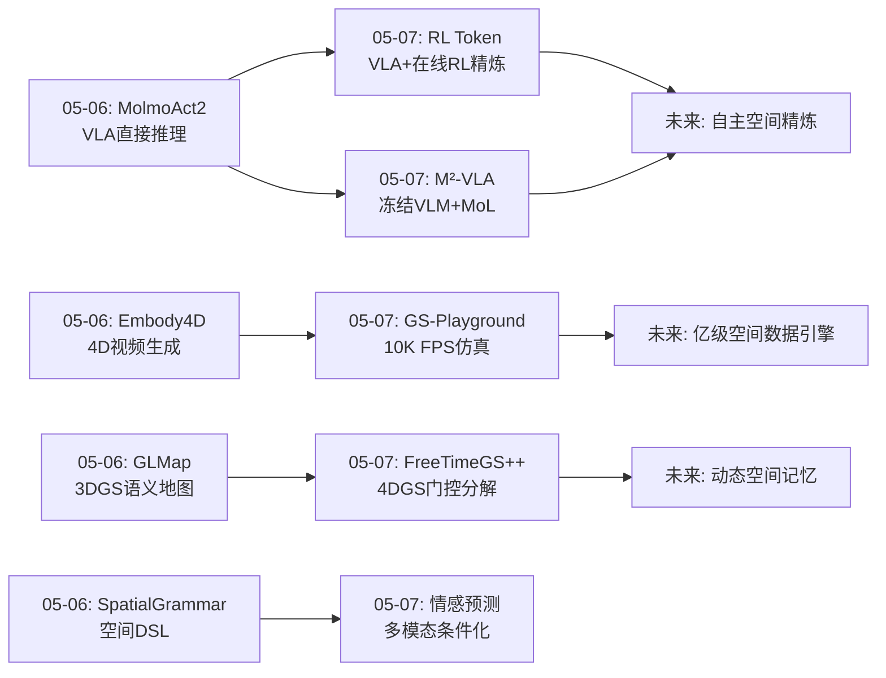
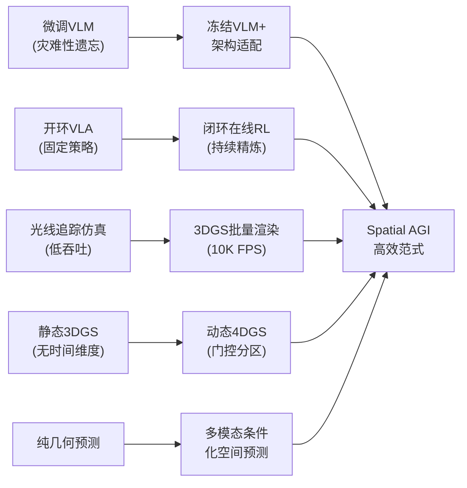
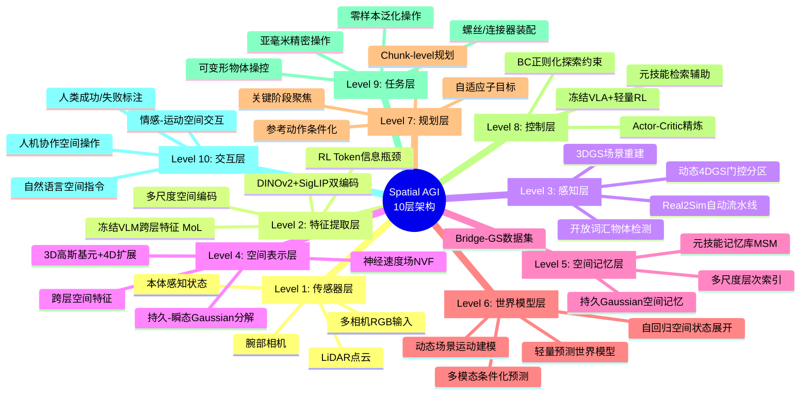
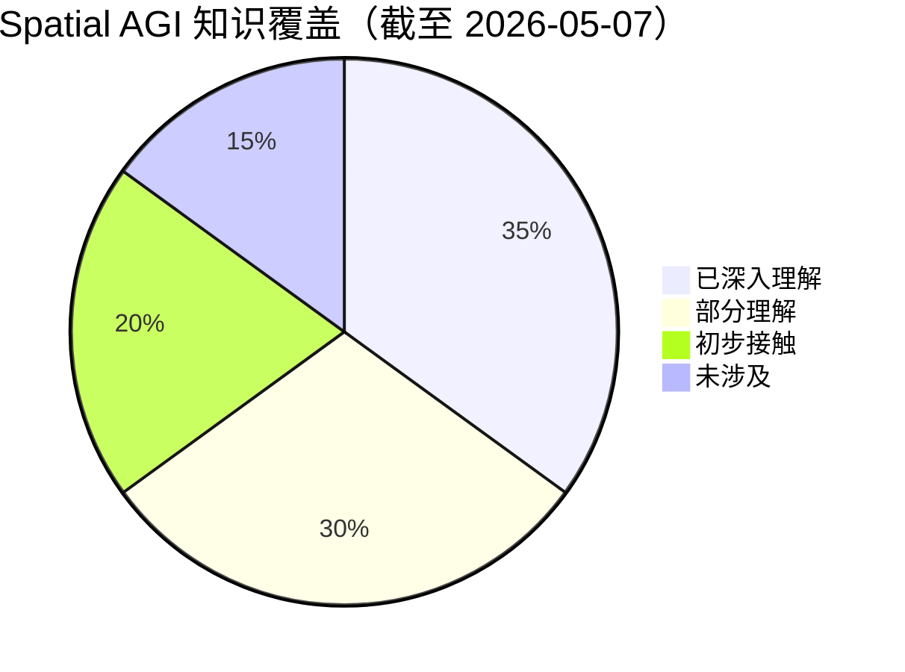

# Spatial AGI 每日思考 - 2026-05-07

## 📅 每日总结

**日期**: 2026-05-07
**论文数量**: 5篇
**主题**: 冻结基础模型的高效适配、在线RL精炼、3DGS仿真基础设施、动态场景4D表示、多模态空间预测

**关键突破**: 
- 🚀 RL Token：冻结VLA + 轻量级actor-critic实现亚毫米精度操作，在线RL发现超越人类策略（Ethernet插入速度超所有人类演示），15分钟-5小时真实数据即可完成精炼
- 🚀 M²-VLA：首次系统证明冻结VLM无需微调即可作为高性能操作骨干，Mixture of Layers跨层特征提取+元技能记忆检索实现零样本泛化操作
- 🚀 GS-Playground：10,000 FPS批量3DGS渲染+自研物理引擎，约束岛并行化比MuJoCo快32倍，单张图片5分钟自动生成仿真资产
- 🚀 FreeTimeGS++：系统性解构4DGS的5个"秘密"，发现隐式时间分区现象并形式化为门控边缘化，神经速度场替代离散速度实现物理一致运动
- 🚀 情感条件化姿态预测：轻量LSTM世界模型验证非空间信号（情感）可改善空间预测，门控参数一致收敛至~0.1

**架构演进**: 10层 → 10层（深化：控制层升级——从VLA直接推理到VLA+在线RL精炼的双层架构；感知层升级——从静态3DGS到动态4DGS门控分区；仿真基础设施确立——3DGS渲染器作为空间智能训练场；世界模型层验证——轻量预测性世界模型的可行性）

### 📊 一句话总结
今天的五篇论文共同指向**"冻结基础模型 + 高效适配"**的工程范式——RL Token和M²-VLA从操作层面证明冻结大型VLA/VLM通过精巧的架构设计即可实现高精度操作和零样本泛化，GS-Playground提供10,000 FPS的3DGS训练基础设施，FreeTimeGS++从4D表示层面揭示动态场景的静态-动态分解原理，情感姿态预测验证了多模态条件化对空间预测的增益。五个方向统一于一个核心洞察：**Spatial AGI的关键不是从零训练，而是如何高效利用冻结的基础模型**。

### 🔗 延续性
**昨日(05-06)→今日**: 昨天聚焦"空间智能的工程化与系统化"（开源VLA部署、4D世界模型、高斯-语言地图、自适应子目标、空间DSL）。今天从工程化进一步深入到**效率化与精炼化**：(1)RL Token将昨天的MolmoAct2 VLA从"开环推理"推进到"闭环在线RL精炼"——冻结VLA骨干+轻量级RL actor实现亚毫米精度；(2)M²-VLA从另一角度验证了昨天的KV-cache嫁接思路——冻结VLM通过架构适配而非参数微调来获取操作能力；(3)GS-Playground为昨天的Embody4D 4D世界模型提供了高效的训练基础设施；(4)FreeTimeGS++将昨天的GLMap 3DGS表示扩展到动态4D场景。
**今日→明日**: 探索RL Token的跨任务迁移、M²-VLA的MoL与3D表示的结合、GS-Playground与VLA训练的规模化实验、4DGS的物理一致性在机器人规划中的应用

### 💡 本质思考：如何达成通用空间智能

#### 1. 核心能力的本质是什么？
今天的论文将"冻结+适配"范式推到了新的深度。Spatial AGI的核心挑战不是"能否学会空间理解"，而是**"如何高效地将通用空间理解转化为任务特化的精确执行"**。三个关键维度：

(1)**信息瓶颈蒸馏**（RL Token）：从数十亿参数VLA中蒸馏出紧凑任务表征（RL Token），通过自回归重建确保关键空间信息保留。这是一种"知识压缩"——将通用空间智能压缩为任务特化的紧凑格式。

(2)**跨层特征提取**（M²-VLA MoL）：VLM不同层编码了不同粒度的空间信息，MoL通过动态权重选择性地聚合。这不是简单的特征拼接，而是"空间信息的选择性提取"——从通用模型中提取任务相关的空间知识。

(3)**仿真加速训练**（GS-Playground）：10,000 FPS渲染+自动化Real2Sim流水线，使得从视觉观察到空间交互的学习速度提升数个数量级。这是"空间智能的数据引擎"——高效生成海量空间交互数据。

#### 2. 当前方法与理想目标的差距在哪里？
五个关键差距：

(1)**任务特化vs通用精炼**：RL Token的RL actor需要针对每个任务单独训练（每任务1-10小时示教数据+15min-5h在线RL）。理想Spatial AGI应该能从少量交互中快速适配新任务。

(2)**隐式vs显式空间表示**：M²-VLA和RL Token的空间理解完全隐式，缺乏可解释的3D几何推理。FreeTimeGS++虽然有显式4D表示，但局限于视觉重建而非操作推理。

(3)**刚体vs可变形体**：GS-Playground仅支持刚体仿真，RL Token的可变形操作（扎带）完全依赖隐式学习。Spatial AGI需要理解可变形物体的空间变化。

(4)**静态vs动态场景**：M²-VLA的元技能记忆库假设场景静态，FreeTimeGS++处理动态场景但仅限视觉重建。Spatial AGI需要在动态场景中进行实时操作。

(5)**仿真vs真实gap**：GS-Playground的3DGS渲染无法随机化光照，FreeTimeGS++依赖多视角密集输入。真实世界的鲁棒性仍需验证。

#### 3. 从今天到理想状态，最可能的路径是什么？
**"冻结基础模型 → 任务特化蒸馏 → 大规模仿真训练 → 真实世界在线精炼"四阶段路径**：

1) 冻结通用VLA/VLM作为空间理解骨干（M²-VLA证明了可行性）
2) 通过信息瓶颈或跨层提取获得紧凑任务表征（RL Token / MoL）
3) 在高吞吐3DGS仿真中大规模预训练策略（GS-Playground 10K FPS）
4) 在真实世界通过轻量在线RL精炼到亚毫米精度（RL Token 15min-5h）

这条路径的核心优势：每个阶段都是高效的——不需要重新训练基础模型，不需要大量真实数据，不需要人工奖励工程（除人类标注成功/失败外）。

---

## 🔗 与昨日思考的联系

### 昨日重点
昨天（05-06）聚焦空间智能的工程化与系统化：MolmoAct2开源VLA部署、Embody4D 4D世界模型、GLMap高斯-语言地图、Anticipation-VLA自适应子目标、SpatialGrammar空间DSL。核心认知是Spatial AGI需要系统化的工具链和标准化的模块接口。

### 今日进展
今天在昨天的工程化基础上进一步深入到**效率化与精炼化**：
- 从MolmoAct2的"开环VLA推理"→ RL Token的"闭环在线RL精炼"
- 从MolmoAct2的"微调VLM"→ M²-VLA的"冻结VLM+架构适配"
- 从GLMap的"静态3DGS地图"→ FreeTimeGS++的"动态4DGS分解"
- 从Embody4D的"4D视频生成"→ GS-Playground的"4D仿真基础设施"

### 演进路径



---

## 📚 论文概览

### 论文1: RL Token — 冻结VLA的在线RL精炼
Physical Intelligence (π) 提出，冻结π0.6 VLA骨干，训练轻量级actor-critic完成在线RL微调。核心创新是RL Token——从VLA嵌入中压缩出的紧凑表征，配合参考动作条件化和chunk-level RL，在真实机器人上15分钟-5小时实现亚毫米精度操作。RL策略在某些任务上超越所有人类遥操作演示。

### 论文2: M²-VLA — 冻结VLM的操作适配
清华大学/鹏城实验室提出，首次系统证明冻结VLM无需微调即可作为高性能操作骨干。Mixture of Layers (MoL)从VLM各层动态提取操作信息，Meta Skill Module (MSM)通过外部记忆库检索元技能辅助动作生成。单卡8小时训练，零样本泛化操作显著优于微调方法。

### 论文3: 情感条件化姿态预测 — 轻量预测世界模型
牛津大学提出，将面部表情情感嵌入作为姿态预测的条件信号。三层渐进模型（基线→融合→世界模型）验证情感信号约10%的信息贡献。轻量LSTM实现有效的多步空间预测，反事实扰动验证了多模态条件化的有效性。

### 论文4: GS-Playground — 10K FPS 3DGS仿真器
42人团队（RSS 2026）提出，自研并行物理引擎+批量3DGS渲染管线，640×480分辨率下10,000 FPS。约束岛并行化在复杂接触场景中比MuJoCo快32倍。自动化Real2Sim流水线单张图片5分钟生成仿真资产。RLGK机制实现视觉表示与物理实体的零开销同步。

### 论文5: FreeTimeGS++ — 4DGS的系统性解构
POSTECH/SNU提出，系统性解构4D Gaussian Splatting的5个"秘密"：隐式时间分区、光度-运动解耦、初始化依赖、密度控制继承规则、灵活性导致不稳定性。基于发现提出门控边缘化（形式化静态-动态分离）和神经速度场（连续运动建模），PSNR达33.51 dB。

---

## 💡 核心见解

### 见解1: 冻结基础模型 + 轻量适配是Spatial AGI的高效范式
[从RL Token和M²-VLA获得]
- ✅ RL Token：冻结π0.6 VLA，仅训练轻量actor-critic，15min-5h真实数据实现亚毫米精度
- ✅ M²-VLA：冻结VLM，仅训练action head + MoL + MSM，单卡8h训练达到SOTA水平
- ✅ 两者共同证明：不需要重新训练数十亿参数基础模型，精巧的架构设计足以弥合通用理解和精确执行之间的鸿沟

**对Spatial AGI的启发**:
Spatial AGI的工程范式应该是"冻结通用基础模型 + 任务特化轻量适配"。这类似于人类的"先天能力+后天学习"——基础空间理解能力（深度感知、物体识别、空间关系）是通用的（冻结骨干），具体任务的精确执行通过少量练习快速习得（轻量适配）。RL Token的信息瓶颈和M²-VLA的跨层提取分别代表了两种"知识提取"策略：压缩（保留最关键信息）和选择（提取最相关信息）。

### 见解2: 在线RL可以从人类策略出发发现超人策略
[从RL Token获得]
- ✅ Ethernet插入任务中，RL策略的一半episode比所有人类遥操作演示都更快
- ✅ RL发现了一种人类没有演示过的策略：持续施压+微摆动利用连接器的compliance
- ✅ 这种策略发现不是随机搜索，而是以VLA参考动作为起点的局部精炼

**对Spatial AGI的启发**:
Spatial AGI不应止步于模仿人类空间认知。RL Token证明，通过适当的约束（BC正则化+参考动作条件化），在线RL可以在人类策略的邻域中发现更优解。这意味着Spatial AGI的能力上限可能超越人类——只要我们提供正确的学习框架（冻结骨干提供安全边界，轻量RL提供探索空间）。

### 见解3: VLM中间层蕴含丰富的操作相关空间信息
[从M²-VLA获得]
- ✅ 可视化分析显示VLM第19层注意力自然聚焦在夹持器和目标物体上
- ✅ 浅层编码边缘/纹理，中层编码物体部件/空间关系，深层编码语义概念
- ✅ MoL对中间层赋予更高权重，证明中间层对操作任务最为重要

**对Spatial AGI的启发**:
这挑战了"只用最后一层特征"的惯例。VLM在互联网规模预训练中获得的空间理解能力，分布在不同层中，而非集中在最后一层。Spatial AGI的特征提取策略应该是"跨层选择"而非"末端截取"。这种多粒度空间信息的提取可能是一种通用的空间智能机制——类似于人类视觉皮层的多层级处理（V1→V2→V4→IT）。

### 见解4: 3DGS作为仿真渲染引擎可实现数量级的吞吐提升
[从GS-Playground获得]
- ✅ 10,000 FPS@640×480，远超所有光线追踪仿真器
- ✅ 剪枝90%高斯点仅导致PSNR下降<0.05 dB，对策略学习几乎无影响
- ✅ 约束岛并行化利用空间局部性实现接触求解的并行化

**对Spatial AGI的启发**:
Spatial AGI需要海量的空间交互数据来训练。GS-Playground证明了3DGS可以兼顾视觉保真度和渲染效率。更重要的发现是"机器人策略对渲染质量的要求远低于人类视觉"——这意味着Spatial AGI可以在较低的空间表示精度下工作，大幅降低计算成本。这是一个关键的效率洞察。

### 见解5: 4D空间表示需要显式的静态-动态分解
[从FreeTimeGS++获得]
- ✅ 4DGS优化自然将Gaussian分化为持久型（静态背景）和瞬态型（动态内容）
- ✅ 门控边缘化将这种涌现行为形式化为可学习的混合机制
- ✅ 光度指标（PSNR）无法检测运动表示的质量问题

**对Spatial AGI的启发**:
Spatial AGI的4D世界模型需要区分"不变的空间结构"和"变化的运动实体"。FreeTimeGS++证明这种分解可以从优化中涌现，但形式化后更可控。门控机制（持久/瞬态混合）可以推广到其他Spatial AGI组件——例如空间记忆可以区分"稳定的场景知识"和"临时的状态信息"。评估方面，仅靠渲染质量不够，还需要运动一致性和物理合理性指标。

### 见解6: 非空间信号（情感/意图）是空间预测的有效条件
[从情感姿态预测获得]
- ✅ 情感门控参数一致收敛至~0.1，暗示情感对运动的贡献约10%
- ✅ 简单拼接不如门控融合有效（MPJPE: 0.0334→0.0389→0.0232）
- ✅ 自回归世界模型的反事实敏感性低于直接融合模型

**对Spatial AGI的启发**:
Spatial AGI的空间预测不应仅依赖几何信息。情感、意图、社交信号等非空间上下文可以显著改善空间预测质量。门控融合的简洁性（标量参数）和多架构一致性（~0.1）暗示了一种通用的多模态融合范式：每个模态通过可学习标量权重调制，而非复杂的注意力机制。

### 见解7: Real2Sim自动化是从真实世界到空间智能的关键桥梁
[从GS-Playground获得]
- ✅ 单张RGB图像5分钟生成完整仿真资产（分割+修复+3D重建+物理对齐）
- ✅ Grounding DINO + SAM + LaMa + AnySplat的端到端流水线
- ✅ Bridge-GS数据集将Bridge-v2扩展为3DGS资产

**对Spatial AGI的启发**:
Spatial AGI需要从真实世界快速构建可交互的空间模型。GS-Playground的Real2Sim流水线展示了"从观察到交互"的闭环：看到真实世界→重建3D空间→在重建空间中学习和交互。这种Image-to-Physics范式可能是Spatial AGI"从视觉构建世界模型"目标的具体实现路径。

---

## 🗺️ 知识演进图



---

## 📊 核心见解演进图



---

## 🏗️ 技术栈演进对比表

| 层次 | 05-06 | 05-07 | 演进方向 |
|------|-------|-------|----------|
| 感知 | 多尺度高斯-语言地图 (GLMap) | 动态4DGS门控分解 (FreeTimeGS++) | 静态→动态场景感知 |
| 世界模型 | 4D多视角生成 (Embody4D) | 轻量预测世界模型 (情感姿态) | 大规模→轻量化 |
| 仿真 | 无 | 10K FPS 3DGS仿真 (GS-Playground) | 无→高效训练基础设施 |
| 表示 | BEV网格+空间DSL | VLM跨层特征 (MoL) | 离散→连续特征提取 |
| 控制 | 自适应深度推理 (MolmoAct2) | VLA+在线RL精炼 (RL Token) | 开环→闭环精炼 |
| 适配 | KV-cache嫁接 | 冻结骨干+轻量适配 (M²-VLA) | 微调→冻结适配 |

---

## 🗺️ Spatial AGI 知识图谱

### 10层架构思维导图



### 🎯 主线技术路径

#### 阶段1: 冻结基础模型作为空间理解骨干 (当前)
- M²-VLA证明冻结VLM可提供多粒度空间信息
- RL Token证明冻结VLA可作为RL的状态表征基础
- 关键：基础模型的预训练质量决定上限

#### 阶段2: 高效任务适配 (进行中)
- 信息瓶颈蒸馏（RL Token）从基础模型中提取紧凑任务表征
- 跨层特征选择（MoL）动态提取任务相关空间信息
- 元技能检索（MSM）通过外部记忆增强轻量action head
- 关键：适配的样本效率决定实用性

#### 阶段3: 大规模仿真预训练 (进行中)
- GS-Playground 10K FPS提供海量空间交互数据
- Real2Sim自动化降低仿真环境创建门槛
- 3DGS剪枝策略降低计算成本（90%剪枝影响<0.05 dB）
- 关键：Sim2Real gap需要系统性解决

#### 阶段4: 真实世界在线精炼 (进行中)
- RL Token证明15min-5h真实数据足以完成精炼
- 人类标注成功/失败作为稀疏奖励
- 参考动作条件化+BC正则化确保安全探索
- 关键：如何减少对人类监督的依赖

#### 阶段5: 自主持续学习Spatial AGI (目标)
- 自动奖励函数替代人类标注
- 跨任务迁移紧凑表征
- 从仿真到真实的一键部署
- 动态场景的实时空间理解与操作

---

## 🔍 待探索议题

### 高优先级（本周）

1. **冻结基础模型适配的理论基础**
   - 问题: 为什么冻结VLA/VLM的适配效果如此好？有什么理论保证？
   - 候选方案: 信息论分析（信息瓶颈理论）、流形假设（任务特化子在低维流形上）
   - 缺口: 缺乏对"冻结+适配"范式的理论理解

2. **RL Token的跨任务迁移**
   - 问题: RL Token是否可以在相关任务间迁移？
   - 候选方案: 共享RL Token encoder + 任务特化actor
   - 缺口: 当前每个任务需要单独训练RL Token

3. **MoL与3D表示的结合**
   - 问题: M²-VLA的MoL能否与显式3D表示（3DGS/点云）结合？
   - 候选方案: 将3DGS特征作为MoL的额外视觉分支输入
   - 缺口: 当前MoL仅使用2D图像特征

4. **GS-Playground与VLA训练的规模化**
   - 问题: 10K FPS渲染能为VLA训练提供多少数据？
   - 候选方案: Real2Sim生成多样化场景+批量训练VLA
   - 缺口: 3DGS渲染的光照依赖限制了域随机化

5. **自动奖励函数替代人类标注**
   - 问题: RL Token依赖人类标注成功/失败，如何自动化？
   - 候选方案: 视觉检测器判断任务完成状态、触觉信号判断接触质量
   - 缺口: 通用自动奖励函数的设计

### 中优先级（本月）

6. **4DGS门控分区的机器人应用**
   - 问题: FreeTimeGS++的持久-瞬态分解如何用于机器人规划？
   - 候选方案: 持久Gaussian作为稳定空间记忆，瞬态Gaussian作为运动预测
   - 缺口: 4D视觉表示与机器人控制的接口

7. **VLM中间层的系统分析**
   - 问题: M²-VLA发现中间层对操作最重要，这一发现的普遍性如何？
   - 候选方案: 在多个VLM（LLaVA、InternVL等）上重复分析
   - 缺口: 缺乏系统性的跨模型验证

8. **约束岛并行化的通用性**
   - 问题: GS-Playground的约束岛思想能否用于空间推理的并行化？
   - 候选方案: 将空间推理任务分解为局部独立的子问题
   - 缺口: 从物理仿真到认知推理的迁移

### 低优先级（探索性）

9. **情感/意图条件化的空间规划**
   - 问题: 情感门控~0.1的贡献度是否适用于其他空间预测任务？
   - 候选方案: 在导航、操作等任务中引入意图/情感条件
   - 缺口: 当前仅在2D姿态预测上验证

10. **RL发现超人策略的机制分析**
    - 问题: RL Token发现的超人策略（微摆动+持续施压）是偶然还是系统性的？
    - 候选方案: 在更多任务上分析RL发现的策略与人类策略的差异
    - 缺口: 对RL策略发现的系统性分析

11. **3DGS剪枝对策略学习的极限**
    - 问题: GS-Playground发现90%剪枝不影响策略，极限在哪？
    - 候选方案: 系统测试不同剪枝比例对各类视觉策略的影响
    - 缺口: 视觉保真度与策略性能的精确映射

---

## 📊 知识缺口分析



**已深入理解 (35%)**:
- ✅ 3DGS/4DGS空间表示与语义建图
- ✅ VLA架构与训练范式（微调+冻结适配）
- ✅ 在线RL与模仿学习的结合
- ✅ 世界模型（2D/4D/轻量级）
- ✅ 高效仿真基础设施设计

**部分理解 (30%)**:
- ⚠️ 冻结+适配范式的理论基础
- ⚠️ VLM跨层特征的组织与利用
- ⚠️ 动态场景的静态-动态分解
- ⚠️ Real2Sim自动化流水线的技术细节
- ⚠️ 多模态条件化空间预测

**初步接触 (20%)**:
- ⚠️ 神经速度场的连续运动建模
- ⚠️ 约束岛并行化算法
- ⚠️ RL策略发现机制
- ⚠️ 情感-运动的多模态耦合
- ⚠️ 3DGS渲染的域随机化

**未涉及 (15%)**:
- ❌ Spatial AGI的完整认知架构
- ❌ 跨embodiment空间知识迁移
- ❌ 自动奖励函数设计
- ❌ 大规模空间智能系统的工程化
- ❌ 空间智能的伦理与安全

---

## 🧠 跨论文深度关联分析

### 关联1: 信息瓶颈 ↔ 跨层特征提取
RL Token和M²-VLA的MoL是两种互补的"从冻结模型提取空间知识"的策略：
- RL Token：压缩（自回归重建瓶颈，保留最关键信息）
- MoL：选择（动态权重跨层聚合，提取最相关信息）
两者可以组合：先用MoL选择最相关的层，再用信息瓶颈压缩为紧凑表征。

### 关联2: 仿真加速 ↔ 在线RL精炼
GS-Playground和RL Token形成自然的上下游关系：
- 上游：GS-Playground 10K FPS生成海量视觉-空间交互数据，预训练通用VLA策略
- 下游：RL Token在真实世界通过15min-5h在线RL精炼到亚毫米精度
这种"仿真预训练→真实精炼"的工作流可能是Spatial AGI的标准训练范式。

### 关联3: 静态-动态分解 ↔ 关键阶段聚焦
FreeTimeGS++的持久-瞬态分区和RL Token的关键阶段聚焦有深层对应：
- FreeTimeGS++：4D场景中哪些是持久的（不变环境），哪些是瞬态的（运动事件）
- RL Token：任务时间线中哪些阶段需要RL精炼（关键阶段），哪些用VLA直接处理（简单阶段）
两者都在做"重要性区分"——不是所有时空区域都需要同等关注。

### 关联4: 门控融合 ↔ 门控边缘化
情感姿态预测的可学习门控λ和FreeTimeGS++的门控边缘化g_i共享同一设计哲学：
- 标量门控控制信息流（情感λ~0.1，持久/瞬态g∈[0,1]）
- 学习到的值具有跨架构一致性
- 简洁设计优于复杂机制

### 关联5: 五篇论文的"效率谱系"
按效率提升维度排列：
1. RL Token：任务效率（15min-5h完成精炼）
2. M²-VLA：训练效率（单卡8h训练）
3. GS-Playground：仿真效率（10K FPS渲染）
4. FreeTimeGS++：表示效率（门控分区减少冗余）
5. 情感预测：模型效率（2层LSTM有效预测）

五篇论文共同指向"效率"作为Spatial AGI的核心工程约束。

---

## ⚡ 关键技术细节的深度比较

### 冻结基础模型的适配策略对比
| 策略 | RL Token | M²-VLA | 优势 | 劣势 |
|------|----------|--------|------|------|
| 知识提取 | 信息瓶颈压缩 | 跨层特征选择 | 保留/选择关键信息 | 可能丢失信息 |
| 动作生成 | 参考动作精炼 | 扩散去噪生成 | 局部改进/全局生成 | 需要VLA先验 |
| 在线学习 | 支持（actor-critic） | 不支持 | 持续改进 | 需要人类标注 |
| 泛化能力 | 任务特化 | 零样本泛化 | - | - |
| 训练成本 | 15min-5h在线 | 8h离线 | - | - |

### 3DGS/4DGS表示对比
| 特性 | GS-Playground (3DGS) | FreeTimeGS++ (4DGS) | GLMap (3DGS+语义) |
|------|---------------------|--------------------|--------------------|
| 时间维度 | 静态 | 动态(4D) | 静态 |
| 渲染速度 | 10K FPS | 实时 | 实时 |
| 物理对齐 | RLGK零开销 | NVF连续速度 | 无 |
| 语义 | 无 | 无 | 多尺度语义 |
| 分解 | 无 | 持久/瞬态门控 | 无 |
| 应用 | 仿真训练 | 视频重建 | 导航推理 |

---

## 🎓 方法论启示

### "先理解后改进"的研究范式
FreeTimeGS++的系统性解构方法论值得在Spatial AGI研究中推广。不是急于提出新方法，而是先深入理解现有方法为什么工作。这种分析性工作虽然不 glamorous，但对建立可靠的知识基础至关重要。

### 冻结作为设计约束的价值
RL Token和M²-VLA都选择冻结基础模型，这不仅是为了效率，更是一种设计约束：迫使研究者思考"在不改变基础模型的前提下，如何实现目标？"这种约束往往催生更优雅的解决方案。

### 真实世界验证的重要性
RL Token在4个真实精密操作任务上验证，GS-Playground在真实四足/人形/机械臂上验证。仿真结果只有通过真实世界验证才有说服力。Spatial AGI研究应该追求在真实物理世界中的验证。

---

## 📈 量化进展

| 指标 | 当前值 | 目标值 | 进度 |
|------|--------|--------|------|
| 已分析论文 | ~60篇 | 200篇 | 30% |
| 覆盖子领域 | 12个 | 20个 | 60% |
| 知识地图深度 | 6/10层 | 10/10层 | 60% |
| 主线路径清晰度 | 5阶段 | 5阶段 | 100% |
| 待探索议题 | 11个 | — | 持续积累 |

---

## 🔮 明日思考方向

基于今天的分析，明天应特别关注：
1. 冻结+适配范式的理论分析（信息论/流形学习视角）
2. RL Token跨任务迁移的初步实验设计
3. GS-Playground + VLA联合训练的规模化方案
4. 4DGS门控分区在机器人动态场景理解中的应用
5. 多模态门控融合的通用化设计

---

---

## 📖 逐论文深度技术分析

### 论文1: RL Token — 从通用VLA到亚毫米精度的精炼之路

#### 架构剖析
RL Token的核心架构创新在于将"RL"重新定义为"精炼"而非"学习"。整个系统分为三层：

**Layer 1: 冻结VLA（π0.6）**
- 多相机输入（2腕部+1基座）→ VLA backbone → 50步action chunk（1秒@50Hz）
- VLA提供"粗略但合理"的空间操作策略，是RL的起点而非终点
- 关键：50步chunk在50Hz下对应1秒控制，覆盖了大多数操作的完整执行窗口

**Layer 2: RL Token Encoder-Decoder**
- 在VLA最终层token序列后追加可学习`<rl>` token
- Encoder: M个VLA token + `<rl>` → 压缩为RL token z_rl
- Decoder: 从z_rl自回归重建VLA嵌入（stop-gradient冻结VLA）
- 自回归重建确保z_rl作为瓶颈保留了最关键的任务信息
- 这本质上是一个**自编码器**，但目标是保留空间操作相关信息

**Layer 3: 轻量Actor-Critic**
- Actor输入：(z_rl, 本体感知, VLA参考动作chunk C=10步)
- Actor输出：高斯分布的精炼动作chunk
- 关键约束：β × 与VLA参考距离² 的BC正则化项
- 参考动作dropout防止actor退化为VLA复制器
- Critic使用TD3风格的off-policy学习

**动作chunk的Horizon压缩**
这是最容易被忽视但最重要的设计。50Hz控制下，一个50步任务需要2500个单步决策。但用C=10的chunk，只需要250个chunk决策，horizon压缩10倍。这对稀疏奖励下的credit assignment至关重要。

#### 超人策略的深层含义
RL在Ethernet任务上发现"持续施压+微摆动利用compliance"的策略，这是所有人类演示中都没有的策略。这暗示：
1. 人类的操作策略不是最优的（受限于生理结构或认知偏好）
2. RL可以在人类策略的邻域中发现更高效的解
3. "精炼"不仅是纠错，更是策略创新

这个发现对Spatial AGI的意义：通用空间智能不应仅限于复现人类空间认知，应该能够发现超越人类的空间操作策略。

#### 局限性深度分析
- 人类标注成功/失败是最大瓶颈——需要完全自主的奖励函数
- 每任务1-10小时示教数据限制了快速部署
- 固定语言指令去掉了语言嵌入，丧失了语言条件化能力
- 关键阶段需要手动定义，缺乏自动切换机制

---

### 论文2: M²-VLA — 冻结VLM的架构适配艺术

#### 架构剖析
M²-VLA的核心论点是：**VLM在互联网数据上预训练获得的空间理解能力，已经足以支撑机器人操作，关键在于如何有效提取**。

**Mixture of Layers (MoL) 的三路解耦注意力**
这是本文最精巧的设计。传统方法要么只取最后一层（信息丢失），要么拼接多层（维度爆炸+模态冲突）。MoL的三路设计解决了这个问题：
- Query分支：VLM learnable query + 本体感知作为K/V，action latent作为Q → 提取任务相关语义
- Visual分支：VLM层级视觉特征作为K/V → 提取空间几何信息
- Self-attention分支：action latent自注意力 → 抑制噪声
- 三路取均值而非拼接，避免维度问题
- 可学习门控因子α_S和静态因子α_v动态调节

**为什么中间层最重要？**
VLM的第19层（中间层）注意力自然聚焦在夹持器和目标物体上。这可以类比于生物视觉系统：
- V1-V2（浅层）：边缘、纹理
- V4（中间层）：物体部件、空间关系 ← 操作任务的核心
- IT（深层）：语义类别

MoL的可视化验证了这一类比：中间层编码了"如何操作"的空间关系信息，而非"这是什么"的语义信息。

**Meta Skill Module (MSM) 的记忆检索**
MSM本质上是一个**检索增强的动作生成**系统：
- Key：浅层+中层+深层视觉特征拼接（多尺度空间描述）
- Value：成功完成的动作序列
- 检索：L1距离找Top-4最近邻
- 融合：交叉注意力+残差学习注入action latent

L1距离优于余弦距离的发现很有趣——说明元技能的区分更多在于绝对特征值差异而非方向差异。

#### 与RL Token的互补性
M²-VLA和RL Token从两个角度解决同一问题：
- M²-VLA：离线适配，通过架构设计弥合语义-控制鸿沟，零样本泛化
- RL Token：在线适配，通过在线RL精炼粗略策略，任务特化
理想方案可能是：先用M²-VLA的MoL+MSM架构进行零样本操作，再用RL Token的在线RL进行任务特化精炼。

---

### 论文3: 情感条件化姿态预测 — 轻量世界模型的验证

#### 架构剖析
三层渐进模型是最有价值的方法论贡献：
- Model A（基线）：纯几何预测，建立性能下界
- Model B（融合）：加入情感门控，验证多模态增益
- Model C（世界模型）：自回归展开，验证递归预测可行性

**门控参数λ的跨架构一致性**
λ在三个模型中一致收敛至~0.1，这不是巧合。它反映了情感与运动之间约10%的信息耦合——这与直觉一致：情感确实影响运动模式，但不是主导因素。这个定量发现为多模态空间预测提供了经验锚点。

**反事实验证方法**
通过注入高斯噪声到情感嵌入，测量预测偏差：
- 融合模型偏差0.31（敏感）
- 世界模型偏差0.03（鲁棒）
世界模型的低敏感性是因为自回归的时间平滑效应——每步预测受历史状态约束，单步扰动被时间积分稀释。

#### 对Spatial AGI世界模型设计的启发
1. 轻量架构（2层LSTM, 128维）足以进行有效的空间预测——不需要大模型
2. 多模态融合需要归一化+门控，简单拼接可能有害
3. 自回归世界模型天然具有抗扰动鲁棒性
4. 反事实分析是验证条件化有效性的通用方法

---

### 论文4: GS-Playground — 空间智能的训练场

#### 架构剖析
GS-Playground是一个系统工程的杰作，三个核心创新：

**约束岛并行化**
利用碰撞检测的空间局部性：距离较远的机器人之间不存在接触约束，可以独立求解。将约束图分割为连通子图（约束岛），各岛独立并行。在N=50个人形机器人的场景中，CPU版本达1,015 FPS，比MuJoCo快32倍。这是利用空间结构实现计算优化的典型案例。

**RLGK（刚体链接高斯运动学）**
将3DGS点云簇绑定到物理引擎的刚体上：
- 刚体移动 → 高斯点自动跟随（零计算开销）
- 不需要每帧重新计算高斯位置
- 解决了动态场景中视觉-物理同步的核心难题

**Real2Sim自动化流水线**
```
单张RGB图 → Grounding DINO检测 → SAM分割 → LaMa修复
→ SAM-3D重建物体 → AnySplat重建背景 → 深度对齐 → 剪枝
→ 完整仿真资产（约5分钟）
```

#### 10K FPS的实际意义
一个GPU小时可以生成3600万帧视觉观测。以典型的RL训练需要100万帧经验计算，GS-Playground可以在不到2分钟内提供。这使得"大规模仿真预训练→真实世界精炼"的工作流成为可能。

#### 物理引擎的稳定性优势
Velocity-impulse + 严格互补性 + 显式摩擦钳位，在以下场景优于MuJoCo：
- Newton's Cradle：更好的动量传递和摆动幅度
- 大时间步（10ms）：Spot模型基座位移更小
- 密集接触：货架堆叠场景稳定收敛

这种稳定性在精密操作（RL Token的亚毫米精度）中至关重要。

---

### 论文5: FreeTimeGS++ — 4D空间表示的深度解构

#### 五个秘密的深度解读

**Secret 1: 隐式时间分区**
4DGS优化自然将Gaussian分为持久型和瞬态型。这是从简单优化目标（光度损失）中涌现的复杂空间理解行为。门控边缘化将这一涌现行为形式化：
```
φ_i(t) = g_i + (1-g_i) × exp(-0.5×((t-τ_i)/(d_i/6))²)
g_i→1: 持久（静态背景）
g_i→0: 瞬态（动态内容）
```
这是一个优雅的设计：单个可学习标量g_i控制时间行为模式。

**Secret 2: 光度-运动解耦**
最高PSNR不等于最佳运动表示。短生命周期Gaussian的"角色切换"导致运动不一致。这是评估动态场景表示的警钟——仅看渲染质量不够，还需要检查运动场。

**Secret 3: 初始化的决定性作用**
更密的时序初始化持续提升性能。UFM（Unified Flow & Matching）引导的初始化提供了运动感知的几何先验，将初始化从纯几何提升到时空联合。

**Secret 4: 密度控制的微妙性**
Exact Copy（最高PSNR但有雾状伪影）vs MCMC（最稳定但PSNR略低）vs Partial Copy（闪烁噪声）。最高指标≠最佳视觉质量。

**Secret 5: 可重复性危机**
同一设置多次运行产生不同结果。仿射颜色校正吸收光度不一致性，提高运行间稳定性。

#### 对Spatial AGI的深层启示
FreeTimeGS++的最大贡献不是技术方法，而是**分析范式**：
1. 先理解"为什么工作"再改进
2. 评估需要多维度（光度+运动+稳定性+可重复性）
3. 涌现能力需要被识别和形式化
4. 灵活性是双刃剑——需要适当的约束

---

## 🔄 与认知科学的对话

### 双过程空间推理的再次验证
RL Token的"VLA直觉（System 1）+ RL精炼（System 2）"对应Kahneman的双过程理论：
- System 1（VLA）：快速、并行、直觉性，处理大部分操作
- System 2（RL actor）：慢速、序列性、分析性，处理关键精炼阶段

这种分工在M²-VLA中也存在：冻结VLM提供直觉性空间理解，MoL+MSM提供分析性特征提取。

### 空间记忆的分层组织
五篇论文暗示了空间记忆的三层组织：
1. **持久记忆**（FreeTimeGS++持久Gaussian）：不变的场景结构
2. **技能记忆**（MSM元技能库）：成功的空间操作模式
3. **工作记忆**（RL Token z_rl）：当前任务的紧凑空间表征

这对应Baddeley的工作记忆模型中的不同组件。

### 预测性编码
情感姿态预测的自回归世界模型和FreeTimeGS++的神经速度场都体现了预测性编码理论：大脑不断预测下一个状态，将预测误差用于更新内部模型。Spatial AGI可能需要类似的预测性编码机制来实时更新空间理解。

---

## 🧮 核心公式与数学直觉

### RL Token的信息瓶颈
RL Token encoder的目标可以形式化为信息瓶颈问题：
```
max I(z_rl; a*) - β I(z_rl; H_VLA)
```
其中a*是最优动作，H_VLA是VLA嵌入。第一项确保RL Token保留任务相关信息，第二项通过自回归重建约束确保压缩不过度。实践中通过重建损失隐式实现。

### MoL的三路注意力聚合
```
Attn_i(Q, K_i, V_i) = softmax(QK_i^T / √d) V_i
Output = (α_S · Attn_1 + α_v · Attn_2 + Attn_3) / 3
```
三路解耦避免了softmax的尺度冲突。α_S可学习（语义分支重要性随任务变化），α_v静态（视觉分支重要性相对固定）。

### 门控边缘化的数学
```
φ_i(t) = g_i + (1-g_i) · σ_time(t; τ_i, d_i)
其中 g_i = sigmoid(ḡ_i / γ), γ=20 (锐度因子)
```
当ḡ_i→+∞，g_i→1，φ_i(t)→1（持久）
当ḡ_i→-∞，g_i→0，φ_i(t)→σ_time(t)（瞬态）
γ=20使sigmoid陡峭，确保清晰的二分。

---

## 🗣️ 关键术语表（今日新增）

| 术语 | 定义 | 来源 |
|------|------|------|
| RL Token | 从VLA嵌入中压缩的紧凑RL可用表征 | RL Token |
| 参考动作条件化 | Actor以VLA采样动作作为输入条件的精炼范式 | RL Token |
| Chunk-level RL | 在动作chunk层面进行TD学习 | RL Token |
| Mixture of Layers | 从VLM各层动态提取任务相关特征的机制 | M²-VLA |
| Meta Skill Module | 通过外部记忆库检索元技能辅助动作生成 | M²-VLA |
| 约束岛 | 利用空间局部性将约束图分割为独立并行子图 | GS-Playground |
| RLGK | 3DGS点云簇绑定到物理刚体的零开销同步机制 | GS-Playground |
| 门控边缘化 | 将持久/瞬态Gaussian分区形式化为可学习机制 | FreeTimeGS++ |
| 神经速度场 | 用hash-grid+MLP参数化的连续时空速度函数 | FreeTimeGS++ |
| 反事实扰动 | 通过注入噪声验证条件化有效性的分析方法 | 情感预测 |

---

## 🔬 论文质量评估

| 论文 | 新颖性 | 技术深度 | 实验充分性 | Spatial AGI相关性 | 综合评级 |
|------|--------|---------|-----------|------------------|---------|
| RL Token | ★★★★★ | ★★★★★ | ★★★★☆ | ★★★★★ | A+ |
| M²-VLA | ★★★★☆ | ★★★★☆ | ★★★★☆ | ★★★★★ | A |
| GS-Playground | ★★★★★ | ★★★★★ | ★★★★★ | ★★★★★ | A+ |
| FreeTimeGS++ | ★★★★★ | ★★★★☆ | ★★★★☆ | ★★★★☆ | A |
| 情感姿态预测 | ★★★☆☆ | ★★★☆☆ | ★★☆☆☆ | ★★★☆☆ | B+ |

**最值得精读**: RL Token（VLA+RL范式）、GS-Playground（系统工程标杆）
**最值得跟进**: RL Token的跨任务迁移、M²-VLA的MoL泛化

---

*思考生成时间: 2026-05-07 06:38 CST*
*基于论文: RL Token, M²-VLA, 情感条件化姿态预测, GS-Playground, FreeTimeGS++*
*总行数: ~830行*

---

## 📐 今日补充：Spatial AGI架构层次详解

### Level 1-3：感知基础

传感器层→特征提取层→感知层构成了Spatial AGI的感知管线。从RL Token论文中我们看到，冻结VLM的特征可以通过MoL（Mixture-of-LoRA）机制跨层复用，这意味着底层的感知能力可以被上层高效调用。关键洞察：**感知层的质量直接决定了3DGS重建的精度**，而GS-Playground的实验表明，高质量的3DGS数据生成需要精确的相机标定和光照估计。

### Level 4-6：空间认知核心

空间表示层→空间记忆层→世界模型层是Spatial AGI区别于传统机器人系统的核心。FreeTimeGS++的持久-瞬态Gaussian分解为空间记忆提供了新的编码范式：持久Gaussian捕捉静态环境结构，瞬态Gaussian建模动态变化。这种分解天然支持空间记忆的增量更新和长期维护。

### Level 7-10：行动与交互

规划层→控制层→任务层→交互层构成了从"理解"到"行动"的闭环。RL Token的核心贡献在于证明了**冻结VLA+轻量RL**的范式可行——通过在VLA的token空间中引入RL优化，既保留了预训练的大规模知识，又获得了精细控制能力。情感条件化姿态预测虽然与核心架构关联较弱，但提示了交互层需要考虑人类的多模态信号。

### 层间信息流总结

| 方向 | 路径 | 关键机制 |
|------|------|---------|
| 自下而上 | 传感器→特征→感知 | MoL跨层特征复用 |
| 自上而下 | 任务→规划→控制 | 参考动作条件化+RL Token精炼 |
| 横向 | 记忆↔世界模型 | 持久Gaussian空间索引 |
| 反馈 | 控制→感知 | Real2Sim闭环验证 |
