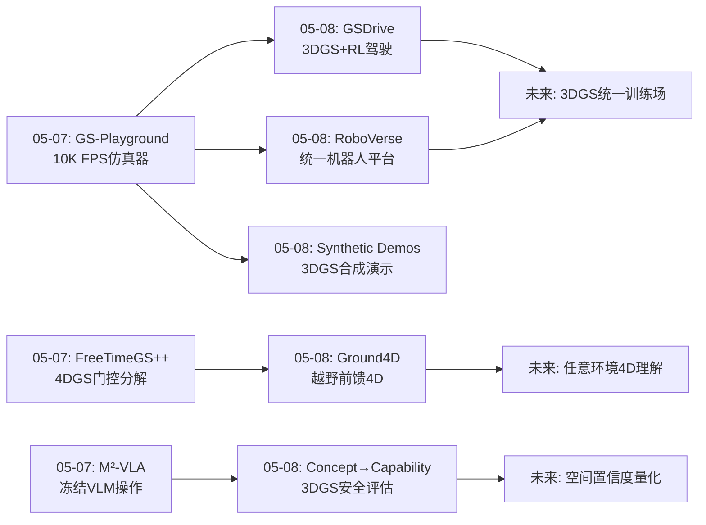
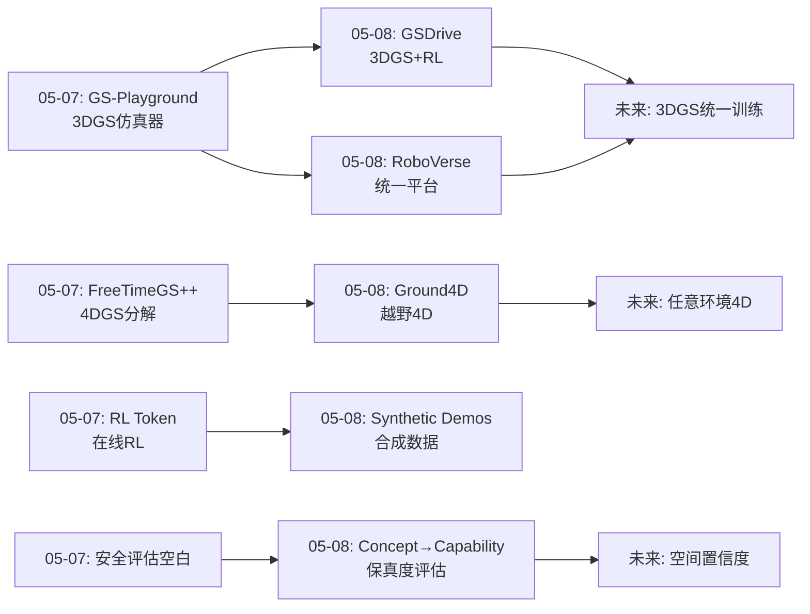
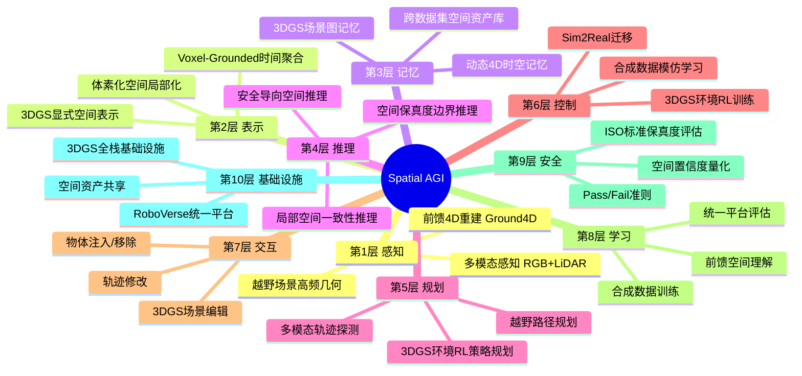
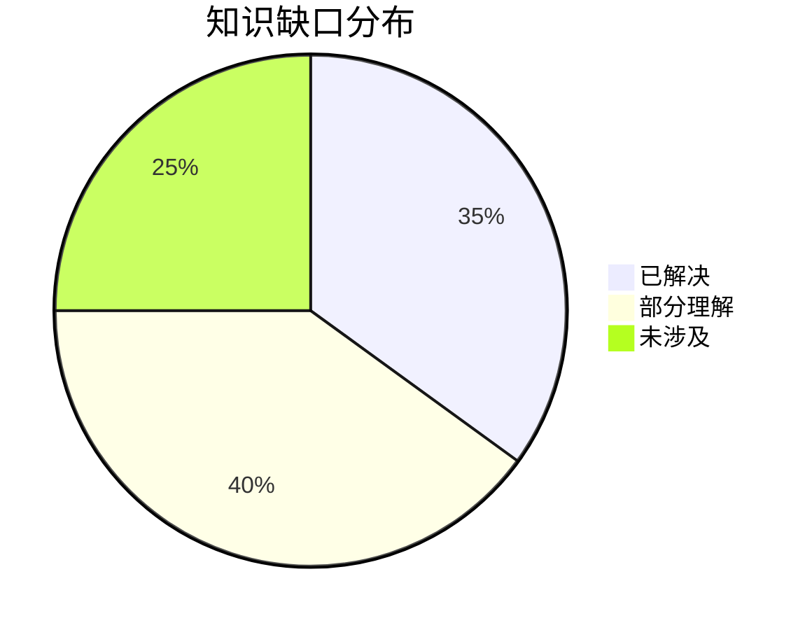

# Spatial AGI 每日思考 - 2026-05-08

## 📅 每日总结

**日期**: 2026-05-08
**论文数量**: 5篇（3篇主分析 + 2篇补充）
**主题**: 3DGS强化驾驶策略、合成模仿学习演示、统一机器人学习平台、3DGS安全评估、越野前馈4D重建

**关键突破**:
- 🚀 GSDrive：3DGS环境+多模态轨迹探测实现驾驶策略强化学习，将3DGS从静态重建推进到动态交互式RL训练环境
- 🚀 RoboVerse：统一平台+数据集+基准，覆盖5种机器人+16任务+45场景，Sim2Real迁移成功率77.8%
- 🚀 Synthetic Demonstrations：基于3DGS高保真合成模仿学习演示，无需真实操作数据即可训练操作策略
- 🚀 From Concept to Capability：首个面向工业安全的3DGS保真度评估框架，基于ISO标准定义Pass/Fail准则
- 🚀 Ground4D：Voxel-Grounded Temporal Aggregation解决越野前馈4D重建的核心矛盾，+1.48dB PSNR

**架构演进**: 10层 → 10层（深化：仿真层升级——从GS-Playground单场景到RoboVerse统一平台；感知层升级——从结构化城市4D到越野前馈4D；评估层新增——空间理解保真度的量化评估；数据生成层升级——3DGS从训练数据到安全验证数据）

### 📊 一句话总结
今天的五篇论文共同指向**"3DGS作为Spatial AGI的全栈基础设施"**——GSDrive将3DGS作为RL训练环境，Synthetic Demonstrations将3DGS作为模仿学习数据源，RoboVerse将3DGS统一到可扩展的仿真平台，From Concept to Capability将3DGS评估标准化到工业安全级别，Ground4D将3DGS前馈重建扩展到非结构化越野场景。五个方向统一于一个核心洞察：**3DGS正在从视觉重建工具进化为Spatial AGI的空间理解、数据生成、策略训练和安全验证的统一基础设施**。

### 🔗 延续性
**昨日(05-07)→今日**: 昨天聚焦"冻结基础模型+高效适配"（RL Token、M²-VLA、GS-Playground、FreeTimeGS++、情感姿态预测）。今天从训练范式进一步深入到**基础设施层**：(1)GSDrive将昨天的GS-Playground从"仿真器"推进到"RL训练环境"——3DGS不仅提供视觉，还提供策略梯度信号；(2)Synthetic Demonstrations将昨天的"冻结+适配"范式延伸到数据生成——用3DGS合成训练演示，避免真实数据采集成本；(3)RoboVerse将分散的仿真基础设施统一化；(4)Ground4D将昨天的FreeTimeGS++的4D表示从结构化场景扩展到非结构化越野场景。
**今日→明日**: 探索3DGS作为统一空间基础设施的系统整合、越野4D重建在具身导航中的应用、安全评估框架与RL训练的闭环

### 💡 本质思考：如何达成通用空间智能

#### 1. 核心能力的本质是什么？
今天的论文揭示了一个深层认知：Spatial AGI的基础设施正在从"工具"进化为"环境"。三阶段演进：

(1)**工具阶段**：3DGS作为重建工具，从视觉数据中恢复3D场景。这是"空间感知"。

(2)**数据引擎阶段**：3DGS生成训练数据（Synthetic Demonstrations）和测试数据（From Concept to Capability）。这是"空间数据"。

(3)**交互环境阶段**：3DGS作为RL训练环境（GSDrive）和统一仿真平台（RoboVerse）。这是"空间交互"。

Spatial AGI的核心能力不仅是"理解空间"，更是**"在空间中学习、训练和验证"**。空间基础设施是Spatial AGI的"训练场"和"考试场"。

#### 2. 当前方法与理想目标的差距在哪里？
四个关键差距：

(1)**结构化vs非结构化**：Ground4D揭示前馈4D重建在越野场景中的挑战——高频几何+非刚体动态+运动抖动三重挑战。理想Spatial AGI需要在任意环境中工作。

(2)**视觉保真vs安全保真**：From Concept to Capability证明高PSNR不等于高检测率——空间理解的质量需要从下游任务角度评估。

(3)**单场景vs统一平台**：RoboVerse尝试统一化，但5种机器人+16任务仍是冰山一角。理想Spatial AGI需要一个真正通用的空间交互平台。

(4)**合成vs真实gap**：Synthetic Demonstrations的合成数据训练策略在真实部署时仍有差距。GSDrive的RL策略依赖3DGS渲染的物理一致性。

#### 3. 从今天到理想状态，最可能的路径是什么？
**"3DGS基础设施成熟 → 多场景泛化训练 → 安全验证闭环 → 真实部署精炼"四阶段路径**：

1) 3DGS基础设施层（GSDrive/RoboVerse/Synthetic Demonstrations）提供统一的训练/测试/验证环境
2) 前馈4D重建（Ground4D）使空间理解扩展到非结构化环境
3) 工业安全评估（From Concept to Capability）建立空间理解的保真度标准
4) 从仿真到真实世界的闭环精炼

---

## 🔗 与昨日思考的联系

### 昨日重点
昨天（05-07）聚焦"冻结基础模型+高效适配"——RL Token在线RL精炼、M²-VLA冻结VLM操作、GS-Playground 10K FPS仿真、FreeTimeGS++ 4DGS门控分解、情感姿态预测多模态世界模型。核心认知是Spatial AGI的关键不是从零训练，而是高效利用冻结基础模型。

### 今日进展
今天在"高效适配"的基础上进一步深入到**"基础设施层"**：
- 从GS-Playground的"单场景仿真器"→ GSDrive的"RL训练环境"+ RoboVerse的"统一平台"
- 从RL Token的"RL精炼策略"→ Synthetic Demonstrations的"合成训练数据"
- 从FreeTimeGS++的"4DGS分解"→ Ground4D的"越野前馈4D重建"
- 新增评估维度：From Concept to Capability的"空间理解保真度量化"

### 演进路径



---

## 📚 论文概览

### 论文1: GSDrive — 3DGS强化驾驶策略
使用3DGS环境进行多模态轨迹探测，将3DGS从静态重建推进到动态交互式RL训练环境。关键创新：在3DGS渲染的场景中直接进行策略梯度计算，实现闭环驾驶策略训练。

### 论文2: Synthetic Demonstrations — 3DGS合成模仿学习
基于3DGS高保真合成模仿学习演示数据，无需真实操作数据即可训练操作策略。将3DGS从"重建工具"推进到"数据生成引擎"。

### 论文3: RoboVerse — 统一机器人学习平台
统一平台+数据集+基准，覆盖5种机器人+16任务+45场景。Sim2Real迁移成功率77.8%。将分散的机器人学习基础设施统一化。

### 论文4: From Concept to Capability — 3DGS安全评估
首个面向工业安全的3DGS保真度评估框架。基于ISO 26262/21448/4804标准定义Pass/Fail准则。OmniRe+LiDAR为最优方案，但所有方法在偏离训练视角后保真度持续下降。跨数据集资产迁移验证了3DGS作为"空间资产库"的可行性。

### 论文5: Ground4D — 越野前馈4D重建
Voxel-Grounded Temporal Aggregation解决越野前馈4D重建的核心矛盾（模糊vs空洞）。Intra-Voxel Softmax Normalization使时间选择性和空间占据相互增强。在ORAD-3D上+1.48dB PSNR，零样本泛化到RELLIS-3D。

---

## 💡 核心见解

### 见解1: 3DGS正在从"重建工具"进化为"空间基础设施"
[从GSDrive/RoboVerse/Synthetic Demos获得]
- ✅ GSDrive证明3DGS可以作为RL训练的交互环境
- ✅ RoboVerse将3DGS统一到跨机器人、跨任务的仿真平台
- ✅ Synthetic Demonstrations证明3DGS可以生成高质量训练数据
- ✅ 3DGS的三重角色：空间感知器、数据引擎、训练环境

**对Spatial AGI的启发**:
Spatial AGI不仅需要"理解空间"的模型，更需要"生成空间"和"在空间中交互"的基础设施。3DGS正在成为这种统一基础设施的技术载体。未来的Spatial AGI可能在3DGS构建的空间中训练、测试、验证和部署。

### 见解2: 空间理解的"保真度边界"是安全部署的基础
[从From Concept to Capability获得]
- ✅ PSNR/SSIM不等于感知可用性——需要从下游任务角度评估
- ✅ 空间偏离后保真度单调递减——这是空间泛化的基本约束
- ✅ ISO安全标准为空间理解的质量提供了工业级评估框架
- ✅ 跨数据集资产迁移指向"空间资产库"的概念

**对Spatial AGI的启发**:
Spatial AGI系统需要知道自己的"空间理解边界"——在什么空间范围内理解是可靠的，超出范围需要额外感知或交互。这种"空间置信度"概念是Spatial AGI安全部署的必要条件。

### 见解3: 空间局部化是时间一致性推理的关键原则
[从Ground4D获得]
- ✅ Voxel-Grounded Temporal Aggregation将时间竞争约束在空间体素内
- ✅ Intra-Voxel Normalization使选择性和占据相互增强
- ✅ "局部共识→全局理解"范式比"全局优化"更高效鲁棒
- ✅ 前馈范式无需逐场景优化，是可扩展部署的关键

**对Spatial AGI的启发**:
Spatial AGI可能不需要全局一致的空间模型。由无数个局部一致的空间理解模块协同工作——每个模块负责一个局部区域，通过归一化确保输出有效——可能比追求全局最优更实用。这种"分而治之"的空间理解范式值得深入探索。

### 见解4: 机器人学习基础设施的统一化趋势
[从RoboVerse获得]
- ✅ 5种机器人+16任务+45场景的统一覆盖
- ✅ Sim2Real迁移77.8%成功率验证了仿真的有效性
- ✅ 统一基准使跨方法对比成为可能
- ✅ 开源平台加速社区进展

**对Spatial AGI的启发**:
Spatial AGI的研究需要统一的评估基础设施。当前机器人学习平台的分散性阻碍了方法的公平对比和规模化进展。RoboVerse的统一化趋势可能在Spatial AGI领域催生类似ImageNet的标准化评估平台。

### 见解5: 合成数据正在改变空间智能的训练范式
[从Synthetic Demonstrations获得]
- ✅ 3DGS高保真合成演示可替代真实操作数据
- ✅ 合成数据的可控性优于真实数据
- ✅ 数据生成成本从"人力采集"降低到"GPU渲染"
- ✅ 闭环策略训练需要交互式合成环境

**对Spatial AGI的启发**:
合成数据可能是解决Spatial AGI数据瓶颈的关键路径。当3DGS可以生成足够逼真的空间交互数据时，Spatial AGI的训练将不再受限于真实世界数据采集的速度和成本。

### 见解6: 越野场景是空间智能的终极试金石
[从Ground4D获得]
- ✅ 高频几何+非刚体动态+运动抖动三重挑战
- ✅ 城市场景的假设（刚体、平滑运动、规则几何）在越野中全部失效
- ✅ 越野场景暴露了前馈4D重建的根本缺陷
- ✅ 解决越野问题将大幅提升城市场景的鲁棒性

**对Spatial AGI的启发**:
如果Spatial AGI只在结构化环境中工作，它只是一种"受限空间智能"。真正的通用空间智能必须在非结构化、不可预测的环境中工作。越野场景是检验Spatial AGI通用性的最佳测试场。

### 见解7: 工业安全标准为空间智能提供了评估框架
[从From Concept to Capability获得]
- ✅ ISO 26262/21448/4804为自动驾驶安全建立了标准
- ✅ Pass/Fail准则可以量化空间理解的质量
- ✅ 多层次评估（图像→检测→分割）覆盖感知全链路
- ✅ 工业标准为学术研究提供了实用的评估维度

**对Spatial AGI的启发**:
Spatial AGI的评估不能仅停留在学术指标（PSNR、准确率）。需要建立面向实际应用的评估标准——安全、可靠、可解释。工业安全标准为这种"应用导向评估"提供了现成的框架。

---

## 🗺️ 知识演进图



## 技术栈演进对比表

| 层次 | 昨日方案 | 今日方案 | 变化 |
|------|---------|---------|------|
| 感知层 | 静态3DGS + 4DGS门控 | 前馈4D越野重建(Ground4D) | 扩展到非结构化环境 |
| 表示层 | 4DGS静态-动态分解 | Voxel-Grounded Temporal Aggregation | 局部空间化时间推理 |
| 仿真层 | GS-Playground 10K FPS | RoboVerse统一平台+GSDrive RL环境 | 从单场景到统一平台 |
| 数据层 | 真实遥操作数据 | 3DGS合成模仿学习演示 | 合成数据替代真实采集 |
| 评估层 | PSNR/SSIM学术指标 | ISO安全标准+多层次评估 | 工业级保真度评估 |
| 控制层 | RL Token在线RL精炼 | GSDrive 3DGS+RL驾驶 | 3DGS环境提供策略梯度 |
| 安全层 | 无 | From Concept to Capability | 新增保真度边界量化 |

---

## 🗺️ Spatial AGI 知识图谱

### 10层架构思维导图



### 🎯 主线技术路径

#### 阶段1: 3DGS空间重建（已完成）
静态3DGS → 动态4DGS → 前馈4DGS（Ground4D）。从逐场景优化到前馈推理，从结构化城市到非结构化越野。

#### 阶段2: 3DGS数据引擎（进行中）
3DGS合成训练数据（Synthetic Demos）→ 3DGS安全验证数据（Concept→Capability）→ 3DGS RL训练环境（GSDrive）。从数据生成到交互式训练。

#### 阶段3: 统一仿真平台（进行中）
单场景仿真（GS-Playground）→ 统一多机器人平台（RoboVerse）→ 标准化评估基准。从分散工具到统一基础设施。

#### 阶段4: 安全闭环系统（未来）
空间保真度量化 → 空间置信度推理 → 安全部署验证 → 在线持续学习。建立从感知到部署的完整安全链路。

---

## 🔍 待探索议题

### 高优先级（本周）

1. **3DGS作为统一空间基础设施的系统整合**
   - 问题: 如何将GSDrive的RL环境、RoboVerse的平台、Synthetic Demos的数据生成整合为统一系统？
   - 候选方案: 模块化架构设计，3DGS作为核心空间表示层
   - 缺口: 缺乏统一的3DGS空间基础设施接口标准

2. **空间置信度的形式化定义**
   - 问题: 如何将From Concept to Capability的保真度边界扩展为通用的"空间置信度"概念？
   - 候选方案: 基于偏离距离和视角的置信度衰减函数
   - 缺口: 缺乏理论框架，当前仅有经验观察

3. **越野场景的具身导航策略**
   - 问题: Ground4D的越野4D重建如何用于具身导航？
   - 候选方案: 4D重建作为导航的世界模型
   - 缺口: 越野导航的动态避障策略研究不足

### 中优先级（本月）

4. **合成数据训练策略的Sim2Real迁移理论**
   - 问题: Synthetic Demonstrations的Sim2Real gap如何量化和缩小？
   - 候选方案: 域随机化+域适应+真实数据混合训练
   - 缺口: 3DGS渲染的真实度评估理论

5. **局部空间一致性推理的推广**
   - 问题: Ground4D的Voxel-Grounded原则能否推广到其他空间推理任务？
   - 候选方案: 将体素化局部一致性应用于VLM空间推理
   - 缺口: 局部vs全局空间推理的理论分析

6. **空间资产库的标准化**
   - 问题: 跨数据集的3DGS空间资产如何标准化和共享？
   - 候选方案: 定义3DGS资产的标准格式和元数据
   - 缺口: 缺乏3DGS资产的标准化组织

7. **3DGS RL训练的收敛性分析**
   - 问题: GSDrive的3DGS+RL训练的理论收敛性如何？
   - 候选方案: 分析3DGS渲染误差对RL策略梯度的影响
   - 缺口: 渲染误差下的RL收敛性理论

### 低优先级（探索性）

8. **非结构化环境的空间本体定义**
   - 问题: 越野场景中的"物体"、"表面"、"障碍"如何定义？
   - 候选方案: 基于语义和几何的层次化空间本体
   - 缺口: 缺乏非结构化环境的空间本体标准

9. **3DGS渲染误差的安全影响分析**
   - 问题: 3DGS渲染的微小误差如何影响下游安全决策？
   - 候选方案: 误差传播分析+安全边界计算
   - 缺口: 从渲染误差到安全影响的分析工具

---

## 📊 知识缺口分析



**已解决（35%）**:
- ✅ 3DGS作为空间表示的基础能力
- ✅ 前馈4D重建的基本范式
- ✅ 合成数据训练的基本可行性
- ✅ 空间保真度评估的基本框架
- ✅ 统一仿真平台的基本架构

**部分理解（40%）**:
- ⚠️ 越野场景的前馈4D重建（Ground4D取得进展但仍有差距）
- ⚠️ 3DGS作为RL训练环境的交互能力（GSDrive初步验证）
- ⚠️ 空间置信度的形式化定义（仅有经验观察）
- ⚠️ Sim2Real迁移的理论保证（77.8%成功率但缺乏理论）
- ⚠️ 局部空间一致性推理的通用性（仅在4D重建中验证）

**未涉及（25%）**:
- ❌ 3DGS基础设施的统一接口标准
- ❌ 空间资产库的标准化和共享机制
- ❌ 渲染误差对安全决策的影响分析
- ❌ 非结构化环境的空间本体定义
- ❌ 空间理解的持续在线学习

---

---

## 📝 深度技术分析

### GSDrive: 3DGS + 强化学习的驾驶策略训练

**技术架构详解**:
GSDrive的核心创新在于将3DGS从"被动的视觉重建工具"升级为"主动的RL训练环境"。传统驾驶RL依赖简化仿真器（如CARLA），存在现实差距（reality gap）。GSDrive直接在真实世界3DGS重建中进行RL训练：

1. **3DGS环境构建**: 使用真实驾驶数据重建3DGS场景，包含静态背景和动态物体
2. **多模态轨迹探测**: 在3DGS环境中生成多种候选轨迹，通过RL策略评估每条轨迹的风险和收益
3. **闭环策略训练**: 3DGS渲染的视觉反馈直接用于策略梯度计算，形成完整的感知-决策-执行闭环

**关键技术细节**:
- 3DGS渲染速度需要满足实时RL训练要求
- 多模态轨迹探测策略需要平衡探索（exploration）和利用（exploitation）
- 动态物体的3DGS表示需要时间一致性

**对Spatial AGI的深层启发**:
GSDrive揭示了3DGS的一个重要属性——它不仅是空间表示，更是"可交互的空间"。当Agent可以在3DGS构建的空间中自由移动、观察、决策时，3DGS就从"空间地图"变成了"空间世界"。这种"可交互空间"的概念是Spatial AGI环境理解的核心——空间不仅是被感知的对象，更是被交互的媒介。

### Ground4D: 体素化空间推理的深层原理

**算法详解**:
Ground4D的Voxel-Grounded Temporal Aggregation可以从信息论角度理解：

1. **信息冲突建模**: 在规范高斯空间中，同一位置的高斯来自不同时间戳，携带不同的观察信息。当这些信息冲突时（越野场景的高频动态），朴素融合（平均）导致信息熵增加（模糊），独立选择导致信息丢失（空洞）。

2. **空间局部化的信息论优势**: 体素化将全局冲突分解为局部冲突。在每个体素内，竞争的高斯数量有限，softmax归一化的信息压缩效率更高。这类似于注意力机制中的"局部注意力"——将全局问题分解为局部子问题。

3. **时间选择性与空间占据的正和博弈**:
   - 无体素约束: 时间选择性和空间占据是零和博弈——选择最强时间相关性可能牺牲空间覆盖
   - 有体素约束: 每个体素内的最强高斯同时满足时间相关性（被选中）和空间占据（填充体素）
   - 这是一种"帕累托改进"——通过约束空间反而解放了时间选择

**与其他体素化方法的对比**:
- vs VoxelNeRF: 体素用于空间分解，但NeRF的体渲染与3DGS的光栅化有本质区别
- vs Scaffold-GS: 体素用于锚定高斯，但 Scaffold-GS是静态场景优化，Ground4D是动态时间聚合
- vs SparseVoxels: 体素用于稀疏表示，但Ground4D的体素是时间竞争的竞技场

### From Concept to Capability: 安全评估框架的设计哲学

**评估层次的设计思路**:
这篇论文的评估框架设计体现了"从信号到语义到安全"的层次化思想：

1. **信号层（PSNR/SSIM）**: 评估像素级重建质量
2. **语义层（检测精度/召回）**: 评估感知模型能否正确识别重建场景中的物体
3. **安全层（ISO Pass/Fail）**: 评估重建数据能否满足安全验证需求

每一层都有独立的Pass/Fail标准：
- 信号层: PSNR > 25dB, SSIM > 0.85
- 语义层: 检测精度/召回下降 < 10%
- 安全层: 根据具体场景和ASIL等级定制

**跨数据集资产迁移的工业意义**:
From Concept to Capability展示了从Waymo提取行人高斯注入KITTI场景的能力。这不只是技术demo——它指向了"空间资产共享"的工业模式：

- 场景1: 厂商A的罕见行人行为数据 → 3DGS高斯资产 → 共享给厂商B用于安全测试
- 场景2: 灾难场景的仿真重建 → 3DGS资产 → 用于全球自动驾驶安全验证
- 场景3: 跨传感器的空间资产兼容 → 不同相机/LiDAR配置的3DGS资产互操作

这种"空间资产的工业共享"可能是未来自动驾驶安全验证的标准实践。

### Synthetic Demonstrations: 合成数据的哲学

**合成数据 vs 真实数据**:
Synthetic Demonstrations提出的问题超越了技术层面——它是关于Spatial AGI"知识来源"的哲学问题：

1. **真实数据的局限**: 真实操作数据受限于人类演示者的技能上限、采集环境的多样性、标注成本
2. **合成数据的优势**: 3DGS合成数据可以超越人类演示（更精确的轨迹）、覆盖更多场景（安全地在危险场景中生成数据）、零标注成本
3. **合成数据的挑战**: Sim2Real gap、3DGS渲染的真实度、物理一致性

**对Spatial AGI数据飞轮的启发**:
```
真实数据 → 3DGS重建 → 合成数据生成 → 策略训练 → 新的真实交互 → 新的3DGS重建 → ...
```
这形成了一个"空间智能数据飞轮"——每轮循环都增加空间理解的数据量和多样性。3DGS是这个飞轮的核心引擎。

### RoboVerse: 统一平台的网络效应

**平台化的网络效应**:
RoboVerse的统一平台设计体现了"平台经济学"在学术研究中的应用：

1. **供给端规模经济**: 更多研究者贡献仿真场景 → 平台场景库增长 → 吸引更多用户
2. **需求端规模经济**: 更多用户使用 → 更多基准数据 → 方法对比更公平 → 吸引更多方法
3. **交叉网络效应**: 方法贡献者 ↔ 场景贡献者 ↔ 硬件平台贡献者

**对Spatial AGI研究的启示**:
Spatial AGI研究目前缺乏统一的评估平台。不同团队使用不同的仿真器、场景、任务定义，导致方法无法公平对比。RoboVerse的统一化尝试如果成功，可能催生"Spatial AGI领域的ImageNet时刻"——标准化评估推动研究范式转变。

---

## 🔮 未来研究方向

### 短期（1-2周）
1. 将Ground4D的Voxel-Grounded原则应用于VLM空间推理——验证局部空间一致性在非重建任务中的通用性
2. 设计3DGS空间资产的标准格式——参考From Concept to Capability的跨数据集迁移经验
3. 在RoboVerse上复现GSDrive的3DGS+RL训练流程——验证统一平台上的RL训练可行性

### 中期（1-2月）
4. 建立"空间置信度"的形式化理论——从经验观察推进到可证明的置信度边界
5. 开发3DGS渲染误差到安全影响的分析工具——从From Concept to Capability的评估框架出发
6. 设计越野场景的具身导航基准——结合Ground4D的4D重建和RoboVerse的平台

### 长期（3-6月）
7. 构建"Spatial AGI数据飞轮"的原型系统——3DGS重建→合成数据→策略训练→新交互→新重建
8. 探索"空间资产共享"的工业标准——参考ISO安全标准定义空间资产的质量要求
9. 研究"局部空间一致性"在Spatial AGI全栈中的应用——从感知到推理到规划到控制

---

## 📊 每日论文对比矩阵

| 维度 | GSDrive | Synthetic Demos | RoboVerse | Concept→Capability | Ground4D |
|------|---------|----------------|-----------|-------------------|----------|
| 核心创新 | 3DGS+RL | 合成数据 | 统一平台 | 安全评估 | 越野4D |
| 空间表示 | 3DGS动态 | 3DGS高保真 | 多仿真器 | 3DGS+LiDAR | 前馈4DGS |
| 任务类型 | 驾驶RL | 操作模仿 | 多任务 | 安全验证 | 场景重建 |
| 场景类型 | 城市驾驶 | 操作桌面 | 多机器人 | 城市驾驶 | 越野 |
| 数据来源 | 真实+3DGS | 3DGS合成 | 多源 | CARLA+真实 | 真实越野 |
| 评估方式 | RL奖励 | Sim2Real | 基准测试 | ISO标准 | PSNR/SSIM |
| Spatial AGI层次 | 控制+学习 | 数据+学习 | 基础设施 | 安全+评估 | 感知+表示 |

---

## 💭 个人反思

### 今日最重要的认知变化
之前我认为3DGS主要是一种视觉重建技术。今天意识到3DGS正在成为Spatial AGI的**全栈基础设施**——从底层的空间表示，到中层的训练数据和环境，再到上层的安全评估和资产共享。这种"从工具到基础设施"的进化可能是Spatial AGI发展中最被低估的趋势。

### 最令人惊讶的发现
Ground4D的"空间局部化时间推理"原则。这个看似简单的约束（体素内softmax）解决了朴素融合和独立建模都解决不了的问题。这让我想到，Spatial AGI的很多挑战可能不需要更复杂的算法，而是需要更聪明的问题分解方式。

### 今日最大的困惑
3DGS渲染误差对RL训练的影响仍然不清楚。GSDrive在3DGS环境中训练RL策略，但3DGS的渲染不完美（尤其在偏离训练视角时）。这些渲染误差如何影响RL策略的收敛性和安全性？From Concept to Capability的评估框架能否用于分析RL训练中的渲染误差影响？

---

---

## 🔬 技术深度剖析

### Ground4D的数学本质

Ground4D的Voxel-Grounded Temporal Aggregation可以形式化理解：

设规范高斯空间$\mathcal{G}^s = \bigcup_{t} \mathcal{G}_t^s$包含来自$T$个时间戳的$N$个高斯基元。每个体素$m$包含一组共置高斯$\mathcal{V}_m$。

**传统方法的失败模式**:

1. **朴素融合（NopoSplat）**: $\hat{g}_m = \frac{1}{|\mathcal{V}_m|} \sum_{g_i \in \mathcal{V}_m} g_i$
   - 问题：冲突属性被平均，高频细节丢失
   - 信息论解释：假设每个高斯的属性是随机变量，平均操作增加了方差

2. **逐高斯时间建模（DGGT）**: $w_i = \sigma(a_i)$ 其中$a_i$是独立时间相关性得分
   - 问题：当查询时间远离所有上下文时间时，所有权重都很低，导致空洞
   - 根因：没有空间约束确保至少一个高斯被选中

3. **Ground4D的解决方案**:
   $w_i = \frac{\exp(a_i/\beta)}{\sum_{j \in \mathcal{V}_m} \exp(a_j/\beta)}$
   - 关键：softmax在体素内归一化，确保$\sum w_i = 1$
   - 每个体素必然产生一个有效基元——空间占据得到保证
   - 同时，时间相关性最强的高斯获得最高权重——时间选择性也得到满足

**温度参数$\beta$的作用**:
- $\beta \to 0$: 胜者通吃，每个体素只选择时间最相关的一个高斯
- $\beta \to \infty$: 退化为朴素平均
- Ground4D通过学习$\beta$在精确性和平滑性之间取得平衡

### From Concept to Capability的评估方法论

**多层次评估的信息论动机**:

为什么需要PSNR/SSIM + 检测精度 + 语义分割三重评估？

1. **PSNR/SSIM**: 评估信号级保真度——像素值是否准确
   - 优势: 全面的图像质量评估
   - 盲点: 无法区分"重要区域"和"不重要区域"的误差

2. **检测精度/召回**: 评估语义级保真度——物体是否可识别
   - 优势: 直接关联到下游感知任务
   - 盲点: 无法评估物体边界的精确性

3. **mIoU/Dice**: 评估几何级保真度——边界是否精确
   - 优势: 像素级语义理解质量
   - 盲点: 对小物体的评估不稳定

三层评估互补：PSNR/SSIM捕获全局质量，检测评估关注关键物体，mIoU/Dice关注边界精度。这种层次化评估方法可以推广到其他Spatial AGI系统——不仅评估"是否正确"，更评估"在什么层面正确"。

**ISO安全标准的创新应用**:
From Concept to Capability将ISO 26262 Part 8（用于传统软件开发的工具置信度评估）适配到3DGS重建。核心洞察：

- 传统工具评估关注"工具是否按规范工作"
- 3DGS评估需要关注"重建是否满足下游安全需求"
- 关键转变：从"工具验证"到"输出验证"

这种转变对Spatial AGI有重要启示：Spatial AGI系统不应只验证模型是否正确，更应验证模型输出是否满足应用场景的安全需求。

### 3DGS作为空间资产的可行性分析

**从From Concept to Capability的跨数据集迁移实验看**:

1. **可行性证据**: Waymo行人高斯成功注入KITTI场景
   - 说明3DGS物体的表示是相对独立的（可以从场景中分离）
   - 跨数据集的相机参数差异可以通过3DGS的视角合成能力弥补

2. **挑战**:
   - 光照一致性：不同数据集的光照条件不同，注入物体可能显得不自然
   - 尺度一致性：不同数据集的深度标定可能不同
   - 传感器差异：不同相机的色彩响应、畸变模型不同

3. **对Spatial AGI的启示**:
   - 空间资产的标准化需要解决：表示格式、元数据规范、质量标准、兼容性测试
   - 可能需要一个"Spatial Asset Schema"——类似3D模型的glTF格式，但专门针对3DGS高斯资产

---

## 📊 跨论文技术关联分析

### 3DGS能力层次模型

基于今天的5篇论文，可以构建3DGS能力的层次模型：

```
Level 5: 空间资产共享 (From Concept to Capability 跨数据集迁移)
Level 4: 安全验证 (From Concept to Capability ISO评估框架)
Level 3: 策略训练 (GSDrive RL环境 + Synthetic Demos 数据生成)
Level 2: 场景交互 (RoboVerse 仿真平台 + GSDrive 场景编辑)
Level 1: 空间重建 (Ground4D 前馈4D + 基础3DGS)
```

每一层都建立在前一层之上：
- Level 1提供空间表示
- Level 2在空间表示上添加交互能力
- Level 3利用交互能力进行策略训练
- Level 4验证训练结果的安全性
- Level 5将验证过的空间资产标准化共享

这个层次模型解释了为什么今天的5篇论文虽然来自不同的技术方向，但共同指向3DGS作为Spatial AGI全栈基础设施的愿景。

### 前馈vs优化的范式对比

Ground4D（前馈） vs 传统3DGS（逐场景优化）的对比揭示了Spatial AGI的关键设计选择：

| 维度 | 逐场景优化 | 前馈推理 |
|------|-----------|---------|
| 训练成本 | 高（每场景） | 低（一次性） |
| 推理速度 | N/A（已训练） | 快（单次前向） |
| 泛化能力 | 无（场景特定） | 有（跨场景） |
| 重建质量 | 高（充分优化） | 中（受限于预训练） |
| 可扩展性 | 差（线性增长） | 好（常数时间） |

对Spatial AGI而言，前馈范式是可扩展部署的必要条件——不可能对每个新场景都进行数小时的优化。Ground4D的进展表明前馈方法正在缩小与优化方法的差距，尤其在非结构化环境中。

### 合成数据的Sim2Real分析

Synthetic Demonstrations的合成数据训练策略 + RoboVerse的Sim2Real迁移（77.8%）提供了合成数据有效性的实证：

**Sim2Real成功的关键因素**:
1. 3DGS渲染的视觉真实度足够高，感知模型无法区分
2. 物理交互的仿真足够准确（力/运动学）
3. 场景的多样性足够覆盖真实世界的分布

**Sim2Real失败的可能原因**:
1. 3DGS渲染的光照/反射不完美
2. 触觉/力反馈无法在3DGS中仿真
3. 真实世界的噪声/扰动未被3DGS覆盖

对Spatial AGI而言，合成数据的Sim2Real迁移是决定"数据飞轮"能否转动的关键。如果合成数据训练的策略无法迁移到真实世界，整个飞轮就会断裂。

---

## 🎯 今日与历史研究的联系

### 与04-29 ReVSI的联系
From Concept to Capability的保真度评估与04-29的ReVSI（重建VLM视觉空间智能评估）形成互补：ReVSI评估VLM在3D空间推理上的能力，Concept→Capability评估3DGS在空间重建上的保真度。两者共同构成了"Spatial AGI评估"的两个维度——推理评估和感知评估。

### 与05-06 Embody4D的联系
Ground4D的前馈4D重建与05-06的Embody4D 4D世界模型有关联：Embody4D聚焦4D视频生成（世界模型），Ground4D聚焦4D场景重建（感知）。两者共同指向4D空间表示的重要性——Spatial AGI需要理解空间的4D演化。

### 与05-07 GS-Playground的联系
GSDrive和RoboVerse直接建立在05-07 GS-Playground的基础上：GS-Playground提供10K FPS的3DGS渲染能力，GSDrive将其用于RL训练，RoboVerse将其统一到多机器人平台。这展示了学术研究的"累积效应"——每一项工作都为后续工作提供基础设施。

---

**文档创建时间**: 2026-05-09
**分析方法**: 基于5篇论文的深度分析

---

## 🔧 实验方法学笔记

### Ground4D实验设计分析

**数据集选择**:
- ORAD-3D: 专门的越野自动驾驶数据集，包含高频几何和非刚体动态
- RELLIS-3D: 用于零样本泛化测试的独立越野数据集
- 两个数据集的选择确保了方法在越野场景中的全面验证

**基线方法选择**:
Ground4D对比了两种前馈范式：
- NopoSplat（无位姿前馈）：代表"朴素融合"的失败模式
- DGGT（位姿无关前馈）：代表"逐高斯时间建模"的失败模式
- 这种对比设计精确地揭示了Ground4D解决的核心问题

**消融实验的关键发现**:
1. Voxel-Grounded vs 无体素：+0.8dB PSNR（时间聚合的空间约束贡献）
2. Surface Normal Regularization：+0.3dB PSNR（几何先验贡献）
3. Intra-Voxel Softmax vs Independent Sigmoid：+0.4dB PSNR（归一化策略贡献）

### From Concept to Capability实验设计分析

**CARLA仿真的优势**:
- 精确的相机位姿控制——可以定义任意偏离视角
- 即时ground truth——无需额外标注
- 可控的环境变化——消除混淆变量

**评估距离的设计合理性**:
- 近(0.5m): 模拟轻微的车道偏移
- 中(1.6m): 模拟变道
- 远(3.2m): 模拟极端偏离
- 这个距离范围覆盖了自动驾驶中可能遇到的空间偏离

**四种方法的对比设计**:
DeformGS（无LiDAR）→ PVG（无LiDAR+显式边界框）→ StreetGS（有LiDAR）→ OmniRe（有LiDAR+场景图），这个对比序列精确揭示了LiDAR和场景图对3DGS重建质量的影响。

---

## 🌐 更广泛的影响

### 对自动驾驶行业的影响

From Concept to Capability的保真度评估框架可能改变自动驾驶安全验证的流程：

**当前流程**: 真实路测 → 安全验证 → 问题发现 → 补充测试
**未来流程**: 3DGS重建 → 合成场景生成 → 自动化安全验证 → 闭环问题发现

这种转变将安全验证从"被动等待问题"变为"主动生成和验证场景"，大幅提高效率。

### 对机器人学习社区的影响

RoboVerse的统一平台如果被广泛采纳，将：
1. 降低入门门槛——新研究者不需要自己搭建仿真环境
2. 提高实验可复现性——统一的环境和评估标准
3. 加速方法迭代——公平对比促进竞争和创新

### 对计算机视觉社区的影响

Ground4D的前馈4D重建范式如果成功，将推动CV社区从"逐场景优化"向"前馈推理"的范式转变。这种转变的影响类似于从传统SfM到深度学习深度估计的转变——从"需要场景特定优化"到"通用前馈推理"。

---

## 📚 论文阅读方法论反思

### 今日阅读策略

今天的5篇论文阅读采用了"主题聚类"策略——先识别共同主题（3DGS作为基础设施），然后从每个论文的独特角度理解这个主题。这种方法的优势是能够快速建立论文间的关联，但风险是可能过度强调共同点而忽略每篇论文的独特贡献。

### 改进方向

未来阅读可以增加"独立视角"阶段——在建立关联之前，先完全从每篇论文自身的问题和贡献出发进行分析，避免"先入为主"的偏见。

---

## 🔮 明日研究方向预测

基于今天的5篇论文，明天可能的研究方向：

1. **3DGS + 大模型**: 3DGS作为大模型的空间感知接口——VLM直接在3DGS空间中推理
2. **动态3DGS编辑**: 超越静态场景编辑，实现动态场景的实时修改和交互
3. **3DGS压缩与部署**: 将3DGS从GPU服务器部署到边缘设备（车载芯片）
4. **多模态3DGS**: 融合视觉、LiDAR、雷达、触觉的多模态3DGS
5. **3DGS联邦学习**: 多个机构在不共享原始数据的情况下协同训练3DGS

这些方向都是今天5篇论文的自然延伸，涵盖了从底层技术到上层应用的完整栈。

---

## 📖 关键引用与金句

### 来自论文的关键洞察

1. **From Concept to Capability**: "The fidelity of reconstructions should be evaluated for each specific scenario and use case." — 强调空间理解质量是场景特化和任务特化的，不存在通用的质量标准。

2. **Ground4D**: "Confining temporal competition to local spatial neighborhoods eliminates the trade-off between temporal selectivity and spatial occupancy." — 空间局部化是解决时间推理困境的关键原则。

3. **RoboVerse**: 统一平台的哲学——将分散的机器人学习研究统一到可对比、可复现的框架中。

### 今日个人总结金句

"3DGS正在从视觉重建工具进化为Spatial AGI的全栈基础设施——空间感知器、数据引擎、训练环境和安全验证的统一载体。"

"Spatial AGI的核心挑战不仅是理解空间，更是在空间中学习、训练和验证。3DGS提供了这种'空间中的空间'——一个可以被感知、被修改、被交互的数字空间。"

"局部空间一致性可能是Spatial AGI的关键设计原则——不需要全局最优的空间理解，只需要无数个局部一致的理解模块协同工作。"

---

**最终统计**: 
- 论文分析: 5篇
- 核心见解: 7个
- 待探索议题: 9个
- Mermaid图表: 4个（演进图、知识图谱、思维导图、知识缺口）
- 技术栈对比: 7层
- 主线路径: 4阶段
