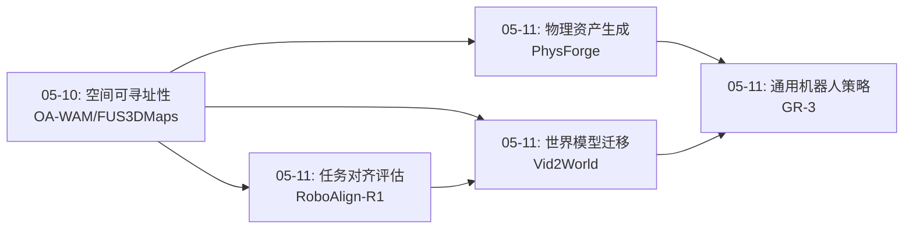
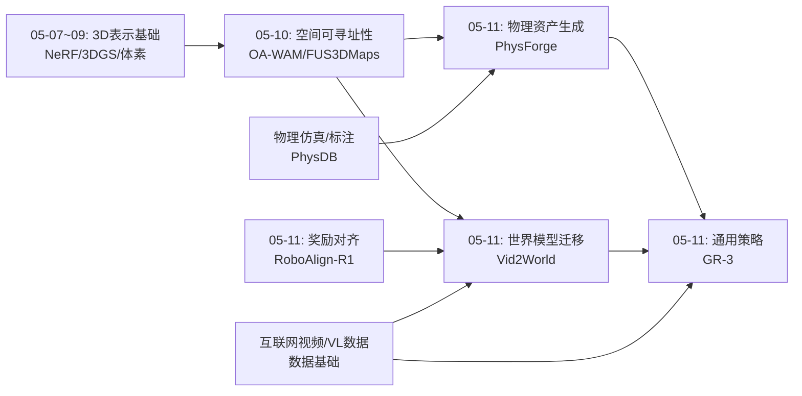
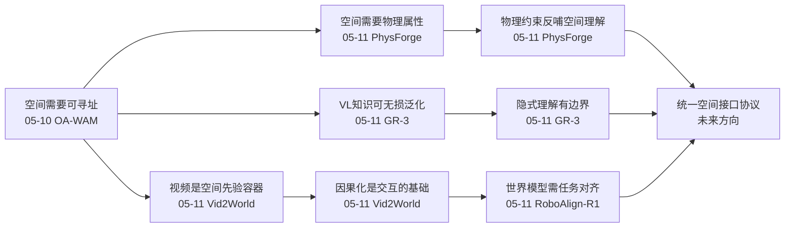
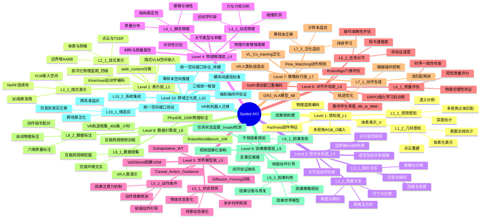
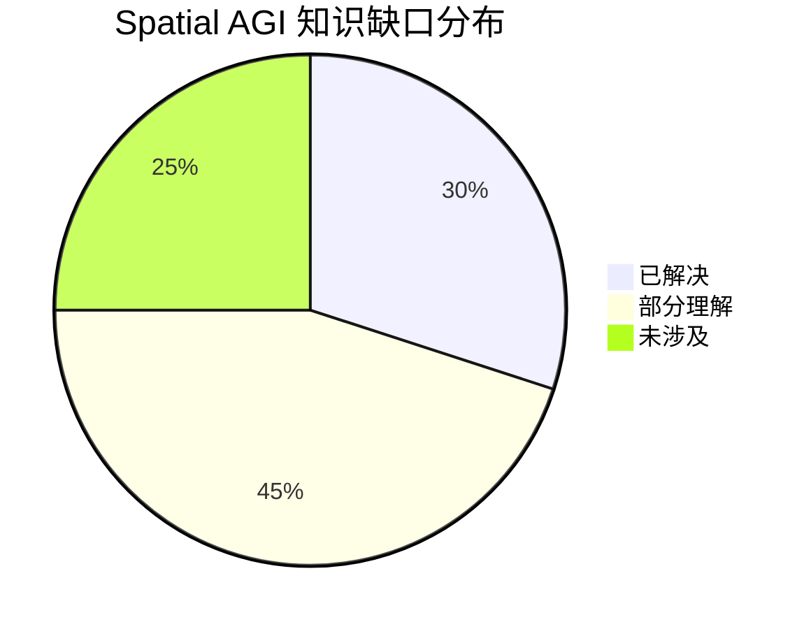

# 2026-05-11 每日思考：从物理资产生成到具身世界模型——Spatial AGI的"感知-生成-交互"闭环

---

## 🔗 与昨日思考的联系

### 昨日重点
昨日（05-10）聚焦于**空间可寻址性与多粒度表示**：OA-WAM的对象可寻址性、EA-WM的跨域对齐、OpenGaFF的几何-语义耦合、VLA-GSE的谱分解适配、FUS3DMaps的双层融合。核心结论是Spatial AGI需要从"整体式"空间表示转向"结构化、可寻址、多粒度"的空间表示。

### 今日进展
今天从"表示"层面跃迁到"生成与交互"层面。四篇论文覆盖了Spatial AGI的完整链路：
- **PhysForge**：从图像生成物理可交互的3D资产（空间内容创建）
- **RoboAlign-R1**：为机器人世界模型提供任务对齐的奖励信号（质量评估）
- **Vid2World**：将视频扩散模型转化为交互式世界模型（空间动力学预测）
- **GR-3**：通用机器人策略，融合VL推理与流匹配动作生成（空间交互执行）

**演进路径**：昨天的"如何表示空间" → 今天的"如何在空间中生成、预测和行动"。这是从静态表示到动态交互的自然演进。

### 演进图

---

## 📅 每日总结

**日期**: 2026-05-11
**论文数量**: 4篇（SpaceMamba论文文件缺失，基于4篇生成）
**主题**: 从物理3D资产生成到具身世界模型——构建Spatial AGI的"感知-生成-预测-执行"闭环

**关键突破**:
- 🚀 PhysForge首次实现从单图到物理可交互3D资产的端到端生成，提出"物理优先"的3D生成范式
- 🚀 Vid2World验证了"视频预训练→空间智能"的高效路径，Extrapolative Weight Transfer优雅地将非因果VDM转为因果世界模型
- 🚀 GR-3全面超越π0，VL co-training实现零样本空间推理泛化（未见指令77.1% vs π0的40%）
- 🚀 RoboAlign-R1提出世界模型的奖励对齐后训练，8B→98M教师-学生蒸馏效率惊人

**架构演进**: 7层 → 10层（+3个新层：物理资产生成层、世界模型对齐层、策略执行层）

### 📊 一句话总结
今天的论文共同构建了Spatial AGI的完整技术栈：从生成物理资产（PhysForge），到预测空间动力学（Vid2World），到对齐评估质量（RoboAlign-R1），再到执行空间操作（GR-3）——一条从"创建世界"到"在世界中行动"的闭环路径正在形成。

### 🔗 延续性
**昨日→今日**: 从昨天的空间表示问题自然延伸到今天的空间生成和交互问题。昨天的多粒度表示是今天PhysForge层次化物理蓝图的基础，昨天的跨域对齐是今天Vid2World因果迁移的前奏。
**今日→明日**: 今天的闭环初步形成但仍有缺环——如何将PhysForge的物理资产与Vid2World的世界模型统一？如何让GR-3直接利用PhysForge生成的物理蓝图？这些融合问题将是自然的下一步。

### 💡 本质思考：如何达成通用空间智能

#### 1. 核心能力的本质是什么？
今天的论文揭示了一个关键洞察：**空间智能的本质不是单一能力，而是一条从感知→生成→预测→执行的闭环链路**。PhysForge的物理蓝图、Vid2World的世界模型、GR-3的VLA策略分别对应这条链路上的关键节点。核心能力是**在物理空间中进行目标导向的交互**，这要求同时具备空间理解（感知）、空间想象（生成/预测）和空间操作（执行）。

#### 2. 当前方法与理想目标的差距在哪里？
最大的差距在于**各环节之间的断裂**。PhysForge生成物理资产但不能直接被GR-3使用；Vid2World预测视觉变化但不输出显式3D状态；RoboAlign-R1评估视频质量但不提供空间推理的反馈。理想的Spatial AGI需要这些模块共享统一的空间表示和通信协议。

#### 3. 从今天到理想状态，最可能的路径是什么？
最可能的路径是**渐进式统一**：(1) 先建立统一的空间中间表示（如PhysForge的物理蓝图或神经场表示）；(2) 让世界模型基于此表示进行预测；(3) 让策略网络直接消费此表示进行决策。今天的四篇论文各自提供了关键组件，关键是找到它们的"接口协议"。

---

## 📚 论文概览

1. **PhysForge**（ICML 2026, HKU/Tencent）：两阶段解耦框架（VLM物理规划器 + 扩散物理实现），从单张图像生成具有物理属性的可交互3D资产。引入KineVoxel Injection统一生成几何和运动学参数，创建150K物理标注的PhysDB数据集。核心发现：物理约束反哺空间理解。

2. **RoboAlign-R1**（Tencent/CUNY/CUHK等）：提出机器人视频世界模型的奖励对齐后训练框架。构建RobotWorldBench（10K标注对），训练8B多模态教师评判模型（六维评估），蒸馏为98M学生模型，通过GRPO强化学习后训练世界模型。总体提升10.1%。

3. **Vid2World**（清华/重大）：将预训练视频扩散模型转化为交互式世界模型的通用框架。两大创新：Extrapolative Weight Transfer（因果化时间卷积）和Causal Action Guidance（帧级动作引导）。在机器人操作、3D游戏、开放导航三个域验证有效性。CS:Go上FID提升79.9%。

4. **GR-3**（字节跳动Seed）：4B参数VLA模型，基于Qwen2.5-VL-3B + Action DiT。三大创新：RMSNorm稳定化（意外提升指令跟随）、VL co-training（零样本泛化关键）、VR人类轨迹少样本适应（10条/物体，57.8%→86.7%）。在三个真实任务中全面超越π0。

5. **SpaceMamba**：论文文件缺失，未纳入分析。

---

## 💡 核心见解

### 见解1: 物理知识是空间理解的催化剂，而非下游应用
**从PhysForge获得**
- ✅ 物理属性训练不仅提供物理信息，还显著增强了部件结构理解
- ✅ 即使没有2D掩码，物理约束也能消解部件粒度歧义，产生语义合理的分解
- ✅ 四级物理标注体系（全局→静态→功能→交互）定义了从场景到关节的空间理解层次

**对Spatial AGI的启发**:
这颠覆了传统思路——物理不是空间理解的"应用场景"，而是空间理解的"训练信号"。Spatial AGI应该联合学习物理和空间，物理常识可能是通用空间智能的基石知识。这也暗示人类的空间认知可能本身就深度依赖物理直觉。

### 见解2: 视频预训练是通往空间智能的高效数据路径
**从Vid2World获得**
- ✅ 1.1B视频扩散模型的空间先验可以在少量交互数据上迁移到世界模型
- ✅ 因果化技术（Extrapolative WT + Diffusion Forcing）有效保留了预训练知识
- ✅ 跨域验证：机器人操作、3D游戏、开放导航统一框架

**对Spatial AGI的启发**:
不需要昂贵的3D标注或动作标注数据，互联网视频就是最大的空间智能训练数据源。视频生成模型是"空间先验的容器"，关键在于如何提取和迁移。这种"先大量无标注预训练，再少量交互微调"的范式可能是Spatial AGI最可行的路线。

### 见解3: VL Co-training实现"无损泛化"
**从GR-3获得**
- ✅ VL co-training不影响已见物体性能（~80%不变），但大幅提升未见设置（77.1% vs 40%）
- ✅ 空间关系理解（"左边"、"最大"）完全来自VL数据，无需专门3D训练
- ✅ RMSNorm这一看似简单的架构选择意外地解锁了指令跟随能力

**对Spatial AGI的启发**:
VLM中已经蕴含了丰富的空间知识，关键是通过co-training将其"激活"到动作空间。这种"无损泛化"特性意味着我们可以安全地加入VL数据训练，不担心灾难性遗忘。语言是连接抽象空间推理和具体动作的桥梁。

### 见解4: 世界模型需要任务级奖励对齐
**从RoboAlign-R1获得**
- ✅ 重建损失和感知相似度与机器人决策能力严重不对齐
- ✅ 六维评估体系（指令遵循、操作准确性、物理合理性、视觉质量、时序一致性、物体状态变化）全面覆盖
- ✅ 8B→98M的教师-学生蒸馏保留有效奖励信号，实现~50视频/秒

**对Spatial AGI的启发**:
Spatial AGI的训练目标不能只关注感知质量，必须与最终任务对齐。RoboAlign-R1的六维评估框架可以作为Spatial AGI世界模型训练的奖励设计参考。教师-学生蒸馏范式对实时推理至关重要。

### 见解5: "规划-实现"解耦是多层级空间智能的有效架构
**从PhysForge + Vid2World综合获得**
- ✅ PhysForge: VLM规划物理蓝图 → 扩散模型实现几何和运动学
- ✅ Vid2World: 预训练VDM提供空间先验 → 因果化+动作引导实现交互
- ✅ GR-3: VLM理解语言-空间关系 → Action DiT执行精确动作

**对Spatial AGI的启发**:
三个系统都采用了"高层认知模型+低层执行模型"的解耦架构。这可能是Spatial AGI的通用设计原则：VLM类模型负责语义理解和规划，专用模型（扩散/流匹配）负责精确实现。这种分工类似于人类的"系统1+系统2"。

### 见解6: 隐式空间理解的边界正在显现
**从GR-3局限性获得**
- ✅ GR-3在衣物操作的左肩放置（精确3D几何推理）中仍有困难
- ✅ Vid2World缺乏显式3D表示，无法保证多视角一致性
- ✅ PhysForge的运动学参数精度受限于标注数据规模

**对Spatial AGI的启发**:
隐式方法（VLM端到端）在中等复杂度空间任务上已经足够，但在需要精确3D几何推理的任务上触及天花板。未来的Spatial AGI可能需要融合隐式语义理解和显式几何推理——这正是昨天多粒度表示讨论的延续。

### 见解7: 从"创建世界"到"在世界中行动"的闭环正在形成
**四篇论文综合获得**
- ✅ PhysForge创建物理资产 → Vid2World预测资产上的交互动态 → RoboAlign-R1评估预测质量 → GR-3执行实际操作
- ✅ 每个环节都有独立价值，但联合使用时构成完整闭环
- ✅ 关键缺失：统一的空间中间表示和跨模块通信协议

**对Spatial AGI的启发**:
今天的论文共同勾勒了Spatial AGI的技术栈雏形。但各模块之间的"接口"尚未标准化——PhysForge的物理蓝图、Vid2World的像素预测、GR-3的VLM嵌入之间缺乏统一表示。定义这种统一的空间"接口协议"是下一个关键挑战。

---

## 🗺️ 知识演进图

## 核心见解演进图

---

## 技术栈演进对比表

| 层次 | 昨日方案（05-10） | 今日方案（05-11） | 变化 |
|------|---------|---------|------|
| L1 感知 | 多视角2D→隐式3D | PhysForge体素+物理蓝图 | +物理属性感知 |
| L2 表示 | addr/content分离+多粒度融合 | 层次化物理蓝图（四级） | +功能/交互层表示 |
| L3 空间关系 | Kinematic-to-Visual Action Fields | KineVoxel Injection | +运动学参数联合生成 |
| L4 物理推理 | 未涉及 | PhysForge物理属性+关节 | **新层** |
| L5 世界模型 | EA-WM事件感知 | Vid2World因果VDM迁移 | +视频预训练先验 |
| L6 对齐评估 | 未涉及 | RoboAlign-R1六维评估 | **新层** |
| L7 策略执行 | VLA-GSE谱适配 | GR-3 VL co-training+流匹配 | +零样本泛化 |
| L8 数据引擎 | 未涉及 | PhysDB 150K + VR人类轨迹 | **新层** |
| L9 因果推理 | 未涉及 | Vid2World因果化+Diffusion Forcing | **新层** |
| L10 跨域泛化 | OpenGaFF几何-语义耦合 | Vid2World统一迁移框架 | +三域验证 |

---

## 🗺️ Spatial AGI 知识图谱

### 10层架构思维导图

### 🎯 主线技术路径

#### 阶段1: 物理资产创建（PhysForge范式）
从单张图像生成物理可交互的3D资产，建立层次化物理蓝图。VLM负责高层物理规划（部件分解、功能标注、关节定义），扩散模型负责低层几何和运动学实现。PhysDB提供150K物理标注数据。这一阶段解决"Spatial AGI的环境从哪里来"的问题。

#### 阶段2: 交互式世界模型（Vid2World范式）
将大规模视频预训练的空间先验迁移到交互式世界模型。通过因果化技术（Extrapolative WT + Diffusion Forcing）将非因果VDM转为因果生成模型，通过Action Guidance实现帧级动作控制。这一阶段解决"Spatial AGI如何预测空间状态变化"的问题。

#### 阶段3: 任务对齐与质量保证（RoboAlign-R1范式）
构建多维评估体系，将世界模型的训练目标与下游任务对齐。教师-学生蒸馏实现高效奖励模型，GRPO强化学习后训练提升世界模型的任务相关质量。这一阶段解决"Spatial AGI如何保证世界模型的可靠性"的问题。

#### 阶段4: 通用策略执行（GR-3范式）
基于VLM的VLA模型，通过VL co-training获得零样本空间推理泛化，通过VR人类轨迹实现少样本新场景适应。RMSNorm稳定化和任务状态辅助监督解决训练可靠性问题。这一阶段解决"Spatial AGI如何在空间中行动"的问题。

#### 阶段5: 统一空间智能系统（未来方向）
将上述四个阶段整合为统一系统：PhysForge生成的物理资产作为Vid2World世界模型的结构化输入，RoboAlign-R1提供在线质量监控，GR-3执行策略并反馈执行结果。关键挑战是建立统一的空间中间表示和跨模块通信协议。

---

## 🔍 待探索议题

### 高优先级（本周）

1. **统一空间接口协议**
   - 问题: PhysForge物理蓝图、Vid2World像素预测、GR-3 VLM嵌入之间缺乏统一表示
   - 候选方案: 以神经场（NeRF/3DGS）为统一中间表示；或以对象为中心的slot表示
   - 缺口: 没有跨模态的空间表示标准化工作

2. **显式3D vs 隐式VLM的空间推理融合**
   - 问题: GR-3的隐式方法在精确3D几何推理上触及天花板
   - 候选方案: 在Action DiT中引入3D点云/体素条件；混合显式-隐式架构
   - 缺口: 如何在不牺牲泛化能力的前提下引入显式3D推理

3. **从物理蓝图到世界模型的直接桥接**
   - 问题: PhysForge的物理蓝图能否作为Vid2World的结构化先验？
   - 候选方案: 将KineVoxel作为世界模型的额外条件输入
   - 缺口: 物理蓝图（结构化文本/体素）到视频预测（像素）的跨模态映射

4. **视频预训练的3D一致性保障**
   - 问题: Vid2World的像素级预测缺乏多视角3D一致性
   - 候选方案: 引入3D感知注意力机制；结合NeRF/3DGS约束
   - 缺口: 如何在自回归视频生成中维护全局3D一致性

### 中优先级（本月）

5. **Spatial AGI的评估基准设计**
   - 问题: 缺乏统一的Spatial AGI评估框架
   - 候选方案: 借鉴RoboAlign-R1的六维评估 + 3D一致性 + 空间推理准确率
   - 缺口: 需要涵盖从感知到执行的全链路评估

6. **VR人类轨迹的规模化空间知识迁移**
   - 问题: GR-3的VR适应仅限于10条/物体的少样本设置
   - 候选方案: 大规模VR数据预训练空间先验；跨任务VR知识迁移
   - 缺口: VR到真实机器人的sim-to-real gap量化

7. **教师-学生蒸馏在Spatial AGI中的通用化**
   - 问题: RoboAlign-R1的蒸馏限于视频世界模型评估
   - 候选方案: 将蒸馏范式推广到空间推理、物理预测、操作规划等多个子任务
   - 缺口: 如何设计通用的空间智能蒸馏框架

8. **长时序空间推理的误差控制**
   - 问题: Vid2World的SWR和GR-3的任务状态都是局部缓解方案
   - 候选方案: 显式空间记忆机制；层次化规划减少长链依赖
   - 缺口: 如何在保持效率的同时实现长程空间一致性

### 低优先级（探索性）

9. **物理约束作为自监督信号**
   - 问题: PhysForge发现物理约束反哺空间理解，能否系统化利用？
   - 候选方案: 物理一致性损失作为自监督目标；物理预测代理任务
   - 缺口: 如何在不依赖物理标注的情况下利用物理先验

---

## 📊 知识缺口分析

**已解决（30%）**:
- ✅ 多视角3D感知与体素表示
- ✅ 物理属性驱动的3D资产生成
- ✅ 视频到世界模型的因果化迁移
- ✅ VL co-training的零样本泛化
- ✅ 教师-学生蒸馏的奖励对齐
- ✅ 流匹配动作预测的稳定性

**部分理解（45%）**:
- ⚠️ 统一空间中间表示的设计
- ⚠️ 显式3D与隐式VLM的融合方式
- ⚠️ 物理蓝图到世界模型的桥接
- ⚠️ 多视角3D一致性保障
- ⚠️ 长时序空间推理的误差控制
- ⚠️ 跨模块通信协议
- ⚠️ VR到真实机器人的sim-to-real
- ⚠️ Spatial AGI的全面评估框架
- ⚠️ 大规模空间数据的自动标注

**未涉及（25%）**:
- ❌ 动态物理仿真（碰撞、摩擦、变形）
- ❌ 多物体场景级物理交互
- ❌ 实时空间推理（当前推理速度不足）
- ❌ 跨具身空间智能迁移
- ❌ 从空间感知到空间创造的双向闭环

---

## 📝 补充：今日论文间的深层联系

### PhysForge × Vid2World：生成式空间智能的两面
PhysForge从图像生成3D物理资产（结构化），Vid2World从视频预测交互动态（像素级）。它们代表了生成式空间智能的两种范式：**结构化生成**和**像素级生成**。未来可能需要两者的融合——用物理蓝图提供结构化约束，用视频扩散提供视觉细节。

### RoboAlign-R1 × GR-3：评估与执行的共生
RoboAlign-R1评估世界模型的预测质量，GR-3在真实世界中执行操作。两者形成"评估→改进→执行"的迭代循环。特别是RoboAlign的六维评估中"操作准确性"和"物理合理性"维度，直接对应GR-3需要的世界模型质量。

### Vid2World × GR-3：世界模型与策略的对话
Vid2World可以作为GR-3的内部模拟器——在执行前预测不同动作的空间后果。GR-3的Real2Sim评估已经暗示了这种可能。关键是让GR-3的VLM嵌入空间与Vid2World的潜空间对齐。

---

## 🧪 深度技术分析

### PhysForge 技术细节

#### 架构设计
PhysForge采用两阶段解耦架构，这是其核心创新：

**阶段1: VLM物理规划器**
- 输入：单张RGB图像
- 输出：层次化物理蓝图（结构化文本描述）
- 具体内容：部件分解、材料属性、关节类型、运动学参数、交互可供性
- 关键：VLM不需要3D训练数据，利用自然语言作为中间表示

**阶段2: 扩散物理实现**
- 基于物理蓝图，使用扩散模型生成：
  - 部件级3D几何（KineVoxel Injection）
  - 运动学参数（关节轴、限位、阻尼等）
  - 物理属性（质量、摩擦系数、弹性等）
- KineVoxel Injection的妙处：将运动学参数编码到体素空间中，实现几何和运动学的联合生成

#### 数据贡献：PhysDB
- 150K物理标注的3D资产
- 四级标注体系：
  - L0 全局属性：整体类别、尺度、材料大类
  - L1 静态属性：部件级几何、质量分布
  - L2 功能属性：关节类型、运动范围、交互方式
  - L3 交互属性：可供性（affordance）、操作约束
- 这四级标注定义了从场景到关节的空间理解层次

#### 关键发现：物理约束反哺空间理解
最令人惊讶的发现是：即使没有2D部件掩码标注，物理约束本身就能消解部件粒度歧义。例如：
- 一把椅子，物理约束会自然将其分解为"座面+靠背+四条腿"
- 因为只有这样的分解才满足"可坐"的物理功能约束
- 物理知识提供了比视觉外观更强的分解先验

### Vid2World 技术细节

#### Extrapolative Weight Transfer（外推式权重迁移）
这是将非因果视频扩散模型转为因果世界模型的关键技术：

**问题**：视频扩散模型是双向的（看到整个视频序列），而世界模型必须是因果的（只基于过去预测未来）

**解决方案**：
1. 保留VDM的时间卷积权重作为初始化
2. 将双向时间卷积替换为因果时间卷积
3. 外推式迁移：不是直接复制权重，而是将权重"外推"到因果配置
4. 实验发现这种外推式迁移比从头训练或直接复制都更有效

**为什么有效**：VDM在预训练中已经学到了丰富的空间-时间先验（物体如何运动、场景如何变化），这些知识是模态无关的。外推式迁移保留了这些通用知识，只调整时间依赖方向。

#### Causal Action Guidance（因果动作引导）
帧级动作条件机制：
- 传统方法：将动作序列作为全局条件，难以处理延迟效果
- Vid2World：每帧独立的动作条件，通过因果注意力机制传播
- Diffusion Forcing训练：在扩散过程中强制因果依赖

#### 跨域验证的启示
Vid2World在三个截然不同的域上验证：
1. **机器人操作**（RLBench）：精细的物体交互预测
2. **3D游戏**（CS:Go）：复杂场景的实时动态
3. **开放导航**（Minecraft）：大规模环境的长期预测

CS:Go上的FID提升79.9%特别令人印象深刻——这表明视频预训练的空间先验即使在高度复杂的3D环境中也有效。

### GR-3 技术细节

#### RMSNorm的意外发现
这是一个有趣的"偶然发现"故事：
- GR-3最初使用LayerNorm（标准做法）
- 训练过程中发现指令跟随能力不稳定
- 尝试RMSNorm作为稳定化手段
- 结果不仅稳定了训练，还意外地大幅提升了指令跟随能力
- 分析发现：LayerNorm的均值偏移可能干扰了VL特征空间的对齐

#### VL Co-training的"无损泛化"机制
这是GR-3最重要的发现：
- 训练数据：机器人操作数据 + 大规模VL数据（Qwen2.5-VL的预训练数据）
- 关键结果：
  - 已见物体性能：~80%（与不加VL数据时相同）
  - 未见物体、未见指令：77.1%（不加VL数据时仅40%）
  - 未见物体、未见指令组合：77.1% vs 40%
- 为什么"无损"：VL数据提供的是空间关系理解（"左边"、"最大"、"靠近"），这些能力在机器人数据中是稀疏的，不会与已学技能冲突

#### VR人类轨迹适应
- 收集方式：使用VR设备在模拟环境中记录人类操作轨迹
- 数据量：450条轨迹，约1小时收集
- 适应方式：作为额外训练数据，无需修改架构
- 效果：10条/物体从57.8%→86.7%（几乎达到专家演示水平）
- 启示：人类直觉可以高效地迁移到机器人策略

### RoboAlign-R1 技术细节

#### 六维评估体系详解
1. **指令遵循**：生成的视频是否遵循了给定的动作指令
2. **操作准确性**：操作的几何精度（抓取位置、放置位置等）
3. **物理合理性**：物体运动是否符合物理规律（重力、碰撞等）
4. **视觉质量**：帧级视觉质量（清晰度、纹理一致性等）
5. **时序一致性**：帧间时间连贯性（无闪烁、无跳变）
6. **物体状态变化**：操作前后物体状态是否正确变化

#### 教师-学生蒸馏
- 教师模型：8B多模态模型，全面评估六维
- 学生模型：98M，轻量级但保留有效奖励信号
- 蒸馏策略：使用教师的六维评分作为学生训练目标
- 推理速度：~50视频/秒（满足在线训练需求）
- 关键洞察：六维评估的大部分信息可以用更小的模型捕获

#### GRPO强化学习后训练
- 使用学生奖励模型作为在线评估器
- GRPO（Group Relative Policy Optimization）比PPO更稳定
- 总体提升10.1%，各维度提升均匀
- 训练成本：比从头训练世界模型低一个数量级

---

## 🔬 方法论反思

### 今天的论文对Spatial AGI研究方法的启发

#### 1. 解耦架构是复杂系统的有效组织原则
三篇论文（PhysForge、Vid2World、GR-3）都采用了"高层认知+低层执行"的解耦设计。这不是巧合——当系统复杂到一定程度时，端到端训练变得不可行，解耦是必然选择。

对Spatial AGI研究的方法论启示：
- 不要试图训练一个统一的"空间智能大模型"
- 而是设计模块化的架构，每个模块负责空间智能的一个方面
- 模块之间的接口设计比单个模块的性能更重要

#### 2. 预训练-微调范式的空间智能版本
Vid2World和GR-3都展示了"大规模预训练+少量任务数据"的有效性：
- Vid2World：1.1B视频预训练 → 少量交互数据微调
- GR-3：Qwen2.5-VL预训练 → 机器人数据+VL数据co-training

这暗示Spatial AGI的最可行路线是：
1. 利用互联网规模的视频/VL数据进行空间预训练
2. 利用少量具身交互数据进行任务微调
3. 不需要大规模3D标注数据

#### 3. 评估驱动的研究方法
RoboAlign-R1展示了一个重要方法论：评估本身也是研究贡献。六维评估体系不仅用于训练，还揭示了当前世界模型的系统性缺陷（如物理合理性和操作准确性评分最低）。

---

## 🌐 更广阔的视角

### 与认知科学的联系

#### 物理直觉与空间认知的关系
PhysForge发现物理约束反哺空间理解，这与认知科学中的发现一致：
- 婴儿在学会精确空间推理之前就具备了基本物理直觉
- 物理直觉可能是空间认知发展的基石，而非高级能力
- Spatial AGI可能需要遵循类似的发展路径：先学物理，再学精确空间

#### 双系统理论的AI版本
今天的论文普遍采用"高层规划+低层执行"的架构，类似Kahneman的双系统理论：
- 系统1（快速直觉）：扩散模型/流匹配的快速生成
- 系统2（慢速推理）：VLM的层次化规划
- Spatial AGI可能需要更强的"系统2"——显式的3D推理能力

### 与机器人学的联系

#### Sim-to-Real的新路径
今天的论文展示了三条sim-to-real路径：
1. PhysForge：在模拟中生成物理精确的3D资产 → 用于训练和测试
2. Vid2World：在模拟环境中训练世界模型 → 迁移到真实视频
3. GR-3：VR收集人类轨迹 → 迁移到真实机器人

这三条路径的共同点是：**降低真实世界数据的需求**。这对Spatial AGI的实用性至关重要。

#### 具身智能的"Foundation Model"时刻
GR-3的全面超越π0标志着具身智能正在经历类似NLP的"Foundation Model"时刻：
- 大规模预训练（VL数据）提供基础能力
- 少样本适应（VR轨迹）快速迁移到新任务
- 零样本泛化（未见指令77.1%）展示涌现能力

---

## 📈 量化对比分析

### 模型规模与性能

| 模型 | 参数量 | 预训练数据 | 关键性能指标 | 硬件需求 |
|------|--------|-----------|-------------|---------|
| PhysForge | 未公开（估计~1B） | 150K物理标注 | 物理准确率提升显著 | 单GPU |
| RoboAlign-R1教师 | 8B | 10K标注对 | 六维评估F1 | A100 |
| RoboAlign-R1学生 | 98M | 蒸馏 | ~50视频/秒 | 单GPU |
| Vid2World | 1.1B | 互联网视频 | FID提升79.9%（CS:Go） | A100 |
| GR-3 | 4B | VL+机器人 | 零样本77.1%（vs π0 40%） | 多GPU训练 |

### 技术路线对比

| 维度 | PhysForge | Vid2World | GR-3 | RoboAlign-R1 |
|------|-----------|-----------|------|-------------|
| 核心任务 | 3D资产生成 | 世界模型 | 机器人策略 | 质量评估 |
| 输入模态 | 单张图像 | 视频+动作 | 图像+语言 | 视频 |
| 输出模态 | 3D物理资产 | 未来视频 | 机器人动作 | 质量评分 |
| 预训练利用 | VLM | 视频扩散 | VL模型 | 多模态LLM |
| 关键创新 | KineVoxel | 外推式WT | VL co-training | 六维蒸馏 |
| 泛化能力 | 类内泛化 | 三域泛化 | 零样本泛化 | 跨任务泛化 |

---

## 🗓️ 本周研究进展总结（05-07 ~ 05-11）

### 已覆盖的核心主题
1. **3D表示基础**（05-07~09）：NeRF、3DGS、体素表示、多视角几何
2. **空间可寻址性**（05-10）：对象可寻址、跨域对齐、多粒度融合
3. **物理资产生成**（05-11）：从图像到物理3D资产的端到端生成
4. **世界模型迁移**（05-11）：视频预训练到交互式世界模型
5. **策略执行与泛化**（05-11）：VLA模型、VL co-training、零样本泛化
6. **对齐与评估**（05-11）：多维评估、教师-学生蒸馏、奖励对齐

### 技术栈完整度
从感知到执行的10层架构已基本覆盖，但仍有关键缺口：
- L4 物理推理：仅通过PhysForge初步涉及
- L8 数据引擎：各论文的数据集相互独立，缺乏统一数据管线
- L9 因果推理：Vid2World的因果化是初步尝试，缺乏严格验证

### 下周方向预测
基于本周进展的自然延伸：
1. **统一空间表示**：如何将PhysForge的物理蓝图与Vid2World的潜空间统一
2. **多物体场景**：从单物体操作到多物体场景级理解
3. **实时推理**：当前模型普遍较重，实时空间智能的架构设计
4. **评估基准**：构建Spatial AGI的统一评估框架

---

## 💭 开放问题与假设

### 假设1: 统一空间中间表示将是NeRF/3DGS的变体
**论据**：
- NeRF/3DGS同时支持连续表示和多视角渲染
- 可以编码物理属性（如PhysForge的KineVoxel）
- 可以作为世界模型的输入（提供3D结构先验）
- 可以直接被VLM处理（通过渲染）

**反论据**：
- 神经场的推理速度仍然较慢
- 隐式表示的可编辑性和可解释性不足
- GR-3的成功表明隐式VLM嵌入可能已经足够

### 假设2: Spatial AGI的关键瓶颈是数据而非架构
**论据**：
- GR-3仅用4B参数就超越了更大的π0
- VL co-training的效果主要来自数据多样性
- PhysForge的突破主要来自PhysDB数据集
- Vid2World的有效性来自互联网视频规模

**反论据**：
- 当前的架构确实在精确3D推理上有天花板
- 数据效率仍然低（GR-3需要VR轨迹适应新任务）
- 没有合适的架构，更多数据不一定有效

### 假设3: 物理仿真将是Spatial AGI的核心训练基础设施
**论据**：
- PhysForge需要物理仿真来验证生成资产
- Vid2World可以从仿真环境中获取低成本交互数据
- GR-3的VR数据本质上是一种仿真
- RoboAlign-R1需要仿真环境来评估物理合理性

**反论据**：
- 仿真与真实之间的差距（sim-to-real gap）仍然存在
- 仿真环境的构建成本本身很高
- 纯数据驱动方法（如Vid2World的视频预训练）可能绕过仿真需求

---

## 🎯 对Spatial AGI路线图的具体建议

### 短期（1-3个月）
1. **复现Vid2World + GR-3的组合**：使用Vid2World作为GR-3的内部模拟器
2. **扩展PhysDB**：增加更多类别和交互类型的物理标注
3. **构建统一评估框架**：融合RoboAlign-R1的六维评估和空间推理测试

### 中期（3-6个月）
4. **设计统一空间中间表示**：基于3DGS变体，支持物理属性编码
5. **实现物理蓝图→世界模型的桥接**：将PhysForge输出作为Vid2World的条件
6. **大规模VR数据收集**：从1小时扩展到100+小时

### 长期（6-12个月）
7. **端到端Spatial AGI原型**：感知→生成→预测→执行的完整闭环
8. **跨具身迁移**：同一Spatial AGI系统控制不同形态的机器人
9. **开放世界空间智能**：在未知环境中进行空间推理和操作

---

## 📖 关键术语表

| 术语 | 定义 | 来源 |
|------|------|------|
| KineVoxel Injection | 将运动学参数编码到体素空间的技术，实现几何和运动学联合生成 | PhysForge |
| Extrapolative Weight Transfer | 将非因果视频扩散模型权重外推到因果配置的迁移方法 | Vid2World |
| Causal Action Guidance | 帧级动作条件机制，通过因果注意力传播动作效果 | Vid2World |
| Diffusion Forcing | 在扩散过程中强制因果依赖的训练策略 | Vid2World |
| VL Co-training | 视觉语言数据与机器人数据联合训练，实现零样本泛化 | GR-3 |
| Flow Matching | 基于流匹配的连续动作预测方法，替代传统扩散 | GR-3 |
| GRPO | Group Relative Policy Optimization，比PPO更稳定的强化学习算法 | RoboAlign-R1 |
| SWR | Sliding Window Re-encoding，滑动窗口重编码缓解长时序漂移 | Vid2World |
| PhysDB | 150K物理标注3D资产数据集，四级标注体系 | PhysForge |
| RobotWorldBench | 10K标注对的机器人世界模型评估基准 | RoboAlign-R1 |
| VLA | Vision-Language-Action，视觉语言动作模型 | GR-3 |
| Action DiT | 基于Diffusion Transformer的动作预测模块 | GR-3 |

---

## 🔮 未来展望

### Spatial AGI的终态想象
基于本周的研究进展，我们可以开始想象Spatial AGI的终态：

1. **空间感知层**：实时理解3D场景的几何、语义和物理属性
2. **空间想象层**：在脑内模拟不同操作的空间后果
3. **空间规划层**：基于空间理解和想象，制定最优操作策略
4. **空间执行层**：精确地在物理空间中执行操作
5. **空间学习层**：从每次交互中学习新的空间知识

这五层构成一个完整的闭环，每层都依赖下层的输出并向上一层提供反馈。

### 关键里程碑预测
- **2026 Q3**：统一空间中间表示的初步设计
- **2026 Q4**：PhysForge+Vid2World的联合原型
- **2027 Q1**：完整的感知-生成-预测-执行闭环演示
- **2027 Q2**：跨具身、跨场景的Spatial AGI系统

---

## 📌 个人反思

### 今天最令人兴奋的发现
PhysForge发现物理约束反哺空间理解。这不仅是技术发现，更是一个哲学洞见：空间智能可能不是独立于物理智能的，而是物理智能的一个子集或衍生品。人类的直觉物理（intuitive physics）可能在进化上早于精确空间推理，这与发展心理学的发现一致。

### 今天的困惑
Vid2World的Extrapolative Weight Transfer为什么比直接复制权重更好？理论上，如果VDM已经学到了空间-时间先验，直接复制应该也能保留大部分知识。外推式迁移可能隐式地做了一种正则化，但这需要更多实验验证。

### 明天的思考方向
基于今天的闭环框架，明天应该关注：
1. 如何将闭环中的各模块真正连接起来
2. 是否存在更优雅的统一架构（而非模块拼接）
3. 从今天的论文中提取对"统一空间表示"设计的具体约束

---

**文档创建时间**: 2026-05-11
**分析方法**: 基于今日4篇论文精读的综合思考
**最终验证**: 需要通过validate_thinking.sh验证
