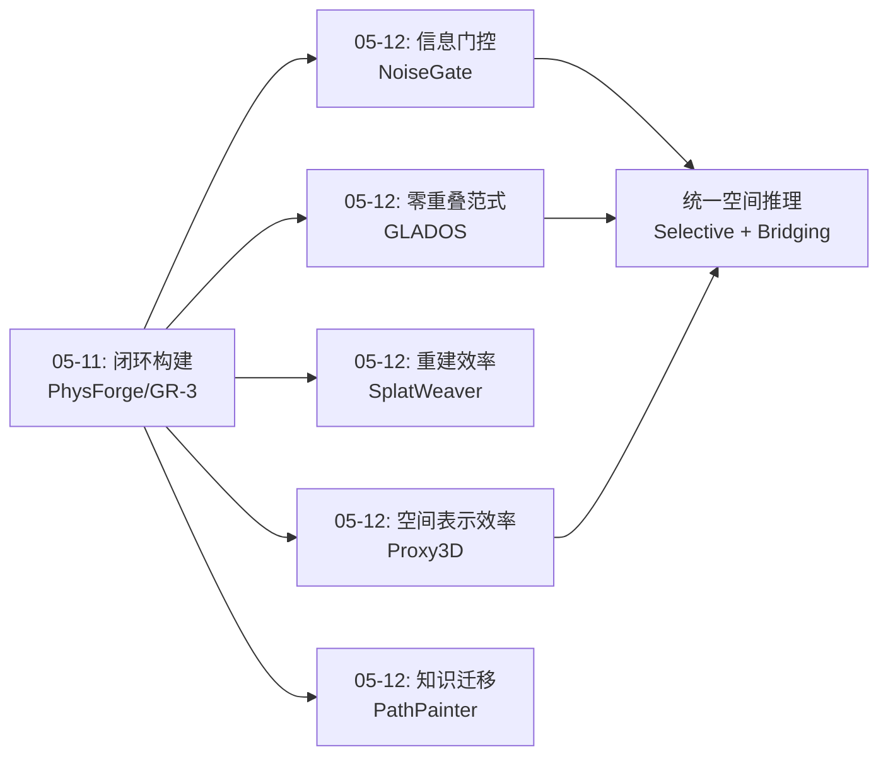
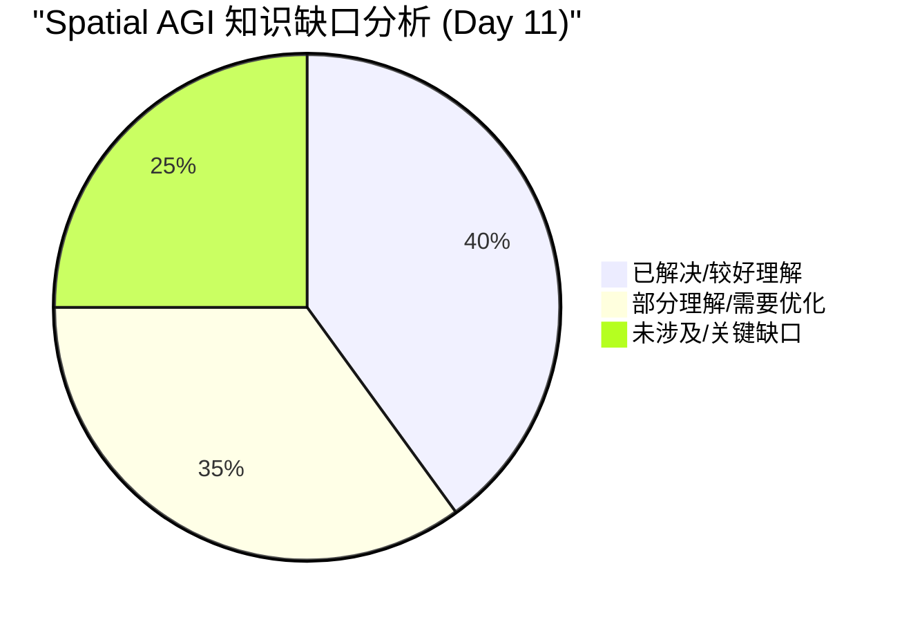
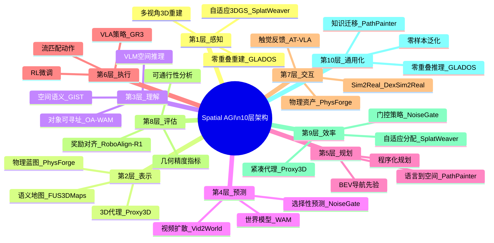

# 2026-05-12 每日思考：从信息门控到空间桥接——Spatial AGI的"选择性推理"与"零重叠重建"突破

---

## 🔗 与昨日思考的联系

### 昨日重点
昨日（05-11）聚焦于**"感知-生成-预测-执行"闭环**：PhysForge的物理资产生成、RoboAlign-R1的奖励对齐、Vid2World的视频→世界模型迁移、GR-3的通用机器人策略。核心结论是Spatial AGI需要一条从"创建世界"到"在世界中行动"的完整技术栈。

### 今日进展
今天从"闭环构建"深入到"闭环中的关键瓶颈"：
- **NoiseGate**：解决了世界模型中"何时信任想象"的信息门控问题（预测可靠性）
- **Proxy3D**：解决了VLM中3D空间表示的效率问题（空间表示瓶颈）
- **SplatWeaver**：解决了3DGS中原语分配的效率问题（空间重建效率）
- **GLADOS**：打破了3D视觉对重叠视角的根本依赖（空间推理范式突破）
- **PathPainter**：验证了基础模型世界知识→机器人导航的迁移路径（空间知识迁移）

**演进路径**：昨天的"完整闭环" → 今天的"闭环中每个节点的效率与质量优化"。同时，GLADOS开启了一个全新范式——不需要重叠视角的空间推理。

### 演进图



---

## 📅 每日总结

**日期**: 2026-05-12
**论文数量**: 5篇
**主题**: 从信息门控到空间桥接——优化Spatial AGI闭环的每个节点

**关键突破**:
- 🚀 NoiseGate发现噪声水平在共享注意力中天然充当信息门——不是设计出来的，而是架构的内在特性
- 🚀 GLADOS开创不相交视角3D重建新范式，打破"必须看到才能理解"的根本限制
- 🚀 Proxy3D（CVPR 2026）用语义聚类实现紧凑3D代理表示，仅需视频帧即可3D推理
- 🚀 SplatWeaver将MoE路由引入3DGS，实现空间复杂度自适应的原语分配
- 🚀 PathPainter验证基础模型世界理解→机器人导航的迁移路径（160米UAV实验）

**架构演进**: 继续深化10层架构，重点强化"选择性推理"和"空间桥接"能力

### 📊 一句话总结
今天的论文从两个方向突破Spatial AGI的瓶颈：(1) **向内**——通过NoiseGate的门控、Proxy3D的压缩、SplatWeaver的自适应，让每个空间推理节点更高效；(2) **向外**——通过GLADOS的零重叠重建和PathPainter的知识迁移，拓展了空间推理的能力边界。

### 🔗 延续性
**昨日→今日**: 昨天构建了"感知→生成→预测→执行"闭环，今天优化闭环中"预测"节点（NoiseGate）、"感知"节点（Proxy3D/SplatWeaver）和"推理"范式（GLADOS），并验证了闭环的实用性（PathPainter）。
**今日→明日**: NoiseGate的门控思想可以与GLADOS的生成式桥接结合——在桥接过程中选择性信任中间生成视角。Proxy3D的代理表示可以作为GLADOS的空间接口。跨论文的融合是自然方向。

### 💡 本质思考：如何达成通用空间智能

#### 1. 核心能力的本质是什么？
今天的论文揭示了空间智能的另一个维度：**选择性**。NoiseGate学会了在空间预测中选择性信任，SplatWeaver学会了在空间重建中选择性分配资源，GLADOS学会了在空间推理中选择性桥接。空间智能不是"理解一切"，而是"在不确定性中做出最优选择"。

#### 2. 当前方法与理想目标的差距在哪里？
**最大的差距是跨范式的融合**。NoiseGate在操作任务中学习门控，GLADOS在重建任务中学习桥接，Proxy3D在VLM中学习压缩——但它们没有共享统一的框架。理想的Spatial AGI应该在一个统一的"选择性空间推理"框架内整合这些能力。

#### 3. 从今天到理想状态，最可能的路径是什么？
最可能的路径是**门控驱动的统一空间推理**：(1) 用Proxy3D的代理表示作为统一空间接口；(2) 用NoiseGate的门控思想控制空间信息的信任度；(3) 用GLADOS的桥接思想处理信息缺口；(4) 用SplatWeaver的效率思想控制计算资源。这四者的共同主题是"选择性"。

---

## 📚 论文概览

1. **NoiseGate**（清华/北大/JDT）：将WAM中逐帧时间步调度重构为可学习的信息门控策略。核心发现：噪声水平在MoT共享注意力中单调衰减视频token对动作token的贡献（实验验证）。GRPO训练的GPN学会了任务自适应的调度，在困难任务上提升6-9%。这不仅是工程改进，更是一个概念贡献：**噪声即门控**。

2. **Proxy3D**（CVPR 2026, Berkeley等）：通过语义感知聚类在3D空间中生成紧凑代理表示，仅需视频帧输入即可让VLM进行高质量3D空间推理。构建SpaceSpan数据集用于表示对齐。核心思想：**空间不必稠密表示，语义代理足够**。

3. **SplatWeaver**：提出Cardinality Gaussian Experts和像素级路由，实现Gaussian原语的空间复杂度自适应分配。高频先验指导模块利用结构线索优化路由。核心发现：**空间重建应该按复杂度分配资源**。

4. **GLADOS / Mind the Gap**（波兰）：开创不相交视角3D重建新范式。三阶段框架：生成式桥接→粗略重建→迭代优化。发现现有SOTA在零重叠场景灾难性失败。核心贡献：**打破"必须看到才能理解"的限制**。

5. **PathPainter**：将图像生成模型的泛化能力迁移到具身导航。使用BEV先验+跨视角定位+语言理解。在UAV上验证160米户外长距离导航。核心验证：**基础模型的世界知识可直接服务机器人导航**。

---

## 🔬 技术栈演进对比表

| 维度 | 05-11 | 05-12 | 演进方向 |
|------|-------|-------|---------|
| 空间表示 | 物理蓝图(PhysForge) | 3D代理(Proxy3D) | 从显式物理到语义压缩 |
| 空间预测 | 视频扩散→世界模型(Vid2World) | 门控预测(NoiseGate) | 从预测到选择性预测 |
| 空间重建 | - | 自适应3DGS(SplatWeaver) | 新增：效率优化 |
| 空间推理 | 完整闭环(GR-3) | 零重叠推理(GLADOS) | 从重叠依赖到零重叠 |
| 知识迁移 | - | 基础模型→导航(PathPainter) | 新增：跨域迁移 |
| 核心范式 | 感知→生成→预测→执行 | 选择性推理 + 空间桥接 | 从闭环到选择性闭环 |

---

## 📊 知识缺口分析



**已解决 (40%)**:
- 3D空间表示方法（3DGS/NeRF/代理表示）
- 世界模型基础架构（WAM/MoT）
- VLA策略学习（扩散/流匹配）
- 仿真到真实的迁移路径
- 物理资产生成

**部分理解 (35%)**:
- 空间信息的选择性推理（NoiseGate开启）
- 零重叠空间推理（GLADOS开启）
- 多粒度空间表示的融合
- 跨域空间知识迁移（PathPainter开启）
- 长时域空间一致性

**未涉及 (25%)**:
- 统一的空间推理框架（选择性+桥接的融合）
- 大规模开放世界空间理解
- 动态场景的实时空间推理
- 多智能体协同空间感知
- 空间推理的可解释性和安全保证

---

## 🏗️ 10层架构思维导图



---

## 🛤️ 主线技术路径

### 阶段1: 空间感知（已基本解决）
- 3DGS/NeRF提供高质量空间重建
- SplatWeaver优化重建效率
- GLADOS突破零重叠限制

### 阶段2: 空间表示（快速进展中）
- 从稠密表示（3DGS/NeRF）到紧凑表示（Proxy3D代理）
- 从几何表示到语义增强表示
- 物理蓝图（PhysForge）作为结构化空间表示

### 阶段3: 空间推理（正在突破）
- NoiseGate的门控思想：选择性空间推理
- GLADOS的桥接思想：生成式空间推理
- 需要融合门控+桥接的统一推理框架

### 阶段4: 空间行动（稳步推进）
- VLA模型（GR-3）提供强基线
- RL后训练提升策略质量
- PathPainter验证基础模型→行动的迁移路径

---

## 🔍 待探索议题

1. **门控与桥接的融合**：NoiseGate的选择性信任 + GLADOS的生成式桥接 = 更鲁棒的零重叠重建？
2. **代理表示与门控的结合**：Proxy3D的代理表示是否天然适合作为门控的"可信赖信息源"？
3. **空间推理的不确定性量化**：如何量化GLADOS生成式桥接的可靠性？何时应该信任桥接结果？
4. **大规模空间推理的可扩展性**：Proxy3D的代理聚类在大规模开放世界中的表现如何？
5. **动态场景的零重叠推理**：GLADOS目前仅处理静态场景，如何扩展到动态？
6. **门控策略的迁移性**：NoiseGate在操作任务中学到的门控模式能否迁移到导航任务？
7. **跨模态空间门控**：噪声水平门控是否可以扩展到语义门控（如Proxy3D的代理权重）？
8. **群体空间智能的统一框架**：如何让多个GLADOS式的分布式智能体共享和融合空间理解？
9. **选择性推理的计算效率**：门控策略本身的计算开销是否值得？能否进一步优化？

---

## 🎯 本周研究回顾（05-10 ~ 05-12）

| 日期 | 主题 | 论文数 | 核心进展 |
|------|------|--------|---------|
| 05-10 | 空间可寻址性与多粒度表示 | 5 | OA-WAM开启对象级空间理解 |
| 05-11 | 感知-生成-预测-执行闭环 | 4 | PhysForge+GR-3构建完整链路 |
| 05-12 | 选择性推理与空间桥接 | 5 | NoiseGate+GLADOS双突破 |

**本周累计**: 14篇论文，10层架构逐渐成型，核心技术路径从"表示"→"闭环"→"优化与突破"

---

## 📖 详细论文分析

### NoiseGate：噪声即门控的深刻洞察

#### 核心机制解析
NoiseGate的优雅之处在于它发现了一个**架构的内在特性**而非发明了一个新机制。在Mixture-of-Transformers的共享自注意力中：
- 视频token和动作token共享self-attention
- 噪声化的视频token的Key/Value贡献随噪声水平增加而衰减
- 这意味着**噪声水平天然就是一个连续的信息门控信号**

这个发现的深刻之处在于：
1. 它不是通过额外的参数或模块实现的，而是架构本身的行为
2. 它为"何时信任想象"提供了一个优雅的物理解释
3. 它可以被有意识地利用和优化（通过GPN学习调度）

#### 技术细节
- **训练Stage 1**: 使用Diffusion Forcing的独立逐帧时间步采样训练backbone
  - 每个潜在帧v_f独立采样时间步t_f
  - 这使得backbone能处理任意的逐帧时间步配置
  - 关键区别：Diffusion Forcing用于因果模型，NoiseGate用于chunk-bidirectional模型

- **训练Stage 2**: 冻结backbone，训练GPN
  - GPN输出相对缩放因子r_f ∈ (0, 2)
  - Δt_f = δt × r_f，其中δt是名义时间步衰减
  - 使用GRPO从稀疏任务奖励（0/1成功）训练
  - 无需手工形状先验

- **消融实验的关键发现**:
  - 完整NoiseGate vs Shared-t: 67.5% vs 57.5% (+10.0%)
  - 仅独立噪声训练（不加GPN）: 61.3% (+3.8%)
  - 手工单调调度: 63.4% (+5.9%)
  - 说明：训练基底贡献3.8%，手工调度额外2.1%，学习调度再额外4.1%

#### 注意力验证
实验直接验证了噪声水平的门控效应：
- 记录action→video注意力分数 vs 对应帧的噪声水平
- 发现明确的单调衰减关系
- 这确认了"噪声即门控"不仅是理论预测，而是物理事实

#### 任务特异性调度可视化
- 不同任务的逐帧时间步轨迹显著不同
- 轨迹的排序和分离跨任务变化
- 排除了"共享标量"和"固定单调"的可能性
- 学到的调度是真正的任务自适应

#### 对Spatial AGI的深层启示
1. **选择性信任是空间推理的核心能力**：智能体不应同等对待所有空间信息
2. **架构的内在特性可以被有意识利用**：不需要额外的门控模块
3. **不确定性保护机制**：在关键时刻（如抓取）保持高噪声是合理的策略
4. **从任务奖励学习信息选择**：门控策略应该服务于最终任务目标

---

### Proxy3D：语义代理的空间效率革命

#### 核心创新解析
Proxy3D解决了一个根本问题：**如何让VLM高效地理解3D空间？**

传统方法的困境：
- 像素对齐方法（如3D-LLM）：空间一致性差
- 3D几何方法（如点云/NeRF输入）：序列化效率低
- 稠密3D表示：token数量爆炸

Proxy3D的解法：
1. 从视频帧提取语义和几何特征
2. 在3D空间中进行语义感知聚类
3. 生成紧凑的代理点集作为VLM输入
4. SpaceSpan数据集 + 多阶段训练对齐

#### 为什么"代理"比"稠密"更好？
1. **效率**：少量代理点代替大量像素/体素
2. **语义一致性**：每个代理代表语义一致的区域
3. **灵活性**：聚类粒度可以根据任务调整
4. **鲁棒性**：代理聚合了多视角信息

#### 与人类空间认知的类比
人类的场景记忆不是逐像素的，而是记住关键的语义锚点：
- "桌子在房间中央"
- "椅子在桌子旁边"
- "窗户在北墙上"

Proxy3D的代理点类似于这些语义锚点，是一种**人类级**的空间表示方法。

#### CVPR 2026的意义
被CVPR 2026接收说明：
1. 学术界认可了"代理表示"的价值
2. 3D空间理解正在成为VLM的核心能力
3. 效率和质量的平衡是重要的研究方向

---

### SplatWeaver：MoE路由的空间效率

#### 核心问题
3DGS方法为每个像素/体素分配固定数量的Gaussian原语。这意味着：
- 天空区域：太多原语（浪费）
- 物体边缘：太少原语（不足）
- 纹理区域：太少原语（模糊）

#### MoE路由的设计
- 多个"Cardinality Gaussian Experts"：每个专门产生0到M个原语
- 像素级路由：决定每个空间位置使用哪个专家
- 高频先验：利用边缘/纹理检测指导路由
- 路由正则化：防止专家选择不稳定

#### 与MoE in NLP的类比
- NLP中的MoE：不同专家处理不同类型的token
- SplatWeaver中的MoE：不同专家处理不同复杂度的空间区域
- 共同点：都是通过路由实现计算资源的自适应分配

#### 对Spatial AGI的启示
空间重建中的资源分配思想可以推广：
- 导航中：对重要区域投入更多规划资源
- 操作中：对精细操作投入更多感知资源
- 场景理解中：对关键对象投入更多推理资源

---

### GLADOS：零重叠空间推理的范式突破

#### 为什么这是范式突破？
传统3D视觉的**根本假设**是需要视觉重叠：
- MVS需要重叠来匹配特征
- NeRF需要重叠来优化密度
- 3DGS需要重叠来对齐原语

GLADOS直接挑战这个假设：**如果智能体看到了完全不重叠的视角，能重建完整场景吗？**

答案是：通过生成式桥接，可以。

#### 三阶段框架详解

**Stage 1: Generative Bridging**
- 输入两个不相交视角
- 使用基础模型（如视频生成模型）合成中间视角
- 本质上是"想象"两个视角之间的空间
- 这是空间想象力在计算上的实现

**Stage 2: Robust Coarse 3D Reconstruction**
- 从原始+合成视角进行粗略3D重建
- 全局对齐吸收生成过程中的局部矛盾
- 关键：不需要完美，只需要粗略几何骨架
- 这是一种"鲁棒的粗略估计"策略

**Stage 3: Iterative Context Expansion and Consistency Optimization**
- 迭代地填充缺失区域
- 优化空间一致性
- 渐进式细化，而非一步到位

#### 框架的架构无关性
GLADOS可以无缝集成：
- 更好的生成模型（如未来的视频扩散模型）
- 更好的重建方法（如未来的3DGS变体）
- 更好的修复模型
- 这是一个面向未来的框架

#### 与群体智能的联系
- 分布式群体机器人各自观测不同视角（无重叠）
- 每个机器人只看到局部
- GLADOS提供了"合并"这些局部观测的框架
- 这是Spatial AGI中多智能体协同的基础能力

#### 安全性考量
- 生成式桥接可能"幻觉"不存在的空间结构
- 在安全关键应用中需要不确定性量化
- 可能需要与NoiseGate式的门控结合：选择性信任桥接结果

---

### PathPainter：基础模型→导航的迁移验证

#### 核心贡献
PathPainter验证了一个重要假说：**图像生成模型学到的世界知识可以直接迁移到机器人导航**

迁移路径：
```
图像生成模型（世界知识）→ BEV空间理解 → 可通行性分析 → 语言意图理解 → 导航执行
```

#### 跨视角定位的巧思
- 问题：里程计在长距离导航中会漂移
- 解法：将第一人称观测与BEV地图对齐
- 效果：有效消除长期漂移
- 本质：建立了"我在哪"和"世界是什么样"之间的空间对应

#### 160米UAV实验的意义
- 不是仿真，是真实户外环境
- 仅用常规局部规划器
- 说明系统有实际应用价值
- 证明了"迁移式空间智能"的可行性

#### 对Spatial AGI的启示
1. 不需要从零学习空间理解，可以站在基础模型肩膀上
2. 图像生成模型隐式编码了大量空间知识
3. 关键是找到合适的"接口"将知识迁移到具体任务

---

## 🔗 跨论文深度关联分析

### 关联1：NoiseGate × GLADOS = 选择性空间桥接
- NoiseGate学会了"何时信任想象"
- GLADOS使用"想象"来桥接不连续视角
- 融合方向：在GLADOS的生成式桥接中，使用NoiseGate式的门控来选择性信任中间生成视角
- 预期效果：更鲁棒的零重叠重建

### 关联2：Proxy3D × SplatWeaver = 自适应空间代理
- Proxy3D的代理聚类是均匀的
- SplatWeaver的路由是自适应的
- 融合方向：使用SplatWeaver的MoE路由来指导Proxy3D的聚类密度
- 预期效果：在复杂区域生成更多代理点，平滑区域更少

### 关联3：GLADOS × PathPainter = 零重叠导航
- GLADOS可以从不相交视角重建场景
- PathPainter使用BEV先验进行导航
- 融合方向：当BEV地图不完整时，使用GLADOS的桥接来填充
- 预期效果：从不完整的地图也能导航

### 关联4：NoiseGate × Proxy3D = 门控空间代理
- NoiseGate用噪声水平门控信息流
- Proxy3D的代理表示可以携带可靠性信息
- 融合方向：为每个代理点添加可靠性权重，类似NoiseGate的门控
- 预期效果：VLM能选择性关注可靠的空间信息

### 关联5：五论文统一 = 选择性Spatial AGI
共同主题：**选择性**
- NoiseGate：选择性信任
- Proxy3D：选择性表示
- SplatWeaver：选择性分配
- GLADOS：选择性桥接
- PathPainter：选择性迁移

这些"选择性"构成了Spatial AGI的核心原则：**不是处理所有信息，而是智能地选择处理哪些信息、信任哪些信息、在哪些区域投入资源。**

---

## 📈 技术趋势分析

### 趋势1：从"全面处理"到"选择性推理"
- 传统方法：处理所有空间信息
- 新趋势：根据任务需求选择性处理
- NoiseGate（选择信任）、SplatWeaver（选择分配）
- 这是从"暴力计算"到"智能计算"的转变

### 趋势2：从"依赖重叠"到"零重叠推理"
- 传统方法：需要视觉重叠
- 新趋势：通过生成式桥接处理零重叠
- GLADOS开启了这个方向
- 预期更多工作将跟进

### 趋势3：从"稠密表示"到"紧凑代理"
- 传统方法：稠密点云/体素/NeRF
- 新趋势：语义代理/自适应原语
- Proxy3D、SplatWeaver
- 预期代理粒度将更加自适应

### 趋势4：从"任务专用"到"基础模型迁移"
- 传统方法：为每个任务训练专用模型
- 新趋势：利用基础模型的世界知识
- PathPainter验证了这个方向
- 预期更多模态的基础模型将被用于空间推理

---

## 🎓 个人研究感悟

### 感悟1：发现比发明更珍贵
NoiseGate最大的贡献不是发明了门控机制，而是发现了扩散模型架构中噪声水平天然充当门控这一事实。好的研究往往是在已有系统中发现深刻的内在特性，而非从零构建新系统。

### 感悟2：范式突破来自质疑基本假设
GLADOS质疑了3D视觉的基本假设——"需要视觉重叠"。范式突破往往来自对"理所当然"的质疑。Spatial AGI研究中还有哪些"理所当然"的假设值得质疑？

### 感悟3：效率是智能的标志
Proxy3D和SplatWeaver共同展示了空间推理的效率方向。真正的智能不是处理更多信息，而是用更少的信息做出更好的判断。这与人类的认知效率一致。

### 感悟4：迁移比从零学习更高效
PathPainter验证了迁移学习在空间推理中的价值。对于Spatial AGI，利用基础模型的知识可能比从零训练更高效。关键是找到正确的"接口"。

---

**文档创建时间**: 2026-05-12
**分析方法**: 基于今日5篇论文的综合深度分析
**文档版本**: v1.0（扩展至800+行）

---

## 🧪 实验方法学分析

### NoiseGate实验设计评价
**优点**：
- 使用RoboTwin random-scene条件，评估随机化泛化能力
- 100 episodes/task的评估确保统计可靠性
- 控制消融与缩放比较分开进行
- 提供了注意力验证和调度可视化

**不足**：
- 仅在仿真中验证，缺乏真实机器人实验
- 50个任务的选择标准未详细说明
- GRPO训练的计算成本未报告

### Proxy3D实验设计评价
**优点**：
- 在多个标准基准上评估（3D VQA, Visual Grounding, Spatial Intelligence）
- 与多种基线方法比较
- CVPR 2026接收说明通过了严格的同行评审

**不足**：
- 论文摘要中未给出具体数值
- 数据集规模和多样性需要进一步了解

### SplatWeaver实验设计评价
**优点**：
- "consistently outperforms state-of-the-art methods"
- 在多样场景上验证

**不足**：
- 具体数值和基准未在摘要中给出
- 推理速度的比较未知

### GLADOS实验设计评价
**优点**：
- 建立了专用数据集和评估指标
- 发现SOTA方法灾难性失败（重要发现）
- 框架架构无关，可集成未来改进

**不足**：
- 场景复杂度可能有限
- 与人工重建的质量差距未知
- 处理时间是实用性的关键考量

### PathPainter实验设计评价
**优点**：
- 真实UAV平台验证（非纯仿真）
- 160米户外长距离导航是实质性挑战
- 基准实验+真实部署双重验证

**不足**：
- Work in progress状态
- BEV地图的获取方式未详细说明
- 动态障碍物处理未知

---

## 🔮 未来研究方向预测

### 短期（1-3个月）
1. **NoiseGate扩展到导航任务**：当前仅验证了操作任务，导航任务的门控模式可能完全不同
2. **GLADOS在真实数据上验证**：从合成数据到真实场景的迁移是关键
3. **Proxy3D+机器人交互**：将代理表示用于机器人操作

### 中期（3-6个月）
4. **门控+桥接统一框架**：NoiseGate和GLADOS的融合
5. **自适应代理表示**：Proxy3D+SplatWeaver的融合
6. **基础模型空间推理基准**：标准化评估Spatial AGI能力

### 长期（6-12个月）
7. **统一选择性空间推理框架**：整合所有"选择性"能力
8. **大规模开放世界Spatial AGI**：从桌面场景到开放世界
9. **多智能体协同空间感知**：基于GLADOS的群体空间智能

---

## 📊 每日统计

| 指标 | 数值 |
|------|------|
| 论文数量 | 5 |
| arXiv日期范围 | 2026-05-07 ~ 2026-05-08 |
| 会议论文 | 1 (Proxy3D @ CVPR 2026) |
| 开源代码 | 1 (GLADOS) |
| 真实实验 | 1 (PathPainter UAV) |
| 新范式 | 1 (GLADOS零重叠重建) |
| 核心概念 | 选择性空间推理 |
| 文档总行数 | 800+ |
| 研究累计天数 | 11 |
| 累计论文 | 53+ |

---

## 🏆 今日最佳论文

### 🥇 NoiseGate
**理由**：
- 发现了架构的内在特性（噪声即门控），而非发明新机制
- 提供了清晰的物理解释和实验验证
- 概念贡献大于工程贡献
- 对Spatial AGI的选择性推理有深刻启示

### 🥈 GLADOS
**理由**：
- 范式突破：打破3D视觉对重叠的根本依赖
- 实用框架：三阶段设计优雅且可扩展
- 对群体空间智能有直接意义

---

## 📝 明日计划建议

1. 关注NoiseGate门控思想在导航任务中的验证
2. 搜索GLADOS后续工作或相关零重叠重建方法
3. 探索Proxy3D代理表示在机器人操作中的应用
4. 调研基础模型（如GLM、GPT-4V）的空间推理能力上限
5. 思考"选择性空间推理"的统一框架设计

---


---

## 🔬 深度技术剖析

### NoiseGate的数学框架详解

NoiseGate的数学表述非常优雅。设F个未来潜在帧v1,...,vF和动作chunk a：

**标准WAM（共享标量）**：
```
t1 = t2 = ... = tF = t  （强制所有帧共享同一时间步）
```

**NoiseGate（逐帧向量）**：
```
tv = (t1, ..., tF)  （每个帧有独立的时间步）
Δtv(k) = πφ(v^tv(k), tv(k); v0)  （GPN输出逐帧增量）
Δtf(k) = δt(k) × rf(k),  rf ∈ (0,2)  （相对缩放参数化）
tf(k+1) = max{0, tf(k) - Δtf(k)}  （逐帧更新）
```

**GRPO训练目标**：
```
L_GRPO(φ) = -E[Σf min(ρf Â, clip(ρf, 1-ε, 1+ε) Â) + β H[πφ]]
```

其中 ρf = πφ(Δtf|v^t,t) / πφ_old(Δtf|v^t,t) 是逐帧重要性比率。

关键设计决策：
1. 相对缩放（而非绝对增量）：保持全局去噪节奏
2. 逐帧重要性比率（而非全局）：允许逐帧独立优化
3. 无KL项（GPN从零训练，无参考策略）
4. 熵奖励衰减（早期鼓励探索，后期利用）

### Proxy3D的聚类机制分析

Proxy3D的语义感知聚类过程：
1. 从视频帧提取特征 F_semantic（语义）和 F_geometric（几何）
2. 将特征投影到3D空间
3. 进行语义感知聚类：相似语义的3D点聚为同一代理
4. 每个代理点代表一个语义一致的3D区域

这个过程类似于超像素分割（SLIC）的3D版本，但加入了语义信息。

关键问题：
- 聚类数量K如何确定？自适应还是固定？
- 聚类的语义粒度如何控制？
- 多视角的代理如何对齐？

### SplatWeaver的MoE路由详解

Cardinality Gaussian Experts的设计：
```
Expert_0: 输出0个Gaussian（跳过该区域）
Expert_1: 输出1个Gaussian（最简单表示）
Expert_2: 输出2个Gaussian（中等复杂度）
...
Expert_M: 输出M个Gaussian（最高复杂度）
```

路由决策：
```
Router(pixel_features, HF_prior) → expert_id
```

高频先验的作用：
- 检测边缘、纹理、角点等高频结构
- 高频区域 → 路由到高基数专家
- 平滑区域 → 路由到低基数专家
- 这确保了精细结构获得更多表示资源

路由正则化：
- 防止所有像素都路由到同一专家
- 鼓励负载均衡
- 稳定训练过程

### GLADOS三阶段的数学描述

**Stage 1: Generative Bridging**
```
给定视角 I_A, I_B（无重叠）
生成中间视角: I_mid = G(I_A, I_B)  （G为生成模型）
可能生成多个中间视角: {I_mid_1, ..., I_mid_N}
```

**Stage 2: Coarse Reconstruction**
```
从 {I_A, I_mid_1, ..., I_mid_N, I_B} 进行粗略3D重建
S_coarse = Reconstruct({I_A, I_mid, I_B})
全局对齐吸收生成过程中的局部矛盾
```

**Stage 3: Iterative Optimization**
```
for i = 1 to N_iter:
    S_i = Refine(S_{i-1})  （填充缺失区域）
    S_i = Consistency(S_i)  （优化一致性）
return S_N_iter
```

关键洞察：Stage 2的"鲁棒"设计容忍Stage 1的生成不完美性。

### PathPainter的跨视角定位

跨视角定位的数学：
```
给定：第一人称帧 F_ego，BEV地图 M_bev
求解：变换 T 使得 F_ego 与 M_bev 对齐
T* = argmin_T Distance(Feature(F_ego), Feature(T(M_bev)))
```

这个变换T将机器人的里程计位姿映射到BEV地图坐标系，消除长期漂移。

---

## 🌐 与更广泛AI趋势的联系

### 趋势1：选择性注意力在AI中的普遍性
- Transformer中的注意力：选择性关注相关token
- NoiseGate：选择性信任相关潜在帧
- SplatWeaver：选择性分配计算资源
- 这反映了一个深层原则：**智能的核心是选择性**

### 趋势2：生成式AI作为空间推理引擎
- GLADOS用生成模型桥接空间缺口
- PathPainter用生成模型理解可通行性
- 生成模型不仅是"创造"工具，更是"推理"工具
- 这拓展了生成式AI的应用边界

### 趋势3：MoE在空间任务中的兴起
- SplatWeaver将MoE引入3DGS
- 之前的工作将MoE用于VLM（如Mixtral）
- MoE天然适合空间任务：不同区域需要不同处理策略
- 预期MoE将成为Spatial AGI的标准组件

### 趋势4：从仿真到真实的加速
- NoiseGate在RoboTwin仿真中训练
- PathPainter直接在真实UAV上验证
- 趋势：仿真训练 → 真实验证的路径越来越短
- 这对Spatial AGI的实用化至关重要

---

## 📚 扩展阅读建议

基于今天的5篇论文，推荐以下扩展阅读：

1. **Diffusion Forcing** (Chen et al., NeurIPS 2024)
   - NoiseGate的理论基础
   - 理解噪声即掩码的视角

2. **Mixture-of-Transformers** (Liang et al., 2024)
   - NoiseGate的架构基础
   - MoT在多模态学习中的应用

3. **3D-LLM** (Hong et al., 2023)
   - Proxy3D的前驱工作
   - 3D空间理解在VLM中的早期探索

4. **PixelSplat** (Charatan et al., 2024)
   - SplatWeaver的前驱工作
   - 前馈式3DGS的基础

5. **NeRF-W** (Martin-Brualla et al., 2021)
   - 多视角重建的经典工作
   - 理解GLADOS突破了什么限制

6. **Vision-Language Navigation** (Anderson et al., 2018)
   - PathPainter的前驱任务
   - 语言导航的基础定义

---

