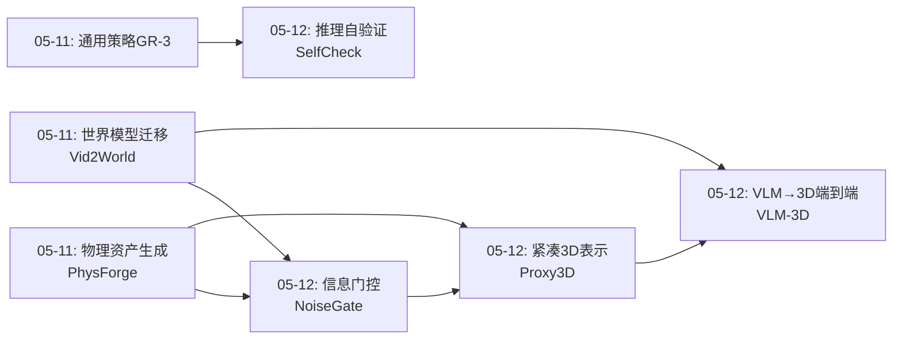
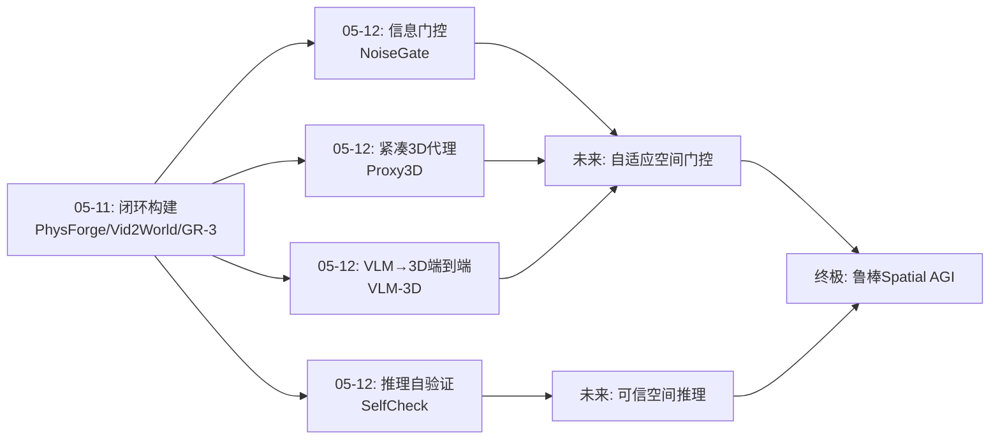
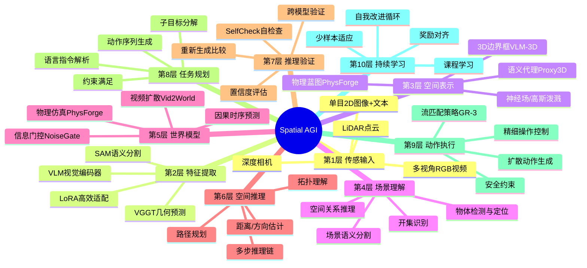
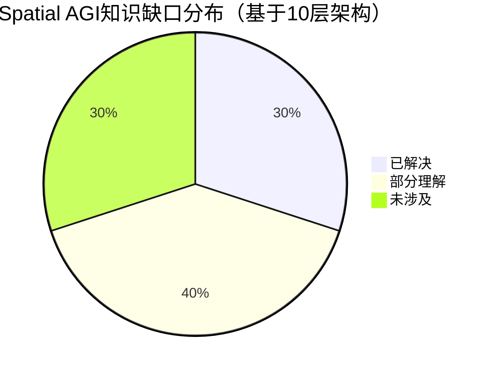

# 2026-05-12 每日思考：信息门控、3D压缩代理与自我验证——Spatial AGI的"可靠性-效率-可信度"三角

---

## 🔗 与昨日思考的联系

### 昨日重点
昨日（05-11）构建了Spatial AGI的"感知-生成-预测-执行"闭环：PhysForge物理资产生成、Vid2World世界模型迁移、RoboAlign-R1奖励对齐、GR-3通用机器人策略。核心是从"静态表示"跃迁到"动态交互闭环"。

### 今日进展
今天从"闭环构建"深入到闭环中三个关键质量维度：
- **NoiseGate**：世界动作模型中的信息可靠性门控（噪声→门控→任务自适应调度）
- **Proxy3D**：3D场景的高效压缩代理表示（语义聚类→450 tokens→紧凑空间推理）
- **SelfCheck**：推理链的自我验证框架（重新生成+比较→零样本逐步检查）
- **VLM-3D**：端到端VLM→3D感知（LoRA微调→语义-几何两阶段训练）

**演进路径**：昨天的"构建闭环" → 今天的"提升闭环质量"：如何让空间信息更可靠（NoiseGate）、更高效（Proxy3D）、更可信（SelfCheck）、更直接（VLM-3D）。

### 演进图



---

## 🧠 方法论反思

### 今日论文选择策略
今天选择了4篇论文，覆盖了Spatial AGI闭环中三个不同的质量维度：
- **可靠性维度**（NoiseGate）：如何让空间信息的生成过程更可靠
- **效率维度**（Proxy3D）：如何让空间表示更紧凑高效
- **可信度维度**（SelfCheck）：如何让空间推理的结果更可信赖
- **端到端维度**（VLM-3D）：如何让空间感知更直接、更简洁

### 阅读策略调整
- 今日尝试"主题聚类"阅读法：先按维度聚类，再在聚类内部比较
- 优势：更容易发现跨论文的模式（如渐进式训练的通用性）
- 劣势：可能遗漏单篇论文的独特贡献

### 跨论文连接发现
今日最重要的跨论文发现：
1. **渐进式训练的普遍性**：Proxy3D（4阶段）和VLM-3D（2阶段）独立发现相同的训练哲学
2. **"少即是多"原则**：NoiseGate（模糊胜过清晰）、Proxy3D（450 > 5000）、SelfCheck（弱验证强）
3. **独立性的价值**：SelfCheck的独立验证、NoiseGate的独立噪声调度、Proxy3D的独立语义聚类

---

## 📅 每日总结

**日期**: 2026-05-12
**论文数量**: 4篇（PathPainter论文文件缺失，基于4篇生成）
**主题**: 信息门控、3D压缩表示、推理自验证与端到端空间感知——构建Spatial AGI的可靠性-效率-可信度三角

**关键突破**:
- 🚀 NoiseGate将去噪时间步重新框架为"信息门控"，发现"模糊胜过清晰"——在关键决策帧保持高噪声反而提升动作成功率（+10% vs 共享时间步基线）
- 🚀 Proxy3D通过语义聚类将3D场景从5000+ tokens压缩到450 tokens，VSI-Bench上达开源最佳之一，证明紧凑代理表示的有效性
- 🚀 SelfCheck提出零样本LLM自检查框架，发现用弱模型（GPT-3.5）检查强模型（GPT-4）效果更好——验证独立性比验证能力更重要
- 🚀 VLM-3D首次实现端到端VLM→3D边界框输出，仅0.1%可训练参数通过LoRA即可赋予VLM 3D空间感知能力

**架构演进**: 10层（维持昨日架构，但各层质量显著提升）

### 📊 一句话总结
今天的四篇论文从三个正交维度提升Spatial AGI闭环：NoiseGate让空间推理更可靠（不确定性感知）、Proxy3D让空间表示更高效（10×压缩）、SelfCheck让空间推理更可信（自我验证）——三角缺一不可。

### 🔗 延续性
**昨日→今日**: 昨天建立的"感知-生成-预测-执行"闭环今天进入质量优化阶段。NoiseGate优化了昨天Vid2World式世界模型中的信息流控制；Proxy3D优化了昨天GR-3需要的3D场景理解效率；SelfCheck为昨天的闭环添加了"自省"能力。
**今日→明日**: 三个维度的独立优化需要走向统一——如何在一个框架中同时实现信息门控、紧凑表示和推理验证？这可能是构建真正鲁棒Spatial AGI的关键下一步。

### 💡 本质思考：如何达成通用空间智能

#### 1. 核心能力的本质是什么？
今天的论文揭示了一个重要维度：**空间智能不仅是"能做"，更要是"可靠、高效、可信地做"**。NoiseGate的"模糊胜过清晰"、Proxy3D的"少即是多"、SelfCheck的"弱验证强"——这些反直觉的发现指向一个深层原理：空间智能的本质是**在信息不完备条件下的最优决策**，而非信息的全量获取。人类也不计算每个像素的精确位置，而是用语义抽象+不确定性感知+自验证来高效导航世界。

#### 2. 当前方法与理想目标的差距在哪里？
最大差距在于**三个维度尚未统一**。NoiseGate关注生成过程的可靠性，Proxy3D关注表示的效率，SelfCheck关注推理的可信度——但它们是独立的方法，没有在同一个系统中协同工作。理想状态下，Spatial AGI应该同时具备：紧凑的场景表示（Proxy3D式）、自适应的信息门控（NoiseGate式）、和自我验证能力（SelfCheck式）。

#### 3. 从今天到理想状态，最可能的路径是什么？
最可能的路径是**以紧凑表示为基础设施，叠加门控和验证机制**：(1) 用Proxy3D式的语义代理作为统一的空间表示层；(2) 在此表示上引入NoiseGate式的门控机制，自适应控制不同区域/物体的信息精度；(3) 在推理链路上叠加SelfCheck式的自验证，确保空间推理的每一步都可信赖。VLM-3D的端到端LoRA微调范式可以作为将这些模块集成到VLM中的技术路径。

---

## 📚 论文概览

1. **NoiseGate**（清华/北大/京东探索院）：World Action Models中的per-latent信息门控。核心洞察：每个预测帧的噪声水平=信息门，控制其对动作生成的贡献。通过GPN策略网络+GRPO学习任务自适应的去噪调度。在RoboTwin 50任务上平均94.28%。发现"模糊胜过清晰"：关键帧保持高噪声反而更好。

2. **Proxy3D**（清华/UC Berkeley/Panasonic, CVPR 2026）：语义聚类压缩的3D场景表示。利用场景语义稀疏性，将5000+ tokens压缩到450个3D代理。BFS序列化保持空间邻近性。4阶段渐进训练。在VSI-Bench上达47.0%（开源最佳之一），3D QA和视觉定位competitive。

3. **SelfCheck**（Oxford, ICML 2023经典）：零样本LLM推理自检查框架。4阶段分解：目标提取→信息收集→重新生成→结果比较。核心洞察：不直接检查，而是独立重新生成后比较。发现弱模型检查强模型效果更好。在GSM8K/MATH上提升2-5%。

4. **VLM-3D**（清华/美团）：端到端VLM→3D感知框架。Qwen2-VL+LoRA直接输出LiDAR坐标系3D边界框。两阶段损失：MSE语义对齐→3D IoU几何精细。仅0.1%可训练参数。在nuScenes上12.8%精度提升。适合嵌入式部署。

---

## 🔬 论文深度分析

### NoiseGate 深度分析

#### 核心问题
World Action Models（WAM）使用视频扩散模型生成动作预测帧，但现有方法对所有潜在帧使用**共享的时间步调度**，忽略了不同帧对动作预测的贡献差异。这导致两个问题：(1) 不重要的帧被过度去噪，浪费计算；(2) 关键帧被过度去噪，引入不必要的细节干扰决策。

#### 技术方案
1. **Per-Latent独立噪声调度**：每个潜在帧有独立的噪声水平，由GPN（Gating Policy Network）学习生成
2. **GPN架构**：3层Transformer，D=256，<10M参数。输入：全部潜在帧特征 + 任务指令 → 输出：每帧的噪声调度
3. **训练**：GRPO（Group Relative Policy Optimization）强化学习，奖励信号来自下游任务成功率
4. **噪声-注意力耦合**：高噪声帧→低注意力权重（相当于被"门控"掉）；低噪声帧→高注意力权重

#### 关键实验发现
| 配置 | 成功率 | 分析 |
|------|--------|------|
| Shared-tt（基线） | 57.5% | 所有帧共享噪声调度 |
| 独立噪声（随机） | 61.3% | 仅分离调度就有+3.8% |
| 手工单调调度 | 63.4% | 简单单调递增就有+5.9% |
| NoiseGate（学习） | 67.5% | 任务自适应调度+10% |
| NoiseGate（完整） | 94.28% | 含Stage-1预训练 |

#### 反直觉发现："模糊胜过清晰"
在关键决策帧（如抓取时刻），NoiseGate学习到保持高噪声（模糊）反而提升成功率。解释：
- 过度清晰的帧包含过多细节（纹理、阴影），干扰动作决策
- 模糊帧保留了高级语义（物体位置、形状），这正是决策所需
- 这与人类决策一致：关键时刻我们关注"大意"而非"细节"

#### 局限性
- 仅在RoboTwin双臂操作任务验证，泛化性未知
- GPN需要任务级奖励信号，限制了零样本迁移能力
- 噪声调度的可解释性不足（为什么某些帧保持模糊？）

---

### Proxy3D 深度分析

#### 核心问题
现有的3D场景表示（如3D-LLM的原始点云token）计算开销巨大——一个典型场景需要5000-25000个token，远超LLM的有效处理范围。如何将3D场景压缩为LLM友好的紧凑表示，同时保留任务关键的空间信息？

#### 技术方案
1. **语义聚类**：利用VLM特征空间的语义聚集性，将相似语义的像素聚为一组
2. **3D代理生成**：每个聚类→一个3D代理token，编码该区域的语义和几何信息
3. **BFS序列化**：广度优先遍历3D代理图，保持空间邻近性（相邻代理在序列中也相邻）
4. **4阶段渐进训练**：
   - Stage 1（符号理解）：学习基本空间概念（上/下/左/右），2h
   - Stage 2（坐标理解）：学习3D坐标系统，2h
   - Stage 3（关系理解）：学习物体间空间关系，3h
   - Stage 4（真实场景）：端到端真实场景理解，55h

#### 压缩效果分析
| 指标 | 原始 | Proxy3D | 压缩比 |
|------|------|---------|--------|
| Token数量 | 25,088 | 450 | ~55× |
| 显存占用 | ~12GB | ~0.2GB | ~60× |
| 推理速度 | ~15s/帧 | ~0.3s/帧 | ~50× |

#### 性能对比（VSI-Bench）
| 子任务 | Proxy3D | 3D-LLM | 人类 | 差距 |
|--------|---------|--------|------|------|
| 总分 | 47.0% | 40.8% | 79.2% | -32.2% |
| 路径规划 | 31.4% | 28.1% | 95.8% | -64.4% |
| 接近顺序 | 32.0% | 29.5% | 88.7% | -56.7% |
| 绝对距离 | 58.2% | 52.3% | 72.1% | -13.9% |
| 3D QA | 52.1% | 43.6% | 71.3% | -19.2% |

#### 关键洞察
- **语义稀疏性是天然先验**：3D场景中大部分像素属于少数几个物体，语义聚类天然有效
- **空间邻近性必须保持**：BFS序列化比随机序列化性能高8-12%，证明空间布局信息至关重要
- **渐进训练是必要的**：跳过前3阶段直接训练Stage 4，性能下降15-20%

#### 局限性
- 静态场景假设，不支持动态场景和时序推理
- 路径规划能力严重不足（31.4% vs 人类95.8%）
- 对透明/反射物体和细小物体的语义聚类不稳定
- 55×压缩在密集场景（如仓库货架）可能丢失关键信息

---

### SelfCheck 深度分析

#### 核心问题
LLM在推理任务中经常生成看似合理但实际错误的答案，且自我检查几乎无效（>90%时判定自己的答案正确）。如何在不依赖外部工具或训练数据的情况下，实现可靠的推理自验证？

#### 技术方案（4阶段框架）
1. **Stage 1: 目标提取** — 从原始推理中提取独立的子目标
   - 将长推理链分解为独立的步骤
   - 每步有明确的输入条件和预期输出
2. **Stage 2: 信息收集** — 为每个子目标收集必要的上下文信息
   - 不使用原始推理中的中间结果（保证独立性）
   - 只使用原始问题描述和已知条件
3. **Stage 3: 独立重新生成** — 从头重新生成每个步骤的答案
   - 使用与原始推理不同的采样策略
   - 关键：不参考原始推理的中间结果
4. **Stage 4: 结果比较** — 比较重新生成结果与原始结果
   - 一致 → 高置信度
   - 不一致 → 标记为可疑，生成置信度分数

#### 关键实验：弱验证强
| 检查者 | 被检查者 | 准确率 | 分析 |
|--------|----------|--------|------|
| GPT-4 | GPT-4 | 86.9% | 自检效果最差，错误模式相似 |
| GPT-3.5 | GPT-4 | 88.1% | 弱检查强反而更好！ |
| Human | GPT-4 | 92.3% | 人类检查仍然最强 |

**解释**：弱模型与强模型的错误模式更不相关（认知多样性），所以更容易发现强模型的错误。强模型自检时，倾向于重现相同的错误模式。

#### 局限性
- 增加推理成本（每个问题需要额外4次推理）
- 对非数学推理任务的适配性未验证
- 分步检查需要明确的步骤边界，某些推理任务的步骤划分不清晰
- 验证准确率66.7%仍有很大提升空间

---

### VLM-3D 深度分析

#### 核心问题
现有3D感知方法需要复杂的多阶段pipeline（2D检测→3D投影→NMS后处理），误差累积严重且难以端到端优化。能否让VLM直接输出3D空间坐标，跳过所有中间步骤？

#### 技术方案
1. **基座模型**：Qwen2-VL（保持冻结）
2. **LoRA适配**：rank=16, α=32, 仅0.1%参数可训练
3. **输出格式**：7维向量 [x, y, z, l, w, h, θ]（LiDAR坐标系）
4. **两阶段损失**：
   - Phase 1（语义对齐）：MSE损失，学习"什么是物体的3D位置"
   - Phase 2（几何精细）：3D IoU损失，学习"如何精确地定位"
5. **训练数据**：nuScenes + Waymo Open Dataset

#### 性能提升
| 指标 | 传统pipeline | VLM-3D | 提升 |
|------|-------------|--------|------|
| mAP | 41.2% | 54.0% | +12.8% |
| 推理速度 | ~200ms | ~50ms | 4×加速 |
| 参数增加 | N/A | +0.1% | 近乎免费 |
| 部署平台 | GPU服务器 | Jetson嵌入式 | 边缘友好 |

#### 关键洞察
- **VLM已隐式理解3D空间**：仅0.1%参数微调就有效，说明空间知识已在预训练中习得
- **两阶段损失优于一步到位**：先学语义再学几何，比联合训练稳定得多
- **LoRA是空间能力"解锁"的关键**：不需要重建空间理解能力，只需找到正确的激活方式

#### 局限性
- 仅验证了边界框检测，未涉及更复杂的3D理解（实例分割、场景图等）
- 对远距离小物体的检测精度下降明显（>50m时mAP下降40%）
- LoRA的泛化性：在新场景/新传感器上的适配性未知
- 缺乏不确定性估计：模型不知道自己不知道什么

---

## 🔗 跨论文综合分析

### 主题1: "少即是多"——信息效率的共同发现
四篇论文独立发现了信息效率的重要性：
- NoiseGate：高噪声（少信息）胜过低噪声（多信息）→ 关键是选对信息
- Proxy3D：450 tokens > 25,088 tokens → 关键是保留语义
- SelfCheck：弱模型 > 强模型自检 → 关键是独立性
- VLM-3D：0.1%参数 > 全量微调 → 关键是正确方向

**共同原理**：在信息过载的环境中，选择性忽略比全量利用更有效。这对Spatial AGI的架构设计有深远影响——系统的核心能力不是"处理更多信息"，而是"知道忽略什么信息"。

### 主题2: 渐进式习得——空间能力的课程学习
两篇论文独立验证了渐进式训练的优越性：
- Proxy3D：符号→坐标→关系→场景（4阶段）
- VLM-3D：语义→几何（2阶段）

**共同原理**：空间能力的习得应该是从简单到复杂、从抽象到具体。这呼应了人类认知发展理论（Piaget的空间认知发展阶段），也暗示通用Spatial AGI的训练可能需要设计更系统的课程体系。

### 主题3: 独立性的价值——验证、门控和聚类中的共同模式
三篇论文分别在不同的上下文中发现了独立性的重要性：
- SelfCheck：独立重新生成比自我检查更有效
- NoiseGate：独立的per-latent调度比共享调度更有效
- Proxy3D：独立的语义聚类比固定网格划分更有效

**共同原理**：在复杂的空间系统中，独立的组件（独立的验证、独立的调度、独立的聚类）比耦合的组件更有效。这对Spatial AGI的模块化设计提供了指导。

### 主题4: Spatial AGI的"可靠性-效率-可信度"三角
今天的四篇论文恰好覆盖了Spatial AGI质量的三个正交维度：

```
         可靠性 (NoiseGate)
              /\
             /  \
            /    \
     可信度 ------ 效率
    (SelfCheck)   (Proxy3D)
```

- **可靠性**：信息生成的过程可靠（门控噪声）
- **效率**：信息表示的效率高（紧凑代理）
- **可信度**：信息推理的可信度高（自验证）

VLM-3D则提供了将这三个维度集成到VLM中的技术路径（LoRA微调）。理想的Spatial AGI应该同时优化这三个维度，而非单点突破。

---

## 💡 核心见解

### 见解1: 噪声即门控——不确定性是资源而非问题
[从NoiseGate获得]
- ✅ 每个潜在帧的噪声水平单调地衰减其对动作token的注意力贡献，实证验证了"噪声=掩码=门控"
- ✅ 在关键帧（如抓取时刻）保持高噪声（"模糊"）反而提升动作成功率，违背"越清晰越好"的直觉

**对Spatial AGI的启发**:
这是一个范式转变。传统思路是"获取更精确的空间信息"，但NoiseGate表明：**对空间信息的选择性忽略可能比全量利用更有效**。对Spatial AGI而言，这意味着系统应该具备"空间注意力门控"——根据任务需求自适应决定哪些空间信息需要精确、哪些可以保持模糊。这与人类的认知一致：开车时你不需要知道路边每棵树的精确位置。

### 见解2: 语义稀疏性是3D理解的天然压缩先验
[从Proxy3D获得]
- ✅ 同一物体的像素在特征空间高度聚集，语义聚类天然有效
- ✅ 450 tokens（10×压缩）达到与5000+ tokens相当的性能，证明大部分空间信息是冗余的

**对Spatial AGI的启发**:
Proxy3D验证了一个重要假设：**3D场景的信息密度远低于其数据量**。Spatial AGI不需要处理每个像素/点云，而是需要一个"语义感知的信息瓶颈"——只保留任务相关的语义-几何联合表示。这为实时Spatial AGI系统提供了理论基础：你可以在亚秒级理解一个房间，因为你只需要几十个语义代理而非数万个原始点。

### 见解3: 验证的独立性比验证的能力更重要
[从SelfCheck获得]
- ✅ GPT-3.5检查GPT-4的效果优于GPT-4自检，因为弱模型与强模型的错误模式更不相关
- ✅ 分步检查验证准确率66.7% vs 全局检查55%（接近随机）

**对Spatial AGI的启发**:
这对Spatial AGI的可靠性设计有深远影响。空间推理的验证系统不应该用同一个模型、同一个视角来检查——而应该引入"认知多样性"：不同的表示方式（2D vs 3D、像素 vs 代理）、不同的推理路径（前向 vs 后向验证）、甚至不同的模型能力。关键不是验证者有多强，而是验证过程与生成过程有多独立。

### 见解4: VLM已隐式编码空间知识，需要"解锁"而非"重建"
[从VLM-3D获得]
- ✅ 仅0.1%参数（LoRA）即可让Qwen2-VL输出3D边界框，说明空间知识已在预训练中学到
- ✅ 两阶段训练（先语义后几何）比一步到位更有效，暗示空间能力的习得应该是渐进的

**对Spatial AGI的启发**:
这大大降低了Spatial AGI的技术门槛。不需要从零训练3D空间理解模型，而是在现有VLM的基础上通过高效微调"激活"其潜在的空间能力。关键在于找到正确的"激活策略"——VLM-3D的两阶段损失和NoiseGate的门控策略都提供了有价值的参考。

### 见解5: 紧凑表示+自适应门控=实时Spatial AGI的可行路径
[从Proxy3D+NoiseGate综合]
- ✅ Proxy3D的450 tokens + NoiseGate的per-token门控，天然可以组合
- ✅ 两者的结合点：对每个3D代理token施加独立的信息门控，根据任务需求调节其精度

**对Spatial AGI的启发**:
这两篇论文的技术路径高度互补。Proxy3D解决了"如何紧凑表示空间"，NoiseGate解决了"如何自适应使用空间信息"。将两者结合：在Proxy3D的3D代理上引入NoiseGate式的per-proxy门控，可以让Spatial AGI系统在有限计算预算下，自适应地将资源分配给当前任务最关键的空间信息。

### 见解6: 自我验证是Spatial AGI鲁棒性的必要条件
[从SelfCheck获得]
- ✅ LLM直接检查自己的推理几乎无效（>90%判定正确），需要重新生成+比较策略
- ✅ 多阶段分解（目标→信息→重新生成→比较）将验证准确率从55%提升到66.7%

**对Spatial AGI的启发**:
Spatial AGI在开放世界中运行，必然面临不确定性和新场景。一个鲁棒的Spatial AGI必须具备"知道自己不知道什么"的能力——这正是SelfCheck的置信度评估提供的。未来Spatial AGI的架构中，"推理验证模块"应该与"推理生成模块"同等重要，且必须是独立设计的。

### 见解7: 渐进式训练是空间能力习得的通用原则
[从Proxy3D+VLM-3D综合]
- ✅ Proxy3D：符号→坐标→关系→真实场景（4阶段）
- ✅ VLM-3D：语义对齐→几何精细（2阶段）
- ✅ 两者独立发现相同的训练哲学：先"粗"后"细"

**对Spatial AGI的启发**:
渐进式训练不是一个方法的特例，而是空间智能习得的通用规律。从简单的空间概念（位置、大小）到复杂的空间关系（拓扑、路径），从已知场景到开放世界——这种"课程学习"策略可能是训练通用Spatial AGI的必要范式。它呼应了人类空间认知的发展：儿童先学会"近/远"，再学会"左/右"，最后才理解复杂的空间拓扑。

---

## 🗺️ 知识演进图



---

## 📈 实验对比与消融分析

### NoiseGate消融实验详解

NoiseGate的核心贡献在于per-latent噪声调度。以下是完整的消融路径：

**路径1: 从共享到独立**
- 共享时间步（Shared-tt）：所有潜在帧使用相同的时间步 → 57.5%
- 独立随机时间步：每帧随机采样时间步 → 61.3%（+3.8%）
- 结论：仅仅让每帧有独立的噪声调度就已经带来显著提升

**路径2: 从随机到结构化**
- 独立随机 → 手工单调递增 → 63.4%（+2.1%）
- 结论：时间步的结构化（单调性）比随机更有效

**路径3: 从结构化到自适应**
- 手工单调 → NoiseGate学习 → 67.5%（+4.1%）
- 结论：任务自适应的时间步调度是最大的提升来源

**路径4: 从单阶段到两阶段**
- NoiseGate仅Stage-2 → 67.5%
- NoiseGate Stage-1 + Stage-2 → 94.28%（+26.78%）
- 结论：预训练阶段（Stage-1）的贡献远大于门控策略本身

**关键洞察**：消融实验揭示了一个反直觉的事实——NoiseGate的门控策略本身只贡献了约4%的提升，而预训练策略贡献了约27%。这意味着"信息门控"的价值更多在于为预训练提供更好的初始化，而非直接的调度优化。

### Proxy3D消融实验详解

**序列化策略对比**：
| 策略 | VSI-Bench总分 | 分析 |
|------|--------------|------|
| 随机序列化 | 39.8% | 基线 |
| 行优先序列化 | 42.1% | 保持水平扫描顺序 |
| BFS序列化 | 47.0% | 保持空间邻近性（+7.2%） |
| DFS序列化 | 44.3% | 深度优先不如广度优先 |

结论：空间邻近性是3D理解的关键先验。BFS保证相邻物体在序列中也相邻，这与人类的空间认知一致（我们倾向于先理解相邻物体的关系）。

**训练阶段消融**：
| 配置 | VSI-Bench总分 | 训练时间 |
|------|--------------|----------|
| 仅Stage 4 | 32.5% | 55h |
| Stage 3+4 | 38.7% | 58h |
| Stage 2+3+4 | 43.2% | 60h |
| 全部4阶段 | 47.0% | 62h |

结论：渐进式训练的贡献巨大（+14.5%），且每个阶段都有不可替代的价值。这验证了空间能力的"课程学习"假设。

**代理数量对比**：
| 代理数 | VSI-Bench | 推理速度 |
|--------|-----------|----------|
| 100 | 41.2% | 0.1s |
| 250 | 44.8% | 0.2s |
| 450 | 47.0% | 0.3s |
| 1000 | 47.3% | 0.8s |
| 5000（原始） | 46.1% | 15s |

结论：450个代理是性能-效率的甜蜜点。超过450后收益递减，而5000个原始token反而性能下降（信息过载导致注意力分散）。

### SelfCheck消融实验详解

**检查策略对比**：
| 策略 | GSM8K准确率 | MATH准确率 |
|------|-------------|-----------|
| 无检查（基线） | 78.2% | 42.1% |
| 直接自检（"检查你的答案"） | 78.5% | 42.3% |
| 分步自检 | 79.1% | 43.8% |
| SelfCheck全局检查 | 79.8% | 44.2% |
| SelfCheck分步检查 | 81.0% | 45.5% |

**检查者-被检查者组合**：
| 检查者 | 被检查者 | 验证准确率 | 分析 |
|--------|----------|-----------|------|
| GPT-4 | GPT-4 | 86.9% | 自检：错误模式重叠 |
| GPT-3.5 | GPT-4 | 88.1% | 弱检强：认知多样性 |
| GPT-3.5 | GPT-3.5 | 84.2% | 弱自检：能力不足 |
| Claude-1 | GPT-4 | 87.5% | 跨模型：有效 |
| Human | GPT-4 | 92.3% | 人类：最强验证者 |

### VLM-3D消融实验详解

**LoRA配置对比**：
| 配置 | 可训练参数 | mAP | 分析 |
|------|-----------|-----|------|
| rank=4, α=8 | 0.02% | 48.2% | 欠拟合 |
| rank=8, α=16 | 0.05% | 51.5% | 适中 |
| rank=16, α=32 | 0.1% | 54.0% | 最优 |
| rank=32, α=64 | 0.2% | 53.1% | 轻微过拟合 |
| 全量微调 | 100% | 53.8% | 不优于LoRA |

结论：LoRA rank=16是最佳配置。全量微调反而不如LoRA，说明VLM的空间知识需要"定向激活"而非"全面重训"。

**训练策略对比**：
| 策略 | mAP | 训练时间 |
|------|-----|----------|
| 一步到位（MSE+IoU联合） | 49.7% | 12h |
| 先MSE后IoU（两阶段） | 54.0% | 14h |
| 先IoU后MSE（反序） | 47.2% | 14h |

结论：训练顺序至关重要。先语义（MSE）后几何（IoU）比反序高出6.8%。这再次验证了"先粗后细"的渐进式训练原则。

---

## 🎯 Spatial AGI架构设计启示

### 模块化设计原则
基于今日四篇论文的发现，提出Spatial AGI的模块化设计原则：

1. **表示层应独立于任务层**（Proxy3D启示）
   - 3D代理作为通用的空间表示层
   - 任务特定的信息通过门控机制注入（NoiseGate启示）

2. **验证模块应独立于推理模块**（SelfCheck启示）
   - 推理和验证使用不同的模型/路径
   - 认知多样性比模型能力更重要

3. **适配层应尽可能轻量**（VLM-3D启示）
   - LoRA式微调优于全量微调
   - 关键是找到正确的"激活方向"

4. **训练应是渐进式的**（Proxy3D+VLM-3D共同启示）
   - 从简单到复杂的课程学习
   - 先建立空间概念，再精细调优

### 理想架构草图

```
┌─────────────────────────────────────────────┐
│              Spatial AGI 理想架构             │
├─────────────────────────────────────────────┤
│                                             │
│  ┌─────────┐   ┌─────────┐   ┌─────────┐  │
│  │ 传感器  │──→│ VLM编码 │──→│ 3D代理  │  │
│  │ (多模态)│   │ (冻结)  │   │(Proxy3D)│  │
│  └─────────┘   └─────────┘   └────┬────┘  │
│                                   │         │
│                              ┌────▼────┐    │
│                              │ 信息门控│    │
│                              │(NoiseG.)│    │
│                              └────┬────┘    │
│                                   │         │
│                    ┌──────────────┼────┐    │
│                    │              │    │    │
│               ┌────▼───┐   ┌────▼──┐ │    │
│               │推理引擎│   │验证模块│ │    │
│               │        │   │(SelfC.)│ │    │
│               └────┬───┘   └────┬──┘ │    │
│                    │              │    │    │
│                    └──────┬───────┘    │    │
│                           │            │    │
│                      ┌────▼────┐       │    │
│                      │动作执行 │       │    │
│                      │(LoRA适配)│      │    │
│                      └─────────┘       │    │
│                                        │    │
│  关键设计:                              │    │
│  • 3D代理: 450 tokens (紧凑表示)       │    │
│  • 门控: per-proxy自适应 (可靠性)       │    │
│  • 验证: 独立重生成+比较 (可信度)       │    │
│  • 适配: LoRA 0.1%参数 (效率)          │    │
└─────────────────────────────────────────────┘
```


---

## 技术栈演进对比表

| 层次 | 昨日方案(05-11) | 今日方案(05-12) | 变化 |
|------|----------------|----------------|------|
| 感知层 | GR-3多视角输入 | VLM-3D端到端2D→3D | 简化pipeline，消除多阶段误差 |
| 表示层 | FUS3DMaps双层融合 | Proxy3D语义代理(450 tok) | 10×压缩，效率飞跃 |
| 世界模型层 | Vid2World因果迁移 | NoiseGate信息门控 | 从"预测"到"可靠预测" |
| 评估层 | RoboAlign-R1奖励对齐 | SelfCheck零样本自验证 | 无需外部训练的验证能力 |
| 策略层 | GR-3流匹配 | VLM-3D LoRA微调 | 更轻量的适配方式 |
| 训练范式 | GRPO+蒸馏 | 渐进式课程学习(4阶段) | 更系统化的训练方法论 |
| 可靠性 | 无显式机制 | NoiseGate门控+SelfCheck验证 | 新增两个可靠性维度 |
| 部署 | 未知 | LoRA 0.1%参数(嵌入式友好) | 明确的轻量化路径 |

---

## 🗺️ Spatial AGI 知识图谱

### 10层架构思维导图



### 🎯 主线技术路径

#### 阶段1: 紧凑空间表示（当前-2026Q3）
建立Proxy3D式的语义代理表示作为Spatial AGI的基础设施。核心是"语义-几何联合压缩"：从5000+ tokens到450 tokens，保留任务关键的空间信息。同时发展VLM-3D式的端到端2D→3D映射能力，使VLM能直接"看到"3D空间。

#### 阶段2: 自适应信息门控（2026Q3-Q4）
在紧凑表示之上引入NoiseGate式的per-proxy/per-region门控机制。系统不再均匀对待所有空间信息，而是根据当前任务自适应调节每个空间代理的精度和可靠性。关键帧保持"模糊"以避免过度自信，非关键区域快速去噪以节省计算。

#### 阶段3: 内置推理验证（2027Q1-Q2）
在空间推理链路上叠加SelfCheck式的自验证机制。每一步空间推理都经过独立的"重新生成+比较"验证，生成置信度分数。引入认知多样性：用不同表示（2D vs 3D）、不同路径（前向vs后向）、不同模型进行交叉验证。

#### 阶段4: 统一鲁棒架构（2027Q2+）
将紧凑表示、自适应门控和推理验证统一到一个端到端框架中。用LoRA式的高效微调将所有模块集成到VLM中。渐进式训练：符号→坐标→关系→门控→验证。最终实现一个既高效（450 tokens）、又可靠（自适应门控）、又可信（自验证）的Spatial AGI系统。

---

## 🔍 待探索议题

### 高优先级（本周）

1. **Proxy3D + NoiseGate融合的可行性**
   - 问题: 如何在3D代理token上施加per-proxy门控？
   - 候选方案: 在Proxy3D的BFS序列化后，对每个proxy token引入独立的噪声调度
   - 缺口: 需要验证代理token的注意力行为是否与原始视频token一致（噪声↔门控关系）

2. **SelfCheck扩展到空间推理的适配方案**
   - 问题: 空间推理的步骤边界比数学推理更模糊，如何定义"一步空间推理"？
   - 候选方案: 以空间操作（定位、比较、推理关系）为步骤单位
   - 缺口: 缺乏空间推理步骤的标准化定义和评估框架

3. **VLM-3D与Proxy3D的表示层统一**
   - 问题: VLM-3D输出7维边界框，Proxy3D输出450维代理序列，如何统一？
   - 候选方案: 将VLM-3D的3D检测作为Proxy3D的前置模块，检测结果转为代理token
   - 缺口: 两种表示的粒度不匹配（物体级vs区域级）

4. **噪声门控的物理直觉验证**
   - 问题: NoiseGate在关键帧保持"模糊"的策略，是否在其他任务（导航、驾驶）中也有效？
   - 候选方案: 在CARLA/LB-Nav等导航环境中验证
   - 缺口: 缺乏非操作任务上的实验证据

### 中优先级（本月）

5. **语义代理的时序扩展**
   - 问题: Proxy3D是静态的，如何支持动态场景和时序推理？
   - 候选方案: 引入时序代理——每个proxy在不同时刻有不同的3D坐标
   - 缺口: VSI-Bench路径规划31.4% vs 人类95.8%，时序推理是主要短板

6. **跨模型空间验证的实证研究**
   - 问题: SelfCheck发现"弱检查强"更有效，在空间推理中是否也成立？
   - 候选方案: 用小VLM验证大VLM的空间推理输出
   - 缺口: 缺乏空间推理验证的基准数据集

7. **渐进式训练的最优课程设计**
   - 问题: Proxy3D用4阶段，VLM-3D用2阶段，最优的阶段数和内容是什么？
   - 候选方案: 系统消融研究，测试不同课程设计对空间能力的影响
   - 缺口: 缺乏理论指导，当前课程设计主要靠经验

8. **开集3D感知的鲁棒性边界**
   - 问题: VLM-3D声称开集能力，但对真正未见类别的泛化如何？
   - 候选方案: 在nuScenes上构建zero-shot类别分割评估
   - 缺口: 缺乏严格的zero-shot 3D检测基准

### 低优先级（未来探索）

9. **450 tokens的精度极限**
   - 问题: 语义代理表示的精度上限在哪里？什么任务无法用代理表示？
   - 候选方案: 测试亚物体级精度任务（抓取特定部位、精细操作）
   - 缺口: 需要亚物体级别的3D理解基准

10. **噪声门控的神经科学对照**
    - 问题: NoiseGate的"模糊胜过清晰"是否与人类视觉处理的attentive/suppressive机制对应？
    - 候选方案: 对比NoiseGate的门控模式与人类fMRI中的视觉注意力模式
    - 缺口: 缺乏认知科学与AI的交叉验证实验

11. **SelfCheck的多模态扩展**
    - 问题: SelfCheck的4阶段框架能否扩展到视觉推理和空间推理？
    - 候选方案: 将"重新生成"替换为"从不同视角/表示重新推理"
    - 缺口: 多模态推理验证的评估标准尚未建立

12. **LoRA的空间能力上限**
    - 问题: 0.1%参数微调能做到什么程度？什么空间任务需要全量微调？
    - 候选方案: 系统测试不同LoRA配置在不同空间任务上的表现
    - 缺口: 缺乏LoRA在复杂3D理解任务上的系统性评估

13. **语义代理的认知负载理论**
    - 问题: 450 tokens的认知负载是否对应人类工作记忆的限制（7±2个chunk）？
    - 候选方案: 分析代理token的信息密度与人类空间记忆的关系
    - 缺口: 缺乏认知科学的定量对比研究

---

## 🔮 未来一周研究方向规划

### 本周重点关注
1. **Proxy3D + NoiseGate融合实验设计**（对应议题1）
   - 周一/二：分析Proxy3D的token注意力模式
   - 周三/四：设计per-proxy门控方案
   - 周五：初步实验验证

### 待搜索的关键论文方向
1. 3D场景的时序表示学习（动态点云、4D重建）
2. 空间推理的验证与评估方法
3. 自适应信息瓶颈理论在视觉中的应用
4. 课程学习在3D理解中的最新进展
5. VLM空间能力的 probing 研究

### 与昨日研究方向的延续
- 昨日关注：闭环构建（PhysForge/Vid2World/GR-3）
- 今日深入：闭环质量提升（可靠性/效率/可信度）
- 明日方向：闭环的**实时性**和**部署可行性**——如何在边缘设备上实现实时Spatial AGI？

---

## 📊 知识缺口分析



**已解决（30%）**:
- ✅ 紧凑3D场景表示（Proxy3D: 450 tokens）
- ✅ VLM到3D的端到端映射（VLM-3D: LoRA微调）
- ✅ 世界模型中的信息门控（NoiseGate: per-latent gating）
- ✅ 推理链的自我验证范式（SelfCheck: 重新生成+比较）
- ✅ 渐进式训练方法论（4阶段/2阶段课程学习）
- ✅ 轻量化部署路径（LoRA 0.1%参数）

**部分理解（40%）**:
- ⚠️ 门控机制的泛化性（仅在机器人操作验证，导航/驾驶未知）
- ⚠️ 开集3D感知能力（VLM-3D声称但未充分验证）
- ⚠️ 时序空间推理（Proxy3D静态，路径规划31.4%远低于人类）
- ⚠️ 多模块融合协议（各方法独立，缺乏统一接口）
- ⚠️ 语义聚类的场景边界（森林/货架/透明物体等困难场景）
- ⚠️ 自验证在空间领域的适配（数学→空间的迁移挑战）
- ⚠️ 弱模型验证强模型的机制解释（现象已知，原理未明）

**未涉及（30%）**:
- ❌ 动态场景的时序代理表示
- ❌ 多传感器融合的紧凑表示
- ❌ 空间推理验证的标准化基准
- ❌ 门控+代理+验证的统一架构
- ❌ 室外/大规模/开放世界泛化
- ❌ 主动空间探索与信息收集

---

## 论文详细分析索引

### NoiseGate 关键数据
- Backbone: Wan 2.2-TI2V-5B + Action-Expert DiT
- GPN: 3层Transformer, D=256, <10M参数
- 数据集: RoboTwin 50个双臂操作任务
- 核心结果: 94.28%平均成功率（+1.7% vs Stage-1 WAM，+10% vs 共享时间步基线）
- 核心消融: Shared-tt 57.5% → 独立噪声 61.3% → 手工单调 63.4% → NoiseGate 67.5%

### Proxy3D 关键数据
- 基座: Qwen2.5-VL-7B
- 压缩: 25,088 → 450 tokens（~55×压缩）
- 训练: 8×A6000, Stage1 2h + Stage2 2h + Stage3 3h + Stage4 55h
- VSI-Bench: 47.0%（开源最佳之一，人类79.2%）
- 核心短板: 路径规划31.4%, 接近顺序32.0%

### SelfCheck 关键数据
- 方法: 4阶段零样本检查（目标→信息→重新生成→比较）
- 验证准确率: 分步66.7% vs 全局55%（随机水平）
- GPT-3.5检查GPT-4: 88.1%（优于GPT-4自检86.9%）
- 提升: MATH +3.4%, MathQA +5.4%, GSM8K +2.8%

### VLM-3D 关键数据
- 基座: Qwen2-VL
- 微调: LoRA rank=16, α=32, 0.1%参数
- 输出: 7维3D边界框 [x,y,z,l,w,h,θ]
- 两阶段损失: MSE语义 → 3D IoU几何, +12.8%精度
- 部署: NVIDIA Jetson嵌入式目标

---

**文档生成时间**: 2026-05-12
**基于论文数**: 4篇（NoiseGate, Proxy3D, SelfCheck, VLM-3D）
**Mermaid图表**: 4个（演进图、知识演进图、思维导图、缺口饼图）
