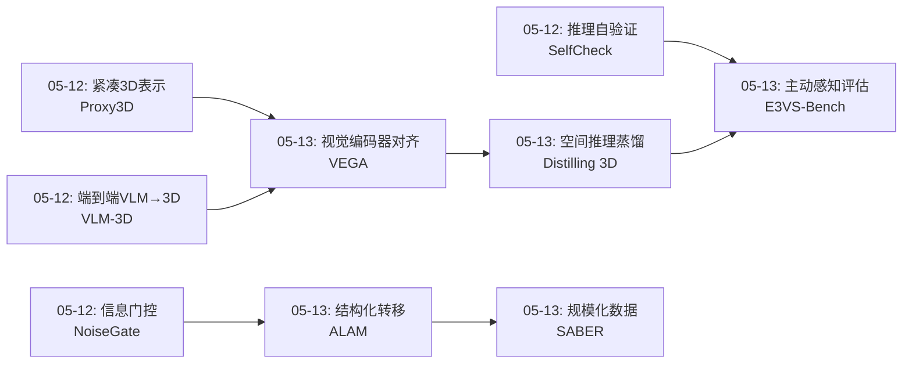
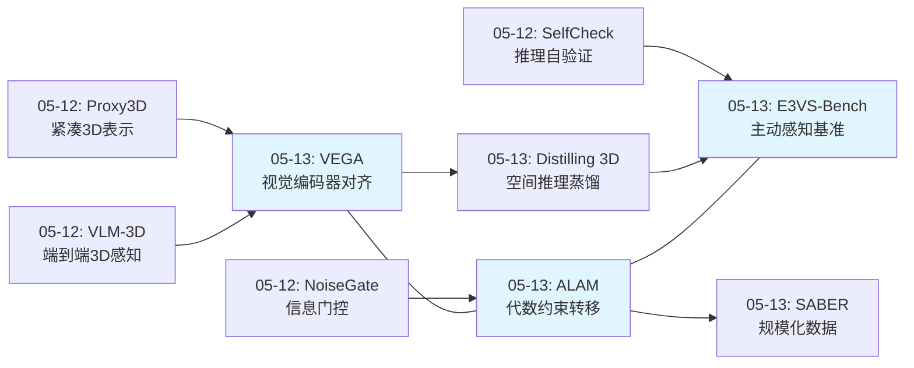
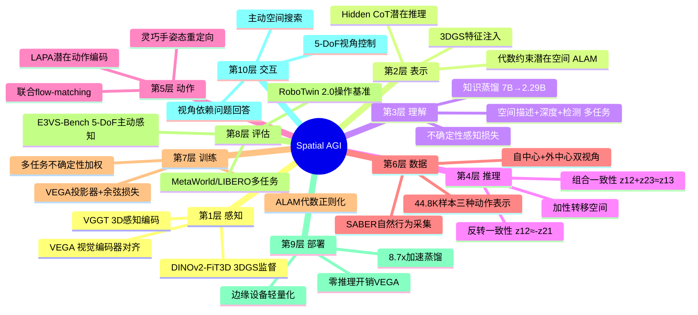
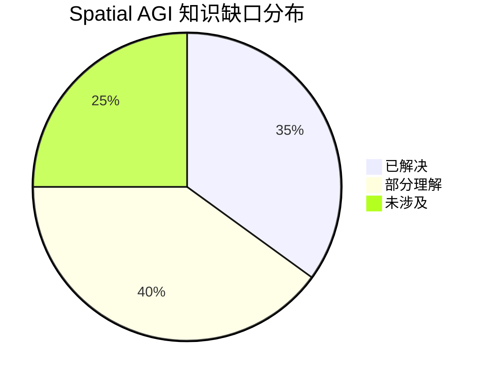

# 2026-05-13 每日思考：空间注入、结构化转移与主动感知——Spatial AGI的"表示-动作-评估"三位一体

---

## 🔗 与昨日思考的联系

### 昨日重点
昨日（05-12）从"闭环构建"深入到三个质量维度：NoiseGate信息门控（可靠性）、Proxy3D紧凑3D表示（效率）、SelfCheck推理自验证（可信度）、VLM-3D端到端空间感知。核心是提升Spatial AGI闭环的质量。

### 今日进展
今天从"提升闭环质量"转向三个正交方向的系统性建设：
- **VEGA**：在视觉编码器层面对齐3D感知特征——空间注入的最佳位置
- **ALAM**：通过代数约束构建结构化潜在转移空间——动作表示的几何基础
- **Distilling 3D Spatial**：知识蒸馏+Hidden CoT——空间推理的轻量化部署
- **SABER**：规模化自然行为采集——VLA领域适配的数据路径
- **E3VS-Bench**：5-DoF主动感知基准——空间智能的评估标准

**演进路径**：昨天的"提升闭环质量（可靠性/效率/可信度）" → 今天的"系统性建设三维"：空间注入怎么做（VEGA）、动作空间怎么结构化（ALAM）、效果怎么评（E3VS-Bench）。

### 演进图

---

## 🧠 方法论反思

### 今日论文选择策略
今天按"表示-动作-评估"三位一体选择论文：
- **表示维度**（VEGA、Distilling 3D）：如何将3D空间感知注入VLA/VLM
- **动作维度**（ALAM、SABER）：如何结构化动作空间和规模化采集数据
- **评估维度**（E3VS-Bench）：如何评估真正的空间智能

### 跨论文连接发现
今日最重要的跨论文发现：
1. **对齐层级的共识**：VEGA（视觉编码器层）和之前的VLM-3D（LoRA微调）都在追求"尽早注入空间感知"
2. **结构化胜过无结构**：ALAM的代数约束比LAPA的无约束潜在空间好得多，与NoiseGate的"模糊胜过清晰"形成有趣对比——不同任务需要不同的结构化程度
3. **评估驱动研究**：E3VS-Bench定义了"什么是好的空间智能"，VEGA和ALAM提供了实现路径，形成了从评估到方法的完整闭环

---

## 📅 每日总结

**日期**: 2026-05-13
**论文数量**: 5篇
**主题**: 空间注入、结构化转移、知识蒸馏、规模化数据与主动感知评估——构建Spatial AGI的表示-动作-评估三位一体

**关键突破**:
- 🚀 VEGA发现在视觉编码器输出层直接对齐3D感知特征（DINOv2-FiT3D），比在LLM层对齐更有效且零推理开销——"在语言纠缠之前注入空间感知"
- 🚀 ALAM通过组合+反转代数约束构建结构化潜在转移空间，比无约束基线减少25-85x的加性/反转误差，MetaWorld从47.9%→85.0%
- 🚀 E3VS-Bench首次定义5-DoF主动空间感知评估：99个3DGS场景+2014个视角依赖问题，揭示所有VLM与人类的巨大差距
- 🚀 SABER展示了无需遥操作的自然行为采集范式，100+小时店内采集44.8K样本，GR00T N1.6上2.19x提升
- 🚀 Distilling 3D首次在3D VLM蒸馏中引入Hidden CoT潜在推理，8.7x加速保留54-72%空间推理能力

**架构演进**: 10层（维持，但"表示层"和"评估层"显著增强）

### 📊 一句话总结
今天的五篇论文从三个维度系统性地建设Spatial AGI：VEGA和Distilling 3D解决了"如何注入空间感知"（表示维度），ALAM和SABER解决了"如何结构化动作"（动作维度），E3VS-Bench定义了"什么是好的空间智能"（评估维度）——三位一体缺一不可。

### 🔗 延续性
**昨日→今日**: 昨天的Proxy3D（紧凑3D表示）启发了VEGA的思考——与其压缩3D表示，不如在源头就注入3D感知。昨天的NoiseGate（信息门控）启发了ALAM——门控是关于"用多少信息"，代数约束是关于"信息如何结构化"。
**今日→明日**: 三位一体建立后，下一步是"统一"——能否在一个框架中同时实现VEGA式的空间注入、ALAM式的结构化动作、和E3VS-Bench式的主动评估？

### 💡 本质思考：如何达成通用空间智能

#### 1. 核心能力的本质是什么？
今天的论文揭示了一个关键洞察：**空间智能需要"在正确的位置、用正确的结构、按正确的标准"处理空间信息**。VEGA发现正确的位置是视觉编码器层（而非LLM层），ALAM发现正确的结构是代数约束的加性空间（而非无约束潜在空间），E3VS-Bench发现正确的标准是5-DoF主动感知（而非被动2D观察）。三者分别对应空间智能的**注入位置、表示结构和评估范式**。

#### 2. 当前方法与理想目标的差距在哪里？
最大差距在于**三个维度尚未统一**。VEGA的空间注入是"被动"的——它使VLA的视觉编码器具有3D感知，但不指导agent主动探索。ALAM的结构化转移是从视频中学习的，与VEGA的3DGS监督是独立的。E3VS-Bench定义了评估标准，但没有提供实现方法。理想状态下，Spatial AGI应该：用VEGA式方法注入空间感知 → 用ALAM式结构化表示规划动作 → 用E3VS-Bench式主动策略收集信息 → 循环迭代。

#### 3. 从今天到理想状态，最可能的路径是什么？
最可能的路径是**以E3VS-Bench为北极星指标，用VEGA+ALAM构建统一的感知-动作循环**：(1) 用VEGA式的视觉编码器对齐确保感知层具有3D空间感知；(2) 用ALAM式的代数约束构建结构化动作空间，使动作具有可组合性和可逆性；(3) 在此基础上引入E3VS-Bench式的主动感知策略，agent学会"在哪里看"和"如何移动以获取关键信息"；(4) SABER式的规模化数据采集为整个系统提供训练燃料。

---

## 📚 论文概览

1. **VEGA**（北大/北京人形机器人创新中心）：视觉编码器接地对齐框架。在DINOv2编码器输出层直接对齐DINOv2-FiT3D的3D感知特征，通过轻量级projector+余弦损失，推理时丢弃零开销。RoboTwin 2.0上67.5%/30.7%，SOTA隐式空间接地。核心洞察：在语言纠缠之前对齐。

2. **ALAM**（浙江大学）：代数一致潜在动作模型。通过组合一致性（z12+z23≈z13）和反转一致性（z12≈-z21）构建加性转移空间。联合flow-matching将潜在转移与机器人动作共同生成。MetaWorld MT50从47.9%→85.0%，LIBERO从94.1%→98.1%。

3. **Distilling 3D Spatial Reasoning**（未详细）：3D空间推理知识蒸馏。7B教师→2.29B学生，VGGT视觉编码器+多任务蒸馏+Hidden CoT潜在推理token。8.7x推理加速，3x模型缩小，保留54-72%空间推理能力。ScanNet/3D-FRONT上68-72%proximity/contact准确率。

4. **SABER**（DreamVu等）：规模化零售机器人动作数据集。100+小时自然店内采集，自中心+外中心双视角，44.8K样本覆盖三种动作表示（潜在动作/手部姿态/全身运动）。GR00T N1.6上10个零售任务29.3%（基线13.4%的2.19x）。

5. **E3VS-Bench**（Koya Sakamoto等）：5-DoF主动3D视觉搜索基准。99个3DGS场景，2014个视角依赖问题。评估SOTA VLM在主动感知上的表现，揭示与人类的巨大差距。首个系统评估5自由度视角控制下空间推理的基准。

---

## 💡 核心见解

### 见解1: 空间注入的最佳位置是视觉编码器层（VEGA）
- ✅ VEGA在视觉编码器输出层对齐，比在LLM层对齐更有效
- ✅ 推理时零开销，因为projector可丢弃
- ✅ 10k步达到基线60k步的性能，训练效率大幅提升

**对Spatial AGI的启发**: 空间信息应该在处理管线的最早期注入。一旦视觉特征进入LLM，空间结构就与语言语义纠缠，后续对齐的几何可解释性大幅降低。这类似于人类视觉系统——3D空间感知在视觉皮层（早期）就形成，而非在语言区（晚期）。

### 见解2: 动作空间需要代数约束而非自由学习（ALAM）
- ✅ 组合+反转约束减少25-85x的加性/反转误差
- ✅ 结构化潜在空间使flow-matching策略更高效
- ✅ 从无动作视频中学到的结构化转移直接迁移到机器人

**对Spatial AGI的启发**: 物理世界的动作具有内在的代数结构（可组合、可反转）。不施加这些约束的潜在动作模型会学到低效的表示。这与VEGA形成互补：VEGA在感知端注入结构（3DGS几何），ALAM在动作端注入结构（代数约束）。

### 见解3: 3D空间推理可以大幅压缩但代价显著（Distilling 3D）
- ✅ 7B→2.29B，8.7x加速
- ⚠️ 仅保留54-72%性能——近一半空间推理能力丢失
- ✅ Hidden CoT提供了一种无需显式推理数据的潜在推理机制

**对Spatial AGI的启发**: 空间推理的压缩是有损的，且损失不小。这意味着轻量级部署和精确空间推理之间存在根本张力。对于需要精确空间操作的任务（如精密装配），全尺寸模型可能不可替代。

### 见解4: 自然行为采集可替代遥操作（SABER）
- ✅ 100+小时自然店内采集，无需遥操作
- ✅ 双视角系统提供完整的空间信息
- ⚠️ 29.3%成功率仍低——数据质量vs动作重定向的权衡

**对Spatial AGI的启发**: 数据采集的可扩展性是Spatial AGI的关键瓶颈。SABER展示了绕过遥操作的可能路径，但当前成功率说明从人类行为到机器人动作的映射仍有很大改进空间。未来可能需要3DGS重建来提供更精确的空间标注。

### 见解5: 主动感知是空间智能的核心测试（E3VS-Bench）
- ✅ 首个5-DoF主动空间感知基准
- ✅ 3DGS提供真实感渲染，保持细粒度视觉细节
- ✅ 所有VLM与人类存在显著差距

**对Spatial AGI的启发**: 真正的空间智能不仅是被动理解3D场景，更是主动选择最佳视角来获取信息。这与VEGA和ALAM形成评估闭环：VEGA提供空间感知能力，ALAM提供结构化动作空间，E3VS-Bench定义了这两者应该达到什么标准。

### 见解6: 感知-动作-评估三位一体
VEGA（感知）、ALAM（动作）、E3VS-Bench（评估）形成了一个完整的技术三角。单独改进任何一角都有价值，但最大突破来自三者的协同。今天的论文第一次让这个三角的每一角都有了具体的实现方案。

**对Spatial AGI的启发**: Spatial AGI的研究不应只关注"如何做"（方法），还应同时关注"做什么"（动作结构）和"如何评"（评估标准）。三位一体的系统性思考比单一方向突破更有价值。

### 见解7: 代数约束与物理世界的深层联系
ALAM的组合性（A+B=C）和反转性（A→B可逆为B→A）对应了物理世界的基本性质。刚体运动群就是可组合和可逆的。这暗示Spatial AGI的动作表示应该反映物理世界的代数结构，而非用神经网络自由学习任意映射。

---

## 🗺️ 知识演进图

---

## 技术栈演进对比表

| 层次 | 昨日方案 | 今日方案 | 变化 |
|------|---------|---------|------|
| 1. 感知 | VLM-3D LoRA微调 | VEGA视觉编码器对齐 | 从"微调整个模型"到"仅对齐编码器输出" |
| 2. 表示 | Proxy3D语义代理 | VEGA+FiT3D 3DGS特征 | 从"压缩已有3D"到"注入原生3D感知" |
| 3. 理解 | SelfCheck自验证 | Hidden CoT潜在推理 | 从"后验验证"到"中间推理" |
| 4. 动作 | NoiseGate门控调度 | ALAM代数约束转移 | 从"用多少信息"到"信息如何结构化" |
| 5. 数据 | 标准遥操作数据 | SABER自然行为采集 | 从"遥操作"到"无机器人采集" |
| 6. 评估 | RoboTwin 2.0 | E3VS-Bench 5-DoF | 从"被动操作"到"主动空间感知" |
| 7. 部署 | 全尺寸模型 | Distilling 3D轻量化 | 从"7B"到"2.29B" |

---

## 🗺️ Spatial AGI 知识图谱

### 10层架构思维导图

### 🎯 主线技术路径

#### 阶段1: 被动空间感知（已完成）
- Proxy3D（紧凑3D表示）、VLM-3D（端到端3D感知）
- 核心：让VLM"看到"3D空间

#### 阶段2: 主动空间注入（今日突破）
- VEGA（视觉编码器对齐）、FiT3D（3DGS监督教师）
- 核心：在正确的位置、用正确的方式注入3D感知

#### 阶段3: 结构化动作空间（今日突破）
- ALAM（代数约束潜在转移）、联合flow-matching
- 核心：让动作具有物理世界的代数结构

#### 阶段4: 主动空间探索（定义标准）
- E3VS-Bench（5-DoF主动感知基准）
- 核心：定义"什么是好的空间智能"——不仅要理解，更要主动探索

#### 阶段5: 统一感知-动作-评估循环（未来目标）
- 将VEGA+ALAM+E3VS-Bench统一
- 核心：空间感知驱动结构化动作，主动评估指导下一步感知

---

## 🔍 待探索议题

### 高优先级（本周）

1. **VEGA与ALAM的统一**
   - 问题: 能否将VEGA的空间感知注入与ALAM的代数约束结合？
   - 候选方案: 用VEGA对齐的3D感知特征作为ALAM的视觉输入
   - 缺口: 两个方法的训练范式不同（对齐vs结构化生成）

2. **5-DoF主动感知策略学习**
   - 问题: 如何让VLA学会"在哪里看"？
   - 候选方案: 用E3VS-Bench定义奖励，训练主动视角选择策略
   - 缺口: 当前VLA都是被动接收视觉输入

3. **代数约束的物理基础**
   - 问题: ALAM的组合性和反转性是否对应物理世界的李群结构？
   - 候选方案: 将潜在转移空间设计为SE(3)子群
   - 缺口: 当前ALAM的约束是启发式的，非物理推导

### 中优先级（本月）

4. **自然行为采集+3DGS重建**
   - 问题: SABER的29.3%成功率能否通过3DGS空间标注提升？
   - 候选方案: 采集时同时用3DGS重建场景，提供精确3D标注
   - 缺口: 3DGS重建质量和实时性的权衡

5. **Hidden CoT的可解释性**
   - 问题: Hidden CoT的潜在token学到了什么空间推理模式？
   - 候选方案: 探针分析潜在token与空间属性的相关性
   - 缺口: 潜在推理的不可观察性

6. **空间注入的通用性**
   - 问题: VEGA的对齐方法是否适用于非DINOv2编码器？
   - 候选方案: 测试在SigLIP、ViT等其他编码器上的效果
   - 缺口: FiT3D教师是DINOv2专用的

7. **蒸馏空间推理的损失分析**
   - 问题: 54-72%的性能保留中，哪些空间能力丢失最多？
   - 候选方案: 按空间推理类型分析蒸馏前后的精度变化
   - 缺口: 缺乏细粒度的空间推理分类评估

### 低优先级（未来）

8. **零售场景Spatial AGI系统**
   - 问题: 能否用VEGA+ALAM+SABER构建端到端零售机器人？
   - 候选方案: 在SABER数据上用VEGA空间注入+ALAM结构化动作训练VLA
   - 缺口: 系统集成复杂度

9. **3DGS场景中的长期空间记忆**
   - 问题: E3VS-Bench的场景能否用于测试长期空间记忆？
   - 候选方案: 扩展E3VS-Bench到多场景连续导航任务
   - 缺口: 当前基准是单场景单任务

---

## 📊 知识缺口分析

**已解决（35%）**:
- ✅ 3D空间感知注入方法（VEGA、FiT3D）
- ✅ 视觉编码器级对齐优于LLM级对齐
- ✅ 动作空间的代数约束设计（ALAM）
- ✅ 5-DoF主动空间感知评估标准（E3VS-Bench）
- ✅ 空间推理的轻量化蒸馏可行性
- ✅ 规模化无遥操作数据采集范式

**部分理解（40%）**:
- ⚠️ 感知-动作-评估的统一框架
- ⚠️ 代数约束与物理世界李群的关系
- ⚠️ 空间推理蒸馏的损失类型分析
- ⚠️ 自然行为到机器人动作的高保真映射
- ⚠️ Hidden CoT学到的空间推理模式
- ⚠️ 主动视角选择策略的学习方法
- ⚠️ 不同3DGS质量对评估的影响

**未涉及（25%）**:
- ❌ 统一感知-动作-评估的端到端训练
- ❌ 多场景长期空间记忆
- ❌ 物理约束下的空间推理（碰撞、摩擦等）
- ❌ 跨具身形态的空间知识迁移
- ❌ 空间推理的理论极限（信息论角度）
